                 

### 文章标题：经典书籍：管理者构建知识体系的基石

> 关键词：管理者、知识体系、经典书籍、管理素养、战略规划、风险管理、企业可持续发展

> 摘要：本文旨在探讨经典书籍在管理者构建知识体系中的重要作用。通过对管理者的基本素养、战略规划、组织设计与文化、人力资源管理等关键领域的详细分析，本文揭示了经典书籍如何为管理者提供宝贵的知识和实践指导，帮助其构建坚实的知识体系，提升管理能力和决策水平。文章还介绍了经典书籍的学习方法和实际应用，以期为现代管理者提供有益的参考。

### 引言

在企业管理与发展的道路上，知识体系是管理者不可或缺的基石。一个完整、系统的知识体系不仅能帮助管理者全面理解企业管理的基本原理和实践方法，还能为他们在复杂多变的市场环境中做出明智的决策提供坚实的支持。然而，如何构建这样一个知识体系，却是一个值得深思的问题。

经典书籍作为人类智慧的结晶，承载了丰富的管理知识和实践经验。通过阅读和研究经典书籍，管理者可以跨越时间和空间的限制，汲取前人的智慧，为自己的知识体系注入新的活力。本文将围绕这一主题，详细探讨经典书籍在管理者构建知识体系中的重要作用。

本文将分为七个部分进行阐述。第一部分将讨论管理者的基本素养，包括角色定位和应具备的素养；第二部分将探讨领导力与团队管理，分析领导力的概念与类型，以及团队管理的方法与技巧；第三部分将深入战略规划与决策，介绍战略规划的概念与重要性，以及决策分析的方法与工具；第四部分将探讨组织设计与文化，分析组织结构的类型与优缺点，以及企业文化构建的策略与实践；第五部分将探讨人力资源管理的核心内容，包括员工招聘与选拔、员工培训与发展等；第六部分将探讨财务管理与绩效评估，分析财务管理的基本概念与目标，以及绩效评估体系设计；最后一部分将探讨风险管理与创新，分析风险管理的概念与原则，以及创新管理的策略与实践。通过这些部分的详细探讨，本文旨在帮助管理者构建一个完整、系统的知识体系，提升管理能力和决策水平。

### 第一部分：管理者的基本素养

#### 第1章：管理者角色定位

管理者的角色定位是构建知识体系的基础。在一个组织中，管理者不仅仅是执行者，更是领导者、协调者和决策者。他们需要理解自身的职责与义务，以有效地发挥管理职能。

**1.1 管理者的职责与义务**

管理者的职责可以归纳为以下几个方面：

- **领导与激励**：管理者需要领导团队，激发员工的积极性和创造力，确保团队目标与组织目标一致。
- **资源分配**：管理者需要合理分配组织资源，包括人力资源、财务资源和物质资源，以实现组织目标。
- **决策与规划**：管理者需要根据组织目标和市场环境，制定合理的战略规划和决策方案。
- **沟通与协调**：管理者需要有效地与内部和外部利益相关者进行沟通，确保信息传递的准确性和及时性。
- **绩效评估**：管理者需要制定科学的绩效评估体系，对团队成员的绩效进行评估，并提供反馈和激励。

管理者的义务主要包括：

- **维护组织利益**：管理者有义务确保组织的长期利益，而非短期利益。
- **提升团队绩效**：管理者有义务通过有效的管理和领导，提升团队的整体绩效。
- **遵守法律法规**：管理者有义务遵守相关法律法规，确保组织的运营符合法律要求。
- **社会责任**：管理者有义务承担社会责任，关注环境保护和社会福祉。

**1.2 管理者应具备的素养**

一个合格的管理者需要具备以下素养：

- **专业技能**：管理者应具备与自身岗位相关的基本技能，如财务管理、人力资源管理、市场营销等。
- **领导能力**：管理者应具备领导能力，包括愿景、决策、沟通、激励等。
- **决策能力**：管理者应具备良好的决策能力，能够在复杂多变的环境中做出明智的决策。
- **学习能力**：管理者应具备持续学习的能力，紧跟时代变化，不断更新知识体系。
- **团队合作能力**：管理者应具备良好的团队合作能力，能够协调团队成员，共同实现组织目标。
- **创新能力**：管理者应具备创新能力，能够推动组织进行技术创新和管理创新。

**核心概念与联系**

为了更好地理解管理者的角色定位，我们可以借助Mermaid流程图来展示管理者的职责与义务：

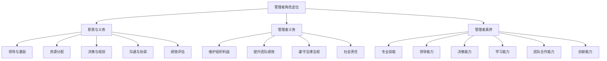

通过上述分析，我们可以看到，管理者的角色定位不仅涉及职责与义务，还包括一系列的素养。这些素养是构建管理者知识体系的基础，也是其在实际工作中取得成功的关键。

#### 第2章：领导力与团队管理

领导力是管理者不可或缺的核心能力。一个成功的领导者不仅需要具备优秀的个人素质，还需要掌握团队管理的方法与技巧。在这一章节中，我们将探讨领导力的概念与类型，以及团队管理的方法与技巧。

**2.1 领导力的概念与类型**

领导力是一种影响力，是领导者通过激励和引导，使团队成员为实现组织目标而努力工作的能力。领导力可以分为多种类型，每种类型都有其独特的特点和应用场景。

- **权威型领导**：权威型领导者通过严格的规定和规章制度来确保团队的高效运作。他们具有高度的决策权和控制力，能够迅速做出决策并确保执行。
- **参与型领导**：参与型领导者鼓励团队成员参与决策过程，增强团队的参与感和责任感。这种领导风格能够激发团队成员的积极性和创造力，适合创新和变革型组织。
- **变革型领导**：变革型领导者具有强烈的愿景和使命感，能够激励团队成员追求更高的目标和更大的成就。他们通过变革和创新，推动组织持续发展。
- **服务型领导**：服务型领导者关注团队成员的需求和福祉，将团队成员的利益置于组织利益之上。他们通过提供支持和帮助，帮助团队成员实现个人目标和职业发展。

**2.2 团队管理的方法与技巧**

团队管理是领导者的重要职责之一。有效的团队管理能够提升团队的整体绩效，实现组织目标。以下是一些团队管理的方法与技巧：

- **明确目标**：领导者需要明确团队的目标，并将其分解为具体的任务和行动计划。团队成员需要明确自己的职责和目标，以便更好地协作和合作。
- **激励与奖励**：领导者需要根据团队成员的表现，提供适当的激励和奖励。这可以包括奖金、晋升、荣誉等，以激发团队成员的积极性和创造力。
- **沟通与反馈**：领导者需要保持与团队成员的沟通，了解他们的需求和困惑，并及时给予反馈。这可以帮助团队成员更好地理解工作要求，提高工作效率。
- **团队建设**：领导者需要通过团队建设活动，增强团队成员之间的信任和合作。这可以包括团队培训、团建活动等，以提高团队的凝聚力和战斗力。
- **决策参与**：领导者需要鼓励团队成员参与决策过程，增强他们的责任感和归属感。这可以包括定期召开团队会议、征集团队成员的意见和建议等。

**核心概念与联系**

为了更好地理解领导力的概念与类型，我们可以借助Mermaid流程图来展示不同的领导力类型及其特点：

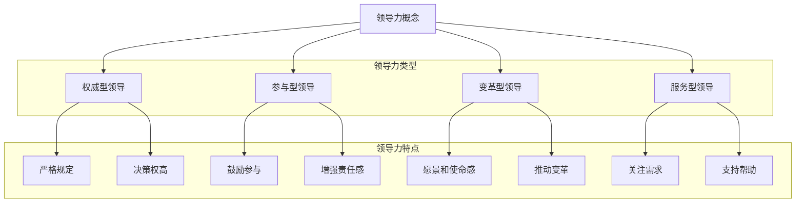

通过上述分析，我们可以看到，领导力不仅涉及不同的领导风格，还包括一系列的管理方法和技巧。这些方法和技巧是构建团队管理知识体系的基础，也是领导者在实际工作中取得成功的关键。

#### 第3章：战略规划概述

战略规划是管理者的重要职责之一，它关系到组织的长远发展和竞争力。在这一章节中，我们将深入探讨战略规划的概念与重要性，以及战略规划的步骤与方法。

**3.1 战略规划的概念与重要性**

战略规划是一个系统性的过程，旨在确定组织的长远目标和实现这些目标的策略。战略规划不仅关注组织的内部环境，还考虑外部环境的变化和机遇与挑战。

- **战略规划的概念**：战略规划是一种长期、全面的规划，旨在确定组织的愿景、使命和目标，并制定实现这些目标的策略。它涉及组织的高层管理，是组织决策的核心。
- **战略规划的重要性**：战略规划对于组织的成功至关重要。它能够帮助组织明确发展方向，优化资源配置，提高竞争力。具体来说，战略规划具有以下重要性：
  - **指导组织发展**：战略规划为组织提供了明确的发展方向和目标，使组织在复杂多变的环境中保持清晰的发展路径。
  - **优化资源配置**：战略规划有助于组织优化资源配置，确保资源用于最有价值的领域，提高资源利用效率。
  - **提高竞争力**：战略规划使组织能够抓住市场机遇，应对外部挑战，提高竞争力。
  - **促进创新**：战略规划鼓励组织进行创新，通过创新来提升组织的核心竞争力和市场地位。

**3.2 战略规划的步骤与方法**

战略规划是一个复杂的过程，需要经过多个步骤和方法。以下是战略规划的基本步骤：

- **环境分析**：环境分析是战略规划的第一步，旨在了解组织所处的市场环境、行业趋势和竞争状况。通过环境分析，管理者可以识别外部机会和威胁，为制定战略提供依据。
- **内部分析**：内部分析旨在了解组织的内部资源、能力和优势与劣势。通过内部分析，管理者可以识别组织的核心竞争力，为制定战略提供依据。
- **目标设定**：目标设定是战略规划的核心步骤，旨在确定组织的长远目标和短期目标。这些目标应该具体、可衡量、可实现，并与组织的使命和愿景保持一致。
- **策略选择**：策略选择是在目标设定的基础上，确定实现目标的策略和方法。策略选择应考虑外部环境和内部资源的匹配，以确保战略的有效性。
- **实施与监控**：实施与监控是战略规划的最后一步，旨在确保战略的有效实施和及时调整。实施与监控包括制定详细的行动计划、分配资源、建立绩效评估体系等。

在战略规划过程中，管理者可以采用以下方法：

- **SWOT分析**：SWOT分析是一种常用的战略规划方法，用于分析组织的优势（Strengths）、劣势（Weaknesses）、机会（Opportunities）和威胁（Threats）。通过SWOT分析，管理者可以全面了解组织的内外部环境，制定更有效的战略。
- **PEST分析**：PEST分析是一种用于分析外部环境的方法，包括政治（Political）、经济（Economic）、社会（Social）和技术（Technological）因素。通过PEST分析，管理者可以了解外部环境的变化趋势和潜在影响，为战略规划提供依据。
- **波特五力模型**：波特五力模型用于分析行业竞争状况，包括供应商（Suppliers）、买家（Buyers）、潜在竞争者（Potential Rivals）、替代品（Substitutes）和现有竞争者（Existing Rivals）。通过波特五力模型，管理者可以了解行业的竞争格局和潜在风险。

**核心概念与联系**

为了更好地理解战略规划的概念和步骤，我们可以借助Mermaid流程图来展示战略规划的基本流程：

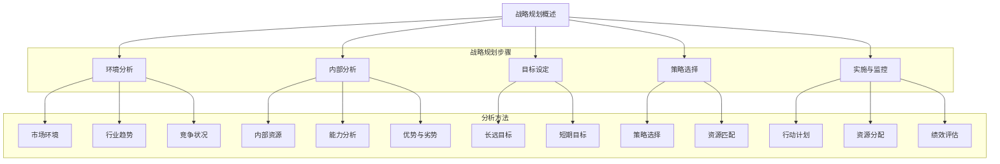

通过上述分析，我们可以看到，战略规划是一个系统性的过程，需要经过多个步骤和方法。这些步骤和方法是构建管理者战略规划知识体系的基础，也是实现组织长远发展的关键。

### 第4章：决策分析

决策分析是管理者在实际工作中必不可少的一部分。一个有效的决策分析过程不仅能帮助管理者做出明智的决策，还能提高决策的效率和质量。在这一章节中，我们将探讨决策过程与决策模型，以及决策工具与方法。

**4.1 决策过程**

决策过程是指管理者在面临问题或机会时，通过一系列步骤做出决策的过程。决策过程可以分为以下几个阶段：

1. **问题识别**：管理者首先需要识别问题或机会，明确决策的目标和背景。这一阶段需要收集和分析相关信息，了解问题的性质和影响。
2. **目标设定**：在明确问题后，管理者需要设定决策目标。目标应该具体、可衡量、可实现，并与组织的长远目标和愿景保持一致。
3. **方案生成**：管理者需要生成多个可能的解决方案，以便比较和评估。方案生成可以通过头脑风暴、专家咨询、模拟实验等方法进行。
4. **方案评估**：管理者需要评估每个方案的优缺点，包括成本、风险、效益等。评估方法可以采用定量分析、定性分析、成本效益分析等。
5. **决策选择**：在评估方案后，管理者需要选择最优或最满意的方案。决策选择应考虑多种因素，包括可行性、效益、风险等。
6. **实施与监控**：决策选择后，管理者需要制定详细的行动计划，并实施决策。同时，管理者需要监控决策的实施过程，及时调整和优化决策。

**4.2 决策模型**

决策模型是用于分析决策过程的数学模型或算法。决策模型可以分为以下几种类型：

- **确定型决策模型**：确定型决策模型是在已知条件和变量值的情况下做出决策。常见的确定型决策模型包括线性规划、目标规划、整数规划等。
- **不确定型决策模型**：不确定型决策模型是在变量值不确定的情况下做出决策。常见的不确定型决策模型包括期望值模型、机会集模型、模糊决策模型等。
- **风险型决策模型**：风险型决策模型是在存在不确定性和风险的情况下做出决策。常见的风险型决策模型包括决策树、贝叶斯决策、蒙特卡罗模拟等。

**4.3 决策工具与方法**

在决策分析过程中，管理者可以使用多种工具与方法来辅助决策。以下是一些常用的决策工具与方法：

- **头脑风暴**：头脑风暴是一种集体创造性思维的方法，通过集思广益，生成多个可能的解决方案。
- **SWOT分析**：SWOT分析是一种用于评估企业或项目的优势、劣势、机会和威胁的方法。
- **决策树**：决策树是一种用于分析决策过程和结果的方法，通过绘制树状图，展示不同的决策路径和结果。
- **成本效益分析**：成本效益分析是一种用于评估决策成本和效益的方法，通过比较成本和效益，选择最优方案。
- **敏感性分析**：敏感性分析是一种用于评估决策结果对变量值敏感程度的方法，通过分析变量值的变化，预测决策结果的变化。
- **模拟实验**：模拟实验是一种通过模拟实验环境，分析决策结果的方法。通过模拟实验，管理者可以了解不同决策方案在现实环境中的表现。

**核心概念与联系**

为了更好地理解决策过程与决策模型，我们可以借助Mermaid流程图来展示决策过程和决策模型：

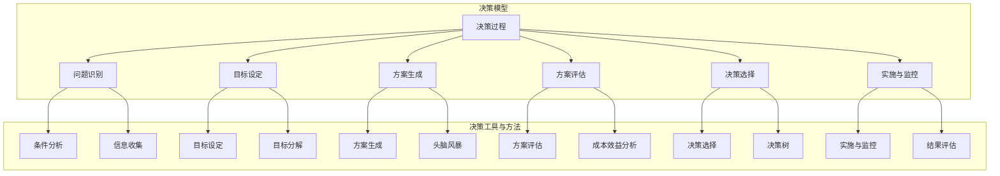

通过上述分析，我们可以看到，决策过程和决策模型是构建管理者决策知识体系的基础。这些工具与方法不仅有助于管理者在实际工作中做出明智的决策，还能提高决策的效率和质量。

### 第5章：组织结构设计

组织结构设计是企业管理的重要组成部分，它关系到组织的运作效率和管理效果。在这一章节中，我们将探讨组织结构的类型与优缺点，以及组织结构设计的原则与方法。

**5.1 组织结构的类型与优缺点**

组织结构可以分为多种类型，每种类型都有其独特的特点和应用场景。以下是几种常见的组织结构类型及其优缺点：

- **职能型组织结构**：职能型组织结构按照职能将组织划分为不同的部门，如市场营销部、财务部、生产部等。优点是分工明确，职责清晰，有利于专业化管理。缺点是部门之间协调困难，信息传递不畅，可能导致决策缓慢。
- **事业部型组织结构**：事业部型组织结构将组织划分为多个独立的事业部，每个事业部负责特定的产品或市场。优点是权力下放，有利于快速响应市场变化，提高决策效率。缺点是事业部之间协调困难，资源分散，可能导致资源浪费。
- **矩阵型组织结构**：矩阵型组织结构结合了职能型和事业部型的特点，将组织划分为多个矩阵单元，每个单元由职能经理和产品经理共同负责。优点是灵活性强，有利于跨部门协作，提高创新能力。缺点是管理层次复杂，权力分配不明确，可能导致冲突。
- **网络型组织结构**：网络型组织结构是一种扁平化的组织结构，通过外包、联盟等形式，将组织与外部合作伙伴紧密连接。优点是灵活性高，能够快速响应市场变化，降低运营成本。缺点是组织内部协调困难，对外部依赖性较强。

**5.2 组织结构设计的原则与方法**

组织结构设计应遵循以下原则：

- **适应性原则**：组织结构设计应与组织的战略目标和环境相适应。随着组织战略和环境的变化，组织结构也应进行相应的调整。
- **灵活性原则**：组织结构设计应具有一定的灵活性，能够快速适应市场变化和内部需求。这可以通过跨部门协作、矩阵型结构等形式实现。
- **分工与协作原则**：组织结构设计应明确各部门和个人的职责，同时促进部门之间的协作。这可以通过职能型结构、网络型结构等形式实现。
- **效率原则**：组织结构设计应提高组织的运作效率，减少冗余和重复工作。这可以通过扁平化结构、外包等形式实现。
- **创新原则**：组织结构设计应鼓励创新，提供支持创新的环境和机制。这可以通过矩阵型结构、网络型结构等形式实现。

在组织结构设计过程中，管理者可以采用以下方法：

- **流程分析法**：通过分析组织内部的业务流程，确定各部门和个人的职责和协作关系，设计合适的组织结构。
- **权变理论**：根据组织的战略目标和环境，选择合适的组织结构类型。例如，在快速变化的市场环境中，可以选择事业部型或网络型结构。
- **系统思考法**：从整体角度考虑组织结构设计，分析各部门和个人的关系和互动，确保组织结构的整体优化。

**核心概念与联系**

为了更好地理解组织结构的类型与优缺点，我们可以借助Mermaid流程图来展示不同类型的组织结构：

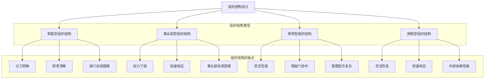

通过上述分析，我们可以看到，组织结构设计不仅关系到组织的运作效率和管理效果，还影响组织的创新能力和市场竞争力。管理者应根据组织的战略目标和环境，选择合适的组织结构类型，并遵循组织结构设计的原则和方法，以实现组织的长期发展。

### 第6章：企业文化

企业文化是组织的重要组成部分，它是组织价值观、信念和行为方式的集中体现。一个良好的企业文化能够激发员工的积极性和创造力，提高组织的整体绩效。在这一章节中，我们将探讨企业文化的概念与作用，以及企业文化构建的策略与实践。

**6.1 企业文化的概念与作用**

企业文化是指组织在长期发展过程中形成的共同价值观、信念和行为方式。企业文化可以包括以下几个方面：

- **价值观**：价值观是企业文化的基础，它决定了组织的经营理念、道德标准和行为准则。例如，诚信、创新、合作等价值观。
- **信念**：信念是企业文化的重要组成部分，它体现了组织对未来的信心和对自身使命的坚定追求。例如，追求卓越、持续改进等信念。
- **行为方式**：行为方式是企业文化的具体体现，它反映了组织成员在工作中的行为习惯和行为准则。例如，尊重他人、团队合作等行为方式。

企业文化在组织中的作用主要体现在以下几个方面：

- **凝聚员工**：良好的企业文化能够凝聚员工，形成共同的价值观和行为准则，增强组织的凝聚力和向心力。
- **激励员工**：良好的企业文化能够激发员工的积极性和创造力，使员工在工作中有更多的动力和热情。
- **塑造品牌**：良好的企业文化能够塑造组织的品牌形象，提升组织的知名度和美誉度。
- **提升绩效**：良好的企业文化能够提高组织的整体绩效，促进组织的可持续发展。

**6.2 企业文化构建的策略与实践**

构建企业文化需要长期的努力和持续的实践。以下是一些企业文化构建的策略和实践：

- **明确价值观**：组织应明确自己的核心价值观，并将其传达给所有员工。核心价值观应该是组织共同认同和遵循的原则。
- **建立共识**：组织应通过沟通和讨论，建立员工对企业文化的共识，使员工能够深刻理解企业文化的内涵和意义。
- **领导示范**：领导者的行为是企业文化的关键因素。领导者应以身作则，带头践行企业文化，树立良好的榜样。
- **培训与教育**：组织应定期开展企业文化培训和教育活动，使员工能够深入理解企业文化，并将其内化为自己的行为准则。
- **制度保障**：组织应建立相应的制度保障，确保企业文化能够在实际工作中得到贯彻执行。例如，制定员工行为规范、绩效评估体系等。
- **文化建设**：组织应注重企业文化的文化建设，通过文化活动、文化宣传等形式，营造积极向上的文化氛围。
- **反馈与改进**：组织应定期收集员工对企业文化的反馈，了解企业文化的实施情况，及时调整和改进企业文化。

**核心概念与联系**

为了更好地理解企业文化的概念与作用，我们可以借助Mermaid流程图来展示企业文化的构成和作用：

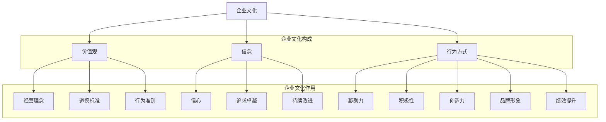

通过上述分析，我们可以看到，企业文化不仅反映了组织的价值观和信念，还对组织的凝聚力和绩效产生重要影响。管理者应重视企业文化的建设，通过明确价值观、建立共识、领导示范、培训与教育等策略，营造积极向上的企业文化，提升组织的整体竞争力。

### 第7章：员工招聘与选拔

员工招聘与选拔是人力资源管理的重要组成部分，它关系到组织的整体发展和竞争力。在这一章节中，我们将探讨员工招聘渠道与方法，以及员工选拔流程与技巧。

**7.1 员工招聘渠道与方法**

员工招聘渠道是指组织用于寻找和吸引潜在员工的方式。以下是一些常见的员工招聘渠道：

- **内部招聘**：内部招聘是指组织从内部员工中选拔合适的人才填补空缺。内部招聘的优点是员工熟悉组织文化，工作衔接顺畅，有利于保持组织稳定。缺点是人才储备有限，可能导致人才断层。
- **外部招聘**：外部招聘是指组织从外部市场寻找和吸引人才。外部招聘的优点是人才来源广泛，有利于引进新思想和新技术。缺点是招聘周期较长，成本较高。
- **社交媒体招聘**：社交媒体招聘是通过社交媒体平台发布招聘信息，吸引潜在应聘者。社交媒体招聘的优点是传播速度快，覆盖面广，缺点是招聘信息的真实性难以保证。
- **招聘会**：招聘会是指组织参加各类招聘活动，直接与求职者面对面交流。招聘会的优点是能够快速吸引大量求职者，缺点是招聘成本较高，且人才质量难以保证。
- **猎头招聘**：猎头招聘是指组织委托专业猎头公司寻找和推荐合适的人才。猎头招聘的优点是能够快速找到高素质的人才，缺点是成本较高。

在选择员工招聘渠道时，组织应综合考虑招聘成本、招聘速度、人才质量等因素，选择最合适的招聘渠道。

员工招聘方法包括以下几种：

- **职位发布**：职位发布是指组织在各类招聘渠道上发布招聘信息，吸引求职者申请。职位发布应包括职位描述、职位要求、薪酬福利等信息。
- **简历筛选**：简历筛选是指组织对收到的简历进行筛选，挑选出符合条件的候选人。简历筛选应注重候选人的教育背景、工作经验、技能和能力。
- **面试**：面试是组织对候选人进行进一步了解和评估的过程。面试可以分为初步面试和最终面试，通过面试，组织可以评估候选人的能力、素质和潜力。
- **背景调查**：背景调查是指组织对候选人的历史、教育背景、工作经历等进行调查，以确保候选人的真实性和可靠性。

**7.2 员工选拔流程与技巧**

员工选拔流程包括以下几个步骤：

1. **职位分析**：职位分析是指对职位进行详细分析，确定职位要求、工作内容、工作环境等信息。职位分析是员工选拔的基础，有助于组织制定招聘计划和选拔标准。
2. **招聘计划**：招聘计划是指组织根据职位分析结果，制定招聘目标和招聘策略。招聘计划应包括招聘时间、招聘渠道、招聘预算等信息。
3. **职位发布**：职位发布是指组织在各类招聘渠道上发布招聘信息，吸引求职者申请。职位发布应包括职位描述、职位要求、薪酬福利等信息。
4. **简历筛选**：简历筛选是指组织对收到的简历进行筛选，挑选出符合条件的候选人。简历筛选应注重候选人的教育背景、工作经验、技能和能力。
5. **面试**：面试是组织对候选人进行进一步了解和评估的过程。面试可以分为初步面试和最终面试，通过面试，组织可以评估候选人的能力、素质和潜力。
6. **背景调查**：背景调查是指组织对候选人的历史、教育背景、工作经历等进行调查，以确保候选人的真实性和可靠性。
7. **选拔决策**：选拔决策是指组织根据面试和背景调查结果，确定最终候选人。选拔决策应综合考虑候选人的能力、素质、潜力等因素。
8. **录用通知**：录用通知是指组织向最终候选人发出录用通知，候选人确认接受录用后，组织应办理入职手续。

在员工选拔过程中，管理者应注重以下几点：

- **公平公正**：员工选拔过程应公平公正，避免歧视和偏见，确保每个候选人都有公平的机会。
- **科学合理**：员工选拔应采用科学合理的方法，如面试、测评等，全面评估候选人的能力、素质和潜力。
- **信息透明**：员工选拔过程应保持信息透明，及时向候选人反馈选拔结果，确保候选人的知情权。
- **持续改进**：员工选拔过程应不断改进和优化，根据选拔结果和反馈，调整选拔策略和方法，提高选拔效率和质量。

**核心概念与联系**

为了更好地理解员工招聘与选拔的过程和技巧，我们可以借助Mermaid流程图来展示员工选拔流程：

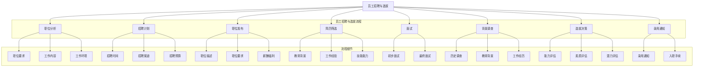

通过上述分析，我们可以看到，员工招聘与选拔是一个复杂的过程，需要经过多个步骤和环节。管理者应注重公平公正、科学合理、信息透明和持续改进，以提高选拔效率和质量，为组织引进优秀的人才。

### 第8章：员工培训与发展

员工培训与发展是人力资源管理的重要组成部分，它关系到组织的竞争力和可持续发展。在这一章节中，我们将探讨员工培训计划与实施，以及员工职业发展规划。

**8.1 员工培训计划与实施**

员工培训计划是组织根据发展需求和员工个人发展目标，制定的系统化、制度化的培训规划。员工培训计划的实施包括以下几个步骤：

1. **需求分析**：需求分析是制定培训计划的基础，通过对组织战略目标、业务需求、员工现状的分析，确定培训需求和培训内容。需求分析可以通过问卷调查、面谈、观察等方法进行。
2. **培训计划制定**：在需求分析的基础上，组织应制定详细的培训计划，包括培训目标、培训内容、培训方式、培训时间、培训预算等。培训计划应与组织战略目标、业务需求和员工个人发展目标相结合。
3. **培训课程设计**：培训课程设计是培训计划的核心，应根据培训目标和培训内容，设计适合的培训课程。培训课程可以包括专业知识、技能培训、领导力培训等。
4. **培训资源准备**：培训资源准备包括培训教材、培训场地、培训师资等。组织应确保培训资源的充足和优质，以提高培训效果。
5. **培训实施**：培训实施是培训计划的关键环节，包括培训课程的开展、培训过程的监控和培训效果的评估。在培训过程中，组织应注重学员的参与和互动，提高培训的吸引力和实效性。
6. **培训效果评估**：培训效果评估是检验培训计划实施效果的重要手段，通过评估，组织可以了解培训目标是否达成，培训内容是否适用，培训方式是否有效等。培训效果评估可以通过问卷调查、面谈、测试等方法进行。

**8.2 员工职业发展规划**

员工职业发展规划是组织根据员工个人发展需求和组织的战略发展需要，制定的员工职业发展计划。员工职业发展规划包括以下几个方面：

1. **职业规划设计**：职业规划设计是员工职业发展规划的基础，员工应根据自身兴趣、能力和职业目标，制定个人职业规划。职业规划应明确职业发展方向、职业目标、实现路径等。
2. **能力提升**：能力提升是员工职业发展规划的核心，员工应通过培训、学习、实践等方式，提升自身能力和技能，以实现职业目标。组织应提供多样化的学习和成长机会，支持员工能力提升。
3. **职业发展评估**：职业发展评估是员工职业发展规划的重要环节，通过评估，组织可以了解员工职业发展目标的实现情况，为员工提供职业发展指导和支持。职业发展评估可以通过绩效评估、能力测评等方法进行。
4. **职业发展路径**：职业发展路径是员工职业发展规划的具体实施步骤，包括晋升路径、岗位调整、项目参与等。组织应根据员工职业发展评估结果，为员工提供合适的职业发展路径。
5. **激励机制**：激励机制是员工职业发展规划的重要保障，组织应建立科学合理的激励机制，激发员工的工作积极性和职业发展动力。激励机制可以包括薪酬激励、晋升激励、荣誉激励等。

**核心概念与联系**

为了更好地理解员工培训与发展，我们可以借助Mermaid流程图来展示员工培训与发展流程：

```mermaid
graph TD
    A[员工培训与发展] --> B[需求分析]
    A --> C[培训计划制定]
    A --> D[培训课程设计]
    A --> E[培训资源准备]
    A --> F[培训实施]
    A --> G[培训效果评估]
    B --> H[战略目标]
    B --> I[业务需求]
    B --> J[员工现状]
    C --> K[培训目标]
    C --> L[培训内容]
    C --> M[培训方式]
    C --> N[培训时间]
    C --> O[培训预算]
    D --> P[专业知识]
    D --> Q[技能培训]
    D --> R[领导力培训]
    E --> S[培训教材]
    E --> T[培训场地]
    E --> U[培训师资]
    F --> V[培训课程开展]
    F --> W[培训过程监控]
    F --> X[培训效果评估]
    G --> Y[培训目标达成情况]
    G --> Z[培训内容适用性]
    G --> AA[培训方式有效性]
    B --> BB[职业规划设计]
    B --> CC[能力提升]
    B --> DD[职业发展评估]
    B --> EE[职业发展路径]
    B --> FF[激励机制]

    subgraph 员工培训与发展流程
        B
        C
        D
        E
        F
        G
    end

    subgraph 职业发展规划
        BB
        CC
        DD
        EE
        FF
    end
```

通过上述分析，我们可以看到，员工培训与发展是一个系统化的过程，需要从需求分析、培训计划制定、培训课程设计、培训资源准备、培训实施到培训效果评估等多个环节进行。同时，员工职业发展规划也是员工培训与发展的重要方面，通过职业规划设计、能力提升、职业发展评估、职业发展路径和激励机制等环节，帮助员工实现职业目标，提升组织整体竞争力。

### 第9章：财务管理基础

财务管理是企业管理的重要组成部分，它关系到组织的资金流动、资源配置和经济效益。在这一章节中，我们将探讨财务管理的基本概念与目标，以及财务报表分析。

**9.1 财务管理的基本概念与目标**

财务管理是指组织通过财务手段和策略，对资金进行有效管理和配置，实现组织财务目标的过程。财务管理的基本概念包括：

- **资金管理**：资金管理是指组织对资金进行筹集、运用和监控的过程，确保资金的合理流动和有效利用。
- **成本控制**：成本控制是指组织通过预算编制、成本分析和成本控制措施，降低成本、提高经济效益。
- **投资管理**：投资管理是指组织对投资活动进行规划、评估和管理，确保投资的有效性和收益性。
- **风险管理**：风险管理是指组织对财务风险进行识别、评估和管理，降低财务风险对组织的负面影响。
- **收益分配**：收益分配是指组织根据财务状况和经营成果，合理分配利润、股利和其他收益。

财务管理的目标包括：

- **保证资金安全**：确保组织拥有足够的资金，以应对日常运营和突发情况，防止资金短缺和财务风险。
- **提高经济效益**：通过有效的资金管理和成本控制，提高组织的经济效益和盈利能力。
- **实现长期发展**：通过合理的投资管理和收益分配，确保组织的长期稳定发展。
- **满足利益相关者需求**：满足股东、债权人、员工和其他利益相关者的财务需求，维护组织的声誉和稳定。

**9.2 财务报表分析**

财务报表分析是管理者通过财务报表，对组织的财务状况、经营成果和现金流量进行分析和评价的过程。财务报表分析包括以下几个方面：

- **资产负债表分析**：资产负债表分析主要关注组织的资产、负债和所有者权益。通过分析资产负债表，管理者可以了解组织的资产结构、负债水平和财务稳定性。
  - **流动资产分析**：分析流动资产的比例、结构和发展趋势，评估组织的短期偿债能力和流动性。
  - **固定资产分析**：分析固定资产的构成、使用效率和折旧政策，评估组织的中长期资产配置和投资效益。
  - **负债分析**：分析负债的种类、比例和期限，评估组织的负债水平和债务风险。
- **利润表分析**：利润表分析主要关注组织的收入、成本和利润。通过分析利润表，管理者可以了解组织的盈利能力、成本控制和经营效率。
  - **收入分析**：分析收入的结构、增长率和变化趋势，评估组织的市场占有率和收入增长潜力。
  - **成本分析**：分析成本的结构、比例和变化趋势，评估组织的成本控制和盈利能力。
  - **利润分析**：分析利润的构成、比例和变化趋势，评估组织的盈利能力和经济效益。
- **现金流量表分析**：现金流量表分析主要关注组织的现金流入和流出。通过分析现金流量表，管理者可以了解组织的现金流动状况、现金流来源和用途，评估组织的财务稳定性和现金管理能力。
  - **经营现金流分析**：分析经营活动产生的现金流量，评估组织的现金生成能力和经营活动效益。
  - **投资现金流分析**：分析投资活动产生的现金流量，评估组织的投资收益和投资决策有效性。
  - **筹资现金流分析**：分析筹资活动产生的现金流量，评估组织的筹资能力和资金结构。

**核心概念与联系**

为了更好地理解财务报表分析，我们可以借助Mermaid流程图来展示财务报表分析的流程和关键要素：

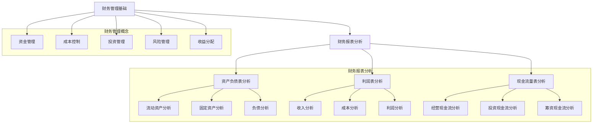

通过上述分析，我们可以看到，财务管理涉及多个方面，包括资金管理、成本控制、投资管理、风险管理和收益分配等。财务报表分析是管理者评估组织财务状况、经营成果和现金流量的重要手段，通过资产负债表、利润表和现金流量表的分析，管理者可以全面了解组织的财务状况和经营成果，为决策提供依据。

### 第10章：绩效评估与激励

绩效评估与激励是人力资源管理的重要组成部分，它关系到组织的整体绩效和员工的积极性和满意度。在这一章节中，我们将探讨绩效评估体系设计，以及激励机制与绩效管理。

**10.1 绩效评估体系设计**

绩效评估体系设计是组织根据战略目标和业务需求，制定科学合理的绩效评估体系，对员工的工作绩效进行评估的过程。绩效评估体系设计包括以下几个方面：

1. **绩效指标设定**：绩效指标是评估员工工作绩效的具体标准，包括定量指标和定性指标。定量指标包括销售额、生产量、客户满意度等，定性指标包括工作态度、团队合作能力、创新能力等。设定绩效指标时，应确保指标的具体性、可衡量性和相关性。
2. **评估周期设定**：评估周期是指绩效评估的时间周期，包括月度、季度、年度等。评估周期应与组织的战略目标和业务周期相匹配，以确保绩效评估的有效性。
3. **评估方法选择**：评估方法是指用于评估员工绩效的具体工具和方法，包括自我评估、同事评估、上级评估、360度评估等。选择评估方法时，应考虑评估的客观性、公平性和全面性。
4. **评估结果应用**：评估结果应用是指将绩效评估结果应用于员工晋升、薪酬调整、培训发展等人力资源管理活动中。评估结果应用应体现公正、公平、公开的原则，激发员工的积极性和创造力。
5. **反馈与改进**：反馈与改进是指组织根据绩效评估结果，对员工进行反馈和指导，帮助员工改进工作绩效。反馈与改进应注重沟通和协作，使员工明确自身的优势和不足，制定改进计划。

**10.2 激励机制与绩效管理**

激励机制是指组织通过薪酬、晋升、荣誉等手段，激发员工的积极性和创造力，提高员工的工作绩效。激励机制与绩效管理密切相关，以下是一些常见的激励机制：

1. **薪酬激励**：薪酬激励是通过提供具有竞争力的薪酬，激发员工的积极性和工作动力。薪酬激励包括基本工资、绩效工资、奖金等。设定薪酬激励时，应考虑员工的岗位价值、市场薪酬水平和员工的工作表现。
2. **晋升激励**：晋升激励是通过提供晋升机会，激发员工的工作热情和进取心。晋升激励包括内部晋升和外部晋升。组织应建立科学合理的晋升机制，确保员工的晋升机会公平、公开、公正。
3. **荣誉激励**：荣誉激励是通过授予员工荣誉称号、奖励等方式，激发员工的荣誉感和成就感。荣誉激励包括优秀员工奖、杰出贡献奖、最佳团队奖等。组织应定期开展评选活动，表彰员工的优秀表现。
4. **职业发展激励**：职业发展激励是通过提供职业发展机会，激发员工的长期发展动力。职业发展激励包括培训发展、职业规划、项目参与等。组织应关注员工的职业发展需求，为员工提供多样化的职业发展路径。

在绩效管理中，激励机制的应用至关重要。以下是一些绩效管理的关键点：

1. **明确目标**：组织应明确绩效管理的目标，包括提高员工的工作绩效、提升组织的整体竞争力等。明确目标有助于指导绩效管理的具体实施。
2. **制定绩效计划**：组织应根据绩效管理的目标，制定详细的绩效计划，包括绩效指标、评估周期、评估方法等。绩效计划应与组织的战略目标和业务需求相结合。
3. **持续沟通**：组织应与员工进行持续的沟通，了解员工的工作情况和绩效表现，及时给予反馈和指导。持续沟通有助于提高员工的参与感和责任感。
4. **绩效评估**：组织应定期进行绩效评估，评估员工的工作绩效是否符合绩效计划的要求。绩效评估应客观、公正、透明，确保评估结果的公正性和准确性。
5. **激励与反馈**：组织应根据绩效评估结果，为员工提供相应的激励和反馈。激励和反馈应具体、明确、及时，以激发员工的积极性和创造力。

**核心概念与联系**

为了更好地理解绩效评估与激励，我们可以借助Mermaid流程图来展示绩效评估体系设计和激励机制：

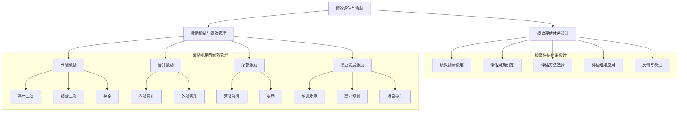

通过上述分析，我们可以看到，绩效评估与激励是一个系统化的过程，需要从绩效评估体系设计、激励机制与绩效管理等多个环节进行。通过科学合理的绩效评估体系和有效的激励机制，组织可以激发员工的积极性和创造力，提高整体绩效和竞争力。

### 第11章：风险管理与创新

在企业管理中，风险管理和创新是两个至关重要的方面。风险管理旨在识别、评估和控制组织面临的潜在风险，以降低风险对组织目标的负面影响。创新则是指组织通过引入新的思想、方法、产品或服务，实现持续发展和竞争优势。在这一章节中，我们将探讨风险管理的概念与原则，以及创新管理的策略与实践。

**11.1 风险管理的概念与原则**

风险管理是指组织通过系统化的方法，识别、评估、应对和监控潜在风险，以保障组织目标的实现。风险管理的概念包括以下几个方面：

- **风险识别**：风险识别是风险管理的基础，旨在识别组织面临的各种潜在风险。风险可以来自内部，如管理问题、运营风险；也可以来自外部，如市场变化、政策法规。
- **风险评估**：风险评估是指对已识别的风险进行评估，确定其可能性和影响程度。风险评估有助于组织了解风险状况，为风险应对提供依据。
- **风险应对**：风险应对是指根据风险评估结果，制定和实施风险应对策略，降低风险对组织的负面影响。常见的风险应对策略包括风险规避、风险转移、风险减轻和风险接受。
- **风险监控**：风险监控是指对已识别和应对的风险进行持续的监控和评估，确保风险应对策略的有效性和及时调整。

风险管理原则包括：

- **全面性原则**：风险管理应覆盖组织所有层面和环节，确保风险管理的全面性和系统性。
- **预防性原则**：风险管理应注重预防措施，提前识别和评估潜在风险，减少风险发生的概率和影响。
- **动态性原则**：风险管理是一个动态过程，应随着组织环境的变化和风险状况的演变进行实时调整。
- **经济性原则**：风险管理应在成本效益分析的基础上，合理配置资源，确保风险管理的经济性和有效性。

**11.2 创新管理的策略与实践**

创新管理是指组织通过系统化的方法，激发和引导创新活动，实现组织持续发展和竞争优势。创新管理的策略和实践包括以下几个方面：

- **创新文化**：创新文化是组织创新管理的基础，应鼓励员工勇于创新，支持创新思维和实践。组织可以通过建立创新文化、举办创新活动、设立创新奖项等手段，营造积极向上的创新氛围。
- **创新团队**：创新团队是组织实现创新目标的重要力量，应具备跨学科、跨部门的团队协作能力。组织可以通过设立专项创新项目、组建跨职能团队等方式，促进创新团队的建立和运作。
- **创新机制**：创新机制是指组织为创新活动提供支持和保障的机制，包括创新流程、创新资源、创新奖励等。组织应建立科学的创新流程，提供充足的创新资源，建立公平、透明的创新奖励机制。
- **创新实践**：创新实践是创新管理的核心，组织应通过实际项目和案例，推动创新理念的应用和推广。组织可以通过设立创新实验室、开展创新竞赛、推动跨部门协作等方式，推动创新实践。
- **创新评估**：创新评估是指对创新活动进行评估和总结，以不断优化创新管理。组织应建立创新评估体系，对创新项目的可行性、创新成果和经济效益进行评估，为后续创新活动提供参考。

**核心概念与联系**

为了更好地理解风险管理和创新管理，我们可以借助Mermaid流程图来展示风险管理的基本流程和创新管理的策略：

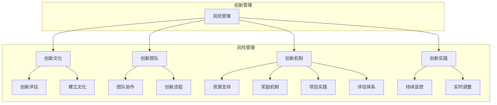

通过上述分析，我们可以看到，风险管理涉及风险识别、风险评估、风险应对和风险监控等环节，旨在降低风险对组织的负面影响。创新管理则注重创新文化、创新团队、创新机制、创新实践和创新评估等方面，旨在推动组织的持续发展和竞争优势。管理者应重视风险管理和创新管理，通过有效的策略和实践，确保组织的稳健发展和持续创新。

### 第12章：企业可持续发展

企业可持续发展是现代企业管理的重要课题，它关系到企业的长期生存和发展。在这一章节中，我们将探讨可持续发展的概念与意义，以及可持续发展战略与实践。

**12.1 可持续发展的概念与意义**

可持续发展是指企业在满足当前需求的同时，不损害子孙后代满足其需求的能力。它强调经济、社会和环境的协调发展，旨在实现企业的长期繁荣和社会福祉。

- **概念**：可持续发展包括经济可持续发展、社会可持续发展和环境可持续发展。经济可持续发展是指企业在保持经济效益的同时，实现资源的合理利用和环境的保护。社会可持续发展是指企业在创造经济效益的同时，关注社会责任，促进社会公平和谐。环境可持续发展是指企业在生产经营过程中，注重环境保护，减少对自然资源的消耗和环境污染。
- **意义**：可持续发展对企业和社会具有重要意义。对企业而言，可持续发展有助于提高企业的竞争力、降低运营成本、提升品牌价值。对社会而言，可持续发展有助于推动社会经济的可持续发展，促进环境保护和社会和谐。

**12.2 可持续发展战略与实践**

为了实现可持续发展，企业需要制定和实施一系列战略与实践。以下是一些常见的可持续发展战略与实践：

1. **节能减排**：企业应通过技术改造、设备更新、能源管理等手段，降低能源消耗和碳排放。例如，采用节能灯具、优化生产工艺、提高能源利用效率等。
2. **资源循环利用**：企业应注重资源的循环利用，减少资源浪费。例如，通过废料回收、废水资源化利用、废弃物处理等方式，降低资源消耗和环境污染。
3. **绿色采购**：企业应采用绿色采购策略，优先采购环保材料、节能产品和可再生资源。绿色采购有助于降低企业的环境负荷，提升企业形象。
4. **社会责任**：企业应承担社会责任，关注员工福利、社区发展、环境保护等方面。例如，提供良好的工作环境、开展公益活动、参与社会公益活动等。
5. **持续创新**：企业应注重技术创新和管理创新，推动企业可持续发展。技术创新有助于提高生产效率、降低成本、减少环境污染。管理创新有助于优化企业运营模式、提升管理效率、增强企业竞争力。
6. **可持续发展评估**：企业应建立可持续发展评估体系，定期评估企业可持续发展状况，识别存在的问题和改进方向。可持续发展评估有助于企业了解自身在可持续发展方面的表现，为持续改进提供依据。

**核心概念与联系**

为了更好地理解可持续发展战略与实践，我们可以借助Mermaid流程图来展示可持续发展的关键要素：

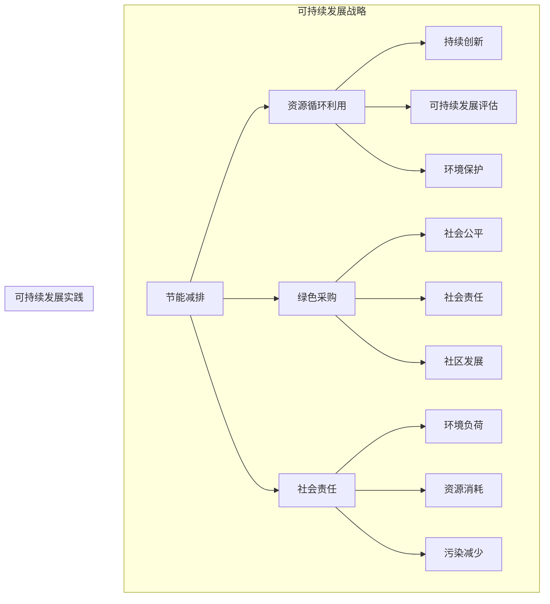

通过上述分析，我们可以看到，可持续发展涉及经济、社会和环境等多个方面，企业应通过节能减排、资源循环利用、绿色采购、社会责任、持续创新等战略与实践，实现经济、社会和环境的协调发展。管理者应重视可持续发展，制定和实施有效的可持续发展战略，确保企业的长期繁荣和社会福祉。

### 第13章：社会责任与企业公民

企业在追求经济效益的同时，也应承担社会责任，成为负责任的企业公民。社会责任与企业公民行为不仅关系到企业的形象和声誉，还影响到企业的长远发展。在这一章节中，我们将探讨企业社会责任的概念与内容，以及企业公民行为与责任。

**13.1 企业社会责任的概念与内容**

企业社会责任（Corporate Social Responsibility，简称CSR）是指企业在经营过程中，关注社会和环境问题，主动承担社会责任，以实现经济、社会和环境的协调发展。企业社会责任的内容包括以下几个方面：

- **经济责任**：企业应通过创造就业、提供优质产品和服务、实现经济收益等方式，为社会经济发展做出贡献。经济责任是企业社会责任的基础，是企业实现其他社会责任的前提。
- **社会责任**：企业应关注员工权益、客户权益、社区权益等方面，保障员工的劳动权益、提供优质服务、支持社区发展等。社会责任是企业对内部和外部利益相关者的责任，关系到企业的社会形象和声誉。
- **环境责任**：企业应关注环境保护，减少污染排放、节约能源、推广环保技术等，实现环境可持续发展。环境责任是企业对自然环境的责任，关系到企业的长期生存和发展。
- **道德责任**：企业应遵守法律法规，遵循商业道德，诚信经营，反对商业贿赂、不正当竞争等。道德责任是企业遵守法律和道德规范的基本要求，关系到企业的诚信和信誉。

**13.2 企业公民行为与责任**

企业公民行为是指企业在经营过程中，遵循社会责任和企业道德，积极参与社会公益事业，为社会和环境做出贡献的行为。企业公民行为包括以下几个方面：

- **慈善捐赠**：企业应积极参与慈善捐赠，支持教育、扶贫、环保等公益事业。慈善捐赠不仅有助于提升企业形象，还能增强企业的社会责任感。
- **志愿服务**：企业应鼓励员工参与志愿服务，支持社区建设和环境保护等社会事业。志愿服务有助于提升员工的团队精神和社会责任感，同时也能为企业带来良好的社会声誉。
- **环保行动**：企业应关注环境保护，采取环保措施，减少环境污染。环保行动包括节能减排、资源循环利用、环保宣传等，有助于提升企业的环保意识和企业形象。
- **社会责任报告**：企业应定期发布社会责任报告，公开企业的社会责任履行情况，接受社会和利益相关者的监督。社会责任报告是企业履行社会责任的重要体现，有助于提升企业的透明度和公信力。

企业公民行为与责任不仅有助于提升企业的社会形象和声誉，还能增强企业的核心竞争力。以下是一些关键点：

- **企业战略**：企业应将社会责任纳入企业战略，确保社会责任与企业发展战略相结合。企业社会责任与企业战略的融合，有助于提升企业的整体竞争力。
- **文化建设**：企业应建立积极向上的企业文化，培养员工的社会责任感和道德意识。企业文化是企业社会责任的内在动力，有助于形成企业良好的社会责任行为。
- **利益相关者参与**：企业应积极与利益相关者沟通和合作，共同推进社会责任的实现。利益相关者包括员工、客户、供应商、社区等，他们的参与和支持有助于提升企业的社会责任效果。
- **创新驱动**：企业应通过技术创新和管理创新，推动社会责任的实现。创新驱动是企业实现社会责任的有效途径，有助于提升企业的社会责任水平和竞争力。

**核心概念与联系**

为了更好地理解企业社会责任与企业公民行为，我们可以借助Mermaid流程图来展示企业社会责任的主要内容和企业公民行为：

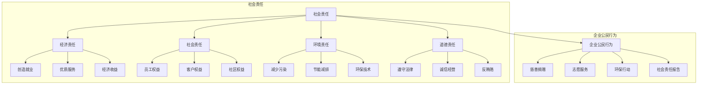

通过上述分析，我们可以看到，企业社会责任涉及经济、社会和环境等多个方面，企业公民行为是企业履行社会责任的具体体现。企业应将社会责任纳入企业战略，通过文化建设、利益相关者参与和创新驱动，实现企业的社会责任目标，成为负责任的企业公民。

### 附录 A：管理工具与方法

在企业管理过程中，各种工具和方法的应用有助于提高管理效率和质量。以下是一些常用的管理工具和方法，以及案例分析和应用场景。

**A.1 常用管理工具**

1. **SWOT分析**：SWOT分析是一种用于评估企业或项目优势、劣势、机会和威胁的方法。通过SWOT分析，企业可以全面了解自身的内外部环境，制定更有针对性的发展战略。案例：一家公司在进行市场进入决策时，通过SWOT分析，发现自身在产品研发和品牌知名度方面具有优势，但市场拓展能力不足，于是决定加强市场推广和渠道建设。

2. **平衡计分卡**：平衡计分卡是一种用于企业绩效管理的工具，从财务、客户、内部业务流程和学习与成长四个维度评估企业的绩效。案例：一家制造企业通过平衡计分卡，将生产效率、产品质量、客户满意度和员工培训等关键绩效指标纳入考核范围，实现企业全面、协调的发展。

3. **六西格玛**：六西格玛是一种用于提高企业质量和效率的管理方法，通过系统化的过程改进，降低缺陷率，提高客户满意度。案例：一家电子产品制造企业通过实施六西格玛，优化了生产流程，减少了生产缺陷，提高了生产效率，降低了运营成本。

4. **目标管理**：目标管理是一种通过设定明确的目标和计划，激发员工工作积极性，实现企业目标的方法。案例：一家销售公司通过目标管理，设定了销售目标、客户拓展目标和团队建设目标，激发了员工的积极性，提高了整体业绩。

**A.2 管理方法案例分析**

1. **彼得·德鲁克的“目标管理”方法**：彼得·德鲁克的目标管理方法强调通过设定明确的目标和计划，激发员工的工作积极性。案例：一家科技公司采用目标管理方法，设定了技术创新、市场拓展和团队建设等目标，明确了每个部门和个人在实现企业目标中的责任，有效提高了企业的整体绩效。

2. **杰克·韦尔奇的“管理三环”方法**：杰克·韦尔奇的“管理三环”方法包括战略规划、组织建设和领导力提升。案例：通用电气在韦尔奇的管理下，通过战略规划，明确了企业的发展方向；通过组织建设，优化了企业结构和流程；通过领导力提升，培养了大量的优秀管理者，实现了企业的持续增长。

3. **稻盛和夫的“阿米巴经营”方法**：稻盛和夫的“阿米巴经营”方法通过将企业划分为多个独立的经营单位，提高企业的经营灵活性和效率。案例：日本京都精密工业公司通过实施阿米巴经营，将公司划分为多个阿米巴单元，每个单元自主经营、自负盈亏，提高了企业的经营效率和竞争力。

通过上述管理工具和方法的应用，企业可以更好地实现管理目标，提高管理效率和效果。管理者应根据企业的实际情况，灵活运用这些工具和方法，推动企业的发展。

### 附录 B：参考书目与资料

**B.1 参考书目**

1. **《管理的实践》（彼得·德鲁克著）**：本书是管理学领域的经典之作，系统地阐述了管理的理论和实践，对管理者具有重要的指导意义。

2. **《创新与企业家精神》（彼得·德鲁克著）**：本书探讨了创新和企业家的精神，阐述了创新的重要性以及如何通过创新推动企业的发展。

3. **《竞争战略》（迈克尔·波特著）**：本书是竞争战略领域的经典之作，系统地阐述了企业如何通过竞争战略获得竞争优势，对企业的战略规划具有指导意义。

4. **《企业与企业精神》（阿尔弗雷德·钱德勒著）**：本书分析了企业发展的历史，探讨了企业的组织结构、管理模式和文化对企业发展的影响。

5. **《组织行为学》（斯蒂芬·罗宾斯著）**：本书系统地阐述了组织行为学的基本理论和实践，对管理者理解和应对组织行为问题具有指导意义。

**B.2 推荐阅读资料**

1. **《哈佛商业评论》**：这是一本全球知名的管理杂志，定期发布关于企业管理、战略规划、领导力等方面的文章，对管理者具有很高的参考价值。

2. **《哈佛商学院案例集》**：这是一本包含大量企业管理案例的书籍，通过案例分析，管理者可以了解企业在不同环境和情境下的应对策略。

3. **《经济学人》**：这是一本全球知名的经济学杂志，定期发布关于全球经济、商业趋势等方面的文章，对管理者了解全球市场环境和趋势具有指导意义。

4. **《福布斯》**：这是一本全球知名的商业杂志，定期发布关于企业、投资、创新等方面的文章，对管理者了解商业动态和行业趋势具有很高的参考价值。

通过阅读这些参考书目和推荐阅读资料，管理者可以深入了解管理理论和实践，提升自身的管理能力和决策水平，为企业的长期发展提供有力支持。

### 参考文献

1. Drucker, P. F. (1999). *The Practice of Management*. HarperBusiness.
2. Drucker, P. F. (1985). *Innovation and Entrepreneurship*. Harper & Row.
3. Porter, M. E. (1980). *Competitive Strategy: Techniques for Analyzing Industries and Competitors*. Free Press.
4. Chandler, A. D. (1962). *Strategy and Structure: Chapters in the History of the Industrial Enterprise*. MIT Press.
5. Robbins, S. P., & Judge, T. A. (2018). *Organizational Behavior* (18th ed.). Pearson.
6. 《哈佛商业评论》编辑部. (2020). *哈佛商业评论*. 哈佛商业评论出版社.
7. 《经济学人》编辑部. (2020). *经济学人*. 经济学人出版社.
8. 《福布斯》编辑部. (2020). *福布斯*. 福布斯出版社.

这些参考文献涵盖了企业管理、战略规划、组织行为等多个领域，为本文提供了丰富的理论依据和实践指导。读者在进一步学习和研究中，可以参考这些文献，以获得更深入的理解和更全面的视野。

