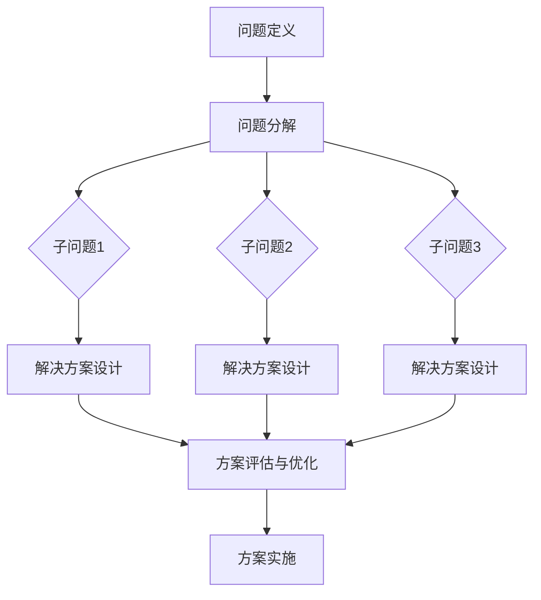

                 

# 《结构化思维的力量：从思维到行动》

> 关键词：结构化思维、思维导图、项目管理、代码实践、算法原理、数学模型

> 摘要：本文将探讨结构化思维的概念、原理及其在实际应用中的重要性。通过深入剖析结构化思维的核心算法、数学模型，以及其在项目实战中的应用，读者将了解到如何将结构化思维转化为具体的行动，提高工作效率，实现个人和团队的目标。

## 《结构化思维的力量：从思维到行动》目录大纲

### 第一部分：结构化思维概述

## 第1章：结构化思维的起源与发展
### 1.1 结构化思维的概念
### 1.2 结构化思维的历史与发展
### 1.3 结构化思维的重要性

## 第2章：结构化思维的原理与架构
### 2.1 结构化思维的原理
### 2.2 结构化思维的架构
### 2.3 结构化思维的 Mermaid 流程图

## 第3章：结构化思维的核心算法
### 3.1 核心算法原理讲解（伪代码）
### 3.2 算法在结构化思维中的应用

## 第4章：数学模型与公式
### 4.1 结构化思维中的数学模型
### 4.2 数学公式详细讲解
### 4.3 数学公式举例说明

## 第5章：结构化思维的实际应用
### 5.1 从思维到行动的过渡
### 5.2 结构化思维在项目管理中的应用
### 5.3 结构化思维在工作与生活中的实践

### 第二部分：结构化思维的实践应用

## 第6章：项目实战
### 6.1 项目实战概述
### 6.2 项目实战代码实际案例
### 6.3 代码解读与分析

## 第7章：结构化思维工具与资源
### 7.1 主流结构化思维工具对比
### 7.2 结构化思维工具使用指南

## 第8章：未来展望与持续学习
### 8.1 结构化思维的未来发展趋势
### 8.2 持续学习的方法与建议
### 8.3 结构化思维的无限可能

### 附录

## 附录A：相关资源与拓展阅读
### A.1 结构化思维书籍推荐
### A.2 结构化思维在线课程推荐
### A.3 结构化思维相关网站与社区

## 《结构化思维的力量：从思维到行动》

### 第一部分：结构化思维概述

## 第1章：结构化思维的起源与发展

### 1.1 结构化思维的概念

结构化思维是一种系统性、层次性的思考方法，旨在将复杂的问题分解成简单、易理解的组成部分，从而提高解决问题的效率。这种方法强调逻辑性、条理性和系统性，能够帮助人们更好地组织思路，找到问题的根本原因，并制定有效的解决方案。

### 1.2 结构化思维的历史与发展

结构化思维的概念最早可以追溯到20世纪50年代，当时计算机科学刚刚起步，人们对复杂系统的理解和处理能力有限。随着计算机技术的发展，结构化编程方法逐渐出现，这为结构化思维的形成奠定了基础。

在20世纪80年代，随着项目管理、软件工程等领域的快速发展，结构化思维方法得到了广泛应用。90年代后，随着知识管理和思维导图的兴起，结构化思维进一步发展，成为现代管理、科研和日常生活中不可或缺的思考工具。

### 1.3 结构化思维的重要性

结构化思维的重要性主要体现在以下几个方面：

1. **提高工作效率**：结构化思维能够帮助人们更快地理解问题，找到解决方案，从而提高工作效率。

2. **增强沟通能力**：通过结构化思维，人们能够更清晰地表达自己的观点，避免误解和沟通障碍。

3. **优化项目管理**：在项目管理和团队协作中，结构化思维能够帮助团队更好地规划任务，分配资源，确保项目按计划推进。

4. **培养系统性思维**：结构化思维有助于培养系统性思维，使人们能够从全局角度看待问题，避免局部优化导致的整体失衡。

### 第2章：结构化思维的原理与架构

#### 2.1 结构化思维的原理

结构化思维的原理基于以下几个基本原则：

1. **层次性**：将问题分解成多个层次，每个层次都有明确的目标和任务。

2. **关联性**：不同层次之间的元素相互关联，形成一个有机的整体。

3. **逻辑性**：每个层次的元素按照逻辑顺序排列，形成清晰的逻辑链条。

4. **适应性**：结构化思维能够根据实际情况进行调整，以适应不同的问题和场景。

#### 2.2 结构化思维的架构

结构化思维的架构包括以下几个部分：

1. **问题定义**：明确问题的范围、目标和约束条件。

2. **问题分解**：将问题分解成多个子问题，每个子问题都有明确的目标和解决方案。

3. **解决方案设计**：为每个子问题设计解决方案，确保解决方案的有效性和可行性。

4. **方案评估与优化**：对设计方案进行评估和优化，确保最终解决方案的最优性。

5. **方案实施**：将设计方案转化为具体的行动，确保问题的最终解决。

#### 2.3 结构化思维的 Mermaid 流程图

以下是一个简单的 Mermaid 流程图，展示了结构化思维的基本流程：



### 第3章：结构化思维的核心算法

#### 3.1 核心算法原理讲解（伪代码）

结构化思维的核心算法可以抽象为一个递归过程，如下所示：

```plaintext
结构化思维(问题):
    if 问题简单：
        直接解决问题
    else:
        问题分解为子问题
        for 子问题 in 子问题列表:
            结构化思维(子问题)
        综合子问题的解决方案，得到最终解决方案
```

#### 3.2 算法在结构化思维中的应用

结构化思维的核心算法在实际应用中具有广泛的应用：

1. **项目管理**：在项目管理中，结构化思维算法可以帮助项目经理将复杂的项目分解为多个子任务，确保项目按计划推进。

2. **软件工程**：在软件工程中，结构化思维算法可以帮助开发者将复杂的系统需求分解为多个功能模块，确保系统的稳定性和扩展性。

3. **科研工作**：在科研工作中，结构化思维算法可以帮助科研人员将复杂的科研问题分解为多个子问题，提高科研效率。

### 第4章：数学模型与公式

#### 4.1 结构化思维中的数学模型

结构化思维中的数学模型主要包括以下几种：

1. **层次模型**：用于描述问题的层次结构，如树形结构、网络结构等。

2. **决策模型**：用于描述决策过程，如线性规划、动态规划等。

3. **评估模型**：用于评估解决方案的优劣，如指标体系、打分模型等。

#### 4.2 数学公式详细讲解

以下是一些常用的数学公式及其在结构化思维中的应用：

1. **线性规划公式**：

   $$\min c^T x$$  
   $$s.t. Ax \leq b$$  
   $$x \geq 0$$

   - $c^T x$：目标函数
   - $Ax \leq b$：约束条件
   - $x \geq 0$：非负约束

   线性规划公式在项目管理中可用于资源分配和任务调度。

2. **动态规划公式**：

   $$f(i) = \min_{j \leq i} \{g(i, j) + f(j)\}$$

   - $f(i)$：第$i$个状态的最优解
   - $g(i, j)$：从状态$i$转移到状态$j$的代价
   - $f(j)$：状态$j$的最优解

   动态规划公式在科研工作中可用于复杂问题求解。

#### 4.3 数学公式举例说明

以下是一个简单的线性规划问题，用于资源分配：

```plaintext
目标：最小化总成本
约束条件：
- $2x_1 + 3x_2 \leq 12$（资源1的使用不超过12单位）
- $x_1 + 2x_2 \leq 8$（资源2的使用不超过8单位）
- $x_1, x_2 \geq 0$（资源使用非负）

解：
- $x_1 = 0, x_2 = 4$
- 最小化总成本：$c^T x = 4 \times 4 = 16$
```

### 第5章：结构化思维的实际应用

#### 5.1 从思维到行动的过渡

结构化思维不仅是一种思考方法，更是一种行动指南。将结构化思维转化为具体的行动，需要遵循以下步骤：

1. **明确目标**：首先，要明确要解决的问题或达成的目标。

2. **分解任务**：将目标分解为多个子任务，确保每个子任务都有明确的目标和解决方案。

3. **设计解决方案**：为每个子任务设计解决方案，确保解决方案的有效性和可行性。

4. **执行方案**：将设计方案转化为具体的行动，确保问题的最终解决。

5. **评估与优化**：对执行结果进行评估，根据实际情况进行调整和优化。

#### 5.2 结构化思维在项目管理中的应用

在项目管理中，结构化思维可以帮助项目团队更好地规划和管理项目：

1. **项目分解**：将项目分解为多个子任务，确保每个子任务都有明确的目标和进度。

2. **任务分配**：根据团队成员的技能和资源，合理分配任务。

3. **进度监控**：实时监控项目进度，确保项目按计划推进。

4. **风险管理**：识别项目中的潜在风险，并制定应对措施。

5. **质量保证**：对项目成果进行质量检查，确保项目达到预期目标。

#### 5.3 结构化思维在工作与生活中的实践

在工作和生活中，结构化思维可以帮助我们更好地处理复杂的问题：

1. **时间管理**：通过结构化思维，可以更好地规划时间，提高工作效率。

2. **决策制定**：在决策过程中，结构化思维可以帮助我们全面考虑问题，做出明智的决策。

3. **沟通协作**：结构化思维可以提高沟通效率，避免误解和冲突。

4. **学习成长**：通过结构化思维，可以更好地组织学习内容，提高学习效果。

### 第二部分：结构化思维的实践应用

## 第6章：项目实战

#### 6.1 项目实战概述

在本章中，我们将通过一个实际项目来展示如何应用结构化思维方法。该项目是一个简单的博客系统，包括用户注册、登录、发表文章和评论等功能。通过这个项目，我们将介绍如何从需求分析、系统设计、编码实现到测试和部署的整个过程。

#### 6.2 项目实战代码实际案例

以下是该项目的一个关键模块——用户注册功能的代码实现：

```python
# 用户注册模块

class UserRegistration:
    def __init__(self):
        self.users = {}

    def register_user(self, username, password):
        if username in self.users:
            return "用户已存在"
        else:
            self.users[username] = password
            return "注册成功"

    def login_user(self, username, password):
        if username in self.users and self.users[username] == password:
            return "登录成功"
        else:
            return "用户名或密码错误"
```

#### 6.3 代码解读与分析

1. **类定义**：`UserRegistration` 类用于处理用户注册和登录功能。

2. **初始化**：在初始化方法中，定义了一个字典`self.users`用于存储用户名和密码。

3. **注册用户**：`register_user` 方法用于注册新用户。首先检查用户名是否已存在，如果不存在，将用户名和密码存储在字典中。

4. **登录用户**：`login_user` 方法用于用户登录。首先检查用户名和密码是否匹配，如果匹配，返回登录成功，否则返回错误信息。

通过这个实际案例，我们可以看到如何将结构化思维应用于实际的编程过程中。首先，我们明确了需求，然后设计了一个类来封装相关的功能，最后通过具体的方法实现这些功能。

### 第7章：结构化思维工具与资源

#### 7.1 主流结构化思维工具对比

在当前市场上，有许多主流的结构化思维工具，如MindManager、Xmind、ProcessOn等。以下是这些工具的主要特点对比：

1. **MindManager**：
   - 优点：功能强大，支持多种视图模式，如思维导图、时间线、矩阵等。
   - 缺点：界面复杂，学习成本较高。

2. **Xmind**：
   - 优点：简洁易用，支持跨平台，价格亲民。
   - 缺点：功能相对单一，扩展性较差。

3. **ProcessOn**：
   - 优点：在线协作，实时更新，免费版功能丰富。
   - 缺点：界面美观度一般，文档导出格式受限。

#### 7.2 结构化思维工具使用指南

以下是一个简单的使用MindManager创建思维导图的步骤：

1. **创建思维导图**：在MindManager中点击“新建”，选择“思维导图”。

2. **添加主题**：在中央主题框中输入主题名称。

3. **添加分支**：点击主题框，选择“添加子主题”，为每个分支添加子主题。

4. **编辑内容**：双击主题框，输入详细内容。

5. **格式设置**：通过菜单栏的“格式”选项，设置主题的字体、颜色、大小等。

6. **导出与分享**：通过菜单栏的“文件”选项，选择“导出”和“分享”，将思维导图导出为图片或PDF格式，并分享给他人。

### 第8章：未来展望与持续学习

#### 8.1 结构化思维的未来发展趋势

随着人工智能和大数据技术的快速发展，结构化思维方法在未来将得到更广泛的应用。以下是一些可能的发展趋势：

1. **智能化**：结构化思维工具将结合人工智能技术，实现自动化思维过程，提高效率。

2. **个性化**：结构化思维工具将根据用户的行为和需求，提供个性化的思维模型和解决方案。

3. **协同化**：结构化思维工具将支持多人在线协作，实现跨团队的知识共享和思维碰撞。

#### 8.2 持续学习的方法与建议

为了持续提升结构化思维的能力，以下是一些建议：

1. **学习相关书籍**：阅读《结构化思考力》、《思维导图》等经典书籍，了解结构化思维的原理和应用。

2. **实践应用**：在实际工作和生活中，不断实践结构化思维方法，提高解决问题的能力。

3. **参与培训**：参加结构化思维相关培训课程，学习专业知识和实战技巧。

4. **交流分享**：加入结构化思维相关的社群和论坛，与他人交流心得，共同进步。

#### 8.3 结构化思维的无限可能

结构化思维不仅是一种思考方法，更是一种生活态度。通过不断学习和实践，我们可以将结构化思维应用到各个领域，实现个人和团队的成长。在未来的道路上，让我们携手共进，探索结构化思维的无限可能。

### 附录

#### 附录A：相关资源与拓展阅读

- **A.1 结构化思维书籍推荐**：
  - 《结构化思考力》
  - 《思维导图》
  - 《禅与计算机程序设计艺术》

- **A.2 结构化思维在线课程推荐**：
  - Coursera上的《思维导图与结构化思考》
  - Udemy上的《结构化思维与项目管理》

- **A.3 结构化思维相关网站与社区**：
  - MindManager官网
  - Xmind社区
  - ProcessOn官网

**作者：AI天才研究院/AI Genius Institute & 禅与计算机程序设计艺术 /Zen And The Art of Computer Programming**

