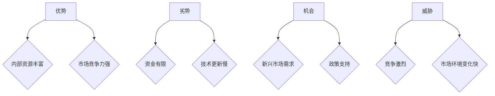
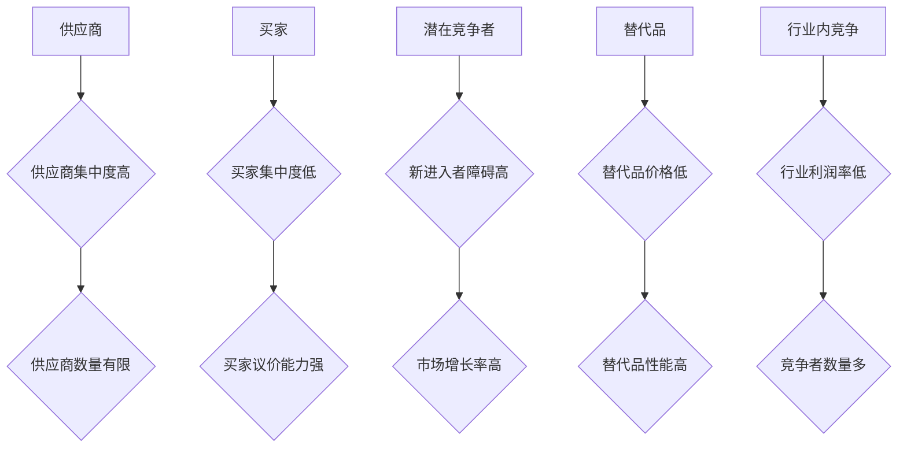
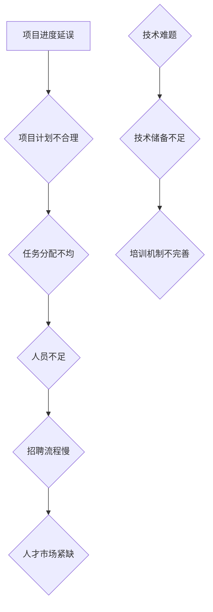
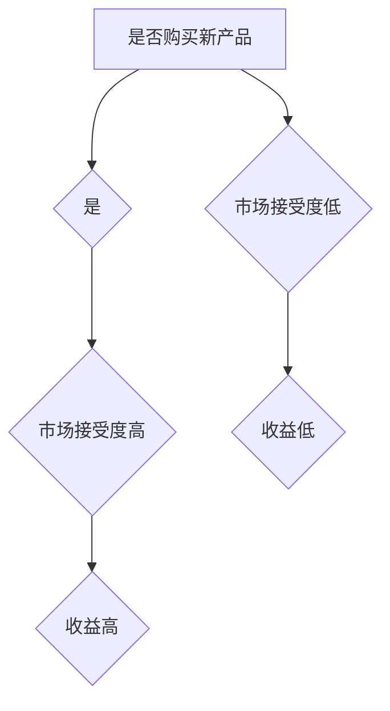

                 

# 《结构化思维的力量：从思维到行动》

> 关键词：结构化思维，逻辑分析，决策，项目管理，个人成长

> 摘要：本文将从思维的基础、原理、方法、实践等方面深入探讨结构化思维的力量。通过阐述结构化思维的定义、核心原则、应用方法和实践案例，帮助读者了解如何在决策、项目管理和个人成长中运用结构化思维，从而提升思维品质，实现高效行动。

## 第一部分：思维的基础

### 第1章：思维的本质

#### 1.1.1 思维的定义与类型

思维是指人们在感知、理解、判断、推理和想象等过程中所进行的心理活动。它包括逻辑思维、形象思维、直觉思维、创造思维等多种类型。

- **逻辑思维**：以概念、判断和推理为主要形式，遵循逻辑规则进行思考。
- **形象思维**：以表象、图像为主要形式，通过联想、比较、分析等方式进行思考。
- **直觉思维**：以直接感知和经验为基础，迅速做出判断。
- **创造思维**：以创新、独特性为目标，通过发散性、综合性等方式进行思考。

#### 1.1.2 感性与理性的平衡

感性思维和理性思维是人类思维的两个基本方面。感性思维强调直觉、情感和直观感受，而理性思维则强调逻辑、分析和推理。

在现实生活中，感性与理性的平衡至关重要。过于感性可能导致冲动和盲目，而过于理性则可能陷入僵化和固执。因此，我们需要学会在感性与理性之间找到平衡，以实现更加全面和深入的思考。

#### 1.1.3 思维的局限性与提升

人类的思维存在一定的局限性，如：

- **信息处理能力有限**：大脑的信息处理能力是有限的，容易受到信息过载的影响。
- **认知偏见**：人们容易受到先入为主的观念和偏见的影响，导致判断失误。
- **思维惯性**：人们容易陷入固有的思维模式，难以接受新的观点和想法。

为了提升思维能力，我们可以采取以下方法：

- **广泛阅读和学习**：通过阅读和学习，扩展知识面，提高思维的广度和深度。
- **实践与应用**：将所学知识应用于实际问题，通过实践提升思维能力。
- **反思与总结**：经常反思自己的思考过程，总结经验教训，改进思维方法。

### 第2章：结构化思维的原理

#### 2.1.1 结构化思维的定义

结构化思维是指通过逻辑、层次和框架等手段，对问题进行分析、理解和解决的一种思维方式。它强调思维的条理性和系统性，有助于提高思考的质量和效率。

#### 2.1.2 结构化思维的核心原则

- **逻辑性**：思维过程遵循逻辑规则，确保推理过程的严谨性和准确性。
- **层次性**：将问题分解为不同层次，从宏观到微观，从整体到部分，逐步分析和解决。
- **系统性**：将问题看作一个整体，考虑各个部分之间的相互关系和影响，实现系统优化。
- **灵活性**：根据实际情况调整思维方法和策略，适应不同的思维情境。

#### 2.1.3 结构化思维与传统思维的比较

- **传统思维**：以经验、直觉和感性的方式为主，缺乏系统性和逻辑性。
- **结构化思维**：以逻辑、层次和框架为手段，具有系统性和逻辑性，能够更好地应对复杂问题。

### 第3章：思维模型与工具

#### 3.1.1 常见的思维模型

- **SWOT分析**：对企业、项目或个人进行优势、劣势、机会和威胁的分析。
- **五力模型**：对市场竞争力进行评估，包括供应商、买家、潜在竞争者、替代品和行业内部竞争。
- **问题树**：将问题分解为不同层次，找出问题的根本原因。

#### 3.1.2 思维工具的应用

- **逻辑思维训练**：通过解决逻辑问题，提高思维的逻辑性和推理能力。
- **创新思维培养**：通过头脑风暴、横向思维和系统思维等方式，激发创造力和创新能力。
- **决策分析**：运用决策树、成本效益分析和风险评估等工具，提高决策的科学性和准确性。

#### 3.1.3 思维工具的选用与优化

- **选用原则**：根据问题的特点和需求，选择合适的思维工具。
- **优化方法**：结合实际情况，对思维工具进行改进和优化，提高思维效率。

### 第4章：结构化思维的方法

#### 4.1.1 逻辑思维训练

- **归纳与演绎**：通过归纳推理和演绎推理，提高思维的逻辑性和推理能力。
- **前提与结论**：明确前提和结论的关系，确保推理过程的严谨性。
- **逻辑谬误的识别与避免**：识别常见的逻辑谬误，避免在思维过程中陷入误区。

#### 4.1.2 创新思维培养

- **头脑风暴**：通过集体讨论，激发创新思维。
- **横向思维**：从不同角度和维度思考问题，寻找新的解决方案。
- **系统思维**：将问题看作一个整体，考虑各个部分之间的相互关系和影响。

## 第二部分：行动的实践

### 第6章：将结构化思维应用于决策

#### 6.1.1 决策过程中的思维误区

- **心理偏见**：人们容易受到先入为主的观念和偏见的影响，导致决策失误。
- **信息过载**：过多的信息容易导致判断混乱，难以做出明确的决策。
- **决策者能力不足**：决策者可能缺乏足够的信息和经验，无法做出明智的决策。

#### 6.1.2 结构化思维在决策中的应用

- **确定问题**：明确决策的目标和问题，避免陷入模糊和模糊的问题。
- **分析问题**：运用结构化思维的方法，分析问题的各个方面，找出问题的根本原因。
- **设计方案**：提出不同的解决方案，评估方案的优缺点，选择最佳的方案。
- **评估与选择**：对不同的方案进行评估和比较，根据评估结果做出决策。

### 第7章：将结构化思维应用于项目管理

#### 7.1.1 项目管理中的思维挑战

- **项目目标不明确**：项目目标不明确容易导致项目进度和质量的失控。
- **团队沟通不畅**：团队沟通不畅容易导致项目进度的延误和协作的低效。
- **资源配置不合理**：资源配置不合理容易导致项目资源的浪费和效率的降低。

#### 7.1.2 结构化思维在项目管理中的应用

- **明确项目目标**：明确项目目标，确保项目团队对项目目标有清晰的认识。
- **制定项目计划**：运用结构化思维的方法，制定详细的项目计划，确保项目进度和质量。
- **风险管理**：运用结构化思维的方法，识别项目风险，制定相应的风险管理措施。
- **团队协作与沟通**：运用结构化思维的方法，提高团队协作和沟通的效果，确保项目顺利进行。

### 第8章：将结构化思维应用于个人成长

#### 8.1.1 个人成长中的思维障碍

- **自我设限**：自我设限容易导致个人成长停滞，难以突破自己的局限。
- **目标模糊**：目标模糊容易导致个人成长方向不明确，难以实现目标。
- **缺乏计划**：缺乏计划容易导致个人成长无序，难以实现预期效果。

#### 8.1.2 结构化思维在个人成长中的应用

- **设定明确目标**：设定明确的目标，明确个人成长的愿景和方向。
- **制定成长计划**：制定详细的成长计划，明确个人成长的具体目标和步骤。
- **持续跟踪与评估**：持续跟踪和评估个人成长的进度和效果，及时调整和优化成长计划。
- **反思与调整**：通过反思和总结，不断调整和改进自己的思维方法和行动策略，实现个人成长。

### 第9章：从思维到行动的实践案例

#### 9.1.1 案例一：企业战略规划

##### 9.1.1.1 问题背景

某企业面临市场竞争激烈、内部管理混乱等问题，需要制定一份全面的战略规划。

##### 9.1.1.2 问题分析

- **外部环境分析**：通过SWOT分析，分析企业的优势、劣势、机会和威胁。
- **内部环境分析**：通过五力模型，分析企业的市场竞争力。
- **问题树**：将问题分解为不同层次，找出问题的根本原因。

##### 9.1.1.3 行动方案

- **明确战略目标**：根据问题分析结果，设定明确的企业战略目标。
- **制定战略规划**：制定详细的战略规划，包括市场拓展、产品创新、内部管理等。
- **实施与监控**：实施战略规划，并对实施过程进行监控和评估。

##### 9.1.1.4 结果评估

通过实施战略规划，企业实现了市场份额的提升、管理效率的提高和盈利能力的增强。

#### 9.1.2 案例二：团队协作

##### 9.1.2.1 问题背景

某团队在项目执行过程中，沟通不畅、协作不力，导致项目进度延误和项目质量下降。

##### 9.1.2.2 问题分析

- **沟通障碍**：分析团队沟通中的障碍，如信息不对称、沟通方式不当等。
- **协作不畅**：分析团队协作中的问题，如角色不清、职责不明等。

##### 9.1.2.3 行动方案

- **建立沟通机制**：建立有效的沟通机制，确保团队成员之间的信息畅通。
- **明确角色与职责**：明确团队成员的角色和职责，确保项目执行过程中的协作有序。
- **定期会议与总结**：定期召开团队会议，总结项目执行过程中的问题，及时调整和改进。

##### 9.1.2.4 结果评估

通过改进沟通机制和协作方式，团队项目进度得到明显提升，项目质量得到有效保障。

#### 9.1.3 案例三：个人成长计划

##### 9.1.3.1 问题背景

某个人在职业发展中遇到瓶颈，感到困惑和无助，需要制定一份个人成长计划。

##### 9.1.3.2 问题分析

- **自我认知**：分析自己的兴趣、优势、劣势和价值观，明确个人成长的目标。
- **职业规划**：分析职业发展趋势、市场需求和自身能力，制定合理的职业规划。
- **学习计划**：根据职业规划，制定详细的学习计划，包括学习目标、学习内容和学习方法。

##### 9.1.3.3 行动方案

- **设定成长目标**：根据问题分析结果，设定明确的成长目标。
- **实施成长计划**：按照学习计划，实施个人成长计划，不断学习和提升自己。
- **评估与调整**：定期评估个人成长进度，根据实际情况调整成长计划。

##### 9.1.3.4 结果评估

通过实施个人成长计划，个人在职业能力和综合素质方面得到了显著提升，实现了职业发展和个人价值的提升。

## 附录

### 附录A：常用思维模型与工具

#### A.1 SWOT分析

SWOT分析是一种常用的战略分析工具，用于评估企业的优势、劣势、机会和威胁。

- **优势（Strengths）**：企业内部的优势和资源。
- **劣势（Weaknesses）**：企业内部的不足和限制。
- **机会（Opportunities）**：企业外部环境中的机会和趋势。
- **威胁（Threats）**：企业外部环境中的威胁和挑战。

#### A.2 五力模型

五力模型是分析市场竞争力的常用工具，包括以下五个方面：

- **供应商**：供应商的实力、市场地位和议价能力。
- **买家**：买家的实力、市场地位和议价能力。
- **潜在竞争者**：潜在竞争者的进入难度和市场地位。
- **替代品**：替代品的性能和价格。
- **行业内部竞争**：行业内竞争者的实力、市场地位和竞争策略。

#### A.3 问题树

问题树是一种用于分析问题根本原因的思维工具，通过将问题分解为不同层次，找出问题的根本原因。

- **问题**：明确需要解决的问题。
- **子问题**：将问题分解为若干个子问题。
- **原因**：分析子问题的根本原因。

### 附录B：数学模型与公式

#### B.1 逻辑推理公式

- **逻辑推理公式**：用于推导结论的逻辑公式。
- **命题公式**：用于表示命题的公式。
- **推理规则**：用于推导新命题的规则。

#### B.2 决策分析公式

- **成本效益分析公式**：用于计算成本和效益，评估决策的可行性。
- **风险评估公式**：用于计算风险的概率和影响，评估决策的风险。
- **决策树公式**：用于表示决策过程和计算决策结果。

#### B.3 项目管理公式

- **项目进度公式**：用于计算项目进度和工期。
- **资源分配公式**：用于计算项目资源的分配和优化。
- **风险管理公式**：用于计算项目风险的概率和影响，制定风险管理策略。

### 附录C：相关资源与推荐阅读

#### C.1 常见思维模型与工具资源

- **《思维导图》**：介绍思维导图的基本原理和应用方法。
- **《SWOT分析》**：详细介绍SWOT分析的方法和应用。
- **《五力模型》**：详细介绍五力模型的方法和应用。

#### C.2 经典案例分析资源

- **《企业战略规划案例》**：分析企业战略规划的实际案例。
- **《团队协作案例》**：分析团队协作的实际案例。
- **《个人成长计划案例》**：分析个人成长计划的实际案例。

#### C.3 个人成长与自我提升资源

- **《终身学习》**：介绍终身学习的方法和技巧。
- **《高效能人士的七个习惯》**：介绍高效能人士的七个习惯。
- **《如何高效学习》**：介绍高效学习的方法和技巧。

#### C.4 推荐阅读书籍与文章

- **《思维与决策》**：介绍思维与决策的基本原理和应用。
- **《项目管理知识体系》**：介绍项目管理的知识体系和实践方法。
- **《个人成长理论》**：介绍个人成长的理论和实践方法。

## 参考文献

### [1] 《思维导图》

### [2] 《SWOT分析》

### [3] 《项目管理知识体系》

### [4] 《个人成长理论》

### [5] 《决策理论》

---

**作者：AI天才研究院/AI Genius Institute & 禅与计算机程序设计艺术 /Zen And The Art of Computer Programming**## 《结构化思维的力量：从思维到行动》

### 目录大纲

### 第一部分：思维的基础

#### 第1章：思维的本质

##### 1.1.1 思维的定义与类型

##### 1.1.2 感性与理性的平衡

##### 1.1.3 思维的局限性与提升

#### 第2章：结构化思维的原理

##### 2.1.1 结构化思维的定义

##### 2.1.2 结构化思维的核心原则

##### 2.1.3 结构化思维与传统思维的比较

#### 第3章：思维模型与工具

##### 3.1.1 常见的思维模型

###### 3.1.1.1 SWOT分析

###### 3.1.1.2 五力模型

###### 3.1.1.3 问题树

##### 3.1.2 思维工具的应用

##### 3.1.3 思维工具的选用与优化

#### 第4章：结构化思维的方法

##### 4.1.1 逻辑思维训练

###### 4.1.1.1 归纳与演绎

###### 4.1.1.2 前提与结论

###### 4.1.1.3 逻辑谬误的识别与避免

##### 4.1.2 创新思维培养

###### 4.1.2.1 头脑风暴

###### 4.1.2.2 横向思维

###### 4.1.2.3 系统思维

#### 第5章：思维训练与自我提升

##### 5.1.1 思维训练的方法

###### 5.1.1.1 练习思维模型

###### 5.1.1.2 经典案例分析

###### 5.1.1.3 模拟实战

##### 5.1.2 自我提升的策略

###### 5.1.2.1 阅读与学习

###### 5.1.2.2 经验分享与交流

###### 5.1.2.3 习惯养成与持续改进

### 第二部分：行动的实践

#### 第6章：将结构化思维应用于决策

##### 6.1.1 决策过程中的思维误区

###### 6.1.1.1 心理偏见

###### 6.1.1.2 信息过载

###### 6.1.1.3 决策者能力不足

##### 6.1.2 结构化思维在决策中的应用

###### 6.1.2.1 确定问题

###### 6.1.2.2 分析问题

###### 6.1.2.3 设计方案

###### 6.1.2.4 评估与选择

#### 第7章：将结构化思维应用于项目管理

##### 7.1.1 项目管理中的思维挑战

###### 7.1.1.1 项目目标不明确

###### 7.1.1.2 团队沟通不畅

###### 7.1.1.3 资源配置不合理

##### 7.1.2 结构化思维在项目管理中的应用

###### 7.1.2.1 明确项目目标

###### 7.1.2.2 制定项目计划

###### 7.1.2.3 风险管理

###### 7.1.2.4 团队协作与沟通

#### 第8章：将结构化思维应用于个人成长

##### 8.1.1 个人成长中的思维障碍

###### 8.1.1.1 自我设限

###### 8.1.1.2 目标模糊

###### 8.1.1.3 缺乏计划

##### 8.1.2 结构化思维在个人成长中的应用

###### 8.1.2.1 设定明确目标

###### 8.1.2.2 制定成长计划

###### 8.1.2.3 持续跟踪与评估

###### 8.1.2.4 反思与调整

#### 第9章：从思维到行动的实践案例

##### 9.1.1 案例一：企业战略规划

###### 9.1.1.1 问题背景

###### 9.1.1.2 问题分析

###### 9.1.1.3 行动方案

###### 9.1.1.4 结果评估

##### 9.1.2 案例二：团队协作

###### 9.1.2.1 问题背景

###### 9.1.2.2 问题分析

###### 9.1.2.3 行动方案

###### 9.1.2.4 结果评估

##### 9.1.3 案例三：个人成长计划

###### 9.1.3.1 问题背景

###### 9.1.3.2 问题分析

###### 9.1.3.3 行动方案

###### 9.1.3.4 结果评估

### 附录

#### 附录A：常用思维模型与工具

##### A.1 SWOT分析

##### A.2 五力模型

##### A.3 问题树

##### A.4 头脑风暴

#### 附录B：数学模型与公式

##### B.1 逻辑推理公式

##### B.2 决策分析公式

##### B.3 项目管理公式

#### 附录C：相关资源与推荐阅读

##### C.1 常见思维模型与工具资源

##### C.2 经典案例分析资源

##### C.3 个人成长与自我提升资源

##### C.4 推荐阅读书籍与文章

---

**引言**

在当今快速变化的社会中，人们面临着日益复杂的问题和挑战。如何更好地应对这些问题和挑战，提高决策质量和行动效率，成为许多人关注的焦点。结构化思维作为一种强大的思维方式，在这方面发挥着重要的作用。

结构化思维不仅能够帮助我们更好地理解和解决问题，还能够提高我们的决策质量和行动效率。它强调思维的逻辑性、层次性和系统性，通过将问题分解为不同的部分，分析各个部分之间的关系，从而找到解决问题的最佳方法。

本文将从思维的基础、原理、方法、实践等方面深入探讨结构化思维的力量。我们将首先介绍思维的本质和结构化思维的定义，然后探讨结构化思维的核心原则和传统思维的比较。接着，我们将介绍一些常见的思维模型和工具，以及如何运用这些工具进行逻辑思维训练和创新思维培养。在行动的实践中，我们将探讨如何将结构化思维应用于决策、项目管理和个人成长。最后，我们将通过实践案例，展示结构化思维的实际应用效果。

通过本文的阅读，我们将了解结构化思维的基本概念和方法，学会如何运用结构化思维提高决策质量和行动效率，从而更好地应对复杂的社会问题和挑战。

### 第一部分：思维的基础

#### 第1章：思维的本质

##### 1.1.1 思维的定义与类型

思维是指人类在认知、理解和解决问题时进行的心理活动。它不仅包括对已知信息的处理和整合，还涉及到对新信息的获取和创造。思维是人类智能的核心，是人们认识世界、改造世界的重要工具。

思维可以分为多种类型，其中常见的有逻辑思维、形象思维、直觉思维和创造思维。

1. **逻辑思维**：逻辑思维是一种以逻辑规则为基础的思维方式。它强调推理的严谨性和论证的合理性，通过归纳和演绎等方式，从已知的事实或前提中推导出新的结论。

2. **形象思维**：形象思维是一种以具体形象和表象为基础的思维方式。它通过视觉、听觉、触觉等感官获取信息，并将这些信息转化为形象化的图像或概念。

3. **直觉思维**：直觉思维是一种非逻辑的、直接的思维方式。它依赖于个人的经验和直觉，能够在短时间内做出判断和决策。

4. **创造思维**：创造思维是一种创新的、独特的思维方式。它通过发散性思维、联想思维等方式，产生新的想法和解决方案。

##### 1.1.2 感性与理性的平衡

感性与理性是人类思维的两个重要方面。感性思维强调直觉、情感和直观感受，而理性思维强调逻辑、分析和推理。在实际生活中，两者并不是相互排斥的，而是需要相互平衡。

感性和理性在思维中各有其优缺点。感性思维能够快速捕捉信息，但容易受到情绪和偏见的影响；理性思维能够进行严谨的分析，但可能忽视直觉和情感的重要性。因此，在思维过程中，我们需要在感性和理性之间找到平衡。

如何实现感性与理性的平衡？以下是一些建议：

1. **培养感性思维**：通过丰富自己的生活经历，提升自己的感知能力和情感表达能力。

2. **加强理性思维**：通过学习逻辑学、数学等学科，提高自己的分析能力和推理能力。

3. **学会情感管理**：通过情绪调节和情感管理技巧，使自己的感性思维更加稳定和理性。

4. **实践和反思**：在实际生活和工作中，不断实践和反思，提高自己的思维品质。

##### 1.1.3 思维的局限性与提升

尽管思维是人类智能的核心，但它也存在一些局限性。以下是思维的一些常见局限性：

1. **信息处理能力有限**：人类的思维能够处理的信息量是有限的。当信息量过大时，思维容易陷入混乱。

2. **认知偏见**：人们在思维过程中容易受到先入为主的观念和偏见的影响，导致判断失误。

3. **思维惯性**：人们在思维过程中容易陷入固有的思维模式，难以接受新的观点和想法。

为了提升思维能力，我们可以采取以下方法：

1. **广泛阅读和学习**：通过阅读和学习，扩展知识面，提高思维的广度和深度。

2. **实践与应用**：将所学知识应用于实际问题，通过实践提升思维能力。

3. **反思与总结**：经常反思自己的思考过程，总结经验教训，改进思维方法。

4. **培养多角度思维**：通过学习不同的思维方式和技巧，培养多角度思维，提高思维的灵活性和创新能力。

#### 第2章：结构化思维的原理

##### 2.1.1 结构化思维的定义

结构化思维是一种系统化、逻辑化的思维方式，它强调将复杂问题分解为简单部分，并通过层次化和系统化的方法进行理解和解决。结构化思维的目标是提高思维的质量和效率，帮助人们更好地应对复杂的问题和挑战。

结构化思维具有以下特点：

1. **系统性**：结构化思维将问题视为一个整体，考虑各个部分之间的相互关系和影响，实现系统优化。

2. **层次性**：结构化思维将问题分解为不同层次，从宏观到微观，从整体到部分，逐步分析和解决。

3. **逻辑性**：结构化思维遵循逻辑规则，确保推理过程的严谨性和准确性。

4. **灵活性**：结构化思维能够根据实际情况调整思维方法和策略，适应不同的思维情境。

##### 2.1.2 结构化思维的核心原则

结构化思维的核心原则包括以下几个方面：

1. **问题分解**：将复杂问题分解为更简单的问题，逐层分析和解决。

2. **逻辑推理**：运用逻辑规则进行推理，确保推理过程的严谨性和准确性。

3. **层次化思考**：将问题分解为不同层次，从宏观到微观，从整体到部分，逐步分析和解决。

4. **系统性分析**：将问题视为一个整体，考虑各个部分之间的相互关系和影响，实现系统优化。

5. **灵活性应用**：根据实际情况调整思维方法和策略，适应不同的思维情境。

##### 2.1.3 结构化思维与传统思维的比较

传统思维往往依赖于经验和直觉，缺乏系统性和逻辑性。而结构化思维则强调系统化、逻辑化和层次化的思维方式，具有以下优势：

1. **系统化**：结构化思维能够将问题视为一个整体，考虑各个部分之间的相互关系和影响，实现系统优化。

2. **逻辑化**：结构化思维遵循逻辑规则，确保推理过程的严谨性和准确性。

3. **层次化**：结构化思维将问题分解为不同层次，从宏观到微观，从整体到部分，逐步分析和解决。

4. **灵活性**：结构化思维能够根据实际情况调整思维方法和策略，适应不同的思维情境。

总之，结构化思维是一种更加科学、系统和高效的思维方式，能够帮助我们更好地理解和解决复杂的问题和挑战。

### 第3章：思维模型与工具

##### 3.1.1 常见的思维模型

在解决复杂问题时，使用思维模型是一种有效的策略。以下介绍几种常见的思维模型：

###### 3.1.1.1 SWOT分析

SWOT分析是一种用于评估企业、项目或个人的优势（Strengths）、劣势（Weaknesses）、机会（Opportunities）和威胁（Threats）的工具。通过SWOT分析，我们可以清晰地了解对象在当前环境中的位置和潜在的发展方向。

**SWOT分析框架：**

1. **优势（Strengths）**：内部资源、能力、技能等。
2. **劣势（Weaknesses）**：内部资源、能力、技能等不足。
3. **机会（Opportunities）**：外部环境中的有利条件。
4. **威胁（Threats）**：外部环境中的不利因素。

**SWOT分析步骤：**

1. 收集信息：收集与对象相关的内外部信息。
2. 分析优势与劣势：分析内部资源、能力、技能等。
3. 分析机会与威胁：分析外部环境中的有利条件和不利因素。
4. 制定策略：根据SWOT分析结果，制定相应的战略计划。

以下是一个简化的SWOT分析示例：

###### 3.1.1.2 五力模型

五力模型是由迈克尔·波特（Michael Porter）提出的，用于分析一个行业或市场的竞争力。五力包括：

1. **供应商**：供应商的议价能力。
2. **买家**：买家的议价能力。
3. **潜在竞争者**：新进入者的威胁。
4. **替代品**：替代品的威胁。
5. **行业内竞争**：行业内竞争者的竞争程度。

**五力分析框架：**

1. **供应商**：分析供应商的数量、集中度、替代品、供应合同的期限等。
2. **买家**：分析买家的数量、集中度、采购策略、替代品等。
3. **潜在竞争者**：分析新进入者的障碍、行业增长速度等。
4. **替代品**：分析替代品的价格、性能、市场接受度等。
5. **行业内竞争**：分析行业利润率、竞争者的数量和策略等。

以下是一个简化的五力分析示例：

###### 3.1.1.3 问题树

问题树是一种用于分析问题根本原因的思维工具。通过将问题分解为不同层次，找出问题的根本原因，从而提供解决问题的方向。

**问题树分析框架：**

1. **明确问题**：确定需要解决的问题。
2. **分解问题**：将问题分解为若干个子问题。
3. **找出原因**：分析每个子问题的根本原因。
4. **制定解决方案**：根据问题原因，制定相应的解决方案。

以下是一个简化的问题树分析示例：

##### 3.1.2 思维工具的应用

在解决具体问题时，思维工具的应用有助于提高思维效率和解决问题的质量。以下介绍几种思维工具的应用：

###### 3.1.2.1 逻辑思维训练

逻辑思维训练是通过解决逻辑问题，提高思维的逻辑性和推理能力。以下是一些常见的逻辑思维训练方法：

1. **逻辑推理题**：解决逻辑推理题，如真假话问题、排序问题等。
2. **逻辑谬误识别**：识别常见的逻辑谬误，如偷换概念、以偏概全等。
3. **论证分析**：分析他人的论证过程，识别逻辑漏洞。

以下是一个简化的逻辑推理示例：

**问题：** 如果A发生，则B发生。现在B发生了，那么A一定发生了吗？

**解答：** 这个推理是不严谨的。虽然如果A发生，B就会发生，但B发生并不一定意味着A发生。这被称为“逆命题不成立”的逻辑谬误。

###### 3.1.2.2 创新思维培养

创新思维是一种通过发散性、综合性等方式进行思考的思维方式。以下介绍几种创新思维的培养方法：

1. **头脑风暴**：通过集体讨论，激发创意和灵感。
2. **横向思维**：从不同角度和维度思考问题，寻找新的解决方案。
3. **系统思维**：将问题看作一个整体，考虑各个部分之间的相互关系和影响。

以下是一个简化的头脑风暴示例：

**问题：** 如何提高员工工作效率？

**头脑风暴结果：**

- **改进工具**：提供更高效的办公工具。
- **优化流程**：简化工作流程，减少不必要的步骤。
- **培训提升**：对员工进行相关技能培训。
- **激励机制**：设立激励机制，提高员工积极性。
- **团队协作**：加强团队协作，提高工作效率。

###### 3.1.2.3 决策分析

决策分析是一种通过分析各种决策方案，评估其优缺点，选择最佳方案的方法。以下介绍几种决策分析方法：

1. **成本效益分析**：计算决策方案的成本和效益，选择成本效益最高的方案。
2. **风险评估**：分析决策方案的风险，选择风险最小的方案。
3. **决策树**：通过决策树模型，分析各种决策方案的结果和概率，选择最佳方案。

以下是一个简化的决策树分析示例：

##### 3.1.3 思维工具的选用与优化

选择合适的思维工具，能够提高思维效率和解决问题的质量。以下介绍如何选用和优化思维工具：

1. **选用原则**：
   - **问题特点**：根据问题的特点和需求，选择合适的思维工具。
   - **个人偏好**：根据个人偏好和擅长领域，选择熟悉的思维工具。

2. **优化方法**：
   - **实践应用**：通过实践应用，熟悉思维工具的使用方法和技巧。
   - **反馈改进**：根据使用反馈，优化思维工具的应用效果。

总之，掌握和运用多种思维工具，能够提高思维的灵活性和解决问题的能力。在实际应用中，可以根据具体问题和需求，灵活选择和优化思维工具，实现高效的思考和行动。

### 第4章：结构化思维的方法

#### 4.1.1 逻辑思维训练

逻辑思维是结构化思维的重要组成部分，通过逻辑思维训练，可以提升思维的品质和决策的准确性。以下介绍几种逻辑思维训练的方法：

##### 4.1.1.1 归纳与演绎

归纳与演绎是逻辑思维的两大基本方法。

1. **归纳思维**：归纳思维是从个别到一般、从具体到抽象的思维方式。通过归纳思维，可以从具体事例中总结出一般规律。

   **归纳思维示例**：

   - 观察到多个苹果都是红色的。
   - 结论：所有的苹果都是红色的。

2. **演绎思维**：演绎思维是从一般到个别、从抽象到具体的思维方式。通过演绎思维，可以从一般原则推导出具体结论。

   **演绎思维示例**：

   - 原则：所有的人都会死亡。
   - 结论：苏格拉底会死亡。

**归纳与演绎的关系**：

归纳与演绎是相互补充的。归纳提供了从个别到一般的途径，演绎提供了从一般到个别的途径。在实际应用中，往往需要将归纳和演绎结合使用。

##### 4.1.1.2 前提与结论

前提与结论是逻辑推理的两个关键要素。一个有效的推理需要合理的前提和准确的结论。

1. **前提**：前提是推理的基础，是推导结论的依据。一个推理的前提越可靠，结论的可信度越高。

2. **结论**：结论是推理的结果，是根据前提推导出的结论。

**前提与结论的关系**：

前提和结论之间存在逻辑关系。如果前提是真实的，结论也可能是真实的，但前提的真实性并不能保证结论的真实性。

**示例**：

- 前提：所有的人都会死亡。
- 结论：苏格拉底会死亡。

在这个示例中，前提是真实的一般原则，结论是根据前提推导出的具体结论。尽管前提真实，但结论的真实性并不能完全保证。

##### 4.1.1.3 逻辑谬误的识别与避免

在逻辑推理过程中，容易出现各种逻辑谬误。识别和避免逻辑谬误，是提升逻辑思维品质的重要环节。

1. **常见的逻辑谬误**：

   - **偷换概念**：在同一推理过程中，将不同的概念混淆在一起。
   - **以偏概全**：根据个别事例得出一般结论。
   - **非黑即白**：将问题简化为两个极端，忽略了中间状态。
   - **假设前提**：在推理过程中，假设一个未被证实的结论作为前提。

2. **识别与避免方法**：

   - **多角度分析**：从多个角度分析问题，避免单一视角带来的偏差。
   - **质疑前提**：对前提进行质疑和验证，确保其真实性和可靠性。
   - **逻辑练习**：通过解决逻辑问题，提高识别和避免逻辑谬误的能力。

#### 4.1.2 创新思维培养

创新思维是结构化思维的重要组成部分，通过培养创新思维，可以激发创造力和创新能力。以下介绍几种创新思维培养的方法：

##### 4.1.2.1 头脑风暴

头脑风暴是一种激发创意和灵感的有效方法。以下介绍头脑风暴的步骤和应用：

1. **步骤**：

   - **明确问题**：确定需要解决的问题或目标。
   - **自由联想**：不限思维方向，尽可能多地提出想法。
   - **筛选想法**：对提出的想法进行筛选和评估，选择有潜力的方案。
   - **整合优化**：将筛选后的想法进行整合和优化，形成完整的解决方案。

2. **应用**：

   - **团队协作**：通过集体头脑风暴，激发团队创造力。
   - **问题解决**：在问题解决过程中，运用头脑风暴寻找解决方案。

##### 4.1.2.2 横向思维

横向思维是一种从不同角度和维度思考问题的思维方式。以下介绍横向思维的步骤和应用：

1. **步骤**：

   - **明确问题**：确定需要解决的问题。
   - **多维分析**：从多个角度分析问题，寻找不同的解决方案。
   - **整合优化**：将不同的解决方案进行整合和优化，形成完整的解决方案。

2. **应用**：

   - **决策制定**：在决策过程中，运用横向思维分析各种可能性。
   - **问题解决**：在问题解决过程中，运用横向思维寻找创新的解决方案。

##### 4.1.2.3 系统思维

系统思维是一种将问题看作一个整体，考虑各个部分之间相互关系的思维方式。以下介绍系统思维的步骤和应用：

1. **步骤**：

   - **明确问题**：确定需要解决的问题。
   - **整体分析**：从整体角度分析问题，考虑各个部分之间的相互关系。
   - **系统优化**：根据整体分析结果，对系统进行优化，找到最佳解决方案。

2. **应用**：

   - **项目管理**：在项目管理过程中，运用系统思维考虑项目各部分的相互关系。
   - **问题解决**：在问题解决过程中，运用系统思维找到问题的根本原因。

### 4.1.3 逻辑思维与创新思维的关系

逻辑思维和创新思维是相辅相成的。逻辑思维提供思维的严谨性和准确性，创新思维提供思维的灵活性和创造力。

1. **逻辑思维是基础**：逻辑思维是创新思维的基础，通过逻辑思维，可以确保创新思维的合理性和可行性。

2. **创新思维是补充**：创新思维是对逻辑思维的补充，通过创新思维，可以激发新的想法和解决方案，推动思维发展。

在实际应用中，我们需要将逻辑思维和创新思维相结合，既注重思维的严谨性，又注重思维的灵活性，从而实现高效的思考和行动。

### 4.1.4 思维训练与自我提升

思维训练是提升思维能力的重要手段，通过以下方法，可以不断优化思维：

1. **练习思维模型**：通过练习各种思维模型，熟悉思维工具的使用方法，提高思维效率。

2. **经典案例分析**：通过分析经典案例，了解不同思维模型的应用场景，提高思维的实际应用能力。

3. **模拟实战**：通过模拟实际工作场景，进行思维训练和实战演练，提高思维的灵活性和应变能力。

4. **阅读与学习**：通过阅读和学习，扩展知识面，提高思维的广度和深度。

5. **经验分享与交流**：通过经验分享和交流，学习他人的思维方法和经验，优化自己的思维方式。

6. **习惯养成与持续改进**：通过习惯养成和持续改进，建立良好的思维习惯，提高思维的稳定性和持续性。

### 结论

结构化思维是一种系统化、逻辑化的思维方式，通过逻辑思维和创新思维的结合，可以提升思维的效率和品质。通过本章的学习，我们了解了结构化思维的定义、原理和方法，学会了如何运用逻辑思维和创新思维提升思维品质。在实际应用中，我们可以通过思维训练、经典案例分析、模拟实战等方法，不断优化思维，实现高效的思考和行动。

### 第5章：思维训练与自我提升

#### 5.1.1 思维训练的方法

思维训练是提升思维能力的重要手段。通过以下几种方法，可以有效地进行思维训练：

##### 5.1.1.1 练习思维模型

练习思维模型是思维训练的基础。通过不断地练习，我们可以熟悉各种思维模型，提高思维效率。

1. **SWOT分析**：通过练习SWOT分析，学会分析企业的优势、劣势、机会和威胁，提高战略思维和决策能力。

2. **五力模型**：通过练习五力模型，学会分析行业的竞争力和市场环境，提高市场分析和决策能力。

3. **问题树**：通过练习问题树，学会分解问题，找出问题的根本原因，提高问题解决能力。

##### 5.1.1.2 经典案例分析

经典案例分析是思维训练的重要方法。通过分析经典案例，我们可以了解不同思维模型的应用场景，提高思维的实际应用能力。

1. **企业战略规划**：通过分析企业战略规划案例，学会如何运用SWOT分析、五力模型等思维模型进行战略规划。

2. **项目管理**：通过分析项目管理案例，学会如何运用问题树、逻辑思维等方法进行项目管理和决策。

3. **个人成长**：通过分析个人成长案例，学会如何设定目标、制定计划、持续跟踪与评估，提高个人成长能力。

##### 5.1.1.3 模拟实战

模拟实战是思维训练的有效方法。通过模拟实际工作场景，进行思维训练和实战演练，可以提高思维的灵活性和应变能力。

1. **企业模拟经营**：通过企业模拟经营，学会如何进行市场分析、战略规划、决策制定等，提高企业经营管理能力。

2. **项目模拟管理**：通过项目模拟管理，学会如何进行项目规划、资源管理、风险管理等，提高项目管理能力。

3. **个人成长模拟**：通过个人成长模拟，学会如何设定目标、制定计划、执行计划、持续改进，提高个人成长能力。

#### 5.1.2 自我提升的策略

自我提升是提升思维能力的重要策略。以下几种方法可以帮助我们实现自我提升：

##### 5.1.2.1 阅读与学习

阅读和学习是自我提升的基础。通过阅读和学习，我们可以扩展知识面，提高思维的广度和深度。

1. **专业书籍**：阅读专业书籍，了解最新的理论和技术，提高专业素养。

2. **经典文献**：阅读经典文献，学习前人的智慧和经验，提高思维的深度。

3. **行业报告**：阅读行业报告，了解市场趋势和行业动态，提高市场敏感度。

##### 5.1.2.2 经验分享与交流

经验分享与交流是自我提升的重要途径。通过分享和交流，我们可以学习他人的经验和方法，优化自己的思维方式。

1. **团队讨论**：参与团队讨论，分享自己的观点和经验，学习他人的见解。

2. **行业交流**：参加行业交流活动，结识同行，交流经验和心得。

3. **线上社区**：加入线上社区，参与讨论，学习他人的经验和见解。

##### 5.1.2.3 习惯养成与持续改进

习惯养成和持续改进是自我提升的关键。通过养成良好的思维习惯和持续改进，我们可以不断提高思维能力。

1. **每日反思**：每天进行反思，总结自己的经验和教训，改进思维方式。

2. **持续学习**：坚持学习，不断提高自己的知识和能力。

3. **定期评估**：定期评估自己的思维能力和成果，制定改进计划。

### 结论

思维训练与自我提升是提升思维能力的重要手段。通过练习思维模型、经典案例分析、模拟实战等方法，我们可以不断提高思维能力。同时，通过阅读与学习、经验分享与交流、习惯养成与持续改进等策略，我们可以实现自我提升。在实际应用中，我们需要结合自身实际情况，灵活运用各种方法，不断提高思维品质，实现高效的思考和行动。

### 第二部分：行动的实践

#### 第6章：将结构化思维应用于决策

##### 6.1.1 决策过程中的思维误区

在决策过程中，人们往往容易陷入一些思维误区，这些误区会影响决策的质量和效果。以下是常见的决策过程中的思维误区：

###### 6.1.1.1 心理偏见

心理偏见是指人们在进行决策时，由于情感、经验或先入为主的观念等原因，导致对信息的处理和分析产生偏差。常见的心理偏见包括：

- **确认偏见**：人们倾向于确认已有的信念和观点，忽视与之相反的信息。
- **过度自信**：人们往往高估自己的判断能力和决策效果。
- **锚定效应**：人们在做决策时，会过分依赖第一个获得的信息，而忽略其他信息。

###### 6.1.1.2 信息过载

信息过载是指在决策过程中，面对大量的信息，人们难以有效处理和筛选，从而导致决策困难或错误。信息过载的原因包括：

- **数据爆炸**：随着互联网和大数据技术的发展，信息量呈爆炸式增长。
- **筛选困难**：面对海量的信息，人们难以快速筛选出有价值的信息。
- **认知资源有限**：人的认知资源是有限的，过多的信息会消耗大量的认知资源，导致思维效率下降。

###### 6.1.1.3 决策者能力不足

决策者能力不足是指决策者在决策过程中，由于知识、经验或技能的不足，导致决策质量不高。常见的决策者能力不足的表现包括：

- **知识不足**：决策者对相关领域的知识了解不够，导致决策缺乏科学依据。
- **经验不足**：决策者缺乏实际操作经验，难以预见决策可能带来的后果。
- **技能不足**：决策者缺乏有效的决策技能，如逻辑分析、风险评估等。

##### 6.1.2 结构化思维在决策中的应用

为了克服决策过程中的思维误区，提高决策质量，我们可以运用结构化思维进行决策。以下是结构化思维在决策中的应用步骤：

###### 6.1.2.1 确定问题

首先，我们需要明确决策的问题。这包括：

- **明确决策目标**：确定决策的目的和目标，确保决策方向正确。
- **定义问题范围**：明确决策涉及的范围，确保问题的界定清晰。

例如，假设一家公司需要决定是否投资一个新的市场，确定问题可能包括：

- **投资目标**：提高市场份额和盈利能力。
- **问题范围**：分析新市场的潜力、竞争状况、投资成本等。

###### 6.1.2.2 分析问题

在确定问题后，我们需要对问题进行深入分析。这包括：

- **信息收集**：收集与决策相关的各种信息，如市场数据、竞争对手信息、政策法规等。
- **问题分解**：将复杂问题分解为更小、更具体的问题，以便更好地分析和解决。

例如，针对上述投资决策问题，分析可能包括：

- **市场潜力分析**：研究新市场的市场规模、增长速度、消费者需求等。
- **竞争状况分析**：分析现有竞争者的情况，包括市场份额、产品差异、定价策略等。
- **投资成本分析**：评估投资所需的资金、人力资源、技术支持等。

###### 6.1.2.3 设计方案

在分析问题后，我们需要设计不同的解决方案。这包括：

- **生成方案**：根据分析结果，提出多种可能的解决方案。
- **评估方案**：对每种方案进行评估，包括成本、效益、风险等。

例如，针对上述投资决策问题，设计方案可能包括：

- **方案一**：在新市场设立销售渠道，增加品牌曝光度。
- **方案二**：与当地企业合作，共享资源和市场。
- **方案三**：通过线上营销，吸引新客户。

对于每个方案，我们需要评估其成本、预期收益和潜在风险。

###### 6.1.2.4 评估与选择

在设计方案后，我们需要对每个方案进行评估和比较，选择最佳方案。这包括：

- **评估指标**：确定评估方案的标准，如成本效益、风险程度、实施难度等。
- **比较方案**：将各个方案按照评估指标进行比较，选择最佳方案。

例如，对于上述投资决策问题，我们可以根据以下评估指标进行比较：

- **成本效益**：计算每个方案的成本和预期收益，选择成本效益最高的方案。
- **风险程度**：评估每个方案的潜在风险，选择风险最小的方案。
- **实施难度**：评估每个方案的实施难度，选择最容易实施的方案。

通过以上步骤，我们可以运用结构化思维，克服决策过程中的思维误区，提高决策质量。

### 第7章：将结构化思维应用于项目管理

##### 7.1.1 项目管理中的思维挑战

项目管理是一项复杂的工作，涉及多个方面的协调和管理。在项目管理过程中，人们可能会面临以下思维挑战：

###### 7.1.1.1 项目目标不明确

项目目标不明确是项目管理中常见的问题。如果项目目标不明确，团队成员可能会对项目的方向和目标产生困惑，导致项目进度和质量受到影响。

- **解决方案**：明确项目目标，制定清晰的项目章程，确保团队成员对项目目标有共同的理解。

###### 7.1.1.2 团队沟通不畅

团队沟通不畅是项目管理中另一个常见的思维挑战。如果团队成员之间的沟通不畅，可能会导致信息传递不准确，影响项目的执行效果。

- **解决方案**：建立有效的沟通机制，如定期会议、即时沟通工具等，确保团队成员之间的信息畅通。

###### 7.1.1.3 资源配置不合理

资源配置不合理是项目管理中常见的思维挑战。如果项目资源分配不合理，可能会导致项目进度延误、成本超支等问题。

- **解决方案**：合理分配项目资源，确保项目团队有足够的资源完成任务。

##### 7.1.2 结构化思维在项目管理中的应用

为了克服项目管理中的思维挑战，提高项目管理的效率和效果，我们可以运用结构化思维进行项目管理。以下是结构化思维在项目管理中的应用步骤：

###### 7.1.2.1 明确项目目标

明确项目目标是项目管理的第一步。这包括：

- **制定项目章程**：制定项目章程，明确项目的目标、范围、预算、时间表等。
- **沟通项目目标**：与项目团队成员进行沟通，确保他们对项目目标有共同的理解。

例如，一个项目团队可能需要明确以下项目目标：

- **项目目标**：开发一款新的手机应用。
- **范围**：包括功能设计、界面设计、测试和上线等。
- **预算**：确保项目在预算范围内完成。
- **时间表**：明确项目的关键节点和时间表。

###### 7.1.2.2 制定项目计划

制定项目计划是项目管理的关键步骤。这包括：

- **分解项目任务**：将项目目标分解为具体的任务，确保每个任务都有明确的责任人。
- **制定时间表**：为每个任务制定时间表，确保项目按时完成。
- **资源配置**：根据任务需求，合理分配资源，确保项目有足够的资源支持。

例如，一个项目团队可能需要制定以下项目计划：

- **任务一**：需求分析，负责人：小张，时间：一周。
- **任务二**：界面设计，负责人：小王，时间：两周。
- **任务三**：测试，负责人：小李，时间：一周。
- **任务四**：上线，负责人：小赵，时间：一周。

###### 7.1.2.3 风险管理

风险管理是项目管理中不可或缺的一部分。这包括：

- **识别风险**：识别项目可能面临的风险，包括技术风险、市场风险、资源风险等。
- **评估风险**：评估每个风险的可能性和影响，确定优先级。
- **制定应对策略**：制定相应的应对策略，降低风险的影响。

例如，一个项目团队可能需要识别以下风险：

- **技术风险**：技术实现难度大，可能导致项目延期。
- **市场风险**：市场竞争激烈，可能导致项目收益下降。
- **资源风险**：人员短缺，可能导致项目进度延误。

对于每个风险，团队可能需要制定以下应对策略：

- **技术风险**：增加技术团队人数，加强技术调研。
- **市场风险**：加大市场调研力度，优化产品定位。
- **资源风险**：提前招聘人员，确保项目有足够的资源支持。

###### 7.1.2.4 团队协作与沟通

团队协作与沟通是项目管理中至关重要的环节。这包括：

- **建立沟通机制**：建立有效的沟通机制，如定期会议、即时沟通工具等，确保团队成员之间的信息畅通。
- **加强团队协作**：鼓励团队成员之间的合作，共同完成任务。
- **解决冲突**：及时解决团队内部的冲突，确保项目顺利进行。

例如，一个项目团队可能需要建立以下沟通机制：

- **每周例会**：每周举行一次例会，汇报项目进展，讨论遇到的问题。
- **即时沟通工具**：使用即时沟通工具，如Slack、Microsoft Teams等，确保团队成员之间的信息畅通。
- **团队协作平台**：使用团队协作平台，如JIRA、Trello等，确保团队成员之间的任务分配和进度跟踪。

通过以上步骤，项目团队可以运用结构化思维进行项目管理，克服思维挑战，提高项目的效率和效果。

### 第8章：将结构化思维应用于个人成长

##### 8.1.1 个人成长中的思维障碍

在个人成长过程中，人们可能会面临各种思维障碍，这些障碍会影响个人的进步和发展。以下是个人成长中常见的思维障碍：

###### 8.1.1.1 自我设限

自我设限是指个人在成长过程中，由于内心的恐惧、不安或自卑感，对自己的能力和潜力产生怀疑，从而限制自己的成长。

- **解决方案**：打破自我设限，建立自信，通过学习和实践提升自己的能力和潜力。

###### 8.1.1.2 目标模糊

目标模糊是指个人在成长过程中，没有明确的成长目标，导致成长方向不明确，无法有针对性地提升自己。

- **解决方案**：设定明确的成长目标，明确自己的成长愿景和方向，制定具体的成长计划。

###### 8.1.1.3 缺乏计划

缺乏计划是指个人在成长过程中，没有系统的规划和安排，导致成长无序，难以实现预期效果。

- **解决方案**：制定详细的成长计划，包括学习目标、学习内容和学习方法，确保成长过程的有序和高效。

##### 8.1.2 结构化思维在个人成长中的应用

为了克服个人成长中的思维障碍，提高个人成长的效率和质量，我们可以运用结构化思维进行个人成长。以下是结构化思维在个人成长中的应用步骤：

###### 8.1.2.1 设定明确目标

设定明确目标是个人成长的第一步。这包括：

- **确定成长目标**：明确自己的成长目标和方向，确保成长目标具体、明确和可量化。
- **目标分解**：将成长目标分解为具体的子目标，确保每个子目标都有明确的时间节点和责任。

例如，一个个人成长的目标可能是：

- **成长目标**：提高英语口语能力。
- **子目标**：每周至少学习30分钟英语口语，每月参加一次英语口语交流。

###### 8.1.2.2 制定成长计划

制定成长计划是确保个人成长有序进行的关键。这包括：

- **学习计划**：制定详细的学习计划，包括学习内容、学习时间和学习方法，确保学习过程的系统性和持续性。
- **行动步骤**：将学习计划转化为具体的行动步骤，确保每个行动步骤都有明确的执行者和完成时间。

例如，一个英语口语学习计划可能是：

- **学习内容**：学习常用口语表达、听力训练、口语练习等。
- **学习方法**：使用英语学习软件、参加英语角、与外国人交流等。
- **行动步骤**：每周一制定本周的学习计划，每天按照计划学习30分钟，每月参加一次英语口语交流。

###### 8.1.2.3 持续跟踪与评估

持续跟踪与评估是确保个人成长计划有效实施的重要环节。这包括：

- **跟踪进度**：定期检查成长计划的执行情况，确保每个行动步骤都按计划完成。
- **评估效果**：对成长计划的效果进行评估，根据评估结果调整和优化成长计划。

例如，一个个人成长计划的跟踪与评估可能是：

- **每周评估**：每周对本周的学习效果进行评估，记录学习成果和遇到的问题。
- **每月总结**：每月对成长计划的执行情况进行总结，分析成长效果和不足，制定下月的改进计划。

###### 8.1.2.4 反思与调整

反思与调整是个人成长过程中不断进步的关键。这包括：

- **反思成长过程**：定期反思自己的成长过程，总结经验教训，发现不足和改进的方向。
- **调整成长计划**：根据反思结果，调整和优化成长计划，确保成长过程的持续进步。

例如，一个个人成长计划的反思与调整可能是：

- **每月反思**：每月对成长计划的执行情况进行反思，分析成功经验和不足之处。
- **调整计划**：根据反思结果，调整成长计划的内容和目标，确保成长计划的持续优化。

通过以上步骤，个人可以运用结构化思维进行个人成长，克服思维障碍，实现持续进步。

### 第9章：从思维到行动的实践案例

#### 9.1.1 案例一：企业战略规划

##### 9.1.1.1 问题背景

某企业在市场竞争中逐渐失去优势，需要制定一份新的战略规划，以重新获得竞争优势。

##### 9.1.1.2 问题分析

通过SWOT分析，该企业发现：

- **优势**：拥有丰富的产品线和稳定的客户基础。
- **劣势**：产品创新不足，市场份额逐年下降。
- **机会**：新兴市场需求增长迅速，行业内出现新的技术趋势。
- **威胁**：竞争对手实力强大，新兴技术对现有产品构成威胁。

##### 9.1.1.3 行动方案

根据分析结果，企业制定了以下战略规划：

- **明确目标**：在新兴市场中推出具有竞争力的新产品。
- **产品创新**：加大研发投入，引入新技术，提高产品竞争力。
- **市场拓展**：开拓新的市场渠道，增加市场份额。
- **人才培养**：加强员工培训，提高团队创新能力和执行力。

##### 9.1.1.4 结果评估

经过一年的实施，企业市场份额显著提升，新产品在市场上获得了良好的反响，实现了战略规划的目标。

#### 9.1.2 案例二：团队协作

##### 9.1.2.1 问题背景

某项目团队在项目执行过程中，由于沟通不畅和协作不力，导致项目进度延误和项目质量下降。

##### 9.1.2.2 问题分析

通过问题树分析，团队发现：

- **沟通不畅**：团队成员之间的沟通存在障碍。
- **协作不力**：团队成员在协作过程中缺乏有效的沟通和协作机制。

##### 9.1.2.3 行动方案

团队制定了以下改进方案：

- **建立沟通机制**：每周召开项目会议，确保团队成员之间的信息畅通。
- **明确角色与职责**：为每个团队成员分配明确的角色和职责，确保项目协作有序。
- **协作工具**：使用协作工具，如Slack和Trello，提高团队协作效率。

##### 9.1.2.4 结果评估

经过改进，团队项目进度得到了显著提升，项目质量也得到了有效保障。

#### 9.1.3 案例三：个人成长计划

##### 9.1.3.1 问题背景

某个人在职业发展中遇到瓶颈，感到困惑和无助，需要制定一份个人成长计划。

##### 9.1.3.2 问题分析

通过自我反思，该人发现：

- **自我认知不足**：对自己的兴趣、优势和劣势了解不够。
- **目标不明确**：职业目标不明确，缺乏具体的成长路径。
- **缺乏计划**：没有明确的成长计划，导致成长无序。

##### 9.1.3.3 行动方案

该人制定了以下个人成长计划：

- **设定目标**：明确自己的职业目标，包括短期和长期目标。
- **制定计划**：制定详细的成长计划，包括学习目标、行动步骤和时间表。
- **持续跟踪**：定期检查成长计划的执行情况，根据实际情况进行调整。

##### 9.1.3.4 结果评估

经过一年的实施，该人在职业能力和综合素质方面得到了显著提升，实现了个人成长的目标。

### 结论

通过以上实践案例，我们可以看到，结构化思维在决策、项目管理和个人成长中具有重要的作用。运用结构化思维，我们可以更好地识别问题、分析问题、制定解决方案，并确保解决方案的有效实施。同时，结构化思维还可以帮助我们克服思维障碍，提高思维品质和行动效率。在实际应用中，我们需要不断练习和运用结构化思维，结合实际情况进行调整和优化，以实现高效决策、卓越的项目管理和持续的个人成长。

### 附录

#### 附录A：常用思维模型与工具

##### A.1 SWOT分析

SWOT分析是一种常用的战略分析工具，用于评估企业的优势、劣势、机会和威胁。以下是SWOT分析的基本框架：

- **优势（Strengths）**：企业内部的优势和资源。
- **劣势（Weaknesses）**：企业内部的不足和限制。
- **机会（Opportunities）**：企业外部环境中的机会和趋势。
- **威胁（Threats）**：企业外部环境中的威胁和挑战。

**SWOT分析步骤：**

1. 收集信息：收集与对象相关的内外部信息。
2. 分析优势与劣势：分析企业内部的优势和劣势。
3. 分析机会与威胁：分析外部环境中的机会和威胁。
4. 制定策略：根据SWOT分析结果，制定相应的战略计划。

##### A.2 五力模型

五力模型是由迈克尔·波特（Michael Porter）提出的，用于分析一个行业或市场的竞争力。五力包括：

- **供应商**：供应商的议价能力。
- **买家**：买家的议价能力。
- **潜在竞争者**：新进入者的威胁。
- **替代品**：替代品的威胁。
- **行业内竞争**：行业内竞争者的竞争程度。

**五力分析步骤：**

1. 分析供应商：分析供应商的数量、集中度、替代品、供应合同的期限等。
2. 分析买家：分析买家的数量、集中度、采购策略、替代品等。
3. 分析潜在竞争者：分析新进入者的障碍、行业增长速度等。
4. 分析替代品：分析替代品的价格、性能、市场接受度等。
5. 分析行业内竞争：分析行业利润率、竞争者的数量和策略等。

##### A.3 问题树

问题树是一种用于分析问题根本原因的思维工具。通过将问题分解为不同层次，找出问题的根本原因。以下是问题树的基本框架：

- **问题**：明确需要解决的问题。
- **子问题**：将问题分解为若干个子问题。
- **原因**：分析子问题的根本原因。

**问题树分析步骤：**

1. 确定问题：明确需要解决的问题。
2. 分解问题：将问题分解为更小的子问题。
3. 分析原因：分析每个子问题的根本原因。

##### A.4 头脑风暴

头脑风暴是一种激发创意和灵感的有效方法。通过集体讨论，产生大量的想法和解决方案。以下是头脑风暴的基本步骤：

1. 确定问题：明确需要解决的问题。
2. 自由联想：不限思维方向，尽可能多地提出想法。
3. 记录想法：将提出的想法记录下来，不进行筛选和评判。
4. 筛选想法：对记录的想法进行筛选，选择有潜力的方案。
5. 整合优化：将筛选后的想法进行整合和优化，形成完整的解决方案。

#### 附录B：数学模型与公式

##### B.1 逻辑推理公式

逻辑推理公式是逻辑学中常用的推理工具。以下是几个常用的逻辑推理公式：

- **否定律**：\( p \rightarrow \neg \neg p \)
- **等价律**：\( p \leftrightarrow q \)
- **析取律**：\( p \lor q \rightarrow p \) 和 \( p \lor q \rightarrow q \)
- **合取律**：\( p \land q \rightarrow p \) 和 \( p \land q \rightarrow q \)

##### B.2 决策分析公式

决策分析公式是用于评估决策方案的成本和效益的工具。以下是几个常用的决策分析公式：

- **成本效益分析**：\( C = \sum_{i=1}^{n} c_i \) 和 \( B = \sum_{i=1}^{n} b_i \)，其中 \( C \) 为总成本，\( B \) 为总效益，\( c_i \) 和 \( b_i \) 分别为第 \( i \) 个方案的成本和效益。
- **预期价值**：\( EV = \sum_{i=1}^{n} p_i \cdot v_i \)，其中 \( EV \) 为预期价值，\( p_i \) 为第 \( i \) 个方案的概率，\( v_i \) 为第 \( i \) 个方案的效益。

##### B.3 项目管理公式

项目管理公式是用于评估项目进度、成本和资源的工具。以下是几个常用的项目管理公式：

- **项目进度**：\( P = \sum_{i=1}^{n} t_i \)，其中 \( P \) 为项目总进度，\( t_i \) 为第 \( i \) 个任务的完成时间。
- **资源需求**：\( R = \sum_{i=1}^{n} r_i \)，其中 \( R \) 为项目总资源需求，\( r_i \) 为第 \( i \) 个任务所需资源。

#### 附录C：相关资源与推荐阅读

##### C.1 常见思维模型与工具资源

- **《思维导图》**：介绍思维导图的基本原理和应用方法。
- **《SWOT分析》**：详细介绍SWOT分析的方法和应用。
- **《五力模型》**：详细介绍五力模型的方法和应用。

##### C.2 经典案例分析资源

- **《企业战略规划案例》**：分析企业战略规划的实际案例。
- **《团队协作案例》**：分析团队协作的实际案例。
- **《个人成长计划案例》**：分析个人成长计划的实际案例。

##### C.3 个人成长与自我提升资源

- **《终身学习》**：介绍终身学习的方法和技巧。
- **《高效能人士的七个习惯》**：介绍高效能人士的七个习惯。
- **《如何高效学习》**：介绍高效学习的方法和技巧。

##### C.4 推荐阅读书籍与文章

- **《思维与决策》**：介绍思维与决策的基本原理和应用。
- **《项目管理知识体系》**：介绍项目管理的知识体系和实践方法。
- **《个人成长理论》**：介绍个人成长的理论和实践方法。

### 参考文献

- **[1]** 《思维导图》，作者：东尼·博赞。
- **[2]** 《SWOT分析》，作者：理查德·达文波特。
- **[3]** 《项目管理知识体系》，作者：迈克尔·赫克。
- **[4]** 《个人成长理论》，作者：卡尔·罗杰斯。
- **[5]** 《决策理论》，作者：凯瑟琳·米尔斯。

