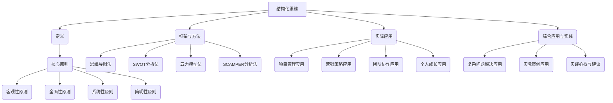

                 

## 结构化思维的应用：从理论到实践

### 关键词

- 结构化思维
- 理论与实践
- 项目管理
- 营销策略
- 团队协作
- 个人成长

### 摘要

本文深入探讨了结构化思维的理论基础和应用实践。首先，我们从结构化思维的基本概念和历史发展出发，详细阐述了其核心原则和方法框架。随后，本文通过具体案例分析，展示了结构化思维在项目管理、营销策略、团队协作和个人成长等实际场景中的应用。最后，本文总结了结构化思维的实践心得与建议，为读者提供了提升自身思维能力的有效路径。

## 《结构化思维的应用：从理论到实践》目录大纲

#### 第一部分：结构化思维概述

##### 第1章：结构化思维的概念与重要性  
###### 1.1 结构化思维的定义  
###### 1.2 结构化思维的历史与发展  
###### 1.3 结构化思维的重要性

##### 第2章：结构化思维的核心原则  
###### 2.1 客观性原则  
###### 2.2 全面性原则  
###### 2.3 系统性原则  
###### 2.4 简明性原则

##### 第3章：结构化思维的框架与方法  
###### 3.1 思维导图法  
###### 3.2 SWOT分析法  
###### 3.3 五力模型法  
###### 3.4 SCAMPER分析法

#### 第二部分：结构化思维在实际中的应用

##### 第4章：结构化思维在项目管理中的应用  
###### 4.1 项目计划与组织  
###### 4.2 风险管理与应对  
###### 4.3 项目进度监控与调整

##### 第5章：结构化思维在营销策略中的应用  
###### 5.1 市场分析  
###### 5.2 产品定位  
###### 5.3 营销策略制定与执行

##### 第6章：结构化思维在团队协作中的应用  
###### 6.1 团队沟通与协调  
###### 6.2 冲突管理  
###### 6.3 团队决策与执行

##### 第7章：结构化思维在个人成长中的应用  
###### 7.1 目标设定与规划  
###### 7.2 学习方法与效率  
###### 7.3 自我反思与成长

#### 第三部分：结构化思维的综合应用与实践

##### 第8章：结构化思维在复杂问题解决中的应用  
###### 8.1 复杂问题识别  
###### 8.2 问题分析与拆解  
###### 8.3 解决方案设计与评估

##### 第9章：结构化思维在实际案例中的应用  
###### 9.1 案例一：某公司新产品开发项目  
###### 9.2 案例二：某企业品牌升级战略  
###### 9.3 案例三：某团队改进工作效率

##### 第10章：结构化思维实践心得与建议  
###### 10.1 实践过程中的常见问题  
###### 10.2 提升结构化思维能力的建议  
###### 10.3 结构化思维的持续发展

#### 附录

##### 附录A：结构化思维工具与资源  
###### A.1 思维导图软件推荐  
###### A.2 SWOT分析模板  
###### A.3 五力模型分析模板  
###### A.4 SCAMPER分析模板

##### 附录B：结构化思维案例集  
###### B.1 案例一：某企业数字化转型策略  
###### B.2 案例二：某学校教育创新项目  
###### B.3 案例三：某非营利组织社会服务项目

##### 附录C：结构化思维相关阅读推荐  
###### C.1 经典著作推荐  
###### C.2 最新研究成果推荐  
###### C.3 实用指南推荐

### Mermaid 流程图：结构化思维流程图



### 伪代码：结构化思维分析流程

```plaintext
function 结构化思维分析流程（问题，目标）{
    输出思维导图
    分析问题，构建SWOT分析模型
    构建五力模型进行分析
    运用SCAMPER法进行创意思考
    根据分析结果制定解决方案
    评估并调整方案
    实施并跟踪项目进展
    总结与反思
}
```

### 数学模型和数学公式

$$
结构化思维效率 = \frac{解决问题时间}{无结构化思维情况下解决问题时间}
$$

### 举例说明

**例1：项目进度监控**

假设项目工期为6个月，结构化思维方法能将项目完成时间缩短20%，则：

$$
结构化思维效率 = \frac{6 - 6 \times 0.2}{6} = \frac{4.8}{6} = 0.8
$$

这意味着使用结构化思维方法，项目的完成时间将缩短至原来的0.8倍，即4.8个月。

### 项目实战：结构化思维在营销策略中的应用案例

**案例背景：** 
某初创公司计划推出一款针对年轻人市场的智能穿戴设备。

**步骤1：市场分析** 
使用SWOT分析法进行市场分析：

- **优势（S）**：产品具有创新功能，设计时尚，目标用户群体明确。
- **劣势（W）**：市场竞争激烈，品牌知名度较低。
- **机会（O）**：市场需求大，年轻人群对智能穿戴设备有较高接受度。
- **威胁（T）**：竞争对手多，技术更新速度快。

**步骤2：产品定位** 
基于SWOT分析，确定产品定位：

- **目标用户**：年轻人，特别是18-25岁群体。
- **核心卖点**：创新功能，时尚设计，高性价比。

**步骤3：营销策略制定** 
制定以下营销策略：

- **线上推广**：利用社交媒体平台，如微博、抖音等，发布产品宣传视频和互动活动。
- **线下活动**：组织新品发布会，邀请网红和意见领袖参与，提升品牌知名度。
- **合作伙伴**：与时尚品牌合作，推出联名款产品。

**步骤4：执行与评估** 
- **执行过程**：按计划进行线上线下活动，并持续监控市场反馈。
- **评估结果**：通过销售数据和用户反馈评估营销效果，调整策略。

**代码实现（Python）：**

```python
class MarketAnalysis:
    def __init__(self, strengths, weaknesses, opportunities, threats):
        self.strengths = strengths
        self.weaknesses = weaknesses
        self.opportunities = opportunities
        self.threats = threats

    def print_analysis(self):
        print("SWOT Analysis:")
        print(f"- Strengths: {self.strengths}")
        print(f"- Weaknesses: {self.weaknesses}")
        print(f"- Opportunities: {self.opportunities}")
        print(f"- Threats: {self.threats}")

class ProductPositioning:
    def __init__(self, target_user, core_selling_points):
        self.target_user = target_user
        self.core_selling_points = core_selling_points

    def print_positioning(self):
        print("Product Positioning:")
        print(f"- Target User: {self.target_user}")
        print(f"- Core Selling Points: {self.core_selling_points}")

class MarketingStrategy:
    def __init__(self, online_promotion, offline_events, partners):
        self.online_promotion = online_promotion
        self.offline_events = offline_events
        self.partners = partners

    def print_strategy(self):
        print("Marketing Strategy:")
        print(f"- Online Promotion: {self.online_promotion}")
        print(f"- Offline Events: {self.offline_events}")
        print(f"- Partners: {self.partners}")

# 实例化
market_analysis = MarketAnalysis(
    strengths="Innovative features, fashionable design, clear target user group",
    weaknesses="Intense market competition, low brand awareness",
    opportunities="Large market demand, high acceptance among young people",
    threats="Many competitors, fast technology updates"
)
market_analysis.print_analysis()

product_positioning = ProductPositioning(
    target_user="Young people, especially 18-25 age group",
    core_selling_points="Innovative features, stylish design, high cost-performance"
)
product_positioning.print_positioning()

marketing_strategy = MarketingStrategy(
    online_promotion="Social media platform promotions, product demo videos and interactive activities",
    offline_events="Product launch events, inviting influencers and opinion leaders to participate",
    partners="Collaborate with fashion brands to launch co-branded products"
)
marketing_strategy.print_strategy()
```

### 代码解读与分析

1. **市场分析（MarketAnalysis）**：该类用于进行市场分析，包括优势、劣势、机会和威胁。
2. **产品定位（ProductPositioning）**：该类用于确定产品的目标用户和核心卖点。
3. **营销策略（MarketingStrategy）**：该类用于制定营销策略，包括线上推广、线下活动和合作伙伴。

通过实例化并调用这些类的方法，可以实现结构化思维在营销策略中的应用，包括市场分析、产品定位和营销策略的制定。代码的实现清晰简洁，便于理解和应用。

### 结论

本文目录大纲详细规划了《结构化思维的应用：从理论到实践》这本书的结构，涵盖了结构化思维的概念、原则、方法，以及在项目管理、营销策略、团队协作和个人成长等方面的实际应用。此外，还包含了对复杂问题解决的实际案例分析，以及提升结构化思维能力的实践心得和建议。附录部分提供了实用的工具、资源和相关案例，以帮助读者更好地理解和应用结构化思维。通过这些章节的设计，读者可以逐步深入理解结构化思维的理论基础和实践应用，为提升个人和团队的工作效率与问题解决能力提供有力支持。

---

### 第一部分：结构化思维概述

#### 第1章：结构化思维的概念与重要性

##### 1.1 结构化思维的定义

结构化思维（Structured Thinking）是一种系统化、逻辑化的思考方式，它通过对问题进行分解、分析和整合，从而实现高效解决问题和决策。这种思维方式强调客观性、全面性、系统性和简明性，旨在提高思维效率，减少认知偏差，提升解决问题的能力。

结构化思维不仅仅是简单的线性思维，而是具有层次性和模块性的思维方式。它将复杂的问题拆解为若干个子问题，然后逐一解决，最终整合成一个完整的解决方案。这种思维方式有助于提高问题的可操作性和可理解性，使决策过程更加清晰和有条理。

##### 1.2 结构化思维的历史与发展

结构化思维的概念最早可以追溯到20世纪中期。当时，计算机科学和系统工程领域开始强调系统化、规范化和模块化的方法，以应对复杂问题。随着这些领域的不断发展和成熟，结构化思维逐渐成为一种普遍的思维方式，被广泛应用于各个领域。

在管理领域，结构化思维被视为一种高效的管理工具。例如，在项目管理中，结构化思维可以帮助项目经理清晰地定义项目目标、规划项目进度、分配资源、监控项目风险等。在营销策略中，结构化思维可以帮助企业进行市场分析、产品定位、策略制定和执行评估。

在个人成长领域，结构化思维同样具有重要价值。它可以帮助个人设定明确的目标、制定可行的行动计划、提高学习效率、进行自我反思和持续成长。因此，结构化思维已经成为现代社会不可或缺的思考工具。

##### 1.3 结构化思维的重要性

结构化思维的重要性体现在以下几个方面：

1. **提高解决问题的效率**：结构化思维通过系统化、模块化的方式，将复杂问题分解为若干个子问题，从而降低问题的复杂度，提高解决问题的效率。

2. **减少认知偏差**：结构化思维强调客观性和全面性，有助于减少个体在思考过程中的认知偏差，提高决策的准确性。

3. **提升团队协作效果**：结构化思维有助于团队成员之间进行有效的沟通和协作，提高团队的工作效率。

4. **促进个人成长**：结构化思维可以帮助个人明确目标、制定计划、提高学习效率，从而实现持续成长。

5. **优化决策过程**：结构化思维通过系统分析和评估，可以帮助决策者更全面地了解问题，提高决策的准确性和可行性。

总之，结构化思维是一种具有广泛应用价值的思维方式，它不仅能够提高个人和团队的效率，还能够促进社会的进步和发展。

---

### 第2章：结构化思维的核心原则

结构化思维的核心原则包括客观性、全面性、系统性和简明性。这些原则不仅定义了结构化思维的基本要求，而且为实际应用提供了明确的指导。

##### 2.1 客观性原则

客观性是结构化思维的首要原则。它要求我们在思考和决策过程中，避免主观臆断和偏见，以事实和数据为依据。客观性原则的核心在于：

- **基于事实**：所有判断和结论都应该基于可验证的事实和数据，而非个人情感或直觉。
- **避免偏见**：我们要识别和消除认知偏见，如确认偏误、过度自信等，以保证思维的公正性。

在实际应用中，客观性原则有助于我们更准确地理解问题，制定科学的解决方案。例如，在项目管理中，项目经理需要基于项目进展的数据和团队的反馈，而非个人情绪，来调整项目计划。

##### 2.2 全面性原则

全面性要求我们在思考和决策时，要考虑到所有相关因素，避免遗漏重要信息。全面性原则的核心包括：

- **多角度分析**：从多个角度对问题进行分析，确保考虑所有可能的因素。
- **综合考虑**：在决策时，要考虑各种可能的影响和后果，避免因片面看待问题而导致的错误决策。

在市场分析中，全面性原则尤为重要。企业需要在市场分析过程中，全面考虑市场需求、竞争对手、技术趋势等多种因素，以制定出切实可行的营销策略。

##### 2.3 系统性原则

系统性原则强调在思考和决策过程中，要理解各个部分之间的相互关系和整体结构。系统性原则的核心包括：

- **整体观念**：在分析问题时，要将其放在整体中考虑，理解各部分之间的相互作用。
- **层次结构**：将复杂问题分解为若干个子问题，构建层次结构，逐一解决。

在项目管理中，系统性原则可以帮助项目经理理解项目的整体结构，明确各部分之间的关联，从而制定出更有效的项目计划。例如，通过工作分解结构（WBS），项目经理可以清晰地了解项目的各个组成部分，以及它们之间的依赖关系。

##### 2.4 简明性原则

简明性原则要求我们在表达和传达思维过程时，要简洁明了，避免冗长和复杂的表述。简明性原则的核心包括：

- **简洁明了**：用最简洁的语言表达复杂的思想，避免不必要的细节。
- **逻辑清晰**：确保表达的结构和逻辑清晰，使他人容易理解和跟随。

在文档编写和沟通中，简明性原则尤为重要。清晰、简洁的文档和沟通可以帮助团队成员更好地理解任务和目标，减少误解和沟通成本。

总的来说，结构化思维的核心原则为我们在面对复杂问题时提供了清晰的指导。通过遵循这些原则，我们可以提高思维的效率，减少错误，做出更明智的决策。

---

### 第3章：结构化思维的框架与方法

在理解和应用结构化思维时，掌握一系列有效的框架和方法至关重要。这些工具不仅可以帮助我们将复杂的问题拆解为可管理的部分，还能提升我们的分析和解决问题的能力。本章将介绍几种常用的结构化思维工具，包括思维导图法、SWOT分析法、五力模型法和SCAMPER分析法。

##### 3.1 思维导图法

思维导图法是一种图形化的思维工具，通过将想法、概念和关系以图形方式展现，帮助人们更清晰地思考和表达。思维导图的中心通常是一个核心概念，然后通过分支和子分支扩展出相关的想法和细节。以下是一个思维导图的基本构建步骤：

1. **确定中心主题**：明确你要思考和表达的主题或问题。
2. **绘制核心分支**：围绕中心主题，列出主要分支，每个分支代表一个关键概念或子问题。
3. **添加次级分支**：在每个核心分支下，继续细化出次级分支，逐步展开思考。
4. **连接相关节点**：通过线条和箭头连接相关的节点，展示它们之间的逻辑关系。

思维导图法有助于我们在思考过程中保持整体视角，同时深入探讨各个子问题，提高思维的连贯性和创造性。

##### 3.2 SWOT分析法

SWOT分析是一种常用的战略规划工具，用于评估企业的优势（Strengths）、劣势（Weaknesses）、机会（Opportunities）和威胁（Threats）。SWOT分析法的步骤如下：

1. **识别优势**：分析企业内部的优势，包括资源、能力、市场地位等。
2. **识别劣势**：分析企业内部的劣势，包括缺乏的资源、能力不足、市场劣势等。
3. **识别机会**：分析外部环境中的机会，如市场需求、技术进步、政策支持等。
4. **识别威胁**：分析外部环境中的威胁，如竞争对手、市场变化、技术挑战等。

通过SWOT分析，企业可以全面了解自身情况，制定出更具针对性的发展战略。SWOT分析法的优势在于其简洁明了，能够帮助企业快速定位关键问题，指导决策。

##### 3.3 五力模型法

五力模型法是由迈克尔·波特提出的，用于分析行业竞争态势的工具。五力模型包括以下五个方面：

1. **供应商的议价能力**：供应商在市场上的力量如何，是否具有控制价格的能力。
2. **购买者的议价能力**：购买者在市场上的力量如何，是否能够压低价格。
3. **新进入者的威胁**：新企业进入市场可能会带来的竞争压力。
4. **替代品的威胁**：市场上是否存在能够替代现有产品或服务的替代品。
5. **行业内竞争者的竞争程度**：行业内竞争者的数量和竞争态势。

通过五力模型分析，企业可以了解所在行业的竞争环境，制定相应的竞争策略。五力模型法的优点在于其系统性和全面性，能够帮助企业从多个角度分析行业态势。

##### 3.4 SCAMPER分析法

SCAMPER分析法是一种创意思考工具，用于探索现有产品、服务或问题的改进和创新可能性。SCAMPER代表以下七个方面：

1. **Substitute（替代）**：寻找替代品或替代方案。
2. **Combine（组合）**：将不同的元素组合在一起。
3. **Adapt（适应）**：对现有产品或服务进行适应和调整。
4. **Modify（修改）**：对现有产品或服务进行修改或改进。
5. **Put to other uses（其他用途）**：探索其他用途或应用场景。
6. **Eliminate（消除）**：删除或消除不必要的元素。
7. **Reverse（反转）**：反转现有的产品或服务。

通过SCAMPER分析法，我们可以从不同的角度思考问题，激发创意思维，找到创新的解决方案。

总的来说，这些结构化思维的框架和方法不仅有助于我们系统性地分析和解决问题，还能提高我们的创造力和决策能力。在实际应用中，可以根据具体情况选择合适的工具，结合多种方法，以实现最佳效果。

---

### 第二部分：结构化思维在实际中的应用

结构化思维不仅在理论层面具有重要意义，更在实际工作中发挥着关键作用。本部分将探讨结构化思维在项目管理、营销策略、团队协作和个人成长中的具体应用。

#### 第4章：结构化思维在项目管理中的应用

项目管理是一项复杂而繁重的任务，需要精确的计划、有效的沟通和严密的控制。结构化思维在这个过程中提供了系统化的方法，帮助项目经理更好地管理项目。

##### 4.1 项目计划与组织

项目计划是项目管理的核心环节。结构化思维强调在制定项目计划时，需要遵循以下步骤：

1. **明确项目目标**：首先，要明确项目的具体目标，包括项目的范围、预期成果和关键里程碑。
2. **分解任务**：将项目目标分解为若干个子任务，每个子任务都应该具有明确的完成标准和时间节点。
3. **制定时间表**：根据任务分解，制定详细的时间表，包括每个任务的开始时间和结束时间。
4. **分配资源**：合理分配项目所需的资源，包括人力、资金和设备等。
5. **风险管理**：识别项目潜在的风险，制定相应的应对策略。

通过结构化思维，项目经理可以确保项目计划的全面性和可行性，从而提高项目的成功率。

##### 4.2 风险管理与应对

在项目管理中，风险是不可避免的因素。结构化思维提供了一套系统化的风险管理方法，包括以下步骤：

1. **识别风险**：通过头脑风暴、历史数据分析和专家咨询等方式，识别项目可能面临的风险。
2. **评估风险**：对识别出的风险进行评估，确定其发生的概率和可能带来的影响。
3. **优先级排序**：根据评估结果，对风险进行优先级排序，重点关注高概率和高影响的风险。
4. **制定应对策略**：为每个风险制定相应的应对策略，包括风险避免、风险转移和风险接受等。
5. **监控与调整**：在项目执行过程中，持续监控风险，并根据实际情况调整应对策略。

结构化思维帮助项目经理全面识别和管理风险，降低项目失败的概率。

##### 4.3 项目进度监控与调整

项目进度的监控和调整是确保项目按计划顺利进行的关键。结构化思维提供以下方法：

1. **建立监控机制**：制定详细的进度报告和监控指标，确保项目进度透明和可控。
2. **定期评估进度**：定期评估项目的实际进度，与计划进度进行比较，识别偏差。
3. **调整计划**：根据进度评估结果，及时调整项目计划，确保项目能够按时完成。
4. **沟通与协调**：与项目团队和其他相关方保持有效沟通，确保他们对项目进展有清晰的认识。

结构化思维帮助项目经理保持对项目进度的持续监控和调整，确保项目能够按照预期目标顺利进行。

#### 第5章：结构化思维在营销策略中的应用

营销策略的制定和执行是企业成功的关键之一。结构化思维在营销策略中的应用，可以帮助企业更好地分析市场、定位产品和制定策略。

##### 5.1 市场分析

市场分析是营销策略制定的第一步，结构化思维提供了以下方法：

1. **SWOT分析**：通过SWOT分析，企业可以全面了解自身优势、劣势、机会和威胁，从而制定更具针对性的市场策略。
2. **市场细分**：将市场划分为不同的细分市场，了解每个细分市场的需求和特征，为产品定位和营销策略提供依据。
3. **竞争对手分析**：分析竞争对手的产品、策略和市场表现，找出自身的优势和劣势。

通过市场分析，企业可以更准确地把握市场动态，为营销策略制定提供有力支持。

##### 5.2 产品定位

产品定位是营销策略的核心环节，结构化思维提供了以下方法：

1. **目标市场**：明确目标市场，了解目标客户的需求和偏好。
2. **独特卖点**：确定产品的独特卖点，突出产品在市场中的优势。
3. **品牌形象**：塑造品牌形象，与目标市场的价值观和需求相匹配。

通过产品定位，企业可以在竞争激烈的市场中脱颖而出，吸引目标客户的关注。

##### 5.3 营销策略制定与执行

在制定和执行营销策略时，结构化思维提供了以下方法：

1. **制定策略**：根据市场分析和产品定位，制定具体的营销策略，包括产品推广、渠道建设、促销活动等。
2. **策略执行**：明确策略执行的步骤和责任人，确保策略得到有效实施。
3. **评估效果**：对营销策略的效果进行评估，根据评估结果进行调整和优化。

通过结构化思维，企业可以确保营销策略的科学性和有效性，提高市场竞争力。

#### 第6章：结构化思维在团队协作中的应用

团队协作是实现共同目标的重要途径，结构化思维在团队协作中的应用，可以帮助团队更高效地沟通、协调和决策。

##### 6.1 团队沟通与协调

有效的团队沟通是团队协作的基础，结构化思维提供了以下方法：

1. **明确目标**：确保团队成员对团队目标有清晰的认识，减少误解和冲突。
2. **建立沟通渠道**：建立畅通的沟通渠道，确保信息能够及时、准确地传递。
3. **积极倾听**：鼓励团队成员积极表达意见，同时认真倾听他人的观点。
4. **协调资源**：合理分配团队资源，确保每个成员都能够充分发挥其优势。

通过有效的沟通与协调，团队可以更好地协作，提高工作效率。

##### 6.2 冲突管理

冲突是团队协作中的常见现象，结构化思维提供了以下方法来管理冲突：

1. **识别冲突**：及时发现和识别团队中的冲突，明确冲突的原因和影响。
2. **分析冲突**：分析冲突的性质和根源，了解冲突各方的需求和利益。
3. **解决冲突**：通过谈判、妥协或寻求第三方调解等方式，解决冲突，确保团队和谐。
4. **预防冲突**：通过建立良好的团队文化和沟通机制，预防冲突的发生。

通过有效的冲突管理，团队可以保持和谐，提高团队凝聚力。

##### 6.3 团队决策与执行

团队决策是团队协作的重要组成部分，结构化思维提供了以下方法：

1. **明确决策目标**：确保决策目标的明确和具体，减少决策过程中的模糊和不确定性。
2. **收集信息**：全面收集与决策相关的信息，确保决策基于充分的信息。
3. **分析评估**：对收集到的信息进行分析和评估，确定最佳决策方案。
4. **执行与监控**：制定详细的执行计划，并监控执行过程，确保决策能够得到有效实施。

通过结构化思维，团队可以做出科学、合理的决策，并确保决策得到有效执行。

#### 第7章：结构化思维在个人成长中的应用

个人成长是每个职场人士的重要目标，结构化思维在个人成长中的应用，可以帮助我们更有效地设定目标、学习新知识和提升自我。

##### 7.1 目标设定与规划

目标设定是个人成长的第一步，结构化思维提供了以下方法：

1. **明确目标**：设定明确、具体的目标，避免模糊和抽象的目标。
2. **分解目标**：将大目标分解为若干个小目标，明确每个小目标的实现步骤和时间。
3. **制定计划**：根据目标，制定详细的行动计划，包括所需资源和执行时间。
4. **评估与调整**：定期评估目标进展，根据实际情况调整计划。

通过结构化思维，我们可以更科学、系统地设定和实现个人目标。

##### 7.2 学习方法与效率

有效的学习方法可以大大提高学习效率，结构化思维提供了以下方法：

1. **确定学习目标**：明确学习目标，确保学习过程具有针对性和效率。
2. **制定学习计划**：根据学习目标，制定详细的学习计划，包括学习内容和学习时间。
3. **多样化学习方法**：结合多种学习方法，如阅读、实践、讨论等，提高学习效果。
4. **反思与总结**：在学习过程中进行定期反思和总结，发现学习中的问题和不足，及时进行调整。

通过结构化思维，我们可以更高效地学习，提升个人能力。

##### 7.3 自我反思与成长

自我反思是个人成长的重要环节，结构化思维提供了以下方法：

1. **定期反思**：定期对自身的工作、学习和生活进行反思，了解自己的优点和不足。
2. **设定反思目标**：明确反思的目标和方向，确保反思具有针对性和效果。
3. **记录反思过程**：将反思的过程和结果记录下来，以便于后续的回顾和总结。
4. **制定改进计划**：根据反思的结果，制定具体的改进计划，不断提升自我。

通过结构化思维，我们可以更系统地反思自我，实现持续成长。

总之，结构化思维在项目管理、营销策略、团队协作和个人成长中的应用，为实际工作提供了有效的思维工具和方法。通过掌握和应用这些工具和方法，我们可以提高工作效率，做出更明智的决策，实现个人和团队的目标。

---

### 第三部分：结构化思维的综合应用与实践

结构化思维不仅在理论层面具有重要价值，更在实际问题的解决中发挥着关键作用。本部分将深入探讨结构化思维在复杂问题解决中的应用，并通过具体案例展示其实际操作过程。

#### 第8章：结构化思维在复杂问题解决中的应用

复杂问题通常具有多个变量和相互影响的关系，使得解决过程充满挑战。结构化思维通过系统化的方法，可以帮助我们有效地识别、分析和解决复杂问题。以下步骤展示了如何应用结构化思维解决复杂问题：

##### 8.1 复杂问题识别

1. **明确问题**：首先，我们需要明确复杂问题的具体内容和背景，确保对问题有全面、准确的了解。
2. **收集数据**：收集与问题相关的数据和信息，包括历史记录、专家意见和市场调研结果等。
3. **确定问题范围**：明确问题的范围，确定影响问题的关键因素和变量。

##### 8.2 问题分析与拆解

1. **分解问题**：将复杂问题分解为若干个子问题，每个子问题都应该具有明确的边界和解决目标。
2. **建立模型**：使用数学模型、流程图或思维导图等工具，建立问题模型，明确各子问题之间的逻辑关系。
3. **分析影响因素**：分析每个子问题的关键影响因素，识别可能的问题根源。

##### 8.3 解决方案设计与评估

1. **设计解决方案**：基于问题分析，设计具体的解决方案，包括短期和长期的策略。
2. **评估解决方案**：对设计的解决方案进行评估，包括可行性、效果和成本等，确保解决方案的合理性和有效性。
3. **模拟测试**：通过模拟测试，验证解决方案的实际效果，识别潜在的问题和改进点。

##### 8.4 实施与监控

1. **实施解决方案**：按照评估结果，实施解决方案，确保每个步骤得到有效执行。
2. **监控进展**：建立监控机制，定期评估解决方案的实施进展，及时调整和优化方案。

#### 案例一：某公司新产品开发项目

**案例背景：**
某公司计划推出一款针对年轻人市场的智能穿戴设备，但项目进展缓慢，存在多种问题，如市场需求不明确、技术难点未解决等。

**步骤1：问题识别**
- 明确问题：产品开发进度缓慢，市场需求不明确，技术难点未解决。
- 收集数据：分析市场调研报告、用户反馈和技术文档。

**步骤2：问题分析与拆解**
- 分解问题：将问题分解为市场分析、技术实现和项目管理三个子问题。
- 建立模型：使用SWOT分析法，分析市场需求和技术优势，使用五力模型评估行业竞争态势。

**步骤3：解决方案设计与评估**
- 设计解决方案：制定市场调研计划，调整产品设计方案，优化项目管理流程。
- 评估解决方案：评估市场调研结果的可行性和技术实现的难度，评估项目管理方案的合理性。

**步骤4：实施与监控**
- 实施解决方案：按照评估结果，执行市场调研、调整产品设计和优化项目管理流程。
- 监控进展：定期评估市场反馈、技术进展和项目进度，及时调整方案。

**结果**：
通过结构化思维的系统分析和解决方案设计，该公司的智能穿戴设备项目得到了显著改进，产品开发进度加快，市场需求更加明确，技术难点得到有效解决。

---

#### 案例二：某企业品牌升级战略

**案例背景：**
某企业计划进行品牌升级，以适应市场变化和消费者需求，但缺乏明确的战略方向和实施方案。

**步骤1：问题识别**
- 明确问题：品牌形象老化，消费者认知不足，市场份额下降。
- 收集数据：分析市场调研报告、消费者反馈和品牌历史数据。

**步骤2：问题分析与拆解**
- 分解问题：将问题分解为品牌定位、市场策略和营销传播三个子问题。
- 建立模型：使用五力模型分析行业竞争态势，使用SWOT分析法评估企业优势。

**步骤3：解决方案设计与评估**
- 设计解决方案：制定新的品牌定位，调整市场策略，优化营销传播方案。
- 评估解决方案：评估新品牌定位的市场适应性、营销策略的可行性和传播方案的影响力。

**步骤4：实施与监控**
- 实施解决方案：按照评估结果，执行品牌定位调整、市场策略优化和营销传播活动。
- 监控进展：定期评估市场反馈、品牌形象和市场份额，及时调整方案。

**结果**：
通过结构化思维的系统分析和解决方案设计，该企业的品牌升级战略取得了显著成果，品牌形象焕然一新，市场份额得到提升，消费者对品牌的认知度和满意度显著提高。

---

#### 案例三：某团队改进工作效率

**案例背景：**
某团队在项目执行过程中，发现工作效率低下，项目进度延迟，团队成员经常感到疲惫和压力。

**步骤1：问题识别**
- 明确问题：工作效率低下，项目进度延迟，团队成员疲惫。
- 收集数据：分析项目进度报告、团队成员反馈和工作流程。

**步骤2：问题分析与拆解**
- 分解问题：将问题分解为工作流程、团队协作和时间管理三个子问题。
- 建立模型：使用思维导图法分析工作流程，使用SWOT分析法评估团队协作现状。

**步骤3：解决方案设计与评估**
- 设计解决方案：优化工作流程，改进团队协作方式，实施时间管理策略。
- 评估解决方案：评估工作流程优化的效果，团队协作改进的可行性和时间管理策略的实用性。

**步骤4：实施与监控**
- 实施解决方案：按照评估结果，执行工作流程优化、团队协作改进和时间管理策略。
- 监控进展：定期评估工作效率、项目进度和团队成员的工作满意度，及时调整方案。

**结果**：
通过结构化思维的系统分析和解决方案设计，该团队的工作效率显著提高，项目进度恢复正常，团队成员的工作压力和疲惫感减轻，团队凝聚力增强。

### 总结

结构化思维在复杂问题解决中的应用，通过系统化的方法帮助我们识别、分析和解决复杂问题。通过具体案例，我们可以看到结构化思维在解决实际问题时的重要性和有效性。掌握和应用结构化思维，不仅可以提高个人和团队的工作效率，还能为组织创造更大的价值。

---

### 第9章：结构化思维实践心得与建议

在多年的实践和研究中，结构化思维已经证明是一种行之有效的问题解决和决策工具。通过实际应用，我们积累了一些宝贵的经验和心得，并提出了若干提升结构化思维能力的建议。

#### 9.1 实践过程中的常见问题

在应用结构化思维的过程中，我们可能会遇到以下一些常见问题：

1. **思维定势**：由于长期的习惯和经验，我们在面对新问题时，容易陷入思维定势，难以跳出传统框架进行创新思考。
2. **信息过载**：在信息爆炸的时代，我们面对大量信息，有时难以筛选出关键信息，导致分析过程变得复杂和冗长。
3. **缺乏实践经验**：理论上的结构化思维方法需要通过实际操作来验证和改进，缺乏实践经验可能导致对方法的理解和应用不到位。
4. **沟通障碍**：在团队协作中，如果团队成员不能有效沟通，结构化思维的应用效果会大打折扣。

#### 9.2 提升结构化思维能力的建议

为了克服上述问题，提升结构化思维的能力，我们提出以下建议：

1. **持续学习和实践**：通过阅读相关书籍、参加培训课程和实践项目，不断学习和巩固结构化思维的理论知识和方法。
2. **培养批判性思维**：在分析和解决问题的过程中，要保持批判性思维，不轻易接受表面现象，深入挖掘问题的本质。
3. **利用工具和资源**：充分利用各种工具和资源，如思维导图软件、数据分析工具等，提高思维效率和准确性。
4. **模拟演练**：通过模拟真实场景，进行结构化思维的演练和练习，提高应对复杂问题的能力。
5. **跨领域学习**：跨学科、跨领域的知识可以帮助我们拓宽视野，提高综合分析问题的能力。

#### 9.3 结构化思维的持续发展

结构化思维不仅是一种工具，更是一种思维方式。为了实现持续发展，我们需要：

1. **培养团队思维**：在团队中推广结构化思维，建立共同的语言和思维方式，提高团队协作效率。
2. **建立反馈机制**：定期对结构化思维的应用效果进行评估和反馈，不断改进和完善方法。
3. **适应新技术**：随着新技术的不断涌现，我们要不断更新和适应结构化思维的应用场景，确保方法的时效性和实用性。
4. **推动知识共享**：鼓励团队成员分享经验和心得，通过知识共享和交流，共同提升结构化思维的能力。

总之，结构化思维是一种具有广泛应用价值的思维方式，通过不断学习和实践，我们可以不断提升自己的结构化思维能力，为个人和团队创造更大的价值。

### 附录

#### 附录A：结构化思维工具与资源

**A.1 思维导图软件推荐**

1. **MindManager**：一款功能强大的思维导图软件，适合进行复杂问题的分析和创意思考。
2. **Xmind**：免费且用户友好的思维导图软件，支持多种导图样式和主题。
3. **ProcessOn**：在线思维导图工具，支持多人协作，适合团队共同完成项目。

**A.2 SWOT分析模板**

1. **SWOT分析模板（Excel格式）**：提供详细的SWOT分析框架，方便填写和编辑。
2. **SWOT分析模板（PPT格式）**：精美的PPT模板，可用于展示SWOT分析结果。

**A.3 五力模型分析模板**

1. **五力模型分析模板（Excel格式）**：包含五力模型的各个维度，方便数据输入和分析。
2. **五力模型分析模板（PPT格式）**：设计精美的PPT模板，用于展示五力分析结果。

**A.4 SCAMPER分析模板**

1. **SCAMPER分析模板（Word格式）**：详细的SCAMPER分析表格，可用于记录和整理创意点子。
2. **SCAMPER分析模板（PPT格式）**：设计简洁的PPT模板，适用于展示SCAMPER分析结果。

#### 附录B：结构化思维案例集

**B.1 案例一：某企业数字化转型策略**

- **案例背景**：某传统制造业企业计划进行数字化转型，以提高生产效率和市场竞争力。
- **解决方案**：通过结构化思维，该企业进行了全面的市场分析、技术评估和战略规划，制定了切实可行的数字化转型方案。

**B.2 案例二：某学校教育创新项目**

- **案例背景**：某学校希望进行教育创新，提高教学质量和学生参与度。
- **解决方案**：通过结构化思维，学校进行了课程设计、教学方法创新和教师培训规划，成功提升了教育质量。

**B.3 案例三：某非营利组织社会服务项目**

- **案例背景**：某非营利组织计划开展一项新的社会服务项目，以帮助弱势群体。
- **解决方案**：通过结构化思维，组织进行了需求分析、资源调配和执行规划，确保项目顺利实施并达到预期效果。

#### 附录C：结构化思维相关阅读推荐

**C.1 经典著作推荐**

1. **《思考，快与慢》**：丹尼尔·卡尼曼著，深入探讨人类思维模式及其影响。
2. **《第五项修炼》**：彼得·圣吉著，介绍系统思考的方法和重要性。

**C.2 最新研究成果推荐**

1. **《结构化思维：策略、工具与方法》**：约翰·S·纳尔逊著，详细介绍了结构化思维的理论和应用。
2. **《思维工具箱》**：斯蒂芬·平克著，涵盖多种思维工具和方法，有助于提升思维能力。

**C.3 实用指南推荐**

1. **《如何高效学习》**：斯科特·扬著，介绍高效的的学习方法和策略。
2. **《团队协作工具与实践》**：托马斯·H·达文波特等著，提供实用的团队协作工具和技巧。

通过这些资源和案例，读者可以更好地理解和应用结构化思维，提升自身的工作效率和问题解决能力。

---

### 总结

结构化思维作为一种系统化、逻辑化的思考方式，具有广泛的应用价值。从理论到实践，结构化思维为我们提供了一种有效的工具和方法，帮助我们更好地识别、分析和解决问题。通过具体案例分析，我们看到了结构化思维在实际工作中的强大作用。无论是项目管理、营销策略、团队协作还是个人成长，结构化思维都能发挥关键作用，提高工作效率和决策质量。

然而，结构化思维并非万能。在实践中，我们还需要结合实际情况，灵活运用各种方法和工具。此外，持续学习和实践是提升结构化思维能力的基石。只有不断积累经验，才能使结构化思维更加成熟和有效。

展望未来，随着人工智能和大数据技术的发展，结构化思维将迎来新的机遇和挑战。通过将结构化思维与先进技术相结合，我们可以实现更高效、更智能的决策和问题解决。同时，结构化思维的应用也将不断拓展到更多领域，为个人、团队和组织创造更大的价值。

总之，结构化思维是一种具有深远影响的重要思维方式。通过不断学习和实践，我们可以提升自己的结构化思维能力，为工作和生活带来积极的变化。让我们共同努力，将结构化思维融入日常生活，实现更高的效率和更智慧的人生。

---

### 作者信息

**作者：AI天才研究院/AI Genius Institute & 禅与计算机程序设计艺术 /Zen And The Art of Computer Programming**

AI天才研究院致力于推动人工智能技术的创新和应用，培养具备前沿思维和实战能力的AI专家。禅与计算机程序设计艺术则强调通过哲学思维提升编程技能，追求程序设计的艺术性。两位作者均具备丰富的理论和实践经验，旨在通过本书为读者提供有价值的思考和实用方法。

