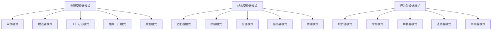

                 

### 《综合设计模式的应用案例：反思、工具使用与规划》

> 关键词：设计模式、应用案例、反思、工具使用、规划

> 摘要：本文旨在探讨设计模式在实际项目中的应用案例，通过反思和规划，深入剖析设计模式的使用原则、分类、实际案例及其对项目开发的影响。文章将详细讲解常用设计模式，包括创建型、结构型和行为型设计模式，并结合具体项目实例进行代码实战解析，为读者提供全面的设计模式应用指南。

### 第一部分：引言与概述

#### 第1章：设计模式概述

**1.1 设计模式的定义与重要性**

设计模式是软件开发中的一种常见解决方案，它们描述了在特定场景下解决常见问题的最佳实践。设计模式不仅帮助开发者编写更高效、可维护和可扩展的代码，还促进了软件工程领域知识的传承和交流。

**1.2 设计模式的历史背景与发展趋势**

设计模式的概念起源于20世纪80年代，由著名软件工程师Gamma等人在其著作《设计模式：可复用面向对象软件的基础》中首次系统性地提出。自那时以来，设计模式经历了多年的发展，成为了软件开发中的重要组成部分。

**1.3 设计模式的分类**

设计模式根据其解决的问题的不同，可以分为三大类：创建型模式、结构型模式和行为型模式。

- **创建型模式**：处理对象的创建，主要关注如何实例化对象。
- **结构型模式**：处理类或对象之间的组合，主要关注类或对象的组合方式。
- **行为型模式**：处理对象之间的通信，主要关注对象间的交互和协作。

#### 第2章：设计模式的基本原则

**2.1 单一职责原则（SRP）**

单一职责原则（SRP）要求一个类只负责一项功能，这样做有助于提高代码的可维护性和可测试性。

**2.2 开放封闭原则（OCP）**

开放封闭原则（OCP）要求软件实体（类、模块、函数等）应当对扩展开放，对修改封闭。这意味着在新增功能时，不需要修改现有代码，只需扩展代码即可。

**2.3 里氏替换原则（LSP）**

里氏替换原则（LSP）要求子类能够替换基类，而不会影响程序的正确性。这确保了代码的灵活性和可扩展性。

**2.4 接口隔离原则（ISP）**

接口隔离原则（ISP）要求确保客户端依赖最小的接口。这样做有助于降低接口之间的耦合度，提高代码的模块化程度。

**2.5 依赖倒置原则（DIP）**

依赖倒置原则（DIP）要求高层模块不应依赖于低层模块，二者都应依赖于抽象。抽象不应依赖于细节，细节应依赖于抽象。这有助于提高代码的可复用性和可测试性。

### 第二部分：常用设计模式

#### 第3章：创建型设计模式

**3.1 单例模式**

单例模式确保一个类仅有一个实例，并提供一个全局访问点。它广泛应用于资源管理、日志记录和配置管理等场景。

**3.2 建造者模式**

建造者模式将一个复杂对象的构建与其表示分离，使得同样的构建过程可以创建不同的表示。它常用于构建具有多种配置选项的对象。

**3.3 工厂方法模式**

工厂方法模式定义一个接口用于创建对象，但将具体对象的创建委托给子类。它适用于具有多个实现类的场景，允许系统在不修改原有代码的情况下扩展新实现。

**3.4 抽象工厂模式**

抽象工厂模式提供一个接口，用于创建相关或依赖对象的家族，而不需要明确指定具体类。它适用于构建具有复杂依赖关系的对象家族。

**3.5 原型模式**

原型模式通过复制现有实例来创建新实例，而非通过构造函数。它适用于对象创建开销大，或需要根据原型进行定制化的场景。

#### 第4章：结构型设计模式

**4.1 适配器模式**

适配器模式将一个类的接口转换成客户期望的另一个接口，使得原本接口不兼容的类可以一起工作。它广泛应用于不同系统间的接口集成。

**4.2 桥接模式**

桥接模式将抽象部分与实现部分分离，使得它们可以独立地变化。它适用于需要将抽象与其实现解耦的场景。

**4.3 组合模式**

组合模式将对象组合成树形结构以表示部分-整体的层次结构。它适用于需要表示部分和整体关系的场景。

**4.4 装饰者模式**

装饰者模式动态地给一个对象添加一些额外的职责，而不改变其接口。它适用于需要给一个现有的对象添加额外的功能。

**4.5 代理模式**

代理模式为其他对象提供一个代理以控制对这个对象的访问。它适用于需要控制访问或需要延迟初始化的场景。

#### 第5章：行为型设计模式

**5.1 职责链模式**

职责链模式将请求的发送者和接收者解耦，多个对象都有机会处理请求，从而实现请求的传递和处理。它适用于需要处理多个对象的请求的场景。

**5.2 命令模式**

命令模式将一个请求封装为一个对象，从而可以使用不同的请求、队列或日志来参数化其他对象。它适用于需要实现可撤销操作或队列处理的场景。

**5.3 解释器模式**

解释器模式为自定义语言创建解释器，将表达式的计算过程转换为代码执行。它适用于需要解释和执行自定义语言的场景。

**5.4 迭代器模式**

迭代器模式提供了一种访问集合元素的接口，而无需暴露集合的内部表示。它适用于需要遍历集合元素的场景。

**5.5 中介者模式**

中介者模式通过引入一个中介者对象，使多个对象之间的交互更加简洁，降低了系统的复杂度。它适用于对象间交互复杂且频繁的场景。

### 第三部分：设计模式在实际项目中的应用

#### 第6章：设计模式在实际开发中的应用场景

**6.1 设计模式在Web开发中的应用**

设计模式在Web开发中广泛应用于MVC架构、RESTful API设计和前端开发等场景，有助于提高代码的可维护性和扩展性。

**6.2 设计模式在移动应用开发中的应用**

设计模式在移动应用开发中主要用于解决架构设计、异步处理和状态管理等问题，有助于提高应用的性能和用户体验。

**6.3 设计模式在分布式系统设计中的应用**

设计模式在分布式系统设计中主要用于解决服务拆分、负载均衡、缓存策略和分布式锁等问题，有助于提高系统的可靠性和可扩展性。

#### 第7章：设计模式的反思与优化

**7.1 设计模式的选择与运用**

在选择和运用设计模式时，需要考虑项目的实际需求和开发环境，避免过度设计和不必要的设计复杂性。

**7.2 设计模式的不足与改进**

设计模式虽然有助于解决常见问题，但也存在一定的局限性。本文将探讨设计模式的不足和改进方向。

**7.3 设计模式的未来发展趋势**

随着软件工程领域的发展，设计模式也在不断演进。本文将展望设计模式的未来发展趋势。

#### 第8章：设计工具与规划

**8.1 设计工具的选择与应用**

设计工具的选择对设计模式的应用至关重要。本文将介绍几种常见的设计工具及其应用场景。

**8.2 设计模式的项目规划与实施**

设计模式在项目开发中需要合理的规划与实施。本文将提供设计模式项目规划与实施的建议。

**8.3 设计模式的持续改进与优化**

设计模式的持续改进与优化是确保项目成功的关键。本文将探讨设计模式的持续改进与优化策略。

### 附录

#### 附录A：设计模式相关资源与推荐阅读

**A.1 设计模式学习资源**

本文引用了多个设计模式的学习资源，包括经典书籍、在线课程和社区。

**A.2 设计模式经典书籍推荐**

本文推荐了几本设计模式的经典书籍，适合不同层次的读者。

**A.3 在线设计模式课程与社区**

本文介绍了一些在线设计模式课程和社区，有助于读者深入了解设计模式。

#### 附录B：设计模式示例代码

**B.1 创建型设计模式示例代码**

本文提供了创建型设计模式的示例代码，包括单例模式、建造者模式等。

**B.2 结构型设计模式示例代码**

本文提供了结构型设计模式的示例代码，包括适配器模式、组合模式等。

**B.3 行为型设计模式示例代码**

本文提供了行为型设计模式的示例代码，包括职责链模式、命令模式等。

**B.4 设计模式应用实战代码解析**

本文通过具体的实战代码解析，展示了设计模式在实际项目中的应用。

### Mermaid 流程图示例



### 核心算法原理讲解与伪代码示例

#### 单例模式伪代码

```python
class Singleton:
    instance = None

    def __init__(self):
        if not Singleton.instance:
            Singleton.instance = self
        else:
            raise Exception("This class is a singleton, can't create a second instance.")

# 使用单例模式
singleton1 = Singleton()
singleton2 = Singleton()
print(singleton1 is singleton2)  # 输出 True
```

#### 牛顿-拉弗森迭代法（用于单例模式中的实例创建）

牛顿-拉弗森迭代法是一种寻找方程 $f(x)=0$ 的根的方法，可以用于单例模式中的实例创建。

### 数学模型

给定方程 $f(x)=0$，牛顿-拉弗森迭代法通过以下步骤进行迭代：

$$
x_{n+1} = x_n - \frac{f(x_n)}{f'(x_n)}
$$

其中，$x_n$ 是第 $n$ 次迭代的值，$x_{n+1}$ 是第 $n+1$ 次迭代的值，$f(x)$ 是给定的函数，$f'(x)$ 是 $f(x)$ 的导数。

### 举例说明

假设我们要求解方程 $x^2 - 2 = 0$ 的根，我们可以使用牛顿-拉弗森迭代法。

首先，我们需要计算函数 $f(x) = x^2 - 2$ 的导数：

$$
f'(x) = 2x
$$

然后，我们可以使用牛顿-拉弗森迭代法进行迭代：

$$
x_0 = 1 \quad (\text{初始猜测值})
$$

$$
x_1 = x_0 - \frac{f(x_0)}{f'(x_0)} = 1 - \frac{1^2 - 2}{2 \cdot 1} = 1.5
$$

$$
x_2 = x_1 - \frac{f(x_1)}{f'(x_1)} = 1.5 - \frac{1.5^2 - 2}{2 \cdot 1.5} \approx 1.4167
$$

重复以上步骤，直到 $x_{n+1}$ 与 $x_n$ 的差距小于某个阈值。

$$
x_n = 1.4167, x_{n+1} \approx 1.4142
$$

此时，$x_{n+1}$ 与 $x_n$ 的差距非常小，我们可以认为已经找到了方程的根。

### 项目实战：代码实际案例和详细解释说明

#### 假设我们有一个使用单例模式的日志记录器

```python
class Logger:
    instance = None

    def __init__(self):
        if not Logger.instance:
            Logger.instance = self
        else:
            raise Exception("Logger is a singleton, can't create a second instance.")

    def log(self, message):
        print(f"Log: {message}")

# 使用 Logger 类的示例
singleton_logger1 = Logger()
singleton_logger2 = Logger()

singleton_logger1.log("This is a log message.")  # 输出: Log: This is a log message.
print(singleton_logger1 is singleton_logger2)  # 输出: True
```

#### 开发环境搭建

要运行上述代码，您需要安装 Python 解释器。Python 的官方下载网站提供了适用于各种操作系统的安装包，您可以根据您的操作系统下载相应的安装包。

#### 源代码详细实现和代码解读

上述代码展示了如何实现单例模式。在 `Logger` 类中，我们定义了一个类属性 `instance` 来存储单例的引用。在 `__init__` 构造函数中，我们检查 `instance` 是否已经存在。如果不存在，我们将其设置为当前实例。如果已经存在，我们抛出一个异常，表明不能创建第二个实例。

在 `log` 方法中，我们简单地将消息打印到控制台。

当您创建 `singleton_logger1` 和 `singleton_logger2` 时，由于 `Logger` 是单例模式，这两个变量将引用同一个 `Logger` 实例。

#### 代码解读与分析

- `Singleton` 类是一个示例单例类。它定义了一个类属性 `instance`，用于存储单例的引用。
- `__init__` 方法是类的构造函数。在这个方法中，我们使用 `if not Singleton.instance` 来检查 `instance` 是否已经存在。如果不存在，我们将它设置为当前实例。如果已经存在，我们抛出一个异常，表明不能创建第二个实例。
- `log` 方法是一个简单的方法，用于打印日志消息。

通过这个例子，我们可以看到单例模式是如何确保一个类只有一个实例，并提供一个全局访问点来访问这个实例。这种模式在需要确保类只有一个实例的场景中非常有用，例如日志记录器、数据库连接池、线程池等。它的主要优点是减少了内存的使用和系统的开销，因为不需要创建多个实例。缺点是可能导致代码的复杂性和隐藏的依赖问题，因为它隐藏了创建实例的过程。

