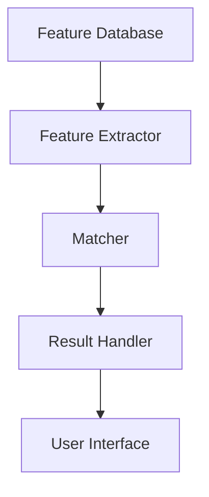
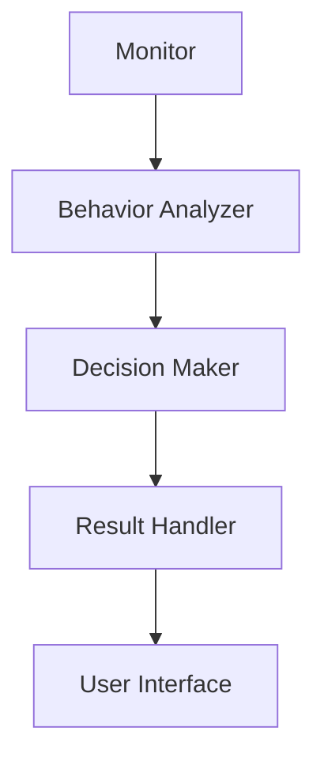
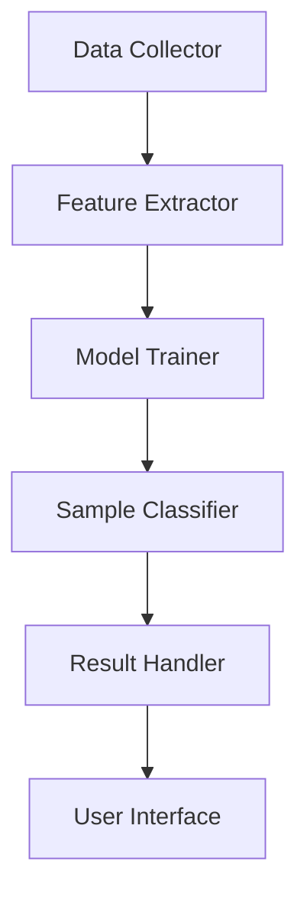
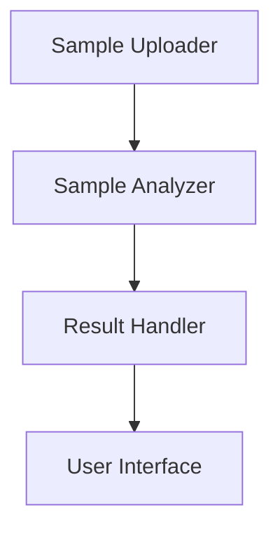
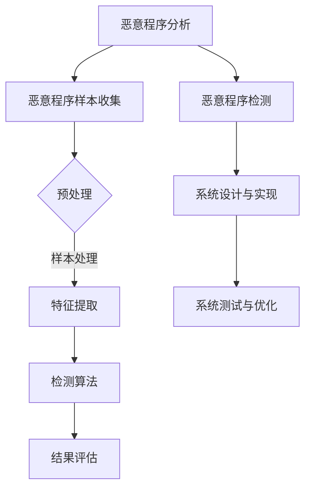

                 

### 《网络安全中恶意程序的分析与检测》

关键词：恶意程序、网络安全、分析、检测、特征提取、行为检测、智能检测、云安全检测

摘要：
本文旨在深入探讨网络安全中恶意程序的分析与检测技术。首先，我们将介绍恶意程序的基本概念、分类及其对网络的危害。接着，文章将详细讲解计算机病毒、木马和蠕虫病毒的基本原理。随后，我们将讨论恶意软件分析工具的种类及其使用方法，并探讨这些工具的局限性。在第二部分，我们将介绍恶意程序检测技术，包括特征检测、行为检测、智能检测和云安全检测。我们将通过伪代码和数学公式详细阐述这些技术的核心原理，并提供实际案例进行说明。第三部分将聚焦于恶意程序分析实践，包括样本收集与处理、恶意程序检测系统开发实践，以及恶意程序分析在网络安全中的应用。最后，我们将提供恶意程序分析常用工具与资源，并讨论恶意程序分析的未来发展趋势与挑战。

### 第一部分：恶意程序分析基础

#### 1.1 恶意程序概述

##### 1.1.1 恶意程序的定义

恶意程序（Malware）是指被设计用来恶意影响计算机系统、网络和数据的一类软件。它们可以执行各种恶意行为，如窃取敏感信息、破坏数据、窃取资源、监控用户行为等。恶意程序的目的是使攻击者获得不正当的利益，或者对受害者造成损害。

##### 1.1.2 恶意程序的分类

恶意程序可以根据其功能和特性进行分类。常见的分类方法包括：

1. **计算机病毒（Viruses）**：一种能够自我复制并感染其他程序的恶意软件。病毒通常通过执行恶意代码来破坏系统或窃取数据。
2. **木马（Trojans）**：伪装成合法程序的恶意软件，其目的是在受害者计算机上执行未经授权的操作。木马通常不自我复制，而是通过远程控制来实现其恶意行为。
3. **蠕虫病毒（Worms）**：一种能够自我复制并通过网络传播的恶意软件。蠕虫病毒通常会利用网络漏洞来传播，并可能在感染系统中执行各种恶意行为。
4. **间谍软件（Spyware）**：用于监视和收集用户隐私信息的恶意软件。间谍软件通常会在用户不知情的情况下运行，并可能向第三方发送收集到的信息。
5. **广告软件（Adware）**：一种在用户计算机上显示广告的恶意软件。虽然广告软件本身通常不会造成严重损害，但它们可能会影响用户的正常使用体验，并泄露隐私信息。
6. **勒索软件（Ransomware）**：一种能够加密用户文件并要求赎金以解密的恶意软件。勒索软件通常会对用户的数据造成永久性损害，除非支付赎金。
7. **恶意软件家族（Malware Families）**：多个具有相似特性的恶意软件的集合。例如，Win32/TrojanDownloader是一个木马家族，包含了多种木马变种。

##### 1.1.3 恶意程序的危害

恶意程序对计算机系统、网络和数据构成严重威胁。其危害包括但不限于以下几点：

1. **数据泄露**：恶意程序可以窃取敏感信息，如用户账户密码、信用卡信息、个人隐私等，并将其发送给攻击者。
2. **系统破坏**：某些恶意程序会破坏系统文件、删除数据或覆盖硬盘，导致系统无法正常运行。
3. **资源消耗**：恶意程序可能会占用大量系统资源，导致计算机运行缓慢甚至死机。
4. **网络攻击**：恶意程序可以作为攻击工具，用于发起拒绝服务攻击（DDoS）、入侵其他计算机等。
5. **隐私泄露**：间谍软件和其他恶意软件可能会监视用户行为，收集用户隐私信息，并将其泄露给第三方。
6. **经济损失**：企业可能会因为恶意程序攻击而遭受经济损失，包括系统修复成本、数据恢复费用、法律赔偿等。

#### 1.2 计算机病毒的基本原理

##### 1.2.1 病毒的生命周期

计算机病毒的生命周期通常包括以下几个阶段：

1. **潜伏期**：病毒隐藏在系统中，等待执行时机。
2. **传播期**：病毒通过感染其他程序或文件进行传播。
3. **激活期**：病毒在特定条件下（如系统启动、用户执行特定操作等）被激活，执行恶意行为。
4. **爆发期**：病毒在激活后，执行其恶意行为，如删除文件、窃取数据等。
5. **清除期**：病毒被检测和清除，系统恢复到正常状态。

##### 1.2.2 病毒的传播方式

计算机病毒可以通过多种方式传播，包括：

1. **通过网络传播**：病毒通过电子邮件附件、恶意网站、网络共享等途径传播。
2. **通过可移动存储设备传播**：病毒通过U盘、移动硬盘等设备传播。
3. **通过软件漏洞传播**：病毒利用软件漏洞进行传播，如Windows漏洞、浏览器漏洞等。
4. **通过恶意软件包传播**：病毒通过恶意软件包，如木马、广告软件等传播。

##### 1.2.3 病毒的检测与防御

病毒检测和防御是网络安全的重要组成部分。以下是几种常见的病毒检测与防御方法：

1. **静态分析**：通过对病毒代码进行静态分析，检测病毒特征。静态分析通常使用病毒扫描工具，如病毒库匹配、代码特征分析等。
2. **动态分析**：通过在沙盒环境中运行病毒样本，观察病毒行为，检测病毒。动态分析可以检测到一些静态分析无法发现的病毒。
3. **签名检测**：使用病毒签名库，与病毒样本进行匹配，检测病毒。签名检测速度快，但可能无法检测到未知的病毒。
4. **行为检测**：通过监控系统行为，检测异常行为。行为检测可以检测到一些未知的病毒，但可能会误报正常行为。
5. **安全防护**：使用防火墙、防病毒软件等安全防护措施，阻止病毒进入系统。安全防护措施可以降低病毒感染的风险。

#### 1.3 木马的基本原理

##### 1.3.1 木马的定义

木马（Trojan Horse）是一种伪装成合法程序，但实际具有恶意行为的软件。木马通常通过社会工程学攻击（如钓鱼邮件、恶意下载等）传播，并执行以下操作：

1. **远程控制**：攻击者可以通过木马远程控制受感染的计算机，执行各种恶意操作，如窃取数据、监控用户行为等。
2. **信息窃取**：木马可以窃取用户敏感信息，如用户名、密码、信用卡信息等，并将其发送给攻击者。
3. **系统破坏**：木马可以破坏系统文件、删除数据或覆盖硬盘，导致系统无法正常运行。
4. **远程访问**：攻击者可以通过木马远程访问受感染的计算机，从而控制计算机资源。

##### 1.3.2 木马的分类

根据木马的功能和特性，木马可以分为以下几类：

1. **远程访问木马（RAT）**：允许攻击者远程控制受感染的计算机。
2. **信息窃取木马（Spyware）**：用于窃取用户敏感信息。
3. **破坏性木马（Destructive Trojan）**：用于破坏系统或数据。
4. **僵尸网络木马（Bot）**：用于构建僵尸网络，用于发起网络攻击。
5. **勒索软件木马（Ransomware）**：加密用户数据，并要求赎金。

##### 1.3.3 木马的检测与防御

木马检测和防御是网络安全的关键环节。以下是几种常见的木马检测与防御方法：

1. **签名检测**：通过木马签名库，与木马样本进行匹配，检测木马。
2. **行为检测**：通过监控系统行为，检测异常行为。行为检测可以检测到一些未知的木马，但可能会误报正常行为。
3. **网络流量分析**：通过分析网络流量，检测异常流量。网络流量分析可以检测到一些未知的木马，但可能会受到网络干扰。
4. **系统防护**：使用防火墙、入侵检测系统（IDS）等安全防护措施，阻止木马进入系统。
5. **用户教育**：通过用户教育，提高用户对木马的警惕性，减少社会工程学攻击的成功率。

#### 1.4 蠕虫病毒的基本原理

##### 1.4.1 蠕虫病毒的定义

蠕虫病毒（Worm）是一种自我复制的恶意软件，它可以通过网络漏洞或其他方式传播到其他计算机。与病毒不同，蠕虫病毒不需要宿主程序来传播。

##### 1.4.2 蠕虫病毒的传播方式

蠕虫病毒可以通过以下方式传播：

1. **网络漏洞**：蠕虫病毒利用网络服务漏洞进行传播，如Microsoft Windows Server Service RDP漏洞（BlueKeep）。
2. **电子邮件**：蠕虫病毒通过电子邮件附件传播，诱使用户执行恶意代码。
3. **文件共享**：蠕虫病毒通过文件共享网络进行传播，感染共享的文件。
4. **远程访问**：蠕虫病毒通过远程访问工具（如RDP）传播到其他计算机。

##### 1.4.3 蠕虫病毒的检测与防御

蠕虫病毒的检测和防御方法包括：

1. **漏洞扫描**：定期进行漏洞扫描，发现和修补系统漏洞。
2. **网络流量监控**：通过监控网络流量，检测异常流量。异常流量可能是蠕虫病毒传播的迹象。
3. **防病毒软件**：使用防病毒软件，实时监控计算机，检测和阻止蠕虫病毒。
4. **用户教育**：通过用户教育，提高用户对蠕虫病毒的警惕性，减少社会工程学攻击的成功率。

#### 1.5 恶意软件分析工具介绍

##### 1.5.1 恶意软件分析工具的种类

恶意软件分析工具可以分为以下几类：

1. **静态分析工具**：用于对恶意软件样本进行静态分析，如 IDA Pro、CFF Explorer 等。
2. **动态分析工具**：用于在沙盒环境中运行恶意软件样本，观察其行为，如 OllyDbg、WinDbg 等。
3. **行为分析工具**：用于分析恶意软件的执行行为，如 ThreatExpert、Cobalt Strike 等。
4. **云分析平台**：提供在线恶意软件分析服务，如 VirusTotal、Malwarebytes 等。

##### 1.5.2 常用恶意软件分析工具的使用方法

以下是几种常用恶意软件分析工具的使用方法：

1. **IDA Pro**：
   - 打开IDA Pro，导入恶意软件样本。
   - 选择反汇编模式，查看恶意软件的汇编代码。
   - 使用IDA Pro的搜索功能，查找特定的字符串或指令。
   - 使用插件或脚本，自动化分析过程。

2. **CFF Explorer**：
   - 打开CFF Explorer，导入恶意软件样本。
   - 查看恶意软件的PE文件结构，如导出表、导入表、重定位表等。
   - 分析恶意软件的字符串表、资源表等。

3. **OllyDbg**：
   - 打开OllyDbg，加载恶意软件样本。
   - 观察恶意软件的运行过程，记录关键系统调用和函数调用。
   - 使用调试功能，中断恶意软件的执行，查看内存和寄存器状态。

4. **ThreatExpert**：
   - 上传恶意软件样本到ThreatExpert。
   - 查看分析结果，包括静态和动态分析报告。
   - 分析恶意软件的行为，如文件创建、网络连接等。

5. **VirusTotal**：
   - 上传恶意软件样本到VirusTotal。
   - 查看多个病毒扫描引擎的分析结果。
   - 分析恶意软件的MD5、SHA1等哈希值。

##### 1.5.3 恶意软件分析工具的局限性

恶意软件分析工具具有一定的局限性：

1. **误报**：分析工具可能将正常软件误报为恶意软件。
2. **漏报**：分析工具可能无法检测到新的或未知的恶意软件。
3. **依赖网络**：某些在线分析平台需要连接互联网，可能会受到网络干扰。
4. **时间消耗**：分析工具分析过程可能需要较长时间，无法实时检测恶意软件。
5. **分析深度**：分析工具可能无法分析恶意软件的所有行为，如隐藏的API调用或加密的代码。

### 第二部分：恶意程序检测技术

恶意程序检测是网络安全的核心任务之一，它通过识别和阻止恶意软件的传播，保护计算机系统和数据的安全。本部分将详细介绍恶意程序的检测技术，包括特征检测、行为检测、智能检测和云安全检测。我们将通过伪代码和数学公式详细阐述这些技术的核心原理，并提供实际案例进行说明。

#### 2.1 恶意程序特征检测

恶意程序特征检测是通过分析恶意程序的特征来识别和分类恶意软件的方法。特征检测的核心思想是，将恶意软件与其已知特征库进行匹配，从而判断其是否为恶意软件。

##### 2.1.1 特征检测的基本原理

特征检测的基本原理包括以下几个步骤：

1. **特征提取**：从恶意软件样本中提取关键特征，如文件头、字符串、API调用等。
2. **特征存储**：将提取的特征存储在特征库中，用于后续的匹配操作。
3. **特征匹配**：将新样本的特征与特征库中的特征进行匹配，判断新样本是否为恶意软件。
4. **结果输出**：输出检测结果，包括恶意软件的名称、类型等信息。

**伪代码：**

python
def extract_features(sample):
    # 初始化特征向量
    feature_vector = []

    # 提取文件头特征
    feature_vector.append(sample.file_header)

    # 提取字符串特征
    feature_vector.append(sample.strings)

    # 提取API调用特征
    feature_vector.append(sample.api_calls)

    return feature_vector

def match_features(sample, feature_db):
    # 提取样本特征
    features = extract_features(sample)

    # 与特征库进行匹配
    for feature in feature_db:
        if features == feature:
            return "Malware detected"
    return "No malware detected"

##### 2.1.2 特征提取的方法

特征提取是特征检测的核心环节，以下是一些常用的特征提取方法：

1. **文件头特征**：通过分析恶意软件的文件头，提取特征，如文件类型、创建时间、修改时间等。
2. **字符串特征**：通过分析恶意软件中的字符串，提取特征，如URL、域名、关键字等。
3. **API调用特征**：通过监控恶意软件的API调用，提取特征，如网络请求、文件操作等。
4. **代码特征**：通过分析恶意软件的汇编代码或源代码，提取特征，如指令序列、函数调用等。

##### 2.1.3 基于特征检测的恶意程序检测系统

基于特征检测的恶意程序检测系统通常包括以下几个组件：

1. **特征库**：存储已知恶意软件的特征，用于匹配新样本。
2. **特征提取模块**：从新样本中提取特征，准备进行匹配。
3. **匹配引擎**：用于将新样本的特征与特征库中的特征进行匹配。
4. **结果处理模块**：根据匹配结果，输出检测结果，包括恶意软件的名称、类型等信息。

**系统架构图：**

#### 2.2 行为检测技术

行为检测技术是通过监控恶意软件在系统中的行为，识别和阻止恶意软件的方法。与特征检测不同，行为检测不依赖于已知恶意软件的特征，而是通过分析恶意软件的行为模式来识别恶意软件。

##### 2.2.1 行为检测的基本原理

行为检测的基本原理包括以下几个步骤：

1. **监控**：在系统中设置监控器，监控恶意软件的执行行为。
2. **行为分析**：分析监控到的行为，判断其是否异常。
3. **决策**：根据行为分析结果，做出决策，如阻止恶意行为、隔离恶意软件等。
4. **结果反馈**：将决策结果反馈给用户或系统。

**伪代码：**

python
def monitor_behavior(sample):
    # 初始化监控器
    monitor = Monitor()

    # 监控恶意软件行为
    monitor.watch(sample)

    # 分析行为
    behavior = monitor.analyze()

    # 判断行为是否异常
    if is_anomalous(behavior):
        return "Malware detected"
    return "No malware detected"

##### 2.2.2 行为检测的方法

行为检测的方法包括：

1. **系统监控**：通过监控系统的关键指标，如CPU使用率、内存使用率、磁盘读写等，识别异常行为。
2. **API监控**：通过监控恶意软件对API的调用，识别恶意行为。
3. **文件监控**：通过监控恶意软件对文件的访问和修改，识别恶意行为。
4. **网络监控**：通过监控恶意软件的网络流量，识别恶意行为。

##### 2.2.3 基于行为检测的恶意程序检测系统

基于行为检测的恶意程序检测系统通常包括以下几个组件：

1. **监控器**：用于监控恶意软件的行为。
2. **行为分析模块**：用于分析监控到的行为，识别异常行为。
3. **决策模块**：根据行为分析结果，做出决策，如阻止恶意行为、隔离恶意软件等。
4. **结果处理模块**：将决策结果反馈给用户或系统。

**系统架构图：**

#### 2.3 智能检测技术

智能检测技术是利用机器学习和人工智能技术来识别和阻止恶意软件的方法。智能检测技术可以根据恶意软件的行为特征和模式，自动学习和分类恶意软件。

##### 2.3.1 智能检测的基本原理

智能检测的基本原理包括以下几个步骤：

1. **数据收集**：收集大量恶意软件样本和正常软件样本。
2. **特征提取**：从样本中提取关键特征。
3. **模型训练**：使用提取的特征训练机器学习模型。
4. **样本分类**：将新样本输入到训练好的模型中，判断其是否为恶意软件。
5. **模型更新**：根据新样本的分类结果，更新模型。

**伪代码：**

python
def train_model(train_data):
    # 初始化模型
    model = Model()

    # 使用训练数据进行训练
    model.train(train_data)

    return model

def classify_sample(model, sample):
    # 提取样本特征
    features = extract_features(sample)

    # 输入模型进行分类
    prediction = model.predict(features)

    # 判断是否为恶意软件
    if prediction == "Malware":
        return "Malware detected"
    return "No malware detected"

##### 2.3.2 智能检测的方法

智能检测的方法包括：

1. **机器学习**：使用机器学习算法，如支持向量机（SVM）、决策树、随机森林等，对恶意软件进行分类。
2. **深度学习**：使用神经网络，如卷积神经网络（CNN）、循环神经网络（RNN）等，对恶意软件进行分类。
3. **强化学习**：使用强化学习算法，如Q-learning、深度强化学习等，对恶意软件进行分类和决策。

##### 2.3.3 基于智能检测的恶意程序检测系统

基于智能检测的恶意程序检测系统通常包括以下几个组件：

1. **数据收集模块**：用于收集恶意软件样本和正常软件样本。
2. **特征提取模块**：用于从样本中提取关键特征。
3. **模型训练模块**：用于训练机器学习模型。
4. **样本分类模块**：用于分类新样本，判断其是否为恶意软件。
5. **结果处理模块**：将分类结果反馈给用户或系统。

**系统架构图：**

#### 2.4 云安全检测技术

云安全检测技术是利用云计算技术进行恶意软件检测的方法。云安全检测系统可以将恶意软件样本上传到云端，利用云端的计算资源和算法进行检测。

##### 2.4.1 云安全检测的基本原理

云安全检测的基本原理包括以下几个步骤：

1. **样本上传**：将恶意软件样本上传到云平台。
2. **样本分析**：在云端对样本进行静态和动态分析，提取特征。
3. **结果反馈**：将分析结果反馈给用户或系统。

**伪代码：**

python
def upload_sample(sample, cloud_service):
    # 上传样本到云平台
    cloud_service.upload(sample)

    # 分析样本
    analysis_result = cloud_service.analyze()

    # 反馈结果
    return analysis_result

##### 2.4.2 云安全检测的方法

云安全检测的方法包括：

1. **静态分析**：在云端对样本进行静态分析，提取特征。
2. **动态分析**：在云端模拟运行样本，观察其行为。
3. **云端沙盒**：在云端创建沙盒环境，运行恶意软件样本，观察其行为。
4. **分布式计算**：利用云计算的分布式计算能力，加速样本分析。

##### 2.4.3 基于云安全检测的恶意程序检测系统

基于云安全检测的恶意程序检测系统通常包括以下几个组件：

1. **样本上传模块**：用于上传恶意软件样本到云平台。
2. **样本分析模块**：用于在云端对样本进行静态和动态分析。
3. **结果处理模块**：用于将分析结果反馈给用户或系统。
4. **用户界面**：用于用户与系统交互。

**系统架构图：**

#### 2.5 恶意程序检测技术的综合应用

在实际应用中，单一检测技术可能存在局限性，因此通常需要将多种检测技术综合应用，以提高检测效率和准确性。

##### 2.5.1 检测技术的选择与组合

根据不同的应用场景和需求，可以选择以下组合：

1. **特征检测 + 行为检测**：结合静态特征和动态行为，提高检测准确性。
2. **智能检测 + 云安全检测**：利用机器学习和云平台的计算能力，提高检测效率和准确性。
3. **混合检测**：将多种检测技术结合，如特征检测、行为检测、智能检测等，实现多层次的检测。

##### 2.5.2 恶意程序检测系统的设计与实现

恶意程序检测系统的设计应考虑以下方面：

1. **系统架构**：选择合适的系统架构，如客户端-服务器架构、分布式架构等。
2. **模块设计**：设计检测系统的各个模块，包括样本上传、样本分析、结果处理等。
3. **性能优化**：考虑系统的性能优化，如缓存、负载均衡等。

##### 2.5.3 恶意程序检测效果评估

恶意程序检测效果评估应考虑以下几个方面：

1. **准确率**：检测系统正确识别恶意软件的比例。
2. **误报率**：检测系统将正常软件误报为恶意软件的比例。
3. **漏报率**：检测系统未能识别出恶意软件的比例。
4. **检测速度**：检测系统处理样本的速度。

通过评估检测效果，可以调整和优化检测系统，提高其性能和准确性。

### 第三部分：恶意程序分析实践

恶意程序分析实践是网络安全领域的重要组成部分，它通过实际操作和分析恶意软件样本，帮助安全研究人员了解恶意软件的工作原理和攻击策略。本部分将介绍恶意程序样本的收集与处理、恶意程序检测系统开发实践，以及恶意程序分析在网络安全中的应用。

#### 3.1 恶意程序样本收集与处理

恶意程序样本的收集是进行恶意程序分析的第一步。以下是一些常用的恶意程序样本收集方法：

##### 3.1.1 恶意程序样本的收集方法

1. **捕获网络流量**：使用网络流量捕获工具，如Wireshark，捕获网络中的恶意软件样本。
2. **监控恶意软件活动**：通过监控恶意软件的活动，如磁盘活动、网络连接等，捕获恶意软件样本。
3. **使用沙盒**：将恶意软件样本放入沙盒环境中，监控其行为，收集样本。
4. **利用恶意软件追踪工具**：使用专门的恶意软件追踪工具，如MalwareHunter，从网络中捕获恶意软件样本。

##### 3.1.2 恶意程序样本的处理流程

收集到恶意软件样本后，需要对其进行处理，以便于后续的分析。处理流程通常包括以下步骤：

1. **样本消毒**：使用消毒工具，如Windows Defender，对恶意软件样本进行消毒，以防止其对系统造成进一步损害。
2. **样本备份**：将恶意软件样本备份到安全的位置，以备后续分析。
3. **样本提取**：如果恶意软件样本是压缩文件或加密文件，需要使用相应的工具进行提取和解密。
4. **样本分析**：使用恶意软件分析工具，如IDA Pro、OllyDbg等，对样本进行静态和动态分析。

##### 3.1.3 恶意程序样本的分析与处理工具

以下是一些常用的恶意程序分析与处理工具：

1. **IDA Pro**：一款强大的逆向工程工具，用于分析恶意软件的汇编代码和二进制文件。
2. **OllyDbg**：一款动态调试工具，可以实时监控恶意软件的运行过程，帮助分析恶意软件的行为。
3. **Wireshark**：一款网络协议分析工具，可以捕获和分析网络流量，帮助识别恶意软件的网络行为。
4. **MalwareHunter**：一款恶意软件追踪工具，可以从网络中捕获恶意软件样本。

#### 3.2 恶意程序检测系统开发实践

恶意程序检测系统的开发是网络安全领域的一项重要任务。以下是一个简单的恶意程序检测系统开发实践：

##### 3.2.1 检测系统开发环境搭建

1. **操作系统**：选择一个稳定的操作系统，如Windows或Linux。
2. **开发工具**：安装必要的开发工具，如Python、Visual Studio等。
3. **依赖库**：安装用于恶意程序检测的依赖库，如scikit-learn、numpy等。

##### 3.2.2 检测系统架构设计

恶意程序检测系统的架构设计应考虑以下几个方面：

1. **前端界面**：设计一个简单的用户界面，用于上传恶意软件样本和查看检测结果。
2. **后端服务**：设计一个后端服务，用于接收前端上传的样本，进行检测，并返回检测结果。
3. **数据库**：设计一个数据库，用于存储恶意软件样本和检测结果。

##### 3.2.3 检测系统功能实现

恶意程序检测系统的功能实现包括以下几个部分：

1. **样本上传**：实现一个功能，允许用户上传恶意软件样本。
2. **样本检测**：实现一个功能，对上传的样本进行检测，包括静态特征提取和动态行为分析。
3. **结果展示**：实现一个功能，将检测结果以图表或文本形式展示给用户。

##### 3.2.4 检测系统测试与优化

恶意程序检测系统的测试与优化是确保其性能和准确性的关键步骤。以下是一些测试和优化方法：

1. **功能测试**：测试系统的各个功能是否正常工作，如样本上传、样本检测、结果展示等。
2. **性能测试**：测试系统处理大量样本时的性能，如检测速度、资源消耗等。
3. **误报与漏报测试**：测试系统在检测恶意软件时的误报率和漏报率，并进行优化。

#### 3.3 恶意程序分析在网络安全中的应用

恶意程序分析在网络安全中有着广泛的应用，以下是其中的一些关键应用：

##### 3.3.1 恶意程序分析在网络安全监控中的应用

恶意程序分析可以用于实时监控网络流量，识别和阻止恶意软件的传播。通过分析网络流量中的恶意软件样本，安全监控系统可以及时发现并阻止恶意软件的攻击。

##### 3.3.2 恶意程序分析在网络安全防御中的应用

恶意程序分析可以用于网络安全防御系统的设计，提高其防御能力。通过分析恶意软件的工作原理和攻击策略，安全防御系统可以更好地识别和阻止恶意攻击。

##### 3.3.3 恶意程序分析在网络安全预警中的应用

恶意程序分析可以用于网络安全预警系统的设计，提高对潜在威胁的预警能力。通过分析恶意软件的传播模式和攻击趋势，预警系统可以提前发现潜在的安全威胁，并采取相应的措施。

### 附录A：恶意程序分析常用工具与资源

恶意程序分析是网络安全领域的一项重要任务，需要使用多种工具和资源来支持分析和检测工作。以下是一些常用的恶意程序分析工具与资源，包括工具汇总、相关论文与报告，以及在线教程与课程资源。

#### A.1 恶意程序分析工具汇总

恶意程序分析工具可以分为静态分析工具、动态分析工具、行为分析工具和云分析平台等几类。以下是一些常用的恶意程序分析工具：

1. **静态分析工具**：
   - **IDA Pro**：一款功能强大的逆向工程工具，用于分析恶意软件的汇编代码和二进制文件。
   - **CFF Explorer**：一款用于分析Windows PE文件的工具，可以查看PE文件的结构、导出表、导入表等。
   - **OllyDbg**：一款动态调试工具，可以实时监控恶意软件的运行过程，帮助分析恶意软件的行为。

2. **动态分析工具**：
   - **WinDbg**：微软提供的调试工具，可以用于分析恶意软件的运行时行为。
   - **Cobalt Strike**：一款高级渗透测试工具，可以用于分析恶意软件的网络行为和通信。

3. **行为分析工具**：
   - **ThreatExpert**：一个在线恶意软件分析平台，提供静态和动态分析报告。
   - **Malwarebytes**：一款知名的恶意软件清除工具，提供实时保护和恶意软件分析功能。

4. **云分析平台**：
   - **VirusTotal**：一个在线恶意软件分析平台，可以扫描和检测恶意软件。
   - **Avira**：一款提供云安全服务的公司，提供在线恶意软件分析服务。

#### A.2 恶意程序分析相关论文与报告

恶意程序分析领域的相关论文与报告是了解最新研究进展和技术的宝贵资源。以下是一些推荐的论文与报告：

1. **论文**：
   - "Malware Classification using Network Traffic Features"（使用网络流量特征进行恶意软件分类）。
   - "Behavioral Detection of Malware"（恶意软件的行为检测）。
   - "Deep Learning for Malware Detection"（深度学习在恶意软件检测中的应用）。

2. **报告**：
   - **IBM X-Force Threat Intelligence Index**：IBM发布的年度威胁情报报告，涵盖最新的恶意软件趋势和攻击策略。
   - **FireEye Threat Research**：FireEye公司的威胁研究报告，提供详细的恶意软件分析。
   - **Symantec Security Response**：Symantec公司的安全响应报告，包括最新的恶意软件信息和检测技术。

#### A.3 恶意程序分析在线教程与课程资源

在线教程和课程资源是学习恶意程序分析技能的绝佳选择。以下是一些推荐的在线教程与课程资源：

1. **在线教程**：
   - **Malware Analysis Tutorial**：由安全专家编写的恶意软件分析教程，涵盖了从基础到高级的知识。
   - **Malware Analysis Fundamentals**：由SANS Institute提供的免费教程，介绍恶意软件分析的基础知识。
   - **Practical Malware Analysis**：一本经典的书籍，提供详细的恶意软件分析实践指导。

2. **课程资源**：
   - **Coursera**：提供多个与恶意程序分析相关的在线课程，包括《网络安全：恶意软件分析》等。
   - **Udemy**：提供多种恶意程序分析相关的在线课程，包括《恶意软件分析：逆向工程实战》等。
   - **edX**：提供由知名大学和机构开设的网络安全相关课程，包括《网络安全：防御性安全实践》等。

通过使用这些工具、资源和教程，可以深入了解恶意程序分析的方法和技术，提升在网络安全领域的专业能力。

### 附录B：恶意程序样本数据集

恶意程序样本数据集是恶意程序分析研究和实践的重要资源。以下将介绍恶意程序样本数据集的获取方法、预处理方法以及如何应用这些数据集。

#### B.1 恶意程序样本数据集获取方法

获取高质量的恶意程序样本数据集是进行有效分析和研究的前提。以下是一些常用的方法：

1. **公共恶意软件数据集**：有许多公共数据集提供了大量经过分类和标注的恶意软件样本。例如，**Malware_hashset**、**CTU-MAC** 和 **AV-Test** 等都是著名的恶意软件数据集。这些数据集通常可以在相关安全研究组织的官方网站或GitHub上免费获取。

2. **开源社区**：在开源社区，如GitHub、GitLab等，有许多安全研究者共享他们收集的恶意软件样本数据集。通过参与这些社区，可以获得最新的样本数据。

3. **合作研究项目**：与学术机构或企业合作，参与恶意软件分析的研究项目，可以获得高质量的样本数据集。

4. **网络捕获工具**：使用网络捕获工具，如Wireshark，可以捕获恶意软件在网络中的传输数据。通过分析这些捕获的数据，可以获得真实的恶意软件样本。

5. **恶意软件沙盒**：使用恶意软件沙盒，如Cuckoo沙盒、Malc0de沙盒等，可以自动化地捕获和收集恶意软件样本。

#### B.2 恶意程序样本数据集预处理方法

获取到恶意程序样本数据集后，通常需要对其进行预处理，以便于后续的分析和处理。预处理方法包括：

1. **去重**：删除重复的样本，确保数据集的唯一性。

2. **样本分类**：根据恶意软件的类型、家族等特征，对样本进行分类。

3. **特征提取**：从样本中提取关键特征，如文件大小、创建时间、MD5哈希值、PE头信息、汇编代码特征等。

4. **样本压缩**：对于大型的数据集，可以通过压缩文件或使用数据流处理技术来减少存储空间的需求。

5. **数据清洗**：删除或修复损坏的样本，确保数据集的质量。

6. **数据标注**：如果数据集没有预先标注，需要对样本进行标注，包括恶意软件的类型、攻击目标等。

#### B.3 恶意程序样本数据集应用案例

恶意程序样本数据集可以应用于多个研究和实践场景，以下是一些具体的应用案例：

1. **机器学习模型训练**：使用恶意程序样本数据集训练机器学习模型，如分类模型、聚类模型等，用于识别和分类新的恶意软件样本。

2. **异常检测**：通过分析恶意程序样本数据集，建立正常软件和恶意软件的行为模型，用于检测系统中的异常行为。

3. **威胁情报分析**：分析恶意程序样本数据集，提取攻击趋势、攻击模式等信息，为安全策略和防御措施提供支持。

4. **行为特征研究**：通过对恶意程序样本数据集的行为特征进行分析，研究恶意软件的传播机制、攻击手段等。

5. **教学演示**：在网络安全教育和培训中使用恶意程序样本数据集，帮助学生和研究人员了解恶意软件的分析方法和技巧。

通过有效利用恶意程序样本数据集，可以大大提高恶意程序分析的研究和实践效果，为网络安全防御提供有力支持。

### 附录C：恶意程序分析相关书籍与文献

恶意程序分析是网络安全领域的核心内容之一，涉及广泛的知识和技术。以下推荐一些恶意程序分析的基础书籍、进阶书籍，以及经典论文和报告，帮助读者深入了解恶意程序分析的理论和实践。

#### C.1 恶意程序分析基础书籍

1. **《恶意软件分析基础》（Malware Analysis Fundamentals）**：这本书提供了恶意软件分析的基础知识，包括恶意软件的分类、静态和动态分析技巧、恶意软件家族识别等。

2. **《计算机病毒防范技术》（Computer Virus Prevention Techniques）**：介绍了计算机病毒的基本原理、防护技术和检测方法，适用于初学者。

3. **《网络安全基础》（Network Security Essentials）**：虽然不是专门关于恶意软件分析的书籍，但涵盖了网络安全的基本概念，包括恶意软件的传播和防护措施。

#### C.2 恶意程序分析进阶书籍

1. **《恶意软件逆向工程：实战技术分析》（Malware Reverse Engineering: Practical Radio Frequency Identification Analysis）**：这本书详细介绍了恶意软件的逆向工程技术，包括二进制分析、汇编语言、静态和动态调试等。

2. **《高级恶意软件分析》（Advanced Malware Analysis）**：涵盖了高级的恶意软件分析技术，包括恶意软件网络行为分析、行为特征提取和机器学习在恶意软件分析中的应用。

3. **《恶意软件分析实战》（Practical Malware Analysis）**：通过实际案例展示了恶意软件分析的过程，包括恶意软件捕获、逆向工程、行为分析等。

#### C.3 恶意程序分析经典论文与报告

1. **"Malware Classification using Network Traffic Features"**：该论文提出了一种基于网络流量特征的恶意软件分类方法，通过分析网络流量中的特征来识别恶意软件。

2. **"Behavioral Detection of Malware"**：这篇论文讨论了恶意软件行为检测的方法，包括监控恶意软件在系统中的行为，通过异常行为来识别恶意软件。

3. **"Deep Learning for Malware Detection"**：这篇论文探讨了深度学习在恶意软件检测中的应用，展示了如何使用卷积神经网络（CNN）和循环神经网络（RNN）来识别恶意软件。

4. **IBM X-Force Threat Intelligence Index**：IBM发布的年度威胁情报报告，涵盖了最新的恶意软件趋势、攻击技术和防御策略。

5. **"Threat Report: The Current State of Cyber Threats"**：Symantec发布的年度威胁报告，详细分析了当前网络威胁的形势和恶意软件的发展趋势。

#### C.4 恶意程序分析在线资源与社区

1. **SANS Institute**：SANS Institute提供了多个免费的在线课程和研讨会，包括恶意软件分析、网络攻击防御等。

2. **OpenWHOIS**：OpenWHOIS提供了域名注册信息的查询服务，可以帮助追踪恶意软件的网络行为。

3. **Malware Donations**：Malware Donations是一个非营利组织，提供免费的恶意软件样本和数据集，支持恶意软件分析研究。

4. **Twitter**：Twitter上的网络安全专家和研究人员经常分享最新的恶意软件信息、工具和技术。

通过阅读这些书籍、论文和报告，以及参与在线资源和社区，可以深入了解恶意程序分析的理论和实践，不断提升在网络安全领域的专业能力。

### 附录D：恶意程序分析技能与知识扩展

恶意程序分析是一个不断发展的领域，随着技术的进步和新型威胁的出现，安全专家需要不断更新和扩展自己的技能与知识。以下是一些恶意程序分析领域的最新技术动态、职业发展与就业前景，以及实战案例分析与思考。

#### D.1 恶意程序分析领域最新技术动态

1. **机器学习和人工智能**：机器学习和人工智能技术在恶意软件分析中的应用日益广泛，包括特征提取、分类算法、异常检测等。深度学习模型如卷积神经网络（CNN）和长短期记忆网络（LSTM）在恶意软件识别中显示出强大的能力。

2. **云安全检测**：随着云计算的普及，云安全检测技术成为热点。云平台提供了强大的计算资源和存储能力，可以更高效地进行大规模恶意软件样本的分析和检测。

3. **行为分析**：行为分析技术通过监控恶意软件的执行行为，识别异常行为模式。行为分析工具如Cobalt Strike等可以模拟恶意软件的攻击行为，帮助研究人员深入了解恶意软件的工作原理。

4. **自动化和脚本化**：自动化和脚本化技术在恶意软件分析中的应用，可以显著提高分析效率。例如，使用Python脚本自动化提取恶意软件特征、分析日志文件等。

#### D.2 恶意程序分析职业发展与就业前景

恶意程序分析作为网络安全领域的关键职位，具有广阔的职业发展前景。以下是一些职业发展和就业前景方面的趋势：

1. **需求增长**：随着网络攻击的频率和复杂性不断增加，恶意程序分析专家的需求持续增长。

2. **专业化**：恶意程序分析领域逐渐专业化，安全专家可以根据自己的兴趣和技能，专注于恶意软件分析、威胁情报、网络安全防御等不同方向。

3. **薪资水平**：恶意程序分析专家的薪资水平较高，尤其是在网络安全公司、金融机构和大型企业中。

4. **就业领域**：恶意程序分析专家可以在网络安全公司、金融机构、大型企业、政府机构等多个领域找到工作。

#### D.3 恶意程序分析实践与经验分享

恶意程序分析的实践经验和案例分享对于新入行的安全专家尤为重要。以下是一些实践与经验分享的建议：

1. **实战项目**：参与实战项目，如网络安全竞赛、红队攻击演练等，可以积累实际操作经验。

2. **案例研究**：研究经典的恶意软件案例，分析其攻击策略、传播途径和防护方法。

3. **工具使用**：熟练掌握恶意软件分析工具，如IDA Pro、OllyDbg、Wireshark等，可以提高分析效率。

4. **社区参与**：参与在线安全社区，如Reddit的r/netsec、Twitter上的安全专家等，可以获取最新的威胁情报和经验分享。

#### D.4 恶意程序分析实战案例分析与思考

以下是一个简单的恶意软件分析实战案例，通过该案例，可以了解恶意程序分析的基本流程和技巧。

**案例：分析一个未知恶意软件样本**

**步骤：**

1. **样本收集**：从网络捕获工具中获取一个未知恶意软件样本。

2. **样本消毒**：使用消毒工具对样本进行消毒，以确保安全分析。

3. **静态分析**：使用IDA Pro对样本进行静态分析，提取PE文件结构、导出表、导入表、重定位表等信息。

4. **动态分析**：使用OllyDbg加载样本，观察其执行过程中的异常行为，记录关键系统调用和函数调用。

5. **行为分析**：使用Cobalt Strike创建沙盒环境，模拟恶意软件的网络行为，分析其与C2服务器的通信。

6. **特征提取**：提取样本的关键特征，如文件大小、创建时间、MD5哈希值、字符串特征、汇编代码特征等。

7. **分类与检测**：将提取的特征与已知恶意软件特征库进行匹配，使用机器学习模型对样本进行分类和检测。

8. **报告撰写**：撰写分析报告，详细描述恶意软件的攻击策略、传播途径和防护建议。

**思考：**

1. **样本多样性和复杂性**：实际中的恶意软件样本种类繁多，分析过程中需要应对不同的攻击方式和伪装手段。

2. **数据驱动分析**：结合实际数据和分析结果，优化检测算法和特征提取方法，提高检测准确率和效率。

3. **动态分析与静态分析结合**：动态分析可以提供恶意软件行为的详细信息，而静态分析可以快速识别样本的特征，两者结合可以更全面地了解恶意软件。

通过实战案例的分析和思考，可以不断积累经验，提升恶意程序分析的能力。

### D.5 恶意程序分析未来发展趋势与挑战

恶意程序分析领域正面临着快速的技术变革和新威胁的出现，以下是未来发展趋势和面临的挑战：

#### 发展趋势

1. **自动化与智能化**：随着机器学习和人工智能技术的发展，自动化和智能化的恶意软件分析工具将变得更加普及。这些工具可以通过学习大量样本，自动识别和分类恶意软件。

2. **云安全检测**：云计算技术的普及将推动云安全检测技术的发展。云平台提供的强大计算能力和存储资源，可以支持大规模的恶意软件分析和检测。

3. **威胁情报共享**：威胁情报的共享和协作将成为网络安全的重要趋势。通过共享威胁情报，安全专家可以更快地识别和应对新的威胁。

4. **行为基线建立**：行为基线的建立和监控将成为识别异常行为的重要手段。通过对正常行为的建模和监控，可以更有效地检测恶意软件的活动。

#### 挑战

1. **新型威胁的出现**：随着技术的进步，新型威胁如勒索软件、鱼叉式钓鱼攻击等不断出现，对现有检测技术提出更高的要求。

2. **对抗性攻击**：恶意软件开发者不断采用对抗性攻击手段，如混淆、加密等，以逃避检测。对抗性攻击的挑战需要新的检测技术和方法。

3. **资源消耗**：大规模的恶意软件检测和分析需要大量的计算资源和存储空间。资源消耗问题将是一个持续挑战。

4. **实时检测与响应**：随着网络攻击的频率和速度增加，实时检测和响应变得更加重要。如何在不影响系统性能的情况下，快速准确地检测和响应恶意软件，是一个关键挑战。

通过不断研究和开发新的技术，以及加强安全专家的技能和知识，恶意程序分析领域将能够更好地应对未来的发展趋势和挑战。

### Mermaid 流程图

该流程图展示了恶意程序分析的主要步骤，从恶意程序样本收集开始，经过预处理、特征提取、检测算法和结果评估，最终实现恶意程序检测系统的设计与实现、测试与优化。

