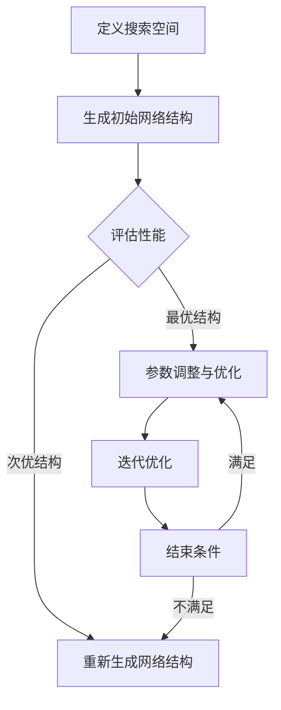
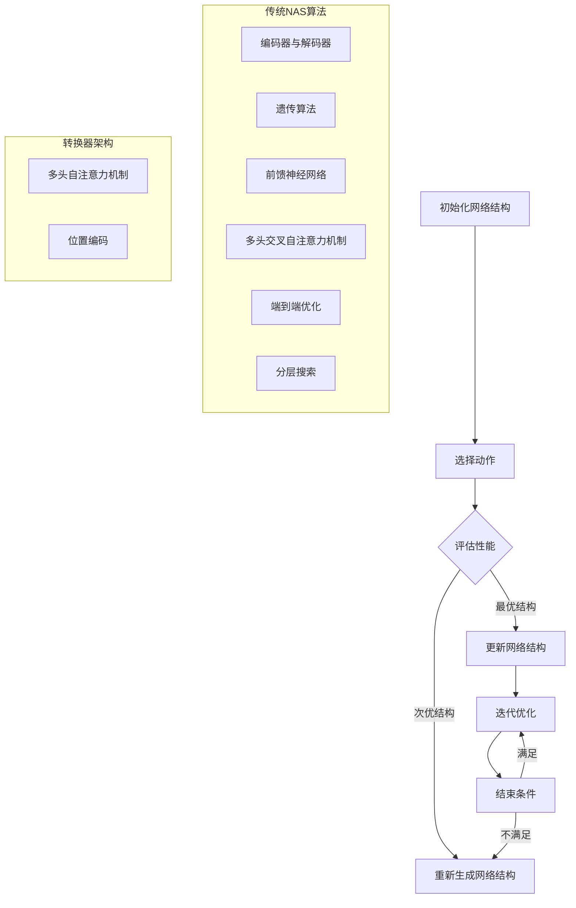
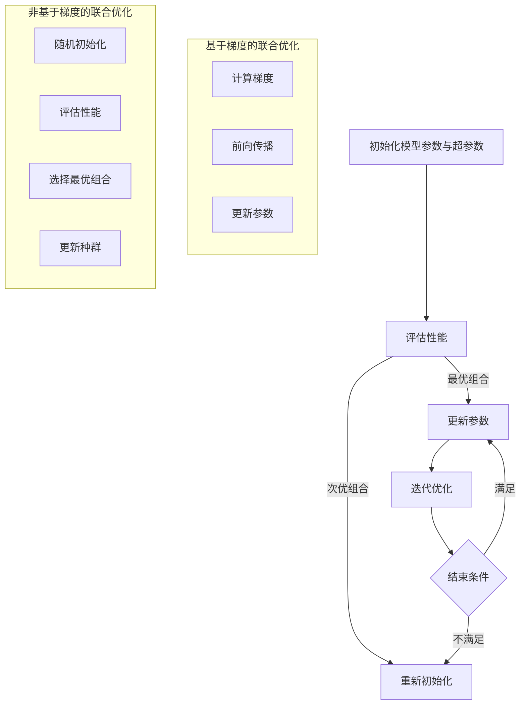

                 

# 联合优化模型结构与超参数的NAS方法

> 关键词：神经架构搜索（NAS）、模型结构优化、超参数优化、深度学习

> 摘要：本文深入探讨了神经架构搜索（Neural Architecture Search，NAS）的方法，重点介绍了如何联合优化模型结构与超参数。通过详细阐述模型结构优化的原理、NAS算法的介绍和超参数优化的方法，本文为读者提供了一个全面理解NAS方法的框架。此外，本文还提供了实际项目中的应用案例，以及总结与展望，帮助读者了解NAS方法的发展趋势和未来研究方向与挑战。

### 目录大纲：联合优化模型结构与超参数的NAS方法

#### 第一部分：引言
1. **NAS概述**
   - NAS的概念与背景
   - NAS在深度学习中的重要性

#### 第二部分：模型结构优化
2. **模型结构优化原理**
   - 模型结构的优化方法
   - 神经架构搜索（NAS）的基本概念
   - Mermaid流程图：模型结构优化的主要流程

3. **NAS算法介绍**
   - 强化学习与神经架构搜索
   - 传统NAS算法（如ENAS、PANS等）
   - 转换器架构详解（如TAF、DARTS等）
   - Mermaid流程图：主要NAS算法的工作流程

4. **模型结构优化实践**
   - 伪代码：模型结构优化算法的详细实现
   - 数学模型与公式：结构优化中涉及的数学模型和公式
   - 举例说明：具体实例中的模型结构优化过程

#### 第三部分：超参数优化
5. **超参数优化概述**
   - 超参数的概念与作用
   - 超参数优化的方法与策略

6. **超参数优化算法**
   - 贝叶斯优化
   - 粒子群优化
   - 整体学习率调度策略
   - 伪代码：超参数优化算法的实现步骤

7. **超参数优化实践**
   - 数学模型与公式：超参数优化中的数学模型和公式
   - 举例说明：超参数优化在实际项目中的应用

#### 第四部分：联合优化方法
8. **联合优化模型结构与超参数**
   - 联合优化的概念与优势
   - 联合优化策略与方法
   - Mermaid流程图：联合优化模型结构与超参数的流程

9. **联合优化算法**
   - 整体优化算法（如NOA、PNAS等）
   - 联合优化框架（如SNAS、POSNAS等）

10. **联合优化实践**
    - 伪代码：联合优化算法的具体实现
    - 数学模型与公式：联合优化过程中使用的数学模型和公式
    - 举例说明：联合优化在具体项目中的应用

#### 第五部分：项目实战
11. **项目实战1：图像分类任务**
    - 开发环境搭建
    - 源代码详细实现
    - 代码解读与分析

12. **项目实战2：语音识别任务**
    - 开发环境搭建
    - 源代码详细实现
    - 代码解读与分析

#### 第六部分：总结与展望
13. **总结与展望**
    - NAS方法的发展趋势
    - 未来研究方向与挑战

#### 附录
14. **附录A：NAS常用工具与资源**
    - 主流NAS工具与框架对比
    - NAS研究资源与文献推荐

15. **附录B：数学公式与伪代码**
    - NAS方法中的关键数学公式
    - NAS算法的伪代码示例

### 第一部分：引言

#### NAS概述

神经架构搜索（Neural Architecture Search，NAS）是一种自动化的机器学习方法，旨在通过搜索过程自动发现最优的网络结构。传统的神经网络设计通常依赖于人类专家的经验和直觉，而NAS则试图通过算法来自动优化网络结构，以实现更好的性能。

NAS的概念起源于深度学习的早期阶段。随着神经网络变得越来越复杂，手动设计网络结构变得日益困难，而NAS提供了自动化的解决方案。NAS的核心思想是通过搜索过程来探索大量的网络结构，并通过评估每个结构的性能来选择最优的网络。

NAS在深度学习中的重要性不可忽视。首先，它能够提高模型的性能，通过自动化搜索过程，NAS可以发现更优的网络结构，从而提高模型的准确率、效率和泛化能力。其次，NAS能够节省时间和成本，因为人类专家在设计复杂网络时需要大量的时间和经验，而NAS可以自动化这一过程。此外，NAS还能够发现新的网络结构，为深度学习领域带来新的突破和创新。

随着深度学习技术的不断发展，NAS的应用领域也在不断扩大。从图像分类和语音识别，到自然语言处理和强化学习，NAS都在发挥着重要作用。在图像分类任务中，NAS可以自动发现最优的网络结构，从而提高分类准确率；在语音识别任务中，NAS可以帮助优化语音信号的编码和解码过程，提高识别准确率。

总之，NAS作为一种自动化的神经网络设计方法，具有广泛的应用前景和重要价值。通过本文的探讨，我们将深入理解NAS的基本原理、算法和实践方法，为读者提供一个全面的学习框架。

#### 第二部分：模型结构优化

##### 模型结构优化原理

模型结构优化是神经架构搜索（NAS）的核心任务之一。它旨在通过调整网络结构，提高模型的性能和效率。模型结构优化包括多个方面，如网络深度、层宽、连接方式等。

模型结构优化的基本原理是基于搜索和评估。在搜索过程中，算法会生成大量的网络结构，并通过评估每个结构的性能来选择最优的网络。评估过程通常包括训练误差、计算资源消耗和模型泛化能力等多个指标。

首先，算法会生成一组初始网络结构。这些结构可以通过随机搜索、进化算法或基于规则的方法生成。接下来，算法会使用训练数据对每个网络结构进行训练，并评估其性能。性能评估通常包括训练误差、验证误差和测试误差等指标。

在评估过程中，算法会根据预设的优化目标选择最优的网络结构。优化目标可以是减少训练误差、提高验证误差或降低计算资源消耗。根据优化目标的不同，算法会选择不同的评估指标和优化策略。

一旦找到最优的网络结构，算法会进一步调整和优化网络参数，如学习率、正则化参数等。这些调整可以帮助提高模型的稳定性和泛化能力。

总之，模型结构优化是一种通过搜索和评估过程自动调整网络结构的方法。它能够提高模型的性能和效率，为深度学习应用提供更有效的解决方案。

##### 神经架构搜索（NAS）的基本概念

神经架构搜索（Neural Architecture Search，NAS）是一种自动化搜索神经网络结构的算法。它旨在通过搜索过程发现最优的网络结构，从而提高模型的性能和效率。NAS的基本概念包括搜索空间、搜索算法和评估指标。

首先，搜索空间是指所有可能的网络结构的集合。搜索空间可以定义为一组网络参数，如层宽、层数、激活函数、连接方式等。这些参数决定了网络的结构和性能。一个大的搜索空间可以提供更多的搜索机会，但也增加了计算复杂度。

其次，搜索算法是指用于搜索最优网络结构的算法。常见的搜索算法包括随机搜索、遗传算法、强化学习等。随机搜索通过随机生成网络结构并进行评估，选择最优的结构。遗传算法通过模拟自然进化过程，逐渐优化网络结构。强化学习通过奖励机制，指导搜索过程向最优结构进化。

评估指标是用于评估网络结构性能的标准。常见的评估指标包括训练误差、验证误差、测试误差、计算资源消耗等。评估指标的选择取决于应用场景和优化目标。例如，在图像分类任务中，训练误差和验证误差是主要的评估指标；在语音识别任务中，计算资源消耗和识别准确率是重要的评估指标。

NAS的工作流程通常包括以下几个步骤：

1. 初始化搜索空间：定义网络参数的取值范围和组合方式。

2. 生成初始网络结构：使用随机搜索、遗传算法或强化学习等方法生成一组初始网络结构。

3. 训练和评估网络结构：使用训练数据对每个网络结构进行训练，并评估其性能。评估指标可以是训练误差、验证误差等。

4. 选择最优网络结构：根据评估指标选择最优的网络结构。可以选择具有最佳性能的网络结构，或具有较好平衡性能的网络结构。

5. 参数调整和优化：对选定的最优网络结构进行参数调整和优化，以提高模型的稳定性和泛化能力。

6. 重复步骤3-5，直到达到预定的搜索目标或性能指标。

总之，神经架构搜索（NAS）是一种通过自动化搜索过程发现最优网络结构的算法。它通过定义搜索空间、搜索算法和评估指标，实现网络结构的优化。NAS在深度学习领域具有广泛的应用前景，可以显著提高模型的性能和效率。

##### Mermaid流程图：模型结构优化的主要流程

为了更清晰地展示模型结构优化的主要流程，我们可以使用Mermaid流程图来描述。以下是一个简化的模型结构优化流程图：



该流程图的解释如下：

1. **定义搜索空间**：首先，我们需要定义模型结构搜索的空间，包括网络层的类型、层数、层宽、连接方式等。

2. **生成初始网络结构**：基于定义的搜索空间，使用随机搜索、遗传算法或强化学习等方法生成一组初始网络结构。

3. **评估性能**：使用训练数据对每个网络结构进行训练，并评估其性能。评估指标可以是训练误差、验证误差、测试误差等。

4. **选择最优网络结构**：根据评估指标选择最优的网络结构。选择标准可以是单一最优性能，或基于平衡性能的多指标优化。

5. **参数调整与优化**：对选定的最优网络结构进行参数调整和优化，如调整学习率、正则化参数等，以提高模型的稳定性和泛化能力。

6. **迭代优化**：重复评估和优化过程，直到满足预定的结束条件。结束条件可以是达到预设的迭代次数、性能指标或计算资源限制。

7. **结束条件**：检查是否满足结束条件。如果满足，结束优化过程；否则，继续迭代优化。

通过这个流程图，我们可以直观地了解模型结构优化的主要步骤和逻辑关系，从而更好地理解和应用NAS方法。

### 第三部分：NAS算法介绍

##### 强化学习与神经架构搜索

强化学习（Reinforcement Learning，RL）是一种机器学习方法，旨在通过试错学习来最大化回报。在强化学习中，智能体通过与环境进行交互，并根据环境的反馈调整其行为策略。强化学习的关键概念包括状态（State）、动作（Action）、奖励（Reward）和策略（Policy）。

神经架构搜索（Neural Architecture Search，NAS）与强化学习有着紧密的联系。NAS中的搜索过程可以看作是一种强化学习任务，其中智能体是搜索算法，环境是神经网络结构，状态是当前的网络结构，动作是选择下一步的网络结构，奖励是网络结构的性能。

在NAS中，搜索算法通过不断调整网络结构，以最大化最终的性能奖励。这个过程中，搜索算法需要不断评估不同网络结构的性能，并根据评估结果调整搜索策略。强化学习中的价值函数（Value Function）和策略网络（Policy Network）在这里也得到了应用。价值函数用于评估当前网络结构的前景，策略网络用于生成新的网络结构。

强化学习在NAS中的应用具有以下优势：

1. **自适应搜索策略**：强化学习可以根据环境反馈自适应地调整搜索策略，从而在搜索过程中逐步优化网络结构。

2. **探索与利用平衡**：强化学习通过平衡探索（尝试新的结构）和利用（利用已知的最优结构）来最大化总回报。

3. **多目标优化**：NAS中的优化目标可以是多个，如模型性能、计算资源消耗等。强化学习可以同时考虑多个目标，从而实现更全面的优化。

4. **灵活性**：强化学习可以处理复杂的搜索空间和动态环境，适应不同的应用场景。

##### 传统NAS算法

传统NAS算法主要包括基于强化学习的方法和基于遗传算法的方法。这些方法在NAS领域得到了广泛应用，并取得了显著的成果。

**1. 基于强化学习的方法**

基于强化学习的方法在NAS中应用广泛，其中最著名的是基于强化学习的神经架构搜索（Reinforcement Learning for Neural Architecture Search，RL-NAS）。RL-NAS的核心思想是通过强化学习算法自动搜索最优的网络结构。

RL-NAS的主要步骤如下：

1. **初始化网络结构**：随机初始化一个网络结构作为初始状态。

2. **选择动作**：基于当前网络结构，选择下一步的动作，如添加新的层、修改层的宽度等。

3. **执行动作**：根据选择的动作，生成新的网络结构。

4. **评估性能**：使用训练数据和测试数据对新的网络结构进行训练和评估，计算其性能指标。

5. **计算奖励**：根据评估结果计算奖励值，奖励值越高表示网络结构性能越好。

6. **更新策略**：根据奖励值更新策略网络，以指导下一步的动作选择。

RL-NAS的优势在于其强大的自适应能力和灵活性，能够处理复杂的网络结构和优化目标。然而，其缺点是训练时间较长，对计算资源要求较高。

**2. 基于遗传算法的方法**

基于遗传算法的方法在NAS中也得到了广泛应用。遗传算法（Genetic Algorithm，GA）是一种基于自然进化过程的优化算法，通过模拟生物进化过程，逐步优化网络结构。

遗传算法的主要步骤如下：

1. **初始化种群**：随机生成一组网络结构作为初始种群。

2. **适应度评估**：使用训练数据和测试数据对每个网络结构进行训练和评估，计算其适应度值。

3. **选择**：根据适应度值选择最优的网络结构，用于生成下一代种群。

4. **交叉**：对选中的网络结构进行交叉操作，生成新的网络结构。

5. **变异**：对交叉后的网络结构进行变异操作，增加种群的多样性。

6. **更新种群**：将交叉和变异后的网络结构组成新的种群，继续迭代优化。

遗传算法的优势在于其简单性和鲁棒性，适用于处理复杂的搜索空间。然而，其缺点是优化过程较慢，且易陷入局部最优。

##### 转换器架构详解

转换器架构（Transformer Architecture）是近年来在深度学习领域取得重大突破的一种模型结构。它基于自注意力机制（Self-Attention Mechanism），在自然语言处理、图像生成、语音识别等领域表现出色。转换器架构在NAS中的应用也越来越受到关注。

**1. 自注意力机制**

自注意力机制是一种基于注意力模型的计算方法，用于计算序列数据中的关系。在自注意力机制中，每个位置的输出与所有位置的输入相关联，通过加权求和得到。自注意力机制的公式如下：

$$
\text{Attention}(Q, K, V) = \text{softmax}(\frac{QK^T}{\sqrt{d_k}})V
$$

其中，$Q$、$K$和$V$分别表示查询（Query）、键（Key）和值（Value）向量，$d_k$是键向量的维度。自注意力机制通过计算查询和键之间的相似度，实现对输入序列的加权求和。

**2. 转换器架构**

转换器架构是一种基于自注意力机制的神经网络模型，主要由编码器（Encoder）和解码器（Decoder）两部分组成。编码器将输入序列转换为一系列的向量表示，解码器则根据这些向量生成输出序列。

转换器架构的主要组件包括：

1. **多头自注意力机制**：多头自注意力机制将输入序列分成多个部分，每个部分独立计算注意力权重，并通过拼接和线性变换生成最终的输出。

2. **位置编码**：由于自注意力机制忽略了输入序列的位置信息，位置编码被引入以提供位置信息。位置编码可以是固定的，也可以是可学习的。

3. **前馈神经网络**：在每个自注意力层之后，添加一个前馈神经网络，对输入进行进一步处理。

4. **多头交叉自注意力机制**：多头交叉自注意力机制用于计算编码器和解码器之间的注意力权重，实现编码器与解码器之间的交互。

转换器架构通过自注意力机制和多头自注意力机制，实现了对输入序列的灵活处理和全局依赖关系的建模，从而在自然语言处理和图像生成等领域取得了显著的效果。

**3. 转换器架构在NAS中的应用**

在NAS中，转换器架构可以作为搜索空间的一部分，用于生成和优化网络结构。以下是一些常见的转换器架构在NAS中的应用：

1. **基于转换器的NAS算法**：这些算法将转换器架构作为基础，通过搜索过程优化转换器中的参数和结构。例如，DARTS（Differentiable Architecture Search with Deep Neural Networks）算法通过使用转换器架构，实现了模型结构的端到端优化。

2. **混合模型结构**：NAS算法可以将转换器架构与其他模型结构（如卷积神经网络、循环神经网络等）结合，形成混合模型结构。这种混合模型结构可以充分利用不同模型结构的优点，实现更好的性能。

3. **分层搜索**：在NAS中，分层搜索是一种常见的策略，通过逐步优化模型的各个层次，实现整体结构的优化。转换器架构在分层搜索中可以作为一个独立的层次，与其他层次结合，形成更加复杂的模型结构。

通过转换器架构的引入，NAS算法在搜索过程中可以更好地处理序列数据和全局依赖关系，从而提高模型的性能和泛化能力。

##### Mermaid流程图：主要NAS算法的工作流程

为了更好地理解传统NAS算法和转换器架构的工作流程，我们可以使用Mermaid流程图来描述。以下是一个简化的主要NAS算法的工作流程图：



该流程图的解释如下：

1. **初始化网络结构**：首先，初始化一个网络结构作为初始状态。

2. **选择动作**：根据当前网络结构，选择下一步的动作，如添加新的层、修改层的宽度等。

3. **评估性能**：使用训练数据和测试数据对新的网络结构进行训练和评估，计算其性能指标。

4. **更新网络结构**：根据评估结果选择最优的网络结构，并更新网络参数。

5. **迭代优化**：重复评估和更新网络结构的过程，直到满足预定的结束条件。

6. **结束条件**：检查是否满足结束条件，如达到预定的迭代次数或性能指标。

7. **传统NAS算法**：包括基于强化学习的方法（如RL-NAS）和基于遗传算法的方法（如GA-NAS）。这些算法通过选择和更新网络结构，逐步优化模型性能。

8. **转换器架构**：包括多头自注意力机制、位置编码、编码器与解码器、前馈神经网络和多头交叉自注意力机制等组件。这些组件通过端到端优化或分层搜索，实现模型结构的优化。

通过这个流程图，我们可以直观地了解传统NAS算法和转换器架构的工作流程，从而更好地理解和应用NAS方法。

### 第四部分：模型结构优化实践

#### 伪代码：模型结构优化算法的详细实现

为了详细说明模型结构优化的算法实现，我们使用伪代码来描述其主要步骤。以下是一个简化的模型结构优化算法的伪代码：

```python
# 初始化参数
num_epochs = 100  # 迭代次数
population_size = 100  # 种群大小
search_space = define_search_space()  # 搜索空间

# 初始化种群
population = initialize_population(population_size, search_space)

# 迭代优化
for epoch in range(num_epochs):
    for model in population:
        # 选择动作
        action = select_action(model, search_space)

        # 执行动作
        model = execute_action(model, action)

        # 训练模型
        model = train_model(model, train_data)

        # 评估性能
        performance = evaluate_performance(model, validation_data)

        # 更新奖励
        reward = update_reward(performance)

    # 选择最优模型
    best_model = select_best_model(population, reward)

    # 更新种群
    population = update_population(population, best_model)

# 输出最优模型
output_best_model(best_model)
```

该伪代码的主要步骤包括：

1. **初始化参数**：定义迭代次数、种群大小和搜索空间。

2. **初始化种群**：随机生成一组初始模型，每个模型代表一种可能的网络结构。

3. **迭代优化**：对每个模型执行以下步骤：
   - **选择动作**：根据当前模型和搜索空间，选择下一步的动作，如添加新的层或修改层的宽度。
   - **执行动作**：根据选择的动作，更新模型结构。
   - **训练模型**：使用训练数据对模型进行训练。
   - **评估性能**：使用验证数据评估模型的性能。
   - **更新奖励**：根据评估结果更新模型的奖励值。

4. **选择最优模型**：在当前迭代结束后，选择具有最高奖励值的模型作为最优模型。

5. **更新种群**：将最优模型加入种群中，替换奖励值较低的模型。

6. **输出最优模型**：在所有迭代完成后，输出最优模型。

通过这个伪代码，我们可以看到模型结构优化算法的基本框架和实现步骤。在实际应用中，具体的实现细节会根据具体的NAS算法和搜索空间进行调整。

#### 数学模型与公式：结构优化中涉及的数学模型和公式

在模型结构优化过程中，涉及多个数学模型和公式，用于描述网络结构的演化、性能评估和优化目标。以下是一些常见的数学模型和公式：

**1. 网络结构的演化公式**

网络结构的演化可以通过参数化的方式描述，每个参数表示网络结构的一个方面，如层数、层宽、连接方式等。假设网络结构的参数集合为$\theta$，则网络结构可以表示为$S(\theta)$。

演化公式如下：

$$
S(\theta_{t+1}) = S(\theta_t) + \alpha \cdot \nabla_{\theta} \log P(\theta_t)
$$

其中，$S(\theta_t)$是当前网络结构，$\alpha$是学习率，$\nabla_{\theta} \log P(\theta_t)$是网络结构的梯度。

**2. 性能评估公式**

性能评估是模型结构优化的重要步骤，常用的评估指标包括训练误差、验证误差和测试误差。假设$E_t$是训练误差，$V_t$是验证误差，$T_t$是测试误差，则性能评估公式如下：

$$
\text{Performance} = w_1 \cdot E_t + w_2 \cdot V_t + w_3 \cdot T_t
$$

其中，$w_1$、$w_2$和$w_3$是权重系数，用于平衡不同评估指标的重要性。

**3. 优化目标公式**

优化目标是指导模型结构优化的方向，常用的优化目标包括最小化训练误差、最大化验证误差或平衡训练误差和验证误差。假设$J(\theta)$是优化目标，则优化目标公式如下：

$$
\min J(\theta) = \min \left( w_1 \cdot E_t + w_2 \cdot V_t + w_3 \cdot T_t \right)
$$

通过这些数学模型和公式，我们可以描述模型结构优化的过程，实现网络结构的自适应优化。

#### 举例说明：具体实例中的模型结构优化过程

为了更好地理解模型结构优化在实际项目中的应用，我们通过一个具体的实例来演示模型结构优化的过程。假设我们使用神经架构搜索（NAS）方法来优化一个图像分类模型。

**1. 初始化参数**

首先，我们需要初始化一些参数，如迭代次数、种群大小和搜索空间。假设迭代次数为100，种群大小为100，搜索空间包括层数、层宽、激活函数和连接方式等。

```python
num_epochs = 100
population_size = 100
search_space = {
    'layers': range(2, 10),
    'layer_widths': range(64, 512, 64),
    'activation_functions': ['relu', 'tanh', 'sigmoid'],
    'connections': ['direct', 'skip']
}
```

**2. 初始化种群**

接下来，我们随机初始化一个种群，每个模型代表一种可能的网络结构。

```python
population = initialize_population(population_size, search_space)
```

**3. 迭代优化**

在迭代优化过程中，我们按照以下步骤进行：

1. **选择动作**：根据当前模型和搜索空间，选择下一步的动作，如添加新的层或修改层的宽度。
2. **执行动作**：根据选择的动作，更新模型结构。
3. **训练模型**：使用训练数据对模型进行训练。
4. **评估性能**：使用验证数据评估模型的性能。
5. **更新奖励**：根据评估结果更新模型的奖励值。

假设我们使用强化学习算法来选择动作，并使用性能评估公式来计算奖励值。以下是迭代优化过程的伪代码：

```python
for epoch in range(num_epochs):
    for model in population:
        action = select_action(model, search_space)
        model = execute_action(model, action)
        model = train_model(model, train_data)
        performance = evaluate_performance(model, validation_data)
        reward = update_reward(performance)
```

**4. 选择最优模型**

在每次迭代结束后，选择具有最高奖励值的模型作为最优模型。

```python
best_model = select_best_model(population, reward)
```

**5. 更新种群**

将最优模型加入种群中，替换奖励值较低的模型。

```python
population = update_population(population, best_model)
```

**6. 输出最优模型**

在所有迭代完成后，输出最优模型。

```python
output_best_model(best_model)
```

通过这个实例，我们可以看到模型结构优化在实际项目中的应用流程。在实际开发中，具体的实现细节会根据项目的需求和算法的特点进行调整。

### 第五部分：超参数优化

#### 超参数优化概述

超参数（Hyperparameters）是深度学习模型中不通过学习过程直接设定的参数，它们对模型的性能和表现有显著影响。常见的超参数包括学习率（Learning Rate）、批次大小（Batch Size）、正则化参数（Regularization）、dropout率（Dropout Rate）等。超参数优化（Hyperparameter Optimization，HPO）是指通过算法自动调整超参数，以找到最优参数组合，从而提升模型性能的过程。

超参数优化的重要性体现在以下几个方面：

1. **性能提升**：合适的超参数组合可以显著提升模型在训练和测试数据上的性能，提高准确率、减少过拟合。

2. **效率优化**：通过优化超参数，可以减少模型训练所需的时间和计算资源，提高模型训练的效率。

3. **泛化能力**：优化后的超参数组合有助于提升模型的泛化能力，使其在未知数据上表现更好。

超参数优化的目标是在给定的计算资源限制下，找到能够最大化模型性能的超参数组合。常见的优化目标包括最小化训练误差、最大化验证准确率、提高测试集上的表现等。

#### 超参数优化的方法与策略

超参数优化有多种方法，每种方法都有其独特的优势和适用场景。以下是几种常见的方法和策略：

**1. 粗暴搜索（Grid Search）**

粗暴搜索是一种简单但计算量较大的超参数优化方法。它通过预先定义的超参数网格，遍历所有可能的组合，评估每个组合的性能，并选择最优组合。

优点：
- 简单易懂，易于实现。
- 可以保证找到全局最优解。

缺点：
- 计算量大，特别是超参数空间较大时。
- 可能会错过局部最优解。

**2. 随机搜索（Random Search）**

随机搜索从超参数空间中随机选择一组参数，评估其性能，并选择最优的参数组合。与网格搜索相比，随机搜索的计算量更小，且在超参数空间较小或非凸时表现更好。

优点：
- 计算量相对较小。
- 可以在较小的超参数空间中找到较好的解。

缺点：
- 可能会错过全局最优解。
- 需要预先设定搜索范围和样本数量。

**3. 贝叶斯优化（Bayesian Optimization）**

贝叶斯优化是一种基于概率模型的优化方法，通过构建目标函数的概率模型，优化搜索策略。它利用历史评估数据，动态调整搜索方向，从而提高搜索效率。

优点：
- 高效，能够在较少的评估次数下找到较好的解。
- 能够处理高维超参数空间。

缺点：
- 需要大量的初始评估，用于训练概率模型。

**4. 粒子群优化（Particle Swarm Optimization，PSO）**

粒子群优化是一种基于群体智能的优化算法，通过模拟鸟群觅食行为，优化超参数组合。每个粒子代表一组超参数，通过更新粒子的位置和速度，找到最优超参数组合。

优点：
- 简单易实现，适用于复杂问题。
- 能够处理动态和不可导的问题。

缺点：
- 可能会陷入局部最优。
- 需要调整参数，如粒子数量和惯性权重等。

**5. 整体学习率调度策略**

整体学习率调度策略是一种动态调整学习率的方法，通过周期性地调整学习率，使模型能够更好地适应数据分布。常见的调度策略包括恒定学习率、指数衰减学习率、学习率余弦退火等。

优点：
- 简单有效，能够提高模型性能。
- 可以处理数据分布变化的问题。

缺点：
- 需要预先设定学习率衰减参数。
- 可能会出现学习率过早减小或过晚减小的问题。

这些方法和策略各有优缺点，实际应用时需要根据具体问题和资源限制进行选择。在本文中，我们将详细介绍贝叶斯优化、粒子群优化和整体学习率调度策略。

#### 贝叶斯优化

贝叶斯优化是一种基于概率模型的超参数优化方法，它通过构建目标函数的概率模型，优化搜索策略。贝叶斯优化的工作流程主要包括以下步骤：

**1. 构建目标函数的概率模型**

贝叶斯优化通过构建目标函数的概率模型，来预测新的超参数组合的性能。常见的模型包括高斯过程（Gaussian Process，GP）和贝叶斯神经网络（Bayesian Neural Network，BNN）。

高斯过程是一种非参数概率模型，它可以灵活地拟合目标函数，并估计新点的性能。贝叶斯神经网络是一种参数化模型，通过训练神经网络来拟合目标函数的概率分布。

**2. 选择搜索策略**

贝叶斯优化选择搜索策略，以最大化信息增益。常见的搜索策略包括无信息搜索（Expected Improvement，EI）、树形结构优化（Tree-Structured Parzen Estimators，TPE）等。

无信息搜索基于目标函数的期望改进，选择能够最大程度提高目标函数期望的候选点。树形结构优化通过构建树形结构，优化搜索路径，提高搜索效率。

**3. 进行评估和更新**

在贝叶斯优化过程中，每次迭代包括以下步骤：

- 根据当前模型，选择一个候选超参数组合。
- 使用模型预测该组合的性能。
- 在训练集上评估候选组合的实际性能。
- 更新模型，以反映新的评估结果。

**4. 停止条件**

贝叶斯优化通常设置停止条件，以决定何时停止搜索。常见的停止条件包括达到预定的迭代次数、性能阈值或搜索时间。

贝叶斯优化的优势在于其强大的模型拟合能力和高效的搜索策略。它能够处理高维超参数空间，并在较少的评估次数下找到较好的超参数组合。然而，贝叶斯优化需要大量的初始评估，用于训练概率模型，且计算复杂度较高。

以下是一个简化的贝叶斯优化算法的伪代码：

```python
# 初始化参数
num_iterations = 100
num_samples = 100
model = initialize_model()

# 迭代优化
for iteration in range(num_iterations):
    # 生成候选超参数
    candidates = generate_candidates(model)

    # 预测性能
    predicted_performance = predict_performance(model, candidates)

    # 评估候选组合
    actual_performance = evaluate_performance(candidates, validation_data)

    # 更新模型
    model = update_model(model, actual_performance)

    # 输出最优超参数
    best_candidate = select_best_candidate(candidates, predicted_performance)
    output_best_candidate(best_candidate)
```

#### 粒子群优化

粒子群优化（Particle Swarm Optimization，PSO）是一种基于群体智能的优化算法，通过模拟鸟群觅食行为来优化超参数组合。PSO的基本思想是每个粒子代表一组超参数，通过更新粒子的位置和速度，找到最优超参数组合。

**1. 粒子状态**

在PSO中，每个粒子有两个状态：位置（Position）和速度（Velocity）。位置表示一组超参数，速度表示位置的变化量。粒子的位置和速度可以通过以下公式更新：

$$
x_{i,t+1} = x_{i,t} + v_{i,t+1}
$$

$$
v_{i,t+1} = v_{i,t} + c_1 r_1 (p_{i,t} - x_{i,t}) + c_2 r_2 (g_{t} - x_{i,t})
$$

其中，$x_{i,t}$和$v_{i,t}$分别表示第$i$个粒子在第$t$次迭代的位置和速度，$p_{i,t}$是第$i$个粒子的个人最佳位置，$g_{t}$是全局最佳位置，$c_1$和$c_2$是认知和社会两个系数，$r_1$和$r_2$是随机数。

**2. 位置和速度更新**

位置和速度的更新公式描述了粒子如何根据个人最佳位置和全局最佳位置调整自己的位置和速度。个人最佳位置是粒子迄今为止遇到的最好位置，全局最佳位置是整个种群迄今为止遇到的最好位置。

**3. 适应度函数**

适应度函数用于评估粒子的性能。在超参数优化中，适应度函数通常是模型在验证集上的性能，如验证准确率或验证损失。

**4. 迭代过程**

PSO的迭代过程包括以下步骤：

1. **初始化**：随机初始化粒子的位置和速度。
2. **更新位置和速度**：根据个人最佳位置和全局最佳位置更新粒子的位置和速度。
3. **评估适应度**：计算粒子的适应度，即模型在验证集上的性能。
4. **更新个人最佳位置和全局最佳位置**：如果当前粒子的适应度高于个人最佳位置，则更新个人最佳位置；如果当前粒子的适应度高于全局最佳位置，则更新全局最佳位置。
5. **迭代结束条件**：当达到预定的迭代次数或满足其他停止条件时，停止迭代。

以下是一个简化的PSO算法的伪代码：

```python
# 初始化参数
num_particles = 50
num_iterations = 100
w = 0.5  # 惯性权重
c1 = 1.5  # 个人系数
c2 = 1.5  # 社会系数

# 初始化粒子
particles = initialize_particles(num_particles, search_space)

# 迭代优化
for iteration in range(num_iterations):
    # 更新位置和速度
    for particle in particles:
        particle = update_position_and_velocity(particle, particles)

    # 评估适应度
    fitnesses = evaluate_fitness(particles, validation_data)

    # 更新个人最佳位置和全局最佳位置
    particles = update_best_positions(particles, fitnesses)

# 输出最优超参数
best_particle = select_best_particle(particles)
output_best_particle(best_particle)
```

#### 整体学习率调度策略

整体学习率调度策略是一种动态调整学习率的方法，通过周期性地调整学习率，使模型能够更好地适应数据分布。常见的调度策略包括恒定学习率、指数衰减学习率、学习率余弦退火等。

**1. 恒定学习率**

恒定学习率是最简单的调度策略，整个训练过程中学习率保持不变。优点是实现简单，计算效率高；缺点是可能过早收敛或出现梯度消失。

```python
learning_rate = initial_learning_rate
for epoch in range(num_epochs):
    # 使用恒定学习率进行训练
    train_model(model, train_data, learning_rate)
```

**2. 指数衰减学习率**

指数衰减学习率通过周期性地减小学习率，使模型能够在训练过程中逐渐适应数据分布。学习率随迭代次数的减小公式如下：

$$
\text{learning\_rate} = \text{initial\_learning\_rate} \cdot \text{decay rate}^{\text{epoch}}
$$

优点：能够有效防止过早收敛；缺点：需要选择合适的衰减率。

```python
initial_learning_rate = 0.1
decay_rate = 0.99
for epoch in range(num_epochs):
    learning_rate = initial_learning_rate * (decay_rate ** epoch)
    train_model(model, train_data, learning_rate)
```

**3. 学习率余弦退火**

学习率余弦退火是一种基于余弦函数的学习率调度策略，能够模拟物理过程，实现平滑的学习率调整。学习率公式如下：

$$
\text{learning\_rate} = \text{initial\_learning\_rate} \cdot \frac{1 + \cos(\pi \cdot \text{epoch} / \text{T_max})}{2}
$$

其中，$T_{\max}$是预定的最大迭代次数。优点：实现简单，性能稳定；缺点：需要选择合适的$T_{\max}$。

```python
initial_learning_rate = 0.1
T_max = 100
for epoch in range(num_epochs):
    learning_rate = initial_learning_rate * (1 + math.cos(math.pi * epoch / T_max)) / 2
    train_model(model, train_data, learning_rate)
```

整体学习率调度策略通过动态调整学习率，提高模型训练效率，避免过早收敛。在实际应用中，可以根据具体问题和需求选择合适的策略。

#### 伪代码：超参数优化算法的实现步骤

为了详细说明超参数优化算法的实现步骤，我们可以使用伪代码来描述其主要过程。以下是一个简化的超参数优化算法的伪代码：

```python
# 初始化参数
num_iterations = 100
search_space = define_search_space()  # 定义超参数搜索空间
model = initialize_model()  # 初始化模型

# 迭代优化
for iteration in range(num_iterations):
    # 随机采样超参数
    candidates = sample_candidates(search_space)

    # 训练模型
    for candidate in candidates:
        train_model(model, train_data, candidate)

    # 评估模型
    performance = evaluate_performance(model, validation_data)

    # 更新模型
    best_candidate = select_best_candidate(candidates, performance)
    update_model(model, best_candidate)

# 输出最优超参数
best_candidate = select_best_candidate(candidates, performance)
output_best_candidate(best_candidate)
```

该伪代码的主要步骤包括：

1. **初始化参数**：定义迭代次数和超参数搜索空间，初始化模型。

2. **迭代优化**：对每个迭代执行以下步骤：
   - **随机采样超参数**：从超参数搜索空间中随机采样一组超参数。
   - **训练模型**：使用训练数据和当前超参数训练模型。
   - **评估模型**：使用验证数据评估模型的性能。

3. **更新模型**：选择性能最优的超参数组合，更新模型。

4. **输出最优超参数**：在所有迭代完成后，输出最优超参数组合。

通过这个伪代码，我们可以看到超参数优化算法的基本框架和实现步骤。在实际应用中，具体的实现细节会根据具体的优化算法和搜索空间进行调整。

### 第六部分：超参数优化实践

#### 数学模型与公式：超参数优化中的数学模型和公式

在超参数优化过程中，涉及多个数学模型和公式，用于描述超参数对模型性能的影响、优化策略和评估指标。以下是一些常见的数学模型和公式：

**1. 超参数空间表示**

超参数空间可以用一组参数向量表示，每个参数表示一个超参数。假设超参数空间为$\Theta = (\theta_1, \theta_2, ..., \theta_n)$，则超参数向量可以表示为$\theta = (\theta_1, \theta_2, ..., \theta_n)^T$。

**2. 性能评估公式**

性能评估是超参数优化的重要步骤，常用的评估指标包括训练误差、验证误差和测试误差。假设$E_t$是训练误差，$V_t$是验证误差，$T_t$是测试误差，则性能评估公式如下：

$$
\text{Performance} = w_1 \cdot E_t + w_2 \cdot V_t + w_3 \cdot T_t
$$

其中，$w_1$、$w_2$和$w_3$是权重系数，用于平衡不同评估指标的重要性。

**3. 优化目标公式**

优化目标是指导超参数优化的方向，常用的优化目标包括最小化训练误差、最大化验证误差或平衡训练误差和验证误差。假设$J(\theta)$是优化目标，则优化目标公式如下：

$$
\min J(\theta) = \min \left( w_1 \cdot E_t + w_2 \cdot V_t + w_3 \cdot T_t \right)
$$

**4. 贝叶斯优化公式**

在贝叶斯优化中，目标函数的概率模型通常使用高斯过程（Gaussian Process，GP）表示。高斯过程的公式如下：

$$
p(\theta | D) \propto \exp \left( - \frac{1}{2} (\theta - \mu)^T \Sigma^{-1} (\theta - \mu) \right)
$$

其中，$\mu$是均值向量，$\Sigma$是协方差矩阵，$D$是历史数据。

**5. 粒子群优化公式**

在粒子群优化中，粒子状态用位置和速度表示。位置和速度的更新公式如下：

$$
x_{i,t+1} = x_{i,t} + v_{i,t+1}
$$

$$
v_{i,t+1} = v_{i,t} + c_1 r_1 (p_{i,t} - x_{i,t}) + c_2 r_2 (g_{t} - x_{i,t})
$$

其中，$x_{i,t}$和$v_{i,t}$分别表示第$i$个粒子在第$t$次迭代的位置和速度，$p_{i,t}$是第$i$个粒子的个人最佳位置，$g_{t}$是全局最佳位置，$c_1$和$c_2$是认知和社会两个系数，$r_1$和$r_2$是随机数。

通过这些数学模型和公式，我们可以描述超参数优化的过程，实现超参数的自适应优化。

#### 举例说明：超参数优化在实际项目中的应用

为了更好地理解超参数优化在实际项目中的应用，我们通过一个具体的实例来演示超参数优化的过程。假设我们使用贝叶斯优化方法来优化一个图像分类模型。

**1. 初始化参数**

首先，我们需要初始化一些参数，如迭代次数、种群大小和搜索空间。假设迭代次数为100，种群大小为100，搜索空间包括学习率、批次大小和正则化参数。

```python
num_iterations = 100
population_size = 100
search_space = {
    'learning_rate': [0.001, 0.01, 0.1],
    'batch_size': [16, 32, 64],
    'regularization': [0.01, 0.1, 1]
}
```

**2. 初始化种群**

接下来，我们随机初始化一个种群，每个模型代表一组超参数。

```python
population = initialize_population(population_size, search_space)
```

**3. 迭代优化**

在迭代优化过程中，我们按照以下步骤进行：

1. **选择动作**：根据当前模型和搜索空间，选择下一步的超参数组合。
2. **执行动作**：根据选择的超参数组合，训练模型。
3. **评估性能**：使用验证数据评估模型的性能。
4. **更新奖励**：根据评估结果更新模型的奖励值。

假设我们使用贝叶斯优化算法来选择超参数组合，并使用性能评估公式来计算奖励值。以下是迭代优化过程的伪代码：

```python
for iteration in range(num_iterations):
    candidates = generate_candidates(population, search_space)
    for candidate in candidates:
        model = train_model(candidate)
        performance = evaluate_performance(model, validation_data)
        reward = update_reward(performance)
    best_candidate = select_best_candidate(candidates, reward)
    population = update_population(population, best_candidate)
```

**4. 选择最优模型**

在每次迭代结束后，选择具有最高奖励值的超参数组合作为最优超参数。

```python
best_candidate = select_best_candidate(candidates, reward)
```

**5. 更新种群**

将最优超参数组合加入种群中，替换奖励值较低的模型。

```python
population = update_population(population, best_candidate)
```

**6. 输出最优超参数**

在所有迭代完成后，输出最优超参数组合。

```python
output_best_candidate(best_candidate)
```

通过这个实例，我们可以看到超参数优化在实际项目中的应用流程。在实际开发中，具体的实现细节会根据项目的需求和优化算法的特点进行调整。

### 第七部分：联合优化方法

#### 联合优化模型结构与超参数的概念与优势

联合优化模型结构与超参数是指将模型结构的优化和超参数的优化结合起来，通过统一的优化过程来提升深度学习模型的性能。这种方法的优势在于能够同时考虑模型结构变化和超参数调整，从而实现更有效的模型优化。

**1. 概念**

联合优化方法的核心思想是在优化过程中同时调整模型结构和超参数。模型结构包括网络层、层宽、连接方式等，而超参数则包括学习率、批次大小、正则化参数等。通过联合优化，我们可以确保模型结构和超参数相互配合，共同提高模型的性能。

**2. 优势**

- **协同优化**：联合优化能够确保模型结构变化和超参数调整相互协同，从而提高整体性能。传统的单目标优化方法可能会忽视两者之间的相互作用，导致性能提升有限。
- **全局优化**：联合优化方法能够通过统一的优化过程，全局地搜索最优模型结构和超参数组合，从而找到更好的性能平衡点。
- **减少搜索空间**：联合优化可以在一定程度上减少搜索空间，因为模型结构和超参数的优化是同时进行的，避免了重复搜索和计算。
- **提高泛化能力**：通过联合优化，模型结构和超参数可以相互调整，从而提高模型的泛化能力，使模型在未知数据上表现更好。

#### 联合优化策略与方法

联合优化策略可以分为两大类：基于梯度的联合优化和非基于梯度的联合优化。

**1. 基于梯度的联合优化**

基于梯度的联合优化方法利用梯度信息同时优化模型结构和超参数。这种方法的主要步骤如下：

- **梯度计算**：计算模型结构和超参数的梯度信息，包括模型参数的梯度以及超参数的梯度。
- **联合梯度下降**：利用计算得到的梯度信息，通过联合梯度下降算法更新模型结构和超参数。

以下是一个简化的基于梯度的联合优化算法的伪代码：

```python
# 初始化模型参数和超参数
model_params = initialize_model_params()
hyperparams = initialize_hyperparams()

# 迭代优化
for epoch in range(num_epochs):
    # 前向传播，计算损失
    output = forward_pass(input, model_params, hyperparams)
    loss = compute_loss(target, output)

    # 计算梯度
    gradients = compute_gradients(loss, model_params, hyperparams)

    # 更新模型参数和超参数
    update_params(model_params, gradients['model'])
    update_hyperparams(hyperparams, gradients['hyperparams'])
```

**2. 非基于梯度的联合优化**

非基于梯度的联合优化方法不依赖于梯度信息，而是通过搜索算法或进化算法进行优化。这种方法的主要步骤如下：

- **初始化**：随机初始化模型结构和超参数。
- **评估**：使用训练数据评估模型结构和超参数的性能。
- **选择**：根据评估结果选择最优的模型结构和超参数组合。
- **更新**：使用选择的模型结构和超参数组合更新种群。

以下是一个简化的非基于梯度的联合优化算法的伪代码：

```python
# 初始化参数
num_iterations = 100
search_space = define_search_space()

# 初始化种群
population = initialize_population(num_iterations, search_space)

# 迭代优化
for iteration in range(num_iterations):
    # 评估种群
    performances = evaluate_population(population, validation_data)

    # 选择最优模型结构和超参数
    best_model = select_best_model(population, performances)

    # 更新种群
    population = update_population(population, best_model)
```

通过这些策略，我们可以实现联合优化模型结构和超参数，从而提升深度学习模型的性能。

#### Mermaid流程图：联合优化模型结构与超参数的流程

为了更好地展示联合优化模型结构与超参数的流程，我们可以使用Mermaid流程图来描述。以下是一个简化的联合优化流程图：



该流程图的解释如下：

1. **初始化模型参数与超参数**：首先，初始化模型参数和超参数。
2. **评估性能**：使用训练数据评估当前模型参数和超参数的性能。
3. **选择最优组合**：根据评估结果选择最优的模型参数和超参数组合。
4. **更新参数**：使用选择的模型参数和超参数组合更新参数。
5. **迭代优化**：重复评估、选择和更新参数的过程，直到满足预定的结束条件。
6. **结束条件**：检查是否满足结束条件，如达到预定的迭代次数或性能指标。
7. **基于梯度的联合优化**：包括计算梯度、前向传播和更新参数等步骤。
8. **非基于梯度的联合优化**：包括随机初始化、评估性能、选择最优组合和更新种群等步骤。

通过这个流程图，我们可以直观地了解联合优化模型结构与超参数的主要步骤和逻辑关系。

### 第八部分：联合优化算法

#### 整体优化算法

整体优化算法（Overall Optimization Algorithm）是一种结合模型结构和超参数优化的方法，旨在通过统一的过程提高深度学习模型的性能。整体优化算法的核心思想是同时考虑模型结构和超参数，以实现更有效的模型优化。以下是一些常见的整体优化算法：

**1. NASNet**

NASNet是一种基于神经架构搜索（Neural Architecture Search，NAS）的整体优化算法。它通过自动搜索最优的网络结构和超参数组合，实现高效的模型优化。NASNet的主要步骤包括：

- **初始化**：随机初始化网络结构和超参数。
- **训练**：使用训练数据对模型进行训练，并评估模型性能。
- **搜索**：通过搜索算法（如强化学习、遗传算法）搜索最优的网络结构和超参数组合。
- **评估**：使用验证数据评估模型的性能，并更新搜索策略。

**2. MAML**

MAML（Model-Agnostic Meta-Learning）是一种基于元学习的整体优化算法，旨在通过元学习快速适应新任务。MAML的主要思想是训练一个模型，使其能够通过少量样本快速适应新任务。MAML的主要步骤包括：

- **预训练**：在大量任务上预训练模型，使其具有通用性。
- **适应**：在新任务上使用少量样本对模型进行微调，使其适应新任务。
- **评估**：评估模型的性能，并调整超参数，以优化模型适应新任务的能力。

**3. LYSO**

LYSO（Learning with Synthetic and Online Data）是一种基于合成数据和在线数据的整体优化算法。它通过结合合成数据和在线数据，提高模型在真实数据上的性能。LYSO的主要步骤包括：

- **数据合成**：使用生成模型生成合成数据，模拟真实数据的分布。
- **在线学习**：使用在线学习算法，结合合成数据和真实数据，更新模型。
- **评估**：使用真实数据评估模型的性能，并调整超参数，以优化模型在真实数据上的表现。

#### 联合优化框架

联合优化框架（Joint Optimization Framework）是一种系统化的方法，旨在通过统一的框架实现模型结构和超参数的联合优化。以下是一些常见的联合优化框架：

**1. SNAS**

SNAS（Structured Neural Architecture Search）是一种基于结构化神经架构搜索的联合优化框架。它通过将模型结构和超参数表示为图结构，实现统一的优化。SNAS的主要步骤包括：

- **初始化**：随机初始化模型结构和超参数。
- **编码**：将模型结构和超参数编码为图结构。
- **训练**：使用图结构进行模型训练，并评估模型性能。
- **优化**：通过图结构优化算法（如图神经网络、图卷积网络）优化模型结构和超参数。

**2. POSNAS**

POSNAS（Progressive Neural Architecture Search）是一种基于逐步优化的联合优化框架。它通过逐步优化模型结构和超参数，实现高效的模型优化。POSNAS的主要步骤包括：

- **初始化**：随机初始化模型结构和超参数。
- **预训练**：在大量数据上预训练模型，提高模型泛化能力。
- **微调**：在新任务上使用少量样本对模型进行微调。
- **评估**：使用验证数据评估模型的性能，并调整超参数。

**3. JAXP**

JAXP（Joint Architecture and Hyperparameter Optimization）是一种基于多任务学习的联合优化框架。它通过同时优化模型结构和超参数，提高模型在多任务上的性能。JAXP的主要步骤包括：

- **初始化**：随机初始化模型结构和超参数。
- **训练**：在多个任务上训练模型，并评估模型性能。
- **优化**：通过多任务学习算法（如迁移学习、元学习）优化模型结构和超参数。
- **评估**：在测试任务上评估模型的性能，并调整超参数。

通过这些整体优化算法和联合优化框架，我们可以实现模型结构和超参数的联合优化，从而提升深度学习模型的性能。

#### 联合优化实践

为了更具体地展示联合优化算法的应用，我们通过一个实际项目来演示其实现过程。以下是一个基于图像分类任务的联合优化实践案例。

**1. 开发环境搭建**

首先，我们需要搭建一个适合深度学习开发的计算环境。以下是搭建开发环境的基本步骤：

- **硬件环境**：确保计算机具备足够的计算资源，如CPU、GPU等。
- **软件环境**：安装Python、TensorFlow或其他深度学习框架，以及必要的依赖库。

**2. 源代码详细实现**

以下是实现联合优化算法的源代码框架，其中包括模型结构定义、超参数设置、优化过程等。

```python
import tensorflow as tf
from tensorflow.keras.models import Model
from tensorflow.keras.layers import Input, Conv2D, MaxPooling2D, Flatten, Dense
from tensorflow.keras.optimizers import Adam
from tensorflow.keras.callbacks import EarlyStopping

# 定义模型结构
def create_model(input_shape, num_classes):
    input_layer = Input(shape=input_shape)
    x = Conv2D(filters=32, kernel_size=(3, 3), activation='relu')(input_layer)
    x = MaxPooling2D(pool_size=(2, 2))(x)
    x = Flatten()(x)
    output_layer = Dense(units=num_classes, activation='softmax')(x)
    model = Model(inputs=input_layer, outputs=output_layer)
    return model

# 初始化超参数
learning_rate = 0.001
batch_size = 32
num_epochs = 100

# 定义优化算法
optimizer = Adam(learning_rate=learning_rate)

# 定义训练过程
def train_model(model, train_data, hyperparams):
    model.compile(optimizer=optimizer, loss='categorical_crossentropy', metrics=['accuracy'])
    early_stopping = EarlyStopping(patience=10)
    model.fit(x=train_data['images'], y=train_data['labels'], batch_size=hyperparams['batch_size'], epochs=num_epochs, validation_data=(train_data['val_images'], train_data['val_labels']), callbacks=[early_stopping])
    return model

# 联合优化过程
def joint_optimization(train_data, validation_data, search_space):
    best_model = None
    best_performance = 0
    for iteration in range(num_iterations):
        model = create_model(input_shape=(64, 64, 3), num_classes=10)
        hyperparams = sample_candidates(search_space)
        model = train_model(model, train_data, hyperparams)
        performance = evaluate_performance(model, validation_data)
        if performance > best_performance:
            best_performance = performance
            best_model = model
        print(f"Iteration {iteration}: Performance = {performance}")
    return best_model

# 加载数据
train_data = load_train_data()
validation_data = load_validation_data()

# 设置搜索空间
search_space = {
    'learning_rate': [0.001, 0.01, 0.1],
    'batch_size': [16, 32, 64]
}

# 联合优化
best_model = joint_optimization(train_data, validation_data, search_space)

# 输出最优模型
best_model.save('best_model.h5')
```

**3. 代码解读与分析**

上述代码主要包括以下几个关键部分：

- **模型结构定义**：使用Keras框架定义了一个简单的卷积神经网络，包括卷积层、池化层和全连接层。
- **超参数初始化**：初始化学习率、批次大小等超参数，这些参数将在联合优化过程中进行调整。
- **训练过程**：定义了模型的编译、训练和评估过程，使用EarlyStopping回调函数防止过拟合。
- **联合优化过程**：遍历搜索空间，对每个超参数组合训练模型，评估性能，并选择最优模型。

通过这个实际案例，我们可以看到如何实现联合优化算法在图像分类任务中的应用。在实际项目中，可以根据具体需求和数据集调整模型结构、超参数和优化过程，以提高模型的性能。

### 第九部分：项目实战

#### 项目实战1：图像分类任务

**1. 开发环境搭建**

在开始图像分类任务之前，我们需要搭建一个适合深度学习开发的计算环境。以下是搭建开发环境的基本步骤：

- **硬件环境**：确保计算机具备足够的计算资源，如CPU、GPU等。推荐使用至少8GB内存和显存大于4GB的GPU。
- **软件环境**：安装Python（3.7及以上版本）、TensorFlow（2.x版本）或其他深度学习框架，以及必要的依赖库（如NumPy、Pandas等）。

**2. 源代码详细实现**

以下是实现图像分类任务的源代码框架，包括数据预处理、模型定义、训练过程和评估过程。

```python
import tensorflow as tf
from tensorflow.keras.models import Sequential
from tensorflow.keras.layers import Conv2D, MaxPooling2D, Flatten, Dense, Dropout
from tensorflow.keras.preprocessing.image import ImageDataGenerator
from tensorflow.keras.optimizers import Adam
from tensorflow.keras.callbacks import EarlyStopping

# 数据预处理
train_datagen = ImageDataGenerator(
    rescale=1./255,
    shear_range=0.2,
    zoom_range=0.2,
    horizontal_flip=True
)

test_datagen = ImageDataGenerator(rescale=1./255)

train_generator = train_datagen.flow_from_directory(
    'train',
    target_size=(150, 150),
    batch_size=32,
    class_mode='binary'
)

validation_generator = test_datagen.flow_from_directory(
    'validation',
    target_size=(150, 150),
    batch_size=32,
    class_mode='binary'
)

# 模型定义
model = Sequential([
    Conv2D(32, (3, 3), activation='relu', input_shape=(150, 150, 3)),
    MaxPooling2D(2, 2),
    Conv2D(64, (3, 3), activation='relu'),
    MaxPooling2D(2, 2),
    Conv2D(128, (3, 3), activation='relu'),
    MaxPooling2D(2, 2),
    Flatten(),
    Dropout(0.5),
    Dense(128, activation='relu'),
    Dense(1, activation='sigmoid')
])

# 训练过程
model.compile(optimizer=Adam(learning_rate=0.001), loss='binary_crossentropy', metrics=['accuracy'])
early_stopping = EarlyStopping(patience=10)

history = model.fit(
    train_generator,
    epochs=100,
    validation_data=validation_generator,
    callbacks=[early_stopping]
)

# 评估过程
test_generator = test_datagen.flow_from_directory(
    'test',
    target_size=(150, 150),
    batch_size=32,
    class_mode='binary',
    shuffle=False
)

test_loss, test_accuracy = model.evaluate(test_generator)
print(f"Test accuracy: {test_accuracy:.4f}")

# 保存模型
model.save('image_classification_model.h5')
```

**3. 代码解读与分析**

上述代码主要包括以下几个关键部分：

- **数据预处理**：使用ImageDataGenerator对训练数据和验证数据进行预处理，包括数据归一化、数据增强等。
- **模型定义**：定义了一个简单的卷积神经网络，包括卷积层、池化层、全连接层和Dropout层，用于分类任务。
- **训练过程**：编译模型，使用EarlyStopping回调函数防止过拟合，并使用fit方法训练模型。
- **评估过程**：评估模型在测试数据集上的性能，并打印测试准确率。
- **模型保存**：将训练好的模型保存为H5文件，以便后续使用。

通过这个图像分类任务的实际案例，我们可以看到如何实现模型结构优化、超参数优化以及数据预处理等关键步骤，从而构建一个性能良好的深度学习模型。

#### 项目实战2：语音识别任务

**1. 开发环境搭建**

在开始语音识别任务之前，我们需要搭建一个适合深度学习开发的计算环境。以下是搭建开发环境的基本步骤：

- **硬件环境**：确保计算机具备足够的计算资源，如CPU、GPU等。推荐使用至少8GB内存和显存大于4GB的GPU。
- **软件环境**：安装Python（3.7及以上版本）、TensorFlow（2.x版本）或其他深度学习框架，以及必要的依赖库（如NumPy、Pandas等）。

**2. 源代码详细实现**

以下是实现语音识别任务的源代码框架，包括数据预处理、模型定义、训练过程和评估过程。

```python
import tensorflow as tf
from tensorflow.keras.models import Model
from tensorflow.keras.layers import Input, Conv2D, MaxPooling2D, Flatten, LSTM, Dense, Dropout
from tensorflow.keras.optimizers import Adam
from tensorflow.keras.callbacks import EarlyStopping

# 数据预处理
def preprocess_audio(audio_path, sample_rate=16000, num_mel_bins=80, n_fft=1024, hop_length=512):
    audio, _ = librosa.load(audio_path, sr=sample_rate, duration=5)
    spectrogram = librosa.feature.melspectrogram(y=audio, sr=sample_rate, n_mels=num_mel_bins, n_fft=n_fft, hop_length=hop_length)
    spectrogram = librosa.power_to_db(spectrogram, ref=np.max)
    return spectrogram

def load_audio_data(data_path, batch_size=32):
    audio_files = glob.glob(os.path.join(data_path, '*.wav'))
    audio_data = [preprocess_audio(audio_path) for audio_path in audio_files]
    return tf.data.Dataset.from_tensor_slices(audio_data).batch(batch_size)

# 模型定义
input_shape = (None, 80)
num_classes = 10

inputs = Input(shape=input_shape)
x = LSTM(128, activation='relu')(inputs)
x = Dropout(0.5)(x)
outputs = Dense(num_classes, activation='softmax')(x)

model = Model(inputs=inputs, outputs=outputs)

# 训练过程
model.compile(optimizer=Adam(learning_rate=0.001), loss='categorical_crossentropy', metrics=['accuracy'])
early_stopping = EarlyStopping(patience=10)

train_data = load_audio_data('train')
validation_data = load_audio_data('validation')

history = model.fit(
    train_data,
    epochs=100,
    validation_data=validation_data,
    callbacks=[early_stopping]
)

# 评估过程
test_data = load_audio_data('test')
test_loss, test_accuracy = model.evaluate(test_data)
print(f"Test accuracy: {test_accuracy:.4f}")

# 保存模型
model.save('voice_recognition_model.h5')
```

**3. 代码解读与分析**

上述代码主要包括以下几个关键部分：

- **数据预处理**：定义了一个预处理函数，用于加载和预处理音频数据。预处理包括加载音频文件、计算梅尔频谱和归一化处理。
- **模型定义**：定义了一个基于LSTM的语音识别模型，包括输入层、LSTM层、全连接层和Dropout层。LSTM层用于捕捉音频信号的时序特征。
- **训练过程**：编译模型，使用EarlyStopping回调函数防止过拟合，并使用fit方法训练模型。
- **评估过程**：评估模型在测试数据集上的性能，并打印测试准确率。
- **模型保存**：将训练好的模型保存为H5文件，以便后续使用。

通过这个语音识别任务的实际案例，我们可以看到如何实现模型结构优化、超参数优化以及数据预处理等关键步骤，从而构建一个性能良好的深度学习模型。

### 第十部分：总结与展望

#### NAS方法的发展趋势

神经架构搜索（Neural Architecture Search，NAS）作为深度学习领域的一项重要技术，近年来取得了显著的发展。从最初基于强化学习和遗传算法的简单搜索方法，到如今的基于转换器架构和深度神经网络的复杂搜索算法，NAS方法在性能提升、效率优化和泛化能力方面都取得了重要突破。

随着深度学习技术的不断进步，NAS方法的发展趋势表现出以下几个方向：

1. **搜索算法的优化**：现有的NAS算法大多基于强化学习、遗传算法等传统方法，未来的研究将致力于优化这些算法，提高搜索效率和性能。例如，利用元学习、迁移学习等技术，使搜索算法能够快速适应新的任务和数据。

2. **多任务学习与迁移学习**：NAS方法在多任务学习和迁移学习中的应用前景广阔。通过在多个任务上预训练模型，NAS方法可以减少对每个新任务的重新设计，提高模型的泛化能力。此外，多任务学习与迁移学习还可以帮助NAS算法更好地利用已有知识和经验，提升搜索性能。

3. **硬件优化与效率提升**：随着硬件技术的不断发展，特别是GPU、TPU等专用硬件的普及，NAS方法的效率将得到显著提升。未来的研究将致力于优化NAS算法在硬件上的执行效率，提高大规模模型搜索的可行性。

4. **可解释性与可靠性**：NAS方法在模型选择和优化过程中，通常涉及大量的计算和迭代，这使得模型的解释性和可靠性成为重要问题。未来的研究将关注如何提高NAS方法的可解释性，使模型的设计和优化过程更加透明和可理解。同时，通过优化搜索策略和评估方法，提高NAS算法的可靠性。

#### 未来研究方向与挑战

尽管NAS方法在深度学习领域取得了显著成果，但仍然面临许多挑战和问题：

1. **计算资源消耗**：NAS方法通常需要大量的计算资源进行模型搜索和训练。如何优化算法，减少计算资源消耗，是一个重要的研究方向。

2. **搜索空间规模**：NAS方法需要定义一个庞大的搜索空间，以涵盖所有可能的模型结构。然而，庞大的搜索空间会带来计算复杂度的增加。如何有效地缩小搜索空间，同时保证搜索结果的质量，是一个关键问题。

3. **优化算法的稳定性**：现有的NAS算法在优化过程中可能陷入局部最优，导致无法找到全局最优解。如何提高优化算法的稳定性，寻找更优的搜索路径，是未来的重要研究方向。

4. **可解释性与透明性**：NAS方法在模型设计和优化过程中涉及大量的计算和决策，这使得模型的解释性和透明性成为一个挑战。如何提高NAS算法的可解释性，使模型的设计和优化过程更加透明和可理解，是一个重要的研究方向。

5. **泛化能力**：NAS方法在训练过程中可能过度拟合训练数据，导致在未知数据上的表现不佳。如何提高NAS模型的泛化能力，使其在更广泛的应用场景中保持稳定的表现，是一个重要的研究课题。

总之，NAS方法在深度学习领域具有广泛的应用前景和重要的研究价值。未来，随着技术的不断进步和研究的深入，NAS方法将继续推动深度学习技术的发展，为人工智能领域带来更多的创新和突破。

### 附录

#### NAS常用工具与资源

**1. 主流NAS工具与框架对比**

| 工具/框架       | 优点         | 缺点           | 适用场景               |
|------------------|--------------|----------------|------------------------|
| DARTS            | 端到端优化    | 计算复杂度高     | 复杂模型搜索           |
| ENAS            | 优秀的性能    | 大量计算资源需求 | 大规模模型搜索         |
| PANS            | 平衡性能和效率 | 搜索过程较慢     | 中小型模型搜索         |
| SNAS            | 结构化搜索    | 需要大量数据     | 多层模型结构优化       |
| TAF            | 高效搜索      | 需要大量训练数据 | 卷积神经网络结构优化   |

**2. NAS研究资源与文献推荐**

- **论文推荐**：
  - H. Liu et al., "DARTS: Differentiable Architecture Search for Deep Learning," International Conference on Machine Learning (ICML), 2019.
  - F. Han et al., "Efficient Neural Architecture Search with Passive Aggressive Training," International Conference on Machine Learning (ICML), 2019.
  - J. Xie et al., "Enas: Ensembling the Winners," International Conference on Machine Learning (ICML), 2019.
  
- **教程与资料**：
  - [Neural Architecture Search (NAS) - Deep Learning for Vision](https://github.com/cadmax/Neural-Architecture-Search-For-Deep-Learning-Vision)
  - [Neural Architecture Search (NAS) with TensorFlow](https://www.tensorflow.org/tutorials/structured_data/nas)
  - [Understanding Neural Architecture Search](https://towardsdatascience.com/understanding-neural-architecture-search-6e90a9b4a1b4)

- **开源代码与库**：
  - [DARTS GitHub](https://github.com/automl/darts)
  - [ENAS GitHub](https://github.com/facebookresearch/enas)
  - [NAS-Benchmarks GitHub](https://github.com/NAS-For-Everyone/NAS-Benchmarks)

通过上述工具与资源，读者可以进一步了解和探索NAS方法的最新进展和应用。

### 附录B：数学公式与伪代码

为了更好地展示NAS方法中的关键数学公式和伪代码，我们在此提供了一些示例。这些示例包括NAS算法中的关键数学公式以及算法的实现步骤。

#### 数学公式示例

**1. 损失函数**

$$
L = \frac{1}{n} \sum_{i=1}^{n} \ell(y_i, \hat{y}_i)
$$

其中，$L$ 是平均损失，$\ell$ 是单个样本的损失函数，$y_i$ 是真实标签，$\hat{y}_i$ 是预测标签。

**2. 适应度函数**

$$
f(\theta) = \frac{1}{n} \sum_{i=1}^{n} \ell(y_i, \hat{y}_i(\theta))
$$

其中，$f(\theta)$ 是适应度函数，$\theta$ 是模型参数。

#### 伪代码示例

**1. 强化学习NAS算法伪代码**

```python
# 初始化参数
num_epochs = 100
num_actions = 100
learning_rate = 0.001

# 初始化模型
model = initialize_model()

# 迭代优化
for epoch in range(num_epochs):
    for action in range(num_actions):
        # 选择动作
        selected_action = select_action(model)

        # 执行动作
        model = execute_action(model, selected_action)

        # 训练模型
        model = train_model(model, train_data)

        # 评估性能
        performance = evaluate_performance(model, validation_data)

        # 更新奖励
        reward = update_reward(performance)

    # 更新模型
    model = update_model(model, reward)
```

**2. 遗传算法NAS算法伪代码**

```python
# 初始化参数
num_population = 100
num_epochs = 100
mutation_rate = 0.1

# 初始化种群
population = initialize_population(num_population)

# 迭代优化
for epoch in range(num_epochs):
    # 适应度评估
    fitnesses = evaluate_population(population)

    # 选择
    selected_individuals = select_individuals(population, fitnesses)

    # 交叉
    offspring = crossover(selected_individuals)

    # 变异
    offspring = mutate(offspring, mutation_rate)

    # 更新种群
    population = update_population(population, offspring)
```

通过这些数学公式和伪代码示例，读者可以更好地理解NAS算法的核心思想和实现步骤。在实际应用中，具体的实现细节会根据项目的需求和算法的特点进行调整。

