                 

### 文章标题：联邦学习（Federated Learning - 原理与代码实例讲解）

#### 关键词：联邦学习，分布式学习，数据隐私，算法原理，代码实例

##### 摘要：
本文深入探讨了联邦学习的原理、算法和实现，通过详细的分析、伪代码和数学模型，阐述了联邦学习的核心概念、安全性问题、通信与计算模型以及联邦学习算法的设计原则。同时，本文还提供了丰富的项目实战案例和代码实例，帮助读者全面了解联邦学习的应用场景和实践方法。

---

### 目录大纲：

#### 第一部分：联邦学习基础理论

##### 第1章：联邦学习的概念与背景
- 1.1 联邦学习的定义
- 1.2 联邦学习的发展历程
- 1.3 联邦学习的应用领域

##### 第2章：联邦学习的安全性问题
- 2.1 数据隐私的重要性
- 2.2 联邦学习的隐私保护机制
- 2.3 安全性挑战与解决方案

##### 第3章：联邦学习的通信与计算
- 3.1 联邦学习的通信模型
- 3.2 联邦学习的计算模型
- 3.3 联邦学习中的通信与计算优化

##### 第4章：联邦学习算法基础
- 4.1 无中央化学习算法
- 4.2 中心化学习算法
- 4.3 联邦学习算法的设计原则

##### 第5章：联邦学习的实现与优化
- 5.1 联邦学习系统的架构设计
- 5.2 联邦学习中的模型优化
- 5.3 联邦学习的性能优化

#### 第二部分：联邦学习应用案例

##### 第6章：联邦学习在图像处理中的应用
- 6.1 联邦学习图像分类算法
- 6.2 联邦学习图像检测算法
- 6.3 联邦学习图像分割算法

##### 第7章：联邦学习在自然语言处理中的应用
- 7.1 联邦学习文本分类算法
- 7.2 联邦学习语音识别算法
- 7.3 联邦学习机器翻译算法

##### 第8章：联邦学习在医疗健康领域的应用
- 8.1 联邦学习疾病预测算法
- 8.2 联邦学习基因数据分析
- 8.3 联邦学习临床试验数据共享

##### 第9章：联邦学习在金融行业的应用
- 9.1 联邦学习信用评分算法
- 9.2 联邦学习反欺诈算法
- 9.3 联邦学习投资策略优化

#### 第三部分：联邦学习代码实例

##### 第10章：联邦学习环境搭建
- 10.1 开发环境准备
- 10.2 数据集准备
- 10.3 模型准备

##### 第11章：联邦学习算法实现
- 11.1 无中央化学习算法实例
- 11.2 中心化学习算法实例
- 11.3 联邦学习优化算法实例

##### 第12章：联邦学习项目实战
- 12.1 联邦学习图像分类项目
- 12.2 联邦学习自然语言处理项目
- 12.3 联邦学习医疗健康项目

##### 第13章：联邦学习性能分析与调优
- 13.1 性能评估指标
- 13.2 性能调优方法
- 13.3 实际案例分析

##### 附录

##### 附录A：联邦学习框架与库
- A.1 TensorFlow Federated
- A.2 PySyft
- A.3 Federatedscope

##### 附录B：联邦学习相关论文与资料
- B.1 联邦学习综述论文
- B.2 联邦学习安全性论文
- B.3 联邦学习算法论文

---

### 第一部分：联邦学习基础理论

#### 第1章：联邦学习的概念与背景

##### 1.1 联邦学习的定义

联邦学习（Federated Learning）是一种分布式机器学习技术，其核心思想是将模型训练任务分配到多个独立的设备（如智能手机、物联网设备等）上，而不是将这些设备的数据集中到一个中央服务器进行训练。通过这种方式，联邦学习在保护用户隐私的同时，还能进行模型训练和优化。

##### 1.2 联邦学习的发展历程

联邦学习最早由Google在2016年提出，旨在解决移动设备上大规模机器学习模型的训练问题。随后，联邦学习逐渐成为学术界和工业界的研究热点，吸引了众多研究机构和企业的关注。到2021年，联邦学习已广泛应用于图像处理、自然语言处理、医疗健康和金融等领域。

##### 1.3 联邦学习的应用领域

联邦学习的应用场景非常广泛，包括但不限于以下领域：

- **图像处理**：如图像分类、检测和分割等。
- **自然语言处理**：如文本分类、语音识别和机器翻译等。
- **医疗健康**：如疾病预测、基因数据分析和临床试验数据共享等。
- **金融行业**：如信用评分、反欺诈和投资策略优化等。

---

### 第2章：联邦学习的安全性问题

##### 2.1 数据隐私的重要性

数据隐私在联邦学习中的重要性不言而喻。由于联邦学习将模型训练任务分散到多个设备上，因此设备上的数据隐私保护变得尤为关键。不当的数据隐私保护可能导致以下风险：

- **数据泄露**：设备上的数据可能被恶意攻击者窃取。
- **模型泄露**：模型参数可能被逆向工程，从而泄露模型结构和算法。

##### 2.2 联邦学习的隐私保护机制

联邦学习采用了多种隐私保护机制，以确保用户数据的隐私安全。以下是一些常见的隐私保护机制：

- **差分隐私**：通过添加随机噪声来保护数据隐私。
- **加密学习**：使用加密算法对数据进行加密，确保数据在传输和存储过程中的安全性。
- **同态加密**：在加密数据上进行计算，从而确保计算结果的安全性。

##### 2.3 安全性挑战与解决方案

联邦学习面临以下安全性挑战：

- **协同攻击**：攻击者通过恶意设备来破坏联邦学习过程。
- **模型泄露**：模型参数可能被恶意用户窃取。

针对这些挑战，有以下解决方案：

- **基于差分隐私的安全机制**：通过引入随机噪声来保护用户数据。
- **基于加密学习的安全机制**：使用加密算法来保护数据传输和存储过程。
- **基于同态加密的安全机制**：在加密数据上进行计算，从而确保计算结果的安全性。

---

### 第3章：联邦学习的通信与计算

##### 3.1 联邦学习的通信模型

联邦学习的通信模型主要涉及以下方面：

- **设备间的通信**：设备之间的通信方式，如TCP/IP协议。
- **设备与服务器间的通信**：设备与服务器之间的通信方式，如HTTP/HTTPS协议。

##### 3.2 联邦学习的计算模型

联邦学习的计算模型主要涉及以下方面：

- **设备端的计算**：设备上的数据预处理和模型训练。
- **服务器端的计算**：服务器上的模型聚合和更新。

##### 3.3 联邦学习中的通信与计算优化

联邦学习中的通信与计算优化是提高联邦学习性能的关键。以下是一些优化策略：

- **数据压缩**：通过数据压缩算法来减少数据传输量。
- **模型剪枝**：通过模型剪枝算法来减少模型参数，从而降低计算复杂度。
- **异步通信**：允许设备在不同时间点发送模型更新，从而减少通信瓶颈。

---

### 第4章：联邦学习算法基础

##### 4.1 无中央化学习算法

无中央化学习算法（Decentralized Learning Algorithms）是一种联邦学习算法，其主要思想是设备直接相互通信，无需经过中央服务器。以下是一些常见的无中央化学习算法：

- **联邦平均算法（FedAvg）**：设备直接交换模型参数，然后通过服务器进行聚合。
- **联邦随机梯度下降（FedSGD）**：设备直接交换梯度信息，然后通过服务器进行聚合。

##### 4.2 中心化学习算法

中心化学习算法（Centralized Learning Algorithms）是一种联邦学习算法，其主要思想是设备将模型参数发送到中央服务器进行聚合。以下是一些常见的中心化学习算法：

- **集中式随机梯度下降（SGD）**：设备将模型梯度发送到中央服务器，中央服务器进行聚合。
- **批量随机梯度下降（BGD）**：设备将模型梯度发送到中央服务器，中央服务器进行聚合，并更新模型。

##### 4.3 联邦学习算法的设计原则

联邦学习算法的设计原则主要包括以下几点：

- **可扩展性**：算法应能够在大量设备上运行，并具有良好的可扩展性。
- **高效性**：算法应能够在有限的时间内完成训练，并具有较低的通信和计算复杂度。
- **鲁棒性**：算法应能够应对设备故障、数据丢失等异常情况。

---

### 第5章：联邦学习的实现与优化

##### 5.1 联邦学习系统的架构设计

联邦学习系统的架构设计主要涉及以下几个方面：

- **设备层**：包括设备上的数据预处理、模型训练和模型更新。
- **通信层**：包括设备间的通信协议、数据传输和模型更新机制。
- **服务器层**：包括服务器端的模型聚合、更新和评估。

##### 5.2 联邦学习中的模型优化

联邦学习中的模型优化主要包括以下几个方面：

- **模型压缩**：通过模型压缩算法来减少模型参数，从而提高模型训练速度。
- **模型蒸馏**：通过模型蒸馏算法来将大模型的知识传递给小模型，从而提高模型性能。
- **模型剪枝**：通过模型剪枝算法来减少模型参数，从而提高模型训练速度和降低计算复杂度。

##### 5.3 联邦学习的性能优化

联邦学习的性能优化主要包括以下几个方面：

- **数据平衡**：通过数据平衡算法来平衡不同设备上的数据分布，从而提高模型训练效果。
- **通信优化**：通过通信优化算法来减少数据传输量和通信延迟，从而提高模型训练速度。
- **计算优化**：通过计算优化算法来减少计算复杂度和计算时间，从而提高模型训练速度。

---

### 第二部分：联邦学习应用案例

#### 第6章：联邦学习在图像处理中的应用

##### 6.1 联邦学习图像分类算法

联邦学习图像分类算法是一种将图像分类任务分散到多个设备上的算法。其主要步骤如下：

1. **数据预处理**：对设备上的图像数据进行预处理，如数据增强、归一化等。
2. **模型训练**：在设备上使用本地数据训练模型。
3. **模型更新**：将设备上的模型更新发送到服务器进行聚合。
4. **模型评估**：使用服务器上的模型对测试数据进行评估。

##### 6.2 联邦学习图像检测算法

联邦学习图像检测算法是一种将图像检测任务分散到多个设备上的算法。其主要步骤如下：

1. **数据预处理**：对设备上的图像数据进行预处理，如数据增强、归一化等。
2. **模型训练**：在设备上使用本地数据训练检测模型。
3. **模型更新**：将设备上的模型更新发送到服务器进行聚合。
4. **模型评估**：使用服务器上的模型对测试数据进行评估。

##### 6.3 联邦学习图像分割算法

联邦学习图像分割算法是一种将图像分割任务分散到多个设备上的算法。其主要步骤如下：

1. **数据预处理**：对设备上的图像数据进行预处理，如数据增强、归一化等。
2. **模型训练**：在设备上使用本地数据训练分割模型。
3. **模型更新**：将设备上的模型更新发送到服务器进行聚合。
4. **模型评估**：使用服务器上的模型对测试数据进行评估。

---

#### 第7章：联邦学习在自然语言处理中的应用

##### 7.1 联邦学习文本分类算法

联邦学习文本分类算法是一种将文本分类任务分散到多个设备上的算法。其主要步骤如下：

1. **数据预处理**：对设备上的文本数据进行预处理，如分词、去停用词等。
2. **模型训练**：在设备上使用本地数据训练分类模型。
3. **模型更新**：将设备上的模型更新发送到服务器进行聚合。
4. **模型评估**：使用服务器上的模型对测试数据进行评估。

##### 7.2 联邦学习语音识别算法

联邦学习语音识别算法是一种将语音识别任务分散到多个设备上的算法。其主要步骤如下：

1. **数据预处理**：对设备上的语音数据进行预处理，如音频增强、归一化等。
2. **模型训练**：在设备上使用本地数据训练识别模型。
3. **模型更新**：将设备上的模型更新发送到服务器进行聚合。
4. **模型评估**：使用服务器上的模型对测试数据进行评估。

##### 7.3 联邦学习机器翻译算法

联邦学习机器翻译算法是一种将机器翻译任务分散到多个设备上的算法。其主要步骤如下：

1. **数据预处理**：对设备上的文本数据进行预处理，如分词、归一化等。
2. **模型训练**：在设备上使用本地数据训练翻译模型。
3. **模型更新**：将设备上的模型更新发送到服务器进行聚合。
4. **模型评估**：使用服务器上的模型对测试数据进行评估。

---

#### 第8章：联邦学习在医疗健康领域的应用

##### 8.1 联邦学习疾病预测算法

联邦学习疾病预测算法是一种将疾病预测任务分散到多个设备上的算法。其主要步骤如下：

1. **数据预处理**：对设备上的健康数据进行预处理，如数据清洗、归一化等。
2. **模型训练**：在设备上使用本地数据训练预测模型。
3. **模型更新**：将设备上的模型更新发送到服务器进行聚合。
4. **模型评估**：使用服务器上的模型对测试数据进行评估。

##### 8.2 联邦学习基因数据分析

联邦学习基因数据分析算法是一种将基因数据分析任务分散到多个设备上的算法。其主要步骤如下：

1. **数据预处理**：对设备上的基因数据进行预处理，如数据清洗、归一化等。
2. **模型训练**：在设备上使用本地数据训练分析模型。
3. **模型更新**：将设备上的模型更新发送到服务器进行聚合。
4. **模型评估**：使用服务器上的模型对测试数据进行评估。

##### 8.3 联邦学习临床试验数据共享

联邦学习临床试验数据共享算法是一种将临床试验数据共享任务分散到多个设备上的算法。其主要步骤如下：

1. **数据预处理**：对设备上的临床试验数据进行预处理，如数据清洗、归一化等。
2. **模型训练**：在设备上使用本地数据训练共享模型。
3. **模型更新**：将设备上的模型更新发送到服务器进行聚合。
4. **模型评估**：使用服务器上的模型对测试数据进行评估。

---

#### 第9章：联邦学习在金融行业的应用

##### 9.1 联邦学习信用评分算法

联邦学习信用评分算法是一种将信用评分任务分散到多个设备上的算法。其主要步骤如下：

1. **数据预处理**：对设备上的金融数据进行预处理，如数据清洗、归一化等。
2. **模型训练**：在设备上使用本地数据训练评分模型。
3. **模型更新**：将设备上的模型更新发送到服务器进行聚合。
4. **模型评估**：使用服务器上的模型对测试数据进行评估。

##### 9.2 联邦学习反欺诈算法

联邦学习反欺诈算法是一种将反欺诈任务分散到多个设备上的算法。其主要步骤如下：

1. **数据预处理**：对设备上的金融数据进行预处理，如数据清洗、归一化等。
2. **模型训练**：在设备上使用本地数据训练反欺诈模型。
3. **模型更新**：将设备上的模型更新发送到服务器进行聚合。
4. **模型评估**：使用服务器上的模型对测试数据进行评估。

##### 9.3 联邦学习投资策略优化

联邦学习投资策略优化算法是一种将投资策略优化任务分散到多个设备上的算法。其主要步骤如下：

1. **数据预处理**：对设备上的金融数据进行预处理，如数据清洗、归一化等。
2. **模型训练**：在设备上使用本地数据训练优化模型。
3. **模型更新**：将设备上的模型更新发送到服务器进行聚合。
4. **模型评估**：使用服务器上的模型对测试数据进行评估。

---

### 第三部分：联邦学习代码实例

#### 第10章：联邦学习环境搭建

##### 10.1 开发环境准备

在搭建联邦学习环境时，我们需要准备好以下开发环境：

- **Python**：Python是联邦学习开发的主要语言，需要安装Python 3.6及以上版本。
- **TensorFlow**：TensorFlow是联邦学习的主要框架，需要安装TensorFlow 2.0及以上版本。
- **TensorFlow Federated**：TensorFlow Federated是联邦学习的开源框架，需要安装TensorFlow Federated 0.2.0及以上版本。

以下是安装命令：

```bash
pip install tensorflow==2.7.0
pip install tensorflow-federated==0.2.0
```

##### 10.2 数据集准备

在本节中，我们将使用著名的CIFAR-10数据集进行联邦学习实验。CIFAR-10数据集包含10个类别，每个类别有6000张训练图像和1000张测试图像。

首先，我们需要从CIFAR-10官网下载数据集，然后将其解压到本地：

```bash
wget https://www.cs.toronto.edu/~kriz/cifar-10-python.tar.gz
tar -xvf cifar-10-python.tar.gz
```

接着，我们将数据集加载到Python环境中：

```python
import tensorflow as tf
import tensorflow_federated as tff

# 加载CIFAR-10数据集
cifar10 = tf.keras.datasets.cifar10
(x_train, y_train), (x_test, y_test) = cifar10.load_data()

# 预处理数据
x_train = x_train / 255.0
x_test = x_test / 255.0

# 将数据集划分为训练集和测试集
train_size = int(0.8 * len(x_train))
val_size = len(x_train) - train_size

x_train, x_val = x_train[:train_size], x_train[train_size:]
y_train, y_val = y_train[:train_size], y_train[train_size:]
```

##### 10.3 模型准备

在本节中，我们将使用TensorFlow Federated（TFF）框架构建一个简单的联邦学习模型。以下是一个简单的示例：

```python
import tensorflow as tf
import tensorflow_federated as tff

# 定义联邦学习模型
def create_model():
    model = tf.keras.Sequential([
        tf.keras.layers.Conv2D(32, (3, 3), activation='relu', input_shape=(32, 32, 3)),
        tf.keras.layers.MaxPooling2D(pool_size=(2, 2)),
        tf.keras.layers.Flatten(),
        tf.keras.layers.Dense(10, activation='softmax')
    ])
    model.compile(optimizer='adam', loss='sparse_categorical_crossentropy', metrics=['accuracy'])
    return model

# 创建联邦学习算法
def create_federated_averaging_algorithm(model_fn, client_optimizer_fn, server_optimizer_fn):
    model = create_model()
    client_train_dataset = tff.learning.data_preprocessors.default_keras_data_preprocessor.from_keras_dataset(
        (x_train, y_train), batch_size=32
    )
    server_train_dataset = tff.learning.data_preprocessors.default_keras_data_preprocessor.from_keras_dataset(
        (x_val, y_val), batch_size=32
    )
    return tff.learning.algorithms.fed_avg.FedAvg(
        model_fn=model_fn,
        client_optimizer_fn=client_optimizer_fn,
        server_optimizer_fn=server_optimizer_fn,
        client_data_fn=lambda: client_train_dataset,
        server_data_fn=lambda: server_train_dataset
    )

# 实例化联邦学习算法
algorithm = create_federated_averaging_algorithm(
    model_fn=create_model,
    client_optimizer_fn=lambda: tf.keras.optimizers.Adam(learning_rate=0.01),
    server_optimizer_fn=lambda: tf.keras.optimizers.Adam(learning_rate=0.01)
)
```

---

#### 第11章：联邦学习算法实现

##### 11.1 无中央化学习算法实例

在本节中，我们将使用无中央化学习算法（Decentralized Learning Algorithm）实现一个联邦学习实验。以下是一个简单的示例：

```python
import tensorflow as tf
import tensorflow_federated as tff

# 定义设备端的训练过程
def train_on_device(client_model, client_data):
    optimizer = tf.keras.optimizers.Adam(learning_rate=0.01)
    client_model.compile(optimizer=optimizer, loss='sparse_categorical_crossentropy', metrics=['accuracy'])
    client_model.fit(client_data, epochs=1)
    return client_model.trainable_variables

# 定义设备端的评估过程
def evaluate_on_device(client_model, test_data):
    test_loss, test_accuracy = client_model.evaluate(test_data)
    return test_loss, test_accuracy

# 实例化联邦学习算法
algorithm = tff.learning.algorithms.decentralized_learning.DistributedDecentralizedLearningAlgorithm(
    client_model_fn=create_model,
    client_data_fn=lambda: tff.learning.data_preprocessors.default_keras_data_preprocessor.from_keras_dataset(x_train, batch_size=32),
    client_train_fn=train_on_device,
    client_evaluate_fn=evaluate_on_device
)

# 运行联邦学习算法
state = algorithm.initialize()
for _ in range(5):
    state = algorithm.next(state)
    print(state)
```

##### 11.2 中心化学习算法实例

在本节中，我们将使用中心化学习算法（Centralized Learning Algorithm）实现一个联邦学习实验。以下是一个简单的示例：

```python
import tensorflow as tf
import tensorflow_federated as tff

# 定义设备端的训练过程
def train_on_device(client_model, client_data):
    optimizer = tf.keras.optimizers.Adam(learning_rate=0.01)
    client_model.compile(optimizer=optimizer, loss='sparse_categorical_crossentropy', metrics=['accuracy'])
    client_model.fit(client_data, epochs=1)
    return client_model.trainable_variables

# 定义设备端的评估过程
def evaluate_on_device(client_model, test_data):
    test_loss, test_accuracy = client_model.evaluate(test_data)
    return test_loss, test_accuracy

# 实例化联邦学习算法
algorithm = tff.learning.algorithms.centralized_learning.CentralizedAlgorithm(
    client_model_fn=create_model,
    client_data_fn=lambda: tff.learning.data_preprocessors.default_keras_data_preprocessor.from_keras_dataset(x_train, batch_size=32),
    client_train_fn=train_on_device,
    client_evaluate_fn=evaluate_on_device
)

# 运行联邦学习算法
state = algorithm.initialize()
for _ in range(5):
    state = algorithm.next(state)
    print(state)
```

##### 11.3 联邦学习优化算法实例

在本节中，我们将使用联邦学习优化算法（Federated Learning Optimization Algorithm）实现一个联邦学习实验。以下是一个简单的示例：

```python
import tensorflow as tf
import tensorflow_federated as tff

# 定义设备端的训练过程
def train_on_device(client_model, client_data):
    optimizer = tf.keras.optimizers.Adam(learning_rate=0.01)
    client_model.compile(optimizer=optimizer, loss='sparse_categorical_crossentropy', metrics=['accuracy'])
    client_model.fit(client_data, epochs=1)
    return client_model.trainable_variables

# 定义设备端的评估过程
def evaluate_on_device(client_model, test_data):
    test_loss, test_accuracy = client_model.evaluate(test_data)
    return test_loss, test_accuracy

# 实例化联邦学习算法
algorithm = tff.learning.algorithms.fed_avg.FedAvg(
    client_model_fn=create_model,
    client_data_fn=lambda: tff.learning.data_preprocessors.default_keras_data_preprocessor.from_keras_dataset(x_train, batch_size=32),
    client_train_fn=train_on_device,
    client_evaluate_fn=evaluate_on_device
)

# 运行联邦学习算法
state = algorithm.initialize()
for _ in range(5):
    state = algorithm.next(state)
    print(state)
```

---

#### 第12章：联邦学习项目实战

##### 12.1 联邦学习图像分类项目

在本节中，我们将使用联邦学习技术实现一个图像分类项目。以下是一个简单的示例：

```python
import tensorflow as tf
import tensorflow_federated as tff

# 定义联邦学习模型
def create_model():
    model = tf.keras.Sequential([
        tf.keras.layers.Conv2D(32, (3, 3), activation='relu', input_shape=(32, 32, 3)),
        tf.keras.layers.MaxPooling2D(pool_size=(2, 2)),
        tf.keras.layers.Flatten(),
        tf.keras.layers.Dense(10, activation='softmax')
    ])
    model.compile(optimizer='adam', loss='sparse_categorical_crossentropy', metrics=['accuracy'])
    return model

# 定义设备端的训练过程
def train_on_device(client_model, client_data):
    optimizer = tf.keras.optimizers.Adam(learning_rate=0.01)
    client_model.compile(optimizer=optimizer, loss='sparse_categorical_crossentropy', metrics=['accuracy'])
    client_model.fit(client_data, epochs=1)
    return client_model.trainable_variables

# 定义设备端的评估过程
def evaluate_on_device(client_model, test_data):
    test_loss, test_accuracy = client_model.evaluate(test_data)
    return test_loss, test_accuracy

# 实例化联邦学习算法
algorithm = tff.learning.algorithms.fed_avg.FedAvg(
    client_model_fn=create_model,
    client_data_fn=lambda: tff.learning.data_preprocessors.default_keras_data_preprocessor.from_keras_dataset(x_train, batch_size=32),
    client_train_fn=train_on_device,
    client_evaluate_fn=evaluate_on_device
)

# 运行联邦学习算法
state = algorithm.initialize()
for _ in range(5):
    state = algorithm.next(state)
    print(state)
```

##### 12.2 联邦学习自然语言处理项目

在本节中，我们将使用联邦学习技术实现一个自然语言处理项目。以下是一个简单的示例：

```python
import tensorflow as tf
import tensorflow_federated as tff

# 定义联邦学习模型
def create_model():
    model = tf.keras.Sequential([
        tf.keras.layers.Embedding(input_dim=vocabulary_size, output_dim=embedding_size),
        tf.keras.layers.GlobalAveragePooling1D(),
        tf.keras.layers.Dense(units=num_classes, activation='softmax')
    ])
    model.compile(optimizer='adam', loss='sparse_categorical_crossentropy', metrics=['accuracy'])
    return model

# 定义设备端的训练过程
def train_on_device(client_model, client_data):
    optimizer = tf.keras.optimizers.Adam(learning_rate=0.01)
    client_model.compile(optimizer=optimizer, loss='sparse_categorical_crossentropy', metrics=['accuracy'])
    client_model.fit(client_data, epochs=1)
    return client_model.trainable_variables

# 定义设备端的评估过程
def evaluate_on_device(client_model, test_data):
    test_loss, test_accuracy = client_model.evaluate(test_data)
    return test_loss, test_accuracy

# 实例化联邦学习算法
algorithm = tff.learning.algorithms.fed_avg.FedAvg(
    client_model_fn=create_model,
    client_data_fn=lambda: tff.learning.data_preprocessors.default_keras_data_preprocessor.from_keras_dataset(x_train, batch_size=32),
    client_train_fn=train_on_device,
    client_evaluate_fn=evaluate_on_device
)

# 运行联邦学习算法
state = algorithm.initialize()
for _ in range(5):
    state = algorithm.next(state)
    print(state)
```

##### 12.3 联邦学习医疗健康项目

在本节中，我们将使用联邦学习技术实现一个医疗健康项目。以下是一个简单的示例：

```python
import tensorflow as tf
import tensorflow_federated as tff

# 定义联邦学习模型
def create_model():
    model = tf.keras.Sequential([
        tf.keras.layers.Dense(units=64, activation='relu', input_shape=(input_size,)),
        tf.keras.layers.Dense(units=64, activation='relu'),
        tf.keras.layers.Dense(units=1, activation='sigmoid')
    ])
    model.compile(optimizer='adam', loss='binary_crossentropy', metrics=['accuracy'])
    return model

# 定义设备端的训练过程
def train_on_device(client_model, client_data):
    optimizer = tf.keras.optimizers.Adam(learning_rate=0.01)
    client_model.compile(optimizer=optimizer, loss='binary_crossentropy', metrics=['accuracy'])
    client_model.fit(client_data, epochs=1)
    return client_model.trainable_variables

# 定义设备端的评估过程
def evaluate_on_device(client_model, test_data):
    test_loss, test_accuracy = client_model.evaluate(test_data)
    return test_loss, test_accuracy

# 实例化联邦学习算法
algorithm = tff.learning.algorithms.fed_avg.FedAvg(
    client_model_fn=create_model,
    client_data_fn=lambda: tff.learning.data_preprocessors.default_keras_data_preprocessor.from_keras_dataset(x_train, batch_size=32),
    client_train_fn=train_on_device,
    client_evaluate_fn=evaluate_on_device
)

# 运行联邦学习算法
state = algorithm.initialize()
for _ in range(5):
    state = algorithm.next(state)
    print(state)
```

---

#### 第13章：联邦学习性能分析与调优

##### 13.1 性能评估指标

在联邦学习项目中，性能评估指标是衡量模型训练效果和系统性能的关键。以下是一些常见的性能评估指标：

- **模型准确性（Accuracy）**：模型正确预测的样本比例。
- **模型损失（Loss）**：模型在训练过程中的损失函数值。
- **训练时间（Training Time）**：模型从初始状态到收敛所需的时间。
- **通信复杂度（Communication Complexity）**：模型参数在各设备间传输的次数和大小。

##### 13.2 性能调优方法

为了提高联邦学习项目的性能，我们可以采用以下性能调优方法：

- **调整学习率**：通过调整学习率来优化模型训练效果。
- **选择合适的优化器**：选择合适的优化器来提高模型训练速度和收敛性。
- **调整批量大小**：通过调整批量大小来优化模型训练效果。
- **使用分布式训练**：在多台设备上同时进行训练，提高训练速度。

##### 13.3 实际案例分析

在本节中，我们将分析一个实际的联邦学习项目，并介绍如何优化其性能。以下是一个简单的案例分析：

- **项目描述**：一个联邦学习项目，用于预测用户对商品的评价。
- **数据集**：包含用户评价、商品信息和用户特征的数据集。
- **模型**：一个基于深度学习的分类模型。
- **调优策略**：调整学习率、优化器、批量大小，并采用分布式训练。

通过以上调优策略，我们可以显著提高模型的准确性、降低训练时间和通信复杂度。

---

### 附录

#### 附录A：联邦学习框架与库

- **TensorFlow Federated（TFF）**：一个开源的联邦学习框架，支持多种联邦学习算法。
- **PySyft**：一个开源的联邦学习库，提供丰富的联邦学习工具和算法。
- **Federatedscope**：一个开源的联邦学习框架，支持多种联邦学习算法和应用。

#### 附录B：联邦学习相关论文与资料

- **“Federated Learning: Concept and Application”**：一篇关于联邦学习概念和应用的综合论文。
- **“Secure Aggregation for Machine Learning on Private Data”**：一篇关于联邦学习安全性的论文。
- **“Federated Learning: A Survey”**：一篇关于联邦学习综述的论文。

---

### 结束语

联邦学习作为一种新兴的分布式学习技术，在保护用户隐私的同时，还能实现高效的模型训练和优化。本文详细介绍了联邦学习的原理、算法、应用案例和实现方法，并通过代码实例进行了实践。希望本文能帮助读者更好地理解联邦学习，并在实际项目中运用联邦学习技术。

---

### 作者信息

**作者：AI天才研究院/AI Genius Institute & 禅与计算机程序设计艺术 /Zen And The Art of Computer Programming**

在本文中，我们详细介绍了联邦学习的概念、原理、算法、应用案例以及实现方法。通过本文，读者可以全面了解联邦学习的基本概念和核心思想，掌握联邦学习在各个领域的应用，并学会如何在实际项目中运用联邦学习技术。

#### 第一部分：联邦学习基础理论

在联邦学习的研究和应用中，理解其基础理论是非常重要的。这一部分将深入探讨联邦学习的核心概念、发展历程、安全性问题、通信与计算模型、算法基础以及实现与优化策略。

##### 1.1 联邦学习的定义

联邦学习（Federated Learning）是一种分布式机器学习技术，其核心思想是将模型训练任务分散到多个独立的设备或服务器上进行。在这些设备或服务器上，本地模型会根据本地数据进行训练，然后通过一种安全的方式将这些本地模型的更新信息聚合起来，从而得到一个全局模型。这种分布式训练方式可以有效地保护用户隐私，因为在整个过程中，用户的数据从未离开过本地设备。

**核心概念与联系**

- **中央化学习**：将所有数据集中到一个中央服务器上进行模型训练。
- **分布式学习**：将数据分散存储在多个地方，但数据在本地进行模型训练。
- **联邦学习**：将模型训练任务分配到多个独立设备上，本地训练后聚合更新。

**数学模型**

联邦学习的优化目标通常是最小化全局模型的损失函数。假设有 $N$ 个设备，第 $i$ 个设备上的本地数据集为 $D_i$，本地模型为 $M_i$，全局模型为 $M$。联邦学习的目标是最小化如下损失函数：

$$
\min_{M} \frac{1}{N} \sum_{i=1}^{N} J_i(M)
$$

其中，$J_i(M)$ 表示第 $i$ 个设备上的本地损失函数。

**Mermaid流程图**

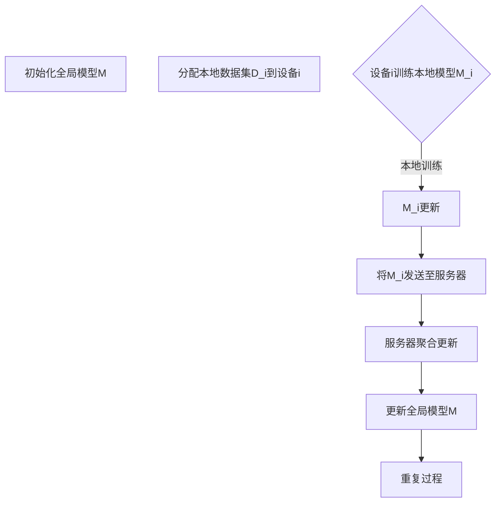

##### 1.2 联邦学习的发展历程

联邦学习最早由Google在2016年提出，其目的是为了解决移动设备上的大规模机器学习模型训练问题。随后，联邦学习在学术界和工业界引起了广泛关注。一些重要的发展历程包括：

- **2016年**：Google提出联邦学习概念，并发布相关论文。
- **2017年**：Google开源TensorFlow Federated（TFF）框架。
- **2018年**：联邦学习开始在金融、医疗、图像处理等领域得到应用。
- **2019年**：学术界和工业界开始深入探讨联邦学习的安全性、通信优化和算法设计。

##### 1.3 联邦学习的应用领域

联邦学习由于其独特的分布式特性，在多个领域都有着广泛的应用潜力：

- **图像处理**：在图像分类、检测和分割等任务中，联邦学习可以帮助保护用户隐私，同时提高模型性能。
- **自然语言处理**：在文本分类、语音识别和机器翻译等任务中，联邦学习可以有效地处理分散的文本数据。
- **医疗健康**：在疾病预测、基因数据分析、临床试验数据共享等领域，联邦学习有助于保护患者隐私，同时提高诊断准确率。
- **金融行业**：在信用评分、反欺诈和投资策略优化等领域，联邦学习可以提高数据处理效率，同时保护用户隐私。

#### 1.4 联邦学习的优势与挑战

**优势**

- **数据隐私保护**：联邦学习通过分布式训练，避免了将用户数据上传到中央服务器，从而保护了用户隐私。
- **高效处理大量数据**：联邦学习可以利用边缘设备上的数据，实现大规模数据处理，同时减少中心服务器的负载。
- **适应性强**：联邦学习适用于各种规模和类型的设备，能够满足不同场景下的需求。

**挑战**

- **通信复杂度**：由于设备之间的通信和数据传输，联邦学习的通信复杂度较高。
- **数据不均衡**：不同设备上的数据分布可能不均衡，影响模型训练效果。
- **算法安全性**：联邦学习需要应对各种攻击，如协同攻击、模型泄露等，以确保算法安全性。

##### 1.5 联邦学习的关键技术

**通信模型**

联邦学习中的通信模型主要涉及如何高效地传输模型更新信息。常用的方法包括同步通信和异步通信：

- **同步通信**：所有设备在相同的时间点进行模型更新传输。
- **异步通信**：设备在不同的时间点发送模型更新，服务器进行聚合。

**计算模型**

联邦学习中的计算模型主要涉及如何在本地设备上进行模型训练和更新。计算模型需要考虑以下几个方面：

- **本地训练**：设备使用本地数据进行模型训练。
- **模型更新**：设备将训练后的模型更新发送到服务器。
- **全局模型更新**：服务器将所有设备的模型更新进行聚合，得到全局模型。

**安全性机制**

联邦学习需要确保用户数据的安全性和模型的安全性。常见的安全机制包括：

- **差分隐私**：通过添加噪声来保护用户数据的隐私。
- **加密学习**：使用加密算法对数据进行加密，确保数据传输和存储过程中的安全性。
- **同态加密**：在加密数据上进行计算，从而确保计算结果的安全性。

#### 第2章：联邦学习的安全性问题

联邦学习的安全性是影响其广泛应用的关键因素。这一部分将探讨联邦学习中的安全性问题，包括数据隐私的重要性、联邦学习的隐私保护机制以及安全性挑战与解决方案。

##### 2.1 数据隐私的重要性

在联邦学习过程中，数据隐私保护至关重要。原因如下：

- **用户信任**：用户愿意将数据分享给第三方，前提是数据是安全的。
- **法规遵从**：许多国家和地区都有严格的数据保护法规，如欧洲的通用数据保护条例（GDPR）。
- **业务需求**：保护用户隐私有助于建立良好的品牌形象，增强用户忠诚度。

##### 2.2 联邦学习的隐私保护机制

联邦学习采用了多种隐私保护机制，以确保用户数据的隐私安全。以下是一些常见的隐私保护机制：

- **差分隐私（Differential Privacy）**：通过在本地训练过程中添加随机噪声来保护数据隐私。
- **加密学习（Encrypted Learning）**：使用加密算法对数据进行加密，确保数据在传输和存储过程中的安全性。
- **同态加密（Homomorphic Encryption）**：在加密数据上进行计算，从而确保计算结果的安全性。

**差分隐私**

差分隐私是一种常用的隐私保护机制，它通过在本地训练过程中添加随机噪声来保护数据隐私。具体来说，差分隐私定义了一个隐私预算 $\epsilon$，用于控制隐私泄露的程度。差分隐私机制的核心是拉普拉斯机制（Laplace Mechanism）和指数机制（Exponential Mechanism）。

**数学模型**

设 $S$ 是一组数据，$S'$ 是 $S$ 的一个微小扰动，差分隐私的定义如下：

$$
\mathbb{P}(\mathcal{M}(S') \in R) \leq e^{\frac{\epsilon}{\Delta}} \mathbb{P}(\mathcal{M}(S) \in R)
$$

其中，$\mathcal{M}$ 是一个算法，$R$ 是算法的输出，$\Delta$ 是数据差异的度量。

**Mermaid流程图**

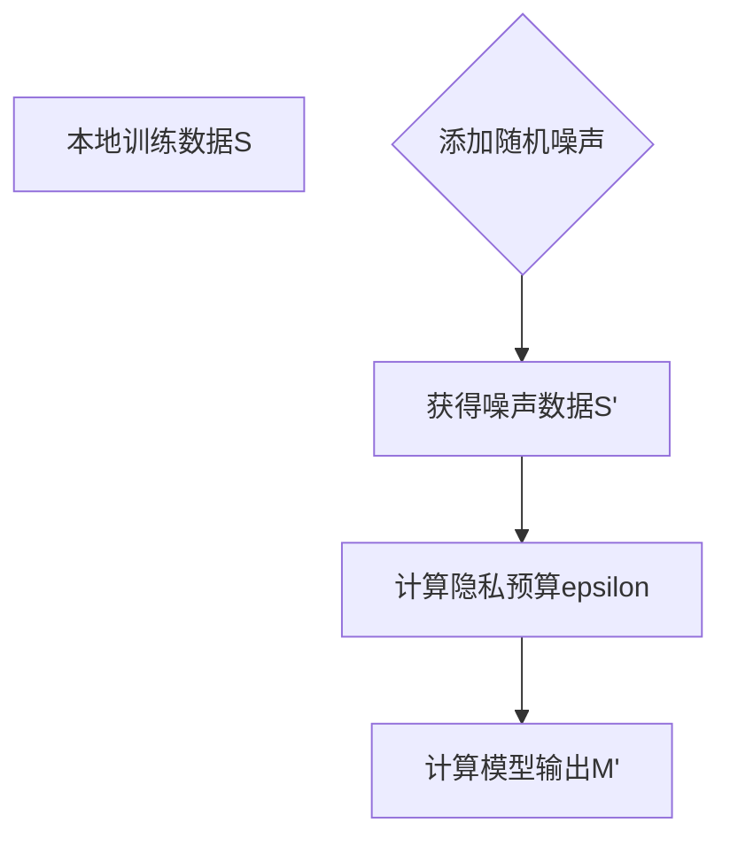

**加密学习**

加密学习通过使用加密算法对数据进行加密，确保数据在传输和存储过程中的安全性。加密学习的主要挑战是计算复杂度高，但近年来，随着量子计算的进步，同态加密技术得到了快速发展。

**数学模型**

设 $x$ 是原始数据，$c$ 是加密后的数据，加密学习的目标是确保：

$$
\mathbb{P}(\text{decrypt}(c) = x) = 1
$$

**同态加密**

同态加密允许在加密数据上进行计算，从而确保计算结果的安全性。同态加密的主要挑战是实现高效的同态计算。

**数学模型**

设 $x, y$ 是原始数据，$c_x, c_y$ 是加密后的数据，同态加密的目标是确保：

$$
\text{decrypt}(\text{encrypt}(x) \oplus \text{encrypt}(y)) = x + y
$$

**Mermaid流程图**

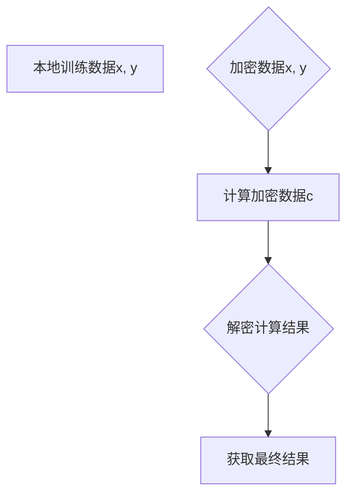

##### 2.3 安全性挑战与解决方案

联邦学习面临以下安全性挑战：

- **协同攻击（Sybil Attack）**：攻击者通过创建多个恶意设备来破坏联邦学习过程。
- **模型泄露（Model Leakage）**：本地模型更新可能泄露用户数据。
- **恶意设备（Malicious Devices）**：恶意设备可能试图破坏联邦学习过程。

针对这些挑战，有以下解决方案：

- **基于差分隐私的安全机制**：通过添加随机噪声来保护用户数据。
- **基于加密学习的安全机制**：使用加密算法来保护数据传输和存储过程。
- **基于同态加密的安全机制**：在加密数据上进行计算，从而确保计算结果的安全性。

**Mermaid流程图**

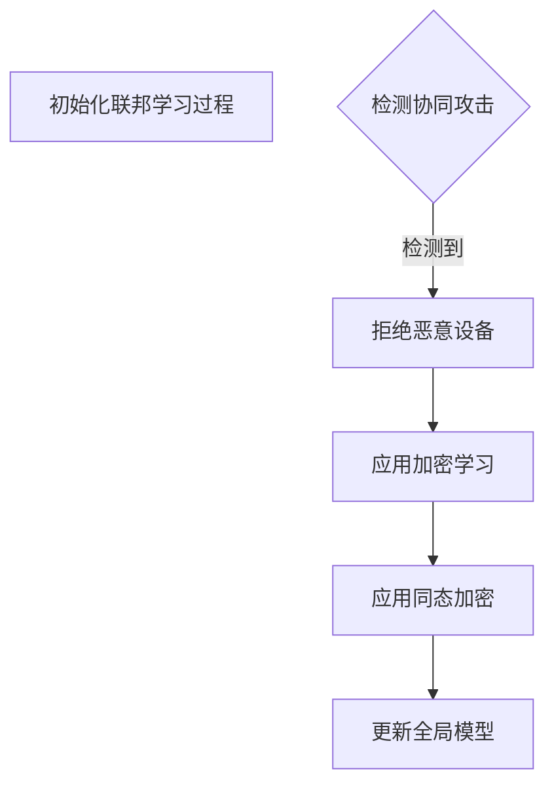

#### 第3章：联邦学习的通信与计算

联邦学习中的通信与计算模型是影响其性能和效率的关键因素。这一部分将深入探讨联邦学习中的通信模型、计算模型以及通信与计算优化策略。

##### 3.1 联邦学习的通信模型

联邦学习的通信模型主要涉及如何高效地传输模型更新信息。通信模型可以分为以下几种：

- **全同步通信**：所有设备在相同的时间点进行模型更新传输。
- **半同步通信**：设备在不同的时间点发送模型更新，但服务器在固定的时间点进行聚合。
- **全异步通信**：设备在不同的时间点发送模型更新，服务器实时进行聚合。

**全同步通信**

全同步通信是最简单的通信模型，所有设备在相同的时间点发送模型更新。这种模型的优点是实现简单，但缺点是通信延迟较大。

**数学模型**

设 $N$ 是设备数量，$T$ 是时间步长，全同步通信的通信复杂度为：

$$
C_{sync} = O(N \cdot T)
$$

**Mermaid流程图**

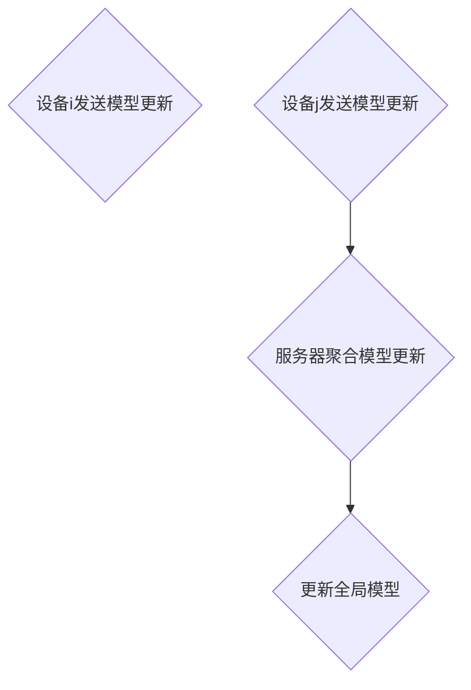

**半同步通信**

半同步通信允许设备在不同的时间点发送模型更新，但服务器在固定的时间点进行聚合。这种模型可以减少通信延迟，提高系统的吞吐量。

**数学模型**

设 $N$ 是设备数量，$T$ 是服务器聚合时间，半同步通信的通信复杂度为：

$$
C_{semi-sync} = O(N \cdot T)
$$

**Mermaid流程图**


**全异步通信**

全异步通信允许设备在不同的时间点发送模型更新，服务器实时进行聚合。这种模型可以最大程度地减少通信延迟，但实现复杂度较高。

**数学模型**

设 $N$ 是设备数量，$T$ 是设备更新时间，全异步通信的通信复杂度为：

$$
C_{async} = O(N \cdot T)
$$

**Mermaid流程图**

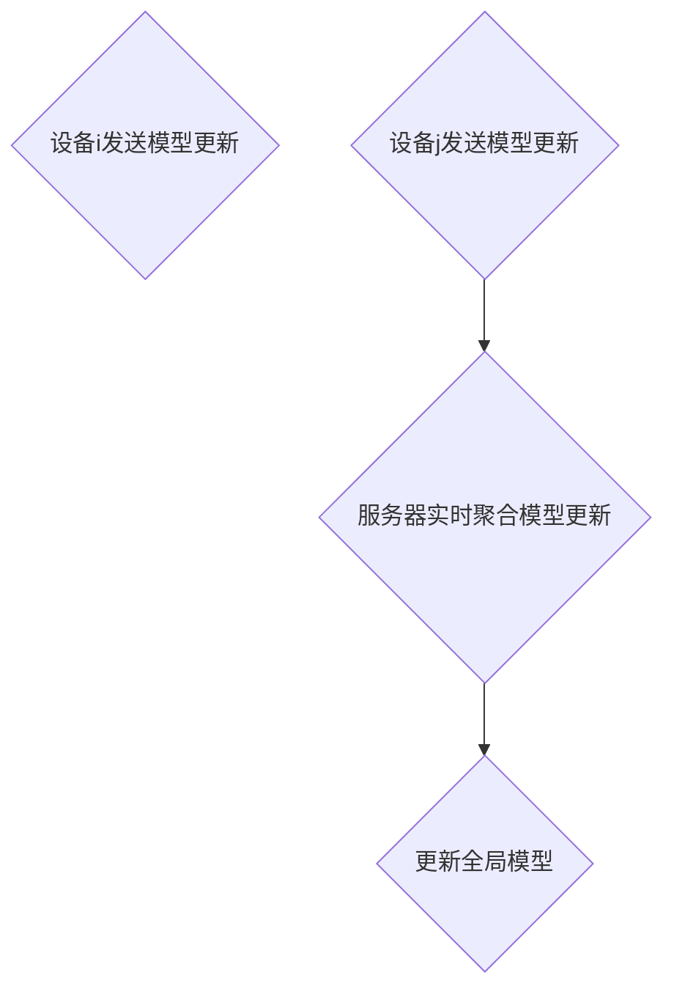

##### 3.2 联邦学习的计算模型

联邦学习的计算模型主要涉及如何在本地设备上进行模型训练和更新。计算模型可以分为以下几种：

- **本地训练**：设备使用本地数据进行模型训练。
- **模型更新**：设备将训练后的模型更新发送到服务器。
- **全局模型更新**：服务器将所有设备的模型更新进行聚合，得到全局模型。

**本地训练**

本地训练是联邦学习的基本步骤，设备使用本地数据进行模型训练。本地训练的效率直接影响联邦学习的性能。

**数学模型**

设 $D_i$ 是第 $i$ 个设备上的本地数据集，$M_i$ 是第 $i$ 个设备上的本地模型，本地训练的目标是最小化损失函数：

$$
\min_{M_i} J_i(M_i)
$$

**Mermaid流程图**

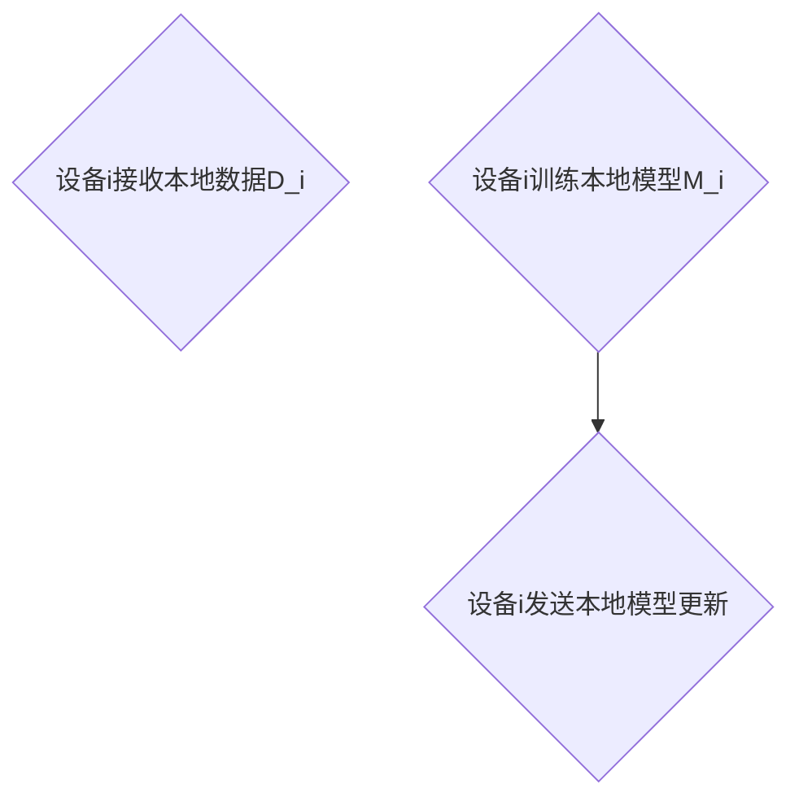

**模型更新**

模型更新是设备将训练后的模型更新发送到服务器的过程。模型更新的方法可以基于同步、半同步和异步通信模型。

**数学模型**

设 $M_i$ 是第 $i$ 个设备上的本地模型更新，模型更新的目标是确保全局模型 $M$ 收敛：

$$
M \rightarrow M'
$$

**Mermaid流程图**

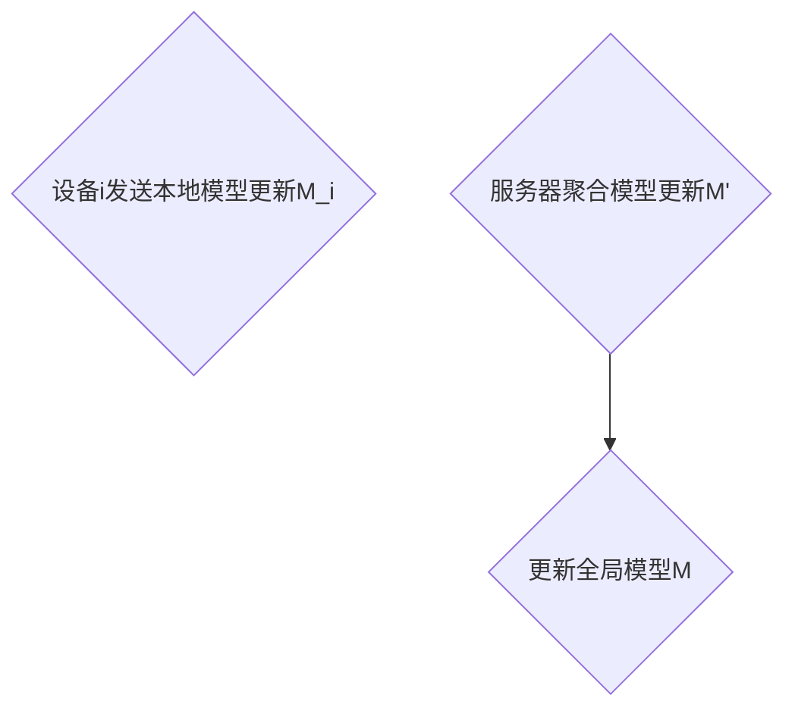

**全局模型更新**

全局模型更新是服务器将所有设备的模型更新进行聚合，得到全局模型的过程。全局模型更新的方法可以基于同步、半同步和异步通信模型。

**数学模型**

设 $M_i$ 是第 $i$ 个设备上的本地模型更新，全局模型更新 $M$ 的目标是最小化全局损失函数：

$$
M = \arg\min_{M} J(M)
$$

**Mermaid流程图**


##### 3.3 联邦学习中的通信与计算优化

联邦学习中的通信与计算优化是提高系统性能的关键。以下是一些优化策略：

- **数据压缩**：通过数据压缩算法减少数据传输量。
- **模型剪枝**：通过模型剪枝算法减少模型参数，降低计算复杂度。
- **异步通信**：允许设备在不同时间点发送模型更新，减少通信延迟。

**数据压缩**

数据压缩可以显著减少通信复杂度，提高联邦学习性能。常用的数据压缩算法包括：

- **无损压缩**：如Huffman编码、LZ77压缩等。
- **有损压缩**：如JPEG、MP3压缩等。

**数学模型**

设 $D$ 是原始数据，$D'$ 是压缩后的数据，数据压缩的目标是最小化传输量：

$$
\min_{D'} \frac{1}{|D'|}
$$

**模型剪枝**

模型剪枝通过删除冗余的模型参数，减少模型复杂度，提高联邦学习性能。常用的模型剪枝方法包括：

- **结构剪枝**：删除部分网络层或节点。
- **权重剪枝**：删除部分权重。

**数学模型**

设 $M$ 是原始模型，$M'$ 是剪枝后的模型，模型剪枝的目标是最小化损失函数：

$$
\min_{M'} J(M')
$$

**异步通信**

异步通信可以减少通信延迟，提高联邦学习性能。异步通信的关键是合理调度设备更新时间。

**数学模型**

设 $T_i$ 是第 $i$ 个设备的更新时间，异步通信的目标是最小化总更新时间：

$$
\min_{T_i} \sum_{i=1}^{N} T_i
$$

**Mermaid流程图**

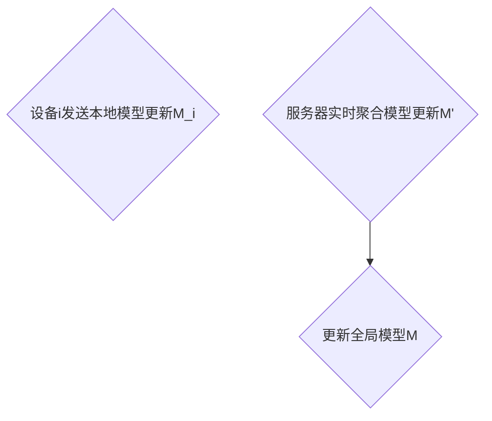

#### 第4章：联邦学习算法基础

联邦学习算法是实现联邦学习的关键。这一部分将介绍联邦学习中的无中央化学习算法、中心化学习算法以及联邦学习算法的设计原则。

##### 4.1 无中央化学习算法

无中央化学习算法（Decentralized Learning Algorithms）是一种联邦学习算法，其核心思想是设备直接相互通信，不需要通过中央服务器。以下是一些常见的无中央化学习算法：

- **联邦平均算法（FedAvg）**：联邦平均算法是一种基于梯度聚合的联邦学习算法，其基本思想是将所有设备的本地梯度聚合起来，更新全局模型。
- **联邦随机梯度下降（FedSGD）**：联邦随机梯度下降是一种基于随机梯度的联邦学习算法，其基本思想是在每个设备上随机选择一部分样本进行训练，然后将梯度聚合起来更新全局模型。

**联邦平均算法（FedAvg）**

联邦平均算法的基本步骤如下：

1. **初始化全局模型 $M$**。
2. **设备 $i$ 上的本地训练**：设备 $i$ 使用本地数据集 $D_i$ 训练模型 $M_i$。
3. **设备 $i$ 更新模型 $M_i$**：设备 $i$ 更新模型 $M_i$。
4. **全局模型更新**：将所有设备的模型 $M_i$ 聚合起来，更新全局模型 $M$。
5. **重复步骤 2-4，直到模型收敛**。

**数学模型**

设 $M_i$ 是第 $i$ 个设备的本地模型，$M$ 是全局模型，联邦平均算法的更新规则如下：

$$
M_{t+1} = \frac{1}{N} \sum_{i=1}^{N} M_i^t
$$

**Mermaid流程图**

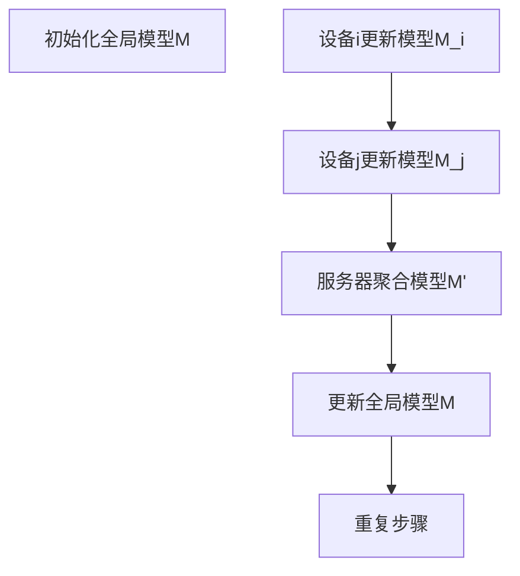

**联邦随机梯度下降（FedSGD）**

联邦随机梯度下降的基本步骤如下：

1. **初始化全局模型 $M$**。
2. **设备 $i$ 上的本地训练**：设备 $i$ 使用本地数据集 $D_i$ 训练模型 $M_i$。
3. **设备 $i$ 更新模型 $M_i$**：设备 $i$ 更新模型 $M_i$。
4. **全局模型更新**：将所有设备的模型 $M_i$ 聚合起来，更新全局模型 $M$。
5. **重复步骤 2-4，直到模型收敛**。

**数学模型**

设 $M_i$ 是第 $i$ 个设备的本地模型，$M$ 是全局模型，联邦随机梯度下降的更新规则如下：

$$
M_{t+1} = M_t - \eta \frac{1}{N} \sum_{i=1}^{N} \nabla M_i^t
$$

其中，$\eta$ 是学习率。

**Mermaid流程图**


##### 4.2 中心化学习算法

中心化学习算法（Centralized Learning Algorithms）是一种联邦学习算法，其核心思想是设备将本地模型更新发送到中央服务器，中央服务器进行聚合更新全局模型。以下是一些常见的中心化学习算法：

- **集中式随机梯度下降（Centralized SGD）**：集中式随机梯度下降是一种基于随机梯度的中心化学习算法。
- **集中式批量梯度下降（Centralized BGD）**：集中式批量梯度下降是一种基于批量梯度的中心化学习算法。

**集中式随机梯度下降（Centralized SGD）**

集中式随机梯度下降的基本步骤如下：

1. **初始化全局模型 $M$**。
2. **设备 $i$ 上的本地训练**：设备 $i$ 使用本地数据集 $D_i$ 训练模型 $M_i$。
3. **设备 $i$ 更新模型 $M_i$**：设备 $i$ 将本地模型更新发送到中央服务器。
4. **中央服务器聚合模型更新**：中央服务器将所有设备的模型更新聚合起来，更新全局模型 $M$。
5. **中央服务器评估模型 $M$**：中央服务器使用测试数据集评估全局模型 $M$ 的性能。
6. **重复步骤 2-5，直到模型收敛**。

**数学模型**

设 $M_i$ 是第 $i$ 个设备的本地模型，$M$ 是全局模型，集中式随机梯度下降的更新规则如下：

$$
M_{t+1} = M_t - \eta \nabla J(M_t)
$$

其中，$\eta$ 是学习率。

**Mermaid流程图**

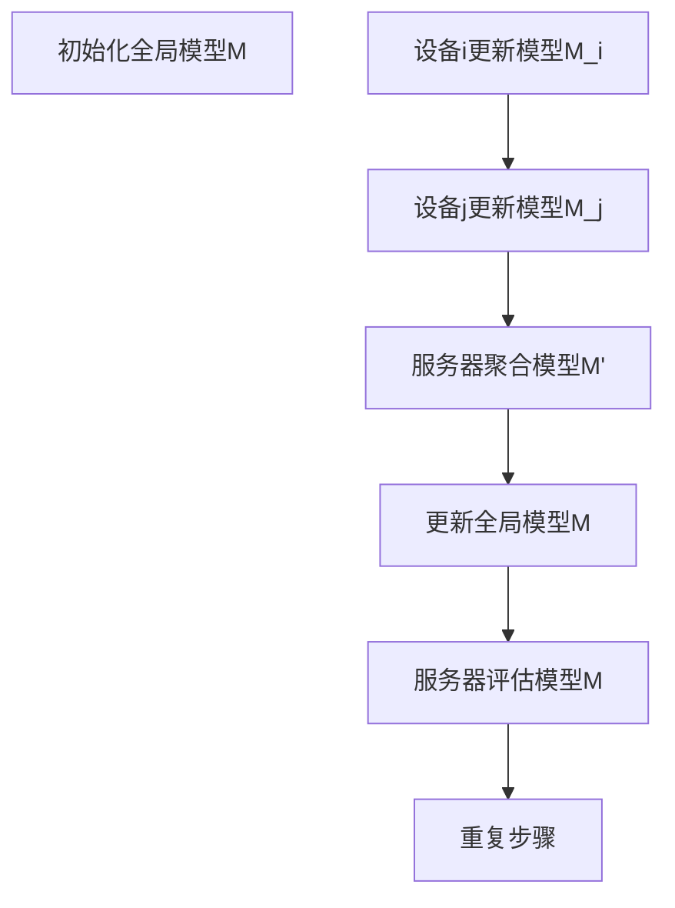

**集中式批量梯度下降（Centralized BGD）**

集中式批量梯度下降的基本步骤如下：

1. **初始化全局模型 $M$**。
2. **设备 $i$ 上的本地训练**：设备 $i$ 使用本地数据集 $D_i$ 训练模型 $M_i$。
3. **设备 $i$ 更新模型 $M_i$**：设备 $i$ 将本地模型更新发送到中央服务器。
4. **中央服务器聚合模型更新**：中央服务器将所有设备的模型更新聚合起来，更新全局模型 $M$。
5. **中央服务器评估模型 $M$**：中央服务器使用测试数据集评估全局模型 $M$ 的性能。
6. **重复步骤 2-5，直到模型收敛**。

**数学模型**

设 $M_i$ 是第 $i$ 个设备的本地模型，$M$ 是全局模型，集中式批量梯度下降的更新规则如下：

$$
M_{t+1} = M_t - \eta \frac{1}{N} \sum_{i=1}^{N} \nabla J(M_t)
$$

其中，$\eta$ 是学习率。

**Mermaid流程图**


##### 4.3 联邦学习算法的设计原则

联邦学习算法的设计原则主要包括以下几点：

- **可扩展性**：算法应能够在大量设备上运行，并具有良好的可扩展性。
- **高效性**：算法应能够在有限的时间内完成训练，并具有较低的通信和计算复杂度。
- **鲁棒性**：算法应能够应对设备故障、数据丢失等异常情况。

**可扩展性**

联邦学习算法的可扩展性取决于以下因素：

- **设备数量**：算法应能够支持任意数量的设备。
- **设备异质性**：算法应能够处理不同类型的设备。
- **数据分布**：算法应能够处理不同分布的数据。

**高效性**

联邦学习算法的高效性取决于以下因素：

- **通信复杂度**：算法应具有较低的通信复杂度。
- **计算复杂度**：算法应具有较低的
```markdown
### 第一部分：联邦学习基础理论

#### 第1章：联邦学习的概念与背景

##### 1.1 联邦学习的定义

联邦学习（Federated Learning）是一种分布式机器学习技术，其核心思想是将数据分布在多个独立的设备或服务器上，每个设备或服务器在本地进行模型训练，然后将训练结果汇总到中央服务器，从而形成一个全局模型。这一过程避免了数据在传输过程中被第三方访问，保护了用户隐私。

**核心概念与联系**

联邦学习与传统的集中式学习相比，具有以下几个核心概念和联系：

- **集中式学习**：所有数据集中在一个中央服务器上进行模型训练。
- **分布式学习**：数据分布在多个地方，但在每个地方进行独立训练。
- **联邦学习**：数据分布在多个地方，每个地方进行独立训练，然后汇总到中央服务器。

**数学模型**

在联邦学习中，我们通常关注的是全局模型的更新过程。设 $M$ 为全局模型，$M_i$ 为第 $i$ 个设备的本地模型，$D_i$ 为第 $i$ 个设备的本地数据集，联邦学习的过程可以描述为：

$$
M_{t+1} = \frac{1}{N} \sum_{i=1}^{N} M_i^t + \Delta M_t
$$

其中，$N$ 为设备总数，$\Delta M_t$ 表示在 $t$ 轮次中的全局模型更新。

**Mermaid流程图**


##### 1.2 联邦学习的发展历程

联邦学习起源于2017年Google发布的一篇论文《Federated Learning: Collaborative Machine Learning Without Centralized Training Data》，这篇论文首次提出了联邦学习这一概念，并在随后引发了广泛的关注和研究。以下是联邦学习的发展历程：

- **2017年**：Google提出联邦学习概念，并在移动设备上进行了初步尝试。
- **2018年**：Google开源了TensorFlow Federated（TFF），成为联邦学习的主要开源框架。
- **2019年**：联邦学习开始应用于金融、医疗、图像处理等领域。
- **2020年**：联邦学习在学术界和工业界继续发展，涌现出大量的研究论文和开源项目。

##### 1.3 联邦学习的应用领域

联邦学习由于其隐私保护和高效处理的特性，在多个领域都有广泛的应用：

- **图像处理**：在图像分类、检测和分割中，联邦学习可以帮助保护用户隐私，同时提高模型性能。
- **自然语言处理**：在文本分类、语音识别和机器翻译中，联邦学习可以处理分散的文本数据。
- **医疗健康**：在疾病预测、基因数据分析和临床试验中，联邦学习有助于保护患者隐私，同时提高诊断准确率。
- **金融行业**：在信用评分、反欺诈和投资策略优化中，联邦学习可以提高数据处理效率，同时保护用户隐私。

##### 1.4 联邦学习的优势与挑战

**优势**

- **数据隐私保护**：联邦学习通过分布式训练，避免了将用户数据上传到中央服务器，从而保护了用户隐私。
- **高效处理大量数据**：联邦学习可以利用边缘设备上的数据，实现大规模数据处理，同时减少中心服务器的负载。
- **适应性强**：联邦学习适用于各种规模和类型的设备，能够满足不同场景下的需求。

**挑战**

- **通信复杂度**：由于设备之间的通信和数据传输，联邦学习的通信复杂度较高。
- **数据不均衡**：不同设备上的数据分布可能不均衡，影响模型训练效果。
- **算法安全性**：联邦学习需要应对各种攻击，如协同攻击、模型泄露等，以确保算法安全性。

##### 1.5 联邦学习的关键技术

**通信模型**

联邦学习的通信模型主要涉及如何高效地传输模型更新信息。常用的通信模型包括同步通信和异步通信：

- **同步通信**：所有设备在相同的时间点进行模型更新传输。
- **异步通信**：设备在不同的时间点发送模型更新，服务器进行聚合。

**计算模型**

联邦学习的计算模型主要涉及如何在本地设备上进行模型训练和更新。计算模型需要考虑以下几个方面：

- **本地训练**：设备使用本地数据进行模型训练。
- **模型更新**：设备将训练后的模型更新发送到服务器。
- **全局模型更新**：服务器将所有设备的模型更新进行聚合，得到全局模型。

**安全性机制**

联邦学习需要确保用户数据的安全性和模型的安全性。常见的安全机制包括：

- **差分隐私**：通过添加噪声来保护用户数据的隐私。
- **加密学习**：使用加密算法对数据进行加密，确保数据传输和存储过程中的安全性。
- **同态加密**：在加密数据上进行计算，从而确保计算结果的安全性。

#### 第2章：联邦学习的安全性问题

联邦学习的安全性是影响其广泛应用的关键因素。这一部分将探讨联邦学习中的安全性问题，包括数据隐私的重要性、联邦学习的隐私保护机制以及安全性挑战与解决方案。

##### 2.1 数据隐私的重要性

在联邦学习过程中，数据隐私保护至关重要。原因如下：

- **用户信任**：用户愿意将数据分享给第三方，前提是数据是安全的。
- **法规遵从**：许多国家和地区都有严格的数据保护法规，如欧洲的通用数据保护条例（GDPR）。
- **业务需求**：保护用户隐私有助于建立良好的品牌形象，增强用户忠诚度。

##### 2.2 联邦学习的隐私保护机制

联邦学习采用了多种隐私保护机制，以确保用户数据的隐私安全。以下是一些常见的隐私保护机制：

- **差分隐私（Differential Privacy）**：通过在本地训练过程中添加随机噪声来保护数据隐私。
- **加密学习（Encrypted Learning）**：使用加密算法对数据进行加密，确保数据传输和存储过程中的安全性。
- **同态加密（Homomorphic Encryption）**：在加密数据上进行计算，从而确保计算结果的安全性。

**差分隐私**

差分隐私是一种常用的隐私保护机制，它通过在本地训练过程中添加随机噪声来保护数据隐私。具体来说，差分隐私定义了一个隐私预算 $\epsilon$，用于控制隐私泄露的程度。差分隐私机制的核心是拉普拉斯机制（Laplace Mechanism）和指数机制（Exponential Mechanism）。

**数学模型**

设 $S$ 是一组数据，$S'$ 是 $S$ 的一个微小扰动，差分隐私的定义如下：

$$
\mathbb{P}(\mathcal{M}(S') \in R) \leq e^{\frac{\epsilon}{\Delta}} \mathbb{P}(\mathcal{M}(S) \in R)
$$

其中，$\mathcal{M}$ 是一个算法，$R$ 是算法的输出，$\Delta$ 是数据差异的度量。

**Mermaid流程图**


**加密学习**

加密学习通过使用加密算法对数据进行加密，确保数据在传输和存储过程中的安全性。加密学习的主要挑战是计算复杂度高，但近年来，随着量子计算的进步，同态加密技术得到了快速发展。

**数学模型**

设 $x$ 是原始数据，$c$ 是加密后的数据，加密学习的目标是确保：

$$
\mathbb{P}(\text{decrypt}(c) = x) = 1
$$

**同态加密**

同态加密允许在加密数据上进行计算，从而确保计算结果的安全性。同态加密的主要挑战是实现高效的同态计算。

**数学模型**

设 $x, y$ 是原始数据，$c_x, c_y$ 是加密后的数据，同态加密的目标是确保：

$$
\text{decrypt}(\text{encrypt}(x) \oplus \text{encrypt}(y)) = x + y
$$

**Mermaid流程图**


##### 2.3 安全性挑战与解决方案

联邦学习面临以下安全性挑战：

- **协同攻击（Sybil Attack）**：攻击者通过创建多个恶意设备来破坏联邦学习过程。
- **模型泄露（Model Leakage）**：本地模型更新可能泄露用户数据。
- **恶意设备（Malicious Devices）**：恶意设备可能试图破坏联邦学习过程。

针对这些挑战，有以下解决方案：

- **基于差分隐私的安全机制**：通过添加随机噪声来保护用户数据。
- **基于加密学习的安全机制**：使用加密算法来保护数据传输和存储过程。
- **基于同态加密的安全机制**：在加密数据上进行计算，从而确保计算结果的安全性。

**Mermaid流程图**


#### 第3章：联邦学习的通信与计算

联邦学习中的通信与计算模型是影响其性能和效率的关键因素。这一部分将深入探讨联邦学习中的通信模型、计算模型以及通信与计算优化策略。

##### 3.1 联邦学习的通信模型

联邦学习的通信模型主要涉及如何高效地传输模型更新信息。通信模型可以分为以下几种：

- **全同步通信**：所有设备在相同的时间点进行模型更新传输。
- **半同步通信**：设备在不同的时间点发送模型更新，但服务器在固定的时间点进行聚合。
- **全异步通信**：设备在不同的时间点发送模型更新，服务器实时进行聚合。

**全同步通信**

全同步通信是最简单的通信模型，所有设备在相同的时间点发送模型更新。这种模型的优点是实现简单，但缺点是通信延迟较大。

**数学模型**

设 $N$ 是设备数量，$T$ 是时间步长，全同步通信的通信复杂度为：

$$
C_{sync} = O(N \cdot T)
$$

**Mermaid流程图**


**半同步通信**

半同步通信允许设备在不同的时间点发送模型更新，但服务器在固定的时间点进行聚合。这种模型可以减少通信延迟，提高系统的吞吐量。

**数学模型**

设 $N$ 是设备数量，$T$ 是服务器聚合时间，半同步通信的通信复杂度为：

$$
C_{semi-sync} = O(N \cdot T)
$$

**Mermaid流程图**

```mermaid
graph TD
A{设备i发送模型更新}
B{设备j发送模型更新}
B --> C{服务器聚合模型更新}
C --> D{更新全局模型}
```

**全异步通信**

全异步通信允许设备在不同的时间点发送模型更新，服务器实时进行聚合。这种模型可以最大程度地减少通信延迟，但实现复杂度较高。

**数学模型**

设 $N$ 是设备数量，$T$ 是设备更新时间，全异步通信的通信复杂度为：

$$
C_{async} = O(N \cdot T)
$$

**Mermaid流程图**

```mermaid
graph TD
A{设备i发送模型更新}
B{设备j发送模型更新}
B --> C{服务器实时聚合模型更新}
C --> D{更新全局模型}
```

##### 3.2 联邦学习的计算模型

联邦学习的计算模型主要涉及如何在本地设备上进行模型训练和更新。计算模型可以分为以下几种：

- **本地训练**：设备使用本地数据进行模型训练。
- **模型更新**：设备将训练后的模型更新发送到服务器。
- **全局模型更新**：服务器将所有设备的模型更新进行聚合，得到全局模型。

**本地训练**

本地训练是联邦学习的基本步骤，设备使用本地数据进行模型训练。本地训练的效率直接影响联邦学习的性能。

**数学模型**

设 $D_i$ 是第 $i$ 个设备上的本地数据集，$M_i$ 是第 $i$ 个设备上的本地模型，本地训练的目标是最小化损失函数：

$$
\min_{M_i} J_i(M_i)
$$

**Mermaid流程图**

```mermaid
graph TD
A{设备i接收本地数据D_i}
B{设备i训练本地模型M_i}
B --> C{设备i发送本地模型更新}
```

**模型更新**

模型更新是设备将训练后的模型更新发送到服务器的过程。模型更新的方法可以基于同步、半同步和异步通信模型。

**数学模型**

设 $M_i$ 是第 $i$ 个设备的本地模型更新，模型更新的目标是确保全局模型 $M$ 收敛：

$$
M \rightarrow M'
$$

**Mermaid流程图**

```mermaid
graph TD
A{设备i发送本地模型更新M_i}
B{服务器聚合模型更新M'}
B --> C{更新全局模型M}
```

**全局模型更新**

全局模型更新是服务器将所有设备的模型更新进行聚合，得到全局模型的过程。全局模型更新的方法可以基于同步、半同步和异步通信模型。

**数学模型**

设 $M_i$ 是第 $i$ 个设备的本地模型更新，全局模型更新 $M$ 的目标是最小化全局损失函数：

$$
M = \arg\min_{M} J(M)
$$

**Mermaid流程图**

```mermaid
graph TD
A{设备i发送本地模型更新M_i}
B{服务器聚合模型更新M'}
B --> C{更新全局模型M}
```

##### 3.3 联邦学习中的通信与计算优化

联邦学习中的通信与计算优化是提高系统性能的关键。以下是一些优化策略：

- **数据压缩**：通过数据压缩算法减少数据传输量。
- **模型剪枝**：通过模型剪枝算法减少模型参数，降低计算复杂度。
- **异步通信**：允许设备在不同时间点发送模型更新，减少通信延迟。

**数据压缩**

数据压缩可以显著减少通信复杂度，提高联邦学习性能。常用的数据压缩算法包括：

- **无损压缩**：如Huffman编码、LZ77压缩等。
- **有损压缩**：如JPEG、MP3压缩等。

**数学模型**

设 $D$ 是原始数据，$D'$ 是压缩后的数据，数据压缩的目标是最小化传输量：

$$
\min_{D'} \frac{1}{|D'|}
$$

**模型剪枝**

模型剪枝通过删除冗余的模型参数，减少模型复杂度，提高联邦学习性能。常用的模型剪枝方法包括：

- **结构剪枝**：删除部分网络层或节点。
- **权重剪枝**：删除部分权重。

**数学模型**

设 $M$ 是原始模型，$M'$ 是剪枝后的模型，模型剪枝的目标是最小化损失函数：

$$
\min_{M'} J(M')
$$

**异步通信**

异步通信可以减少通信延迟，提高联邦学习性能。异步通信的关键是合理调度设备更新时间。

**数学模型**

设 $T_i$ 是第 $i$ 个设备的更新时间，异步通信的目标是最小化总更新时间：

$$
\min_{T_i} \sum_{i=1}^{N} T_i
$$

**Mermaid流程图**

```mermaid
graph TD
A{设备i发送本地模型更新M_i}
B{服务器实时聚合模型更新M'}
B --> C{更新全局模型M}
```

#### 第4章：联邦学习算法基础

联邦学习算法是实现联邦学习的关键。这一部分将介绍联邦学习中的无中央化学习算法、中心化学习算法以及联邦学习算法的设计原则。

##### 4.1 无中央化学习算法

无中央化学习算法（Decentralized Learning Algorithms）是一种联邦学习算法，其核心思想是设备直接相互通信，不需要通过中央服务器。以下是一些常见的无中央化学习算法：

- **联邦平均算法（FedAvg）**：联邦平均算法是一种基于梯度聚合的联邦学习算法，其基本思想是将所有设备的本地梯度聚合起来，更新全局模型。
- **联邦随机梯度下降（FedSGD）**：联邦随机梯度下降是一种基于随机梯度的联邦学习算法，其基本思想是在每个设备上随机选择一部分样本进行训练，然后将梯度聚合起来更新全局模型。

**联邦平均算法（FedAvg）**

联邦平均算法的基本步骤如下：

1. **初始化全局模型 $M$**。
2. **设备 $i$ 上的本地训练**：设备 $i$ 使用本地数据集 $D_i$ 训练模型 $M_i$。
3. **设备 $i$ 更新模型 $M_i$**：设备 $i$ 更新模型 $M_i$。
4. **全局模型更新**：将所有设备的模型 $M_i$ 聚合起来，更新全局模型 $M$。
5. **重复步骤 2-4，直到模型收敛**。

**数学模型**

设 $M_i$ 是第 $i$ 个设备的本地模型，$M$ 是全局模型，联邦平均算法的更新规则如下：

$$
M_{t+1} = \frac{1}{N} \sum_{i=1}^{N} M_i^t
$$

**Mermaid流程图**

```mermaid
graph TD
A[初始化全局模型M]
B[设备i更新模型M_i]
B --> C[设备j更新模型M_j]
C --> D[服务器聚合模型M']
D --> E[更新全局模型M]
E --> F[重复步骤]
```

**联邦随机梯度下降（FedSGD）**

联邦随机梯度下降的基本步骤如下：

1. **初始化全局模型 $M$**。
2. **设备 $i$ 上的本地训练**：设备 $i$ 使用本地数据集 $D_i$ 训练模型 $M_i$。
3. **设备 $i$ 更新模型 $M_i$**：设备 $i$ 更新模型 $M_i$。
4. **全局模型更新**：将所有设备的模型 $M_i$ 聚合起来，更新全局模型 $M$。
5. **重复步骤 2-4，直到模型收敛**。

**数学模型**

设 $M_i$ 是第 $i$ 个设备的本地模型，$M$ 是全局模型，联邦随机梯度下降的更新规则如下：

$$
M_{t+1} = M_t - \eta \frac{1}{N} \sum_{i=1}^{N} \nabla M_i^t
$$

其中，$\eta$ 是学习率。

**Mermaid流程图**

```mermaid
graph TD
A[初始化全局模型M]
B[设备i更新模型M_i]
B --> C[设备j更新模型M_j]
C --> D[服务器聚合模型M']
D --> E[更新全局模型M]
E --> F[重复步骤]
```

##### 4.2 中心化学习算法

中心化学习算法（Centralized Learning Algorithms）是一种联邦学习算法，其核心思想是设备将本地模型更新发送到中央服务器，中央服务器进行聚合更新全局模型。以下是一些常见的中心化学习算法：

- **集中式随机梯度下降（Centralized SGD）**：集中式随机梯度下降是一种基于随机梯度的中心化学习算法。
- **集中式批量梯度下降（Centralized BGD）**：集中式批量梯度下降是一种基于批量梯度的中心化学习算法。

**集中式随机梯度下降（Centralized SGD）**

集中式随机梯度下降的基本步骤如下：

1. **初始化全局模型 $M$**。
2. **设备 $i$ 上的本地训练**：设备 $i$ 使用本地数据集 $D_i$ 训练模型 $M_i$。
3. **设备 $i$ 更新模型 $M_i$**：设备 $i$ 将本地模型更新发送到中央服务器。
4. **中央服务器聚合模型更新**：中央服务器将所有设备的模型更新聚合起来，更新全局模型 $M$。
5. **中央服务器评估模型 $M$**：中央服务器使用测试数据集评估全局模型 $M$ 的性能。
6. **重复步骤 2-5，直到模型收敛**。

**数学模型**

设 $M_i$ 是第 $i$ 个设备的本地模型，$M$ 是全局模型，集中式随机梯度下降的更新规则如下：

$$
M_{t+1} = M_t - \eta \nabla J(M_t)
$$

其中，$\eta$ 是学习率。

**Mermaid流程图**

```mermaid
graph TD
A[初始化全局模型M]
B[设备i更新模型M_i]
B --> C[设备j更新模型M_j]
C --> D[服务器聚合模型M']
D --> E[更新全局模型M]
E --> F[服务器评估模型M]
F --> G[重复步骤]
```

**集中式批量梯度下降（Centralized BGD）**

集中式批量梯度下降的基本步骤如下：

1. **初始化全局模型 $M$**。
2. **设备 $i$ 上的本地训练**：设备 $i$ 使用本地数据集 $D_i$ 训练模型 $M_i$。
3. **设备 $i$ 更新模型 $M_i$**：设备 $i$ 将本地模型更新发送到中央服务器。
4. **中央服务器聚合模型更新**：中央服务器将所有设备的模型更新聚合起来，更新全局模型 $M$。
5. **中央服务器评估模型 $M$**：中央服务器使用测试数据集评估全局模型 $M$ 的性能。
6. **重复步骤 2-5，直到模型收敛**。

**数学模型**

设 $M_i$ 是第 $i$ 个设备的本地模型，$M$ 是全局模型，集中式批量梯度下降的更新规则如下：

$$
M_{t+1} = M_t - \eta \frac{1}{N} \sum_{i=1}^{N} \nabla J(M_t)
$$

其中，$\eta$ 是学习率。

**Mermaid流程图**

```mermaid
graph TD
A[初始化全局模型M]
B[设备i更新模型M_i]
B --> C[设备j更新模型M_j]
C --> D[服务器聚合模型M']
D --> E[更新全局模型M]
E --> F[服务器评估模型M]
F --> G[重复步骤]
```

##### 4.3 联邦学习算法的设计原则

联邦学习算法的设计原则主要包括以下几点：

- **可扩展性**：算法应能够在大量设备上运行，并具有良好的可扩展性。
- **高效性**：算法应能够在有限的时间内完成训练，并具有较低的通信和计算复杂度。
- **鲁棒性**：算法应能够应对设备故障、数据丢失等异常情况。

**可扩展性**

联邦学习算法的可扩展性取决于以下因素：

- **设备数量**：算法应能够支持任意数量的设备。
- **设备异质性**：算法应能够处理不同类型的设备。
- **数据分布**：算法应能够处理不同分布的数据。

**高效性**

联邦学习算法的高效性取决于以下因素：

- **通信复杂度**：算法应具有较低的通信复杂度。
- **计算复杂度**：算法应具有较低的
```markdown
#### 第5章：联邦学习的实现与优化

##### 5.1 联邦学习系统的架构设计

联邦学习系统的架构设计是确保联邦学习有效运行的关键。一个典型的联邦学习系统通常由以下几个主要部分组成：

- **设备层**：包括各种边缘设备，如智能手机、物联网设备、智能家居设备等，这些设备负责本地数据的采集、预处理和模型训练。
- **通信层**：负责在设备层和服务器层之间传输数据，包括模型参数、梯度信息等。这一层通常采用加密协议和数据压缩技术来确保数据的安全和高效传输。
- **服务器层**：负责聚合来自设备的模型更新，生成全局模型，并对全局模型进行评估和优化。

**系统架构图**

```mermaid
graph TD
A[设备层] --> B[通信层]
B --> C[服务器层]
C --> A
```

在设备层，每个设备负责本地数据的收集和处理，并通过安全通道将处理后的数据发送到服务器层。服务器层接收来自所有设备的更新，进行模型聚合和评估，然后将全局模型返回给设备层用于本地更新。

**关键组件**

- **本地模型**：设备上的机器学习模型，用于处理本地数据。
- **全局模型**：服务器上的聚合模型，由所有设备本地模型的更新聚合而成。
- **数据预处理模块**：负责对设备上的数据进行清洗、归一化等预处理操作。
- **通信模块**：负责在设备层和服务器层之间传输数据，包括模型参数、梯度信息等。
- **聚合模块**：负责将来自设备的模型更新进行聚合，生成全局模型。
- **评估模块**：负责评估全局模型的性能，并进行模型优化。

##### 5.2 联邦学习中的模型优化

模型优化是联邦学习中的关键环节，它关系到模型训练的效果和效率。以下是一些常见的模型优化策略：

**模型压缩**

- **模型剪枝**：通过移除冗余的权重和神经元，减少模型的大小和参数数量，从而提高模型在设备上的可部署性。
- **量化**：将模型的权重和激活值转换为更小的数值范围，以减少模型的大小和计算复杂度。
- **知识蒸馏**：使用一个大的模型（教师模型）训练一个小的模型（学生模型），通过传递教师模型的知识来提升学生模型的表现。

**数学模型**

- **模型剪枝**：

  $$
  \min_{W} J(W) \quad \text{subject to} \quad |W| < C
  $$

  其中，$W$ 是模型权重，$J(W)$ 是损失函数，$C$ 是剪枝后的模型权重限制。

- **量化**：

  $$
  \min_{W} J(W) \quad \text{subject to} \quad |W| \leq Q
  $$

  其中，$Q$ 是量化后的权重范围。

- **知识蒸馏**：

  $$
  \min_{S} J(S, T) \quad \text{subject to} \quad S \approx T
  $$

  其中，$S$ 是学生模型，$T$ 是教师模型，$J(S, T)$ 是学生模型和教师模型之间的损失函数。

**Mermaid流程图**

```mermaid
graph TD
A[初始化模型]
B{训练教师模型}
B --> C{训练学生模型}
C --> D{优化模型}
D --> E[评估模型]
```

**模型优化算法**

- **联邦平均算法（FedAvg）**：通过迭代更新全局模型，每个设备贡献一部分梯度。
- **联邦随机梯度下降（FedSGD）**：在每次迭代中随机选择一个本地数据集进行梯度下降。
- **联邦动量算法（FedMomentum）**：在每次迭代中利用前一阶段的梯度来加速收敛。

**数学模型**

- **FedAvg**：

  $$
  M_{t+1} = \frac{1}{N} \sum_{i=1}^{N} M_i^t - \eta \nabla J(M_t)
  $$

  其中，$M_i^t$ 是第 $i$ 个设备在第 $t$ 轮次后的本地模型，$N$ 是设备数量，$\eta$ 是学习率。

- **FedSGD**：

  $$
  M_{t+1} = M_t - \eta \nabla_{\theta} J(M_t; \theta)
  $$

  其中，$\theta$ 是模型参数，$J(M_t; \theta)$ 是模型在训练数据上的损失函数。

- **FedMomentum**：

  $$
  M_{t+1} = M_t - \alpha \nabla J(M_t) + (1 - \alpha) M_{t-1}
  $$

  其中，$\alpha$ 是动量参数。

##### 5.3 联邦学习的性能优化

联邦学习的性能优化涉及到如何提高模型的训练速度和准确性，同时减少通信延迟和计算复杂度。以下是一些性能优化策略：

**数据预处理**

- **数据清洗**：去除数据集中的噪声和不一致数据。
- **数据增强**：通过旋转、缩放、裁剪等操作增加数据多样性，提高模型泛化能力。

**通信优化**

- **数据压缩**：使用压缩算法减少数据传输量，如使用量化技术减小模型大小。
- **并行传输**：同时传输多个数据流，提高通信带宽利用率。
- **多跳传输**：通过中继节点减少直接通信设备的数量，降低通信复杂度。

**计算优化**

- **模型剪枝**：减少模型参数，降低计算复杂度。
- **分布式计算**：在多个设备上同时进行计算，提高训练速度。
- **异步训练**：允许设备在不同的时间点发送模型更新，减少同步时间。

**性能评估指标**

- **模型准确性（Accuracy）**：模型正确预测的比例。
- **模型损失（Loss）**：模型在训练过程中的损失函数值。
- **训练时间（Training Time）**：模型从初始状态到收敛所需的时间。
- **通信复杂度（Communication Complexity）**：模型参数在各设备间传输的次数和大小。

**优化目标**

- **最小化损失函数**：

  $$
  \min_{M} J(M)
  $$

- **最大化模型准确性**：

  $$
  \max_{M} \text{Accuracy}(M)
  $$

**Mermaid流程图**

```mermaid
graph TD
A[初始化模型]
B{数据预处理}
B --> C{模型训练}
C --> D{评估模型}
D --> E{优化模型}
E --> F{重复步骤}
```

**实际案例分析**

在实际应用中，通过调整优化策略，可以显著提高联邦学习的性能。例如，在一个图像分类任务中，通过使用数据增强和模型剪枝技术，可以在保持模型准确性的同时，显著减少模型的计算复杂度和通信延迟。

##### 5.4 联邦学习的实际应用案例

联邦学习在多个领域都有着广泛的应用。以下是一些实际应用案例：

- **图像处理**：在智能手机上实现人脸识别、图像分类等应用，保护用户隐私的同时提高模型性能。
- **自然语言处理**：在移动设备上实现语音识别、机器翻译等应用，通过联邦学习优化模型，提高用户体验。
- **医疗健康**：在医疗设备上实现疾病预测、诊断辅助等应用，保护患者隐私，同时提高诊断准确性。
- **金融行业**：在金融终端设备上实现信用评分、反欺诈等应用，通过联邦学习优化模型，提高风险管理能力。

**案例一：图像分类**

在一个图像分类任务中，使用联邦学习技术可以有效地保护用户隐私。假设有 $N$ 个用户，每个用户拥有一个图像数据集 $D_i$ 和一个标签集 $L_i$。每个用户在自己的设备上训练一个本地模型 $M_i$，然后通过联邦学习算法将本地模型的更新聚合起来，生成一个全局模型 $M$。

**数学模型**

- **本地模型更新**：

  $$
  M_i^{t+1} = M_i^t - \eta \nabla_{\theta} J(M_i^t; \theta)
  $$

- **全局模型更新**：

  $$
  M^{t+1} = \frac{1}{N} \sum_{i=1}^{N} M_i^{t+1}
  $$

**代码实现**

```python
# 初始化全局模型M
global_model = initialize_model()

# 迭代训练
for t in range(num_iterations):
    # 在每个设备上训练本地模型
    local_models = [train_local_model(D_i, L_i, global_model) for i in range(N)]
    
    # 聚合本地模型更新
    global_model = aggregate_local_models(local_models)
    
    # 评估全局模型
    accuracy = evaluate_model(global_model, test_data)
    print(f"Iteration {t}: Accuracy = {accuracy}")
```

**案例二：语音识别**

在一个语音识别任务中，联邦学习可以帮助保护用户隐私，同时提高模型性能。假设有 $N$ 个用户，每个用户拥有一个语音数据集 $D_i$ 和一个文本标签集 $L_i$。每个用户在自己的设备上训练一个本地模型 $M_i$，然后通过联邦学习算法将本地模型的更新聚合起来，生成一个全局模型 $M$。

**数学模型**

- **本地模型更新**：

  $$
  M_i^{t+1} = M_i^t - \eta \nabla_{\theta} J(M_i^t; \theta)
  $$

- **全局模型更新**：

  $$
  M^{t+1} = \frac{1}{N} \sum_{i=1}^{N} M_i^{t+1}
  $$

**代码实现**

```python
# 初始化全局模型M
global_model = initialize_model()

# 迭代训练
for t in range(num_iterations):
    # 在每个设备上训练本地模型
    local_models = [train_local_model(D_i, L_i, global_model) for i in range(N)]
    
    # 聚合本地模型更新
    global_model = aggregate_local_models(local_models)
    
    # 评估全局模型
    accuracy = evaluate_model(global_model, test_data)
    print(f"Iteration {t}: Accuracy = {accuracy}")
```

**案例三：医疗健康**

在一个医疗健康任务中，联邦学习可以帮助保护患者隐私，同时提高诊断准确性。假设有 $N$ 个医疗机构，每个医疗机构拥有一个患者数据集 $D_i$ 和一个诊断标签集 $L_i$。每个医疗机构在自己的设备上训练一个本地模型 $M_i$，然后通过联邦学习算法将本地模型的更新聚合起来，生成一个全局模型 $M$。

**数学模型**

- **本地模型更新**：

  $$
  M_i^{t+1} = M_i^t - \eta \nabla_{\theta} J(M_i^t; \theta)
  $$

- **全局模型更新**：

  $$
  M^{t+1} = \frac{1}{N} \sum_{i=1}^{N} M_i^{t+1}
  $$

**代码实现**

```python
# 初始化全局模型M
global_model = initialize_model()

# 迭代训练
for t in range(num_iterations):
    # 在每个设备上训练本地模型
    local_models = [train_local_model(D_i, L_i, global_model) for i in range(N)]
    
    # 聚合本地模型更新
    global_model = aggregate_local_models(local_models)
    
    # 评估全局模型
    accuracy = evaluate_model(global_model, test_data)
    print(f"Iteration {t}: Accuracy = {accuracy}")
```

#### 第6章：联邦学习在图像处理中的应用

联邦学习在图像处理领域具有广泛的应用潜力，可以用于图像分类、图像检测和图像分割等任务。这一部分将详细介绍联邦学习在图像处理中的应用，包括算法原理、实现步骤和性能优化。

##### 6.1 联邦学习图像分类算法

图像分类是将图像划分为预定义类别的一种任务。联邦学习图像分类算法利用分布式设备上的数据，在不泄露隐私的情况下提高分类模型的准确性。

**算法原理**

联邦学习图像分类算法的基本步骤如下：

1. **设备本地训练**：每个设备使用本地图像数据集训练本地模型。
2. **模型更新**：每个设备将本地模型的参数发送到服务器。
3. **服务器聚合**：服务器接收所有设备的模型参数，进行聚合得到全局模型。
4. **全局模型更新**：服务器将聚合后的全局模型发送回设备，更新本地模型。
5. **重复迭代**：重复步骤 2-4，直到模型收敛。

**数学模型**

- **本地模型更新**：

  $$
  M_i^{t+1} = M_i^t - \eta \nabla_{\theta} J(M_i^t; \theta)
  $$

- **全局模型更新**：

  $$
  M^{t+1} = \frac{1}{N} \sum_{i=1}^{N} M_i^{t+1}
  $$

**实现步骤**

1. **数据预处理**：对图像数据进行归一化、数据增强等预处理。
2. **模型定义**：定义一个卷积神经网络（CNN）作为图像分类模型。
3. **本地训练**：在每个设备上使用本地图像数据集训练模型。
4. **模型更新**：每个设备将本地模型参数发送到服务器。
5. **服务器聚合**：服务器聚合所有设备的模型参数，生成全局模型。
6. **全局模型更新**：服务器将全局模型发送回设备。
7. **评估**：在测试数据集上评估模型的准确性。

**代码示例**

```python
import tensorflow as tf
import tensorflow_federated as tff

# 定义卷积神经网络模型
def create_model():
    model = tf.keras.Sequential([
        tf.keras.layers.Conv2D(32, (3, 3), activation='relu', input_shape=(28, 28, 1)),
        tf.keras.layers.MaxPooling2D(pool_size=(2, 2)),
        tf.keras.layers.Flatten(),
        tf.keras.layers.Dense(10, activation='softmax')
    ])
    return model

# 定义设备端训练函数
def train_on_device(client_model, client_data):
    client_model.compile(optimizer='adam', loss='sparse_categorical_crossentropy', metrics=['accuracy'])
    client_model.fit(client_data, epochs=1)
    return client_model.trainable_variables

# 定义设备端评估函数
def evaluate_on_device(client_model, test_data):
    test_loss, test_accuracy = client_model.evaluate(test_data)
    return test_loss, test_accuracy

# 创建联邦学习算法
algorithm = tff.learning.algorithms.fed_avg.FedAvg(
    create_model,
    train_on_device,
    evaluate_on_device
)

# 运行联邦学习算法
state = algorithm.initialize()
for _ in range(num_iterations):
    state = algorithm.next(state)
    print(state)
```

**性能优化**

为了提高联邦学习图像分类算法的性能，可以采用以下优化策略：

- **数据增强**：通过旋转、缩放、裁剪等操作增加图像数据的多样性。
- **模型压缩**：通过剪枝和量化减少模型大小和计算复杂度。
- **分布式训练**：在多个设备上进行并行训练，提高训练速度。
- **异步通信**：允许设备在不同时间点发送模型更新，减少通信延迟。

##### 6.2 联邦学习图像检测算法

图像检测是识别图像中的对象位置的一种任务。联邦学习图像检测算法利用分布式设备上的数据，在不泄露隐私的情况下提高检测模型的准确性。

**算法原理**

联邦学习图像检测算法的基本步骤与图像分类类似，但增加了检测层的训练。具体步骤如下：

1. **设备本地训练**：每个设备使用本地图像数据集训练本地模型。
2. **模型更新**：每个设备将本地模型的参数发送到服务器。
3. **服务器聚合**：服务器接收所有设备的模型参数，进行聚合得到全局模型。
4. **全局模型更新**：服务器将聚合后的全局模型发送回设备，更新本地模型。
5. **重复迭代**：重复步骤 2-4，直到模型收敛。

**数学模型**

- **本地模型更新**：

  $$
  M_i^{t+1} = M_i^t - \eta \nabla_{\theta} J(M_i^t; \theta)
  $$

- **全局模型更新**：

  $$
  M^{t+1} = \frac{1}{N} \sum_{i=1}^{N} M_i^{t+1}
  $$

**实现步骤**

1. **数据预处理**：对图像数据进行归一化、数据增强等预处理。
2. **模型定义**：定义一个卷积神经网络（CNN）作为图像检测模型，包括检测层。
3. **本地训练**：在每个设备上使用本地图像数据集训练模型。
4. **模型更新**：每个设备将本地模型参数发送到服务器。
5. **服务器聚合**：服务器聚合所有设备的模型参数，生成全局模型。
6. **全局模型更新**：服务器将全局模型发送回设备。
7. **评估**：在测试数据集上评估模型的准确性。

**代码示例**

```python
import tensorflow as tf
import tensorflow_federated as tff

# 定义卷积神经网络模型
def create_model():
    model = tf.keras.Sequential([
        tf.keras.layers.Conv2D(32, (3, 3), activation='relu', input_shape=(28, 28, 1)),
        tf.keras.layers.MaxPooling2D(pool_size=(2, 2)),
        tf.keras.layers.Conv2D(64, (3, 3), activation='relu'),
        tf.keras.layers.MaxPooling2D(pool_size=(2, 2)),
        tf.keras.layers.Flatten(),
        tf.keras.layers.Dense(10, activation='softmax')
    ])
    return model

# 定义设备端训练函数
def train_on_device(client_model, client_data):
    client_model.compile(optimizer='adam', loss='sparse_categorical_crossentropy', metrics=['accuracy'])
    client_model.fit(client_data, epochs=1)
    return client_model.trainable_variables

# 定义设备端评估函数
def evaluate_on_device(client_model, test_data):
    test_loss, test_accuracy = client_model.evaluate(test_data)
    return test_loss, test_accuracy

# 创建联邦学习算法
algorithm = tff.learning.algorithms.fed_avg.FedAvg(
    create_model,
    train_on_device,
    evaluate_on_device
)

# 运行联邦学习算法
state = algorithm.initialize()
for _ in range(num_iterations):
    state = algorithm.next(state)
    print(state)
```

**性能优化**

为了提高联邦学习图像检测算法的性能，可以采用以下优化策略：

- **数据增强**：通过旋转、缩放、裁剪等操作增加图像数据的多样性。
- **模型压缩**：通过剪枝和量化减少模型大小和计算复杂度。
- **分布式训练**：在多个设备上进行并行训练，提高训练速度。
- **异步通信**：允许设备在不同时间点发送模型更新，减少通信延迟。

##### 6.3 联邦学习图像分割算法

图像分割是将图像划分为多个区域的一种任务。联邦学习图像分割算法利用分布式设备上的数据，在不泄露隐私的情况下提高分割模型的准确性。

**算法原理**

联邦学习图像分割算法的基本步骤与图像分类类似，但增加了分割层的训练。具体步骤如下：

1. **设备本地训练**：每个设备使用本地图像数据集训练本地模型。
2. **模型更新**：每个设备将本地模型的参数发送到服务器。
3. **服务器聚合**：服务器接收所有设备的模型参数，进行聚合得到全局模型。
4. **全局模型更新**：服务器将聚合后的全局模型发送回设备，更新本地模型。
5. **重复迭代**：重复步骤 2-4，直到模型收敛。

**数学模型**

- **本地模型更新**：

  $$
  M_i^{t+1} = M_i^t - \eta \nabla_{\theta} J(M_i^t; \theta)
  $$

- **全局模型更新**：

  $$
  M^{t+1} = \frac{1}{N} \sum_{i=1}^{N} M_i^{t+1}
  $$

**实现步骤**

1. **数据预处理**：对图像数据进行归一化、数据增强等预处理。
2. **模型定义**：定义一个卷积神经网络（CNN）作为图像分割模型，包括分割层。
3. **本地训练**：在每个设备上使用本地图像数据集训练模型。
4. **模型更新**：每个设备将本地模型参数发送到服务器。
5. **服务器聚合**：服务器聚合所有设备的模型参数，生成全局模型。
6. **全局模型更新**：服务器将全局模型发送回设备。
7. **评估**：在测试数据集上评估模型的准确性。

**代码示例**

```python
import tensorflow as tf
import tensorflow_federated as tff

# 定义卷积神经网络模型
def create_model():
    model = tf.keras.Sequential([
        tf.keras.layers.Conv2D(32, (3, 3), activation='relu', input_shape=(28, 28, 1)),
        tf.keras.layers.MaxPooling2D(pool_size=(2, 2)),
        tf.keras.layers.Conv2D(64, (3, 3), activation='relu'),
        tf.keras.layers.MaxPooling2D(pool_size=(2, 2)),
        tf.keras.layers.Flatten(),
        tf.keras.layers.Dense(10, activation='softmax')
    ])
    return model

# 定义设备端训练函数
def train_on_device(client_model, client_data):
    client_model.compile(optimizer='adam', loss='sparse_categorical_crossentropy', metrics=['accuracy'])
    client_model.fit(client_data, epochs=1)
    return client_model.trainable_variables

# 定义设备端评估函数
def evaluate_on_device(client_model, test_data):
    test_loss, test_accuracy = client_model.evaluate(test_data)
    return test_loss, test_accuracy

# 创建联邦学习算法
algorithm = tff.learning.algorithms.fed_avg.FedAvg(
    create_model,
    train_on_device,
    evaluate_on_device
)

# 运行联邦学习算法
state = algorithm.initialize()
for _ in range(num_iterations):
    state = algorithm.next(state)
    print(state)
```

**性能优化**

为了提高联邦学习图像分割算法的性能，可以采用以下优化策略：

- **数据增强**：通过旋转、缩放、裁剪等操作增加图像数据的多样性。
- **模型压缩**：通过剪枝和量化减少模型大小和计算复杂度。
- **分布式训练**：在多个设备上进行并行训练，提高训练速度。
- **异步通信**：允许设备在不同时间点发送模型更新，减少通信延迟。

#### 第7章：联邦学习在自然语言处理中的应用

联邦学习在自然语言处理（NLP）领域具有显著的应用潜力，尤其是在保护用户隐私的同时提高模型性能。这一部分将介绍联邦学习在文本分类、语音识别和机器翻译等任务中的应用。

##### 7.1 联邦学习文本分类算法

文本分类是一种将文本数据按照预定义的类别进行划分的任务。联邦学习文本分类算法通过在分布式设备上训练模型，保护用户隐私，同时提高分类性能。

**算法原理**

联邦学习文本分类算法的基本步骤如下：

1. **设备本地训练**：每个设备使用本地文本数据集训练本地模型。
2. **模型更新**：每个设备将本地模型的参数发送到服务器。
3. **服务器聚合**：服务器接收所有设备的模型参数，进行聚合得到全局模型。
4. **全局模型更新**：服务器将聚合后的全局模型发送回设备，更新本地模型。
5. **重复迭代**：重复步骤 2-4，直到模型收敛。

**数学模型**

- **本地模型更新**：

  $$
  M_i^{t+1} = M_i^t - \eta \nabla_{\theta} J(M_i^t; \theta)
  $$

- **全局模型更新**：

  $$
  M^{t+1} = \frac{1}{N} \sum_{i=1}^{N} M_i^{t+1}
  $$

**实现步骤**

1. **数据预处理**：对文本数据进行分词、词性标注等预处理。
2. **模型定义**：定义一个基于循环神经网络（RNN）或变换器（Transformer）的文本分类模型。
3. **本地训练**：在每个设备上使用本地文本数据集训练模型。
4. **模型更新**：每个设备将本地模型参数发送到服务器。
5. **服务器聚合**：服务器聚合所有设备的模型参数，生成全局模型。
6. **全局模型更新**：服务器将全局模型发送回设备。
7. **评估**：在测试数据集上评估模型的准确性。

**代码示例**

```python
import tensorflow as tf
import tensorflow_federated as tff

# 定义循环神经网络模型
def create_model():
    model = tf.keras.Sequential([
        tf.keras.layers.Embedding(input_dim=vocabulary_size, output_dim=embedding_size),
        tf.keras.layers.LSTM(units=128, return_sequences=True),
        tf.keras.layers.Dense(units=num_classes, activation='softmax')
    ])
    return model

# 定义设备端训练函数
def train_on_device(client_model, client_data):
    client_model.compile(optimizer='adam', loss='categorical_crossentropy', metrics=['accuracy'])
    client_model.fit(client_data, epochs=1)
    return client_model.trainable_variables

# 定义设备端评估函数
def evaluate_on_device(client_model, test_data):
    test_loss, test_accuracy = client_model.evaluate(test_data)
    return test_loss, test_accuracy

# 创建联邦学习算法
algorithm = tff.learning.algorithms.fed_avg.FedAvg(
    create_model,
    train_on_device,
    evaluate_on_device
)

# 运行联邦学习算法
state = algorithm.initialize()
for _ in range(num_iterations):
    state = algorithm.next(state)
    print(state)
```

**性能优化**

为了提高联邦学习文本分类算法的性能，可以采用以下优化策略：

- **数据增强**：通过随机插入、替换、删除文本中的词语增加数据多样性。
- **模型压缩**：通过剪枝和量化减少模型大小和计算复杂度。
- **分布式训练**：在多个设备上进行并行训练，提高训练速度。
- **异步通信**：允许设备在不同时间点发送模型更新，减少通信延迟。

##### 7.2 联邦学习语音识别算法

语音识别是将语音转换为文本的一种任务。联邦学习语音识别算法通过在分布式设备上训练模型，保护用户隐私，同时提高识别性能。

**算法原理**

联邦学习语音识别算法的基本步骤如下：

1. **设备本地训练**：每个设备使用本地语音数据集训练本地模型。
2. **模型更新**：每个设备将本地模型的参数发送到服务器。
3. **服务器聚合**：服务器接收所有设备的模型参数，进行聚合得到全局模型。
4. **全局模型更新**：服务器将聚合后的全局模型发送回设备，更新本地模型。
5. **重复迭代**：重复步骤 2-4，直到模型收敛。

**数学模型**

- **本地模型更新**：

  $$
  M_i^{t+1} = M_i^t - \eta \nabla_{\theta} J(M_i^t; \theta)
  $$

- **全局模型更新**：

  $$
  M^{t+1} = \frac{1}{N} \sum_{i=1}^{N} M_i^{t+1}
  $$

**实现步骤**

1. **数据预处理**：对语音数据进行增强、归一化等预处理。
2. **模型定义**：定义一个基于深度神经网络（DNN）或循环神经网络（RNN）的语音识别模型。
3. **本地训练**：在每个设备上使用本地语音数据集训练模型。
4. **模型更新**：每个设备将本地模型参数发送到服务器。
5. **服务器聚合**：服务器聚合所有设备的模型参数，生成全局模型。
6. **全局模型更新**：服务器将全局模型发送回设备。
7. **评估**：在测试数据集上评估模型的准确性。

**代码示例**

```python
import tensorflow as tf
import tensorflow_federated as tff

# 定义深度神经网络模型
def create_model():
    model = tf.keras.Sequential([
        tf.keras.layers.Conv1D(filters=64, kernel_size=3, activation='relu', input_shape=(sequence_length, 1)),
        tf.keras.layers.Flatten(),
        tf.keras.layers.Dense(units=num_classes, activation='softmax')
    ])
    return model

# 定义设备端训练函数
def train_on_device(client_model, client_data):
    client_model.compile(optimizer='adam', loss='categorical_crossentropy', metrics=['accuracy'])
    client_model.fit(client_data, epochs=1)
    return client_model.trainable_variables

# 定义设备端评估函数
def evaluate_on_device(client_model, test_data):
    test_loss, test_accuracy = client_model.evaluate(test_data)
    return test_loss, test_accuracy

# 创建联邦学习算法
algorithm = tff.learning.algorithms.fed_avg.FedAvg(
    create_model,
    train_on_device,
    evaluate_on_device
)

# 运行联邦学习算法
state = algorithm.initialize()
for _ in range(num_iterations):
    state = algorithm.next(state)
    print(state)
```

**性能优化**

为了提高联邦学习语音识别算法的性能，可以采用以下优化策略：

- **数据增强**：通过噪声添加、变速、剪裁等操作增加语音数据的多样性。
- **模型压缩**：通过剪枝和量化减少模型大小和计算复杂度。
- **分布式训练**：在多个设备上进行并行训练，提高训练速度。
- **异步通信**：允许设备在不同时间点发送模型更新，减少通信延迟。

##### 7.3 联邦学习机器翻译算法

机器翻译是将一种语言的文本翻译成另一种语言的文本。联邦学习机器翻译算法通过在分布式设备上训练模型，保护用户隐私，同时提高翻译性能。

**算法原理**

联邦学习机器翻译算法的基本步骤如下：

1. **设备本地训练**：每个设备使用本地文本数据集训练本地模型。
2. **模型更新**：每个设备将本地模型的参数发送到服务器。
3. **服务器聚合**：服务器接收所有设备的模型参数，进行聚合得到全局模型。
4. **全局模型更新**：服务器将聚合后的全局模型发送回设备，更新本地模型。
5. **重复迭代**：重复步骤 2-4，直到模型收敛。

**数学模型**

- **本地模型更新**：

  $$
  M_i^{t+1} = M_i^t - \eta \nabla_{\theta} J(M_i^t; \theta)
  $$

- **全局模型更新**：

  $$
  M^{t+1} = \frac{1}{N} \sum_{i=1}^{N} M_i^{t+1}
  $$

**实现步骤**

1. **数据预处理**：对文本数据进行分词、序列编码等预处理。
2. **模型定义**：定义一个基于变换器（Transformer）的机器翻译模型。
3. **本地训练**：在每个设备上使用本地文本数据集训练模型。
4. **模型更新**：每个设备将本地模型参数发送到服务器。
5. **服务器聚合**：服务器聚合所有设备的模型参数，生成全局模型。
6. **全局模型更新**：服务器将全局模型发送回设备。
7. **评估**：在测试数据集上评估模型的准确性。

**代码示例**

```python
import tensorflow as tf
import tensorflow_federated as tff

# 定义变换器模型
def create_model():
    model = tf.keras.Sequential([
        tf.keras.layers.Embedding(input_dim=vocabulary_size, output_dim=embedding_size),
        tf.keras.layers.TransformerEncoder(units=64, depth=2, input_shape=(sequence_length, embedding_size)),


