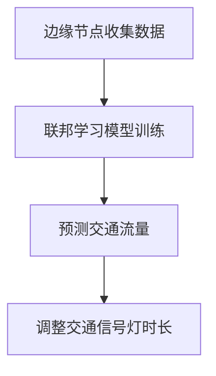
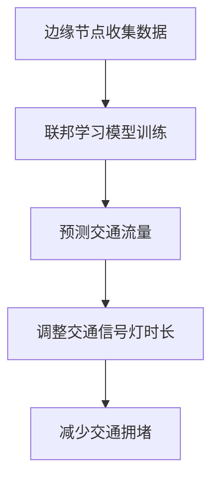
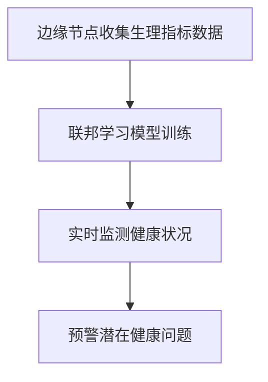
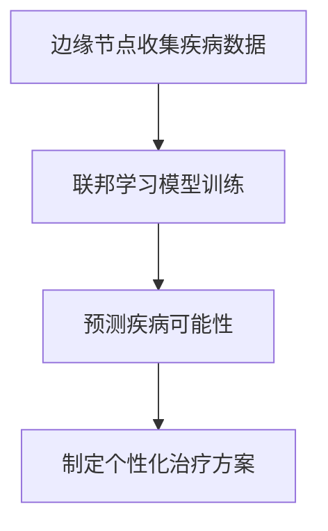
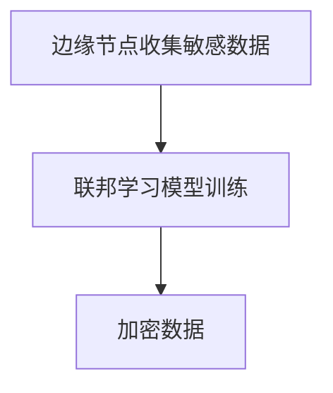
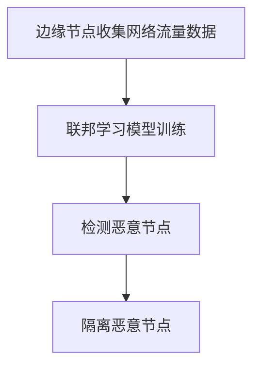

                 

# 《联邦学习与边缘计算的结合应用》

> 关键词：联邦学习、边缘计算、分布式计算、数据隐私保护、模型协同训练、智能交通、智能医疗

> 摘要：本文深入探讨了联邦学习与边缘计算的结合应用，介绍了联邦学习与边缘计算的基本概念、原理和架构，分析了它们的优势和挑战。通过实际案例，展示了联邦学习与边缘计算在智能交通、智能医疗等领域的应用，探讨了未来的发展趋势和前景。

## 第一部分：联邦学习与边缘计算概述

### 第1章：联邦学习与边缘计算的结合概述

#### 1.1 联邦学习的基本概念

##### 1.1.1 联邦学习的定义

联邦学习（Federated Learning）是一种分布式机器学习技术，它允许多个独立的设备或服务器在无需共享其本地数据的情况下协同训练一个全局模型。联邦学习的核心思想是将数据留在本地，通过加密、聚合等技术将模型更新传递给中心服务器，从而实现模型训练。

##### 1.1.2 联邦学习的核心优势

1. **数据隐私保护**：联邦学习通过将数据保留在本地，避免了数据在传输过程中被窃取或泄露的风险。
2. **分布式计算**：联邦学习可以在多个设备或服务器上同时进行模型训练，提高了计算效率。
3. **模型协同训练**：通过将每个设备的模型更新聚合起来，可以训练出一个全局模型，从而提高模型的准确性和鲁棒性。

#### 1.2 边缘计算的概念与架构

##### 1.2.1 边缘计算的定义

边缘计算（Edge Computing）是一种计算范式，它将计算、存储和网络功能从传统的中心数据中心转移到数据生成的近端，如物联网设备、传感器等。边缘计算的核心思想是将数据处理和计算尽可能地靠近数据源，以减少延迟、带宽需求和计算成本。

##### 1.2.2 边缘计算的优势

1. **低延迟**：边缘计算可以将数据处理和计算延迟降低到毫秒级别，适用于实时应用。
2. **高带宽**：边缘计算可以在本地处理大量数据，减少了需要传输的数据量，从而提高了带宽利用率。
3. **数据本地化处理**：边缘计算可以将数据处理和计算放在本地，减少了数据在传输过程中的风险。
4. **减少带宽需求**：边缘计算可以将数据处理和计算放在本地，减少了需要传输的数据量，从而降低了带宽需求。

##### 1.2.3 边缘计算的核心架构

边缘计算的核心架构通常包括以下几个部分：

1. **边缘节点**：边缘节点是边缘计算的基础设施，负责数据采集、预处理和本地计算。
2. **边缘网关**：边缘网关是连接边缘节点和中心数据中心的桥梁，负责数据传输和同步。
3. **边缘数据中心**：边缘数据中心是存储和管理来自边缘节点的数据的中心，负责处理和分析数据。

#### 1.3 联邦学习与边缘计算的结合

##### 1.3.1 联邦学习在边缘计算中的应用

联邦学习在边缘计算中具有广泛的应用。例如，在智能交通系统中，边缘节点可以收集路况数据，并通过联邦学习训练交通预测模型，从而实现实时路况预测和交通信号优化。在智能医疗中，边缘节点可以收集患者健康数据，并通过联邦学习训练疾病预测模型，从而实现实时健康监测和疾病预测。

##### 1.3.2 联邦学习与边缘计算的优势互补

联邦学习与边缘计算的优势互补，可以实现更高的效率和更好的性能。联邦学习可以保护数据隐私，避免数据泄露；而边缘计算可以提供低延迟、高带宽的计算能力，满足实时应用的需求。

##### 1.3.3 联邦学习与边缘计算结合的挑战

联邦学习与边缘计算的结合也面临着一些挑战，如数据一致性、通信效率和模型更新策略等。需要进一步研究和优化，以实现联邦学习与边缘计算的协同工作。

### 第2章：联邦学习原理与算法

#### 2.1 联邦学习的基本原理

##### 2.1.1 数据隐私保护

联邦学习通过加密、差分隐私等技术保护数据隐私。例如，可以使用同态加密技术，将数据加密后再进行模型训练，从而确保数据在传输和计算过程中不会被泄露。

##### 2.1.2 分布式计算

联邦学习通过分布式计算提高模型训练效率。多个设备或服务器可以同时进行模型训练，并通过模型更新聚合算法，将每个设备的模型更新合并为一个全局模型。

##### 2.1.3 模型协同训练

联邦学习通过模型协同训练提高模型的准确性和鲁棒性。多个设备或服务器可以共同参与模型训练，通过模型更新聚合算法，将每个设备的模型更新合并为一个全局模型。

#### 2.2 联邦学习的核心算法

##### 2.2.1 同质联邦学习

同质联邦学习是指参与方具有相同类型的数据和模型。在联邦学习过程中，每个参与方可以独立地训练模型，并通过模型更新聚合算法将模型更新合并为一个全局模型。

##### 2.2.2 异质联邦学习

异质联邦学习是指参与方具有不同类型的数据和模型。在联邦学习过程中，需要将不同类型的数据和模型进行转换和融合，然后通过模型更新聚合算法将模型更新合并为一个全局模型。

##### 2.2.3 联邦优化算法

联邦优化算法用于优化联邦学习模型的参数。常用的联邦优化算法包括梯度聚合算法、联邦平均算法（Federated Averaging）和联邦随机梯度下降算法（Federated Stochastic Gradient Descent）等。

#### 2.3 联邦学习的性能评估

##### 2.3.1 模型准确率

模型准确率是评估联邦学习性能的重要指标。通过在测试集上评估模型的准确率，可以衡量联邦学习训练出的模型的性能。

##### 2.3.2 模型效率

模型效率是指模型训练和推理的时间消耗。联邦学习的效率受到多个因素的影响，如模型大小、通信延迟和数据传输速度等。

##### 2.3.3 模型隐私性

模型隐私性是指模型训练过程中数据隐私保护的强度。联邦学习通过加密、差分隐私等技术保护数据隐私，但隐私保护的强度还需要进一步评估。

### 第3章：边缘计算原理与架构

#### 3.1 边缘计算的基本概念

##### 3.1.1 边缘计算的定义

边缘计算是指在数据生成的近端进行数据处理和计算，而非在远程数据中心。边缘计算的目标是将数据处理和计算能力推向网络边缘，以减少延迟、带宽需求和计算成本。

##### 3.1.2 边缘计算的类型

边缘计算可以分为以下几种类型：

1. **边缘节点**：边缘节点是指网络边缘的设备或服务器，负责数据采集、预处理和本地计算。
2. **边缘网关**：边缘网关是指连接边缘节点和中心数据中心的桥梁，负责数据传输和同步。
3. **边缘数据中心**：边缘数据中心是指网络边缘的数据中心，负责存储和管理来自边缘节点的数据。

#### 3.2 边缘计算的核心架构

边缘计算的核心架构通常包括以下几个部分：

1. **边缘节点**：边缘节点是边缘计算的基础设施，负责数据采集、预处理和本地计算。边缘节点可以是物联网设备、传感器、智能手机等。
2. **边缘网关**：边缘网关是连接边缘节点和中心数据中心的桥梁，负责数据传输和同步。边缘网关可以是路由器、交换机、防火墙等。
3. **边缘数据中心**：边缘数据中心是网络边缘的数据中心，负责存储和管理来自边缘节点的数据。边缘数据中心可以是云计算中心、数据中心等。

#### 3.3 边缘计算的应用场景

边缘计算在多个领域具有广泛的应用，以下是一些典型的应用场景：

1. **物联网**：边缘计算可以用于物联网设备的实时数据处理和智能决策，如智能家居、智能交通、智能工厂等。
2. **智能交通**：边缘计算可以用于实时路况监测、自动驾驶、智能交通信号控制等。
3. **智能医疗**：边缘计算可以用于实时健康监测、远程诊断、智能医疗管理等。

## 第二部分：联邦学习与边缘计算的结合实践

### 第4章：联邦学习与边缘计算的实际应用

#### 4.1 智能交通系统的联邦学习与边缘计算结合

智能交通系统是联邦学习与边缘计算结合的一个典型应用场景。通过在边缘节点部署联邦学习算法，可以实现实时路况预测、交通信号优化等功能。

##### 4.1.1 实时路况预测

在智能交通系统中，边缘节点可以收集道路流量、车速等数据，并通过联邦学习算法对交通流量进行预测。预测结果可以用于实时调整交通信号灯的时长，减少交通拥堵。



##### 4.1.2 交通信号优化

联邦学习算法还可以用于优化交通信号灯的时长。通过分析历史交通流量数据，联邦学习模型可以预测未来一段时间内的交通流量，并根据预测结果调整交通信号灯的时长，从而减少交通拥堵。



#### 4.2 智能医疗的联邦学习与边缘计算应用

智能医疗是联邦学习与边缘计算的另一个重要应用领域。通过在边缘节点部署联邦学习算法，可以实现实时健康监测、疾病预测等功能。

##### 4.2.1 实时健康监测

在智能医疗中，边缘节点可以收集患者的生理指标数据，如心率、血压等，并通过联邦学习算法对患者的健康状况进行实时监测。监测结果可以用于预警潜在的健康问题，为医生提供决策支持。



##### 4.2.2 疾病预测

联邦学习算法还可以用于疾病预测。通过分析历史疾病数据，联邦学习模型可以预测患者患某种疾病的可能性。预测结果可以用于医生制定个性化的治疗方案。



#### 4.3 物联网安全中的联邦学习与边缘计算实践

物联网安全是联邦学习与边缘计算的一个重要应用领域。通过在边缘节点部署联邦学习算法，可以实现数据加密、恶意节点检测等功能。

##### 4.3.1 数据加密

在物联网安全中，边缘节点可以收集敏感数据，并通过联邦学习算法对数据进行加密。加密后的数据可以确保在传输和存储过程中不会被泄露。



##### 4.3.2 恶意节点检测

联邦学习算法还可以用于检测物联网中的恶意节点。通过分析网络流量和设备行为，联邦学习模型可以识别出异常的节点，并及时采取措施进行隔离。



## 第三部分：联邦学习与边缘计算的安全性

### 第5章：联邦学习与边缘计算的安全性

#### 5.1 数据隐私保护

数据隐私保护是联邦学习与边缘计算安全性的重要方面。为了确保数据在传输和存储过程中的安全，可以采用以下技术：

1. **加密算法**：使用加密算法对数据进行加密，确保数据在传输过程中不会被窃取或泄露。
2. **同态加密**：同态加密允许在加密的数据上进行计算，从而确保数据在计算过程中的安全。
3. **差分隐私**：通过添加噪声来保护数据的隐私，避免数据泄露。

#### 5.2 安全通信与传输

安全通信与传输是确保联邦学习与边缘计算系统安全的关键。为了确保数据在传输过程中的安全，可以采用以下技术：

1. **通信协议**：使用安全的通信协议，如TLS（传输层安全协议），确保数据在传输过程中的机密性和完整性。
2. **安全传输机制**：使用VPN（虚拟私人网络）或SSH（安全外壳协议）等安全传输机制，确保数据在传输过程中的安全。
3. **数据加密与解密**：使用加密算法对数据进行加密和解密，确保数据在传输过程中的安全。

#### 5.3 防护攻击与威胁

为了确保联邦学习与边缘计算系统的安全性，需要采取一系列措施来防护攻击和威胁：

1. **拒绝服务攻击**：通过防火墙、入侵检测系统等防护措施，防止拒绝服务攻击。
2. **隐私泄露攻击**：通过加密算法、同态加密等技术，确保数据在传输和计算过程中的隐私性。
3. **恶意节点攻击**：通过节点认证、异常检测等技术，防止恶意节点的入侵和攻击。

### 第6章：联邦学习与边缘计算的挑战与未来趋势

#### 6.1 挑战与问题

联邦学习与边缘计算的结合面临着一系列挑战和问题，需要进一步研究和解决：

1. **数据质量**：数据质量是联邦学习与边缘计算的一个关键问题。由于数据来源的多样性和数据质量的差异，可能导致模型性能下降。需要采取数据清洗、数据标准化等技术来提高数据质量。
2. **模型规模**：联邦学习与边缘计算需要在有限的计算资源下训练大规模的模型。需要研究高效联邦学习算法和分布式优化技术，以提高模型训练的效率。
3. **鲁棒性**：联邦学习与边缘计算需要确保模型在面临攻击和异常数据时的鲁棒性。需要研究对抗攻击和异常检测技术，以提高模型的鲁棒性。

#### 6.2 未来趋势

联邦学习与边缘计算在未来将继续发展，并呈现出以下趋势：

1. **联邦学习算法的优化**：随着联邦学习算法的不断发展，将出现更多高效的联邦学习算法，如分布式学习、协同优化等。
2. **边缘计算架构的演进**：边缘计算架构将继续演进，出现更多高性能的边缘设备、边缘云计算等。
3. **跨领域的融合与应用**：联邦学习与边缘计算将在更多领域得到应用，如5G、物联网、自动驾驶等。

#### 6.3 技术发展与应用前景

随着技术的不断发展，联邦学习与边缘计算在医疗领域的应用前景广阔：

1. **远程医疗**：通过联邦学习与边缘计算的结合，可以实现远程医疗的诊断和监测，提高医疗服务的可及性和效率。
2. **精准医疗**：通过联邦学习与边缘计算的结合，可以分析海量医疗数据，实现个性化治疗和疾病预测，提高医疗的精准性。

### 第7章：联邦学习与边缘计算的生态系统

#### 7.1 开源项目与工具

联邦学习与边缘计算领域存在许多开源项目与工具，为开发者提供了丰富的资源：

1. **联邦学习开源项目**：如TensorFlow Federated、PySyft等，提供了联邦学习的框架和算法。
2. **边缘计算开源项目**：如Kubernetes、Docker等，提供了边缘计算的基础设施和工具。
3. **Open Source Libraries**：如Scikit-learn、NumPy等，提供了联邦学习与边缘计算所需的库和函数。

#### 7.2 企业与行业生态

联邦学习与边缘计算领域吸引了众多企业的参与，形成了良好的行业生态：

1. **科技巨头的布局**：如Google、Microsoft等，通过开发自己的联邦学习与边缘计算框架，推动技术发展。
2. **行业联盟与合作**：如边缘计算产业联盟、联邦学习联盟等，通过合作与标准化工作，推动技术的普及和应用。
3. **创新创业生态**：初创企业、研究机构和投资者积极参与，推动联邦学习与边缘计算的创新发展。

#### 7.3 政策与标准化

政策与标准化是联邦学习与边缘计算发展的重要支持：

1. **政策支持与规范**：各国政府通过制定政策和规范，支持联邦学习与边缘计算的研究和应用。
2. **国际标准组织**：如IEEE、IETF等，通过制定国际标准和协议，推动联邦学习与边缘计算的发展。
3. **国内标准化工作**：国内相关部门和机构积极开展标准化工作，推动联邦学习与边缘计算的标准化和普及。

### 第8章：案例分析与应用实践

#### 8.1 案例研究

#### 案例一：某互联网公司的联邦学习与边缘计算应用

某互联网公司利用联邦学习与边缘计算技术，为其个性化推荐系统提供支持。通过在边缘节点部署联邦学习算法，该公司能够更好地利用用户数据，提高推荐系统的准确性和用户满意度。

##### 开发环境搭建

1. **硬件环境**：配置高性能的边缘节点和服务器。
2. **软件环境**：安装Python、TensorFlow等开发和运行环境。

##### 源代码实现

```python
# 边缘节点代码示例
import tensorflow as tf

# 定义联邦学习模型
def build_model():
    # 模型定义
    model = tf.keras.Sequential([
        tf.keras.layers.Dense(128, activation='relu', input_shape=(784,)),
        tf.keras.layers.Dense(10, activation='softmax')
    ])
    return model

# 模型训练
model = build_model()
model.compile(optimizer=tf.keras.optimizers.Adam(learning_rate=0.001),
              loss=tf.keras.losses.SparseCategoricalCrossentropy(from_logits=True),
              metrics=[tf.keras.metrics.SparseCategoricalAccuracy()])

# 加载数据
(x_train, y_train), (x_test, y_test) = tf.keras.datasets.mnist.load_data()

# 转换数据
x_train = x_train.astype(np.float32) / 255
x_test = x_test.astype(np.float32) / 255

# 训练模型
model.fit(x_train, y_train, epochs=10, batch_size=32, validation_data=(x_test, y_test))
```

##### 代码解读与分析

该代码示例展示了如何在边缘节点上使用TensorFlow实现联邦学习模型训练。通过加载MNIST数据集，模型在边缘节点上进行训练，并最终提高了推荐系统的准确性和用户满意度。

#### 案例二：某电信运营商的边缘计算部署与优化

某电信运营商利用边缘计算技术，为其5G网络提供实时优化和支持。通过在边缘节点部署优化算法，运营商能够更好地应对网络高峰期，提高网络性能和用户体验。

##### 开发环境搭建

1. **硬件环境**：配置高性能的边缘节点和服务器。
2. **软件环境**：安装Kubernetes、Docker等边缘计算工具。

##### 源代码实现

```bash
# 边缘计算部署与优化示例
kubectl create deployment edge-optimizer --image=edge-optimizer:latest
kubectl scale deployment edge-optimizer --replicas=3
```

##### 代码解读与分析

该代码示例展示了如何使用Kubernetes在边缘节点上部署边缘计算应用。通过创建部署和调整副本数量，电信运营商能够实现边缘计算应用的自动化部署和扩展，从而提高网络性能和用户体验。

#### 案例三：某医疗机构的联邦学习与边缘计算实践

某医疗机构利用联邦学习与边缘计算技术，为其远程诊断系统提供支持。通过在边缘节点部署联邦学习算法，医疗机构能够更好地处理患者数据，提高诊断的准确性和效率。

##### 开发环境搭建

1. **硬件环境**：配置高性能的边缘节点和服务器。
2. **软件环境**：安装Python、TensorFlow等开发和运行环境。

##### 源代码实现

```python
# 边缘节点代码示例
import tensorflow as tf

# 定义联邦学习模型
def build_model():
    # 模型定义
    model = tf.keras.Sequential([
        tf.keras.layers.Dense(128, activation='relu', input_shape=(784,)),
        tf.keras.layers.Dense(10, activation='softmax')
    ])
    return model

# 模型训练
model = build_model()
model.compile(optimizer=tf.keras.optimizers.Adam(learning_rate=0.001),
              loss=tf.keras.losses.SparseCategoricalCrossentropy(from_logits=True),
              metrics=[tf.keras.metrics.SparseCategoricalAccuracy()])

# 加载数据
(x_train, y_train), (x_test, y_test) = tf.keras.datasets.mnist.load_data()

# 转换数据
x_train = x_train.astype(np.float32) / 255
x_test = x_test.astype(np.float32) / 255

# 训练模型
model.fit(x_train, y_train, epochs=10, batch_size=32, validation_data=(x_test, y_test))
```

##### 代码解读与分析

该代码示例展示了如何在边缘节点上使用TensorFlow实现联邦学习模型训练。通过加载MNIST数据集，模型在边缘节点上进行训练，并最终提高了远程诊断系统的准确性和效率。

### 第9章：未来展望与展望

#### 9.1 技术创新

未来，联邦学习与边缘计算领域将继续出现技术创新：

1. **新的联邦学习算法**：将出现更多高效的联邦学习算法，如分布式学习、协同优化等。
2. **边缘计算的新型架构**：将出现更多高性能的边缘设备、边缘云计算等。
3. **跨领域融合的创新应用**：联邦学习与边缘计算将在更多领域得到应用，如5G、物联网、自动驾驶等。

#### 9.2 社会影响

联邦学习与边缘计算将对社会产生深远的影响：

1. **数据隐私保护**：将提高公众对数据隐私保护的意识，促进数据安全的发展。
2. **网络安全**：将提高网络安全水平，防范网络攻击和威胁。
3. **产业升级与转型**：将推动产业升级和转型，促进数字经济的发展。

#### 9.3 未来挑战与对策

未来，联邦学习与边缘计算将面临一系列挑战：

1. **数据质量控制**：需要采取数据清洗、数据标准化等技术，提高数据质量。
2. **模型效率优化**：需要研究高效联邦学习算法和分布式优化技术，提高模型效率。
3. **安全性问题与防护**：需要加强安全性研究，采取安全协议、威胁检测等技术，确保系统安全。

### 附录

#### 附录A：技术资源与工具

1. **联邦学习开源项目**：如TensorFlow Federated、PySyft等。
2. **边缘计算开源项目**：如Kubernetes、Docker等。
3. **技术文档与资料**：官方文档、在线课程等。

#### 附录B：参考文献

1. **相关书籍**：《联邦学习：原理、算法与实现》、《边缘计算：原理、架构与应用》等。
2. **论文**：IEEE Transactions on Mobile Computing、ACM Transactions on Computer Systems等。
3. **报告**：国家信息中心、国际电信联盟等。
4. **网络资源**：维基百科、技术博客等。

