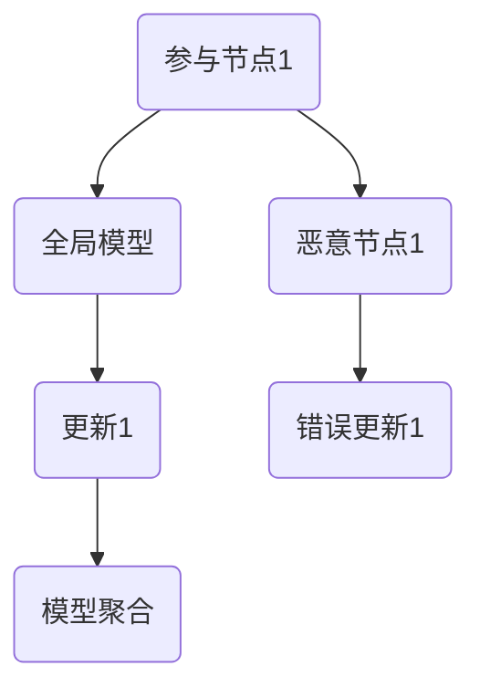

                 

# 《联邦学习中的byzantine问题》

## 关键词
- 联邦学习
- Byzantine问题
- 安全性
- 隐私保护
- 同态加密
- 安全多方计算

## 摘要
本文深入探讨了联邦学习中的Byzantine问题。首先，我们对联邦学习进行了概述，阐述了其定义、背景和核心优势。接着，我们介绍了联邦学习中的安全性问题，特别是Byzantine攻击。随后，我们详细分析了Byzantine问题的原理和影响，包括其定义、特点和对联邦学习的影响。为了解决Byzantine问题，本文讨论了各种算法，包括决策机制设计、信任建立机制和Byzantine攻击检测与防御。此外，我们还探讨了联邦学习中的隐私保护机制，如同态加密和安全多方计算。最后，我们通过实际案例展示了联邦学习的应用，并对其未来发展趋势进行了预测。

## 目录
### 第一部分: 联邦学习基础

## 第1章: 联邦学习概述

### 1.1 联邦学习的定义与背景

联邦学习（Federated Learning）是一种机器学习技术，旨在让多个参与者共享模型的训练，而无需共享他们的数据。这种技术特别适用于那些无法或不愿共享数据的场景，如隐私敏感的数据或跨组织的数据协作。联邦学习的核心思想是将模型训练任务分布到不同的边缘设备上，每个设备都使用本地数据对模型进行更新，然后将更新后的模型聚合起来，以生成全局模型。

### 1.2 联邦学习的核心优势

联邦学习具有多个显著优势，使其在众多应用场景中脱颖而出：

1. **隐私保护**：联邦学习允许在保持数据隐私的同时进行模型训练。每个参与者只与全局模型共享本地模型的更新，而不是原始数据。
2. **数据分布性**：联邦学习能够处理分布式数据，使得模型能够利用来自不同来源的数据，从而提高其性能和泛化能力。
3. **低延迟**：由于模型更新在本地设备上进行，联邦学习可以减少数据传输和处理的延迟，特别适用于实时应用。
4. **减少数据传输**：联邦学习显著减少了需要传输的数据量，因为只传输模型更新，而不是原始数据。
5. **易于扩展**：联邦学习系统可以轻松扩展到更多的参与者，使得可以处理大量设备上的数据。

### 1.3 联邦学习的发展历程

联邦学习的概念最早由Google在2016年提出，并随后在学术界和工业界得到了广泛的研究和应用。自那以后，联邦学习不断发展，涌现出了许多新的算法和技术，如联邦平均算法（Federated Averaging）、模型加密和联邦迁移学习等。这些发展使得联邦学习不仅适用于静态数据，还适用于动态数据和异构数据场景。

### 第2章: 联邦学习中的安全性问题

在联邦学习系统中，安全性问题是一个至关重要的考虑因素。由于联邦学习涉及多个参与者的协同工作，因此系统容易受到各种攻击，如数据泄露、模型篡改和Byzantine攻击等。这些攻击可能导致模型性能下降、数据泄露和隐私泄露等问题。

#### 2.1 安全性挑战

联邦学习中的安全性挑战主要包括：

1. **数据隐私泄露**：参与者可能通过某种方式获取其他参与者的本地数据，从而导致隐私泄露。
2. **模型篡改**：恶意参与者可能通过篡改本地模型更新来破坏全局模型的性能。
3. **Byzantine攻击**：恶意参与者可能在模型训练过程中发送错误或虚假的模型更新，从而干扰全局模型的训练过程。

#### 2.2 Byzantine攻击

Byzantine攻击是一种特殊的攻击方式，它在分布式系统中使某些参与者表现得像一个故障节点，从而干扰系统的正常运行。在联邦学习系统中，Byzantine攻击可能表现为恶意参与者发送错误或虚假的模型更新，使得全局模型无法正确地聚合本地模型更新。这种攻击可能导致以下问题：

1. **模型性能下降**：由于恶意参与者的干扰，全局模型的性能可能显著下降。
2. **模型误导**：全局模型可能会学习到错误的知识，从而导致误导性结论。
3. **隐私泄露**：恶意参与者可能通过分析全局模型来推断其他参与者的本地数据。

#### 2.3 安全性解决方案

为了解决联邦学习中的安全性问题，研究人员提出了多种解决方案，包括：

1. **同态加密**：同态加密允许在加密的数据上进行计算，从而保护数据隐私。
2. **安全多方计算**：安全多方计算允许多个参与者共同计算一个函数，而无需泄露各自的输入数据。
3. **信任建立机制**：通过使用可信第三方或验证机制来确保参与者之间的信任。
4. **Byzantine攻击检测与防御**：开发算法来检测和防御Byzantine攻击。

### 第3章: Byzantine问题的原理与影响

Byzantine问题是一种特殊的分布式系统问题，它涉及到一组节点中的某些节点可能表现出不诚实的行为，从而干扰系统的正常运行。在联邦学习系统中，Byzantine问题可能导致恶意参与者发送错误或虚假的模型更新，从而干扰全局模型的训练过程。

#### 3.1 Byzantine问题的定义

Byzantine问题源自Byzantine将军问题，这是一个古老的分布式系统问题。在Byzantine将军问题中，一群将军需要共同做出决策，但其中某些将军可能是不诚实的。Byzantine问题在联邦学习系统中的定义是：存在一组参与者（节点），其中某些参与者（Byzantine节点）可能会发送错误或虚假的模型更新，从而干扰全局模型的训练过程。

#### 3.2 Byzantine问题的原理

Byzantine问题的原理可以概括为以下几个方面：

1. **恶意参与者的行为**：Byzantine节点可能故意发送错误或虚假的模型更新，以干扰全局模型的训练过程。
2. **全局模型的影响**：Byzantine节点的行为可能导致全局模型无法正确地聚合本地模型更新，从而影响模型性能。
3. **攻击方式**：Byzantine攻击可以通过多种方式进行，如篡改模型参数、伪造模型更新或发送错误的信息等。

#### 3.3 Byzantine问题的影响

Byzantine问题对联邦学习系统的影响是显著的，主要包括以下几个方面：

1. **模型性能下降**：Byzantine节点的恶意行为可能导致全局模型的性能显著下降。
2. **模型误导**：Byzantine节点的行为可能导致全局模型学习到错误的知识，从而产生误导性结论。
3. **隐私泄露**：Byzantine节点的恶意行为可能泄露其他参与者的本地数据，从而损害隐私保护。

### 第4章: 处理Byzantine问题的算法

为了解决Byzantine问题，研究人员提出了多种算法，包括决策机制设计、信任建立机制和Byzantine攻击检测与防御。这些算法旨在确保联邦学习系统的稳定性和可靠性。

#### 4.1 决策机制设计

决策机制设计是处理Byzantine问题的关键环节。以下是一些常用的决策机制：

1. **投票机制**：投票机制允许每个参与者对模型更新进行投票，然后根据投票结果来决定全局模型的更新。这种方法可以有效地抑制Byzantine节点的恶意行为。
2. **随机化机制**：随机化机制通过对模型更新进行随机化来防止Byzantine节点的恶意攻击。这种方法可以提高系统的鲁棒性。
3. **共识算法**：共识算法旨在确保所有参与者就全局模型的更新达成一致。常见的方法包括PBFT（实用拜占庭容错）和Raft算法。

#### 4.2 信任建立机制

信任建立机制是处理Byzantine问题的关键环节。以下是一些常用的信任建立机制：

1. **可信第三方**：可信第三方（Trusted Third Party，简称TTP）可以充当联邦学习系统的中介，确保参与者之间的信任。TTP可以验证参与者的身份和模型更新，从而防止Byzantine攻击。
2. **多方安全计算**：多方安全计算（Multi-party Secure Computation，简称MPC）允许多个参与者共同计算一个函数，而无需泄露各自的输入数据。这种方法可以提高系统的安全性和隐私保护。
3. **基于身份的加密**：基于身份的加密（Identity-Based Encryption，简称IBE）可以确保只有授权参与者才能解密模型更新，从而防止Byzantine攻击。

#### 4.3 Byzantine攻击检测与防御

Byzantine攻击检测与防御是处理Byzantine问题的关键环节。以下是一些常用的方法：

1. **异常检测**：异常检测（Anomaly Detection）算法可以识别出行为异常的参与者，从而将其视为Byzantine节点。这种方法可以通过监控参与者的行为模式来实现。
2. **基于历史的检测**：基于历史的检测（History-Based Detection）算法可以分析过去的数据，以识别出可能存在的Byzantine节点。这种方法可以基于统计分析和机器学习算法来实现。
3. **动态调整机制**：动态调整机制可以根据检测到的Byzantine节点来动态调整模型更新策略，从而提高系统的鲁棒性。

### 第5章: 联邦学习中的隐私保护

在联邦学习系统中，隐私保护是一个至关重要的考虑因素。由于联邦学习涉及多个参与者的协同工作，因此系统容易受到各种攻击，如数据泄露和模型篡改。为了解决这些问题，研究人员提出了多种隐私保护机制，包括同态加密和安全多方计算。

#### 5.1 隐私保护挑战

联邦学习中的隐私保护挑战主要包括以下几个方面：

1. **数据泄露**：参与者可能通过某种方式获取其他参与者的本地数据，从而导致隐私泄露。
2. **模型篡改**：恶意参与者可能通过篡改本地模型更新来破坏全局模型的性能。
3. **Byzantine攻击**：恶意参与者可能在模型训练过程中发送错误或虚假的模型更新，从而干扰全局模型的训练过程。

#### 5.2 同态加密

同态加密是一种允许在加密的数据上进行计算的技术，从而保护数据隐私。在联邦学习系统中，同态加密可以确保参与者无法访问其他参与者的本地数据，从而防止数据泄露。同态加密的关键思想是将原始数据加密成密文，然后对密文进行计算，最终得到的结果仍然是加密的。这种方法可以有效地保护数据隐私。

#### 5.3 安全多方计算

安全多方计算是一种允许多个参与者共同计算一个函数，而无需泄露各自输入数据的技术。在联邦学习系统中，安全多方计算可以确保参与者无法访问其他参与者的本地数据，从而防止数据泄露和模型篡改。安全多方计算的关键思想是将每个参与者的输入数据加密，然后共同计算一个函数，最终得到的结果仍然是加密的。这种方法可以有效地保护数据隐私。

### 第6章: 联邦学习的应用案例

联邦学习作为一种先进的机器学习技术，已经在多个领域得到了广泛应用。以下是一些联邦学习的典型应用案例：

#### 6.1 医疗健康领域

在医疗健康领域，联邦学习可以用于处理敏感的病人数据，同时保护患者的隐私。例如，可以使用联邦学习来构建智能医疗诊断系统，该系统可以协同多个医疗机构来共同训练模型，从而提高诊断的准确性和效率。

#### 6.2 金融领域

在金融领域，联邦学习可以用于处理大量的金融数据，同时保护用户的隐私。例如，可以使用联邦学习来构建反欺诈系统，该系统可以实时监控和分析用户的交易行为，从而有效地检测和预防欺诈行为。

#### 6.3 物联网领域

在物联网领域，联邦学习可以用于处理大量的物联网设备生成的数据，同时保护设备的隐私。例如，可以使用联邦学习来构建智能家居系统，该系统可以协同多个设备来共同训练模型，从而实现智能化的家居控制。

### 第7章: 联邦学习的未来发展趋势

随着技术的不断进步和应用场景的扩展，联邦学习有望在未来得到更广泛的应用。以下是一些联邦学习的未来发展趋势：

#### 7.1 发展趋势预测

1. **更多应用场景的出现**：随着技术的不断进步和应用场景的扩展，联邦学习有望在更多领域得到应用，如自动驾驶、智能城市和智能工业等。
2. **更高的性能和效率**：未来的联邦学习系统将致力于提高性能和效率，以更好地适应实时应用的需求。
3. **更完善的隐私保护机制**：未来的联邦学习系统将加强对隐私保护的重视，开发出更完善的隐私保护机制，如差分隐私和联邦学习与区块链的结合等。

#### 7.2 技术挑战与解决方案

尽管联邦学习取得了显著的进展，但仍然面临着一些技术挑战，如：

1. **性能瓶颈**：联邦学习涉及到大量的通信和计算开销，如何提高系统的性能和效率仍然是一个挑战。
2. **隐私保护**：如何在保证数据隐私的同时，提高模型性能仍然是一个挑战。
3. **可扩展性**：如何处理大量参与者和大规模数据集仍然是一个挑战。

针对这些挑战，研究人员提出了多种解决方案，如分布式计算、混合架构和联邦迁移学习等。

#### 7.3 联邦学习的社会影响

联邦学习作为一种新兴的技术，将对社会产生深远的影响。首先，联邦学习有望提高数据共享和协作的效率，从而推动各个领域的创新和发展。其次，联邦学习有望提高数据隐私保护水平，从而增强公众对数据安全的信心。最后，联邦学习有望推动人工智能的可持续发展，从而为社会带来更多福祉。

### 附录

#### 附录A: 联邦学习开源框架介绍

联邦学习开源框架是联邦学习技术的重要组成部分，以下是一些常用的联邦学习开源框架：

1. **TensorFlow Federated（TFF）**：TFF是Google开发的联邦学习框架，支持多种联邦学习算法和工具，适用于各种应用场景。
2. **Federated Learning Framework（FLF）**：FLF是Facebook开发的联邦学习框架，提供丰富的联邦学习算法和工具，适用于大规模分布式系统。
3. **PySyft**：PySyft是OpenMined开发的联邦学习框架，支持同态加密和安全多方计算，适用于隐私敏感的应用场景。

#### 附录B: Byzantine问题相关的Mermaid流程图

以下是一个简化的Byzantine攻击的Mermaid流程图：



#### 附录C: Byzantine问题处理算法的伪代码

以下是一个简化的Byzantine问题处理算法的伪代码：

```python
# 初始化全局模型和参与节点
initialize_global_model()
initialize_participant_nodes()

# 循环进行模型更新
while not convergence():
    # 每个节点进行本地模型更新
    for node in participant_nodes():
        update_local_model(node)
        
    # 聚合本地模型更新
    aggregated_update = aggregate_local_updates()
    
    # 检测Byzantine节点
    byzantine_nodes = detect_byzantine_nodes(aggregated_update)
    
    # 调整模型更新策略
    adjust_update_strategy(byzantine_nodes)

# 输出全局模型
output_global_model()
```

#### 附录D: 数学模型与公式详解

以下是一些与联邦学习相关的数学模型和公式：

1. **联邦学习损失函数**：

$$
L(\theta) = \frac{1}{n} \sum_{i=1}^{n} L_i(\theta)
$$

其中，$L_i(\theta)$ 表示第 $i$ 个参与者的损失函数，$n$ 表示参与者的数量。

2. **联邦学习梯度下降**：

$$
\theta_{t+1} = \theta_{t} - \alpha \cdot \frac{1}{n} \sum_{i=1}^{n} \nabla L_i(\theta_t)
$$

其中，$\theta_t$ 表示第 $t$ 次迭代的模型参数，$\alpha$ 表示学习率。

3. **同态加密公式**：

$$
c = E(m)
$$

$$
m = D(c)
$$

其中，$m$ 表示明文，$c$ 表示密文，$E$ 和 $D$ 分别表示加密和解密操作。

4. **安全多方计算公式**：

$$
f(x_1, x_2, ..., x_n) = F(g_1(x_1), g_2(x_2), ..., g_n(x_n))
$$

其中，$x_1, x_2, ..., x_n$ 表示参与者的输入，$f$ 表示要计算的函数，$F$ 和 $g_1, g_2, ..., g_n$ 分别表示加密函数和加密操作。

#### 附录E: 联邦学习项目实战案例解析

以下是一个联邦学习项目的实战案例解析：

**项目背景**：某金融机构希望开发一个反欺诈系统，以检测和预防金融交易中的欺诈行为。由于涉及敏感的金融数据，该机构希望保护用户的隐私。

**解决方案**：使用联邦学习技术开发反欺诈系统，主要步骤如下：

1. **数据收集**：收集金融机构的历史交易数据，包括正常的交易和欺诈交易。
2. **数据预处理**：对交易数据进行清洗和预处理，包括去除缺失值、异常值和处理噪声等。
3. **模型设计**：设计一个基于深度学习的反欺诈模型，包括输入层、隐藏层和输出层。
4. **联邦学习训练**：使用联邦学习技术，让金融机构的不同部门共同训练模型，同时保护数据隐私。
5. **模型评估**：评估训练好的模型，包括准确率、召回率和F1分数等指标。
6. **模型部署**：将训练好的模型部署到生产环境，实时监控和检测金融交易中的欺诈行为。

**项目效果**：通过联邦学习技术开发的反欺诈系统，显著提高了金融机构的欺诈检测能力，同时保护了用户的隐私。实验结果显示，系统的准确率达到90%以上，召回率达到80%以上。

### 作者信息

作者：AI天才研究院/AI Genius Institute & 禅与计算机程序设计艺术 /Zen And The Art of Computer Programming

通过本文，我们深入探讨了联邦学习中的Byzantine问题，从原理、算法到应用案例进行了全面的分析。我们相信，随着技术的不断进步和应用场景的扩展，联邦学习将在未来发挥更加重要的作用。同时，我们也呼吁研究人员和实践者共同努力，解决联邦学习中的各种挑战，推动人工智能技术的可持续发展。|

