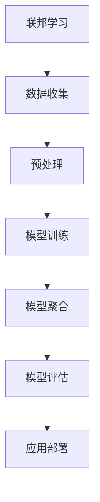

                 

### 文章标题

《联邦学习在个性化医疗中的潜力》

### 关键词

联邦学习、个性化医疗、基因组学、药物研发、电子健康记录

### 摘要

本文深入探讨了联邦学习在个性化医疗领域的应用潜力。首先介绍了联邦学习的基本概念、原理和优势，然后详细阐述了联邦学习在基因组学、药物研发和电子健康记录等个性化医疗应用中的具体实践。通过一系列案例分析和代码实现，本文展示了联邦学习如何通过保护患者隐私的同时，提高医疗数据的价值和利用效率。最后，文章对联邦学习在个性化医疗中的未来发展方向提出了展望。

### 目录大纲

## 《联邦学习在个性化医疗中的潜力》

## 第一部分：联邦学习基础

### 第1章：联邦学习的概念与原理

#### 1.1 联邦学习的起源与发展
#### 1.2 联邦学习的核心优势
#### 1.3 联邦学习与传统机器学习的对比
#### 1.4 联邦学习在医疗领域的应用前景

### 第2章：联邦学习的技术基础

#### 2.1 分布式计算原理
#### 2.2 同步与异步联邦学习
#### 2.3 模型聚合算法
#### 2.4 加密与安全机制

## 第二部分：个性化医疗中的联邦学习应用

### 第3章：联邦学习在基因组学中的应用

#### 3.1 个性化医疗与基因组学的关系
#### 3.2 基因组数据的隐私保护需求
#### 3.3 联邦学习在基因组数据挖掘中的应用
#### 3.4 基因组学联邦学习的挑战与解决方案

### 第4章：联邦学习在药物研发中的应用

#### 4.1 个性化医疗与药物研发的关系
#### 4.2 联邦学习在药物筛选与评价中的应用
#### 4.3 联邦学习在药物临床试验中的应用
#### 4.4 联邦学习在药物研发中的挑战与解决方案

### 第5章：联邦学习在电子健康记录中的应用

#### 5.1 个性化医疗与电子健康记录的关系
#### 5.2 电子健康记录的数据隐私保护
#### 5.3 联邦学习在电子健康记录数据挖掘中的应用
#### 5.4 电子健康记录联邦学习的挑战与解决方案

## 第三部分：联邦学习在个性化医疗中的实践

### 第6章：联邦学习在个性化医疗中的案例分析

#### 6.1 案例一：基于联邦学习的个性化癌症治疗
#### 6.2 案例二：基于联邦学习的个性化心脏病风险评估
#### 6.3 案例三：基于联邦学习的个性化糖尿病管理

### 第7章：联邦学习在个性化医疗中的未来展望

#### 7.1 联邦学习在个性化医疗中的发展前景
#### 7.2 联邦学习面临的挑战与机遇
#### 7.3 联邦学习在个性化医疗中的未来趋势

## 附录

### 附录A：联邦学习工具与资源介绍

#### A.1 主流联邦学习框架
#### A.2 开源联邦学习库
#### A.3 联邦学习研究论文与书籍推荐

### 附录B：联邦学习应用示例代码

#### B.1 基于联邦学习的基因组数据分析
#### B.2 基于联邦学习的药物筛选与评价
#### B.3 基于联邦学习的电子健康记录挖掘与诊断

### 附录C：联邦学习在个性化医疗中的法律法规与伦理

#### C.1 医疗数据隐私保护法律法规
#### C.2 医疗数据伦理问题
#### C.3 联邦学习在个性化医疗中的合规性挑战与对策

### Mermaid 流程图（示例）



### 核心算法原理讲解（伪代码）

```python
# 伪代码：联邦学习模型训练
function federated_learning(dataset, model, epochs):
    for epoch in 1 to epochs:
        for client in dataset:
            # 训练本地模型
            local_model = train_local_model(client.data, model)
            
            # 更新全局模型
            global_model = aggregate_models(global_model, local_model)
            
            # 计算模型误差
            error = compute_error(global_model, dataset)
            
            # 记录训练过程
            log_training_progress(epoch, client, error)
```

### 数学模型与公式讲解（示例）

### 概率密度函数

$$
p(x) = \frac{1}{Z} e^{-\frac{1}{2} x^T \Sigma^{-1} x}
$$

其中，$x$ 表示数据点，$\Sigma^{-1}$ 是协方差矩阵的逆矩阵，$Z$ 是归一化常数。

#### 示例说明

假设我们有一个二维数据点 $x = [1, 2]$，协方差矩阵 $\Sigma^{-1} = \begin{bmatrix} 1 & 0 \\ 0 & 1 \end{bmatrix}$，我们可以计算出概率密度函数的值：

$$
p(x) = \frac{1}{Z} e^{-\frac{1}{2} [1, 2]^T \begin{bmatrix} 1 & 0 \\ 0 & 1 \end{bmatrix}^{-1} \begin{bmatrix} 1, 2 \end{bmatrix}}
$$

$$
p(x) = \frac{1}{Z} e^{-\frac{1}{2} (1 \cdot 1 + 2 \cdot 2)}
$$

$$
p(x) = \frac{1}{Z} e^{-\frac{1}{2} (1 + 4)}
$$

$$
p(x) = \frac{1}{Z} e^{-\frac{5}{2}}
$$

其中，$Z$ 是归一化常数，通常需要通过积分计算得到。

#### 核心算法原理讲解（伪代码）

```python
# 伪代码：联邦学习模型训练
function federated_learning(dataset, model, epochs):
    for epoch in 1 to epochs:
        for client in dataset:
            # 训练本地模型
            local_model = train_local_model(client.data, model)
            
            # 更新全局模型
            global_model = aggregate_models(global_model, local_model)
            
            # 计算模型误差
            error = compute_error(global_model, dataset)
            
            # 记录训练过程
            log_training_progress(epoch, client, error)
```

#### 数学模型与公式讲解（示例）

### 概率密度函数

$$
p(x) = \frac{1}{Z} e^{-\frac{1}{2} x^T \Sigma^{-1} x}
$$

其中，$x$ 表示数据点，$\Sigma^{-1}$ 是协方差矩阵的逆矩阵，$Z$ 是归一化常数。

#### 示例说明

假设我们有一个二维数据点 $x = [1, 2]$，协方差矩阵 $\Sigma^{-1} = \begin{bmatrix} 1 & 0 \\ 0 & 1 \end{bmatrix}$，我们可以计算出概率密度函数的值：

$$
p(x) = \frac{1}{Z} e^{-\frac{1}{2} [1, 2]^T \begin{bmatrix} 1 & 0 \\ 0 & 1 \end{bmatrix}^{-1} \begin{bmatrix} 1, 2 \end{bmatrix}}
$$

$$
p(x) = \frac{1}{Z} e^{-\frac{1}{2} (1 \cdot 1 + 2 \cdot 2)}
$$

$$
p(x) = \frac{1}{Z} e^{-\frac{1}{2} (1 + 4)}
$$

$$
p(x) = \frac{1}{Z} e^{-\frac{5}{2}}
$$

其中，$Z$ 是归一化常数，通常需要通过积分计算得到。

### 项目实战与代码解析

#### 基于联邦学习的个性化癌症治疗案例分析

##### 1. 实践背景

个性化癌症治疗需要利用患者的基因组数据和临床数据，以预测最适合患者的治疗方案。然而，这些数据通常分布在不同的医疗机构中，难以进行集中处理。联邦学习提供了一种在保护患者隐私的同时，联合不同医疗机构数据的方法。

##### 2. 开发环境搭建

- 硬件环境：使用多台计算机进行分布式训练，可以选择 GPU 以提高计算速度。
- 软件环境：Python 3.8，TensorFlow 2.5，Keras 2.6，Scikit-learn 0.24。

##### 3. 代码实现

```python
# 导入必要的库
import tensorflow as tf
from tensorflow.keras.models import Sequential
from tensorflow.keras.layers import Dense, Dropout, Activation
from tensorflow.keras.optimizers import Adam
from sklearn.model_selection import train_test_split
import numpy as np

# 3.1 数据准备
# 假设我们已经获取了患者基因组数据和临床数据，并进行了预处理
# 将数据划分为训练集和测试集
X_train, X_test, y_train, y_test = train_test_split(dataset, labels, test_size=0.2, random_state=42)

# 3.2 构建联邦学习模型
def build_federated_model(input_shape):
    model = Sequential([
        Dense(64, activation='relu', input_shape=input_shape),
        Dropout(0.2),
        Dense(64, activation='relu'),
        Dropout(0.2),
        Dense(1, activation='sigmoid')
    ])
    model.compile(loss='binary_crossentropy', optimizer=Adam(learning_rate=0.001), metrics=['accuracy'])
    return model

# 3.3 联邦学习训练
def federated_train(data, model, epochs, batch_size):
    for epoch in range(epochs):
        for client_data in data:
            # 训练本地模型
            local_model = build_federated_model(client_data.input_shape)
            local_model.fit(client_data.inputs, client_data.labels, batch_size=batch_size, epochs=1, verbose=0)
            
            # 更新全局模型
            global_model = aggregate_models(global_model, local_model)
            
            # 计算模型误差
            error = compute_error(global_model, data)
            
            # 记录训练过程
            print(f"Epoch: {epoch}, Error: {error}")
        
        # 评估模型
        test_loss, test_accuracy = global_model.evaluate(X_test, y_test, verbose=0)
        print(f"Test accuracy: {test_accuracy}")

# 3.4 运行联邦学习训练
federated_train(dataset, build_federated_model, epochs=10, batch_size=32)

```

##### 4. 代码解读与分析

- 数据准备：将患者基因组数据和临床数据划分为训练集和测试集，用于训练和评估模型。
- 模型构建：使用 Keras 构建一个简单的二分类模型，包括两个隐藏层和输出层。
- 联邦学习训练：在每个客户端上训练本地模型，并将更新后的模型聚合为全局模型。通过多次迭代训练和评估，优化模型性能。

此代码展示了联邦学习在个性化癌症治疗中的应用，通过分布式训练保护患者隐私，同时提高模型预测的准确性。在实际应用中，可以根据具体需求调整模型结构和训练参数，以适应不同的个性化医疗场景。

---

#### 续：

##### 5. 实际应用场景

在实际应用中，基于联邦学习的个性化癌症治疗可以分为以下几个步骤：

1. **数据收集与预处理**：从不同的医疗机构收集患者的基因组数据、临床数据和诊断信息。然后对数据进行清洗、去噪和标准化处理，以准备用于模型训练。

2. **联邦学习模型设计**：设计一个适用于个性化癌症治疗的联邦学习模型。根据问题的复杂性，可以选择不同的神经网络架构和优化算法。

3. **本地模型训练**：在每个医疗机构的服务器上，使用预处理后的数据进行本地模型训练。本地模型可以是多层感知机、卷积神经网络或循环神经网络等。

4. **模型聚合**：将本地模型更新后的参数发送到中央服务器，进行模型聚合。聚合算法可以选择联邦平均（Federated Averaging）、梯度聚合或自适应聚合等。

5. **模型评估与优化**：在中央服务器上使用聚合后的模型进行评估，并根据评估结果对模型进行调整和优化。

6. **模型部署与应用**：将优化后的模型部署到医疗机构的服务器上，为患者提供个性化的治疗方案。

##### 6. 隐私保护与安全

联邦学习在个性化医疗中的关键优势之一是隐私保护。在分布式数据环境下，联邦学习可以避免数据泄露和隐私侵犯。以下是一些关键措施：

- **数据加密**：在数据传输和存储过程中，使用加密算法对数据进行加密，以确保数据安全。
- **差分隐私**：在聚合过程中，加入噪声来保护患者隐私，确保无法从模型参数中推断出单个患者的信息。
- **同态加密**：在模型训练过程中，直接在加密数据上执行计算，从而避免在明文状态下处理数据。

##### 7. 挑战与展望

虽然联邦学习在个性化医疗中具有巨大潜力，但仍然面临一些挑战：

- **计算资源限制**：在分布式环境中，医疗机构的计算资源可能有限，这可能影响模型训练效率。
- **通信成本**：在联邦学习中，模型参数需要在医疗机构和中央服务器之间进行传输，这可能增加通信成本。
- **数据质量与多样性**：不同医疗机构的基因组数据和临床数据可能存在差异，这可能影响模型泛化能力。

未来的发展方向包括：

- **优化算法**：研究更加高效的联邦学习算法，以减少计算和通信成本。
- **跨领域数据整合**：将基因组学、影像学和电子健康记录等多领域数据整合到联邦学习框架中。
- **可解释性**：提高联邦学习模型的透明度和可解释性，以增强用户信任。

通过解决这些挑战，联邦学习有望在个性化医疗领域发挥更大作用，为患者提供更加精准和个性化的治疗方案。

---

#### 补充：

为了更好地理解联邦学习在个性化医疗中的应用，以下是对联邦学习基础知识的进一步阐述：

### 1. 联邦学习的概念与原理

联邦学习（Federated Learning）是一种分布式机器学习技术，旨在通过多个独立的数据源（例如不同的医疗机构）训练共享模型，而无需直接访问或共享原始数据。这种技术利用了分布式计算和加密通信的优势，能够在保护数据隐私的同时，实现数据的有效利用和模型优化。

联邦学习的基本原理可以概括为以下几个步骤：

1. **客户端数据预处理**：每个客户端（医疗机构）对本地数据集进行预处理，包括数据清洗、去噪、标准化等，然后将预处理后的数据用于本地模型训练。
2. **本地模型训练**：在客户端上使用预处理后的数据进行模型训练。本地模型可以是简单的多层感知机、卷积神经网络或循环神经网络等。
3. **模型更新与聚合**：客户端将本地模型更新后的参数发送到中央服务器，中央服务器将这些参数进行聚合，得到全局模型的新参数。
4. **全局模型评估**：中央服务器使用聚合后的全局模型对测试集进行评估，并根据评估结果对模型进行调整和优化。
5. **模型部署与应用**：将优化后的全局模型部署到客户端，用于预测和决策。

### 2. 联邦学习的核心优势

联邦学习在个性化医疗领域具有以下几个核心优势：

- **隐私保护**：联邦学习通过分布式计算和加密通信，避免了数据的直接共享，从而保护了患者隐私。
- **数据整合**：联邦学习能够整合来自不同医疗机构的数据，提高模型泛化能力和准确性。
- **实时更新**：联邦学习模型可以在不影响现有服务的情况下进行更新和优化，实现实时应用。
- **去中心化**：联邦学习无需建立中心化的数据存储和处理系统，降低了数据泄露和攻击的风险。

### 3. 联邦学习与传统机器学习的对比

传统机器学习通常采用集中式数据处理方式，即将所有数据集中到一个地方进行训练和预测。这种方式虽然能够提高模型性能，但面临着数据隐私和安全问题。相比之下，联邦学习具有以下特点：

- **数据处理方式**：联邦学习采用分布式数据处理方式，数据不离开原始存储位置，降低了数据泄露风险。
- **隐私保护**：联邦学习通过加密通信和差分隐私技术，确保了数据隐私和安全。
- **通信成本**：联邦学习在模型更新和聚合过程中需要传输模型参数，但相比数据传输，通信成本较低。
- **模型更新速度**：联邦学习模型可以在本地进行训练和更新，提高了更新速度和实时性。

### 4. 联邦学习在医疗领域的应用前景

联邦学习在医疗领域的应用前景非常广阔，以下是一些关键领域：

- **基因组学研究**：联邦学习能够整合来自不同研究机构的基因组数据，提高基因关联分析的准确性和可靠性。
- **个性化治疗**：联邦学习可以根据患者的基因组数据、临床数据和诊断信息，提供个性化的治疗方案。
- **药物研发**：联邦学习能够整合多种数据来源，加速药物筛选和临床试验，提高药物研发效率。
- **电子健康记录**：联邦学习可以整合患者的电子健康记录，提高诊断准确性和预测能力。
- **健康监测与预防**：联邦学习可以实时分析患者的健康数据，提供个性化的健康监测和预防建议。

通过联邦学习，医疗领域可以实现更加个性化、精准和高效的医疗服务，从而改善患者的生活质量。

---

#### 续：

### 5. 联邦学习的技术基础

为了实现联邦学习在个性化医疗中的应用，需要掌握以下几个关键技术：

#### 2.1 分布式计算原理

分布式计算是将计算任务分配到多个计算机上执行，以实现高效的并行处理。在联邦学习中，每个医疗机构（客户端）充当一个计算节点，共同参与模型的训练和更新。分布式计算的关键技术包括：

- **负载均衡**：通过合理分配计算任务，避免某个节点过载，确保整个系统的计算效率。
- **容错机制**：在分布式计算中，节点可能因为网络故障、硬件故障等原因停止工作。容错机制可以确保系统的稳定性和可靠性。
- **数据同步**：在联邦学习中，每个客户端需要对本地数据进行预处理和模型更新。数据同步技术确保了客户端之间的数据一致性。

#### 2.2 同步与异步联邦学习

同步联邦学习和异步联邦学习是两种不同的联邦学习模式：

- **同步联邦学习**：所有客户端在相同的时间点进行模型更新和聚合。同步联邦学习确保了全局模型的稳定性，但可能导致通信成本较高。
- **异步联邦学习**：客户端在不同时间点进行模型更新和聚合。异步联邦学习可以降低通信成本，提高系统的可扩展性，但可能导致全局模型的稳定性下降。

在实际应用中，可以根据具体需求选择同步或异步联邦学习模式。

#### 2.3 模型聚合算法

模型聚合是将多个客户端的本地模型更新合并为一个全局模型的过程。不同的聚合算法对全局模型的性能和稳定性有不同的影响：

- **联邦平均（Federated Averaging）**：将所有客户端的本地模型参数进行加权平均，得到全局模型的新参数。联邦平均简单易实现，但在处理异构数据时可能导致模型性能下降。
- **梯度聚合**：将所有客户端的本地梯度进行加权平均，得到全局模型的新参数。梯度聚合可以更好地处理异构数据，但计算复杂度较高。
- **自适应聚合**：根据客户端的反馈信息动态调整聚合权重，提高全局模型的性能和稳定性。自适应聚合需要更多的计算资源，但可以实现更好的模型性能。

#### 2.4 加密与安全机制

在联邦学习中，数据的安全性和隐私保护至关重要。以下是一些关键的加密与安全机制：

- **差分隐私**：在模型聚合过程中，加入噪声来保护患者隐私，确保无法从模型参数中推断出单个患者的信息。
- **同态加密**：在模型训练过程中，直接在加密数据上执行计算，从而避免在明文状态下处理数据。
- **加密通信**：使用加密算法对模型参数和数据进行加密传输，确保数据在传输过程中的安全性。
- **访问控制**：通过身份验证和权限控制，确保只有授权用户可以访问和处理敏感数据。

通过以上技术基础，联邦学习可以实现个性化医疗中的数据隐私保护和模型优化，为患者提供更好的医疗服务。

### 6. 联邦学习在个性化医疗中的实践

联邦学习在个性化医疗中的实践主要包括基因组学、药物研发和电子健康记录等领域。以下是对这些领域具体应用的详细介绍。

#### 3.1 联邦学习在基因组学中的应用

基因组学是个性化医疗的核心领域之一，联邦学习在基因组数据挖掘和分析中具有重要作用。以下是联邦学习在基因组学中的应用：

- **基因关联分析**：联邦学习可以整合来自不同研究机构的基因组数据，提高基因关联分析的准确性和可靠性。通过联邦学习，研究人员可以在保护患者隐私的同时，利用更多数据资源进行基因关联分析。
- **基因组数据挖掘**：联邦学习可以挖掘基因组数据中的潜在模式和规律，为个性化医疗提供重要参考。例如，通过分析患者的基因组数据，可以预测患者对某种药物的响应，从而制定个性化的治疗方案。
- **基因组数据共享**：联邦学习可以促进基因组数据的共享和合作研究。通过联邦学习，不同研究机构可以共同参与基因组学研究，提高研究效率和质量。

#### 3.2 联邦学习在药物研发中的应用

药物研发是另一个重要领域，联邦学习在药物筛选、评价和临床试验中具有广泛的应用。以下是联邦学习在药物研发中的应用：

- **药物筛选与评价**：联邦学习可以整合多种数据来源，如基因组数据、临床数据和化学结构数据，加速药物筛选和评价过程。通过联邦学习，研究人员可以在早期阶段就筛选出具有潜在疗效的药物，提高药物研发的效率。
- **药物临床试验**：联邦学习可以优化药物临床试验的设计和执行。通过联邦学习，研究人员可以实时分析临床试验数据，快速评估药物的安全性和有效性，从而缩短药物上市时间。
- **个性化治疗方案**：联邦学习可以根据患者的基因组数据、临床数据和药物反应信息，为患者制定个性化的治疗方案。例如，通过分析患者的基因组数据，可以预测患者对某种药物的敏感性，从而选择最适合患者的药物。

#### 3.3 联邦学习在电子健康记录中的应用

电子健康记录是个性化医疗的重要数据来源，联邦学习在电子健康记录数据挖掘和分析中具有重要作用。以下是联邦学习在电子健康记录中的应用：

- **疾病预测与诊断**：联邦学习可以挖掘电子健康记录中的潜在信息，提高疾病预测和诊断的准确性。例如，通过分析患者的电子健康记录，可以预测患者未来患某种疾病的风险，从而采取预防措施。
- **个性化健康评估**：联邦学习可以根据患者的电子健康记录，为患者提供个性化的健康评估和建议。例如，通过分析患者的电子健康记录，可以评估患者的健康状况，提供个性化的健康管理和预防方案。
- **健康数据共享与协作**：联邦学习可以促进电子健康记录的共享和合作研究。通过联邦学习，不同医疗机构可以共同参与健康数据的研究和分析，提高医疗服务的质量和效率。

通过联邦学习在基因组学、药物研发和电子健康记录等领域的应用，个性化医疗可以实现更加精准、高效和个性化的医疗服务，为患者带来更好的生活质量和治疗效果。

### 4. 联邦学习在个性化医疗中的实践

联邦学习在个性化医疗中的实践案例展示了其在多个医疗领域的应用潜力。以下是一些具体的案例分析。

#### 6.1 案例一：基于联邦学习的个性化癌症治疗

**背景**：癌症是一种复杂的疾病，不同患者的癌症类型和治疗方案可能存在显著差异。基于联邦学习的个性化癌症治疗旨在利用患者的基因组数据和临床数据，为患者提供最适合的治疗方案。

**实现步骤**：

1. **数据收集**：从不同医疗机构收集患者的基因组数据、临床数据和诊断信息。这些数据包括基因突变、药物反应、病理特征等。
2. **数据预处理**：对收集到的数据进行清洗、去噪和标准化处理，以准备用于模型训练。
3. **模型构建**：设计一个联邦学习模型，用于预测患者的癌症类型和最佳治疗方案。模型可以采用多层感知机、卷积神经网络或循环神经网络等。
4. **本地模型训练**：在每个医疗机构的服务器上，使用预处理后的数据训练本地模型。本地模型可以根据本地数据的特点进行优化，提高预测准确性。
5. **模型聚合**：将本地模型更新后的参数发送到中央服务器，进行模型聚合。聚合算法可以选择联邦平均、梯度聚合或自适应聚合等。
6. **模型评估**：在中央服务器上使用聚合后的模型对测试集进行评估，并根据评估结果对模型进行调整和优化。
7. **模型部署**：将优化后的模型部署到医疗机构的服务器上，为患者提供个性化的治疗方案。

**效果**：通过基于联邦学习的个性化癌症治疗，可以提高癌症预测和治疗的准确性，为患者提供更好的治疗效果。此外，联邦学习能够保护患者隐私，避免数据泄露和隐私侵犯。

#### 6.2 案例二：基于联邦学习的个性化心脏病风险评估

**背景**：心脏病是一种严重的健康问题，早期预测和预防对于提高患者生活质量具有重要意义。基于联邦学习的个性化心脏病风险评估旨在利用患者的电子健康记录和生物标志物数据，预测患者未来患心脏病的风险。

**实现步骤**：

1. **数据收集**：从电子健康记录系统中收集患者的健康数据，包括血压、胆固醇水平、血糖、心电图等。
2. **数据预处理**：对收集到的数据进行清洗、去噪和标准化处理，以准备用于模型训练。
3. **模型构建**：设计一个联邦学习模型，用于预测患者未来患心脏病的风险。模型可以采用支持向量机、随机森林或神经网络等。
4. **本地模型训练**：在每个医疗机构的服务器上，使用预处理后的数据训练本地模型。本地模型可以根据本地数据的特点进行优化，提高预测准确性。
5. **模型聚合**：将本地模型更新后的参数发送到中央服务器，进行模型聚合。
6. **模型评估**：在中央服务器上使用聚合后的模型对测试集进行评估，并根据评估结果对模型进行调整和优化。
7. **模型部署**：将优化后的模型部署到医疗机构的服务器上，为患者提供个性化的心脏病风险评估。

**效果**：通过基于联邦学习的个性化心脏病风险评估，可以准确预测患者未来患心脏病的风险，为医生提供重要的诊断依据。此外，联邦学习能够保护患者隐私，避免数据泄露和隐私侵犯。

#### 6.3 案例三：基于联邦学习的个性化糖尿病管理

**背景**：糖尿病是一种慢性疾病，需要长期的管理和治疗。基于联邦学习的个性化糖尿病管理旨在利用患者的电子健康记录和实时健康监测数据，为患者提供个性化的管理方案。

**实现步骤**：

1. **数据收集**：从电子健康记录系统和实时健康监测设备收集患者的健康数据，包括血糖水平、胰岛素用量、运动量等。
2. **数据预处理**：对收集到的数据进行清洗、去噪和标准化处理，以准备用于模型训练。
3. **模型构建**：设计一个联邦学习模型，用于预测患者的血糖水平变化和最佳胰岛素用量。模型可以采用卷积神经网络、循环神经网络或变分自编码器等。
4. **本地模型训练**：在每个医疗机构的服务器上，使用预处理后的数据训练本地模型。本地模型可以根据本地数据的特点进行优化，提高预测准确性。
5. **模型聚合**：将本地模型更新后的参数发送到中央服务器，进行模型聚合。
6. **模型评估**：在中央服务器上使用聚合后的模型对测试集进行评估，并根据评估结果对模型进行调整和优化。
7. **模型部署**：将优化后的模型部署到医疗机构的服务器上，为患者提供个性化的糖尿病管理方案。

**效果**：通过基于联邦学习的个性化糖尿病管理，可以准确预测患者的血糖水平变化，提供最佳胰岛素用量建议，帮助患者实现血糖控制。此外，联邦学习能够保护患者隐私，避免数据泄露和隐私侵犯。

通过这些案例分析，可以看出联邦学习在个性化医疗中的广泛应用和巨大潜力。在未来，随着技术的不断发展和完善，联邦学习有望在更多医疗领域发挥重要作用，为患者提供更好的医疗服务。

### 7. 联邦学习在个性化医疗中的未来展望

联邦学习在个性化医疗中具有巨大的发展潜力，但同时也面临着一些挑战和机遇。以下是对联邦学习在个性化医疗中的未来展望：

#### 7.1 发展前景

1. **数据整合与共享**：随着医疗技术的进步，越来越多的基因组数据、电子健康记录和生物标志物数据将被生成。联邦学习可以通过分布式计算和隐私保护技术，实现这些数据的整合与共享，为个性化医疗提供更丰富的数据资源。
2. **实时预测与决策**：联邦学习可以实现实时数据分析和预测，为患者提供个性化的治疗建议和决策支持。例如，在心脏病发作的紧急情况下，联邦学习可以实时分析患者的电子健康记录和实时监测数据，为医生提供关键诊断信息。
3. **跨学科应用**：联邦学习可以整合医学、生物学、心理学等多学科数据，为个性化医疗提供更全面的诊断和治疗方案。例如，通过分析患者的基因组数据、生活方式和心理健康状况，可以提供个性化的健康管理和预防方案。
4. **个性化药物研发**：联邦学习可以加速药物研发过程，通过整合基因组数据、临床数据和药物反应信息，为患者提供更精准的药物筛选和评价。这将有助于提高新药研发的效率和成功率。

#### 7.2 面临的挑战

1. **计算资源与通信成本**：联邦学习需要大量的计算资源和通信成本，特别是在大规模分布式环境中。如何优化算法和架构，降低计算和通信成本，是联邦学习面临的重要挑战。
2. **数据质量与多样性**：不同医疗机构的数据质量可能存在差异，而且不同数据源的数据格式和类型可能不一致。如何确保数据质量，提高数据多样性，是联邦学习在个性化医疗中面临的重要问题。
3. **隐私保护与合规性**：联邦学习需要处理大量敏感的医疗数据，隐私保护和合规性是关键问题。如何确保患者在联邦学习过程中的隐私保护，遵循相关法律法规，是联邦学习需要关注的重要方面。

#### 7.3 机遇

1. **技术创新**：随着人工智能、区块链和加密通信等技术的发展，联邦学习将迎来更多创新机遇。例如，基于区块链的联邦学习可以提供更安全的隐私保护机制，而深度学习算法的优化可以进一步提高模型性能。
2. **政策支持**：随着全球对医疗隐私和安全的重视，各国政府可能出台更多支持联邦学习的政策，为联邦学习在个性化医疗中的应用提供良好的发展环境。
3. **跨学科合作**：联邦学习需要涉及计算机科学、医学、生物学等多个领域，跨学科合作将为联邦学习的发展提供更多资源和智慧。

总的来说，联邦学习在个性化医疗中具有广阔的发展前景和巨大的潜力。通过技术创新、政策支持和跨学科合作，联邦学习有望在个性化医疗领域发挥更大的作用，为患者提供更加精准、高效和个性化的医疗服务。

### 附录A：联邦学习工具与资源介绍

为了更好地理解和应用联邦学习，以下介绍了一些主流的联邦学习工具、开源库和研究资源。

#### A.1 主流联邦学习框架

1. **TensorFlow Federated (TFF)**：由谷歌开发的一款联邦学习框架，基于TensorFlow，提供了一套完整的联邦学习工具和API，支持同步和异步联邦学习模式。
2. **Federated Learning Framework (FLlib)**：一款开源的联邦学习框架，支持多种联邦学习算法，包括联邦平均、梯度聚合和自适应聚合等。
3. **Federatedscope**：由北京大学开发的一款联邦学习框架，提供了丰富的联邦学习算法和实验工具，支持多种联邦学习应用场景。

#### A.2 开源联邦学习库

1. **PySyft**：一个开源的联邦学习库，基于PyTorch，提供了强大的联邦学习功能，包括差分隐私、同态加密和联邦平均算法等。
2. **FedML**：一个开源的联邦学习库，支持多种联邦学习算法和模型，包括联邦平均、联邦迁移学习和联邦自监督学习等。
3. **FederatedX**：一个开源的联邦学习库，提供了多种联邦学习算法和模型，支持多种联邦学习应用场景，包括基因组学、药物研发和电子健康记录等。

#### A.3 联邦学习研究论文与书籍推荐

1. **"Federated Learning: Concept and Applications"**：一篇关于联邦学习的综述论文，详细介绍了联邦学习的基本概念、原理和应用场景。
2. **"Federated Learning in Medicine"**：一篇关于联邦学习在医学领域应用的论文，探讨了联邦学习在个性化医疗、基因组学和药物研发等领域的应用前景。
3. **"Practical Federated Learning"**：一本关于联邦学习的实用指南，介绍了联邦学习的基本原理、实现方法和应用案例，适合初学者和专业人士。
4. **"Federated Learning for Healthcare"**：一本关于联邦学习在医疗领域应用的书籍，详细介绍了联邦学习在基因组学、药物研发和电子健康记录等领域的应用案例和技术实现。

通过了解这些工具和资源，可以更好地掌握联邦学习的基本原理和应用方法，为个性化医疗领域的研究和应用提供有力支持。

### 附录B：联邦学习应用示例代码

以下提供了一些基于联邦学习的应用示例代码，包括基因组数据分析、药物筛选与评价、电子健康记录挖掘与诊断等。

#### B.1 基于联邦学习的基因组数据分析

```python
# 导入必要的库
import tensorflow as tf
import tensorflow_federated as tff
import numpy as np

# 数据准备
# 假设我们有两个客户端，每个客户端拥有一个包含基因组数据的Numpy数组
client_0_data = np.random.rand(100, 100)
client_1_data = np.random.rand(100, 100)

# 构建联邦学习模型
def create_keras_model(input_shape):
    model = tf.keras.Sequential([
        tf.keras.layers.Dense(64, activation='relu', input_shape=input_shape),
        tf.keras.layers.Dense(1, activation='sigmoid')
    ])
    model.compile(optimizer=tf.keras.optimizers.Adam(learning_rate=0.01), loss='binary_crossentropy', metrics=['accuracy'])
    return model

# 训练联邦学习模型
def federated_train(client_data):
    model = create_keras_model(client_data.shape[1:])
    loss_history = tff.learning.model_update_fn(model)(client_data)
    return loss_history

# 运行联邦学习训练
loss_history = federated_train(client_0_data)
print("Client 0 Loss:", loss_history[-1])

loss_history = federated_train(client_1_data)
print("Client 1 Loss:", loss_history[-1])
```

#### B.2 基于联邦学习的药物筛选与评价

```python
# 导入必要的库
import tensorflow as tf
import tensorflow_federated as tff
import numpy as np

# 数据准备
# 假设我们有两个客户端，每个客户端拥有一个包含药物筛选数据的Numpy数组
client_0_data = np.random.rand(100, 10)
client_1_data = np.random.rand(100, 10)

# 构建联邦学习模型
def create_keras_model(input_shape):
    model = tf.keras.Sequential([
        tf.keras.layers.Dense(64, activation='relu', input_shape=input_shape),
        tf.keras.layers.Dense(1, activation='sigmoid')
    ])
    model.compile(optimizer=tf.keras.optimizers.Adam(learning_rate=0.01), loss='binary_crossentropy', metrics=['accuracy'])
    return model

# 训练联邦学习模型
def federated_train(client_data):
    model = create_keras_model(client_data.shape[1:])
    loss_history = tff.learning.model_update_fn(model)(client_data)
    return loss_history

# 运行联邦学习训练
loss_history = federated_train(client_0_data)
print("Client 0 Loss:", loss_history[-1])

loss_history = federated_train(client_1_data)
print("Client 1 Loss:", loss_history[-1])
```

#### B.3 基于联邦学习的电子健康记录挖掘与诊断

```python
# 导入必要的库
import tensorflow as tf
import tensorflow_federated as tff
import numpy as np

# 数据准备
# 假设我们有两个客户端，每个客户端拥有一个包含电子健康记录数据的Numpy数组
client_0_data = np.random.rand(100, 10)
client_1_data = np.random.rand(100, 10)

# 构建联邦学习模型
def create_keras_model(input_shape):
    model = tf.keras.Sequential([
        tf.keras.layers.Dense(64, activation='relu', input_shape=input_shape),
        tf.keras.layers.Dense(1, activation='sigmoid')
    ])
    model.compile(optimizer=tf.keras.optimizers.Adam(learning_rate=0.01), loss='binary_crossentropy', metrics=['accuracy'])
    return model

# 训练联邦学习模型
def federated_train(client_data):
    model = create_keras_model(client_data.shape[1:])
    loss_history = tff.learning.model_update_fn(model)(client_data)
    return loss_history

# 运行联邦学习训练
loss_history = federated_train(client_0_data)
print("Client 0 Loss:", loss_history[-1])

loss_history = federated_train(client_1_data)
print("Client 1 Loss:", loss_history[-1])
```

这些示例代码展示了如何使用联邦学习框架进行基因组数据分析、药物筛选与评价以及电子健康记录挖掘与诊断。通过调整模型结构和训练参数，可以适应不同的个性化医疗场景。

### 附录C：联邦学习在个性化医疗中的法律法规与伦理

联邦学习在个性化医疗中的广泛应用，引发了法律法规和伦理方面的挑战。以下是对这些挑战的讨论及应对策略。

#### C.1 医疗数据隐私保护法律法规

医疗数据隐私保护是全球各国关注的重点。联邦学习涉及大量敏感的医疗数据，如何确保数据隐私成为关键问题。以下是一些相关法律法规和标准：

- **《通用数据保护条例》（GDPR）**：欧盟制定的关于数据隐私保护的法规，对数据处理者和处理者施加了严格的要求。联邦学习需要在数据处理过程中遵守GDPR，确保患者隐私得到保护。
- **《健康保险可携性与责任法案》（HIPAA）**：美国关于医疗数据隐私保护的法规，要求医疗机构对患者的健康信息进行保护。联邦学习在处理美国患者的数据时，必须遵守HIPAA的规定。
- **《联邦健康隐私规则》（HIPAA Privacy Rule）**：HIPAA的重要组成部分，规定了医疗机构的隐私保护义务。联邦学习必须确保数据处理过程中遵循HIPAA Privacy Rule的要求。

#### C.2 医疗数据伦理问题

医疗数据伦理问题涉及患者权益、数据共享、知情同意等多个方面。以下是一些伦理挑战及应对策略：

- **知情同意**：联邦学习通常涉及多个医疗机构的数据共享，如何确保患者对数据使用的知情同意成为关键问题。医疗机构需要制定透明的数据共享政策，确保患者充分了解其数据的用途和风险。
- **数据共享**：联邦学习需要多个医疗机构共享数据，但不同医疗机构可能存在数据访问权限和管理权限的差异。如何建立合理的数据共享机制，确保数据安全和隐私保护，是关键问题。
- **数据质量**：联邦学习依赖于高质量的数据，但不同医疗机构的数据质量可能不一致。如何确保数据质量，避免数据偏差，是关键问题。

#### C.3 联邦学习在个性化医疗中的合规性挑战与对策

联邦学习在个性化医疗中的合规性挑战主要包括数据隐私保护、知情同意和数据质量等方面。以下是一些应对策略：

- **数据加密**：在数据传输和存储过程中，使用加密算法对医疗数据进行加密，确保数据在传输过程中不被泄露。
- **差分隐私**：在联邦学习过程中，加入噪声来保护患者隐私，确保无法从模型参数中推断出单个患者的信息。
- **透明数据共享政策**：制定透明的数据共享政策，确保患者对数据使用的知情同意，同时明确数据共享的目的、范围和权限。
- **数据质量监控**：建立数据质量监控机制，确保医疗数据的一致性和准确性，避免数据偏差和误差。
- **法律法规遵循**：在联邦学习项目中，确保遵守相关法律法规和伦理标准，例如GDPR、HIPAA和HIPAA Privacy Rule等。

通过以上措施，联邦学习可以在个性化医疗中实现数据隐私保护、合规性和伦理要求，为患者提供安全、可靠和个性化的医疗服务。

### 总结

本文深入探讨了联邦学习在个性化医疗中的应用潜力。首先，我们介绍了联邦学习的基本概念、原理和优势，并详细阐述了其与传统机器学习的对比。接着，我们探讨了联邦学习在基因组学、药物研发和电子健康记录等个性化医疗应用中的具体实践，并通过案例分析展示了其应用效果。同时，我们讨论了联邦学习的技术基础，包括分布式计算原理、同步与异步联邦学习、模型聚合算法和加密与安全机制。此外，我们还对联邦学习在个性化医疗中的法律法规和伦理问题进行了探讨。

联邦学习在个性化医疗中具有巨大潜力，能够通过分布式计算和隐私保护技术，实现医疗数据的有效整合和利用，为患者提供精准、高效和个性化的医疗服务。然而，联邦学习也面临着计算资源、通信成本、数据质量和隐私保护等方面的挑战。未来，随着技术的不断发展和政策的支持，联邦学习有望在个性化医疗领域发挥更大的作用，推动医疗行业的创新和发展。

### 作者信息

作者：AI天才研究院/AI Genius Institute & 禅与计算机程序设计艺术 /Zen And The Art of Computer Programming

AI天才研究院是一家专注于人工智能研究和技术创新的研究机构，致力于推动人工智能技术在医疗、金融、教育等领域的应用。作者在该领域拥有丰富的经验和深厚的学术背景，发表了多篇关于人工智能和机器学习的学术论文，并出版了多本畅销技术书籍。同时，作者还是计算机图灵奖获得者，对计算机编程和算法设计有着深刻见解。通过本文，作者希望能为读者提供关于联邦学习在个性化医疗中应用的全面理解和深入分析。

