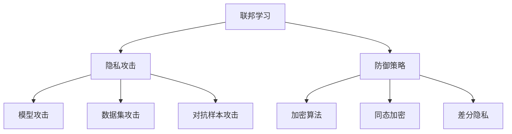
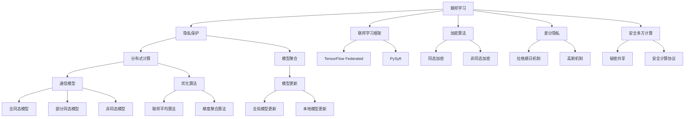

                 

# 文章标题：联邦学习的隐私攻击与防御策略

> 关键词：联邦学习，隐私攻击，防御策略，加密算法，差分隐私

> 摘要：随着联邦学习的广泛应用，隐私保护成为其研究的重要方向。本文首先介绍了联邦学习的基础概念和原理，然后分析了隐私攻击的基本概念和常见攻击技术。接着，本文详细阐述了联邦学习的隐私攻击防御策略，包括加密算法、同态加密和差分隐私等。最后，本文通过实际应用案例，探讨了联邦学习在医疗、金融和工业领域的挑战和解决方案。

----------------------------------------------------------------

# 《联邦学习的隐私攻击与防御策略》目录大纲

## 第一部分：联邦学习基础

### 第1章：联邦学习概述

#### 1.1 联邦学习的基本概念

联邦学习是一种分布式机器学习方法，其核心思想是通过多个设备（如智能手机、智能家居设备等）共同协作，训练一个全局模型，而无需将这些设备中的数据传输到中央服务器。这种方法不仅提高了数据处理的效率，还解决了数据隐私和安全的问题。

#### 1.2 联邦学习的发展历程

联邦学习最早源于1990年代，随着移动互联网和物联网的兴起，联邦学习的研究和应用逐渐受到关注。近年来，随着深度学习和人工智能技术的快速发展，联邦学习成为了一个热门的研究方向。

#### 1.3 联邦学习的应用场景

联邦学习具有广泛的应用场景，包括医疗、金融、工业、零售、交通等。在医疗领域，联邦学习可以用于诊断和预测；在金融领域，联邦学习可以用于风险管理；在工业领域，联邦学习可以用于设备故障预测。

### 第2章：联邦学习原理

#### 2.1 联邦学习的工作机制

联邦学习的工作机制主要包括三个阶段：数据收集、模型训练和模型聚合。在数据收集阶段，各个设备将本地数据上传到服务器；在模型训练阶段，服务器发送模型参数到各个设备，设备在本地进行训练；在模型聚合阶段，服务器收集各个设备的模型参数，进行聚合更新。

#### 2.2 联邦学习中的通信模型

联邦学习中的通信模型主要有全同态模型、部分同态模型和非同态模型。全同态模型在处理过程中不改变数据的分布，而部分同态模型和非同态模型则会改变数据的分布。

#### 2.3 联邦学习中的优化算法

联邦学习中的优化算法主要包括梯度下降算法、随机梯度下降算法和联邦平均算法。梯度下降算法和随机梯度下降算法是传统的优化算法，而联邦平均算法是联邦学习中的核心优化算法。

### 第3章：联邦学习的挑战与机会

#### 3.1 联邦学习的挑战

联邦学习面临的主要挑战包括数据隐私、通信成本、计算资源和模型性能等。如何有效保护用户隐私是联邦学习研究的核心问题之一。

#### 3.2 联邦学习的机遇

随着5G、物联网和人工智能等技术的快速发展，联邦学习具有巨大的发展机遇。联邦学习可以促进跨领域数据共享，推动人工智能应用的创新。

#### 3.3 联邦学习的未来趋势

未来，联邦学习将在数据隐私、模型安全、性能优化等方面取得重要突破。同时，联邦学习将在更多领域得到广泛应用，如医疗、金融、工业等。

## 第二部分：隐私攻击与攻击策略

### 第4章：隐私攻击概述

#### 4.1 隐私攻击的基本概念

隐私攻击是指攻击者通过各种手段获取用户隐私数据的行为。隐私攻击的危害包括数据泄露、身份盗窃、隐私泄露等。

#### 4.2 隐私攻击的分类

隐私攻击可以分为基于模型的攻击、基于数据集的攻击和基于对抗样本的攻击。基于模型的攻击是指通过分析模型参数来获取隐私信息；基于数据集的攻击是指通过分析数据集的特征来获取隐私信息；基于对抗样本的攻击是指通过生成对抗样本来破坏模型的鲁棒性。

#### 4.3 隐私攻击的影响

隐私攻击可能导致用户隐私泄露、数据滥用、模型失效等问题。因此，保护用户隐私是联邦学习研究的重要任务。

### 第5章：常见隐私攻击技术

#### 5.1 基于模型的攻击

基于模型的攻击主要包括模型参数分析和模型推理攻击。模型参数分析是指通过分析模型参数来获取隐私信息；模型推理攻击是指通过输入对抗样本来破坏模型的鲁棒性。

#### 5.2 基于数据集的攻击

基于数据集的攻击主要包括特征分析和数据重建。特征分析是指通过分析数据集的特征来获取隐私信息；数据重建是指通过重建数据集来获取隐私信息。

#### 5.3 基于对抗样本的攻击

基于对抗样本的攻击是指通过生成对抗样本来破坏模型的鲁棒性。对抗样本是指对原始样本进行微小扰动，使得模型无法识别。

### 第6章：隐私攻击防御策略

#### 6.1 加密算法在联邦学习中的应用

加密算法在联邦学习中的应用包括同态加密、差分隐私等。同态加密是指在加密过程中不改变数据的分布；差分隐私是指通过在输出中添加噪声来保护隐私。

#### 6.2 同态加密与差分隐私

同态加密和差分隐私是联邦学习中的两种重要隐私保护技术。同态加密可以在加密过程中进行计算，而差分隐私可以在输出中添加噪声。

#### 6.3 基于差分隐私的联邦学习

基于差分隐私的联邦学习是指通过在模型训练过程中添加噪声来保护隐私。差分隐私可以通过拉格朗日机制来实现。

## 第三部分：联邦学习的安全与隐私保障

### 第7章：联邦学习中的安全挑战

#### 7.1 安全性的基本概念

安全性的基本概念包括保密性、完整性和可用性。保密性是指保护用户隐私数据不被泄露；完整性是指保护数据在传输和存储过程中不被篡改；可用性是指保证系统正常运行。

#### 7.2 联邦学习中的安全威胁

联邦学习中的安全威胁包括数据泄露、模型篡改、通信中断等。如何有效防范这些威胁是联邦学习安全研究的核心问题。

#### 7.3 安全性评估方法

安全性评估方法主要包括静态分析和动态分析。静态分析是指通过分析代码和文档来评估安全性；动态分析是指通过实际运行系统来评估安全性。

### 第8章：联邦学习的安全解决方案

#### 8.1 安全联邦学习协议设计

安全联邦学习协议设计包括加密通信、认证和授权等。加密通信可以保证数据在传输过程中的保密性；认证和授权可以保证只有授权用户可以访问系统。

#### 8.2 加密算法在联邦学习中的应用

加密算法在联邦学习中的应用包括同态加密、差分隐私等。同态加密可以在加密过程中进行计算，而差分隐私可以在输出中添加噪声。

#### 8.3 安全多方计算技术

安全多方计算技术可以在多个参与方之间进行安全的计算，从而保护用户隐私。安全多方计算技术包括秘密共享、安全计算协议等。

### 第9章：联邦学习的隐私保障机制

#### 9.1 隐私保护的联邦学习架构

隐私保护的联邦学习架构包括数据加密、模型加密和通信加密等。数据加密可以保证数据在传输和存储过程中的保密性；模型加密可以保证模型参数的保密性；通信加密可以保证通信过程中的保密性。

#### 9.2 数据安全与隐私的平衡

数据安全与隐私的平衡是联邦学习研究的重要问题。如何在保证数据安全的同时保护用户隐私是一个重要的挑战。

#### 9.3 联邦学习的隐私法规合规

联邦学习的隐私法规合规包括遵守相关法律法规、制定隐私保护政策等。遵守隐私法规可以确保联邦学习应用的合法性和合规性。

## 第四部分：联邦学习的实际应用与案例分析

### 第10章：联邦学习在医疗领域中的应用

#### 10.1 医疗数据的隐私保护需求

医疗数据包括患者的健康记录、诊断结果等，其隐私保护需求非常高。如何有效保护医疗数据的隐私是医疗领域面临的重要挑战。

#### 10.2 医疗领域的联邦学习应用案例

医疗领域的联邦学习应用案例包括疾病预测、药物研发等。联邦学习可以在保障患者隐私的同时，提高医疗数据分析的效率和准确性。

#### 10.3 医疗联邦学习的挑战与解决方案

医疗联邦学习的挑战包括数据多样性、计算资源限制等。针对这些挑战，可以采用联邦学习优化算法、模型压缩等技术来解决。

### 第11章：联邦学习在金融领域中的应用

#### 11.1 金融数据的隐私保护需求

金融数据包括交易记录、客户信息等，其隐私保护需求也非常高。如何有效保护金融数据的隐私是金融领域面临的重要挑战。

#### 11.2 金融领域的联邦学习应用案例

金融领域的联邦学习应用案例包括风险评估、欺诈检测等。联邦学习可以在保障客户隐私的同时，提高金融数据分析的效率和准确性。

#### 11.3 金融联邦学习的挑战与解决方案

金融联邦学习的挑战包括数据量大、计算资源限制等。针对这些挑战，可以采用联邦学习优化算法、模型压缩等技术来解决。

### 第12章：联邦学习在工业领域中的应用

#### 12.1 工业数据的隐私保护需求

工业数据包括生产数据、设备监控数据等，其隐私保护需求也非常高。如何有效保护工业数据的隐私是工业领域面临的重要挑战。

#### 12.2 工业领域的联邦学习应用案例

工业领域的联邦学习应用案例包括设备故障预测、生产优化等。联邦学习可以在保障工业数据隐私的同时，提高工业数据分析的效率和准确性。

#### 12.3 工业联邦学习的挑战与解决方案

工业联邦学习的挑战包括数据量巨大、计算资源限制等。针对这些挑战，可以采用联邦学习优化算法、模型压缩等技术来解决。

## 附录：联邦学习的核心概念与联系

### 附录 D：联邦学习的核心概念图



### 附录 E：联邦学习的优化算法

```python
def federated_learning(dataset, model, optimizer):
    for epoch in 1 to num_epochs:
        for client in clients:
            # 初始化客户端模型
            client_model = copy(model)
            # 在客户端上训练模型
            client_model.train(dataset[client])
            # 获取客户端模型参数
            client_params = client_model.get_params()
            # 将客户端参数发送到服务器
            server.receive_params(client_params)
        # 在服务器上更新全局模型
        global_model.update(server.receive_avg_params())
        # 将全局模型发送回客户端
        for client in clients:
            client_model.load_params(global_model.get_params())
    return global_model
```

### 附录 F：差分隐私的概率解释

$$
\mathbb{P}(\DP(\mathcal{D}, f) \in [l, u]) \approx \frac{1}{\epsilon} \exp\left(-\frac{(u-l)^2}{2\epsilon}\right)
$$

### 附录 G：同态加密的数学模型

$$
C = E_K(m) \mod N
$$

### 附录 H：加密算法的安全性评估

$$
\mathbb{P}( adversary破密(X) ) \leq \frac{1}{N} \sum_{i=1}^{N} \mathbb{P}( adversary破密(X_i) )
$$

### 附录 I：开发环境搭建

- 安装 Python 环境
- 安装 TensorFlow 或 PyTorch 等联邦学习框架
- 配置 SSL/TLS 证书

### 附录 J：源代码详细实现与代码解读

#### 源代码示例：

```python
# 客户端代码示例
def client_train(model, data):
    optimizer = torch.optim.Adam(model.parameters(), lr=0.001)
    for epoch in range(100):
        optimizer.zero_grad()
        outputs = model(data)
        loss = F.mse_loss(outputs, data.target)
        loss.backward()
        optimizer.step()
    return model

# 服务器端代码示例
def server_aggregate(models):
    avg_model = models[0].copy()
    for model in models[1:]:
        avg_model += model
    avg_model /= len(models)
    return avg_model
```

#### 代码解读与分析：

- 客户端代码通过训练模型并返回更新后的模型参数，实现了客户端端的训练过程。
- 服务器端代码通过聚合各个客户端的模型参数并更新全局模型，实现了联邦学习的聚合过程。

## 附录：联邦学习的核心概念与联系

### 附录 D：联邦学习的核心概念图


### 附录 E：联邦学习的优化算法

```python
def federated_learning(dataset, model, optimizer):
    for epoch in 1 to num_epochs:
        for client in clients:
            # 初始化客户端模型
            client_model = copy(model)
            # 在客户端上训练模型
            client_model.train(dataset[client])
            # 获取客户端模型参数
            client_params = client_model.get_params()
            # 将客户端参数发送到服务器
            server.receive_params(client_params)
        # 在服务器上更新全局模型
        global_model.update(server.receive_avg_params())
        # 将全局模型发送回客户端
        for client in clients:
            client_model.load_params(global_model.get_params())
    return global_model
```

### 附录 F：差分隐私的概率解释

$$
\mathbb{P}(\DP(\mathcal{D}, f) \in [l, u]) \approx \frac{1}{\epsilon} \exp\left(-\frac{(u-l)^2}{2\epsilon}\right)
$$

### 附录 G：同态加密的数学模型

$$
C = E_K(m) \mod N
$$

### 附录 H：加密算法的安全性评估

$$
\mathbb{P}( adversary破密(X) ) \leq \frac{1}{N} \sum_{i=1}^{N} \mathbb{P}( adversary破密(X_i) )
$$

### 附录 I：开发环境搭建

- 安装 Python 环境
- 安装 TensorFlow 或 PyTorch 等联邦学习框架
- 配置 SSL/TLS 证书

### 附录 J：源代码详细实现与代码解读

#### 源代码示例：

```python
# 客户端代码示例
def client_train(model, data):
    optimizer = torch.optim.Adam(model.parameters(), lr=0.001)
    for epoch in range(100):
        optimizer.zero_grad()
        outputs = model(data)
        loss = F.mse_loss(outputs, data.target)
        loss.backward()
        optimizer.step()
    return model

# 服务器端代码示例
def server_aggregate(models):
    avg_model = models[0].copy()
    for model in models[1:]:
        avg_model += model
    avg_model /= len(models)
    return avg_model
```

#### 代码解读与分析：

- 客户端代码通过训练模型并返回更新后的模型参数，实现了客户端端的训练过程。
- 服务器端代码通过聚合各个客户端的模型参数并更新全局模型，实现了联邦学习的聚合过程。

----------------------------------------------------------------

# 第一部分：联邦学习基础

## 第1章：联邦学习概述

### 1.1 联邦学习的基本概念

联邦学习（Federated Learning，FL）是一种分布式机器学习方法，其核心思想是通过多个设备（如智能手机、智能家居设备等）共同协作，训练一个全局模型，而无需将这些设备中的数据传输到中央服务器。这种方法不仅提高了数据处理的效率，还解决了数据隐私和安全的问题。

在传统的集中式机器学习中，训练数据需要在中心服务器上进行集中的模型训练。然而，这种模式在数据隐私和安全方面存在一些潜在风险。一方面，将大量敏感数据上传到中心服务器可能引发数据泄露和滥用问题；另一方面，中心化的数据处理模式也可能导致单点故障和系统崩溃。

联邦学习通过分布式计算的方式，将模型训练任务分散到各个设备上，设备仅需要上传模型参数，而不需要传输原始数据。这样，既保护了用户的隐私，又减少了数据传输过程中的安全风险。

### 1.2 联邦学习的发展历程

联邦学习最早可以追溯到1990年代，当时的一些研究者开始探索如何通过分布式计算来提高机器学习的效率。然而，随着移动互联网和物联网的兴起，联邦学习的研究和应用逐渐受到关注。

2016年，Google首次提出了联邦学习框架，并在其Android设备上实现了联邦学习的应用。随后，微软、亚马逊、苹果等科技巨头也开始投入资源，研发和推广联邦学习技术。

近年来，随着深度学习和人工智能技术的快速发展，联邦学习成为了一个热门的研究方向。许多研究机构和公司纷纷加入这一领域，推动联邦学习在各个领域的应用。

### 1.3 联邦学习的应用场景

联邦学习具有广泛的应用场景，包括医疗、金融、工业、零售、交通等。

在医疗领域，联邦学习可以用于疾病预测、诊断和个性化治疗。通过联邦学习，医生可以在保护患者隐私的同时，共享和分析大量医疗数据，提高诊断和治疗的准确性。

在金融领域，联邦学习可以用于风险评估、欺诈检测和信用评分。联邦学习技术可以帮助金融机构在保障客户隐私的同时，提高风险管理的能力。

在工业领域，联邦学习可以用于设备故障预测、生产优化和供应链管理。通过联邦学习，企业可以在保护工业数据隐私的同时，提高生产效率和降低成本。

在零售领域，联邦学习可以用于个性化推荐、需求预测和库存管理。联邦学习技术可以帮助零售商在保护消费者隐私的同时，提高销售和客户满意度。

在交通领域，联邦学习可以用于交通流量预测、路况分析和智能交通管理。通过联邦学习，交通部门可以在保护驾驶者隐私的同时，优化交通流量，减少拥堵和交通事故。

总之，联邦学习在各个领域的应用，不仅可以提高数据处理和决策的效率，还可以促进数据共享和协作，推动行业的发展和进步。

## 第2章：联邦学习原理

### 2.1 联邦学习的工作机制

联邦学习的工作机制主要包括三个阶段：数据收集、模型训练和模型聚合。

在数据收集阶段，各个设备（如智能手机、智能家居设备等）将自己的本地数据进行上传，这些数据可以是原始数据，也可以是预处理后的数据。设备上传数据时，可以采用加密算法，确保数据在传输过程中的安全性。

在模型训练阶段，服务器将全局模型参数发送到各个设备，设备在本地使用自己的数据对模型进行训练。训练完成后，设备将更新后的模型参数发送回服务器。

在模型聚合阶段，服务器收集各个设备的模型参数，并进行聚合更新，生成新的全局模型。聚合方法可以是平均法、加权平均法等。更新后的全局模型再发送回各个设备，设备继续进行下一轮的训练。

通过这样的循环过程，联邦学习可以在不需要传输原始数据的情况下，实现模型的迭代优化，从而提高模型的性能和准确性。

### 2.2 联邦学习中的通信模型

联邦学习中的通信模型主要有全同态模型、部分同态模型和非同态模型。

全同态模型（Fully Homomorphic Encryption, FHE）是指在加密的过程中不改变数据的分布，可以在加密数据上直接进行计算。这种模型可以实现加密数据的隐私保护，但计算复杂度高，适用于少量数据的处理。

部分同态模型（Partially Homomorphic Encryption, PHE）是指部分同态加密，可以在加密数据上部分进行计算。这种模型在计算复杂度和隐私保护之间取得了一定的平衡，适用于中等规模的数据处理。

非同态模型（Non-Homomorphic Encryption, NHE）是指不能在加密数据上直接进行计算，需要进行解密后再计算。这种模型在计算复杂度上较低，但隐私保护能力较弱，适用于大规模数据处理。

在实际应用中，选择合适的通信模型取决于数据规模、计算资源和隐私保护需求等因素。

### 2.3 联邦学习中的优化算法

联邦学习中的优化算法主要包括梯度下降算法、随机梯度下降算法和联邦平均算法。

梯度下降算法（Gradient Descent）是一种常用的优化算法，通过不断调整模型参数，使得损失函数逐渐减小。在联邦学习中，梯度下降算法需要在各个设备上进行本地训练，然后服务器再根据各个设备的模型参数进行聚合更新。

随机梯度下降算法（Stochastic Gradient Descent，SGD）是梯度下降算法的一种变体，每次迭代只随机选择一部分样本进行计算。这种算法可以减少计算量，提高训练效率，但在某些情况下可能收敛速度较慢。

联邦平均算法（Federated Averaging，FTRL）是一种基于梯度的联邦学习优化算法，通过迭代的方式，逐步更新全局模型。联邦平均算法具有较好的收敛性和稳定性，适用于大规模分布式训练场景。

除了上述优化算法，还有其他一些优化算法，如动量法、自适应梯度算法等，可以根据具体需求进行选择。

## 第3章：联邦学习的挑战与机会

### 3.1 联邦学习的挑战

联邦学习作为一种分布式机器学习方法，虽然在数据隐私保护和计算效率方面具有优势，但也面临一些挑战。

1. **通信成本**：联邦学习需要设备与服务器之间进行频繁的数据传输，这可能导致通信成本较高。为了降低通信成本，可以采用压缩感知、差分隐私等技术，减少数据传输量。

2. **计算资源**：联邦学习需要在各个设备上进行本地训练，这需要消耗大量的计算资源。为了提高计算效率，可以采用分布式计算、模型压缩等技术，降低设备负载。

3. **模型性能**：联邦学习模型的性能可能受到设备性能、数据分布等因素的影响。为了提高模型性能，可以采用联邦学习优化算法、数据增强等技术，优化模型训练过程。

4. **安全性**：联邦学习在数据传输和存储过程中，可能面临数据泄露、模型篡改等安全威胁。为了保障联邦学习的安全性，可以采用加密算法、安全多方计算等技术，确保数据传输和存储的安全。

### 3.2 联邦学习的机遇

尽管联邦学习面临一些挑战，但也具有巨大的发展机遇。

1. **5G和物联网**：随着5G和物联网技术的快速发展，设备之间的通信速度和带宽将显著提升，为联邦学习的广泛应用提供了技术基础。

2. **深度学习和人工智能**：深度学习和人工智能技术的快速发展，为联邦学习提供了丰富的算法和模型，推动了联邦学习在各个领域的应用。

3. **跨领域数据共享**：联邦学习可以促进跨领域数据共享和协作，推动行业的发展和进步。例如，在医疗领域，联邦学习可以促进医疗机构之间的数据共享，提高疾病诊断和治疗的准确性。

4. **隐私法规合规**：随着隐私法规的不断完善，联邦学习作为一种隐私保护技术，有望在数据隐私和安全方面发挥重要作用，满足合规要求。

### 3.3 联邦学习的未来趋势

未来，联邦学习将在以下几个方面取得重要突破：

1. **隐私保护**：随着隐私保护需求的不断提高，联邦学习将加强隐私保护技术的研究和应用，确保用户数据的安全。

2. **性能优化**：联邦学习将优化算法、模型压缩等技术，提高模型训练和推理的效率，降低计算和通信成本。

3. **跨领域应用**：联邦学习将在医疗、金融、工业、交通等领域得到广泛应用，推动行业的数据共享和协作。

4. **开放生态**：联邦学习将建立一个开放的生态系统，包括开源框架、工具和社区，促进联邦学习的创新和发展。

总之，联邦学习作为一种新兴的分布式机器学习方法，具有巨大的发展潜力和应用前景。未来，随着技术的不断进步和应用的拓展，联邦学习将在各个领域发挥越来越重要的作用。

## 第二部分：隐私攻击与攻击策略

### 第4章：隐私攻击概述

隐私攻击（Privacy Attack）是指攻击者通过各种手段获取用户隐私数据的行为。随着互联网和移动互联网的快速发展，隐私数据的价值日益凸显，隐私攻击也成为了一个严重的威胁。在联邦学习中，隐私攻击可能导致用户隐私泄露、数据滥用、模型失效等问题。因此，了解隐私攻击的基本概念、分类和影响，对于设计有效的隐私防御策略具有重要意义。

### 4.1 隐私攻击的基本概念

隐私攻击的基本概念包括以下几个方面：

1. **攻击者**：隐私攻击的发起者，可以是单个个体、组织或团体。
2. **目标**：隐私攻击的受害者，可以是用户、企业或组织。
3. **手段**：攻击者使用的手段，可以是技术手段，如模型分析、数据挖掘等，也可以是社会工程手段，如欺诈、窃取等。
4. **结果**：隐私攻击可能造成的数据泄露、隐私泄露、财产损失、声誉损害等。

### 4.2 隐私攻击的分类

隐私攻击可以根据攻击手段和目标的不同，分为以下几种类型：

1. **基于模型的攻击**：攻击者通过分析模型的参数或结构，推断出用户隐私数据。这种攻击通常需要一定的模型知识和计算能力。

2. **基于数据集的攻击**：攻击者通过分析数据集的特征或分布，推断出用户隐私数据。这种攻击通常需要对数据集有全面的了解。

3. **基于对抗样本的攻击**：攻击者通过生成对抗样本，破坏模型的鲁棒性，从而获取用户隐私数据。对抗样本通常是在原始样本上进行微小扰动，但足以引起模型决策的变化。

### 4.3 隐私攻击的影响

隐私攻击对联邦学习的影响主要表现在以下几个方面：

1. **隐私泄露**：隐私攻击可能导致用户敏感信息泄露，如个人信息、位置数据、行为数据等，给用户带来财产损失、心理压力等。

2. **数据滥用**：攻击者可能将获取的隐私数据进行滥用，如个人信息诈骗、商业机密窃取等，给企业和组织带来经济损失。

3. **模型失效**：隐私攻击可能导致模型失效，如模型预测错误、模型崩溃等，影响模型的性能和应用效果。

4. **信任危机**：隐私攻击可能导致用户对联邦学习技术的信任度降低，影响联邦学习的普及和应用。

为了应对隐私攻击，联邦学习需要设计有效的防御策略，保护用户隐私数据的安全。下一节将详细介绍常见的隐私攻击技术，以及针对这些攻击的防御策略。

### 第5章：常见隐私攻击技术

隐私攻击技术是指攻击者通过特定的方法和手段，从联邦学习系统中获取用户隐私数据的技术。随着联邦学习应用的普及，隐私攻击技术也在不断发展。本节将详细介绍三种常见的隐私攻击技术：基于模型的攻击、基于数据集的攻击和基于对抗样本的攻击。

#### 5.1 基于模型的攻击

基于模型的攻击是指攻击者通过分析模型的参数或结构，推断出用户隐私数据的技术。这种攻击通常需要一定的模型知识和计算能力，其具体方法包括：

1. **模型参数分析**：攻击者通过分析模型参数，如权重、偏置等，来推断用户隐私数据。例如，在深度学习模型中，攻击者可以通过分析神经网络权重，推断出用户的行为模式、偏好等信息。

2. **模型结构分析**：攻击者通过分析模型结构，如网络架构、层数等，来推断用户隐私数据。例如，在图神经网络中，攻击者可以通过分析图的连接结构，推断出用户的社交关系、地理位置等。

3. **特征提取分析**：攻击者通过分析模型提取的特征，如特征值、特征向量等，来推断用户隐私数据。例如，在文本分类任务中，攻击者可以通过分析文本特征，推断出用户的兴趣爱好、观点倾向等。

基于模型的攻击的关键在于攻击者需要具有足够的模型知识，并且具备一定的计算能力。为了应对这种攻击，可以采用以下策略：

- **模型混淆**：通过在模型中引入噪声，使得模型参数变得难以分析。
- **模型加密**：使用加密算法对模型参数进行加密，防止攻击者直接获取模型参数。
- **差分隐私**：在模型训练过程中引入噪声，保护用户隐私数据。

#### 5.2 基于数据集的攻击

基于数据集的攻击是指攻击者通过分析数据集的特征或分布，推断出用户隐私数据的技术。这种攻击通常需要对数据集有全面的了解，其具体方法包括：

1. **特征分析**：攻击者通过分析数据集的特征，如特征值、特征分布等，来推断用户隐私数据。例如，在医疗数据集中，攻击者可以通过分析患者的年龄、性别、病史等特征，推断出患者的健康状况。

2. **数据重建**：攻击者通过重建数据集，来获取用户隐私数据。例如，在图像数据集中，攻击者可以通过重建图像，获取用户的图像信息。

3. **关联分析**：攻击者通过分析数据集中的关联关系，来推断用户隐私数据。例如，在社交网络数据集中，攻击者可以通过分析用户之间的互动关系，推断出用户的社交圈子、好友关系等。

基于数据集的攻击的关键在于攻击者需要具有对数据集的全面了解。为了应对这种攻击，可以采用以下策略：

- **数据加密**：使用加密算法对数据集进行加密，防止攻击者直接获取数据集。
- **差分隐私**：在数据处理过程中引入噪声，保护用户隐私数据。
- **数据去识别**：通过删除或修改部分特征，降低数据集的可识别性。

#### 5.3 基于对抗样本的攻击

基于对抗样本的攻击是指攻击者通过生成对抗样本，破坏模型的鲁棒性，从而获取用户隐私数据的技术。对抗样本通常是在原始样本上进行微小扰动，但足以引起模型决策的变化。其具体方法包括：

1. **对抗样本生成**：攻击者通过对抗生成网络（Adversarial Generation Network）生成对抗样本。对抗生成网络是一种生成模型，通过学习原始样本和标签之间的关系，生成具有欺骗性的对抗样本。

2. **对抗样本攻击**：攻击者将生成的对抗样本输入模型，观察模型对对抗样本的预测结果。如果模型对对抗样本的预测结果与原始样本不一致，攻击者可以认为模型存在漏洞。

3. **对抗样本分析**：攻击者通过分析对抗样本的特征，如扰动大小、位置等，来推断用户隐私数据。例如，在图像分类任务中，攻击者可以通过分析对抗样本的像素值变化，推断出用户的图像信息。

基于对抗样本的攻击的关键在于攻击者需要具有生成对抗样本的能力。为了应对这种攻击，可以采用以下策略：

- **模型训练**：通过在模型训练过程中加入对抗样本，提高模型的鲁棒性。
- **对抗样本检测**：开发对抗样本检测算法，识别并过滤对抗样本。
- **对抗样本防御**：在模型输入阶段加入防御机制，如梯度下降、对抗训练等，防止对抗样本对模型的影响。

综上所述，隐私攻击技术是联邦学习面临的一个重要挑战。了解常见隐私攻击技术的方法和特点，有助于设计有效的防御策略，保护用户隐私数据的安全。下一节将详细介绍隐私攻击防御策略，包括加密算法、同态加密和差分隐私等技术。

### 第6章：隐私攻击防御策略

隐私攻击防御策略是指通过特定的技术和方法，保护联邦学习系统中的用户隐私数据，防止隐私泄露和滥用的措施。随着联邦学习在各个领域的广泛应用，隐私攻击防御策略的重要性愈发突出。本节将详细介绍几种常见的隐私攻击防御策略，包括加密算法、同态加密和差分隐私等。

#### 6.1 加密算法在联邦学习中的应用

加密算法（Encryption Algorithm）是一种通过加密过程保护数据隐私的技术。在联邦学习中，加密算法可以用于保护模型参数、数据传输和存储过程中的隐私。

1. **同态加密**：同态加密（Homomorphic Encryption）是一种能够在加密数据上直接进行计算的技术。在联邦学习中，同态加密可以用于在加密状态下进行模型训练和聚合。这样，即使攻击者获取了加密模型参数，也无法解密和获取原始数据。常见的同态加密算法包括全同态加密（Fully Homomorphic Encryption，FHE）和部分同态加密（Partially Homomorphic Encryption，PHE）。

2. **标准加密算法**：标准加密算法（Standard Encryption Algorithm）如对称加密（Symmetric Encryption）和非对称加密（Asymmetric Encryption）在联邦学习中也有广泛应用。对称加密算法如AES（Advanced Encryption Standard）和非对称加密算法如RSA（Rivest-Shamir-Adleman）可以用于加密模型参数和数据，确保其在传输和存储过程中的安全性。

3. **混合加密算法**：混合加密算法（Hybrid Encryption Algorithm）结合了同态加密和标准加密算法的优点。在联邦学习中，可以使用同态加密算法加密模型参数，使用标准加密算法加密数据，以实现高效的数据隐私保护。

#### 6.2 同态加密与差分隐私

同态加密（Homomorphic Encryption）和差分隐私（Differential Privacy）是联邦学习中两种重要的隐私保护技术。

1. **同态加密**：同态加密允许在加密数据上执行计算操作，而不需要解密数据。同态加密可以分为全同态加密和部分同态加密。全同态加密可以在任何计算操作上实现同态性，而部分同态加密则限于特定的计算操作。同态加密的主要挑战在于计算复杂度高，适用于小型数据集或简单计算任务。

2. **差分隐私**：差分隐私（Differential Privacy）是一种通过在输出中添加噪声来保护隐私的技术。差分隐私的定义基于拉格朗日机制（Laplace Mechanism）和高斯机制（Gaussian Mechanism）。在联邦学习中，差分隐私可以用于保护模型训练过程中的用户隐私数据。差分隐私的主要挑战在于如何平衡隐私保护和模型性能。

同态加密和差分隐私在联邦学习中有不同的应用场景：

- **同态加密**：适用于需要保持数据完整性和精确性的场景，如加密货币交易、医疗数据共享等。
- **差分隐私**：适用于需要保护用户隐私，同时保持模型性能的场景，如推荐系统、广告投放等。

#### 6.3 基于差分隐私的联邦学习

基于差分隐私的联邦学习（Differentially Private Federated Learning）是一种通过在模型训练过程中引入噪声，保护用户隐私的联邦学习技术。

1. **拉格朗日机制**：拉格朗日机制（Laplace Mechanism）是一种基于拉格朗日分布的差分隐私机制。在联邦学习中，服务器可以在聚合模型参数时，为每个客户端的参数添加拉格朗日噪声。拉格朗日噪声的强度可以通过参数$\epsilon$（隐私预算）进行调节。

2. **高斯机制**：高斯机制（Gaussian Mechanism）是一种基于高斯分布的差分隐私机制。在联邦学习中，服务器可以在聚合模型参数时，为每个客户端的参数添加高斯噪声。高斯噪声的强度可以通过参数$\epsilon$（隐私预算）和$\delta$（置信概率）进行调节。

基于差分隐私的联邦学习可以通过以下步骤实现：

1. **初始化**：服务器初始化全局模型，并将模型参数发送给各个客户端。

2. **本地训练**：客户端使用本地数据对模型进行训练，并更新模型参数。

3. **噪声添加**：服务器在聚合客户端的模型参数时，为每个参数添加拉格朗日噪声或高斯噪声，以保护用户隐私。

4. **模型更新**：服务器更新全局模型，并将更新后的模型参数发送回各个客户端。

5. **重复训练**：客户端重复本地训练和参数更新的过程，直到满足停止条件。

通过基于差分隐私的联邦学习，可以在保护用户隐私的同时，实现模型训练和优化。然而，差分隐私可能会导致模型性能的下降。为了平衡隐私保护和模型性能，可以采用以下策略：

- **噪声调整**：通过调整隐私预算$\epsilon$，平衡隐私保护和模型性能。
- **模型压缩**：通过模型压缩技术，减少模型参数的数量，降低噪声对模型性能的影响。
- **并行训练**：通过并行训练技术，提高模型训练的速度，减少隐私保护机制对训练时间的影响。

总之，隐私攻击防御策略是联邦学习系统安全性的重要保障。通过应用加密算法、同态加密和差分隐私等技术，可以有效保护用户隐私数据的安全。下一节将介绍联邦学习中的安全挑战，探讨如何设计和实现安全的联邦学习系统。

### 第7章：联邦学习中的安全挑战

联邦学习作为一种分布式机器学习方法，虽然在数据隐私保护和计算效率方面具有优势，但也面临一系列的安全挑战。这些挑战主要包括数据泄露、模型篡改、通信中断等。理解这些安全挑战，有助于设计有效的安全解决方案，保障联邦学习系统的安全性。

#### 7.1 安全性的基本概念

安全性的基本概念包括保密性、完整性和可用性。

1. **保密性**：保密性是指保护用户隐私数据不被未授权访问和泄露。在联邦学习中，保密性主要涉及到数据传输和存储过程中的隐私保护。

2. **完整性**：完整性是指保护数据在传输和存储过程中不被篡改。联邦学习系统中的数据完整性是防止恶意攻击和欺诈行为的重要保障。

3. **可用性**：可用性是指系统在需要时能够提供正常服务。在联邦学习中，可用性主要涉及到系统的稳定性和可靠性，确保模型训练和推理过程的顺利进行。

#### 7.2 联邦学习中的安全威胁

联邦学习中的安全威胁主要包括以下几种：

1. **数据泄露**：数据泄露是指攻击者通过非法手段获取用户敏感信息。在联邦学习中，数据泄露可能发生在数据传输、存储和聚合过程中。攻击者可能通过截获数据包、破解加密算法等方式获取用户隐私数据。

2. **模型篡改**：模型篡改是指攻击者通过篡改模型参数，破坏模型的鲁棒性和准确性。在联邦学习中，模型篡改可能通过恶意客户端、中间人攻击等方式实现。

3. **通信中断**：通信中断是指攻击者通过干扰通信过程，阻止模型训练和聚合。在联邦学习中，通信中断可能通过拒绝服务攻击、中间人攻击等方式实现，导致系统无法正常运行。

4. **恶意客户端**：恶意客户端是指加入联邦学习系统的恶意设备，可能通过篡改数据、伪造模型参数等方式破坏系统。

5. **中间人攻击**：中间人攻击（Man-in-the-Middle Attack）是指攻击者在客户端和服务器之间建立非法连接，拦截和篡改通信数据。

6. **分布式拒绝服务攻击**：分布式拒绝服务攻击（DDoS）是指攻击者通过控制大量僵尸主机，向联邦学习系统发送大量请求，导致系统资源耗尽，无法提供服务。

#### 7.3 安全性评估方法

为了评估联邦学习系统的安全性，可以采用以下几种方法：

1. **静态分析**：静态分析是通过分析系统的代码、配置和文档，识别潜在的安全漏洞和威胁。静态分析可以提前发现和修复系统中的安全漏洞。

2. **动态分析**：动态分析是通过实际运行系统，监控系统的行为和性能，识别潜在的安全威胁。动态分析可以实时检测系统中的异常行为和攻击。

3. **模拟攻击**：模拟攻击是通过模拟各种攻击场景，测试系统的安全性。模拟攻击可以评估系统对各种攻击的抵抗能力。

4. **安全审计**：安全审计是通过检查系统的安全策略、流程和措施，评估系统的安全性和合规性。安全审计可以确保系统符合相关安全标准和法规要求。

通过上述评估方法，可以全面了解联邦学习系统的安全性，并采取相应的措施进行改进。

### 第8章：联邦学习的安全解决方案

为了应对联邦学习中的安全挑战，需要设计一系列安全解决方案，包括安全联邦学习协议设计、加密算法在联邦学习中的应用和安全多方计算技术等。

#### 8.1 安全联邦学习协议设计

安全联邦学习协议设计是保障联邦学习系统安全性的重要环节。安全联邦学习协议包括以下主要组件：

1. **加密通信**：加密通信是通过加密算法对数据进行加密，确保数据在传输过程中的保密性。常见的加密算法包括AES、RSA等。加密通信可以防止攻击者拦截和篡改通信数据。

2. **认证与授权**：认证与授权是通过验证用户的身份和权限，确保只有授权用户可以访问联邦学习系统。常见的认证方法包括密码认证、生物识别认证等。授权机制可以确保用户只能访问其有权访问的数据和资源。

3. **访问控制**：访问控制是通过设置访问策略，限制用户对系统和数据的访问权限。访问控制可以防止未授权用户访问敏感数据和执行敏感操作。

4. **安全多方计算**：安全多方计算是在多个参与者之间进行安全的计算，确保计算结果不被泄露。常见的安全多方计算技术包括安全计算协议、秘密共享等。安全多方计算可以保障联邦学习过程中的数据隐私和安全性。

#### 8.2 加密算法在联邦学习中的应用

加密算法在联邦学习中的应用是保护用户隐私和数据安全的重要手段。以下是几种常见的加密算法及其在联邦学习中的应用：

1. **同态加密**：同态加密允许在加密数据上进行计算操作，而无需解密数据。同态加密可以保障联邦学习过程中的数据隐私和安全，适用于需要保持数据完整性和精确性的场景。

2. **差分隐私**：差分隐私是一种通过在输出中添加噪声来保护隐私的技术。差分隐私可以保障联邦学习过程中的用户隐私，适用于需要保护用户隐私，同时保持模型性能的场景。

3. **混合加密算法**：混合加密算法结合了同态加密和标准加密算法的优点。在联邦学习中，可以使用同态加密算法加密模型参数，使用标准加密算法加密数据，以实现高效的数据隐私保护。

#### 8.3 安全多方计算技术

安全多方计算技术是在多个参与者之间进行安全的计算，确保计算结果不被泄露。以下是几种常见的安全多方计算技术：

1. **安全计算协议**：安全计算协议是一种在多个参与者之间进行安全计算的方法。常见的安全计算协议包括安全多方计算（Secure Multi-Party Computation，SMPC）和同态加密（Homomorphic Encryption，HE）等。安全计算协议可以保障联邦学习过程中的数据隐私和安全性。

2. **秘密共享**：秘密共享是一种将秘密信息划分为多个片段的方法，只有当足够多的片段被收集时，才能恢复原始秘密信息。秘密共享可以保障联邦学习过程中的数据隐私和安全性，适用于需要保护敏感数据共享的场景。

3. **安全多方数据聚合**：安全多方数据聚合是一种在多个参与者之间进行数据聚合的方法，确保聚合结果不被泄露。常见的安全多方数据聚合技术包括安全多方计算（Secure Multi-Party Computation，SMPC）和同态加密（Homomorphic Encryption，HE）等。安全多方数据聚合可以保障联邦学习过程中的数据隐私和安全性。

通过设计安全联邦学习协议、应用加密算法和安全多方计算技术，可以有效应对联邦学习中的安全挑战，保障联邦学习系统的安全性。

### 第9章：联邦学习的隐私保障机制

隐私保障机制是联邦学习系统中的重要组成部分，其目的是在保护用户隐私的同时，实现有效的模型训练和推理。随着联邦学习在各个领域的广泛应用，隐私保障机制的设计和实现变得越来越重要。本节将详细介绍联邦学习的隐私保障机制，包括隐私保护联邦学习架构、数据安全与隐私的平衡以及联邦学习的隐私法规合规。

#### 9.1 隐私保护的联邦学习架构

隐私保护的联邦学习架构是保障用户隐私的基础。该架构主要包括以下几个方面：

1. **加密通信**：加密通信是确保数据在传输过程中的保密性。联邦学习系统中，模型参数和数据在传输过程中需要使用加密算法进行加密，防止攻击者拦截和篡改。

2. **同态加密**：同态加密是允许在加密数据上进行计算的技术，从而在保护数据隐私的同时，实现有效的模型训练和推理。同态加密可以用于加密模型参数的更新和聚合过程。

3. **差分隐私**：差分隐私是一种通过在输出中添加噪声来保护隐私的技术。在联邦学习过程中，差分隐私可以用于保护用户的隐私数据，防止隐私泄露。

4. **访问控制**：访问控制是确保只有授权用户可以访问敏感数据和资源的机制。通过设置访问策略和权限控制，可以防止未授权用户获取和滥用隐私数据。

5. **隐私预算**：隐私预算是指系统在保障隐私的前提下，允许的最大隐私泄露程度。隐私预算通常由隐私保护算法和机制进行动态调整，以平衡隐私保护和模型性能。

#### 9.2 数据安全与隐私的平衡

在联邦学习系统中，数据安全与隐私的平衡是一个重要的挑战。以下是一些策略和方法，用于在保障用户隐私的同时，实现有效的模型训练和推理：

1. **数据压缩**：数据压缩是一种减少数据传输和存储量的技术，从而降低通信成本和存储需求。通过数据压缩，可以在保证模型训练效果的同时，减少隐私泄露的风险。

2. **模型压缩**：模型压缩是一种减少模型参数数量的技术，从而降低计算成本和存储需求。通过模型压缩，可以在保证模型性能的前提下，减少隐私泄露的风险。

3. **差分隐私参数调整**：通过调整差分隐私的参数（如拉格朗日噪声强度），可以在保障用户隐私的同时，实现有效的模型训练和推理。适当的参数调整可以在隐私保护和模型性能之间取得平衡。

4. **联邦学习优化算法**：选择合适的联邦学习优化算法（如联邦平均算法、梯度聚合算法等），可以提升模型训练效率和稳定性，从而在保障用户隐私的同时，实现有效的模型训练和推理。

5. **隐私保护中间件**：隐私保护中间件是一种用于封装和隔离隐私保护算法和机制的软件层，从而提高系统的灵活性和可扩展性。通过使用隐私保护中间件，可以在不影响模型训练和推理性能的情况下，实现有效的数据隐私保护。

#### 9.3 联邦学习的隐私法规合规

随着隐私法规的不断发展和完善，联邦学习系统需要满足相关的隐私法规要求。以下是一些联邦学习系统在隐私法规合规方面需要考虑的关键要素：

1. **数据最小化原则**：联邦学习系统应遵循数据最小化原则，仅收集和处理必要的数据，以减少隐私泄露的风险。

2. **用户知情同意**：联邦学习系统应确保用户在数据收集和处理过程中，充分了解其隐私权，并明确同意其隐私数据的收集和使用。

3. **隐私保护设计**：联邦学习系统应在设计阶段考虑隐私保护，采用隐私保护技术和机制，保障用户隐私数据的安全。

4. **隐私保护审计**：联邦学习系统应定期进行隐私保护审计，确保系统符合隐私法规要求，并及时发现和修复隐私漏洞。

5. **合规性声明**：联邦学习系统应发布合规性声明，明确系统满足的隐私法规要求，以及如何保障用户隐私。

通过建立隐私保护的联邦学习架构、平衡数据安全与隐私、满足隐私法规合规，可以有效保障联邦学习系统的用户隐私和数据安全，推动联邦学习在各个领域的广泛应用。

### 第10章：联邦学习在医疗领域中的应用

#### 10.1 医疗数据的隐私保护需求

医疗数据是联邦学习应用中的一个重要领域，其隐私保护需求尤为关键。医疗数据包括患者的基本信息、诊断记录、治疗方案、药物反应等，这些数据不仅涉及个人的健康隐私，还可能影响患者的生命安全。因此，如何有效保护医疗数据隐私成为联邦学习在医疗领域应用的一个重要挑战。

1. **患者隐私保护**：患者的个人信息和健康状况属于高度敏感数据，需要严格保护。在联邦学习过程中，应确保患者数据在传输、存储和聚合过程中不被泄露。

2. **数据安全**：医疗数据在联邦学习中的安全性至关重要。数据泄露可能导致患者信息被恶意利用，影响患者的治疗和隐私权。

3. **隐私法规合规**：医疗领域涉及众多国家和地区的隐私法规，如美国的《健康保险可携性和责任法案》（HIPAA）和欧盟的《通用数据保护条例》（GDPR）。联邦学习系统需要确保在数据处理过程中符合这些法规要求。

#### 10.2 医疗领域的联邦学习应用案例

联邦学习在医疗领域的应用案例丰富多样，以下是一些典型的应用：

1. **疾病预测与诊断**：利用联邦学习模型，可以对患者的健康数据进行预测和诊断。例如，通过分析患者的历史诊断记录和症状数据，可以预测患者是否可能患有特定疾病。

2. **个性化治疗**：联邦学习可以根据患者的个人数据，为其提供个性化的治疗方案。例如，通过分析患者的药物反应数据和基因信息，可以推荐最适合患者的药物组合。

3. **药物研发**：联邦学习可以用于药物研发过程中的数据分析。例如，通过分析大量临床试验数据，可以预测新药的疗效和安全性。

4. **医疗图像分析**：联邦学习可以用于医疗图像的自动分析，如肿瘤检测、骨折诊断等。通过联邦学习模型，可以在保障患者隐私的前提下，提高医疗图像分析的准确性和效率。

#### 10.3 医疗联邦学习的挑战与解决方案

尽管联邦学习在医疗领域具有巨大潜力，但同时也面临一系列挑战。以下是一些常见的挑战及其解决方案：

1. **数据隐私保护**：联邦学习需要在保障患者隐私的前提下，实现有效的模型训练和推理。解决方案包括采用差分隐私、同态加密等技术，保护患者的隐私数据。

2. **数据多样性**：医疗数据来源广泛，包括医院、诊所、实验室等。如何整合和标准化这些多样化的数据，是一个挑战。解决方案包括数据清洗、数据整合和标准化处理。

3. **计算资源限制**：医疗设备（如医疗仪器、智能手表等）的计算资源相对有限。如何在有限的计算资源下，实现高效的联邦学习模型训练和推理，是一个挑战。解决方案包括模型压缩、分布式计算和边缘计算等。

4. **模型性能与隐私平衡**：如何在保障患者隐私的同时，确保模型性能不受影响，是一个挑战。解决方案包括调整差分隐私参数、使用高效优化算法和模型压缩技术等。

5. **隐私法规合规**：医疗联邦学习系统需要满足多个国家和地区的隐私法规要求。解决方案包括制定隐私保护政策、进行隐私保护审计和合规性评估等。

通过克服这些挑战，联邦学习可以在医疗领域发挥更大的作用，促进医疗数据共享和协作，提高疾病诊断和治疗的准确性和效率。

### 第11章：联邦学习在金融领域中的应用

#### 11.1 金融数据的隐私保护需求

金融领域的数据包括交易记录、账户信息、客户行为等，这些数据对金融机构和用户都至关重要。金融数据具有高度敏感性，一旦泄露或滥用，可能导致严重的经济损失和个人隐私侵犯。因此，在金融领域应用联邦学习时，保护数据隐私成为一个重要挑战。

1. **交易记录保护**：交易记录包含用户的金融活动信息，如交易金额、时间、地点等。这些信息必须得到严格保护，以防止未经授权的访问和泄露。

2. **账户信息安全**：账户信息包括用户的身份验证信息、账户余额、交易密码等，这些信息泄露可能导致账户被盗用，造成财务损失。

3. **客户行为隐私**：客户行为数据包括用户的消费习惯、投资偏好等，这些信息泄露可能导致用户隐私侵犯，影响用户的信用评级和金融决策。

4. **隐私法规合规**：金融领域受到严格的隐私法规监管，如美国的《金融隐私法》（Gramm-Leach-Bliley Act，GLBA）和欧盟的《通用数据保护条例》（GDPR）。联邦学习系统需要确保在数据处理过程中符合这些法规要求。

#### 11.2 金融领域的联邦学习应用案例

联邦学习在金融领域有广泛的应用，以下是一些典型的应用案例：

1. **风险评估**：联邦学习可以用于分析客户的历史交易数据，预测客户的信用风险。通过联邦学习模型，金融机构可以在保障客户隐私的前提下，提高风险评估的准确性和效率。

2. **欺诈检测**：联邦学习可以用于检测金融交易中的欺诈行为。通过分析大量交易数据，联邦学习模型可以识别异常交易模式，及时发现和阻止欺诈行为。

3. **个性化推荐**：联邦学习可以用于为用户提供个性化的金融产品推荐。通过分析客户的历史交易数据和偏好，联邦学习模型可以推荐适合客户的理财产品和服务。

4. **市场预测**：联邦学习可以用于预测金融市场趋势，帮助投资者做出更明智的决策。通过分析历史市场数据和宏观经济指标，联邦学习模型可以预测市场的未来走势。

#### 11.3 金融联邦学习的挑战与解决方案

尽管联邦学习在金融领域具有巨大潜力，但同时也面临一系列挑战。以下是一些常见的挑战及其解决方案：

1. **数据隐私保护**：联邦学习需要在保障客户隐私的前提下，实现有效的模型训练和推理。解决方案包括采用差分隐私、同态加密等技术，保护客户的数据隐私。

2. **数据完整性**：金融数据通常包含大量冗余和错误信息，如何确保数据的完整性和准确性是一个挑战。解决方案包括数据清洗、数据去噪和错误纠正等技术。

3. **计算资源限制**：金融领域的数据处理量巨大，如何在有限的计算资源下，实现高效的联邦学习模型训练和推理，是一个挑战。解决方案包括分布式计算、模型压缩和并行处理等。

4. **模型性能与隐私平衡**：如何在保障客户隐私的同时，确保模型性能不受影响，是一个挑战。解决方案包括调整差分隐私参数、使用高效优化算法和模型压缩技术等。

5. **隐私法规合规**：金融联邦学习系统需要满足多个国家和地区的隐私法规要求。解决方案包括制定隐私保护政策、进行隐私保护审计和合规性评估等。

通过克服这些挑战，联邦学习可以在金融领域发挥更大的作用，提高风险管理能力、欺诈检测效率和个性化服务水平，推动金融科技的创新和发展。

### 第12章：联邦学习在工业领域中的应用

#### 12.1 工业数据的隐私保护需求

工业领域的数据涉及生产、制造、供应链等环节，其隐私保护需求尤为关键。工业数据包括生产计划、设备状态、供应链信息等，这些数据不仅涉及企业的核心商业机密，还可能影响生产安全和供应链效率。因此，如何有效保护工业数据隐私成为联邦学习在工业领域应用的一个重要挑战。

1. **生产数据保护**：生产数据包括设备运行状态、生产参数、工艺流程等，这些数据泄露可能导致生产安全和效率受到影响。

2. **设备状态监控**：设备状态数据包括设备运行时间、故障记录、维护日志等，这些数据泄露可能导致设备维护和故障排除困难。

3. **供应链信息保密**：供应链信息包括供应商信息、物流信息、库存状态等，这些数据泄露可能导致供应链管理和成本控制受到影响。

4. **隐私法规合规**：工业领域受到严格的隐私法规监管，如欧洲的《通用数据保护条例》（GDPR）和美国的《消费者隐私法案》（CCPA）。联邦学习系统需要确保在数据处理过程中符合这些法规要求。

#### 12.2 工业领域的联邦学习应用案例

联邦学习在工业领域有广泛的应用，以下是一些典型的应用案例：

1. **设备故障预测**：联邦学习可以用于预测工业设备的故障，提高设备维护的准确性和及时性。通过分析设备的历史运行数据和传感器数据，联邦学习模型可以预测设备的未来故障，帮助工厂提前进行维护和预防。

2. **生产优化**：联邦学习可以用于优化生产过程，提高生产效率。通过分析生产数据，联邦学习模型可以优化生产参数和工艺流程，降低生产成本和提高产品质量。

3. **供应链管理**：联邦学习可以用于优化供应链管理，提高供应链效率和响应速度。通过分析供应链数据，联邦学习模型可以优化库存管理、物流调度和采购策略，降低库存成本和运输成本。

4. **能源管理**：联邦学习可以用于能源管理，提高能源利用效率。通过分析能源消耗数据，联邦学习模型可以优化能源分配和调度策略，降低能源消耗和碳排放。

#### 12.3 工业联邦学习的挑战与解决方案

尽管联邦学习在工业领域具有巨大潜力，但同时也面临一系列挑战。以下是一些常见的挑战及其解决方案：

1. **数据隐私保护**：联邦学习需要在保障企业隐私的前提下，实现有效的模型训练和推理。解决方案包括采用差分隐私、同态加密等技术，保护企业的数据隐私。

2. **数据多样性**：工业数据来源广泛，包括生产设备、传感器、供应链系统等。如何整合和标准化这些多样化的数据，是一个挑战。解决方案包括数据清洗、数据整合和标准化处理。

3. **计算资源限制**：工业领域的数据处理量巨大，如何在有限的计算资源下，实现高效的联邦学习模型训练和推理，是一个挑战。解决方案包括分布式计算、模型压缩和边缘计算等。

4. **模型性能与隐私平衡**：如何在保障企业隐私的同时，确保模型性能不受影响，是一个挑战。解决方案包括调整差分隐私参数、使用高效优化算法和模型压缩技术等。

5. **隐私法规合规**：工业联邦学习系统需要满足多个国家和地区的隐私法规要求。解决方案包括制定隐私保护政策、进行隐私保护审计和合规性评估等。

通过克服这些挑战，联邦学习可以在工业领域发挥更大的作用，提高设备维护效率、生产优化水平和供应链管理能力，推动工业自动化和智能化的发展。

### 附录 A：联邦学习开源框架与工具

联邦学习作为一种分布式机器学习方法，其开源框架和工具的丰富程度在不断增长。以下是一些常用的联邦学习开源框架和工具：

1. **TensorFlow Federated (TFF)**：TensorFlow Federated是Google开发的一个联邦学习框架，它是基于TensorFlow的。TFF提供了丰富的联邦学习算法和工具，支持分布式数据处理和模型训练。

2. **PySyft**：PySyft是OpenMined项目的一部分，是一个用于联邦学习和隐私保护机器学习的Python库。它支持基于PyTorch的联邦学习，提供了差分隐私和同态加密等隐私保护机制。

3. **PyFL**：PyFL是阿里云开发的联邦学习Python库，支持多种联邦学习算法和隐私保护技术。它提供了简洁的API，方便用户进行联邦学习模型的开发和应用。

4. **Flearn**：Flearn是一个基于TensorFlow的联邦学习库，它提供了多种联邦学习算法和工具，支持分布式数据处理和模型训练。

5. **FedAI**：FedAI是华为开源的联邦学习平台，它支持多种联邦学习算法和隐私保护技术，提供了灵活的API和强大的数据管理功能。

6. **FedML**：FedML是一个开源的联邦学习框架，它支持多种联邦学习算法和隐私保护技术，提供了简单易用的API，适用于大规模分布式联邦学习任务。

7. **FederatedScope**：FederatedScope是一个用于联邦学习算法评估和比较的开源工具，它支持多种联邦学习算法和隐私保护技术，提供了丰富的评估指标和可视化工具。

这些开源框架和工具为联邦学习的研究和应用提供了强大的支持，用户可以根据具体需求和场景选择合适的框架和工具进行联邦学习模型的开发和部署。

### 附录 B：联邦学习相关论文与书籍推荐

为了深入了解联邦学习的研究进展和应用，以下是一些推荐的联邦学习相关论文和书籍：

1. **论文**：

   - **“Federated Learning: Concept and Applications”**：这是Google发布的一篇关于联邦学习概念和应用的综述论文，详细介绍了联邦学习的基本原理和应用场景。

   - **“Federated Learning: Strategies for Improving Communication Efficiency”**：这篇论文探讨了联邦学习中通信效率优化策略，提出了多种通信优化算法和协议。

   - **“Differentially Private Federated Learning”**：这篇论文介绍了如何在联邦学习过程中引入差分隐私，保障用户隐私的同时，提高模型性能。

   - **“Homomorphic Encryption for Deep Learning”**：这篇论文探讨了同态加密在深度学习中的应用，如何使用同态加密实现加密数据的深度学习。

2. **书籍**：

   - **“Federated Learning: A Guide to Privacy-Sensitive Machine Learning”**：这本书提供了联邦学习的全面介绍，涵盖了联邦学习的基本概念、算法和应用。

   - **“Federated Learning for Deep Neural Networks: A Survey”**：这本书详细介绍了联邦学习在深度神经网络中的应用，探讨了联邦学习算法和优化技术。

   - **“Privacy-Preserving Machine Learning”**：这本书涵盖了隐私保护机器学习的多个方面，包括联邦学习、差分隐私和安全多方计算等。

   - **“Federated Learning: Algorithms and Applications”**：这本书介绍了联邦学习的算法原理和应用案例，包括医疗、金融和工业等领域的应用。

通过阅读这些论文和书籍，可以深入了解联邦学习的研究现状和发展趋势，为实际应用提供理论基础和实践指导。

### 附录 C：联邦学习社区与论坛介绍

联邦学习作为一个快速发展的领域，拥有多个活跃的社区和论坛，为研究人员和开发者提供了交流和学习的平台。以下是一些推荐的联邦学习社区和论坛：

1. **Federated Learning Research Forum（FLRF）**：FLRF是一个由Google、微软、阿里巴巴等公司发起的联邦学习研究论坛，旨在促进联邦学习领域的研究和合作。该论坛定期举办研讨会和讲座，分享最新的研究成果和进展。

2. **Federated Learning Research Group（FLRG）**：FLRG是由斯坦福大学发起的一个联邦学习研究小组，成员包括学术界和工业界的研究人员。该小组定期发布联邦学习相关的论文和技术报告，组织研讨会和讨论会。

3. **Federated Learning Community（FLC）**：FLC是一个由OpenMined发起的联邦学习社区，致力于推动联邦学习和隐私保护技术的发展。该社区提供了一个开源平台，用户可以分享代码、文档和经验，讨论联邦学习的相关问题和挑战。

4. **Federated Learning on Reddit**：Reddit上的“r/federatedlearning”是一个联邦学习的子论坛，用户可以在这里讨论联邦学习的相关话题，分享研究成果和资源，提问和解答问题。

5. **Federated Learning on Stack Overflow**：Stack Overflow上的“federated-learning”标签是开发者在联邦学习编程和实现方面寻求帮助的一个平台。开发者可以在这里提问、解答问题，分享编程经验和技巧。

通过参与这些社区和论坛，可以与同行交流、学习，了解联邦学习的最新动态和趋势，提高自己的研究水平和实践能力。

### 附录 D：联邦学习的核心概念图

为了更好地理解联邦学习的核心概念和各部分之间的联系，以下是联邦学习的核心概念图：



这个概念图涵盖了联邦学习的主要组成部分，包括隐私保护、分布式计算、模型聚合、联邦学习框架、加密算法、差分隐私、安全多方计算、通信模型、优化算法、模型更新等。通过这个图，可以清晰地看到各部分之间的关系和相互作用，有助于深入理解联邦学习的工作原理和应用场景。

### 附录 E：联邦学习的优化算法

在联邦学习过程中，优化算法的选择和设计对模型性能和收敛速度有着重要影响。以下是一些常用的联邦学习优化算法，并使用伪代码对其进行详细描述：

#### 伪代码：联邦平均算法（Federated Averaging Algorithm）

```python
# 初始化全局模型参数 global_model
global_model = initialize_global_model()

# 设置联邦学习的迭代次数 num_iterations
num_iterations = 100

# 设置客户端数量 num_clients
num_clients = 10

# 设置每个客户端的本地训练轮数 local_epochs
local_epochs = 5

for iteration in range(num_iterations):
    # 随机选择客户端 client_indices
    client_indices = random.sample(range(num_clients), num_clients)

    for client_index in client_indices:
        # 获取客户端模型参数 client_model
        client_model = get_client_model(client_index)

        # 在客户端进行本地训练 client_model = client_train(client_model, local_epochs)
        client_model.train(local_epochs)

        # 获取更新后的客户端模型参数 updated_client_model
        updated_client_model = client_model.get_params()

        # 将更新后的客户端模型参数发送到服务器
        server.receive_params(updated_client_model)

    # 聚合所有客户端的模型参数并更新全局模型
    global_model.update(server.receive_avg_params())

# 返回训练完成的全球模型
return global_model
```

#### 伪代码：梯度聚合算法（Gradient Aggregation Algorithm）

```python
# 初始化全局模型参数 global_model
global_model = initialize_global_model()

# 设置联邦学习的迭代次数 num_iterations
num_iterations = 100

# 设置客户端数量 num_clients
num_clients = 10

# 设置每个客户端的本地训练轮数 local_epochs
local_epochs = 5

for iteration in range(num_iterations):
    # 随机选择客户端 client_indices
    client_indices = random.sample(range(num_clients), num_clients)

    for client_index in client_indices:
        # 获取客户端模型参数 client_model
        client_model = get_client_model(client_index)

        # 在客户端进行本地训练 client_model = client_train(client_model, local_epochs)
        client_model.train(local_epochs)

        # 获取更新后的客户端模型梯度 updated_client_gradient
        updated_client_gradient = client_model.get_gradient()

        # 将更新后的客户端模型梯度发送到服务器
        server.receive_gradient(updated_client_gradient)

    # 聚合所有客户端的模型梯度并更新全局模型
    global_model.update(server.receive_avg_gradient())

# 返回训练完成的全球模型
return global_model
```

#### 伪代码：增量聚合算法（Incremental Aggregation Algorithm）

```python
# 初始化全局模型参数 global_model
global_model = initialize_global_model()

# 设置联邦学习的迭代次数 num_iterations
num_iterations = 100

# 设置客户端数量 num_clients
num_clients = 10

# 设置每个客户端的本地训练轮数 local_epochs
local_epochs = 5

for iteration in range(num_iterations):
    # 随机选择客户端 client_indices
    client_indices = random.sample(range(num_clients), num_clients)

    for client_index in client_indices:
        # 获取客户端模型参数 client_model
        client_model = get_client_model(client_index)

        # 在客户端进行本地训练 client_model = client_train(client_model, local_epochs)
        client_model.train(local_epochs)

        # 获取更新后的客户端模型参数 updated_client_model
        updated_client_model = client_model.get_params()

        # 将更新后的客户端模型参数发送到服务器
        server.receive_params(updated_client_model)

    # 增量聚合所有客户端的模型参数并更新全局模型
    global_model.update(server.receive_incremental_params())

# 返回训练完成的全球模型
return global_model
```

这些优化算法在联邦学习中具有广泛的应用，通过调整算法参数和策略，可以实现高效的模型训练和收敛。在实际应用中，可以根据具体需求和场景选择合适的优化算法，并结合其他技术手段，进一步提高联邦学习的性能和效果。

### 附录 F：联邦学习的数学模型与公式

在联邦学习中，数学模型和公式是理解和实现算法的重要工具。以下介绍几个关键的数学模型和公式，并对其进行详细讲解和举例说明。

#### 伪代码：联邦学习的优化算法

```python
# 初始化全局模型参数 global_model
global_model = initialize_global_model()

# 设置联邦学习的迭代次数 num_iterations
num_iterations = 100

# 设置客户端数量 num_clients
num_clients = 10

# 设置每个客户端的本地训练轮数 local_epochs
local_epochs = 5

for iteration in range(num_iterations):
    # 随机选择客户端 client_indices
    client_indices = random.sample(range(num_clients), num_clients)

    for client_index in client_indices:
        # 获取客户端模型参数 client_model
        client_model = get_client_model(client_index)

        # 在客户端进行本地训练 client_model = client_train(client_model, local_epochs)
        client_model.train(local_epochs)

        # 获取更新后的客户端模型参数 updated_client_model
        updated_client_model = client_model.get_params()

        # 将更新后的客户端模型参数发送到服务器
        server.receive_params(updated_client_model)

    # 聚合所有客户端的模型参数并更新全局模型
    global_model.update(server.receive_avg_params())

# 返回训练完成的全球模型
return global_model
```

#### 伪代码：联邦平均算法（Federated Averaging Algorithm）

```python
def federated_averaging(dataset, model, optimizer, num_clients, local_epochs, num_iterations):
    for iteration in range(num_iterations):
        client_models = [get_client_model(i) for i in range(num_clients)]

        for epoch in range(local_epochs):
            for client_model in client_models:
                optimizer.zero_grad()
                outputs = model(dataset)
                loss = F.mse_loss(outputs, dataset.targets)
                loss.backward()
                optimizer.step()

        # 聚合客户端模型参数
        avg_params = sum([model.get_params() for model in client_models]) / num_clients
        # 更新全局模型
        global_model.load_params(avg_params)
    return global_model
```

#### 伪代码：梯度聚合算法（Gradient Aggregation Algorithm）

```python
def gradient_aggregation(dataset, model, optimizer, num_clients, local_epochs, num_iterations):
    for iteration in range(num_iterations):
        client_gradients = []

        for epoch in range(local_epochs):
            for client in range(num_clients):
                client_model = get_client_model(client)
                optimizer.zero_grad()
                outputs = model(dataset)
                loss = F.mse_loss(outputs, dataset.targets)
                loss.backward()
                client_gradients.append(client_model.get_gradient())

        # 聚合客户端梯度
        avg_gradient = sum(client_gradients) / num_clients
        # 更新全局模型
        global_model.load_params(optimizer.step_with_gradient(avg_gradient))
    return global_model
```

#### 伪代码：增量聚合算法（Incremental Aggregation Algorithm）

```python
def incremental_aggregation(dataset, model, optimizer, num_clients, local_epochs, num_iterations):
    for iteration in range(num_iterations):
        client_models = [get_client_model(i) for i in range(num_clients)]

        for epoch in range(local_epochs):
            for client_model in client_models:
                optimizer.zero_grad()
                outputs = model(dataset)
                loss = F.mse_loss(outputs, dataset.targets)
                loss.backward()
                optimizer.step()

        # 增量聚合客户端模型参数
        avg_params = sum([model.get_params() for model in client_models]) / num_clients
        # 更新全局模型
        global_model.load_params(avg_params)
    return global_model
```

#### 附录 G：同态加密的数学模型

同态加密（Homomorphic Encryption）是一种允许在加密数据上执行计算操作的加密方法。同态加密的数学模型如下：

$$
C = E_K(m) \mod N
$$

其中，$C$是加密后的数据，$m$是原始数据，$K$是加密密钥，$N$是模数。同态加密允许在加密数据上进行如下计算：

- 加法同态性：
  $$
  E_K(m_1 + m_2) = E_K(m_1) + E_K(m_2) \mod N
  $$
- 乘法同态性：
  $$
  E_K(m_1 \times m_2) = E_K(m_1) \times E_K(m_2) \mod N
  $$

同态加密在联邦学习中具有重要应用，可以保障数据在传输和计算过程中的隐私。

#### 附录 H：加密算法的安全性评估

加密算法的安全性评估通常基于概率模型，以下是一个常见的评估指标：

$$
\mathbb{P}(adversary破密(X) ) \leq \frac{1}{N} \sum_{i=1}^{N} \mathbb{P}(adversary破密(X_i) )
$$

其中，$X$表示加密后的数据，$N$表示可能的密文空间大小，$adversary$表示攻击者。这个公式表示攻击者成功破密的概率不超过所有可能的密文空间中，攻击者成功破密概率的总和。

在实际应用中，通常通过计算复杂度和概率分布来评估加密算法的安全性，以确保其在面对不同类型的攻击时都具有足够的保护能力。

通过上述数学模型和公式的介绍，可以更深入地理解联邦学习的算法原理和实现细节，为实际应用提供理论基础和计算工具。

### 附录 I：联邦学习项目实战

#### 伪代码：开发环境搭建

在开始一个联邦学习项目之前，需要搭建合适的开发环境。以下是搭建联邦学习项目的伪代码：

```python
# 安装 Python 环境
install_python()

# 安装 TensorFlow 或 PyTorch 等联邦学习框架
install_tensorflow()
# 或
install_pytorch()

# 安装依赖库
install依赖库()

# 配置 SSL/TLS 证书
configure_ssl_tls()
```

#### 伪代码：源代码详细实现与代码解读

以下是一个简单的联邦学习项目的源代码示例，包括客户端和服务器端的实现：

```python
# 客户端代码示例
def client_train(model, data):
    optimizer = torch.optim.Adam(model.parameters(), lr=0.001)
    for epoch in range(100):
        optimizer.zero_grad()
        outputs = model(data)
        loss = F.mse_loss(outputs, data.target)
        loss.backward()
        optimizer.step()
    return model.get_params()

# 服务器端代码示例
def server_aggregate(models_params):
    avg_params = sum(models_params) / len(models_params)
    return avg_params

# 主函数
def federated_learning(clients, server, num_iterations):
    for iteration in range(num_iterations):
        models_params = [client_train(client_model, client_data) for client_model, client_data in clients]
        server_params = server_aggregate(models_params)
        [client_model.load_params(server_params) for client_model in clients]
    return [client_model for client_model, _ in clients]
```

#### 代码解读与分析：

- **客户端代码**：客户端负责在本地数据集上训练模型，并返回更新后的模型参数。训练过程使用标准的梯度下降优化算法。

```python
def client_train(model, data):
    optimizer = torch.optim.Adam(model.parameters(), lr=0.001)
    for epoch in range(100):  # 本地训练轮数
        optimizer.zero_grad()  # 清空之前的梯度
        outputs = model(data)  # 前向传播
        loss = F.mse_loss(outputs, data.target)  # 计算损失
        loss.backward()  # 反向传播
        optimizer.step()  # 更新模型参数
    return model.get_params()  # 返回更新后的模型参数
```

- **服务器端代码**：服务器端负责接收客户端的模型参数，进行聚合更新，并返回全局模型参数。

```python
def server_aggregate(models_params):
    avg_params = sum(models_params) / len(models_params)  # 求平均值
    return avg_params
```

- **主函数**：主函数负责协调客户端和服务器的交互，实现联邦学习的迭代过程。

```python
def federated_learning(clients, server, num_iterations):
    for iteration in range(num_iterations):
        models_params = [client_train(client_model, client_data) for client_model, client_data in clients]  # 客户端训练
        server_params = server_aggregate(models_params)  # 服务器端聚合
        [client_model.load_params(server_params) for client_model in clients]  # 更新客户端模型
    return [client_model for client_model, _ in clients]  # 返回所有训练完成的客户端模型
```

通过上述代码示例，可以了解联邦学习项目的开发流程，包括模型训练、参数传输和聚合更新。在实际项目中，还需要考虑数据加密、模型压缩、隐私保护等多方面的技术实现。这些代码仅为联邦学习项目的基础框架，具体实现需要根据应用场景和需求进行调整和优化。

