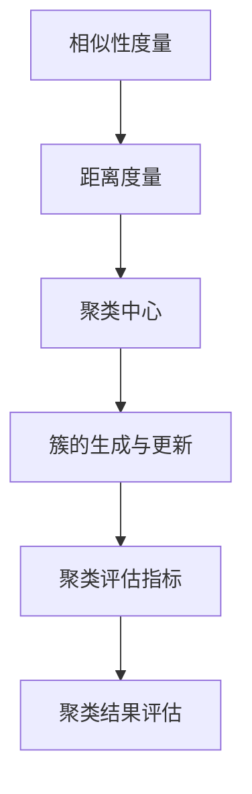

                 

### 文章标题

# 《聚类分析》

### 关键词

- 聚类分析
- K-均值聚类
- 系统聚类
- 层次聚类
- DBSCAN算法
- 密度聚类
- 聚类评估指标
- 聚类应用案例

### 摘要

聚类分析是数据挖掘和机器学习中的重要技术，旨在将相似的数据对象分组。本文详细介绍了聚类分析的基础概念、核心算法及其应用案例，并探讨了聚类分析中的挑战和解决方案。通过对不同聚类方法的比较和分析，本文旨在为读者提供一个全面且深入理解聚类分析的技术指南。

## 《聚类分析》目录大纲

### 第一部分：聚类分析基础

#### 第1章：聚类分析概述

1.1 聚类分析的定义与意义
1.2 聚类分析的基本步骤
1.3 聚类分析的核心概念与联系

#### 第2章：基于距离的聚类方法

2.1 K-均值聚类算法
2.2 系统聚类法
2.3 层次聚类法

#### 第3章：基于密度的聚类方法

3.1 DBSCAN算法
3.2 OPTICS算法
3.3 局部聚类算法

#### 第4章：基于模型的聚类方法

4.1 层次混合模型聚类
4.2 密度混合模型聚类
4.3 确定性聚类模型

#### 第5章：聚类分析应用案例分析

5.1 社交网络用户群体分析
5.2 银行客户细分
5.3 市场细分策略制定

#### 第6章：聚类分析中的挑战与解决方案

6.1 聚类分析中的挑战
6.2 针对挑战的解决方案
6.3 未来发展趋势

#### 第7章：聚类分析工具与资源

7.1 常用聚类分析工具
7.2 聚类分析资源推荐

### 文章正文部分即将展开，敬请期待！<|endoftext|>### 聚类分析概述

聚类分析（Cluster Analysis）是统计学和数据挖掘领域中的一种重要技术，其主要目的是将数据集中的对象根据其相似性进行分组，使得同一组内的对象尽可能相似，而不同组间的对象尽可能不同。这种分组方法在多个领域中都有广泛的应用，包括市场营销、社交网络分析、生物信息学、图像处理等。

#### 1.1 聚类分析的定义与意义

聚类分析的定义相对简单：它是一种无监督学习的方法，通过对数据点进行分组，使得组内数据点之间的相似度较高，组间数据点之间的相似度较低。更具体地说，聚类分析试图找到数据集中的自然分组，这些分组通常基于数据点之间的距离度量、密度分布或其他相似性度量。

聚类分析的意义主要体现在以下几个方面：

1. **数据探索**：通过聚类分析，我们可以直观地了解数据的内在结构和模式，为后续的数据分析和决策提供指导。
2. **特征提取**：在机器学习中，聚类分析可以作为特征提取的一种方法，将高维数据降维到较低维度的空间，从而简化模型训练过程。
3. **模式识别**：在模式识别和图像处理中，聚类分析可以帮助识别和分类数据集中的对象，提高系统的准确性和效率。
4. **市场细分**：在市场营销中，聚类分析可以根据顾客的消费行为和偏好，将顾客分为不同的群体，从而制定有针对性的营销策略。
5. **生物信息学**：在生物信息学中，聚类分析可以帮助识别基因组中的相似序列，进而理解物种之间的关系。

#### 1.2 聚类分析的基本步骤

聚类分析通常包括以下几个基本步骤：

1. **数据预处理**：在聚类分析之前，需要对数据进行清洗、归一化和处理缺失值等操作，以确保数据的质量和一致性。
2. **选择聚类算法**：根据问题的需求和数据的特点，选择合适的聚类算法。常见的聚类算法包括K-均值、层次聚类、DBSCAN等。
3. **初始化聚类中心**：对于一些需要初始化聚类中心的算法，如K-均值，需要随机选择或通过特定的方法初始化聚类中心。
4. **迭代计算**：根据选定的聚类算法，进行迭代计算，更新聚类中心，直到满足收敛条件或达到最大迭代次数。
5. **聚类结果评估**：使用内部评估指标（如轮廓系数、同质性、分离度等）和外部评估指标（如V-measure、NMI等）对聚类结果进行评估和比较。

#### 1.3 聚类分析的核心概念与联系

聚类分析中涉及多个核心概念，以下是对这些概念及其相互关系的概述：

1. **相似性度量**：相似性度量是聚类分析的基础，用于衡量数据点之间的相似度。常用的相似性度量包括欧氏距离、曼哈顿距离、余弦相似度等。
2. **距离度量**：距离度量是相似性度量的具体实现，通常用于计算数据点之间的距离。在聚类分析中，常用的距离度量包括欧氏距离、余弦相似度、切比雪夫距离等。
3. **聚类中心**：聚类中心是聚类算法的核心概念，用于表示每个聚类的中心位置。对于K-均值聚类，聚类中心就是均值；对于层次聚类，聚类中心可以是聚类内部的均值或重心。
4. **簇的生成与更新**：簇的生成与更新是聚类算法的核心操作，通过迭代计算，不断更新聚类中心，直到满足收敛条件。
5. **聚类评估指标**：聚类评估指标用于评估聚类结果的质量，常见的评估指标包括轮廓系数、同质性、分离度、V-measure等。

图1展示了聚类分析中这些核心概念之间的相互关系：



通过上述定义和概念的解释，我们可以对聚类分析有一个初步的了解。在接下来的章节中，我们将详细探讨不同的聚类方法，包括基于距离的聚类方法、基于密度的聚类方法和基于模型的聚类方法，以及它们的实现步骤、优缺点和应用案例。这些内容将帮助我们更深入地理解聚类分析的核心技术和实际应用。

### 基于距离的聚类方法

基于距离的聚类方法在聚类分析中占据重要地位，其主要原理是通过计算数据点之间的距离，来识别和划分数据集。这些方法广泛应用于多种数据类型和场景中，主要包括K-均值聚类、系统聚类和层次聚类。以下是对这些方法的基本原理、实现步骤和优缺点的详细探讨。

#### 2.1 K-均值聚类算法

K-均值聚类算法是一种迭代算法，通过将数据点分配给最近的聚类中心来生成簇。算法的核心思想是最小化簇内数据点到聚类中心的平方距离和。

##### 2.1.1 K-均值算法的基本原理

1. **初始化**：随机选择K个数据点作为初始聚类中心。
2. **分配数据点**：计算每个数据点到各个聚类中心的距离，将数据点分配到最近的聚类中心所在的簇。
3. **更新聚类中心**：重新计算每个簇的质心（均值），作为新的聚类中心。
4. **迭代**：重复步骤2和3，直到聚类中心不再发生变化或达到预定的迭代次数。

##### 2.1.2 K-均值算法的实现步骤

伪代码如下：

```plaintext
初始化K个聚类中心
重复以下步骤直到收敛：
    对于每个数据点，将其分配给最近的聚类中心
    计算新的聚类中心
```

##### 2.1.3 K-均值算法的优缺点

**优点**：

- **简单易实现**：算法实现简单，易于编程和调试。
- **高效性**：在数据量较小的情况下，K-均值聚类算法的计算效率较高。

**缺点**：

- **对初始聚类中心敏感**：算法对初始聚类中心的选择非常敏感，可能导致局部最优解。
- **需要事先指定簇数K**：需要提前指定K值，否则可能导致簇数不合适。
- **不适用于非球形簇**：对于非球形簇，K-均值聚类效果较差。

#### 2.2 系统聚类法

系统聚类法是一种层次聚类方法，通过逐步合并相似度较高的簇，构建一个聚类层次结构。这种方法可以分为层次聚类和合并聚类两种形式。

##### 2.2.1 系统聚类法的基本原理

1. **初始化**：将每个数据点视为一个簇。
2. **计算相似度**：计算簇之间的相似度，通常使用距离度量。
3. **合并簇**：选择相似度最高的两个簇合并，形成新的簇。
4. **迭代**：重复步骤2和3，直到所有数据点合并为一个簇。

##### 2.2.2 系统聚类法的实现步骤

伪代码如下：

```plaintext
将每个数据点视为一个簇
重复以下步骤直到合并为单个簇：
    计算所有簇之间的相似度
    选择相似度最高的两个簇合并
```

##### 2.2.3 系统聚类法的优缺点

**优点**：

- **可以生成聚类层次结构**：系统聚类法可以生成聚类层次结构，便于分析。
- **适用于任意形状的簇**：该方法不要求簇具有特定的形状，因此适用于各种形状的簇。

**缺点**：

- **计算复杂度高**：随着数据点的增加，计算复杂度显著增加。
- **需要指定合并策略**：需要选择合适的相似度计算方法和簇合并策略，否则可能导致结果不理想。

#### 2.3 层次聚类法

层次聚类法是一种自底向上的聚类方法，通过逐步合并相似度较高的簇，构建一个聚类层次结构。与系统聚类法类似，层次聚类法也分为层次聚类和合并聚类两种形式。

##### 2.3.1 层次聚类法的基本原理

1. **初始化**：将每个数据点视为一个簇。
2. **计算相似度**：计算簇之间的相似度，通常使用距离度量。
3. **合并簇**：选择相似度最高的两个簇合并，形成新的簇。
4. **迭代**：重复步骤2和3，直到满足停止条件。

##### 2.3.2 层次聚类法的实现步骤

伪代码如下：

```plaintext
将每个数据点视为一个簇
重复以下步骤直到满足停止条件：
    计算所有簇之间的相似度
    选择相似度最高的两个簇合并
```

##### 2.3.3 层次聚类法的优缺点

**优点**：

- **生成聚类层次结构**：层次聚类法可以生成聚类层次结构，便于分析。
- **无需指定簇数**：该方法无需事先指定簇数，可以根据聚类层次结构选择合适的簇数。

**缺点**：

- **计算复杂度高**：随着数据点的增加，计算复杂度显著增加。
- **对初始簇的选择敏感**：算法对初始簇的选择非常敏感，可能导致局部最优解。

#### 2.4 基于距离的聚类方法比较

基于距离的聚类方法包括K-均值聚类、系统聚类和层次聚类。这些方法在基本原理和实现步骤上有所不同，但都旨在通过计算数据点之间的距离来识别和划分数据集。

- **K-均值聚类**：简单易实现，但需要事先指定簇数，对初始聚类中心敏感，不适用于非球形簇。
- **系统聚类法**：可以生成聚类层次结构，适用于任意形状的簇，但计算复杂度高。
- **层次聚类法**：无需指定簇数，可以生成聚类层次结构，但计算复杂度高，对初始簇的选择敏感。

在实际应用中，选择合适的聚类方法通常取决于数据集的特点和应用需求。通过比较不同方法的基本原理和实现步骤，我们可以更好地理解它们的优缺点，从而为实际应用提供指导。

在下一部分，我们将探讨基于密度的聚类方法，包括DBSCAN算法、OPTICS算法和局部聚类算法，以及它们的实现步骤和优缺点。这些内容将进一步丰富我们对聚类分析的理解和应用。

### 基于密度的聚类方法

基于密度的聚类方法通过探索数据点的密度分布来识别和划分簇。这些方法在处理具有不同形状和大小的簇时表现出色，特别适用于噪声和异常值较多的数据集。以下将详细介绍三种基于密度的聚类方法：DBSCAN算法、OPTICS算法和局部聚类算法。

#### 3.1 DBSCAN算法

DBSCAN（Density-Based Spatial Clustering of Applications with Noise）算法是一种基于密度的聚类方法，它通过扫描数据点的密度分布来发现和识别簇。

##### 3.1.1 DBSCAN算法的基本原理

1. **邻域选择**：对于每个数据点，确定一个邻域半径`eps`，用于识别邻域内的点。
2. **核心点检测**：如果一个点的邻域内的点数大于某个最小数量`minPts`，则该点被认为是核心点。
3. **扩展簇**：对于每个核心点，递归扩展其邻域内的点，形成一个新的簇。
4. **标记噪声点**：无法被扩展成簇的点被标记为噪声点。

##### 3.1.2 DBSCAN算法的实现步骤

伪代码如下：

```plaintext
设置邻域半径eps和最小点数minPts
初始化所有点为未标记
对于每个点p：
    如果p是核心点：
        将p标记为已访问
        扩展p的邻域内的点，形成簇
    否则：
        标记p为噪声点
```

##### 3.1.3 DBSCAN算法的优缺点

**优点**：

- **适用于各种形状和大小的簇**：DBSCAN能够识别任意形状和大小的簇。
- **处理噪声和异常值**：DBSCAN能够处理噪声和异常值，将其标记为噪声点。

**缺点**：

- **对参数敏感**：算法需要指定邻域半径`eps`和最小点数`minPts`，选择不当可能导致聚类效果不理想。
- **计算复杂度高**：随着数据量的增加，DBSCAN的计算复杂度显著增加。

#### 3.2 OPTICS算法

OPTICS（Ordering Points To Identify the Clustering Structure）算法是一种改进的基于密度的聚类方法，它通过引入核心影响半径来减少对参数的敏感性。

##### 3.2.1 OPTICS算法的基本原理

1. **邻域选择**：与DBSCAN类似，确定邻域半径`eps`。
2. **核心点检测**：对于每个点，确定其核心影响半径`min Reachable`，使得邻域内的点都能被其扩展成簇。
3. **扩展簇**：按照核心影响半径递增的顺序扩展点，形成簇。
4. **标记边界点**：无法被扩展成簇的点被标记为边界点。

##### 3.2.2 OPTICS算法的实现步骤

伪代码如下：

```plaintext
设置邻域半径eps
初始化所有点为未访问
计算每个点的核心影响半径
按核心影响半径递增的顺序访问点
对于每个访问到的点p：
    如果p是核心点：
        将p标记为已访问
        扩展p的邻域内的点，形成簇
    否则：
        标记p为边界点
```

##### 3.2.3 OPTICS算法的优缺点

**优点**：

- **减少参数敏感性**：OPTICS通过核心影响半径减少了算法对邻域半径的敏感性。
- **更好的聚类质量**：相比DBSCAN，OPTICS在处理复杂结构的数据时通常能够生成更高质量的聚类结果。

**缺点**：

- **计算复杂度较高**：与DBSCAN类似，OPTICS的计算复杂度较高，特别是对于大数据集。
- **需要预处理**：OPTICS需要先计算核心影响半径，这通常需要额外的预处理时间。

#### 3.3 局部聚类算法

局部聚类算法是一种基于密度的聚类方法，旨在识别局部高密度区域，从而形成簇。它适用于处理具有局部结构或噪声较多的数据集。

##### 3.3.1 局部聚类算法的基本原理

1. **邻域选择**：确定邻域半径`eps`。
2. **核心点检测**：与DBSCAN类似，检测核心点。
3. **扩展簇**：对于每个核心点，递归扩展邻域内的点，形成簇。
4. **合并簇**：根据密度连接原则，合并相邻的高密度区域形成簇。

##### 3.3.2 局部聚类算法的实现步骤

伪代码如下：

```plaintext
设置邻域半径eps
初始化所有点为未标记
对于每个点p：
    如果p是核心点：
        将p标记为已访问
        扩展p的邻域内的点，形成簇
    否则：
        标记p为噪声点
合并相邻的高密度区域形成簇
```

##### 3.3.3 局部聚类算法的优缺点

**优点**：

- **处理局部结构**：局部聚类算法能够识别和合并局部高密度区域，形成具有局部结构的簇。
- **抗噪声能力**：该方法具有较强的抗噪声能力，适用于噪声较多的数据集。

**缺点**：

- **计算复杂度高**：算法的计算复杂度较高，特别是对于大数据集。
- **需要预定义参数**：算法需要预定义邻域半径等参数，选择不当可能导致聚类效果不理想。

#### 3.4 基于密度的聚类方法比较

基于密度的聚类方法包括DBSCAN、OPTICS和局部聚类算法。这些方法在基本原理和实现步骤上有所不同，但都旨在通过探索数据点的密度分布来识别和划分簇。

- **DBSCAN**：适用于各种形状和大小的簇，处理噪声和异常值能力强，但计算复杂度高，对参数敏感。
- **OPTICS**：减少了对邻域半径的敏感性，通常能生成更高质量的聚类结果，但计算复杂度较高。
- **局部聚类算法**：处理局部结构能力强，抗噪声能力较强，但计算复杂度高，需要预定义参数。

在实际应用中，选择合适的聚类方法通常取决于数据集的特点和应用需求。通过比较不同方法的基本原理和实现步骤，我们可以更好地理解它们的优缺点，从而为实际应用提供指导。

在下一部分，我们将探讨基于模型的聚类方法，包括层次混合模型聚类、密度混合模型聚类和确定性聚类模型，以及它们的实现步骤和优缺点。这些内容将进一步丰富我们对聚类分析的理解和应用。

### 基于模型的聚类方法

基于模型的聚类方法通过构建概率模型来识别和划分数据点，使得聚类结果更加鲁棒且具有解释性。这些方法通常基于概率论和统计学的原理，通过估计数据点在簇中的概率分布来识别簇。以下将详细介绍三种基于模型的聚类方法：层次混合模型聚类、密度混合模型聚类和确定性聚类模型。

#### 4.1 层次混合模型聚类

层次混合模型聚类（hierarchical mixture model clustering, HMM）是一种基于概率模型的聚类方法，通过构建层次结构的概率模型来识别簇。该方法将每个簇视为一个高斯分布的混合，并利用层次结构来调整簇的概率分布。

##### 4.1.1 层次混合模型聚类的基本原理

1. **模型构建**：对于每个簇，构建一个高斯分布模型，表示簇内点的概率分布。
2. **层次结构**：利用层次结构来描述簇之间的关系，通常采用贝叶斯网络或决策树。
3. **概率估计**：通过最大似然估计或贝叶斯推理来估计模型参数，并识别每个数据点属于哪个簇。
4. **簇调整**：利用层次结构调整簇的概率分布，使得聚类结果更加稳定和准确。

##### 4.1.2 层次混合模型聚类的实现步骤

伪代码如下：

```plaintext
初始化模型参数
重复以下步骤直到收敛：
    估计模型参数
    更新簇的概率分布
    调整簇的层次结构
```

##### 4.1.3 层次混合模型聚类的优缺点

**优点**：

- **解释性**：层次混合模型聚类能够提供簇的概率分布和层次结构，使得聚类结果具有较好的解释性。
- **稳定性**：通过调整簇的层次结构，聚类结果具有较强的稳定性。

**缺点**：

- **计算复杂度高**：模型参数估计和簇调整过程涉及复杂的迭代计算，计算复杂度较高。
- **对数据规模敏感**：在大数据集上，该方法可能需要较长时间来收敛。

#### 4.2 密度混合模型聚类

密度混合模型聚类（density-based mixture model clustering, DBMMC）是一种基于概率密度函数的聚类方法，通过构建数据点的概率密度分布来识别簇。该方法将每个簇视为多个高斯分布的混合，并利用密度估计来识别簇。

##### 4.2.1 密度混合模型聚类的基本原理

1. **密度估计**：通过核密度估计或高斯混合模型来估计数据点的概率密度分布。
2. **簇识别**：通过比较数据点的密度分布，识别出不同的簇。
3. **簇合并**：利用簇之间的相似度度量，合并相似度较高的簇。

##### 4.2.2 密度混合模型聚类的实现步骤

伪代码如下：

```plaintext
初始化模型参数
重复以下步骤直到收敛：
    估计数据点的密度分布
    识别簇
    合并相似度较高的簇
```

##### 4.2.3 密度混合模型聚类的优缺点

**优点**：

- **适应性**：密度混合模型聚类能够适应不同形状和大小的簇。
- **抗噪声能力**：通过密度估计，能够较好地处理噪声和异常值。

**缺点**：

- **计算复杂度高**：密度估计和簇合并过程涉及复杂的计算，计算复杂度较高。
- **对参数敏感**：模型参数的选择对聚类结果有较大影响。

#### 4.3 确定性聚类模型

确定性聚类模型（deterministic clustering model）是一种基于确定性规则的聚类方法，通过构建决策树或规则集来识别簇。该方法通常基于特征的重要性和阈值，将数据点分配到不同的簇。

##### 4.3.1 确定性聚类模型的基本原理

1. **特征选择**：选择对聚类结果影响较大的特征。
2. **阈值设置**：根据特征值设置阈值，将数据点分配到不同的簇。
3. **规则构建**：利用特征值和阈值构建决策树或规则集，以确定每个数据点的簇归属。

##### 4.3.2 确定性聚类模型的实现步骤

伪代码如下：

```plaintext
选择特征
设置阈值
构建决策树或规则集
将数据点分配到簇
```

##### 4.3.3 确定性聚类模型的优缺点

**优点**：

- **简单易实现**：确定性聚类模型通常较为简单，易于实现和调试。
- **解释性**：模型规则清晰，聚类结果具有较好的解释性。

**缺点**：

- **适应性较差**：确定性聚类模型对数据集的适应性较差，可能无法处理复杂结构的数据。
- **计算复杂度较高**：在特征较多或数据点较多的情况下，构建决策树或规则集可能需要较高计算资源。

#### 4.4 基于模型的聚类方法比较

基于模型的聚类方法包括层次混合模型聚类、密度混合模型聚类和确定性聚类模型。这些方法在基本原理和实现步骤上有所不同，但都旨在通过构建概率模型或规则集来识别和划分簇。

- **层次混合模型聚类**：解释性强，稳定性好，但计算复杂度高。
- **密度混合模型聚类**：适应性较强，抗噪声能力较好，但计算复杂度高。
- **确定性聚类模型**：简单易实现，解释性较好，但适应性较差。

在实际应用中，选择合适的聚类方法通常取决于数据集的特点和应用需求。通过比较不同方法的基本原理和实现步骤，我们可以更好地理解它们的优缺点，从而为实际应用提供指导。

在下一部分，我们将通过实际应用案例，展示聚类分析在不同领域的应用场景，以及如何使用不同的聚类方法进行数据分析和决策。

### 聚类分析应用案例分析

聚类分析在多个领域都有广泛的应用，通过将数据点分组，可以揭示数据中的潜在模式和结构。以下将介绍三个具体的应用案例：社交网络用户群体分析、银行客户细分和市场细分策略制定，展示如何使用聚类分析进行数据分析和决策。

#### 5.1 社交网络用户群体分析

社交网络平台中，用户行为数据丰富且复杂，通过聚类分析可以揭示用户群体的特征，为营销策略提供依据。以下是一个社交网络用户群体分析的案例：

##### 5.1.1 数据来源与预处理

- **数据来源**：某大型社交网络平台，收集了用户的基本信息（年龄、性别、地理位置）、用户行为数据（帖子发布次数、互动次数、关注人数）和用户偏好数据（喜欢的音乐、电影、书籍）。
- **预处理**：清洗数据，处理缺失值，对数值型数据进行归一化处理，以便后续分析。

##### 5.1.2 聚类算法选择与实现

选择K-均值聚类算法，因为其实现简单且易于理解。根据数据特点和需求，设定簇数为5，通过交叉验证选择最优的簇数。

```python
from sklearn.cluster import KMeans
from sklearn.preprocessing import StandardScaler

# 数据归一化
data = StandardScaler().fit_transform(data)

# K-均值聚类
kmeans = KMeans(n_clusters=5, init='k-means++', max_iter=300, n_init=10, random_state=0)
labels = kmeans.fit_predict(data)

# 聚类结果
print("Cluster labels:", labels)
```

##### 5.1.3 聚类结果分析

聚类结果将用户分为5个不同的群体，如下：

- **活跃用户群**：具有较高的帖子发布次数和互动次数，可能对社交网络平台的活跃度有较大贡献。
- **沉默用户群**：帖子发布次数和互动次数较低，可能对平台活跃度影响较小。
- **偏好多样化用户群**：对多种兴趣有较高偏好，可能具有较高的用户粘性。
- **地理位置集中用户群**：主要集中在某一地理位置，可能对本地营销活动有较好的响应。
- **沉默偏好用户群**：帖子发布次数低，但偏好数据丰富，可能对个性化推荐有较好反应。

通过聚类结果分析，可以制定有针对性的营销策略，如对活跃用户群提供更多互动机会，对沉默用户群进行个性化推荐，以提高用户活跃度和满意度。

#### 5.2 银行客户细分

银行客户细分是银行业务中的一项重要工作，通过聚类分析可以识别不同类型的客户，为营销策略和服务改进提供支持。以下是一个银行客户细分的案例：

##### 5.2.1 数据来源与预处理

- **数据来源**：某银行客户数据，包括客户的年龄、收入、贷款金额、信用卡消费额度、账户余额等。
- **预处理**：清洗数据，处理缺失值，对数值型数据进行归一化处理，以便后续分析。

##### 5.2.2 聚类算法选择与实现

选择DBSCAN算法，因为它能够处理非球形簇，适用于客户行为多样化且存在噪声的数据集。

```python
from sklearn.cluster import DBSCAN
from sklearn.preprocessing import StandardScaler

# 数据归一化
data = StandardScaler().fit_transform(data)

# DBSCAN聚类
dbscan = DBSCAN(eps=0.5, min_samples=10)
labels = dbscan.fit_predict(data)

# 聚类结果
print("Cluster labels:", labels)
```

##### 5.2.3 聚类结果分析

聚类结果将客户分为多个不同的群体，如下：

- **高收入客户群**：具有较高的收入和贷款金额，可能对高端金融产品有较高需求。
- **低收入客户群**：收入较低，但对银行服务的需求较多，可能对小额贷款和储蓄产品有较高兴趣。
- **频繁贷款客户群**：频繁使用贷款，可能对贷款服务和利率敏感。
- **低消费客户群**：信用卡消费额度较低，可能对理财产品和储蓄产品有较高需求。
- **沉默客户群**：账户活动较少，可能需要更多营销活动以提高活跃度。

通过聚类结果分析，银行可以针对不同类型的客户制定差异化的营销策略，如对高收入客户提供定制化理财产品，对低收入客户提供小额贷款优惠，以提高客户满意度和忠诚度。

#### 5.3 市场细分策略制定

市场细分是市场营销中的一项关键任务，通过聚类分析可以识别不同市场的需求，为制定有效的市场策略提供依据。以下是一个市场细分策略制定的案例：

##### 5.3.1 数据来源与预处理

- **数据来源**：某电子产品公司市场调查数据，包括消费者的年龄、收入、购买频率、品牌偏好等。
- **预处理**：清洗数据，处理缺失值，对数值型数据进行归一化处理，以便后续分析。

##### 5.3.2 聚类算法选择与实现

选择K-均值聚类算法，因为它实现简单且适用于大多数市场细分场景。

```python
from sklearn.cluster import KMeans
from sklearn.preprocessing import StandardScaler

# 数据归一化
data = StandardScaler().fit_transform(data)

# K-均值聚类
kmeans = KMeans(n_clusters=4, init='k-means++', max_iter=300, n_init=10, random_state=0)
labels = kmeans.fit_predict(data)

# 聚类结果
print("Cluster labels:", labels)
```

##### 5.3.3 聚类结果分析

聚类结果将消费者分为4个不同的市场细分，如下：

- **高端市场**：收入较高，购买频率高，对品牌有较高要求。
- **主流市场**：收入中等，购买频率适中，对价格敏感。
- **入门市场**：收入较低，购买频率较低，对价格非常敏感。
- **新兴市场**：年轻消费者，购买频率高，对新兴技术和产品有较高兴趣。

通过聚类结果分析，公司可以针对不同市场制定差异化的营销策略，如对高端市场提供定制化产品，对主流市场提供性价比高的产品，对入门市场和新兴市场提供更具吸引力的促销活动，以提高市场占有率和销售业绩。

通过以上三个应用案例，我们可以看到聚类分析在数据分析和决策支持中的重要作用。通过合理的聚类方法和算法选择，可以有效地揭示数据中的潜在模式和结构，为实际应用提供有力的支持。

### 聚类分析中的挑战与解决方案

尽管聚类分析在数据挖掘和机器学习领域具有广泛的应用，但它也面临一些挑战和限制。以下将讨论聚类分析中的几个主要挑战，并探讨相应的解决方案。

#### 6.1 数据不平衡问题

数据不平衡是指数据集中某些类别的样本数量远远多于其他类别。在聚类分析中，数据不平衡可能导致以下问题：

1. **簇的识别困难**：当某些簇的样本数量非常少时，算法可能难以识别这些小簇。
2. **聚类结果不均衡**：大多数聚类方法旨在最小化簇内的距离，数据不平衡可能导致大多数簇包含大量样本，而少量样本的簇被忽视。

**解决方案**：

- **调整聚类算法参数**：一些聚类算法（如K-均值）允许调整簇的数量，可以通过增加簇的数量来补偿样本数量不平衡。
- **重采样技术**：使用重采样技术，如随机 oversampling（增加少数类别的样本）或随机 undersampling（减少多数类别的样本），来平衡数据集。
- **基于密度的聚类方法**：基于密度的聚类方法（如DBSCAN）对样本数量的不平衡有更好的适应性，因为它们依赖于数据点的密度分布。

#### 6.2 聚类结果解释性差

聚类分析的输出通常是未解释的簇，这可能导致以下问题：

1. **难以理解**：聚类结果的解释性差，使得用户难以理解每个簇的意义。
2. **缺乏业务价值**：解释性差的聚类结果可能无法为业务决策提供有用的信息。

**解决方案**：

- **可视化技术**：使用可视化工具（如散点图、条形图、热力图）来展示聚类结果，帮助用户理解簇的结构和特征。
- **标签和注释**：为每个簇分配标签或注释，以便更好地解释每个簇的特征。
- **基于规则的解释**：使用规则或决策树来解释聚类结果，使得聚类结果具有更好的可解释性。

#### 6.3 聚类算法可扩展性问题

随着数据集规模的增加，聚类算法的可扩展性成为一个重要问题。以下是一些解决方案：

1. **并行和分布式计算**：使用并行和分布式计算框架（如MapReduce、Spark）来加速聚类算法的执行。
2. **采样和子集技术**：通过采样或使用数据子集来减小计算规模，从而提高算法的可扩展性。
3. **增量聚类**：使用增量聚类算法，逐步添加数据点或簇，而不是一次性处理整个数据集。

#### 6.4 未来发展趋势

聚类分析在未来的发展中有几个关键方向：

1. **深度学习与聚类分析的结合**：深度学习模型（如自编码器、生成对抗网络）可以用于特征提取和聚类，从而提高聚类结果的质量。
2. **实时聚类分析**：随着实时数据处理技术的发展，实时聚类分析成为可能，为实时决策提供支持。
3. **跨学科的聚类分析方法**：结合生物学、物理学、社会学等领域的知识，开发新的聚类方法来处理特定的数据类型和问题。

通过解决这些挑战，并探索未来的发展趋势，聚类分析将在数据挖掘和机器学习领域继续发挥重要作用，为各行业提供更有价值的分析和决策支持。

### 聚类分析工具与资源

在聚类分析的实际应用中，选择合适的工具和资源是至关重要的。以下将介绍几种常用的聚类分析工具，并提供相关的学术论文、书籍、在线课程和社区推荐，以帮助读者更好地理解和应用聚类分析技术。

#### 7.1 常用聚类分析工具

1. **Python中的聚类库**
   - **scikit-learn**：scikit-learn是一个广泛使用的Python库，提供了多种聚类算法的实现，包括K-均值、层次聚类、DBSCAN等。
     - 官网：[scikit-learn官网](https://scikit-learn.org/stable/)

   - **Pandas**：Pandas是一个数据处理库，提供了数据处理和数据分析的强大功能，常用于聚类前的数据预处理。
     - 官网：[Pandas官网](https://pandas.pydata.org/)

2. **R语言中的聚类库**
   - **cluster**：cluster包提供了多种聚类算法的实现，包括K-均值、层次聚类、DBSCAN等，并提供了聚类结果评估的函数。
     - 官网：[cluster包官网](https://cran.r-project.org/web/packages/cluster/)

   - **famm**：famm包提供了一个基于混合模型的多层次聚类方法，适用于复杂的数据集。
     - 官网：[famm包官网](https://cran.r-project.org/web/packages/famm/)

3. **其他常用聚类工具**
   - **MATLAB**：MATLAB提供了丰富的机器学习和数据挖掘工具箱，包括聚类算法的实现和可视化工具。
     - 官网：[MATLAB机器学习工具箱](https://www.mathworks.com/products/matlab/built-in-toolboxes.html?mp=115)

   - **Weka**：Weka是一个开源的机器学习工具集，提供了多种聚类算法的实现和评估工具，适合数据挖掘初学者使用。
     - 官网：[Weka官网](https://www.cs.waikato.ac.nz/ml/weka/)

#### 7.2 聚类分析资源推荐

1. **学术论文与书籍推荐**
   - 《聚类分析：算法与应用》
     - 作者：陈宝权、刘铁岩
     - 简介：本书详细介绍了多种聚类算法的基本原理和实现，包括基于距离、密度和模型的聚类方法，适合初学者和研究者。
     
   - 《数据挖掘：实用聚类技术》
     - 作者：何炎祥、郭毅
     - 简介：本书涵盖了聚类分析的基本概念、算法和实际应用案例，适合数据挖掘和机器学习领域的读者。

2. **在线课程与研讨会推荐**
   - **Coursera**：Coursera提供了多个关于聚类分析和数据挖掘的课程，包括“机器学习”、“数据科学”等。
     - 官网：[Coursera在线课程](https://www.coursera.org/courses?query=clustering)

   - **edX**：edX提供了由顶尖大学和机构提供的免费在线课程，包括“数据科学基础”、“机器学习导论”等。
     - 官网：[edX在线课程](https://www.edx.org/course/search?search:data+science=1)

3. **社区与论坛推荐**
   - **Stack Overflow**：Stack Overflow是一个编程问答社区，许多关于聚类分析的问题和解决方案在此平台上讨论。
     - 官网：[Stack Overflow](https://stackoverflow.com/questions/tagged/clustering)

   - **Kaggle**：Kaggle是一个数据科学竞赛平台，用户可以在此平台上参与聚类分析相关的竞赛，并获得实践经验。
     - 官网：[Kaggle](https://www.kaggle.com/)

通过这些工具和资源的推荐，读者可以更好地学习和应用聚类分析技术，从而在数据分析和决策支持中取得更好的成果。

