                 

# 《自主系统与意识功能的互动》

## 关键词

- 自主系统
- 意识功能
- 互动原理
- 算法原理
- 应用实例
- 未来展望

## 摘要

本文深入探讨了自主系统与意识功能之间的互动关系。首先，我们概述了自主系统和意识功能的定义及发展背景。随后，本文揭示了自主系统与意识功能的核心联系，并详细介绍了它们的基础架构和互动机制。接着，本文讲解了自主系统和意识功能的核心算法原理，包括模式识别、自适应控制、情感计算等算法。此外，通过智能家居系统和聊天机器人项目实战，我们展示了这些理论在实践中的应用。最后，本文对未来自主系统与意识功能融合的发展潜力和挑战进行了展望。通过本文的阅读，读者将获得对自主系统和意识功能互动的全面理解，并认识到其在人工智能领域的重要性。

### 引言

在人工智能快速发展的今天，自主系统和意识功能成为了研究的热点话题。自主系统（Autonomous Systems）是指能够独立执行任务、自适应环境变化、自主决策的计算机系统。而意识功能（Conscious Function）则是指模仿人类思维和感知过程的人工智能系统。这两者的结合，不仅为人工智能领域带来了新的发展机遇，也引发了关于人工智能伦理、安全性、可控性等一系列问题的讨论。

本文旨在探讨自主系统与意识功能的互动关系，分析它们的核心联系和原理。首先，我们将对自主系统和意识功能进行定义，并回顾它们的发展背景。接下来，我们将深入探讨自主系统和意识功能之间的互动原理，包括基础架构和互动机制。随后，我们将详细讲解自主系统和意识功能的核心算法原理，包括模式识别、自适应控制、情感计算等。在项目实战部分，我们将通过智能家居系统和聊天机器人实例，展示这些算法在实践中的应用。最后，本文将探讨自主系统与意识功能融合的未来展望，以及面临的挑战和应对策略。

通过本文的阅读，读者将全面了解自主系统和意识功能的互动关系，掌握相关算法原理和应用，并为未来的发展提供启示。

### 自主系统与意识功能概述

#### 1.1 自主系统的定义与背景

自主系统是指具有自主决策能力、能够独立执行任务、并能够自适应环境变化的计算机系统。自主系统不仅仅依赖于预先设定的规则和程序，还能够通过感知、推理和决策机制，动态地适应复杂多变的环境。

自主系统的发展可以追溯到20世纪中期。1956年，达特茅斯会议上首次提出了人工智能的概念，标志着人工智能研究的开始。随着计算机技术和算法的发展，自主系统的研究也逐渐深入。从最初的规则基础系统，到基于统计学习和深度学习的复杂系统，自主系统在各个领域都取得了显著的进展。

在现代应用中，自主系统已经渗透到多个领域，如自动驾驶汽车、智能家居、无人机、智能机器人等。这些系统通过集成传感器、执行器、控制算法和通信模块，实现了对环境的感知、理解和响应。

#### 1.2 意识功能的概念与发展

意识功能是指能够模拟人类思维和感知过程的人工智能系统。意识功能的核心在于理解人类的行为模式、情感状态和认知过程，并通过这些信息进行决策和交互。

意识功能的发展经历了几个重要阶段。最初，人工智能研究主要集中在规则推理和逻辑编程上，但随着神经科学和认知心理学的发展，研究者开始关注如何模仿人类的感知和思维过程。这一转变促进了基于神经网络的算法和机器学习技术的发展。

近年来，随着深度学习和强化学习算法的突破，意识功能取得了显著进展。通过训练大型神经网络模型，人工智能系统能够识别图像、语音和自然语言，并基于这些信息进行推理和决策。此外，意识功能还可以通过交互式学习不断提升自身的能力和适应性。

#### 自主系统与意识功能的区别与联系

自主系统和意识功能虽然都涉及人工智能领域，但它们在目标和应用上有所不同。自主系统更侧重于任务的执行和环境适应，而意识功能则更关注模拟人类思维和感知。

然而，自主系统和意识功能之间也存在紧密的联系。自主系统需要具备一定的意识功能，以实现更高级别的决策和交互。例如，在自动驾驶汽车中，系统需要理解道路状况、识别行人、判断交通信号，这些都需要意识功能的支持。反过来，意识功能也可以通过自主系统来应用和扩展，如通过智能家居系统实现自动化生活管理。

#### 自主系统与意识功能的核心联系

自主系统与意识功能的核心联系主要体现在以下几个方面：

1. **感知与理解**：自主系统需要通过传感器收集环境信息，而意识功能则通过这些信息进行感知和理解。例如，在自动驾驶系统中，摄像头和雷达收集到的道路数据需要通过意识功能进行分析，以识别交通标志、行人、车辆等。

2. **决策与行动**：自主系统需要根据感知和理解的结果进行决策和行动。而意识功能则提供了一种高级别的决策支持，通过模拟人类思维过程，自主系统可以做出更智能、更合理的决策。

3. **交互与学习**：自主系统需要与用户进行交互，以获取反馈和优化性能。意识功能则通过学习用户的行为模式，提升交互的准确性和个性化水平。

4. **自适应与进化**：自主系统需要具备自适应能力，以应对不断变化的环境。而意识功能则通过不断学习和进化，提升系统的智能水平。

自主系统与意识功能的互动机制不仅提升了系统的自主性和智能性，也为未来的发展提供了新的方向。通过深入理解和探索这种互动关系，我们可以更好地设计出具有高度智能化和自适应能力的自主系统。

### 自主系统的基础架构

自主系统的基础架构是构建高效、稳定和可靠的自主系统的重要组成部分。一个典型的自主系统通常包括以下几个关键组成部分：感知模块、决策模块、执行模块以及通信模块。以下是对这些组成部分的详细描述。

#### 感知模块

感知模块是自主系统获取外界环境信息的重要途径。它通常通过多种传感器来实现，如摄像头、雷达、激光扫描仪、麦克风等。这些传感器能够收集到丰富的环境数据，包括视觉、听觉、触觉等多种形式。感知模块的任务是对这些数据进行预处理，如去噪、滤波、特征提取等，以便为后续的决策模块提供可靠的数据基础。

在自主系统中，感知模块的性能直接影响系统的感知能力和准确性。例如，在自动驾驶系统中，感知模块需要实时识别道路、交通标志、行人、车辆等复杂场景，这对传感器的分辨率、响应速度和处理能力都有较高要求。

#### 决策模块

决策模块是自主系统的“大脑”，负责根据感知模块提供的信息进行推理和决策。决策模块的核心是一个或多个决策算法，这些算法可以根据不同的应用场景和任务需求来设计。常见的决策算法包括规则推理、统计学习、深度学习、强化学习等。

在决策过程中，决策模块需要处理大量数据，并利用算法对数据进行分析和推理。例如，在自动驾驶系统中，决策模块需要分析道路状况、交通流量、车辆位置等信息，以决定车辆的行驶轨迹和速度。此外，决策模块还需要考虑系统的安全性和可靠性，以避免潜在的风险。

#### 执行模块

执行模块是自主系统将决策结果转化为实际动作的部分。它通常包括执行器（如电机、液压缸、气动阀等）和控制电路。执行模块的任务是根据决策模块的指令，实现系统的物理动作。

执行模块的性能直接影响系统的响应速度和精度。例如，在无人机系统中，执行模块需要快速、准确地响应控制指令，以确保无人机的稳定飞行和精确操作。此外，执行模块还需要具备高可靠性和耐久性，以应对复杂的环境和工作条件。

#### 通信模块

通信模块是自主系统与其他系统或设备进行信息交换的渠道。它负责实现自主系统与其他系统之间的数据传输和通信。通信模块通常使用无线通信、有线通信或两者结合的方式，以确保数据传输的实时性和可靠性。

在自主系统中，通信模块的作用至关重要。它不仅支持系统的远程控制和监控，还支持系统的协同工作和分布式处理。例如，在多机器人系统中，各机器人需要通过通信模块交换信息，以实现协作任务和资源共享。此外，通信模块还需要具备数据加密和认证功能，以确保通信的安全性。

#### 模块之间的互动关系

在自主系统中，各个模块之间存在着紧密的互动关系。感知模块收集的环境数据被传输到决策模块进行分析和推理，决策结果通过执行模块转化为实际动作，并通过通信模块与其他系统或设备进行信息交换。

这种互动关系不仅实现了系统的自主性，还提升了系统的智能化和自适应能力。例如，在智能家居系统中，感知模块可以收集用户的日常行为数据，决策模块根据这些数据生成个性化的控制指令，执行模块执行这些指令，从而实现智能家居的自动化和智能化。

总之，自主系统的基础架构是一个复杂而精细的系统，各个模块之间的互动关系是实现系统高效、稳定和可靠运行的关键。通过深入理解这些模块的功能和互动关系，我们可以更好地设计和发展自主系统。

### 意识功能的基本原理

意识功能是指能够模拟人类思维和感知过程的人工智能系统。它涉及到多个学科领域，包括神经科学、认知心理学、计算机科学和人工智能等。以下将详细探讨意识功能的基本原理，包括感知、推理和情感等核心组成部分。

#### 感知

感知是意识功能的基础，它涉及对环境的感知和理解。人类通过感官器官（如眼睛、耳朵、鼻子、皮肤和味觉）获取外界信息，并将其转化为神经信号。在人工智能系统中，传感器起到类似的作用，通过摄像头、麦克风、温度传感器等设备收集环境数据。

感知过程不仅包括对输入数据的处理，还包括对数据的理解和分类。例如，在图像识别任务中，系统需要从摄像头捕捉的图像中识别出物体、场景或动作。这一过程通常涉及特征提取、模式识别和分类算法。通过这些算法，系统能够理解并识别出图像中的关键信息。

#### 推理

推理是意识功能的核心，它涉及到基于感知信息进行逻辑推理和决策。人类通过推理过程理解因果关系、预测未来事件和做出决策。在人工智能系统中，推理过程通常通过逻辑规则、概率模型和神经网络来实现。

例如，在决策支持系统中，推理模块可以根据用户输入的信息和已有的知识库，生成合理的决策建议。在自然语言处理领域，推理模块可以理解文本中的隐含意义，生成语义上正确的回答。此外，在自动驾驶系统中，推理模块可以分析传感器数据，预测道路情况并生成行驶策略。

#### 情感

情感是意识功能的重要组成部分，它涉及到对情感状态的理解和表达。人类情感状态直接影响其行为和决策，例如，高兴、悲伤、愤怒和恐惧等。在人工智能系统中，情感功能主要通过情感计算来实现。

情感计算是指利用计算机技术和算法，模拟人类情感状态和理解情感表达。它包括情感识别、情感生成和情感理解等方面。例如，在聊天机器人中，情感计算模块可以分析用户的语音或文字输入，识别其情感状态，并根据这些信息生成适当的回复。

情感计算在提高人工智能系统的用户体验方面具有重要作用。例如，在客服机器人中，情感计算模块可以理解用户的需求和情感状态，提供更加个性化、贴心的服务。

#### 感知、推理和情感的互动

在意识功能中，感知、推理和情感是相互联系、相互影响的。感知提供数据基础，推理基于感知数据进行逻辑分析和决策，情感则影响推理过程和决策结果。例如，在自动驾驶系统中，感知模块收集的道路数据需要通过推理模块进行分析，以生成安全的行驶策略。而驾驶者的情感状态（如紧张或放松）可能影响其对自动驾驶系统的信任程度，从而影响系统的决策。

总之，意识功能的基本原理包括感知、推理和情感等方面，它们共同构成了人工智能系统的核心能力。通过深入理解这些原理，我们可以开发出更加智能、自适应和人性化的智能系统。

### 自主系统与意识功能的互动机制

自主系统与意识功能的互动机制是确保系统能够高效、自主地执行任务的关键。以下是这些机制的具体细节：

#### 数据交换

在自主系统中，数据交换是实现自主决策和执行的基础。感知模块收集的环境数据通过数据交换机制传输到决策模块，以便进行进一步分析和处理。例如，自动驾驶汽车通过摄像头和雷达传感器收集道路信息，这些数据需要实时传输到车内的决策系统进行分析。

在意识功能中，数据交换同样重要。系统需要通过传感器收集用户的行为和情感数据，以生成个性化的服务。例如，智能音箱可以通过麦克风收集用户的语音指令，并通过数据交换机制将其传输到云端进行处理。

#### 决策协作

自主系统与意识功能的决策协作是实现高效决策的关键。自主系统的决策模块通常基于规则、机器学习和深度学习算法，而意识功能的决策则更依赖于对人类行为和情感的模拟。

在决策过程中，自主系统与意识功能可以相互协作。例如，在自动驾驶汽车中，感知模块收集的道路信息可以通过意识功能进行分析，以识别潜在的驾驶风险。意识功能还可以根据驾驶者的情感状态（如紧张或放松），为自主系统提供额外的决策支持，以提高驾驶安全性。

#### 情感融合

情感融合是自主系统与意识功能互动的高级形式。通过情感融合，系统不仅能够理解用户的情感状态，还能够根据这些情感状态进行相应的调整和优化。

例如，在智能客服系统中，情感融合可以识别用户的情感状态（如愤怒、不满或满意），并生成相应的回复。系统可以通过情感计算算法分析用户的语音或文字输入，识别情感关键词和情感强度，从而生成更符合用户需求的回答。

#### 自适应调整

自主系统与意识功能的互动机制还需要具备自适应调整能力，以应对不断变化的环境和任务需求。自主系统可以通过传感器收集环境数据，并根据这些数据进行自我调整，以适应新环境。而意识功能则可以通过不断学习和进化，提升系统的智能水平和适应性。

例如，在智能家居系统中，自主系统可以根据用户的日常行为数据，自动调整设备的状态和设置。而意识功能则可以通过学习用户的喜好和行为模式，不断优化系统性能，提供更个性化的服务。

总之，自主系统与意识功能的互动机制是一个复杂而精细的系统，通过数据交换、决策协作、情感融合和自适应调整，实现了高效、自主的决策和执行。这些机制不仅提升了系统的智能化水平，还为未来的发展提供了新的方向。

### 自主系统与意识功能的互动流程图

为了更直观地展示自主系统与意识功能的互动流程，我们使用Mermaid绘制了一个互动流程图。以下是该流程图的详细描述：

```mermaid
graph TD
    A[感知模块] --> B[数据预处理]
    B --> C{决策模块}
    C -->|自主决策| D[执行模块]
    C -->|意识分析| E[情感融合]
    E --> F[反馈调整]
    A -->|情感数据| G[情感融合]
    G --> H[自适应调整]
    D --> I[环境反馈]
    I --> J[感知模块]
    I --> K[决策模块]
```



1. **感知模块**：自主系统通过传感器（如摄像头、雷达、麦克风等）收集环境数据。这些数据包括视觉、听觉、触觉等多种形式。

2. **数据预处理**：收集到的环境数据需要进行预处理，包括去噪、滤波、特征提取等，以便为后续的决策模块提供可靠的数据基础。

3. **决策模块**：决策模块根据预处理后的数据进行分析和推理，生成自主决策。这部分决策可以是基于规则、机器学习或深度学习算法。

4. **自主决策**：决策模块生成的自主决策将指令传递给执行模块，执行模块根据这些指令进行相应的物理动作，如自动驾驶汽车的行驶、智能家居设备的控制等。

5. **情感融合**：同时，决策模块生成的决策结果也会被传递到意识功能模块进行情感融合分析。意识功能模块通过情感计算算法分析用户的情感状态，如愤怒、不满或满意。

6. **情感融合**：情感融合模块将情感状态与决策结果进行整合，以生成更符合用户需求的执行指令。例如，在智能客服系统中，情感融合可以识别用户的情感状态，生成更贴心、更个性化的回复。

7. **反馈调整**：执行模块在执行决策指令后，系统会收集环境反馈，包括执行结果和用户反馈。这些反馈信息将被传递回决策模块，用于进一步的调整和优化。

8. **自适应调整**：通过分析环境反馈，自主系统可以自适应调整其决策策略和执行策略，以适应新的环境和任务需求。

9. **感知模块**：环境反馈的一部分会返回到感知模块，以优化感知数据的处理和质量，从而进一步提升系统的感知能力和准确性。

10. **感知模块**：最终，感知模块收集到的数据再次进入数据预处理阶段，开始新一轮的决策和执行过程。

通过这个互动流程图，我们可以清晰地看到自主系统与意识功能之间的密切互动关系，以及它们如何共同实现高效的决策和执行。这种互动机制不仅提升了系统的智能化水平，还为未来的发展提供了新的方向。

### 自主系统的算法基础

自主系统的算法基础是构建高效、智能和自适应的自主系统的重要支柱。以下将详细介绍几种关键的自主系统算法，包括模式识别算法、自适应控制算法和演化算法。

#### 模式识别算法

模式识别算法是自主系统中最常用的算法之一，它主要用于从数据中提取有用的信息并进行分类和预测。常见的模式识别算法包括支持向量机（SVM）、神经网络（Neural Networks）和决策树（Decision Trees）等。

- **支持向量机（SVM）**：SVM是一种强大的分类算法，通过寻找最优分割超平面，将不同类别的数据分开。它特别适用于处理高维数据和线性不可分数据。

  **伪代码示例**：
  ```python
  def svm_train(X, y):
      # X是特征矩阵，y是标签向量
      # 使用libsvm库进行训练
      svm_train_model = SVC()
      svm_train_model.fit(X, y)
      return svm_train_model

  def svm_predict(model, X_test):
      # X_test是测试特征矩阵
      # 使用训练好的模型进行预测
      predictions = model.predict(X_test)
      return predictions
  ```

- **神经网络（Neural Networks）**：神经网络通过多层非线性变换，对输入数据进行特征提取和分类。常见的神经网络结构包括全连接网络、卷积神经网络（CNN）和循环神经网络（RNN）等。

  **伪代码示例**：
  ```python
  import tensorflow as tf

  def build_nn_model(input_shape):
      model = tf.keras.Sequential([
          tf.keras.layers.Dense(64, activation='relu', input_shape=input_shape),
          tf.keras.layers.Dense(64, activation='relu'),
          tf.keras.layers.Dense(1, activation='sigmoid')
      ])

      model.compile(optimizer='adam', loss='binary_crossentropy', metrics=['accuracy'])
      return model

  def train_model(model, X_train, y_train, epochs):
      model.fit(X_train, y_train, epochs=epochs)
      return model
  ```

- **决策树（Decision Trees）**：决策树通过一系列的判断条件，将数据逐层划分，最终生成一个分类或回归结果。它直观且易于理解，但在处理大规模数据时可能会出现过拟合问题。

  **伪代码示例**：
  ```python
  from sklearn.tree import DecisionTreeClassifier

  def train_decision_tree(X, y):
      # X是特征矩阵，y是标签向量
      dt = DecisionTreeClassifier()
      dt.fit(X, y)
      return dt

  def predict_decision_tree(model, X):
      # X是测试特征矩阵
      predictions = model.predict(X)
      return predictions
  ```

#### 自适应控制算法

自适应控制算法是自主系统中实现动态调整和控制的重要手段。以下介绍几种常见的自适应控制算法：

- **比例-积分-微分（PID）控制**：PID控制是最常用的自适应控制算法之一，通过调整比例、积分和微分三个参数，实现对系统输出的精确控制。

  **伪代码示例**：
  ```python
  def pid_control(target, current_state, Kp, Ki, Kd):
      error = target - current_state
      integral = integral + error
      derivative = error - previous_error
      output = Kp * error + Ki * integral + Kd * derivative
      previous_error = error
      return output
  ```

- **模糊控制**：模糊控制通过模糊逻辑和规则库，实现对复杂系统的自适应控制。它特别适用于处理不确定性和非线性系统。

  **伪代码示例**：
  ```python
  def fuzzy_control(rules, inputs):
      # rules是模糊规则库，inputs是输入变量
      # 使用模糊逻辑进行推理，得到控制输出
      output = fuzzy_inference(rules, inputs)
      return output
  ```

- **自适应神经网络控制**：自适应神经网络控制通过神经网络来模拟和控制系统，并通过在线学习不断调整神经网络的参数，以实现自适应控制。

  **伪代码示例**：
  ```python
  def train_adaptive_nn(X, y, epochs):
      # X是训练数据，y是标签
      model = AdaptiveNNModel()
      model.fit(X, y, epochs=epochs)
      return model

  def control_adaptive_nn(model, current_state):
      # current_state是当前系统状态
      output = model.predict(current_state)
      return output
  ```

#### 演化算法

演化算法是基于自然进化原理，通过模拟种群进化和自然选择过程，实现优化和搜索的算法。以下介绍几种常见的演化算法：

- **遗传算法（GA）**：遗传算法通过模拟生物进化的过程，包括选择、交叉和变异操作，来搜索最优解。

  **伪代码示例**：
  ```python
  def genetic_algorithm(population, fitness_function, generations):
      for _ in range(generations):
          # 选择操作
          selected_individuals = select(population, fitness_function)
          # 交叉操作
          offspring = crossover(selected_individuals)
          # 变异操作
          mutated_offspring = mutate(offspring)
          # 形成新的种群
          population = mutated_offspring
      return best_individual(population, fitness_function)
  ```

- **粒子群优化（PSO）**：粒子群优化通过模拟鸟群觅食行为，通过个体和群体的相互作用来搜索最优解。

  **伪代码示例**：
  ```python
  def particle_swarm_optimization(positions, velocities, fitness_function, iterations):
      for _ in range(iterations):
          # 更新速度和位置
          velocities = update_velocities(velocities, positions, fitness_function)
          positions = update_positions(positions, velocities)
      return best_position(positions, fitness_function)
  ```

- **模拟退火（SA）**：模拟退火通过模拟物理系统的退火过程，通过接受局部最优解来跳出局部最优，实现全局搜索。

  **伪代码示例**：
  ```python
  def simulated_annealing(initial_state, fitness_function, temperature, cooling_rate):
      current_state = initial_state
      while not convergence:
          new_state = neighbor(current_state)
          delta = fitness_function(new_state) - fitness_function(current_state)
          if delta > 0 or random() < exp(-delta / temperature):
              current_state = new_state
          temperature *= cooling_rate
      return current_state
  ```

通过以上算法的详细介绍和伪代码示例，我们可以更好地理解自主系统的算法基础。这些算法不仅为自主系统的开发提供了丰富的工具和手段，还为未来的研究和应用提供了广阔的空间。

### 意识功能的算法基础

意识功能作为模拟人类思维和感知过程的核心，依赖于一系列高级算法。以下将详细介绍情感计算算法、交互式推理算法和意识状态跟踪算法，并展示相关伪代码。

#### 情感计算算法

情感计算算法旨在识别和理解人类情感。这些算法通常基于情感词典、机器学习模型和神经网络。以下是几种常见的情感计算算法：

1. **基于情感词典的方法**：这种方法使用预定义的情感词典来识别文本中的情感。词典包含一系列情感标签和对应的情感强度值。

   **伪代码示例**：
   ```python
   def sentiment_analysis(text, sentiment_dict):
       words = tokenize(text)
       scores = {emotion: 0 for emotion in sentiment_dict}
       for word in words:
           if word in sentiment_dict:
               scores[word] += sentiment_dict[word]
       return max(scores, key=scores.get)
   ```

2. **基于机器学习的方法**：这种方法使用大量标注好的情感数据集来训练分类模型。常见的机器学习模型包括朴素贝叶斯、支持向量机和深度神经网络。

   **伪代码示例**：
   ```python
   from sklearn.model_selection import train_test_split
   from sklearn.feature_extraction.text import TfidfVectorizer
   from sklearn.naive_bayes import MultinomialNB

   def train_sentiment_model(data, labels):
       X_train, X_test, y_train, y_test = train_test_split(data, labels, test_size=0.2)
       vectorizer = TfidfVectorizer()
       X_train_tfidf = vectorizer.fit_transform(X_train)
       model = MultinomialNB()
       model.fit(X_train_tfidf, y_train)
       return model, vectorizer

   def predict_sentiment(model, vectorizer, text):
       text_tfidf = vectorizer.transform([text])
       prediction = model.predict(text_tfidf)
       return prediction
   ```

3. **基于神经网络的深度学习模型**：深度学习模型，如卷积神经网络（CNN）和循环神经网络（RNN），通过学习大量的情感标注数据，能够更准确地识别情感。

   **伪代码示例**：
   ```python
   from tensorflow.keras.models import Sequential
   from tensorflow.keras.layers import Dense, Embedding, LSTM

   def build_cnn_model(input_dim, output_dim):
       model = Sequential()
       model.add(Embedding(input_dim, output_dim))
       model.add(LSTM(128))
       model.add(Dense(1, activation='sigmoid'))
       model.compile(optimizer='adam', loss='binary_crossentropy', metrics=['accuracy'])
       return model

   def train_model(model, X, y, epochs):
       model.fit(X, y, epochs=epochs, batch_size=32, validation_split=0.1)
       return model
   ```

#### 交互式推理算法

交互式推理算法旨在通过对话和交互理解用户意图。这些算法通常结合自然语言处理（NLP）和机器学习技术。

1. **基于规则的方法**：这种方法使用预定义的规则来解析用户输入，并根据这些规则生成响应。

   **伪代码示例**：
   ```python
   def rule_based_response(input_text, rules):
       for rule in rules:
           if matches(input_text, rule['pattern']):
               return rule['response']
       return "I'm not sure how to respond to that."

   def matches(input_text, pattern):
       # 使用正则表达式或其他匹配算法
       return re.match(pattern, input_text)
   ```

2. **基于机器学习的方法**：这种方法使用训练有素的模型来解析用户输入并生成响应。常见的模型包括序列到序列（seq2seq）模型和变压器（Transformer）模型。

   **伪代码示例**：
   ```python
   from keras.models import Model
   from keras.layers import Input, Embedding, LSTM, Dense

   def build_seq2seq_model(input_dim, output_dim):
       encoder_inputs = Input(shape=(None, input_dim))
       encoder_embedding = Embedding(input_dim, output_dim)(encoder_inputs)
       encoder_lstm = LSTM(output_dim)(encoder_embedding)
       decoder_inputs = Input(shape=(None, output_dim))
       decoder_embedding = Embedding(output_dim, input_dim)(decoder_inputs)
       decoder_lstm = LSTM(output_dim)(decoder_embedding, initial_state=[encoder_lstm])
       decoder_dense = Dense(output_dim, activation='softmax')(decoder_lstm)
       model = Model([encoder_inputs, decoder_inputs], decoder_dense)
       model.compile(optimizer='rmsprop', loss='categorical_crossentropy', metrics=['accuracy'])
       return model

   def train_seq2seq_model(model, encoder_input_data, decoder_input_data, decoder_target_data, epochs):
       model.fit([encoder_input_data, decoder_input_data], decoder_target_data, epochs=epochs, batch_size=32)
       return model
   ```

3. **基于注意力机制的方法**：这种方法通过引入注意力机制，使模型能够更好地关注对话的关键部分，从而提高响应的准确性和相关性。

   **伪代码示例**：
   ```python
   from keras.layers import TimeDistributed, Embedding

   def build_attention_model(input_dim, output_dim):
       encoder_inputs = Input(shape=(None, input_dim))
       encoder_embedding = Embedding(input_dim, output_dim)(encoder_inputs)
       encoder_lstm = LSTM(output_dim, return_state=True)(encoder_embedding)
       decoder_inputs = Input(shape=(None, output_dim))
       decoder_embedding = Embedding(output_dim, input_dim)(decoder_inputs)
       decoder_lstm = LSTM(output_dim, return_state=True)(decoder_embedding, initial_state=[encoder_lstm])
       attention = TimeDistributed(Dense(output_dim, activation='softmax'))(decoder_lstm)
       decoder_dense = Dense(output_dim, activation='softmax')(attention)
       model = Model([encoder_inputs, decoder_inputs], decoder_dense)
       model.compile(optimizer='rmsprop', loss='categorical_crossentropy', metrics=['accuracy'])
       return model
   ```

#### 意识状态跟踪算法

意识状态跟踪算法旨在监测和评估系统的认知状态。这些算法通常基于信号处理、机器学习和神经科学原理。

1. **基于时间序列分析的方法**：这种方法通过分析生理信号（如脑电波、心率变异性）来监测意识状态。

   **伪代码示例**：
   ```python
   def time_series_analysis(signal, window_size, threshold):
       segments = sliding_window(signal, window_size)
       anomalies = []
       for segment in segments:
           if max(segment) - min(segment) > threshold:
               anomalies.append(segment)
       return anomalies
   ```

2. **基于机器学习的方法**：这种方法使用训练有素的模型来识别意识状态的改变。常见的机器学习模型包括支持向量机（SVM）和深度神经网络（DNN）。

   **伪代码示例**：
   ```python
   from sklearn.svm import SVC
   from sklearn.model_selection import train_test_split

   def train_awareness_model(X, y):
       X_train, X_test, y_train, y_test = train_test_split(X, y, test_size=0.2)
       model = SVC()
       model.fit(X_train, y_train)
       return model, X_test, y_test

   def evaluate_model(model, X_test, y_test):
       predictions = model.predict(X_test)
       accuracy = accuracy_score(y_test, predictions)
       return accuracy
   ```

3. **基于神经网络的深度学习模型**：这种方法通过学习大量的生理信号数据，能够更准确地监测和评估意识状态。

   **伪代码示例**：
   ```python
   from keras.models import Model
   from keras.layers import Input, LSTM, Dense

   def build_lstm_model(input_dim, output_dim):
       input_layer = Input(shape=(input_dim,))
       lstm_layer = LSTM(output_dim)(input_layer)
       output_layer = Dense(output_dim, activation='softmax')(lstm_layer)
       model = Model(inputs=input_layer, outputs=output_layer)
       model.compile(optimizer='adam', loss='categorical_crossentropy', metrics=['accuracy'])
       return model

   def train_lstm_model(model, X, y, epochs):
       model.fit(X, y, epochs=epochs, batch_size=32, validation_split=0.1)
       return model
   ```

通过这些算法的详细介绍和伪代码示例，我们可以更好地理解意识功能的核心算法基础。这些算法不仅为模拟人类思维和感知过程提供了有效的方法，还为未来的研究和应用提供了广阔的空间。

### 数学模型和数学公式

在自主系统和意识功能的研究中，数学模型和数学公式是不可或缺的工具，它们帮助我们理解和量化复杂的系统行为。以下将介绍几个关键的数学模型和数学公式，并展示它们在相关算法中的应用。

#### 感知模块的滤波器响应模型

感知模块通常需要对传感器数据进行滤波和处理，以提取有用的信息。一个常见的滤波器响应模型是高斯滤波器，其数学公式如下：

\[ 
h(x) = \frac{1}{\sqrt{2\pi\sigma^2}} e^{-\frac{(x-\mu)^2}{2\sigma^2}} 
\]

其中，\( \mu \) 是滤波器的中心，\( \sigma \) 是滤波器的标准差。这个公式描述了高斯分布的概率密度函数，用于平滑传感器数据，去除噪声。

**举例说明**：
假设我们有一个传感器数据序列 \( X = [1, 3, 5, 7, 9] \)，我们希望使用高斯滤波器对其进行平滑处理，其中 \( \mu = 5 \) 和 \( \sigma = 1 \)。首先，我们计算每个数据点与中心 \( \mu \) 的差值，然后应用高斯分布公式计算每个点的滤波器响应。最后，将这些响应加权求和，得到滤波后的数据。

\[ 
X_{filtered} = \sum_{i} w_i x_i 
\]

其中，\( w_i \) 是高斯滤波器响应。

#### 决策模块的决策边界模型

在决策模块中，一个关键问题是如何确定决策边界，以将数据分为不同的类别。支持向量机（SVM）是一个常用的分类算法，其决策边界由以下数学公式定义：

\[ 
w \cdot x - b = 0 
\]

其中，\( w \) 是权重向量，\( x \) 是特征向量，\( b \) 是偏置项。当数据点满足上述等式时，它们被认为是同一类别的。

**举例说明**：
假设我们有一个二分类问题，特征空间是二维的。我们有两个数据点 \( x_1 = [1, 1] \) 和 \( x_2 = [2, 2] \)。我们使用 SVM 训练一个分类器，得到权重向量 \( w = [2, 2] \) 和偏置项 \( b = 0 \)。根据决策边界公式，我们计算每个数据点到决策边界的距离：

\[ 
w \cdot x_1 - b = 2 \cdot 1 + 2 \cdot 1 - 0 = 4 > 0 
\]

\[ 
w \cdot x_2 - b = 2 \cdot 2 + 2 \cdot 2 - 0 = 8 > 0 
\]

由于两个数据点都满足 \( w \cdot x - b > 0 \)，因此它们属于同一类别。

#### 意识功能的神经网络模型

在意识功能中，神经网络是模拟人类思维的关键工具。一个简单的神经网络模型由以下数学公式定义：

\[ 
a_{i}^{(l)} = \sigma(z_{i}^{(l)}) 
\]

\[ 
z_{i}^{(l)} = \sum_{j} w_{ij}^{(l)} a_{j}^{(l-1)} + b_{i}^{(l)} 
\]

其中，\( a_{i}^{(l)} \) 是第 \( l \) 层第 \( i \) 个神经元的激活值，\( \sigma \) 是激活函数（如 Sigmoid、ReLU 或 Tanh），\( w_{ij}^{(l)} \) 是连接权重，\( b_{i}^{(l)} \) 是偏置项。

**举例说明**：
假设我们有一个三层神经网络，输入层有 2 个神经元，隐藏层有 3 个神经元，输出层有 1 个神经元。输入数据为 \( x = [1, 2] \)。我们首先计算隐藏层的激活值：

\[ 
z_1^{(1)} = w_{11}^{(1)} x_1 + w_{12}^{(1)} x_2 + b_1^{(1)} 
\]

\[ 
z_2^{(1)} = w_{21}^{(1)} x_1 + w_{22}^{(1)} x_2 + b_2^{(1)} 
\]

\[ 
z_3^{(1)} = w_{31}^{(1)} x_1 + w_{32}^{(1)} x_2 + b_3^{(1)} 
\]

然后，应用 Sigmoid 激活函数计算隐藏层的输出：

\[ 
a_1^{(1)} = \sigma(z_1^{(1)}) 
\]

\[ 
a_2^{(1)} = \sigma(z_2^{(1)}) 
\]

\[ 
a_3^{(1)} = \sigma(z_3^{(1)}) 
\]

接下来，我们计算输出层的激活值：

\[ 
z_1^{(2)} = w_{11}^{(2)} a_1^{(1)} + w_{12}^{(2)} a_2^{(1)} + w_{13}^{(2)} a_3^{(1)} + b_1^{(2)} 
\]

\[ 
a_1^{(2)} = \sigma(z_1^{(2)}) 
\]

通过这些数学模型和公式，我们可以更深入地理解和分析自主系统和意识功能的行为。这些模型不仅帮助我们构建和优化算法，还为未来的研究提供了理论基础。

### 智能家居系统

智能家居系统是一个典型应用自主系统与意识功能融合的项目实例，它通过整合传感器、控制模块和意识功能，实现了对家庭环境的自动化管理和智能化响应。以下将详细介绍智能家居系统的系统架构设计、源代码实现与解读，以及系统性能分析与优化。

#### 系统架构设计

智能家居系统的核心架构包括感知模块、决策模块、执行模块和通信模块。以下是各模块的详细设计和功能：

1. **感知模块**：
   - **传感器**：系统配备了多种传感器，如温度传感器、湿度传感器、光照传感器和运动传感器，用于实时采集家庭环境数据。
   - **数据预处理**：传感器数据经过预处理模块，包括滤波、去噪和特征提取，以提高数据的质量和可用性。

2. **决策模块**：
   - **控制算法**：决策模块基于感知数据，使用机器学习和深度学习算法进行分析，生成控制指令。例如，使用模糊控制算法根据温度和湿度数据调节空调和加湿器的状态。
   - **情感分析**：系统还结合情感计算算法，分析家庭成员的语音或行为数据，以理解他们的需求和心理状态。

3. **执行模块**：
   - **执行器**：系统连接各种执行器，如空调、加湿器、灯光和窗帘控制器，根据决策模块生成的指令进行相应的操作。
   - **执行控制**：执行器通过GPIO（通用输入输出）接口与主控制器通信，实现自动化控制。

4. **通信模块**：
   - **无线通信**：系统使用WiFi或蓝牙等无线通信技术，实现设备间的数据传输和控制指令的传输。
   - **云计算**：部分数据处理和分析任务通过云端服务器进行，以提供更强的计算能力和数据存储能力。

#### 源代码实现与解读

以下是一个简单的智能家居系统示例，重点展示感知模块、决策模块和执行模块的源代码实现：

```python
# 感知模块
import sensor_module

# 决策模块
import decision_module

# 执行模块
import execution_module

# 通信模块
import communication_module

def main():
    # 初始化传感器和执行器
    temperature_sensor = sensor_module.TemperatureSensor()
    humidity_sensor = sensor_module.HumiditySensor()
    light_sensor = sensor_module.LightSensor()
    
    air_conditioner = execution_module.AirConditioner()
    humidifier = execution_module.Humidifier()
    light_controller = execution_module.LightController()
    
    # 获取传感器数据
    temperature = temperature_sensor.get_value()
    humidity = humidity_sensor.get_value()
    light_level = light_sensor.get_value()
    
    # 决策模块处理
    control_commands = decision_module.decide(temperature, humidity, light_level)
    
    # 执行模块执行控制指令
    execution_module.execute(control_commands, air_conditioner, humidifier, light_controller)
    
    # 通信模块更新状态
    communication_module.update_status(temperature, humidity, light_level)

if __name__ == "__main__":
    main()
```

在这个示例中，`sensor_module` 包含了温度传感器、湿度传感器和光照传感器的类定义，每个传感器类都有获取传感器数据的函数。`decision_module` 包含了决策算法的类定义，如模糊控制算法。`execution_module` 包含了执行器类的定义，如空调、加湿器和灯光控制器。`communication_module` 负责处理与外部设备的通信。

#### 系统性能分析与优化

智能家居系统的性能分析和优化是确保系统高效、稳定运行的关键。以下是一些常见的性能分析方法和优化策略：

1. **数据处理效率**：
   - **数据缓存**：通过缓存传感器数据，减少频繁的I/O操作，提高数据处理效率。
   - **多线程处理**：使用多线程或多进程技术，并行处理多个任务，提高系统的并发性能。

2. **算法优化**：
   - **模型调优**：通过调整机器学习模型的超参数，优化算法性能。例如，使用交叉验证和网格搜索技术，选择最优的模型参数。
   - **算法并行化**：将复杂的算法分解为可并行执行的任务，利用多核处理器的计算能力，提高算法的执行效率。

3. **通信优化**：
   - **网络质量监控**：实时监控无线通信链路的稳定性，根据网络质量动态调整通信参数，确保数据传输的可靠性。
   - **数据压缩**：使用数据压缩算法，减少数据传输的带宽需求，提高通信效率。

4. **系统容错性**：
   - **冗余设计**：在设计系统时，采用冗余设计，如备用传感器和执行器，确保系统的容错性和可靠性。
   - **故障检测与恢复**：通过引入故障检测机制，及时发现和恢复系统故障，确保系统的稳定运行。

通过上述性能分析和优化策略，智能家居系统可以更好地满足用户的需求，实现高效、智能的家庭环境管理。

### 聊天机器人项目

聊天机器人项目是自主系统与意识功能结合的另一个重要实例，它通过模拟人类对话交互，实现了与用户的自然语言沟通。以下是聊天机器人项目的需求与设计、代码实现与测试，以及项目评估与改进的详细描述。

#### 项目需求与设计

聊天机器人项目的主要需求包括以下几个方面：

1. **用户交互**：用户可以通过文本或语音与聊天机器人进行交互，提出问题或请求帮助。
2. **多模态理解**：机器人需要能够理解用户的文本输入，并能够处理语音输入。
3. **个性化响应**：机器人应能够根据用户的偏好和历史交互数据，提供个性化、相关的响应。
4. **上下文管理**：机器人需要维护对话上下文，确保回答与用户当前话题保持一致。
5. **自然语言处理**：机器人应具备强大的自然语言处理能力，能够理解复杂、多层次的语义。

为了满足上述需求，项目设计分为以下几个关键模块：

1. **感知模块**：包括文本和语音传感器，用于获取用户输入。
2. **决策模块**：使用自然语言处理和机器学习算法，解析用户输入并生成响应。
3. **执行模块**：将生成的响应通过文本或语音输出给用户。
4. **上下文管理模块**：维护对话上下文，确保回答的一致性和连贯性。
5. **用户偏好模块**：记录和分析用户交互数据，为个性化响应提供依据。

#### 代码实现与测试

以下是一个简化的聊天机器人项目的代码实现，展示核心功能模块的伪代码：

```python
# 感知模块
def get_user_input():
    # 获取用户的文本或语音输入
    user_input = input("请提问：")
    return user_input

# 决策模块
def process_input(user_input):
    # 使用自然语言处理算法解析输入
    intent, entities = nlp.parse_input(user_input)
    return intent, entities

def generate_response(intent, entities, context):
    # 根据意图、实体和上下文生成响应
    response = response_generator.generate(intent, entities, context)
    return response

# 执行模块
def send_response(response):
    # 将响应发送给用户
    print(response)

# 上下文管理模块
class ContextManager:
    def __init__(self):
        self.context = {}

    def update_context(self, key, value):
        self.context[key] = value

    def get_context(self, key):
        return self.context.get(key)

# 用户偏好模块
class UserPreferenceManager:
    def __init__(self):
        self.preferences = {}

    def update_preferences(self, user_data):
        self.preferences.update(user_data)

    def get_preferences(self):
        return self.preferences

# 主程序
def main():
    context_manager = ContextManager()
    user_preference_manager = UserPreferenceManager()

    while True:
        user_input = get_user_input()
        intent, entities = process_input(user_input)
        context_manager.update_context('latest_intent', intent)
        response = generate_response(intent, entities, context_manager.get_context())
        send_response(response)

if __name__ == "__main__":
    main()
```

在实现过程中，我们使用了一些自然语言处理库，如NLTK、spaCy和Transformer，以实现输入解析和响应生成。同时，我们引入了上下文管理和用户偏好模块，以增强对话的连贯性和个性化。

#### 项目评估与改进

项目完成后，我们需要对聊天机器人的性能进行评估和改进。以下是一些关键评估指标和改进策略：

1. **准确率**：评估机器人理解用户输入的准确率，包括意图识别和实体提取。
2. **响应时间**：测量机器人生成响应的时间，确保交互流畅性。
3. **用户满意度**：通过用户调查或反馈，评估用户对机器人响应的满意度。
4. **对话连贯性**：评估机器人维护对话上下文的能力，确保回答与当前话题保持一致。

基于评估结果，我们可以采取以下改进措施：

1. **算法优化**：通过调整自然语言处理算法的参数，提高意图识别和实体提取的准确率。
2. **数据扩充**：增加训练数据集的规模和多样性，以提高模型的泛化能力。
3. **个性化增强**：利用用户交互数据，进一步优化个性化响应策略，提高用户的满意度。
4. **错误处理**：引入错误处理机制，如解释错误原因或引导用户重新表达问题，以提升用户体验。

通过不断的评估和改进，我们可以打造一个更加智能、灵活和用户友好的聊天机器人，为用户提供高质量的交互体验。

### 未来展望

在未来，自主系统与意识功能的融合将带来深远的影响和巨大的潜力。首先，随着计算能力和算法的不断提升，自主系统的智能化水平将大幅提高。这不仅包括更加精准的感知能力，还涉及更为复杂的决策和执行机制。例如，自动驾驶汽车将能够更加智能地应对复杂的交通环境，智能家居系统将能够更加人性化地理解用户需求。

意识功能的发展也将推动人工智能系统向更加人性化、自适应的方向进化。通过情感计算和交互式推理，人工智能系统将能够更好地理解用户情感状态和行为模式，从而提供更加个性化、贴心的服务。例如，聊天机器人将能够通过情感分析生成更符合用户情感需求的回复，智能家居系统将能够根据用户的生活习惯和偏好进行自适应调整。

然而，这种融合也面临一系列挑战。首先是伦理问题。随着人工智能系统的智能化水平提升，如何确保它们的行为符合道德规范，如何避免潜在的偏见和歧视，将是一个重要的研究方向。其次是安全性问题。自主系统在复杂环境中的决策和执行可能会受到外部干扰或内部故障的影响，如何确保系统的稳定性和安全性是一个亟待解决的问题。

为了应对这些挑战，我们可以采取以下策略：

1. **制定伦理准则**：在设计和开发自主系统和意识功能时，应遵循严格的伦理准则，确保系统的行为符合道德和社会规范。
2. **加强安全性研究**：通过引入多重验证机制、加密技术和容错设计，提高自主系统和意识功能的安全性。
3. **多方合作**：政府、企业、研究机构和公众应共同参与，共同推动自主系统和意识功能的健康发展。

总之，自主系统与意识功能的融合具有巨大的发展潜力，但也面临诸多挑战。通过不断的研究和创新，我们有理由相信，未来的人工智能系统将能够更好地服务于人类社会。

### 附录

#### 附录 A：相关资源与工具

A.1 **自主系统开发工具**

- **ROS（Robot Operating System）**：ROS是一个用于机器人研究和开发的跨平台、开源软件框架，提供了丰富的工具和库，支持从传感器数据获取到决策和执行的全流程。
- **PyTorch**：PyTorch是一个流行的开源深度学习库，提供了灵活的动态计算图，广泛应用于自主系统中的模型训练和推理。
- **OpenCV**：OpenCV是一个开源计算机视觉库，提供了丰富的图像处理和计算机视觉算法，适用于自主系统中的感知模块。

A.2 **意识功能研究资源**

- **NLTK（Natural Language Toolkit）**：NLTK是一个开源的Python自然语言处理库，提供了多种文本处理和语言分析工具，适用于聊天机器人等意识功能项目。
- **spaCy**：spaCy是一个高性能的NLP库，提供了先进的词性标注、句法分析和实体识别功能，适用于复杂文本处理任务。
- **TensorFlow**：TensorFlow是一个开源的机器学习库，提供了丰富的工具和API，用于构建和训练深度学习模型。

A.3 **开发环境搭建指南**

- **安装ROS**：
  - 访问ROS官网（[http://www.ros.org/](http://www.ros.org/)），下载适用于操作系统版本的ROS安装包。
  - 解压安装包并运行安装脚本，按照提示完成安装。
- **配置PyTorch**：
  - 访问PyTorch官网（[https://pytorch.org/](https://pytorch.org/)），选择适合操作系统和CPU/GPU版本的安装选项。
  - 运行安装脚本，完成PyTorch的安装。
- **配置OpenCV**：
  - 访问OpenCV官网（[https://opencv.org/](https://opencv.org/)），下载适用于操作系统版本的OpenCV安装包。
  - 解压安装包并运行安装脚本，按照提示完成安装。

通过这些资源和工具，开发者可以搭建一个完整的自主系统和意识功能开发环境，为研究项目提供强大的支持。

