                 

### 文章标题

《自动化技术的前沿发展》

### 关键词

自动化技术、人工智能、机器学习、物联网、机器人、传感器、执行器、控制系统

### 摘要

本文旨在探讨自动化技术的前沿发展，包括其在工业、智能家居和农业等领域的应用。通过对自动化技术基础、核心原理、前沿技术和应用实战的详细分析，揭示自动化技术如何通过人工智能、物联网和机器人等技术的融合，推动生产效率、生活质量和工作方式的变革。文章以逻辑清晰、结构紧凑、简单易懂的语风，为读者提供了全面深入的自动化技术知识，旨在激发读者对自动化技术的兴趣，并为相关领域的从业者提供实践指导。

---

### 《自动化技术的前沿发展》目录大纲

---

#### 第一部分：自动化技术基础

### 第1章：自动化技术概述

## 1.1 自动化的定义与发展历程
### 1.1.1 自动化的概念
### 1.1.2 自动化的发展历程
### 1.1.3 自动化技术在现代工业中的应用

## 1.2 自动化系统的基本架构
### 1.2.1 自动化系统的组成
### 1.2.2 控制系统的基本原理
### 1.2.3 执行系统的基本原理

## 1.3 自动化技术的发展趋势
### 1.3.1 人工智能在自动化中的应用
### 1.3.2 机器视觉在自动化中的应用
### 1.3.3 网络自动化与物联网

### 第2章：自动化技术核心原理

## 2.1 控制理论基础
### 2.1.1 控制系统的基本类型
### 2.1.2 控制系统的性能指标
### 2.1.3 经典控制理论

## 2.2 传感器技术
### 2.2.1 传感器的分类与原理
### 2.2.2 传感器信号处理
### 2.2.3 常见传感器介绍

## 2.3 执行器技术
### 2.3.1 执行器的分类与原理
### 2.3.2 执行器的性能参数
### 2.3.3 常见执行器介绍

#### 第二部分：前沿自动化技术

### 第3章：人工智能在自动化中的应用

## 3.1 机器学习与自动化
### 3.1.1 机器学习的概述
### 3.1.2 机器学习在自动化中的应用
### 3.1.3 常见机器学习算法

## 3.2 深度学习与自动化
### 3.2.1 深度学习的概述
### 3.2.2 深度学习在自动化中的应用
### 3.2.3 常见深度学习框架

## 3.3 强化学习与自动化
### 3.3.1 强化学习的概述
### 3.3.2 强化学习在自动化中的应用
### 3.3.3 常见强化学习算法

### 第4章：机器人技术

## 4.1 机器人概述
### 4.1.1 机器人的定义与分类
### 4.1.2 机器人的结构与功能
### 4.1.3 机器人的发展历程

## 4.2 机器人感知与决策
### 4.2.1 机器人的感知技术
### 4.2.2 机器人的决策与路径规划
### 4.2.3 机器人的控制算法

## 4.3 机器人应用场景
### 4.3.1 机器人工业应用
### 4.3.2 机器人服务应用
### 4.3.3 机器人未来发展趋势

### 第5章：物联网技术

## 5.1 物联网概述
### 5.1.1 物联网的定义与架构
### 5.1.2 物联网的关键技术
### 5.1.3 物联网的发展历程

## 5.2 物联网在自动化中的应用
### 5.2.1 物联网在工业自动化中的应用
### 5.2.2 物联网在智能家居中的应用
### 5.2.3 物联网在农业自动化中的应用

## 5.3 物联网安全与隐私保护
### 5.3.1 物联网安全挑战
### 5.3.2 物联网安全策略
### 5.3.3 物联网隐私保护技术

#### 第三部分：自动化技术应用实战

### 第6章：自动化系统设计

## 6.1 自动化系统设计流程
### 6.1.1 需求分析
### 6.1.2 系统设计
### 6.1.3 系统实施

## 6.2 自动化系统硬件选型
### 6.2.1 控制器选型
### 6.2.2 传感器选型
### 6.2.3 执行器选型

## 6.3 自动化系统软件选型
### 6.3.1 控制系统软件
### 6.3.2 监控与数据分析软件
### 6.3.3 仿真与虚拟现实软件

### 第7章：自动化系统案例分析

## 7.1 案例一：智能工厂自动化系统
### 7.1.1 案例背景
### 7.1.2 案例实施
### 7.1.3 案例效果

## 7.2 案例二：智能家居自动化系统
### 7.2.1 案例背景
### 7.2.2 案例实施
### 7.2.3 案例效果

## 7.3 案例三：农业自动化系统
### 7.3.1 案例背景
### 7.3.2 案例实施
### 7.3.3 案例效果

### 附录

## 附录A：自动化技术资源汇总
### 附录B：自动化技术常用工具介绍
### 附录C：自动化技术标准与规范
### 附录D：自动化技术相关书籍与论文推荐

### 附录E：自动化技术核心原理与算法讲解

#### 2.1 控制理论基础

##### 2.1.1 控制系统的基本类型

控制系统根据反馈方式可以分为三种类型：开环控制系统、闭环控制系统和自适应控制系统。

伪代码：

// 开环控制系统
class OpenLoopController {
  setControlSignal(input);
}

// 闭环控制系统
class ClosedLoopController {
  measureOutput();
  adjustControlSignal(output);
}

// 自适应控制系统
class AdaptiveController {
  adjustParametersBasedOnFeedback();
}

##### 2.1.2 控制系统的性能指标

控制系统的性能指标主要包括稳态误差、稳态精度、超调量、调整时间等。

数学公式：
$$
\text{稳态误差} = \lim_{t \to \infty} (\text{设定值} - \text{输出值})
$$

$$
\text{稳态精度} = \frac{\text{稳态误差}}{\text{设定值}}
$$

$$
\text{超调量} = \frac{\text{最大偏差值}}{\text{设定值}}
$$

$$
\text{调整时间} = \text{系统从初始状态达到稳态的时间}
$$

##### 2.1.3 经典控制理论

经典控制理论主要包括根轨迹法、频域法、状态空间法等。

伪代码：

// 根轨迹法
function rootTrace分析法(控制系统) {
  // 计算闭环系统的极点
  // 绘制根轨迹图
}

// 频域法
function frequencyDomain分析法(控制系统) {
  // 计算系统的频率响应
  // 绘制波特图
}

// 状态空间法
class StateSpaceController {
  stateTransitionMatrix();
  outputEquation();
}

##### 2.1.4 自动化控制系统的核心组件

自动化控制系统的核心组件包括传感器、控制器、执行器等。

**传感器：** 用于感知系统状态，将物理量转换为电信号。

**控制器：** 根据传感器反馈，计算并输出控制信号，调整系统状态。

**执行器：** 接受控制信号，执行具体的控制操作。

---

### 2.2 传感器技术

##### 2.2.1 传感器的分类与原理

传感器根据感知的物理量可以分为温度传感器、压力传感器、位移传感器等。

**温度传感器：** 用于测量温度，常见的有热电偶、热敏电阻等。

**压力传感器：** 用于测量压力，常见的有弹性元件、压电传感器等。

**位移传感器：** 用于测量位移，常见的有编码器、磁敏传感器等。

##### 2.2.2 传感器信号处理

传感器信号处理主要包括信号的放大、滤波、数字化等。

数学公式：
$$
\text{放大倍数} = \frac{\text{输出电压}}{\text{输入电压}}
$$

$$
\text{滤波器频率响应} = \frac{1}{\sqrt{1 + (\omega/\omega_0)^2}}
$$

$$
\text{数字化信号} = \text{模拟信号} \times \text{量化因子}
$$

##### 2.2.3 常见传感器介绍

常见传感器包括红外传感器、超声波传感器、光纤传感器等。

**红外传感器：** 用于检测红外辐射，常见于安防监控、环境监测等。

**超声波传感器：** 用于检测距离，常见于测距、液位检测等。

**光纤传感器：** 用于传输光信号，常见于光通信、光纤传感器等。

---

### 2.3 执行器技术

##### 2.3.1 执行器的分类与原理

执行器根据驱动方式可以分为电动执行器、气动执行器、液压执行器等。

**电动执行器：** 使用电力驱动，常见于电机、步进电机等。

**气动执行器：** 使用压缩空气驱动，常见于气动阀门、气动缸等。

**液压执行器：** 使用液压油驱动，常见于液压缸、液压马达等。

##### 2.3.2 执行器的性能参数

执行器的性能参数主要包括负载能力、速度、精度、功耗等。

数学公式：
$$
\text{负载能力} = \text{最大输出力}
$$

$$
\text{速度} = \frac{\text{位移}}{\text{时间}}
$$

$$
\text{精度} = \frac{\text{最大误差}}{\text{测量范围}}
$$

$$
\text{功耗} = \text{输出功率} \times \text{工作时间}
$$

##### 2.3.3 常见执行器介绍

常见执行器包括步进电机、伺服电机、气动执行机构等。

**步进电机：** 用于精确控制角度和位置，常见于机器人、打印机等。

**伺服电机：** 用于高速、高精度控制，常见于数控机床、航空航天等。

**气动执行机构：** 用于气动控制，常见于自动化生产线、气动机械手等。

---

### 第3章：人工智能在自动化中的应用

#### 3.1 机器学习与自动化

##### 3.1.1 机器学习的概述

机器学习是人工智能的一个分支，通过数据和算法来训练模型，使其能够对未知数据进行预测和决策。机器学习可以分为监督学习、无监督学习和强化学习。

**监督学习：** 有标签数据用于训练模型，模型根据输入和输出关系进行学习。

**无监督学习：** 没有标签数据，模型通过数据内在结构进行学习，如聚类、降维等。

**强化学习：** 通过奖励和惩罚来训练模型，使其能够在特定环境中做出最优决策。

##### 3.1.2 机器学习在自动化中的应用

机器学习在自动化领域有广泛的应用，包括预测、决策、优化等。

**预测：** 利用历史数据预测未来趋势，如设备故障预测、生产需求预测等。

**决策：** 利用模型进行决策，如机器人路径规划、生产线调度等。

**优化：** 利用优化算法提高系统性能，如优化生产参数、优化能源消耗等。

##### 3.1.3 常见机器学习算法

常见的机器学习算法包括线性回归、决策树、支持向量机、神经网络等。

**线性回归：** 用于预测连续值输出，通过最小化误差平方和进行训练。

**决策树：** 用于分类和回归任务，通过构建树状结构进行决策。

**支持向量机：** 用于分类任务，通过寻找最佳分类超平面进行学习。

**神经网络：** 用于复杂非线性预测和分类，通过多层网络结构进行学习。

---

#### 3.2 深度学习与自动化

##### 3.2.1 深度学习的概述

深度学习是机器学习的一个分支，通过多层神经网络来提取数据特征，实现复杂任务的自动化。深度学习在图像识别、语音识别、自然语言处理等领域取得了显著的成果。

##### 3.2.2 深度学习在自动化中的应用

深度学习在自动化领域有广泛的应用，包括图像处理、语音识别、自然语言处理等。

**图像处理：** 用于物体识别、姿态估计等，如自动驾驶中的车道线检测、行人检测等。

**语音识别：** 用于语音输入、语音合成等，如智能音箱、语音助手等。

**自然语言处理：** 用于文本分类、情感分析等，如社交媒体舆情分析、智能客服等。

##### 3.2.3 常见深度学习框架

常见的深度学习框架包括 TensorFlow、PyTorch、Keras 等。

**TensorFlow：** 由 Google 开发，具有强大的计算能力和灵活的架构，适用于各种深度学习应用。

**PyTorch：** 由 Facebook 开发，具有简洁的 API 和动态计算图，适用于研究和开发。

**Keras：** 是基于 TensorFlow 的简化框架，适用于快速原型开发和实验。

---

#### 3.3 强化学习与自动化

##### 3.3.1 强化学习的概述

强化学习是机器学习的一个分支，通过与环境交互，学习最优策略。强化学习在游戏、机器人控制、自动化系统优化等领域取得了显著的成果。

##### 3.3.2 强化学习在自动化中的应用

强化学习在自动化领域有广泛的应用，包括机器人控制、自动化生产线优化等。

**机器人控制：** 利用强化学习算法，机器人能够自主学习环境中的最优控制策略，实现自主导航、抓取等任务。

**自动化生产线优化：** 利用强化学习算法，生产线能够自主优化生产参数，提高生产效率和产品质量。

##### 3.3.3 常见强化学习算法

常见的强化学习算法包括 Q-Learning、SARSA、Deep Q-Network 等。

**Q-Learning：** 通过更新 Q 值表，学习最优策略。

**SARSA：** 通过更新当前状态和动作的 Q 值，学习最优策略。

**Deep Q-Network：** 利用深度神经网络，学习 Q 值函数，实现复杂任务的自动化。

---

### 第4章：机器人技术

#### 4.1 机器人概述

##### 4.1.1 机器人的定义与分类

机器人是一种能够自主执行任务的智能机器。根据不同的应用场景和功能，机器人可以分为工业机器人、服务机器人、特种机器人等。

**工业机器人：** 用于工业生产中的自动化任务，如装配、焊接、搬运等。

**服务机器人：** 用于家庭、医疗、教育等领域的服务任务，如清洁机器人、陪护机器人等。

**特种机器人：** 用于特殊环境或任务，如海底机器人、消防机器人等。

##### 4.1.2 机器人的结构与功能

机器人的结构主要包括机械结构、感知系统、决策系统、执行系统等。

**机械结构：** 提供机器人的外形和运动能力。

**感知系统：** 用于获取环境信息，如摄像头、激光雷达等。

**决策系统：** 根据感知信息，进行决策和规划。

**执行系统：** 执行具体任务，如电机、机械臂等。

##### 4.1.3 机器人的发展历程

机器人技术起源于 20 世纪 50 年代，经历了三代机器人的发展。

**第一代机器人：** 以 Unimate 机器人为代表，主要用于装配工作。

**第二代机器人：** 引入感知系统，能够进行简单的自主决策。

**第三代机器人：** 引入人工智能技术，具有高度自主决策和适应能力。

---

#### 4.2 机器人感知与决策

##### 4.2.1 机器人的感知技术

机器人的感知技术是实现其自主决策和任务执行的基础。常见的感知技术包括视觉感知、听觉感知、触觉感知等。

**视觉感知：** 利用摄像头获取环境图像，进行图像处理和识别。

**听觉感知：** 利用麦克风获取声音信号，进行语音识别和声源定位。

**触觉感知：** 利用传感器获取物体表面的信息，进行触觉识别和力控制。

##### 4.2.2 机器人的决策与路径规划

机器人的决策与路径规划是实现其自主导航和任务执行的关键。

**决策：** 根据感知信息，确定下一步行动。

**路径规划：** 确定从当前位置到目标位置的路径。

常见的决策与路径规划算法包括 A*算法、Dijkstra 算法、RRT 算法等。

##### 4.2.3 机器人的控制算法

机器人的控制算法是实现其精确运动和任务执行的关键。

**PID 控制算法：** 通过比例、积分、微分控制，实现系统的精确控制。

**神经网络控制算法：** 利用神经网络，实现复杂系统的自适应控制。

**模糊控制算法：** 利用模糊逻辑，实现不确定系统的控制。

---

#### 4.3 机器人应用场景

##### 4.3.1 机器人工业应用

工业机器人是机器人技术的重要应用领域，广泛应用于汽车制造、电子装配、食品加工等工业领域。

**汽车制造：** 工业机器人用于车身焊接、涂装、装配等任务。

**电子装配：** 工业机器人用于电子元件的焊接、组装、测试等任务。

**食品加工：** 工业机器人用于食品的切割、包装、搬运等任务。

##### 4.3.2 机器人服务应用

服务机器人是机器人技术的另一个重要应用领域，广泛应用于家庭、医疗、教育等领域。

**家庭：** 服务机器人用于清洁、安防、陪伴等任务。

**医疗：** 服务机器人用于手术辅助、康复训练、护理服务等任务。

**教育：** 服务机器人用于教学辅助、编程教育、科学实验等任务。

##### 4.3.3 机器人未来发展趋势

随着人工智能、物联网、5G 等技术的发展，机器人技术将朝着更加智能化、高效化、安全化的方向发展。

**智能化：** 引入人工智能技术，实现机器人的自主学习和自主决策。

**高效化：** 优化机器人结构和控制算法，提高机器人工作效率。

**安全化：** 加强机器人安全防护，确保机器人与人和谐共处。

---

### 第5章：物联网技术

#### 5.1 物联网概述

##### 5.1.1 物联网的定义与架构

物联网（Internet of Things，IoT）是通过网络技术将物理世界中的物体连接起来，实现信息交换和智能控制。物联网的架构包括感知层、网络层和应用层。

**感知层：** 通过传感器和执行器获取物理世界的信息。

**网络层：** 通过通信网络实现数据传输和共享。

**应用层：** 通过软件系统实现数据处理和应用。

##### 5.1.2 物联网的关键技术

物联网的关键技术包括传感器技术、网络技术、数据处理技术、安全技术等。

**传感器技术：** 用于感知物理世界的信息，包括温度、湿度、光照、压力等。

**网络技术：** 用于实现物联网设备的连接和数据传输，包括无线通信、有线通信等。

**数据处理技术：** 用于对物联网设备收集的数据进行处理和分析，包括数据采集、存储、分析等。

**安全技术：** 用于保障物联网系统的安全，包括数据加密、访问控制等。

##### 5.1.3 物联网的发展历程

物联网的发展可以分为三个阶段：感知阶段、连接阶段和应用阶段。

**感知阶段：** 传感器技术的发展，实现物理世界的信息感知。

**连接阶段：** 网络技术的发展，实现物联网设备的连接和数据传输。

**应用阶段：** 应用技术的发展，实现物联网在各个领域的应用。

---

#### 5.2 物联网在自动化中的应用

##### 5.2.1 物联网在工业自动化中的应用

物联网技术在工业自动化中发挥着重要作用，通过实时数据采集、传输和分析，实现生产过程的智能化。

**实时数据采集：** 物联网传感器实时采集生产设备的状态信息，如温度、压力、速度等。

**数据传输：** 物联网设备通过无线或有线通信网络将数据传输到中心控制室或云端平台。

**数据分析：** 通过大数据分析技术，对生产数据进行实时分析和处理，优化生产过程。

**设备预测性维护：** 通过对设备运行数据的分析，预测设备的故障风险，实现设备的预测性维护。

##### 5.2.2 物联网在智能家居中的应用

物联网技术在智能家居中应用广泛，通过智能设备和系统的互联互通，实现家庭自动化。

**智能设备互联：** 家庭中的各种设备，如灯具、空调、电视等，通过物联网技术实现互联互通。

**远程控制：** 用户可以通过手机或其他智能设备，远程控制家庭中的设备，实现智能家居的远程管理。

**设备自动化：** 家庭中的设备可以根据用户设定的规则，自动执行相应的操作，如自动调节室内温度、自动开启照明等。

**安防监控：** 通过物联网技术，实现家庭环境的实时监控，提高家庭安全。

##### 5.2.3 物联网在农业自动化中的应用

物联网技术在农业自动化中应用广泛，通过实时数据采集和分析，实现精准农业管理。

**土壤监测：** 通过物联网传感器，实时监测土壤的湿度、温度、养分等参数，为灌溉和施肥提供依据。

**环境监控：** 通过物联网传感器，实时监测农田的环境参数，如气温、湿度、光照等，为作物生长提供适宜的环境。

**设备自动化：** 通过物联网技术，实现农业设备的自动化运行，如自动灌溉、自动喷药等，提高农业生产效率。

**数据管理：** 通过物联网平台，对农业生产数据进行实时采集、存储和分析，为农业生产提供科学依据。

---

#### 5.3 物联网安全与隐私保护

##### 5.3.1 物联网安全挑战

物联网安全面临以下挑战：

**设备安全：** 物联网设备数量庞大，安全防护能力有限，容易成为攻击的目标。

**数据安全：** 物联网设备收集和传输的数据，包括个人隐私信息，容易受到泄露和篡改。

**网络安全：** 物联网设备通过网络连接，容易受到网络攻击和恶意软件感染。

**系统安全：** 物联网系统容易受到恶意攻击，导致系统崩溃和功能失效。

##### 5.3.2 物联网安全策略

为了应对物联网安全挑战，可以采取以下安全策略：

**设备安全策略：** 加强物联网设备的安全防护，包括加密、认证、访问控制等。

**数据安全策略：** 加密传输和存储物联网设备收集的数据，防止数据泄露和篡改。

**网络安全策略：** 部署防火墙、入侵检测系统等网络安全设备，防止网络攻击和恶意软件感染。

**系统安全策略：** 加强物联网系统的安全管理和监控，及时发现和应对安全威胁。

##### 5.3.3 物联网隐私保护技术

物联网隐私保护技术包括以下几种：

**数据匿名化：** 对物联网设备收集的数据进行匿名化处理，消除个人隐私信息。

**数据加密：** 对物联网设备收集和传输的数据进行加密处理，确保数据安全。

**访问控制：** 设置访问权限，限制对物联网设备的访问，防止未经授权的访问。

**隐私政策：** 制定隐私政策，明确物联网设备收集和使用个人隐私信息的目的和范围，提高用户隐私保护意识。

---

### 第6章：自动化系统设计

#### 6.1 自动化系统设计流程

##### 6.1.1 需求分析

需求分析是自动化系统设计的起点，通过对用户需求的深入了解和分析，明确系统需要实现的功能和性能指标。

**步骤：**

1. 收集用户需求：通过访谈、问卷、观察等方式，收集用户对系统的需求和期望。
2. 分析需求：对收集到的需求进行整理和分析，明确系统的功能模块、性能指标和约束条件。
3. 制定需求规格说明书：将分析结果形成文档，作为后续设计工作的依据。

##### 6.1.2 系统设计

系统设计是自动化系统设计的关键环节，包括硬件设计、软件设计和系统集成。

**步骤：**

1. 硬件设计：根据需求分析的结果，选择合适的硬件设备和组件，设计系统的硬件架构。
2. 软件设计：根据需求分析的结果，设计系统的软件架构，包括控制算法、数据处理算法等。
3. 系统集成：将硬件和软件集成在一起，实现系统的整体功能。

##### 6.1.3 系统实施

系统实施是将设计好的系统转化为实际运行的系统，包括设备安装、调试和测试。

**步骤：**

1. 设备安装：按照设计文档，将硬件设备和组件安装到位。
2. 调试：对系统进行调试，确保各组件正常运行，系统功能符合要求。
3. 测试：对系统进行全面测试，验证系统的稳定性和可靠性，确保系统能够满足用户需求。

##### 6.1.4 系统维护

系统维护是自动化系统运行过程中的重要环节，包括日常维护、故障处理和升级更新。

**步骤：**

1. 日常维护：定期对系统进行清洁、检查和保养，确保系统正常运行。
2. 故障处理：及时发现和处理系统故障，确保系统的稳定运行。
3. 升级更新：根据用户需求和技术发展，对系统进行升级更新，提高系统的性能和功能。

---

#### 6.2 自动化系统硬件选型

##### 6.2.1 控制器选型

控制器是自动化系统的核心部件，负责接收传感器信号、执行控制算法和驱动执行器。控制器选型需要考虑以下因素：

**性能指标：** 包括处理能力、存储容量、通信接口等。

**可靠性：** 控制器的可靠性是保证系统稳定运行的关键，需要考虑故障率、抗干扰能力等。

**兼容性：** 控制器需要与传感器、执行器等硬件组件兼容，支持标准通信协议。

**成本：** 控制器的成本是影响系统整体成本的重要因素，需要在性能和成本之间进行平衡。

##### 6.2.2 传感器选型

传感器是自动化系统获取外部信息的重要组件，选型需要考虑以下因素：

**精度：** 传感器的精度是影响系统性能的关键，需要选择适合应用场景的传感器。

**灵敏度：** 传感器的灵敏度是衡量其反应速度和响应能力的重要指标，需要选择灵敏度高、响应时间短的传感器。

**稳定性：** 传感器的稳定性是确保系统长期运行的关键，需要选择稳定性能好的传感器。

**抗干扰能力：** 传感器需要具备较强的抗干扰能力，以适应复杂的工业环境。

##### 6.2.3 执行器选型

执行器是自动化系统实现控制动作的组件，选型需要考虑以下因素：

**负载能力：** 执行器的负载能力是确保系统能够完成预定任务的关键，需要选择适合负载能力的执行器。

**速度：** 执行器的速度是影响系统响应速度的重要指标，需要选择速度适中的执行器。

**精度：** 执行器的精度是确保系统执行动作准确性的关键，需要选择高精度的执行器。

**可靠性：** 执行器的可靠性是保证系统稳定运行的关键，需要选择可靠性能好的执行器。

---

#### 6.3 自动化系统软件选型

##### 6.3.1 控制系统软件

控制系统软件是自动化系统的核心软件，负责控制算法的实现和系统调度。控制系统软件选型需要考虑以下因素：

**功能：** 控制系统软件需要具备丰富的功能，包括实时控制、数据采集、监控报警等。

**稳定性：** 控制系统软件需要稳定可靠，保证系统长期运行不出现故障。

**兼容性：** 控制系统软件需要与硬件设备兼容，支持标准通信协议。

**可扩展性：** 控制系统软件需要具备良好的可扩展性，能够适应系统升级和功能扩展。

##### 6.3.2 监控与数据分析软件

监控与数据分析软件用于对自动化系统进行实时监控和数据统计分析。软件选型需要考虑以下因素：

**实时性：** 软件需要具备实时数据采集和处理能力，确保系统能够及时响应。

**数据分析能力：** 软件需要具备强大的数据分析能力，能够对采集的数据进行实时分析和处理。

**易用性：** 软件需要具备良好的用户界面，方便用户进行操作和监控。

**扩展性：** 软件需要具备良好的扩展性，能够根据用户需求进行功能扩展。

##### 6.3.3 仿真与虚拟现实软件

仿真与虚拟现实软件用于对自动化系统进行仿真测试和虚拟现实演示。软件选型需要考虑以下因素：

**仿真精度：** 软件需要具备高仿真精度，能够准确模拟系统的运行状态和性能。

**仿真速度：** 软件需要具备快速仿真能力，能够满足实时仿真和快速测试的需求。

**交互性：** 软件需要具备良好的交互性，能够方便用户进行仿真参数调整和操作。

**可扩展性：** 软件需要具备良好的可扩展性，能够根据用户需求进行功能扩展。

---

### 第7章：自动化系统案例分析

#### 7.1 案例一：智能工厂自动化系统

##### 7.1.1 案例背景

某智能工厂希望通过引入自动化技术，提高生产效率和产品质量，降低人力成本。工厂主要生产电子产品，涉及自动化装配、检测和包装等环节。

##### 7.1.2 案例实施

**1. 需求分析：**

- 提高装配效率：每小时装配产品数量从500个提升到1000个。
- 提高检测精度：保证产品合格率达到98%。
- 降低人力成本：减少30%的人力投入。

**2. 系统设计：**

- 确定系统架构：采用分布式控制系统，实现各模块的独立运行和协同工作。
- 硬件选型：选择高性能控制器、高精度传感器和高效执行器。
- 软件选型：采用先进的控制算法和监控分析软件，实现实时数据监控和故障诊断。

**3. 系统实施：**

- 实施过程包括设备采购、安装调试、系统集成和测试。
- 设备采购：根据设计要求，采购相应的高性能设备。
- 安装调试：按照设计文档，进行设备的安装和调试，确保各设备正常运行。
- 系统集成：将各设备接入控制系统，实现数据的实时采集和监控。
- 测试：对系统进行全面测试，验证系统的稳定性和可靠性。

**4. 案例效果：**

- 装配效率提升至每小时1000个，达到预期目标。
- 检测精度提高至98%，产品合格率显著提升。
- 人力成本降低30%，生产成本降低20%。

##### 7.1.3 案例效果分析

**1. 生产效率提升：**

通过引入自动化技术，装配效率得到显著提升。每小时装配产品数量从500个提升到1000个，生产效率提高了100%。

**2. 检测精度提高：**

自动化检测系统能够实时监测产品装配质量，检测精度提高至98%。产品合格率显著提升，降低了不良品率。

**3. 人力成本降低：**

自动化系统减少了30%的人力投入，同时降低了20%的生产成本。这表明，自动化技术不仅提高了生产效率，还降低了生产成本。

**4. 智能化水平提升：**

通过实时数据监控和故障诊断，工厂的智能化水平得到显著提升。管理人员能够及时了解生产状况，快速响应和处理问题，提高了生产管理的效率。

综上所述，该智能工厂自动化系统项目取得了显著效果，为工厂带来了生产效率、人力成本和产品质量的提升。未来，随着自动化技术的进一步发展，工厂有望在更多领域实现自动化，提高整体竞争力。

#### 7.2 案例二：智能家居自动化系统

##### 7.2.1 案例背景

某家庭用户希望通过智能家居系统提高家庭生活的便捷性和安全性。家庭用户主要包括两位老人和一名儿童，家庭成员对智能家居有一定的技术需求，但希望操作简单易懂。

##### 7.2.2 案例实施

**1. 需求分析：**

- 安全监控：实时监控家庭环境，确保家庭成员安全。
- 智能照明：根据家庭成员活动情况自动调节室内照明。
- 空调控制：根据室内温度和湿度自动调节空调。
- 家电控制：远程控制家电，提高家庭生活便捷性。
- 能耗监控：实时监控家庭能耗，优化能源使用。

**2. 系统设计：**

- 确定系统架构：采用物联网技术，将家庭设备连接到云平台，实现数据的实时采集和监控。
- 硬件选型：选择适合的传感器、控制器和执行器，确保系统稳定运行。
- 软件选型：采用智能家居控制软件，实现设备间的协同工作和远程控制。

**3. 系统实施：**

- 实施过程包括设备采购、安装调试、系统集成和测试。
- 设备采购：根据设计要求，采购相应的智能家居设备。
- 安装调试：按照设计文档，进行设备的安装和调试，确保设备正常运行。
- 系统集成：将各设备接入智能家居系统，实现数据的实时采集和监控。
- 测试：对系统进行全面测试，验证系统的稳定性和可靠性。

**4. 案例效果：**

- 家庭安全得到保障：通过实时监控和报警功能，家庭安全得到有效保障。
- 照明舒适：根据家庭成员活动情况自动调节室内照明，提高生活舒适度。
- 空调舒适：根据室内温度和湿度自动调节空调，提高生活质量。
- 家电便捷：通过远程控制家电，提高家庭生活便捷性。
- 能耗优化：实时监控家庭能耗，优化能源使用，降低能源消耗。

##### 7.2.3 案例效果分析

**1. 安全性提升：**

智能家居系统能够实时监控家庭环境，通过报警功能及时通知家庭成员，有效保障家庭安全。

**2. 生活便捷性提高：**

通过智能照明、空调和家电控制功能，家庭生活变得更加便捷，提高了生活质量。

**3. 能源消耗降低：**

通过实时监控家庭能耗，优化能源使用，降低了家庭能源消耗，提高了能源利用效率。

**4. 家庭成员满意度提升：**

智能家居系统满足了家庭成员对便捷性和安全性的需求，提高了家庭成员的满意度。

综上所述，该智能家居系统项目取得了显著效果，为家庭用户带来了安全、便捷、舒适和节能的生活体验。未来，随着智能家居技术的进一步发展，家庭自动化水平有望得到进一步提升。

#### 7.3 案例三：农业自动化系统

##### 7.3.1 案例背景

某农业企业希望通过引入自动化技术，提高农业生产效率，降低人力成本，实现精准农业管理。农业企业主要种植蔬菜和水果，种植面积较大，需要实时监测和调控农作物生长环境。

##### 7.3.2 案例实施

**1. 需求分析：**

- 精准监测：实时监测农作物生长环境，包括土壤湿度、温度、光照等参数。
- 自动调控：根据监测数据，自动调控灌溉、施肥、喷药等农业生产活动。
- 数据分析：收集和分析农作物生长数据，为农业生产提供科学依据。
- 无人农场：实现农业生产自动化，减少人力投入。

**2. 系统设计：**

- 确定系统架构：采用物联网技术，将农业生产设备连接到云平台，实现数据的实时采集和监控。
- 硬件选型：选择适合的传感器、控制器和执行器，确保系统稳定运行。
- 软件选型：采用农业生产管理软件，实现设备间的协同工作和数据管理。

**3. 系统实施：**

- 实施过程包括设备采购、安装调试、系统集成和测试。
- 设备采购：根据设计要求，采购相应的农业生产设备。
- 安装调试：按照设计文档，进行设备的安装和调试，确保设备正常运行。
- 系统集成：将各设备接入农业生产系统，实现数据的实时采集和监控。
- 测试：对系统进行全面测试，验证系统的稳定性和可靠性。

**4. 案例效果：**

- 提高生产效率：通过自动化生产，农作物生长环境得到精准调控，生产效率显著提高。
- 降低人力成本：自动化生产减少了对人力依赖，降低了人力成本。
- 精准农业管理：通过数据分析和决策支持，实现了精准农业管理。
- 提高农产品质量：自动化生产确保了农产品的生长环境稳定，提高了农产品质量。

##### 7.3.3 案例效果分析

**1. 生产效率提高：**

自动化系统实现了精准灌溉、施肥和喷药，提高了农作物生长环境调控的精度，显著提高了生产效率。

**2. 人力成本降低：**

自动化生产减少了对人力依赖，降低了人力成本，提高了农业生产的经济效益。

**3. 精准农业管理：**

通过数据分析和决策支持，实现了精准农业管理，为农业生产提供了科学依据，提高了农产品质量。

**4. 农业生产现代化：**

自动化技术的引入，推动了农业生产现代化，为农业企业提供了新的发展模式。

综上所述，该农业自动化系统项目取得了显著效果，为农业企业带来了生产效率、人力成本和农产品质量的提升。未来，随着自动化技术的进一步发展，农业自动化水平有望得到进一步提升。

### 附录A：自动化技术资源汇总

**1. 自动化技术相关书籍：**

- 《自动化技术基础》
- 《自动化控制系统设计与实践》
- 《人工智能与自动化技术》

**2. 自动化技术在线课程：**

- Coursera：自动化技术基础课程
- Udemy：自动化控制系统设计与实践
- EdX：人工智能与自动化技术

**3. 自动化技术论坛和社区：**

- Stack Overflow：自动化技术相关问题讨论
- GitHub：自动化技术开源项目和代码共享
- Arduino Forum：自动化技术相关硬件和软件讨论

**4. 自动化技术标准和规范：**

- ISO 10218：机器人与自动化系统安全规范
- IEC 61131-3：可编程逻辑控制器标准
- ISA-95：企业自动化和集成标准

**5. 自动化技术专业网站：**

- IEEE Automation Society：自动化技术最新动态和论文发布
- Robotiq：机器人技术与应用
- Cogent Automation：自动化控制系统和设备

**6. 自动化技术相关期刊和会议：**

- IEEE Transactions on Automation Science and Engineering
- Journal of Automation and Control Engineering
- IEEE International Conference on Automation Science and Engineering

**7. 自动化技术数据库和工具：**

- MATLAB：用于自动化技术仿真和数据分析
- LabVIEW：用于自动化系统开发与测试
- ROS（Robot Operating System）：机器人技术开源框架

### 附录B：自动化技术常用工具介绍

**1. MATLAB：**

MATLAB 是一种强大的科学计算软件，适用于自动化技术仿真和数据分析。它提供了丰富的工具箱，包括控制系统工具箱、机器学习工具箱等。

**2. LabVIEW：**

LabVIEW 是一种图形化编程软件，广泛应用于自动化系统开发与测试。它具有强大的数据处理和实时监控功能，适用于各种自动化应用场景。

**3. ROS（Robot Operating System）：**

ROS 是一种开源机器人操作系统，适用于机器人技术研究和开发。它提供了丰富的库和工具，支持多种机器人硬件和软件开发。

**4. PLC（Programmable Logic Controller）：**

PLC 是一种可编程逻辑控制器，广泛应用于自动化控制系统。它具有稳定性高、可靠性好、易于编程等特点，适用于各种工业自动化应用。

**5. OPC（OLE for Process Control）：**

OPC 是一种标准化的接口，用于自动化系统中的数据交换和通信。它支持多种工业协议，如 Modbus、OPC UA 等，便于实现不同系统之间的互操作。

### 附录C：自动化技术标准与规范

**1. ISO 10218：机器人与自动化系统安全规范**

ISO 10218 是关于机器人和自动化系统安全性的国际标准。它涵盖了机器人的设计、安装、操作、维护和报废等方面的安全要求。

**2. IEC 61131-3：可编程逻辑控制器标准**

IEC 61131-3 是关于可编程逻辑控制器（PLC）的国际标准。它规定了 PLC 的功能、性能、编程语言和接口等方面的要求。

**3. ISA-95：企业自动化和集成标准**

ISA-95 是关于企业自动化和集成的国际标准。它定义了企业自动化系统的架构、功能、数据交换和集成方法。

### 附录D：自动化技术相关书籍与论文推荐

**1. 《自动化技术基础》**

本书全面介绍了自动化技术的原理、方法和应用。内容涵盖传感器、执行器、控制系统、机器人技术等。

**2. 《自动化控制系统设计与实践》**

本书详细介绍了自动化控制系统的设计方法和实践。包括控制系统设计、硬件选型、软件编程等方面。

**3. 《人工智能与自动化技术》**

本书介绍了人工智能技术在自动化领域的应用，包括机器学习、深度学习、强化学习等。

**4. IEEE Transactions on Automation Science and Engineering**

该期刊是自动化技术领域的顶级学术期刊，发表了大量的自动化技术研究成果。

**5. Journal of Automation and Control Engineering**

该期刊是自动化技术领域的国际学术期刊，发表了关于自动化控制、系统集成等方面的研究论文。

### 附录E：自动化技术核心原理与算法讲解

#### 2.1 控制理论基础

##### 2.1.1 控制系统的基本类型

控制系统根据反馈方式可以分为三种类型：开环控制系统、闭环控制系统和自适应控制系统。

**开环控制系统：** 不包含反馈环节，输出不受输入影响，只根据输入信号进行操作。

**闭环控制系统：** 包含反馈环节，输出受输入和反馈影响，通过反馈调节实现控制目标。

**自适应控制系统：** 能够根据环境变化自动调整控制参数，提高系统的自适应能力。

##### 2.1.2 控制系统的性能指标

控制系统的性能指标主要包括稳态误差、稳态精度、超调量、调整时间等。

**稳态误差：** 系统在稳态下输出值与设定值之间的误差。

**稳态精度：** 稳态误差与设定值的比值，表示系统的精度。

**超调量：** 系统响应过程中，输出值超过设定值的最大百分比。

**调整时间：** 系统从初始状态达到稳态的时间。

##### 2.1.3 经典控制理论

经典控制理论主要包括根轨迹法、频域法、状态空间法等。

**根轨迹法：** 通过绘制根轨迹图，分析系统稳定性。

**频域法：** 通过频率响应分析，评估系统性能。

**状态空间法：** 通过建立状态方程和输出方程，描述系统动态特性。

##### 2.1.4 自动化控制系统的核心组件

自动化控制系统的核心组件包括传感器、控制器、执行器等。

**传感器：** 用于感知系统状态，将物理量转换为电信号。

**控制器：** 根据传感器反馈，计算并输出控制信号，调整系统状态。

**执行器：** 接受控制信号，执行具体的控制操作。

#### 2.2 传感器技术

##### 2.2.1 传感器的分类与原理

传感器根据感知的物理量可以分为温度传感器、压力传感器、位移传感器等。

**温度传感器：** 用于测量温度，常见的有热电偶、热敏电阻等。

**压力传感器：** 用于测量压力，常见的有弹性元件、压电传感器等。

**位移传感器：** 用于测量位移，常见的有编码器、磁敏传感器等。

##### 2.2.2 传感器信号处理

传感器信号处理主要包括信号的放大、滤波、数字化等。

**放大：** 将传感器信号放大到合适的范围。

**滤波：** 滤除传感器信号中的噪声。

**数字化：** 将模拟信号转换为数字信号，便于计算机处理。

##### 2.2.3 常见传感器介绍

常见传感器包括红外传感器、超声波传感器、光纤传感器等。

**红外传感器：** 用于检测红外辐射，常见于安防监控、环境监测等。

**超声波传感器：** 用于检测距离，常见于测距、液位检测等。

**光纤传感器：** 用于传输光信号，常见于光通信、光纤传感器等。

#### 2.3 执行器技术

##### 2.3.1 执行器的分类与原理

执行器根据驱动方式可以分为电动执行器、气动执行器、液压执行器等。

**电动执行器：** 使用电力驱动，常见的有电机、步进电机等。

**气动执行器：** 使用压缩空气驱动，常见的有气动阀门、气动缸等。

**液压执行器：** 使用液压油驱动，常见的有液压缸、液压马达等。

##### 2.3.2 执行器的性能参数

执行器的性能参数主要包括负载能力、速度、精度、功耗等。

**负载能力：** 执行器的最大输出力。

**速度：** 执行器的运动速度。

**精度：** 执行器的运动精度。

**功耗：** 执行器的能量消耗。

##### 2.3.3 常见执行器介绍

常见执行器包括步进电机、伺服电机、气动执行机构等。

**步进电机：** 用于精确控制角度和位置，常见于机器人、打印机等。

**伺服电机：** 用于高速、高精度控制，常见于数控机床、航空航天等。

**气动执行机构：** 用于气动控制，常见于自动化生产线、气动机械手等。

### 附录F：自动化技术学习资源汇总（Mermaid流程图）

```mermaid
graph TB
A[自动化技术资源] --> B[相关书籍]
A --> C[在线课程]
A --> D[论坛和社区]
A --> E[标准和规范]
A --> F[专业网站]
A --> G[期刊和会议]
A --> H[数据库和工具]

B[相关书籍] --> B1[《自动化技术基础》]
B --> B2[《自动化控制系统设计与实践》]
B --> B3[《人工智能与自动化技术》]

C[在线课程] --> C1[Coursera]
C --> C2[Udemy]
C --> C3[EdX]

D[论坛和社区] --> D1[Stack Overflow]
D --> D2[GitHub]
D --> D3[Arduino Forum]

E[标准和规范] --> E1[ISO 10218]
E --> E2[IEC 61131-3]
E --> E3[ISA-95]

F[专业网站] --> F1[IEEE Automation Society]
F --> F2[Robotiq]
F --> F3[Cogent Automation]

G[期刊和会议] --> G1[IEEE Transactions on Automation Science and Engineering]
G --> G2[Journal of Automation and Control Engineering]
G --> G3[IEEE International Conference on Automation Science and Engineering]

H[数据库和工具] --> H1[MATLAB]
H --> H2[LabVIEW]
H --> H3[ROS]
H --> H4[PLC]
H --> H5[OPC]
```



---

### 附录G：自动化技术核心原理与算法讲解

#### 2.1 控制理论基础

##### 2.1.1 控制系统的基本类型

控制系统根据反馈方式可以分为三种类型：开环控制系统、闭环控制系统和自适应控制系统。

伪代码：

```python
class OpenLoopController:
    def setControlSignal(self, input):
        # 输出控制信号
        pass

class ClosedLoopController:
    def measureOutput(self):
        # 测量输出信号
        pass
    def adjustControlSignal(self, output):
        # 调整控制信号
        pass

class AdaptiveController:
    def adjustParametersBasedOnFeedback(self):
        # 根据反馈调整参数
        pass
```

##### 2.1.2 控制系统的性能指标

控制系统的性能指标主要包括稳态误差、稳态精度、超调量、调整时间等。

数学公式：
$$
\text{稳态误差} = \lim_{t \to \infty} (\text{设定值} - \text{输出值})
$$
$$
\text{稳态精度} = \frac{\text{稳态误差}}{\text{设定值}}
$$
$$
\text{超调量} = \frac{\text{最大偏差值}}{\text{设定值}}
$$
$$
\text{调整时间} = \text{系统从初始状态达到稳态的时间}
$$

##### 2.1.3 经典控制理论

经典控制理论主要包括根轨迹法、频域法、状态空间法等。

伪代码：

```python
class RootTraceAnalysis:
    def rootTrace(self, controlSystem):
        # 计算闭环系统的极点
        pass
    def plotRootTrace(self):
        # 绘制根轨迹图
        pass

class FrequencyDomainAnalysis:
    def frequencyResponse(self, controlSystem):
        # 计算系统的频率响应
        pass
    def plotBodeDiagram(self):
        # 绘制波特图
        pass

class StateSpaceController:
    def stateTransitionMatrix(self):
        # 计算状态转移矩阵
        pass
    def outputEquation(self):
        # 计算输出方程
        pass
```

##### 2.1.4 自动化控制系统的核心组件

自动化控制系统的核心组件包括传感器、控制器、执行器等。

**传感器：** 用于感知系统状态，将物理量转换为电信号。

**控制器：** 根据传感器反馈，计算并输出控制信号，调整系统状态。

**执行器：** 接受控制信号，执行具体的控制操作。

#### 2.2 传感器技术

##### 2.2.1 传感器的分类与原理

传感器根据感知的物理量可以分为温度传感器、压力传感器、位移传感器等。

**温度传感器：** 用于测量温度，常见的有热电偶、热敏电阻等。

**压力传感器：** 用于测量压力，常见的有弹性元件、压电传感器等。

**位移传感器：** 用于测量位移，常见的有编码器、磁敏传感器等。

##### 2.2.2 传感器信号处理

传感器信号处理主要包括信号的放大、滤波、数字化等。

数学公式：
$$
\text{放大倍数} = \frac{\text{输出电压}}{\text{输入电压}}
$$
$$
\text{滤波器频率响应} = \frac{1}{\sqrt{1 + (\omega/\omega_0)^2}}
$$
$$
\text{数字化信号} = \text{模拟信号} \times \text{量化因子}
$$

##### 2.2.3 常见传感器介绍

常见传感器包括红外传感器、超声波传感器、光纤传感器等。

**红外传感器：** 用于检测红外辐射，常见于安防监控、环境监测等。

**超声波传感器：** 用于检测距离，常见于测距、液位检测等。

**光纤传感器：** 用于传输光信号，常见于光通信、光纤传感器等。

#### 2.3 执行器技术

##### 2.3.1 执行器的分类与原理

执行器根据驱动方式可以分为电动执行器、气动执行器、液压执行器等。

**电动执行器：** 使用电力驱动，常见的有电机、步进电机等。

**气动执行器：** 使用压缩空气驱动，常见的有气动阀门、气动缸等。

**液压执行器：** 使用液压油驱动，常见的有液压缸、液压马达等。

##### 2.3.2 执行器的性能参数

执行器的性能参数主要包括负载能力、速度、精度、功耗等。

数学公式：
$$
\text{负载能力} = \text{最大输出力}
$$
$$
\text{速度} = \frac{\text{位移}}{\text{时间}}
$$
$$
\text{精度} = \frac{\text{最大误差}}{\text{测量范围}}
$$
$$
\text{功耗} = \text{输出功率} \times \text{工作时间}
$$

##### 2.3.3 常见执行器介绍

常见执行器包括步进电机、伺服电机、气动执行机构等。

**步进电机：** 用于精确控制角度和位置，常见于机器人、打印机等。

**伺服电机：** 用于高速、高精度控制，常见于数控机床、航空航天等。

**气动执行机构：** 用于气动控制，常见于自动化生产线、气动机械手等。

### 附录H：自动化技术项目实战

#### 6.1 自动化系统设计实战

##### 6.1.1 自动化系统设计流程

自动化系统设计流程主要包括需求分析、系统设计、系统实施和系统测试。

伪代码：

```python
def requirementAnalysis():
    # 收集用户需求
    # 分析需求
    pass

def systemDesign():
    # 确定系统架构
    # 设计硬件和软件方案
    pass

def systemImplementation():
    # 购买设备
    # 安装和调试
    pass

def systemTest():
    # 功能测试
    # 性能测试
    pass
```

##### 6.1.2 自动化系统硬件选型

自动化系统硬件选型主要包括控制器、传感器和执行器的选择。

伪代码：

```python
def controllerSelection():
    # 确定控制器的性能要求
    # 选择合适的控制器
    pass

def sensorSelection():
    # 确定传感器的性能要求
    # 选择合适的传感器
    pass

def actuatorSelection():
    # 确定执行器的性能要求
    # 选择合适的执行器
    pass
```

##### 6.1.3 自动化系统软件选型

自动化系统软件选型主要包括控制软件、监控软件和分析软件的选择。

伪代码：

```python
def controlSoftwareSelection():
    # 确定控制软件的功能要求
    # 选择合适的控制软件
    pass

def monitoringSoftwareSelection():
    # 确定监控软件的功能要求
    # 选择合适的监控软件
    pass

def analysisSoftwareSelection():
    # 确定分析软件的功能要求
    # 选择合适
```markdown
### 第一部分：自动化技术基础

#### 第1章：自动化技术概述

**1.1 自动化的定义与发展历程**

自动化技术是指通过使用机械设备、电子设备和计算机技术，实现生产过程、管理过程和日常生活的自动化。它的目标是减少人工劳动，提高生产效率和产品质量，降低生产成本，提高系统的可靠性和稳定性。

自动化技术的历史可以追溯到20世纪初期。1913年，美国福特汽车公司首次引入了流水线生产方式，这被认为是工业自动化技术的起点。随着电子技术和计算机技术的快速发展，自动化技术逐渐从工业领域扩展到农业、服务业、医疗等领域。

**1.1.1 自动化的概念**

自动化是指将原本需要人工进行的工作，通过机器或计算机等自动化设备来替代或辅助完成。自动化技术主要包括以下几个方面：

1. 机械自动化：使用机械设备实现生产过程的自动化，如机器人、数控机床等。
2. 电气自动化：使用电气设备实现生产过程或管理过程的自动化，如PLC（可编程逻辑控制器）、继电器等。
3. 计算机自动化：使用计算机技术实现生产过程或管理过程的自动化，如计算机控制系统、自动化软件等。

**1.1.2 自动化的发展历程**

1. 第一阶段（20世纪50年代至70年代）：以机械自动化为主，主要应用于工业生产领域。例如，1961年美国通用电气公司推出了第一台工业机器人，用于汽车生产线的装配工作。

2. 第二阶段（20世纪70年代至90年代）：电气自动化和计算机自动化得到快速发展。PLC的出现使电气自动化变得更加灵活和可靠，计算机技术则使自动化系统具有更高的智能化和自适应能力。

3. 第三阶段（20世纪90年代至今）：随着人工智能、物联网等技术的发展，自动化技术进入了智能化和融合阶段。自动化系统不仅能够实现生产过程自动化，还能够实现管理、决策和优化等功能。

**1.1.3 自动化技术在现代工业中的应用**

自动化技术在现代工业中的应用非常广泛，以下是一些典型的应用场景：

1. 生产自动化：通过工业机器人、数控机床等设备，实现生产线的自动化运行，提高生产效率和产品质量。

2. 质量检测：使用自动化检测设备，如激光测距仪、X射线检测仪等，对产品进行质量检测，确保产品合格率。

3. 物流自动化：通过自动化仓库、自动化配送等系统，实现物料的自动化运输和配送，提高物流效率。

4. 生产管理：使用计算机控制系统，实现生产过程的实时监控、调度和管理，提高生产管理的智能化水平。

5. 能源管理：通过自动化技术，实现能源消耗的实时监控和优化管理，降低能源成本。

**1.2 自动化系统的基本架构**

自动化系统的基本架构包括传感器、控制器、执行器和人机界面等部分。

**1.2.1 自动化系统的组成**

1. 传感器：用于检测和采集系统运行状态的数据，如温度、压力、流量等。

2. 控制器：根据传感器采集的数据，进行数据处理和决策，并输出控制信号给执行器。

3. 执行器：根据控制器的信号，执行具体的操作，如驱动电机、阀门、执行机械运动等。

4. 人机界面：用于人与系统交互，显示系统运行状态，接收用户指令，向用户显示操作结果。

**1.2.2 控制系统的基本原理**

控制系统是指根据输入信号和输出信号之间的关系，通过控制器对执行器进行控制，以实现预定目标的系统。

控制系统通常包括以下几个部分：

1. 输入信号：通过传感器采集的系统运行状态数据。

2. 输出信号：执行器执行操作后的状态数据。

3. 控制器：根据输入信号和预设的控制策略，输出控制信号给执行器。

4. 执行器：根据控制器的信号，执行具体的操作。

控制系统的基本原理可以归纳为：采集输入信号，进行数据处理和决策，输出控制信号，执行操作，再采集输出信号，形成闭环控制。

**1.2.3 执行系统的基本原理**

执行系统是指根据控制器的信号，执行具体的操作，以实现系统目标的系统。

执行系统通常包括以下几个部分：

1. 执行器：根据控制器的信号，执行具体的操作，如驱动电机、阀门、执行机械运动等。

2. 接触器：用于控制电路的通断，驱动执行器。

3. 传感器：用于检测执行器的状态，反馈给控制器。

执行系统的基本原理可以归纳为：接收控制器信号，执行操作，反馈执行状态，形成闭环控制。

**1.3 自动化技术的发展趋势**

随着人工智能、物联网、大数据等技术的快速发展，自动化技术也在不断演进。

**1.3.1 人工智能在自动化中的应用**

人工智能技术，特别是机器学习和深度学习，正在被广泛应用于自动化系统。通过训练模型，自动化系统可以自主学习，提高自动化水平和智能化程度。

1. 机器视觉：通过图像识别和目标检测，实现生产线的自动化检测和质量控制。

2. 机器人自主决策：通过强化学习，实现机器人自主决策和路径规划，提高机器人的智能化水平。

3. 能源管理：通过机器学习，实现能源消耗的实时监控和优化管理，降低能源成本。

**1.3.2 机器视觉在自动化中的应用**

机器视觉技术是指通过计算机对图像进行处理和分析，实现对物体和场景的识别和理解。在自动化系统中，机器视觉技术主要用于以下几个方面：

1. 产品检测：通过对图像的分析，检测产品是否合格，提高产品质量。

2. 路径规划：通过对图像的分析，确定机器人的运动路径，实现自动化装配和搬运。

3. 工件识别：通过对图像的分析，识别工件的位置和姿态，实现自动化装配和加工。

**1.3.3 网络自动化与物联网**

物联网技术是指通过互联网将各种设备和传感器连接起来，实现信息的实时传输和共享。在网络自动化中，物联网技术主要用于以下几个方面：

1. 实时监控：通过网络将传感器采集的数据实时传输到云端或控制室，实现对生产过程的实时监控。

2. 数据分析：通过对物联网设备采集的数据进行实时分析和处理，优化生产过程和能源管理。

3. 智能决策：通过物联网设备和大数据分析，实现生产过程的智能化决策和优化。

总之，随着人工智能、物联网等技术的快速发展，自动化技术正在从传统的机械自动化和电气自动化，向智能化和网络化方向发展。自动化技术的前沿发展将为工业生产、服务业、农业等领域带来巨大的变革和创新。
```
### 第二部分：自动化技术核心原理

#### 第2章：自动化技术核心原理

自动化技术的核心原理包括控制理论、传感器技术和执行器技术。这些原理构成了自动化系统的理论基础，决定了自动化系统的性能和可靠性。

**2.1 控制理论基础**

控制理论是自动化技术的基础，它研究如何根据系统的输入和输出关系，设计合适的控制系统，使其达到预期的性能指标。控制理论主要涉及以下几个方面：

**2.1.1 控制系统的基本类型**

控制系统根据反馈方式可以分为三种类型：开环控制系统、闭环控制系统和自适应控制系统。

- **开环控制系统**：不包含反馈环节，输出不受输入影响，只根据输入信号进行操作。例如，一个简单的恒温器，根据设定的温度值来控制加热器的开关。

- **闭环控制系统**：包含反馈环节，输出受输入和反馈影响，通过反馈调节实现控制目标。例如，一个自动洗衣机，根据水位传感器反馈的水位信息，调节水泵的启停。

- **自适应控制系统**：能够根据环境变化自动调整控制参数，提高系统的自适应能力。例如，一个自动驾驶系统，根据道路环境的变化，自动调整车速和转向。

**2.1.2 控制系统的性能指标**

控制系统的性能指标主要包括稳态误差、稳态精度、超调量、调整时间等。

- **稳态误差**：系统在稳态下输出值与设定值之间的误差。理想情况下，稳态误差应为零。

- **稳态精度**：稳态误差与设定值的比值，表示系统的精度。高精度的控制系统，其稳态精度应尽可能高。

- **超调量**：系统响应过程中，输出值超过设定值的最大百分比。超调量越小，系统的响应越平稳。

- **调整时间**：系统从初始状态达到稳态的时间。调整时间越短，系统的响应速度越快。

**2.1.3 经典控制理论**

经典控制理论主要包括根轨迹法、频域法、状态空间法等。

- **根轨迹法**：通过绘制根轨迹图，分析系统稳定性。根轨迹法主要用于分析闭环控制系统的极点和零点。

- **频域法**：通过频率响应分析，评估系统性能。频域法主要用于设计系统的频率特性。

- **状态空间法**：通过建立状态方程和输出方程，描述系统动态特性。状态空间法适用于复杂系统的建模和控制。

**2.2 传感器技术**

传感器是自动化系统中的关键组件，它用于检测和测量系统运行状态的各种物理量，如温度、压力、位移等。传感器技术主要涉及以下几个方面：

**2.2.1 传感器的分类与原理**

传感器根据感知的物理量可以分为温度传感器、压力传感器、位移传感器等。

- **温度传感器**：用于测量温度，常见的有热电偶、热敏电阻等。

- **压力传感器**：用于测量压力，常见的有弹性元件、压电传感器等。

- **位移传感器**：用于测量位移，常见的有编码器、磁敏传感器等。

传感器的工作原理通常基于物理效应，如热效应、电效应、磁效应等。传感器将物理量的变化转换为电信号，通过信号处理电路进行放大、滤波和数字化，最终输出与物理量相对应的电信号。

**2.2.2 传感器信号处理**

传感器信号处理主要包括信号的放大、滤波、数字化等。

- **信号放大**：将传感器输出的微弱信号放大到可以检测的水平。

- **信号滤波**：滤除传感器信号中的噪声，提高信号质量。

- **信号数字化**：将模拟信号转换为数字信号，便于计算机处理。

**2.2.3 常见传感器介绍**

常见传感器包括红外传感器、超声波传感器、光纤传感器等。

- **红外传感器**：用于检测红外辐射，常见于安防监控、环境监测等。

- **超声波传感器**：用于检测距离，常见于测距、液位检测等。

- **光纤传感器**：用于传输光信号，常见于光通信、光纤传感器等。

**2.3 执行器技术**

执行器是自动化系统中的另一个关键组件，它接收控制器的信号，执行具体的操作，如驱动电机、阀门、执行机械运动等。执行器技术主要涉及以下几个方面：

**2.3.1 执行器的分类与原理**

执行器根据驱动方式可以分为电动执行器、气动执行器、液压执行器等。

- **电动执行器**：使用电力驱动，常见的有电机、步进电机等。

- **气动执行器**：使用压缩空气驱动，常见的有气动阀门、气动缸等。

- **液压执行器**：使用液压油驱动，常见的有液压缸、液压马达等。

执行器的工作原理通常基于电磁效应、压缩空气效应、液压油效应等。执行器根据控制器的信号，调节其输出力、速度和位置，以实现所需的控制目标。

**2.3.2 执行器的性能参数**

执行器的性能参数主要包括负载能力、速度、精度、功耗等。

- **负载能力**：执行器的最大输出力。

- **速度**：执行器的运动速度。

- **精度**：执行器的运动精度。

- **功耗**：执行器的能量消耗。

**2.3.3 常见执行器介绍**

常见执行器包括步进电机、伺服电机、气动执行机构等。

- **步进电机**：用于精确控制角度和位置，常见于机器人、打印机等。

- **伺服电机**：用于高速、高精度控制，常见于数控机床、航空航天等。

- **气动执行机构**：用于气动控制，常见于自动化生产线、气动机械手等。

通过控制理论、传感器技术和执行器技术的结合，自动化系统能够实现对生产过程、管理过程和日常生活的自动化，提高效率、降低成本、提升质量。未来，随着人工智能、物联网等技术的发展，自动化技术将更加智能化、网络化，为各领域带来更深入的变革和创新。

### 前沿自动化技术

#### 第3章：人工智能在自动化中的应用

随着人工智能技术的迅速发展，其在自动化领域中的应用也越来越广泛。人工智能（AI）通过机器学习、深度学习和强化学习等技术，能够显著提升自动化系统的智能化水平，从而实现更高效、更精准的自动化控制。

**3.1 机器学习与自动化**

机器学习是人工智能的核心技术之一，它使计算机系统能够从数据中自动学习，进行预测和决策。在自动化技术中，机器学习可以应用于以下几个主要领域：

**3.1.1 预测**

机器学习可以用来预测未来的数据趋势或行为。例如，在生产线中，通过对历史生产数据的分析，可以预测设备故障或维护需求，从而实现预防性维护，减少停机时间和维修成本。

伪代码：

```python
import sklearn
from sklearn.ensemble import RandomForestRegressor

# 加载历史生产数据
data = load_data('production_data.csv')

# 分割数据集为训练集和测试集
train_data, test_data = train_test_split(data, test_size=0.2)

# 建立预测模型
model = RandomForestRegressor()
model.fit(train_data features, train_data targets)

# 预测未来数据
predictions = model.predict(test_data features)
```

**3.1.2 决策**

机器学习还可以用于自动化系统的决策支持。例如，在供应链管理中，可以使用机器学习算法优化库存水平，减少库存成本，同时确保库存充足以满足市场需求。

伪代码：

```python
import sklearn
from sklearn.tree import DecisionTreeRegressor

# 加载供应链数据
data = load_data('supply_chain_data.csv')

# 分割数据集为训练集和测试集
train_data, test_data = train_test_split(data, test_size=0.2)

# 建立决策模型
model = DecisionTreeRegressor()
model.fit(train_data features, train_data targets)

# 基于预测决策
decision = model.predict(new_data)
```

**3.1.3 优化**

机器学习还可以用于自动化系统的参数优化。例如，在工业生产中，可以使用机器学习算法优化生产参数，如温度、压力等，以提高生产效率和产品质量。

伪代码：

```python
import optuna

study = optuna.create_study(direction='minimize')
study.optimize(objective, n_trials=100)

# 获取最优参数
best_params = study.best_params
```

**3.2 深度学习与自动化**

深度学习是机器学习的进一步发展，它通过多层神经网络学习数据的复杂特征。在自动化技术中，深度学习可以应用于以下几个方面：

**3.2.1 图像识别**

深度学习在图像识别中的应用非常广泛，例如在机器人视觉中，可以使用卷积神经网络（CNN）对图像进行分类、目标检测和姿态估计。

伪代码：

```python
import tensorflow
from tensorflow.keras.models import Sequential
from tensorflow.keras.layers import Conv2D, MaxPooling2D, Flatten, Dense

# 构建卷积神经网络
model = Sequential([
    Conv2D(32, (3, 3), activation='relu', input_shape=(64, 64, 3)),
    MaxPooling2D(pool_size=(2, 2)),
    Flatten(),
    Dense(1, activation='sigmoid')
])

# 编译模型
model.compile(optimizer='adam', loss='binary_crossentropy', metrics=['accuracy'])

# 训练模型
model.fit(x_train, y_train, epochs=10, batch_size=32)
```

**3.2.2 自然语言处理**

深度学习在自然语言处理（NLP）中的应用也非常广泛，例如在自动化系统中，可以使用深度学习算法处理语音输入、生成报告和执行自然语言任务。

伪代码：

```python
import tensorflow
from tensorflow.keras.preprocessing.sequence import pad_sequences
from tensorflow.keras.layers import Embedding, LSTM, Dense

# 加载和处理文本数据
sequences = pad_sequences(sequences, maxlen=max_sequence_length)

# 构建序列模型
model = Sequential([
    Embedding(vocabulary_size, embedding_size),
    LSTM(lstm_size, dropout=0.2, recurrent_dropout=0.2),
    Dense(1, activation='sigmoid')
])

# 编译模型
model.compile(optimizer='adam', loss='binary_crossentropy', metrics=['accuracy'])

# 训练模型
model.fit(sequences, labels, epochs=10, batch_size=64)
```

**3.2.3 控制系统优化**

深度学习还可以用于控制系统优化，通过学习系统的动态特性，实现更高效的控制器设计。

伪代码：

```python
import tensorflow
import numpy as np

# 生成模拟数据
x = np.random.rand(1000, 1)
y = 2 * x + np.random.rand(1000, 1)

# 定义损失函数和优化器
model = tensorflow.keras.Sequential([
    tensorflow.keras.layers.Dense(1, input_shape=(1,))
])
model.compile(optimizer='sgd', loss='mse')

# 训练模型
model.fit(x, y, epochs=10)
```

**3.3 强化学习与自动化**

强化学习是一种通过奖励机制进行学习的机器学习方法，它特别适合于动态环境中的决策问题。在自动化技术中，强化学习可以应用于以下几个方面：

**3.3.1 机器人控制**

强化学习可以用于机器人的路径规划和动作决策，使机器人能够在复杂环境中自主导航。

伪代码：

```python
import tensorflow
from tensorflow.keras.layers import Dense, Flatten
from tensorflow.keras.models import Model

# 定义模型结构
action_model = Model(inputs=observation_model.output, outputs=action_layer)
action_model.compile(optimizer='adam', loss='mse')

# 定义强化学习算法
replay_memory = ReplayMemory(10000)
optimizer = optim.Adam()

# 训练模型
for episode in range(1000):
    # 执行动作
    action = action_model.predict(observation)
    # 更新环境
    next_observation, reward, done = environment.step(action)
    # 存储经验
    replay_memory.push(observation, action, reward, next_observation, done)
    # 更新模型
    loss = train_step(model, replay_memory, optimizer)
    # 更新观察值
    observation = next_observation
    if done:
        break
```

**3.3.2 能源管理**

强化学习可以用于能源管理，通过学习最优的电力消耗模式，实现能源的最优利用。

伪代码：

```python
import tensorflow
import numpy as np

# 生成模拟数据
x = np.random.rand(1000, 1)
y = 2 * x + np.random.rand(1000, 1)

# 定义Q网络
q_network = tensorflow.keras.Sequential([
    tensorflow.keras.layers.Dense(1, input_shape=(1,))
])
q_network.compile(optimizer='adam', loss='mse')

# 定义目标Q网络
target_q_network = tensorflow.keras.Sequential([
    tensorflow.keras.layers.Dense(1, input_shape=(1,))
])
target_q_network.compile(optimizer='adam', loss='mse')

# 定义优化器
optimizer = tensorflow.keras.optimizers.Adam()

# 定义经验回放
replay_memory = ReplayMemory(10000)

# 训练Q网络
for episode in range(1000):
    # 执行动作
    action = q_network.predict(x)
    # 更新环境
    next_x, reward, done = environment.step(action)
    # 存储经验
    replay_memory.push(x, action, reward, next_x, done)
    # 更新目标Q网络
    target_q_network.fit(replay_memory, epochs=1)
    # 更新Q网络
    loss = train_step(q_network, replay_memory, optimizer)
    # 更新观察值
    x = next_x
    if done:
        break
```

通过机器学习、深度学习和强化学习的应用，自动化技术正在从传统的机械自动化和电气自动化，向智能化和自适应化方向迈进。这些前沿技术的发展，不仅提升了自动化系统的性能和可靠性，也为自动化技术的未来应用提供了无限的可能性。

### 机器人技术

#### 第4章：机器人技术

机器人技术是自动化技术中的重要组成部分，它涉及到机械工程、电子工程、计算机科学等多个领域的交叉应用。随着人工智能、机器学习和传感器技术的快速发展，机器人技术取得了显著的进展，并在多个领域展现出广泛的应用潜力。

**4.1 机器人概述**

**4.1.1 机器人的定义与分类**

机器人是一种能够部分或全部替代人类完成特定任务的自动化设备。根据不同的分类标准，机器人可以有不同的分类方法：

- **按结构分类**：机器人可以分为关节臂式、轮式、腿部式、蛇形等。

- **按功能分类**：机器人可以分为工业机器人、服务机器人、医疗机器人、军用机器人等。

- **按控制方式分类**：机器人可以分为手动控制机器人、自主控制机器人、半自主控制机器人等。

**4.1.2 机器人的结构与功能**

一个典型的机器人通常包括以下几个部分：

- **机械结构**：提供机器人的外形和运动能力。

- **感知系统**：包括摄像头、激光雷达、超声波传感器等，用于获取环境信息。

- **决策系统**：根据感知信息，进行决策和规划。

- **执行系统**：包括电机、机械臂、手臂等，用于执行具体的任务。

**4.1.3 机器人的发展历程**

机器人技术的发展可以分为以下几个阶段：

- **第一代机器人**（1950s-1960s）：以装配线机器人为代表，主要用于简单的重复性工作。

- **第二代机器人**（1970s-1980s）：引入计算机控制系统，能够进行更复杂的任务。

- **第三代机器人**（1990s-2000s）：引入人工智能技术，具有自主决策和路径规划能力。

- **第四代机器人**（2010s-至今）：结合深度学习、强化学习等前沿技术，实现了更高的智能化水平。

**4.2 机器人感知与决策**

**4.2.1 机器人的感知技术**

机器人的感知技术是实现其自主决策和任务执行的基础。常见的感知技术包括：

- **视觉感知**：通过摄像头获取图像信息，使用图像处理算法进行识别和分析。

- **听觉感知**：通过麦克风获取声音信息，使用语音识别算法进行理解和响应。

- **触觉感知**：通过力传感器和触觉传感器感知物体的物理特性，用于抓取和操作。

**4.2.2 机器人的决策与路径规划**

机器人的决策与路径规划是实现其自主导航和任务执行的关键。常见的决策与路径规划算法包括：

- **A*算法**：基于启发式搜索，寻找从起点到终点的最短路径。

- **Dijkstra算法**：基于最短路径算法，寻找从起点到终点的最短路径。

- **RRT（快速随机树）算法**：生成一棵随机树，搜索到目标点的路径。

**4.2.3 机器人的控制算法**

机器人的控制算法是实现其精确运动和任务执行的关键。常见的控制算法包括：

- **PID控制算法**：通过比例、积分、微分控制，实现系统的精确控制。

- **神经网络控制算法**：利用神经网络，实现复杂系统的自适应控制。

- **模糊控制算法**：利用模糊逻辑，实现不确定系统的控制。

**4.3 机器人应用场景**

**4.3.1 机器人工业应用**

工业机器人是机器人技术的重要应用领域，广泛应用于汽车制造、电子装配、食品加工等工业领域。工业机器人的主要应用包括：

- **装配**：完成组装线上的装配任务，如汽车零部件的装配。

- **焊接**：完成焊接作业，如汽车车身的焊接。

- **搬运**：搬运重物或危险物品，如化工行业的危险品搬运。

**4.3.2 机器人服务应用**

服务机器人是机器人技术的另一个重要应用领域，广泛应用于家庭、医疗、教育等领域。服务机器人的主要应用包括：

- **家庭服务**：完成家庭清洁、陪伴、安防等任务。

- **医疗护理**：提供病人护理、康复训练等医疗服务。

- **教育辅助**：提供教学辅助、编程教育、科学实验等教育服务。

**4.3.3 机器人未来发展趋势**

随着人工智能、物联网、5G等技术的发展，机器人技术将朝着更加智能化、高效化、安全化的方向发展。未来机器人技术的主要发展趋势包括：

- **智能化**：引入人工智能技术，实现机器人的自主学习和自主决策。

- **高效化**：优化机器人结构和控制算法，提高机器人工作效率。

- **安全化**：加强机器人安全防护，确保机器人与人和谐共处。

通过不断的技术创新和应用拓展，机器人技术将在未来发挥越来越重要的作用，推动社会生产方式和生活方式的变革。

### 物联网技术

#### 第5章：物联网技术

物联网（Internet of Things，IoT）是一种通过互联网将物理设备连接起来，实现信息交换和智能控制的技术。物联网技术的快速发展，使得各类设备能够实现互联互通，为自动化技术提供了强大的支持。

**5.1 物联网概述**

**5.1.1 物联网的定义与架构**

物联网是通过互联网将各种物理设备连接起来，实现信息交换和智能控制的技术体系。物联网的架构通常包括感知层、网络层和应用层。

- **感知层**：通过传感器和执行器获取物理世界的信息。

- **网络层**：通过通信网络实现物联网设备之间的数据传输。

- **应用层**：通过软件系统实现物联网数据的处理和应用。

**5.1.2 物联网的关键技术**

物联网的关键技术包括传感器技术、网络技术、数据处理技术、安全技术和系统集成技术。

- **传感器技术**：用于感知物理世界的信息，如温度、湿度、光照、压力等。

- **网络技术**：用于实现物联网设备的连接和数据传输，包括无线通信、有线通信等。

- **数据处理技术**：用于对物联网设备收集的数据进行处理和分析，包括数据采集、存储、分析等。

- **安全技术**：用于保障物联网系统的安全，包括数据加密、访问控制等。

- **系统集成技术**：用于实现物联网设备的集成和协同工作。

**5.1.3 物联网的发展历程**

物联网的发展可以分为以下几个阶段：

- **感知阶段**：传感器技术的发展，实现物理世界的信息感知。

- **连接阶段**：网络技术的发展，实现物联网设备的连接和数据传输。

- **应用阶段**：应用技术的发展，实现物联网在各个领域的应用。

**5.2 物联网在自动化中的应用**

物联网技术在自动化领域有着广泛的应用，通过实时数据采集、传输和分析，实现生产过程的智能化。

**5.2.1 物联网在工业自动化中的应用**

物联网技术在工业自动化中的应用主要包括以下几个方面：

- **实时数据采集**：物联网传感器实时采集生产设备的状态信息，如温度、压力、速度等。

- **数据传输**：物联网设备通过无线或有线通信网络将数据传输到中心控制室或云端平台。

- **数据分析**：通过大数据分析技术，对生产数据进行实时分析和处理，优化生产过程。

- **设备预测性维护**：通过对设备运行数据的分析，预测设备的故障风险，实现设备的预测性维护。

**5.2.2 物联网在智能家居中的应用**

物联网技术在智能家居中的应用，使得家庭设备能够互联互通，实现家庭自动化。

- **智能设备互联**：家庭中的各种设备，如灯具、空调、电视等，通过物联网技术实现互联互通。

- **远程控制**：用户可以通过手机或其他智能设备，远程控制家庭中的设备，实现智能家居的远程管理。

- **设备自动化**：家庭中的设备可以根据用户设定的规则，自动执行相应的操作，如自动调节室内温度、自动开启照明等。

- **安防监控**：通过物联网技术，实现家庭环境的实时监控，提高家庭安全。

**5.2.3 物联网在农业自动化中的应用**

物联网技术在农业自动化中的应用，通过实时数据采集和分析，实现精准农业管理。

- **土壤监测**：通过物联网传感器，实时监测土壤的湿度、温度、养分等参数，为灌溉和施肥提供依据。

- **环境监控**：通过物联网传感器，实时监测农田的环境参数，如气温、湿度、光照等，为作物生长提供适宜的环境。

- **设备自动化**：通过物联网技术，实现农业设备的自动化运行，如自动灌溉、自动喷药等，提高农业生产效率。

- **数据管理**：通过物联网平台，对农业生产数据进行实时采集、存储和分析，为农业生产提供科学依据。

**5.3 物联网安全与隐私保护**

物联网安全与隐私保护是物联网应用的重要挑战。物联网系统面临的威胁主要包括设备安全、数据安全和网络安全。

- **设备安全**：物联网设备数量庞大，安全防护能力有限，容易成为攻击的目标。

- **数据安全**：物联网设备收集和传输的数据，包括个人隐私信息，容易受到泄露和篡改。

- **网络安全**：物联网设备通过网络连接，容易受到网络攻击和恶意软件感染。

为了应对这些挑战，可以采取以下措施：

- **设备安全策略**：加强物联网设备的安全防护，包括加密、认证、访问控制等。

- **数据安全策略**：加密传输和存储物联网设备收集的数据，防止数据泄露和篡改。

- **网络安全策略**：部署防火墙、入侵检测系统等网络安全设备，防止网络攻击和恶意软件感染。

- **隐私保护技术**：对物联网设备收集的数据进行匿名化处理，消除个人隐私信息。

- **隐私政策**：制定隐私政策，明确物联网设备收集和使用个人隐私信息的目的和范围，提高用户隐私保护意识。

通过物联网技术的应用，自动化技术实现了从传统的机械化和电气化向智能化和网络化转型，为各行业带来了巨大的变革和创新。

### 自动化系统设计

#### 第6章：自动化系统设计

自动化系统的设计是一个复杂的过程，涉及硬件、软件、控制算法以及系统集成等多个方面。一个成功的自动化系统设计不仅需要满足功能需求，还要确保系统的可靠性、稳定性和易维护性。

**6.1 自动化系统设计流程**

自动化系统设计通常包括以下步骤：

**6.1.1 需求分析**

需求分析是自动化系统设计的起点，它涉及到对用户需求的收集、分析和整理。这一步骤的关键在于明确系统需要实现哪些功能，以及这些功能需要达到哪些性能指标。

**6.1.2 系统设计**

系统设计阶段包括硬件设计和软件设计。硬件设计涉及选择合适的传感器、控制器和执行器等设备，而软件设计则涉及控制算法、数据处理软件以及监控系统等。

**6.1.3 系统实施**

系统实施是将设计好的系统转化为实际运行的系统的过程。这一步骤包括设备的采购、安装、调试和测试。系统实施需要确保所有组件能够正常运行，并且系统能够满足设计要求。

**6.1.4 系统测试**

系统测试是验证自动化系统能否满足功能需求的重要步骤。测试包括功能测试、性能测试和可靠性测试等。通过系统测试，可以确保系统在正常运行条件下能够稳定工作。

**6.1.5 系统维护**

自动化系统设计不仅仅是系统的初始实施，还需要考虑长期的维护。系统维护包括日常维护、故障处理和系统升级等。良好的系统维护可以延长系统使用寿命，确保系统的持续稳定运行。

**6.2 自动化系统硬件选型**

自动化系统硬件选型是系统设计的关键环节。以下是一些硬件选型的考虑因素：

**6.2.1 控制器选型**

控制器是自动化系统的核心，它负责接收传感器数据、执行控制算法和驱动执行器。控制器选型需要考虑处理能力、可靠性、兼容性和成本等因素。

**6.2.2 传感器选型**

传感器用于检测系统状态，如温度、压力、位置等。传感器选型需要考虑精度、灵敏度、稳定性和抗干扰能力等因素。

**6.2.3 执行器选型**

执行器负责根据控制信号执行具体操作，如驱动电机、阀门等。执行器选型需要考虑负载能力、速度、精度和功耗等因素。

**6.3 自动化系统软件选型**

自动化系统软件选型包括控制系统软件、监控软件、数据分析软件等。以下是一些软件选型的考虑因素：

**6.3.1 控制系统软件**

控制系统软件需要支持所需的控制算法和接口，同时还要具备良好的用户界面和易维护性。

**6.3.2 监控软件**

监控软件用于实时监控系统的运行状态，包括数据采集、报警处理和趋势分析等。

**6.3.3 数据分析软件**

数据分析软件用于对采集的数据进行实时分析和处理，以便进行性能优化和故障诊断。

**6.4 系统集成与调试**

系统集成是将各个组件组合在一起，确保系统能够协同工作。调试是系统集成后的重要步骤，通过调试可以发现并解决系统中存在的问题。

**6.5 系统测试与优化**

系统测试是确保自动化系统稳定运行的关键。测试完成后，可以通过数据分析和性能优化，进一步提高系统的性能和可靠性。

通过遵循上述设计流程和选型原则，可以设计出高效、可靠、易于维护的自动化系统。

### 自动化系统案例分析

#### 第7章：自动化系统案例分析

为了更好地理解自动化系统在实际应用中的设计和实施过程，下面我们将介绍三个不同领域的自动化系统案例，并详细分析它们的实施步骤、效果和所遇到的挑战。

**7.1 案例一：智能工厂自动化系统**

**7.1.1 案例背景**

某电子产品制造企业希望通过引入自动化系统来提高生产效率和产品质量，降低生产成本。该企业主要生产智能手机，生产过程涉及装配、检测和包装等多个环节。

**7.1.2 案例实施**

**1. 需求分析：**

- 提高装配效率：每小时装配产品数量从500个提升到1000个。
- 提高检测精度：保证产品合格率达到98%。
- 降低人力成本：减少30%的人力投入。

**2. 系统设计：**

- **硬件设计：** 选择高性能的工业机器人、高精度传感器和高效执行器。硬件架构采用分布式控制系统，确保各模块独立运行和协同工作。
- **软件设计：** 采用先进的控制算法，如PID控制和机器视觉算法，实现实时数据监控和故障诊断。软件系统包括监控软件和数据分析软件。

**3. 系统实施：**

- **设备采购：** 根据设计要求，采购相应的高性能设备，包括工业机器人、控制器、传感器和执行器等。
- **安装调试：** 按照设计文档，进行设备的安装和调试，确保各设备正常运行。安装过程中，特别关注传感器和执行器的精度和稳定性。
- **系统集成：** 将各设备接入控制系统，实现数据的实时采集和监控。系统集成过程中，采用OPC UA协议，确保不同设备之间的数据交换顺畅。
- **测试：** 对系统进行全面测试，验证系统的稳定性和可靠性。测试内容包括功能测试、性能测试和可靠性测试。

**4. 案例效果：**

- 装配效率提升至每小时1000个，达到预期目标。
- 检测精度提高至98%，产品合格率显著提升。
- 人力成本降低30%，生产成本降低20%。

**7.1.3 案例效果分析**

该智能工厂自动化系统项目取得了显著效果，实现了生产效率、产品质量和人力成本的全面提升。通过自动化系统的引入，企业不仅提高了生产效率和产品质量，还降低了生产成本。同时，自动化系统的运行稳定，减少了设备故障率，提高了生产过程的可靠性。

**7.2 案例二：智能家居自动化系统**

**7.2.1 案例背景**

某家庭用户希望通过智能家居系统提高家庭生活的便捷性和安全性。家庭用户主要包括两位老人和一名儿童，家庭成员对智能家居有一定的技术需求，但希望操作简单易懂。

**7.2.2 案例实施**

**1. 需求分析：**

- 安全监控：实时监控家庭环境，确保家庭成员安全。
- 智能照明：根据家庭成员活动情况自动调节室内照明。
- 空调控制：根据室内温度和湿度自动调节空调。
- 家电控制：远程控制家电，提高家庭生活便捷性。
- 能耗监控：实时监控家庭能耗，优化能源使用。

**2. 系统设计：**

- **硬件设计：** 选择适合的传感器、控制器和执行器，如温度传感器、湿度传感器、智能插座、智能空调等。
- **软件设计：** 采用智能家居控制软件，实现设备间的协同工作和远程控制。软件系统包括监控软件、控制软件和数据分析软件。

**3. 系统实施：**

- **设备采购：** 根据设计要求，采购相应的智能家居设备。
- **安装调试：** 按照设计文档，进行设备的安装和调试，确保设备正常运行。安装过程中，特别关注传感器和执行器的精度和稳定性。
- **系统集成：** 将各设备接入智能家居系统，实现数据的实时采集和监控。系统集成过程中，采用Wi-Fi和ZigBee协议，确保不同设备之间的数据交换顺畅。
- **测试：** 对系统进行全面测试，验证系统的稳定性和可靠性。测试内容包括功能测试、性能测试和可靠性测试。

**4. 案例效果：**

- 家庭安全得到保障：通过实时监控和报警功能，家庭安全得到有效保障。
- 照明舒适：根据家庭成员活动情况自动调节室内照明，提高生活舒适度。
- 空调舒适：根据室内温度和湿度自动调节空调，提高生活质量。
- 家电便捷：通过远程控制家电，提高家庭生活便捷性。
- 能耗优化：实时监控家庭能耗，优化能源使用，降低能源消耗。

**7.2.3 案例效果分析**

该智能家居自动化系统项目取得了显著效果，提高了家庭生活的便捷性和安全性。通过智能家居系统的引入，家庭成员的生活变得更加舒适和便捷，同时家庭能源消耗得到了有效优化。此外，系统的运行稳定，操作简单易懂，满足了家庭成员对智能家居系统的需求。

**7.3 案例三：农业自动化系统**

**7.3.1 案例背景**

某农业企业希望通过引入自动化技术，提高农业生产效率，降低人力成本，实现精准农业管理。该农业企业主要种植蔬菜和水果，种植面积较大，需要实时监测和调控农作物生长环境。

**7.3.2 案例实施**

**1. 需求分析：**

- 精准监测：实时监测农作物生长环境，包括土壤湿度、温度、光照等参数。
- 自动调控：根据监测数据，自动调控灌溉、施肥、喷药等农业生产活动。
- 数据分析：收集和分析农作物生长数据，为农业生产提供科学依据。
- 无人农场：实现农业生产自动化，减少人力投入。

**2. 系统设计：**

- **硬件设计：** 选择适合的传感器、控制器和执行器，如土壤湿度传感器、温度传感器、灌溉系统、施肥系统等。
- **软件设计：** 采用农业生产管理软件，实现设备间的协同工作和数据管理。软件系统包括监控软件、控制软件和数据分析软件。

**3. 系统实施：**

- **设备采购：** 根据设计要求，采购相应的农业生产设备。
- **安装调试：** 按照设计文档，进行设备的安装和调试，确保设备正常运行。安装过程中，特别关注传感器和执行器的精度和稳定性。
- **系统集成：** 将各设备接入农业生产系统，实现数据的实时采集和监控。系统集成过程中，采用Wi-Fi和LoRa协议，确保不同设备之间的数据交换顺畅。
- **测试：** 对系统进行全面测试，验证系统的稳定性和可靠性。测试内容包括功能测试、性能测试和可靠性测试。

**4. 案例效果：**

- 提高生产效率：通过自动化生产，农作物生长环境得到精准调控，生产效率显著提高。
- 降低人力成本：自动化生产减少了对人力依赖，降低了人力成本。
- 精准农业管理：通过数据分析和决策支持，实现了精准农业管理。
- 提高农产品质量：自动化生产确保了农产品的生长环境稳定，提高了农产品质量。

**7.3.3 案例效果分析**

该

