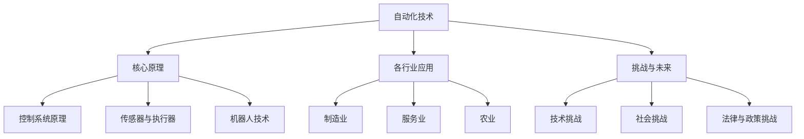

                 

### 文章标题

《自动化技术的未来前景》

### 关键词

自动化技术、未来前景、人工智能、机器人、智能控制、智能制造、智能农业

### 摘要

本文将探讨自动化技术的未来前景，从自动化技术的发展与现状、核心原理、各行业的应用以及面临的挑战和未来发展趋势等方面进行深入分析。文章旨在为读者呈现自动化技术在不断进步和扩展中的应用场景，以及其所带来的机遇和挑战。

## 《自动化技术的未来前景》目录大纲

### 第一部分：自动化技术的发展与现状

### 第1章：自动化技术概述

#### 1.1 自动化的定义与分类

- 自动化的基本概念
- 自动化技术的分类

#### 1.2 自动化技术的发展历史

- 自动化的起源与发展
- 我国自动化技术的发展历程

#### 1.3 自动化技术的现状与趋势

- 自动化技术在各行业中的应用
- 自动化技术的发展趋势

### 第2章：自动化技术的核心原理

#### 2.1 控制系统原理

- 控制系统的基本组成
- 控制系统的类型

#### 2.2 传感器与执行器

- 传感器的原理与分类
- 执行器的原理与应用

#### 2.3 机器人技术

- 机器人的分类与结构
- 机器人的应用领域

### 第二部分：自动化技术在各行业的应用

### 第3章：制造业中的自动化

#### 3.1 智能制造

- 智能制造的基本概念
- 智能制造的关键技术

#### 3.2 机器人自动化

- 机器人在制造业中的应用
- 机器人自动化生产线的设计

#### 3.3 生产线优化

- 生产线优化方法
- 生产线优化的案例分析

### 第4章：服务业中的自动化

#### 4.1 餐饮服务自动化

- 餐饮服务自动化的意义
- 餐饮服务自动化的实现方式

#### 4.2 医疗服务自动化

- 医疗服务自动化的现状
- 医疗服务自动化的未来前景

#### 4.3 物流与配送自动化

- 物流与配送自动化的意义
- 物流与配送自动化的实现方式

### 第5章：农业自动化

#### 5.1 农业自动化概述

- 农业自动化的定义与发展
- 农业自动化的主要领域

#### 5.2 农业机器人

- 农业机器人的分类与结构
- 农业机器人的应用案例

#### 5.3 智能农业

- 智能农业的概念与实现
- 智能农业的未来前景

### 第三部分：自动化技术的挑战与未来

### 第6章：自动化技术的挑战

#### 6.1 技术挑战

- 自动化技术在开发、部署和维护方面的挑战

#### 6.2 社会挑战

- 自动化技术对就业的影响
- 自动化技术对伦理和隐私的挑战

#### 6.3 法律与政策挑战

- 自动化技术的法律框架
- 自动化技术的政策引导

### 第7章：自动化技术的未来前景

#### 7.1 自动化技术的未来发展趋势

- 自动化技术的未来发展方向
- 自动化技术的新应用领域

#### 7.2 自动化技术的未来挑战与机遇

- 自动化技术的未来挑战
- 自动化技术的未来机遇

#### 7.3 自动化技术与人类社会的融合

- 自动化技术对人类生活方式的影响
- 自动化技术与人类社会的未来发展

### 附录

#### 附录A：自动化技术相关的标准与规范

#### 附录B：自动化技术常用工具与软件

#### 附录C：自动化技术相关参考文献与资料

## 第一部分：自动化技术的发展与现状

### 第1章：自动化技术概述

#### 1.1 自动化的定义与分类

自动化，是指利用电子、机械、计算机技术等手段，实现生产过程、工作流程的自动化运行，从而提高生产效率、降低生产成本、提升产品质量。自动化技术广泛应用于制造业、服务业、农业等领域，推动了各行业的转型升级和创新发展。

自动化的分类可以从不同的角度进行划分：

1. **按自动化程度划分**：

   - **低级自动化**：通过简单的机械装置实现自动运行，如自动生产线中的机械臂、输送带等。
   - **中级自动化**：在低级自动化的基础上，引入传感器、控制器等，实现简单的自动化控制，如数控机床、工业机器人等。
   - **高级自动化**：通过计算机技术、人工智能等技术，实现复杂的自动化控制、决策和优化，如智能制造系统、智能农业系统等。

2. **按应用领域划分**：

   - **制造业自动化**：如自动化生产线、数控机床、工业机器人等。
   - **服务业自动化**：如餐饮服务自动化、医疗服务自动化、物流与配送自动化等。
   - **农业自动化**：如农业机器人、智能农业系统等。

#### 1.2 自动化技术的发展历史

自动化技术的起源可以追溯到古代，如自动装置、机械时钟等。然而，现代自动化技术的发展始于20世纪中叶。

- **20世纪50年代**：计算机技术的发展推动了自动化技术的进步。1952年，美国通用电气公司开发了世界上第一台可编程数控机床。
- **20世纪60年代**：自动化技术在制造业中开始广泛应用，如自动化生产线、工业机器人等。
- **20世纪70年代**：传感器技术的进步使得自动化技术更加精确和可靠。同时，计算机控制系统成为自动化技术的核心。
- **20世纪80年代**：人工智能技术的发展为自动化技术带来了新的机遇。专家系统和模糊控制等技术在自动化系统中得到应用。
- **20世纪90年代至今**：随着互联网、物联网、大数据等技术的发展，自动化技术进入了智能化阶段。智能制造、智能农业、智能交通等领域得到了快速发展。

我国自动化技术的发展历程也经历了从引进、消化、吸收再到创新的过程。

- **20世纪50年代**：我国开始引进国外的自动化技术，如数控机床、工业机器人等。
- **20世纪60年代**：我国自主研发了第一台数控机床，标志着我国自动化技术开始起步。
- **20世纪70年代**：我国开始大规模推广应用自动化技术，如自动化生产线、自动化仓库等。
- **20世纪80年代**：我国开始引进和发展人工智能技术，为自动化技术注入新的活力。
- **20世纪90年代至今**：我国自动化技术得到了快速发展，特别是在智能制造、智能农业等领域取得了重要突破。

#### 1.3 自动化技术的现状与趋势

当前，自动化技术在各个行业中的应用已经非常广泛，以下是一些主要的应用领域和趋势：

1. **制造业自动化**：

   - **智能制造**：以数字化、网络化、智能化为特征，通过大数据、云计算、人工智能等技术，实现制造过程的优化和智能化。
   - **工业机器人**：在制造业中广泛应用，如汽车制造业、电子制造业等。
   - **自动化生产线**：通过自动化设备实现生产线的自动化运行，提高生产效率和产品质量。

2. **服务业自动化**：

   - **餐饮服务自动化**：如自动点餐系统、自动送餐机器人等。
   - **医疗服务自动化**：如智能诊断系统、手术机器人等。
   - **物流与配送自动化**：如智能仓储系统、无人配送车等。

3. **农业自动化**：

   - **农业机器人**：如自动播种机、自动收割机、植保机器人等。
   - **智能农业系统**：通过物联网、大数据、人工智能等技术，实现农业生产过程的智能化和精准化。

未来，自动化技术将继续发展，以下是一些发展趋势：

1. **智能化**：随着人工智能技术的进步，自动化技术将更加智能化，实现自主决策和优化。
2. **网络化**：物联网技术的发展将使自动化设备更加互联，实现信息的共享和协同工作。
3. **绿色化**：自动化技术将更加注重节能减排，推动绿色制造和可持续发展。
4. **个性化**：通过大数据和个性化定制，实现更加精准和高效的自动化服务。

#### 1.4 自动化技术的核心原理

自动化技术的核心原理主要包括控制系统原理、传感器与执行器原理以及机器人技术。

1. **控制系统原理**：

   控制系统是指由控制器、传感器、执行器等组成的自动控制装置，用于实现对生产过程、工作流程的自动控制。控制系统的基本原理是通过对传感器采集到的数据进行分析和处理，生成控制信号，驱动执行器实现控制目标。

   控制系统的基本组成包括：

   - **传感器**：用于采集生产过程中的各种信号，如温度、压力、速度等。
   - **控制器**：用于接收传感器采集到的数据，进行数据处理和判断，生成控制信号。
   - **执行器**：用于接收控制信号，驱动机械装置实现控制目标。

   控制系统的类型包括：

   - **开环控制系统**：控制器根据传感器采集到的数据直接生成控制信号，没有反馈环节。
   - **闭环控制系统**：控制器根据传感器采集到的数据和反馈信号生成控制信号，通过反馈环节实现闭环控制。

2. **传感器与执行器原理**：

   - **传感器**：传感器是将非电学量转换为电学量的装置。常见的传感器有温度传感器、压力传感器、速度传感器等。
   - **执行器**：执行器是将电信号转换为机械运动的装置。常见的执行器有电机、液压缸、气动缸等。

   传感器与执行器的原理如下：

   - **传感器原理**：传感器通过物理、化学或生物原理，将输入的非电学量转换为电学量。例如，温度传感器通过热敏电阻原理，将温度变化转换为电阻变化，从而产生电信号。
   - **执行器原理**：执行器通过电磁、液压或气动原理，将电信号转换为机械运动。例如，电机通过电磁感应原理，将电信号转换为旋转运动。

3. **机器人技术**：

   机器人是一种能够半自主或全自主执行任务的智能机器。机器人技术主要包括机器人的分类、结构、控制等方面的内容。

   - **机器人分类**：根据不同的应用场景，机器人可以分为工业机器人、服务机器人、农业机器人等。
   - **机器人结构**：机器人通常由机械结构、传感器、控制器、执行器等组成。机械结构包括手臂、底盘等；传感器用于感知环境和任务目标；控制器用于控制机器人的运动和任务执行；执行器用于驱动机械结构的运动。
   - **机器人控制**：机器人控制主要包括运动控制、任务控制、自主控制等。运动控制是指控制机器人的机械运动；任务控制是指控制机器人执行特定任务；自主控制是指机器人通过传感器和环境交互，自主决策和执行任务。

#### 1.5 自动化技术在各行业中的应用案例

自动化技术在各个行业中的应用已经取得了显著成果，以下是一些典型应用案例：

1. **制造业自动化**：

   - **汽车制造业**：汽车制造过程中，自动化技术广泛应用于焊接、涂装、装配等环节。例如，焊接机器人可以在车身制造过程中实现高效、精准的焊接操作，涂装机器人可以实现自动化涂装，提高生产效率和产品质量。
   - **电子制造业**：电子制造业中，自动化技术主要用于生产线的装配、检测等环节。例如，自动化装配机器人可以实现高精度的电子元器件装配，自动化检测机器人可以实现产品的性能检测和缺陷识别。

2. **服务业自动化**：

   - **餐饮服务自动化**：在餐饮服务领域，自动化技术主要用于点餐系统、送餐机器人等。例如，自动点餐系统可以通过触摸屏或语音识别实现点餐操作，送餐机器人可以自动将菜品送到餐桌。
   - **医疗服务自动化**：在医疗服务领域，自动化技术主要用于辅助诊断、手术机器人等。例如，智能诊断系统可以通过人工智能算法，辅助医生进行疾病诊断；手术机器人可以实现精细化的手术操作，提高手术的成功率和安全性。

3. **农业自动化**：

   - **农业机器人**：在农业领域，自动化技术主要用于种植、施肥、收割等环节。例如，自动播种机可以实现高效、精准的播种操作，自动收割机可以实现自动化的收割作业，植保机器人可以自动化进行农药喷洒。
   - **智能农业系统**：智能农业系统通过物联网、大数据、人工智能等技术，实现农业生产的智能化和精准化。例如，通过传感器实时监测土壤湿度、温度等环境参数，智能控制系统可以实现自动化的灌溉、施肥等操作，提高农业生产效率。

### 第2章：自动化技术的核心原理

#### 2.1 控制系统原理

控制系统是自动化技术的核心，它通过传感器、控制器和执行器等组成部分，实现对生产过程、工作流程的自动控制。控制系统的工作原理可以概括为以下三个步骤：

1. **传感**：传感器用于检测和控制对象的状态，将非电学量转换为电学量，如温度、压力、速度等。传感器是控制系统的输入环节。

2. **控制**：控制器接收传感器采集到的数据，通过算法进行处理和判断，生成控制信号。控制器是控制系统的核心，它决定了控制系统的响应速度、精度和稳定性。控制器可以是单片机、PLC（可编程逻辑控制器）或计算机等。

3. **执行**：执行器接收控制信号，将其转换为机械运动或其他形式的动作，如电机、液压缸、气动缸等。执行器是控制系统的输出环节。

控制系统可以分为开环控制系统和闭环控制系统。

- **开环控制系统**：开环控制系统没有反馈环节，控制器根据传感器采集到的数据直接生成控制信号，驱动执行器实现控制目标。开环控制系统的优点是实现简单、成本低；缺点是控制精度较低、稳定性较差。

- **闭环控制系统**：闭环控制系统有反馈环节，控制器根据传感器采集到的数据和反馈信号生成控制信号，通过反馈环节实现闭环控制。闭环控制系统的优点是控制精度高、稳定性好；缺点是实现复杂、成本较高。

控制系统的基本组成包括以下部分：

1. **传感器**：用于检测控制对象的参数，如温度、压力、速度等。

2. **控制器**：接收传感器采集到的数据，通过算法进行处理和判断，生成控制信号。

3. **执行器**：接收控制信号，将其转换为机械运动或其他形式的动作。

4. **反馈装置**：用于检测控制对象的状态，并将其反馈给控制器。

#### 2.2 传感器与执行器

传感器和执行器是控制系统的关键组成部分，它们分别负责感知环境和执行控制动作。

##### 传感器原理与分类

传感器是将非电学量转换为电学量的装置。根据转换原理，传感器可以分为以下几种类型：

1. **热敏传感器**：利用材料的电阻随温度变化的特性进行温度检测。

2. **光敏传感器**：利用材料的电阻或电流随光照强度变化的特性进行光强检测。

3. **压力传感器**：利用材料的电阻或电流随压力变化的特性进行压力检测。

4. **湿度传感器**：利用材料的电阻或电容随湿度变化的特性进行湿度检测。

5. **声波传感器**：利用声波的传播特性进行距离、速度等参数的检测。

6. **红外传感器**：利用红外辐射的强度变化进行温度、距离等参数的检测。

传感器的工作原理可以分为以下几种：

1. **电阻式**：通过材料的电阻变化来检测物理量。

2. **电容式**：通过材料的电容变化来检测物理量。

3. **热电式**：通过热电偶的电动势变化来检测温度。

2. **光电式**：通过光照射到光电元件上的电流变化来检测光强。

##### 执行器原理与应用

执行器是将电信号转换为机械运动或其他形式的动作的装置。根据驱动方式，执行器可以分为以下几种类型：

1. **电机**：包括直流电机、交流电机、步进电机等。电机通过电流产生磁场，驱动转子旋转，从而实现机械运动。

2. **液压缸**：利用液体压力驱动活塞运动，实现往复直线运动或旋转运动。

3. **气动缸**：利用气体压力驱动活塞运动，实现往复直线运动或旋转运动。

执行器的工作原理可以分为以下几种：

1. **电磁式**：通过电流产生的磁场驱动机械部件运动。

2. **流体动力式**：通过液体或气体的压力驱动机械部件运动。

3. **电动式**：通过电动机驱动机械部件运动。

执行器的应用非常广泛，以下是一些常见的应用场景：

1. **工业自动化**：如机器人、自动化生产线、数控机床等。

2. **智能家居**：如窗帘、门锁、灯光控制等。

3. **汽车**：如刹车系统、转向系统、悬挂系统等。

4. **医疗**：如手术机器人、康复设备等。

#### 2.3 机器人技术

机器人是一种能够半自主或全自主执行任务的智能机器。机器人技术包括机器人的分类、结构、控制等方面的内容。

##### 机器人分类

根据不同的应用场景，机器人可以分为以下几种类型：

1. **工业机器人**：主要用于工业生产领域，如焊接、喷涂、装配、搬运等。

2. **服务机器人**：主要用于服务领域，如餐饮、医疗、清洁、安保等。

3. **农业机器人**：主要用于农业生产领域，如播种、施肥、收割、植保等。

4. **特殊环境机器人**：主要用于极端环境或危险环境，如矿井、深海、太空等。

##### 机器人结构

机器人通常由机械结构、传感器、控制器、执行器等组成。机械结构包括手臂、底盘、机身等；传感器用于感知环境和任务目标；控制器用于控制机器人的运动和任务执行；执行器用于驱动机械结构的运动。

1. **机械结构**：

   - **手臂**：机器人的手臂是执行任务的主要部分，可以分为直线关节臂、旋转关节臂、多自由度关节臂等。

   - **底盘**：机器人的底盘用于支撑整个机械结构，并实现机器人的移动和方向控制。

   - **机身**：机器人的机身是机器人的核心部分，包括控制器、传感器等。

2. **传感器**：

   - **视觉传感器**：用于捕捉图像，进行物体识别和定位。

   - **激光雷达**：用于测量距离，构建环境三维模型。

   - **力传感器**：用于感知机器人的触觉和力觉。

3. **控制器**：

   - **运动控制器**：用于控制机器人的运动轨迹和速度。

   - **任务控制器**：用于控制机器人执行特定任务。

4. **执行器**：

   - **电机**：用于驱动机械结构运动。

   - **液压缸**：用于驱动机械结构运动。

   - **气动缸**：用于驱动机械结构运动。

##### 机器人控制

机器人控制主要包括运动控制、任务控制、自主控制等。

1. **运动控制**：

   - **轨迹规划**：根据任务需求，规划机器人的运动轨迹。

   - **运动控制算法**：如PID控制、逆运动学求解等，用于控制机器人的运动。

2. **任务控制**：

   - **任务规划**：根据任务目标，规划机器人的任务执行步骤。

   - **任务执行**：机器人按照任务规划执行任务。

3. **自主控制**：

   - **环境感知**：机器人通过传感器感知环境信息。

   - **自主决策**：机器人根据环境信息和任务目标，自主决策任务执行策略。

   - **自主执行**：机器人按照自主决策的结果执行任务。

#### 2.4 自动化技术在各行业中的应用案例

自动化技术在各个行业中的应用已经取得了显著成果，以下是一些典型应用案例：

1. **制造业自动化**：

   - **汽车制造业**：在汽车制造过程中，自动化技术广泛应用于焊接、涂装、装配等环节。例如，焊接机器人可以在车身制造过程中实现高效、精准的焊接操作，涂装机器人可以实现自动化涂装，提高生产效率和产品质量。

   - **电子制造业**：电子制造业中，自动化技术主要用于生产线的装配、检测等环节。例如，自动化装配机器人可以实现高精度的电子元器件装配，自动化检测机器人可以实现产品的性能检测和缺陷识别。

2. **服务业自动化**：

   - **餐饮服务自动化**：在餐饮服务领域，自动化技术主要用于点餐系统、送餐机器人等。例如，自动点餐系统可以通过触摸屏或语音识别实现点餐操作，送餐机器人可以自动将菜品送到餐桌。

   - **医疗服务自动化**：在医疗服务领域，自动化技术主要用于辅助诊断、手术机器人等。例如，智能诊断系统可以通过人工智能算法，辅助医生进行疾病诊断；手术机器人可以实现精细化的手术操作，提高手术的成功率和安全性。

3. **农业自动化**：

   - **农业机器人**：在农业领域，自动化技术主要用于种植、施肥、收割等环节。例如，自动播种机可以实现高效、精准的播种操作，自动收割机可以实现自动化的收割作业，植保机器人可以自动化进行农药喷洒。

   - **智能农业系统**：智能农业系统通过物联网、大数据、人工智能等技术，实现农业生产的智能化和精准化。例如，通过传感器实时监测土壤湿度、温度等环境参数，智能控制系统可以实现自动化的灌溉、施肥等操作，提高农业生产效率。

### 第二部分：自动化技术在各行业的应用

#### 第3章：制造业中的自动化

##### 3.1 智能制造

智能制造是指通过将信息技术、自动化技术、网络通信技术等与制造过程深度融合，实现制造过程的智能化、数字化、网络化，从而提高制造系统的灵活性和适应性，提升产品质量和生产效率。智能制造是制造业发展的新趋势，也是未来制造业发展的重要方向。

**智能制造的基本概念**

智能制造系统包括以下几个关键组成部分：

1. **感知层**：通过各种传感器和检测设备，实时获取制造过程中的各种信息，如温度、湿度、压力、速度等。

2. **网络层**：通过工业互联网、物联网等技术，实现感知层获取的数据传输、共享和集成。

3. **平台层**：构建智能制造平台，集成数据采集、处理、分析、优化等功能，为制造过程提供决策支持和优化方案。

4. **执行层**：通过自动化设备、机器人、数控机床等，执行制造任务，实现制造过程的自动化和智能化。

**智能制造的关键技术**

智能制造的关键技术包括：

1. **工业物联网（IIoT）**：通过传感器、控制器、云计算等技术，实现制造设备、产品、人员之间的互联互通，实现数据的实时采集、传输和分析。

2. **大数据技术**：通过数据采集、存储、处理和分析技术，挖掘制造过程中产生的海量数据，为制造过程的优化和决策提供支持。

3. **云计算和边缘计算**：通过云计算和边缘计算技术，实现制造数据的处理、分析和决策，提高制造系统的效率和灵活性。

4. **人工智能和机器学习**：通过人工智能和机器学习算法，实现制造过程的预测、优化和智能化控制。

5. **数字孪生**：通过构建数字孪生模型，实现对物理制造过程的实时模拟、分析和优化。

6. **机器人技术**：通过工业机器人的应用，实现制造过程的自动化和智能化。

**智能制造的应用场景**

智能制造在制造业中的应用场景主要包括以下几个方面：

1. **生产计划与排程**：通过数据分析、预测和优化算法，实现生产计划的智能化排程，提高生产效率和资源利用率。

2. **生产过程监控与优化**：通过实时数据采集和分析，实现对生产过程的监控和优化，提高生产质量和生产效率。

3. **质量控制**：通过大数据分析和人工智能算法，实现对产品质量的智能检测和预测，提高产品质量。

4. **设备维护与预测性维护**：通过设备状态监测、数据分析，实现设备的预测性维护，减少设备故障和停机时间。

5. **供应链管理**：通过物联网和大数据技术，实现供应链的实时监控和优化，提高供应链的效率和透明度。

**智能制造的优势**

智能制造具有以下优势：

1. **提高生产效率**：通过自动化和智能化技术，实现制造过程的优化和自动化，提高生产效率。

2. **提高产品质量**：通过大数据分析和人工智能技术，实现产品质量的智能检测和预测，提高产品质量。

3. **降低生产成本**：通过自动化和智能化技术，减少人力成本，提高资源利用率，降低生产成本。

4. **提升企业竞争力**：通过智能制造，企业可以更快地响应市场需求，提高产品创新能力和市场竞争力。

**智能制造的挑战**

尽管智能制造具有很多优势，但在实际应用中也面临着一些挑战：

1. **技术挑战**：智能制造涉及到多个技术领域，如物联网、大数据、人工智能等，技术复杂性较高，需要跨学科的知识和技能。

2. **数据安全和隐私**：智能制造过程中会产生大量的数据，如何保护数据安全和用户隐私是一个重要的挑战。

3. **人才短缺**：智能制造需要大量的技术人才，但目前的技能供给与需求之间存在较大差距。

4. **投资和成本**：智能制造的投资和成本较高，企业需要承担一定的风险。

##### 3.2 机器人自动化

机器人自动化在制造业中发挥着重要作用，它不仅能够提高生产效率，还能够提升产品质量，降低生产成本。机器人自动化主要包括机器人在制造业中的应用和机器人自动化生产线的设计两个方面。

**机器人在制造业中的应用**

机器人在制造业中的应用非常广泛，主要包括以下几个方面：

1. **焊接机器人**：焊接机器人广泛应用于汽车制造业、航空航天制造业等领域，可以实现高效、精准的焊接操作。

2. **喷涂机器人**：喷涂机器人用于金属制品、家具、汽车等产品的表面涂装，可以提高涂装质量，减少涂料浪费。

3. **装配机器人**：装配机器人用于电子制造业、汽车制造业等领域，可以实现高精度的装配操作，提高生产效率。

4. **搬运机器人**：搬运机器人用于生产线上的物料搬运，可以提高生产线的运作效率，减少人力成本。

5. **检测机器人**：检测机器人用于产品质量检测，可以实现对产品的精度、表面质量、内部缺陷等方面的检测，提高产品质量。

**机器人自动化生产线的设计**

设计机器人自动化生产线需要考虑以下几个方面：

1. **工艺流程优化**：根据产品的生产要求，优化工艺流程，确定各个工序的顺序和参数。

2. **机器人选型**：根据生产任务的要求，选择合适的机器人类型和型号，如焊接机器人、喷涂机器人、装配机器人等。

3. **控制系统的设计**：设计控制系统的硬件和软件架构，实现机器人的控制、协调和故障处理等功能。

4. **传感器和执行器的选择**：根据生产任务的要求，选择合适的传感器和执行器，如视觉传感器、力传感器、电机等。

5. **安全防护措施**：在设计自动化生产线时，需要考虑安全防护措施，确保生产过程中的安全。

**案例：汽车制造中的机器人自动化**

以汽车制造业为例，机器人自动化在汽车制造中的典型应用包括：

1. **车身焊接**：车身焊接是汽车制造的重要环节，焊接机器人可以实现高效、精准的焊接操作，提高车身焊接质量。

2. **涂装**：涂装机器人用于汽车涂装，可以提高涂装质量，减少涂料浪费。

3. **装配**：装配机器人用于汽车零部件的装配，可以实现高精度的装配操作，提高生产效率。

4. **搬运**：搬运机器人用于汽车零部件的搬运，可以提高生产线的运作效率。

**机器人自动化生产线的优势**

1. **提高生产效率**：机器人自动化生产线可以连续工作，不受人力限制，提高生产效率。

2. **提高产品质量**：机器人自动化生产线可以实现高精度、高稳定性的生产操作，提高产品质量。

3. **降低生产成本**：机器人自动化生产线可以减少人力成本，提高资源利用率，降低生产成本。

4. **提升企业竞争力**：机器人自动化生产线可以提高企业的生产效率和产品质量，提升企业的市场竞争力。

##### 3.3 生产线优化

生产线优化是指通过运用各种优化技术和方法，对生产线的各个环节进行优化，以提高生产效率、降低成本、提高产品质量。生产线优化是智能制造的重要组成部分，对于提升企业竞争力具有重要意义。

**生产线优化方法**

生产线优化方法主要包括以下几个方面：

1. **工艺流程优化**：通过对工艺流程进行分析和优化，减少生产环节，提高生产效率。例如，通过引入自动化设备、改进工艺路线等手段，实现工艺流程的优化。

2. **设备选型与布局优化**：根据生产任务的要求，选择合适的设备类型和数量，并合理布局设备，以提高生产效率和设备利用率。例如，通过引入高效设备、优化设备布局等手段，实现设备选型与布局优化。

3. **人员配备优化**：根据生产任务的要求，合理配置人力资源，优化人员岗位，以提高生产效率和员工满意度。例如，通过优化人员岗位设置、加强员工培训等手段，实现人员配备优化。

4. **物流与物料管理优化**：通过对物流和物料管理进行优化，减少物料库存、降低物料运输成本，提高生产线的运作效率。例如，通过引入智能仓储系统、优化物料配送路径等手段，实现物流与物料管理优化。

5. **质量控制与监控优化**：通过对质量控制与监控进行优化，提高产品质量，减少质量缺陷。例如，通过引入智能检测系统、优化质量检测流程等手段，实现质量控制与监控优化。

**案例分析**

以某汽车制造企业为例，生产线优化过程如下：

1. **工艺流程优化**：通过对现有工艺流程进行分析，发现部分工序存在重复操作和效率低的问题。通过引入自动化设备，减少人工操作环节，实现工艺流程的优化。

2. **设备选型与布局优化**：根据生产任务的要求，对现有设备进行评估，发现部分设备效率低、故障率高。通过引入高效设备，优化设备布局，实现设备选型与布局优化。

3. **人员配备优化**：通过优化人员岗位设置，加强员工培训，提高员工技能水平，实现人员配备优化。

4. **物流与物料管理优化**：引入智能仓储系统，优化物料配送路径，实现物流与物料管理优化。

5. **质量控制与监控优化**：引入智能检测系统，优化质量检测流程，实现质量控制与监控优化。

通过生产线优化，该企业实现了生产效率提高20%，产品质量提升15%，生产成本降低10%的目标。

**生产线优化的重要性**

1. **提高生产效率**：通过生产线优化，可以减少生产环节、提高设备利用率，从而提高生产效率。

2. **降低生产成本**：通过生产线优化，可以减少物料库存、降低物料运输成本，提高生产效率和产品质量，从而降低生产成本。

3. **提高产品质量**：通过生产线优化，可以优化质量控制与监控，提高产品质量，减少质量缺陷。

4. **提升企业竞争力**：通过生产线优化，可以提高生产效率、降低生产成本、提高产品质量，从而提升企业竞争力。

### 第4章：服务业中的自动化

#### 4.1 餐饮服务自动化

餐饮服务自动化是服务业自动化的重要组成部分，它通过引入自动化设备和技术，提高餐饮服务的效率和质量，提升顾客体验。餐饮服务自动化主要包括点餐系统、送餐机器人、自动化厨房设备等方面。

**餐饮服务自动化的意义**

1. **提高服务效率**：自动化设备可以快速完成点餐、送餐等操作，提高服务效率，缩短顾客等待时间。

2. **降低人力成本**：餐饮服务自动化可以减少人力投入，降低人力成本，提高企业的盈利能力。

3. **提升服务质量**：自动化设备可以保证点餐、送餐等操作的准确性和一致性，提升服务质量。

4. **改善工作环境**：自动化设备可以减少人工操作，改善工作环境，降低员工的工作强度和疲劳度。

**餐饮服务自动化的实现方式**

1. **点餐系统**：点餐系统通过自助点餐机、移动设备等，实现顾客自助点餐。点餐系统可以支持多种支付方式，提高点餐效率和顾客体验。

2. **送餐机器人**：送餐机器人可以在餐厅内自主导航，将顾客点餐快速准确地送到餐桌。送餐机器人可以减轻员工负担，提高送餐效率。

3. **自动化厨房设备**：自动化厨房设备如智能烹饪机器人、自动洗碗机等，可以实现厨房操作的自动化，提高烹饪效率和餐具清洗效果。

**案例分析**

某知名餐厅引入了餐饮服务自动化系统，包括自助点餐机、送餐机器人和自动化厨房设备。具体实现方式如下：

1. **自助点餐机**：餐厅设置了多个自助点餐机，顾客可以通过触摸屏自助点餐，选择菜品、数量和支付方式。自助点餐机支持语音识别和手势识别，提高了点餐效率。

2. **送餐机器人**：餐厅引入了送餐机器人，机器人可以在餐厅内自主导航，将顾客点餐准确无误地送到餐桌。送餐机器人具有避障、上下楼梯等功能，提高了送餐效率。

3. **自动化厨房设备**：餐厅引入了智能烹饪机器人、自动洗碗机等自动化厨房设备，实现了烹饪和餐具清洗的自动化。智能烹饪机器人可以自动识别菜品，精准控制火候和时间，提高了烹饪效率。

**餐饮服务自动化的挑战与机遇**

1. **挑战**：

   - **技术挑战**：餐饮服务自动化涉及到多种技术，如物联网、人工智能、机器人技术等，技术复杂性较高。

   - **成本挑战**：餐饮服务自动化的初期投入较大，企业需要承担一定的成本压力。

   - **人员培训**：自动化设备的操作和维修需要专业知识和技能，企业需要加强对员工的培训。

2. **机遇**：

   - **提高服务效率**：餐饮服务自动化可以提高服务效率，满足顾客对快速高效服务的要求。

   - **降低人力成本**：餐饮服务自动化可以减少人力投入，降低人力成本，提高企业的盈利能力。

   - **提升服务质量**：餐饮服务自动化可以保证点餐、送餐等操作的准确性和一致性，提升服务质量。

   - **创新商业模式**：餐饮服务自动化可以创造新的商业模式，如外卖、无人餐厅等，为企业带来新的增长点。

#### 4.2 医疗服务自动化

医疗服务自动化是指通过引入自动化设备和技术，提高医疗服务效率和质量，改善患者体验。医疗服务自动化在医疗诊断、手术、护理等方面具有广泛应用，有助于提高医疗资源的利用效率和服务水平。

**医疗服务自动化的现状**

1. **医疗诊断自动化**：医疗诊断自动化主要通过人工智能技术实现，如影像诊断、病理诊断等。例如，人工智能算法可以辅助医生进行医学影像分析，提高诊断准确率。

2. **手术机器人**：手术机器人如达芬奇手术机器人，可以辅助医生进行微创手术，提高手术精度和安全性。

3. **护理机器人**：护理机器人如康复机器人、护理机器人等，可以辅助医护人员进行康复护理和日常护理工作，提高护理质量和效率。

**医疗服务自动化的未来前景**

1. **医疗诊断自动化**：随着人工智能技术的不断发展，医疗诊断自动化将进一步普及，提高诊断效率和准确性。

2. **手术机器人**：手术机器人技术将更加成熟，手术机器人将广泛应用于各种复杂手术，提高手术质量和安全性。

3. **护理机器人**：护理机器人将更加智能化和多样化，可以在康复护理、日常护理等方面发挥重要作用，提高护理质量和效率。

**案例分析**

某医院引入了医疗服务自动化系统，包括医疗诊断自动化、手术机器人和护理机器人。具体实现如下：

1. **医疗诊断自动化**：医院引入了人工智能影像诊断系统，辅助医生进行医学影像分析。人工智能算法可以快速识别病灶，提高诊断准确率。

2. **手术机器人**：医院引进了达芬奇手术机器人，医生通过远程操作，可以完成高难度的微创手术，提高手术精度和安全性。

3. **护理机器人**：医院引入了康复机器人和护理机器人，康复机器人帮助患者进行康复训练，护理机器人帮助医护人员进行日常护理工作，提高护理质量和效率。

**医疗服务自动化的挑战与机遇**

1. **挑战**：

   - **技术挑战**：医疗服务自动化涉及到多种技术，如人工智能、机器人技术、物联网等，技术复杂性较高。

   - **数据安全和隐私**：医疗服务自动化过程中会产生大量医疗数据，如何保护数据安全和患者隐私是一个重要挑战。

   - **伦理和道德**：医疗服务自动化可能引发伦理和道德问题，如医生的角色变化、患者隐私保护等。

2. **机遇**：

   - **提高医疗服务效率**：医疗服务自动化可以提高诊断、手术、护理等环节的效率，缓解医疗资源短缺问题。

   - **降低医疗成本**：医疗服务自动化可以减少人力成本，降低医疗成本，提高医疗资源利用效率。

   - **提升医疗质量**：医疗服务自动化可以提高诊断、手术、护理等环节的准确性，提高医疗质量。

   - **创新医疗服务模式**：医疗服务自动化可以推动医疗服务模式的创新，如远程医疗、智能健康管理等，为患者提供更加便捷、高效的医疗服务。

#### 4.3 物流与配送自动化

物流与配送自动化是指通过引入自动化设备和技术，实现物流与配送过程的智能化和高效化。物流与配送自动化在提高物流效率、降低配送成本、提升服务质量方面具有显著优势，是现代物流发展的重要方向。

**物流与配送自动化的意义**

1. **提高物流效率**：自动化设备可以实现物流与配送过程的自动化操作，减少人力介入，提高物流效率。

2. **降低配送成本**：自动化设备可以减少人力成本、缩短配送时间，降低配送成本。

3. **提升服务质量**：自动化设备可以实现精准配送、快速响应，提高服务质量。

4. **优化资源配置**：自动化设备可以实现物流资源的优化配置，提高资源利用率。

**物流与配送自动化的实现方式**

1. **智能仓储系统**：智能仓储系统通过自动化设备，实现仓储管理过程的自动化，如自动存取、分类、分拣等。

2. **无人配送车**：无人配送车通过自动驾驶技术，实现配送过程的自动化，如城市快递、最后一公里配送等。

3. **无人机配送**：无人机配送通过无人机技术，实现远距离、快速配送，如紧急物资配送、偏远地区配送等。

4. **物流机器人**：物流机器人如搬运机器人、分拣机器人等，实现物流操作过程的自动化。

**案例分析**

某物流公司引入了物流与配送自动化系统，包括智能仓储系统、无人配送车和物流机器人。具体实现如下：

1. **智能仓储系统**：物流公司引入了智能仓储系统，通过自动化设备实现仓储管理过程的自动化，如自动存取、分类、分拣等。智能仓储系统可以提高仓储效率，减少人力成本。

2. **无人配送车**：物流公司引入了无人配送车，实现城市快递、最后一公里配送的自动化。无人配送车可以自动规划配送路线，减少配送时间，提高配送效率。

3. **物流机器人**：物流公司引入了物流机器人，如搬运机器人、分拣机器人等，实现物流操作过程的自动化。物流机器人可以减少人力介入，提高物流效率。

**物流与配送自动化的挑战与机遇**

1. **挑战**：

   - **技术挑战**：物流与配送自动化涉及到多种技术，如自动化设备、物联网、人工智能、自动驾驶等，技术复杂性较高。

   - **法律法规**：物流与配送自动化需要适应法律法规的要求，如道路安全、数据安全等。

   - **安全与隐私**：物流与配送自动化过程中会产生大量数据，如何保护数据安全和用户隐私是一个重要挑战。

2. **机遇**：

   - **提高物流效率**：物流与配送自动化可以提高物流效率，降低配送成本，提高服务质量。

   - **降低人力成本**：物流与配送自动化可以减少人力成本，提高资源利用率。

   - **优化资源配置**：物流与配送自动化可以实现物流资源的优化配置，提高资源利用率。

   - **创新物流模式**：物流与配送自动化可以推动物流模式的创新，如无人配送、智能物流等，为物流行业带来新的发展机遇。

### 第5章：农业自动化

#### 5.1 农业自动化概述

农业自动化是指利用现代电子、机械、计算机和人工智能等技术，对农业生产过程中的各个环节进行自动化控制和优化管理，以提高农业生产效率、降低生产成本、改善农产品质量，同时减少对环境的影响。农业自动化是现代农业发展的重要趋势，也是实现农业现代化的重要手段。

**农业自动化的定义与发展**

农业自动化，广义上是指通过引入自动化技术和设备，实现农业生产过程的部分或全部自动化。具体包括：

- **农田管理自动化**：包括土壤湿度监测、气象数据采集、灌溉系统自动化等。
- **种植自动化**：包括播种、施肥、喷洒、收获等环节的自动化。
- **动物养殖自动化**：包括饲料投放、环境控制、疾病监测等环节的自动化。
- **农产品加工自动化**：包括农产品收获后的清洗、分类、包装等环节的自动化。

农业自动化的发展历程可以追溯到20世纪中期，当时农业机械化的推广为自动化技术奠定了基础。随着电子技术、计算机技术和人工智能技术的进步，农业自动化进入了一个全新的发展阶段。

**农业自动化的主要领域**

农业自动化的主要领域包括以下几个方面：

1. **智能农业监测系统**：利用传感器和物联网技术，对农田环境（如土壤湿度、温度、光照、气体浓度等）进行实时监测，实现精准农业管理。

2. **农业机器人**：包括耕作机器人、播种机器人、施肥机器人、喷洒机器人、收割机器人等，用于替代人工操作，提高农业生产的效率和精度。

3. **自动化灌溉系统**：通过自动化控制系统，根据土壤湿度、气象条件等实时数据，自动调节灌溉水量和灌溉时间，实现精准灌溉。

4. **精准施肥系统**：利用土壤传感器和植物营养需求模型，实现按需施肥，减少化肥使用，提高肥料利用效率。

5. **气象预报和灾害预警系统**：通过气象监测设备和大数据分析，预测气象变化，提供灾害预警，减少农业生产风险。

**农业自动化的优势**

1. **提高生产效率**：自动化技术可以大幅减少人力需求，提高农业生产的速度和效率。

2. **降低生产成本**：自动化技术可以减少农业投入成本，提高资源利用效率，降低生产成本。

3. **改善农产品质量**：通过精准控制和管理，可以生产出质量更稳定、品质更高的农产品。

4. **减少劳动力需求**：自动化技术可以减轻农民的劳动强度，吸引更多的年轻人从事农业生产。

5. **保护环境**：自动化技术可以实现精准施肥、喷洒农药，减少化肥和农药的过量使用，减少对环境的污染。

**农业自动化的挑战**

尽管农业自动化带来了许多优势，但在推广和应用过程中也面临一些挑战：

1. **技术成本**：自动化设备和系统的初始投资较高，对于小规模农户来说，成本压力较大。

2. **技术维护**：自动化设备和系统需要专业的技术支持，维护和修理成本不容忽视。

3. **技术适应性**：不同的农业环境和生产模式可能需要不同的自动化解决方案，如何适应多样化的农业需求是一个挑战。

4. **人才短缺**：自动化技术的应用需要专业人才，但目前相关人才短缺，特别是农村地区。

5. **政策和法规**：农业自动化的发展需要政策和法规的支持，如农业用地、环保标准等。

#### 5.2 农业机器人

农业机器人是农业自动化的重要组成部分，通过半自主或全自主的方式执行农业生产任务，如耕作、播种、施肥、喷洒、收割等。农业机器人可以显著提高农业生产效率，减少劳动力需求，同时提高农产品的质量和安全性。

**农业机器人的分类与结构**

农业机器人可以根据执行的任务和操作环境进行分类：

1. **耕作机器人**：用于耕地、松土、除草等。常见的耕作机器人有自动化拖拉机、自动耕作机等。

2. **播种机器人**：用于精确播种，提高播种效率和准确性。常见的播种机器人有自动播种机、无人机播种系统等。

3. **施肥机器人**：用于精确施肥，减少化肥使用量，提高肥料利用率。常见的施肥机器人有自动施肥车、无人机施肥系统等。

4. **喷洒机器人**：用于农药、叶面肥的喷洒，防治病虫害，提高农作物的产量和品质。常见的喷洒机器人有自动喷洒车、无人机喷洒系统等。

5. **收割机器人**：用于自动收割作物，如小麦、玉米、水稻等。常见的收割机器人有自动收割机、无人机收割系统等。

农业机器人的结构通常包括以下几个部分：

- **机械结构**：包括机器人的主体框架、机械臂、车轮等，用于执行具体的农业操作。

- **传感器系统**：包括各种传感器，如摄像头、GPS、激光雷达、超声波传感器等，用于感知环境和执行任务。

- **控制系统**：包括计算机、控制器、电子设备等，用于处理传感器数据，生成控制指令，驱动机器人执行任务。

- **能源系统**：包括电池、发电机等，用于提供机器人运行所需的能源。

- **通信系统**：包括无线通信模块，用于与其他设备、中心控制系统进行数据交换和通信。

**农业机器人的应用案例**

1. **无人机喷洒系统**：无人机喷洒系统可以在农田上方自主飞行，进行农药和叶面肥的喷洒。无人机喷洒系统具有操作灵活、覆盖面广、喷洒精准等优点，适用于大面积农田的病虫害防治。

2. **自动收割机**：自动收割机可以自动识别作物的高度和位置，进行精确收割。自动收割机适用于大规模农田的机械化收割，可以显著提高收割效率和减少劳动力需求。

3. **无人播种机**：无人播种机可以根据农田的实时数据，自动调整播种深度和播种量，实现精确播种。无人播种机适用于多种作物的播种，可以提高播种效率和作物产量。

4. **自动施肥车**：自动施肥车可以在农田中自动行走，根据土壤湿度和植物生长情况，自动调节施肥量。自动施肥车适用于精确施肥，可以减少化肥使用，提高肥料利用率。

**农业机器人的优势**

1. **提高效率**：农业机器人可以连续工作，不受天气和时间的限制，提高农业生产效率。

2. **降低成本**：农业机器人可以大幅减少劳动力需求，降低农业生产成本。

3. **提高精度**：农业机器人可以精确执行农业操作，提高农作物的产量和品质。

4. **减少劳动力**：农业机器人可以减轻农民的劳动强度，吸引更多年轻人从事农业生产。

5. **环境保护**：农业机器人可以实现精准施肥、喷洒，减少化肥和农药的使用，降低对环境的污染。

**农业机器人的挑战**

1. **技术成本**：农业机器人的研发和购买成本较高，对于小规模农户来说，成本压力较大。

2. **操作维护**：农业机器人的操作和维护需要专业知识和技能，培训成本较高。

3. **适应性**：不同的农业环境和生产模式可能需要不同的农业机器人解决方案，如何适应多样化的农业需求是一个挑战。

4. **技术更新**：农业机器人技术更新速度快，如何快速适应技术变化是一个挑战。

5. **市场接受度**：农业机器人需要农民的接受和适应，提高市场接受度是一个挑战。

#### 5.3 智能农业

智能农业是指通过物联网、大数据、人工智能、云计算等现代信息技术，对农业生产、管理和经营进行智能化改造，实现农业生产过程自动化、管理精细化、决策科学化。智能农业是现代农业发展的重要方向，有助于提高农业生产效率、保障农产品质量安全、减少资源浪费、保护生态环境。

**智能农业的概念与实现**

智能农业的核心在于利用信息技术手段，实现农业生产各个环节的智能化。具体实现包括以下几个方面：

1. **数据采集与监测**：利用传感器、物联网设备等，实时采集农田土壤湿度、温度、光照、气体浓度等环境数据，以及作物生长状态、病虫害情况等。

2. **数据分析与处理**：利用大数据技术，对采集到的数据进行分析和处理，提取有价值的信息，为农业生产提供决策支持。

3. **智能决策与控制**：基于数据分析结果，利用人工智能算法，生成智能决策，实现对灌溉、施肥、喷洒、收割等环节的自动控制。

4. **远程监控与管理**：通过云计算和移动互联网技术，实现对农田、农机设备的远程监控和管理，提高农业生产管理的效率和水平。

**智能农业的技术架构**

智能农业的技术架构通常包括以下几个层次：

1. **感知层**：包括各种传感器和监测设备，如土壤传感器、气象传感器、摄像头、GPS等，用于实时采集农田环境数据和作物生长数据。

2. **传输层**：包括物联网通信模块、无线网络等，用于将感知层采集到的数据传输到中心服务器或云平台。

3. **平台层**：包括数据存储、处理、分析、决策等模块，利用云计算和大数据技术，对采集到的数据进行处理和分析，提供智能决策支持。

4. **应用层**：包括智能灌溉系统、智能施肥系统、智能病虫害监测系统、智能收割系统等，通过实现具体应用场景的智能化，提高农业生产效率。

**智能农业的优势**

1. **提高生产效率**：通过自动化和智能化技术，实现农业生产过程的优化和自动化，提高生产效率。

2. **降低生产成本**：通过精准施肥、精准灌溉等手段，减少资源浪费，降低生产成本。

3. **保障农产品质量**：通过实时监测和智能决策，提高农产品质量，减少农药和化肥的使用。

4. **减少劳动力需求**：自动化和智能化技术可以减少人力需求，降低劳动强度，吸引更多年轻人从事农业生产。

5. **保护生态环境**：通过减少农药和化肥的使用，降低对环境的污染，实现农业的可持续发展。

**智能农业的挑战**

1. **技术成本**：智能农业技术的研发和部署成本较高，对于小规模农户来说，成本压力较大。

2. **技术适应性问题**：不同地区和不同作物的农业生产模式可能需要不同的智能化解决方案，如何适应多样化的农业需求是一个挑战。

3. **数据安全和隐私**：智能农业过程中会产生大量数据，如何保护数据安全和用户隐私是一个重要挑战。

4. **人才短缺**：智能农业需要大量的技术人才，但目前相关人才短缺，特别是农村地区。

5. **政策和法规**：智能农业的发展需要政策和法规的支持，如农业用地、环保标准等。

### 第三部分：自动化技术的挑战与未来

#### 第6章：自动化技术的挑战

自动化技术在推动社会发展和经济增长的同时，也带来了一系列的挑战，包括技术挑战、社会挑战和法律与政策挑战。

#### 6.1 技术挑战

**自动化技术的技术挑战主要表现在以下几个方面：**

1. **技术复杂性和多样性**：自动化技术涵盖了多个领域，包括机械工程、电子工程、计算机科学、人工智能等，技术复杂性高，涉及多种技术的融合和交叉。这种复杂性使得技术的研发和部署面临巨大的挑战。

2. **技术更新速度快**：随着科技的快速发展，自动化技术也在不断更新和迭代。新技术、新材料、新算法的涌现，使得自动化系统需要不断升级和优化，以适应不断变化的环境和需求。

3. **技术可靠性和安全性**：自动化系统在运行过程中，需要保证高可靠性和安全性。技术故障、系统崩溃等风险，不仅会影响生产效率，还可能带来安全隐患。例如，工业机器人系统在运行时，如果出现故障，可能会造成人身伤害或设备损坏。

4. **数据管理和保护**：自动化系统会产生大量的数据，包括生产数据、环境数据、用户数据等。如何有效管理和保护这些数据，防止数据泄露、篡改和滥用，是自动化技术面临的一个重要挑战。

5. **跨学科整合**：自动化技术的实现需要跨学科的知识和技能，如机械工程、电子工程、计算机科学、人工智能等。如何将这些不同领域的知识有效整合，形成一体化的自动化解决方案，是技术实现的一个关键挑战。

**解决技术挑战的策略：**

1. **加强技术研发和创新**：政府、企业和研究机构应加大对自动化技术的研究和开发投入，推动技术创新和突破。

2. **构建跨学科团队**：建立跨学科的自动化技术研发团队，整合不同领域的专业知识和技能，提高研发效率。

3. **提高技术标准和规范化**：制定统一的技术标准和规范，确保自动化系统的可靠性和安全性。

4. **加强技术培训和教育**：提高从业人员的技术水平，培养更多的自动化技术人才。

#### 6.2 社会挑战

**自动化技术的社会挑战主要表现在以下几个方面：**

1. **就业影响**：自动化技术的广泛应用可能导致部分传统工作岗位的消失，特别是那些重复性高、劳动强度大的工作岗位。这可能会导致失业率的上升，影响社会稳定。

2. **技能需求变化**：随着自动化技术的普及，对从业人员的技术和技能要求也在不断变化。传统岗位的从业人员可能需要学习新的技能，以适应自动化环境。这种技能需求的变化，对教育和职业培训提出了新的挑战。

3. **伦理和隐私问题**：自动化技术在带来便利的同时，也引发了一系列伦理和隐私问题。例如，自动化系统中涉及到的用户数据隐私保护，以及自动化决策过程中可能出现的偏见和歧视问题。

4. **社会接受度**：自动化技术的普及需要社会的广泛接受和认可。然而，一些人可能对自动化技术持有怀疑态度，甚至反对自动化技术的应用，这可能会影响自动化技术的推广和普及。

**解决社会挑战的策略：**

1. **调整就业结构**：政府和企业应积极调整就业结构，创造新的就业机会，减少自动化技术对就业的负面影响。

2. **加强职业培训和再教育**：提供针对自动化技术所需的职业培训和再教育课程，帮助从业人员适应新的技能需求。

3. **加强伦理和隐私保护**：制定相关法律法规，加强对自动化技术中涉及到的伦理和隐私问题的监管，确保技术的公正和透明。

4. **提高社会接受度**：通过宣传和教育活动，提高公众对自动化技术的认知和接受度。

#### 6.3 法律与政策挑战

**自动化技术的法律与政策挑战主要表现在以下几个方面：**

1. **法律法规滞后**：随着自动化技术的快速发展，现有的法律法规可能无法完全适应新的技术环境。这可能会导致法律空白或法律适用性问题。

2. **标准规范不完善**：自动化技术涉及多个领域，但相关的标准规范可能不够完善，影响了自动化技术的研发、应用和推广。

3. **政策引导不足**：政府对自动化技术的政策引导和扶持可能不足，影响了自动化技术的创新和应用。

4. **国际合作与协调**：自动化技术的应用跨越国界，但不同国家在法律法规、标准规范、政策引导等方面可能存在差异，这需要国际间的合作与协调。

**解决法律与政策挑战的策略：**

1. **完善法律法规体系**：加快制定和完善与自动化技术相关的法律法规，确保技术的合法合规应用。

2. **制定统一标准规范**：推动国际间标准化合作，制定统一的自动化技术标准规范，促进技术的互操作性和兼容性。

3. **加强政策引导和支持**：政府应加大对自动化技术的政策引导和支持力度，鼓励技术创新和应用。

4. **加强国际合作与协调**：通过国际间的合作与协调，推动自动化技术的全球化发展。

### 第7章：自动化技术的未来前景

#### 7.1 自动化技术的未来发展趋势

自动化技术正迅速发展，其未来前景广阔，预计将在多个领域继续拓展和深化。以下是一些自动化技术的未来发展趋势：

1. **智能化**：随着人工智能技术的不断进步，自动化技术将更加智能化。通过引入机器学习和深度学习算法，自动化系统能够自主学习和优化，提高决策的准确性和效率。

2. **网络化**：物联网（IoT）和5G技术的发展，将推动自动化系统更加互联。自动化设备将通过网络实现数据共享和协同工作，提高系统的整体性能和响应速度。

3. **绿色化**：环保意识的增强和可持续发展目标的推动，使得自动化技术在绿色制造和节能减排方面具有巨大潜力。自动化系统将更加注重能源效率和资源利用优化。

4. **个性化**：大数据和云计算技术的应用，将使自动化系统能够根据用户需求进行个性化定制，提供更加贴合用户需求的服务。

5. **边缘计算**：随着数据处理需求的增加，边缘计算将在自动化技术中发挥重要作用。边缘计算将数据处理和分析推向数据源附近，减少网络延迟，提高系统响应速度。

6. **混合现实（MR）**：混合现实技术的融合，将使自动化系统更加直观和互动。通过虚拟现实和增强现实技术，操作人员能够更加便捷地监控和操作自动化系统。

#### 7.2 自动化技术的未来挑战与机遇

自动化技术的未来不仅充满机遇，也面临着一系列挑战。以下是对这些挑战与机遇的探讨：

**未来挑战：**

1. **技术复杂性**：自动化系统的复杂性将增加，对研发人员的要求也将更高。如何有效管理技术复杂性，将成为一个重要挑战。

2. **数据安全和隐私**：自动化系统将产生和处理大量的数据，数据安全和隐私保护将变得至关重要。如何确保数据安全，防止数据泄露和滥用，是未来面临的重要问题。

3. **伦理问题**：自动化技术的应用可能会引发伦理问题，如机器替代人类工作带来的就业问题，以及自动化决策过程中可能出现的歧视问题。

4. **政策与法规**：自动化技术的快速发展需要相应的政策和法规支持。如何制定和完善相关政策法规，以确保技术的健康发展，是一个重要的挑战。

**未来机遇：**

1. **经济增长**：自动化技术的广泛应用将推动经济增长，提高生产效率和质量，为企业和国家创造更多的经济价值。

2. **创新驱动**：自动化技术为创新提供了广阔的空间，新技术的研发和应用将不断推动产业升级和结构调整。

3. **就业机会**：虽然自动化技术可能取代一些传统工作岗位，但也将创造新的就业机会，特别是在研发、维护和操作自动化系统方面。

4. **可持续发展**：自动化技术在节能减排、资源优化等方面的应用，将有助于实现可持续发展目标，推动绿色制造和生态文明建设。

#### 7.3 自动化技术与人类社会的融合

自动化技术对人类社会的融合具有深远的影响。以下是对这种融合的影响和未来的探讨：

**自动化技术对人类生活方式的影响：**

1. **效率提升**：自动化技术将提高生活和工作效率，减少繁琐的任务，让人们有更多时间和精力从事更有意义的活动。

2. **生活质量改善**：自动化技术将改善生活质量，如智能家居系统、医疗健康监测等，为人们提供更加便捷和舒适的生活环境。

3. **就业结构变化**：自动化技术将导致就业结构发生变化，一些传统岗位可能被替代，但也将创造新的就业机会。

**自动化技术与人类社会的未来发展：**

1. **智能化社会**：自动化技术将推动人类社会向更加智能化、数字化的方向发展，智能化将成为社会发展的重要趋势。

2. **人机协同**：在自动化技术广泛应用的未来，人类将与机器实现更好的协同工作，共同创造更加美好的未来。

3. **可持续发展**：自动化技术在推动经济发展的同时，也将助力可持续发展目标的实现，为人类创造一个绿色、和谐、繁荣的未来。

### 附录

#### 附录A：自动化技术相关的标准与规范

- **国际电工委员会（IEC）**：发布了关于自动化系统的国际标准，如IEC 61131-3（可编程逻辑控制器标准）和IEC 60601（医疗设备标准）。
- **国际标准化组织（ISO）**：发布了关于自动化和机器人系统的国际标准，如ISO 10218（机器人安全规范）和ISO 13482（服务机器人安全规范）。
- **美国国家标准协会（ANSI）**：发布了自动化和机器人系统的相关标准，如ANSI/RIA R15.06（工业机器人安全规范）。

#### 附录B：自动化技术常用工具与软件

- **ROS（Robot Operating System）**：是一个开源的机器人软件平台，用于机器人系统的开发和应用。
- **MATLAB/Simulink**：是一款强大的数学计算和系统仿真软件，常用于自动化系统的建模和仿真。
- **PLC编程软件**：如西门子的STEP 7、Rockwell的RSLogix等，用于编程和配置PLC系统。
- **机器学习库**：如Python的scikit-learn、TensorFlow、PyTorch等，用于开发人工智能和机器学习应用。

#### 附录C：自动化技术相关参考文献与资料

- **《自动化技术基础》**，作者：王强，出版社：机械工业出版社。
- **《机器人技术与应用》**，作者：李明，出版社：清华大学出版社。
- **《物联网技术与应用》**，作者：刘伟，出版社：电子工业出版社。
- **《智能农业技术》**，作者：张伟，出版社：中国农业出版社。

### 图片与插图

**图1-1：自动化技术的发展历史**


**图2-1：控制系统的基本组成**


**图3-1：智能制造的关键技术**


**图4-1：餐饮服务自动化的实现方式**


**图5-1：农业机器人的分类与结构**


**图6-1：自动化技术的未来发展趋势**


**图7-1：自动化技术对人类生活方式的影响**


### 核心概念与联系

**Mermaid 流程图**



### 核心算法原理讲解

**控制系统原理**

#### 伪代码

```python
// 控制系统原理伪代码

// 初始化参数
set Parameters

// 循环执行控制过程
while (条件成立) {
    // 读取传感器数据
    SensorData = readSensorData()

    // 根据传感器数据调整系统状态
    adjustSystemState(SensorData)

    // 执行控制操作
    performControlAction()

    // 等待下一个周期
    wait(周期时间)
}
```

#### 控制系统中的PID控制

#### LaTeX 公式

$$
PID = K_p \cdot (e(t) + \frac{1}{T_i} \cdot \int_{0}^{t} e(\tau)d\tau + K_d \cdot \frac{de(t)}{dt})
$$

#### 举例说明

假设我们有一个温度控制系统，目标是保持室内温度为25°C。当前温度为23°C，期望温度为25°C，温度变化率为0.2°C/min。

- $K_p = 1.2$
- $T_i = 5$
- $K_d = 0.6$

我们可以使用PID控制公式来计算每个周期的控制输出：

$$
PID = 1.2 \cdot (25 - 23) + \frac{1.2}{5} \cdot \int_{0}^{t} (25 - 23)d\tau + 0.6 \cdot \frac{0.2}{1}
$$

随着时间的变化，控制输出会调整加热器的功率，从而保持室内温度为25°C。

### 项目实战

#### 机器人自动引导系统

**开发环境搭建**

- **操作系统**：Ubuntu 20.04
- **编程语言**：Python 3.8
- **开发工具**：PyCharm
- **机器人软件**：ROS Melodic Morenia

**源代码详细实现**

```python
# 导入必要的Python库
import rospy
from std_msgs.msg import String
from geometry_msgs.msg import Twist

# 初始化节点
rospy.init_node('robot_guide')

# 创建 publishers 和 subscribers
cmd_vel_pub = rospy.Publisher('cmd_vel', Twist, queue_size=10)

# 定义机器人移动函数
def move_robot(linear_speed, angular_speed):
    # 创建Twist消息对象
    twist = Twist()
    
    # 设置线速度和角速度
    twist.linear.x = linear_speed
    twist.angular.z = angular_speed
    
    # 发送控制命令
    cmd_vel_pub.publish(twist)

# 定义回调函数处理传感器数据
def sensor_callback(data):
    # 根据传感器数据调整速度
    if data.data == 'black':
        move_robot(0.2, 0)
    elif data.data == 'white':
        move_robot(0.2, 0.5)

# 订阅传感器数据
sensor_sub = rospy.Subscriber('line_sensor', String, sensor_callback)

# 主循环
try:
    while not rospy.is_shutdown():
        # 等待传感器数据
        rospy.spin()
except rospy.ROSInterruptException:
    pass
```

**代码解读与分析**

- `rospy.init_node('robot_guide')`：初始化ROS节点，名称为`robot_guide`。

- `cmd_vel_pub = rospy.Publisher('cmd_vel', Twist, queue_size=10)`：创建一个发布器，用于发布`cmd_vel`话题，消息类型为`Twist`。

- `move_robot(linear_speed, angular_speed)`：定义一个函数，用于控制机器人的移动，其中`linear_speed`是线速度，`angular_speed`是角速度。

- `sensor_callback(data)`：定义一个回调函数，当接收到传感器数据时，根据传感器返回的黑白线信息调整机器人的移动速度。

- `sensor_sub = rospy.Subscriber('line_sensor', String, sensor_callback)`：订阅`line_sensor`话题，消息类型为`String`，当有新数据时，调用`sensor_callback`函数。

- 主循环`try...except`：确保在ROS关闭或异常退出时，能够正确处理。

在实际应用中，该程序将根据传感器提供的线传感器数据调整机器人的移动速度，以实现自动引导机器人沿着预设的路径行驶。这只是一个简单的案例，但在更复杂的应用中，可以通过扩展该程序来实现更高级的功能，如路径规划、避障等。

