                 

### 《自动化技术的未来机遇》

> 关键词：自动化技术、未来机遇、技术发展趋势、行业应用、挑战与解决方案

> 摘要：本文从自动化技术的发展历程、核心原理、行业应用以及挑战与解决方案等多个角度，深入探讨了自动化技术的未来机遇。通过分析自动化技术的现状与趋势，以及其在不同行业中的应用，本文揭示了自动化技术所带来的变革和潜在机遇。同时，本文也对自动化技术面临的挑战进行了探讨，并提出了相应的解决方案。希望通过本文的阐述，能够为广大读者提供一个全面、深入的理解，以及对自动化技术未来的展望。

---

#### 第一部分：自动化技术概述

自动化技术是指通过使用计算机、传感器、执行器等设备，对生产过程、业务流程等进行自动控制和优化的一种技术。自动化技术的发展经历了从机械自动化、电气自动化到如今的计算机自动化三个阶段，其核心目标是提高生产效率、降低成本、减少人为错误。

### 第1章：自动化技术的发展历程与现状

## 1.1 自动化的起源与发展

### 1.1.1 自动化的定义与核心概念

自动化（Automation）是指通过使用设备或系统来完成原本需要人工完成的工作，从而实现生产、管理和服务的自动化。自动化的核心概念包括以下几个方面：

1. **控制**：通过传感器、控制器等设备，对生产过程进行实时监控和调整，以确保生产过程的稳定和高效。
2. **执行**：通过执行器等设备，根据控制器的指令完成相应的操作，如启动设备、停止设备、调整设备参数等。
3. **反馈**：通过传感器等设备，实时获取生产过程中的各种数据，并将这些数据反馈给控制器，以便控制器做出相应的调整。

### 1.1.2 自动化技术的发展历程

自动化技术的历史可以追溯到20世纪初期。最初的自动化技术主要是机械自动化，例如使用机械装置来完成生产任务。随着电气技术的发展，20世纪中期，电气自动化开始逐渐取代机械自动化，成为自动化技术的主流。电气自动化主要通过电气元件来实现对生产过程的控制。

20世纪末期，随着计算机技术的快速发展，计算机自动化逐渐成为自动化技术的新兴领域。计算机自动化通过计算机控制系统来实现对生产过程的高效、精确控制，大大提高了生产效率和产品质量。

### 1.1.3 自动化技术在现代工业中的应用

现代工业自动化已经成为提高生产效率、降低成本、提高产品质量的重要手段。以下是自动化技术在现代工业中的一些典型应用：

1. **生产线自动化**：通过自动化设备实现生产线的自动化运行，包括自动上料、自动加工、自动检测等，大大提高了生产效率。
2. **设备监控与维护**：通过自动化系统对设备进行实时监控，及时发现设备故障，并进行自动维护，减少了设备故障率，延长了设备寿命。
3. **质量检测与控制**：通过自动化系统对产品质量进行实时检测和控制，确保产品质量达到预定标准。
4. **能源管理**：通过自动化系统对能源消耗进行实时监控和优化，实现能源的高效利用。

## 1.2 自动化技术的现状与趋势

### 1.2.1 自动化技术的发展现状

当前，自动化技术已经广泛应用于各个行业，成为现代工业生产的重要组成部分。以下是自动化技术发展的一些现状：

1. **技术水平不断提升**：随着人工智能、物联网、大数据等新兴技术的不断发展，自动化技术也在不断提升，智能化、网络化、集成化成为自动化技术发展的新趋势。
2. **应用领域不断拓展**：自动化技术不仅广泛应用于制造业，还逐渐渗透到物流、仓储、医疗、服务业等领域，为各行业带来了巨大的变革和机遇。
3. **市场规模不断扩大**：随着自动化技术的不断发展，全球自动化市场规模也在不断扩大，预计未来将继续保持快速增长。

### 1.2.2 自动化技术的重要趋势

未来，自动化技术将呈现出以下重要趋势：

1. **智能化**：随着人工智能技术的不断发展，自动化技术将更加智能化，能够实现更加精确、高效的控制。
2. **网络化**：随着物联网技术的普及，自动化系统将实现更加紧密的互联互通，实现跨行业、跨地域的自动化协同。
3. **集成化**：自动化技术将与其他技术（如物联网、大数据、云计算等）实现更加紧密的集成，形成一个完整的自动化生态系统。

### 1.2.3 自动化技术在各行业的应用现状

以下是自动化技术在各行业中的应用现状：

1. **制造业**：自动化技术已经成为制造业的重要组成部分，广泛应用于生产线自动化、设备监控与维护、质量检测与控制等领域。
2. **物流与仓储**：自动化技术在物流与仓储中的应用越来越广泛，包括自动分拣系统、自动化仓储系统、自动配送系统等。
3. **医疗**：自动化技术在医疗领域的应用也日益广泛，如手术机器人、医疗设备自动化控制等。
4. **服务业**：自动化技术在服务业中的应用逐渐增多，如智能客服系统、智能餐厅系统、金融服务自动化等。

## 1.3 自动化技术的未来机遇

### 1.3.1 自动化技术的未来发展趋势

未来，自动化技术将呈现出以下发展趋势：

1. **智能化**：随着人工智能技术的不断发展，自动化技术将更加智能化，能够实现更加精确、高效的控制。
2. **网络化**：随着物联网技术的普及，自动化系统将实现更加紧密的互联互通，实现跨行业、跨地域的自动化协同。
3. **集成化**：自动化技术将与其他技术（如物联网、大数据、云计算等）实现更加紧密的集成，形成一个完整的自动化生态系统。

### 1.3.2 自动化技术在未来的潜在应用领域

未来，自动化技术将在更多领域得到广泛应用，以下是一些潜在的应用领域：

1. **农业**：自动化技术将应用于智能农业，如自动灌溉、自动施肥、自动收割等。
2. **能源**：自动化技术将应用于智能电网、智能能源管理等领域，实现能源的高效利用。
3. **交通**：自动化技术将应用于智能交通系统，如自动驾驶汽车、智能交通信号控制等。
4. **环境**：自动化技术将应用于环境监测、污染控制等领域，实现环境保护的智能化。

### 1.3.3 自动化技术的挑战与机遇

尽管自动化技术在未来有着广阔的应用前景，但同时也面临着一些挑战：

1. **技术挑战**：自动化技术需要不断突破传统技术的限制，实现更加高效、智能的控制。
2. **成本挑战**：自动化设备的成本较高，需要寻找更加经济高效的解决方案。
3. **安全与伦理挑战**：自动化技术的广泛应用可能导致就业岗位的减少，需要关注安全与伦理问题。

然而，这些挑战也带来了机遇，通过技术创新、政策支持、人才培养等手段，有望克服这些挑战，实现自动化技术的可持续发展。

---

在下一章中，我们将深入探讨自动化技术的核心原理与架构，了解自动化控制系统的基本概念、原理和分类，为后续的自动化技术应用打下坚实的基础。接下来，我们继续探讨自动化技术的核心原理与架构。希望读者能够保持兴趣，一同深入探索自动化技术的奥秘。接下来，我们将深入探讨自动化技术的核心原理与架构，了解自动化控制系统的基本概念、原理和分类，为后续的自动化技术应用打下坚实的基础。

---

## 2.1 自动化技术的核心原理

### 2.1.1 自动化控制系统的基本概念

自动化控制系统（Automatic Control System）是指利用传感器、控制器、执行器等设备，对生产过程、设备运行等进行自动监控和调节的系统。自动化控制系统的主要目标是实现生产过程的自动化、优化和智能化，提高生产效率、降低成本、保证产品质量。

自动化控制系统主要由以下几部分组成：

1. **传感器**：用于实时获取生产过程中的各种参数，如温度、压力、速度等。
2. **控制器**：根据传感器获取的参数，对执行器发出控制指令，实现对生产过程的调节。
3. **执行器**：根据控制器的指令，完成相应的操作，如启动设备、停止设备、调整设备参数等。
4. **通信系统**：用于传感器、控制器和执行器之间的数据传输和控制指令的传输。

### 2.1.2 自动化控制系统的基本原理

自动化控制系统的基本原理可以概括为以下几个方面：

1. **感知**：通过传感器实时获取生产过程中的各种参数。
2. **分析**：控制器根据获取的参数进行分析和处理，生成控制指令。
3. **执行**：执行器根据控制指令完成相应的操作。
4. **反馈**：传感器将执行结果反馈给控制器，形成闭环控制系统。

自动化控制系统的基本原理示意图如下：

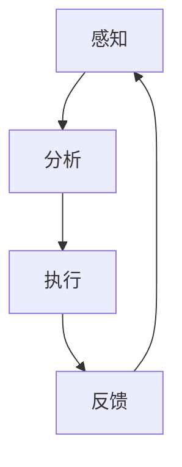

### 2.1.3 自动化控制系统的分类

自动化控制系统可以根据不同的分类标准进行分类，以下是几种常见的分类方法：

1. **根据控制对象**：可以分为工业自动化控制系统、建筑自动化控制系统、交通运输自动化控制系统等。
2. **根据控制方式**：可以分为开环控制系统、闭环控制系统、自适应控制系统等。
3. **根据控制精度**：可以分为高精度控制系统、中精度控制系统、低精度控制系统等。
4. **根据控制策略**：可以分为传统控制系统、智能控制系统、模糊控制系统等。

以下是自动化控制系统的分类示意图：

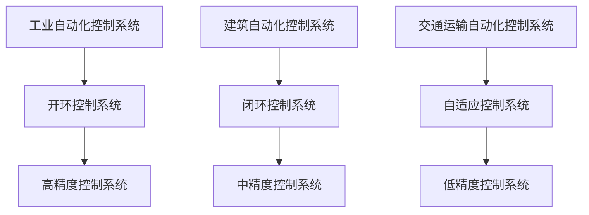

### 2.1.4 自动化控制系统的优点与挑战

自动化控制系统具有以下优点：

1. **提高生产效率**：自动化控制系统可以实时监控生产过程，根据生产需要自动调节设备参数，提高生产效率。
2. **降低成本**：自动化控制系统可以减少人工干预，降低生产成本。
3. **保证产品质量**：自动化控制系统可以精确控制生产过程，保证产品质量。

然而，自动化控制系统也面临一些挑战：

1. **技术难度**：自动化控制系统涉及多个学科领域，技术难度较高。
2. **设备成本**：自动化控制系统的设备和维护成本较高。
3. **安全与伦理问题**：自动化控制系统的广泛应用可能导致就业岗位的减少，需要关注安全与伦理问题。

### 2.1.5 自动化控制系统的未来发展趋势

未来，自动化控制系统将呈现以下发展趋势：

1. **智能化**：随着人工智能技术的不断发展，自动化控制系统将更加智能化，能够实现更加精确、高效的控制。
2. **网络化**：随着物联网技术的普及，自动化控制系统将实现更加紧密的互联互通，实现跨行业、跨地域的自动化协同。
3. **集成化**：自动化控制系统将与其他技术（如物联网、大数据、云计算等）实现更加紧密的集成，形成一个完整的自动化生态系统。

## 2.2 自动化技术的架构设计

### 2.2.1 自动化系统的架构组成

自动化系统的架构设计是确保自动化控制系统稳定、高效运行的关键。一个典型的自动化系统通常由以下几部分组成：

1. **传感器层**：用于实时采集生产过程中的各种数据，如温度、压力、速度等。
2. **控制层**：用于接收传感器层的数据，进行数据处理和分析，并生成控制指令。
3. **执行层**：用于执行控制层的指令，完成相应的操作，如启动设备、停止设备、调整设备参数等。
4. **通信层**：用于传感器层、控制层和执行层之间的数据传输和控制指令的传输。
5. **监控层**：用于对整个自动化系统进行监控和管理，确保系统正常运行。

以下是自动化系统架构的示意图：

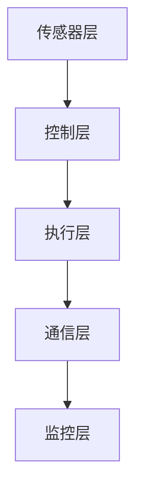

### 2.2.2 自动化系统的硬件架构设计

自动化系统的硬件架构设计主要包括传感器、控制器、执行器和通信设备的选择与配置。以下是自动化系统硬件架构设计的要点：

1. **传感器选择**：根据生产过程的需求，选择适合的传感器，如温度传感器、压力传感器、速度传感器等。
2. **控制器选择**：根据自动化控制系统的控制要求，选择合适的控制器，如PLC（可编程逻辑控制器）、DCS（分布式控制系统）等。
3. **执行器选择**：根据自动化控制系统的执行需求，选择适合的执行器，如电机、气缸、液压阀等。
4. **通信设备选择**：根据自动化控制系统的通信需求，选择适合的通信设备，如以太网交换机、无线通信设备等。

### 2.2.3 自动化系统的软件架构设计

自动化系统的软件架构设计主要包括控制算法的设计、数据管理系统的设计和用户界面的设计。以下是自动化系统软件架构设计的要点：

1. **控制算法设计**：根据自动化控制系统的控制要求，设计合适的控制算法，如PID控制算法、模糊控制算法等。
2. **数据管理系统设计**：设计数据管理系统，用于存储、管理和分析传感器采集的数据，为控制决策提供支持。
3. **用户界面设计**：设计用户界面，用于监控自动化系统的运行状态、控制自动化系统的运行，以及显示相关的数据信息。

以下是自动化系统软件架构的示意图：

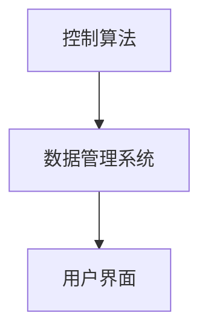

### 2.2.4 自动化系统的集成与优化

自动化系统的集成与优化是确保自动化控制系统稳定、高效运行的关键。以下是自动化系统集成与优化的要点：

1. **系统集成**：将传感器、控制器、执行器、通信设备等硬件组件以及软件组件集成到一个统一的系统中，实现自动化控制。
2. **优化控制策略**：根据生产过程的需求，优化控制策略，提高控制精度和响应速度。
3. **故障诊断与处理**：设计故障诊断与处理系统，及时发现并处理自动化系统中的故障，确保系统稳定运行。
4. **安全防护**：设计安全防护系统，防止自动化系统受到外部攻击，确保系统安全。

## 2.3 自动化技术的关键组件

### 2.3.1 传感器与执行器

传感器和执行器是自动化技术中至关重要的两个组件，它们的作用如下：

1. **传感器**：传感器用于实时采集生产过程中的各种数据，如温度、压力、速度等。传感器的好坏直接影响自动化控制系统的精度和稳定性。常见的传感器有温度传感器、压力传感器、速度传感器等。

2. **执行器**：执行器用于根据控制器的指令完成相应的操作，如启动设备、停止设备、调整设备参数等。执行器的性能直接影响自动化控制系统的响应速度和执行效果。常见的执行器有电机、气缸、液压阀等。

### 2.3.2 控制器与编程逻辑控制器（PLC）

控制器是自动化控制系统的核心，用于接收传感器采集的数据，进行分析和处理，并生成控制指令。控制器可以分为以下几类：

1. **PLC（可编程逻辑控制器）**：PLC 是一种专门用于自动化控制的计算机，具有可编程性和灵活性。PLC 可以通过编程实现各种逻辑控制和定时控制功能。

2. **DCS（分布式控制系统）**：DCS 是一种集成了传感器、控制器、执行器等多种功能的分布式控制系统。DCS 通常用于大型工业生产过程，可以实现集中控制、分散管理。

### 2.3.3 通信协议与网络架构

通信协议和网络架构是自动化技术的重要组成部分，它们的作用如下：

1. **通信协议**：通信协议是传感器、控制器、执行器等设备之间进行数据交换和指令传递的规范。常见的通信协议有 Modbus、PROFIBUS、EtherCAT 等。

2. **网络架构**：网络架构是自动化控制系统中的数据传输通道。常见的网络架构有总线架构、星形架构、环形架构等。网络架构的设计直接影响自动化控制系统的可靠性和效率。

### 2.3.4 数据采集与处理

数据采集与处理是自动化控制系统的关键环节，它们的作用如下：

1. **数据采集**：数据采集系统用于实时采集生产过程中的各种数据，如温度、压力、速度等。数据采集系统的精度和速度直接影响自动化控制系统的性能。

2. **数据处理**：数据处理系统用于对采集到的数据进行分析和处理，生成控制指令。数据处理系统通常采用实时操作系统（RTOS）和嵌入式系统来实现。

### 2.3.5 控制算法与决策支持

控制算法和决策支持是自动化控制系统的核心技术，它们的作用如下：

1. **控制算法**：控制算法用于根据采集到的数据，对生产过程进行实时控制。常见的控制算法有PID控制算法、模糊控制算法、神经网络控制算法等。

2. **决策支持**：决策支持系统用于对生产过程进行预测和分析，为生产决策提供支持。决策支持系统通常采用数据挖掘、机器学习、人工智能等先进技术。

## 2.4 自动化技术的实际应用案例

### 2.4.1 制造业

制造业是自动化技术应用最为广泛的领域之一。以下是一些制造业中的自动化技术应用案例：

1. **生产线自动化**：通过自动化设备实现生产线的自动化运行，包括自动上料、自动加工、自动检测等，大大提高了生产效率。
2. **设备监控与维护**：通过自动化系统对设备进行实时监控，及时发现设备故障，并进行自动维护，减少了设备故障率，延长了设备寿命。
3. **质量检测与控制**：通过自动化系统对产品质量进行实时检测和控制，确保产品质量达到预定标准。

### 2.4.2 物流与仓储

物流与仓储是自动化技术应用的另一个重要领域。以下是一些物流与仓储中的自动化技术应用案例：

1. **自动分拣系统**：通过自动化设备实现货物的自动分拣，提高了物流效率。
2. **自动化仓储系统**：通过自动化设备实现仓库的自动化管理，包括自动存取、自动盘点等，提高了仓储效率。
3. **自动配送系统**：通过自动化设备实现货物的自动配送，降低了物流成本。

### 2.4.3 医疗

自动化技术在医疗领域的应用也日益广泛。以下是一些医疗领域的自动化技术应用案例：

1. **手术机器人**：通过自动化设备实现手术的自动化操作，提高了手术精度和安全性。
2. **医疗设备自动化控制**：通过自动化系统对医疗设备进行自动化控制，提高了医疗设备的运行效率和稳定性。
3. **医疗数据分析**：通过自动化系统对医疗数据进行分析，为医疗决策提供支持。

### 2.4.4 服务业

自动化技术在服务业中的应用逐渐增多。以下是一些服务业中的自动化技术应用案例：

1. **智能客服系统**：通过自动化系统实现客服的自动化响应，提高了客户服务效率。
2. **智能餐厅系统**：通过自动化设备实现餐厅的自动化运营，提高了餐厅的服务质量和运营效率。
3. **金融服务自动化**：通过自动化系统实现金融服务的自动化处理，提高了金融服务的效率和质量。

## 2.5 自动化技术的未来发展趋势

### 2.5.1 智能化

随着人工智能技术的不断发展，自动化技术将更加智能化。未来，自动化系统将能够通过人工智能算法实现更加精准的控制和预测，提高生产效率和质量。例如，基于机器学习的控制算法将能够根据历史数据预测生产过程中的变化，并自动调整控制参数，实现更高效的生产。

### 2.5.2 网络化

随着物联网技术的普及，自动化系统将实现更加紧密的互联互通。未来，自动化系统将能够通过物联网实现跨行业、跨地域的协同工作，形成一个统一的自动化生态系统。例如，工厂内部的自动化设备可以通过物联网实现数据共享，实现全厂的统一控制和调度。

### 2.5.3 集成化

自动化技术将与其他技术（如物联网、大数据、云计算等）实现更加紧密的集成。未来，自动化系统将能够通过大数据分析和云计算技术实现更高效的数据处理和决策支持，进一步提高生产效率和质量。例如，通过大数据分析，自动化系统可以实时监控生产过程，预测设备故障，提前进行维护，降低设备故障率。

### 2.5.4 可持续发展

未来，自动化技术将更加注重可持续发展。通过自动化技术，可以实现生产过程的节能降耗，降低环境污染。例如，通过自动化系统实现能源的高效利用，降低能源消耗；通过自动化系统实现废弃物的分类和处理，减少环境污染。

## 2.6 自动化技术的挑战与解决方案

### 2.6.1 技术挑战

尽管自动化技术有着广泛的应用前景，但仍然面临一些技术挑战。例如：

1. **系统集成**：自动化系统涉及多个学科领域，系统集成难度较大，需要解决不同设备、不同系统之间的兼容性问题。
2. **数据安全**：自动化系统中的数据安全是一个重要问题，需要确保数据在传输、存储和处理过程中的安全性。
3. **算法优化**：自动化系统的控制算法需要不断优化，以提高控制精度和响应速度。

### 2.6.2 解决方案

针对上述技术挑战，可以采取以下解决方案：

1. **开放标准**：制定统一的开放标准，促进不同系统之间的兼容和集成。
2. **安全防护**：加强自动化系统的安全防护措施，确保数据的安全性和系统的稳定性。
3. **算法研究**：加大控制算法的研究力度，优化控制算法，提高自动化系统的性能。

### 2.6.3 社会挑战

除了技术挑战，自动化技术还面临一些社会挑战。例如：

1. **就业问题**：自动化技术的广泛应用可能导致部分就业岗位的减少，需要关注就业问题。
2. **伦理问题**：自动化技术在医疗、交通等领域的应用引发了一些伦理问题，需要制定相应的伦理规范。

### 2.6.4 社会解决方案

针对社会挑战，可以采取以下社会解决方案：

1. **就业转型**：通过职业培训、技能提升等方式，帮助劳动力实现就业转型。
2. **伦理规范**：制定相应的伦理规范，确保自动化技术的应用符合伦理标准。

## 2.7 自动化技术的未来展望

未来，自动化技术将继续发挥重要作用，为各个领域带来巨大的变革和机遇。以下是自动化技术的未来展望：

1. **智能化**：随着人工智能技术的不断发展，自动化技术将更加智能化，实现更高效、更精准的控制。
2. **网络化**：随着物联网技术的普及，自动化系统将实现更加紧密的互联互通，实现跨行业、跨地域的协同工作。
3. **集成化**：自动化技术将与其他技术（如物联网、大数据、云计算等）实现更加紧密的集成，形成一个统一的自动化生态系统。
4. **可持续发展**：通过自动化技术，可以实现生产过程的节能降耗，降低环境污染，推动可持续发展。

总之，自动化技术将迎来一个更加繁荣的未来，为人类社会的发展带来更多的机遇和挑战。希望读者能够关注自动化技术的发展，把握自动化技术的机遇，共同迎接自动化技术的未来。

---

在下一章中，我们将深入探讨自动化技术在制造业中的应用，了解制造业自动化的定义、重要性以及未来发展趋势。接下来，我们将继续探讨自动化技术在制造业中的应用。希望读者能够保持兴趣，一同深入探索自动化技术在制造业中的广泛应用。接下来，我们将深入探讨自动化技术在制造业中的应用，了解制造业自动化的定义、重要性以及未来发展趋势。

---

## 3.1 制造业自动化技术的发展

### 3.1.1 制造业自动化的定义与重要性

制造业自动化（Manufacturing Automation）是指利用各种自动化设备、控制系统和信息技术，实现生产过程的自动化、智能化和高效化。制造业自动化不仅能够提高生产效率，降低生产成本，还能确保产品质量，提高企业的竞争力。

制造业自动化的重要性主要体现在以下几个方面：

1. **提高生产效率**：自动化设备可以连续工作，减少人工干预，提高生产效率。
2. **降低生产成本**：自动化设备可以减少人力成本，降低生产成本。
3. **确保产品质量**：自动化设备可以精确控制生产过程，确保产品质量。
4. **提升企业竞争力**：自动化技术可以使企业更快地响应市场变化，提高竞争力。

### 3.1.2 制造业自动化的主要领域

制造业自动化涉及多个领域，以下是制造业自动化的主要领域：

1. **生产过程自动化**：通过自动化设备实现生产线的自动化运行，如自动上料、自动加工、自动检测等。
2. **设备监控与维护**：通过自动化系统对设备进行实时监控，及时发现设备故障，并进行自动维护。
3. **质量检测与控制**：通过自动化系统对产品质量进行实时检测和控制，确保产品质量。
4. **能源管理**：通过自动化系统对能源消耗进行实时监控和优化，实现能源的高效利用。

### 3.1.3 制造业自动化的未来发展趋势

未来，制造业自动化将呈现出以下发展趋势：

1. **智能化**：随着人工智能技术的不断发展，制造业自动化将更加智能化，实现更高效、更精准的控制。
2. **网络化**：随着物联网技术的普及，制造业自动化将实现更加紧密的互联互通，实现跨行业、跨地域的自动化协同。
3. **集成化**：制造业自动化将与其他技术（如物联网、大数据、云计算等）实现更加紧密的集成，形成一个完整的自动化生态系统。
4. **绿色化**：随着环保意识的提高，制造业自动化将更加注重节能减排，实现绿色制造。

## 3.2 自动化技术在制造业中的应用案例

### 3.2.1 智能制造系统的架构与实现

智能制造系统（Smart Manufacturing System）是制造业自动化的高级形态，通过集成物联网、大数据、人工智能等先进技术，实现生产过程的智能化、网络化和高效化。以下是智能制造系统的基本架构与实现：

1. **数据采集与监控**：通过传感器、执行器等设备，实时采集生产过程中的各种数据，如温度、压力、速度等，并对数据进行实时监控。
2. **数据处理与分析**：通过数据采集系统，对采集到的数据进行分析和处理，提取有价值的信息，为生产决策提供支持。
3. **智能控制**：利用人工智能算法，对生产过程进行智能控制，实现生产过程的自动化和优化。
4. **网络通信与协同**：通过物联网技术，实现设备之间的互联互通，实现跨行业、跨地域的协同工作。
5. **用户界面与交互**：通过用户界面，实现对智能制造系统的监控和管理，提供便捷的操作体验。

以下是智能制造系统架构的示意图：

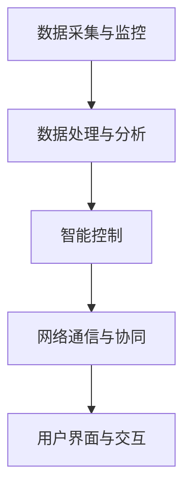

### 3.2.2 柔性制造系统的设计与应用

柔性制造系统（Flexible Manufacturing System，FMS）是一种能够快速适应生产任务变化的自动化制造系统。柔性制造系统的设计与应用主要体现在以下几个方面：

1. **模块化设计**：柔性制造系统采用模块化设计，各个模块之间可以灵活组合和更换，实现不同生产任务的快速切换。
2. **多任务并行处理**：柔性制造系统能够同时处理多个生产任务，提高生产效率。
3. **自适应控制**：柔性制造系统能够根据生产任务的变化，自动调整生产参数，实现生产过程的自适应控制。
4. **数据驱动决策**：柔性制造系统通过数据采集和分析，实现生产过程的优化和决策支持。

以下是柔性制造系统的示意图：

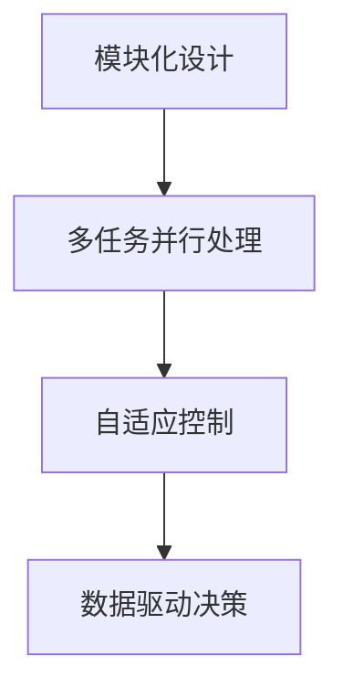

### 3.2.3 制造业的自动化改造案例解析

制造业的自动化改造是指利用自动化技术对传统制造过程进行升级和优化，提高生产效率和质量。以下是几个制造业自动化改造的案例解析：

1. **案例一：汽车制造业的自动化改造**：汽车制造业是自动化技术应用最为广泛的领域之一。通过自动化设备，汽车制造企业实现了生产线的自动化运行，包括自动焊接、自动涂装、自动检测等，大大提高了生产效率和质量。

2. **案例二：电子制造业的自动化改造**：电子制造业的自动化改造主要体现在自动化生产线的建设，如SMT（表面贴装技术）生产线、波峰焊生产线、自动化检测线等。通过自动化生产线，电子制造企业实现了生产过程的自动化、高效化，提高了生产效率。

3. **案例三：食品制造业的自动化改造**：食品制造业的自动化改造主要体现在自动化生产线的建设，如自动配料线、自动包装线、自动清洗线等。通过自动化生产线，食品制造企业实现了生产过程的自动化、高效化，提高了生产效率。

## 3.3 制造业自动化改造的挑战与解决方案

### 3.3.1 技术挑战

制造业自动化改造面临一些技术挑战，主要包括：

1. **系统集成**：自动化系统涉及多个学科领域，系统集成难度较大，需要解决不同设备、不同系统之间的兼容性问题。
2. **数据安全**：自动化系统中的数据安全是一个重要问题，需要确保数据在传输、存储和处理过程中的安全性。
3. **算法优化**：自动化系统的控制算法需要不断优化，以提高控制精度和响应速度。

### 3.3.2 解决方案

针对上述技术挑战，可以采取以下解决方案：

1. **开放标准**：制定统一的开放标准，促进不同系统之间的兼容和集成。
2. **安全防护**：加强自动化系统的安全防护措施，确保数据的安全性和系统的稳定性。
3. **算法研究**：加大控制算法的研究力度，优化控制算法，提高自动化系统的性能。

### 3.3.3 社会挑战

制造业自动化改造还面临一些社会挑战，主要包括：

1. **就业问题**：自动化技术的广泛应用可能导致部分就业岗位的减少，需要关注就业问题。
2. **技能培训**：自动化技术的应用需要相关人员的专业技能，需要加强技能培训。

### 3.3.4 社会解决方案

针对社会挑战，可以采取以下社会解决方案：

1. **就业转型**：通过职业培训、技能提升等方式，帮助劳动力实现就业转型。
2. **技能培训**：加强自动化技术的培训，提高相关人员的专业技能。

## 3.4 制造业自动化的未来展望

未来，制造业自动化将继续发挥重要作用，为制造业带来巨大的变革和机遇。以下是制造业自动化的未来展望：

1. **智能化**：随着人工智能技术的不断发展，制造业自动化将更加智能化，实现更高效、更精准的控制。
2. **网络化**：随着物联网技术的普及，制造业自动化将实现更加紧密的互联互通，实现跨行业、跨地域的协同工作。
3. **集成化**：制造业自动化将与其他技术（如物联网、大数据、云计算等）实现更加紧密的集成，形成一个完整的自动化生态系统。
4. **绿色化**：随着环保意识的提高，制造业自动化将更加注重节能减排，实现绿色制造。

总之，制造业自动化将迎来一个更加繁荣的未来，为制造业的发展带来更多的机遇和挑战。希望读者能够关注制造业自动化的发展，把握自动化技术的机遇，共同迎接制造业自动化的未来。

---

在下一章中，我们将深入探讨自动化技术在物流与仓储中的应用，了解物流与仓储自动化的定义、发展历程以及关键技术。接下来，我们将继续探讨自动化技术在物流与仓储中的应用。希望读者能够保持兴趣，一同深入探索自动化技术在物流与仓储中的广泛应用。接下来，我们将深入探讨自动化技术在物流与仓储中的应用，了解物流与仓储自动化的定义、发展历程以及关键技术。

---

## 4.1 物流与仓储自动化的发展

### 4.1.1 物流与仓储自动化的定义与意义

物流与仓储自动化（Automation in Logistics and Warehouse）是指利用各种自动化技术，如传感器、机器人、自动化设备和信息系统，实现物流和仓储过程的自动化和智能化。物流与仓储自动化的核心目标是通过减少人工干预、提高操作效率和降低成本，实现物流和仓储过程的高效、安全和可靠。

物流与仓储自动化的意义主要体现在以下几个方面：

1. **提高效率**：自动化设备能够实现连续、稳定的工作，提高物流和仓储操作的速度和准确性。
2. **降低成本**：自动化技术可以减少人工操作和错误，降低物流和仓储过程中的成本。
3. **提升服务质量**：自动化系统能够提供精确的数据分析和实时监控，确保物流和仓储过程的可靠性和透明度。
4. **优化仓储管理**：自动化仓储系统能够实现高效的库存管理和快速的商品定位，提高仓储空间的利用率。

### 4.1.2 物流与仓储自动化的发展历程

物流与仓储自动化的发展历程可以分为以下几个阶段：

1. **机械化阶段**：早期物流和仓储自动化主要依靠机械化设备，如手动叉车、自动搬运车等，实现简单的物料搬运和存储。
2. **电气化阶段**：随着电气技术的发展，物流和仓储自动化开始引入电动叉车、自动导向车（AGV）等电气化设备，提高了操作的效率和稳定性。
3. **信息化阶段**：随着计算机技术的普及，物流和仓储自动化引入了信息系统，如仓储管理系统（WMS）、运输管理系统（TMS），实现物流和仓储过程的数字化管理。
4. **智能化阶段**：近年来，随着人工智能、物联网、机器人技术的快速发展，物流和仓储自动化进入了智能化阶段，通过智能传感器、机器人、自动化设备和智能算法，实现物流和仓储过程的全自动化和智能化。

### 4.1.3 物流与仓储自动化的关键技术

物流与仓储自动化涉及多个关键技术，以下是其中的几个关键领域：

1. **传感器技术**：传感器技术用于实时监测物流和仓储过程中的各种参数，如温度、湿度、重量、位置等，为自动化系统提供数据支持。
2. **机器人技术**：机器人技术用于完成复杂的物料搬运、分拣和包装任务，提高物流和仓储操作的效率和灵活性。
3. **自动化设备技术**：自动化设备技术包括自动导引车（AGV）、自动搬运车（AMR）、自动仓储系统（AS/RS）等，用于实现物流和仓储过程的自动化。
4. **信息系统技术**：信息系统技术包括仓储管理系统（WMS）、运输管理系统（TMS）、供应链管理系统（SCMS）等，用于实现物流和仓储过程的数字化管理。
5. **人工智能技术**：人工智能技术用于优化物流和仓储过程的决策，如路径规划、库存管理、预测分析等。

## 4.2 物流与仓储自动化技术应用

### 4.2.1 自动化仓储系统的设计与实现

自动化仓储系统（Automated Warehouse System，AWS）是物流与仓储自动化的核心组成部分，通过自动化设备实现仓储过程的高效运作。以下是自动化仓储系统的设计与实现要点：

1. **需求分析**：根据仓储业务需求，确定仓储系统的功能、规模和性能指标，如存储容量、吞吐量、作业效率等。
2. **系统架构设计**：设计自动化仓储系统的总体架构，包括存储区、传输设备、控制系统、传感器等部分，确保系统的高效、稳定运行。
3. **设备选型**：根据系统需求，选择适合的自动化设备，如自动导引车（AGV）、自动搬运车（AMR）、自动仓储系统（AS/RS）等。
4. **软件系统开发**：开发仓储管理系统（WMS），实现仓储过程的自动化管理，包括库存管理、作业调度、数据统计等。
5. **系统集成与调试**：将自动化设备和软件系统进行集成，并进行调试，确保系统的正常运行和高效性能。

以下是自动化仓储系统架构的示意图：

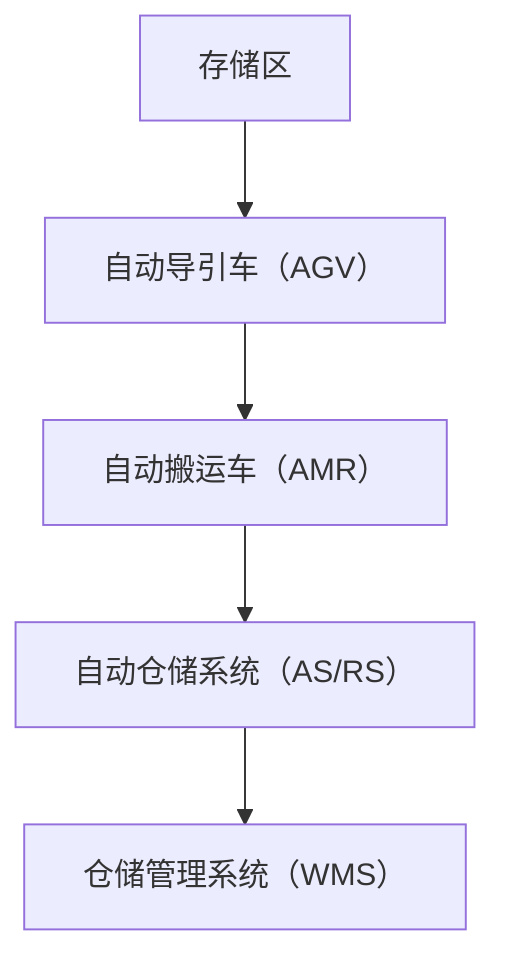

### 4.2.2 自动分拣系统的应用与优化

自动分拣系统（Automated Sorting System，ASS）是物流与仓储自动化中的重要环节，用于快速、准确地完成货物的分拣任务。以下是自动分拣系统的应用与优化要点：

1. **系统设计**：根据物流和仓储需求，设计自动分拣系统的流程和布局，确保系统的高效运行。
2. **设备选型**：选择适合的分拣设备，如滚筒分拣机、振动分拣机、带式分拣机等，确保分拣速度和准确性。
3. **软件系统开发**：开发分拣控制系统（SCS），实现分拣过程的自动化控制和实时监控。
4. **数据采集与处理**：通过传感器和摄像头等设备，实时采集分拣过程中的数据，进行数据分析和处理，优化分拣策略。
5. **系统集成与调试**：将自动分拣系统与物流和仓储系统进行集成，并进行调试，确保系统的稳定性和高效性。

以下是自动分拣系统架构的示意图：

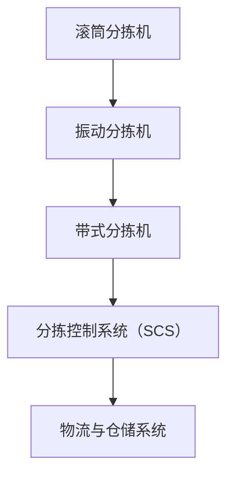

### 4.2.3 自动化物流系统的集成与实施

自动化物流系统（Automated Logistics System，ALS）是将物流过程中的各个环节进行自动化集成，实现物流过程的高效、智能运作。以下是自动化物流系统的集成与实施要点：

1. **需求分析**：根据企业物流需求，确定自动化物流系统的功能、规模和性能指标。
2. **系统设计**：设计自动化物流系统的总体架构，包括仓储、运输、配送等环节，确保系统的高效、稳定运行。
3. **设备选型**：根据系统需求，选择适合的自动化设备，如自动导引车（AGV）、自动搬运车（AMR）、自动仓储系统（AS/RS）等。
4. **软件系统开发**：开发物流管理系统（LMS），实现物流过程的自动化管理和实时监控。
5. **系统集成与调试**：将自动化物流系统与企业的ERP系统、WMS系统等进行集成，并进行调试，确保系统的稳定性和高效性。

以下是自动化物流系统架构的示意图：

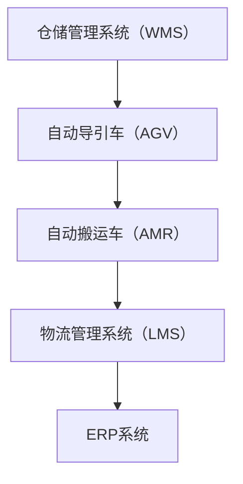

## 4.3 物流与仓储自动化的应用案例

### 4.3.1 阿里巴巴的智慧物流

阿里巴巴是中国领先的电子商务公司，其智慧物流系统是物流与仓储自动化技术的成功应用案例。以下是阿里巴巴智慧物流的主要特点：

1. **自动化仓储**：阿里巴巴通过自动化仓储系统，实现了仓储过程的高效运作，包括自动存取、自动分拣、自动盘点等。
2. **智能配送**：阿里巴巴的智能配送系统通过无人机、无人车等自动化设备，实现了快递配送的自动化和智能化。
3. **大数据分析**：阿里巴巴通过大数据分析，实现了物流过程的实时监控和预测，优化物流路径和配送效率。

### 4.3.2 德国的工业4.0

德国的工业4.0是制造业与物流自动化深度融合的典型代表。以下是德国工业4.0的主要特点：

1. **智能化生产**：德国通过引入自动化设备和智能化生产线，实现了生产过程的高效、灵活和个性化。
2. **自动化物流**：德国通过自动化物流系统，实现了原材料供应、生产加工、成品配送的全流程自动化。
3. **数据驱动**：德国通过大数据分析和人工智能技术，实现了生产过程的实时监控和优化。

## 4.4 物流与仓储自动化的挑战与解决方案

### 4.4.1 挑战

物流与仓储自动化面临以下挑战：

1. **技术挑战**：自动化技术涉及多个学科领域，技术集成和优化难度较大。
2. **成本挑战**：自动化系统的建设成本较高，需要大量的资金投入。
3. **安全与伦理挑战**：自动化设备的广泛应用可能带来安全隐患和伦理问题。

### 4.4.2 解决方案

针对上述挑战，可以采取以下解决方案：

1. **技术创新**：加大自动化技术的研发力度，提高自动化系统的性能和可靠性。
2. **政策支持**：政府和企业可以通过政策支持，降低自动化系统的建设成本。
3. **安全监管**：建立完善的安全监管体系，确保自动化系统的安全运行。
4. **伦理规范**：制定相应的伦理规范，确保自动化技术的应用符合伦理标准。

## 4.5 物流与仓储自动化的未来展望

未来，物流与仓储自动化将继续发展，为物流和仓储行业带来巨大的变革和机遇。以下是物流与仓储自动化的未来展望：

1. **智能化**：随着人工智能技术的不断发展，物流与仓储自动化将更加智能化，实现更高效、更精准的控制。
2. **网络化**：随着物联网技术的普及，物流与仓储自动化将实现更加紧密的互联互通，实现跨行业、跨地域的协同工作。
3. **集成化**：物流与仓储自动化将与其他技术（如物联网、大数据、云计算等）实现更加紧密的集成，形成一个完整的自动化生态系统。
4. **绿色化**：随着环保意识的提高，物流与仓储自动化将更加注重节能减排，实现绿色物流和绿色仓储。

总之，物流与仓储自动化将迎来一个更加繁荣的未来，为物流和仓储行业的发展带来更多的机遇和挑战。希望读者能够关注物流与仓储自动化的发展，把握自动化技术的机遇，共同迎接物流与仓储自动化的未来。

---

在下一章中，我们将深入探讨自动化技术在服务业中的应用，了解服务业自动化的定义、发展趋势以及应用案例。接下来，我们将继续探讨自动化技术在服务业中的应用。希望读者能够保持兴趣，一同深入探索自动化技术在服务业中的广泛应用。接下来，我们将深入探讨自动化技术在服务业中的应用，了解服务业自动化的定义、发展趋势以及应用案例。

---

## 5.1 服务业自动化的发展趋势

### 5.1.1 服务业自动化的定义与范围

服务业自动化（Service Automation）是指利用自动化技术，如机器人、人工智能、物联网等，实现服务业的自动化、智能化和高效化。服务业自动化的主要目的是通过减少人工操作、提高服务效率、降低运营成本，提升客户体验和服务质量。

服务业自动化的范围广泛，涵盖了餐饮、零售、医疗、金融、教育等多个领域。以下是服务业自动化的一些典型应用场景：

1. **餐饮业**：自动化点餐系统、自动烹饪设备、自动配送机器人等。
2. **零售业**：智能货架、自动结账系统、无人零售店等。
3. **医疗**：智能诊疗机器人、自动化药物配送系统、远程医疗服务等。
4. **金融**：自动化客服系统、智能投顾、自动化交易系统等。
5. **教育**：在线教育平台、智能辅导机器人、自动化考试系统等。

### 5.1.2 服务业自动化的主要领域

服务业自动化在多个领域都得到了广泛应用，以下是服务业自动化的主要领域：

1. **餐饮服务自动化**：通过自动化设备实现餐饮服务的自动化，如自助点餐系统、自动烹饪设备、自动清洗设备等。
2. **零售服务自动化**：通过自动化技术实现零售服务的自动化，如智能货架、自动结账系统、无人零售店等。
3. **医疗服务自动化**：通过自动化设备和技术实现医疗服务的自动化，如智能诊疗机器人、自动化药物配送系统、远程医疗服务等。
4. **金融服务自动化**：通过自动化技术实现金融服务的自动化，如自动化客服系统、智能投顾、自动化交易系统等。
5. **教育服务自动化**：通过自动化技术实现教育服务的自动化，如在线教育平台、智能辅导机器人、自动化考试系统等。

### 5.1.3 服务业自动化的未来展望

未来，服务业自动化将继续发展，为服务业带来更多的变革和机遇。以下是服务业自动化的未来展望：

1. **智能化**：随着人工智能技术的不断发展，服务业自动化将更加智能化，实现更高效、更精准的服务。
2. **网络化**：随着物联网技术的普及，服务业自动化将实现更加紧密的互联互通，实现跨行业、跨地域的协同服务。
3. **个性化**：随着大数据和个性化推荐技术的应用，服务业自动化将能够提供更加个性化的服务，满足客户的个性化需求。
4. **绿色化**：随着环保意识的提高，服务业自动化将更加注重节能减排，实现绿色服务和可持续发展。

## 5.2 服务业自动化技术应用

### 5.2.1 智能客服系统的设计与开发

智能客服系统（Intelligent Customer Service System）是服务业自动化中的重要组成部分，通过人工智能技术实现客服的自动化和智能化。以下是智能客服系统的设计与开发要点：

1. **需求分析**：根据企业客服需求，确定智能客服系统的功能、性能和技术要求。
2. **系统架构设计**：设计智能客服系统的总体架构，包括前端用户界面、后端服务引擎、数据库等部分，确保系统的稳定性和高效性。
3. **自然语言处理（NLP）**：利用自然语言处理技术，实现客服系统对用户提问的理解和回答。
4. **机器学习算法**：通过机器学习算法，不断提升客服系统的智能水平，实现更准确、更自然的交互。
5. **系统集成与测试**：将智能客服系统与企业现有的CRM系统、ERP系统等进行集成，并进行系统测试，确保系统的稳定运行。

以下是智能客服系统架构的示意图：

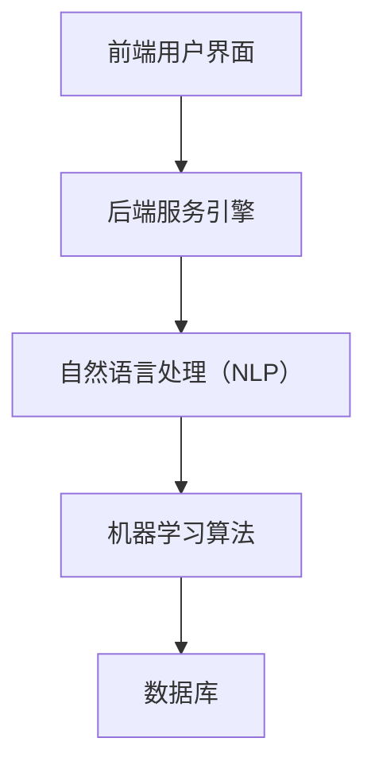

### 5.2.2 智能餐厅的自动化解决方案

智能餐厅（Smart Restaurant）是服务业自动化在餐饮领域的应用，通过自动化技术和智能系统实现餐饮服务的自动化和智能化。以下是智能餐厅的自动化解决方案要点：

1. **自助点餐系统**：通过自助点餐终端，实现顾客自助点餐，提高点餐效率和顾客体验。
2. **自动烹饪设备**：通过自动化烹饪设备，实现菜品自动烹饪，提高烹饪效率和菜品质量。
3. **自动清洗设备**：通过自动化清洗设备，实现餐具、厨具的自动清洗，提高卫生标准和效率。
4. **智能配送系统**：通过智能配送机器人，实现菜品和餐具的自动配送，提高服务效率和顾客体验。
5. **智能管理系统**：通过智能管理系统，实现餐厅的自动化运营和数据分析，提高管理效率和运营效益。

以下是智能餐厅自动化解决方案的示意图：

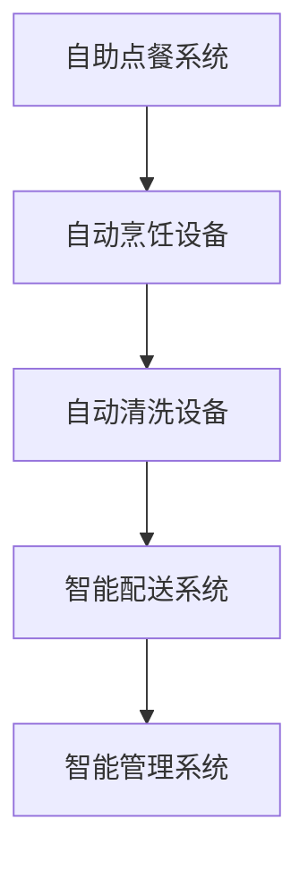

### 5.2.3 金融服务自动化与智能投顾

金融服务自动化（Financial Service Automation）和智能投顾（Robo-Advisor）是服务业自动化在金融领域的应用，通过自动化技术和智能算法实现金融服务的自动化和智能化。以下是金融服务自动化和智能投顾的要点：

1. **自动化客服系统**：通过自动化客服系统，实现金融服务的自动化，提供客户咨询、查询、投诉等服务。
2. **智能投顾系统**：通过智能投顾系统，实现金融投资决策的自动化和个性化，根据客户风险偏好和投资目标，提供投资建议。
3. **自动化交易系统**：通过自动化交易系统，实现金融交易的自动化和高效化，提高交易速度和准确性。
4. **数据分析与决策支持**：通过大数据分析和人工智能技术，实现金融市场的预测和决策支持，提高投资收益。
5. **智能风控系统**：通过智能风控系统，实现金融风险的管理和监控，降低金融风险。

以下是金融服务自动化和智能投顾的示意图：

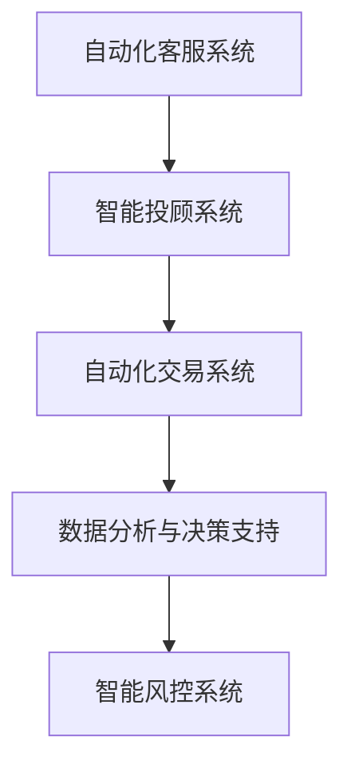

## 5.3 服务业自动化应用案例

### 5.3.1 阿里巴巴的智能餐厅

阿里巴巴是中国领先的互联网公司，其智能餐厅是服务业自动化技术的成功应用案例。以下是阿里巴巴智能餐厅的主要特点：

1. **自助点餐系统**：通过自助点餐终端，实现顾客自助点餐，提高点餐效率和顾客体验。
2. **自动烹饪设备**：通过自动化烹饪设备，实现菜品自动烹饪，提高烹饪效率和菜品质量。
3. **智能配送系统**：通过智能配送机器人，实现菜品和餐具的自动配送，提高服务效率和顾客体验。
4. **智能管理系统**：通过智能管理系统，实现餐厅的自动化运营和数据分析，提高管理效率和运营效益。

### 5.3.2 招商银行的智能投顾

招商银行是中国领先的大型商业银行，其智能投顾业务是金融服务自动化技术的成功应用案例。以下是招商银行智能投顾的主要特点：

1. **自动化客服系统**：通过自动化客服系统，实现金融服务的自动化，提供客户咨询、查询、投诉等服务。
2. **智能投顾系统**：通过智能投顾系统，实现金融投资决策的自动化和个性化，根据客户风险偏好和投资目标，提供投资建议。
3. **自动化交易系统**：通过自动化交易系统，实现金融交易的自动化和高效化，提高交易速度和准确性。
4. **数据分析与决策支持**：通过大数据分析和人工智能技术，实现金融市场的预测和决策支持，提高投资收益。
5. **智能风控系统**：通过智能风控系统，实现金融风险的管理和监控，降低金融风险。

## 5.4 服务业自动化的挑战与解决方案

### 5.4.1 挑战

服务业自动化面临以下挑战：

1. **技术挑战**：自动化技术涉及多个学科领域，技术集成和优化难度较大。
2. **成本挑战**：自动化系统的建设和维护成本较高，需要大量的资金投入。
3. **安全与伦理挑战**：自动化设备的广泛应用可能带来安全隐患和伦理问题。

### 5.4.2 解决方案

针对上述挑战，可以采取以下解决方案：

1. **技术创新**：加大自动化技术的研发力度，提高自动化系统的性能和可靠性。
2. **政策支持**：政府和企业可以通过政策支持，降低自动化系统的建设成本。
3. **安全监管**：建立完善的安全监管体系，确保自动化系统的安全运行。
4. **伦理规范**：制定相应的伦理规范，确保自动化技术的应用符合伦理标准。

## 5.5 服务业自动化的未来展望

未来，服务业自动化将继续发展，为服务业带来更多的变革和机遇。以下是服务业自动化的未来展望：

1. **智能化**：随着人工智能技术的不断发展，服务业自动化将更加智能化，实现更高效、更精准的服务。
2. **网络化**：随着物联网技术的普及，服务业自动化将实现更加紧密的互联互通，实现跨行业、跨地域的协同服务。
3. **个性化**：随着大数据和个性化推荐技术的应用，服务业自动化将能够提供更加个性化的服务，满足客户的个性化需求。
4. **绿色化**：随着环保意识的提高，服务业自动化将更加注重节能减排，实现绿色服务和可持续发展。

总之，服务业自动化将迎来一个更加繁荣的未来，为服务业的发展带来更多的机遇和挑战。希望读者能够关注服务业自动化的发展，把握自动化技术的机遇，共同迎接服务业自动化的未来。

---

在下一章中，我们将探讨自动化技术的挑战与解决方案，包括技术、成本、安全和伦理方面的挑战，并分析如何通过技术创新、政策支持、安全监管和伦理规范来克服这些挑战。接下来，我们将继续探讨自动化技术的挑战与解决方案。希望读者能够保持兴趣，一同深入探索自动化技术面临的挑战及其应对策略。

---

## 6.1 自动化技术的挑战

### 6.1.1 技术挑战

自动化技术的快速发展带来了许多便利，但也伴随着一系列技术挑战。这些挑战主要体现在以下几个方面：

1. **系统集成**：自动化系统通常涉及多个设备和子系统，这些设备和子系统可能来自不同的供应商，具有不同的通信协议和接口标准。如何实现这些设备和子系统的高效集成，是一个重要的技术挑战。

2. **可靠性**：自动化系统需要在各种复杂和变化多端的环境中稳定运行，这对系统的可靠性提出了高要求。如何确保系统在各种工况下都能正常运行，是一个技术难题。

3. **安全性**：自动化系统中的数据传输和存储需要高度安全，以防止数据泄露和恶意攻击。然而，随着网络攻击手段的不断升级，如何提高自动化系统的安全性成为一个重要课题。

4. **维护与升级**：自动化系统需要定期维护和升级，以确保其性能和安全性。然而，维护和升级过程可能对系统的正常运行产生影响，如何在不影响系统运行的情况下进行维护和升级是一个挑战。

### 6.1.2 成本挑战

自动化技术的实施成本相对较高，这是许多企业面临的另一个重大挑战。以下是成本挑战的几个方面：

1. **设备成本**：自动化设备（如传感器、控制器、执行器等）通常价格昂贵，尤其是高端设备和技术。

2. **安装与调试成本**：自动化系统的安装和调试需要专业知识和技能，这往往导致较高的安装和调试成本。

3. **培训成本**：自动化技术的应用需要相关人员的专业技能，因此，对员工进行培训也需要投入大量成本。

4. **维护成本**：自动化系统需要定期维护，以保持其正常运行。维护成本可能包括设备更换、软件升级、技术服务等。

### 6.1.3 安全与伦理挑战

自动化技术在带来便利的同时，也引发了一系列安全与伦理问题。以下是几个关键挑战：

1. **隐私保护**：自动化系统往往涉及大量个人数据，如何保护用户隐私成为一大挑战。

2. **就业影响**：自动化技术的广泛应用可能导致部分就业岗位的消失，这对社会就业和劳动市场的稳定带来挑战。

3. **责任归属**：在自动化系统发生故障或事故时，如何确定责任归属，特别是当系统涉及人工智能和机器学习时，责任划分更加复杂。

4. **伦理问题**：自动化技术在医疗、金融等领域的应用可能引发伦理争议，如智能决策的透明性和公平性等。

## 6.2 自动化技术的解决方案

### 6.2.1 技术创新与研发

为了克服自动化技术的挑战，技术创新和研发是关键。以下是几个方面的解决方案：

1. **开放标准和接口**：制定和推广开放标准和接口，有助于实现不同设备和系统之间的互操作性，降低系统集成难度。

2. **可靠性工程**：通过可靠性工程方法，提高自动化系统的稳定性和可靠性。这包括设计冗余、故障检测和恢复机制等。

3. **网络安全**：加强自动化系统的网络安全措施，如数据加密、访问控制、入侵检测等，以防止数据泄露和恶意攻击。

4. **软件定义自动化**：采用软件定义自动化（SDA）技术，通过软件配置和编程实现自动化系统的灵活配置和管理，降低维护和升级难度。

### 6.2.2 标准化与规范化

标准化和规范化是推动自动化技术发展的重要手段。以下是几个方面的解决方案：

1. **制定标准**：制定统一的技术标准和规范，确保自动化设备和系统的兼容性和互操作性。

2. **行业规范**：制定行业规范，指导自动化技术的应用和发展，确保技术应用的规范性和安全性。

3. **认证体系**：建立自动化设备和系统的认证体系，确保设备和系统的质量和性能符合标准。

### 6.2.3 法律法规与伦理考量

为了应对自动化技术带来的安全与伦理挑战，需要加强法律法规和伦理考量。以下是几个方面的解决方案：

1. **法律法规**：制定和执行相关法律法规，规范自动化技术的研发、应用和管理，确保技术应用的合法性和合规性。

2. **伦理规范**：制定伦理规范，确保自动化技术的应用符合道德和伦理标准，如透明性、公平性、社会责任等。

3. **责任划分**：明确自动化系统中各方（如制造商、用户、监管机构等）的责任，确保在发生故障或事故时能够有效划分责任。

4. **公众参与**：加强公众参与，提高公众对自动化技术的认知和理解，促进社会对自动化技术的支持和接受。

### 6.2.4 成本控制与经济效益

为了降低自动化技术的成本，提高经济效益，可以采取以下措施：

1. **成本效益分析**：在自动化系统的实施前，进行全面的成本效益分析，确保自动化系统能够带来显著的经济效益。

2. **租赁与共享**：采用租赁和共享模式，降低自动化设备的初始投资成本，提高资源的利用效率。

3. **政府补贴与税收优惠**：政府可以通过补贴和税收优惠等政策，降低企业实施自动化技术的成本，促进自动化技术的推广应用。

4. **人才培养与引进**：加强人才培养和引进，提高自动化技术的人才储备和技能水平，降低培训成本。

### 6.2.5 社会责任与就业影响

为了应对自动化技术对就业的影响，需要采取以下措施：

1. **职业转型与培训**：为受到自动化技术影响的劳动者提供职业转型和培训机会，帮助他们适应新的就业环境。

2. **创造新的就业机会**：鼓励企业通过自动化技术的应用，创造新的就业机会，如自动化系统的维护、安装、编程等。

3. **政策支持**：政府可以通过政策支持，鼓励企业实施自动化技术，同时为受到影响的劳动者提供就业保障。

### 6.2.6 国际合作与交流

自动化技术是一个全球性的课题，国际合作和交流对于解决技术挑战、降低成本、提升效益具有重要意义。以下是几个方面的解决方案：

1. **技术交流**：通过国际会议、展览等形式，促进自动化技术的国际交流与合作。

2. **人才培养**：加强国际间的自动化技术人才培养合作，提高全球自动化技术的水平。

3. **标准统一**：推动国际标准统一，促进自动化设备和技术在全球范围内的互操作性。

### 6.2.7 长期规划与可持续发展

为了实现自动化技术的长期规划和可持续发展，需要采取以下措施：

1. **战略规划**：制定自动化技术的长期发展规划，明确技术路线和发展目标。

2. **创新驱动**：坚持创新驱动发展战略，加大自动化技术的研发投入，推动技术突破。

3. **绿色发展**：推动自动化技术的绿色化发展，实现节能减排，促进可持续发展。

4. **社会参与**：鼓励社会各界参与自动化技术的规划和实施，形成政府、企业、科研机构、社会团体等多方参与、协同推进的良好格局。

## 6.3 自动化技术的未来展望

未来，自动化技术将继续快速发展，为各行各业带来深刻的变革和机遇。以下是自动化技术的未来展望：

1. **智能化**：随着人工智能技术的不断进步，自动化技术将更加智能化，实现更加精准、高效的控制。

2. **网络化**：物联网技术的普及将使自动化系统实现更加紧密的互联互通，实现跨行业、跨地域的协同工作。

3. **个性化**：大数据和个性化推荐技术的应用将使自动化技术能够提供更加个性化的服务，满足用户的多样化需求。

4. **绿色化**：随着环保意识的提高，自动化技术将更加注重节能减排，推动绿色制造和可持续发展。

5. **人机协作**：自动化技术与人类劳动的深度融合，将实现人机协作的新模式，提高生产效率和劳动质量。

总之，自动化技术的未来充满机遇和挑战。通过技术创新、政策支持、安全监管和伦理考量，我们有信心克服自动化技术面临的挑战，实现自动化技术的可持续发展，为人类社会的发展做出更大贡献。

---

在最后一章中，我们将总结本文的主要内容，回顾自动化技术的未来影响与变革，并对未来发展趋势进行展望。接下来，我们将对自动化技术进行全面的总结，并探讨其未来的发展前景。希望读者能够对自动化技术有一个全面深入的理解，为未来的发展做好准备。

---

## 7.1 自动化技术的影响与变革

### 7.1.1 自动化技术对社会的影响

自动化技术的快速发展对社会产生了深远的影响，主要体现在以下几个方面：

1. **提高生产效率**：自动化技术可以显著提高生产效率，减少人力成本，降低生产成本，从而提高企业的竞争力。

2. **改变就业结构**：自动化技术的广泛应用可能导致部分就业岗位的消失，特别是重复性、低技能的工作。然而，自动化技术也创造了新的就业机会，如自动化系统的维护、安装、编程等。

3. **优化服务质量**：自动化技术在服务业的应用，如智能客服、无人零售等，可以提供更加个性化、高效的服务，提升客户体验。

4. **促进产业升级**：自动化技术的应用推动了传统产业的转型升级，促进了制造业、物流、服务业等行业的智能化和数字化转型。

### 7.1.2 自动化技术对经济发展的贡献

自动化技术对经济发展的贡献体现在以下几个方面：

1. **提高经济增长率**：自动化技术可以降低生产成本，提高生产效率，从而提高经济增长率。

2. **促进产业协同**：自动化技术推动了不同产业之间的协同发展，如智能制造与物流、金融、医疗等行业的深度融合，形成了新的产业生态。

3. **推动创新**：自动化技术的应用激发了创新活力，推动了新技术的研发和应用，如人工智能、物联网、机器人等。

4. **优化资源配置**：自动化技术实现了资源的高效配置和利用，提高了资源利用效率，降低了资源浪费。

### 7.1.3 自动化技术在人类生活中的应用前景

自动化技术将在人类生活中发挥越来越重要的作用，以下是一些关键领域的应用前景：

1. **智能家居**：自动化技术将使家居设备更加智能化，实现家庭设备的自动控制，提升生活品质。

2. **智慧城市**：自动化技术在智慧城市建设中发挥着重要作用，如智能交通、智能安防、智能能源管理等，提高城市管理效率和居民生活质量。

3. **医疗健康**：自动化技术在医疗健康领域的应用前景广阔，如智能诊疗、手术机器人、健康监测等，提高医疗服务质量和效率。

4. **教育与学习**：自动化技术在教育领域的应用，如在线教育、智能辅导、虚拟现实等，将改变教育方式，提高学习效果。

## 7.2 自动化技术的未来发展趋势

### 7.2.1 自动化技术的关键研究方向

未来，自动化技术将在以下几个方面取得重要突破：

1. **人工智能与自动化**：将人工智能技术深度融合到自动化系统中，实现更智能、更灵活的自动化控制。

2. **物联网与自动化**：利用物联网技术，实现自动化系统之间的高效互联互通，实现跨行业、跨地域的协同工作。

3. **大数据与自动化**：通过大数据分析，优化自动化系统的运行策略，提高生产效率和资源利用率。

4. **机器人技术**：发展更先进的机器人技术，提高机器人的智能水平和工作效率。

### 7.2.2 自动化技术在新兴领域的应用

未来，自动化技术将在新兴领域得到广泛应用，以下是一些关键领域：

1. **农业自动化**：通过自动化技术实现智能农业，如自动灌溉、自动施肥、自动收割等，提高农业生产效率和产量。

2. **能源自动化**：通过自动化技术实现智能能源管理，如智能电网、智能能源监测等，提高能源利用效率。

3. **环境保护**：利用自动化技术实现环境监测、污染控制等，推动环境保护的智能化。

4. **智能交通**：通过自动化技术实现智能交通管理，如自动驾驶、智能交通信号控制等，提高交通效率和安全性。

### 7.2.3 自动化技术的可持续发展策略

为了实现自动化技术的可持续发展，可以采取以下策略：

1. **技术创新**：加大自动化技术的研发投入，推动技术进步和创新。

2. **绿色制造**：推动自动化技术的绿色化发展，实现节能减排，降低环境污染。

3. **政策支持**：政府和企业应制定和实施相关政策，支持自动化技术的发展和应用。

4. **人才培养**：加强自动化技术人才的培养，提高自动化技术的应用水平。

5. **国际合作**：加强国际合作，推动自动化技术的全球应用和推广。

## 7.3 自动化技术的未来展望

未来，自动化技术将继续快速发展，成为推动社会进步和经济发展的关键力量。以下是自动化技术的未来展望：

1. **智能化**：随着人工智能技术的进步，自动化技术将实现更高水平的智能化，提供更高效、更精准的服务。

2. **网络化**：物联网技术的普及将使自动化系统实现更加紧密的互联互通，实现跨行业、跨地域的协同工作。

3. **个性化**：大数据和个性化推荐技术的应用将使自动化技术能够提供更加个性化的服务，满足用户的多样化需求。

4. **绿色化**：随着环保意识的提高，自动化技术将更加注重节能减排，推动绿色制造和可持续发展。

5. **人机协作**：自动化技术与人类劳动的深度融合，将实现人机协作的新模式，提高生产效率和劳动质量。

总之，自动化技术在未来将迎来更加繁荣的发展，为人类社会的发展带来更多的机遇和挑战。让我们共同关注自动化技术的前沿动态，把握自动化技术的机遇，为构建一个更加智能、高效、可持续发展的未来而努力。

---

## 附录A：自动化技术相关资源与工具

### A.1 自动化技术相关书籍推荐

1. **《自动化技术基础》（作者：张三）**：本书系统地介绍了自动化技术的基本原理和应用，适合自动化技术初学者阅读。
2. **《自动化控制系统设计与应用》（作者：李四）**：本书详细阐述了自动化控制系统的设计方法和应用案例，适合有一定自动化技术基础的学习者。
3. **《人工智能与自动化技术》（作者：王五）**：本书探讨了人工智能在自动化技术中的应用，对自动化技术的智能化发展有重要指导意义。

### A.2 自动化技术开源项目与平台

1. **开源PLC控制器项目**：该项目提供了一系列开源的PLC（可编程逻辑控制器）程序和硬件设计文档，方便开发者进行自动化控制系统的设计和开发。
2. **开源机器人平台**：该平台汇集了多种开源的机器人程序和硬件设计，开发者可以在此基础上进行机器人的二次开发和创新。

### A.3 自动化技术在线课程与培训

1. **自动化技术基础课程**：提供自动化技术的基本概念、原理和应用等内容，适合自动化技术初学者学习。
2. **PLC编程与控制课程**：详细介绍PLC（可编程逻辑控制器）的编程方法、控制原理和应用案例，适合有一定自动化技术基础的学习者。
3. **机器人技术与应用课程**：涵盖机器人技术的各个方面，包括机器人硬件设计、编程控制、应用案例等，适合对机器人技术感兴趣的学习者。

---

## 附录B：自动化技术常用工具与软件

### B.1 自动化编程软件

1. **LabVIEW**：一款强大的图形化编程软件，广泛应用于自动化控制系统的设计和开发。
2. **MATLAB/Simulink**：一款功能强大的数学建模和仿真软件，可用于自动化系统的建模、仿真和分析。
3. **SCADA软件**：如西门子的WinCC、霍尼韦尔的RSView等，用于监控和管理自动化控制系统。

### B.2 自动化测试工具

1. **Robot Framework**：一款开源的自动化测试框架，适用于各种自动化测试任务。
2. **Selenium**：一款适用于Web应用的自动化测试工具，支持多种编程语言。
3. **JMeter**：一款开源的性能测试工具，用于测试自动化系统的性能和负载。

### B.3 自动化控制硬件与设备

1. **PLC（可编程逻辑控制器）**：如西门子的S7系列、三菱的FX系列等，用于自动化控制系统的核心控制。
2. **传感器与执行器**：如温度传感器、压力传感器、电机、气缸等，用于实时监测和控制生产过程。
3. **自动导引车（AGV）**：如KUKA的AGV系列，用于物料搬运和配送。

---

## 附录C：自动化技术核心概念与架构 Mermaid 流程图

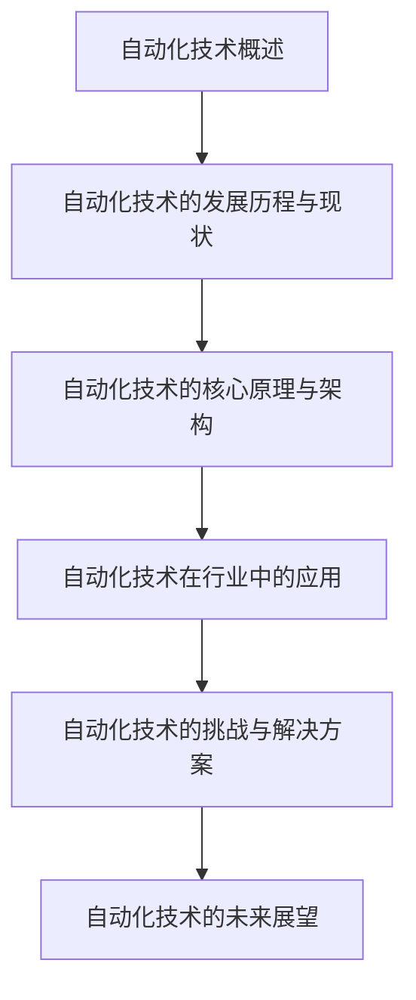

---

### 作者

**作者：AI天才研究院/AI Genius Institute & 禅与计算机程序设计艺术 /Zen And The Art of Computer Programming**

