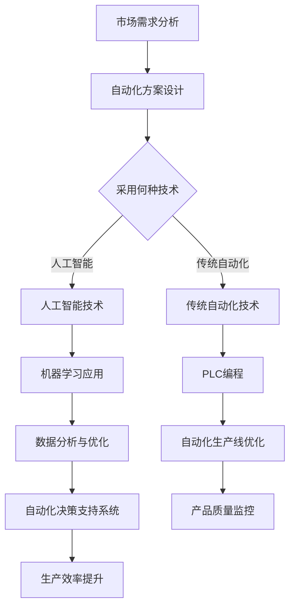

                 

# 自动化技术的未来趋势

## 关键词

- 自动化技术
- 人工智能
- 智能制造
- 服务业自动化
- 物流与农业自动化

## 摘要

本文旨在探讨自动化技术的未来发展趋势。随着人工智能、物联网、大数据等新兴技术的快速发展，自动化技术已经渗透到各个行业，极大地提高了生产效率和降低了成本。本文将首先回顾自动化技术的起源与演变，接着分析人工智能与自动化技术的融合，并深入探讨自动化技术在制造业、服务业、农业与物流等领域的未来趋势。此外，还将探讨自动化技术面临的挑战及其应对策略，最后展望自动化技术的未来发展方向。通过本文的探讨，希望能够为读者提供对自动化技术发展趋势的深刻理解和有益的启示。

## 第一部分：自动化技术的未来趋势概述

### 第1章：自动化技术的起源与演变

#### 1.1 自动化的定义与历史背景

自动化（Automation）是指通过采用机械设备、电子设备、计算机系统等技术手段，使生产、管理、服务等过程实现自动进行，从而减少人力投入、提高效率和降低成本。自动化的概念最早可以追溯到古希腊时期的自动机械，但现代意义上的自动化则起源于20世纪初期。

在20世纪初期，随着工业革命的深入发展，生产过程中的自动化需求日益增加。1911年，美国工程师亨利·福特提出了“福特生产体系”，通过流水线和自动化设备的应用，实现了汽车生产的规模化、标准化，极大地提高了生产效率。

#### 1.2 传统自动化技术及其局限性

传统自动化技术主要依赖于机械设备和电子设备，通过预设的程序和规则来实现生产过程的自动化。虽然传统自动化技术在提高生产效率、降低成本等方面取得了显著成效，但其也存在一定的局限性：

1. **对人工操作的依赖性较高**：传统自动化设备通常需要人工进行编程和调试，操作复杂，对操作人员的技术水平要求较高。

2. **灵活性不足**：传统自动化设备通常只能执行预先设定的操作，无法应对生产过程中的变化和异常情况。

3. **适应能力差**：传统自动化设备在生产规模和产品品种发生变化时，往往需要进行大规模的改造和升级。

4. **智能化程度低**：传统自动化设备主要依赖于机械和电子设备的运动和逻辑控制，缺乏智能化和自主决策能力。

#### 1.3 自动化技术的最新发展动态

随着人工智能、物联网、大数据等新兴技术的快速发展，自动化技术也在不断演变和升级。以下是一些自动化技术的最新发展动态：

1. **人工智能在自动化中的应用**：人工智能（AI）技术的不断发展，使得自动化系统具有了自主学习和自主决策能力。例如，通过机器学习算法，自动化系统可以实现对生产过程的实时监控和调整，提高生产效率和产品质量。

2. **物联网（IoT）的普及**：物联网技术的普及，使得自动化系统可以通过连接各种传感器和设备，实现对生产过程的全天候监控和实时数据采集，提高了生产过程的透明度和可控性。

3. **大数据与云计算的结合**：大数据和云计算技术的结合，使得自动化系统可以处理和分析海量的生产数据，从中挖掘出有价值的信息，为生产过程的优化和决策提供支持。

4. **自动化技术的多样化**：随着自动化技术的不断发展，各种新型自动化设备和技术不断涌现，如机器人、3D打印、自动化仓储等，为各行各业提供了更多的选择和解决方案。

#### 1.4 自动化技术在各行业中的应用现状

自动化技术已经在各行业得到了广泛应用，以下是自动化技术在不同行业中的应用现状：

1. **制造业**：自动化技术在制造业中的应用最为广泛，如自动化生产线、自动化装配、自动化检测等，通过提高生产效率、降低生产成本、提高产品质量，实现了制造业的转型升级。

2. **服务业**：在服务业中，自动化技术主要用于提高服务效率和降低人力成本，如智能客服、自动化零售、无人商店等。

3. **物流与仓储**：自动化技术在物流与仓储中的应用，如自动化分拣、自动化配送、自动化仓储等，通过提高物流效率、降低物流成本，实现了物流行业的快速发展。

4. **农业**：在农业中，自动化技术主要用于提高农业生产效率，如自动化灌溉、自动化施肥、自动化收割等。

5. **医疗健康**：在医疗健康领域，自动化技术主要用于提高医疗服务效率，如自动化药房、自动化手术机器人等。

### 第2章：人工智能与自动化技术的融合

随着人工智能技术的快速发展，其在自动化技术中的应用越来越广泛，为自动化技术带来了新的发展契机。本节将探讨人工智能与自动化技术的融合，分析其在各领域的应用。

#### 2.1 人工智能在自动化中的应用

人工智能（AI）技术在自动化中的应用主要体现在以下几个方面：

1. **自动化控制**：人工智能技术可以实现对自动化系统的自适应控制和优化。例如，通过机器学习算法，自动化系统可以根据实时数据自动调整生产参数，提高生产效率和产品质量。

2. **故障预测与维护**：人工智能技术可以对自动化系统进行实时监控和故障预测，提前发现潜在故障，降低设备故障率和停机时间。

3. **路径规划与导航**：在物流和仓储领域，人工智能技术可以用于实现自动化设备的智能路径规划和导航，提高物流效率。

4. **智能检测与识别**：人工智能技术可以用于自动化系统的智能检测和识别，例如，通过计算机视觉技术，自动化系统可以实现对产品质量的实时检测和缺陷识别。

5. **智能决策支持**：人工智能技术可以为自动化系统提供智能决策支持，例如，通过数据分析，自动化系统可以自动优化生产计划，提高生产效率。

#### 2.2 机器学习在自动化控制中的应用

机器学习（ML）是人工智能的一个重要分支，其在自动化控制中的应用越来越广泛。以下是一些机器学习在自动化控制中的应用实例：

1. **自适应控制**：通过机器学习算法，自动化系统可以自动调整控制参数，实现对生产过程的自适应控制。例如，在温度控制系统中，机器学习算法可以根据实时数据自动调整加热功率，保持恒定的温度。

2. **故障诊断**：机器学习算法可以用于自动化系统的故障诊断，通过对历史数据的学习，识别出故障模式，提前预测和诊断故障。

3. **预测性维护**：通过机器学习算法，自动化系统可以预测设备未来的故障，实现预测性维护，减少设备停机时间和维修成本。

4. **智能调度**：机器学习算法可以用于自动化系统的智能调度，优化生产计划，提高生产效率。例如，在制造企业中，机器学习算法可以根据订单数据和生产线状态，自动生成最优的生产计划。

5. **智能优化**：机器学习算法可以用于自动化系统的优化，例如，在物流和仓储领域，机器学习算法可以优化路径规划和库存管理，提高物流效率。

#### 2.3 智能传感器与自动化系统

智能传感器是自动化系统中不可或缺的一部分，其与人工智能技术的结合，使得自动化系统具有了更强大的感知能力和智能决策能力。以下是一些智能传感器在自动化系统中的应用：

1. **环境监测**：智能传感器可以实时监测环境参数，如温度、湿度、压力等，自动化系统可以根据监测数据自动调整生产参数，保证生产过程的环境条件。

2. **设备状态监测**：智能传感器可以实时监测设备的状态，如振动、温度、电流等，自动化系统可以根据监测数据提前发现设备故障，实现预测性维护。

3. **质量检测**：智能传感器可以用于自动化系统的质量检测，例如，在制造领域，智能传感器可以实时检测产品的尺寸、重量、颜色等参数，确保产品质量。

4. **人机交互**：智能传感器可以用于人机交互，例如，在智能家居领域，智能传感器可以实时监测家庭环境，自动调节灯光、温度等，提高生活质量。

5. **安防监控**：智能传感器可以用于自动化系统的安防监控，例如，在工业生产环境中，智能传感器可以实时监测设备运行情况，防止设备被盗或损坏。

#### 2.4 人工智能驱动下的自动化创新

人工智能技术的发展，为自动化技术带来了前所未有的创新动力。以下是一些人工智能驱动下的自动化创新实例：

1. **智能机器人**：人工智能技术使得机器人具有了更高的智能水平和自主决策能力，可以应用于制造、服务、物流等多个领域。

2. **自动化配送**：通过人工智能技术，自动化配送系统可以实现无人配送，提高物流效率，降低物流成本。

3. **自动化医疗**：人工智能技术可以应用于医疗领域，实现自动化诊断、手术和护理，提高医疗服务质量和效率。

4. **自动化农业**：通过人工智能技术，可以实现自动化农业，提高农业生产效率，降低农业成本。

5. **自动化家居**：人工智能技术可以应用于智能家居，实现自动化家居管理，提高生活质量。

### 第3章：自动化技术在制造业的未来趋势

随着人工智能、物联网、大数据等新兴技术的不断发展，自动化技术在制造业中的应用越来越广泛，对未来制造业的发展趋势产生了深远影响。本节将探讨自动化技术在制造业的未来趋势。

#### 3.1 智能制造的概念与特点

智能制造是指通过将人工智能、物联网、大数据等新兴技术与制造业深度融合，实现制造过程的智能化、网络化和协同化，从而提高制造效率、降低生产成本、提升产品质量和创新能力。智能制造具有以下特点：

1. **智能化**：智能制造通过人工智能技术，实现对生产过程的智能感知、智能决策和智能执行，提高生产过程的自动化水平和智能化程度。

2. **网络化**：智能制造通过物联网技术，实现生产设备、信息系统和供应链网络的互联互通，实现信息共享和协同制造。

3. **协同化**：智能制造通过大数据技术，实现对生产过程中海量数据的收集、分析和利用，实现生产过程的优化和协同化。

4. **个性化**：智能制造通过人工智能技术和大数据分析，实现产品制造的个性化定制，满足消费者个性化需求。

5. **绿色化**：智能制造通过智能化的生产过程优化，实现节能减排和资源循环利用，推动制造业的绿色化发展。

#### 3.2 工业互联网与自动化

工业互联网是指通过将物联网、大数据、云计算等新兴技术与工业系统深度融合，构建一个连接人、机器、数据和应用的智能化网络。工业互联网与自动化的结合，将极大地推动制造业的转型升级。以下是一些工业互联网与自动化技术的结合点：

1. **设备连接**：通过物联网技术，实现生产设备的实时数据采集和监控，为自动化系统提供数据支持。

2. **数据融合**：通过大数据技术，实现对生产过程中各类数据的收集、存储和分析，为自动化系统提供决策支持。

3. **智能监控**：通过人工智能技术，实现生产过程的实时监控和故障预测，提高生产过程的稳定性和效率。

4. **协同制造**：通过工业互联网平台，实现生产设备、信息系统和供应链网络的互联互通，实现生产过程的协同化制造。

5. **智能优化**：通过人工智能技术，实现生产过程的智能优化，提高生产效率、降低生产成本。

#### 3.3 自动化生产线的设计与优化

自动化生产线是制造业中实现自动化生产的核心载体，其设计与优化直接关系到生产效率和产品质量。以下是一些自动化生产线的设计与优化策略：

1. **需求分析**：首先需要对生产线的需求进行分析，明确生产线的目标、功能、规模和性能要求。

2. **工艺设计**：根据需求分析，进行生产线的工艺设计，包括生产流程、设备配置、控制策略等。

3. **设备选型**：根据工艺设计，选择合适的自动化设备，如机器人、传感器、执行器等。

4. **系统集成**：将选型的设备进行系统集成，实现设备的互联互通和数据共享。

5. **控制策略优化**：通过人工智能技术，优化生产线的控制策略，提高生产过程的稳定性和效率。

6. **性能测试**：对自动化生产线进行性能测试，验证其满足设计要求，并进行必要的优化。

7. **运维管理**：建立自动化生产线的运维管理机制，实现对生产线的实时监控、故障诊断和预测性维护。

#### 3.4 机器人与机器视觉在制造业中的应用

机器人与机器视觉是自动化技术在制造业中最重要的应用之一，其能够实现生产过程的自动化、精准化和智能化。以下是一些机器人与机器视觉在制造业中的应用：

1. **自动化装配**：机器人可以用于实现自动装配，提高装配效率和质量，降低人工成本。

2. **质量检测**：机器视觉系统可以用于实现产品质量的实时检测，识别缺陷和异常，提高产品质量。

3. **自动化搬运**：机器人可以用于实现自动搬运，提高物料运输效率，降低人工成本。

4. **自动化焊接**：机器人可以用于实现自动焊接，提高焊接质量和效率。

5. **自动化喷涂**：机器人可以用于实现自动喷涂，提高喷涂质量和效率。

6. **自动化加工**：机器视觉系统可以用于实现自动化加工，提高加工精度和效率。

7. **自动化包装**：机器人可以用于实现自动包装，提高包装效率和产品质量。

### 第4章：自动化技术在服务业的未来趋势

随着人工智能、物联网等技术的快速发展，自动化技术在服务业中的应用日益广泛，为服务业带来了革命性的变化。本节将探讨自动化技术在服务业的未来趋势。

#### 4.1 智能客服与自动化服务

智能客服是自动化技术在服务业中最重要的应用之一，通过人工智能技术，实现自动化的客户服务。以下是一些智能客服与自动化服务的发展趋势：

1. **自然语言处理**：通过自然语言处理技术，实现与客户的自然语言交互，提供个性化的服务。

2. **语音识别**：通过语音识别技术，实现语音信息的自动识别和解析，提高客服效率。

3. **机器学习**：通过机器学习技术，实现客服系统的自我学习和优化，提高服务质量。

4. **多渠道集成**：通过多渠道集成技术，实现线上线下客服的融合，提供一站式服务。

5. **智能问答系统**：通过智能问答系统，实现自动化的常见问题解答，提高客服效率。

6. **个性化推荐**：通过大数据分析和机器学习技术，实现个性化推荐，提高客户满意度。

7. **自动化投诉处理**：通过自动化投诉处理系统，实现投诉的自动分类、分配和跟踪，提高投诉处理效率。

#### 4.2 自动化零售与无人商店

自动化零售与无人商店是自动化技术在服务业中的另一重要应用领域，通过自动化技术，实现无人值守的零售服务。以下是一些自动化零售与无人商店的发展趋势：

1. **无人收银**：通过自动化收银系统，实现无人值守的购物结算，提高购物效率。

2. **智能货架**：通过智能货架系统，实现商品的实时监控和管理，提高商品流通效率。

3. **自动补货**：通过自动补货系统，实现商品的自动补充，确保商品供应充足。

4. **智能推荐**：通过大数据分析和机器学习技术，实现个性化的商品推荐，提高客户满意度。

5. **无人配送**：通过无人配送系统，实现商品的自动配送，提高物流效率。

6. **智能结算**：通过智能结算系统，实现自动化的购物结算，提高购物体验。

7. **自动化库存管理**：通过自动化库存管理系统，实现商品的实时监控和管理，提高库存管理效率。

#### 4.3 智能物流与自动化仓储

智能物流与自动化仓储是自动化技术在服务业中的又一重要应用领域，通过自动化技术，实现物流和仓储的智能化和高效化。以下是一些智能物流与自动化仓储的发展趋势：

1. **自动化分拣**：通过自动化分拣系统，实现物流包裹的自动分类和分拣，提高物流效率。

2. **智能配送**：通过智能配送系统，实现物流车辆的自动调度和路径优化，提高配送效率。

3. **自动化仓储**：通过自动化仓储系统，实现仓储物料的自动存取和监控，提高仓储效率。

4. **智能盘点**：通过智能盘点系统，实现仓储物料的自动盘点和库存管理，提高库存管理效率。

5. **无人仓库**：通过无人仓库系统，实现仓库的无人值守管理，提高仓库运营效率。

6. **自动化包装**：通过自动化包装系统，实现物流包裹的自动包装，提高包装效率。

7. **智能物流网络**：通过智能物流网络系统，实现物流信息的实时监控和优化调度，提高物流网络效率。

#### 4.4 人工智能在金融服务中的应用

人工智能技术在金融服务中的应用日益广泛，为金融服务带来了革命性的变化。以下是一些人工智能在金融服务中的应用：

1. **智能投顾**：通过人工智能技术，实现自动化的投资建议和风险控制，提高投资收益。

2. **智能风控**：通过人工智能技术，实现自动化的风险评估和风险控制，提高风险防范能力。

3. **智能客服**：通过人工智能技术，实现自动化的客户服务和问题解答，提高客户满意度。

4. **智能反欺诈**：通过人工智能技术，实现自动化的交易监控和风险识别，提高反欺诈能力。

5. **智能支付**：通过人工智能技术，实现自动化的支付处理和安全保障，提高支付效率。

6. **智能信用评估**：通过人工智能技术，实现自动化的信用评估和风险控制，提高信用评估准确性。

7. **智能风控平台**：通过人工智能技术，实现自动化的风险监测、预警和防控，提高风控效率。

### 第5章：自动化技术在农业与物流的未来趋势

随着科技的不断进步，自动化技术在农业与物流领域的应用越来越广泛，为这两个传统行业的现代化发展提供了强有力的支持。本节将探讨自动化技术在农业与物流的未来趋势。

#### 5.1 智能农业与自动化种植

智能农业是未来农业发展的方向，通过自动化技术，实现农业生产的高效、精准和可持续发展。以下是一些智能农业与自动化种植的发展趋势：

1. **自动化灌溉**：通过传感器和控制系统，实现自动化灌溉，根据土壤湿度、气温等参数，精确调节灌溉水量，提高水资源利用效率。

2. **自动化施肥**：通过传感器和施肥设备，实现自动化施肥，根据植物生长情况和土壤养分含量，精确施肥，提高肥料利用效率。

3. **自动化收割**：通过机器人技术和自动化设备，实现自动化收割，提高收割效率，减少人力成本。

4. **无人机植保**：通过无人机和自动化喷洒设备，实现无人机植保，提高农药喷洒的精准度和效率。

5. **智能土壤监测**：通过传感器和物联网技术，实现土壤参数的实时监测，为农业生产提供数据支持。

6. **智能温室控制**：通过自动化控制系统，实现温室环境的精确控制，为作物生长提供最佳环境条件。

7. **智慧农业平台**：通过大数据和人工智能技术，实现农业生产全过程的智能管理和优化，提高农业生产效率。

#### 5.2 自动化运输与物流管理

自动化运输与物流管理是未来物流行业的发展趋势，通过自动化技术，实现物流运输的高效、安全和智能。以下是一些自动化运输与物流管理的发展趋势：

1. **自动驾驶**：通过自动驾驶技术，实现无人驾驶卡车和无人驾驶货车，提高运输效率，降低物流成本。

2. **自动化仓储**：通过自动化仓储设备，实现自动化仓储管理，提高仓储效率，减少人工成本。

3. **自动化分拣**：通过自动化分拣系统，实现物流包裹的自动分类和分拣，提高分拣效率。

4. **智能配送**：通过智能配送系统，实现自动化配送，提高配送效率，改善客户体验。

5. **智能物流网络**：通过智能物流网络系统，实现物流信息的实时监控和优化调度，提高物流网络效率。

6. **无人机配送**：通过无人机配送技术，实现无人配送，提高物流效率，降低物流成本。

7. **智能物流平台**：通过大数据和人工智能技术，实现物流运输全过程的智能管理和优化，提高物流服务水平。

#### 5.3 自动驾驶与智能交通

自动驾驶与智能交通是未来交通领域的发展方向，通过自动化技术，实现交通系统的高效、安全和智能。以下是一些自动驾驶与智能交通的发展趋势：

1. **自动驾驶汽车**：通过自动驾驶技术，实现无人驾驶汽车，提高交通安全，减少交通事故。

2. **智能交通管理**：通过智能交通管理系统，实现交通流量的实时监控和优化调度，提高交通效率。

3. **智能交通信号**：通过智能交通信号系统，实现交通信号的自动调节，提高交通流畅性。

4. **智能停车场**：通过智能停车场系统，实现停车位的自动识别和分配，提高停车场利用率。

5. **智能路灯**：通过智能路灯系统，实现路灯的自动控制和照明调节，提高能源利用效率。

6. **智能公交**：通过智能公交系统，实现公交车辆的自动调度和路线优化，提高公交服务质量。

7. **智能交通平台**：通过大数据和人工智能技术，实现交通系统的智能管理和优化，提高交通服务水平。

#### 5.4 自动化技术在灾害应对中的应用

自动化技术在灾害应对中的应用日益重要，通过自动化技术，实现灾害预警、应急响应和灾后恢复的高效、精准和智能化。以下是一些自动化技术在灾害应对中的应用：

1. **灾害预警**：通过传感器和监测系统，实现灾害的实时监测和预警，提高灾害预警的准确性和及时性。

2. **应急响应**：通过自动化设备，实现灾害现场的快速响应和救援，提高应急响应效率。

3. **智能排水系统**：通过智能排水系统，实现自动化的雨水收集和排放，提高排水效率，减轻灾害影响。

4. **无人机救援**：通过无人机救援技术，实现灾害现场的空中侦察和物资投放，提高救援效率。

5. **智能监测系统**：通过智能监测系统，实现灾后环境的实时监测和污染控制，提高灾后恢复效率。

6. **无人机航拍**：通过无人机航拍技术，实现灾害现场的快速评估和灾后重建规划，提高灾后恢复效率。

7. **智能应急平台**：通过大数据和人工智能技术，实现灾害应对的智能管理和优化，提高灾害应对能力。

### 第6章：自动化技术的挑战与应对策略

随着自动化技术的快速发展，其在各个领域的应用越来越广泛，但也带来了一系列的挑战。本节将探讨自动化技术面临的挑战，并提出相应的应对策略。

#### 6.1 自动化技术对就业的影响

自动化技术的广泛应用，尤其是人工智能和机器人技术的发展，对就业市场产生了深远的影响。一方面，自动化技术可以提高生产效率，降低人力成本，从而在一定程度上减少对人力资源的需求。另一方面，自动化技术也会导致一些传统岗位的消失，对就业结构产生冲击。

**应对策略：**
1. **技能升级与再培训**：针对自动化技术对就业市场的影响，政府和企业应加大对员工的技能升级和再培训力度，提高员工的适应能力，使其能够胜任新的工作岗位。
2. **创造新的就业机会**：自动化技术的广泛应用将催生一系列新兴行业和岗位，如自动化设备维护、数据分析、人工智能开发等，政府和企业应积极创造新的就业机会，以缓解就业压力。
3. **灵活就业模式的推广**：鼓励灵活就业模式的推广，如远程办公、兼职、自由职业等，以满足不同人群的就业需求。

#### 6.2 数据安全与隐私保护

自动化技术在收集、处理和使用数据的过程中，面临着数据安全与隐私保护的挑战。尤其是在人工智能和物联网的广泛应用下，海量数据的传输和处理，使得数据泄露、篡改等风险增加。

**应对策略：**
1. **加强数据安全管理**：建立健全的数据安全管理制度，加强对数据的安全存储、传输、处理和使用的监管，确保数据安全。
2. **数据加密技术**：采用数据加密技术，对敏感数据进行加密存储和传输，防止数据泄露。
3. **隐私保护法律法规**：完善隐私保护法律法规，加强对个人隐私的保护，规范数据处理行为。
4. **用户权限管理**：加强对用户权限的管理，严格控制数据访问权限，防止未经授权的访问和数据泄露。

#### 6.3 自动化技术在可持续发展中的应用

自动化技术在提高生产效率、降低成本的同时，也面临着可持续发展的问题。特别是在能源消耗、环境污染等方面，自动化技术需要承担起可持续发展的责任。

**应对策略：**
1. **绿色自动化技术**：研发和应用绿色自动化技术，如节能自动化设备、清洁能源驱动等，降低能源消耗和环境污染。
2. **循环经济**：推广循环经济理念，通过自动化技术实现资源的循环利用，降低资源消耗。
3. **碳排放管理**：加强对碳排放的管理，通过自动化技术实现碳排放的实时监测和优化控制，降低碳排放。
4. **生态补偿机制**：建立健全的生态补偿机制，对采用绿色自动化技术的企业和个人给予政策支持和经济激励。

#### 6.4 自动化技术的伦理问题与社会责任

自动化技术的发展带来了诸多社会伦理问题，如机器取代人类、机器歧视、自动化决策的不公平性等。此外，自动化技术也面临着社会责任的挑战。

**应对策略：**
1. **伦理审查**：建立自动化技术的伦理审查机制，对自动化技术的研发和应用进行伦理评估，确保技术发展符合伦理原则。
2. **透明化与可解释性**：提高自动化系统的透明度和可解释性，使人们能够理解自动化决策的过程和结果，减少对自动化技术的疑虑。
3. **公平性原则**：在自动化技术的研发和应用过程中，遵循公平性原则，确保技术发展不加剧社会不平等。
4. **社会责任**：企业和社会应承担起自动化技术的社会责任，关注技术发展对社会的影响，积极参与社会公益事业。

### 第7章：自动化技术的未来展望

自动化技术作为现代科技的重要组成部分，其发展日新月异，未来将在各个领域发挥更加重要的作用。以下是对自动化技术未来发展的展望：

#### 7.1 自动化技术的发展趋势预测

1. **智能化水平提高**：随着人工智能技术的不断进步，自动化系统的智能化水平将进一步提高，实现更高级别的自主学习和决策能力。

2. **物联网的深度融合**：物联网技术的广泛应用，将实现自动化系统与各类设备和系统的无缝连接，实现更加智能化的生产和运营。

3. **大数据与云计算的结合**：大数据和云计算技术的结合，将为自动化系统提供更强大的数据处理和分析能力，实现更加精准和高效的生产和运营。

4. **个性化定制**：自动化技术将更加注重个性化定制，根据用户需求和企业特点，实现定制化的自动化解决方案。

5. **绿色环保**：随着环保意识的提高，自动化技术将更加注重绿色环保，研发和应用绿色自动化技术，实现可持续发展。

#### 7.2 自动化技术在未来的社会影响

1. **提高生产效率**：自动化技术将进一步提高生产效率，降低生产成本，推动制造业的转型升级。

2. **改善生活质量**：自动化技术在服务业、家居等领域中的应用，将提高人们的生活质量，提供更加便捷和舒适的生活体验。

3. **促进就业结构变革**：自动化技术将促进就业结构的变革，创造新的就业机会，同时也需要加大对员工的技能培训，提高其就业竞争力。

4. **优化资源配置**：自动化技术将实现资源的优化配置，提高资源利用效率，促进可持续发展。

5. **提升社会治理能力**：自动化技术在公共安全、城市管理等方面的应用，将提升社会治理能力，提高公共服务的效率和质量。

#### 7.3 自动化技术与人类未来的互动

1. **人机协作**：自动化技术与人类将实现更紧密的协作，通过人工智能和机器人技术，人类可以实现更高效、更安全的工作和生活。

2. **智能决策支持**：自动化技术将提供更强大的智能决策支持，帮助人类应对复杂问题和挑战，提高决策的科学性和准确性。

3. **个性化服务**：自动化技术将实现更个性化的服务，根据用户的需求和偏好，提供定制化的产品和服务。

4. **智慧城市与社区**：自动化技术将在智慧城市与社区建设中发挥重要作用，实现城市和社区的智能化管理，提高居民的生活质量和幸福感。

5. **虚拟现实与增强现实**：自动化技术与虚拟现实、增强现实技术的结合，将创造更加丰富和互动的数字世界，改变人类的学习、娱乐和工作方式。

#### 7.4 自动化技术的未来研究方向

1. **人工智能算法的优化**：研究更加高效、鲁棒的人工智能算法，提高自动化系统的智能水平和自主决策能力。

2. **物联网技术的应用**：研究物联网技术在自动化系统中的应用，实现设备与设备、系统与系统的无缝连接，提高自动化系统的智能化水平。

3. **大数据与云计算的结合**：研究大数据和云计算技术在自动化系统中的应用，实现海量数据的实时处理和分析，为自动化系统提供更强大的决策支持。

4. **绿色自动化技术**：研究绿色自动化技术，实现自动化系统在节能、环保、可持续发展方面的突破。

5. **伦理与法律问题**：研究自动化技术的伦理和法律问题，确保自动化技术的健康、可持续发展，为社会带来更多的积极影响。

### 附录：自动化技术相关资源与工具

#### A.1 自动化技术相关的书籍与论文

- 《自动化技术：原理与应用》
- 《机器学习：自动化控制的新趋势》
- 《工业物联网：架构与实践》
- 《智能制造：技术与应用》
- 《大数据与自动化：理论与实践》

#### A.2 自动化技术相关的开源项目与工具

- ROS (Robot Operating System)
- MATLAB
- TensorFlow
- Scikit-learn
- OpenCV

#### A.3 自动化技术相关的学术会议与期刊

- IEEE International Conference on Automation Science and Engineering (ICASE)
- International Journal of Automation and Computing (IJAC)
- Journal of Automation and Control Engineering (JACE)
- IEEE Transactions on Automation Science and Engineering

### Mermaid 流程图：自动化技术在制造业中的应用流程



### 核心算法原理讲解：机器学习在自动化控制中的应用

#### 伪代码：

```plaintext
Algorithm: MachineLearningAutomation
Input: dataset
Output: trained_model

1. Initialize the model with parameters
2. For each iteration do:
   3. Split the dataset into training and validation sets
   4. Train the model on the training set
   5. Validate the model on the validation set
   6. Calculate the loss function
   7. Update the model parameters using gradient descent
8. Return the trained model
```

#### 数学模型和数学公式：

$$
\text{y} = \text{wx} + \text{b}
$$

- 其中，y 是目标变量，x 是特征变量，w 是权重，b 是偏置。

#### 解释：

- 线性回归模型用于预测目标变量 y 的值，基于输入特征变量 x。
- w 和 b 分别是模型参数，通过训练数据集得到。

#### 举例说明：

#### 数据集示例：

| x | y |
|---|---|
| 1 | 2 |
| 2 | 4 |
| 3 | 6 |

#### 训练过程：

1. 初始化模型参数 w 和 b。
2. 训练模型，得到预测值 y_pred。
3. 计算损失函数 L(w, b)。
4. 使用梯度下降更新模型参数。
5. 重复步骤 2-4，直到满足训练条件。

### 项目实战：

#### 实例：自动化温度控制系统

- **开发环境搭建：**
  - 使用 Python 编写脚本，利用 Scikit-learn 库进行线性回归模型的训练。
  - 准备训练数据集，包括温度输入值和期望的输出温度值。

- **源代码实现：**
  ```python
  from sklearn.linear_model import LinearRegression
  import numpy as np

  # 准备训练数据
  X_train = np.array([[1], [2], [3]])
  y_train = np.array([2, 4, 6])

  # 初始化线性回归模型
  model = LinearRegression()

  # 训练模型
  model.fit(X_train, y_train)

  # 预测
  X_test = np.array([[2]])
  y_pred = model.predict(X_test)

  print("预测的温度：", y_pred)
  ```

- **代码解读与分析：**
  - 在本例中，线性回归模型用于预测温度输出值，根据输入的温度值进行温度控制。
  - 通过训练数据集，模型学习到了输入和输出之间的线性关系，并利用该关系进行预测。
  - 代码中使用 Scikit-learn 库的 LinearRegression 类进行模型的训练和预测，简化了实现过程。


### 附录 A: 自动化技术相关资源与工具

#### A.1 自动化技术相关的书籍与论文

- 《自动化技术：原理与应用》
- 《机器学习：自动化控制的新趋势》
- 《工业物联网：架构与实践》
- 《智能制造：技术与应用》
- 《大数据与自动化：理论与实践》
- IEEE Transactions on Automation Science and Engineering
- International Journal of Automation and Computing (IJAC)
- Journal of Automation and Control Engineering (JACE)

#### A.2 自动化技术相关的开源项目与工具

- ROS (Robot Operating System)
- MATLAB
- TensorFlow
- Scikit-learn
- OpenCV
- Arduino
- PLCopen
- OPC Foundation

#### A.3 自动化技术相关的学术会议与期刊

- IEEE International Conference on Automation Science and Engineering (ICASE)
- International Conference on Industrial Technology (ICIT)
- International Journal of Industrial Automation and Control (IJIAIC)
- Journal of Industrial Technology and Automation (JITA)
- Robotics and Computer-Integrated Manufacturing (RCIM)

## 作者

- 作者：AI天才研究院/AI Genius Institute & 禅与计算机程序设计艺术 /Zen And The Art of Computer Programming

