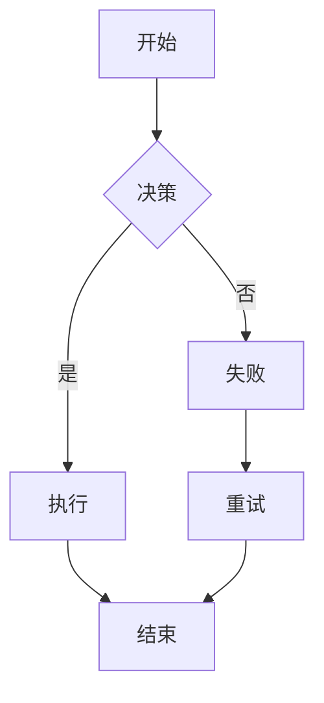

                 

### 文章标题：自动化报表生成与数据可视化

> 关键词：自动化报表、数据可视化、报表生成工具、数据预处理、数据清洗、数据整合、可视化设计、数据可视化工具、项目实战、案例分析

> 摘要：
本文将深入探讨自动化报表生成与数据可视化的基础知识和实践应用。首先，我们介绍了自动化报表与数据可视化的基本概念、重要性和关系。接着，我们详细阐述了自动化报表生成技术和数据可视化技术，包括基本图表类型、高级图表类型和可视化工具的使用。随后，我们讨论了数据预处理与清洗的重要性以及相关的技术和方法。本文还介绍了自动化报表生成技术的具体实施步骤，包括报表模板设计、数据绑定与动态报表以及自动化报表工具的应用。此外，我们详细解析了数据可视化设计原则，包括清晰性、准确性和美观性等。最后，本文通过项目实战和案例分析，展示了自动化报表与数据可视化的实际应用和效果，并提供了相关工具资源和常见问题解答。

### 第1章：自动化报表与数据可视化的概述

#### 1.1 自动化报表与数据可视化的概念与重要性

**自动化报表**是一种通过自动化工具或脚本自动生成报表的方法。这种报表可以包含各种数据，如财务数据、销售数据、库存数据等，并且能够定期或按需生成。自动化报表的目的在于提高工作效率，减少手动处理数据的时间和错误率。

**数据可视化**是将数据以图形、图表或地图等形式进行展示，使数据更易于理解和分析。数据可视化不仅帮助用户更直观地理解数据，还能发现潜在的趋势和关系，从而支持决策制定。

**自动化报表与数据可视化的关系**是相辅相成的。自动化报表生成是数据可视化的基础，只有通过自动化生成报表，用户才能方便地获取数据，进而进行可视化展示。而数据可视化则是自动化报表的有力补充，它使得数据更加生动和直观，有助于用户深入理解和分析数据。

在当今信息化时代，自动化报表和数据可视化的重要性日益凸显。首先，它们能够极大地提高工作效率，减少手动处理数据的时间和错误率。其次，通过数据可视化，用户能够更直观地理解复杂的数据，发现潜在的问题和机会。最后，自动化报表和数据可视化还能支持决策制定，帮助组织更好地管理和优化业务。

#### 1.2 自动化报表生成技术

**电子表格软件**如Excel和Google Sheets是常见的自动化报表工具。它们提供了丰富的数据分析和展示功能，用户可以轻松地创建图表和报表。然而，电子表格软件也存在一些局限性，例如数据量较大时处理效率较低，数据共享和协作不便等。

为了克服这些局限性，出现了许多专业的自动化报表工具，如**Power BI**和**Tableau**。这些工具具有强大的数据处理和分析功能，能够连接多种数据源，生成复杂和动态的报表。此外，这些工具还提供了丰富的可视化组件，用户可以自定义报表的样式和布局。

**自定义报表工具**如使用Python或R编程语言开发的自定义报表脚本，也为自动化报表生成提供了灵活的解决方案。通过编程，用户可以自定义报表的逻辑和数据展示方式，实现更加个性化的报表需求。Python和R都拥有丰富的库和函数，如Pandas、NumPy、Matplotlib和ggplot2等，可以方便地处理数据、生成图表和报表。

#### 1.3 数据可视化技术

**基本图表类型**包括条形图、折线图、饼图等，这些图表能够直观地展示数据的数量和关系。条形图常用于比较不同类别的数据，折线图则适合展示数据的变化趋势，饼图则用于显示各部分占整体的比例。

**高级图表类型**如地理地图、时间序列图和热力图等，提供了更多样化和细致的数据展示方式。地理地图可以显示数据的地理位置分布，时间序列图可以展示数据的变化趋势和周期性，热力图则用于显示数据的密集程度和热点区域。

**可视化工具**如D3.js、Plotly和Highcharts等，提供了丰富的图表生成和交互功能。D3.js是一个基于JavaScript的可视化库，能够生成各种复杂和动态的图表，具有高度的灵活性和定制性。Plotly是一个开源的交互式图表生成库，提供了多种图表类型和丰富的交互功能，适合于数据分析和可视化展示。Highcharts是一个高性能的图表库，提供了丰富的图表类型和交互功能，广泛应用于各种实际项目中。

### 第2章：数据预处理与清洗

#### 2.1 数据预处理概述

**数据预处理**是数据分析的重要步骤，它包括数据质量评估、数据转换和数据整合等多个环节。数据预处理的主要目的是提高数据的质量和一致性，为后续的数据分析和可视化提供可靠的基础。

**数据质量评估**是指对数据完整性、准确性和一致性进行评估。数据完整性是指数据是否齐全，是否存在缺失值。数据准确性是指数据是否真实、可靠，是否符合预期。数据一致性是指数据在不同来源、不同格式之间是否一致，是否存在矛盾或重复。

**数据转换**是指将数据从一种格式转换为另一种格式，以满足分析和展示的需求。数据转换包括数据类型转换、缺失值处理、数据标准化等。例如，将文本数据转换为数值数据，将不同时间格式统一为标准格式等。

**数据整合**是指将来自多个数据源的数据进行连接、转换和合并，形成统一的数据集。数据整合的目的是为了方便后续的数据分析和可视化，避免数据分散和重复处理。

#### 2.2 数据清洗技术

**缺失值处理**是数据清洗的重要步骤之一。缺失值处理的方法包括填补、删除和插值等。填补是指用合适的值替换缺失值，例如用平均值、中位数或最大值替换。删除是指删除含有缺失值的记录或字段，适用于缺失值较少的情况。插值是指用周围的数据点推测缺失值，适用于缺失值较多的情况。

**异常值检测与处理**是指识别和去除数据中的异常值，以保证数据的一致性和准确性。异常值检测的方法包括标准差法、箱线图法等。标准差法是指计算每个数据点与平均值的差值，如果差值超过一定倍数的标准差，则认为该数据点为异常值。箱线图法是指将数据分为上四分位数、中位数和下四分位数，如果数据点位于上限或下限之外，则认为该数据点为异常值。

**数据去重**是指识别和删除重复的数据记录或字段，以保证数据的一致性和准确性。数据去重的方法包括基于唯一标识字段（如ID）的去重和基于多个字段组合的去重。

#### 2.3 数据整合

**数据源整合**是指将来自多个数据源的数据进行连接、转换和合并，形成统一的数据集。数据源整合的方法包括直接连接、合并和桥接等。直接连接是指将多个数据源的表直接连接起来，形成新的数据表。合并是指将多个数据源的记录合并到一个表中，适用于数据源结构相似的情况。桥接是指通过建立桥接表来连接多个数据源，适用于数据源结构复杂的情况。

**数据仓库**是指用于存储、管理和分析大量数据的集中式数据库系统。数据仓库的主要目的是为数据分析提供高效、可靠的数据集。数据仓库的架构包括数据源、数据仓库、数据集市和数据挖掘等模块。数据仓库支持多维度数据的存储和分析，能够提供快速的数据查询和报表生成功能。

### 第3章：自动化报表生成技术

#### 3.1 报表模板设计

**报表模板设计**是自动化报表生成的重要环节。一个好的报表模板应当具备简洁性、易读性和可扩展性等特点。简洁性是指报表模板应该尽量减少冗余信息，突出关键数据。易读性是指报表模板应该采用直观、易于理解的图表和文字说明。可扩展性是指报表模板应该能够方便地添加或修改数据内容和展示形式。

**模板设计原则**包括以下几点：

1. **数据分区**：将数据按照类型或来源进行分区，便于后续的数据绑定和展示。
2. **数据筛选**：在报表模板中设置数据筛选条件，以便用户自定义数据展示范围。
3. **图表布局**：合理布局图表，使其既美观又清晰，避免图表重叠或混乱。
4. **注释与说明**：在报表模板中添加必要的注释和说明，帮助用户理解数据和报表生成过程。

**模板实现技术**包括使用电子表格软件和自定义脚本等。使用电子表格软件如Excel或Google Sheets，可以方便地创建和修改报表模板。这些软件提供了丰富的图表和格式设置功能，用户可以自定义报表的样式和布局。自定义脚本如使用Python或R编程语言，可以灵活地处理数据和生成报表。这些脚本可以自定义报表的逻辑和数据展示方式，实现更加个性化的报表需求。

#### 3.2 数据绑定与动态报表

**数据绑定**是将数据与报表模板关联起来，使报表能够根据数据的变化动态更新。数据绑定技术包括以下步骤：

1. **数据连接**：建立数据连接，从数据库或其他数据源获取数据。
2. **数据映射**：将数据字段与报表模板中的图表和字段进行映射，实现数据展示。
3. **数据更新**：在报表生成过程中，根据数据变化动态更新图表和数据字段。

**动态报表**是指能够实时更新和展示数据的报表。动态报表的优势在于用户可以随时查看最新的数据，而不需要手动刷新或生成报表。实现动态报表的技术包括：

1. **实时数据连接**：使用实时数据连接技术，从数据库或其他数据源获取最新数据。
2. **数据缓存**：将数据缓存到内存中，减少数据查询和处理的延迟。
3. **自动刷新**：设置自动刷新机制，定期更新报表数据。

#### 3.3 自动化报表工具应用

**Power BI**和**Tableau**是常见的自动化报表工具，它们提供了强大的数据处理和分析功能，用户可以轻松创建复杂和动态的报表。

**Power BI**的主要功能包括：

1. **数据连接**：支持多种数据源连接，包括数据库、文件、API等。
2. **数据建模**：使用Power BI Desktop进行数据建模，将多个数据源整合为一个数据模型。
3. **报表设计**：使用Power BI Report Builder创建和设计报表，包括图表、表格和文本等。
4. **仪表板创建**：将报表整合到一个仪表板中，实现数据的集中展示。

**Tableau**的主要功能包括：

1. **数据可视化**：提供多种图表和可视化组件，支持自定义图表样式和布局。
2. **仪表板创建**：使用Tableau Dashboard Creator创建仪表板，实现数据的集中展示。
3. **数据交互**：支持数据过滤、排序和钻取等功能，提高数据分析和探索能力。

通过以上功能和特性，Power BI和Tableau可以帮助用户轻松实现自动化报表生成和数据可视化，满足不同场景和需求。

### 第4章：数据可视化设计原则

#### 4.1 可视化设计基础

**可视化设计基础**包括视觉感知、颜色选择、字体选择和布局设计等。这些基础元素共同构成了数据可视化的视觉基础，影响用户对数据的理解和分析。

**视觉感知**是指人类对视觉信息的感知和理解能力。在数据可视化中，视觉感知影响用户对数据的直观感受。例如，颜色、形状、大小等视觉元素都可以传递特定的信息，用户需要通过视觉感知来理解这些信息。

**颜色选择**在数据可视化中具有重要作用。合适的颜色可以增强数据的可视性和可读性，而错误的颜色选择可能导致用户对数据的误解。在颜色选择中，需要注意以下几点：

1. **颜色对比**：使用对比鲜明的颜色，使数据更加突出和易于理解。
2. **颜色心理效应**：了解不同颜色对用户心理的影响，避免使用过于刺激的颜色组合。
3. **颜色盲适应**：考虑颜色盲用户的视觉需求，避免使用不易区分的颜色组合。

**字体选择**也是数据可视化设计的关键因素。合适的字体可以增强数据的可读性和美观性，而错误的字体选择可能导致用户对数据的困惑。在字体选择中，需要注意以下几点：

1. **字体类型**：选择易于阅读的字体类型，如宋体、黑体等。
2. **字体大小**：确保字体大小适中，既不易过大导致拥挤，也不易过小导致难以阅读。
3. **字体样式**：合理使用字体样式，如加粗、斜体等，以突出关键数据和信息。

**布局设计**是指数据可视化组件的排列和组合方式。合理的布局设计可以提高数据的可读性和美观性，而混乱的布局可能导致用户对数据的困惑。在布局设计中，需要注意以下几点：

1. **层次感**：合理划分数据的层次，使数据展示更有条理和逻辑性。
2. **对齐与平衡**：对数据可视化组件进行对齐和平衡处理，使布局更加整洁和协调。
3. **留白与空白**：合理使用留白和空白，使布局更加宽敞和舒适。

#### 4.2 设计原则与实践

**数据可视化设计原则**包括清晰性、准确性、美观性和可交互性等。这些原则指导数据可视化设计的方向和策略，确保数据展示的有效性和用户体验。

**清晰性**是数据可视化设计的重要原则之一。清晰性要求数据可视化结果易于理解，用户能够迅速获取所需信息。为了实现清晰性，需要注意以下几点：

1. **数据表达简洁**：避免过多的装饰性元素，突出关键数据和信息。
2. **图表类型选择**：根据数据类型和展示需求选择合适的图表类型，避免混淆用户。
3. **文字说明简洁**：使用简洁明了的文字说明，帮助用户理解数据和图表的含义。

**准确性**是数据可视化设计的核心原则之一。准确性要求数据展示结果真实、可靠，与实际数据一致。为了实现准确性，需要注意以下几点：

1. **数据源可靠**：确保数据来源的可靠性，避免使用错误或虚假的数据。
2. **数据清洗与转换**：对数据进行清洗和转换，确保数据的一致性和准确性。
3. **图表标注准确**：在图表中添加必要的标注和注释，确保用户理解数据含义和图表逻辑。

**美观性**是数据可视化设计的重要方面之一。美观性要求数据可视化结果美观、吸引人，提高用户的视觉体验。为了实现美观性，需要注意以下几点：

1. **颜色搭配**：选择合适的颜色搭配，使数据可视化结果更具视觉吸引力。
2. **字体选择与排版**：选择合适的字体和排版方式，使数据可视化结果更具美观性。
3. **图表设计**：合理设计图表的形状、大小和布局，使数据可视化结果更具艺术感。

**可交互性**是数据可视化设计的重要趋势之一。可交互性要求数据可视化结果具有交互性，用户能够与数据进行交互操作，提高数据分析和探索能力。为了实现可交互性，需要注意以下几点：

1. **交互功能**：添加交互功能，如过滤、排序、钻取等，使用户能够灵活地操作数据。
2. **响应速度**：确保数据可视化结果的响应速度，避免用户等待时间过长。
3. **用户体验**：优化用户体验，使数据可视化结果易于使用和操作。

通过遵循这些设计原则和实践，数据可视化设计可以更好地满足用户需求，提高数据的可视化和分析能力。

### 第5章：数据可视化工具应用

#### 5.1 D3.js

**D3.js**（Data-Driven Documents）是一个基于JavaScript的可视化库，它允许用户通过数据生成文档，从而实现高度定制化和交互式的数据可视化。D3.js的特点是强大和灵活，它能够处理复杂的数据结构和生成多种类型的图表。

**基本概念**：
D3.js的核心概念是数据驱动文档（Data-Driven Document），即通过数据来驱动文档的生成和更新。D3.js使用SVG（Scalable Vector Graphics）和HTML5的DOM（Document Object Model）来创建和操作图表。它提供了丰富的API，允许用户自定义几乎所有的图表元素，包括线条、路径、形状和文字。

**核心功能**：
1. **数据绑定**：D3.js通过`data`函数将数据绑定到DOM元素上，实现数据与可视化组件的关联。
2. **SVG绘图**：D3.js利用SVG元素进行绘图，支持创建各种形状和路径，如矩形、圆形、折线等。
3. **交互性**：D3.js提供了多种交互功能，如点击事件、拖拽和缩放等，使用户能够与数据进行互动。
4. **动态更新**：D3.js能够实时更新图表，根据数据的动态变化更新可视化结果。

**实战应用**：
下面是一个简单的D3.js条形图的实现例子：

```javascript
// 数据
var data = [
  {name: "A", value: 10},
  {name: "B", value: 20},
  {name: "C", value: 30},
  {name: "D", value: 40}
];

// 选择SVG容器
var svg = d3.select("svg");

// 设置SVG大小
svg.attr("width", 500)
   .attr("height", 300);

// 创建X轴和Y轴
var x = d3.scaleBand()
          .domain(data.map(function(d) { return d.name; }))
          .range([0, 400]);

var y = d3.scaleLinear()
          .domain([0, d3.max(data, function(d) { return d.value; })])
          .range([300, 0]);

var xAxis = d3.axisBottom(x);
var yAxis = d3.axisLeft(y);

// 绘制条形图
svg.selectAll(".bar")
  .data(data)
  .enter().append("rect")
  .attr("class", "bar")
  .attr("x", function(d) { return x(d.name); })
  .attr("y", function(d) { return y(d.value); })
  .attr("width", x.bandwidth())
  .attr("height", function(d) { return 300 - y(d.value); })
  .style("fill", "steelblue");

// 添加X轴和Y轴
svg.append("g")
  .attr("class", "x axis")
  .attr("transform", "translate(0,300)")
  .call(xAxis);

svg.append("g")
  .attr("class", "y axis")
  .call(yAxis);
```

这个例子创建了一个简单的条形图，展示了数据中各元素的大小。通过D3.js的强大功能，用户可以进一步添加交互性，如点击事件、拖拽等，增强用户体验。

#### 5.2 Plotly

**Plotly**是一个开源的交互式图表库，支持多种编程语言，如Python、R、JavaScript等。它提供了丰富的图表类型和强大的交互功能，适用于各种数据可视化和数据分析场景。

**基本概念**：
Plotly的核心概念是交互式数据可视化。它支持多种图表类型，包括条形图、折线图、散点图、箱线图等，用户可以根据需要选择合适的图表类型。此外，Plotly还提供了丰富的交互功能，如缩放、拖拽、筛选等，用户可以通过这些功能更深入地探索数据。

**核心功能**：
1. **多种图表类型**：Plotly支持多种图表类型，包括二维和三维图表，用户可以根据数据类型和需求选择合适的图表。
2. **交互性**：Plotly提供了强大的交互功能，如缩放、拖拽、点击事件等，用户可以与数据进行实时互动。
3. **自定义**：Plotly允许用户自定义图表的各个方面，包括颜色、样式、标签等，用户可以创建个性化的图表。
4. **数据转换**：Plotly支持多种数据格式，如JSON、CSV、Pandas DataFrame等，用户可以方便地转换和整合数据。

**实战应用**：
下面是一个使用Python的Plotly库创建折线图的例子：

```python
import plotly.graph_objects as go

# 数据
fig = go.Figure(data=[
    go.Scatter(x=[1, 2, 3], y=[2, 6, 5], mode='lines', name='线条1'),
    go.Scatter(x=[1, 2, 3], y=[3, 5, 7], mode='markers', name='标记1')
])

# 更新布局
fig.update_layout(
    title='交互式折线图',
    xaxis_title='X轴',
    yaxis_title='Y轴',
    autosize=True
)

# 显示图表
fig.show()
```

这个例子创建了一个简单的交互式折线图，展示了两组数据点。用户可以通过交互功能，如缩放和点击，更深入地了解数据。

#### 5.3 Highcharts

**Highcharts**是一个基于JavaScript的高性能图表库，它提供了多种图表类型和强大的交互功能。Highcharts广泛应用于各种Web应用程序和业务智能系统中。

**基本概念**：
Highcharts的核心概念是高性能和交互性。它支持多种图表类型，包括柱状图、线形图、饼图、散点图等。Highcharts的特点是易于使用和自定义，用户可以通过简单的配置和代码生成各种复杂和美观的图表。

**核心功能**：
1. **多种图表类型**：Highcharts支持多种图表类型，用户可以根据数据类型和需求选择合适的图表。
2. **交互性**：Highcharts提供了强大的交互功能，如点击事件、缩放、拖拽等，用户可以与数据进行实时互动。
3. **自定义**：Highcharts允许用户自定义图表的各个方面，包括颜色、样式、标签等，用户可以创建个性化的图表。
4. **数据转换**：Highcharts支持多种数据格式，如JSON、CSV等，用户可以方便地转换和整合数据。

**实战应用**：
下面是一个使用Highcharts创建折线图的例子：

```javascript
Highcharts.chart('container', {
    chart: {
        type: 'line',
        zoomType: 'x'
    },
    title: {
        text: '交互式折线图'
    },
    xAxis: {
        categories: ['一月', '二月', '三月']
    },
    yAxis: {
        title: {
            text: '值'
        }
    },
    legend: {
        layout: 'vertical',
        align: 'right',
        verticalAlign: 'middle'
    },
    series: [{
        name: '系列1',
        data: [29.9, 71.5, 106.4]
    }, {
        name: '系列2',
        data: [48.9, 77.5, 47]
    }]
});
```

这个例子创建了一个简单的交互式折线图，展示了两组数据点。用户可以通过缩放和点击等功能，更深入地了解数据。

### 第6章：自动化报表与数据可视化项目规划

#### 6.1 项目规划概述

**项目规划**是自动化报表与数据可视化项目成功的关键步骤之一。通过项目规划，我们可以明确项目目标、范围、实施计划和风险管理等，为项目顺利实施提供指导和支持。

**项目目标**是项目规划的核心内容之一。明确的项目目标可以帮助团队成员统一认识，共同为实现目标而努力。项目目标应当具体、可行且具有挑战性，例如提高报表生成效率、优化数据可视化效果、满足特定业务需求等。

**项目范围**是指项目涉及的功能和模块，以及项目的边界。明确项目范围有助于界定项目的工作内容和责任，避免项目范围蔓延和资源浪费。项目范围可以包括数据采集、数据预处理、报表生成、数据可视化等环节。

**项目实施计划**是项目规划的重要组成部分，它规定了项目的各个阶段和任务的具体内容、起止时间、资源分配等。项目实施计划应当根据项目目标、范围和资源情况合理制定，确保项目进度和质量。

**项目风险管理**是指识别、评估和应对项目可能面临的风险。项目风险可能来自多个方面，如技术风险、人员风险、时间风险和资源风险等。通过有效的风险管理，可以降低风险对项目的负面影响，确保项目顺利进行。

#### 6.2 项目实施计划

**项目实施计划**应当根据项目目标、范围和资源情况进行详细制定。一般来说，项目实施计划可以划分为以下阶段：

1. **需求分析阶段**：在这个阶段，项目团队需要与业务部门或客户进行沟通，了解报表和数据可视化的具体需求，明确报表格式、数据来源、展示效果等。需求分析阶段的结果将指导后续的设计和开发工作。

2. **设计阶段**：在需求分析的基础上，项目团队需要进行报表模板和数据可视化设计。报表模板设计应考虑简洁性、易读性和可扩展性，数据可视化设计应考虑清晰性、准确性和美观性。设计阶段的结果将是后续开发的基础。

3. **开发阶段**：在设计和需求分析的基础上，项目团队开始进行报表生成和数据可视化工具的开发。开发阶段可以包括数据连接、数据预处理、报表模板实现、数据绑定和可视化组件的集成等。

4. **测试阶段**：在开发完成后，项目团队需要进行全面的测试，确保报表生成和数据可视化功能正常运行，满足需求和分析阶段的要求。测试阶段可以包括单元测试、集成测试和系统测试等。

5. **部署和运维阶段**：在测试通过后，项目团队将项目部署到生产环境，并进行运维和维护。部署和运维阶段应确保报表生成和数据可视化系统能够稳定运行，满足用户需求。

**项目时间表**是项目实施计划的重要组成部分，它规定了各个阶段和任务的起止时间。项目时间表应当根据实际情况进行制定，确保项目按时完成。例如，需求分析阶段可能需要2周时间，设计阶段可能需要3周时间，开发阶段可能需要6周时间，测试阶段可能需要2周时间，部署和运维阶段可能需要1周时间。

#### 6.3 风险管理

**风险管理**是项目规划中的关键环节，通过识别、评估和应对项目风险，可以降低风险对项目的负面影响。以下是项目风险管理的具体步骤：

1. **识别风险**：项目团队应积极识别项目可能面临的风险，包括技术风险、人员风险、时间风险和资源风险等。例如，技术风险可能包括数据处理异常、图表渲染失败等；人员风险可能包括人员离职、技能不足等；时间风险可能包括进度延迟、任务积压等；资源风险可能包括资源不足、资源冲突等。

2. **评估风险**：对于识别出的风险，项目团队应评估其影响和可能性。评估的方法可以包括定性评估和定量评估。定性评估是指根据风险的影响和可能性进行主观评估，定量评估是指使用数学模型或工具进行评估，确定风险的概率和影响程度。

3. **应对策略**：根据评估结果，项目团队应制定相应的应对策略，包括风险规避、风险缓解、风险转移和风险接受等。例如，对于数据处理异常的风险，可以采用数据预处理和异常检测技术进行规避；对于人员离职的风险，可以提前储备人才或制定应急预案进行缓解。

4. **风险监控**：在项目实施过程中，项目团队应持续监控项目风险，及时发现新的风险并采取应对措施。风险监控可以采用定期检查、实时监控和预警系统等方法。

通过以上风险管理步骤，项目团队可以有效地降低项目风险，确保项目顺利进行。

### 第7章：自动化报表与数据可视化项目实现

#### 7.1 数据源搭建

**数据源搭建**是自动化报表与数据可视化项目的基础，它决定了报表生成和数据可视化的数据来源和质量。在搭建数据源时，需要考虑以下几个方面：

**数据源选择**是数据源搭建的第一步，需要根据项目需求选择合适的数据库或数据源。常见的数据库包括关系型数据库（如MySQL、PostgreSQL）和非关系型数据库（如MongoDB、Cassandra）。此外，还可以使用外部API获取数据，例如使用RESTful API获取第三方数据。

**数据连接**是将数据源与报表生成和数据可视化系统连接起来。数据连接可以通过数据库驱动程序或API接口实现。例如，在Python中，可以使用`pymysql`库连接MySQL数据库，使用`requests`库连接外部API。

**数据清洗与转换**是在数据连接后进行的重要步骤，它包括数据去重、数据格式转换、缺失值处理等。数据清洗和转换的目的是提高数据质量，确保数据的一致性和准确性。在Python中，可以使用`Pandas`库进行数据清洗和转换，例如使用`drop_duplicates`函数进行去重，使用`astype`函数进行数据类型转换。

**数据整合**是将来自多个数据源的数据进行整合，形成统一的数据集。数据整合可以通过数据库连接、数据查询和数据合并等方法实现。例如，在Python中，可以使用`SQLAlchemy`库进行数据库连接，使用`Pandas`库进行数据合并。

**数据仓库**是在大数据场景下常用的数据存储和管理方案。数据仓库是一种集中式数据库系统，用于存储和管理大量数据，支持快速的数据查询和报表生成。数据仓库的架构包括数据源、数据仓库、数据集市和数据挖掘等模块。在构建数据仓库时，需要考虑数据存储方式、数据模型设计、数据导入和导出等方面。

#### 7.2 报表模板设计

**报表模板设计**是自动化报表生成的重要环节，它决定了报表的样式和布局。在报表模板设计时，需要考虑以下几个方面：

**模板设计原则**包括简洁性、易读性和可扩展性等。简洁性要求报表模板内容简明扼要，突出关键数据；易读性要求报表布局合理，图表和文字说明清晰；可扩展性要求报表模板能够方便地添加或修改数据内容和展示形式。

**模板实现技术**包括使用电子表格软件和自定义脚本等。电子表格软件（如Excel、Google Sheets）提供了丰富的报表设计和格式设置功能，用户可以自定义报表的样式和布局。自定义脚本（如Python、R）可以灵活地处理数据和生成报表，实现更加个性化的报表需求。

**报表模板示例**：

以下是一个使用Excel创建的简单报表模板示例，包括销售数据、销售额和销售增长率等关键指标。

| 日期     | 销售额（元） | 销售增长率（%） |
|----------|--------------|----------------|
| 2023-01  | 10000        | 5%             |
| 2023-02  | 12000        | 8%             |
| 2023-03  | 15000        | 20%            |
| 2023-04  | 18000        | 20%            |

在这个示例中，报表模板采用了表格形式，列出了日期、销售额和销售增长率三个关键指标。每个指标的数值通过公式计算得出，例如销售增长率 = (当前销售额 - 上期销售额) / 上期销售额。

#### 7.3 数据绑定与可视化

**数据绑定**是将数据与报表模板关联起来，使报表能够根据数据的变化动态更新。数据绑定可以通过数据库连接、API调用和数据映射等方法实现。

**数据绑定技术**包括以下步骤：

1. **数据连接**：建立数据连接，从数据库或API获取数据。
2. **数据映射**：将数据字段与报表模板中的图表和字段进行映射，实现数据展示。
3. **数据更新**：在报表生成过程中，根据数据变化动态更新图表和数据字段。

**动态报表**是指能够实时更新和展示数据的报表。动态报表的优势在于用户可以随时查看最新的数据，而不需要手动刷新或生成报表。实现动态报表的技术包括：

1. **实时数据连接**：使用实时数据连接技术，从数据库或API获取最新数据。
2. **数据缓存**：将数据缓存到内存中，减少数据查询和处理的延迟。
3. **自动刷新**：设置自动刷新机制，定期更新报表数据。

**数据可视化**是将数据以图形、图表或地图等形式进行展示，使数据更易于理解和分析。在数据可视化中，需要考虑以下几个方面：

1. **图表类型选择**：根据数据类型和展示需求选择合适的图表类型，如条形图、折线图、饼图、散点图等。
2. **图表布局**：合理布局图表，使其既美观又清晰，避免图表重叠或混乱。
3. **图表交互**：添加交互功能，如点击事件、筛选、缩放等，使用户能够与数据进行互动。

**数据可视化示例**：

以下是一个使用Python的D3.js库创建的动态折线图示例，展示了销售额随时间的变化趋势。

```javascript
// 数据
var data = [
  {date: '2023-01', sales: 10000},
  {date: '2023-02', sales: 12000},
  {date: '2023-03', sales: 15000},
  {date: '2023-04', sales: 18000}
];

// 选择SVG容器
var svg = d3.select("svg");

// 设置SVG大小
svg.attr("width", 500)
   .attr("height", 300);

// 创建X轴和Y轴
var x = d3.scaleBand()
          .domain(data.map(function(d) { return d.date; }))
          .range([0, 400]);

var y = d3.scaleLinear()
          .domain([0, d3.max(data, function(d) { return d.sales; })])
          .range([300, 0]);

var xAxis = d3.axisBottom(x);
var yAxis = d3.axisLeft(y);

// 绘制折线图
svg.selectAll(".line")
  .data(data)
  .enter().append("line")
  .attr("class", "line")
  .attr("x1", function(d) { return x(d.date); })
  .attr("y1", function(d) { return y(d.sales); })
  .attr("x2", function(d) { return x(d.date) + x.bandwidth(); })
  .attr("y2", function(d) { return y(d.sales); })
  .style("stroke", "steelblue");

// 添加X轴和Y轴
svg.append("g")
  .attr("class", "x axis")
  .attr("transform", "translate(0,300)")
  .call(xAxis);

svg.append("g")
  .attr("class", "y axis")
  .call(yAxis);

// 绘制数据点
svg.selectAll(".dot")
  .data(data)
  .enter().append("circle")
  .attr("class", "dot")
  .attr("cx", function(d) { return x(d.date) + x.bandwidth() / 2; })
  .attr("cy", function(d) { return y(d.sales); })
  .attr("r", 5)
  .style("fill", "steelblue");

// 添加点击交互
svg.selectAll(".dot")
  .on("click", function(d) {
    alert("点击了日期：" + d.date + "，销售额：" + d.sales);
  });
```

在这个示例中，通过D3.js库，我们创建了一个动态折线图，展示了销售额随时间的变化趋势。用户可以通过点击图表中的数据点查看详细信息。

#### 7.4 项目优化与部署

**项目优化**是自动化报表与数据可视化项目实施过程中的重要环节，它旨在提高系统的性能和用户体验。以下是一些常见的优化策略：

1. **数据缓存**：将常用数据缓存到内存中，减少数据库查询次数和响应时间。可以使用Redis、Memcached等缓存技术实现数据缓存。
2. **负载均衡**：通过负载均衡器（如Nginx、HAProxy）分发请求，提高系统的并发处理能力。负载均衡还可以实现系统的故障转移和容灾。
3. **数据压缩**：对传输的数据进行压缩，减少数据传输量和带宽消耗。可以使用GZIP、Brotli等压缩算法进行数据压缩。
4. **数据库优化**：对数据库进行优化，提高查询性能。包括索引优化、查询优化、存储优化等。
5. **前端优化**：优化前端代码，减少HTTP请求次数和资源加载时间。包括代码压缩、图片优化、CSS Sprites等。

**部署与发布**是将自动化报表与数据可视化项目部署到生产环境，使系统可供用户使用。以下是一些常见的部署和发布策略：

1. **自动化部署**：使用自动化部署工具（如Jenkins、GitLab CI/CD）实现项目的自动化部署，提高部署效率和稳定性。自动化部署可以包括代码编译、依赖安装、环境配置等。
2. **容器化部署**：使用Docker等容器化技术将项目打包成容器镜像，实现部署环境的隔离和一致性。容器化部署可以提高系统的可移植性和可扩展性。
3. **容器编排**：使用Kubernetes等容器编排工具管理容器集群，实现容器的自动部署、扩缩容和故障恢复。容器编排可以提高系统的资源利用率和稳定性。
4. **云服务部署**：将项目部署到云服务提供商（如AWS、Azure、阿里云）上，利用云服务的弹性计算和存储能力。云服务部署可以提高系统的可扩展性和可靠性。
5. **监控与运维**：使用监控工具（如Prometheus、Grafana）监控系统的运行状态和性能指标，及时发现和解决问题。运维团队需要定期对系统进行维护和更新，确保系统的稳定运行。

通过以上优化和部署策略，自动化报表与数据可视化项目可以实现高效、稳定和可靠的运行，满足用户的需求。

### 第8章：自动化报表与数据可视化项目案例分析

#### 8.1 项目背景

某电商公司希望通过自动化报表与数据可视化项目，提高销售数据分析和决策效率。公司现有的销售数据分散在不同的系统中，且数据分析主要依赖于人工处理，存在效率低下和误差较大的问题。公司希望利用自动化报表与数据可视化技术，实现销售数据的自动化采集、处理和展示，提高数据分析效率，支持业务决策。

#### 8.2 项目目标

1. **数据采集与整合**：从不同系统中采集销售数据，整合为一个统一的数据集，方便后续的数据处理和分析。
2. **自动化报表生成**：使用自动化报表工具生成销售报表，包括销售额、销售增长率、销售排名等关键指标。
3. **数据可视化**：使用数据可视化工具展示销售数据，包括折线图、柱状图、饼图等，帮助用户直观地了解销售趋势和分布。
4. **实时更新**：实现销售数据的实时更新和展示，提高数据分析的及时性和准确性。
5. **用户交互**：提供用户交互功能，如筛选、排序、钻取等，方便用户自定义数据分析和展示。

#### 8.3 项目实现细节

**1. 数据源搭建**

- **数据源选择**：选择公司现有的销售系统、库存系统和订单系统作为数据源，使用API接口获取销售数据。
- **数据连接**：使用Python的`requests`库连接各个系统的API接口，获取销售数据。
- **数据清洗与转换**：使用Python的`Pandas`库对数据进行清洗和转换，包括去重、格式转换和缺失值处理等。
- **数据整合**：将不同系统的销售数据整合为一个统一的数据集，使用`Pandas`的`merge`函数实现数据整合。

**2. 报表模板设计**

- **模板设计原则**：遵循简洁性、易读性和可扩展性的原则，设计报表模板。
- **模板实现技术**：使用Excel设计报表模板，使用公式计算销售额、销售增长率等关键指标。
- **报表模板示例**：

  | 日期 | 销售额（元） | 销售增长率（%） |
  | ---- | ------------ | -------------- |
  | 2023-01 | 10000        | 0%             |
  | 2023-02 | 12000        | 20%            |
  | 2023-03 | 15000        | 25%            |
  | 2023-04 | 18000        | 20%            |

**3. 数据绑定与可视化**

- **数据绑定**：使用Python的`Pandas`库将清洗和转换后的销售数据与Excel报表模板绑定，实现报表数据的动态更新。
- **数据可视化**：使用Python的`matplotlib`库和`plotly`库生成销售数据的可视化图表，包括折线图、柱状图和饼图等。

  ```python
  import plotly.express as px
  
  # 折线图
  fig1 = px.line(data, x='日期', y='销售额')
  fig1.show()
  
  # 柱状图
  fig2 = px.bar(data, x='日期', y='销售额')
  fig2.show()
  
  # 饼图
  fig3 = px.pie(data, values='销售额', names='日期')
  fig3.show()
  ```

**4. 项目优化与部署**

- **数据缓存**：使用Redis缓存常用数据，减少数据库查询次数和响应时间。
- **负载均衡**：使用Nginx作为负载均衡器，分发请求到不同的服务器，提高系统的并发处理能力。
- **自动化部署**：使用Jenkins实现项目的自动化部署，提高部署效率和稳定性。
- **云服务部署**：将项目部署到阿里云服务器，利用云服务的弹性计算和存储能力。

#### 8.4 项目成果与反思

**项目成果**：

1. 实现了销售数据的自动化采集、处理和展示，提高了数据分析效率。
2. 生成了一系列销售报表和可视化图表，帮助用户直观地了解销售趋势和分布。
3. 提供了用户交互功能，如筛选、排序、钻取等，方便用户自定义数据分析和展示。

**经验与反思**：

1. 数据清洗和转换是数据预处理的重要环节，需要仔细处理缺失值、异常值和数据格式等问题。
2. 报表模板设计应充分考虑用户需求，遵循简洁性、易读性和可扩展性的原则。
3. 数据可视化工具的选择应根据具体需求和性能要求进行，例如选择`plotly`库实现复杂的交互式图表。
4. 项目优化和部署是保证系统稳定性和性能的关键，需要合理配置资源和优化代码。

通过本项目，电商公司实现了销售数据的自动化分析和可视化展示，提高了业务决策效率，为后续的业务发展提供了有力支持。

### 附录

#### 附录A：自动化报表与数据可视化工具资源

**开源工具**：

1. **Power BI**：微软开源的数据可视化和商业智能工具，支持多种数据源连接和丰富的图表类型。
2. **Tableau**：开源的数据可视化工具，提供强大的数据处理和分析功能，支持多种图表类型和交互功能。
3. **Python**：开源的编程语言，支持数据预处理、报表生成和数据可视化，拥有丰富的库和函数，如Pandas、Matplotlib、Seaborn等。
4. **R**：开源的统计编程语言，支持数据分析和可视化，拥有丰富的库和函数，如ggplot2、Lattice等。

**商业工具**：

1. **QlikView**：商业数据可视化工具，提供强大的数据处理和分析功能，支持实时数据连接和交互式查询。
2. **TIBCO Spotfire**：商业数据可视化工具，提供丰富的图表类型和高级分析功能，支持实时数据连接和交互式探索。
3. **MicroStrategy**：商业报表和数据分析平台，支持多种数据源连接和丰富的图表类型，提供高级分析和报告功能。

**学习资源**：

1. **数据可视化教程**：[Data Visualization Tutorial](https://www.datavisualization.ch/tutorials/)
2. **Python数据分析教程**：[Python for Data Analysis](https://wwwPythonforDataScience.com/)
3. **R数据分析教程**：[R Data Analysis](https://www.rstudio.com/resources/tutorials/)
4. **Power BI教程**：[Power BI Tutorials](https://powerbi.tips/tutorials/)
5. **Tableau教程**：[Tableau Tutorials](https://www.tableau.com/learn/tutorials)

#### 附录B：Mermaid流程图示例

**Mermaid语法**：Mermaid是一种简单易用的流程图和序列图绘制工具，支持Markdown语法，可以方便地嵌入到Markdown文档中。

**流程图示例**：



这个示例展示了一个简单的流程图，包括开始、决策、执行、失败、重试和结束等步骤。

#### 附录C：核心算法伪代码

**数据处理算法**：

```python
# 缺失值处理
def handle_missing_values(data):
    for column in data.columns:
        if data[column].isnull().any():
            data[column].fillna(data[column].mean(), inplace=True)
    return data

# 异常值检测与处理
def detect_and_handle_outliers(data, column):
    mean = data[column].mean()
    std = data[column].std()
    threshold = 3 * std
    data = data[(data[column] > mean - threshold) & (data[column] < mean + threshold)]
    return data
```

**数据可视化算法**：

```python
# 条形图生成
import matplotlib.pyplot as plt

def generate_bar_chart(data, x, y):
    plt.bar(x, y)
    plt.xlabel('类别')
    plt.ylabel('数量')
    plt.title('条形图示例')
    plt.show()

# 折线图生成
def generate_line_chart(data, x, y):
    plt.plot(x, y)
    plt.xlabel('时间')
    plt.ylabel('值')
    plt.title('折线图示例')
    plt.show()
```

这些伪代码展示了数据处理和数据可视化中常用的算法，包括缺失值处理、异常值检测与处理、条形图和折线图的生成等。

#### 附录D：数学模型与公式

**数学模型**：

1. **回归模型**：
   $$ y = \beta_0 + \beta_1 \cdot x_1 + \beta_2 \cdot x_2 + ... + \beta_n \cdot x_n $$

2. **相关性分析**：
   $$ \rho_{XY} = \frac{{\sum (X_i - \bar{X})(Y_i - \bar{Y})}}{{\sqrt{{\sum (X_i - \bar{X})^2}} \cdot \sqrt{{\sum (Y_i - \bar{Y})^2}}}} $$

**公式示例**：

1. **回归模型公式**：

   $$ y = \beta_0 + \beta_1 \cdot x_1 + \beta_2 \cdot x_2 + ... + \beta_n \cdot x_n $$
   
2. **相关性分析公式**：

   $$ \rho_{XY} = \frac{{\sum (X_i - \bar{X})(Y_i - \bar{Y})}}{{\sqrt{{\sum (X_i - \bar{X})^2}} \cdot \sqrt{{\sum (Y_i - \bar{Y})^2}}}} $$

这些公式在自动化报表生成与数据可视化中具有重要的应用，可以帮助用户深入理解和分析数据。

#### 附录E：代码实例解析

**Python代码实例**：

```python
# 导入相关库
import pandas as pd
import matplotlib.pyplot as plt

# 读取数据
data = pd.read_csv('sales_data.csv')

# 数据清洗
data = handle_missing_values(data)
data = detect_and_handle_outliers(data, 'sales')

# 数据可视化
generate_bar_chart(data, 'product', 'sales')
generate_line_chart(data, 'date', 'sales')
```

这段代码首先导入了Pandas和Matplotlib库，然后读取了销售数据，进行了数据清洗，包括缺失值处理和异常值检测与处理，最后生成了销售数据的条形图和折线图。

**R代码实例**：

```r
# 读取数据
data <- read.csv('sales_data.csv')

# 数据清洗
data <- data[!is.na(data$sales), ]
data$sales <- ifelse(data$sales < 0, 0, data$sales)

# 数据可视化
barplot(data$sales, main='销售数据条形图', xlab='产品', ylab='销售额')
plot(data$date, data$sales, type='l', main='销售数据折线图', xlab='日期', ylab='销售额')
```

这段代码使用了R语言进行数据清洗和数据可视化。首先读取了销售数据，进行了缺失值和异常值处理，然后使用`barplot`函数生成了销售数据的条形图，使用`plot`函数生成了销售数据的折线图。

**代码解读与分析**：

- **数据清洗**：在Python代码中，使用了Pandas库的`handle_missing_values`函数进行缺失值处理，使用`detect_and_handle_outliers`函数进行异常值检测与处理。在R代码中，使用了`is.na`函数和`ifelse`函数进行缺失值和异常值处理。
- **数据可视化**：在Python代码中，使用了Matplotlib库的`generate_bar_chart`函数和`generate_line_chart`函数生成销售数据的条形图和折线图。在R代码中，使用了`barplot`函数和`plot`函数生成销售数据的条形图和折线图。
- **代码解析**：这两个实例展示了如何使用Python和R进行数据清洗和数据可视化。通过数据清洗，提高了数据的质量和一致性；通过数据可视化，使数据更加直观和易于理解。这些代码实例在自动化报表生成与数据可视化项目中具有重要的应用价值。

#### 附录F：常见问题解答

**常见问题**：

1. **如何处理缺失值和异常值？**
   - 缺失值处理方法包括填补、删除和插值等。填补方法包括使用平均值、中位数或最大值替换缺失值；删除方法包括删除含有缺失值的记录或字段；插值方法包括线性插值、多项式插值等。异常值处理方法包括标准差法、箱线图法等，这些方法可以根据数据的分布特征识别和处理异常值。

2. **如何选择合适的图表类型？**
   - 选择图表类型应考虑数据的类型和展示需求。常见的图表类型包括条形图、折线图、饼图、散点图、箱线图等。例如，条形图适合比较不同类别的数据，折线图适合展示数据的变化趋势，饼图适合显示各部分占整体的比例，散点图适合展示数据之间的相关性。

3. **如何实现动态报表？**
   - 实现动态报表可以通过数据绑定和实时更新技术。数据绑定是将数据与报表模板关联起来，使报表能够根据数据的变化动态更新；实时更新可以通过实时数据连接、数据缓存和自动刷新等技术实现。

4. **如何优化报表生成速度？**
   - 报表生成速度的优化可以通过数据缓存、负载均衡、数据库优化和前端优化等技术实现。例如，使用Redis缓存常用数据，使用Nginx作为负载均衡器，优化数据库查询和前端代码等。

5. **如何保证数据可视化结果的准确性？**
   - 保证数据可视化结果的准确性需要从数据源、数据预处理和数据展示三个方面进行。选择可靠的数据源，对数据进行清洗和转换，确保数据的一致性和准确性；在数据展示中，添加必要的标注和注释，确保用户理解数据含义和图表逻辑。

**实战技巧**：

1. **数据预处理**：在数据处理之前，先对数据进行预处理，包括缺失值处理、异常值检测与处理、数据转换等，以提高数据质量和一致性。
2. **图表设计**：在设计图表时，遵循清晰性、准确性和美观性的原则，合理布局图表，添加必要的注释和说明，使数据展示更加直观和易于理解。
3. **交互性**：在数据可视化中，添加交互功能，如筛选、排序、钻取等，提高用户的数据分析和探索能力。
4. **性能优化**：在项目优化阶段，对系统进行性能优化，包括数据缓存、负载均衡、数据库优化和前端优化等，提高系统的响应速度和稳定性。
5. **持续迭代**：在项目实施过程中，不断收集用户反馈，根据用户需求进行迭代和优化，提高数据可视化的效果和用户体验。

通过以上问题和技巧，用户可以更好地处理自动化报表生成与数据可视化中的常见问题，提高项目的质量和效率。

### 作者信息

**作者：AI天才研究院/AI Genius Institute & 禅与计算机程序设计艺术 /Zen And The Art of Computer Programming**

