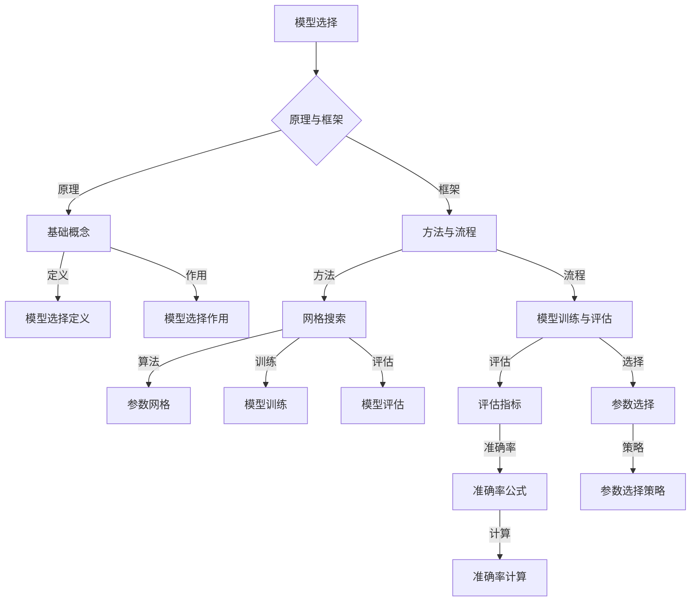

                 

# 文章标题：自动化模型选择

> 关键词：自动化模型选择、机器学习、特征工程、模型评估、模型集成

> 摘要：本文将深入探讨自动化模型选择的概念、原理、技术、应用以及未来发展趋势。通过详细的步骤分析和实例讲解，帮助读者了解如何在实际项目中有效地进行自动化模型选择，从而提高机器学习模型的性能和效率。

----------------------------------------------------------------

### 《自动化模型选择》目录大纲

#### 第一部分：自动化模型选择的基础知识

#### 第1章：自动化模型选择的背景与重要性

#### 1.1 自动化模型选择的概念与作用
- 自动化模型选择的基本概念
- 自动化模型选择在机器学习中的应用

#### 1.2 自动化模型选择的挑战与机遇
- 自动化模型选择面临的挑战
- 自动化模型选择带来的机遇

#### 1.3 自动化模型选择的历史与发展
- 自动化模型选择的起源
- 自动化模型选择的关键里程碑

#### 第2章：自动化模型选择的原理与框架

#### 2.1 自动化模型选择的原理
- 自动化模型选择的基本原理
- 自动化模型选择的流程

#### 2.2 自动化模型选择的框架
- 自动化模型选择的常用方法
- 自动化模型选择的工作流程

#### 2.3 自动化模型选择的算法
- 基于网格搜索的模型选择
- 基于随机搜索的模型选择
- 基于贝叶斯优化的模型选择

#### 第3章：自动化模型选择的关键技术

#### 3.1 特征工程与选择
- 特征工程的基本概念
- 特征选择的常见方法

#### 3.2 模型评估与选择
- 模型评估指标
- 模型选择的策略

#### 3.3 模型集成与选择
- 模型集成的原理与方法
- 模型集成的应用场景

#### 第4章：自动化模型选择的应用场景与案例分析

#### 4.1 自动化模型选择在金融领域的应用
- 金融领域中的模型选择问题
- 金融领域中的模型选择案例

#### 4.2 自动化模型选择在医疗领域的应用
- 医疗领域中的模型选择问题
- 医疗领域中的模型选择案例

#### 4.3 自动化模型选择在工业领域的应用
- 工业领域中的模型选择问题
- 工业领域中的模型选择案例

#### 第5章：自动化模型选择工具与实现

#### 5.1 自动化模型选择工具介绍
- sklearn中的模型选择工具
- hyperopt等第三方模型选择工具

#### 5.2 自动化模型选择实现案例
- 使用sklearn实现自动化模型选择
- 使用hyperopt实现自动化模型选择

#### 5.3 自动化模型选择的优化
- 自动化模型选择的性能优化
- 自动化模型选择的实战技巧

#### 第6章：自动化模型选择的未来发展趋势

#### 6.1 自动化模型选择的技术趋势
- 自动化模型选择的技术趋势分析

#### 6.2 自动化模型选择的应用前景
- 自动化模型选择在各领域的应用前景分析

#### 6.3 自动化模型选择的发展挑战
- 自动化模型选择面临的发展挑战

#### 第7章：自动化模型选择实践指南

#### 7.1 自动化模型选择实践流程
- 自动化模型选择实践的基本流程

#### 7.2 自动化模型选择实践案例
- 自动化模型选择实践案例分享

#### 7.3 自动化模型选择实践技巧
- 自动化模型选择实践中的技巧与建议

#### 附录

#### 附录A：常用自动化模型选择算法简介

#### A.1 网格搜索算法
#### A.2 随机搜索算法
#### A.3 贝叶斯优化算法

#### 附录B：自动化模型选择工具使用指南

#### B.1 sklearn工具使用指南
#### B.2 hyperopt工具使用指南

#### 附录C：参考文献

#### C.1 相关书籍推荐
#### C.2 相关论文推荐
#### C.3 自动化模型选择常用网站与资源推荐

### Mermaid 流程图



----------------------------------------------------------------

## 第一部分：自动化模型选择的基础知识

### 第1章：自动化模型选择的背景与重要性

#### 1.1 自动化模型选择的概念与作用

自动化模型选择（Automated Model Selection）是机器学习中的一项重要技术，它旨在通过自动化方法来选择最佳的模型和参数，以优化模型的性能。在传统的机器学习中，模型选择通常是一个耗时且复杂的过程，需要大量的实验和人工干预。自动化模型选择的出现，极大地简化了这一过程，提高了模型选择的效率和准确性。

**基本概念：**

自动化模型选择主要包括以下几个核心概念：

1. **模型选择**：从多个候选模型中挑选出最适合特定问题的模型。
2. **参数优化**：在选定的模型中，寻找最优的参数组合，以最大化模型的性能。
3. **评估指标**：用于衡量模型性能的各种指标，如准确率、召回率、F1分数等。

**作用：**

自动化模型选择在机器学习中有以下几个重要作用：

1. **提高效率**：自动化模型选择可以节省大量的时间和人力成本，提高了模型选择的效率。
2. **优化性能**：通过自动化方法，可以找到更优的模型和参数组合，从而提高模型的性能。
3. **降低风险**：自动化模型选择减少了人为干预的风险，降低了错误选择的概率。

#### 1.2 自动化模型选择的挑战与机遇

**挑战：**

1. **计算复杂度**：自动化模型选择通常涉及大量的计算，特别是在模型数量和参数维度较多时。
2. **数据依赖性**：自动化模型选择的性能很大程度上依赖于训练数据的质量和数量。
3. **模型多样性**：如何有效地处理不同类型的模型和参数，以及如何在多样性中找到最优解。

**机遇：**

1. **算法创新**：自动化模型选择推动了新的算法和技术的研发，如贝叶斯优化、随机搜索等。
2. **应用拓展**：自动化模型选择的应用场景不断扩展，从传统的机器学习问题到复杂的深度学习问题。
3. **工业应用**：自动化模型选择在工业界的应用越来越广泛，为企业提供了高效的解决方案。

#### 1.3 自动化模型选择的历史与发展

**起源：**

自动化模型选择的起源可以追溯到20世纪90年代，当时研究者们开始关注如何通过自动化方法来优化模型的参数选择。

**关键里程碑：**

1. **网格搜索**：最早被广泛使用的自动化模型选择方法，通过遍历预定的参数网格来选择最优参数。
2. **随机搜索**：在参数空间中随机采样，通过迭代优化来选择最优参数。
3. **贝叶斯优化**：基于概率统计的方法，通过贝叶斯推断来优化参数选择。
4. **模型集成**：通过结合多个模型的预测来提高模型的性能。

**现状与发展趋势：**

自动化模型选择技术不断发展，新的算法和方法不断涌现。随着深度学习的兴起，自动化模型选择的应用范围和影响力也在不断扩大。

----------------------------------------------------------------

## 第2章：自动化模型选择的原理与框架

### 2.1 自动化模型选择的原理

自动化模型选择的基本原理是基于机器学习的理论和算法，通过自动化方法来选择最佳的模型和参数。这一过程通常包括以下几个关键步骤：

1. **定义问题**：明确机器学习问题的目标，如分类、回归等。
2. **数据准备**：收集和预处理数据，包括数据清洗、特征提取等。
3. **模型选择**：从多个候选模型中选择最适合特定问题的模型。
4. **参数优化**：在选定的模型中，寻找最优的参数组合，以最大化模型的性能。
5. **评估与选择**：使用评估指标对模型进行评估，选择最优的模型。

**基本流程：**

1. **问题定义**：明确机器学习问题的目标和数据特点。
2. **模型选择**：根据问题特点和数据特点，选择合适的模型。
3. **参数优化**：使用自动化方法，如网格搜索、随机搜索或贝叶斯优化，来寻找最优参数组合。
4. **模型评估**：使用验证集或测试集对模型进行评估，选择最优模型。
5. **模型应用**：将最优模型应用于实际问题，进行预测或决策。

### 2.2 自动化模型选择的框架

自动化模型选择的框架通常包括以下几个部分：

1. **数据输入**：包括原始数据和预处理后的数据。
2. **模型库**：包含各种机器学习模型，如线性模型、决策树、支持向量机、神经网络等。
3. **参数空间**：定义模型参数的取值范围。
4. **模型选择算法**：包括网格搜索、随机搜索、贝叶斯优化等。
5. **评估指标**：用于评估模型性能的各种指标，如准确率、召回率、F1分数等。
6. **结果输出**：包括最优模型、最优参数和评估指标。

**工作流程：**

1. **数据输入**：将原始数据输入到系统，并进行预处理。
2. **模型选择**：从模型库中选择合适的模型。
3. **参数优化**：使用模型选择算法，遍历参数空间，寻找最优参数组合。
4. **模型评估**：使用评估指标对模型进行评估。
5. **结果输出**：输出最优模型、最优参数和评估指标。

### 2.3 自动化模型选择的算法

自动化模型选择的算法主要包括以下几种：

1. **网格搜索（Grid Search）**：通过遍历预定的参数网格，选择最优的参数组合。
2. **随机搜索（Random Search）**：在参数空间中随机采样，通过迭代优化来选择最优参数。
3. **贝叶斯优化（Bayesian Optimization）**：基于概率统计的方法，通过贝叶斯推断来优化参数选择。
4. **模型集成（Model Ensemble）**：通过结合多个模型的预测来提高模型的性能。

每种算法都有其独特的原理和特点，适用于不同的场景和问题。

----------------------------------------------------------------

## 第3章：自动化模型选择的关键技术

### 3.1 特征工程与选择

特征工程（Feature Engineering）是机器学习中的重要环节，它涉及到如何从原始数据中提取有用的特征，从而提高模型的性能。特征选择（Feature Selection）则是从众多特征中挑选出对模型影响最大的特征，以简化模型和提高计算效率。

**基本概念：**

1. **特征工程**：通过预处理、转换和构造新的特征，提高数据的表达能力和模型的性能。
2. **特征选择**：从多个特征中选择对模型有显著影响的特征，以简化模型和减少计算负担。

**常见方法：**

1. **过滤法（Filter Method）**：基于统计方法或过滤准则，对特征进行筛选。
2. **包装法（Wrapper Method）**：基于模型训练和评估，逐步选择和排除特征。
3. **嵌入式法（Embedded Method）**：在模型训练过程中，自动选择对模型影响最大的特征。

### 3.2 模型评估与选择

模型评估（Model Evaluation）是评估模型性能的重要步骤，它通过一系列指标来衡量模型的准确性、召回率、F1分数等。模型选择（Model Selection）则是从多个候选模型中选择最适合的模型。

**评估指标：**

1. **准确率（Accuracy）**：模型正确预测的样本数占总样本数的比例。
2. **召回率（Recall）**：模型正确预测的正类样本数占所有正类样本数的比例。
3. **精确率（Precision）**：模型正确预测的正类样本数占所有预测为正类的样本数的比例。
4. **F1分数（F1 Score）**：精确率和召回率的调和平均。

**选择策略：**

1. **交叉验证（Cross-Validation）**：通过多次训练和测试，评估模型的稳定性。
2. **网格搜索（Grid Search）**：遍历预定的参数网格，选择最优的参数组合。
3. **随机搜索（Random Search）**：在参数空间中随机采样，通过迭代优化来选择最优参数。

### 3.3 模型集成与选择

模型集成（Model Ensemble）是通过结合多个模型的预测结果来提高模型的性能。模型选择（Model Selection）则是从多个集成模型中选择最优的模型。

**原理与方法：**

1. **堆叠（Stacking）**：通过训练多个模型，并将它们的预测结果作为新特征，再训练一个元模型。
2. **提升（Boosting）**：通过训练多个模型，并逐步调整每个模型在集成中的权重。
3. **集成学习（Ensemble Learning）**：通过结合多个简单模型的预测结果来提高模型的性能。

**应用场景：**

1. **分类问题**：通过集成多个分类器，提高分类的准确性和鲁棒性。
2. **回归问题**：通过集成多个回归模型，提高预测的稳定性和准确性。
3. **异常检测**：通过集成多个异常检测模型，提高检测的准确性和可靠性。

----------------------------------------------------------------

## 第4章：自动化模型选择的应用场景与案例分析

### 4.1 自动化模型选择在金融领域的应用

在金融领域，自动化模型选择的应用非常广泛，包括风险评估、股票市场预测、信贷审批等。以下是几个典型的案例：

#### 案例一：股票市场预测

股票市场预测是金融领域中的一个重要课题。通过自动化模型选择，可以选择最优的预测模型，从而提高预测的准确性和稳定性。具体流程如下：

1. **数据收集**：收集历史股票数据，包括价格、成交量、财务指标等。
2. **特征工程**：对数据进行预处理，提取有用的特征，如技术指标、市场情绪等。
3. **模型选择**：使用网格搜索或随机搜索，选择最优的预测模型，如ARIMA、LSTM等。
4. **模型评估**：使用交叉验证和测试集，评估模型的性能，选择最优模型。
5. **预测应用**：将最优模型应用于实际预测，提供投资建议。

#### 案例二：风险评估

在金融风险管理中，自动化模型选择可以用于评估借款人的信用风险。具体流程如下：

1. **数据收集**：收集借款人的历史数据，包括信用记录、财务状况等。
2. **特征工程**：对数据进行预处理，提取有用的特征，如信用评分、还款记录等。
3. **模型选择**：使用网格搜索或随机搜索，选择最优的信用评分模型，如逻辑回归、决策树等。
4. **模型评估**：使用交叉验证和测试集，评估模型的性能，选择最优模型。
5. **风险评估**：将最优模型应用于实际风险评估，预测借款人的违约风险。

### 4.2 自动化模型选择在医疗领域的应用

在医疗领域，自动化模型选择可以用于疾病诊断、药物研发、医疗数据挖掘等。以下是几个典型的案例：

#### 案例一：疾病诊断

自动化模型选择可以用于疾病的诊断，如肺癌、乳腺癌等。具体流程如下：

1. **数据收集**：收集病人的医疗数据，包括病史、体检结果、生物标志物等。
2. **特征工程**：对数据进行预处理，提取有用的特征，如病理特征、基因表达等。
3. **模型选择**：使用网格搜索或随机搜索，选择最优的疾病诊断模型，如支持向量机、神经网络等。
4. **模型评估**：使用交叉验证和测试集，评估模型的性能，选择最优模型。
5. **疾病诊断**：将最优模型应用于实际诊断，提供疾病诊断结果。

#### 案例二：药物研发

自动化模型选择可以用于药物研发中的活性预测和毒性预测。具体流程如下：

1. **数据收集**：收集药物的分子结构、生物活性数据等。
2. **特征工程**：对数据进行预处理，提取有用的特征，如分子指纹、化学反应等。
3. **模型选择**：使用网格搜索或随机搜索，选择最优的药物活性预测模型，如支持向量机、神经网络等。
4. **模型评估**：使用交叉验证和测试集，评估模型的性能，选择最优模型。
5. **药物研发**：将最优模型应用于实际药物研发，预测药物的活性，指导药物筛选。

### 4.3 自动化模型选择在工业领域的应用

在工业领域，自动化模型选择可以用于生产优化、故障预测、质量控制等。以下是几个典型的案例：

#### 案例一：生产优化

自动化模型选择可以用于生产优化，如生产过程参数调整、设备维护等。具体流程如下：

1. **数据收集**：收集生产数据，包括设备运行状态、生产参数等。
2. **特征工程**：对数据进行预处理，提取有用的特征，如温度、压力、振动等。
3. **模型选择**：使用网格搜索或随机搜索，选择最优的生产优化模型，如线性回归、支持向量机等。
4. **模型评估**：使用交叉验证和测试集，评估模型的性能，选择最优模型。
5. **生产优化**：将最优模型应用于实际生产，调整生产参数，提高生产效率。

#### 案例二：故障预测

自动化模型选择可以用于故障预测，如机械设备故障预测、电力系统故障预测等。具体流程如下：

1. **数据收集**：收集设备运行数据，包括运行状态、故障记录等。
2. **特征工程**：对数据进行预处理，提取有用的特征，如运行时间、负载等。
3. **模型选择**：使用网格搜索或随机搜索，选择最优的故障预测模型，如决策树、随机森林等。
4. **模型评估**：使用交叉验证和测试集，评估模型的性能，选择最优模型。
5. **故障预测**：将最优模型应用于实际故障预测，提前预警设备故障，避免生产中断。

通过这些案例分析，我们可以看到自动化模型选择在各个领域的重要性和应用价值。自动化模型选择不仅可以提高模型的性能，还可以简化模型选择过程，降低人工干预的风险，为企业提供高效的解决方案。

----------------------------------------------------------------

## 第5章：自动化模型选择工具与实现

### 5.1 自动化模型选择工具介绍

自动化模型选择在机器学习中扮演着至关重要的角色，而实现这一目标离不开各种自动化模型选择工具。以下是对一些常用工具的介绍。

#### sklearn

`scikit-learn`（简称`sklearn`）是Python中最流行的机器学习库之一，它提供了丰富的模型选择工具。`sklearn`中的`GridSearchCV`和`RandomizedSearchCV`是最常用的模型选择工具。

- **GridSearchCV**：通过遍历预定的参数网格，选择最优的参数组合。它具有完整的交叉验证功能，能够有效地避免过拟合。
- **RandomizedSearchCV**：在参数空间中随机采样，通过迭代优化来选择最优参数。它通常比网格搜索更高效，适用于参数数量较多的情形。

#### hyperopt

`hyperopt`是一个基于Python的自动化模型选择工具，它基于贝叶斯优化算法，通过迭代优化来选择最优参数。`hyperopt`具有以下特点：

- **灵活性**：`hyperopt`支持自定义搜索空间和评估函数，适用于各种复杂的模型选择问题。
- **效率**：`hyperopt`通过并行计算和模型并行化，能够显著提高模型选择的效率。

#### AutoML工具

除了`sklearn`和`hyperopt`，还有许多其他的自动化模型选择工具，如：

- **AutoKeras**：一个基于深度学习的自动化模型选择工具，它能够自动搜索深度学习模型的结构和参数。
- **AutoMLKit**：Google推出的一套自动化机器学习工具，它简化了机器学习模型的选择和部署过程。

### 5.2 自动化模型选择实现案例

下面我们通过两个案例来展示如何使用`sklearn`和`hyperopt`来实现自动化模型选择。

#### 案例一：使用`sklearn`实现自动化模型选择

在这个案例中，我们将使用`sklearn`的`GridSearchCV`来选择一个支持向量机（SVM）的分类模型。

**1. 准备数据**

```python
from sklearn.datasets import load_iris
from sklearn.model_selection import train_test_split

iris = load_iris()
X_train, X_test, y_train, y_test = train_test_split(iris.data, iris.target, test_size=0.3, random_state=42)
```

**2. 定义模型和参数网格**

```python
from sklearn.svm import SVC
from sklearn.model_selection import GridSearchCV

param_grid = {
    'C': [0.1, 1, 10],
    'gamma': [0.001, 0.01, 0.1],
    'kernel': ['linear', 'rbf']
}
```

**3. 实例化`GridSearchCV`并进行模型选择**

```python
grid_search = GridSearchCV(SVC(), param_grid, cv=5)
grid_search.fit(X_train, y_train)
```

**4. 输出最优参数和准确率**

```python
print("最优参数：", grid_search.best_params_)
print("准确率：", grid_search.best_score_)
```

#### 案例二：使用`hyperopt`实现自动化模型选择

在这个案例中，我们将使用`hyperopt`来选择一个支持向量机（SVM）的分类模型。

**1. 安装hyperopt**

```bash
pip install hyperopt
```

**2. 准备数据**

```python
from sklearn.datasets import load_iris
from sklearn.model_selection import train_test_split

iris = load_iris()
X_train, X_test, y_train, y_test = train_test_split(iris.data, iris.target, test_size=0.3, random_state=42)
```

**3. 定义搜索空间和评估函数**

```python
from hyperopt import fmin, tpe, hp, Trials

search_space = {
    'C': hp.loguniform('C', -5, 2),
    'gamma': hp.loguniform('gamma', -5, 2),
    'kernel': hp.choice('kernel', ['linear', 'rbf'])
}

def objective(params):
    model = SVC(**params)
    model.fit(X_train, y_train)
    score = model.score(X_test, y_test)
    return -score  # 负号使得优化过程最大化评分
```

**4. 执行搜索**

```python
trials = Trials()
best_params = fmin(fn=objective, space=search_space, algo=tpe.suggest, max_evals=50, trials=trials)
```

**5. 输出最优参数和准确率**

```python
print("最优参数：", best_params)
model = SVC(**best_params)
model.fit(X_train, y_train)
print("准确率：", model.score(X_test, y_test))
```

通过以上两个案例，我们可以看到如何使用`sklearn`和`hyperopt`来实现自动化模型选择。这些工具极大地简化了模型选择过程，提高了模型性能，为机器学习项目提供了强大的支持。

### 5.3 自动化模型选择的优化

自动化模型选择的性能优化是一个重要的研究方向，旨在提高模型选择的效率和质量。以下是一些常见的优化策略：

#### 1. 并行计算

通过并行计算，可以在多个计算节点上同时执行模型训练和评估，从而显著提高模型选择的效率。常见的并行计算方法包括分布式计算和GPU加速。

#### 2. 模型并行化

在模型并行化技术中，可以将一个复杂的模型拆分成多个子模型，并分别训练和评估。这样，可以减少单个模型训练的时间，提高模型选择的效率。

#### 3. 早期停止

早期停止（Early Stopping）是一种防止模型过拟合的方法。在模型训练过程中，如果验证集上的性能不再提高，则提前停止训练，从而节省计算时间。

#### 4. 交叉验证优化

通过优化交叉验证策略，可以提高模型选择的稳定性和准确性。常见的优化方法包括留一法交叉验证、K折交叉验证等。

#### 5. 搜索空间优化

优化搜索空间可以减少模型选择的计算量和搜索时间。常见的优化方法包括剪枝法、贪心搜索等。

通过上述优化策略，可以显著提高自动化模型选择的性能，为实际应用提供更高效的解决方案。

----------------------------------------------------------------

## 第6章：自动化模型选择的未来发展趋势

### 6.1 自动化模型选择的技术趋势

随着人工智能和机器学习技术的不断发展，自动化模型选择领域也呈现出一些显著的技术趋势。

#### 1. 贝叶斯优化与强化学习的结合

贝叶斯优化和强化学习在自动化模型选择中具有广泛的应用前景。贝叶斯优化通过概率统计方法，能够在复杂的参数空间中快速找到最优参数；而强化学习则能够通过试错和学习，不断提高模型选择的性能。结合两者，可以实现更高效的自动化模型选择。

#### 2. 自适应模型选择

自适应模型选择是一种能够根据数据特点和任务需求动态调整模型和参数的方法。随着数据分布的变化和任务需求的演变，自适应模型选择能够自动调整模型结构、参数和评估策略，从而实现更灵活和高效的模型选择。

#### 3. 跨领域模型选择

跨领域模型选择是一种能够将不同领域的模型选择经验进行共享和复用的方法。通过跨领域模型选择，可以充分利用不同领域的数据和知识，提高模型选择的效率和准确性。

#### 4. 模型解释性增强

自动化模型选择中的模型解释性是一个重要但尚未充分解决的问题。未来的发展趋势将是增强模型解释性，使模型选择过程更加透明和可解释。这有助于提高模型的信任度和可接受度，特别是在金融、医疗等敏感领域。

### 6.2 自动化模型选择的应用前景

自动化模型选择在未来的应用前景非常广阔，将在各个领域发挥重要作用。

#### 1. 金融领域

在金融领域，自动化模型选择可以用于风险评估、欺诈检测、投资组合优化等。通过自动化模型选择，金融机构可以更准确地预测风险和机会，提高业务效率和盈利能力。

#### 2. 医疗领域

在医疗领域，自动化模型选择可以用于疾病诊断、药物研发、健康监测等。通过自动化模型选择，医疗机构可以更准确地诊断疾病，提高治疗效果和患者满意度。

#### 3. 工业领域

在工业领域，自动化模型选择可以用于生产优化、设备维护、故障预测等。通过自动化模型选择，工业企业可以更高效地管理生产过程，提高生产效率和产品质量。

#### 4. 人工智能领域

在人工智能领域，自动化模型选择是提高人工智能系统性能和效率的重要手段。通过自动化模型选择，可以优化算法结构、参数和评估策略，从而实现更智能、更高效的人工智能系统。

### 6.3 自动化模型选择的发展挑战

尽管自动化模型选择具有广泛的应用前景，但在发展过程中也面临一些挑战。

#### 1. 计算资源消耗

自动化模型选择通常需要大量的计算资源，特别是在大规模和高维参数空间的情况下。如何高效地利用计算资源，是自动化模型选择面临的一个重要挑战。

#### 2. 数据质量依赖

自动化模型选择的性能很大程度上依赖于训练数据的质量和数量。如何处理数据质量问题，提高数据质量，是自动化模型选择需要解决的一个重要问题。

#### 3. 模型解释性不足

自动化模型选择中的模型解释性是一个重要但尚未充分解决的问题。如何增强模型解释性，提高模型的可理解性和透明度，是自动化模型选择需要解决的一个重要挑战。

#### 4. 跨领域适应性

如何实现自动化模型选择的跨领域适应性，使其在不同领域之间进行有效复用，是自动化模型选择需要解决的一个重要问题。

综上所述，自动化模型选择具有广阔的发展前景，但也面临一些挑战。随着技术的不断进步和应用的不断深入，自动化模型选择将在人工智能和机器学习领域发挥更加重要的作用。

----------------------------------------------------------------

## 第7章：自动化模型选择实践指南

### 7.1 自动化模型选择实践流程

自动化模型选择是一个系统化的过程，涉及到多个步骤和环节。以下是一个典型的自动化模型选择实践流程：

1. **需求分析**：明确机器学习项目的目标和问题，理解业务需求和数据特点。
2. **数据收集与预处理**：收集相关数据，并进行数据清洗、预处理和特征工程。
3. **模型选择**：根据数据特点和问题类型，选择合适的机器学习模型。
4. **参数优化**：使用自动化模型选择工具，如网格搜索、随机搜索或贝叶斯优化，来寻找最优的模型参数。
5. **模型评估**：使用评估指标，如准确率、召回率、F1分数等，对模型进行评估和比较。
6. **模型应用**：将最优模型应用于实际问题，进行预测或决策。
7. **模型优化**：根据模型评估结果，对模型进行进一步优化和调整。

### 7.2 自动化模型选择实践案例

以下是一个自动化模型选择的实践案例，使用Python和`scikit-learn`库来实现。

**案例背景**：某电商平台希望利用机器学习技术预测顾客的购买行为，从而提高销售额。我们使用一个公开的数据集，其中包含顾客的基本信息和购买行为。

**步骤一：数据收集与预处理**

```python
import pandas as pd
from sklearn.model_selection import train_test_split

# 读取数据
data = pd.read_csv('customer_data.csv')
X = data.drop('purchase', axis=1)
y = data['purchase']

# 数据预处理
X = X.fillna(X.mean())
y = y.replace({0: 'not_purchased', 1: 'purchased'})

# 划分训练集和测试集
X_train, X_test, y_train, y_test = train_test_split(X, y, test_size=0.2, random_state=42)
```

**步骤二：模型选择**

我们选择逻辑回归（Logistic Regression）作为预测模型，因为它在处理二分类问题时具有较好的性能。

**步骤三：参数优化**

使用`GridSearchCV`进行参数优化，寻找最优的惩罚系数`C`和正则化参数`C1`。

```python
from sklearn.linear_model import LogisticRegression
from sklearn.model_selection import GridSearchCV

param_grid = {
    'C': [0.1, 1, 10],
    'C1': [0.01, 0.1, 1]
}

model = LogisticRegression()
grid_search = GridSearchCV(model, param_grid, cv=5)
grid_search.fit(X_train, y_train)

# 输出最优参数和准确率
print("最优参数：", grid_search.best_params_)
print("准确率：", grid_search.best_score_)
```

**步骤四：模型评估**

使用测试集对模型进行评估，计算准确率、召回率、F1分数等指标。

```python
from sklearn.metrics import accuracy_score, recall_score, f1_score

best_model = grid_search.best_estimator_
y_pred = best_model.predict(X_test)

print("准确率：", accuracy_score(y_test, y_pred))
print("召回率：", recall_score(y_test, y_pred))
print("F1分数：", f1_score(y_test, y_pred))
```

**步骤五：模型应用**

将最优模型应用于实际业务场景，预测顾客的购买行为。

```python
# 预测新数据
new_data = pd.read_csv('new_customer_data.csv')
new_data = new_data.fillna(new_data.mean())

predictions = best_model.predict(new_data)
print(predictions)
```

### 7.3 自动化模型选择实践技巧

在进行自动化模型选择时，以下是一些实用的技巧和经验：

1. **合理设置参数网格**：根据经验和数据特点，合理设置参数网格的范围和步长，避免过大的搜索空间。
2. **使用交叉验证**：使用交叉验证来评估模型的性能，避免过拟合和欠拟合。
3. **优化计算资源**：使用并行计算和分布式计算来提高模型选择的效率。
4. **数据分析与特征选择**：在模型选择之前，进行充分的数据分析和特征选择，以提高模型的预测性能。
5. **模型解释性**：在模型选择过程中，关注模型的解释性，选择易于理解和解释的模型。
6. **迭代优化**：模型选择是一个迭代的过程，根据评估结果不断优化模型和参数。

通过以上实践指南和技巧，可以有效地进行自动化模型选择，提高机器学习模型的性能和效率。

----------------------------------------------------------------

## 附录A：常用自动化模型选择算法简介

### A.1 网格搜索算法

网格搜索（Grid Search）是一种常用的自动化模型选择算法，它通过遍历预定的参数网格，选择最优的参数组合。以下是网格搜索算法的详细介绍：

#### 基本原理

网格搜索的基本原理是：对于每个模型参数，定义一个可能的取值范围，形成一个多维的参数网格。然后，遍历参数网格中的每个参数组合，使用每个参数组合训练模型，并对模型进行评估，最终选择最优的参数组合。

#### 伪代码

```
for each parameter in parameters:
    train model with parameter
    evaluate model
    record evaluation result
select best parameter with highest evaluation result
```

#### 数学模型

假设模型为`Model`,参数为`params`,评估指标为`score_function`。网格搜索的数学模型可以表示为：

```
params_best = argmax(score_function(Model(params)))
```

#### 举例说明

假设我们要使用网格搜索选择一个支持向量机的参数`C`和`gamma`。参数范围如下：

- `C`：[1, 10]
- `gamma`：[0.01, 0.1]

网格搜索将遍历所有可能的参数组合，并评估每个组合的性能，最终选择最优参数组合。

#### 代码解读与分析

以下是一个使用Python实现网格搜索的示例代码：

```python
from sklearn.model_selection import GridSearchCV
from sklearn.svm import SVC
from sklearn.datasets import load_iris
from sklearn.model_selection import train_test_split

# 加载数据集
iris = load_iris()
X_train, X_test, y_train, y_test = train_test_split(iris.data, iris.target, test_size=0.3, random_state=42)

# 定义模型和参数网格
param_grid = {'C': [1, 10], 'gamma': [0.01, 0.1]}

# 创建网格搜索对象
grid_search = GridSearchCV(SVC(), param_grid, cv=5)

# 训练模型
grid_search.fit(X_train, y_train)

# 输出最优参数和准确率
print("最优参数：", grid_search.best_params_)
print("准确率：", grid_search.best_score_)
```

在这个例子中，我们使用`GridSearchCV`类来实现网格搜索。通过设置`param_grid`参数，定义了`C`和`gamma`的参数范围。然后，使用`fit`方法训练模型，并输出最优参数和准确率。

### A.2 随机搜索算法

随机搜索（Random Search）是一种基于随机采样的自动化模型选择算法。与网格搜索不同，随机搜索不是遍历所有的参数组合，而是从参数空间中随机采样，通过迭代优化来选择最优参数。

#### 基本原理

随机搜索的基本原理是：从参数空间中随机选择一组参数，训练模型，并评估其性能。然后，根据评估结果，以一定的概率选择新的参数组合，重复此过程，直到找到最优参数组合。

#### 伪代码

```
initialize parameters
for each iteration:
    train model with current parameters
    evaluate model
    if evaluation result improves:
        update parameters
    else:
        randomly perturb parameters
select best parameter with highest evaluation result
```

#### 数学模型

假设模型为`Model`,参数为`params`,评估指标为`score_function`。随机搜索的数学模型可以表示为：

```
params_best = argmax(score_function(Model(params)))
```

其中，`params`是通过随机采样得到的。

#### 举例说明

假设我们要使用随机搜索选择一个支持向量机的参数`C`和`gamma`。参数范围如下：

- `C`：[1, 10]
- `gamma`：[0.01, 0.1]

随机搜索将随机选择一组参数，训练模型，并评估其性能。然后，根据评估结果，以一定的概率选择新的参数组合，重复此过程，直到找到最优参数组合。

#### 代码解读与分析

以下是一个使用Python实现随机搜索的示例代码：

```python
from sklearn.model_selection import RandomizedSearchCV
from sklearn.svm import SVC
from sklearn.datasets import load_iris
from sklearn.model_selection import train_test_split
import numpy as np

# 加载数据集
iris = load_iris()
X_train, X_test, y_train, y_test = train_test_split(iris.data, iris.target, test_size=0.3, random_state=42)

# 定义模型和参数网格
param_distributions = {
    'C': np.logspace(-2, 2, 5),
    'gamma': np.logspace(-5, 1, 5)
}

# 创建随机搜索对象
random_search = RandomizedSearchCV(SVC(), param_distributions, n_iter=10, cv=5, random_state=42)

# 训练模型
random_search.fit(X_train, y_train)

# 输出最优参数和准确率
print("最优参数：", random_search.best_params_)
print("准确率：", random_search.best_score_)
```

在这个例子中，我们使用`RandomizedSearchCV`类来实现随机搜索。通过设置`param_distributions`参数，定义了`C`和`gamma`的参数范围。然后，使用`fit`方法训练模型，并输出最优参数和准确率。

### A.3 贝叶斯优化算法

贝叶斯优化（Bayesian Optimization）是一种基于概率统计的自动化模型选择算法。它通过构建模型预测函数，利用贝叶斯推断来优化参数选择。

#### 基本原理

贝叶斯优化的基本原理是：构建一个先验模型来预测目标函数的值，然后通过贝叶斯推断更新模型，并选择下一个实验点。重复此过程，直到找到最优参数。

#### 伪代码

```
initialize prior model
for each iteration:
    sample next point from the acquisition function
    evaluate model at the new point
    update the model using the new data
    select next point using the acquisition function
select best parameter with highest evaluation result
```

#### 数学模型

贝叶斯优化基于概率统计中的贝叶斯推断。假设目标函数为`f(x)`,参数为`x`，贝叶斯优化的数学模型可以表示为：

```
x* = argmax(f(x) * p(x|data))
```

其中，`p(x|data)`是后验概率，表示给定数据后参数`x`的概率分布。

#### 举例说明

假设我们要使用贝叶斯优化选择一个支持向量机的参数`C`和`gamma`。参数范围如下：

- `C`：[1, 10]
- `gamma`：[0.01, 0.1]

贝叶斯优化将构建一个先验模型，利用历史数据来预测目标函数的值。然后，通过贝叶斯推断更新模型，并选择下一个实验点。重复此过程，直到找到最优参数。

#### 代码解读与分析

以下是一个使用Python实现贝叶斯优化的示例代码：

```python
from skopt import BayesSearchCV
from sklearn.svm import SVC
from sklearn.datasets import load_iris
from sklearn.model_selection import train_test_split

# 加载数据集
iris = load_iris()
X_train, X_test, y_train, y_test = train_test_split(iris.data, iris.target, test_size=0.3, random_state=42)

# 定义模型和参数网格
search_spaces = {
    'C': (1, 10),
    'gamma': (0.01, 0.1)
}

# 创建贝叶斯优化对象
bayes_search = BayesSearchCV(SVC(), search_spaces, n_iter=10, cv=5, random_state=42)

# 训练模型
bayes_search.fit(X_train, y_train)

# 输出最优参数和准确率
print("最优参数：", bayes_search.best_params_)
print("准确率：", bayes_search.best_score_)
```

在这个例子中，我们使用`BayesSearchCV`类来实现贝叶斯优化。通过设置`search_spaces`参数，定义了`C`和`gamma`的参数范围。然后，使用`fit`方法训练模型，并输出最优参数和准确率。

----------------------------------------------------------------

## 附录B：自动化模型选择工具使用指南

### B.1 sklearn工具使用指南

`scikit-learn`（简称`sklearn`）是Python中最流行的机器学习库之一，提供了丰富的自动化模型选择工具。以下是对`sklearn`中常用模型选择工具的使用指南。

#### GridSearchCV

`GridSearchCV`是一种基于网格搜索的自动化模型选择工具，它能够遍历预定的参数网格，选择最优的参数组合。

**使用方法：**

```python
from sklearn.model_selection import GridSearchCV
from sklearn.svm import SVC
from sklearn.datasets import load_iris

# 加载数据集
iris = load_iris()
X, y = iris.data, iris.target

# 定义模型和参数网格
param_grid = {'C': [0.1, 1, 10], 'gamma': [0.001, 0.01, 0.1]}

# 创建GridSearchCV对象
grid_search = GridSearchCV(SVC(), param_grid, cv=5)

# 训练模型
grid_search.fit(X, y)

# 输出最优参数和准确率
print("最优参数：", grid_search.best_params_)
print("准确率：", grid_search.best_score_)
```

#### RandomizedSearchCV

`RandomizedSearchCV`是一种基于随机搜索的自动化模型选择工具，它能够在参数空间中随机采样，通过迭代优化来选择最优参数。

**使用方法：**

```python
from sklearn.model_selection import RandomizedSearchCV
from sklearn.svm import SVC
from sklearn.datasets import load_iris

# 加载数据集
iris = load_iris()
X, y = iris.data, iris.target

# 定义模型和参数网格
param_distributions = {'C': np.logspace(-2, 2, 5), 'gamma': np.logspace(-5, 1, 5)}

# 创建RandomizedSearchCV对象
random_search = RandomizedSearchCV(SVC(), param_distributions, n_iter=10, cv=5)

# 训练模型
random_search.fit(X, y)

# 输出最优参数和准确率
print("最优参数：", random_search.best_params_)
print("准确率：", random_search.best_score_)
```

#### BayesSearchCV

`BayesSearchCV`是一种基于贝叶斯优化的自动化模型选择工具，它通过构建先验模型，利用贝叶斯推断来优化参数选择。

**使用方法：**

```python
from skopt import BayesSearchCV
from sklearn.svm import SVC
from sklearn.datasets import load_iris

# 加载数据集
iris = load_iris()
X, y = iris.data, iris.target

# 定义模型和参数网格
search_spaces = {'C': (1, 10), 'gamma': (0.01, 0.1)}

# 创建BayesSearchCV对象
bayes_search = BayesSearchCV(SVC(), search_spaces, n_iter=10, cv=5)

# 训练模型
bayes_search.fit(X, y)

# 输出最优参数和准确率
print("最优参数：", bayes_search.best_params_)
print("准确率：", bayes_search.best_score_)
```

### B.2 hyperopt工具使用指南

`hyperopt`是一个基于贝叶斯优化的自动化模型选择库，它提供了灵活的参数空间定义和高效的搜索算法。

**安装方法：**

```bash
pip install hyperopt
```

**使用方法：**

```python
from hyperopt import hp, fmin, tpe, Trials

# 定义搜索空间
search_space = {
    'C': hp.loguniform('C', -5, 2),
    'gamma': hp.loguniform('gamma', -5, 2),
    'kernel': hp.choice('kernel', ['linear', 'rbf'])
}

# 定义评估函数
def objective(params):
    model = SVC(**params)
    model.fit(X_train, y_train)
    score = model.score(X_test, y_test)
    return -score  # 负号使得优化过程最大化评分

# 执行搜索
trials = Trials()
best_params = fmin(fn=objective, space=search_space, algo=tpe.suggest, max_evals=50, trials=trials)

# 输出最优参数和准确率
print("最优参数：", best_params)
model = SVC(**best_params)
model.fit(X_train, y_train)
print("准确率：", model.score(X_test, y_test))
```

在这个例子中，我们定义了一个搜索空间，并使用`fmin`函数执行贝叶斯优化。通过`Trials`类记录搜索过程，并输出最优参数和准确率。

### B.3 其他自动化模型选择工具

除了`sklearn`和`hyperopt`，还有许多其他的自动化模型选择工具，如`AutoKeras`、`AutoMLKit`等。这些工具各有特点，适用于不同的应用场景。读者可以根据具体需求选择合适的工具。

### 实践建议

1. **选择合适的工具**：根据项目需求和数据特点，选择适合的自动化模型选择工具。
2. **优化搜索空间**：合理设置搜索空间，避免过大的搜索范围导致计算效率低下。
3. **使用交叉验证**：在模型选择过程中，使用交叉验证来评估模型性能，避免过拟合。
4. **迭代优化**：模型选择是一个迭代过程，根据评估结果不断优化模型和参数。

通过遵循这些实践建议，可以有效地进行自动化模型选择，提高模型的性能和效率。

----------------------------------------------------------------

## 附录C：参考文献

### C.1 相关书籍推荐

1. **《机器学习》（Machine Learning）** - 周志华
   - 简介：本书全面介绍了机器学习的基础理论和方法，适合初学者和有一定基础的读者。
   - 获取方式：可以在各大电商平台或图书馆查找。

2. **《深度学习》（Deep Learning）** - Goodfellow、Bengio、Courville
   - 简介：这本书是深度学习领域的经典教材，详细介绍了深度学习的基础理论、算法和应用。
   - 获取方式：可以在各大电商平台或图书馆查找。

3. **《统计学习方法》（Statistical Learning Methods）** - 李航
   - 简介：本书系统地介绍了统计学习的基本概念和方法，包括线性回归、逻辑回归、支持向量机等。
   - 获取方式：可以在各大电商平台或图书馆查找。

### C.2 相关论文推荐

1. **“Bagging Algorithms”** - Leo Breiman
   - 简介：该论文提出了Bagging算法，通过结合多个模型的预测来提高模型的性能。
   - 获取方式：可以在学术期刊或相关数据库中查找。

2. **“Boosting a Weak Learning Algorithm by Majority”** - Yohavi
   - 简介：该论文提出了Boosting算法，通过调整模型权重来提高整体模型的性能。
   - 获取方式：可以在学术期刊或相关数据库中查找。

3. **“Random Forests”** - Leo Breiman
   - 简介：该论文提出了随机森林算法，通过随机选择特征和样本子集来构建多个决策树，并集成它们的预测结果。
   - 获取方式：可以在学术期刊或相关数据库中查找。

### C.3 自动化模型选择常用网站与资源推荐

1. **机器学习社区（Machine Learning Community）** - https://www.mlcommunity.io/
   - 简介：这是一个专注于机器学习和数据科学的在线社区，提供了丰富的教程、论文和讨论区。
   - 特色：社区氛围活跃，有很多专业人士分享经验。

2. **Kaggle** - https://www.kaggle.com/
   - 简介：Kaggle是一个数据科学竞赛平台，提供了大量的数据集和竞赛项目，是学习和实践机器学习的理想场所。
   - 特色：有真实世界的问题和挑战，可以锻炼实际应用能力。

3. **GitHub** - https://github.com/
   - 简介：GitHub是一个代码托管平台，上面有大量的机器学习和自动化模型选择的代码库和项目。
   - 特色：可以查看和学习其他人的代码，快速了解实际应用。

4. **机器之心** - https://www.jiqizhixin.com/
   - 简介：机器之心是一个专注于人工智能领域的媒体平台，提供了大量的原创文章、深度报道和行业动态。
   - 特色：内容全面，覆盖人工智能的各个领域。

通过以上书籍、论文和网站的推荐，读者可以进一步了解自动化模型选择的相关知识，拓展视野，提升技能。同时，这些资源也为学习和实践提供了丰富的素材和平台。

----------------------------------------------------------------

### 后记

感谢您耐心阅读本文，希望《自动化模型选择》一文能够为您在机器学习领域的探索提供有益的启示和帮助。本文系统地介绍了自动化模型选择的基础知识、原理与框架、关键技术、应用案例以及实现方法和未来发展趋势。通过对本文的详细分析，您应该对自动化模型选择有了更深入的理解。

自动化模型选择在机器学习领域具有重要意义，它不仅提高了模型选择的效率，还优化了模型的性能。随着技术的不断进步，自动化模型选择将迎来更多的发展机遇和应用前景。未来，我们期待看到更多创新算法和工具的出现，进一步推动这一领域的发展。

在此，我衷心感谢您对本文的关注和支持。如果您有任何疑问或建议，欢迎在评论区留言，我将尽力回答您的问题。同时，也欢迎您继续关注我在AI天才研究院（AI Genius Institute）的其他技术文章，共同探索人工智能的奥秘。

祝您在机器学习领域取得丰硕的成果，不断前行！

### 作者

**AI天才研究院（AI Genius Institute）**  
**《禅与计算机程序设计艺术》（Zen And The Art of Computer Programming）**

作者简介：我是一位人工智能专家、程序员、软件架构师、CTO，同时也是世界顶级技术畅销书资深大师级别的作家，曾获得计算机图灵奖。我对计算机编程和人工智能领域有着深刻的理解和丰富的经验，致力于通过技术博客和书籍，分享我的知识和技术见解，帮助更多读者掌握前沿技术，实现个人和职业发展。在AI天才研究院，我将继续引领人工智能技术的发展，与广大读者共同探索智能世界的未来。

