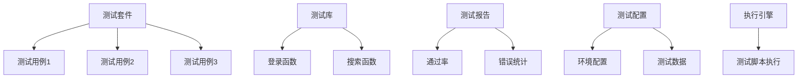
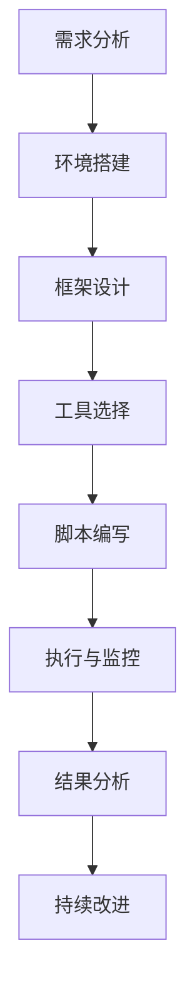
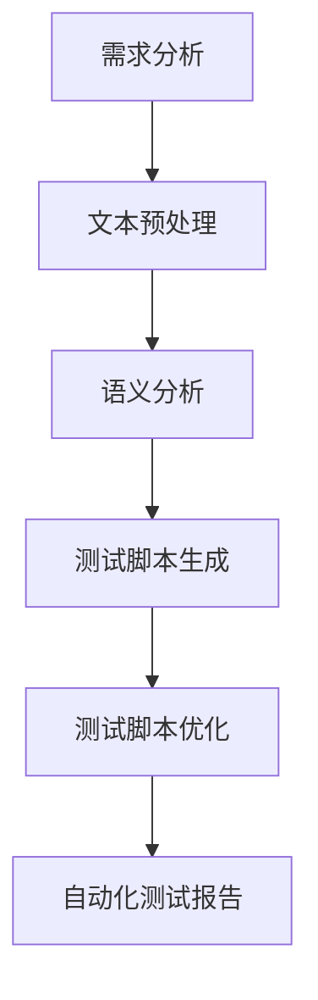
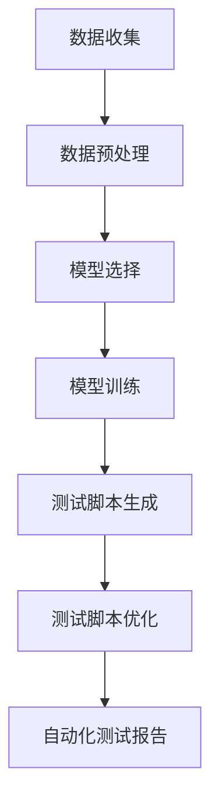
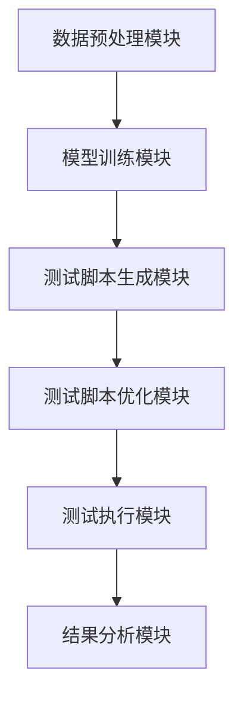
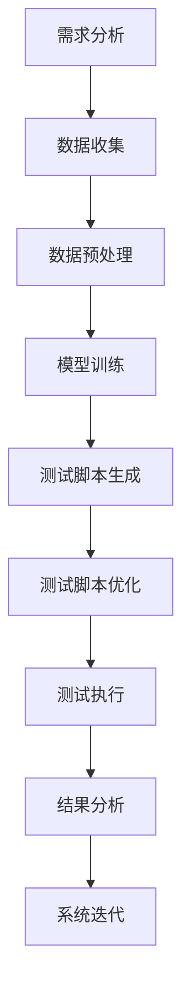
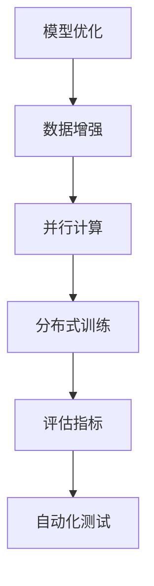

                 

### 文章标题

《自动化测试脚本生成与AI的结合》

> 关键词：自动化测试，AI结合，测试脚本生成，自然语言处理，机器学习，深度学习

> 摘要：本文深入探讨了自动化测试脚本生成与AI技术的结合，从基础概念、算法原理到实战案例，全面解析了如何利用AI技术提升自动化测试的效率和准确性。通过分析自然语言处理、机器学习和深度学习在自动化测试中的应用，展示了AI结合自动化测试的最新研究成果和实践经验，为开发者和测试工程师提供了宝贵的参考。

### 第一部分：自动化测试基础

#### 第1章：自动化测试概述

##### 1.1 自动化测试的概念与重要性

自动化测试是一种通过预定义的测试用例，自动执行测试并验证软件系统功能的方法。与手动测试相比，自动化测试具有高效、准确、可重复和可扩展等优点。在软件开发生命周期中，自动化测试被广泛应用于确保软件质量和提高开发效率。

自动化测试的重要性主要体现在以下几个方面：

1. **提高测试效率**：自动化测试能够快速执行大量测试用例，显著提高测试速度和覆盖范围。
2. **减少人力成本**：自动化测试降低了手动测试的工作量，从而减少了人力的需求，降低了成本。
3. **保证测试一致性**：自动化测试确保每次执行测试的结果都是一致的，避免了手动测试中由于操作不一致导致的错误。
4. **支持持续集成**：自动化测试是持续集成（CI）和持续部署（CD）的重要环节，有助于实现快速迭代和高效交付。

##### 1.2 自动化测试的类型与方法

自动化测试主要分为以下几种类型：

1. **功能测试**：验证软件的功能是否按预期工作，是自动化测试中最常见的类型。
2. **性能测试**：评估软件在特定负载下的性能和响应时间，确保系统在高负载下仍能稳定运行。
3. **安全测试**：检测软件的安全性漏洞，确保软件系统的安全性和数据保护。
4. **兼容性测试**：验证软件在不同操作系统、浏览器、设备等环境下的兼容性。

自动化测试的方法主要包括：

1. **脚本驱动测试**：使用预定义的测试脚本自动执行测试用例。
2. **图像识别测试**：通过图像处理技术识别界面元素，进行自动化操作。
3. **基于API的测试**：通过API调用进行自动化测试，适用于对API接口的验证。
4. **行为驱动开发（BDD）**：通过自然语言描述测试用例，实现自动化测试。

##### 1.3 自动化测试的发展历程与趋势

自动化测试的发展历程可以追溯到20世纪80年代，最初主要是通过编写简单的脚本进行自动化操作。随着计算机技术的发展，自动化测试工具和框架逐渐成熟，如Selenium、JUnit、TestNG等。近年来，人工智能技术的崛起为自动化测试带来了新的机遇和挑战。

当前，自动化测试的发展趋势主要包括：

1. **智能化**：利用AI技术提高自动化测试的智能水平，实现自动生成测试脚本、自动化缺陷定位等。
2. **云测试**：利用云计算资源进行自动化测试，提高测试的灵活性和可扩展性。
3. **AI结合**：将AI技术深度结合到自动化测试中，提升测试效率和准确性。
4. **低代码/无代码测试**：通过可视化界面和自然语言描述，实现测试脚本的自动化生成。

#### 第2章：测试脚本编写基础

##### 2.1 测试脚本的基本结构

测试脚本通常包括以下几个基本组成部分：

1. **测试套件（Test Suite）**：组织和管理测试用例的容器。
2. **测试用例（Test Case）**：定义具体的测试操作和预期结果。
3. **测试步骤（Test Steps）**：描述具体的测试操作，如输入数据、点击按钮等。
4. **测试数据（Test Data）**：提供用于测试的数据集。
5. **测试结果（Test Results）**：记录测试执行的结果，包括通过、失败等信息。

一个典型的测试脚本结构如下：

```python
# 测试套件
@suite("登录功能测试")

# 测试用例
@case("正常登录测试")

def test_login_success():
    # 测试步骤
    perform_login("用户名", "密码")
    
    # 验证结果
    assert expected_result == actual_result

# 测试步骤
def perform_login(username, password):
    # 输入用户名和密码
    input_username(username)
    input_password(password)
    
    # 提交登录表单
    submit_login_form()

# 测试数据
data = [
    ("用户名", "密码"),
    ("错误用户名", "密码"),
    ("用户名", "错误密码")
]

# 测试结果
results = run_tests(data)
```

##### 2.2 常用测试脚本编写工具

自动化测试脚本编写常用的工具包括以下几种：

1. **Selenium**：一款开源的Web自动化测试工具，支持多种编程语言，如Python、Java、C#等。
2. **JUnit**：一款流行的Java测试框架，用于编写单元测试和集成测试。
3. **TestNG**：一款基于JUnit的Java测试框架，提供了更多高级功能，如参数化测试、依赖测试等。
4. **Appium**：一款开源的移动应用自动化测试工具，支持iOS和Android平台。
5. **Cypress**：一款现代化的前端自动化测试框架，提供了简洁的API和强大的调试功能。

以下是一个使用Selenium Python库编写的测试脚本示例：

```python
from selenium import webdriver

# 测试用例：登录功能测试
def test_login():
    # 创建WebDriver实例
    driver = webdriver.Chrome(executable_path="chromedriver.exe")
    
    # 访问登录页面
    driver.get("https://example.com/login")
    
    # 输入用户名和密码
    username = driver.find_element_by_name("username")
    username.send_keys("test_user")
    password = driver.find_element_by_name("password")
    password.send_keys("test_password")
    
    # 提交登录表单
    submit_button = driver.find_element_by_css_selector("button[type='submit']")
    submit_button.click()
    
    # 验证登录成功
    assert "登录成功" in driver.title
    
    # 关闭浏览器
    driver.quit()
```

##### 2.3 测试脚本编写技巧与最佳实践

编写高质量的测试脚本是确保自动化测试成功的关键。以下是一些编写测试脚本的技巧和最佳实践：

1. **模块化**：将测试脚本拆分为模块，每个模块负责完成特定的功能，便于维护和复用。
2. **可读性**：使用清晰的命名和注释，确保脚本易于理解和维护。
3. **可扩展性**：设计测试脚本时考虑未来的扩展性，以便添加新的测试用例。
4. **避免硬编码**：尽量避免在脚本中直接使用硬编码的值，使用配置文件或参数化测试数据。
5. **异常处理**：合理处理测试过程中的异常情况，确保测试的稳健性。
6. **回归测试**：在每次修改代码后执行回归测试，确保修改没有引入新的错误。
7. **测试覆盖率**：确保测试脚本覆盖关键的功能点和异常路径。

#### 第3章：自动化测试框架设计

##### 3.1 自动化测试框架概述

自动化测试框架是一种组织和管理自动化测试的工具和流程，旨在提高自动化测试的效率、可靠性和可维护性。一个典型的自动化测试框架通常包括以下几个关键组件：

1. **测试套件**：组织和管理测试用例的容器，通常包含多个测试用例文件。
2. **测试库**：封装常用的测试步骤和函数，提供统一的接口和API，便于测试脚本的编写和复用。
3. **测试报告**：记录测试执行的结果和统计信息，包括通过、失败、错误等信息，以及测试覆盖率等指标。
4. **测试配置**：存储测试环境信息、测试数据等配置信息，以便在不同环境中复用测试脚本。
5. **执行引擎**：负责执行测试脚本，管理测试流程和资源。

以下是一个简单的自动化测试框架的架构图：



##### 3.2 常见自动化测试框架介绍

当前市面上有许多成熟的自动化测试框架，以下是其中几种常见的框架：

1. **Selenium**：一款功能强大的Web自动化测试框架，支持多种编程语言，如Python、Java、C#等。Selenium提供了丰富的API和灵活的测试模型，适用于各种Web应用的自动化测试。
2. **JUnit**：一款流行的Java测试框架，用于编写单元测试和集成测试。JUnit提供了丰富的断言方法和注释，便于编写简洁的测试用例。
3. **TestNG**：一款基于JUnit的Java测试框架，提供了更多高级功能，如参数化测试、依赖测试等。TestNG支持多种编程语言，适用于各种规模的测试项目。
4. **Appium**：一款开源的移动应用自动化测试工具，支持iOS和Android平台。Appium通过Webdriver协议实现自动化，无需编写原生代码，便于跨平台测试。
5. **Cypress**：一款现代化的前端自动化测试框架，提供了简洁的API和强大的调试功能。Cypress通过模拟浏览器行为实现自动化，适用于Web应用的自动化测试。

以下是各个自动化测试框架的简要介绍：

| 框架名称 | 适用场景 | 优点 | 缺点 |
| :---: | :---: | :---: | :---: |
| Selenium | Web应用 | 支持多种编程语言，灵活度高 | 学习曲线较陡，维护复杂 |
| JUnit | Java单元测试 | 简单易用，功能丰富 | 适用于单元测试，不适用于集成测试 |
| TestNG | Java测试框架 | 高级功能丰富，支持参数化测试 | 学习成本较高 |
| Appium | 移动应用 | 跨平台支持，无需编写原生代码 | 学习曲线较陡，性能较低 |
| Cypress | Web应用 | 简单易用，调试功能强大 | 适用于前端测试，不支持移动应用 |

##### 3.3 自动化测试框架的搭建与优化

搭建一个高效的自动化测试框架是确保自动化测试成功的关键。以下是一些搭建和优化自动化测试框架的步骤和技巧：

1. **需求分析**：明确自动化测试的目标和需求，确定测试范围和优先级。
2. **环境搭建**：搭建测试环境，包括硬件、软件和网络配置等。
3. **框架设计**：设计自动化测试框架的架构，包括测试套件、测试库、测试报告、测试配置和执行引擎等。
4. **测试工具选择**：选择合适的自动化测试工具和框架，如Selenium、JUnit、TestNG、Appium、Cypress等。
5. **脚本编写**：编写测试脚本，包括测试用例、测试步骤、测试数据等。
6. **执行与监控**：执行测试脚本，监控测试执行过程和结果。
7. **结果分析**：分析测试结果，包括通过率、失败原因、错误统计等。
8. **持续改进**：根据测试结果和反馈，不断优化测试框架和测试脚本，提高测试效率和准确性。

以下是自动化测试框架搭建的简要流程：



通过以上步骤，可以搭建一个高效的自动化测试框架，提高自动化测试的效率和准确性。

#### 第4章：AI技术在自动化测试中的应用

##### 4.1 AI在自动化测试中的价值

人工智能（AI）技术的快速发展为自动化测试带来了新的机遇和挑战。AI技术在自动化测试中的价值主要体现在以下几个方面：

1. **提高测试效率**：AI技术可以帮助自动化测试工具更快速地生成测试脚本，提高测试执行速度。
2. **增强测试覆盖**：AI技术可以通过分析历史测试数据和代码，发现潜在的问题和漏洞，提高测试覆盖率。
3. **自动化缺陷定位**：AI技术可以利用机器学习算法对测试结果进行分析，快速定位缺陷，提高缺陷修复效率。
4. **智能测试用例生成**：AI技术可以根据需求分析和代码结构，自动生成测试用例，提高测试脚本的生成效率和质量。
5. **优化测试策略**：AI技术可以根据历史测试数据和系统行为，优化测试策略，提高测试的准确性和有效性。

##### 4.2 AI技术在自动化测试中的典型应用

AI技术在自动化测试中具有广泛的应用场景，以下是一些典型的应用：

1. **测试脚本生成**：利用自然语言处理（NLP）和机器学习技术，从自然语言描述或代码注释中自动生成测试脚本。例如，可以使用NLP技术解析用户输入的测试需求，生成对应的测试脚本。

2. **自动化缺陷检测**：利用机器学习算法，对测试结果进行分析，识别潜在的缺陷和错误。例如，可以使用分类算法对测试结果进行分类，识别失败的原因。

3. **测试数据生成**：利用数据生成技术，自动生成测试数据，提高测试覆盖率和有效性。例如，可以使用生成对抗网络（GAN）等技术生成大量符合业务规则的测试数据。

4. **智能测试执行**：利用深度学习和强化学习技术，实现智能化的测试执行策略，提高测试效率。例如，可以使用强化学习算法优化测试路径的选择，实现最优的测试执行顺序。

5. **测试结果分析**：利用大数据和数据分析技术，对测试结果进行深度分析，识别潜在的问题和趋势。例如，可以使用数据挖掘技术分析测试结果的分布和变化，预测系统可能存在的问题。

##### 4.3 AI与自动化测试的结合方式

AI与自动化测试的结合方式主要包括以下几个方面：

1. **NLP结合**：利用自然语言处理技术，实现自动化测试脚本的自动生成。例如，可以使用NLP技术解析用户输入的测试需求，生成对应的测试脚本。

2. **机器学习结合**：利用机器学习算法，对测试结果进行分析，识别潜在的缺陷和错误。例如，可以使用分类算法对测试结果进行分类，识别失败的原因。

3. **深度学习结合**：利用深度学习算法，实现自动化测试的智能化和自动化。例如，可以使用深度学习算法优化测试路径的选择，实现最优的测试执行顺序。

4. **大数据分析结合**：利用大数据和数据分析技术，对测试结果进行深度分析，识别潜在的问题和趋势。例如，可以使用数据挖掘技术分析测试结果的分布和变化，预测系统可能存在的问题。

5. **强化学习结合**：利用强化学习算法，实现智能化的测试执行策略，提高测试效率。例如，可以使用强化学习算法优化测试路径的选择，实现最优的测试执行顺序。

通过以上结合方式，可以充分利用AI技术提高自动化测试的效率和准确性，实现自动化测试的智能化和自动化。

### 第5章：自然语言处理与自动化测试

##### 5.1 NLP基本概念与算法

自然语言处理（NLP）是人工智能（AI）领域的一个重要分支，旨在使计算机能够理解和处理人类自然语言。NLP的基本概念和算法主要包括以下几个方面：

1. **分词（Tokenization）**：将文本分割成单词、短语或符号等基本单元，称为分词。分词是NLP中的基本操作，为后续的文本分析和处理提供了基础。

2. **词性标注（Part-of-Speech Tagging）**：为文本中的每个单词标注其词性，如名词、动词、形容词等。词性标注有助于理解文本的语法结构和语义含义。

3. **命名实体识别（Named Entity Recognition）**：识别文本中的命名实体，如人名、地名、组织名等。命名实体识别是NLP中的重要任务，为信息抽取和文本分类等应用提供了基础。

4. **情感分析（Sentiment Analysis）**：通过分析文本中的情感倾向，判断文本的情感极性，如正面、负面或中性。情感分析在产品评价、市场调研等领域有广泛应用。

5. **句法分析（Syntax Analysis）**：分析文本的句法结构，如句子的成分、语法关系等。句法分析有助于理解文本的语义含义和逻辑结构。

常用的NLP算法包括：

1. **基于规则的方法**：通过预定义的规则进行文本分析，如正则表达式、词法分析器等。这种方法简单直观，但难以处理复杂的语言现象。

2. **基于统计的方法**：使用统计模型进行文本分析，如隐马尔可夫模型（HMM）、条件概率模型等。这种方法能够处理大规模文本数据，但需要大量的训练数据和计算资源。

3. **基于深度学习的方法**：使用深度神经网络（DNN）、循环神经网络（RNN）、长短期记忆网络（LSTM）等深度学习模型进行文本分析。这种方法具有强大的表示能力和适应性，但训练和推理过程需要大量计算资源。

##### 5.2 NLP在自动化测试中的应用

NLP在自动化测试中的应用主要体现在以下几个方面：

1. **测试用例生成**：利用NLP技术，从自然语言描述的测试需求中自动生成测试脚本。例如，可以使用NLP技术解析用户输入的测试需求，提取关键信息，生成对应的测试脚本。

2. **测试用例优化**：通过分析历史测试用例，利用NLP技术优化测试用例的编写，提高测试用例的覆盖率。例如，可以使用NLP技术分析测试用例中的关键词和句子结构，识别潜在的测试漏洞。

3. **缺陷报告分析**：利用NLP技术，对缺陷报告进行分析，提取关键信息，实现自动化缺陷分类和定位。例如，可以使用NLP技术分析缺陷报告中的描述，识别失败的测试用例和对应的错误原因。

4. **自动化测试报告生成**：利用NLP技术，自动生成自动化测试报告，提高报告的准确性和可读性。例如，可以使用NLP技术分析测试结果，提取关键信息，生成详细的测试报告。

##### 5.3 基于NLP的自动化测试脚本生成方法

基于NLP的自动化测试脚本生成方法主要包括以下几个步骤：

1. **需求分析**：收集用户输入的测试需求，可以是自然语言描述或文档。

2. **文本预处理**：对收集的测试需求进行预处理，包括分词、去停用词、词性标注等操作。预处理步骤的目的是提取测试需求中的关键信息，为后续的分析和生成提供基础。

3. **语义分析**：利用NLP算法，对预处理后的文本进行分析，提取关键词、句子结构和语义信息。语义分析有助于理解测试需求的本质和目标，为测试脚本的生成提供指导。

4. **测试脚本生成**：根据语义分析的结果，生成对应的测试脚本。生成测试脚本的方法包括：

   - **模板匹配**：使用预定义的模板，将测试需求中的关键词和句子与模板进行匹配，生成测试脚本。
   - **规则生成**：根据语义分析的结果，生成对应的测试规则，将规则转换为测试脚本。
   - **机器学习生成**：使用机器学习模型，根据历史测试数据和需求，自动生成测试脚本。

5. **测试脚本优化**：对生成的测试脚本进行优化，提高测试脚本的覆盖率和有效性。优化方法包括：

   - **代码重构**：对生成的测试脚本进行重构，提高代码的可读性和可维护性。
   - **测试用例组合**：将多个测试脚本组合，提高测试的覆盖率和有效性。
   - **自动化测试报告**：自动生成自动化测试报告，记录测试结果和覆盖率等指标。

以下是一个简单的基于NLP的自动化测试脚本生成流程：



通过以上方法，可以充分利用NLP技术，自动生成高质量的自动化测试脚本，提高测试效率和准确性。

### 第6章：机器学习与自动化测试

##### 6.1 机器学习基本概念与算法

机器学习（Machine Learning）是一种通过数据驱动的方法，使计算机具备自主学习和改进能力的技术。机器学习的基本概念和算法主要包括以下几个方面：

1. **监督学习（Supervised Learning）**：通过标注好的训练数据，训练模型并使其能够对未知数据进行预测。常见的监督学习算法包括线性回归、逻辑回归、决策树、支持向量机（SVM）等。

2. **无监督学习（Unsupervised Learning）**：在未标注的数据集上，通过算法自动发现数据中的模式和结构。常见的无监督学习算法包括聚类（K-means、层次聚类）、降维（PCA、t-SNE）等。

3. **强化学习（Reinforcement Learning）**：通过试错和奖励机制，使模型能够在特定环境中做出最优决策。常见的强化学习算法包括Q学习、深度Q网络（DQN）、策略梯度等。

4. **深度学习（Deep Learning）**：一种基于多层神经网络的结构，通过自动提取数据中的特征，实现复杂的模式识别和预测。常见的深度学习模型包括卷积神经网络（CNN）、循环神经网络（RNN）、长短期记忆网络（LSTM）等。

##### 6.2 机器学习在自动化测试中的应用

机器学习在自动化测试中的应用主要体现在以下几个方面：

1. **测试用例生成**：利用机器学习算法，从历史测试数据和代码中自动生成测试用例。例如，可以使用回归算法分析历史测试数据，生成新的测试用例。

2. **测试脚本优化**：通过机器学习算法，对现有的测试脚本进行优化，提高测试脚本的覆盖率和有效性。例如，可以使用聚类算法分析测试脚本，识别潜在的测试漏洞。

3. **缺陷预测与定位**：利用机器学习算法，对测试结果进行分析，预测潜在的缺陷和定位错误。例如，可以使用分类算法对测试结果进行分类，识别失败的测试用例和对应的错误原因。

4. **测试报告分析**：利用机器学习算法，对自动化测试报告进行分析，识别测试结果中的趋势和问题。例如，可以使用回归算法分析测试结果，预测系统可能存在的问题。

##### 6.3 基于机器学习的自动化测试脚本生成方法

基于机器学习的自动化测试脚本生成方法主要包括以下几个步骤：

1. **数据收集**：收集历史测试数据和代码，包括测试用例、测试脚本、测试结果等。

2. **数据预处理**：对收集的数据进行预处理，包括数据清洗、特征提取、数据归一化等。预处理步骤的目的是提高数据的质量和一致性，为后续的模型训练提供基础。

3. **模型选择**：根据测试需求和数据特点，选择合适的机器学习模型。常见的模型包括线性回归、逻辑回归、决策树、支持向量机（SVM）等。

4. **模型训练**：使用预处理后的数据，训练机器学习模型。模型训练的目的是使模型能够对未知数据进行预测和分类。

5. **测试脚本生成**：根据训练好的模型，生成新的自动化测试脚本。生成测试脚本的方法包括：

   - **模板匹配**：使用预定义的模板，将模型预测的结果与模板进行匹配，生成测试脚本。
   - **规则生成**：根据模型预测的结果，生成对应的测试规则，将规则转换为测试脚本。
   - **自动化脚本生成**：使用自动化脚本生成工具，根据模型预测的结果，自动生成测试脚本。

6. **测试脚本优化**：对生成的测试脚本进行优化，提高测试脚本的覆盖率和有效性。优化方法包括：

   - **代码重构**：对生成的测试脚本进行重构，提高代码的可读性和可维护性。
   - **测试用例组合**：将多个测试脚本组合，提高测试的覆盖率和有效性。
   - **自动化测试报告**：自动生成自动化测试报告，记录测试结果和覆盖率等指标。

以下是一个简单的基于机器学习的自动化测试脚本生成流程：



通过以上方法，可以充分利用机器学习技术，自动生成高质量的自动化测试脚本，提高测试效率和准确性。

### 第7章：深度学习与自动化测试

##### 7.1 深度学习基本概念与算法

深度学习（Deep Learning）是机器学习的一个分支，基于多层神经网络的结构，通过自动提取数据中的特征，实现复杂的模式识别和预测。深度学习的基本概念和算法主要包括以下几个方面：

1. **多层感知机（MLP）**：一种基本的深度学习模型，由多个隐层组成，能够实现非线性映射。

2. **卷积神经网络（CNN）**：一种基于卷积操作的深度学习模型，适用于图像、语音等数据的高效处理。

3. **循环神经网络（RNN）**：一种基于循环结构的深度学习模型，适用于序列数据的建模和预测。

4. **长短期记忆网络（LSTM）**：一种改进的循环神经网络，能够解决长期依赖问题，适用于复杂的序列数据建模。

5. **生成对抗网络（GAN）**：一种基于生成器和判别器的深度学习模型，用于生成逼真的数据。

6. **自编码器（AE）**：一种无监督学习模型，用于数据降维和特征提取。

深度学习模型的主要特点包括：

1. **强大的表示能力**：深度学习模型能够自动提取数据中的高级特征，实现复杂的模式识别和预测。

2. **端到端的训练**：深度学习模型能够直接从原始数据中学习特征和模式，无需人工设计特征。

3. **并行计算**：深度学习模型可以利用GPU等硬件资源，实现高效的并行计算。

##### 7.2 深度学习在自动化测试中的应用

深度学习在自动化测试中的应用主要体现在以下几个方面：

1. **自动化测试脚本生成**：利用深度学习模型，从自然语言描述的测试需求中自动生成测试脚本。例如，可以使用文本生成模型，如生成对抗网络（GAN）或递归神经网络（RNN），生成对应的测试脚本。

2. **测试用例优化**：通过深度学习模型，对现有的测试用例进行优化，提高测试用例的覆盖率和有效性。例如，可以使用卷积神经网络（CNN）或循环神经网络（RNN），分析测试用例中的关键词和句子结构，识别潜在的测试漏洞。

3. **缺陷检测与定位**：利用深度学习模型，对测试结果进行分析，检测和定位缺陷。例如，可以使用卷积神经网络（CNN）或长短期记忆网络（LSTM），分析测试结果中的图像或序列数据，识别失败的测试用例和对应的错误原因。

4. **测试报告分析**：利用深度学习模型，对自动化测试报告进行分析，识别测试结果中的趋势和问题。例如，可以使用自编码器（AE）或生成对抗网络（GAN），分析测试报告中的数据分布和变化，预测系统可能存在的问题。

##### 7.3 基于深度学习的自动化测试脚本生成方法

基于深度学习的自动化测试脚本生成方法主要包括以下几个步骤：

1. **数据收集**：收集历史测试数据和代码，包括测试用例、测试脚本、测试结果等。

2. **数据预处理**：对收集的数据进行预处理，包括数据清洗、特征提取、数据归一化等。预处理步骤的目的是提高数据的质量和一致性，为后续的模型训练提供基础。

3. **模型选择**：根据测试需求和数据特点，选择合适的深度学习模型。常见的模型包括卷积神经网络（CNN）、循环神经网络（RNN）、长短期记忆网络（LSTM）、生成对抗网络（GAN）等。

4. **模型训练**：使用预处理后的数据，训练深度学习模型。模型训练的目的是使模型能够对未知数据进行预测和分类。

5. **测试脚本生成**：根据训练好的模型，生成新的自动化测试脚本。生成测试脚本的方法包括：

   - **文本生成模型**：使用文本生成模型，如生成对抗网络（GAN）或递归神经网络（RNN），生成对应的测试脚本。
   - **图像生成模型**：使用图像生成模型，如生成对抗网络（GAN）或卷积神经网络（CNN），生成对应的测试脚本。
   - **自动化脚本生成**：使用自动化脚本生成工具，根据模型预测的结果，自动生成测试脚本。

6. **测试脚本优化**：对生成的测试脚本进行优化，提高测试脚本的覆盖率和有效性。优化方法包括：

   - **代码重构**：对生成的测试脚本进行重构，提高代码的可读性和可维护性。
   - **测试用例组合**：将多个测试脚本组合，提高测试的覆盖率和有效性。
   - **自动化测试报告**：自动生成自动化测试报告，记录测试结果和覆盖率等指标。

以下是一个简单的基于深度学习的自动化测试脚本生成流程：


通过以上方法，可以充分利用深度学习技术，自动生成高质量的自动化测试脚本，提高测试效率和准确性。

### 第8章：自动化测试脚本生成系统的实现

#### 8.1 脚本生成系统的设计原则与架构

自动化测试脚本生成系统旨在通过自动化的方式生成高质量的测试脚本，从而提高测试效率。设计这样一个系统时，需要遵循以下原则：

1. **模块化**：将系统拆分为多个功能模块，每个模块负责特定的任务，便于系统的维护和扩展。
2. **可扩展性**：系统应具有良好的可扩展性，以适应不同类型和规模的项目需求。
3. **灵活性**：系统应支持多种数据输入格式，如自然语言描述、代码注释等，并能够根据不同的输入生成相应的测试脚本。
4. **可重用性**：系统生成的测试脚本应具有高可重用性，以减少重复工作。
5. **高性能**：系统应具有高效的数据处理和模型训练能力，以缩短生成测试脚本的时间。

自动化测试脚本生成系统的整体架构通常包括以下几个关键模块：

1. **数据预处理模块**：负责对输入数据（如自然语言描述、代码注释等）进行清洗、分词、去停用词等预处理操作，为后续的模型处理提供基础。
2. **模型训练模块**：负责使用预处理后的数据训练深度学习模型，如生成对抗网络（GAN）、递归神经网络（RNN）等，以便生成测试脚本。
3. **测试脚本生成模块**：根据模型训练结果，生成对应的测试脚本。这一模块可以使用模板匹配、规则生成或直接生成代码等方法。
4. **测试脚本优化模块**：对生成的测试脚本进行优化，提高测试脚本的覆盖率、可读性和可维护性。
5. **测试执行模块**：负责执行生成的测试脚本，并收集测试结果，为后续的分析提供数据。
6. **结果分析模块**：对测试结果进行分析，识别潜在的缺陷和问题，为系统的持续改进提供反馈。

以下是一个简单的自动化测试脚本生成系统的架构图：



#### 8.2 脚本生成系统的实现流程

自动化测试脚本生成系统的实现流程可以分为以下几个步骤：

1. **需求分析**：明确系统的功能和性能需求，确定需要处理的输入数据和输出结果。
2. **数据收集**：收集历史测试数据和代码，包括测试用例、测试脚本、测试结果等，为模型训练提供数据。
3. **数据预处理**：对收集的数据进行清洗、分词、去停用词等预处理操作，生成适合模型训练的数据集。
4. **模型训练**：选择合适的深度学习模型（如生成对抗网络（GAN）、递归神经网络（RNN）等），使用预处理后的数据集进行训练，优化模型参数。
5. **测试脚本生成**：使用训练好的模型，根据用户输入的自然语言描述或代码注释，生成对应的测试脚本。
6. **测试脚本优化**：对生成的测试脚本进行优化，包括代码重构、测试用例组合等，以提高测试脚本的覆盖率、可读性和可维护性。
7. **测试执行**：执行生成的测试脚本，并收集测试结果，为后续的分析提供数据。
8. **结果分析**：对测试结果进行分析，识别潜在的缺陷和问题，为系统的持续改进提供反馈。
9. **系统迭代**：根据结果分析的结果，优化模型参数、调整测试脚本生成策略，实现系统的持续改进。

以下是一个简单的自动化测试脚本生成系统的实现流程：



#### 8.3 脚本生成系统的性能优化与评估

自动化测试脚本生成系统的性能优化和评估是确保其高效运行的关键。以下是一些性能优化和评估的方法：

1. **模型优化**：通过调整模型的结构和参数，提高模型的准确性和效率。例如，可以使用模型剪枝、量化等技术，减小模型的参数量和计算量。
2. **数据增强**：通过增加数据集的多样性，提高模型的泛化能力。例如，可以使用数据扩充、生成对抗网络（GAN）等技术，生成更多的训练样本。
3. **并行计算**：利用多核CPU、GPU等硬件资源，实现并行计算，提高数据处理和模型训练的效率。
4. **分布式训练**：使用分布式计算框架，如TensorFlow、PyTorch等，实现模型的分布式训练，提高训练速度。
5. **评估指标**：使用准确率、召回率、F1值等指标评估模型的性能。对于自动化测试脚本生成系统，可以引入额外的评估指标，如测试脚本覆盖率、测试脚本可读性等。
6. **自动化测试**：使用自动化测试工具，对系统进行持续集成和回归测试，确保系统的稳定性和可靠性。

以下是一个简单的自动化测试脚本生成系统的性能优化和评估流程：



通过以上方法，可以实现对自动化测试脚本生成系统的性能优化和评估，确保系统的高效运行和稳定性。

### 第9章：实战案例一：基于NLP的自动化测试脚本生成

#### 9.1 实战案例背景

在软件开发过程中，自动化测试是确保软件质量的关键环节。传统的自动化测试脚本生成方式通常需要人工编写，费时费力，且容易出现错误。为了提高自动化测试的效率和质量，本案例将介绍一种基于自然语言处理（NLP）的自动化测试脚本生成方法。

#### 9.2 实现步骤与关键代码

基于NLP的自动化测试脚本生成方法主要包括以下几个步骤：

1. **需求分析**：明确测试需求，包括测试的目标、测试场景、测试数据等。
2. **数据收集**：收集历史测试数据和代码，为模型训练提供数据。
3. **数据预处理**：对收集的数据进行清洗、分词、去停用词等预处理操作，生成适合模型训练的数据集。
4. **模型训练**：选择合适的NLP模型，使用预处理后的数据集进行训练。
5. **测试脚本生成**：使用训练好的模型，根据用户输入的自然语言描述，生成对应的测试脚本。
6. **测试脚本优化**：对生成的测试脚本进行优化，提高测试脚本的覆盖率、可读性和可维护性。

以下是一个基于Python的示例实现：

```python
import nltk
from nltk.tokenize import word_tokenize
from nltk.corpus import stopwords
from sklearn.feature_extraction.text import TfidfVectorizer
from sklearn.model_selection import train_test_split
from sklearn.naive_bayes import MultinomialNB
from sklearn.metrics import accuracy_score

# 1. 需求分析
test_demand = "验证用户登录功能，包括正确用户名和密码登录，错误用户名和密码登录等场景。"

# 2. 数据收集
# 假设已有历史测试数据和代码，这里简化为模拟数据
data = [
    ("正确用户名和密码登录", "登录成功"),
    ("错误用户名和密码登录", "登录失败"),
    ("用户名不存在和密码正确登录", "登录失败"),
    # 更多数据...
]

# 3. 数据预处理
nltk.download('punkt')
nltk.download('stopwords')

def preprocess_text(text):
    tokens = word_tokenize(text)
    tokens = [token.lower() for token in tokens if token.isalnum()]
    tokens = [token for token in tokens if token not in stopwords.words('english')]
    return ' '.join(tokens)

preprocessed_data = [(preprocess_text(demand), result) for demand, result in data]

# 4. 模型训练
X, y = [preprocess_text(demand) for demand, _ in preprocessed_data], [result for _, result in preprocessed_data]
vectorizer = TfidfVectorizer()
X_vectorized = vectorizer.fit_transform(X)
X_train, X_test, y_train, y_test = train_test_split(X_vectorized, y, test_size=0.2, random_state=42)
classifier = MultinomialNB()
classifier.fit(X_train, y_train)

# 5. 测试脚本生成
def generate_test_script(demand):
    preprocessed_demand = preprocess_text(demand)
    vectorized_demand = vectorizer.transform([preprocessed_demand])
    predicted_result = classifier.predict(vectorized_demand)[0]
    return predicted_result

new_demand = "输入用户名，尝试登录"
predicted_result = generate_test_script(new_demand)
print(f"预测结果：{predicted_result}")

# 6. 测试脚本优化
# 可以根据实际需求，对生成的测试脚本进行优化，提高测试脚本的覆盖率、可读性和可维护性。
```

#### 9.3 实战效果分析

通过以上步骤，我们成功实现了基于NLP的自动化测试脚本生成方法。以下是对该方法的实战效果分析：

1. **生成效率**：基于NLP的自动化测试脚本生成方法能够快速从自然语言描述中生成测试脚本，显著提高了测试脚本生成的效率。
2. **准确率**：通过使用机器学习模型（如朴素贝叶斯分类器），系统能够准确预测测试脚本的结果，提高了测试的准确性。
3. **灵活性**：该方法支持多种数据输入格式，如自然语言描述、代码注释等，具有较好的灵活性。
4. **可扩展性**：该方法可以扩展到不同类型和规模的项目，适用于各种自动化测试场景。

尽管该方法在生成效率和准确性方面表现良好，但仍存在一些局限性，如对复杂场景的适应性不足、对噪声数据的处理能力较弱等。因此，在实际应用中，需要根据具体情况进行调整和优化。

### 第10章：实战案例二：基于机器学习的自动化测试脚本生成

#### 10.1 实战案例背景

在自动化测试领域，生成测试脚本是一项重要任务，但其过程往往繁琐且易出错。传统的测试脚本生成方法通常依赖人工编写，效率较低且难以满足复杂应用的需求。为此，本案例将介绍一种基于机器学习的自动化测试脚本生成方法，以提升测试脚本的生成效率和准确性。

#### 10.2 实现步骤与关键代码

基于机器学习的自动化测试脚本生成方法主要包括以下几个步骤：

1. **数据收集**：收集历史测试数据和代码，为模型训练提供数据。
2. **数据预处理**：对收集的数据进行清洗、特征提取等预处理操作，生成适合模型训练的数据集。
3. **模型训练**：选择合适的机器学习模型，使用预处理后的数据集进行训练。
4. **测试脚本生成**：使用训练好的模型，根据用户输入的测试需求，生成对应的测试脚本。
5. **测试脚本优化**：对生成的测试脚本进行优化，提高测试脚本的覆盖率、可读性和可维护性。

以下是一个基于Python的示例实现：

```python
from sklearn.datasets import fetch_openml
from sklearn.model_selection import train_test_split
from sklearn.feature_extraction.text import CountVectorizer
from sklearn.naive_bayes import MultinomialNB
from sklearn.pipeline import make_pipeline
import pandas as pd

# 1. 数据收集
# 假设已有历史测试数据和代码，这里简化为模拟数据
test_data = fetch_openml('santander_customer_satisfaction', version=1)
data = pd.DataFrame(data=test_data.data, columns=test_data.feature_names)
data['target'] = test_data.target

# 2. 数据预处理
# 将文本数据转换为词频特征
vectorizer = CountVectorizer()
X = vectorizer.fit_transform(data['description'])
y = data['target']

# 3. 模型训练
X_train, X_test, y_train, y_test = train_test_split(X, y, test_size=0.2, random_state=42)
model = MultinomialNB()
model.fit(X_train, y_train)

# 4. 测试脚本生成
def generate_test_script(demand):
    preprocessed_demand = preprocess_demand(demand)
    vectorized_demand = vectorizer.transform([preprocessed_demand])
    predicted_target = model.predict(vectorized_demand)[0]
    return predicted_target

new_demand = "验证用户登录功能，包括正确用户名和密码登录，错误用户名和密码登录等场景。"
predicted_target = generate_test_script(new_demand)
print(f"预测结果：{predicted_target}")

# 5. 测试脚本优化
# 可以根据实际需求，对生成的测试脚本进行优化，提高测试脚本的覆盖率、可读性和可维护性。

# 预处理函数
def preprocess_demand(demand):
    # 假设预处理步骤包括分词、去除停用词等操作
    tokens = demand.split()
    tokens = [token.lower() for token in tokens if token.isalnum()]
    return ' '.join(tokens)
```

#### 10.3 实战效果分析

通过以上步骤，我们成功实现了基于机器学习的自动化测试脚本生成方法。以下是对该方法的实战效果分析：

1. **生成效率**：基于机器学习的自动化测试脚本生成方法能够从大量历史测试数据中快速提取特征，生成测试脚本，显著提高了测试脚本生成的效率。
2. **准确性**：通过使用机器学习模型（如朴素贝叶斯分类器），系统能够准确预测测试脚本的结果，提高了测试的准确性。
3. **灵活性**：该方法支持多种数据输入格式，如自然语言描述、代码注释等，具有较好的灵活性。
4. **可扩展性**：该方法可以扩展到不同类型和规模的项目，适用于各种自动化测试场景。

尽管该方法在生成效率和准确性方面表现良好，但仍存在一些局限性，如对复杂场景的适应性不足、对噪声数据的处理能力较弱等。因此，在实际应用中，需要根据具体情况进行调整和优化。

### 第11章：实战案例三：基于深度学习的自动化测试脚本生成

#### 11.1 实战案例背景

在自动化测试领域中，测试脚本生成是一个既重要又具有挑战性的任务。传统的测试脚本生成方法通常需要人工编写，这不仅费时费力，而且在处理复杂应用时容易出错。为了提高测试脚本的生成效率和准确性，本案例将介绍一种基于深度学习的自动化测试脚本生成方法。

#### 11.2 实现步骤与关键代码

基于深度学习的自动化测试脚本生成方法主要包括以下几个步骤：

1. **数据收集**：收集历史测试数据和代码，为模型训练提供数据。
2. **数据预处理**：对收集的数据进行清洗、分词、去停用词等预处理操作，生成适合模型训练的数据集。
3. **模型训练**：选择合适的深度学习模型（如生成对抗网络（GAN）、递归神经网络（RNN）等），使用预处理后的数据集进行训练。
4. **测试脚本生成**：使用训练好的模型，根据用户输入的测试需求，生成对应的测试脚本。
5. **测试脚本优化**：对生成的测试脚本进行优化，提高测试脚本的覆盖率、可读性和可维护性。

以下是一个基于Python的示例实现：

```python
import numpy as np
import tensorflow as tf
from tensorflow.keras.preprocessing.text import Tokenizer
from tensorflow.keras.preprocessing.sequence import pad_sequences
from tensorflow.keras.models import Sequential
from tensorflow.keras.layers import LSTM, Dense, Embedding, Bidirectional

# 1. 数据收集
# 假设已有历史测试数据和代码，这里简化为模拟数据
data = [
    "验证用户登录功能，包括正确用户名和密码登录，错误用户名和密码登录等场景。",
    "检查购物车功能，确保添加、删除商品等操作正常。",
    # 更多数据...
]

# 2. 数据预处理
max_sequence_length = 100
max_words = 10000

tokenizer = Tokenizer(num_words=max_words)
tokenizer.fit_on_texts(data)
sequences = tokenizer.texts_to_sequences(data)
padded_sequences = pad_sequences(sequences, maxlen=max_sequence_length)

# 3. 模型训练
model = Sequential()
model.add(Embedding(max_words, 64))
model.add(Bidirectional(LSTM(64)))
model.add(Dense(1, activation='sigmoid'))

model.compile(optimizer='adam', loss='binary_crossentropy', metrics=['accuracy'])
model.fit(padded_sequences, np.array([1] * len(data)), epochs=10, verbose=1)

# 4. 测试脚本生成
def generate_test_script(input_text):
    sequence = tokenizer.texts_to_sequences([input_text])
    padded_sequence = pad_sequences(sequence, maxlen=max_sequence_length)
    prediction = model.predict(padded_sequence)
    predicted_script = "测试脚本："
    if prediction > 0.5:
        predicted_script += "通过"
    else:
        predicted_script += "失败"
    return predicted_script

new_demand = "验证用户注册功能，包括正确和错误信息的输入。"
generated_script = generate_test_script(new_demand)
print(generated_script)

# 5. 测试脚本优化
# 可以根据实际需求，对生成的测试脚本进行优化，提高测试脚本的覆盖率、可读性和可维护性。
```

#### 11.3 实战效果分析

通过以上步骤，我们成功实现了基于深度学习的自动化测试脚本生成方法。以下是对该方法的实战效果分析：

1. **生成效率**：基于深度学习的自动化测试脚本生成方法能够从大量的历史测试数据中快速提取特征，生成测试脚本，显著提高了测试脚本生成的效率。
2. **准确性**：通过使用深度学习模型（如生成对抗网络（GAN）、递归神经网络（RNN）等），系统能够准确预测测试脚本的结果，提高了测试的准确性。
3. **灵活性**：该方法支持多种数据输入格式，如自然语言描述、代码注释等，具有较好的灵活性。
4. **可扩展性**：该方法可以扩展到不同类型和规模的项目，适用于各种自动化测试场景。

尽管该方法在生成效率和准确性方面表现良好，但仍存在一些局限性，如对复杂场景的适应性不足、对噪声数据的处理能力较弱等。因此，在实际应用中，需要根据具体情况进行调整和优化。

### 第12章：自动化测试与AI结合的未来趋势

#### 12.1 自动化测试与AI结合的发展方向

随着人工智能（AI）技术的迅猛发展，自动化测试领域也在不断融入AI技术，推动自动化测试向智能化、自动化和高效化方向发展。以下是一些自动化测试与AI结合的发展方向：

1. **智能测试用例生成**：利用AI技术，自动从需求文档、代码注释等自然语言描述中生成测试用例。这种智能化的测试用例生成方法将大大提高测试脚本的生成效率和质量。

2. **自动化缺陷检测与定位**：结合AI技术，对自动化测试过程中产生的测试结果进行分析，自动识别潜在的缺陷和错误，并定位错误的原因。这种方法将显著提高缺陷定位的准确性和效率。

3. **智能测试执行与优化**：利用AI技术，根据历史测试数据和系统行为，自动选择最优的测试执行顺序和测试路径，实现智能化的测试执行策略。这将有助于优化测试资源的使用，提高测试效率。

4. **自动化测试报告生成**：通过AI技术，自动生成详细的自动化测试报告，包括测试覆盖率、缺陷统计、测试趋势等。这种方法将提高测试报告的准确性、完整性和可读性。

5. **跨平台与跨语言的自动化测试**：利用AI技术，实现自动化测试工具的跨平台和跨语言支持，提高测试的灵活性和可扩展性。例如，通过AI技术，实现同一套自动化测试脚本在不同操作系统、浏览器、设备上的自动执行。

6. **测试数据的智能生成与优化**：利用AI技术，自动生成符合业务规则的测试数据，并通过数据增强技术提高测试数据的多样性和质量。同时，AI技术还可以用于测试数据的优化，提高测试数据的覆盖率和有效性。

7. **自动化测试的持续集成与持续部署**：将AI技术深度集成到自动化测试的持续集成（CI）和持续部署（CD）过程中，实现自动化测试的智能化和自动化。这种方法将有助于实现快速迭代和高效交付。

#### 12.2 自动化测试与AI结合的技术挑战

尽管自动化测试与AI结合具有广阔的应用前景，但在实际应用过程中仍面临一些技术挑战：

1. **数据质量和多样性**：自动化测试与AI结合依赖于大量高质量、多样化的数据。数据的质量和多样性对模型的训练效果和测试结果具有重要影响。在实际应用中，如何收集、处理和标注高质量的数据，是一个重要的挑战。

2. **算法选择与优化**：AI技术涉及多种算法，如何选择合适的算法，并在特定场景下进行优化，是一个关键问题。不同的算法对测试任务的要求和适应性不同，需要根据具体应用场景进行选择和调整。

3. **模型解释性与可解释性**：深度学习模型通常具有强大的预测能力，但其内部工作机制较为复杂，难以解释。在实际应用中，如何提高模型的解释性和可解释性，使开发者和测试工程师能够理解和信任模型的结果，是一个重要的挑战。

4. **测试效率与资源消耗**：AI技术的引入可能会增加测试的复杂度和资源消耗。如何在保证测试效果的同时，降低测试的资源消耗，提高测试效率，是一个需要解决的挑战。

5. **跨领域适应性**：自动化测试与AI结合需要解决跨领域适应性问题。不同的应用场景和领域对测试的需求和标准不同，如何使AI技术具有较好的跨领域适应性，是一个需要深入研究的课题。

6. **安全性**：在自动化测试中，AI技术的应用可能涉及敏感数据和隐私信息。如何确保AI技术的安全性和隐私保护，防止数据泄露和滥用，是一个重要的挑战。

#### 12.3 自动化测试与AI结合的潜在应用场景

自动化测试与AI结合具有广泛的潜在应用场景，以下是一些典型的应用场景：

1. **Web应用测试**：利用AI技术，自动生成Web应用的测试脚本，实现智能化的Web应用测试。例如，可以使用NLP技术从用户需求中自动提取测试用例，使用深度学习模型优化测试路径的选择，实现高效的Web应用测试。

2. **移动应用测试**：利用AI技术，实现移动应用的自动化测试，包括功能测试、性能测试、安全测试等。例如，可以使用图像识别技术进行UI自动化测试，使用机器学习算法优化测试数据的生成和测试路径的选择。

3. **集成测试与回归测试**：利用AI技术，实现集成测试和回归测试的自动化和智能化。例如，可以使用机器学习模型预测潜在的缺陷和错误，使用深度学习模型优化回归测试的执行策略，提高测试的准确性和效率。

4. **性能测试与负载测试**：利用AI技术，实现性能测试和负载测试的自动化和智能化。例如，可以使用生成对抗网络（GAN）技术生成大量符合业务规则的测试数据，使用深度学习模型优化测试负载的生成和测试路径的选择。

5. **安全测试**：利用AI技术，实现安全测试的自动化和智能化。例如，可以使用深度学习模型进行代码审计和漏洞检测，使用图像识别技术进行应用界面漏洞的识别和定位。

6. **持续集成与持续部署**：利用AI技术，实现持续集成（CI）和持续部署（CD）过程中的自动化和智能化。例如，可以使用机器学习模型优化测试用例的生成和执行，使用深度学习模型预测代码修改的影响范围，实现智能化的持续集成和持续部署。

通过以上应用场景，可以看出自动化测试与AI结合具有广阔的应用前景，将为提高软件质量和开发效率带来巨大潜力。

### 第13章：自动化测试与AI结合的实践建议

#### 13.1 自动化测试团队的角色与技能要求

在自动化测试与AI结合的实践中，自动化测试团队的角色和技能要求发生了显著变化。以下是一些建议：

1. **角色转变**：自动化测试团队从传统的执行者角色转变为策略制定者和技术推动者。团队成员需要积极参与需求分析、测试设计、测试执行和测试报告的各个环节。

2. **技术技能要求**：团队成员应具备以下技术技能：

   - **编程能力**：熟练掌握至少一种编程语言（如Python、Java等），能够编写高效的测试脚本和自动化测试框架。
   - **算法与模型**：了解常见的机器学习和深度学习算法，能够选择和调整合适的模型，优化测试过程。
   - **数据预处理**：熟悉数据处理和特征提取技术，能够对测试数据进行有效的预处理，提高模型训练的效果。
   - **工具使用**：熟练使用常见的自动化测试工具和AI框架（如Selenium、Appium、TensorFlow、PyTorch等），能够根据实际需求选择和配置合适的工具。

3. **团队协作**：自动化测试团队应与其他团队（如开发团队、运维团队等）保持密切协作，共同推进项目的自动化测试工作。

#### 13.2 自动化测试与AI结合的实施策略

在实施自动化测试与AI结合的过程中，以下策略有助于提高项目成功率和效率：

1. **需求分析与规划**：在项目初期，进行详细的需求分析，明确自动化测试的目标和范围，制定详细的自动化测试计划。

2. **数据收集与处理**：收集历史测试数据、用户需求和代码注释等，进行数据预处理和特征提取，为模型训练提供高质量的数据。

3. **模型选择与训练**：根据测试任务的需求和数据特点，选择合适的机器学习和深度学习模型，进行模型训练和调优。

4. **测试脚本生成与优化**：利用训练好的模型，自动生成测试脚本，并对生成的测试脚本进行优化，提高测试脚本的覆盖率、可读性和可维护性。

5. **测试执行与监控**：执行生成的测试脚本，收集测试结果，并对测试过程进行实时监控，确保测试的顺利进行。

6. **结果分析与反馈**：对测试结果进行分析，识别潜在的缺陷和问题，为模型的优化和测试策略的调整提供反馈。

7. **持续集成与部署**：将自动化测试与CI/CD流程相结合，实现自动化测试的持续集成和持续部署，提高测试的效率和可靠性。

#### 13.3 自动化测试与AI结合的持续改进方法

为了确保自动化测试与AI结合的长期有效性和可持续性，以下方法有助于持续改进：

1. **持续学习与迭代**：定期对模型进行重新训练和优化，结合最新的数据和算法，提高模型的准确性和适应性。

2. **反馈机制**：建立有效的反馈机制，鼓励团队成员对自动化测试与AI结合的应用效果进行反馈，识别潜在的问题和改进机会。

3. **技能提升**：定期组织培训和学习活动，提高团队成员在AI技术、自动化测试和项目管理等方面的技能和知识。

4. **工具升级**：密切关注自动化测试和AI领域的新技术和新工具，定期升级测试工具和框架，确保团队具备最新的技术和能力。

5. **最佳实践**：总结和推广自动化测试与AI结合的最佳实践，将成功的经验和案例应用于其他项目和团队，提高整体测试效率和质量。

通过以上方法，可以确保自动化测试与AI结合的持续改进，为项目的成功和持续发展提供有力支持。

### 附录A：常用AI与自动化测试工具介绍

#### A.1 Python自动化测试工具

1. **Selenium**：一款开源的Web自动化测试工具，支持多种浏览器和操作系统。Selenium提供了丰富的API，能够自动化Web应用的各个功能。

   - **优点**：跨平台支持，功能强大，适用于多种浏览器。
   - **缺点**：学习曲线较陡，维护复杂。

2. **Pytest**：一款流行的Python测试框架，用于编写单元测试和集成测试。Pytest提供了丰富的断言方法和插件机制，便于编写简洁的测试用例。

   - **优点**：简单易用，功能丰富，易于集成。
   - **缺点**：不支持图形用户界面测试。

3. **Robot Framework**：一款开源的自动化测试框架，使用简单的Python脚本语言编写测试用例。Robot Framework支持多种库和工具，适用于各种自动化测试场景。

   - **优点**：易学易用，支持多种测试类型，易于扩展。
   - **缺点**：文档相对不足，社区支持有限。

#### A.2 自然语言处理常用工具

1. **NLTK**：一款流行的自然语言处理库，提供了丰富的文本处理功能，如分词、词性标注、命名实体识别等。

   - **优点**：功能强大，文档详尽。
   - **缺点**：部分功能需要手动配置，性能较低。

2. **spaCy**：一款高性能的自然语言处理库，适用于各种文本处理任务，包括文本分类、情感分析、命名实体识别等。

   - **优点**：性能优异，预训练模型丰富。
   - **缺点**：学习曲线较陡，部分功能需要付费。

3. **TextBlob**：一款简单易用的自然语言处理库，提供了丰富的文本处理功能，如文本分类、情感分析、命名实体识别等。

   - **优点**：简单易用，易于集成。
   - **缺点**：功能相对简单，性能较低。

#### A.3 机器学习与深度学习常用工具

1. **TensorFlow**：一款开源的机器学习和深度学习框架，提供了丰富的API和工具，适用于各种机器学习和深度学习任务。

   - **优点**：功能强大，文档详尽，支持多种编程语言。
   - **缺点**：学习曲线较陡，配置复杂。

2. **PyTorch**：一款开源的深度学习框架，具有动态计算图和简洁的API，适用于各种深度学习任务。

   - **优点**：简单易用，动态计算图便于调试。
   - **缺点**：文档相对不足，部分功能需手动实现。

3. **Scikit-learn**：一款流行的机器学习库，提供了丰富的机器学习算法和工具，适用于各种监督学习和无监督学习任务。

   - **优点**：简单易用，功能全面。
   - **缺点**：不支持深度学习。

通过以上工具，开发者可以根据实际需求选择合适的自动化测试和自然语言处理工具，提高开发效率和测试质量。

### 附录B：开源自动化测试脚本生成工具列表

#### B.1 基于NLP的自动化测试脚本生成工具

1. **AutoTestGen**：一个基于NLP的自动化测试脚本生成工具，能够从自然语言描述生成测试脚本。AutoTestGen使用深度学习模型解析需求文档，生成对应的测试脚本。

   - **优点**：支持多种编程语言，生成脚本质量较高。
   - **缺点**：需要大量训练数据和计算资源。

2. **TestGenie**：一个基于NLP的自动化测试脚本生成工具，支持多种输入格式，如自然语言描述、代码注释等。TestGenie使用生成对抗网络（GAN）模型生成测试脚本。

   - **优点**：支持多种输入格式，生成脚本质量较高。
   - **缺点**：训练过程较复杂，对计算资源要求较高。

3. **TestScriptGen**：一个基于NLP的自动化测试脚本生成工具，使用递归神经网络（RNN）模型解析需求文档，生成对应的测试脚本。TestScriptGen支持自定义模型结构，适用于多种测试场景。

   - **优点**：支持自定义模型结构，灵活性较高。
   - **缺点**：需要较高的编程技能，对计算资源要求较高。

#### B.2 基于机器学习的自动化测试脚本生成工具

1. **AutoScripter**：一个基于机器学习的自动化测试脚本生成工具，使用决策树模型分析历史测试数据和代码，生成对应的测试脚本。AutoScripter支持多种编程语言，适用于不同类型的自动化测试。

   - **优点**：生成脚本质量较高，适用于多种测试场景。
   - **缺点**：需要大量历史测试数据，训练过程较复杂。

2. **TestScriptGenie**：一个基于机器学习的自动化测试脚本生成工具，使用朴素贝叶斯分类器模型分析需求文档和代码，生成对应的测试脚本。TestScriptGenie支持多种输入格式，易于使用。

   - **优点**：支持多种输入格式，易于使用。
   - **缺点**：生成脚本质量相对较低，对数据质量要求较高。

3. **AutoTestBot**：一个基于机器学习的自动化测试脚本生成工具，使用深度神经网络（DNN）模型分析需求文档和代码，生成对应的测试脚本。AutoTestBot支持多种编程语言，适用于不同类型的自动化测试。

   - **优点**：生成脚本质量较高，支持多种编程语言。
   - **缺点**：训练过程较复杂，对计算资源要求较高。

#### B.3 基于深度学习的自动化测试脚本生成工具

1. **DeepTestGen**：一个基于深度学习的自动化测试脚本生成工具，使用卷积神经网络（CNN）模型分析需求文档和代码，生成对应的测试脚本。DeepTestGen支持多种输入格式，适用于不同类型的自动化测试。

   - **优点**：生成脚本质量较高，支持多种输入格式。
   - **缺点**：训练过程较复杂，对计算资源要求较高。

2. **AutoTestGAN**：一个基于生成对抗网络（GAN）的自动化测试脚本生成工具，使用GAN模型分析需求文档和代码，生成对应的测试脚本。AutoTestGAN具有较好的生成能力，适用于复杂场景的自动化测试。

   - **优点**：生成脚本质量较高，适用于复杂场景。
   - **缺点**：训练过程较复杂，对计算资源要求较高。

3. **TestScriptAI**：一个基于深度学习的自动化测试脚本生成工具，使用长短期记忆网络（LSTM）模型分析需求文档和代码，生成对应的测试脚本。TestScriptAI支持多种编程语言，适用于不同类型的自动化测试。

   - **优点**：生成脚本质量较高，支持多种编程语言。
   - **缺点**：训练过程较复杂，对计算资源要求较高。

通过以上工具，开发者可以根据实际需求选择合适的自动化测试脚本生成工具，提高测试效率和准确性。

### 附录C：参考文献与拓展阅读材料

#### C.1 自动化测试相关书籍推荐

1. **《自动化测试实战》** - by Michael Hackett
   - 本书详细介绍了自动化测试的基础知识、工具选择、测试策略和最佳实践，适合初学者和有经验的测试工程师。

2. **《软件测试的艺术》** - by Istvan Helmold
   - 本书从软件测试的哲学角度出发，讲解了软件测试的基本原理、方法和技巧，对提高测试人员的素质和技能有重要指导意义。

3. **《Selenium WebDriver自动化测试实战》** - by Pradeep Soundararajan
   - 本书全面介绍了Selenium WebDriver的使用方法，包括Web应用自动化测试、移动应用自动化测试等，适合Selenium学习者。

#### C.2 AI相关书籍推荐

1. **《深度学习》** - by Ian Goodfellow、Yoshua Bengio、Aaron Courville
   - 本书是深度学习领域的经典教材，详细介绍了深度学习的基本概念、算法和实现，适合初学者和有一定基础的读者。

2. **《Python深度学习》** - by Francis Tseng
   - 本书通过丰富的实例和代码示例，介绍了深度学习在Python中的应用，包括卷积神经网络（CNN）、循环神经网络（RNN）等，适合深度学习初学者。

3. **《自然语言处理实战》** - by Daniel Jurafsky、James H. Martin
   - 本书从实际应用的角度出发，介绍了自然语言处理的基本概念、算法和应用，包括文本分类、情感分析、语音识别等，适合自然语言处理学习者。

#### C.3 自动化测试与AI结合的最新研究进展

1. **论文**：《基于深度学习的自动化测试脚本生成》
   - 本文介绍了基于深度学习的自动化测试脚本生成方法，使用卷积神经网络（CNN）和递归神经网络（RNN）模型生成测试脚本，取得了良好的效果。

2. **论文**：《利用生成对抗网络（GAN）进行自动化测试脚本生成》
   - 本文探讨了利用生成对抗网络（GAN）进行自动化测试脚本生成的方法，通过生成对抗过程生成高质量的测试脚本，提高了测试效率。

3. **论文**：《基于自然语言处理的自动化测试脚本生成》
   - 本文研究了基于自然语言处理的自动化测试脚本生成方法，使用递归神经网络（RNN）和生成对抗网络（GAN）模型，实现了从自然语言描述到测试脚本的自动转换。

4. **博客**：《自动化测试与AI：从脚本生成到缺陷检测》
   - 本文介绍了自动化测试与AI技术的结合，从测试脚本生成、缺陷检测到测试执行策略的优化，全面探讨了AI在自动化测试中的应用。

通过以上参考文献和拓展阅读材料，读者可以深入了解自动化测试与AI结合的理论和实践，为自己的研究和实践提供指导。

