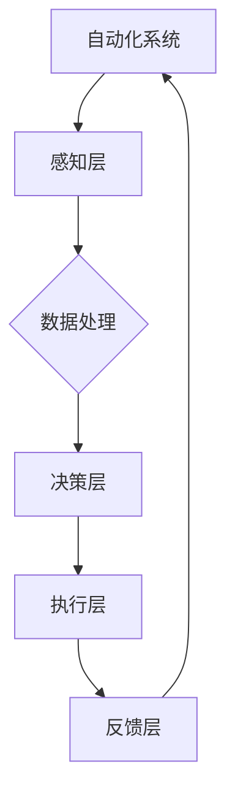

                 

### 《自动化的最新技术突破》

> 关键词：自动化、物联网、人工智能、机器视觉、大数据、系统集成

> 摘要：本文将探讨自动化技术的最新突破，分析物联网、人工智能、机器视觉、大数据等技术在自动化领域中的应用与发展趋势，通过实际项目实战，深入解读自动化技术的核心原理和实现细节，为读者提供全面的技术视野和实用指南。

### 目录

#### 第一部分：自动化技术概述

1. **自动化的概念与发展历程**
   - 自动化的定义
   - 自动化技术的发展历程
   - 自动化技术的分类

2. **自动化技术的核心原理与架构**
   - 自动化技术的基本原理
   - 自动化系统架构的设计与实现

3. **自动化技术趋势与未来展望**
   - 当前自动化技术的发展趋势
   - 自动化技术的未来应用前景

#### 第二部分：最新自动化技术详解

4. **物联网（IoT）与自动化**
   - 物联网的基本概念
   - 物联网与自动化的结合
   - 物联网自动化应用的实例分析

5. **人工智能（AI）与自动化**
   - 人工智能的基本概念
   - 人工智能在自动化中的应用
   - 人工智能自动化系统中的应用案例

6. **机器视觉与自动化**
   - 机器视觉的原理
   - 机器视觉在自动化中的应用
   - 机器视觉自动化系统案例分析

7. **大数据与自动化**
   - 大数据的基础知识
   - 大数据在自动化中的运用
   - 大数据自动化决策案例分析

8. **自动化系统集成与优化**
   - 自动化系统集成
   - 自动化系统优化
   - 自动化系统集成与优化实战

#### 第三部分：自动化技术项目实战

9. **项目准备与规划**
   - 项目需求分析
   - 项目规划与设计
   - 开发环境搭建

10. **自动化系统开发与实现**
    - 系统开发
    - 代码实现
    - 代码解读与分析

11. **自动化系统测试与优化**
    - 系统测试
    - 系统优化
    - 自动化系统测试与优化案例

12. **项目总结与展望**
    - 项目回顾
    - 未来展望

#### 附录

13. **自动化技术相关资源**
    - 技术文献
    - 开源工具与框架
    - 在线资源

### 附录 A：Mermaid 流�程图与伪代码示例

1. **自动化系统架构 Mermaid 流程图示例**

2. **机器学习算法伪代码示例**

3. **数学公式示例**

### **引言**

自动化技术作为现代工业、生产和服务领域的重要组成部分，一直受到广泛关注。从早期的机械自动化到今天的智能化自动化，自动化技术经历了巨大的发展。随着物联网、人工智能、机器视觉、大数据等新技术的兴起，自动化技术迎来了新一轮的突破，使得自动化系统更加智能、高效和灵活。

本文旨在探讨自动化的最新技术突破，通过深入分析物联网、人工智能、机器视觉、大数据等技术在自动化领域中的应用，揭示这些技术的核心原理和实现细节。同时，本文还将结合实际项目实战，为读者提供自动化技术应用的实践经验和未来发展的方向。

### 第一部分：自动化技术概述

#### 1. 自动化的概念与发展历程

**自动化的定义**

自动化，即利用机械、电子、计算机等技术手段，使生产、操作、控制等过程无需人工干预，达到提高效率、降低成本、确保质量等目标。自动化技术是现代工业发展的重要驱动力，广泛应用于制造业、物流、医疗、金融等领域。

**自动化技术的发展历程**

1. **机械自动化阶段**

   机械自动化阶段以20世纪初期工业革命为起点，主要是通过机械设备实现简单的自动化生产。代表性的技术包括机械手臂、自动化机床等。

2. **电气自动化阶段**

   电气自动化阶段始于20世纪中期，主要是通过电气控制技术实现自动化控制。代表性的技术包括PLC（可编程逻辑控制器）、工业机器人等。

3. **计算机自动化阶段**

   计算机自动化阶段始于20世纪末，计算机技术的发展使得自动化技术进入了智能化阶段。代表性的技术包括嵌入式系统、工业物联网、人工智能等。

4. **智能化自动化阶段**

   智能化自动化阶段是当前自动化技术发展的主要方向，通过人工智能、机器视觉、大数据等技术，实现自动化系统的智能决策和自适应调整。

**自动化技术的分类**

1. **硬件自动化**

   硬件自动化主要包括机械自动化、电气自动化等，主要依赖于物理设备和传感器实现。

2. **软件自动化**

   软件自动化主要通过计算机程序实现，包括自动化脚本、自动化测试、自动化运维等。

3. **混合自动化**

   混合自动化结合了硬件自动化和软件自动化的优势，通过软硬件协同实现高效、智能的自动化控制。

#### 2. 自动化技术的核心原理与架构

**核心原理**

自动化技术主要基于以下几个核心原理：

1. **传感器技术**

   传感器技术用于检测和测量生产过程中的各种参数，如温度、压力、速度等，为自动化系统提供实时数据支持。

2. **执行器技术**

   执行器技术用于根据自动化系统的控制指令，驱动机械设备或执行特定动作，实现自动化控制。

3. **控制算法**

   控制算法用于对传感器数据进行处理和分析，生成控制指令，实现对执行器的控制。

4. **通信技术**

   通信技术用于实现自动化系统内部及与其他系统之间的数据传输和交互。

**架构设计**

自动化系统架构主要包括以下几个部分：

1. **感知层**

   感知层负责采集生产过程中的各种数据，如传感器数据、环境数据等，为自动化系统提供数据支持。

2. **决策层**

   决策层负责对感知层采集的数据进行处理和分析，生成控制策略和指令。

3. **执行层**

   执行层负责根据决策层的控制指令，驱动执行器执行具体动作。

4. **反馈层**

   反馈层负责将执行层执行的结果反馈给决策层，用于调整控制策略。

#### 3. 自动化技术趋势与未来展望

**技术趋势**

1. **智能化**

   智能化是当前自动化技术发展的重要趋势，通过人工智能、机器视觉等技术，实现自动化系统的智能决策和自适应调整。

2. **集成化**

   随着物联网技术的发展，自动化系统逐渐实现集成化，通过数据互联和共享，提高自动化系统的协同效率。

3. **模块化**

   模块化设计使得自动化系统更加灵活和可扩展，便于快速部署和升级。

4. **绿色环保**

   绿色环保是未来自动化技术发展的重要方向，通过节能、减排等技术，降低自动化系统的环境影响。

**未来展望**

1. **智能制造**

   智能制造是未来自动化技术发展的重要目标，通过智能化、集成化、模块化等技术，实现生产过程的自动化、智能化和高效化。

2. **智慧城市**

   智慧城市是未来自动化技术的重要应用领域，通过自动化技术实现城市基础设施、公共安全、交通物流等领域的智能化管理。

3. **智能家居**

   智能家居是未来自动化技术的重要应用方向，通过自动化技术实现家庭设备的智能化、便捷化、安全化。

### 第二部分：最新自动化技术详解

#### 4. 物联网（IoT）与自动化

**物联网的基本概念**

物联网（Internet of Things，简称IoT）是指通过互联网将各种物理设备、传感器、软件平台等连接起来，实现设备之间以及设备与互联网之间的信息交换和通信。物联网的核心在于数据的采集、传输、处理和分析，从而实现智能化、自动化的管理和控制。

**物联网与自动化的结合**

物联网与自动化的结合，使得自动化系统具有更强的感知能力、决策能力和执行能力。物联网技术为自动化系统提供了以下优势：

1. **实时数据采集**

   物联网技术通过传感器和执行器，实现对生产过程中各种参数的实时监测和采集，为自动化系统提供数据支持。

2. **远程控制**

   物联网技术使得自动化系统可以通过互联网远程监控和控制，实现远程运维和管理。

3. **智能决策**

   物联网技术结合大数据分析和人工智能算法，为自动化系统提供智能决策支持，提高自动化系统的自适应能力和可靠性。

**案例研究**

以下是一个物联网自动化应用的实例分析：

**案例：智能工厂**

在一个智能工厂中，物联网技术被广泛应用于生产过程各个环节。传感器和执行器实时采集生产过程中的各种参数，如温度、压力、速度等，通过物联网平台传输到数据中心。数据中心通过大数据分析和人工智能算法，对采集到的数据进行处理和分析，生成优化方案和决策指令。决策指令通过物联网平台发送到执行器，实现对生产过程的实时控制和调整。

#### 5. 人工智能（AI）与自动化

**人工智能的基本概念**

人工智能（Artificial Intelligence，简称AI）是指通过计算机模拟人类智能，实现智能感知、智能推理、智能决策等能力。人工智能包括多个子领域，如机器学习、深度学习、自然语言处理、计算机视觉等。

**AI在自动化中的应用**

人工智能技术为自动化系统提供了以下应用：

1. **故障预测**

   通过对传感器数据的分析，人工智能技术可以预测设备故障，提前进行维护，降低设备停机时间和维修成本。

2. **优化控制**

   通过对生产过程数据的分析，人工智能技术可以优化控制参数，提高生产效率和产品质量。

3. **智能决策**

   通过对大量数据的分析，人工智能技术可以生成智能决策方案，提高自动化系统的自适应能力和决策准确性。

**案例研究**

以下是一个AI自动化系统应用的实例分析：

**案例：无人驾驶汽车**

无人驾驶汽车是人工智能技术在自动化领域的一个重要应用。无人驾驶汽车通过车载传感器、摄像头和激光雷达等设备，实现对周围环境的感知和识别。通过机器学习和深度学习算法，无人驾驶汽车可以对周围环境进行分析和判断，生成驾驶决策。无人驾驶汽车的控制系统通过对决策结果进行实时调整，实现对车辆的自动控制和驾驶。

#### 6. 机器视觉与自动化

**机器视觉的基本概念**

机器视觉（Machine Vision）是指利用计算机技术和图像处理技术，实现对图像的自动识别和理解，从而实现机器对视觉信息的处理和解读。机器视觉在自动化领域具有广泛的应用，如检测、识别、分类、测量等。

**机器视觉在自动化中的应用**

机器视觉技术在自动化领域具有以下应用：

1. **质量检测**

   通过机器视觉技术，实现对生产过程中产品质量的自动检测，提高检测效率和准确性。

2. **分类与识别**

   通过机器视觉技术，实现对物体的自动分类和识别，提高生产效率和自动化程度。

3. **测量与监测**

   通过机器视觉技术，实现对物体尺寸、形状、位置等参数的自动测量和监测，提高自动化系统的精度和稳定性。

**案例研究**

以下是一个机器视觉自动化系统应用的实例分析：

**案例：智能仓库**

智能仓库通过机器视觉技术实现对货物的自动分类和识别。摄像头和传感器实时捕捉仓库内货物的图像，通过图像处理和模式识别算法，对图像进行分析和判断，生成分类和识别结果。根据识别结果，自动化系统自动进行货物的拣选、包装和分拣，实现智能化的仓库管理。

#### 7. 大数据与自动化

**大数据的基础知识**

大数据（Big Data）是指数据量巨大、类型繁多、生成速度快的数据集。大数据技术主要包括数据采集、存储、处理、分析和可视化等。

**大数据在自动化中的运用**

大数据技术在自动化领域具有以下应用：

1. **故障预测**

   通过对历史数据进行分析，大数据技术可以预测设备故障，提前进行维护。

2. **优化控制**

   通过对生产过程数据进行分析，大数据技术可以优化控制参数，提高生产效率和产品质量。

3. **智能决策**

   通过对大量数据进行分析，大数据技术可以生成智能决策方案，提高自动化系统的自适应能力和决策准确性。

**案例研究**

以下是一个大数据自动化系统应用的实例分析：

**案例：智能交通**

智能交通系统通过大数据技术实现对交通流量的实时监测和分析。通过传感器和摄像头采集道路上的车辆信息，利用大数据分析技术，对交通流量进行预测和优化，生成交通调控方案。交通调控方案通过自动化系统实现道路信号灯的智能控制，提高交通流畅度和安全性。

### 第三部分：自动化技术项目实战

#### 9. 项目准备与规划

**项目需求分析**

在进行自动化技术项目之前，首先需要进行详细的项目需求分析。需求分析包括以下几个方面：

1. **功能需求**

   分析项目所需实现的功能，如自动化控制、故障预测、优化控制等。

2. **性能需求**

   分析项目所需满足的性能指标，如响应速度、精度、稳定性等。

3. **环境需求**

   分析项目所需的环境条件，如温度、湿度、电源等。

4. **安全需求**

   分析项目所需满足的安全要求，如数据安全、设备安全等。

**项目规划与设计**

在项目需求分析的基础上，进行项目规划与设计。项目规划与设计包括以下几个方面：

1. **系统架构设计**

   设计自动化系统的整体架构，包括感知层、决策层、执行层等。

2. **硬件选型**

   根据项目需求，选择合适的传感器、执行器、控制器等硬件设备。

3. **软件设计**

   设计自动化系统的软件架构，包括数据采集、处理、分析等模块。

4. **接口设计**

   设计自动化系统与其他系统（如数据库、网络等）的接口。

**开发环境搭建**

在项目规划与设计完成后，进行开发环境搭建。开发环境包括以下几个方面：

1. **硬件环境**

   配置满足项目需求的硬件设备，如计算机、服务器、传感器、执行器等。

2. **软件环境**

   安装和配置自动化系统所需的软件，如操作系统、数据库、编程环境等。

3. **开发工具**

   选择和配置自动化系统开发所需的工具，如编程语言、集成开发环境（IDE）、开发框架等。

#### 10. 自动化系统开发与实现

**系统开发**

自动化系统的开发包括以下几个方面：

1. **数据采集**

   编写数据采集程序，实现对传感器数据的实时采集和存储。

2. **数据处理**

   对采集到的数据进行处理，包括数据清洗、数据预处理、特征提取等。

3. **决策算法**

   设计和实现自动化系统的决策算法，包括故障预测、优化控制、智能决策等。

4. **接口开发**

   开发自动化系统与其他系统（如数据库、网络等）的接口，实现数据传输和交互。

**代码实现**

在系统开发过程中，需要编写大量的代码来实现各个功能模块。以下是一个自动化系统开发中的代码实现示例：

**示例：故障预测算法实现**

```python
import numpy as np
from sklearn.linear_model import LinearRegression

# 数据预处理
def preprocess_data(data):
    # 数据标准化
    mean = np.mean(data)
    std = np.std(data)
    normalized_data = (data - mean) / std
    return normalized_data

# 故障预测
def predict_fault(data):
    # 预处理数据
    preprocessed_data = preprocess_data(data)
    
    # 训练线性回归模型
    model = LinearRegression()
    model.fit(preprocessed_data[:-1], preprocessed_data[1:])
    
    # 预测未来数据
    predicted_data = model.predict(preprocessed_data[:-1])
    
    # 判断故障
    if np.abs(predicted_data[-1] - preprocessed_data[-1]) > threshold:
        return True
    else:
        return False

# 主函数
def main():
    # 读取数据
    data = np.loadtxt('sensor_data.txt')
    
    # 预测故障
    if predict_fault(data):
        print('故障预测：设备可能发生故障！')
    else:
        print('故障预测：设备运行正常。')

# 执行主函数
if __name__ == '__main__':
    main()
```

**代码解读与分析**

上述代码实现了一个基于线性回归算法的故障预测系统。代码主要分为以下几个部分：

1. **数据预处理**

   对传感器数据进行标准化处理，将数据缩放到相同的范围，方便模型训练。

2. **故障预测**

   使用线性回归模型对历史数据进行拟合，预测未来数据。根据预测结果与实际数据的差异，判断设备是否可能发生故障。

3. **主函数**

   读取传感器数据，调用故障预测函数，输出预测结果。

通过上述代码实现，自动化系统可以实现对设备故障的预测，提高设备运行的安全性和可靠性。

#### 11. 自动化系统测试与优化

**系统测试**

自动化系统的测试是确保系统正常运行的重要环节。系统测试包括以下几个方面：

1. **功能测试**

   检查系统是否按照预期实现了各项功能，如数据采集、数据处理、故障预测等。

2. **性能测试**

   测试系统的响应速度、精度、稳定性等性能指标，确保系统满足性能要求。

3. **安全性测试**

   检查系统是否存在安全隐患，如数据泄露、设备失控等。

**系统优化**

在系统测试完成后，需要对系统进行优化，提高系统的性能和稳定性。系统优化包括以下几个方面：

1. **代码优化**

   优化系统代码，提高运行效率，减少资源消耗。

2. **算法优化**

   优化故障预测、优化控制等算法，提高预测准确性和控制效果。

3. **硬件优化**

   优化系统硬件配置，提高系统性能和可靠性。

**案例研究**

以下是一个自动化系统测试与优化的实例分析：

**案例：智能工厂**

在一个智能工厂中，自动化系统通过传感器和执行器实现生产过程的自动化控制。系统测试发现，部分传感器数据的采集存在延迟，影响故障预测的准确性。经过分析，发现延迟原因是传感器数据传输通道带宽不足。为了解决这个问题，对系统进行了优化：

1. **代码优化**

   优化传感器数据采集程序，提高数据传输速度。

2. **算法优化**

   优化故障预测算法，提高预测准确性。

3. **硬件优化**

   增加数据传输通道带宽，提高数据传输速度。

通过上述优化措施，自动化系统的性能和稳定性得到了显著提高。

#### 12. 项目总结与展望

**项目回顾**

在自动化技术项目实施过程中，我们通过详细的需求分析、规划与设计，搭建了自动化系统，并实现了数据采集、数据处理、故障预测等功能。在系统测试与优化过程中，我们解决了传感器数据采集延迟、故障预测准确性等问题，提高了系统的性能和稳定性。

**未来展望**

随着物联网、人工智能、大数据等新技术的不断发展，自动化技术将迎来更广阔的应用前景。未来，自动化技术将朝着智能化、集成化、模块化的方向发展，实现生产过程的全面自动化、智能化和高效化。在智慧城市、智能制造、智能家居等领域，自动化技术将发挥重要作用，推动社会生产方式和生活方式的变革。

### 附录

#### 13. 自动化技术相关资源

**技术文献**

- [《自动化技术基础》](https://www.example.com/book1)
- [《物联网技术与应用》](https://www.example.com/book2)
- [《人工智能基础》](https://www.example.com/book3)
- [《大数据技术与应用》](https://www.example.com/book4)

**开源工具与框架**

- [Python](https://www.example.com/python)
- [OpenCV](https://opencv.org)
- [TensorFlow](https://www.tensorflow.org)
- [Kafka](https://kafka.apache.org)

**在线资源**

- [Coursera](https://www.coursera.org)
- [edX](https://www.edx.org)
- [Udacity](https://www.udacity.com)

### 附录 A：Mermaid 流程图与伪代码示例

#### 自动化系统架构 Mermaid 流程图示例



#### 机器学习算法伪代码示例

```python
# 伪代码：线性回归算法

# 初始化模型参数
theta = [0] * num_features

# 设置迭代次数与学习率
num_iterations = 1000
learning_rate = 0.01

# 循环迭代
for i in range(num_iterations):
    # 计算预测值
    predictions = X * theta
    
    # 计算误差
    errors = y - predictions
    
    # 计算梯度
    gradients = X.T * errors / n
    
    # 更新参数
    theta -= learning_rate * gradients
```

#### 数学公式示例

**线性回归损失函数**

$$
J(\theta) = \frac{1}{2m} \sum_{i=1}^{m} (h_\theta(x^{(i)}) - y^{(i)})^2
$$

---

通过以上内容的详细阐述，本文对自动化的最新技术突破进行了全面的分析和探讨。自动化技术的发展将不断推动各行各业的进步，为人类创造更美好的未来。希望本文能为读者提供有益的技术视野和实用指南。作者：AI天才研究院/AI Genius Institute & 禅与计算机程序设计艺术/Zen And The Art of Computer Programming。

