                 

## 文章标题

《自动化领域的最新发展趋势》

关键词：自动化技术，人工智能，机器学习，机器人，智能制造，物联网

摘要：本文将深入探讨自动化领域的最新发展趋势，从历史背景、核心概念、应用领域、新技术发展、挑战与解决方案、政策法规及未来展望等多个角度，全面分析自动化技术的最新动态和未来前景。通过本文的阅读，读者将能够了解自动化技术的基本概念、发展历程、应用现状和未来发展趋势，为在相关领域的工作和研究提供有益的参考。

### 《自动化领域的最新发展趋势》目录大纲

1. **自动化技术概览**
   - 第1章：自动化技术的发展历史与现状
     - 1.1 自动化的起源与发展
     - 1.2 自动化技术的现状分析
     - 1.3 自动化技术的未来趋势展望
   - 第2章：自动化技术的核心概念与架构
     - 2.1 自动化的核心概念
     - 2.2 自动化系统的架构
     - 2.3 自动化系统的组成与工作原理
   - 第3章：自动化技术在不同行业的应用
     - 3.1 制造业中的自动化应用
     - 3.2 农业自动化
     - 3.3 医疗自动化
     - 3.4 建筑自动化
     - 3.5 物流自动化

2. **自动化技术的新技术发展**
   - 第4章：自动化技术的新技术发展
     - 4.1 人工智能与自动化技术的融合
     - 4.2 机器学习在自动化中的应用
     - 4.3 机器人技术的发展趋势
     - 4.4 自动化系统的智能化升级

3. **自动化技术的挑战与解决方案**
   - 第5章：自动化技术的挑战与解决方案
     - 5.1 自动化技术的挑战
     - 5.2 面向未来的自动化解决方案
     - 5.3 自动化技术在可持续发展中的作用

4. **自动化技术的政策与法规**
   - 第6章：自动化技术的政策与法规
     - 6.1 自动化技术的相关政策法规
     - 6.2 自动化技术的影响与监管
     - 6.3 自动化技术的发展方向与政策建议

5. **自动化技术的未来展望**
   - 第7章：自动化技术的未来展望
     - 7.1 自动化技术的发展趋势
     - 7.2 自动化技术在人类生活中的影响
     - 7.3 自动化技术的未来展望

6. **附录：自动化技术相关资源与工具**
   - A.1 自动化技术常用资源
   - A.2 自动化技术学习工具
   - A.3 自动化技术行业报告与资讯

本文将按照以上目录结构，逐步深入分析自动化领域的各个方面，帮助读者全面了解自动化技术的最新发展趋势和应用前景。

### 第一部分：自动化技术概览

#### 第1章：自动化技术的发展历史与现状

##### 1.1 自动化的起源与发展

自动化的概念起源于人类对重复性劳动的解放需求。早在古代，人们就通过使用杠杆、滑轮等简单的机械装置来辅助工作。这些早期的机械设备，虽然结构简单，但已经体现了自动化思想的萌芽。

进入工业革命时期，随着蒸汽机的发明和应用，自动化技术得到了快速发展。18世纪末，詹姆斯·瓦特改进了蒸汽机，使得工厂生产效率大幅提高。蒸汽机驱动的自动化机械开始在生产线上大量应用，标志着工业自动化时代的来临。

19世纪末到20世纪初，电力的广泛应用进一步推动了自动化技术的发展。随着电动机和电控技术的应用，自动化设备变得更加高效和可靠。流水线生产方式的普及，使得大规模生产成为可能。

20世纪中叶，计算机技术的发展为自动化技术注入了新的活力。计算机控制系统开始取代传统的机械和电控系统，实现了对生产过程的精确控制。此时，自动化技术进入了计算机自动化时代。

##### 1.2 自动化技术的现状分析

当前，自动化技术在各行各业中都得到了广泛应用，成为了现代社会的重要支撑技术之一。根据市场研究公司的数据，全球自动化市场规模在过去几年中持续增长，预计未来几年仍将保持稳步增长。

在制造业中，自动化技术已经成为提升生产效率、降低成本的关键手段。从生产线的自动化组装到物流系统的自动化管理，自动化技术都在发挥着重要作用。例如，汽车制造行业中的自动化生产线，不仅提高了生产效率，还显著降低了制造成本。

在服务业中，自动化技术也得到了广泛应用。从自动化的银行柜台服务到智能客服系统，自动化技术正在改变着服务行业的运营模式。尤其是在疫情防控期间，自动化技术发挥了重要作用，例如无人配送机器人、无人超市等，有效减少了人与人之间的接触，保障了公共安全。

农业领域也受益于自动化技术的应用。智能农业系统通过传感器、无人机等技术，实现了对农田的精准管理，提高了农业生产效率。自动化农业机械的普及，使得农业生产更加高效、环保。

##### 1.3 自动化技术的未来趋势展望

随着人工智能、物联网、机器人等新技术的快速发展，自动化技术正迎来新的发展机遇。以下是自动化技术未来可能的发展趋势：

1. **人工智能与自动化技术的深度融合**：人工智能技术的进步，使得自动化系统具备了更多的智能决策能力。未来的自动化系统将能够通过学习、自适应和优化，实现更加智能化的操作和管理。

2. **物联网技术的普及**：物联网技术的普及，将使得自动化系统具备更多的感知能力。通过连接各种设备、传感器和系统，物联网技术将实现设备之间的互联互通，提升自动化系统的整体效能。

3. **机器人技术的创新**：随着机器人技术的不断发展，未来将出现更多功能强大、操作灵活的机器人。这些机器人将不仅能在制造业中发挥重要作用，还将在服务业、医疗、农业等多个领域发挥重要作用。

4. **自动化系统的智能化升级**：未来的自动化系统将更加注重智能化和用户体验。通过引入大数据、云计算等新技术，自动化系统将能够提供更加个性化和智能化的服务。

总之，自动化技术正朝着更加智能化、高效化和人性化的方向发展。未来，自动化技术将在各个领域发挥更加重要的作用，推动人类社会向更加智能化、高效化的方向发展。

#### 第2章：自动化技术的核心概念与架构

##### 2.1 自动化的核心概念

自动化是指通过使用各种机械设备、电子设备和计算机技术，来实现对生产过程、服务过程和自然过程的自动化控制和操作。自动化的核心概念主要包括以下几个方面：

1. **自动化系统**：自动化系统是由多个组件组成的整体，用于完成特定任务的自动化过程。这些组件包括传感器、执行器、控制器、通信网络等。自动化系统的目标是实现对生产过程或服务过程的自动控制，提高生产效率和服务质量。

2. **传感器**：传感器是自动化系统中的重要组件，用于检测和测量环境中的各种物理量，如温度、湿度、压力、速度等。传感器的数据为控制系统提供了实时反馈，使得系统能够根据实际情况进行自适应调整。

3. **执行器**：执行器是自动化系统中的执行机构，用于接收控制信号并执行相应的操作。常见的执行器包括电机、液压缸、气动执行器等。执行器的动作使得自动化系统能够实现物理操作，如开启阀门、移动部件等。

4. **控制器**：控制器是自动化系统的核心组件，用于接收传感器数据、处理控制算法并生成控制信号。控制器通常由微处理器或单片机实现，可以实现复杂的控制算法和逻辑判断。控制器的目标是确保自动化系统按照预定的规则和目标进行运行。

5. **通信网络**：通信网络是自动化系统中各个组件之间进行数据传输和控制的媒介。常见的通信网络包括有线网络（如以太网、串口等）和无线网络（如Wi-Fi、Zigbee等）。通信网络的可靠性、实时性和安全性对于自动化系统的稳定运行至关重要。

##### 2.2 自动化系统的架构

自动化系统的架构通常包括以下几个层次：

1. **感知层**：感知层由各种传感器组成，用于感知环境中的各种物理量。感知层的数据为控制层提供了实时反馈，使得系统能够根据实际情况进行自适应调整。

2. **控制层**：控制层由控制器组成，负责接收感知层的数据、处理控制算法并生成控制信号。控制层的核心任务是确保自动化系统按照预定的规则和目标进行运行。

3. **执行层**：执行层由执行器组成，负责接收控制层的控制信号并执行相应的操作。执行层的动作实现了自动化系统的物理操作，如开启阀门、移动部件等。

4. **通信层**：通信层负责自动化系统中各个组件之间的数据传输和通信。通信层的实现方式包括有线通信和无线通信，根据实际需求选择合适的通信网络。

下面是一个典型的自动化系统架构图：

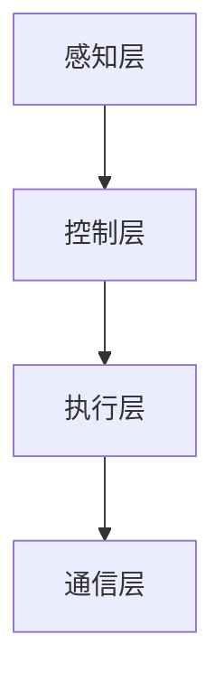

##### 2.3 自动化系统的组成与工作原理

自动化系统的组成和原理可以通过以下步骤进行概述：

1. **感知**：传感器感知环境中的各种物理量，并将数据传输到控制器。

2. **处理**：控制器接收传感器数据，通过处理算法对数据进行分析和判断，生成控制信号。

3. **执行**：执行器根据控制信号进行相应的物理操作，如开启阀门、移动部件等。

4. **反馈**：执行器的动作结果通过传感器再次反馈到控制器，形成闭环控制系统。

5. **优化**：根据实时反馈的数据，控制器可以不断优化控制算法，提高系统的自适应性和响应速度。

下面是一个简化的自动化系统工作流程图：

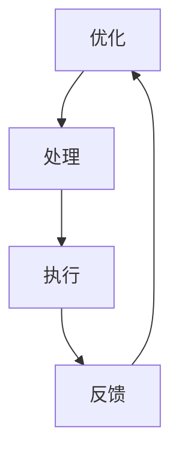

通过以上对自动化技术核心概念与架构的介绍，读者可以初步了解自动化系统的工作原理和组成部分。在接下来的章节中，我们将进一步探讨自动化技术在各行业的具体应用和发展趋势。

#### 第3章：自动化技术在不同行业的应用

##### 3.1 制造业中的自动化应用

制造业是自动化技术最早且最广泛应用的行业之一。随着工业4.0和智能制造概念的普及，自动化技术已经深刻地改变了制造业的生产方式和管理模式。

1. **生产线自动化**：

生产线自动化是制造业自动化的核心。通过使用各种自动化设备和机器人，生产线可以实现从原材料加工到成品组装的全面自动化。例如，汽车制造业中，焊接、喷涂、组装等环节大量使用机器人，大大提高了生产效率。

**核心概念与联系**：

生产线自动化涉及的关键概念包括：机器人、数控机床、自动化生产线、传感器和控制系统。

**架构**：

生产线自动化系统通常包括感知层（传感器）、控制层（PLC、机器人控制器）和执行层（机器人、执行器）。

**流程图**：

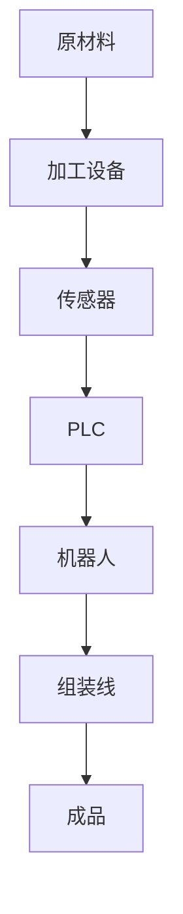

2. **制造执行系统（MES）**：

制造执行系统是一个用于管理生产过程的信息系统，它通过集成生产线上的各种设备和系统，实现对生产过程的实时监控、数据采集和决策支持。MES可以大幅提高生产计划的灵活性、生产效率和质量控制。

**核心算法原理**：

MES的核心算法包括生产调度算法、质量检测算法和设备故障预测算法。

**伪代码示例**：

```python
# 生产调度算法伪代码
def production_scheduling():
    # 获取当前生产任务列表
    tasks = get_tasks_list()
    # 根据任务优先级和设备状态进行排序
    sorted_tasks = sort_tasks_by_priority(tasks)
    # 分配任务到可用设备
    for task in sorted_tasks:
        available_machines = find_available_machines()
        assign_task_to_machine(task, available_machines)
```

3. **工业物联网（IIoT）**：

工业物联网通过将传感器、机器设备和企业信息系统连接起来，实现设备级的数据采集和分析，从而优化生产过程。IIoT的普及使得制造业的自动化水平进一步提升。

**数学模型和公式**：

工业物联网中的数据传输速率、数据精度等参数可以通过以下公式进行评估：

$$
传输速率 = \frac{数据传输量}{传输时间}
$$

$$
数据精度 = \frac{实际测量值 - 期望测量值}{期望测量值}
$$

**举例说明**：

一个典型的工业物联网应用场景是智能工厂的设备状态监控。通过安装在设备上的传感器，实时监控设备的运行状态，并利用数据分析技术预测设备故障，从而实现预防性维护。

##### 3.2 农业自动化

农业自动化是提高农业生产效率、保障粮食安全的重要手段。随着物联网、人工智能等技术的不断发展，农业自动化正逐渐从传统的机械自动化向智能化方向迈进。

1. **智能农业系统**：

智能农业系统通过传感器、无人机和大数据分析技术，实现对农田的精准管理。例如，传感器可以实时监测土壤湿度、温度和养分含量，无人机则用于农田监测和植保作业。

**核心概念与联系**：

智能农业系统的核心概念包括：传感器、无人机、大数据分析和智能控制系统。

**架构**：

智能农业系统架构包括感知层（传感器）、传输层（无线网络）、控制层（智能控制系统）和应用层（大数据分析平台）。

**流程图**：

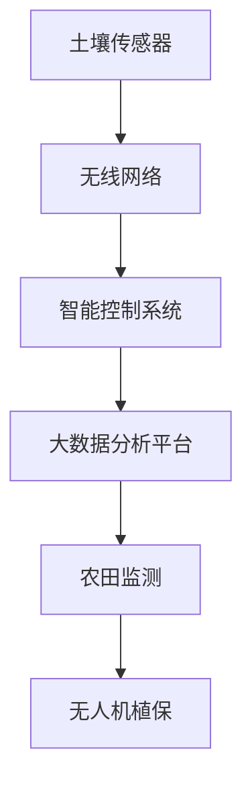

2. **精准农业**：

精准农业是一种基于传感器技术和地理信息系统（GIS）的农业生产方式，通过精准施肥、灌溉和植保，提高作物产量和质量。精准农业的关键技术包括遥感技术、GPS定位技术和传感器技术。

**核心算法原理**：

精准农业的核心算法包括土壤湿度监测算法、作物生长模型和施肥量计算算法。

**伪代码示例**：

```python
# 土壤湿度监测算法伪代码
def soil_moisture_monitoring():
    # 获取土壤湿度传感器数据
    moisture_data = get_soil_moisture_data()
    # 判断土壤湿度是否在适宜范围内
    if moisture_data < optimal_moisture:
        # 发送灌溉指令
        irrigation_command = send_irrigation_command()
```

3. **农业机器人**：

农业机器人是农业自动化的一个重要方向，通过搭载各种传感器和执行器，农业机器人可以完成播种、施肥、收割等农业作业。农业机器人不仅提高了农业生产的效率，还减少了劳动力的需求。

**数学模型和公式**：

农业机器人路径规划中的关键公式包括：

$$
距离 = \sqrt{(x_2 - x_1)^2 + (y_2 - y_1)^2}
$$

$$
角度 = \arctan2(y_2 - y_1, x_2 - x_1)
$$

**举例说明**：

一个典型的农业机器人应用场景是无人驾驶收割机。无人驾驶收割机通过GPS定位和摄像头感知环境，实现自主导航和作物收割，大大提高了收割效率。

##### 3.3 医疗自动化

医疗自动化技术正在改变医疗服务的提供方式，提高医疗服务的效率和准确性。自动化技术在医疗领域的应用包括手术机器人、智能医疗设备和远程医疗服务等。

1. **手术机器人**：

手术机器人是医疗自动化技术的代表，通过高精度的机械臂和计算机控制系统，手术机器人可以辅助医生进行复杂的手术操作。手术机器人提高了手术的准确性和安全性，减少了术后并发症。

**核心概念与联系**：

手术机器人的核心概念包括：机械臂、计算机控制系统和手术导航系统。

**架构**：

手术机器人系统包括机械臂、传感器、计算机控制系统和手术导航系统。

**流程图**：

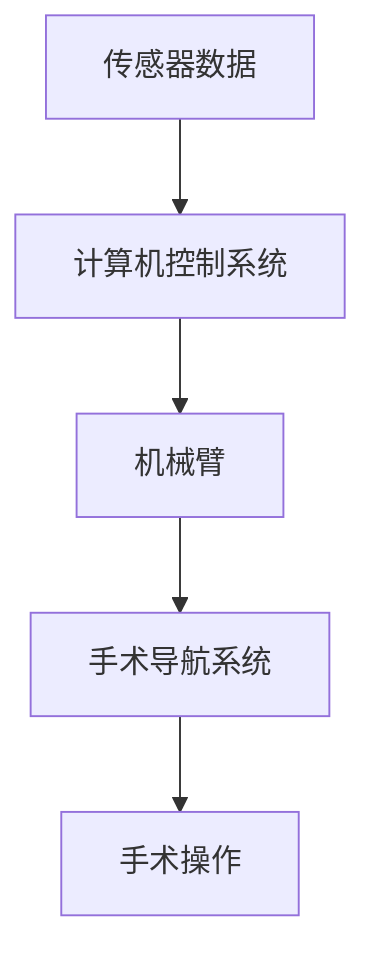

2. **智能医疗设备**：

智能医疗设备通过集成传感器、通信模块和数据处理算法，实现了对患者的实时监控和数据分析。智能医疗设备的应用，如智能血压计、智能血糖仪等，使得患者在家即可进行自我监测，提高了医疗服务的便捷性。

**核心算法原理**：

智能医疗设备的核心算法包括数据采集算法、数据分析算法和异常检测算法。

**伪代码示例**：

```python
# 数据采集算法伪代码
def data_collection():
    # 采集患者生理数据
    physiological_data = get_physiological_data()
    # 存储数据到数据库
    store_data_to_database(physiological_data)
```

3. **远程医疗服务**：

远程医疗服务利用自动化技术，实现了医生与患者之间的远程诊疗。通过视频会议、智能诊断系统和远程监控设备，医生可以实时诊断患者病情，提供治疗方案，提高了医疗服务的覆盖面和效率。

**数学模型和公式**：

远程医疗服务中的关键公式包括：

$$
通信延迟 = \frac{通信距离}{信号传播速度}
$$

$$
数据传输速率 = \frac{数据传输量}{传输时间}
$$

**举例说明**：

一个典型的远程医疗服务应用场景是远程心脏病监护。通过安装在患者身上的监测设备，实时传输心电图数据到医生端，医生可以远程诊断患者的病情，并提供及时的治疗建议。

##### 3.4 建筑自动化

建筑自动化技术通过集成传感器、控制系统和通信网络，实现了对建筑物环境、能源和安全的智能管理。建筑自动化技术在现代建筑中得到了广泛应用，如智能家居、智能建筑管理和智能城市等。

1. **智能家居**：

智能家居通过集成各种智能设备，实现了家庭设备的自动化控制，如照明、空调、门锁等。智能家居系统可以根据用户的习惯和需求，提供个性化的家庭环境，提高了居住的舒适度和便利性。

**核心概念与联系**：

智能家居的核心概念包括：智能设备、物联网和智能控制系统。

**架构**：

智能家居系统架构包括感知层（智能设备）、传输层（无线网络）和控制层（智能控制系统）。

**流程图**：

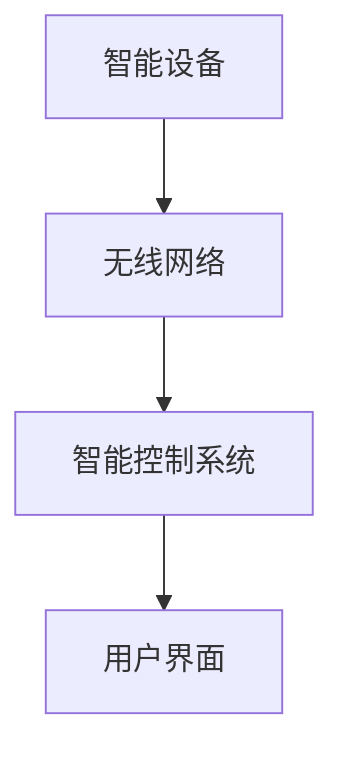

2. **智能建筑管理**：

智能建筑管理通过自动化技术，实现了对建筑物内各种设备和系统的集中管理，如电梯、空调、照明等。智能建筑管理系统能够实时监控建筑物的运行状态，优化能源消耗，提高建筑物管理的效率。

**核心算法原理**：

智能建筑管理的核心算法包括能耗优化算法、设备故障预测算法和安全管理算法。

**伪代码示例**：

```python
# 能耗优化算法伪代码
def energy_optimization():
    # 获取建筑物能耗数据
    energy_data = get_energy_data()
    # 根据能耗数据优化设备运行
    optimize_device_operation(energy_data)
```

3. **智能城市**：

智能城市通过集成各种自动化技术，实现了对城市交通、环境、能源和安全的智能管理。智能城市系统可以实时监控城市运行状态，优化城市资源配置，提高城市生活的质量和效率。

**数学模型和公式**：

智能城市中的关键公式包括：

$$
交通流量 = \frac{道路长度}{行驶时间}
$$

$$
能源消耗 = 设备功率 \times 运行时间
$$

**举例说明**：

一个典型的智能城市应用场景是智能交通管理。通过安装在道路上的传感器和智能交通信号系统，实时监控交通流量，并根据实际情况调整信号灯状态，优化交通流量，减少拥堵。

##### 3.5 物流自动化

物流自动化技术在提高物流效率、降低物流成本方面发挥了重要作用。物流自动化包括仓储自动化、运输自动化和配送自动化等。

1. **仓储自动化**：

仓储自动化通过使用自动化设备和机器人，实现了仓储作业的自动化。自动化仓储系统可以高效地完成货物的入库、出库和库存管理，提高了仓储效率。

**核心概念与联系**：

仓储自动化的核心概念包括：自动化立体仓库、输送带、搬运机器人和仓储管理系统。

**架构**：

仓储自动化系统架构包括存储层（自动化立体仓库）、输送层（输送带）和控制层（仓储管理系统）。

**流程图**：

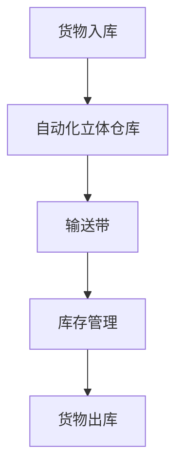

2. **运输自动化**：

运输自动化通过使用自动驾驶技术和物联网技术，实现了运输过程的自动化。自动驾驶卡车和无人运输飞机等自动化运输工具，可以实时感知路况和货物状态，优化运输路线和速度，提高运输效率。

**核心算法原理**：

运输自动化的核心算法包括路径规划算法、交通流量预测算法和能耗优化算法。

**伪代码示例**：

```python
# 路径规划算法伪代码
def path_planning():
    # 获取起点和终点坐标
    start_point, end_point = get_start_and_end_point()
    # 计算最优路径
    optimal_path = calculate_optimal_path(start_point, end_point)
    # 输出最优路径
    print("最优路径：", optimal_path)
```

3. **配送自动化**：

配送自动化通过使用无人机和智能配送机器人，实现了最后一公里的自动化配送。无人机和配送机器人可以高效地完成从仓库到客户的配送任务，提高了配送效率。

**数学模型和公式**：

配送自动化中的关键公式包括：

$$
配送时间 = \frac{配送距离}{配送速度}
$$

$$
配送成本 = 配送距离 \times 配送费用
$$

**举例说明**：

一个典型的配送自动化应用场景是无人机快递。无人机从仓库起飞，自动规划最优配送路径，快速将快递送到客户手中，大大缩短了配送时间。

通过以上对自动化技术在各行业应用的具体介绍，我们可以看到自动化技术在提升行业效率、降低成本、提高服务质量方面的重要作用。在未来的发展中，自动化技术将继续与新兴技术深度融合，为各行各业带来更多创新和变革。

#### 第4章：自动化技术的新技术发展

##### 4.1 人工智能与自动化技术的融合

人工智能（AI）与自动化技术的融合，正在推动自动化系统向更加智能化、自适应和高效化的方向发展。人工智能技术的引入，使得自动化系统不仅能够执行预设的任务，还能够自主学习和优化操作，从而实现更高层次的自动化。

1. **核心概念与联系**：

人工智能与自动化技术的融合涉及的核心概念包括：机器学习、深度学习、自然语言处理（NLP）、计算机视觉等。这些技术为自动化系统提供了强大的数据分析和决策能力。

**架构**：

融合人工智能的自动化系统通常包括感知层（传感器和AI算法）、决策层（AI模型和控制器）和执行层（执行器和机器人）。

**流程图**：

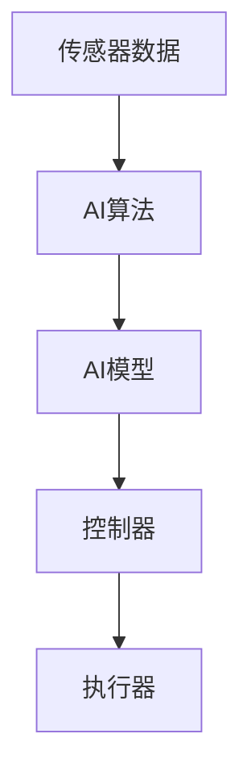

2. **机器学习在自动化中的应用**：

机器学习是人工智能的核心技术之一，通过训练数据集，机器学习算法能够识别模式、预测结果并优化操作。在自动化系统中，机器学习技术广泛应用于生产过程优化、故障预测和决策支持等方面。

**核心算法原理**：

机器学习在自动化系统中的应用主要包括监督学习、无监督学习和强化学习。例如，生产过程中的质量检测可以通过监督学习算法实现，设备故障预测可以通过无监督学习算法实现。

**伪代码示例**：

```python
# 质量检测算法伪代码（监督学习）
def quality_detection():
    # 加载训练数据集
    training_data = load_training_data()
    # 训练质量检测模型
    model = train_quality_detection_model(training_data)
    # 进行质量检测
    detected_quality = model.predict(new_data)
    return detected_quality
```

3. **案例研究**：

**案例1：智能工厂的生产调度**：

在一个智能工厂中，通过引入机器学习算法，对生产过程中的各种参数进行实时分析，优化生产调度。例如，通过对历史生产数据的学习，机器学习算法可以预测生产线的负载情况，从而合理安排生产任务，提高生产效率。

**案例2：智能医疗诊断系统**：

智能医疗诊断系统通过计算机视觉技术，结合机器学习算法，对医学影像进行分析，辅助医生进行疾病诊断。例如，利用深度学习模型，系统可以自动识别和标注医学影像中的病变区域，提高诊断的准确性和效率。

##### 4.2 机器学习在自动化中的应用

机器学习在自动化技术中的应用，使得自动化系统具备了自我学习和优化能力，从而提高了系统的自适应性和可靠性。在自动化系统中，机器学习技术广泛应用于数据预测、故障诊断和操作优化等方面。

1. **核心概念与联系**：

机器学习在自动化中的应用涉及的核心概念包括：数据预处理、特征工程、模型训练和模型评估。这些技术为自动化系统提供了强大的数据处理和预测能力。

**架构**：

机器学习在自动化系统中的应用架构通常包括数据采集层、数据处理层、模型训练层和模型应用层。

**流程图**：

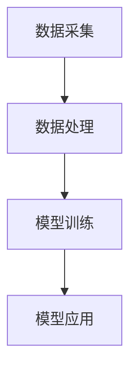

2. **数据预测**：

数据预测是机器学习在自动化系统中的一项重要应用。通过分析历史数据，机器学习算法可以预测未来的趋势和变化，从而为自动化系统提供决策支持。例如，在生产线中，通过对生产数据的学习，机器学习算法可以预测生产故障，提前进行维护，减少停机时间。

**核心算法原理**：

数据预测的核心算法主要包括回归分析、时间序列分析和分类算法。例如，生产故障预测可以通过时间序列分析算法实现，设备利用率预测可以通过回归分析算法实现。

**伪代码示例**：

```python
# 生产故障预测算法伪代码（时间序列分析）
def fault_prediction():
    # 加载历史生产数据
    historical_data = load_historical_data()
    # 分离特征和标签
    features, labels = separate_features_and_labels(historical_data)
    # 训练时间序列预测模型
    model = train_time_series_model(features, labels)
    # 进行故障预测
    predicted_faults = model.predict(new_data)
    return predicted_faults
```

3. **故障诊断**：

在自动化系统中，故障诊断是确保系统稳定运行的重要环节。通过机器学习技术，可以实现对设备运行状态的实时监测和故障诊断。例如，通过分析设备运行数据，机器学习算法可以识别设备的异常状态，提前发出警报，避免设备故障。

**核心算法原理**：

故障诊断的核心算法主要包括异常检测和分类算法。例如，异常检测可以通过孤立森林算法实现，分类算法可以通过支持向量机（SVM）实现。

**伪代码示例**：

```python
# 异常检测算法伪代码（孤立森林）
def anomaly_detection():
    # 加载设备运行数据
    device_data = load_device_data()
    # 训练孤立森林模型
    model = train_isolation_forest_model(device_data)
    # 进行异常检测
    anomalies = model.detect_anomalies(device_data)
    return anomalies
```

4. **操作优化**：

在自动化系统中，操作优化是提高系统效率和降低成本的重要手段。通过机器学习技术，可以对操作参数进行优化，实现最优的操作策略。例如，在生产线中，通过对生产数据的学习，机器学习算法可以优化生产节拍，提高生产效率。

**核心算法原理**：

操作优化的核心算法主要包括优化算法和机器学习算法的结合。例如，可以通过遗传算法和机器学习算法的联合优化，实现生产节拍的优化。

**伪代码示例**：

```python
# 生产节拍优化算法伪代码（遗传算法和机器学习）
def production_takt_time_optimization():
    # 加载生产数据
    production_data = load_production_data()
    # 定义遗传算法参数
    genetic_algorithm_params = define_genetic_algorithm_params()
    # 定义机器学习模型参数
    machine_learning_model_params = define_machine_learning_model_params()
    # 联合优化生产节拍
    optimal_takt_time = optimize_takt_time(production_data, genetic_algorithm_params, machine_learning_model_params)
    return optimal_takt_time
```

##### 4.3 机器人技术的发展趋势

机器人技术是自动化领域的重要分支，随着人工智能和物联网等新技术的不断发展，机器人技术正朝着更加智能化、多样化和人性的方向发展。

1. **核心概念与联系**：

机器人技术的核心概念包括：机器人架构、传感器集成、人工智能和机器人学习。这些概念相互关联，共同推动机器人技术的进步。

**架构**：

现代机器人系统通常包括感知层（传感器）、决策层（控制器和AI算法）和执行层（机械臂和执行器）。

**流程图**：

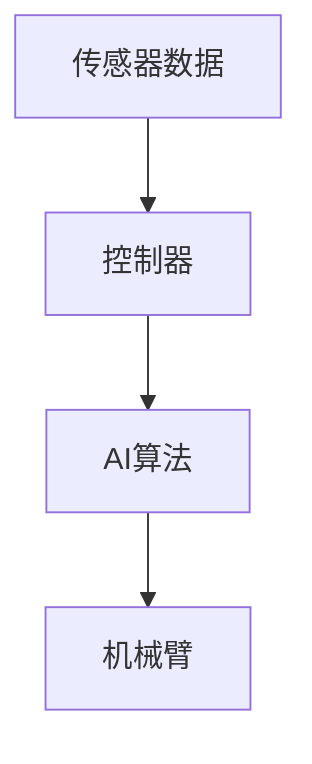

2. **服务机器人的发展**：

服务机器人是机器人技术中的一个重要分支，广泛应用于医疗、教育、餐饮、零售等领域。随着人工智能技术的进步，服务机器人具备了更加复杂的功能和更高的智能化水平。

**核心算法原理**：

服务机器人的核心算法包括路径规划、行为控制和自然语言处理。路径规划算法确保机器人能够安全高效地移动，行为控制算法使机器人能够根据环境变化做出适当的反应，自然语言处理算法使机器人能够理解并回应人类语言。

**伪代码示例**：

```python
# 路径规划算法伪代码
def path_planning():
    # 获取当前位置和目标位置
    current_position, target_position = get_position_and_target()
    # 计算最优路径
    optimal_path = calculate_optimal_path(current_position, target_position)
    # 更新机器人路径
    robot_path = update_robot_path(optimal_path)
    return robot_path
```

3. **工业机器人的发展**：

工业机器人是自动化技术的重要组成部分，广泛应用于制造业。随着人工智能和机器人技术的进步，工业机器人正朝着更高精度、更大负载和更灵活的方向发展。

**核心算法原理**：

工业机器人的核心算法包括运动规划、路径规划和力控制。运动规划算法确保机器人能够准确执行预定的运动轨迹，路径规划算法确保机器人能够安全高效地移动，力控制算法确保机器人能够适应不同工作环境。

**伪代码示例**：

```python
# 运动规划算法伪代码
def motion_planning():
    # 获取机器人末端执行器的目标位置
    target_position = get_target_position()
    # 计算运动轨迹
    motion_trajectory = calculate_motion_trajectory(target_position)
    # 执行运动轨迹
    execute_motion_trajectory(motion_trajectory)
```

4. **人机协作机器人**：

人机协作机器人是未来工业机器人发展的重要方向，通过人与机器人之间的协作，提高生产效率和工作环境的安全。人机协作机器人需要具备高度的安全性和灵活性，以适应不同工作环境和任务需求。

**核心算法原理**：

人机协作机器人的核心算法包括碰撞检测、行为协调和协作优化。碰撞检测算法确保机器人与人之间的安全距离，行为协调算法确保机器人和人能够协同完成任务，协作优化算法确保机器人和人之间的工作流最优化。

**伪代码示例**：

```python
# 碰撞检测算法伪代码
def collision_detection():
    # 获取机器人当前位置和人的当前位置
    robot_position, human_position = get_robot_and_human_positions()
    # 判断是否发生碰撞
    if is_collision(robot_position, human_position):
        # 提醒人和机器人采取安全措施
        alert_human_and_robot()
```

##### 4.4 自动化系统的智能化升级

自动化系统的智能化升级是当前自动化技术发展的重要方向，通过引入人工智能、物联网和机器人技术，自动化系统正逐渐从传统的自动化向智能化方向发展。

1. **核心概念与联系**：

自动化系统的智能化升级涉及的核心概念包括：数据驱动、自主学习、自适应控制和智能决策。这些概念相互关联，共同推动自动化系统向智能化方向升级。

**架构**：

智能化升级后的自动化系统架构通常包括感知层（传感器和物联网设备）、数据处理层（大数据平台和云计算）、智能决策层（AI算法和智能控制器）和执行层（机器人、机械臂和执行器）。

**流程图**：

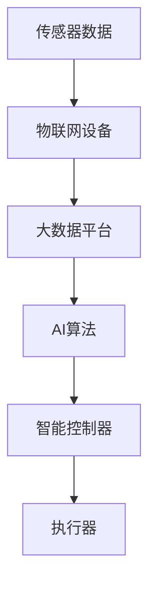

2. **数据驱动的自动化系统**：

数据驱动的自动化系统通过实时采集和分析系统运行数据，实现自动化系统的自我优化和智能决策。数据驱动的自动化系统具备更高的灵活性和适应性，能够根据实际情况进行自适应调整。

**核心算法原理**：

数据驱动的自动化系统的核心算法包括数据采集、数据处理和数据分析。数据采集算法用于实时获取系统运行数据，数据处理算法用于对数据进行预处理和清洗，数据分析算法用于从数据中提取有价值的信息，进行智能决策。

**伪代码示例**：

```python
# 数据采集算法伪代码
def data_collection():
    # 采集传感器数据
    sensor_data = collect_sensor_data()
    # 存储数据到数据库
    store_data_to_database(sensor_data)
```

3. **自主学习与自适应控制**：

自主学习与自适应控制是自动化系统智能化升级的重要方向。通过引入机器学习和深度学习技术，自动化系统可以自主学习系统的运行模式和异常情况，实现自我调整和优化。

**核心算法原理**：

自主学习与自适应控制的核心算法包括机器学习算法、深度学习算法和自适应控制算法。机器学习算法用于从历史数据中学习系统的运行模式，深度学习算法用于从大量数据中提取特征和模式，自适应控制算法用于根据实时数据调整系统控制策略。

**伪代码示例**：

```python
# 自适应控制算法伪代码
def adaptive_control():
    # 获取当前系统状态
    current_state = get_system_state()
    # 更新控制策略
    update_control_strategy(current_state)
    # 执行控制策略
    execute_control_strategy()
```

4. **智能决策与优化**：

智能决策与优化是自动化系统智能化升级的高级阶段，通过引入人工智能和优化算法，自动化系统可以在复杂环境中进行智能决策，实现资源的最优配置和任务的最优执行。

**核心算法原理**：

智能决策与优化算法包括人工智能算法、优化算法和决策支持系统。人工智能算法用于分析系统数据和外部环境，优化算法用于确定最佳操作策略，决策支持系统用于提供决策支持和可视化工具。

**伪代码示例**：

```python
# 智能决策算法伪代码
def intelligent_decision():
    # 收集系统数据和外部环境数据
    system_data, external_data = collect_system_and_external_data()
    # 分析数据和外部环境
    analyzed_data = analyze_data_and_external_environment(system_data, external_data)
    # 提出决策建议
    decision_suggestions = propose_decision_suggestions(analyzed_data)
    return decision_suggestions
```

通过以上对自动化技术的新技术发展部分的分析，我们可以看到自动化技术正在经历一场深刻的变革。未来，自动化技术将继续与人工智能、物联网和机器人技术深度融合，为各行各业带来更多的创新和变革。

#### 第5章：自动化技术的挑战与解决方案

##### 5.1 自动化技术的挑战

随着自动化技术的快速发展，其在各个领域的应用也日益广泛。然而，自动化技术在实际应用过程中也面临着诸多挑战，主要包括以下几个方面：

1. **技术挑战**：

自动化技术的发展依赖于人工智能、机器学习、物联网等前沿技术的进步。这些技术的不断更新和升级，对自动化系统的性能和可靠性提出了更高的要求。例如，人工智能算法的优化和提升，使得自动化系统能够更好地适应复杂环境和任务需求，但同时也带来了更高的计算复杂度和数据存储需求。

**解决方案**：

为应对技术挑战，可以从以下几个方面进行解决：

- **技术创新**：持续投入研发资源，推动人工智能、机器学习等前沿技术的创新和突破，提升自动化系统的整体性能。
- **算法优化**：通过优化现有算法，降低计算复杂度和提高计算效率，减轻自动化系统的计算负担。
- **系统集成**：加强不同技术之间的系统集成，实现技术的互补和协同效应，提升自动化系统的整体效能。

2. **数据挑战**：

自动化技术在运行过程中会产生大量的数据，这些数据不仅包括生产数据、设备数据，还包括环境数据、用户行为数据等。如何有效地管理和利用这些数据，成为自动化技术面临的另一个重要挑战。

**解决方案**：

为应对数据挑战，可以从以下几个方面进行解决：

- **数据采集与存储**：采用高效的数据采集技术和大数据存储方案，确保数据的实时性和完整性。
- **数据处理与分析**：利用数据预处理、特征工程等技术，对数据进行清洗、转换和分析，提取有价值的信息。
- **数据安全与隐私**：加强对数据的安全保护，防止数据泄露和滥用，保障用户隐私。

3. **人机协作挑战**：

自动化技术的发展，使得人与机器之间的协作变得更加紧密。然而，人机协作的复杂性和不确定性，也给自动化技术带来了挑战。如何确保人机协作的安全、高效和人性化，是自动化技术面临的重要问题。

**解决方案**：

为应对人机协作挑战，可以从以下几个方面进行解决：

- **人机界面优化**：设计友好、直观的人机界面，提高用户对自动化系统的操作体验和交互能力。
- **安全监控与预警**：建立完善的安全监控体系，对自动化系统的运行状态进行实时监控，及时发现并处理潜在的安全隐患。
- **培训与教育**：加强对操作人员的培训和教育，提高他们对自动化系统的理解和操作能力，确保人机协作的顺畅进行。

4. **成本与经济效益**：

自动化技术的实施需要大量的资金投入，包括设备采购、系统开发、维护等成本。同时，自动化技术的推广和应用也需要时间，短期内难以实现显著的经济效益。如何降低成本、提高经济效益，是自动化技术面临的现实挑战。

**解决方案**：

为应对成本与经济效益挑战，可以从以下几个方面进行解决：

- **成本优化**：通过技术创新和规模化应用，降低自动化设备的采购和维护成本，提高整体经济效益。
- **投资回报分析**：对自动化项目的投资回报进行详细分析，确保项目具有可行的经济效益。
- **政策支持**：政府和企业可以加大对自动化技术的政策支持，通过税收优惠、补贴等手段，降低企业的资金负担，促进自动化技术的推广应用。

5. **法规与伦理**：

随着自动化技术的广泛应用，相关的法规和伦理问题也日益突出。例如，自动化系统在医疗、交通等领域的应用，涉及到人的生命安全和隐私问题。如何确保自动化技术的合法合规，以及维护社会伦理道德，是自动化技术面临的重要挑战。

**解决方案**：

为应对法规与伦理挑战，可以从以下几个方面进行解决：

- **法规制定与完善**：政府应加强对自动化技术的法规制定和监管，确保自动化技术的合法合规。
- **伦理教育**：加强对自动化技术从业人员的伦理教育，提高他们的伦理意识和责任感。
- **社会监督**：建立健全的社会监督机制，鼓励公众参与对自动化技术的监督和评价，促进自动化技术的健康发展。

通过以上对自动化技术挑战的详细分析和解决方案的探讨，我们可以看到，虽然自动化技术在发展过程中面临诸多挑战，但通过技术创新、政策支持和社会监管等多方面的努力，这些挑战是可以克服的。未来，自动化技术将继续在各个领域发挥重要作用，推动社会向更加智能化、高效化的方向发展。

#### 第6章：自动化技术的政策与法规

##### 6.1 自动化技术的相关政策法规

自动化技术的快速发展对社会经济产生了深远影响，为了规范和促进这一领域的健康发展，各国政府和国际组织制定了一系列相关政策法规。以下是全球范围内自动化技术相关的主要政策法规：

1. **国际法规**：

- **国际标准化组织（ISO）**：ISO发布了多项关于自动化技术的国际标准，如ISO 12836《自动化技术——自动化生产线的设计和实施规范》和ISO 10218《机器人与自动化系统——机器人安全、机器人系统安全和机器人编程》等，旨在提高自动化系统的安全性和互操作性。

- **国际电工委员会（IEC）**：IEC发布了IEC 62779《自动化系统与集成——工业自动化网络通信》等多项标准，规范自动化系统的通信协议和技术要求。

2. **中国法规**：

- **《中国制造2025》**：中国政府发布的《中国制造2025》规划，明确提出了加快智能制造和自动化技术发展的战略目标，鼓励企业采用自动化技术和信息技术，提升制造业的智能化水平。

- **《智能制造发展规划（2016-2020年）》**：该规划提出了智能制造的发展目标和具体措施，包括加强智能制造关键技术攻关、推动智能制造装备和产品研发、提升智能制造服务能力等。

- **《机器人产业发展规划（2016-2020年）》**：该规划明确了机器人产业发展的重点方向，包括提高机器人产品性能、拓展应用领域、提升产业链水平等。

3. **美国法规**：

- **《国家制造创新网络（NNMI）》**：美国政府通过NNMI计划，支持智能制造和自动化技术的发展，推动创新和商业化应用。

- **《美国国家智能制造战略（2018-2025年）》**：该战略提出了提高智能制造竞争力的目标，包括加强技术研发、促进人才培养、优化政策环境等。

4. **欧洲法规**：

- **《工业4.0战略2020》**：德国政府发布的《工业4.0战略2020》，提出了推动工业自动化和智能制造发展的具体措施，包括加强数字基础设施、提升网络安全能力、促进跨行业合作等。

- **《欧洲机器人研发路线图》**：该路线图明确了欧洲机器人技术的发展方向，包括提升机器人智能化水平、拓展应用领域、推动技术创新等。

##### 6.2 自动化技术的影响与监管

自动化技术的快速普及对社会经济、就业市场、环境保护等方面产生了深远的影响。为了保障自动化技术的健康发展，各国政府和国际组织也在不断加强对自动化技术的监管。

1. **社会经济影响**：

- **提高生产效率**：自动化技术的应用大幅提高了生产效率和产品质量，降低了生产成本，推动了制造业的转型升级。

- **改变就业结构**：自动化技术的普及导致了一些传统劳动密集型岗位的减少，但同时也创造了大量新的就业机会，如机器人维护、系统编程、数据分析等。

- **促进技术创新**：自动化技术的推广和应用，推动了相关领域的技术创新和产业升级，促进了经济增长和社会进步。

2. **就业市场影响**：

- **技能需求变化**：自动化技术的发展对劳动力市场提出了新的技能需求，要求从业人员具备更高的技术能力和专业素养。

- **就业机会分配**：自动化技术可能导致部分就业岗位的减少，但同时也会创造新的就业机会，如何平衡就业机会的分配成为重要的社会问题。

3. **环境保护影响**：

- **减少资源消耗**：自动化技术的应用可以大幅降低能源消耗和资源浪费，提高生产效率，促进可持续发展。

- **减少污染排放**：自动化系统在制造、物流等环节的应用，可以减少废气和废水排放，降低环境污染。

4. **监管措施**：

- **安全监管**：为了确保自动化系统的安全运行，各国政府和国际组织制定了相关法规和标准，如ISO 10218《机器人与自动化系统——机器人安全、机器人系统安全和机器人编程》等。

- **数据保护**：随着自动化技术涉及的数据量日益增加，数据保护和隐私保护成为重要议题。各国政府和国际组织也在不断加强对自动化数据的保护，制定相关法律法规，如《通用数据保护条例（GDPR）》等。

- **就业保障**：为了应对自动化技术对就业市场的影响，一些国家提出了就业保障政策，如职业培训、再就业支持等，帮助劳动者适应新的就业环境。

##### 6.3 自动化技术的发展方向与政策建议

未来，自动化技术将继续朝着智能化、高效化和人性化的方向发展。为了推动自动化技术的健康发展和广泛应用，以下是一些政策建议：

1. **加强技术研发**：

- **政府支持**：政府应加大对自动化技术的研究和开发支持，推动关键核心技术的突破和产业化应用。

- **企业合作**：鼓励企业、高校和科研机构之间的合作，推动技术创新和产业升级。

2. **完善法规标准**：

- **法规建设**：建立健全的自动化技术法规体系，规范自动化系统的研发、应用和监管。

- **标准制定**：加强自动化技术标准的制定和推广，提高自动化系统的互操作性和安全性。

3. **人才培养**：

- **教育体系**：完善职业教育和高等教育体系，培养具备自动化技术知识和实践能力的人才。

- **职业培训**：加强对在职劳动者的职业培训和技能提升，提高他们的适应能力和竞争力。

4. **优化政策环境**：

- **税收优惠**：对自动化技术的研发和应用企业给予税收优惠，降低企业负担，鼓励技术创新。

- **资金支持**：加大对自动化技术项目的资金支持，促进技术创新和产业化应用。

通过加强技术研发、完善法规标准和优化政策环境，可以推动自动化技术的健康发展和广泛应用，为社会经济和可持续发展作出积极贡献。

### 第7章：自动化技术的未来展望

##### 7.1 自动化技术的发展趋势

自动化技术作为现代工业和信息技术的重要组成部分，正经历着前所未有的快速发展。未来，自动化技术将继续沿着智能化、网络化和集成化的方向演进，其发展趋势主要体现在以下几个方面：

1. **智能化水平提升**：

随着人工智能技术的不断进步，自动化系统将具备更高的智能水平。通过深度学习、自然语言处理、强化学习等人工智能算法，自动化系统将能够实现更复杂的任务，如自主决策、自适应控制和智能故障诊断等。未来，自动化系统将不仅仅执行预设的任务，还能根据环境变化和操作反馈进行自我学习和优化。

2. **网络化与物联网集成**：

物联网（IoT）技术的普及将推动自动化系统向网络化方向发展。未来，自动化系统将能够通过物联网实现设备之间的互联互通，形成一个高度集成的智能网络。这种网络化将使得自动化系统能够实时获取和分析大量数据，从而实现更高效的资源分配和任务调度。

3. **系统集成与协同**：

自动化技术的未来发展将更加注重系统集成和协同。通过集成不同技术领域的优势，自动化系统将实现跨领域、跨行业的协同工作，推动智能制造、智能农业、智能交通等领域的创新和变革。例如，将自动化技术与大数据分析、云计算等新兴技术结合，可以实现更智能、更高效的生产和服务模式。

4. **绿色与可持续发展**：

随着环保意识的提升，自动化技术将朝着绿色和可持续发展的方向迈进。通过自动化技术，可以实现生产过程的节能降耗和废物回收利用，减少环境污染和资源消耗。此外，自动化系统在农业、环保等领域的应用，也将为可持续发展提供重要支撑。

##### 7.2 自动化技术在人类生活中的影响

自动化技术已经在人类生活中发挥着越来越重要的作用，未来这一趋势将更加明显。自动化技术对人类生活的影响主要体现在以下几个方面：

1. **提高生活质量**：

自动化技术为人类生活带来了极大的便利。智能家居系统通过自动化控制，实现了对家庭设备的智能管理，提高了居住的舒适度和便利性。自动化医疗设备使得患者在家即可进行自我监测和诊断，提高了医疗服务的质量和效率。此外，自动化交通系统将提高出行效率，减少交通拥堵，提升城市生活质量。

2. **改变就业结构**：

自动化技术的普及将导致某些传统劳动岗位的消失，但同时也将创造新的就业机会。自动化系统需要大量技术人才进行研发、维护和运营，因此对技术人才的需求将显著增加。此外，自动化技术还将推动新的产业和服务模式的发展，从而创造更多就业机会。

3. **推动社会进步**：

自动化技术不仅提高了生产效率和服务质量，还推动了社会进步。通过自动化技术，社会资源得到更加合理的配置和利用，经济结构得到优化，创新能力和竞争力得到提升。自动化技术还促进了智能城市、智慧农业等新兴领域的发展，为人类社会带来了更多可能性。

##### 7.3 自动化技术的未来展望

展望未来，自动化技术将继续在各个领域发挥重要作用，推动社会向更加智能化、高效化和可持续化的方向发展。以下是自动化技术未来可能的发展方向：

1. **智能化与自主化**：

未来的自动化系统将更加智能化和自主化。通过深度学习和强化学习，自动化系统能够自主学习和优化，实现更复杂、更灵活的任务。例如，自动化系统将能够自主驾驶、自主维修和自主决策，从而实现真正的自主化运营。

2. **网络化与协作化**：

未来的自动化系统将更加注重网络化和协作化。通过物联网和5G等通信技术，自动化系统将实现设备之间的实时通信和协同工作，形成一个高度集成的智能网络。这种网络化将使得自动化系统能够更好地应对复杂环境，提高整体效能。

3. **集成化与跨领域应用**：

未来的自动化技术将更加注重系统集成和跨领域应用。通过将自动化技术与大数据分析、云计算、区块链等新兴技术结合，自动化系统将实现跨领域、跨行业的协同工作，推动各行业的技术创新和产业升级。

4. **绿色与可持续发展**：

未来的自动化技术将更加注重绿色和可持续发展。通过自动化技术，可以实现生产过程的节能降耗和废物回收利用，减少环境污染和资源消耗。此外，自动化技术将在环保、农业等领域的应用，也将为可持续发展作出重要贡献。

5. **人工智能与自动化深度融合**：

未来，人工智能与自动化技术的深度融合将更加深入。通过人工智能算法，自动化系统将能够实现更复杂、更智能的决策和操作，从而提高生产效率和服务质量。

总之，自动化技术将在未来继续发挥重要作用，推动社会向更加智能化、高效化和可持续化的方向发展。通过不断技术创新和应用拓展，自动化技术将为人类社会带来更多便利和发展机遇。

### 附录：自动化技术相关资源与工具

A.1 **自动化技术常用资源**

1. **在线课程**：
   - Coursera: "自动化与机器人学基础"
   - edX: "智能制造与工业机器人"
   - Udemy: "PLC编程与自动化控制入门"

2. **技术社区与论坛**：
   - Stack Overflow: 自动化技术相关问题的专业回答
   - Reddit: r/automation
   - IoT Stack Exchange: 物联网与自动化技术讨论

3. **开源项目**：
   - GitHub: 自动化技术相关的开源代码库，如PLC程序、机器人控制软件等
   - Robot Operating System (ROS): 机器人开发平台

A.2 **自动化技术学习工具**

1. **仿真软件**：
   - MATLAB/Simulink: 适用于自动化系统建模和仿真
   - LabVIEW: 适用于数据采集、分析和自动化测试
   - Arena: 适用于制造系统和物流系统的仿真

2. **编程工具**：
   - Python: 适用于自动化脚本编写和数据处理
   - C/C++: 适用于嵌入式系统开发
   - PLC编程软件：如Siemens TIA Portal、Rockwell Studio 5000等

3. **硬件平台**：
   - Raspberry Pi: 适用于简单的自动化项目
   - Arduino: 适用于电子设备和机器人项目
   - PLC：如西门子S7、Rockwell ControlLogix等

A.3 **自动化技术行业报告与资讯**

1. **行业报告**：
   - ** Markets and Markets**: "自动化系统市场报告"
   - **Grand View Research**: "全球自动化技术市场展望报告"
   - **Mordor Intelligence**: "全球机器人市场报告"

2. **专业媒体**：
   - IEEE Spectrum: 自动化与机器人技术领域的专业期刊
   - Automation World: 自动化行业新闻与趋势分析
   - Automation Intelligence: 自动化与人工智能领域的前沿资讯

3. **学术会议**：
   - International Conference on Automation and Robotics (ICAR)
   - IEEE International Conference on Robotics and Automation (ICRA)
   - International Federation of Automatic Control (IFAC) World Congress

通过以上资源与工具，读者可以深入了解自动化技术的最新动态和发展趋势，为在自动化领域的学习和研究提供有益的参考。作者：AI天才研究院/AI Genius Institute & 禅与计算机程序设计艺术/Zen And The Art of Computer Programming。

