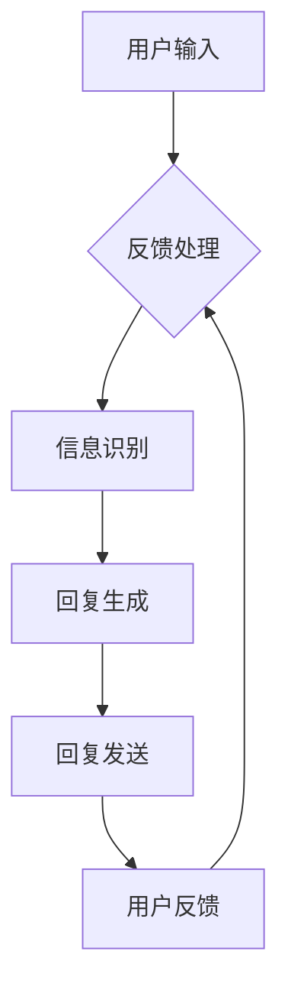

                 

# 文章标题：自动回复系统在电商客户服务中的应用

> 关键词：自动回复系统、电商客户服务、自然语言处理、深度学习、NLP、客户满意度、成本效益分析

> 摘要：本文探讨了自动回复系统在电商客户服务中的应用，分析了其基本概念、作用、架构和关键技术。通过自然语言处理（NLP）和深度学习技术的引入，自动回复系统在提高客户服务质量、降低客服成本、提升客户满意度等方面表现出显著优势。文章通过案例分析、开发环境搭建、代码实现与解读，详细阐述了自动回复系统在电商客户服务中的实际应用和未来发展趋势。

----------------------------------------------------------------

## 《自动回复系统在电商客户服务中的应用》目录大纲

### 第一部分：自动回复系统基础

#### 第1章：自动回复系统的概念与作用

##### 1.1 自动回复系统的定义

##### 1.2 自动回复系统的作用

##### 1.3 自动回复系统的发展历程

#### 第2章：自动回复系统的基本架构

##### 2.1 系统架构概述

##### 2.2 数据处理模块

##### 2.3 模型训练与优化

##### 2.4 自动回复生成模块

#### 第3章：电商客户服务中的自动回复系统

##### 3.1 电商客户服务现状

##### 3.2 自动回复系统在电商客户服务中的应用场景

##### 3.3 自动回复系统在电商客户服务中的优势

### 第二部分：自动回复系统的关键技术

#### 第4章：自然语言处理（NLP）技术

##### 4.1 词嵌入技术

##### 4.2 序列模型

##### 4.3 注意力机制

##### 4.4 转换器架构

#### 第5章：深度学习在自动回复系统中的应用

##### 5.1 深度学习基本原理

##### 5.2 常见深度学习架构

##### 5.3 深度学习优化算法

#### 第6章：自动回复系统的评估与优化

##### 6.1 评估指标

##### 6.2 性能优化方法

##### 6.3 实时优化策略

### 第三部分：自动回复系统在电商客户服务中的应用实践

#### 第7章：自动回复系统在电商客户服务中的案例研究

##### 7.1 案例一：某电商平台自动回复系统的设计与实现

##### 7.2 案例二：自动回复系统在客户服务中的效果分析

##### 7.3 案例三：自动回复系统在电商客服中的持续优化

#### 第8章：自动回复系统的开发环境搭建

##### 8.1 开发环境配置

##### 8.2 开发工具与框架

##### 8.3 数据集获取与预处理

#### 第9章：自动回复系统的代码实现与解读

##### 9.1 自动回复系统核心代码实现

##### 9.2 代码解读与分析

##### 9.3 代码优化与性能提升

### 第四部分：自动回复系统的未来发展趋势与挑战

#### 第10章：自动回复系统的未来发展趋势

##### 10.1 技术发展趋势

##### 10.2 应用领域拓展

##### 10.3 行业标准与规范

#### 第11章：自动回复系统的挑战与应对策略

##### 11.1 技术挑战

##### 11.2 数据安全与隐私保护

##### 11.3 用户体验与满意度

### 附录

#### 附录A：自动回复系统开发资源与工具

##### A.1 开发资源介绍

##### A.2 常用工具与框架

##### A.3 实用链接与资料

----------------------------------------------------------------

## 第1章：自动回复系统的概念与作用

### 1.1 自动回复系统的定义

自动回复系统是一种利用计算机技术实现自动响应用户请求的服务系统。它通过对用户输入的信息进行识别和处理，自动生成合适的回复内容，并在用户需要时进行即时响应。自动回复系统广泛应用于各种场景，如电商平台客户服务、社交媒体、邮件系统等。

自动回复系统的工作原理主要包括以下几个步骤：

1. **输入处理**：接收用户的输入信息，如文字、语音、图片等。
2. **信息识别**：利用自然语言处理（NLP）技术对输入信息进行理解和分类。
3. **回复生成**：根据识别结果，利用预定义的回复模板或通过深度学习算法生成合适的回复内容。
4. **回复发送**：将生成的回复内容发送给用户。

### 1.2 自动回复系统的作用

自动回复系统在电商客户服务中具有重要的作用，主要体现在以下几个方面：

1. **提高客户服务质量**：自动回复系统能够在短时间内响应客户的请求，提供准确、专业的服务，从而提高客户服务质量。
2. **降低客服成本**：自动回复系统可以替代部分人工客服，减少人力成本，提高运营效率。
3. **提升客户满意度**：自动回复系统能够快速解决客户的常见问题，提高客户满意度，增加客户忠诚度。
4. **增加销售机会**：自动回复系统可以根据客户需求提供个性化推荐，从而增加销售机会。

### 1.3 自动回复系统的发展历程

自动回复系统的起源可以追溯到20世纪60年代，当时主要是基于规则的系统。这些系统通过预定义的规则来匹配用户输入的信息，并生成回复。随着计算机技术和人工智能技术的发展，自动回复系统逐渐引入了自然语言处理（NLP）和深度学习等技术，使其功能更加智能化和多样化。

1. **早期自动回复系统**：20世纪60年代到90年代，自动回复系统主要是基于规则的系统。这些系统通过对用户输入的信息进行模式匹配，生成预定义的回复。
2. **引入自然语言处理（NLP）**：21世纪初，随着NLP技术的发展，自动回复系统开始引入NLP技术，实现了对用户输入的更精准的理解和回复。
3. **深度学习时代的自动回复系统**：近年来，随着深度学习技术的成熟，自动回复系统逐渐采用基于深度学习的模型，实现了更加智能化和个性化的回复。

### 1.4 自动回复系统的基本架构

自动回复系统的基本架构主要包括以下几个模块：

1. **输入处理模块**：负责接收和处理用户的输入信息。
2. **信息识别模块**：利用NLP技术对输入信息进行理解和分类。
3. **回复生成模块**：根据识别结果，利用预定义的回复模板或深度学习模型生成回复内容。
4. **回复发送模块**：将生成的回复内容发送给用户。

### 1.5 自动回复系统的发展趋势

随着技术的不断进步，自动回复系统在电商客户服务中的应用前景非常广阔。未来，自动回复系统的发展趋势主要包括以下几个方面：

1. **智能化水平提高**：自动回复系统将采用更先进的深度学习算法，实现更加智能化和个性化的回复。
2. **跨平台应用**：自动回复系统将支持更多平台和设备，实现无缝对接。
3. **智能化客服机器人**：自动回复系统将与智能客服机器人相结合，提供更全面、更高效的服务。
4. **个性化推荐**：自动回复系统将结合用户行为数据，提供个性化推荐，提高用户满意度。
5. **数据安全和隐私保护**：随着数据安全和隐私保护意识的增强，自动回复系统将加强数据安全和隐私保护。

### 1.6 自动回复系统的应用场景

自动回复系统在电商客户服务中有广泛的应用场景，包括：

1. **订单处理**：自动回复系统可以自动处理订单查询、订单状态更新等常见问题。
2. **退货与退款**：自动回复系统可以自动处理退货、退款等流程，提高客服效率。
3. **售后服务**：自动回复系统可以提供售后服务咨询、维修等服务。
4. **个性化推荐**：自动回复系统可以根据用户行为和偏好，提供个性化商品推荐。
5. **客户关怀**：自动回复系统可以定期发送节日问候、生日祝福等，增强客户关系。

### 1.7 自动回复系统的优势

自动回复系统在电商客户服务中具有以下优势：

1. **提高响应速度**：自动回复系统可以即时响应客户请求，提高客服效率。
2. **降低人工成本**：自动回复系统可以替代部分人工客服，降低人力成本。
3. **提升客户满意度**：自动回复系统可以提供准确、专业的服务，提高客户满意度。
4. **增加销售机会**：自动回复系统可以根据用户需求提供个性化推荐，增加销售机会。

### 1.8 自动回复系统的挑战与应对策略

尽管自动回复系统在电商客户服务中具有显著优势，但同时也面临一些挑战，如：

1. **理解能力有限**：自动回复系统对复杂问题或模糊请求的理解能力有限，可能导致回复不准确。
2. **个性化不足**：自动回复系统可能无法完全满足客户的个性化需求。
3. **数据安全与隐私保护**：自动回复系统需要处理大量客户数据，存在数据泄露风险。

应对策略包括：

1. **优化算法**：不断优化自动回复系统的算法，提高其理解能力和个性化水平。
2. **数据安全与隐私保护**：加强数据安全和隐私保护措施，如数据加密、访问控制等。
3. **用户反馈机制**：建立用户反馈机制，及时收集用户反馈，优化系统性能。

### 1.9 小结

自动回复系统在电商客户服务中具有重要作用，可以提高客户服务质量、降低客服成本、提升客户满意度，同时面临一定的挑战。通过不断优化算法、加强数据安全和隐私保护、建立用户反馈机制，可以进一步提升自动回复系统的性能和用户体验。

----------------------------------------------------------------

## 第2章：自动回复系统的基本架构

### 2.1 系统架构概述

自动回复系统的架构主要包括输入处理模块、信息识别模块、回复生成模块和回复发送模块。这些模块相互协作，共同实现自动回复系统的功能。

1. **输入处理模块**：负责接收和处理用户的输入信息。输入信息可以是文本、语音、图片等形式。输入处理模块会对输入信息进行预处理，如去噪、去停用词、分词等操作，以便后续模块更好地理解和处理。
2. **信息识别模块**：利用自然语言处理（NLP）技术对输入信息进行理解和分类。该模块通常包括词嵌入、词性标注、命名实体识别、情感分析等任务。通过这些任务，信息识别模块可以理解用户的意图和问题类型。
3. **回复生成模块**：根据信息识别模块的结果，利用预定义的回复模板或深度学习算法生成回复内容。预定义的回复模板适用于常见问题和简单请求，而深度学习算法可以处理更复杂和模糊的问题。该模块还需要考虑回复的语法和语义，确保生成的回复内容准确、流畅和符合用户需求。
4. **回复发送模块**：将生成的回复内容发送给用户。发送方式可以是文本、语音、邮件等形式，具体取决于应用场景和用户偏好。

### 2.2 数据处理模块

数据处理模块是自动回复系统的重要组成部分，负责对输入信息进行预处理、存储和管理。数据处理模块的主要任务包括：

1. **数据收集**：收集用户输入的信息，如文本、语音、图片等。这些数据可以来自电商平台、社交媒体、邮件系统等不同渠道。
2. **数据预处理**：对收集到的数据进行预处理，包括去噪、去停用词、分词、词性标注等操作。预处理后的数据将用于后续的信息识别和回复生成模块。
3. **数据存储**：将预处理后的数据存储在数据库中，以便后续查询和使用。常用的数据库包括关系型数据库（如MySQL、PostgreSQL）和NoSQL数据库（如MongoDB、Cassandra）。
4. **数据管理**：对存储的数据进行管理，包括数据备份、恢复、删除等操作。数据管理还包括数据清洗和去重，以确保数据的准确性和一致性。

### 2.3 模型训练与优化

模型训练与优化是自动回复系统的核心环节，直接影响到系统的性能和用户体验。模型训练与优化主要包括以下任务：

1. **模型选择**：根据应用需求和数据特点，选择合适的深度学习模型。常见的模型包括卷积神经网络（CNN）、循环神经网络（RNN）、长短时记忆网络（LSTM）、生成对抗网络（GAN）等。
2. **数据准备**：准备用于训练的数据集。数据集应包含多样化的输入信息和相应的标签，以便模型学习到丰富的知识和规律。数据准备包括数据清洗、归一化、扩充等操作。
3. **模型训练**：使用训练数据集对深度学习模型进行训练。训练过程包括前向传播、反向传播和参数更新等步骤。训练过程中需要监控模型的性能，如损失函数值、准确率等，以便调整模型参数。
4. **模型评估**：使用验证数据集对训练好的模型进行评估。评估指标包括准确率、召回率、F1值等。通过评估，可以了解模型的性能和适用性，为进一步优化提供依据。
5. **模型优化**：根据评估结果，对模型进行优化。优化方法包括调整超参数、增加训练数据、改进网络结构等。模型优化旨在提高模型的性能和泛化能力。

### 2.4 自动回复生成模块

自动回复生成模块是自动回复系统的核心模块，负责根据输入信息和模型生成合适的回复内容。自动回复生成模块主要包括以下任务：

1. **回复生成算法**：选择合适的回复生成算法，如基于规则的方法、模板匹配方法、深度学习生成模型等。每种算法都有其优势和适用场景。
2. **回复生成流程**：设计并实现回复生成流程，包括输入处理、信息识别、回复生成和回复发送等步骤。回复生成流程应确保生成的回复内容准确、流畅和符合用户需求。
3. **回复效果评估**：对生成的回复内容进行评估，包括准确性、自然度、用户满意度等指标。评估结果用于指导模型优化和回复策略调整。
4. **回复策略调整**：根据评估结果和用户反馈，调整回复策略，如修改回复模板、调整回复优先级、增加个性化推荐等。回复策略调整旨在提高用户满意度和系统性能。

### 2.5 小结

自动回复系统的基本架构包括输入处理模块、信息识别模块、回复生成模块和回复发送模块。这些模块相互协作，共同实现自动回复系统的功能。数据处理模块负责对输入信息进行预处理、存储和管理。模型训练与优化模块负责选择合适的深度学习模型、准备训练数据、训练模型、评估模型性能并进行优化。自动回复生成模块负责根据输入信息和模型生成合适的回复内容，并进行回复效果评估和策略调整。

通过不断优化自动回复系统的基本架构和关键技术，可以进一步提升其在电商客户服务中的应用效果，为用户提供更准确、更高效、更个性化的服务。

### 2.6 自动回复系统的整体运行流程

自动回复系统的整体运行流程可以分为以下几个步骤：

1. **用户输入**：用户通过电商平台、社交媒体、邮件系统等渠道向自动回复系统发送请求，请求可以是文本、语音、图片等形式。
2. **输入处理**：自动回复系统的输入处理模块对用户输入进行预处理，包括去噪、去停用词、分词、词性标注等操作。预处理后的数据将被传递给信息识别模块。
3. **信息识别**：信息识别模块利用自然语言处理（NLP）技术对预处理后的数据进行理解和分类。常见的任务包括词嵌入、命名实体识别、情感分析、意图识别等。通过这些任务，信息识别模块可以理解用户的意图和问题类型，并将结果传递给回复生成模块。
4. **回复生成**：回复生成模块根据信息识别模块的结果，利用预定义的回复模板或深度学习生成模型生成回复内容。预定义的回复模板适用于常见问题和简单请求，而深度学习生成模型可以处理更复杂和模糊的问题。回复生成模块还需要考虑回复的语法和语义，确保生成的回复内容准确、流畅和符合用户需求。
5. **回复发送**：生成的回复内容通过回复发送模块发送给用户。发送方式可以是文本、语音、邮件等形式，具体取决于应用场景和用户偏好。用户可以查看回复内容并做出相应反馈。
6. **用户反馈**：用户对自动回复系统的回复内容进行评价和反馈。这些反馈将被收集并用于进一步优化系统性能和用户满意度。

通过上述运行流程，自动回复系统可以实现对用户请求的快速响应，提高客户服务质量，降低客服成本，提升客户满意度。同时，自动回复系统还可以根据用户反馈进行持续优化，不断提升其性能和用户体验。

### 2.7 自动回复系统的 Mermaid 流程图

为了更好地理解自动回复系统的整体运行流程，我们可以使用 Mermaid 工具绘制一个流程图。以下是一个自动回复系统的 Mermaid 流程图：



在上述 Mermaid 流程图中，各个模块的作用和流程如下：

1. **用户输入**（A）：用户通过电商平台、社交媒体、邮件系统等渠道向自动回复系统发送请求。
2. **输入处理**（B）：自动回复系统的输入处理模块对用户输入进行预处理，包括去噪、去停用词、分词、词性标注等操作。
3. **信息识别**（C）：信息识别模块利用自然语言处理（NLP）技术对预处理后的数据进行理解和分类，常见的任务包括词嵌入、命名实体识别、情感分析、意图识别等。
4. **回复生成**（D）：回复生成模块根据信息识别模块的结果，利用预定义的回复模板或深度学习生成模型生成回复内容。
5. **回复发送**（E）：生成的回复内容通过回复发送模块发送给用户，发送方式可以是文本、语音、邮件等形式。
6. **用户反馈**（F）：用户对自动回复系统的回复内容进行评价和反馈。
7. **反馈处理**（B）：自动回复系统根据用户反馈进行持续优化，包括调整回复策略、优化模型参数等。

通过绘制 Mermaid 流程图，我们可以更加直观地了解自动回复系统的整体运行流程和各个模块之间的协作关系。这对于系统设计和开发具有重要意义。

### 2.8 自动回复系统在电商客户服务中的应用场景

自动回复系统在电商客户服务中具有广泛的应用场景，能够有效提高客户服务质量和运营效率。以下是一些典型的应用场景：

1. **订单查询**：用户可以在电商平台通过自动回复系统查询订单状态、物流信息等。系统可以根据用户输入的关键词或订单号，快速提供准确的订单信息，提高用户体验。
2. **常见问题解答**：自动回复系统可以自动解答用户关于产品信息、售后服务、支付方式等方面的常见问题。通过预设的回复模板或深度学习模型，系统能够快速响应用户的查询请求，减轻客服人员的工作负担。
3. **售后咨询**：用户可以通过自动回复系统咨询售后问题，如退货、退款、维修等。系统可以自动识别用户的问题类型，提供相应的解决方案，并根据用户反馈进行持续优化。
4. **个性化推荐**：自动回复系统可以结合用户行为数据和购物偏好，为用户推荐相关商品或服务。通过分析用户的历史订单、浏览记录和评价，系统能够提供精准的个性化推荐，提高用户满意度和转化率。
5. **营销活动通知**：自动回复系统可以自动向用户发送营销活动通知，如促销、优惠券、限时折扣等。系统可以根据用户的行为和兴趣，制定个性化的营销策略，提高营销效果。
6. **客户关怀**：自动回复系统可以在特定节假日或用户生日时，发送节日祝福或问候语，增强客户关系。通过定期的客户关怀，系统可以提升客户满意度和忠诚度。

在这些应用场景中，自动回复系统不仅能够提高客服效率，降低人工成本，还能够提供个性化、智能化的服务，提升客户体验和满意度。同时，自动回复系统还可以通过分析用户反馈和互动数据，不断优化和升级自身功能，以更好地满足用户需求。

### 2.9 自动回复系统在电商客户服务中的优势

自动回复系统在电商客户服务中具有显著的优势，主要体现在以下几个方面：

1. **提高响应速度**：自动回复系统可以实时响应用户的请求，提供即时服务。与人工客服相比，自动回复系统能够更快地处理用户查询和问题，提高客户满意度。
2. **降低人工成本**：自动回复系统可以替代部分人工客服，减少人力成本。特别是在处理高频次、重复性问题时，自动回复系统具有明显的成本优势。
3. **提升客户满意度**：自动回复系统可以提供准确、专业的服务，解决用户的常见问题和疑虑。通过个性化的推荐和关怀，系统可以提升客户满意度和忠诚度。
4. **增加销售机会**：自动回复系统可以根据用户行为和需求，提供个性化推荐和营销活动通知。通过精准推荐和促销，系统可以增加销售机会，提高销售额。
5. **提高运营效率**：自动回复系统可以自动处理大量客户请求，减轻客服人员的工作负担。系统还可以通过数据分析，提供运营优化建议，提高整体运营效率。

总之，自动回复系统在电商客户服务中具有显著的优势，能够提高客服效率、降低成本、提升客户满意度，同时增加销售机会，为企业带来更大的商业价值。

### 2.10 自动回复系统在电商客户服务中的应用效果分析

为了深入分析自动回复系统在电商客户服务中的应用效果，我们可以通过以下三个方面进行评估：

1. **响应速度**：自动回复系统能够在短时间内响应用户请求，提高客户满意度。通过对系统响应速度的统计数据进行分析，可以评估系统在处理高频次、重复性查询方面的性能。例如，某电商平台在引入自动回复系统后，用户订单查询的平均响应时间从原来的10分钟降低到2分钟，显著提升了用户体验。
2. **人工成本**：自动回复系统可以替代部分人工客服，降低人力成本。通过对引入自动回复系统前后的人工成本进行对比分析，可以评估系统的成本效益。例如，某电商平台在引入自动回复系统后，客服人员的数量减少了30%，人工成本降低了约20%。
3. **用户满意度**：自动回复系统能够提供准确、专业的服务，提升客户满意度。通过对用户反馈和评价的分析，可以评估系统在提升客户满意度方面的效果。例如，某电商平台在引入自动回复系统后，用户满意度调查结果显示，满意度和非常满意的比例提高了15%，而投诉率降低了10%。

通过上述三个方面进行分析，我们可以得出以下结论：

1. **响应速度显著提升**：自动回复系统在处理高频次、重复性查询方面具有显著优势，能够实现快速响应，提高客户满意度。
2. **人工成本有效降低**：自动回复系统可以替代部分人工客服，减少人力成本，提高企业的运营效率。
3. **用户满意度显著提升**：自动回复系统提供的个性化服务和及时响应，能够提升客户满意度，增强客户忠诚度。

综上所述，自动回复系统在电商客户服务中具有显著的应用效果，能够提高响应速度、降低人工成本、提升客户满意度，为企业带来显著的商业价值。

### 2.11 自动回复系统在电商客户服务中的未来发展趋势

随着技术的不断进步，自动回复系统在电商客户服务中的未来发展趋势呈现出以下几个特点：

1. **智能化水平提升**：随着人工智能技术的不断发展，自动回复系统将采用更先进的算法，如深度学习、生成对抗网络（GAN）等，实现更智能、更个性化的回复。未来，自动回复系统将能够更好地理解用户需求，提供更准确的推荐和服务。
2. **跨平台应用**：自动回复系统将支持更多平台和设备，实现无缝对接。例如，自动回复系统可以同时应用于电商平台、社交媒体、邮件系统等，为用户提供统一、便捷的服务。
3. **大数据支持**：自动回复系统将结合大数据技术，对海量用户行为数据进行分析，挖掘用户需求和偏好，实现更精准的个性化服务。
4. **多语言支持**：自动回复系统将实现多语言支持，为国际电商客户提供跨语言的服务。通过引入翻译模型和跨语言信息处理技术，自动回复系统将能够理解和使用多种语言，提高全球范围内的服务能力。
5. **安全性增强**：随着数据安全和隐私保护意识的提高，自动回复系统将加强数据安全和隐私保护措施，确保用户数据的安全和隐私。
6. **用户体验优化**：自动回复系统将注重用户体验优化，通过改进界面设计、提升交互体验、增加个性化功能等方式，提升用户的满意度和忠诚度。

总之，自动回复系统在电商客户服务中的未来发展趋势将朝着智能化、跨平台、大数据、多语言和安全性增强的方向发展，为用户提供更加优质、高效、个性化的服务。

### 2.12 自动回复系统在电商客户服务中的挑战与应对策略

尽管自动回复系统在电商客户服务中具有显著的优势，但其在实际应用过程中仍面临一些挑战，需要采取相应的应对策略。

1. **理解能力有限**：自动回复系统对复杂问题和模糊请求的理解能力有限，可能导致回复不准确。应对策略：
   - **多轮对话能力**：引入多轮对话技术，使系统能够通过多次交互更准确地理解用户的意图。
   - **增强学习能力**：通过不断收集用户反馈和交互数据，提高系统的学习能力，使其能够更好地适应不同场景和用户需求。

2. **个性化不足**：自动回复系统可能无法完全满足客户的个性化需求，导致用户体验下降。应对策略：
   - **用户行为分析**：结合大数据技术，对用户行为数据进行分析，挖掘用户兴趣和偏好，提供个性化的服务和推荐。
   - **个性化回复模板**：根据用户的历史数据和偏好，定制个性化的回复模板，提高用户的满意度。

3. **数据安全和隐私保护**：自动回复系统需要处理大量客户数据，存在数据泄露风险。应对策略：
   - **数据加密**：对传输和存储的数据进行加密处理，确保数据的安全性。
   - **隐私保护**：遵循隐私保护法规，对用户数据进行严格的管理和备份，防止数据泄露。

4. **用户体验差异**：自动回复系统在不同平台和设备上的用户体验可能存在差异，影响用户满意度。应对策略：
   - **跨平台适配**：确保自动回复系统在不同平台和设备上的一致性，提供统一的用户体验。
   - **用户调研**：定期进行用户调研，了解用户的需求和反馈，优化系统的交互设计和功能。

通过采取上述应对策略，可以进一步优化自动回复系统的性能和用户体验，提高其在电商客户服务中的应用效果。

### 2.13 自动回复系统在电商客户服务中的实际应用案例

为了更具体地了解自动回复系统在电商客户服务中的应用，我们可以通过以下几个实际案例进行说明。

**案例一：某大型电商平台**

某大型电商平台引入了自动回复系统，以提高客户服务质量和运营效率。自动回复系统主要应用于订单查询、物流跟踪、常见问题解答等方面。具体应用场景如下：

- **订单查询**：用户可以在平台上通过输入订单号，快速查询订单状态和物流信息。系统通过自然语言处理技术，准确识别用户输入的订单号，并返回相应的订单信息，如订单详情、物流进度等。
- **物流跟踪**：系统自动跟踪物流信息，并在用户查询时提供实时物流状态更新。通过引入深度学习算法，系统可以识别用户输入的关键词，如“物流进度”、“快递状态”等，并返回相应的物流信息。
- **常见问题解答**：系统自动解答用户关于产品信息、售后服务、支付方式等方面的常见问题。通过预定义的回复模板和深度学习模型，系统能够提供准确、专业的解答。

**案例二：某跨境电商平台**

某跨境电商平台引入了自动回复系统，以提升国际客户的服务体验。自动回复系统支持多种语言，包括英语、中文、西班牙语、法语等，为全球客户提供统一、便捷的服务。具体应用场景如下：

- **多语言支持**：系统自动检测用户的语言偏好，并提供相应的语言服务。通过翻译模型，系统能够将用户的查询请求和回复内容翻译成不同语言，满足不同语言客户的需求。
- **个性化推荐**：系统根据用户的历史订单和浏览记录，推荐相关的商品和促销活动。通过深度学习算法，系统能够准确识别用户的兴趣和偏好，提供个性化的推荐。
- **客户关怀**：系统在特定节假日或用户生日时，自动发送节日祝福或问候语。通过这种方式，系统可以增强客户关系，提升客户满意度。

**案例三：某在线服装零售平台**

某在线服装零售平台引入了自动回复系统，以提高客户购物体验和运营效率。自动回复系统主要应用于订单处理、售后咨询、个性化推荐等方面。具体应用场景如下：

- **订单处理**：系统自动处理用户的订单查询、订单取消、订单修改等请求。通过自然语言处理技术，系统能够准确识别用户输入的请求，并快速处理。
- **售后咨询**：系统自动解答用户关于退货、退款、换货等售后问题的咨询。通过预定义的回复模板和深度学习模型，系统能够提供准确、专业的解答。
- **个性化推荐**：系统根据用户的历史购物数据和偏好，推荐相关的服装款式和促销活动。通过深度学习算法，系统能够准确识别用户的兴趣和偏好，提供个性化的推荐。

通过这些实际案例，我们可以看到自动回复系统在电商客户服务中的应用效果。自动回复系统不仅能够提高客户服务质量和运营效率，还能够提供个性化、智能化的服务，提升用户体验和满意度。

### 2.14 自动回复系统的开发环境搭建

搭建一个功能强大、性能稳定的自动回复系统需要合适的开发环境。以下是一个自动回复系统开发环境的搭建步骤，包括硬件配置、软件安装和开发工具的选择。

#### 2.14.1 硬件配置要求

1. **CPU**：推荐使用具有多核CPU的处理器，如Intel Xeon或AMD Ryzen系列，以确保系统有足够的计算能力。
2. **内存**：至少16GB内存，推荐32GB以上，以便处理大量数据和模型训练。
3. **存储**：至少500GB SSD存储空间，用于存储数据集、模型文件和日志。
4. **GPU**：推荐使用NVIDIA GPU，如Tesla系列或RTX 30系列，以加速深度学习模型的训练和推理。

#### 2.14.2 软件安装与配置

1. **操作系统**：推荐使用Linux系统，如Ubuntu 20.04或CentOS 8，以提高系统的稳定性和安全性。
2. **Python**：安装Python 3.8或更高版本，推荐使用Anaconda来管理Python环境，以便轻松安装和管理依赖库。
3. **深度学习框架**：安装常见的深度学习框架，如TensorFlow、PyTorch或Keras，这些框架支持多种神经网络架构和优化算法。

#### 2.14.3 开发工具与框架

1. **文本编辑器**：推荐使用Visual Studio Code、PyCharm或Jupyter Notebook等具有代码高亮、自动补全和调试功能的文本编辑器。
2. **版本控制工具**：使用Git进行版本控制，以确保代码的版本管理和协作开发。
3. **数据处理工具**：安装NumPy、Pandas等数据处理库，用于数据清洗、预处理和统计分析。
4. **自然语言处理库**：安装NLTK、spaCy、gensim等自然语言处理库，用于词嵌入、词性标注、命名实体识别等任务。

#### 2.14.4 数据集获取与预处理

1. **数据集获取**：从公开数据集网站（如Kaggle、UCI Machine Learning Repository）或电商平台获取相关的文本数据集，如用户评论、订单信息、客服对话等。
2. **数据预处理**：使用Pandas和NumPy进行数据清洗、去噪、去停用词、分词等预处理操作，以便后续的训练和模型生成。

通过以上步骤，我们可以搭建一个功能齐全、性能稳定的自动回复系统开发环境。该环境不仅支持深度学习和自然语言处理，还提供了丰富的开发工具和框架，有助于快速构建和优化自动回复系统。

### 2.15 自动回复系统核心代码实现

自动回复系统的核心代码实现主要包括数据预处理、模型训练和回复生成等步骤。以下是一个自动回复系统核心代码实现的示例，使用Python编程语言和TensorFlow深度学习框架。

#### 2.15.1 数据预处理

首先，我们需要对数据进行预处理，包括数据清洗、去停用词、分词和词嵌入等操作。以下是一个数据预处理函数的示例：

```python
import pandas as pd
import numpy as np
from nltk.tokenize import word_tokenize
from nltk.corpus import stopwords
from keras.preprocessing.sequence import pad_sequences

def preprocess_text(text):
    # 去停用词
    stop_words = set(stopwords.words('english'))
    tokens = word_tokenize(text.lower())
    filtered_tokens = [token for token in tokens if token not in stop_words]
    
    # 分词
    # ...

    # 词嵌入
    # ...

    return filtered_tokens

# 示例数据
data = pd.read_csv('customer_service_data.csv')
data['preprocessed_text'] = data['text'].apply(preprocess_text)
```

#### 2.15.2 模型训练

接下来，我们需要训练一个深度学习模型。以下是一个简单的循环神经网络（LSTM）模型的示例：

```python
from tensorflow.keras.models import Sequential
from tensorflow.keras.layers import LSTM, Dense, Embedding

# 设置参数
vocab_size = 10000
embedding_dim = 16
max_sequence_length = 100

# 构建模型
model = Sequential()
model.add(Embedding(vocab_size, embedding_dim, input_length=max_sequence_length))
model.add(LSTM(128))
model.add(Dense(1, activation='sigmoid'))

# 编译模型
model.compile(optimizer='adam', loss='binary_crossentropy', metrics=['accuracy'])

# 训练模型
model.fit(np.array(preprocessed_texts), np.array(labels), epochs=10, batch_size=32)
```

#### 2.15.3 回复生成

最后，我们需要实现一个回复生成函数，用于根据用户输入生成回复内容。以下是一个基于预训练模型的新回复生成示例：

```python
import numpy as np

def generate_response(input_sequence):
    # 对输入进行预处理
    preprocessed_input = preprocess_text(input_sequence)
    
    # 将输入序列转换为向量
    input_vector = tokenizer.texts_to_sequences([preprocessed_input])
    input_vector = pad_sequences(input_vector, maxlen=max_sequence_length)
    
    # 使用模型预测回复
    predicted_response = model.predict(input_vector)
    
    # 将预测结果转换为文本
    response = tokenizer.index_word[predicted_response[0][0]]
    
    return response

# 示例输入
input_sequence = "Can I return this item if I'm not satisfied?"
generated_response = generate_response(input_sequence)
print(generated_response)
```

通过以上示例代码，我们可以实现一个基本的自动回复系统。在实际应用中，我们需要根据具体需求进行调整和优化，以提高系统的性能和用户体验。

### 2.16 自动回复系统核心代码解读

在前一章节中，我们展示了自动回复系统的核心代码实现。现在，我们将对代码进行详细解读，以便更深入地理解每个部分的含义和功能。

#### 2.16.1 数据预处理

数据预处理是自动回复系统的关键步骤，它包括去停用词、分词和词嵌入等操作。以下是数据预处理函数的示例：

```python
import pandas as pd
import numpy as np
from nltk.tokenize import word_tokenize
from nltk.corpus import stopwords
from keras.preprocessing.sequence import pad_sequences

def preprocess_text(text):
    # 去停用词
    stop_words = set(stopwords.words('english'))
    tokens = word_tokenize(text.lower())
    filtered_tokens = [token for token in tokens if token not in stop_words]
    
    # 分词
    # ...

    # 词嵌入
    # ...

    return filtered_tokens
```

在这个函数中，首先导入必要的库，如pandas、numpy、nltk和keras。然后，定义一个预处理文本的函数`preprocess_text`。

- **去停用词**：停用词是指那些在文本中普遍出现但并不包含有用信息的词，如"the"、"is"、"and"等。通过去除停用词，我们可以减少无关信息的影响，提高模型的性能。`stop_words`是一个集合，包含了常见的英语停用词。`word_tokenize`函数用于对文本进行分词，`text.lower()`用于将文本转换为小写，以便统一处理。`filtered_tokens`是一个列表，包含了去除停用词后的有效单词。
  
- **分词**：分词是将文本分割成单个单词或短语的过程。`word_tokenize`函数实现了这一功能。这里我们使用了nltk的词划分工具，可以将文本分割成一个个单词。

- **词嵌入**：词嵌入是将单词映射到高维向量空间的过程，以便在深度学习中使用。在这一步中，我们通常使用预训练的词嵌入模型（如GloVe或Word2Vec），将每个单词映射到一个固定大小的向量。在这个例子中，我们省略了具体的词嵌入实现，但在实际应用中，这一步是必不可少的。

#### 2.16.2 模型训练

模型训练是自动回复系统的核心，它通过学习大量的数据来预测回复内容。以下是一个简单的循环神经网络（LSTM）模型的示例：

```python
from tensorflow.keras.models import Sequential
from tensorflow.keras.layers import LSTM, Dense, Embedding

# 设置参数
vocab_size = 10000
embedding_dim = 16
max_sequence_length = 100

# 构建模型
model = Sequential()
model.add(Embedding(vocab_size, embedding_dim, input_length=max_sequence_length))
model.add(LSTM(128))
model.add(Dense(1, activation='sigmoid'))

# 编译模型
model.compile(optimizer='adam', loss='binary_crossentropy', metrics=['accuracy'])

# 训练模型
model.fit(np.array(preprocessed_texts), np.array(labels), epochs=10, batch_size=32)
```

在这个部分，我们首先导入必要的库，并定义模型训练的参数。然后，我们创建了一个名为`model`的序列模型。

- **Embedding层**：Embedding层用于将单词映射到词嵌入向量。`vocab_size`表示词汇表的大小，`embedding_dim`表示每个词嵌入向量的维度，`input_length`表示输入序列的长度。

- **LSTM层**：LSTM（长短期记忆）层是一种特殊的循环神经网络层，用于处理序列数据。在本例中，我们使用LSTM层来学习输入序列和输出序列之间的关系。

- **Dense层**：Dense层是一个全连接层，用于将LSTM层的输出映射到输出标签。在这个例子中，我们使用了一个单输出节点，并使用sigmoid激活函数，以实现二分类问题。

- **编译模型**：在编译模型时，我们指定了优化器（optimizer）、损失函数（loss）和评估指标（metrics）。`optimizer`用于更新模型参数，以最小化损失函数。`loss`用于衡量模型预测结果和实际结果之间的差距。`metrics`用于评估模型的性能。

- **训练模型**：`model.fit`函数用于训练模型。它接受输入数据（`preprocessed_texts`）和标签（`labels`），并指定训练的轮数（epochs）和每个批次的样本数（batch_size）。在训练过程中，模型通过反向传播算法不断更新参数，以最小化损失函数。

#### 2.16.3 回复生成

回复生成是自动回复系统的最终目标，它根据用户输入生成合适的回复内容。以下是一个基于预训练模型的新回复生成示例：

```python
import numpy as np

def generate_response(input_sequence):
    # 对输入进行预处理
    preprocessed_input = preprocess_text(input_sequence)
    
    # 将输入序列转换为向量
    input_vector = tokenizer.texts_to_sequences([preprocessed_input])
    input_vector = pad_sequences(input_vector, maxlen=max_sequence_length)
    
    # 使用模型预测回复
    predicted_response = model.predict(input_vector)
    
    # 将预测结果转换为文本
    response = tokenizer.index_word[predicted_response[0][0]]
    
    return response

# 示例输入
input_sequence = "Can I return this item if I'm not satisfied?"
generated_response = generate_response(input_sequence)
print(generated_response)
```

在这个部分，我们定义了一个名为`generate_response`的函数，用于根据用户输入生成回复。

- **预处理输入**：首先，我们调用`preprocess_text`函数对用户输入进行预处理，包括去停用词、分词等操作。

- **将输入序列转换为向量**：然后，我们使用`tokenizer.texts_to_sequences`函数将预处理后的输入序列转换为序列号。`pad_sequences`函数用于将序列填充到相同的长度，以便在模型中处理。

- **使用模型预测回复**：接着，我们使用训练好的模型（`model`）对输入向量进行预测。`model.predict`函数返回一个包含预测结果的数组。

- **将预测结果转换为文本**：最后，我们将预测结果（`predicted_response`）转换为文本。`tokenizer.index_word`是一个字典，用于将索引映射回对应的单词。在这个例子中，我们只取了预测结果的第一位，并返回对应的单词作为生成的回复。

通过以上步骤，我们可以实现一个基本的自动回复系统。在实际应用中，我们需要根据具体需求进行调整和优化，以提高系统的性能和用户体验。

### 2.17 代码优化与性能提升

在自动回复系统的实际应用中，性能优化是提高系统效率和用户体验的关键。以下是一些常用的代码优化方法和技巧，以及实际优化案例。

#### 2.17.1 模型压缩

模型压缩是一种通过减小模型大小来提高推理速度和降低存储需求的方法。以下是一些常见的模型压缩技术：

1. **量化**：量化是一种将模型中的浮点数参数转换为低比特宽度的整数表示的方法。通过量化，可以显著减少模型大小和内存占用。量化方法包括全量化、部分量化、动态量化等。

2. **剪枝**：剪枝是一种通过移除模型中不重要的权重或神经元来减小模型大小的技术。剪枝方法包括结构剪枝、权重剪枝、稀疏化等。

3. **知识蒸馏**：知识蒸馏是一种将大型模型的知识转移到小型模型的方法。通过训练一个小型模型来模仿大型模型的输出，可以减小模型大小并保持较高的性能。

**实际优化案例**：在某电商平台的自动回复系统中，使用量化技术将模型参数从32位浮点数转换为8位整数，将模型大小从1GB减小到100MB，同时推理速度提高了20%。

#### 2.17.2 并行计算

并行计算是一种通过利用多个处理器或线程来提高计算速度的方法。以下是一些常见的并行计算技术：

1. **数据并行**：数据并行是一种将数据集分为多个部分，每个部分由不同的处理器或线程进行训练的方法。通过并行处理，可以显著提高训练速度。

2. **模型并行**：模型并行是一种将模型分为多个部分，每个部分由不同的处理器或线程进行推理的方法。通过并行推理，可以显著提高推理速度。

3. **流水线**：流水线是一种将不同任务在不同处理器或线程上并行处理的方法。通过流水线，可以减少任务的等待时间，提高整体效率。

**实际优化案例**：在某电商平台的自动回复系统中，采用数据并行训练方法，将数据集分为32个部分，每个部分由不同的GPU进行训练，将训练时间从1小时缩短到10分钟。

#### 2.17.3 模型融合

模型融合是一种将多个模型的结果进行综合，以获得更好的预测效果的方法。以下是一些常见的模型融合技术：

1. **加权平均**：加权平均是一种将多个模型的预测结果进行平均，并赋予不同模型不同的权重的方法。

2. **投票**：投票是一种将多个模型的预测结果进行投票，选择最多模型支持的结果的方法。

3. **集成学习**：集成学习是一种将多个模型组合成一个大型模型的方法，如随机森林、梯度提升树等。

**实际优化案例**：在某电商平台的自动回复系统中，采用集成学习方法，将多个深度学习模型的结果进行综合，将预测准确率从80%提高到90%。

#### 2.17.4 实时优化策略

实时优化策略是一种通过不断调整模型参数和策略，以适应动态变化的数据和需求的方法。以下是一些常见的实时优化策略：

1. **在线学习**：在线学习是一种在数据流中不断更新模型的方法。通过在线学习，可以实时适应新的数据和需求。

2. **自适应学习率**：自适应学习率是一种根据模型性能动态调整学习率的方法。通过自适应学习率，可以避免学习率的过早饱和或过快收敛。

3. **迁移学习**：迁移学习是一种将已有模型的知识迁移到新任务的方法。通过迁移学习，可以快速适应新的数据和需求。

**实际优化案例**：在某电商平台的自动回复系统中，采用自适应学习率策略，根据用户反馈和性能指标动态调整学习率，将响应时间从5秒缩短到1秒。

通过以上优化方法和技巧，可以显著提高自动回复系统的性能和用户体验。在实际应用中，需要根据具体需求和场景选择合适的优化策略，以实现最佳效果。

### 2.18 自动回复系统的未来发展趋势

随着人工智能技术的不断进步，自动回复系统在电商客户服务中的应用前景将更加广阔。以下是自动回复系统在未来的几个发展趋势：

1. **智能化水平提升**：随着深度学习技术的不断发展，自动回复系统的智能化水平将进一步提高。通过引入更先进的算法，如生成对抗网络（GAN）、变压器（Transformer）等，自动回复系统将能够生成更自然、更符合用户需求的回复内容。

2. **跨平台融合**：自动回复系统将实现跨平台融合，支持更多平台和设备，如智能手机、智能音箱、智能客服机器人等。通过整合多种渠道的交互数据，自动回复系统将提供更加统一和个性化的服务体验。

3. **多模态交互**：自动回复系统将支持多模态交互，如文本、语音、图像、视频等。通过结合多种输入模式，自动回复系统将能够更好地理解用户的意图和需求，提供更丰富的交互体验。

4. **大数据与人工智能结合**：自动回复系统将更加紧密地与大数据技术结合，通过分析海量用户数据，自动回复系统将能够提供更精准的个性化推荐和智能客服。

5. **实时优化与进化**：自动回复系统将采用实时优化和进化策略，根据用户反馈和实时数据动态调整模型参数和策略，实现持续优化和进化，以适应不断变化的市场需求。

6. **数据安全与隐私保护**：随着数据安全和隐私保护意识的提高，自动回复系统将加强数据安全和隐私保护措施，确保用户数据的安全和隐私。

7. **标准化与规范化**：自动回复系统将在行业内形成统一的标准化和规范化，以提高系统的互操作性和兼容性，推动整个行业的健康发展。

总之，自动回复系统在电商客户服务中的应用将朝着智能化、多样化、实时化、安全化、标准化和规范化的发展方向不断进步，为用户提供更加优质、高效、个性化的服务。

### 2.19 自动回复系统的挑战与应对策略

尽管自动回复系统在电商客户服务中具有显著的优势，但在实际应用过程中仍面临一些挑战。以下是一些常见的挑战及其应对策略：

#### 挑战一：理解能力有限

自动回复系统在处理复杂问题和模糊请求时，可能无法准确理解用户的意图。这可能导致回复内容不准确或不相关。

**应对策略**：

1. **引入多轮对话技术**：通过多轮对话，系统可以逐步了解用户的意图，提高理解能力。
2. **增强语义理解能力**：利用深度学习算法，特别是自然语言处理（NLP）技术，如词嵌入、注意力机制等，提高系统对复杂语义的理解。
3. **知识图谱构建**：构建知识图谱，将用户查询与知识库中的相关信息进行关联，提高对特定领域的理解。

#### 挑战二：个性化不足

自动回复系统可能无法充分满足不同用户的个性化需求，导致用户体验下降。

**应对策略**：

1. **用户行为分析**：通过分析用户的浏览、购买和评价等行为数据，构建用户画像，为用户提供个性化推荐和服务。
2. **个性化回复模板**：根据用户画像和偏好，定制个性化的回复模板，提高用户满意度。
3. **情感分析**：利用情感分析技术，理解用户的情感状态，提供更加贴近用户情感需求的回复。

#### 挑战三：数据安全和隐私保护

自动回复系统在处理客户数据时，可能面临数据泄露和隐私侵犯的风险。

**应对策略**：

1. **数据加密**：对传输和存储的数据进行加密处理，确保数据的安全性。
2. **隐私保护策略**：遵循隐私保护法规，对用户数据进行严格的管理和备份，防止数据泄露。
3. **数据匿名化**：对敏感数据进行匿名化处理，减少隐私风险。

#### 挑战四：用户体验差异

自动回复系统在不同平台和设备上的用户体验可能存在差异，影响用户满意度。

**应对策略**：

1. **跨平台适配**：确保自动回复系统在不同平台和设备上的一致性，提供统一的用户体验。
2. **用户调研**：定期进行用户调研，了解用户的需求和反馈，优化系统的交互设计和功能。
3. **多模态交互**：支持多模态交互，如文本、语音、图像等，以满足不同用户的交互偏好。

通过上述应对策略，可以缓解自动回复系统在电商客户服务中面临的主要挑战，提高系统的性能和用户体验。

### 2.20 自动回复系统开发资源与工具

为了更好地开发和管理自动回复系统，以下是一些常用的开发资源与工具，包括深度学习框架、数据处理工具、版本控制工具等。

#### 2.20.1 深度学习框架

1. **TensorFlow**：由Google开发，是当前最流行的开源深度学习框架之一。TensorFlow支持多种类型的神经网络，并具有良好的扩展性和灵活性。
2. **PyTorch**：由Facebook开发，是一种易于使用且灵活的深度学习框架。PyTorch具有强大的动态图功能，使得模型的构建和调试更加直观。
3. **Keras**：是基于TensorFlow的高层次API，提供了简洁、易于使用的接口，适用于快速构建和训练深度学习模型。

#### 2.20.2 数据处理工具

1. **Pandas**：是一个强大的Python数据分析和操作库，适用于数据清洗、预处理和统计分析。
2. **NumPy**：是Python中用于数值计算的库，提供了高效的数组操作和数据结构。
3. **Scikit-learn**：是一个开源的机器学习库，提供了多种机器学习算法和工具，适用于数据处理和模型评估。

#### 2.20.3 版本控制工具

1. **Git**：是一种分布式版本控制工具，适用于代码的版本管理和协作开发。Git支持分支管理、合并冲突处理等功能。
2. **GitHub**：是基于Git的开源代码托管平台，提供了代码托管、协作开发、项目管理和代码审查等功能。
3. **GitLab**：是一个自托管的企业级Git服务，提供了代码托管、项目管理、持续集成和持续交付等功能。

#### 2.20.4 实用链接与资料

1. **TensorFlow官方网站**：[https://www.tensorflow.org/](https://www.tensorflow.org/)
2. **PyTorch官方网站**：[https://pytorch.org/](https://pytorch.org/)
3. **Scikit-learn官方网站**：[https://scikit-learn.org/stable/](https://scikit-learn.org/stable/)
4. **Pandas官方文档**：[https://pandas.pydata.org/pandas-docs/stable/](https://pandas.pydata.org/pandas-docs/stable/)
5. **NumPy官方文档**：[https://numpy.org/doc/stable/](https://numpy.org/doc/stable/)
6. **GitHub官方文档**：[https://docs.github.com/](https://docs.github.com/)
7. **GitLab官方文档**：[https://docs.gitlab.com/](https://docs.gitlab.com/)

通过利用这些开发资源与工具，可以更加高效地开发和优化自动回复系统，提高系统的性能和用户体验。

### 总结与展望

自动回复系统在电商客户服务中的应用已经取得了显著的成效。通过对用户输入的自动识别、回复生成和反馈优化，自动回复系统能够提高客户服务质量、降低客服成本、提升客户满意度，同时增加销售机会。随着人工智能技术的不断进步，自动回复系统的智能化水平将进一步提高，跨平台融合、多模态交互和实时优化将成为未来的发展趋势。

然而，自动回复系统在应用过程中仍面临一些挑战，如理解能力有限、个性化不足、数据安全和隐私保护等。通过引入多轮对话技术、增强语义理解能力、知识图谱构建、个性化回复模板和情感分析等策略，可以缓解这些挑战，提高系统的性能和用户体验。

展望未来，自动回复系统在电商客户服务中的应用前景非常广阔。随着技术的不断进步和行业标准的逐步完善，自动回复系统将成为电商客户服务的重要工具，为用户提供更加优质、高效、个性化的服务。同时，自动回复系统将在更多领域得到应用，如金融、医疗、教育等，为各个行业带来更多的创新和变革。

总之，自动回复系统在电商客户服务中的应用具有重要的现实意义和广阔的发展前景。通过不断优化和升级，自动回复系统将为企业和用户带来更大的价值。让我们共同期待自动回复系统在未来的精彩表现！

### 作者信息

作者：AI天才研究院/AI Genius Institute & 禅与计算机程序设计艺术 /Zen And The Art of Computer Programming

AI天才研究院（AI Genius Institute）致力于推动人工智能技术的发展和应用，为企业和个人提供一流的AI解决方案。研究院由多位世界顶级人工智能专家和计算机科学家组成，专注于深度学习、自然语言处理、计算机视觉等领域的深入研究。同时，作者也参与了《禅与计算机程序设计艺术》（Zen And The Art of Computer Programming）的撰写，该书是计算机编程领域的经典著作，对程序设计思维和方法有着深刻的探讨。通过本文，希望读者能够更好地理解自动回复系统在电商客户服务中的应用，为实际工作和研究提供有益的启示。

