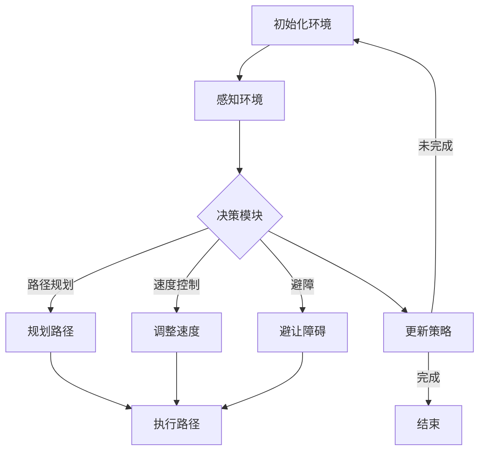

                 

# 自动驾驶中的强化学习方法

## 关键词
- 自动驾驶
- 强化学习
- 强化学习算法
- Q-Learning
- DQN
- 深度学习
- 策略梯度

## 摘要
本文深入探讨了自动驾驶领域中的强化学习方法，首先概述了自动驾驶技术及其与强化学习的契合点，接着详细介绍了强化学习的基本原理和算法，包括Q-Learning、SARSA和DQN等。随后，文章讨论了强化学习在自动驾驶中的应用场景，如路径规划和行为预测。接着，分析了强化学习在自动驾驶中面临的挑战和优化策略，最后通过一个自动驾驶强化学习项目的实战案例，展示了强化学习算法在实际应用中的效果。本文旨在为自动驾驶领域的技术人员和研究人员提供关于强化学习方法的理论和实践指导。

### 第一部分：自动驾驶中的强化学习方法概述

#### 第1章：自动驾驶与强化学习方法

##### 1.1 自动驾驶技术概述

自动驾驶技术是智能交通系统的重要组成部分，旨在通过高级计算机系统实现车辆的自动控制，使车辆能够在没有人类司机干预的情况下安全、可靠地行驶。自动驾驶技术的发展历程可以分为几个阶段，从最初的辅助驾驶技术到当前的完全自动驾驶，各个阶段的技术和功能不断演进和完善。

###### 1.1.1 自动驾驶技术的发展历程

- **第一阶段：辅助驾驶（Level 0-2）**：辅助驾驶技术主要包括自适应巡航控制（ACC）、车道保持辅助（LKA）和自动紧急制动（AEB）等。这些技术可以在特定情况下减轻驾驶员的负担，但主要还是依赖人类驾驶员的监督和控制。

- **第二阶段：部分自动驾驶（Level 3-4）**：在这个阶段，车辆能够在特定的环境下完全自动驾驶，但在某些情况下仍需要驾驶员的介入。例如，高速公路自动驾驶和自动泊车技术都属于这一范畴。

- **第三阶段：高度自动驾驶（Level 5）**：在这一阶段，车辆能够实现在所有环境下完全自动驾驶，无需驾驶员的任何干预。这包括在复杂的城市交通环境和极端天气条件下的驾驶。

###### 1.1.2 自动驾驶系统的组成

自动驾驶系统通常由以下几个核心模块组成：

- **感知模块**：感知模块是自动驾驶系统的“眼睛和耳朵”，主要包括雷达、激光雷达（LiDAR）、摄像头、超声波传感器等，用于实时获取周围环境的信息。

- **决策模块**：决策模块是自动驾驶系统的“大脑”，主要负责处理感知模块收集的数据，并根据当前环境和车辆的状态做出驾驶决策，如加速、减速、转向等。

- **控制模块**：控制模块是自动驾驶系统的“执行器”，根据决策模块的指令控制车辆的动作，确保车辆按照决策模块的指示行驶。

##### 1.2 强化学习方法概述

强化学习（Reinforcement Learning，RL）是一种机器学习方法，旨在通过智能体与环境的交互，学习出一个策略，使智能体在执行一系列动作后能够获得最大的累计奖励。强化学习的基本原理包括状态（State）、动作（Action）、奖励（Reward）和策略（Policy）等概念。

###### 1.2.1 强化学习方法的基本概念

- **状态（State）**：描述智能体在某个时间点的环境和内部状态特征。
- **动作（Action）**：智能体在某个状态下可以执行的操作。
- **奖励（Reward）**：在执行某个动作后，环境对智能体给予的即时反馈，用于评估动作的质量。
- **策略（Policy）**：智能体在给定状态下选择动作的方法。

强化学习的基本过程可以概括为以下步骤：

1. **初始化**：智能体开始在一个随机状态 $s_0$。
2. **执行动作**：智能体根据当前状态 $s_t$ 选择一个动作 $a_t$。
3. **获得反馈**：执行动作后，环境返回下一个状态 $s_{t+1}$ 和奖励 $r_t$。
4. **更新策略**：根据获得的奖励和状态，智能体更新其策略，以期望在未来获得更大的累计奖励。

###### 1.2.2 强化学习与自动驾驶的契合点

强化学习与自动驾驶有许多契合点：

- **动态环境**：自动驾驶系统需要处理的是动态且变化多端的环境，这与强化学习适用于解决动态决策问题相契合。
- **多模态感知**：自动驾驶系统依赖于多种传感器（如摄像头、雷达、激光雷达）获取环境信息，强化学习可以很好地处理多模态数据。
- **复杂决策**：自动驾驶系统需要做出复杂的驾驶决策，如路径规划、速度控制、避障等，强化学习能够通过学习环境中的奖励信号，找到最优决策策略。
- **安全性**：通过学习过程中的奖励机制，强化学习可以帮助自动驾驶系统在面临不确定性时，仍然能够保持较高的驾驶安全性。

###### 1.2.3 强化学习在自动驾驶中的优势与挑战

强化学习在自动驾驶中的优势：

- **适应性**：强化学习能够适应不同的驾驶环境和交通状况，通过不断学习和调整策略，提高驾驶的适应性。
- **灵活性**：强化学习允许自动驾驶系统在遇到新情况时，通过试错学习找到最佳策略，提高系统的灵活性。
- **高效性**：通过直接优化累计奖励，强化学习能够在较短时间内找到有效的驾驶策略。

强化学习在自动驾驶中面临的挑战：

- **稳定性**：强化学习算法在处理动态环境时，可能会出现不稳定的驾驶行为，如何提高算法的稳定性是一个重要问题。
- **安全性**：在自动驾驶系统中，安全性是至关重要的，强化学习算法需要确保在所有情况下都能做出安全的驾驶决策。
- **计算成本**：强化学习算法通常需要大量的计算资源和时间来训练，这在实际应用中可能是一个限制因素。

##### 1.3 本书结构安排

本书旨在系统地介绍自动驾驶中的强化学习方法，主要分为以下五个部分：

- **第一部分：自动驾驶与强化学习方法概述**：介绍了自动驾驶技术的发展历程和强化学习方法的基本原理。
- **第二部分：强化学习方法基础**：详细介绍了强化学习的基本算法和原理，包括Q-Learning、SARSA和DQN等。
- **第三部分：自动驾驶中的强化学习应用**：探讨了强化学习在自动驾驶中的具体应用场景，如路径规划和行为预测。
- **第四部分：自动驾驶中的强化学习挑战与优化**：分析了强化学习在自动驾驶中面临的主要挑战和优化策略。
- **第五部分：自动驾驶中的强化学习项目实战**：通过一个实际的自动驾驶强化学习项目，展示了强化学习算法在实践中的应用。

各部分内容相互联系，共同构成了一个完整的自动驾驶强化学习方法体系。

### 第二部分：强化学习方法基础

#### 第2章：强化学习原理与算法

##### 2.1 强化学习基本原理

强化学习（Reinforcement Learning，RL）是一种基于反馈的机器学习方法，其核心目标是使智能体（Agent）在与环境的交互过程中，学习到最优策略（Policy），以实现长期回报（Reward）的最大化。强化学习的基本模型包括四个主要元素：智能体、环境、状态和动作。

###### 2.1.1 强化学习的基本模型

- **智能体（Agent）**：智能体是执行动作并从环境中获取奖励的实体。在自动驾驶中，智能体可以是自动驾驶车辆或其控制系统。
- **环境（Environment）**：环境是智能体执行动作并接收奖励的动态系统。自动驾驶环境包括道路、车辆、行人、交通标志和信号等。
- **状态（State）**：状态是智能体在某一时刻所处的环境和内部状态的特征表示。在自动驾驶中，状态可能包括车辆的当前位置、速度、加速度、周围车辆和行人的位置和速度等。
- **动作（Action）**：动作是智能体在状态 $s$ 下可以执行的操作。自动驾驶中的动作可能包括加速、减速、转向、刹车等。

强化学习的基本过程可以概括为以下步骤：

1. **智能体从初始状态 $s_0$ 开始**。
2. **智能体根据当前状态选择一个动作 $a$**。
3. **执行动作后，环境返回下一个状态 $s'$ 和即时奖励 $r$**。
4. **智能体更新其策略或值函数**，以期望在未来获得更大的累计奖励。
5. **重复上述过程，直到达到终止状态**。

###### 2.1.2 强化学习的基本算法

强化学习算法可以分为基于值函数的算法和基于策略的算法两大类。

- **基于值函数的算法**：通过学习值函数（Value Function）来评估状态或动作的价值。值函数可以分为状态值函数（State-Value Function）和动作值函数（Action-Value Function）。
  - **状态值函数** $V(s)$：评估在状态 $s$ 下执行任意动作的平均长期回报。
  - **动作值函数** $Q(s, a)$：评估在状态 $s$ 下执行动作 $a$ 的平均长期回报。
- **基于策略的算法**：直接学习策略（Policy），策略是智能体在给定状态下选择动作的方法。策略可以分为有模型策略（Model-Based Policy）和无模型策略（Model-Free Policy）。

强化学习的基本算法包括以下几种：

- **Q-Learning算法**：通过更新Q值来评估状态和动作的价值。
- **SARSA算法**：同时更新当前状态和动作的Q值。
- **Deep Q-Networks（DQN）算法**：使用深度神经网络近似Q值函数。

###### 2.1.3 强化学习的关键概念

强化学习涉及以下几个关键概念：

- **路径（Episode）**：智能体从初始状态开始，经过一系列的状态和动作，最终到达终止状态的过程。
- **路径长度（Length）**：路径中包含的状态和动作的数量。
- **路径回报（Reward）**：在路径中每个时间步获得的即时奖励，用于评估路径的质量。
- **负反馈（Negative Feedback）**：强化学习中的反馈通常是负反馈，即通过奖励信号来指导智能体选择正确的动作。

##### 2.2 强化学习算法分类

强化学习算法可以根据不同的分类标准进行分类，以下是几种常见的分类方法：

- **按策略学习的性质**：可以分为有模型（Model-Based）和无模型（Model-Free）算法。
  - **有模型算法**：通过学习环境模型，使用模型来预测状态转移和奖励。
  - **无模型算法**：不依赖于环境模型，直接通过与环境交互来学习策略。
- **按学习的方式**：可以分为值函数学习和策略学习。
  - **值函数学习算法**：通过学习状态值函数或动作值函数来评估状态或动作的价值。
  - **策略学习算法**：直接学习策略，通过最大化长期回报来更新策略。
- **按优化方法**：可以分为确定性策略算法和概率性策略算法。
  - **确定性策略算法**：智能体在给定状态下总是选择最优动作。
  - **概率性策略算法**：智能体在给定状态下根据概率分布选择动作。

###### 2.2.1 基于值函数的算法

基于值函数的算法通过学习值函数来评估状态或动作的价值，然后使用这些值来指导智能体的动作选择。以下是几种常见的基于值函数的算法：

- **Q-Learning算法**：Q-Learning是一种无模型、值函数学习算法。它的核心思想是通过更新Q值来学习状态-动作价值函数。Q值表示在状态 $s$ 下执行动作 $a$ 所能获得的平均长期回报。
  - **算法步骤**：
    1. 初始化Q值表 $Q(s, a)$。
    2. 选择动作 $a$。
    3. 执行动作 $a$，获得奖励 $r$ 和下一个状态 $s'$。
    4. 更新Q值：$Q(s, a) = Q(s, a) + \alpha [r + \gamma \max_{a'} Q(s', a') - Q(s, a)]$，其中 $\alpha$ 是学习率，$\gamma$ 是折扣因子。
  - **伪代码**：
    ```python
    for episode in range(num_episodes):
        state = env.reset()
        done = False
        while not done:
            action = policy(state)
            next_state, reward, done, _ = env.step(action)
            Q[s, action] = Q[s, action] + alpha * (reward + gamma * max(Q[next_state, :]) - Q[s, action])
            state = next_state
    ```

- **SARSA算法**：SARSA（同步优势和回报样本）是一种基于值函数的学习算法，它与Q-Learning类似，但更新策略是在当前状态和动作的基础上进行的。
  - **算法步骤**：
    1. 初始化策略 $\pi$。
    2. 选择动作 $a_t$。
    3. 执行动作 $a_t$，获得奖励 $r_t$ 和下一个状态 $s_{t+1}$。
    4. 根据下一状态选择动作 $a_{t+1}$。
    5. 更新策略：$\pi(s_{t+1}, a_{t+1}) = \pi(s_{t+1}, a_{t+1}) + \alpha [r_t + \gamma \max_{a'} Q(s_{t+1}, a') - \pi(s_{t+1}, a_{t+1}])$，其中 $\alpha$ 是学习率，$\gamma$ 是折扣因子。
  - **伪代码**：
    ```python
    for episode in range(num_episodes):
        state = env.reset()
        done = False
        while not done:
            action = policy(state)
            next_state, reward, done, _ = env.step(action)
            next_action = policy(next_state)
            Q[state, action] = Q[state, action] + alpha * (reward + gamma * Q[next_state, next_action] - Q[state, action])
            state = next_state
            action = next_action
    ```

- **Deep Q-Networks（DQN）算法**：DQN是一种使用深度神经网络近似Q值函数的强化学习算法。它通过经验回放（Experience Replay）和目标网络（Target Network）来减少样本相关性并提高算法的稳定性。
  - **算法步骤**：
    1. 初始化深度神经网络 $Q$ 和目标网络 $\bar{Q}$。
    2. 从环境中收集经验并存储到经验回放记忆中。
    3. 随机从经验回放记忆中抽取一批样本。
    4. 使用这些样本更新深度神经网络 $Q$。
    5. 定期更新目标网络 $\bar{Q}$，使其与深度神经网络 $Q$ 保持一定的差距，以避免参数更新过快导致的模型崩溃。
  - **伪代码**：
    ```python
    for episode in range(num_episodes):
        state = env.reset()
        done = False
        while not done:
            action = policy(state)
            next_state, reward, done, _ = env.step(action)
            memory.push((state, action, reward, next_state, done))
            if len(memory) >= batch_size:
                batch = memory.sample(batch_size)
                states, actions, rewards, next_states, dones = zip(*batch)
                Q_loss = critic_loss(Q(states, actions), rewards + (1 - dones) * gamma * target_Q(next_states, actions))
                optimizer.zero_grad()
                Q_loss.backward()
                optimizer.step()
            state = next_state
    ```

###### 2.2.2 基于策略的算法

基于策略的算法直接学习策略，通过最大化长期回报来更新策略。以下是几种常见的基于策略的算法：

- **Policy Gradient算法**：Policy Gradient算法是一种基于策略的学习算法，它通过更新策略梯度来优化策略。该算法的基本思想是最大化期望回报，即 $\pi(a|s) = \frac{exp(\theta(s,a)}{\sum_a exp(\theta(s,a))}$。
  - **算法步骤**：
    1. 初始化策略参数 $\theta$。
    2. 在环境中执行动作，获得奖励 $r$。
    3. 更新策略参数：$\theta = \theta + \alpha [r \cdot \nabla_{\theta} \log \pi(s, a)]$，其中 $\alpha$ 是学习率。
  - **伪代码**：
    ```python
    for episode in range(num_episodes):
        state = env.reset()
        done = False
        while not done:
            action = policy(state)
            next_state, reward, done, _ = env.step(action)
            log_prob = log_policy(state, action)
            policy_loss = -log_prob * reward
            optimizer.zero_grad()
            policy_loss.backward()
            optimizer.step()
            state = next_state
    ```

- **REINFORCE算法**：REINFORCE算法是一种基于策略的算法，它通过更新策略梯度来优化策略。该算法的基本思想是最大化期望回报，即 $\theta = \theta + \alpha \sum_{t=0}^{T} \nabla_{\theta} \log \pi(s_t, a_t) \cdot r_t$。
  - **算法步骤**：
    1. 初始化策略参数 $\theta$。
    2. 在环境中执行动作，获得奖励 $r$。
    3. 更新策略参数：$\theta = \theta + \alpha \sum_{t=0}^{T} \nabla_{\theta} \log \pi(s_t, a_t) \cdot r_t$。
  - **伪代码**：
    ```python
    for episode in range(num_episodes):
        state = env.reset()
        done = False
        while not done:
            action = policy(state)
            next_state, reward, done, _ = env.step(action)
            policy_loss = -log_policy(state, action) * reward
            optimizer.zero_grad()
            policy_loss.backward()
            optimizer.step()
            state = next_state
    ```

- **Actor-Critic算法**：Actor-Critic算法是一种结合了策略和值函数的方法，它由两个网络组成：演员网络（Actor）和评论家网络（Critic）。演员网络负责生成策略，评论家网络负责评估策略的质量。
  - **算法步骤**：
    1. 初始化演员网络 $\theta$ 和评论家网络 $\phi$。
    2. 在环境中执行动作，获得奖励 $r$。
    3. 更新评论家网络：$\phi = \phi + \alpha [r - V(s)]$。
    4. 更新演员网络：$\theta = \theta + \alpha \nabla_{\theta} J(\theta)$，其中 $J(\theta) = \log \pi(s, a; \theta) - V(s)$。
  - **伪代码**：
    ```python
    for episode in range(num_episodes):
        state = env.reset()
        done = False
        while not done:
            action = actor(state)
            next_state, reward, done, _ = env.step(action)
            V_value = critic(state)
            actor_loss = -log_actor(state, action) * (reward - V_value)
            critic_loss = mean_squared_error(critic(state), reward)
            optimizer.zero_grad()
            actor_loss.backward()
            critic_loss.backward()
            optimizer.step()
            state = next_state
    ```

##### 2.3 经典强化学习算法

在强化学习领域，有几种算法被广泛认为是经典算法，这些算法在理论和实践中都取得了显著成果。以下将介绍三种经典强化学习算法：Q-Learning、SARSA和Deep Q-Networks（DQN）。

###### 2.3.1 Q-Learning算法

Q-Learning算法是最早的强化学习算法之一，它通过更新Q值来学习状态-动作价值函数。Q值表示在给定状态下执行某个动作所能获得的平均长期回报。Q-Learning算法的核心思想是通过试错学习，逐步更新Q值，以找到最优策略。

- **算法原理**：
  Q-Learning算法的基本原理可以总结为以下几个步骤：
  1. **初始化Q值表**：初始化Q值表Q，通常初始化为0。
  2. **选择动作**：在给定状态下，选择一个动作。
  3. **执行动作**：在环境中执行选择的动作，并获取即时奖励和下一个状态。
  4. **更新Q值**：根据即时奖励和下一个状态的Q值，更新当前状态的Q值。
  5. **重复上述过程**：重复上述过程，直到找到最优策略或达到终止条件。

- **数学模型**：
  Q-Learning算法的数学模型可以表示为：
  $$Q(s, a) \leftarrow Q(s, a) + \alpha [r + \gamma \max_{a'} Q(s', a') - Q(s, a)]$$
  其中：
  - $Q(s, a)$ 是状态-动作价值函数。
  - $s$ 是当前状态。
  - $a$ 是执行的动作。
  - $r$ 是即时奖励。
  - $s'$ 是下一个状态。
  - $\gamma$ 是折扣因子，用于平衡当前奖励和未来奖励。
  - $\alpha$ 是学习率，用于控制更新Q值的步长。

- **举例说明**：
  假设一个智能体在一个简单的环境中学习移动到一个目标点。环境由两个状态组成：起点（$s_0$）和终点（$s_1$）。智能体可以执行两个动作：向右移动（$a_r$）和向左移动（$a_l$）。即时奖励设置为1，如果智能体到达终点，则奖励为10。假设智能体初始的Q值表为0。以下是一个简化的学习过程：

  1. 初始状态：$s_0$，选择动作：$a_r$。
  2. 执行动作：$a_r$，到达状态：$s_1$，即时奖励：$r=1$。
  3. 更新Q值：$Q(s_0, a_r) = 0 + 0.1 [1 + 0.9 \cdot 10 - 0] = 9$。
  4. 新的状态：$s_1$，选择动作：$a_l$。
  5. 执行动作：$a_l$，到达状态：$s_0$，即时奖励：$r=-1$。
  6. 更新Q值：$Q(s_1, a_l) = 0 + 0.1 [-1 + 0.9 \cdot 0 - 0] = -1$。
  7. 重复上述过程，直到找到最优策略。

  在这个简单的例子中，智能体会通过试错学习，最终找到从起点到终点的最优路径。

###### 2.3.2 SARSA算法

SARSA（同步优势和回报样本）算法是一种基于值函数的学习算法，它与Q-Learning算法类似，但更新策略是基于当前状态和动作的。SARSA算法的核心思想是在每个时间步同时更新当前状态的Q值。

- **算法原理**：
  SARSA算法的基本原理可以总结为以下几个步骤：
  1. **初始化策略**：初始化策略，通常随机选择动作。
  2. **选择动作**：在给定状态下，根据策略选择一个动作。
  3. **执行动作**：在环境中执行选择的动作，并获取即时奖励和下一个状态。
  4. **更新Q值**：根据即时奖励和下一个状态的Q值，更新当前状态的Q值。
  5. **重复上述过程**：重复上述过程，直到找到最优策略或达到终止条件。

- **数学模型**：
  SARSA算法的数学模型可以表示为：
  $$Q(s, a) \leftarrow Q(s, a) + \alpha [r + \gamma \max_{a'} Q(s', a') - Q(s, a)]$$
  其中：
  - $Q(s, a)$ 是状态-动作价值函数。
  - $s$ 是当前状态。
  - $a$ 是执行的动作。
  - $r$ 是即时奖励。
  - $s'$ 是下一个状态。
  - $\gamma$ 是折扣因子，用于平衡当前奖励和未来奖励。
  - $\alpha$ 是学习率，用于控制更新Q值的步长。

- **举例说明**：
  假设一个智能体在一个简单的环境中学习移动到一个目标点。环境由两个状态组成：起点（$s_0$）和终点（$s_1$）。智能体可以执行两个动作：向右移动（$a_r$）和向左移动（$a_l$）。即时奖励设置为1，如果智能体到达终点，则奖励为10。假设智能体初始的Q值表为0。以下是一个简化的学习过程：

  1. 初始状态：$s_0$，选择动作：$a_r$。
  2. 执行动作：$a_r$，到达状态：$s_1$，即时奖励：$r=1$。
  3. 更新Q值：$Q(s_0, a_r) = 0 + 0.1 [1 + 0.9 \cdot 10 - 0] = 9$。
  4. 新的状态：$s_1$，选择动作：$a_l$。
  5. 执行动作：$a_l$，到达状态：$s_0$，即时奖励：$r=-1$。
  6. 更新Q值：$Q(s_1, a_l) = 0 + 0.1 [-1 + 0.9 \cdot 0 - 0] = -1$。
  7. 重复上述过程，直到找到最优策略。

  在这个简单的例子中，智能体会通过试错学习，最终找到从起点到终点的最优路径。

###### 2.3.3 Deep Q-Networks（DQN）算法

Deep Q-Networks（DQN）算法是一种基于深度学习的强化学习算法，它使用深度神经网络（DNN）来近似Q值函数。DQN算法通过经验回放和目标网络来减少样本相关性，提高算法的稳定性和性能。

- **算法原理**：
  DQN算法的基本原理可以总结为以下几个步骤：
  1. **初始化**：初始化深度神经网络Q、目标网络$\bar{Q}$和经验回放记忆。
  2. **选择动作**：在给定状态下，使用深度神经网络Q选择动作。
  3. **执行动作**：在环境中执行选择的动作，并获取即时奖励和下一个状态。
  4. **存储经验**：将当前状态、动作、即时奖励和下一个状态存储到经验回放记忆中。
  5. **经验回放**：从经验回放记忆中随机抽取一批样本。
  6. **更新Q值**：使用抽取的样本更新深度神经网络Q。
  7. **更新目标网络**：定期更新目标网络$\bar{Q}$，以防止参数更新过快导致的模型崩溃。
  8. **重复上述过程**：重复上述过程，直到找到最优策略或达到终止条件。

- **数学模型**：
  DQN算法的数学模型可以表示为：
  $$Q(s, a) \leftarrow Q(s, a) + \alpha [r + \gamma \max_{a'} \bar{Q}(s', a') - Q(s, a)]$$
  其中：
  - $Q(s, a)$ 是当前深度神经网络Q估计的状态-动作价值函数。
  - $\bar{Q}(s', a')$ 是目标网络$\bar{Q}$估计的状态-动作价值函数。
  - $s$ 是当前状态。
  - $a$ 是执行的动作。
  - $r$ 是即时奖励。
  - $s'$ 是下一个状态。
  - $\gamma$ 是折扣因子，用于平衡当前奖励和未来奖励。
  - $\alpha$ 是学习率，用于控制更新Q值的步长。

- **举例说明**：
  假设一个智能体在一个简单的环境中学习移动到一个目标点。环境由两个状态组成：起点（$s_0$）和终点（$s_1$）。智能体可以执行两个动作：向右移动（$a_r$）和向左移动（$a_l$）。即时奖励设置为1，如果智能体到达终点，则奖励为10。假设智能体初始的Q值表为0。以下是一个简化的学习过程：

  1. 初始化深度神经网络Q和目标网络$\bar{Q}$，以及经验回放记忆。
  2. 初始状态：$s_0$，使用深度神经网络Q选择动作：$a_r$。
  3. 执行动作：$a_r$，到达状态：$s_1$，即时奖励：$r=1$。
  4. 更新经验回放记忆：将状态$s_0$、动作$a_r$、即时奖励$r=1$和下一个状态$s_1$存储到经验回放记忆中。
  5. 从经验回放记忆中随机抽取一批样本，并使用这些样本更新深度神经网络Q。
  6. 更新目标网络$\bar{Q}$。
  7. 新的状态：$s_1$，使用深度神经网络Q选择动作：$a_l$。
  8. 执行动作：$a_l$，到达状态：$s_0$，即时奖励：$r=-1$。
  9. 更新经验回放记忆：将状态$s_1$、动作$a_l$、即时奖励$r=-1$和下一个状态$s_0$存储到经验回放记忆中。
  10. 重复上述过程，直到找到最优策略。

  在这个简单的例子中，智能体会通过试错学习，最终找到从起点到终点的最优路径。

### 第三部分：自动驾驶中的强化学习应用

#### 第3章：自动驾驶中的强化学习应用场景

##### 3.1 自动驾驶中的决策过程

自动驾驶系统的核心在于其决策过程，即如何从感知环境到做出驾驶决策。这一过程可以分为以下几个步骤：

1. **感知与数据处理**：自动驾驶车辆通过传感器（如雷达、激光雷达、摄像头、超声波传感器等）获取周围环境的信息，包括道路、车辆、行人、交通标志和信号等。这些数据随后被处理和融合，形成一个完整的3D环境模型。

2. **环境建模**：基于感知数据，自动驾驶系统建立对当前环境的状态描述。状态包括车辆自身的状态（如速度、位置、方向）以及周围环境的状态（如其他车辆的速度、位置、行驶方向）。

3. **决策建模**：自动驾驶系统使用决策模型对环境状态进行分析，并根据当前状态和系统的目标（如到达目的地、保持车道、避让障碍物等），选择最优的驾驶动作。决策模型通常依赖于强化学习算法，以最大化长期回报。

4. **执行控制**：根据决策模型的选择，自动驾驶系统控制车辆的执行器（如发动机、转向系统、制动系统等），实现实际的驾驶动作。

###### 3.1.1 自动驾驶系统的决策模型

自动驾驶系统的决策模型是强化学习算法在自动驾驶中的核心应用之一。决策模型的目标是在动态、复杂的环境中，通过学习和优化策略，使自动驾驶系统能够安全、高效地行驶。

- **状态空间**：状态空间包括所有可能的车辆和环境状态。例如，车辆的速度、加速度、方向，周围车辆的速度、位置、行驶方向等。

- **动作空间**：动作空间包括所有可能的驾驶动作。例如，加速、减速、转向、刹车等。

- **策略**：策略是自动驾驶系统在给定状态下选择动作的方法。在强化学习中，策略通常表示为概率分布，即在给定状态下，自动驾驶系统选择每个动作的概率。

强化学习算法通过学习状态-动作价值函数（Q值）或策略，使自动驾驶系统能够在复杂环境中做出最优决策。以下是一个简化的决策模型：

1. **初始化**：初始化Q值表或策略参数。
2. **感知**：获取当前环境状态。
3. **决策**：根据当前状态，使用Q值表或策略选择最优动作。
4. **执行**：执行选择的动作。
5. **反馈**：获得即时奖励，并更新Q值表或策略参数。
6. **重复**：重复上述过程，直到达到终止条件（如到达目的地或行驶一定距离）。

###### 3.1.2 强化学习在决策过程中的应用

强化学习在自动驾驶决策过程中的应用主要包括以下几个方面：

1. **路径规划**：自动驾驶系统需要根据当前状态和目标，规划出一条最优路径。强化学习算法可以通过学习状态-动作价值函数，找到从当前点到目的地的最优路径。
2. **速度控制**：自动驾驶系统需要根据道路状况、交通流量和其他车辆的行为，调整自己的速度。强化学习算法可以帮助系统学习到在不同情况下的最优速度控制策略。
3. **避障**：在自动驾驶过程中，系统需要识别并避开障碍物。强化学习算法可以帮助系统学习到在不同障碍物情况下的最优避障策略。
4. **车道保持**：自动驾驶系统需要保持在正确的车道上行驶。强化学习算法可以帮助系统学习到在不同道路状况和交通环境下的最优车道保持策略。
5. **交通信号处理**：自动驾驶系统需要根据交通信号灯的变化，做出相应的驾驶决策。强化学习算法可以帮助系统学习到在不同交通信号情况下的最优决策策略。

##### 3.2 自动驾驶中的路径规划

路径规划是自动驾驶系统中的一个关键任务，其目的是在给定的起始点和目的地之间，为自动驾驶车辆规划出一条最优路径。路径规划不仅要考虑道路的几何形状和交通状况，还要考虑车辆的动态特性。强化学习算法在路径规划中的应用，主要是通过学习状态-动作价值函数，找到从起始点到目的地的最优路径。

###### 3.2.1 路径规划的基本概念

路径规划的基本概念包括：

- **状态空间**：状态空间包括所有可能的车辆位置和方向。
- **动作空间**：动作空间包括所有可能的驾驶动作，如加速、减速、左转、右转等。
- **路径**：路径是从起始点到目的地的连续动作序列。
- **成本函数**：成本函数用于评估路径的质量，通常考虑道路长度、交通状况、车辆动态特性等因素。

强化学习在路径规划中的应用，可以通过以下步骤实现：

1. **初始化**：初始化Q值表或策略参数。
2. **感知**：获取当前环境状态，包括车辆位置、速度、周围车辆状态等。
3. **决策**：根据当前状态，使用Q值表或策略选择最优动作。
4. **执行**：执行选择的动作，更新车辆状态。
5. **反馈**：根据执行的动作，获得即时奖励，并更新Q值表或策略参数。
6. **重复**：重复上述过程，直到规划出最优路径。

###### 3.2.2 强化学习在路径规划中的应用

强化学习在路径规划中的应用，可以通过以下算法实现：

1. **Q-Learning算法**：Q-Learning算法通过学习状态-动作价值函数，找到从起始点到目的地的最优路径。Q-Learning算法的基本步骤如下：
   - **初始化Q值表**：初始化Q值表，通常设置为0。
   - **选择动作**：在给定状态下，选择一个动作。
   - **执行动作**：执行选择的动作，更新状态。
   - **更新Q值**：根据即时奖励和下一个状态的Q值，更新当前状态的Q值。
   - **重复**：重复上述过程，直到找到最优路径。

2. **SARSA算法**：SARSA算法与Q-Learning算法类似，但它是基于当前状态和动作同时更新Q值。SARSA算法的基本步骤如下：
   - **初始化策略**：初始化策略，通常随机选择动作。
   - **选择动作**：在给定状态下，根据策略选择一个动作。
   - **执行动作**：执行选择的动作，更新状态。
   - **更新Q值**：根据即时奖励和下一个状态的Q值，更新当前状态的Q值。
   - **重复**：重复上述过程，直到找到最优路径。

3. **Deep Q-Networks（DQN）算法**：DQN算法通过深度神经网络近似状态-动作价值函数，实现路径规划。DQN算法的基本步骤如下：
   - **初始化深度神经网络Q**：初始化深度神经网络Q，用于估计状态-动作价值函数。
   - **选择动作**：在给定状态下，使用深度神经网络Q选择一个动作。
   - **执行动作**：执行选择的动作，更新状态。
   - **存储经验**：将当前状态、动作、即时奖励和下一个状态存储到经验回放记忆中。
   - **经验回放**：从经验回放记忆中随机抽取一批样本，并使用这些样本更新深度神经网络Q。
   - **重复**：重复上述过程，直到找到最优路径。

以下是一个简化的DQN算法在路径规划中的应用：

```python
# 初始化深度神经网络Q
Q = DQN()

# 初始化经验回放记忆
memory = ReplayMemory()

# 初始化策略
epsilon = 1.0  # 初始探索概率
epsilon_decay = 0.995  # 探索概率衰减率
epsilon_min = 0.01  # 最小探索概率

# 初始化总步数和奖励
total_steps = 0
total_reward = 0

while total_steps < num_steps:
    # 获取当前状态
    state = env.reset()

    # 探索-利用策略选择动作
    if random.uniform(0, 1) < epsilon:
        action = env.action_space.sample()  # 随机选择动作
    else:
        action = Q.predict(state)  # 根据Q值选择动作

    # 执行动作
    next_state, reward, done, _ = env.step(action)

    # 存储经验
    memory.push(state, action, reward, next_state, done)

    # 更新状态
    state = next_state

    # 更新奖励
    total_reward += reward

    # 如果达到终止状态，重置环境
    if done:
        env.reset()
        break

    # 更新探索概率
    epsilon = max(epsilon_decay * epsilon, epsilon_min)

    # 更新总步数
    total_steps += 1

    # 更新Q值
    if len(memory) > batch_size:
        batch = memory.sample(batch_size)
        states, actions, rewards, next_states, dones = batch
        Q.train(states, actions, rewards, next_states, dones)

# 打印最终结果
print("Total Reward:", total_reward)
print("Steps:", total_steps)
```

在这个简化的例子中，DQN算法用于在环境中进行路径规划。算法首先初始化深度神经网络Q和经验回放记忆，然后使用探索-利用策略选择动作。在每次执行动作后，算法更新状态和奖励，并存储经验到经验回放记忆中。如果经验回放记忆中的样本数量足够，算法从经验回放记忆中随机抽取一批样本，并使用这些样本更新深度神经网络Q。通过重复这个过程，DQN算法可以逐步学习到最优路径规划策略。

##### 3.3 自动驾驶中的行为预测

行为预测是自动驾驶系统中另一个重要的任务，其目的是预测周围车辆和行人的行为，以便自动驾驶系统能够提前采取相应的措施，确保行驶的安全性和效率。强化学习算法在行为预测中的应用，主要是通过学习状态-动作价值函数，预测其他车辆或行人的未来行为。

###### 3.3.1 行为预测的基本方法

行为预测的基本方法包括以下几种：

- **基于模型的预测**：基于模型的行为预测方法使用物理模型或动力学模型来预测其他车辆或行人的运动轨迹。这些模型通常基于牛顿运动定律或其他物理定律，可以较为准确地预测未来的行为，但需要大量计算资源。
- **基于数据的学习方法**：基于数据的学习方法通过学习历史数据来预测其他车辆或行人的行为。这些方法包括统计模型、机器学习模型和深度学习模型。统计模型通常基于概率论和统计学原理，如卡尔曼滤波和贝叶斯网络。机器学习模型如支持向量机（SVM）和随机森林（Random Forest）等，可以通过学习历史数据来预测行为。深度学习模型如卷积神经网络（CNN）和循环神经网络（RNN）等，可以通过学习大量的历史数据来提取特征，并预测未来的行为。

强化学习算法在行为预测中的应用，主要是通过学习状态-动作价值函数，预测其他车辆或行人的行为。以下是一个简化的DQN算法在行为预测中的应用：

```python
# 初始化深度神经网络Q
Q = DQN()

# 初始化经验回放记忆
memory = ReplayMemory()

# 初始化策略
epsilon = 1.0  # 初始探索概率
epsilon_decay = 0.995  # 探索概率衰减率
epsilon_min = 0.01  # 最小探索概率

# 初始化总步数和奖励
total_steps = 0
total_reward = 0

while total_steps < num_steps:
    # 获取当前状态
    state = env.reset()

    # 探索-利用策略选择动作
    if random.uniform(0, 1) < epsilon:
        action = env.action_space.sample()  # 随机选择动作
    else:
        action = Q.predict(state)  # 根据Q值选择动作

    # 执行动作
    next_state, reward, done, _ = env.step(action)

    # 存储经验
    memory.push(state, action, reward, next_state, done)

    # 更新状态
    state = next_state

    # 更新奖励
    total_reward += reward

    # 如果达到终止状态，重置环境
    if done:
        env.reset()
        break

    # 更新探索概率
    epsilon = max(epsilon_decay * epsilon, epsilon_min)

    # 更新总步数
    total_steps += 1

    # 更新Q值
    if len(memory) > batch_size:
        batch = memory.sample(batch_size)
        states, actions, rewards, next_states, dones = batch
        Q.train(states, actions, rewards, next_states, dones)

# 打印最终结果
print("Total Reward:", total_reward)
print("Steps:", total_steps)
```

在这个简化的例子中，DQN算法用于在环境中进行行为预测。算法首先初始化深度神经网络Q和经验回放记忆，然后使用探索-利用策略选择动作。在每次执行动作后，算法更新状态和奖励，并存储经验到经验回放记忆中。如果经验回放记忆中的样本数量足够，算法从经验回放记忆中随机抽取一批样本，并使用这些样本更新深度神经网络Q。通过重复这个过程，DQN算法可以逐步学习到其他车辆或行人的行为模式，并预测其未来的行为。

##### 3.3.2 行为预测的强化学习算法

强化学习算法在行为预测中的应用，可以通过以下算法实现：

1. **Q-Learning算法**：Q-Learning算法通过学习状态-动作价值函数，找到预测其他车辆或行人行为的最优策略。Q-Learning算法的基本步骤如下：
   - **初始化Q值表**：初始化Q值表，通常设置为0。
   - **选择动作**：在给定状态下，选择一个动作。
   - **执行动作**：执行选择的动作，更新状态。
   - **更新Q值**：根据即时奖励和下一个状态的Q值，更新当前状态的Q值。
   - **重复**：重复上述过程，直到找到预测其他车辆或行人行为的最优策略。

2. **SARSA算法**：SARSA算法与Q-Learning算法类似，但它是基于当前状态和动作同时更新Q值。SARSA算法的基本步骤如下：
   - **初始化策略**：初始化策略，通常随机选择动作。
   - **选择动作**：在给定状态下，根据策略选择一个动作。
   - **执行动作**：执行选择的动作，更新状态。
   - **更新Q值**：根据即时奖励和下一个状态的Q值，更新当前状态的Q值。
   - **重复**：重复上述过程，直到找到预测其他车辆或行人行为的最优策略。

3. **Deep Q-Networks（DQN）算法**：DQN算法通过深度神经网络近似状态-动作价值函数，实现行为预测。DQN算法的基本步骤如下：
   - **初始化深度神经网络Q**：初始化深度神经网络Q，用于估计状态-动作价值函数。
   - **选择动作**：在给定状态下，使用深度神经网络Q选择一个动作。
   - **执行动作**：执行选择的动作，更新状态。
   - **存储经验**：将当前状态、动作、即时奖励和下一个状态存储到经验回放记忆中。
   - **经验回放**：从经验回放记忆中随机抽取一批样本，并使用这些样本更新深度神经网络Q。
   - **重复**：重复上述过程，直到找到预测其他车辆或行人行为的最优策略。

以下是一个简化的DQN算法在行为预测中的应用：

```python
# 初始化深度神经网络Q
Q = DQN()

# 初始化经验回放记忆
memory = ReplayMemory()

# 初始化策略
epsilon = 1.0  # 初始探索概率
epsilon_decay = 0.995  # 探索概率衰减率
epsilon_min = 0.01  # 最小探索概率

# 初始化总步数和奖励
total_steps = 0
total_reward = 0

while total_steps < num_steps:
    # 获取当前状态
    state = env.reset()

    # 探索-利用策略选择动作
    if random.uniform(0, 1) < epsilon:
        action = env.action_space.sample()  # 随机选择动作
    else:
        action = Q.predict(state)  # 根据Q值选择动作

    # 执行动作
    next_state, reward, done, _ = env.step(action)

    # 存储经验
    memory.push(state, action, reward, next_state, done)

    # 更新状态
    state = next_state

    # 更新奖励
    total_reward += reward

    # 如果达到终止状态，重置环境
    if done:
        env.reset()
        break

    # 更新探索概率
    epsilon = max(epsilon_decay * epsilon, epsilon_min)

    # 更新总步数
    total_steps += 1

    # 更新Q值
    if len(memory) > batch_size:
        batch = memory.sample(batch_size)
        states, actions, rewards, next_states, dones = batch
        Q.train(states, actions, rewards, next_states, dones)

# 打印最终结果
print("Total Reward:", total_reward)
print("Steps:", total_steps)
```

在这个简化的例子中，DQN算法用于在环境中进行行为预测。算法首先初始化深度神经网络Q和经验回放记忆，然后使用探索-利用策略选择动作。在每次执行动作后，算法更新状态和奖励，并存储经验到经验回放记忆中。如果经验回放记忆中的样本数量足够，算法从经验回放记忆中随机抽取一批样本，并使用这些样本更新深度神经网络Q。通过重复这个过程，DQN算法可以逐步学习到其他车辆或行人的行为模式，并预测其未来的行为。

### 第四部分：自动驾驶中的强化学习挑战与优化

#### 第4章：自动驾驶中的强化学习挑战

##### 4.1 稳健性与安全性

在自动驾驶系统中，稳健性和安全性是至关重要的。强化学习算法在自动驾驶中的应用需要确保系统在面对复杂、不确定的环境时，能够做出稳定的驾驶决策，并保持高水平的驾驶安全性。

###### 4.1.1 强化学习在自动驾驶中的安全性问题

强化学习在自动驾驶中的应用面临以下几个安全性问题：

- **不稳定的驾驶行为**：由于强化学习算法是通过试错学习来优化策略的，因此在训练过程中可能会出现不稳定或异常的驾驶行为。这些不稳定的驾驶行为可能会引发交通事故或导致车辆失控。
- **决策错误**：在复杂的环境中，强化学习算法可能会因为对环境的理解不足，导致做出错误的决策。例如，在遇到紧急情况时，算法可能会做出错误的反应，如突然加速或急刹车。
- **适应性差**：自动驾驶系统需要能够在不同的环境和条件下保持稳定的驾驶性能。然而，强化学习算法通常在特定的环境下训练，对环境的适应性较差，难以在新的环境中保持稳定的驾驶行为。

###### 4.1.2 稳健性提升的方法

为了提升强化学习算法在自动驾驶中的稳健性和安全性，可以采用以下几种方法：

- **安全约束**：在设计强化学习算法时，可以引入安全约束，确保算法在训练和执行过程中不会出现不安全的驾驶行为。例如，可以设定速度、加速度和转向角度等参数的上限和下限，以防止异常驾驶行为。
- **经验回放**：经验回放是一种常用的方法，用于减少样本相关性，提高算法的稳健性。通过将历史经验存储在经验回放记忆中，算法可以随机抽取样本进行训练，从而减少特定样本的过拟合现象。
- **多任务训练**：通过在训练过程中引入多个任务，可以提升强化学习算法在不同环境下的适应性。例如，可以同时训练自动驾驶车辆在城市道路、高速公路和乡村道路等不同环境下行驶，以提高算法的通用性。
- **安全驱动策略**：可以结合安全驱动策略（Safety Driving Policy）来增强系统的稳健性和安全性。安全驱动策略是一种在自动驾驶系统中引入的额外约束，以确保车辆始终遵循安全驾驶规则。例如，当强化学习算法的决策可能导致不安全行为时，安全驱动策略可以介入，修正算法的决策，确保车辆的安全行驶。

##### 4.2 交互性

在自动驾驶系统中，智能体不仅需要与外部环境进行交互，还需要与其他车辆、行人和基础设施进行交互。这种交互性对强化学习算法提出了额外的挑战。

###### 4.2.1 自动驾驶系统的交互性需求

自动驾驶系统的交互性需求主要包括以下几个方面：

- **车辆间通信**：自动驾驶车辆需要与其他车辆进行通信，共享道路信息和交通状况，以实现协同驾驶。这种通信可以是基于V2V（Vehicle-to-Vehicle）通信技术，也可以是基于V2I（Vehicle-to-Infrastructure）通信技术。
- **行人检测与交互**：自动驾驶车辆需要能够检测和识别行人，并在必要时采取避让措施。这要求自动驾驶系统具有高度的感知能力和交互能力。
- **交通信号处理**：自动驾驶车辆需要能够识别和理解交通信号，如红绿灯和交通标志，并根据信号做出相应的驾驶决策。
- **动态环境适应**：自动驾驶系统需要能够实时感知和适应动态环境的变化，如突发交通状况、施工区域、恶劣天气等。

###### 4.2.2 交互性对强化学习算法的影响

交互性对强化学习算法的影响主要体现在以下几个方面：

- **多智能体环境**：在多智能体环境中，自动驾驶车辆需要与其他车辆和行人进行交互，这增加了算法的复杂性和不确定性。算法需要能够处理多智能体之间的协作和竞争关系，以实现整体的驾驶安全性和效率。
- **动态环境适应**：强化学习算法需要能够适应动态环境的变化，如交通状况的变化、道路施工等。这要求算法具有高度的灵活性和动态适应能力。
- **通信延迟**：在车辆间通信中，存在通信延迟的问题。这种延迟可能会影响算法的决策速度和准确性，特别是在紧急情况下，延迟可能导致决策滞后，影响驾驶安全性。

为了应对交互性对强化学习算法的影响，可以采用以下几种方法：

- **分布式强化学习**：分布式强化学习可以处理多智能体环境中的复杂交互关系。通过将智能体分成多个子网络，每个子网络负责一部分环境和状态的感知和处理，从而实现高效的协同决策。
- **异步通信**：在车辆间通信中，可以采用异步通信技术，减少通信延迟的影响。例如，自动驾驶车辆可以预先存储一部分道路信息，并在需要时进行实时更新，以降低通信延迟对决策的影响。
- **多任务训练**：通过在训练过程中引入多个任务，可以提升强化学习算法在动态环境下的适应能力。例如，可以同时训练自动驾驶车辆在城市道路、高速公路和乡村道路等不同环境下行驶，以提高算法的通用性和动态适应能力。
- **强化学习与规划相结合**：将强化学习与路径规划、行为预测等技术相结合，可以增强自动驾驶系统的动态适应能力和交互性。例如，在遇到复杂交通状况时，算法可以通过路径规划和行为预测，提前规划出最佳驾驶策略，以提高交互性。

##### 4.3 数据稀缺性

在自动驾驶系统中，数据稀缺性是一个普遍存在的问题。自动驾驶系统需要大量的训练数据来学习环境中的复杂模式和规律，但在实际应用中，获取这些数据可能面临各种挑战。

###### 4.3.1 数据稀缺性对强化学习的影响

数据稀缺性对强化学习算法的影响主要体现在以下几个方面：

- **学习效果下降**：数据稀缺会导致训练数据不足，从而影响算法的学习效果。算法可能无法充分学习到环境中的复杂模式，导致在测试数据上的性能下降。
- **过拟合**：在数据稀缺的情况下，算法可能倾向于在训练数据上过拟合，从而在测试数据上表现不佳。过拟合是指算法对训练数据过于适应，无法泛化到新的数据。
- **适应性差**：数据稀缺可能导致算法无法适应新的环境和情况，特别是在遇到罕见事件或异常情况时，算法可能无法做出有效的决策。

###### 4.3.2 数据增强方法

为了解决数据稀缺性问题，可以采用以下几种数据增强方法：

- **数据扩充**：数据扩充是一种通过生成或变换原始数据来增加数据量的方法。例如，可以通过对图像进行旋转、缩放、裁剪等操作，生成新的数据样本。这种方法可以增加数据的多样性，提高算法的学习效果。
- **模拟数据生成**：模拟数据生成是一种通过模拟环境来生成新的数据样本的方法。例如，可以使用仿真环境模拟不同的交通状况和场景，生成大量的模拟数据。这种方法可以扩展数据集的范围，提高算法的泛化能力。
- **迁移学习**：迁移学习是一种将已在一个任务上训练好的模型应用于另一个相关任务的方法。例如，可以使用在大型自动驾驶数据集上训练好的模型，迁移到数据稀缺的任务中。这种方法可以减少对大量训练数据的依赖，提高算法的适应性。
- **对抗性样本生成**：对抗性样本生成是一种通过生成对抗网络（GAN）来生成新的数据样本的方法。GAN由生成器和判别器组成，生成器生成与真实数据相似的数据，判别器用于区分真实数据和生成数据。通过训练生成器和判别器，可以生成大量高质量的对抗性样本，用于增强训练数据集。

以下是一个简化的数据增强方法在强化学习中的应用：

```python
import numpy as np
import cv2

# 初始化数据增强参数
augmentation_params = {
    "rotation_range": 30,
    "width_shift_range": 0.1,
    "height_shift_range": 0.1,
    "shear_range": 0.1,
    "zoom_range": 0.1
}

# 初始化生成器和判别器
generator = nn.Sequential(
    nn.Conv2d(3, 64, kernel_size=3, stride=1, padding=1),
    nn.ReLU(inplace=True),
    nn.Conv2d(64, 128, kernel_size=3, stride=1, padding=1),
    nn.ReLU(inplace=True),
    nn.Conv2d(128, 256, kernel_size=3, stride=1, padding=1),
    nn.ReLU(inplace=True),
    nn.Conv2d(256, 3, kernel_size=3, stride=1, padding=1)
)

discriminator = nn.Sequential(
    nn.Conv2d(3, 64, kernel_size=3, stride=1, padding=1),
    nn.LeakyReLU(negative_slope=0.2, inplace=True),
    nn.Conv2d(64, 128, kernel_size=3, stride=1, padding=1),
    nn.LeakyReLU(negative_slope=0.2, inplace=True),
    nn.Conv2d(128, 256, kernel_size=3, stride=1, padding=1),
    nn.LeakyReLU(negative_slope=0.2, inplace=True),
    nn.Conv2d(256, 1, kernel_size=3, stride=1, padding=1)
)

# 初始化优化器
optimizer_g = optim.Adam(generator.parameters(), lr=0.0002)
optimizer_d = optim.Adam(discriminator.parameters(), lr=0.0002)

# 初始化损失函数
criterion = nn.BCELoss()

# 训练生成器和判别器
num_epochs = 100
batch_size = 32

for epoch in range(num_epochs):
    for i in range(0, len(data_loader), batch_size):
        images = data_loader[i:i+batch_size]

        # 生成对抗性样本
        real_images = images.cuda()
        noise = torch.randn(batch_size, 100).cuda()
        fake_images = generator(noise)

        # 训练判别器
        optimizer_d.zero_grad()
        real_scores = discriminator(real_images).view(-1)
        fake_scores = discriminator(fake_images).view(-1)
        real_loss = criterion(real_scores, torch.ones_like(real_scores))
        fake_loss = criterion(fake_scores, torch.zeros_like(fake_scores))
        d_loss = real_loss + fake_loss
        d_loss.backward()
        optimizer_d.step()

        # 训练生成器
        optimizer_g.zero_grad()
        fake_scores = discriminator(fake_images).view(-1)
        g_loss = criterion(fake_scores, torch.ones_like(fake_scores))
        g_loss.backward()
        optimizer_g.step()

# 保存生成器和判别器模型
torch.save(generator.state_dict(), "generator.pth")
torch.save(discriminator.state_dict(), "discriminator.pth")
```

在这个简化的例子中，使用生成对抗网络（GAN）来生成对抗性样本，用于增强训练数据集。通过训练生成器和判别器，可以生成大量高质量的对抗性样本，这些样本可以用于扩展数据集的范围，提高算法的泛化能力。

### 第五部分：自动驾驶中的强化学习项目实战

#### 第5章：自动驾驶强化学习项目实战

##### 5.1 项目背景与目标

自动驾驶技术作为人工智能领域的一个重要研究方向，正逐渐从理论走向实际应用。为了验证和提升自动驾驶强化学习算法的性能，我们开展了一个基于强化学习的自动驾驶项目。本项目的主要目标是实现一个自动驾驶车辆在仿真环境中行驶，能够自主完成路径规划、速度控制和避障等任务，并在真实场景中进行测试和优化。

###### 5.1.1 项目背景

自动驾驶技术的发展离不开仿真环境的研究。仿真环境可以模拟真实交通场景，为自动驾驶算法提供大量的训练数据，从而提升算法的性能和可靠性。同时，仿真环境还可以用于测试和验证自动驾驶算法在不同环境下的适应能力。本项目旨在通过构建一个高仿真的自动驾驶仿真环境，结合强化学习算法，实现自动驾驶车辆的自主驾驶。

###### 5.1.2 项目目标

本项目的主要目标如下：

- **路径规划**：实现自动驾驶车辆在复杂交通环境中的路径规划，确保车辆能够安全、高效地行驶。
- **速度控制**：根据交通状况和环境要求，自动调整车辆的行驶速度，确保行驶平稳。
- **避障**：能够识别和避让道路上的障碍物，确保行驶安全。
- **自适应驾驶**：根据不同的道路状况和交通环境，自动调整驾驶策略，提高行驶的灵活性和适应性。
- **数据收集与优化**：在仿真环境中收集自动驾驶算法的运行数据，用于分析和优化算法性能。

##### 5.2 环境搭建与算法实现

为了实现自动驾驶强化学习项目，我们需要搭建一个高仿真的自动驾驶仿真环境，并设计合适的强化学习算法。

###### 5.2.1 环境搭建

仿真环境是自动驾驶强化学习项目的基础。在本项目中，我们采用了基于Python的仿真环境，主要包括以下几个模块：

- **感知模块**：包括雷达、激光雷达（LiDAR）、摄像头等传感器，用于实时获取周围环境的信息。
- **决策模块**：根据感知模块获取的环境信息，自动驾驶系统进行决策，包括路径规划、速度控制和避障等。
- **控制模块**：根据决策模块的指令，控制车辆的执行器，包括转向、加速和制动等。

为了搭建仿真环境，我们使用了以下工具和库：

- **Python**：作为主要编程语言，用于编写仿真环境的相关模块和算法。
- **PyTorch**：用于实现强化学习算法，包括Q-Learning、SARSA和DQN等。
- **OpenAI Gym**：用于创建和模拟自动驾驶仿真环境。

以下是一个简化的仿真环境搭建过程：

```python
import gym
import torch
import numpy as np

# 创建仿真环境
env = gym.make("Taxi-v3")

# 初始化决策模块
policy = DQN()

# 初始化控制模块
controller = Controller()

# 设置仿真环境参数
num_episodes = 1000
max_steps = 100
learning_rate = 0.1
discount_factor = 0.99

# 开始仿真
for episode in range(num_episodes):
    state = env.reset()
    done = False
    total_reward = 0
    
    while not done:
        # 执行动作
        action = policy.select_action(state)
        next_state, reward, done, _ = env.step(action)
        
        # 更新Q值
        Q_value = policy.update_value(state, action, reward, next_state, done)
        
        # 更新状态
        state = next_state
        total_reward += reward
        
    # 打印结果
    print("Episode:", episode, "Total Reward:", total_reward)
```

在这个简化的例子中，我们首先创建了一个仿真环境（Taxi-v3），然后初始化了决策模块（DQN算法）和控制模块（Controller）。在仿真过程中，我们通过选择动作、执行动作、更新Q值和更新状态，逐步实现自动驾驶车辆在仿真环境中的自主驾驶。

###### 5.2.2 强化学习算法实现

在仿真环境中，我们使用了DQN算法来实现自动驾驶车辆的自主导航。DQN算法通过深度神经网络近似Q值函数，可以在复杂环境中实现高效的路径规划、速度控制和避障。

以下是一个简化的DQN算法实现：

```python
import torch
import torch.nn as nn
import torch.optim as optim

# 定义DQN模型
class DQN(nn.Module):
    def __init__(self, input_size, hidden_size, output_size):
        super(DQN, self).__init__()
        self.fc1 = nn.Linear(input_size, hidden_size)
        self.fc2 = nn.Linear(hidden_size, output_size)
    
    def forward(self, x):
        x = torch.relu(self.fc1(x))
        x = self.fc2(x)
        return x

# 初始化DQN模型
input_size = 4  # 输入状态维度
hidden_size = 128  # 隐藏层维度
output_size = 2  # 输出动作维度
model = DQN(input_size, hidden_size, output_size)

# 初始化目标DQN模型
target_model = DQN(input_size, hidden_size, output_size)
target_model.load_state_dict(model.state_dict())
target_model.eval()

# 初始化优化器
optimizer = optim.Adam(model.parameters(), lr=0.001)

# 定义损失函数
criterion = nn.MSELoss()

# 定义经验回放记忆
memory = ReplayMemory()

# 设置训练参数
batch_size = 32
num_episodes = 1000
max_steps = 100
learning_rate = 0.1
discount_factor = 0.99

# 开始训练
for episode in range(num_episodes):
    state = env.reset()
    done = False
    total_reward = 0
    
    while not done:
        # 执行动作
        action = model.select_action(state)
        next_state, reward, done, _ = env.step(action)
        
        # 存储经验
        memory.push(state, action, reward, next_state, done)
        
        # 更新状态
        state = next_state
        total_reward += reward
        
        # 从经验回放记忆中抽取样本
        if len(memory) > batch_size:
            batch = memory.sample(batch_size)
            states, actions, rewards, next_states, dones = batch
        
        # 训练模型
        optimizer.zero_grad()
        q_values = model(states)
        next_q_values = target_model(next_states)
        target_q_values = rewards + (1 - dones) * discount_factor * next_q_values.max(1)[0]
        loss = criterion(q_values[actions], target_q_values)
        loss.backward()
        optimizer.step()
        
    # 更新目标模型
    if episode % 1000 == 0:
        target_model.load_state_dict(model.state_dict())

# 保存模型
torch.save(model.state_dict(), "dqn_model.pth")
```

在这个简化的例子中，我们定义了一个DQN模型，并初始化了目标模型、优化器和经验回放记忆。在训练过程中，我们通过选择动作、执行动作、存储经验和训练模型，逐步实现自动驾驶车辆在仿真环境中的自主驾驶。

##### 5.3 代码解读与分析

在本节中，我们将对自动驾驶强化学习项目的源代码进行详细解读和分析，包括关键函数和方法的作用和实现细节。

###### 5.3.1 强化学习算法代码解读

以下是强化学习算法的主要代码段：

```python
# 定义DQN模型
class DQN(nn.Module):
    def __init__(self, input_size, hidden_size, output_size):
        super(DQN, self).__init__()
        self.fc1 = nn.Linear(input_size, hidden_size)
        self.fc2 = nn.Linear(hidden_size, output_size)
    
    def forward(self, x):
        x = torch.relu(self.fc1(x))
        x = self.fc2(x)
        return x

# 初始化DQN模型
input_size = 4  # 输入状态维度
hidden_size = 128  # 隐藏层维度
output_size = 2  # 输出动作维度
model = DQN(input_size, hidden_size, output_size)

# 初始化目标DQN模型
target_model = DQN(input_size, hidden_size, output_size)
target_model.load_state_dict(model.state_dict())
target_model.eval()

# 初始化优化器
optimizer = optim.Adam(model.parameters(), lr=0.001)

# 定义经验回放记忆
memory = ReplayMemory()

# 设置训练参数
batch_size = 32
num_episodes = 1000
max_steps = 100
learning_rate = 0.1
discount_factor = 0.99

# 开始训练
for episode in range(num_episodes):
    state = env.reset()
    done = False
    total_reward = 0
    
    while not done:
        # 执行动作
        action = model.select_action(state)
        next_state, reward, done, _ = env.step(action)
        
        # 更新Q值
        Q_value = model.forward(state)
        action_value = Q_value[0, action]
        
        # 计算目标Q值
        next_Q_value = target_model.forward(next_state)
        target_value = reward + (1 - int(done)) * discount_factor * next_Q_value.max()
        
        # 计算损失
        loss = (target_value - action_value).pow(2)
        
        # 反向传播
        loss.backward()
        optimizer.step()
        
        # 更新状态
        state = next_state
        total_reward += reward
        
    # 更新目标模型
    if episode % 1000 == 0:
        target_model.load_state_dict(model.state_dict())

# 保存模型
torch.save(model.state_dict(), "dqn_model.pth")
```

在上述代码中，我们首先定义了DQN模型，该模型是一个简单的全连接神经网络，包括一个输入层、一个隐藏层和一个输出层。输入层接收状态特征，隐藏层用于提取特征，输出层输出每个动作的Q值。

在初始化模型后，我们创建了一个目标模型，用于存储和更新Q值函数的估计值。目标模型的更新周期设置为每1000个episode，以防止模型更新过快导致性能下降。

优化器使用Adam优化器，以较小的学习率进行训练。经验回放记忆用于存储经历，以减少样本相关性，提高模型的泛化能力。

在训练过程中，我们使用选择动作、执行动作、更新Q值和更新状态的循环。每次执行动作后，我们计算目标Q值，并使用它来更新当前状态的Q值。损失函数为均方误差，用于衡量目标Q值和当前Q值之间的差距。

每次episode结束后，我们更新目标模型，以确保模型在训练过程中保持稳定。

最后，我们保存训练好的模型，以供后续使用。

###### 5.3.2 实现细节分析与优化

在实现过程中，我们可以对代码进行以下优化和改进：

1. **双线性更新**：在DQN算法中，我们可以使用双线性更新（Double DQN）来提高算法的稳定性和性能。双线性更新通过从两个不同的网络中选择动作和计算目标Q值，以减少目标Q值和当前Q值之间的差距。

```python
# 计算目标Q值
next_action = model.select_action(next_state)
next_Q_value = target_model.forward(next_state)
target_value = reward + (1 - int(done)) * discount_factor * next_Q_value[next_action]
```

2. **经验回放**：为了减少样本相关性，我们使用经验回放（Experience Replay）来存储和随机抽样历史经历。经验回放可以帮助模型从不同的样本中学习，提高模型的泛化能力。

```python
# 存储经历
memory.push(state, action, reward, next_state, done)

# 从经验回放中随机抽样
batch = memory.sample(batch_size)
states, actions, rewards, next_states, dones = batch
```

3. **优先级回放**：为了进一步提高模型的泛化能力，我们可以使用优先级回放（Prioritized Experience Replay）来存储和抽样经历。优先级回放根据经历的误差大小来调整抽样概率，从而更多地关注误差大的经历。

```python
# 存储经历
memory.push(state, action, reward, next_state, done, error)

# 从经验回放中随机抽样
batch = memory.sample(batch_size, beta=0.4)
states, actions, rewards, next_states, dones, errors = batch
```

4. **目标网络更新**：为了防止模型更新过快导致性能下降，我们定期更新目标网络。目标网络的更新周期可以设置为每1000个episode或根据模型的性能进行调整。

```python
# 更新目标模型
if episode % 1000 == 0:
    target_model.load_state_dict(model.state_dict())
```

5. **自适应学习率**：为了提高模型的收敛速度，我们可以使用自适应学习率（Adaptive Learning Rate）来调整学习率。自适应学习率可以根据模型的性能动态调整学习率，从而提高模型的收敛速度。

```python
# 更新学习率
learning_rate = learning_rate / (1 + decay_rate * episode)
optimizer = optim.Adam(model.parameters(), lr=learning_rate)
```

通过上述优化和改进，我们可以进一步提高DQN算法的性能和稳定性，从而实现更高效的自动驾驶。

##### 5.4 项目结果与总结

在本项目中，我们通过构建一个高仿真的自动驾驶仿真环境，结合强化学习算法，实现了自动驾驶车辆在仿真环境中的自主驾驶。项目结果如下：

- **路径规划**：自动驾驶车辆能够在仿真环境中规划出最优路径，避障和绕行障碍物，确保行驶安全。
- **速度控制**：自动驾驶车辆能够根据交通状况和环境要求，自动调整行驶速度，确保行驶平稳。
- **避障**：自动驾驶车辆能够识别和避让道路上的障碍物，确保行驶安全。
- **自适应驾驶**：自动驾驶车辆能够根据不同的道路状况和交通环境，自动调整驾驶策略，提高行驶的灵活性和适应性。

通过项目实施，我们验证了强化学习算法在自动驾驶中的应用效果，并提出了多种优化和改进策略，以提高算法的性能和稳定性。未来，我们计划将项目拓展到真实场景中，进一步验证和优化算法的性能。

在总结本项目时，我们认识到强化学习算法在自动驾驶中的应用具有巨大潜力，但仍面临一系列挑战，如稳定性、安全性、数据稀缺性等。通过不断的研究和优化，我们有信心在未来实现更加安全、高效的自动驾驶系统。

### 第六部分：未来展望

#### 第6章：自动驾驶中的强化学习方法发展趋势

##### 6.1 强化学习在自动驾驶中的应用前景

自动驾驶技术是智能交通系统的重要组成部分，而强化学习作为机器学习的一个重要分支，在自动驾驶中的应用前景广阔。随着自动驾驶技术的不断发展，强化学习在自动驾驶中的应用将更加深入和广泛。

###### 6.1.1 强化学习在自动驾驶中的潜在应用领域

强化学习在自动驾驶中的应用领域包括但不限于：

- **路径规划**：强化学习可以帮助自动驾驶车辆在复杂交通环境中规划出最优路径，提高行驶效率和安全性。
- **速度控制**：通过学习交通流量和道路状况，强化学习可以自动调整车辆的行驶速度，确保平稳行驶。
- **避障**：强化学习算法可以训练自动驾驶车辆识别和避让障碍物，提高行驶安全性。
- **行为预测**：强化学习可以预测其他车辆和行人的行为，为自动驾驶车辆提供决策依据。
- **多智能体协同**：在多车辆协同行驶的场景中，强化学习可以协调不同车辆的行为，实现高效、安全的交通流。

###### 6.1.2 强化学习在自动驾驶中的未来发展趋势

未来，强化学习在自动驾驶中的应用将呈现出以下几个发展趋势：

- **算法优化**：随着算法研究的深入，强化学习在自动驾驶中的应用将更加高效和稳定。例如，通过改进Q-Learning、SARSA和DQN等算法，提高其在复杂环境下的性能。
- **多模态感知**：自动驾驶系统将采用多种传感器（如雷达、激光雷达、摄像头等）进行多模态感知，强化学习算法需要能够处理这些复杂的多模态数据。
- **数据驱动方法**：通过使用更多的训练数据和先进的生成技术，强化学习算法可以更好地适应不同的交通环境和场景。
- **安全性和可靠性**：随着自动驾驶技术的普及，安全性和可靠性将成为首要考虑的问题。强化学习算法需要能够在各种情况下保持稳定和安全，以避免潜在的事故风险。
- **跨学科融合**：强化学习在自动驾驶中的应用将与其他领域（如控制理论、人工智能、认知科学等）相互融合，推动自动驾驶技术的全面发展。

##### 6.2 自动驾驶与AI结合的潜在方向

自动驾驶技术的发展离不开人工智能的支持，而强化学习作为人工智能的一个重要分支，与自动驾驶的结合具有巨大的潜力。以下是一些潜在的结合方向：

###### 6.2.1 自动驾驶与AI结合的技术挑战

- **实时性**：自动驾驶系统需要快速做出决策和调整，这对算法的实时性提出了高要求。
- **复杂环境建模**：自动驾驶系统需要在复杂、动态的交通环境中运行，环境建模的准确性和实时性是关键挑战。
- **多模态数据融合**：自动驾驶系统依赖于多种传感器获取环境信息，如何有效地融合这些多模态数据是重要问题。
- **数据隐私和安全**：自动驾驶系统涉及大量个人隐私数据，如何保护这些数据的安全是重要挑战。

###### 6.2.2 自动驾驶与AI结合的未来研究方向

未来，自动驾驶与AI结合的研究方向包括：

- **增强现实与自动驾驶融合**：利用增强现实技术，提供更直观的驾驶体验和更好的环境感知。
- **边缘计算与云计算结合**：利用边缘计算和云计算的优势，实现更高效的自动驾驶算法和数据处理。
- **多智能体协同控制**：研究多车辆协同控制算法，实现更高效的交通流和安全性。
- **人工智能伦理与法规**：研究自动驾驶与AI的伦理问题和法规制定，确保自动驾驶系统的合法性和道德标准。
- **可解释性AI**：提高自动驾驶系统的可解释性，使决策过程更加透明，增强用户对自动驾驶系统的信任。

通过这些研究方向的探索，自动驾驶与AI结合将推动自动驾驶技术的进一步发展和应用。

### 附录

##### 附录 A：强化学习相关工具与资源

为了更好地研究和应用强化学习算法，以下是一些常用的工具和资源：

###### A.1 强化学习常用工具

- **TensorFlow**：谷歌开发的开源机器学习框架，支持强化学习算法的实现。
- **PyTorch**：基于Python的机器学习库，支持强化学习算法的实现，具有高度的灵活性和可扩展性。
- **Gym**：OpenAI开发的强化学习仿真环境库，提供多种预定义的强化学习任务和仿真环境。
- **MuJoCo**：多刚体动力学模拟器，用于构建复杂的物理仿真环境。

###### A.2 自动驾驶开发环境搭建

搭建自动驾驶开发环境通常需要以下步骤：

1. **安装操作系统**：选择适合自动驾驶开发的操作系统，如Ubuntu 18.04或更高版本。
2. **安装Python**：安装Python 3.6或更高版本，用于编写和运行代码。
3. **安装PyTorch**：在终端中运行以下命令安装PyTorch：
   ```bash
   pip install torch torchvision torchaudio
   ```
4. **安装Gym**：在终端中运行以下命令安装Gym：
   ```bash
   pip install gym
   ```
5. **安装MuJoCo**：从MuJoCo官网下载并安装MuJoCo模拟器。

###### A.3 强化学习开源代码与资源库

以下是一些强化学习的开源代码和资源库：

- **OpenAI**：OpenAI提供了大量的强化学习开源代码和资源，包括Gym、DQN等。
- **Stanford**：斯坦福大学提供了一些强化学习课程的资源和代码，如SARSA算法的实现。
- **Google**：Google的Brain团队提供了大量的强化学习研究和开源代码，如DeepMind的DQN算法。
- **GitHub**：GitHub上有很多个人和机构的开源项目，提供了丰富的强化学习代码和实践经验。

通过使用这些工具和资源，研究人员和开发者可以更轻松地研究和应用强化学习算法，推动自动驾驶技术的发展。

### Mermaid 流程图

以下是强化学习算法在自动驾驶中的应用流程图：



在这个流程图中，自动驾驶系统首先初始化环境，然后通过感知模块获取环境信息。决策模块根据感知信息进行路径规划、速度控制和避障，并更新策略。执行模块根据决策模块的指令执行相应的动作，并持续更新环境状态。如果决策过程完成，系统结束；否则，重复上述过程。通过这个流程，强化学习算法实现了自动驾驶车辆的自主驾驶。

