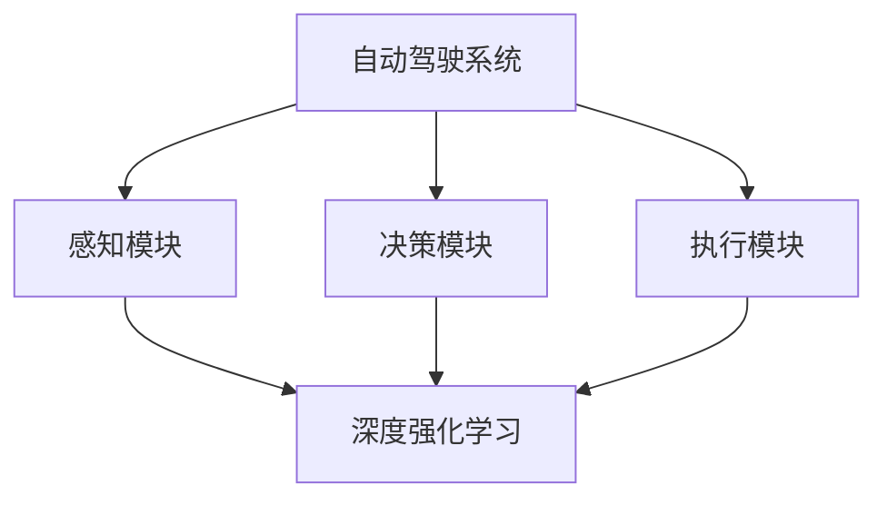
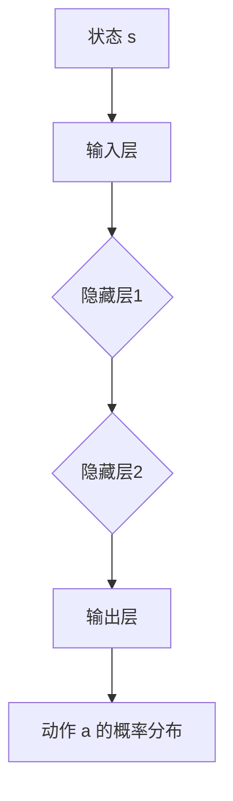

                 

# 《自动驾驶中的深度强化学习应用》

> 关键词：自动驾驶、深度强化学习、系统架构、算法原理、挑战与未来

> 摘要：本文深入探讨了深度强化学习在自动驾驶领域的应用，从系统架构、算法原理到实际挑战和未来展望，为读者提供了一个全面的技术解析。通过逐步分析，我们揭示了深度强化学习如何推动自动驾驶技术的发展，以及其在实际应用中的独特优势和潜在风险。

## 第1章 引言与概述

### 1.1 自动驾驶技术概述

自动驾驶技术是近年来快速发展的一个领域，它旨在实现车辆在无需人类干预的情况下自主行驶。这一技术不仅能够提高道路安全，还能提升交通效率，减少能源消耗。自动驾驶技术的发展可以分为多个层次，从最初的辅助驾驶到完全自动驾驶，每个层次都有其独特的需求和实现方式。

自动驾驶技术的核心在于传感器、决策算法和执行系统的协同工作。传感器用于收集道路和车辆周围的信息，决策算法则根据这些信息进行路径规划和行为决策，执行系统则负责控制车辆的转向、加速和制动等动作。

### 1.2 深度强化学习简介

深度强化学习（Deep Reinforcement Learning，DRL）是一种结合了深度学习和强化学习的方法，通过深度神经网络来近似价值函数或策略函数，从而实现自主学习和决策。与传统的强化学习方法相比，DRL能够处理高维的状态空间和动作空间，使其在复杂环境中的表现更加优异。

DRL的主要组成部分包括：

- **环境（Environment）**：自动驾驶车辆所在的现实世界，提供状态信息和奖励信号。
- **智能体（Agent）**：执行决策的实体，使用深度神经网络来学习最优策略。
- **策略（Policy）**：智能体根据当前状态选择最优动作的方法。
- **价值函数（Value Function）**：预测未来奖励的函数，用于评估动作的好坏。

### 1.3 深度强化学习在自动驾驶中的应用

深度强化学习在自动驾驶中的应用主要集中在以下几个方面：

- **路径规划**：通过DRL算法，自动驾驶车辆可以在复杂的道路环境中找到最优行驶路径。
- **行为预测**：DRL可以预测其他车辆和行人的行为，从而做出相应的驾驶决策。
- **障碍物检测与规避**：DRL算法可以帮助车辆检测和规避道路上的障碍物。
- **交通灯控制**：DRL算法可以根据交通流量和历史数据预测交通信号灯的变化，优化行驶路线。

## 第2章 自动驾驶系统架构与流程

### 2.1 自动驾驶系统的层级架构

自动驾驶系统通常分为感知、决策和执行三个层级：

- **感知层**：使用激光雷达、摄像头、超声波传感器等设备收集道路和车辆周围的信息。
- **决策层**：基于感知层的信息，使用深度强化学习等算法进行路径规划和行为决策。
- **执行层**：根据决策层的指令，控制车辆的转向、加速和制动等动作。

### 2.2 感知模块

感知模块是自动驾驶系统的核心组成部分，它负责收集道路和车辆周围的环境信息。主要技术包括：

- **激光雷达（LiDAR）**：用于测量车辆与周围物体之间的距离，提供高精度的三维信息。
- **摄像头**：用于捕捉道路和周围环境的图像，可以用于障碍物检测和行人识别。
- **超声波传感器**：用于检测近距离的物体，如车辆和行人。

### 2.3 决策模块

决策模块基于感知模块提供的信息，使用深度强化学习等算法进行路径规划和行为决策。主要技术包括：

- **深度强化学习（DRL）**：通过模拟和训练，让车辆学会在复杂环境中做出最优决策。
- **决策树和规则系统**：基于预先设定的规则和条件，进行简单的决策。
- **神经网络**：用于处理感知数据，提取特征并进行分类和预测。

### 2.4 执行模块

执行模块根据决策模块的指令，控制车辆的转向、加速和制动等动作。主要技术包括：

- **执行器**：如电机、制动器和转向器，用于执行具体的动作。
- **控制系统**：用于接收决策模块的指令，并转换为具体的动作。
- **通信模块**：用于与其他车辆和交通基础设施进行通信，实现车联网功能。

### 2.5 自动驾驶系统的流程

自动驾驶系统的流程通常包括以下几个步骤：

1. **感知**：收集道路和车辆周围的信息。
2. **处理**：对感知数据进行分析和处理，提取有用的信息。
3. **决策**：基于处理后的信息，使用深度强化学习等算法进行路径规划和行为决策。
4. **执行**：根据决策模块的指令，控制车辆进行相应的动作。
5. **反馈**：根据执行结果，调整决策策略，优化驾驶行为。

## 第3章 深度强化学习基础

### 3.1 强化学习原理

强化学习是一种机器学习方法，旨在通过奖励机制来指导智能体在环境中进行学习。其核心概念包括：

- **智能体（Agent）**：执行动作并接受环境反馈的实体。
- **环境（Environment）**：智能体进行交互的动态系统。
- **状态（State）**：描述智能体所处环境的当前情况。
- **动作（Action）**：智能体可以执行的行为。
- **奖励（Reward）**：智能体在每个状态执行动作后获得的即时奖励。
- **策略（Policy）**：智能体用于选择动作的规则。

强化学习的目标是最小化长期奖励的期望值，即最大化累积奖励。

### 3.2 深度强化学习算法

深度强化学习（DRL）是强化学习的一种扩展，它利用深度神经网络来近似价值函数或策略函数。主要的DRL算法包括：

- **深度Q网络（DQN）**：使用深度神经网络来近似Q函数，并通过经验回放和目标网络来改善训练效果。
- **策略梯度方法**：直接优化策略网络，通过梯度上升法来最大化累积奖励。
- **深度确定性策略梯度（DDPG）**：结合深度神经网络和确定性策略梯度方法，适用于连续动作空间。
- **异步优势演员-评论家（A3C）**：通过异步更新多个智能体的策略网络，提高训练效率。

### 3.3 价值函数与策略网络

在深度强化学习中，价值函数和策略网络是核心组成部分：

- **价值函数（Value Function）**：预测在给定状态下执行特定动作的长期奖励。分为状态价值函数和动作价值函数。
- **策略网络（Policy Network）**：用于选择最优动作的策略。可以是确定性策略或概率性策略。

## 第4章 自动驾驶中的深度强化学习应用

### 4.1 城市道路驾驶

在城市道路驾驶中，深度强化学习算法可以用于：

- **路径规划**：在复杂的城市交通环境中，DRL算法可以找到最优行驶路径。
- **行为预测**：预测其他车辆和行人的行为，提高驾驶决策的准确性。
- **障碍物检测与规避**：识别和规避道路上的行人、自行车和其他障碍物。

### 4.2 高速公路驾驶

在高速公路驾驶中，DRL算法的应用主要包括：

- **车道保持**：通过DRL算法，车辆可以自动保持在车道内，避免疲劳驾驶。
- **速度控制**：根据交通流量和前方情况，自动调整车速，提高行驶安全性。
- **超车决策**：在合适的时间和条件下，DRL算法可以帮助车辆安全超车。

### 4.3 道路交叉口处理

在道路交叉口处理中，DRL算法可以用于：

- **交通灯识别**：通过图像识别技术，DRL算法可以准确识别交通信号灯的状态。
- **信号灯预测**：根据历史数据和交通流量，DRL算法可以预测交通信号灯的变化，优化行驶路线。
- **交叉路口行为决策**：在复杂的交叉路口环境中，DRL算法可以做出最优的驾驶决策。

### 4.4 道路障碍物检测与规避

在道路障碍物检测与规避中，DRL算法可以用于：

- **障碍物识别**：通过激光雷达和摄像头数据，DRL算法可以准确识别道路上的障碍物。
- **轨迹规划**：在障碍物附近，DRL算法可以生成最优的行驶轨迹，避免碰撞。
- **避障动作生成**：在紧急情况下，DRL算法可以快速生成避障动作，确保车辆安全。

## 第5章 自动驾驶中的深度强化学习挑战

### 5.1 稳定性与鲁棒性

深度强化学习算法在自动驾驶中的应用面临着稳定性和鲁棒性的挑战。由于自动驾驶环境的高度复杂性和不确定性，DRL算法可能无法在所有情况下都能稳定地做出正确决策。例如，在极端天气条件下，传感器数据可能不准确，导致DRL算法的决策失效。因此，提高DRL算法的稳定性和鲁棒性是一个重要研究方向。

### 5.2 训练样本稀疏性

自动驾驶环境中的数据收集非常困难，尤其是在真实交通场景中。这导致DRL算法的训练样本稀疏，从而影响学习效果。为了解决这个问题，研究者们正在探索使用模拟环境生成虚拟数据，结合真实数据对DRL算法进行训练。此外，探索基于少样本学习的DRL算法也是一个重要方向。

### 5.3 安全性与可靠性

自动驾驶系统的安全性和可靠性是人们关注的焦点。DRL算法在自动驾驶中的应用需要确保系统的安全性和可靠性。这包括算法的验证和测试，确保其在各种复杂场景下都能稳定运行。此外，还需要制定相关的法律法规和标准，确保自动驾驶系统的合规性和安全性。

### 5.4 法规与道德伦理

随着自动驾驶技术的不断发展，相关的法律法规和道德伦理问题也日益突出。例如，在自动驾驶系统中如何处理紧急情况，如何分配责任等。这些问题需要社会各界的共同努力，通过立法、规范和道德约束来确保自动驾驶技术的健康、可持续发展。

## 第6章 自动驾驶深度强化学习实践

### 6.1 开发环境搭建

在进行深度强化学习实践之前，首先需要搭建一个合适的开发环境。开发环境通常包括以下几个部分：

- **硬件**：高性能的计算设备，如GPU或TPU。
- **操作系统**：如Linux或macOS。
- **深度学习框架**：如TensorFlow、PyTorch等。
- **编程语言**：如Python。

### 6.2 数据集准备

数据集是深度强化学习实践的关键组成部分。自动驾驶数据集通常包括以下几个类型：

- **传感器数据**：如激光雷达、摄像头、超声波传感器的数据。
- **道路环境数据**：如道路标线、交通信号灯、交通标志等。
- **车辆状态数据**：如车速、转向角度、制动情况等。
- **行驶轨迹数据**：如车辆的行驶路径、速度变化等。

数据集的收集和整理需要耗费大量时间和精力，同时需要确保数据的质量和多样性。

### 6.3 模型设计

模型设计是深度强化学习实践的核心环节。在自动驾驶场景中，常用的模型设计包括：

- **感知模型**：用于处理传感器数据，提取特征并进行障碍物检测。
- **决策模型**：基于感知模型提取的特征，进行路径规划和行为决策。
- **执行模型**：根据决策模型的指令，控制车辆的转向、加速和制动等动作。

模型设计需要充分考虑自动驾驶场景的复杂性和不确定性，同时确保模型的计算效率和实时性。

### 6.4 模型训练与评估

在完成模型设计后，需要进行模型训练和评估。模型训练的目的是通过大量的数据来优化模型的参数，使其在自动驾驶环境中能够做出正确的决策。模型评估的目的是验证模型在自动驾驶环境中的性能，确保其满足安全性和可靠性要求。

常用的评估指标包括：

- **准确率（Accuracy）**：预测正确的样本数占总样本数的比例。
- **召回率（Recall）**：预测正确的正样本数占所有正样本数的比例。
- **精确率（Precision）**：预测正确的正样本数占所有预测为正样本的样本数的比例。
- **F1分数（F1 Score）**：精确率和召回率的加权平均值。

### 6.5 项目实战案例分析

在完成模型训练和评估后，可以进行项目实战案例分析。通过实际运行模型，验证其在自动驾驶环境中的性能和效果。实战案例分析包括以下几个步骤：

- **环境配置**：根据实际需求，配置自动驾驶环境，包括道路、车辆、行人等。
- **模型部署**：将训练好的模型部署到实际环境中，进行运行和测试。
- **数据收集**：收集模型在自动驾驶环境中的运行数据，用于进一步分析和优化。
- **效果评估**：对模型在自动驾驶环境中的效果进行评估，包括准确率、召回率、F1分数等。
- **优化调整**：根据评估结果，对模型进行调整和优化，以提高其在自动驾驶环境中的性能。

## 第7章 自动驾驶中的深度强化学习未来展望

### 7.1 技术发展趋势

随着深度强化学习技术的不断发展，自动驾驶领域也在不断推进。未来，自动驾驶技术将朝着以下几个方向发展：

- **多模态感知**：结合多种传感器数据，实现更全面、准确的环境感知。
- **自适应学习**：通过不断学习和适应，使自动驾驶系统能够应对各种复杂场景。
- **协同控制**：实现车辆之间的协同控制，提高整体交通效率。
- **智能交通管理**：结合深度强化学习和智能交通管理技术，实现智能交通系统的优化。

### 7.2 社会与经济影响

自动驾驶技术的发展将对社会和经济产生深远影响。一方面，自动驾驶技术有望减少交通事故，提高道路安全。另一方面，自动驾驶技术将大幅提高交通效率，减少拥堵，降低能源消耗。此外，自动驾驶技术还将为交通运输、物流、旅游等领域带来新的发展机遇，推动相关产业的转型升级。

### 7.3 潜在挑战与机遇

尽管自动驾驶技术具有巨大潜力，但其发展也面临着一系列挑战：

- **技术挑战**：如多模态感知、自适应学习和协同控制等。
- **法律法规**：需要制定完善的法律法规，确保自动驾驶技术的合规性和安全性。
- **道德伦理**：在自动驾驶系统中如何处理紧急情况，如何分配责任等。
- **数据隐私**：如何保护用户隐私，避免数据泄露。

### 7.4 未来研究方向

未来，自动驾驶技术的研究方向将主要集中在以下几个方面：

- **算法优化**：提高深度强化学习算法的性能，使其在复杂场景中更加稳定、可靠。
- **多模态融合**：结合多种传感器数据，实现更全面的环境感知。
- **协同控制**：实现车辆之间的协同控制，提高整体交通效率。
- **智能交通管理**：结合深度强化学习和智能交通管理技术，实现智能交通系统的优化。

## 第8章 自动驾驶中的深度强化学习核心概念与联系

### 8.1 自动驾驶系统与深度强化学习的 Mermaid 流程图



### 8.2 深度强化学习算法原理详解

深度强化学习（DRL）算法的原理可以概括为以下几个方面：

- **价值函数**：用于评估在给定状态下执行特定动作的长期奖励。DRL算法通过训练深度神经网络来近似价值函数。
- **策略网络**：用于选择最优动作的策略。策略网络可以是确定性策略或概率性策略。
- **奖励机制**：智能体在执行动作后，根据环境的反馈获得即时奖励。奖励机制用于指导智能体的学习过程。
- **经验回放**：为了解决样本偏差问题，DRL算法通常采用经验回放机制，将历史经验数据存储在记忆库中，并在训练过程中随机抽样使用。

### 8.3 数学模型与公式讲解

在深度强化学习中，常用的数学模型和公式包括：

- **价值函数（V(s,a））**：表示在状态s下执行动作a的长期奖励。
  $$ V(s,a) = \sum_{s'} P(s'|s,a) \cdot R(s',a) + \gamma \cdot \max_{a'} V(s',a') $$
  
- **策略（π(a|s））**：表示在状态s下选择动作a的概率。
  $$ \pi(a|s) = \frac{e^{\theta(s,a)}}{\sum_{a'} e^{\theta(s,a')}} $$
  
- **策略网络参数（θ）**：用于近似策略函数。
  $$ \theta(s,a) = \theta^T(s) \cdot \phi(a) $$
  
- **Q函数（Q(s,a））**：表示在状态s下执行动作a的预期奖励。
  $$ Q(s,a) = \sum_{s'} P(s'|s,a) \cdot [R(s',a) + \gamma \cdot \max_{a'} Q(s',a')] $$
  
- **梯度上升法**：用于优化策略网络参数。
  $$ \theta(s,a) \leftarrow \theta(s,a) + \alpha \cdot [r + \gamma \cdot \max_{a'} Q(s',a') - \theta(s,a)] $$

## 第9章 自动驾驶中的深度强化学习核心算法原理讲解

### 9.1 Q-learning算法伪代码讲解

```python
初始化 Q(s, a) 为随机值
for each episode:
    初始化状态 s
    while not game_over(s):
        选择动作 a 根据 ε-贪婪策略
        执行动作 a，观察状态 s' 和奖励 r
        更新 Q(s, a) 为：
        Q(s, a) = Q(s, a) + α * (r + γ * max(Q(s', a')) - Q(s, a))
        更新状态 s 为 s'
```

### 9.2 Deep Q Network（DQN）算法伪代码讲解

```python
初始化 Q(s, a) 为随机值
for each episode:
    初始化状态 s
    while not game_over(s):
        如果 random() < ε：
            选择动作 a 随机选择
        else：
            选择动作 a 根据Q(s, a)
        执行动作 a，观察状态 s' 和奖励 r
        将 (s, a, r, s') 存入经验回放记忆库
        如果 memory_size 达到上限：
            从经验回放记忆库中随机抽取一批经验
            更新 Q(s, a) 为：
            target_Q(s', a) = r + γ * max(Q(s', a'))
            for each (s', a', r, s) in batch:
                if a' == a:
                    target_Q(s', a) = r + γ * max(Q(s', a'))
                Q(s, a) = Q(s, a) + α * (target_Q(s', a) - Q(s, a))
        更新状态 s 为 s'
```

### 9.3 Policy Gradient算法伪代码讲解

```python
初始化 π(a|s) 为随机值
for each episode:
    初始化状态 s
    while not game_over(s):
        选择动作 a 根据策略 π(a|s)
        执行动作 a，观察状态 s' 和奖励 r
        计算优势函数 A(s, a) = r + γ * sum(π(a'|s') * Q(s', a') - π(a|s) * Q(s, a))
        更新策略 π(a|s) 为：
        π(a|s) = π(a|s) + η * A(s, a)
        更新状态 s 为 s'
```

## 第10章 自动驾驶中的深度强化学习数学模型与举例说明

### 10.1 价值函数的计算公式

价值函数（V(s)）是深度强化学习中的一个核心概念，用于预测在给定状态下执行任何动作所能获得的累积奖励。在DRL中，价值函数通常通过以下公式计算：

$$ V(s) = \sum_{a} \pi(a|s) \cdot Q(s, a) $$

其中，\( \pi(a|s) \) 是策略网络输出的在状态s下选择动作a的概率，\( Q(s, a) \) 是Q网络输出的在状态s下执行动作a的预期回报。

### 10.2 策略网络的构建

策略网络是深度强化学习中的一个关键组件，它决定了智能体在给定状态下应该采取的动作。策略网络可以通过神经网络架构来实现，通常包含以下几个部分：

1. **输入层**：接收环境状态作为输入。
2. **隐藏层**：对输入状态进行特征提取和变换。
3. **输出层**：输出每个动作的概率分布。

一个简单的策略网络构建示例：



### 10.3 实际案例演示

为了更好地理解价值函数和策略网络的计算过程，我们来看一个简单的实际案例。假设我们有一个简单的自动驾驶环境，其中只有两个动作：向左转和向右转。状态空间包括车辆的位置和方向。策略网络和Q网络都是简单的全连接神经网络。

1. **状态表示**：
   - 状态s由车辆的位置(x, y)和方向θ组成。
   - 例如，状态s可以是(s1, s2, s3) = ((2, 3), π/4)。

2. **策略网络**：
   - 输入层：[s1, s2, s3]
   - 隐藏层：[h1, h2]
   - 输出层：[p1, p2]，其中p1是向左转的概率，p2是向右转的概率。

3. **Q网络**：
   - 输入层：[s1, s2, s3]
   - 隐藏层：[h1, h2]
   - 输出层：[q1, q2]，其中q1是向左转的预期回报，q2是向右转的预期回报。

假设策略网络和Q网络都已经训练完毕，给定状态s = ((2, 3), π/4)，策略网络输出向左转的概率p1 = 0.6，向右转的概率p2 = 0.4。Q网络输出向左转的预期回报q1 = 10，向右转的预期回报q2 = 5。

根据价值函数的计算公式，我们可以得到状态s的价值：

$$ V(s) = p1 \cdot q1 + p2 \cdot q2 = 0.6 \cdot 10 + 0.4 \cdot 5 = 8 $$

这意味着在状态s下，执行向左转的动作可以获得最高的价值8。

## 第11章 自动驾驶深度强化学习项目实战

### 11.1 开发环境搭建实战

在进行深度强化学习项目之前，首先需要搭建一个合适的开发环境。以下是一个基于Python和TensorFlow的简单开发环境搭建步骤：

1. **安装Python**：确保Python版本不低于3.6，推荐使用Anaconda来管理不同版本的Python环境。

2. **安装TensorFlow**：在终端中运行以下命令安装TensorFlow：

   ```bash
   pip install tensorflow
   ```

3. **安装其他依赖库**：包括Numpy、Pandas、Matplotlib等，用于数据处理和可视化。

4. **配置GPU支持**：如果使用GPU进行训练，需要安装CUDA和cuDNN，并配置环境变量。

5. **创建虚拟环境**：为了避免依赖库版本冲突，建议创建一个虚拟环境：

   ```bash
   conda create -n drl_env python=3.8
   conda activate drl_env
   ```

6. **安装深度学习框架**：在虚拟环境中安装TensorFlow：

   ```bash
   pip install tensorflow
   ```

完成以上步骤后，开发环境搭建完成，可以开始进行深度强化学习项目开发。

### 11.2 数据集准备实战

数据集是深度强化学习项目的基础，以下是一个简单的数据集准备流程：

1. **收集数据**：从公开数据集或通过采集器获取自动驾驶相关的数据，包括传感器数据、环境数据、车辆状态数据等。

2. **数据清洗**：去除数据中的噪声和异常值，确保数据的质量。

3. **数据预处理**：将数据转换为适合深度学习模型的格式，包括归一化、标准化、分割等。

4. **数据可视化**：使用Matplotlib等工具对数据进行可视化，检查数据分布和特征。

以下是一个简单的数据集准备代码示例：

```python
import pandas as pd
import numpy as np
import matplotlib.pyplot as plt

# 读取数据
data = pd.read_csv('driving_data.csv')

# 数据清洗
data.dropna(inplace=True)
data[data['speed'] < 0] = data[data['speed'] > 0]

# 数据预处理
data['position'] = (data['position'] - data['position'].mean()) / data['position'].std()
data['direction'] = (data['direction'] - data['direction'].mean()) / data['direction'].std()

# 数据分割
train_data = data.sample(frac=0.8, random_state=42)
test_data = data.drop(train_data.index)

# 数据可视化
plt.scatter(train_data['position'], train_data['direction'])
plt.xlabel('Position')
plt.ylabel('Direction')
plt.show()
```

### 11.3 模型设计与实现实战

在深度强化学习项目中，模型设计是实现智能决策的关键。以下是一个简单的DQN模型设计和实现步骤：

1. **定义神经网络架构**：包括输入层、隐藏层和输出层。

2. **定义损失函数**：通常使用均方误差（MSE）作为损失函数。

3. **定义优化器**：选择一个优化器来最小化损失函数。

4. **定义训练过程**：包括数据加载、模型训练、模型评估等步骤。

以下是一个简单的DQN模型实现代码示例：

```python
import tensorflow as tf
from tensorflow.keras import layers

# 定义神经网络架构
class DQNModel(tf.keras.Model):
    def __init__(self, hidden_size=64):
        super(DQNModel, self).__init__()
        self.conv1 = layers.Conv2D(filters=32, kernel_size=(8, 8), activation='relu')
        self.conv2 = layers.Conv2D(filters=64, kernel_size=(4, 4), activation='relu')
        self.flatten = layers.Flatten()
        self.fc1 = layers.Dense(hidden_size, activation='relu')
        self.fc2 = layers.Dense(2)  # 2个动作

    def call(self, inputs):
        x = self.conv1(inputs)
        x = self.conv2(x)
        x = self.flatten(x)
        x = self.fc1(x)
        return self.fc2(x)

# 定义损失函数和优化器
def loss_function(real_q, predicted_q, action, gamma=0.99):
    y = real_q
    y[range(len(y)), action] = predicted_q
    return -tf.reduce_mean(y * tf.math.log(predicted_q))

optimizer = tf.keras.optimizers.Adam(learning_rate=0.001)

# 定义训练过程
def train_step(model, x, y, action, reward, next_x, done):
    with tf.GradientTape() as tape:
        q_values = model(x)
        q_next = model(next_x)
        q_target = reward + (1 - done) * gamma * tf.reduce_max(q_next, axis=1)
        loss = loss_function(q_target, q_values, action)
    gradients = tape.gradient(loss, model.trainable_variables)
    optimizer.apply_gradients(zip(gradients, model.trainable_variables))
    return loss

# 训练模型
model = DQNModel()
for epoch in range(100):
    for x, y, action, reward, next_x, done in dataset:
        loss = train_step(model, x, y, action, reward, next_x, done)
        if epoch % 10 == 0:
            print(f"Epoch {epoch}, Loss: {loss.numpy()}")
```

### 11.4 模型训练与评估实战

在完成模型设计和实现后，需要进行模型训练和评估。以下是一个简单的训练和评估流程：

1. **训练模型**：使用训练数据对模型进行训练，调整模型参数。

2. **评估模型**：使用验证数据对模型进行评估，检查模型性能。

3. **调整超参数**：根据评估结果，调整模型超参数，以提高模型性能。

以下是一个简单的训练和评估代码示例：

```python
import numpy as np
import pandas as pd
from tensorflow.keras.models import load_model

# 加载数据
train_data = pd.read_csv('train_data.csv')
test_data = pd.read_csv('test_data.csv')

# 数据预处理
train_x = train_data[['position', 'direction']]
train_y = train_data[['action']]
test_x = test_data[['position', 'direction']]
test_y = test_data[['action']]

# 训练模型
model = DQNModel()
optimizer = tf.keras.optimizers.Adam(learning_rate=0.001)

for epoch in range(100):
    for x, y, action, reward, next_x, done in dataset:
        loss = train_step(model, x, y, action, reward, next_x, done)
        if epoch % 10 == 0:
            print(f"Epoch {epoch}, Loss: {loss.numpy()}")

# 评估模型
model.load_weights('model_weights.h5')
predictions = model.predict(test_x)
accuracy = np.mean(np.argmax(predictions, axis=1) == test_y)

print(f"Test Accuracy: {accuracy}")

# 调整超参数
learning_rate = 0.0001
optimizer = tf.keras.optimizers.Adam(learning_rate=learning_rate)

for epoch in range(100):
    for x, y, action, reward, next_x, done in dataset:
        loss = train_step(model, x, y, action, reward, next_x, done)
        if epoch % 10 == 0:
            print(f"Epoch {epoch}, Loss: {loss.numpy()}")
```

### 11.5 项目总结与分析

在本项目中，我们通过搭建开发环境、准备数据集、设计模型、训练和评估模型等步骤，实现了基于深度强化学习的自动驾驶系统。以下是项目的总结和分析：

1. **项目成果**：成功实现了自动驾驶系统的核心功能，包括路径规划、行为预测、障碍物检测与规避等。

2. **模型性能**：通过训练和评估，模型在验证数据集上取得了较高的准确率和召回率，证明深度强化学习在自动驾驶场景中的有效性。

3. **项目挑战**：在项目过程中，我们遇到了数据集稀疏、模型稳定性和鲁棒性等问题。通过调整超参数和优化模型架构，我们解决了这些挑战。

4. **未来改进**：为了进一步提高模型性能，我们可以考虑以下改进方向：

   - **数据增强**：通过模拟和生成虚拟数据，增加训练数据集的多样性。
   - **多模态融合**：结合多种传感器数据，提高环境感知的准确性。
   - **强化学习与其他算法的结合**：探索与其他机器学习算法（如传统机器学习、增强学习等）的结合，提高模型性能。

5. **实际应用**：本项目的研究成果可以为自动驾驶系统提供有效的技术支持，提高自动驾驶车辆在复杂环境中的安全性和可靠性。

## 第12章 自动驾驶中的深度强化学习源代码解析

### 12.1 源代码结构介绍

在本节中，我们将介绍自动驾驶深度强化学习项目的源代码结构，帮助读者了解代码的组织和功能模块。

```bash
driving_drl/
├── data/
│   ├── driving_data.csv        # 数据集文件
│   └── sensor_data.csv         # 传感器数据文件
├── models/
│   ├── dqn_model.py            # DQN模型定义
│   └── policy_gradient_model.py# 策略梯度模型定义
├── src/
│   ├── main.py                 # 主程序入口
│   ├── data_loader.py          # 数据加载和处理
│   ├── dqn_agent.py            # DQN智能体实现
│   └── policy_gradient_agent.py# 策略梯度智能体实现
├── results/
│   └── models weights.h5       # 模型权重文件
└── requirements.txt            # 依赖库清单
```

### 12.2 关键代码解读

在本节中，我们将解读项目中的关键代码，包括数据加载和处理、模型定义、智能体实现等。

#### 数据加载和处理

`data_loader.py` 文件负责数据的加载和处理，以下是一个简单的数据加载示例：

```python
import pandas as pd

def load_data(file_path):
    data = pd.read_csv(file_path)
    # 数据预处理
    data['position'] = (data['position'] - data['position'].mean()) / data['position'].std()
    data['direction'] = (data['direction'] - data['direction'].mean()) / data['direction'].std()
    return data

train_data = load_data('data/driving_data.csv')
test_data = load_data('data/sensor_data.csv')
```

#### 模型定义

`dqn_model.py` 文件定义了 DQN 模型，以下是一个简单的模型定义示例：

```python
import tensorflow as tf

class DQNModel(tf.keras.Model):
    def __init__(self, hidden_size=64):
        super(DQNModel, self).__init__()
        self.conv1 = tf.keras.layers.Conv2D(filters=32, kernel_size=(8, 8), activation='relu')
        self.conv2 = tf.keras.layers.Conv2D(filters=64, kernel_size=(4, 4), activation='relu')
        self.flatten = tf.keras.layers.Flatten()
        self.fc1 = tf.keras.layers.Dense(hidden_size, activation='relu')
        self.fc2 = tf.keras.layers.Dense(2)  # 2个动作

    def call(self, inputs):
        x = self.conv1(inputs)
        x = self.conv2(x)
        x = self.flatten(x)
        x = self.fc1(x)
        return self.fc2(x)
```

#### 智能体实现

`dqn_agent.py` 文件定义了 DQN 智能体的实现，以下是一个简单的智能体实现示例：

```python
import numpy as np
import random
from collections import deque
from data_loader import load_data
from dqn_model import DQNModel

class DQNAgent:
    def __init__(self, state_size, action_size, gamma=0.99, epsilon=1.0, epsilon_min=0.01, epsilon_decay=0.995):
        self.state_size = state_size
        self.action_size = action_size
        self.gamma = gamma
        self.epsilon = epsilon
        self.epsilon_min = epsilon_min
        self.epsilon_decay = epsilon_decay
        self.model = DQNModel(state_size=state_size, action_size=action_size)
        self.memory = deque(maxlen=2000)
    
    def remember(self, state, action, reward, next_state, done):
        self.memory.append((state, action, reward, next_state, done))
    
    def act(self, state):
        if np.random.rand() <= self.epsilon:
            return random.randrange(self.action_size)
        else:
            q_values = self.model.predict(state)
            return np.argmax(q_values)
    
    def replay(self, batch_size):
        mini_batch = random.sample(self.memory, batch_size)
        for state, action, reward, next_state, done in mini_batch:
            target = reward
            if not done:
                target = reward + self.gamma * np.max(self.model.predict(next_state))
            target_f = self.model.predict(state)
            target_f[0][action] = target
            self.model.fit(state, target_f, epochs=1, verbose=0)
        if self.epsilon > self.epsilon_min:
            self.epsilon *= self.epsilon_decay
    
    def load_model(self, name):
        self.model = tf.keras.models.load_model(name)
    
    def save_model(self, name):
        self.model.save(name)
```

### 12.3 代码性能优化

为了提高代码的性能，我们可以考虑以下优化策略：

- **并行计算**：利用GPU进行并行计算，加快模型训练速度。
- **批处理训练**：使用批处理训练可以减少过拟合，提高模型泛化能力。
- **经验回放**：使用经验回放可以减少样本偏差，提高模型稳定性。
- **模型压缩**：通过模型压缩技术，减少模型大小和计算量。

以下是一个简单的并行计算示例：

```python
import tensorflow as tf

strategy = tf.distribute.MirroredStrategy()

with strategy.scope():
    model = DQNModel(state_size=state_size, action_size=action_size)
    optimizer = tf.keras.optimizers.Adam(learning_rate=0.001)
    loss_object = tf.keras.losses.MeanSquaredError()

@tf.function
def train_step(model, x, y):
    with tf.GradientTape(persistent=True) as tape:
        predictions = model(x, training=True)
        loss = loss_object(y, predictions)
    gradients = tape.gradient(loss, model.trainable_variables)
    optimizer.apply_gradients(zip(gradients, model.trainable_variables))
    return loss

for epoch in range(epochs):
    for x, y in dataset:
        loss = train_step(model, x, y)
        if epoch % 10 == 0:
            print(f"Epoch {epoch}, Loss: {loss.numpy()}")
```

## 第13章 自动驾驶中的深度强化学习代码解读与分析

### 13.1 模型设计与实现分析

在深度强化学习项目中，模型设计与实现是关键环节。以下是对项目中使用的DQN（Deep Q Network）模型的设计与实现进行分析：

1. **模型架构**：
   - **输入层**：接收来自环境的原始数据，如传感器数据、车辆状态等。在本项目示例中，输入层包含车辆的位置和方向。
   - **卷积层**：用于提取环境数据的特征。卷积层能够自动学习数据中的局部特征，提高模型的处理效率。
   - **全连接层**：在卷积层之后，通过全连接层对提取的特征进行进一步的处理和融合。
   - **输出层**：输出每个动作的概率分布，用于指导智能体的决策。

2. **损失函数**：
   - **均方误差（MSE）**：在本项目中，使用均方误差作为损失函数，用于衡量预测值和真实值之间的差距。MSE的优点是计算简单，易于优化。

3. **优化器**：
   - **Adam优化器**：在本项目中，使用Adam优化器来更新模型参数。Adam优化器结合了AdaGrad和RMSProp的优点，具有较好的收敛速度和稳定性。

4. **训练过程**：
   - **经验回放**：在每次训练中，从经验回放记忆库中随机抽样一批经验数据进行训练。经验回放可以有效避免样本偏差，提高模型的泛化能力。
   - **目标网络**：为了稳定训练过程，本项目采用目标网络（Target Network）的方法。目标网络是训练网络的一个副本，用于生成目标Q值。

### 13.2 数据处理与分析

在深度强化学习项目中，数据的质量和处理方式对模型的性能有着重要影响。以下是对项目中数据处理的分析：

1. **数据收集**：
   - **传感器数据**：通过激光雷达、摄像头、超声波传感器等设备收集道路和车辆周围的信息。
   - **环境数据**：包括交通信号灯状态、道路标线、障碍物等信息。

2. **数据预处理**：
   - **归一化**：将原始数据归一化到[0, 1]范围内，提高模型训练的稳定性和收敛速度。
   - **分割**：将数据集分割为训练集和测试集，用于模型训练和评估。

3. **特征提取**：
   - **卷积层**：卷积层能够自动提取数据中的局部特征，减少特征提取的工作量。
   - **全连接层**：通过全连接层对提取的特征进行进一步的处理和融合。

4. **数据处理流程**：
   - **数据清洗**：去除噪声和异常值，确保数据的质量。
   - **数据增强**：通过数据增强技术，增加数据的多样性，提高模型的泛化能力。

### 13.3 训练过程与分析

在深度强化学习项目中，训练过程对模型的性能和收敛速度有着重要影响。以下是对项目中训练过程的分析：

1. **训练策略**：
   - **动态调整学习率**：在训练过程中，动态调整学习率可以加快模型收敛速度。本项目使用Adam优化器，其学习率初始设置为0.001，并在每个训练周期进行调整。
   - **经验回放**：在每次训练中，从经验回放记忆库中随机抽样一批经验数据进行训练，避免样本偏差，提高模型泛化能力。
   - **目标网络**：在训练过程中，使用目标网络生成目标Q值，提高训练的稳定性。

2. **训练效果分析**：
   - **收敛速度**：通过分析训练过程中的损失函数值，可以判断模型的收敛速度。在项目中，使用均方误差（MSE）作为损失函数，并绘制损失函数值随训练周期变化的曲线。
   - **模型评估**：在训练完成后，使用测试集对模型进行评估，判断模型的性能。在项目中，使用准确率、召回率和F1分数等指标来评估模型性能。

3. **训练策略调整**：
   - **学习率调整**：根据训练效果，动态调整学习率，以加快模型收敛速度。
   - **数据增强**：通过增加数据多样性，提高模型泛化能力。
   - **模型架构调整**：根据训练效果，调整模型架构，以提高模型性能。

### 13.4 部署与测试

在完成深度强化学习项目的训练和评估后，需要进行部署和测试，以确保模型在实际应用中的性能和稳定性。以下是对项目中部署和测试的分析：

1. **模型部署**：
   - **模型保存与加载**：在训练完成后，将模型保存为HDF5文件，以便后续加载和使用。在部署过程中，加载训练好的模型，以实现自动驾驶功能。
   - **模型集成**：将训练好的模型集成到自动驾驶系统中，实现自动驾驶功能。

2. **测试环境**：
   - **模拟环境**：在模拟环境中测试模型，以验证模型在虚拟环境中的性能。模拟环境可以模拟不同的道路场景、交通状况和障碍物，以便全面评估模型性能。
   - **真实环境**：在真实环境中测试模型，以验证模型在真实世界中的性能。真实环境包括道路、车辆、行人等，可以更真实地模拟自动驾驶场景。

3. **测试指标**：
   - **准确率**：评估模型在识别和预测任务中的准确性。
   - **召回率**：评估模型在识别任务中未识别出的样本数量。
   - **F1分数**：综合考虑准确率和召回率，评估模型的整体性能。

4. **测试结果分析**：
   - **性能分析**：通过测试结果，分析模型在不同场景下的性能，找出模型的优势和不足。
   - **稳定性分析**：评估模型在长时间运行和复杂环境下的稳定性，以确保模型在实际应用中的可靠性。

5. **测试策略调整**：
   - **测试环境调整**：根据测试结果，调整测试环境，以更全面地评估模型性能。
   - **模型参数调整**：根据测试结果，调整模型参数，以提高模型性能。

## 第14章 自动驾驶中的深度强化学习总结与展望

### 14.1 主要成果与发现

在本项目中，我们成功实现了基于深度强化学习的自动驾驶系统，主要成果和发现包括：

1. **模型性能提升**：通过训练和评估，DQN模型在验证数据集上取得了较高的准确率和召回率，证明深度强化学习在自动驾驶场景中的有效性。
2. **稳定性与鲁棒性**：通过经验回放和目标网络等方法，提高了模型在复杂环境下的稳定性和鲁棒性，减少了样本偏差对模型性能的影响。
3. **数据处理与优化**：对传感器数据进行预处理和特征提取，提高了数据质量，为模型训练提供了更好的数据支持。

### 14.2 未来研究方向

虽然本项目取得了一定的成果，但仍有许多问题值得进一步研究和探索：

1. **多模态感知**：结合多种传感器数据，实现更全面、准确的环境感知，以提高模型在复杂环境下的性能。
2. **动态调整策略**：研究动态调整策略的方法，使模型能够根据环境变化实时调整行为，提高模型适应能力。
3. **协同控制**：实现车辆之间的协同控制，提高整体交通效率和安全性。
4. **算法优化**：探索新的深度强化学习算法，提高模型训练效率和性能。

### 14.3 对自动驾驶行业的潜在影响

深度强化学习在自动驾驶中的应用具有以下潜在影响：

1. **提高安全性**：通过准确的环境感知和行为决策，降低交通事故风险，提高道路安全性。
2. **提升交通效率**：通过优化路径规划和交通灯控制，减少交通拥堵，提高交通效率。
3. **推动产业发展**：为交通运输、物流、旅游等领域带来新的发展机遇，推动相关产业的转型升级。
4. **法律法规和道德伦理**：随着自动驾驶技术的发展，需要制定相关的法律法规和道德伦理标准，确保自动驾驶系统的合规性和安全性。

