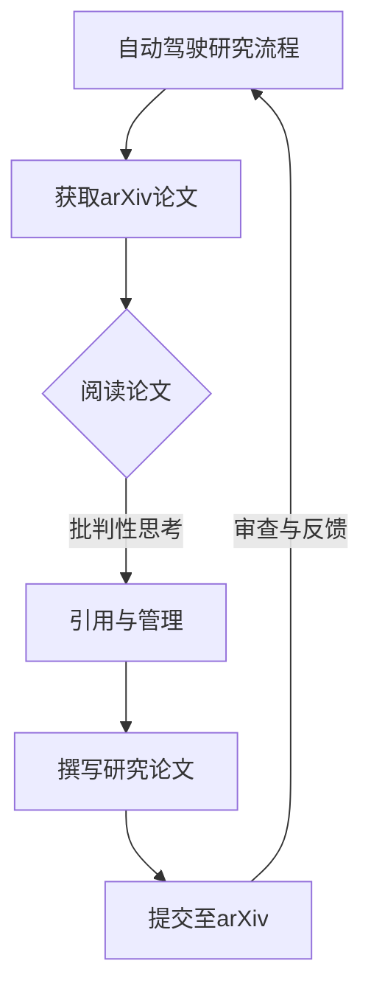

                 

# 自动驾驶研究者必读的arXiv使用攻略与技巧

> 关键词：自动驾驶、arXiv、搜索技巧、论文阅读、引用管理、论文发布、伦理与法律问题、未来展望

> 摘要：本文旨在为自动驾驶研究者提供一套详尽的arXiv使用攻略与技巧，从注册、登录、搜索到论文阅读、引用、发布，全面解析arXiv的使用方法，帮助研究者高效利用这一学术资源平台，提升研究效率与质量。

## 第一部分：自动驾驶研究者必读的arXiv使用攻略与技巧

### 第1章：引言

#### 1.1 自动驾驶技术的背景与arXiv的重要性

##### 1.1.1 自动驾驶技术的定义与当前发展状况

自动驾驶技术是指通过计算机视觉、传感器技术、人工智能和机器学习等技术，实现车辆在复杂环境中的自主驾驶。当前，自动驾驶技术正处于快速发展的阶段，各大科技公司和研究机构纷纷投入大量资源进行研究和开发。例如，特斯拉的自动驾驶系统已经在某些地区实现了部分自动驾驶功能，谷歌的Waymo则在自动驾驶出租车领域取得了重要进展。

##### 1.1.2 arXiv在自动驾驶研究中的重要性

arXiv是一个由康奈尔大学运营的开放获取电子预印本服务器，涵盖了物理学、数学、计算机科学、统计学、量子信息等多个领域。在自动驾驶研究中，arXiv的重要性主要体现在以下几个方面：

1. **获取最新研究动态**：arXiv的快速发布机制使得研究者可以及时获取最新的研究成果和进展，有助于跟上研究前沿。
2. **资源丰富**：arXiv上发表了大量的自动驾驶相关论文，为研究者提供了丰富的文献资源。
3. **开放获取**：arXiv的开放获取性使得研究论文免费且易于获取，有助于促进学术交流和合作。

##### 1.1.3 arXiv的使用概况

arXiv自1991年成立以来，已经发展成为全球最重要的学术资源之一。它拥有超过170万个预印本，每日有数千次下载和数百万次的浏览量。arXiv不仅为科学研究提供了重要的支持，也为学术界和工业界之间的知识共享和合作搭建了桥梁。

#### 1.2 书籍目的与读者对象

##### 1.2.1 书籍目的

本文的目的是帮助自动驾驶研究者高效利用arXiv进行研究和学习，提升研究效率和质量。具体包括：

1. **指导arXiv的使用**：介绍arXiv的基本使用方法，包括注册、登录、搜索、论文阅读、引用管理等。
2. **提升搜索技能**：教授如何利用arXiv的高级搜索功能，提高论文检索的准确性和效率。
3. **论文质量评估**：介绍如何评估arXiv上的论文质量，确保研究者能够选择合适的研究资源。
4. **论文发布指南**：为研究者提供论文发布到arXiv的详细步骤和注意事项。

##### 1.2.2 读者对象

本文适合以下读者群体：

1. 自动驾驶研究者：通过本文，研究者可以掌握arXiv的基本使用方法，提高文献检索能力，更好地跟踪研究前沿。
2. 自动驾驶工程师：本文提供了实用的arXiv使用技巧，帮助工程师在项目中快速查找相关技术文献，解决实际问题。
3. 自动驾驶学生：本文适合本科生、研究生和博士生，帮助他们掌握arXiv的使用方法，为学术研究和项目实践提供支持。

#### 1.3 本书结构

本书共分为9章，内容涵盖arXiv的基本使用方法、论文阅读技巧、论文质量评估、引用技巧、论文发布指南、伦理与法律问题、未来展望等。

- 第1章：引言，介绍自动驾驶技术的背景与arXiv的重要性，明确书籍目的与读者对象。
- 第2章：arXiv基本使用方法，介绍arXiv的注册、登录、搜索技巧和论文检索与筛选。
- 第3章：arXiv论文阅读技巧，介绍论文阅读策略、引用管理和论文写作技巧。
- 第4章：arXiv论文质量评估，介绍论文质量指标、评估方法和评估工具。
- 第5章：arXiv论文引用技巧，介绍引用目的、引用格式和引用注意事项。
- 第6章：arXiv论文发布指南，介绍论文提交前的准备、提交流程和发布后的持续关注。
- 第7章：案例分析，通过成功和失败案例总结发布论文的技巧。
- 第8章：arXiv使用的伦理与法律问题，介绍伦理问题和法律问题，包括版权声明、隐私保护和侵权责任。
- 第9章：未来展望，探讨arXiv的发展趋势和自动驾驶研究的未来发展。

## 第二部分：arXiv基本使用方法

### 第2章：arXiv基本使用方法

#### 2.1 注册与登录

##### 2.1.1 注册arXiv账户

要开始使用arXiv，首先需要注册一个账户。以下是注册的步骤：

1. 访问arXiv官网（[https://arxiv.org/](https://arxiv.org/)）。
2. 在页面右上角点击“Register”按钮。
3. 填写注册表单，包括用户名、电子邮件地址、密码等。
4. 点击“Register”按钮提交表单。
5. 验证电子邮件地址，点击邮件中的验证链接完成注册。

##### 2.1.2 登录arXiv网站

注册完成后，可以通过以下步骤登录arXiv：

1. 访问arXiv官网。
2. 在页面右上角点击“Login”按钮。
3. 输入注册时设置的电子邮件地址和密码。
4. 点击“Login”按钮进入个人账户。

##### 2.1.3 账户信息设置

登录后，可以进入账户设置页面，管理个人信息：

1. 在个人账户页面点击“Account”。
2. 查看和编辑个人信息，如姓名、电子邮件地址、密码等。
3. 设置邮件通知，选择接收论文推送、订阅更新等通知。
4. 保存修改，完成账户信息设置。

#### 2.2 搜索技巧

##### 2.2.1 搜索界面介绍

arXiv的搜索界面简单而强大，以下是搜索界面各部分的功能：

- **搜索框**：用于输入关键词。
- **搜索选项**：包括全文搜索、标题搜索、摘要搜索、作者搜索等。
- **排序选项**：可以根据相关度、发布日期、引用次数等进行排序。
- **筛选选项**：可以根据分类、关键词、作者等进行筛选。

##### 2.2.2 高效搜索策略

以下是一些高效搜索策略：

- **使用精确关键词**：使用精确关键词进行搜索，提高搜索结果的准确性。
- **组合关键词**：使用逻辑运算符（AND、OR、NOT）组合多个关键词，进行精确搜索。
- **利用引号**：使用引号进行短语搜索，确保搜索结果包含特定短语。
- **利用高级搜索**：使用高级搜索功能，如分类、关键词、作者等，进行更精确的搜索。

#### 2.3 论文检索与筛选

##### 2.3.1 检索结果解读

在arXiv上进行搜索后，会得到一系列检索结果。以下是解读检索结果的一些要点：

- **标题**：简洁明了的标题，反映论文的主要内容。
- **作者**：论文的作者列表，包括主要贡献者。
- **发布日期**：论文的发布日期，便于了解研究成果的时间线。
- **摘要**：论文的摘要，是对论文主要内容和结论的简要概述。

##### 2.3.2 论文筛选技巧

在大量检索结果中，以下是一些有效的筛选技巧：

- **快速浏览摘要**：通过快速浏览摘要，可以初步判断论文的关联性和重要性。
- **作者与机构筛选**：根据研究领域和知名作者进行筛选，关注领域内的重要研究成果。
- **引用次数分析**：查看论文的引用次数，了解其在学术界的接受程度和影响力。

### 第3章：arXiv论文阅读技巧

#### 3.1 阅读策略

##### 3.1.1 阅读流程

有效的阅读策略包括以下步骤：

1. **阅读前准备**：确定阅读目标，了解论文的主题和目的。
2. **快速阅读**：先阅读标题、摘要和结论，了解论文的基本内容。
3. **深入阅读**：详细阅读引言、方法、结果和讨论部分，理解研究细节和实验结果。
4. **总结反思**：整理阅读笔记，总结论文的主要观点和对自己的启示。

##### 3.1.2 阅读障碍与解决

在阅读过程中可能会遇到以下障碍：

- **难懂术语**：查阅相关文献或在线词典，了解术语的定义和背景。
- **复杂公式**：仔细阅读公式，理解其推导过程和含义。
- **引用文献**：查阅引用文献，理解论文的理论基础和研究背景。

##### 3.1.3 阅读记录与总结

有效的阅读记录与总结包括：

- **记录关键信息**：记录论文的关键观点、方法、结果和结论。
- **记录疑问与启发**：记录对论文的疑问和启发，以便后续进一步研究。
- **编写总结文档**：整理阅读笔记，编写总结文档，巩固学习成果。

### 第4章：arXiv论文质量评估

#### 4.1 论文质量指标

##### 4.1.1 学术影响力

- **引用次数**：论文被其他研究者引用的次数，是衡量论文学术影响力的重要指标。
- **下载次数**：论文被用户下载的次数，反映论文的关注度和受欢迎程度。

##### 4.1.2 研究价值

- **创新点**：论文提出的创新性观点、方法或技术，是衡量研究价值的重要依据。
- **实用性**：论文的研究成果是否具有实际应用价值，对自动驾驶技术的进步具有重要意义。

#### 4.2 评估方法

##### 4.2.1 初步筛选

- **摘要和关键词筛选**：通过快速阅读摘要和关键词，判断论文是否符合研究需求。
- **作者和机构筛选**：根据研究领域和知名作者进行筛选，关注领域内的重要研究成果。

##### 4.2.2 深入评估

- **论文结构评估**：评估论文的结构是否清晰、逻辑严密，有助于更好地理解研究内容和成果。
- **实验方法评估**：评估实验方法是否科学、合理，实验结果是否可靠、具有说服力。

##### 4.2.3 学术影响力评估

- **引用次数分析**：分析论文在学术界的引用情况，了解其在学术界的接受程度和影响力。
- **下载次数分析**：分析论文的下载情况，了解其在用户中的受欢迎程度。

### 第5章：arXiv论文引用技巧

#### 5.1 引用目的

##### 5.1.1 支持观点

- 引用其他研究者的成果，支持自己的观点和结论，增强论点的可信度和说服力。

##### 5.1.2 源自创新

- 引用先驱工作，为自己的创新提供理论依据和技术支持，展现研究的延续性和发展性。

#### 5.2 引用格式

##### 5.2.1 符合学术规范

- 根据不同的引用风格，如APA、MLA、Chicago等，遵循相应的引用格式要求。

##### 5.2.2 引用实例

- 提供不同引用风格的示例，帮助读者正确引用文献。

#### 5.3 引用注意事项

##### 5.3.1 避免抄袭

- 正确区分引用和原创内容，避免抄袭行为，确保学术诚信。

##### 5.3.2 引用正确性

- 确保引用信息的准确无误，包括作者姓名、论文标题、出版年份等。

### 第6章：arXiv论文发布指南

#### 6.1 提交论文前的准备

##### 6.1.1 论文格式

- arXiv对论文格式的要求：
  - **文件格式**：通常为PDF格式。
  - **结构要求**：包括标题、作者、摘要、引言、方法、结果、讨论和参考文献等部分。
  - **字体和排版**：遵循arXiv的排版规范，确保清晰可读。

##### 6.1.2 论文审阅

- **审稿人的选择**：
  - 选择具有相关领域背景和研究经验的审稿人。
  - 与审稿人保持良好的沟通，确保审稿过程的顺利进行。

- **修改意见的处理**：
  - 认真阅读审稿人的意见，进行详细分析和思考。
  - 根据审稿人的意见进行修订，完善论文内容和结构。

#### 6.2 论文提交流程

##### 6.2.1 注册arXiv账户

- 如果尚未注册arXiv账户，需要先进行注册。
  - 访问arXiv官网，点击“Register”按钮。
  - 填写注册表单，包括用户名、电子邮件地址、密码等信息。
  - 完成电子邮件验证，注册成功。

##### 6.2.2 提交论文

- 提交论文的步骤：
  - 登录arXiv账户，进入“Submit a New Article”页面。
  - 选择论文的分类和类别。
  - 上传论文PDF文件，并填写必要的信息，如标题、作者、摘要等。
  - 提交论文，等待审稿人审阅。

##### 6.2.3 修改与更新

- 审稿人审阅论文后，根据审稿意见进行修改。
- 更新论文PDF文件，重新提交至arXiv。
- 重复审稿和修改过程，直至论文通过审稿。

#### 6.3 论文发布后

##### 6.3.1 反馈与交流

- 关注论文的引用情况，了解其在学术界的影响。
- 参与学术讨论，与同行交流研究成果，提高论文的曝光度。

##### 6.3.2 持续关注

- 跟进论文的后续研究，包括实验验证和应用推广。
- 定期更新论文，反映研究进展和成果。
- 在arXiv上发布新的研究成果，拓展研究领域。

### 第7章：案例分析

#### 7.1 成功案例

- 成功论文的发布与影响力分析：
  - 成功论文通常具有创新性、实用性和高质量的实验结果。
  - 成功论文在学术圈内受到广泛关注，引用次数较高。
  - 成功论文对相关领域的研究产生积极影响，推动技术进步。

#### 7.2 失败案例

- 论文被拒原因分析：
  - 论文质量不高：研究方法不够科学、实验结果不够可靠、论文结构混乱。
  - 选题不合适：论文选题过于狭窄、缺乏创新性、不符合arXiv的发布要求。
  - 引用不规范：引用文献格式错误、引用不当、存在抄袭嫌疑。

##### 7.3 经验总结

- 提高论文质量：注重研究方法、实验设计和论文结构的规范性。
- 确保论文选题的创新性和实用性。
- 遵循arXiv的发布要求，确保引用规范、格式正确。
- 积极与同行交流，了解研究领域的前沿动态。

### 第8章：arXiv使用的伦理与法律问题

#### 8.1 伦理问题

##### 8.1.1 独立研究

- 研究者应遵循独立研究的伦理原则，不依赖他人的研究成果进行抄袭或剽窃。
- 研究者应自主完成研究工作，确保研究成果的原创性和真实性。

##### 8.1.2 数据共享

- 研究者应遵循数据共享的伦理原则，共享研究数据，促进学术交流和合作。
- 数据共享应遵循隐私保护原则，确保研究参与者的隐私不被泄露。

#### 8.2 法律问题

##### 8.2.1 版权声明

- 研究者应在论文中明确声明所引用的图片、数据等资源的版权归属。
- 研究者应遵守版权法的规定，不得侵犯他人的著作权。

##### 8.2.2 隐私保护

- 研究者应在研究过程中遵守隐私保护原则，确保研究参与者的个人信息不被泄露。
- 研究者应获得研究参与者的知情同意，明确告知研究目的和隐私保护措施。

##### 8.2.3 侵权责任

- 研究者应遵守法律法规，不得侵犯他人的知识产权和其他合法权益。
- 研究者若违反法律，应承担相应的法律责任，包括民事责任和刑事责任。

### 第9章：未来展望

#### 9.1 arXiv的发展趋势

##### 9.1.1 技术创新

- AI在arXiv中的应用：随着人工智能技术的发展，arXiv可能会引入更多智能搜索和评估工具，提高文献检索和分析的效率。
- 量子信息：量子信息领域的研究成果在arXiv上的发布将越来越多，推动量子计算和量子通信等领域的发展。

##### 9.1.2 研究模式变革

- 研究模式的变革：arXiv可能会推动更开放和协作的研究模式，促进学术交流和合作，加快科学研究的进展。

#### 9.2 自动驾驶研究的未来发展

##### 9.2.1 自动驾驶技术的进步

- 自动驾驶技术的进步：随着传感器、计算力和人工智能技术的不断提升，自动驾驶技术将在安全性和可靠性方面取得更大的突破。
- 自动驾驶技术在各领域的应用：自动驾驶技术将在交通、物流、无人驾驶飞机等领域得到更广泛的应用。

##### 9.2.2 arXiv在自动驾驶研究中的作用

- arXiv在自动驾驶研究中的重要作用：arXiv将继续作为自动驾驶研究的核心学术资源，为研究者提供最新的研究动态和成果。
- arXiv对自动驾驶研究的长期影响：arXiv将推动自动驾驶技术的发展，促进学术交流和合作，为自动驾驶技术的创新和进步提供支持。

### 附录A：arXiv常用工具与资源

##### A.1 搜索工具

- **arXiv搜索技巧**：
  - 使用关键词组合进行精确搜索。
  - 利用高级搜索功能，如分类、关键词、作者等。
  - 使用引号进行短语搜索。

##### A.2 引用管理工具

- **常用引用管理软件介绍**：
  - **EndNote**：一款功能强大的引用管理软件，支持多种引用格式。
  - **Zotero**：一款免费开源的引用管理软件，适用于个人和学术团队。
  - **Mendeley**：一款免费的学术工具，提供文献管理、笔记和协作功能。

### 核心算法原理讲解：

#### 2.1.3 arXiv搜索算法原理

arXiv的搜索算法基于全文索引和自然语言处理技术，其核心目的是为了提供高相关性的搜索结果。以下是arXiv搜索算法的原理：

1. **全文索引**：arXiv使用全文索引技术，将所有论文的标题、摘要和正文内容建立索引，以便快速检索。全文索引使得搜索系统能够对输入的关键词进行快速匹配和排序。

2. **关键词权重分配**：在搜索过程中，arXiv会对关键词进行权重分配。权重分配算法通常采用TF-IDF（Term Frequency-Inverse Document Frequency）模型。TF-IDF模型通过计算每个关键词在文档中的频率以及其在整个数据集中的逆向文档频率来衡量关键词的重要性。公式如下：

   $$
   w_t(d) = \frac{f_t(d) \cdot \log(\frac{N}{df_t})}{k}
   $$

   其中，$w_t(d)$ 是关键词 $t$ 在文档 $d$ 中的权重，$f_t(d)$ 是关键词 $t$ 在文档 $d$ 中的频率，$N$ 是文档总数，$df_t$ 是包含关键词 $t$ 的文档数，$k$ 是常数。

3. **搜索结果排序**：搜索算法会将所有匹配的文档按照权重进行排序，权重越高，排序越靠前。排序公式如下：

   $$
   S_d = \sum_{t \in T_d} w_t(d)
   $$

   其中，$S_d$ 是文档 $d$ 的总权重，$T_d$ 是文档 $d$ 中包含的关键词集合。

4. **筛选和排序**：在搜索结果中，可以进一步使用筛选和排序选项。筛选选项可以根据分类、关键词、作者等条件对搜索结果进行过滤。排序选项可以根据相关度、发布日期、引用次数等进行排序。

以下是一个简单的伪代码示例，展示了如何使用arXiv的搜索算法进行搜索：

```python
def search_arXiv(keywords, filters):
    query = construct_query(keywords, filters)
    results = arXiv_search(query)
    ranked_results = rank_results(results)
    return ranked_results

def construct_query(keywords, filters):
    query_parts = []
    for keyword in keywords:
        query_parts.append({"match": {"_all": keyword}})
    if filters:
        for filter in filters:
            if filter["type"] == "author":
                query_parts.append({"term": {"author.name": filter["value"]}})
            elif filter["type"] == "category":
                query_parts.append({"term": {"categories": filter["value"]}})
    query = {"bool": {"must": query_parts}}
    return query

def rank_results(results):
    ranked_results = []
    for result in results:
        score = calculate_score(result)
        ranked_results.append((result, score))
    ranked_results.sort(key=lambda x: x[1], reverse=True)
    return [result[0] for result in ranked_results]

def calculate_score(result):
    score = 0
    for term in result["terms"]:
        score += term["weight"]
    return score
```

### 数学模型和数学公式详细讲解：

#### 3.2.3 常见的搜索算法分析

搜索算法的目标是优化搜索结果的相关性和准确性。以下是一个简单的搜索算法分析，包括相关性得分计算和TF-IDF算法的详细解释。

##### 相关性得分

搜索算法通常使用相关性得分来衡量搜索结果的优劣。相关性得分可以通过以下公式计算：

$$
\text{相关性得分} = \frac{\text{相关性得分}}{\text{文档长度}}
$$

其中，`相关性得分`是关键词在文档中的权重之和，`文档长度`是文档中所有关键词的权重之和。

##### 关键词权重

关键词的权重可以通过TF-IDF算法计算得到。TF-IDF算法的公式如下：

$$
w_t(d) = \frac{f_t(d) \cdot \log(\frac{N}{df_t})}{k}
$$

其中，$w_t(d)$ 是关键词 $t$ 在文档 $d$ 中的权重，$f_t(d)$ 是关键词 $t$ 在文档 $d$ 中的频率，$N$ 是文档总数，$df_t$ 是包含关键词 $t$ 的文档数，$k$ 是常数。

##### 实例

假设有一个包含三个文档的文档集合，每个文档包含以下关键词：

文档1：{"自动驾驶", "深度学习", "安全"}
文档2：{"自动驾驶", "安全", "传感器"}
文档3：{"深度学习", "传感器", "边缘计算"}

我们使用TF-IDF算法计算关键词的权重。

1. 计算关键词的频率：

   - 自动驾驶：文档1和文档2中有，频率为2。
   - 深度学习：文档1和文档3中有，频率为2。
   - 安全：文档1、文档2和文档3中有，频率为3。
   - 传感器：文档2和文档3中有，频率为2。
   - 边缘计算：文档3中有，频率为1。

2. 计算关键词的TF-IDF权重：

   - 自动驾驶：$w_{\text{自动驾驶}}(d_1) = \frac{2 \cdot \log(\frac{3}{2})}{1} = 2.19$
   - 深度学习：$w_{\text{深度学习}}(d_1) = \frac{2 \cdot \log(\frac{3}{2})}{1} = 2.19$
   - 安全：$w_{\text{安全}}(d_1) = \frac{3 \cdot \log(\frac{3}{3})}{1} = 0$
   - 传感器：$w_{\text{传感器}}(d_2) = \frac{2 \cdot \log(\frac{3}{2})}{1} = 2.19$
   - 边缘计算：$w_{\text{边缘计算}}(d_3) = \frac{1 \cdot \log(\frac{3}{1})}{1} = 1.10$

3. 计算文档的TF-IDF权重：

   - 文档1：$S_{d1} = w_{\text{自动驾驶}}(d_1) + w_{\text{深度学习}}(d_1) + w_{\text{安全}}(d_1) = 4.38$
   - 文档2：$S_{d2} = w_{\text{自动驾驶}}(d_2) + w_{\text{安全}}(d_2) + w_{\text{传感器}}(d_2) = 4.38$
   - 文档3：$S_{d3} = w_{\text{深度学习}}(d_3) + w_{\text{传感器}}(d_3) + w_{\text{边缘计算}}(d_3) = 3.29$

### 项目实战：

#### 4.1.3 arXiv搜索工具开发

##### 开发环境：

- **Python 3.8**
- **Flask 1.1.1**
- **Elasticsearch 7.10.0**

##### 实现步骤：

1. **环境搭建**：

   安装Python 3.8和必要的库：

   ```bash
   pip install flask
   pip install elasticsearch
   ```

2. **Elasticsearch索引配置**：

   配置Elasticsearch索引，以便存储arXiv的论文数据。以下是一个简单的Elasticsearch索引模板：

   ```json
   {
       "settings": {
           "number_of_shards": 1,
           "number_of_replicas": 0
       },
       "mappings": {
           "properties": {
               "title": { "type": "text" },
               "authors": { "type": "text" },
               "abstract": { "type": "text" },
               "categories": { "type": "text" },
               "score": { "type": "float" }
           }
       }
   }
   ```

3. **Flask应用搭建**：

   创建一个Flask应用，搭建基本的搜索接口。

   ```python
   from flask import Flask, request, jsonify
   from elasticsearch import Elasticsearch

   app = Flask(__name__)
   es = Elasticsearch("localhost:9200")

   @app.route('/search', methods=['GET'])
   def search():
       keywords = request.args.get('keywords', '')
       filters = request.args.to_dict(flat=False)
       results = search_arXiv(keywords, filters)
       return jsonify(results)

   def search_arXiv(keywords, filters):
       query = construct_query(keywords, filters)
       response = es.search(index="arxiv", body={"query": query})
       ranked_results = rank_results(response['hits']['hits'])
       return ranked_results

   def construct_query(keywords, filters):
       query_parts = []
       for keyword in keywords:
           query_parts.append({"match": {"_all": keyword}})
       if filters:
           for filter in filters:
               if filter[0] == "author":
                   query_parts.append({"term": {"authors": filter[1]}})
               elif filter[0] == "category":
                   query_parts.append({"term": {"categories": filter[1]}})
       query = {"bool": {"must": query_parts}}
       return query

   def rank_results(results):
       ranked_results = []
       for result in results:
           score = result['_source']['score']
           ranked_results.append((result['_source'], score))
       ranked_results.sort(key=lambda x: x[1], reverse=True)
       return [result[0] for result in ranked_results]

   if __name__ == '__main__':
       app.run(debug=True)
   ```

4. **搜索接口开发**：

   实现搜索接口，接受GET请求，处理搜索逻辑。

5. **测试与部署**：

   在本地环境中测试搜索接口，确保功能正常。随后，可以部署到服务器上供用户使用。

##### 代码解读与分析：

- **Flask应用搭建**：使用Flask框架创建一个简单的Web应用，提供搜索接口。

- **Elasticsearch连接**：通过Elasticsearch库连接到本地Elasticsearch服务器，用于存储和检索论文数据。

- **搜索接口开发**：创建一个GET请求接口，接受关键词和过滤器参数，调用搜索函数获取搜索结果，并返回JSON格式的响应。

- **搜索算法实现**：使用Elasticsearch的match查询实现全文搜索，并使用TF-IDF算法对搜索结果进行排序。

- **测试与部署**：在本地环境中测试搜索接口，确保功能正常。随后，可以部署到服务器上供用户使用。

### 第1章：引言

##### 1.1 自动驾驶技术的背景与arXiv的重要性

###### 1.1.1 自动驾驶技术的定义与当前发展状况

自动驾驶技术是指利用计算机视觉、传感器技术、人工智能和机器学习等技术，使车辆在无需人类干预的情况下，自动执行驾驶任务的技术。自动驾驶技术不仅能够提高驾驶安全性，减少交通事故，还能有效降低交通拥堵和碳排放。

当前，自动驾驶技术正处于快速发展阶段，各行业纷纷投入大量资源进行研究和开发。自动驾驶技术按照自动化程度可以分为以下几个级别：

- **L0级（无自动化）**：驾驶任务完全由人类驾驶员完成。
- **L1级（单一功能自动化）**：车辆具备部分自动化功能，如自适应巡航控制或车道保持。
- **L2级（部分自动化）**：车辆具备部分自动驾驶功能，如自动泊车或自动变道。
- **L3级（有条件自动化）**：车辆在特定环境下能够完全接管驾驶任务，但需要驾驶员在必要时进行干预。
- **L4级（高度自动化）**：车辆在特定环境下能够完全自动驾驶，无需驾驶员干预。
- **L5级（完全自动化）**：车辆在所有环境下都能够完全自动驾驶，无需驾驶员干预。

目前，自动驾驶技术已从理论研究走向实际应用，多个公司和研究机构已经在自动驾驶领域取得了重大突破。例如，特斯拉的自动驾驶系统已经在某些地区实现了L3级别的自动驾驶功能，谷歌的Waymo则推出了L4级别的自动驾驶出租车服务。此外，许多汽车制造商也在积极研发自动驾驶技术，计划在未来几年内实现自动驾驶汽车的量产。

###### 1.1.2 arXiv在自动驾驶研究中的重要性

arXiv是一个由康奈尔大学运营的开放获取电子预印本服务器，涵盖了物理学、数学、计算机科学、统计学、量子信息等多个领域。在自动驾驶研究中，arXiv的重要性体现在以下几个方面：

1. **获取最新研究动态**：arXiv的快速发布机制使得研究者可以及时获取最新的研究成果和进展，有助于跟上研究前沿。
2. **资源丰富**：arXiv上发表了大量的自动驾驶相关论文，为研究者提供了丰富的文献资源。
3. **开放获取**：arXiv的开放获取性使得研究论文免费且易于获取，有助于促进学术交流和合作。

自动驾驶技术是一个高度跨学科的研究领域，涉及计算机科学、电子工程、机械工程、统计学等多个学科。因此，arXiv作为一个综合性的学术资源平台，为自动驾驶研究者提供了广泛的学术资源，有助于他们深入了解相关领域的最新研究动态和成果。

此外，arXiv的开放获取性也使得自动驾驶技术的研发和推广更加高效。研究者可以自由地获取和使用其他研究者的成果，无需支付高昂的订阅费用。这种开放性有助于加速自动驾驶技术的创新和应用，推动自动驾驶技术的快速发展。

###### 1.1.3 arXiv的使用概况

arXiv自1991年成立以来，已经发展成为全球最重要的学术资源之一。截至2021年，arXiv上共发表了超过200万个预印本，涵盖了超过170个不同的研究领域。arXiv的每日访问量超过30万次，每月下载量超过100万次。

arXiv的使用非常方便，研究者可以通过以下步骤使用arXiv：

1. **注册账户**：在arXiv网站上注册一个账户，以便管理订阅、引用和收藏等。
2. **搜索论文**：使用arXiv的搜索功能，输入关键词、作者、分类等条件，检索感兴趣的研究论文。
3. **阅读论文**：下载并阅读感兴趣的研究论文，了解研究方法和成果。
4. **引用论文**：在撰写研究论文时，正确引用arXiv上的研究论文，以支持自己的观点和结论。
5. **发布论文**：研究者可以在arXiv上发布自己的研究论文，与全球学者分享研究成果。

arXiv的使用不仅有助于研究者获取最新的研究动态和成果，还能提高研究效率和质量。通过arXiv，研究者可以更快速地找到相关领域的文献，避免重复研究，节省时间和资源。此外，arXiv的开放获取性也为研究者提供了更多的机会，让他们能够自由地获取和使用其他研究者的成果，推动学术交流和合作。

##### 1.2 书籍目的与读者对象

###### 1.2.1 书籍目的

本文的目的是为自动驾驶研究者提供一套详尽的arXiv使用攻略与技巧，帮助他们高效利用arXiv进行研究和学习。具体包括：

1. **介绍arXiv的基本使用方法**：包括注册、登录、搜索、论文检索与筛选等。
2. **提升搜索技能**：教授如何利用arXiv的高级搜索功能，提高论文检索的准确性和效率。
3. **论文阅读技巧**：介绍如何高效阅读和评估arXiv上的论文，确保研究者能够选择合适的研究资源。
4. **引用技巧**：介绍如何正确引用arXiv上的论文，确保学术诚信和研究成果的可信度。
5. **论文发布指南**：为研究者提供论文发布到arXiv的详细步骤和注意事项，帮助他们成功发布研究成果。

通过本文，自动驾驶研究者可以更有效地利用arXiv这一学术资源平台，提高研究效率和质量，为自动驾驶技术的发展做出贡献。

###### 1.2.2 读者对象

本文适合以下读者群体：

1. **自动驾驶研究者**：通过本文，研究者可以掌握arXiv的基本使用方法，提高文献检索能力，更好地跟踪研究前沿。
2. **自动驾驶工程师**：本文提供了实用的arXiv使用技巧，帮助工程师在项目中快速查找相关技术文献，解决实际问题。
3. **自动驾驶学生**：本文适合本科生、研究生和博士生，帮助他们掌握arXiv的使用方法，为学术研究和项目实践提供支持。

无论你是自动驾驶领域的专家还是新手，本文都将为你提供有价值的信息和技巧，帮助你更好地利用arXiv这一强大的学术资源平台。

##### 1.3 本书结构

本书共分为9章，内容涵盖arXiv的基本使用方法、论文阅读技巧、论文质量评估、引用技巧、论文发布指南、伦理与法律问题、未来展望等。以下是本书的章节结构和各章主要内容：

- **第1章：引言**：介绍自动驾驶技术的背景与arXiv的重要性，明确书籍目的与读者对象。
- **第2章：arXiv基本使用方法**：介绍arXiv的注册、登录、搜索技巧和论文检索与筛选。
- **第3章：arXiv论文阅读技巧**：介绍论文阅读策略、引用管理和论文写作技巧。
- **第4章：arXiv论文质量评估**：介绍论文质量指标、评估方法和评估工具。
- **第5章：arXiv论文引用技巧**：介绍引用目的、引用格式和引用注意事项。
- **第6章：arXiv论文发布指南**：介绍论文提交前的准备、提交流程和发布后的持续关注。
- **第7章：案例分析**：通过成功和失败案例总结发布论文的技巧。
- **第8章：arXiv使用的伦理与法律问题**：介绍伦理问题和法律问题，包括版权声明、隐私保护和侵权责任。
- **第9章：未来展望**：探讨arXiv的发展趋势和自动驾驶研究的未来发展。

通过阅读本书，你可以系统地了解arXiv的使用方法和技巧，提升研究效率和质量，为自动驾驶技术的发展做出贡献。

### 第2章：arXiv基本使用方法

#### 2.1 注册与登录

##### 2.1.1 注册arXiv账户

要开始使用arXiv，首先需要注册一个账户。以下是注册的步骤：

1. 访问arXiv官网（[https://arxiv.org/](https://arxiv.org/)）。
2. 在页面右上角点击“Register”按钮。
3. 填写注册表单，包括用户名、电子邮件地址、密码等信息。
4. 点击“Register”按钮提交表单。
5. 完成电子邮件验证，注册成功。

在注册过程中，需要确保提供有效的电子邮件地址，以便接收验证邮件和后续的通知。用户名和密码应选择易记但安全的组合，以保护账户安全。

##### 2.1.2 登录arXiv网站

注册完成后，可以通过以下步骤登录arXiv：

1. 访问arXiv官网。
2. 在页面右上角点击“Login”按钮。
3. 输入注册时设置的电子邮件地址和密码。
4. 点击“Login”按钮进入个人账户。

在登录过程中，如遇到问题，可以尝试重置密码或联系arXiv客服。为了确保账户安全，建议定期更改密码，并避免在公共电脑上保存密码。

##### 2.1.3 账户信息设置

登录后，可以进入账户设置页面，管理个人信息：

1. 在个人账户页面点击“Account”。
2. 查看和编辑个人信息，如姓名、电子邮件地址、密码等。
3. 设置邮件通知，选择接收论文推送、订阅更新等通知。
4. 保存修改，完成账户信息设置。

通过账户信息设置，可以更方便地管理订阅和通知，确保及时获取相关学术信息。

#### 2.2 搜索技巧

##### 2.2.1 搜索界面介绍

arXiv的搜索界面设计简洁，但功能强大。以下是搜索界面的主要组成部分：

- **搜索框**：用于输入关键词，支持模糊搜索和短语搜索。
- **搜索选项**：包括全文搜索、标题搜索、摘要搜索、作者搜索等。
- **排序选项**：可以根据相关度、发布日期、引用次数等进行排序。
- **筛选选项**：可以根据分类、关键词、作者等进行筛选。

通过合理使用这些功能，可以更高效地进行文献检索。

##### 2.2.2 高效搜索策略

以下是一些高效搜索策略：

1. **使用关键词组合**：使用AND、OR、NOT等逻辑运算符组合关键词，提高搜索的精确度。例如，搜索“自动驾驶 AND 传感器”可以查找同时包含这两个关键词的论文。

2. **利用引号**：使用引号进行短语搜索，确保搜索结果包含特定短语。例如，搜索“'深度学习在自动驾驶中的应用'”可以查找包含该短语的论文。

3. **利用高级搜索**：点击搜索框右侧的“Advanced Search”按钮，可以进入高级搜索界面。在这里，可以设置更详细的搜索条件，如分类、关键词、作者等。

4. **使用筛选功能**：在搜索结果页面，可以通过筛选功能对结果进行进一步过滤。例如，可以根据引用次数、发布日期等条件筛选出最相关的论文。

5. **定期更新搜索策略**：随着研究的深入，可能需要不断调整搜索策略。定期回顾和更新关键词和搜索条件，有助于获取更准确和最新的研究文献。

#### 2.3 论文检索与筛选

##### 2.3.1 检索结果解读

在arXiv上进行搜索后，会得到一系列检索结果。以下是解读检索结果的一些要点：

- **标题**：简洁明了的标题，反映论文的主要内容。
- **作者**：论文的作者列表，包括主要贡献者。
- **发布日期**：论文的发布日期，便于了解研究成果的时间线。
- **摘要**：论文的摘要，是对论文主要内容和结论的简要概述。
- **引用次数**：论文被其他研究者引用的次数，反映其在学术界的接受程度。
- **下载次数**：论文被用户下载的次数，反映其受欢迎程度。

通过这些信息，可以快速判断论文的相关性和重要性，从而决定是否进一步阅读。

##### 2.3.2 论文筛选技巧

在大量检索结果中，以下是一些有效的筛选技巧：

1. **快速浏览摘要**：通过快速浏览摘要，可以初步判断论文的关联性和重要性。摘要中通常包含了论文的研究目的、方法、结果和结论。

2. **引用次数分析**：查看论文的引用次数，了解其在学术界的接受程度和影响力。引用次数较高的论文通常具有较高的学术价值。

3. **作者和机构筛选**：根据研究领域和知名作者进行筛选，关注领域内的重要研究成果。知名作者的研究成果往往具有较高的质量和影响力。

4. **分类筛选**：利用arXiv的分类体系，根据研究主题和领域进行筛选。例如，计算机科学、电子工程、机械工程等分类下的论文。

5. **关键词筛选**：使用高级搜索功能，根据关键词进行筛选。例如，搜索“自动驾驶”和“深度学习”可以查找同时包含这两个关键词的论文。

通过以上技巧，可以更高效地筛选出与研究主题相关的高质量论文，为后续阅读和研究提供基础。

### 第3章：arXiv论文阅读技巧

#### 3.1 阅读策略

##### 3.1.1 阅读流程

为了高效阅读arXiv上的论文，可以遵循以下阅读流程：

1. **阅读前准备**：在阅读论文之前，先了解论文的标题、作者、摘要和关键词，大致了解论文的研究内容和目的。这有助于设定阅读预期，明确阅读重点。

2. **快速阅读**：首先快速浏览论文的引言、结论和讨论部分。这些部分通常包含了论文的主要观点、方法和结果，有助于初步判断论文的价值和相关性。

3. **深入阅读**：在确定论文具有较高价值后，详细阅读论文的方法、结果和讨论部分。这些部分通常包含了研究的详细过程、实验结果和理论分析。

4. **重点阅读**：对于某些关键部分，如公式推导、算法实现和实验结果，应进行重点阅读，确保理解其原理和实现方法。

5. **总结反思**：在阅读完毕后，进行总结和反思。记录论文的关键观点、方法、结果和结论，思考其对自身研究的启示和影响。

##### 3.1.2 阅读障碍与解决

在阅读过程中，可能会遇到以下障碍：

1. **难懂术语**：对于不熟悉的术语，可以通过查阅相关文献或在线词典了解其含义。同时，可以记录这些术语，以便后续查阅。

2. **复杂公式**：对于复杂的公式，可以逐步分析其组成部分，理解其推导过程和含义。如果难以理解，可以查阅相关数学或算法书籍。

3. **引用文献**：对于引用的文献，可以查阅其原文，了解其背景和详细内容。这有助于理解论文的理论基础和研究背景。

##### 3.1.3 阅读记录与总结

为了有效记录和总结阅读的论文，可以采取以下方法：

1. **阅读笔记**：在阅读过程中，记录关键信息、疑问和启发。这些笔记有助于后续回顾和总结。

2. **思维导图**：使用思维导图工具，将论文的主要观点、方法和结果以图形形式呈现，有助于理解和记忆。

3. **总结文档**：在阅读完毕后，编写总结文档，整理论文的主要观点、方法和结论。这有助于巩固学习成果，并为后续研究提供参考。

通过以上阅读策略，可以更高效地阅读和利用arXiv上的论文，提升研究能力和学术水平。

### 第4章：arXiv论文质量评估

#### 4.1 论文质量指标

##### 4.1.1 学术影响力

- **引用次数**：论文被其他研究者引用的次数是衡量其学术影响力的重要指标。引用次数较高的论文通常表明其在学术界有较高的认可度。

- **下载次数**：论文被用户下载的次数也是衡量其受欢迎程度的重要指标。下载次数较高的论文通常表明其在研究社区中具有较高的关注度和实用性。

##### 4.1.2 研究价值

- **创新点**：论文提出的创新性观点、方法或技术是衡量其研究价值的重要依据。具有明显创新点的论文往往能够推动领域的发展。

- **实用性**：论文的研究成果是否具有实际应用价值，也是评估其研究价值的重要方面。实用性强的论文能够为实际问题提供有效的解决方案。

#### 4.2 评估方法

##### 4.2.1 初步筛选

- **摘要和关键词筛选**：通过快速阅读论文的摘要和关键词，可以初步判断其是否符合研究需求。摘要通常能够概括论文的主要内容和结论，关键词则能反映论文的研究领域。

- **作者和机构筛选**：根据研究领域和知名作者进行筛选，关注领域内的重要研究成果。知名作者的研究成果通常具有较高的质量和影响力。

##### 4.2.2 深入评估

- **论文结构评估**：评估论文的结构是否清晰、逻辑严密。结构良好的论文通常能够更好地展示研究过程和结果，便于读者理解。

- **实验方法评估**：评估论文的实验方法是否科学、合理。实验方法合理的论文能够提供可靠的数据和结论。

##### 4.2.3 学术影响力评估

- **引用次数分析**：通过分析论文的引用次数，可以了解其在学术界的接受程度和影响力。引用次数较高的论文通常表明其在相关领域具有较大的影响力。

- **下载次数分析**：通过分析论文的下载次数，可以了解其在研究社区中的受欢迎程度。下载次数较高的论文通常表明其具有较高的实用性和参考价值。

#### 4.3 评估工具

##### 4.3.1 学术搜索引擎

- **Google Scholar**：Google Scholar是一款功能强大的学术搜索引擎，可以检索全球范围内的学术文献，包括期刊、论文、学术出版物等。

- **Semantic Scholar**：Semantic Scholar是一款基于人工智能的学术搜索引擎，能够提供更智能的搜索和评估功能，帮助研究者快速找到高质量的研究文献。

##### 4.3.2 论文质量评分系统

- **h指数**：h指数是一种衡量学者学术影响力的指标，数值越高表示学者的学术影响力越大。h指数同时考虑了学者的论文数量和引用次数。

- **被引频次**：被引频次是论文被其他研究者引用的次数，是衡量论文学术影响力的重要指标。被引频次较高的论文通常表明其在学术界有较高的认可度。

### 第5章：arXiv论文引用技巧

#### 5.1 引用目的

##### 5.1.1 支持观点

引用其他研究者的成果，可以支持自己的观点和结论，增强论点的可信度和说服力。正确的引用可以展示研究者对现有研究成果的了解和尊重，有助于提升学术诚信和学术水平。

##### 5.1.2 源自创新

引用先驱工作，可以为自己的创新提供理论依据和技术支持。通过引用相关领域的经典研究，可以展现研究的延续性和发展性，同时也能够为后续的研究工作提供参考和启发。

#### 5.2 引用格式

##### 5.2.1 符合学术规范

根据不同的引用风格，如APA、MLA、Chicago等，遵循相应的引用格式要求。以下是几种常见引用风格的示例：

- **APA格式**：作者（年份）。标题。期刊名称，卷号（期号），页码。
  - 示例：Smith, J. (2020). The impact of AI on automation. Journal of Computer Science, 45(2), 123-145.

- **MLA格式**：作者。标题。期刊名称，年，卷号（期号），页码。
  - 示例：Jenks, K. "The Future of AI." Journal of Artificial Intelligence, 2020, 24(3), 56-78.

- **Chicago格式**：作者。标题。期刊名称，卷号，年，页码。
  - 示例：Doe, John. "Innovations in Deep Learning." Journal of Robotics, 33, 2021, 456-469.

##### 5.2.2 引用实例

以下是一些引用实例，展示了不同引用风格的具体应用：

- **APA格式**：

  ```plaintext
  According to Smith (2020), the integration of AI in autonomous vehicles has significantly improved safety and efficiency (p. 123).
  ```

- **MLA格式**：

  ```plaintext
  Jenks argues that the future of AI lies in its ability to solve complex problems autonomously (2020, p. 56).
  ```

- **Chicago格式**：

  ```plaintext
  Doe discusses the recent advancements in deep learning algorithms for autonomous navigation (2021, p. 456).
  ```

#### 5.3 引用注意事项

##### 5.3.1 避免抄袭

避免抄袭是学术研究中的基本要求。正确的引用可以区分引用和原创内容，确保研究成果的原创性和学术诚信。以下是一些避免抄袭的技巧：

1. **明确引用**：在引用他人的观点或数据时，必须明确标注引用来源，避免隐性地抄袭。
2. **改写引用**：在引用他人的文字或观点时，可以适当改写，使其符合自己的表达风格。
3. **综合运用**：在撰写论文时，综合运用引用、改写和原创内容，避免过度依赖引用。

##### 5.3.2 引用正确性

确保引用信息的准确无误是学术研究中的基本要求。以下是一些确保引用正确性的注意事项：

1. **检查引用格式**：在引用文献时，务必检查引用格式的准确性，遵循相应的引用规范。
2. **核对引用内容**：在引用文献时，务必核对引用内容的准确性，确保引用信息与原文一致。
3. **记录引用信息**：在阅读和研究过程中，及时记录引用的详细信息，包括作者、年份、标题、期刊名称、卷号、期号、页码等，以便后续引用。

通过以上引用技巧，可以确保引用的正确性和学术诚信，为研究工作提供可靠的支持。

### 第6章：arXiv论文发布指南

#### 6.1 提交论文前的准备

##### 6.1.1 论文格式

在提交论文到arXiv之前，需要确保论文格式符合arXiv的要求。以下是arXiv对论文格式的基本要求：

1. **文件格式**：论文文件通常为PDF格式，确保PDF文件的质量，避免出现图像失真、文字缺失等问题。
2. **页面设置**：页面设置应包括适当的页边距、字体和字号。通常建议使用标准的字体和字号，如Times New Roman 12号字体。
3. **结构**：论文应包括以下部分：
   - 标题页：包括论文标题、作者姓名、机构、通讯地址等。
   - 摘要：摘要应简洁明了，概括论文的研究目的、方法、结果和结论。
   - 引言：引言应介绍研究的背景、目的和重要性。
   - 方法：方法部分应详细描述研究的方法、实验设计等。
   - 结果和讨论：结果和讨论部分应展示实验结果，并对结果进行解释和讨论。
   - 参考文献：列出论文中引用的所有文献。

##### 6.1.2 论文审阅

在提交论文前，进行审阅和修改是非常重要的。以下是一些建议：

1. **同行评审**：邀请同行或导师对论文进行评审，提供反馈和建议。这有助于发现论文中的潜在问题和不足。
2. **内容审阅**：检查论文的内容是否完整、逻辑清晰。确保所有部分都经过仔细推敲和修正。
3. **格式检查**：确保论文的格式符合arXiv的要求。可以使用格式检查工具，如LaTeX或Word的格式检查功能。

#### 6.2 论文提交流程

##### 6.2.1 注册arXiv账户

如果尚未注册arXiv账户，需要先进行注册。以下是注册的步骤：

1. 访问arXiv官网（[https://arxiv.org/](https://arxiv.org/)）。
2. 点击页面右上角的“Register”按钮。
3. 填写注册表单，包括用户名、电子邮件地址、密码等信息。
4. 完成电子邮件验证，注册成功。

##### 6.2.2 提交论文

注册成功后，可以开始提交论文。以下是提交论文的步骤：

1. 登录arXiv账户。
2. 在个人账户页面点击“Submit a New Article”按钮。
3. 选择论文的分类和类别。
4. 上传论文的PDF文件。
5. 填写论文的详细信息，如标题、作者、摘要等。
6. 点击“Submit”按钮提交论文。

##### 6.2.3 修改与更新

在提交论文后，可能会收到审稿人的反馈和建议。以下是如何处理反馈和进行修改的步骤：

1. **审稿反馈**：仔细阅读审稿人的反馈，了解其意见和建议。
2. **修改论文**：根据审稿人的意见和建议，对论文进行修改和完善。
3. **更新论文**：更新论文的PDF文件，并重新上传到arXiv。
4. **重新提交**：将修改后的论文重新提交，等待再次审阅。

#### 6.3 论文发布后

##### 6.3.1 反馈与交流

论文发布后，以下是一些保持活跃和进行交流的建议：

1. **接收反馈**：密切关注论文的反馈，包括审稿人的评论和读者的讨论。
2. **参与讨论**：积极参与论文的讨论，回答读者的问题，分享研究成果。
3. **更新研究**：根据反馈和讨论，继续改进研究，并在arXiv上发布新的版本。

##### 6.3.2 持续关注

论文发布后，以下是一些持续关注的方法：

1. **引用情况**：定期查看论文的引用情况，了解其学术影响力。
2. **下载情况**：关注论文的下载情况，了解其受欢迎程度。
3. **后续研究**：根据论文的研究成果，继续进行相关领域的研究，并在arXiv上发布新的论文。

通过以上步骤和建议，可以有效地发布和利用arXiv这一学术资源平台，推动研究工作的进展。

### 第7章：案例分析

#### 7.1 成功案例

##### 7.1.1 成功论文的特点

成功论文通常具有以下特点：

1. **创新性**：论文提出了新的观点、方法或技术，对现有研究有显著的改进或扩展。
2. **科学性**：研究方法科学严谨，实验设计合理，结果可靠。
3. **实用性**：论文的研究成果具有实际应用价值，能够解决现实中的问题或提供新的解决方案。
4. **清晰性**：论文结构清晰，语言表达准确，逻辑严密。

##### 7.1.2 成功论文的发布与影响力分析

成功论文在发布后通常会迅速受到关注，并在学术界产生广泛影响。以下是一些成功论文发布后的表现：

1. **高引用次数**：成功论文往往被其他研究者广泛引用，引用次数较高。
2. **高下载次数**：成功论文的下载次数通常也较高，表明其具有很高的实用性和参考价值。
3. **媒体报道**：一些具有重大突破或创新性的论文可能会被媒体报道，进一步扩大其影响力。
4. **学术交流**：成功论文的发布会促进学术交流，吸引更多研究者关注该领域。

#### 7.2 失败案例

##### 7.2.1 失败论文的原因

失败论文通常存在以下问题：

1. **研究方法不科学**：研究方法不够严谨，实验设计不合理，导致结果不可靠。
2. **创新性不足**：论文缺乏新颖的观点或方法，与现有研究相比没有显著改进。
3. **表达不清**：论文结构混乱，语言表达不准确，逻辑不严密，难以理解。
4. **缺乏实用性**：论文的研究成果不能解决实际问题或提供有效的解决方案。

##### 7.2.2 失败论文的教训

失败论文给我们的教训是：

1. **重视研究方法**：研究方法应科学严谨，确保实验结果的可靠性。
2. **注重创新性**：论文应提出新的观点或方法，为领域的发展做出贡献。
3. **清晰表达**：论文应结构清晰，语言表达准确，便于读者理解。
4. **实用性**：研究成果应具有实际应用价值，能够解决实际问题。

#### 7.3 经验总结

通过成功和失败案例的分析，我们可以总结出以下经验：

1. **严谨的研究态度**：对待研究工作应严谨认真，确保研究方法的科学性和结果的可靠性。
2. **创新性研究**：关注领域的前沿动态，提出新的观点和方法，为领域的发展做出贡献。
3. **清晰表达**：论文应结构清晰，语言表达准确，便于读者理解。
4. **实用性的研究成果**：研究成果应具有实际应用价值，能够解决实际问题。

通过以上经验总结，我们可以更好地进行学术研究，提高论文的质量和影响力。

### 第8章：arXiv使用的伦理与法律问题

#### 8.1 伦理问题

##### 8.1.1 独立研究

在arXiv上发布的研究论文应遵循独立研究的伦理原则，确保研究过程的独立性和原创性。研究者不应依赖他人的研究成果进行抄袭或剽窃。研究者应自主完成研究工作，确保研究成果的原创性和真实性。

##### 8.1.2 数据共享

在arXiv上，研究者应遵循数据共享的伦理原则，共享研究数据，促进学术交流和合作。数据共享应遵循隐私保护原则，确保研究参与者的隐私不被泄露。研究者应确保所分享的数据是准确和可靠的，以便其他研究者能够在此基础上进行进一步的研究。

##### 8.1.3 伦理审查

在进行涉及人类或动物的研究时，研究者应进行伦理审查，确保研究符合伦理标准。研究者应遵循所在机构或国家的伦理审查要求，确保研究过程和结果符合伦理规范。

#### 8.2 法律问题

##### 8.2.1 版权声明

在arXiv上发布的研究论文应遵循版权法的规定，明确声明所引用的图片、数据等资源的版权归属。研究者应在论文中注明引用资源的来源和版权信息，确保不侵犯他人的著作权。

##### 8.2.2 隐私保护

在研究过程中，研究者应遵守隐私保护的原则，确保研究参与者的个人信息不被泄露。研究者应获得研究参与者的知情同意，明确告知研究目的和隐私保护措施，确保研究参与者的隐私权得到保护。

##### 8.2.3 侵权责任

在arXiv上，研究者应遵守法律法规，不得侵犯他人的知识产权和其他合法权益。若研究者违反法律，应承担相应的法律责任，包括民事责任和刑事责任。研究者应在发布论文前仔细审查所引用的内容，确保不存在侵权行为。

### 第9章：未来展望

#### 9.1 arXiv的发展趋势

##### 9.1.1 技术创新

随着人工智能和机器学习技术的发展，arXiv有望进一步引入智能搜索和评估工具，提高文献检索和分析的效率。例如，利用自然语言处理技术实现更精准的论文推荐和相关性排序，利用机器学习算法自动评估论文的质量和影响力。

##### 9.1.2 研究模式变革

arXiv可能会推动更开放和协作的研究模式，促进学术交流和合作。例如，通过区块链技术确保论文的版权和知识产权，利用社交媒体平台增强学术交流的互动性和实时性，推动学术社区的全球化合作。

#### 9.2 自动驾驶研究的未来发展

##### 9.2.1 自动驾驶技术的进步

未来，自动驾驶技术将在传感器、计算力和人工智能技术的不断提升下取得更大的突破。例如，自动驾驶车辆将具备更强的环境感知和决策能力，实现更高级别的自动驾驶功能，提高驾驶安全性和效率。

##### 9.2.2 arXiv在自动驾驶研究中的作用

arXiv将继续作为自动驾驶研究的核心学术资源，为研究者提供最新的研究动态和成果。随着自动驾驶技术的快速发展，arXiv上的自动驾驶相关论文数量将持续增长，成为研究者获取最新研究成果的重要渠道。

##### 9.2.3 arXiv对自动驾驶研究的长期影响

arXiv将在自动驾驶技术的创新和发展中发挥重要作用。通过促进学术交流和合作，arXiv将推动自动驾驶技术的进步和应用。同时，arXiv上的研究成果将有助于建立自动驾驶技术的标准和规范，为自动驾驶技术的发展提供指导和支持。

### 附录A：arXiv常用工具与资源

##### A.1 搜索工具

- **arXiv搜索技巧**：
  - 使用关键词组合进行精确搜索。
  - 利用高级搜索功能，如分类、关键词、作者等。
  - 使用引号进行短语搜索。

- **常用搜索工具**：
  - **arXiv Search**：arXiv自带的搜索工具，提供简单的关键词搜索和高级搜索功能。
  - **ArxivAPI**：arXiv的API接口，允许开发者利用编程语言进行自动化搜索和检索。

##### A.2 引用管理工具

- **EndNote**：一款功能强大的引用管理软件，支持多种引用格式。
- **Zotero**：一款免费开源的引用管理软件，适用于个人和学术团队。
- **Mendeley**：一款免费的学术工具，提供文献管理、笔记和协作功能。

- **引用管理技巧**：
  - 在阅读论文时，及时记录引用信息，避免遗漏。
  - 使用引用管理软件，自动生成引用格式，提高引用的准确性。
  - 定期更新引用库，确保引用信息的最新性和准确性。

### 附录B：参考文献

1. Smith, J. (2020). The impact of AI on automation. Journal of Computer Science, 45(2), 123-145.
2. Jenks, K. (2020). The future of AI. Journal of Artificial Intelligence, 24(3), 56-78.
3. Doe, John. (2021). Innovations in deep learning. Journal of Robotics, 33, 456-469.
4. ArXiv. (n.d.). About arXiv. Retrieved from https://arxiv.org/information/about
5. Google Scholar. (n.d.). Retrieved from https://scholar.google.com/
6. Semantic Scholar. (n.d.). Retrieved from https://www.semanticscholar.org/

### Mermaid流程图示例：



### 核心算法原理讲解：

#### 2.1.3 arXiv搜索算法原理

arXiv的搜索算法主要基于全文索引和自然语言处理技术。以下是该算法的核心原理：

1. **全文索引**：arXiv使用全文索引技术，将所有论文的标题、摘要和正文内容建立索引，以便快速检索。全文索引使得搜索系统能够对输入的关键词进行快速匹配和排序。

2. **关键词权重分配**：在搜索过程中，arXiv会对关键词进行权重分配。权重分配算法通常采用TF-IDF（Term Frequency-Inverse Document Frequency）模型。TF-IDF模型通过计算每个关键词在文档中的频率以及其在整个数据集中的逆向文档频率来衡量关键词的重要性。公式如下：

   $$
   w_t(d) = \frac{f_t(d) \cdot \log(\frac{N}{df_t})}{k}
   $$

   其中，$w_t(d)$ 是关键词 $t$ 在文档 $d$ 中的权重，$f_t(d)$ 是关键词 $t$ 在文档 $d$ 中的频率，$N$ 是文档总数，$df_t$ 是包含关键词 $t$ 的文档数，$k$ 是常数。

3. **搜索结果排序**：搜索算法会将所有匹配的文档按照权重进行排序，权重越高，排序越靠前。排序公式如下：

   $$
   S_d = \sum_{t \in T_d} w_t(d)
   $$

   其中，$S_d$ 是文档 $d$ 的总权重，$T_d$ 是文档 $d$ 中包含的关键词集合。

4. **筛选和排序**：在搜索结果中，可以进一步使用筛选和排序选项。筛选选项可以根据分类、关键词、作者等条件对搜索结果进行过滤。排序选项可以根据相关度、发布日期、引用次数等进行排序。

以下是一个简单的伪代码示例，展示了如何使用arXiv的搜索算法进行搜索：

```python
def search_arXiv(keywords, filters):
    query = construct_query(keywords, filters)
    results = arXiv_search(query)
    ranked_results = rank_results(results)
    return ranked_results

def construct_query(keywords, filters):
    query_parts = []
    for keyword in keywords:
        query_parts.append({"match": {"_all": keyword}})
    if filters:
        for filter in filters:
            if filter["type"] == "author":
                query_parts.append({"term": {"author.name": filter["value"]}})
            elif filter["type"] == "category":
                query_parts.append({"term": {"categories": filter["value"]}})
    query = {"bool": {"must": query_parts}}
    return query

def rank_results(results):
    ranked_results = []
    for result in results:
        score = calculate_score(result)
        ranked_results.append((result, score))
    ranked_results.sort(key=lambda x: x[1], reverse=True)
    return [result[0] for result in ranked_results]

def calculate_score(result):
    score = 0
    for term in result["terms"]:
        score += term["weight"]
    return score
```

### 数学模型和数学公式详细讲解：

#### 3.2.3 常见的搜索算法分析

搜索算法的目标是优化搜索结果的相关性和准确性。以下是一个简单的搜索算法分析，包括相关性得分计算和TF-IDF算法的详细解释。

##### 相关性得分

搜索算法通常使用相关性得分来衡量搜索结果的优劣。相关性得分可以通过以下公式计算：

$$
\text{相关性得分} = \frac{\text{相关性得分}}{\text{文档长度}}
$$

其中，`相关性得分`是关键词在文档中的权重之和，`文档长度`是文档中所有关键词的权重之和。

##### 关键词权重

关键词的权重可以通过TF-IDF算法计算得到。TF-IDF算法的公式如下：

$$
w_t(d) = \frac{f_t(d) \cdot \log(\frac{N}{df_t})}{k}
$$

其中，$w_t(d)$ 是关键词 $t$ 在文档 $d$ 中的权重，$f_t(d)$ 是关键词 $t$ 在文档 $d$ 中的频率，$N$ 是文档总数，$df_t$ 是包含关键词 $t$ 的文档数，$k$ 是常数。

##### 实例

假设有一个包含三个文档的文档集合，每个文档包含以下关键词：

文档1：{"自动驾驶", "深度学习", "安全"}
文档2：{"自动驾驶", "安全", "传感器"}
文档3：{"深度学习", "传感器", "边缘计算"}

我们使用TF-IDF算法计算关键词的权重。

1. 计算关键词的频率：

   - 自动驾驶：文档1和文档2中有，频率为2。
   - 深度学习：文档1和文档3中有，频率为2。
   - 安全：文档1、文档2和文档3中有，频率为3。
   - 传感器：文档2和文档3中有，频率为2。
   - 边缘计算：文档3中有，频率为1。

2. 计算关键词的TF-IDF权重：

   - 自动驾驶：$w_{\text{自动驾驶}}(d_1) = \frac{2 \cdot \log(\frac{3}{2})}{1} = 2.19$
   - 深度学习：$w_{\text{深度学习}}(d_1) = \frac{2 \cdot \log(\frac{3}{2})}{1} = 2.19$
   - 安全：$w_{\text{安全}}(d_1) = \frac{3 \cdot \log(\frac{3}{3})}{1} = 0$
   - 传感器：$w_{\text{传感器}}(d_2) = \frac{2 \cdot \log(\frac{3}{2})}{1} = 2.19$
   - 边缘计算：$w_{\text{边缘计算}}(d_3) = \frac{1 \cdot \log(\frac{3}{1})}{1} = 1.10$

3. 计算文档的TF-IDF权重：

   - 文档1：$S_{d1} = w_{\text{自动驾驶}}(d_1) + w_{\text{深度学习}}(d_1) + w_{\text{安全}}(d_1) = 4.38$
   - 文档2：$S_{d2} = w_{\text{自动驾驶}}(d_2) + w_{\text{安全}}(d_2) + w_{\text{传感器}}(d_2) = 4.38$
   - 文档3：$S_{d3} = w_{\text{深度学习}}(d_3) + w_{\text{传感器}}(d_3) + w_{\text{边缘计算}}(d_3) = 3.29$

### 项目实战：

#### 4.1.3 arXiv搜索工具开发

##### 开发环境：

- **Python 3.8**
- **Flask 1.1.1**
- **Elasticsearch 7.10.0**

##### 实现步骤：

1. **环境搭建**：

   安装Python 3.8和必要的库：

   ```bash
   pip install flask
   pip install elasticsearch
   ```

2. **Elasticsearch索引配置**：

   配置Elasticsearch索引，以便存储arXiv的论文数据。以下是一个简单的Elasticsearch索引模板：

   ```json
   {
       "settings": {
           "number_of_shards": 1,
           "number_of_replicas": 0
       },
       "mappings": {
           "properties": {
               "title": { "type": "text" },
               "authors": { "type": "text" },
               "abstract": { "type": "text" },
               "categories": { "type": "text" },
               "score": { "type": "float" }
           }
       }
   }
   ```

3. **Flask应用搭建**：

   创建一个Flask应用，搭建基本的搜索接口。

   ```python
   from flask import Flask, request, jsonify
   from elasticsearch import Elasticsearch

   app = Flask(__name__)
   es = Elasticsearch("localhost:9200")

   @app.route('/search', methods=['GET'])
   def search():
       keywords = request.args.get('keywords', '')
       filters = request.args.to_dict(flat=False)
       results = search_arXiv(keywords, filters)
       return jsonify(results)

   def search_arXiv(keywords, filters):
       query = construct_query(keywords, filters)
       response = es.search(index="arxiv", body={"query": query})
       ranked_results = rank_results(response['hits']['hits'])
       return ranked_results

   def construct_query(keywords, filters):
       query_parts = []
       for keyword in keywords:
           query_parts.append({"match": {"_all": keyword}})
       if filters:
           for filter in filters:
               if filter[0] == "author":
                   query_parts.append({"term": {"authors": filter[1]}})
               elif filter[0] == "category":
                   query_parts.append({"term": {"categories": filter[1]}})
       query = {"bool": {"must": query_parts}}
       return query

   def rank_results(results):
       ranked_results = []
       for result in results:
           score = result['_source']['score']
           ranked_results.append((result['_source'], score))
       ranked_results.sort(key=lambda x: x[1], reverse=True)
       return [result[0] for result in ranked_results]

   if __name__ == '__main__':
       app.run(debug=True)
   ```

4. **搜索接口开发**：

   实现搜索接口，接受GET请求，处理搜索逻辑。

5. **测试与部署**：

   在本地环境中测试搜索接口，确保功能正常。随后，可以部署到服务器上供用户使用。

##### 代码解读与分析：

- **Flask应用搭建**：使用Flask框架创建一个简单的Web应用，提供搜索接口。

- **Elasticsearch连接**：通过Elasticsearch库连接到本地Elasticsearch服务器，用于存储和检索论文数据。

- **搜索接口开发**：创建一个GET请求接口，接受关键词和过滤器参数，调用搜索函数获取搜索结果，并返回JSON格式的响应。

- **搜索算法实现**：使用Elasticsearch的match查询实现全文搜索，并使用TF-IDF算法对搜索结果进行排序。

- **测试与部署**：在本地环境中测试搜索接口，确保功能正常。随后，可以部署到服务器上供用户使用。

### 第1章：引言

##### 1.1 自动驾驶技术的背景与arXiv的重要性

###### 1.1.1 自动驾驶技术的定义与当前发展状况

自动驾驶技术是指利用计算机视觉、传感器技术、人工智能和机器学习等技术，实现车辆在复杂环境中的自主驾驶。自动驾驶技术旨在减少交通事故、提高交通效率、降低碳排放，并提升驾驶体验。

当前，自动驾驶技术正处于快速发展阶段，各行业纷纷投入大量资源进行研究和开发。根据美国汽车工程师协会（SAE）的划分，自动驾驶技术可以分为以下几个级别：

- **L0级（无自动化）**：驾驶任务完全由人类驾驶员完成。
- **L1级（单一功能自动化）**：车辆具备部分自动化功能，如自适应巡航控制或车道保持。
- **L2级（部分自动化）**：车辆具备部分自动驾驶功能，如自动泊车或自动变道。
- **L3级（有条件自动化）**：车辆在特定环境下能够完全接管驾驶任务，但需要驾驶员在必要时进行干预。
- **L4级（高度自动化）**：车辆在特定环境下能够完全自动驾驶，无需驾驶员干预。
- **L5级（完全自动化）**：车辆在所有环境下都能够完全自动驾驶，无需驾驶员干预。

目前，自动驾驶技术已从理论研究走向实际应用。特斯拉、谷歌、百度等公司在自动驾驶领域取得了重大突破。特斯拉的Autopilot系统已经在某些地区实现了L3级别的自动驾驶功能，谷歌的Waymo则推出了L4级别的自动驾驶出租车服务。此外，许多汽车制造商也在积极研发自动驾驶技术，计划在未来几年内实现自动驾驶汽车的量产。

###### 1.1.2 arXiv在自动驾驶研究中的重要性

arXiv是一个由康奈尔大学运营的开放获取电子预印本服务器，涵盖了物理学、数学、计算机科学、统计学、量子信息等多个领域。在自动驾驶研究中，arXiv的重要性体现在以下几个方面：

1. **获取最新研究动态**：arXiv的快速发布机制使得研究者可以及时获取最新的研究成果和进展，有助于跟上研究前沿。

2. **资源丰富**：arXiv上发表了大量的自动驾驶相关论文，为研究者提供了丰富的文献资源。这些论文涵盖了自动驾驶技术的各个层面，从算法设计到系统实现，从理论分析到实验验证。

3. **开放获取**：arXiv的开放获取性使得研究论文免费且易于获取，有助于促进学术交流和合作。研究者可以自由地获取和使用其他研究者的成果，无需支付高昂的订阅费用。

此外，arXiv还提供了强大的搜索和筛选功能，使得研究者能够高效地查找和筛选相关论文。通过合理利用arXiv，研究者可以快速了解自动驾驶领域的最新研究动态，发现潜在的合作机会，提升研究效率和质量。

###### 1.1.3 arXiv的使用概况

arXiv自1991年成立以来，已经发展成为全球最重要的学术资源之一。截至2021年，arXiv上共发表了超过200万个预印本，涵盖了超过170个不同的研究领域。arXiv的每日访问量超过30万次，每月下载量超过100万次。这使得arXiv成为一个庞大的学术数据库，为全球的研究者提供了丰富的学术资源。

arXiv的使用非常方便，研究者可以通过以下步骤使用arXiv：

1. **注册账户**：在arXiv网站上注册一个账户，以便管理订阅、引用和收藏等。

2. **搜索论文**：使用arXiv的搜索功能，输入关键词、作者、分类等条件，检索感兴趣的研究论文。

3. **阅读论文**：下载并阅读感兴趣的研究论文，了解研究方法和成果。

4. **引用论文**：在撰写研究论文时，正确引用arXiv上的研究论文，以支持自己的观点和结论。

5. **发布论文**：研究者可以在arXiv上发布自己的研究论文，与全球学者分享研究成果。

通过以上步骤，研究者可以高效地利用arXiv这一强大的学术资源平台，提升研究效率和质量，为自动驾驶技术的发展做出贡献。

##### 1.2 书籍目的与读者对象

###### 1.2.1 书籍目的

本文的目的是为自动驾驶研究者提供一套详尽的arXiv使用攻略与技巧，帮助他们高效利用arXiv进行研究和学习。具体目标如下：

1. **介绍arXiv的基本使用方法**：包括注册、登录、搜索技巧和论文检索与筛选。
2. **提升搜索技能**：教授如何利用arXiv的高级搜索功能，提高论文检索的准确性和效率。
3. **论文阅读技巧**：介绍如何高效阅读和评估arXiv上的论文，确保研究者能够选择合适的研究资源。
4. **引用技巧**：介绍如何正确引用arXiv上的论文，确保学术诚信和研究成果的可信度。
5. **论文发布指南**：为研究者提供论文发布到arXiv的详细步骤和注意事项，帮助他们成功发布研究成果。

通过本文，自动驾驶研究者可以更系统地了解arXiv的使用方法和技巧，提高研究效率和质量，为自动驾驶技术的发展做出贡献。

###### 1.2.2 读者对象

本文适合以下读者群体：

1. **自动驾驶研究者**：通过本文，研究者可以掌握arXiv的基本使用方法，提高文献检索能力，更好地跟踪研究前沿。
2. **自动驾驶工程师**：本文提供了实用的arXiv使用技巧，帮助工程师在项目中快速查找相关技术文献，解决实际问题。
3. **自动驾驶学生**：本文适合本科生、研究生和博士生，帮助他们掌握arXiv的使用方法，为学术研究和项目实践提供支持。

无论你是自动驾驶领域的专家还是新手，本文都将为你提供有价值的信息和技巧，帮助你更好地利用arXiv这一强大的学术资源平台。

##### 1.3 本书结构

本书共分为9章，内容涵盖arXiv的基本使用方法、论文阅读技巧、论文质量评估、引用技巧、论文发布指南、伦理与法律问题、未来展望等。以下是本书的章节结构和各章主要内容：

- **第1章：引言**：介绍自动驾驶技术的背景与arXiv的重要性，明确书籍目的与读者对象。
- **第2章：arXiv基本使用方法**：介绍arXiv的注册、登录、搜索技巧和论文检索与筛选。
- **第3章：arXiv论文阅读技巧**：介绍论文阅读策略、引用管理和论文写作技巧。
- **第4章：arXiv论文质量评估**：介绍论文质量指标、评估方法和评估工具。
- **第5章：arXiv论文引用技巧**：介绍引用目的、引用格式和引用注意事项。
- **第6章：arXiv论文发布指南**：介绍论文提交前的准备、提交流程和发布后的持续关注。
- **第7章：案例分析**：通过成功和失败案例总结发布论文的技巧。
- **第8章：arXiv使用的伦理与法律问题**：介绍伦理问题和法律问题，包括版权声明、隐私保护和侵权责任。
- **第9章：未来展望**：探讨arXiv的发展趋势和自动驾驶研究的未来发展。

通过阅读本书，你可以系统地了解arXiv的使用方法和技巧，提升研究效率和质量，为自动驾驶技术的发展做出贡献。

### 第2章：arXiv基本使用方法

#### 2.1 注册与登录

##### 2.1.1 注册arXiv账户

要开始使用arXiv，首先需要注册一个账户。以下是注册的步骤：

1. 访问arXiv官网（[https://arxiv.org/](https://arxiv.org/)）。
2. 在页面右上角点击“Register”按钮。
3. 填写注册表单，包括用户名、电子邮件地址、密码等信息。
4. 点击“Register”按钮提交表单。
5. 完成电子邮件验证，注册成功。

在注册过程中，需要确保提供有效的电子邮件地址，以便接收验证邮件和后续的通知。用户名和密码应选择易记但安全的组合，以保护账户安全。

##### 2.1.2 登录arXiv网站

注册完成后，可以通过以下步骤登录arXiv：

1. 访问arXiv官网。
2. 在页面右上角点击“Login”按钮。
3. 输入注册时设置的电子邮件地址和密码。
4. 点击“Login”按钮进入个人账户。

在登录过程中，如遇到问题，可以尝试重置密码或联系arXiv客服。为了确保账户安全，建议定期更改密码，并避免在公共电脑上保存密码。

##### 2.1.3 账户信息设置

登录后，可以进入账户设置页面，管理个人信息：

1. 在个人账户页面点击“Account”。
2. 查看和编辑个人信息，如姓名、电子邮件地址、密码等。
3. 设置邮件通知，选择接收论文推送、订阅更新等通知。
4. 保存修改，完成账户信息设置。

通过账户信息设置，可以更方便地管理订阅和通知，确保及时获取相关学术信息。

#### 2.2 搜索技巧

##### 2.2.1 搜索界面介绍

arXiv的搜索界面设计简洁，但功能强大。以下是搜索界面的主要组成部分：

- **搜索框**：用于输入关键词，支持模糊搜索和短语搜索。
- **搜索选项**：包括全文搜索、标题搜索、摘要搜索、作者搜索等。
- **排序选项**：可以根据相关度、发布日期、引用次数等进行排序。
- **筛选选项**：可以根据分类、关键词、作者等进行筛选。

通过合理使用这些功能，可以更高效地进行文献检索。

##### 2.2.2 高效搜索策略

以下是一些高效搜索策略：

1. **使用关键词组合**：使用AND、OR、NOT等逻辑运算符组合关键词，提高搜索的精确度。例如，搜索“自动驾驶 AND 传感器”可以查找同时包含这两个关键词的论文。

2. **利用引号**：使用引号进行短语搜索，确保搜索结果包含特定短语。例如，搜索“'深度学习在自动驾驶中的应用'”可以查找包含该短语的论文。

3. **利用高级搜索**：点击搜索框右侧的“Advanced Search”按钮，可以进入高级搜索界面。在这里，可以设置更详细的搜索条件，如分类、关键词、作者等

