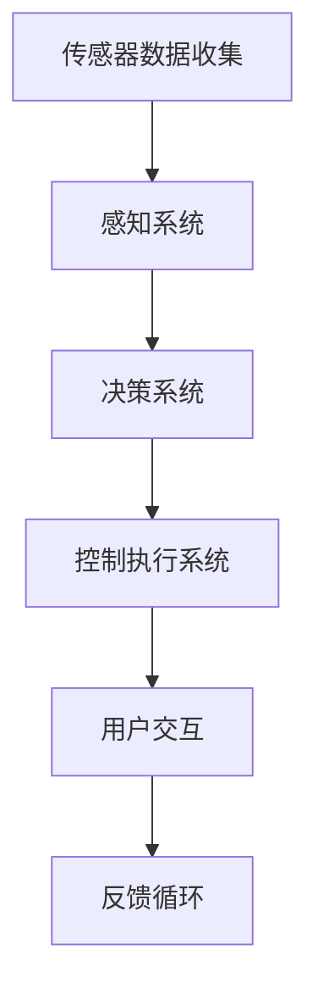
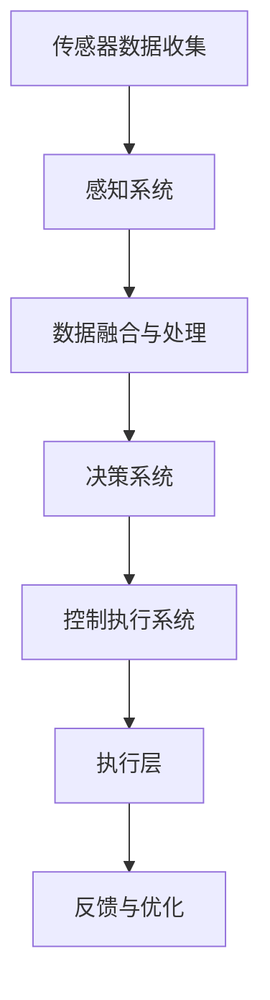

                 

### 文章标题

### 自动驾驶行业的人才争夺战

#### 关键词：自动驾驶，人才争夺，行业竞争，人才培养，技能要求

#### 摘要：

本文将深入探讨自动驾驶行业的现状与发展，重点分析人才需求、培养策略以及人才争夺战。随着自动驾驶技术的迅速发展，该行业已经成为全球科技企业竞相争夺的焦点。本文将详细解析自动驾驶行业的技术原理、核心岗位需求、人才培养策略，以及国内外企业的竞争格局，旨在为行业从业者提供有价值的参考，并对自动驾驶行业的未来发展进行展望。

### 第一部分：自动驾驶行业概述

#### 第1章：自动驾驶行业概览

自动驾驶技术作为当今科技领域的前沿方向，正逐步从理论走向实践，并逐渐改变着人们的出行方式。本章将首先回顾自动驾驶技术的起源与发展历程，然后分析当前行业的现状与市场规模，接着探讨自动驾驶技术核心原理，最后总结行业的挑战与机遇。

##### 1.1 自动驾驶技术的历史发展

自动驾驶技术的概念可以追溯到20世纪中叶。最初，自动驾驶研究主要集中在军事和航天领域，旨在提高军事装备和航天器的自主性。随着计算机技术和传感器技术的不断发展，自动驾驶技术逐渐从实验室走向实际应用。

**自动驾驶技术的历史发展**：

- **20世纪50年代**：诞生了第一辆自动汽车，但是仅能在特定环境下行驶。
- **20世纪70年代**：计算机技术和传感器技术的进步，使自动驾驶技术取得了一些突破。
- **20世纪90年代**：基于GPS和激光雷达的自动驾驶系统开始应用于车辆测试。
- **21世纪初**：自动驾驶技术逐步从科研实验室走向实际道路测试，特斯拉等企业开始推出部分自动驾驶功能。

**主要自动驾驶技术路线**：

- **感知系统**：包括激光雷达、摄像头、毫米波雷达等，用于感知周围环境。
- **定位系统**：主要依赖GPS和北斗等卫星导航系统，结合高精度地图进行定位。
- **规划与控制**：实现车辆的路径规划、轨迹规划和车辆控制，确保车辆安全行驶。

**自动驾驶行业的监管政策**：

- **美国**：美国联邦政府逐步放宽自动驾驶测试的监管，鼓励企业进行测试和研发。
- **欧洲**：欧盟出台了一系列关于自动驾驶的法规，要求汽车制造商满足严格的测试和认证标准。
- **中国**：中国政府高度重视自动驾驶行业，出台了多项政策支持企业进行研发和测试。

##### 1.2 自动驾驶行业的现状与市场规模

**全球自动驾驶市场规模**：

- **预测**：根据市场研究机构的数据，全球自动驾驶市场规模预计将在未来几年内快速增长，达到数千亿美元。
- **应用领域**：自动驾驶技术已经在汽车、物流、公共交通等多个领域得到应用。

**主要玩家及其市场份额**：

- **特斯拉**：作为全球领先的电动汽车制造商，特斯拉在自动驾驶领域具有显著优势，市场份额稳步提升。
- **谷歌Waymo**：谷歌的自动驾驶子公司Waymo在自动驾驶技术研发和商业化方面处于领先地位。
- **百度Apollo**：百度的Apollo平台在自动驾驶技术研发和合作伙伴方面取得显著进展。
- **蔚小理**：蔚来、小鹏、理想等中国新势力车企在自动驾驶领域积极布局，市场份额逐步扩大。

**自动驾驶技术的应用领域**：

- **自动驾驶汽车**：实现车辆在高速公路、城市道路等复杂环境下的自主行驶。
- **无人出租车**：通过自动驾驶技术提供高效、安全的出租车服务。
- **自动驾驶卡车**：提高物流运输效率，减少驾驶员疲劳和事故风险。
- **公共交通**：利用自动驾驶技术优化公共交通系统，提高服务质量。

##### 1.3 自动驾驶技术核心原理

**感知系统**：

- **激光雷达**：利用激光束扫描周围环境，生成高精度三维点云数据。
  - **原理与工作流程**：激光雷达通过发射激光束，照射目标物体，然后接收反射回来的激光信号，计算出目标物体的距离和形状。
  - **应用案例**：特斯拉、蔚来等企业广泛使用激光雷达，提高车辆的感知能力。

- **摄像头**：通过捕捉图像，进行图像处理，识别道路标志、行人和其他车辆。
  - **原理与工作流程**：摄像头捕捉实时图像，通过图像处理算法进行目标识别和场景理解。
  - **应用案例**：Waymo、百度Apollo等企业将摄像头集成到自动驾驶系统中，提高感知精度。

- **毫米波雷达**：利用毫米波波段，探测周围物体的距离和速度。
  - **原理与工作流程**：毫米波雷达通过发射和接收毫米波信号，检测物体的相对速度和距离。
  - **应用案例**：自动驾驶卡车和物流车辆常使用毫米波雷达，提高车辆的安全性。

**定位系统**：

- **GPS与北斗**：利用卫星导航系统，提供全球定位服务。
  - **原理与定位精度**：GPS和北斗卫星系统通过多颗卫星的信号，确定接收器的地理位置。
  - **应用案例**：特斯拉、蔚来等企业将GPS和北斗集成到自动驾驶系统中，实现高精度定位。

- **高精度地图**：提供精确的道路、交通标志和地形信息。
  - **原理与重要性**：高精度地图通过采集和建模，生成详细的道路信息，为自动驾驶系统提供定位和导航依据。
  - **应用案例**：谷歌、百度等企业开发高精度地图，为自动驾驶车辆提供精准的位置信息。

**规划与控制**：

- **路径规划**：根据当前路况和目标，生成最优行驶路径。
  - **原理与算法**：常用的路径规划算法包括A*算法、Dijkstra算法等，通过计算路径成本和障碍物，生成最佳路径。
  - **应用案例**：自动驾驶汽车在城市道路上的路径规划，确保行驶安全高效。

- **轨迹规划**：规划车辆的轨迹，实现平稳、安全的行驶。
  - **原理与算法**：轨迹规划常用的算法包括动态窗口方法、模型预测控制等，通过预测未来路况和车辆行为，生成最优轨迹。
  - **应用案例**：特斯拉等企业在自动驾驶轨迹规划中的实际应用，提高行驶稳定性和安全性。

- **车辆控制**：控制车辆的加速、制动和转向等动作。
  - **原理与算法**：车辆控制常用的算法包括PID控制、模型预测控制等，通过控制输入信号，实现车辆的平稳行驶。
  - **应用案例**：自动驾驶汽车在加速、制动和转向等控制中的应用实例，确保行驶安全性。

##### 1.4 自动驾驶行业的挑战与机遇

**技术挑战**：

- **安全与可靠性**：自动驾驶系统需要确保在复杂环境下的安全性和可靠性，减少事故发生的概率。
- **成本与效率**：降低自动驾驶系统的成本，提高系统的运行效率，以实现商业化应用。
- **复杂场景应对**：自动驾驶系统需要具备应对复杂交通场景的能力，包括极端天气、道路施工等。

**政策与法规**：

- **政策支持**：各国政府通过出台政策，支持自动驾驶技术的发展和应用。
- **监管法规**：自动驾驶行业需要遵守严格的监管法规，确保系统的安全和合规性。

**商业挑战**：

- **商业模式**：自动驾驶行业需要探索可持续的商业模式，实现盈利。
- **市场竞争**：自动驾驶行业竞争激烈，企业需要不断创新，保持竞争优势。
- **用户接受度**：提高用户对自动驾驶技术的接受度，推动市场发展。

#### 第2章：自动驾驶技术核心原理与架构

自动驾驶技术作为一项复杂的系统工程，涉及众多技术领域，包括感知、定位、规划与控制等。本章将详细探讨这些核心原理与架构，通过分析各组件的工作原理和应用案例，帮助读者更好地理解自动驾驶系统的运作机制。

##### 2.1 自动驾驶系统架构

自动驾驶系统通常采用分层架构，将系统功能划分为感知、决策、控制等主要层次。这种分层架构使得系统能够灵活扩展和迭代，满足不同应用场景的需求。

**分层架构**：

- **感知层**：负责采集车辆周围环境的信息，包括激光雷达、摄像头、毫米波雷达等传感器。
- **决策层**：根据感知层提供的信息，进行路径规划、轨迹规划等决策。
- **控制层**：将决策层生成的控制指令转化为具体的车辆动作，包括加速、制动、转向等。

**协同控制**：

自动驾驶系统中，多个传感器协同工作，提高系统的感知精度和可靠性。协同控制技术通过融合不同传感器数据，实现环境感知和车辆控制的协同效应。

**协同控制的关键技术**：

- **多传感器数据融合**：通过融合激光雷达、摄像头、毫米波雷达等传感器的数据，提高感知系统的精度和鲁棒性。
- **传感器融合算法**：常用的传感器融合算法包括卡尔曼滤波、贝叶斯滤波等，通过估计传感器误差和不确定性，提高融合效果。

##### 2.2 感知系统

感知系统是自动驾驶系统的核心组成部分，负责采集车辆周围环境的信息，包括道路、行人、车辆等。本章将详细介绍激光雷达、摄像头、毫米波雷达等感知系统组件的工作原理和应用案例。

**激光雷达**：

激光雷达（LiDAR）是一种通过发射激光束并接收反射信号来获取目标物体距离和形状的传感器。激光雷达具有高精度、高分辨率和实时性的特点，在自动驾驶系统中发挥着重要作用。

**原理与工作流程**：

- **原理**：激光雷达通过发射激光束，照射目标物体，然后接收反射回来的激光信号。通过计算激光信号往返时间，可以确定目标物体的距离。
- **工作流程**：激光雷达发射激光束，照射目标物体，反射信号被接收器捕捉。通过信号处理，将反射信号转化为数字信号，生成三维点云数据。

**应用案例**：

- **特斯拉**：特斯拉在其高端车型中集成了激光雷达，用于感知周围环境，提高自动驾驶系统的安全性和可靠性。
- **蔚来**：蔚来汽车在其旗舰车型中使用了激光雷达，实现高级自动驾驶功能，提高车辆的智能化水平。

**摄像头**：

摄像头是一种通过捕捉图像并进行分析来获取环境信息的传感器。摄像头具有成本低、安装方便等优点，在自动驾驶系统中得到了广泛应用。

**原理与工作流程**：

- **原理**：摄像头捕捉实时图像，通过图像处理算法进行目标识别和场景理解。
- **工作流程**：摄像头捕捉图像，经过预处理（如去噪、增强等），然后通过目标检测和识别算法，提取道路、行人、车辆等关键信息。

**应用案例**：

- **Waymo**：谷歌的自动驾驶子公司Waymo在其自动驾驶车辆中使用了多个摄像头，用于感知道路和交通情况，实现安全行驶。
- **百度Apollo**：百度Apollo平台在自动驾驶系统中集成了摄像头，用于道路识别和目标检测，提高自动驾驶系统的感知能力。

**毫米波雷达**：

毫米波雷达是一种利用毫米波波段探测目标物体距离和速度的传感器。毫米波雷达具有高精度、抗干扰能力强等优点，在自动驾驶系统中得到广泛应用。

**原理与工作流程**：

- **原理**：毫米波雷达通过发射毫米波信号，照射目标物体，然后接收反射信号。通过分析反射信号的时间差和频率变化，可以确定目标物体的距离和速度。
- **工作流程**：毫米波雷达发射毫米波信号，反射信号被接收器捕捉。通过信号处理，将反射信号转化为数字信号，生成距离和速度信息。

**应用案例**：

- **自动驾驶卡车**：许多自动驾驶卡车企业使用了毫米波雷达，用于检测前方车辆和障碍物，提高车辆的安全性。
- **物流运输**：在物流运输领域，毫米波雷达被用于监控货物和车辆，提高运输效率和安全性。

##### 2.3 定位系统

定位系统是自动驾驶系统的重要组成部分，用于确定车辆在道路上的位置。本章将详细分析GPS与北斗等定位技术的工作原理、定位精度，以及自动驾驶企业的应用案例。

**GPS与北斗**：

GPS（全球定位系统）和北斗（全球卫星导航系统）是自动驾驶系统中常用的定位技术。GPS由美国军方开发，而北斗由中国自主研发。

**原理与定位精度**：

- **原理**：GPS和北斗通过多颗卫星的信号，确定接收器的地理位置。接收器通过接收卫星信号，计算信号往返时间，确定自身位置。
- **定位精度**：GPS的定位精度一般在几米到几十米之间，而北斗的定位精度略高，一般在几米到十几米之间。

**应用案例**：

- **特斯拉**：特斯拉在自动驾驶系统中使用了GPS进行定位，结合高精度地图，实现车辆的精准定位和导航。
- **蔚来**：蔚来汽车在其自动驾驶系统中集成了GPS和北斗，提高车辆的定位精度，确保车辆在复杂环境下的稳定行驶。

**高精度地图**：

高精度地图是一种详细记录道路、交通标志、道路设施等信息的地图。高精度地图为自动驾驶系统提供重要的位置信息，用于路径规划和轨迹规划。

**原理与重要性**：

- **原理**：高精度地图通过采集和建模，生成详细的道路信息。采集数据通常包括激光雷达、摄像头等传感器，然后通过数据处理和建模，生成高精度地图。
- **重要性**：高精度地图为自动驾驶系统提供精准的位置信息，是路径规划和轨迹规划的基础。高精度地图的精度直接影响到自动驾驶系统的性能和安全性。

**应用案例**：

- **谷歌**：谷歌地图提供了高精度地图服务，为自动驾驶系统提供详细的道路信息。
- **百度Apollo**：百度Apollo平台提供了高精度地图服务，支持自动驾驶车辆在复杂环境下的精准定位和导航。

##### 2.4 规划与控制

规划与控制是自动驾驶系统的核心模块，用于确定车辆的行驶路径和执行具体的车辆控制动作。本章将详细阐述路径规划、轨迹规划和车辆控制的核心原理、常用算法，以及自动驾驶企业的应用案例。

**路径规划**：

路径规划是自动驾驶系统的重要组成部分，用于确定车辆从当前位置到目标位置的最优行驶路径。

**原理与算法**：

- **原理**：路径规划通过计算当前路况和目标位置，生成一条最优行驶路径。最优路径通常基于距离、速度、安全性等指标进行评估。
- **算法**：常用的路径规划算法包括A*算法、Dijkstra算法等。A*算法通过计算路径成本和启发函数，找到最短路径；Dijkstra算法通过广度优先搜索找到最短路径。

**应用案例**：

- **特斯拉**：特斯拉在自动驾驶系统中使用了路径规划算法，实现车辆在城市道路上的智能导航。
- **Waymo**：谷歌的自动驾驶子公司Waymo在其系统中集成了路径规划算法，提高车辆的行驶效率和安全性。

**轨迹规划**：

轨迹规划是自动驾驶系统的重要组成部分，用于确定车辆的行驶轨迹，实现平稳、安全的行驶。

**原理与算法**：

- **原理**：轨迹规划通过预测未来路况和车辆行为，生成一条最优行驶轨迹。最优轨迹通常基于车辆的速度、加速度、转弯半径等指标进行评估。
- **算法**：常用的轨迹规划算法包括动态窗口方法、模型预测控制等。动态窗口方法通过实时更新规划窗口，优化行驶轨迹；模型预测控制通过预测车辆行为，生成最优轨迹。

**应用案例**：

- **特斯拉**：特斯拉在自动驾驶系统中使用了轨迹规划算法，实现车辆在复杂环境下的稳定行驶。
- **蔚来**：蔚来汽车在其自动驾驶系统中集成了轨迹规划算法，提高车辆的行驶稳定性和舒适性。

**车辆控制**：

车辆控制是自动驾驶系统的核心模块，用于实现车辆的加速、制动和转向等动作。

**原理与算法**：

- **原理**：车辆控制通过控制车辆的加速度、制动力和转向角度，实现车辆的平稳行驶。
- **算法**：常用的车辆控制算法包括PID控制、模型预测控制等。PID控制通过比例、积分、微分调节控制信号，实现车辆的控制；模型预测控制通过预测车辆行为，优化控制信号。

**应用案例**：

- **特斯拉**：特斯拉在自动驾驶系统中使用了PID控制和模型预测控制，实现车辆的平稳加速、制动和转向。
- **Waymo**：谷歌的自动驾驶子公司Waymo在其系统中集成了模型预测控制，提高车辆的行驶稳定性和安全性。

#### 第3章：自动驾驶行业的人才需求与培养

自动驾驶行业的快速发展带动了对专业技术人才的需求，从算法工程师到软件工程师，再到硬件工程师，各岗位的需求不断增长。本章将详细分析自动驾驶行业的关键岗位需求，探讨技能要求，并探讨自动驾驶行业的人才培养策略。

##### 3.1 自动驾驶行业的人才需求分析

自动驾驶行业涉及多个技术领域，包括计算机视觉、机器学习、控制理论、传感器技术等。因此，行业对人才的需求也呈现多样化特点。以下是对自动驾驶行业关键岗位需求的分析：

**算法工程师**：

算法工程师是自动驾驶系统的核心开发人员，负责开发、优化和测试自动驾驶算法。算法工程师通常需要具备以下技能：

- **机器学习与深度学习**：熟悉常见的机器学习算法和深度学习框架，如TensorFlow、PyTorch等。
- **计算机视觉**：熟悉图像处理、目标检测、语义分割等计算机视觉技术。
- **数学基础**：具备良好的数学基础，包括线性代数、微积分、概率论等。

**软件工程师**：

软件工程师负责开发、维护和测试自动驾驶系统的软件部分，包括感知、决策、控制等模块。软件工程师通常需要具备以下技能：

- **编程语言**：熟练掌握C++、Python等编程语言，具备良好的编程习惯和调试技巧。
- **软件工程**：了解软件开发生命周期，具备良好的代码设计和架构能力。
- **操作系统与网络**：熟悉操作系统原理和网络通信，能够编写高效的网络应用程序。

**硬件工程师**：

硬件工程师负责开发、测试和维护自动驾驶系统的硬件部分，包括传感器、控制器等。硬件工程师通常需要具备以下技能：

- **电子电路**：熟悉电子电路设计和硬件编程，能够设计和调试嵌入式系统。
- **传感器技术**：了解各种传感器的工作原理和性能指标，能够进行传感器选型和系统集成。
- **通信协议**：熟悉常见的通信协议，如CAN总线、SPI、I2C等。

**其他岗位**：

除了上述关键岗位外，自动驾驶行业还需要其他各类人才，如数据工程师、测试工程师、产品经理等。这些岗位对人才的需求主要包括：

- **数据处理与分析**：熟悉数据处理和分析技术，能够处理海量数据，提取有价值的信息。
- **测试与验证**：熟悉自动驾驶系统的测试方法和验证流程，能够设计和执行测试用例。
- **项目管理**：具备项目管理经验，能够协调不同团队的工作，确保项目按时交付。

##### 3.2 自动驾驶行业的人才培养策略

自动驾驶行业的快速发展对人才的需求提出了新的挑战，如何培养和吸引人才成为行业发展的关键问题。以下是对自动驾驶行业人才培养策略的探讨：

**高校教育**：

高校在自动驾驶人才培养中起着至关重要的作用。以下是一些高校教育方面可以采取的措施：

- **课程设置**：设置与自动驾驶相关的课程，涵盖机器学习、计算机视觉、控制理论等核心领域。课程应注重理论与实践的结合，为学生提供动手实践的机会。
- **实验室建设**：建设自动驾驶实验室，为学生提供实验环境和设备，鼓励学生进行创新研究和项目实践。
- **校企合作**：与自动驾驶企业建立合作关系，共同开展科研项目和实习实训项目，提高学生的实践能力和就业竞争力。

**企业培训**：

企业是自动驾驶技术的重要应用主体，企业培训在人才培养中发挥着重要作用。以下是一些企业培训方面可以采取的措施：

- **内部培训**：开展内部培训课程，提高员工的专业技能和团队协作能力。培训内容应涵盖最新的技术动态、行业趋势和企业内部最佳实践。
- **实训项目**：开展实训项目，让员工在实际项目中锻炼技能，提升解决实际问题的能力。
- **人才激励**：建立人才激励机制，鼓励员工积极参与技术研究和创新，为优秀人才提供晋升和发展机会。

**跨界合作**：

自动驾驶技术的发展离不开多学科的交叉融合，跨界合作成为人才培养的重要途径。以下是一些跨界合作方面可以采取的措施：

- **产学研合作**：推动产学研合作，将高校、科研机构和企业紧密结合起来，共同培养符合行业需求的人才。
- **国际合作**：与国际知名高校和科研机构合作，引进先进的自动驾驶技术和人才培养理念，提升国内人才培养水平。
- **开放平台**：建设开放平台，为各行业人才提供学习和交流的机会，促进跨领域的创新和合作。

##### 3.3 自动驾驶人才的职业发展路径

自动驾驶行业的快速发展为从业者提供了广阔的职业发展空间。以下是对自动驾驶人才职业发展路径的探讨：

**初级阶段**：

在初级阶段，自动驾驶人才通常从事与技术研发、测试验证等相关的岗位。以下是一些初级阶段的职业发展建议：

- **技术研发**：参与自动驾驶系统的研发项目，掌握核心技术和算法，提升自己的技术水平。
- **测试验证**：参与自动驾驶系统的测试和验证工作，确保系统稳定可靠，提高系统的安全性。
- **项目管理**：参与项目管理工作，提高团队协作和项目管理能力，为未来的职业发展奠定基础。

**高级阶段**：

在高级阶段，自动驾驶人才通常担任技术主管、项目经理等高级职位，负责整个自动驾驶系统的研发、测试和推广。以下是一些高级阶段的职业发展建议：

- **技术主管**：担任技术主管，负责自动驾驶技术的战略规划和技术研发，推动技术的创新和突破。
- **项目经理**：担任项目经理，负责整个自动驾驶项目的规划、实施和交付，确保项目的顺利进行。
- **行业专家**：成为行业专家，参与行业标准的制定和技术交流，为自动驾驶行业的发展贡献力量。

**职业晋升方向**：

自动驾驶行业的职业晋升方向多样，以下是一些常见的职业晋升方向：

- **技术晋升**：从技术岗位逐步晋升为技术主管、技术总监等高级技术职位。
- **管理晋升**：从项目管理岗位逐步晋升为项目经理、项目总监等高级管理职位。
- **跨领域发展**：在自动驾驶行业积累一定的经验后，可以跨领域发展，如进入汽车制造、智能交通等相关行业。

#### 第4章：自动驾驶行业的竞争格局

自动驾驶行业作为新兴科技领域的热门方向，吸引了众多企业竞相布局和投入。本章将详细分析国内外自动驾驶企业的竞争格局，探讨各企业在技术研发、市场策略、合作网络等方面的布局和表现。

##### 4.1 特斯拉

特斯拉作为全球领先的电动汽车制造商，在自动驾驶领域具有显著的优势和影响力。特斯拉的自动驾驶技术以高精度传感器、强大的计算能力和先进的算法为核心，实现了部分自动驾驶功能的商业化应用。

**战略布局**：

- **技术研发**：特斯拉在自动驾驶技术方面进行了大量的研发投入，拥有自主研发的激光雷达、摄像头和传感器系统。特斯拉的自动驾驶系统采用了多传感器数据融合技术，提高了感知系统的精度和可靠性。
- **市场策略**：特斯拉通过推出高端电动汽车，如Model S、Model X等，逐步普及自动驾驶功能。特斯拉的自动驾驶系统以逐步升级的方式推出，用户可以通过软件更新获取更多的自动驾驶功能。
- **合作网络**：特斯拉与多家企业和机构建立了合作关系，如英特尔、英伟达等，共同推进自动驾驶技术的发展和应用。

**核心技术**：

- **自动驾驶算法**：特斯拉自主研发了先进的自动驾驶算法，包括路径规划、轨迹规划和车辆控制等。特斯拉的自动驾驶算法具有高效、稳定和安全的特性。
- **传感器系统**：特斯拉使用了自主研发的摄像头、激光雷达和毫米波雷达，实现了多传感器数据融合，提高了感知系统的精度和鲁棒性。

**市场表现**：

- **市场份额**：特斯拉在自动驾驶市场上占据了重要地位，其自动驾驶系统在全球范围内获得了广泛的应用。根据市场研究数据，特斯拉在自动驾驶车辆数量上领先于其他竞争对手。
- **用户反馈**：特斯拉的自动驾驶系统在用户中获得了良好的反馈，用户对其安全性和便利性表示认可。

##### 4.2 谷歌Waymo

谷歌的自动驾驶子公司Waymo在自动驾驶领域具有领先地位，其自动驾驶技术以高精度地图、先进的算法和强大的计算能力为核心。

**战略布局**：

- **技术研发**：Waymo在自动驾驶技术方面进行了大量的研发投入，拥有自主研发的激光雷达、摄像头和传感器系统。Waymo的自动驾驶系统采用了多传感器数据融合技术，提高了感知系统的精度和可靠性。
- **市场策略**：Waymo通过无人出租车服务进行商业化应用，逐步扩大市场份额。Waymo的无人出租车服务已经在多个城市开展试点，为用户提供便捷的出行服务。
- **合作网络**：Waymo与多家企业和机构建立了合作关系，如Uber、Lyft等，共同推进自动驾驶技术的发展和应用。

**核心技术**：

- **自动驾驶算法**：Waymo自主研发了先进的自动驾驶算法，包括路径规划、轨迹规划和车辆控制等。Waymo的自动驾驶算法具有高效、稳定和安全的特性。
- **高精度地图**：Waymo利用自主研发的高精度地图技术，为自动驾驶车辆提供精准的位置信息和环境信息。

**市场表现**：

- **市场份额**：Waymo在自动驾驶市场上占据了领先地位，其无人出租车服务在全球范围内获得了良好的市场反响。
- **用户反馈**：Waymo的无人出租车服务在用户中获得了良好的反馈，用户对其安全性和便利性表示认可。

##### 4.3 百度Apollo

百度Apollo是百度推出的自动驾驶平台，致力于推动自动驾驶技术的商业化应用。百度Apollo通过开放的自动驾驶技术生态，吸引众多企业和机构加入合作。

**战略布局**：

- **技术研发**：百度Apollo在自动驾驶技术方面进行了大量的研发投入，拥有自主研发的激光雷达、摄像头和传感器系统。百度Apollo的自动驾驶系统采用了多传感器数据融合技术，提高了感知系统的精度和可靠性。
- **市场策略**：百度Apollo通过与多家车企、供应商和城市合作，推动自动驾驶技术的商业化应用。百度Apollo平台为自动驾驶车辆提供了丰富的应用场景和解决方案。
- **合作网络**：百度Apollo与多家企业和机构建立了合作关系，如比亚迪、北汽新能源等，共同推进自动驾驶技术的发展和应用。

**核心技术**：

- **自动驾驶算法**：百度Apollo自主研发了先进的自动驾驶算法，包括路径规划、轨迹规划和车辆控制等。百度Apollo的自动驾驶算法具有高效、稳定和安全的特性。
- **高精度地图**：百度Apollo利用自主研发的高精度地图技术，为自动驾驶车辆提供精准的位置信息和环境信息。

**市场表现**：

- **市场份额**：百度Apollo在自动驾驶市场上占据了一定的市场份额，其自动驾驶解决方案在多个城市得到了应用。
- **用户反馈**：百度Apollo的自动驾驶解决方案在用户中获得了良好的反馈，用户对其安全性和便利性表示认可。

##### 4.4 蔚小理

蔚小理（蔚来、小鹏、理想）是中国新势力车企在自动驾驶领域的代表，其在自动驾驶技术研发和应用方面取得了显著进展。

**蔚来**：

- **战略布局**：蔚来在自动驾驶技术方面进行了大量的研发投入，拥有自主研发的激光雷达、摄像头和传感器系统。蔚来计划推出具备L4级自动驾驶功能的量产车型，为用户提供更智能的出行体验。
- **市场策略**：蔚来通过与合作伙伴合作，如百度Apollo，共同推动自动驾驶技术的商业化应用。蔚来在多个城市开展了自动驾驶测试和试点项目，为自动驾驶技术的发展积累了宝贵经验。
- **核心技术**：蔚来自主研发了先进的自动驾驶算法，包括路径规划、轨迹规划和车辆控制等。蔚来的高精度地图技术为自动驾驶车辆提供了精准的位置信息和环境信息。

**小鹏**：

- **战略布局**：小鹏在自动驾驶技术方面进行了大量的研发投入，拥有自主研发的激光雷达、摄像头和传感器系统。小鹏计划推出具备L4级自动驾驶功能的量产车型，为用户提供更智能的出行体验。
- **市场策略**：小鹏通过与合作伙伴合作，如华为、小米等，共同推动自动驾驶技术的商业化应用。小鹏在多个城市开展了自动驾驶测试和试点项目，为自动驾驶技术的发展积累了宝贵经验。
- **核心技术**：小鹏自主研发了先进的自动驾驶算法，包括路径规划、轨迹规划和车辆控制等。小鹏的高精度地图技术为自动驾驶车辆提供了精准的位置信息和环境信息。

**理想**：

- **战略布局**：理想在自动驾驶技术方面进行了大量的研发投入，拥有自主研发的激光雷达、摄像头和传感器系统。理想计划推出具备L4级自动驾驶功能的量产车型，为用户提供更智能的出行体验。
- **市场策略**：理想通过与合作伙伴合作，如百度Apollo，共同推动自动驾驶技术的商业化应用。理想在多个城市开展了自动驾驶测试和试点项目，为自动驾驶技术的发展积累了宝贵经验。
- **核心技术**：理想自主研发了先进的自动驾驶算法，包括路径规划、轨迹规划和车辆控制等。理想的高精度地图技术为自动驾驶车辆提供了精准的位置信息和环境信息。

**市场表现**：

- **市场份额**：蔚小理在中国自动驾驶市场上占据了一定的市场份额，其自动驾驶解决方案在多个城市得到了应用。
- **用户反馈**：蔚小理的自动驾驶解决方案在用户中获得了良好的反馈，用户对其安全性和便利性表示认可。

##### 4.5 自动驾驶行业的竞争策略

自动驾驶行业的竞争激烈，企业通过多种策略争夺市场份额。以下是对自动驾驶行业竞争策略的探讨：

**技术研发**：

企业通过加大研发投入，提高技术水平，争夺市场份额。以下是一些策略：

- **自主研发**：企业通过自主研发，掌握核心技术和专利，提高市场竞争力。
- **技术创新**：企业不断进行技术创新，推出具有竞争力的产品，抢占市场先机。
- **合作研发**：企业与高校、科研机构合作，共同推进技术研发，提高研发效率。

**市场合作**：

企业通过战略合作、联盟合作等方式，扩大市场影响力。以下是一些策略：

- **战略合作**：企业与其他企业、城市、政府等建立战略合作关系，共同推进自动驾驶技术的商业化应用。
- **联盟合作**：企业加入行业联盟，共同制定行业标准，推动自动驾驶技术的发展。
- **合作研发**：企业与合作伙伴共同研发自动驾驶技术，共享研发成果，降低研发成本。

**政策影响**：

政策环境对自动驾驶行业的发展具有重要影响。以下是一些策略：

- **政策支持**：政府通过出台政策，支持自动驾驶技术的研发和应用，为企业提供政策优惠和资金支持。
- **政策引导**：政府通过政策引导，规范自动驾驶行业的发展，提高行业整体水平。
- **国际合作**：政府推动国际合作，促进自动驾驶技术的跨国合作和应用。

#### 第5章：自动驾驶行业的商业模式与盈利模式

自动驾驶行业的商业模式和盈利模式是其可持续发展的关键。随着自动驾驶技术的不断成熟和应用场景的扩展，企业需要不断创新商业模式和盈利模式，以实现商业化落地。本章将详细探讨自动驾驶行业的商业模式和盈利模式，分析企业如何通过硬件销售、软件服务、数据服务等方式实现盈利。

##### 5.1 自动驾驶行业的商业模式

自动驾驶行业的商业模式主要包括硬件销售、软件服务、数据服务以及基于自动驾驶技术的其他增值服务。以下是对这些商业模式的详细探讨：

**硬件销售**：

硬件销售是自动驾驶行业最直接的商业模式之一，企业通过销售自动驾驶所需的硬件设备，如激光雷达、摄像头、传感器等，实现盈利。

- **激光雷达**：激光雷达作为自动驾驶系统的重要感知设备，具有高精度、实时性的特点。企业通过销售激光雷达，获取直接收入。
- **摄像头**：摄像头是自动驾驶系统的另一个重要感知设备，用于识别道路标志、行人和车辆等。企业通过销售摄像头，实现盈利。
- **传感器**：传感器用于检测车辆的速度、加速度、温度等参数，是企业实现硬件销售的重要产品。

**软件服务**：

软件服务是自动驾驶行业的重要商业模式之一，企业通过提供自动驾驶软件，如控制系统、路径规划软件等，实现盈利。

- **控制系统**：自动驾驶控制系统是实现自动驾驶功能的核心软件，企业通过销售控制系统，为自动驾驶车辆提供技术支持。
- **路径规划软件**：路径规划软件用于规划车辆的行驶路径，提高行驶效率。企业通过销售路径规划软件，为自动驾驶车辆提供优化方案。
- **数据处理软件**：数据处理软件用于收集、存储、分析和处理自动驾驶车辆运行过程中的数据，为企业提供数据服务。

**数据服务**：

数据服务是自动驾驶行业的一个重要盈利点，企业通过收集、处理和分析自动驾驶车辆运行过程中的数据，为其他企业或个人提供数据服务。

- **数据分析**：企业通过收集自动驾驶车辆运行过程中的数据，进行分析和挖掘，为车辆运营、安全监控等方面提供决策支持。
- **数据共享**：企业与其他企业或机构合作，共享数据资源，实现数据的最大化利用。
- **数据服务**：企业通过提供数据服务，如路况信息、车辆性能分析等，为其他企业或个人提供有价值的数据支持。

**其他增值服务**：

除了硬件销售、软件服务和数据服务外，企业还可以通过提供其他增值服务实现盈利。以下是一些常见的增值服务：

- **维修服务**：企业通过提供自动驾驶车辆的维修服务，获取收入。
- **保险服务**：企业通过提供自动驾驶车辆的保险服务，为车辆运营提供保障。
- **租赁服务**：企业通过提供自动驾驶车辆的租赁服务，为用户提供便捷的出行选择。

##### 5.2 自动驾驶行业的盈利模式

自动驾驶行业的盈利模式多样，企业可以通过多种方式实现盈利。以下是对自动驾驶行业盈利模式的详细探讨：

**硬件销售盈利模式**：

硬件销售是企业实现盈利的重要途径之一。以下是一些常见的硬件销售盈利模式：

- **直销**：企业通过直销渠道，直接向终端用户销售硬件设备，获取销售收入。
- **分销**：企业通过分销渠道，将硬件设备销售给代理商或经销商，代理商或经销商再向终端用户销售，企业通过分销渠道获取销售收入。
- **OEM**：企业通过OEM模式，为其他企业提供硬件设备，获取销售收入。

**软件服务盈利模式**：

软件服务是企业实现盈利的重要方式之一。以下是一些常见的软件服务盈利模式：

- **订阅模式**：企业通过订阅模式，向用户收取订阅费用，为用户提供持续的技术支持和升级服务。
- **一次性购买**：企业通过一次性购买模式，向用户销售软件，获取销售收入。
- **增值服务**：企业通过提供增值服务，如高级功能模块、技术支持等，为用户提供额外的价值，实现盈利。

**数据服务盈利模式**：

数据服务是企业实现盈利的重要途径之一。以下是一些常见的数据服务盈利模式：

- **数据分析服务**：企业通过提供数据分析服务，为其他企业或个人提供有价值的数据分析报告，获取销售收入。
- **数据共享服务**：企业通过提供数据共享服务，与其他企业或机构合作，实现数据的最大化利用，获取销售收入。
- **数据销售服务**：企业通过销售自己的数据资源，获取销售收入。

**其他盈利模式**：

除了上述盈利模式外，企业还可以通过以下方式实现盈利：

- **广告与流量**：企业通过在自动驾驶车辆上提供广告服务，或通过自动驾驶平台吸引流量，实现广告收入。
- **金融服务**：企业通过提供金融服务，如贷款、保险等，为车辆运营提供支持，实现盈利。
- **租赁服务**：企业通过提供自动驾驶车辆的租赁服务，为用户提供便捷的出行选择，实现盈利。

#### 第6章：自动驾驶技术的未来发展趋势与发展方向

随着自动驾驶技术的不断成熟和应用场景的拓展，未来自动驾驶技术将呈现出一系列发展趋势和方向。本章将详细探讨自动驾驶技术的未来发展趋势，包括全自动驾驶的实现、多模态感知与融合的发展，以及自动驾驶与人工智能的深度融合。同时，还将分析自动驾驶技术在城市交通、物流与运输、公共交通等领域的应用前景和潜在挑战。

##### 6.1 全自动驾驶的实现

全自动驾驶（Level 5自动驾驶）是指车辆能够在任何环境、任何情况下完全自主地完成所有驾驶任务，无需人类干预。虽然目前全自动驾驶技术尚未完全实现，但随着技术的不断进步，全自动驾驶的实现有望在未来几年内逐步实现。

**全自动驾驶的实现路径**：

- **技术突破**：全自动驾驶的实现需要依赖多种技术的突破，包括高精度地图、多传感器数据融合、深度学习算法等。随着这些技术的不断成熟，全自动驾驶的实现将更加可行。
- **法律法规**：全自动驾驶的实现还需要依赖于法律法规的支持和规范。各国政府需要出台相应的法律法规，确保全自动驾驶车辆的安全性和合规性。
- **社会接受度**：全自动驾驶的实现还需要社会接受度的提升。通过广泛的测试和示范应用，提高公众对全自动驾驶技术的信任和接受度。

**未来发展趋势**：

- **高精度地图的普及**：高精度地图是实现全自动驾驶的重要基础。未来，随着地图技术的不断进步，高精度地图的普及将推动全自动驾驶的发展。
- **多传感器数据融合**：多传感器数据融合是实现全自动驾驶的关键技术之一。未来，通过融合激光雷达、摄像头、毫米波雷达等多种传感器数据，实现更精准、更可靠的环境感知。
- **深度学习算法的优化**：深度学习算法在自动驾驶系统中发挥着重要作用。未来，随着深度学习算法的优化和进步，自动驾驶系统的智能水平和决策能力将得到显著提升。

##### 6.2 多模态感知与融合的发展

多模态感知与融合是将多种传感器数据融合在一起，提高自动驾驶系统的感知能力和鲁棒性。未来，多模态感知与融合将成为自动驾驶技术的重要发展方向。

**多模态感知与融合的优势**：

- **提高感知精度**：多模态感知与融合可以充分利用不同传感器数据的优势，提高自动驾驶系统的感知精度和鲁棒性。
- **降低误报率**：通过多模态数据融合，可以减少单一传感器数据带来的误报和漏报问题，提高系统的安全性和可靠性。
- **适应复杂环境**：多模态感知与融合可以使自动驾驶系统在复杂环境中更好地适应和应对，提高系统的环境感知能力。

**未来发展趋势**：

- **传感器技术的进步**：随着传感器技术的不断进步，如激光雷达、摄像头、毫米波雷达等，多模态感知与融合的技术将更加成熟和高效。
- **算法的优化与升级**：通过不断优化和升级算法，提高多模态数据融合的效果和效率，实现更高的感知精度和可靠性。
- **标准化与规范化**：建立多模态感知与融合的标准化与规范化体系，推动技术的广泛应用和产业化发展。

##### 6.3 自动驾驶与人工智能的深度融合

自动驾驶与人工智能（AI）的深度融合是未来自动驾驶技术发展的关键方向。通过将AI技术应用于自动驾驶系统，可以实现更高的智能水平和更复杂的决策能力。

**自动驾驶与人工智能的深度融合**：

- **深度学习算法**：深度学习算法在自动驾驶系统中发挥着重要作用，通过训练大量的数据，实现自动驾驶系统的智能决策。
- **强化学习**：强化学习是一种基于试错和奖励机制的AI技术，可以用于自动驾驶系统的路径规划和决策优化。
- **自然语言处理**：自然语言处理技术可以用于自动驾驶系统的语音识别和语音交互，提高用户的出行体验。

**未来发展趋势**：

- **算法的创新与突破**：通过不断创新和突破，提高自动驾驶与人工智能的融合效果，实现更高的智能水平和决策能力。
- **数据驱动的开发**：通过大数据和深度学习技术的结合，实现自动驾驶系统的自适应学习和优化，提高系统的鲁棒性和可靠性。
- **跨学科交叉融合**：推动自动驾驶与人工智能、计算机视觉、控制理论等多个学科的交叉融合，实现更高效、更智能的自动驾驶技术。

##### 6.4 自动驾驶技术在城市交通、物流与运输、公共交通等领域的应用前景和潜在挑战

**城市交通**：

自动驾驶技术在城市交通领域的应用前景广阔。通过自动驾驶技术，可以实现智能交通管理、优化交通流量、减少交通事故等。

- **应用前景**：自动驾驶技术可以用于智能交通信号控制、智能停车管理、自动驾驶出租车等，提高城市交通的效率和安全性。
- **潜在挑战**：自动驾驶技术需要解决复杂城市环境下的感知和决策问题，如行人、非机动车等动态障碍物的识别和应对。

**物流与运输**：

自动驾驶技术在物流与运输领域的应用有望提高运输效率、降低成本、减少事故风险。

- **应用前景**：自动驾驶技术可以用于自动驾驶卡车、无人配送、智能仓储管理等，提高物流与运输的效率。
- **潜在挑战**：自动驾驶技术需要解决长途运输中的导航、路况适应等问题，同时需要与现有的物流系统进行高效对接。

**公共交通**：

自动驾驶技术在公共交通领域的应用可以优化公共交通服务，提高乘客体验。

- **应用前景**：自动驾驶技术可以用于自动驾驶公交车、无人出租车等，提供更便捷、高效的公共交通服务。
- **潜在挑战**：自动驾驶技术在公共交通领域需要解决乘客的信任问题、车辆维护等问题，同时需要与城市公共交通系统进行高效集成。

#### 第7章：自动驾驶行业的政策环境与挑战

自动驾驶行业的快速发展离不开政策环境的支持与规范。本章将详细分析全球政策环境，探讨中国政策对自动驾驶行业的推动作用，并分析自动驾驶行业在安全与伦理、技术成熟度、市场竞争与垄断等方面的挑战。

##### 7.1 全球政策环境

全球各国政府高度重视自动驾驶行业的发展，通过出台政策法规，鼓励技术创新和商业化应用。以下是对全球政策环境的分析：

**美国**：

美国在自动驾驶领域处于领先地位，政府出台了一系列政策支持自动驾驶技术的发展。

- **监管政策**：美国联邦政府逐步放宽自动驾驶测试的监管，允许企业在公共道路进行测试。此外，美国国家公路交通安全管理局（NHTSA）出台了一系列指南和法规，规范自动驾驶车辆的测试和认证。
- **资金支持**：美国政府对自动驾驶技术研发提供了大量资金支持，通过拨款和税收优惠等方式，鼓励企业进行创新。
- **合作与协调**：美国交通部、国防部等相关部门共同推动自动驾驶技术的发展，建立跨部门合作机制，确保政策的一致性和协调性。

**欧洲**：

欧洲各国政府也积极推动自动驾驶技术的发展，出台了一系列政策法规。

- **监管政策**：欧洲委员会发布了《自动驾驶车辆法规框架》，要求成员国制定相应的法规，确保自动驾驶车辆的安全性和合规性。
- **资金支持**：欧盟通过“地平线2020”计划，提供大量资金支持自动驾驶技术的研发和应用。
- **国际合作**：欧洲各国政府通过国际合作，共同推动自动驾驶技术的发展和应用。

**中国**：

中国政府高度重视自动驾驶行业的发展，出台了一系列政策支持自动驾驶技术的研发和应用。

- **监管政策**：中国政府逐步放宽自动驾驶测试的监管，允许企业在公共道路进行测试。此外，交通运输部等部门发布了多项法规和标准，规范自动驾驶车辆的测试和商业化应用。
- **资金支持**：中国政府通过“新能源汽车推广应用财政补助政策”等政策，支持自动驾驶技术的研发和产业化。
- **试点项目**：中国多个城市开展了自动驾驶试点项目，通过实际应用验证自动驾驶技术的可行性和安全性。

##### 7.2 中国政策对自动驾驶行业的推动作用

中国政策对自动驾驶行业的推动作用显著，主要体现在以下几个方面：

**1. 政策支持与监管**

中国政府通过出台政策法规，为自动驾驶技术的发展提供支持和保障。以下是一些关键政策：

- **《智能网联汽车道路测试管理规范（试行）》**：明确自动驾驶车辆在公共道路测试的流程和要求，为自动驾驶技术的测试提供了法规依据。
- **《智能网联汽车道路测试安全管理规定（试行）》**：加强对自动驾驶车辆测试的安全管理，确保测试过程的安全性和合规性。
- **《智能网联汽车道路测试管理规范（试行）》**：推动自动驾驶车辆的商业化应用，明确自动驾驶车辆的商业运营许可和管理要求。

**2. 资金支持与扶持**

中国政府通过财政补贴、税收优惠等方式，支持自动驾驶技术的研发和产业化。以下是一些关键政策：

- **新能源汽车推广应用财政补助政策**：为新能源汽车（包括自动驾驶车辆）提供财政补贴，降低企业研发和生产的成本。
- **《关于支持新能源汽车产业高质量发展的意见》**：提出加大对新能源汽车产业的政策支持力度，推动产业高质量发展。
- **税收优惠政策**：对企业研发投入实行税收优惠，鼓励企业加大自动驾驶技术的研发投入。

**3. 试点项目与示范应用**

中国政府通过开展自动驾驶试点项目，推动自动驾驶技术的实际应用和示范。以下是一些关键项目：

- **“京雄自动驾驶示范区”**：在北京市和雄安新区开展自动驾驶试点，验证自动驾驶技术的实用性和安全性。
- **“智能网联汽车示范区”**：在武汉市、上海市等地开展智能网联汽车试点，推动自动驾驶技术在城市交通中的应用。
- **“高速公路自动驾驶测试路段”**：在山东省、江苏省等地建设高速公路自动驾驶测试路段，为自动驾驶技术的测试和商业化应用提供基础设施支持。

##### 7.3 自动驾驶行业的挑战

尽管自动驾驶行业得到了政策的大力支持，但在发展过程中仍面临一系列挑战：

**1. 安全与伦理问题**

自动驾驶技术在安全性和伦理方面面临诸多挑战。以下是一些关键问题：

- **安全性**：自动驾驶系统需要确保在复杂、动态环境下安全行驶，减少交通事故的发生。然而，自动驾驶技术尚未完全解决复杂的交通场景，特别是在极端天气、道路施工等情况下。
- **伦理问题**：自动驾驶系统在面临伦理困境时，如需要做出牺牲乘客或其他道路使用者安全的选择，如何确保系统的决策符合伦理标准，成为自动驾驶技术发展的重要问题。

**2. 技术成熟度**

自动驾驶技术的成熟度对商业化应用至关重要。以下是一些关键问题：

- **感知与定位技术**：自动驾驶系统需要高精度、实时的感知和定位技术，但目前这些技术的成熟度仍有限，特别是在复杂环境下的表现有待提高。
- **决策与控制算法**：自动驾驶系统的决策与控制算法需要具备高效、稳定和可靠的特点，但目前算法的性能和鲁棒性仍需进一步提升。

**3. 市场竞争与垄断**

自动驾驶行业的市场竞争激烈，但同时也存在垄断风险。以下是一些关键问题：

- **市场竞争**：随着自动驾驶技术的商业化应用逐步推广，企业之间的竞争将加剧。企业需要不断创新，提高技术水平和产品质量，以保持竞争优势。
- **垄断风险**：自动驾驶行业的核心技术、专利和数据等资源可能导致垄断现象的出现。如何防止垄断行为，维护市场公平竞争，成为政策制定者面临的重要问题。

#### 第8章：自动驾驶行业的人才争夺与培养

自动驾驶行业的快速发展对人才需求提出了前所未有的挑战。企业间的竞争日益激烈，人才争夺战愈演愈烈。本章将分析自动驾驶行业人才争夺的现状，探讨企业如何通过培训与激励、国际合作等方式培养和留住人才。

##### 8.1 人才争夺现状

自动驾驶行业吸引了全球众多企业参与，人才需求呈现出爆发式增长。以下是对人才争夺现状的分析：

**企业竞争**

自动驾驶行业的快速发展引发了企业间的激烈竞争，各企业纷纷加大人才引进力度。以下是一些关键点：

- **高薪资待遇**：为了吸引顶尖人才，自动驾驶企业普遍提供高薪资待遇，甚至超过传统汽车行业。这种高薪资待遇在一定程度上加剧了行业的人才流动。
- **股权激励**：为了留住核心人才，自动驾驶企业纷纷推出股权激励计划，让员工分享企业发展的红利。股权激励成为吸引和留住人才的重要手段。
- **人才引进政策**：一些企业通过建立专门的人才引进团队，积极引进国内外顶尖人才。同时，部分企业通过跨国并购、战略合作等方式，快速获取人才资源。

**薪资待遇**

薪资待遇是自动驾驶行业人才争夺的重要方面。以下是一些关键点：

- **薪资水平**：自动驾驶行业的薪资水平普遍高于传统汽车行业，尤其是核心岗位如算法工程师、硬件工程师等。高薪资待遇成为吸引人才的重要因素。
- **福利待遇**：除了薪资外，自动驾驶企业还提供丰富的福利待遇，如年终奖、股权激励、员工培训、健康体检等，以提升员工的满意度和忠诚度。

**人才流动趋势**

自动驾驶行业的人才流动呈现出以下趋势：

- **国内人才流动**：随着国内自动驾驶企业的崛起，越来越多的人才从传统汽车行业、互联网公司等流向自动驾驶企业。
- **国际人才流动**：国际顶尖人才也成为国内自动驾驶企业争夺的焦点。国内企业通过提供高薪资、股权激励等手段，吸引国际顶尖人才加入。

##### 8.2 人才培养与激励

人才培养与激励是自动驾驶行业人才战略的重要组成部分。以下是对人才培养与激励的探讨：

**高校与科研机构**

高校和科研机构在自动驾驶人才培养中起着关键作用。以下是一些关键点：

- **课程设置**：高校应根据自动驾驶技术的发展需求，调整课程设置，开设与自动驾驶相关的专业课程，如机器学习、计算机视觉、控制理论等。
- **实验室建设**：高校应加强实验室建设，提供先进的实验设备和实验环境，鼓励学生进行创新研究和项目实践。
- **产学研合作**：高校与自动驾驶企业、科研机构建立产学研合作机制，共同培养符合行业需求的人才。

**企业培训与激励**

企业培训与激励是培养和留住人才的重要手段。以下是一些关键点：

- **内部培训**：企业应开展内部培训课程，提高员工的专业技能和团队协作能力。培训内容应涵盖最新的技术动态、行业趋势和企业内部最佳实践。
- **实训项目**：企业应开展实训项目，让员工在实际项目中锻炼技能，提升解决实际问题的能力。
- **人才激励**：企业应建立人才激励机制，包括晋升机制、绩效奖励、股权激励等，激励员工积极进取，提高工作积极性。

**国际合作**

国际合作在自动驾驶人才培养中具有重要意义。以下是一些关键点：

- **人才引进**：企业通过国际合作，引进国际顶尖人才，提升企业技术水平和创新能力。
- **联合培养**：企业与高校、科研机构建立联合培养机制，共同培养符合行业需求的人才。
- **国际合作项目**：企业参与国际合作项目，共同推进自动驾驶技术的发展和应用，提高企业的国际竞争力。

##### 8.3 人才流动与留存

人才流动与留存是自动驾驶行业人才战略的关键问题。以下是对人才流动与留存的探讨：

**人才流动趋势**

自动驾驶行业的人才流动趋势主要体现在以下几个方面：

- **行业流动**：人才在自动驾驶企业、传统汽车企业、互联网公司等之间流动，寻找更好的职业发展机会。
- **国际流动**：随着国际化进程的推进，国际人才在国内自动驾驶企业中的比例逐渐增加，国内人才也越来越多地参与国际合作项目。

**企业留存策略**

企业如何留住核心人才是关键问题。以下是一些关键点：

- **企业文化**：建立积极、包容、创新的企业文化，提高员工的工作满意度和归属感。
- **职业发展**：为员工提供明确的职业发展路径，包括晋升机制、培训机会等，激发员工的发展潜力。
- **福利待遇**：提供具有竞争力的福利待遇，包括薪资、股权激励、健康体检、员工活动等，提高员工的生活质量。

**案例分析**

以下是对一些自动驾驶企业的案例分析，探讨其在人才争夺与培养方面的做法：

- **特斯拉**：特斯拉通过高薪资待遇、股权激励、内部培训等手段，吸引和留住顶尖人才。特斯拉的企业文化注重创新和开放，鼓励员工积极思考和提出建议。
- **谷歌Waymo**：谷歌Waymo通过国际合作、联合培养、人才激励等手段，培养和留住人才。Waymo与多家高校和科研机构建立了合作关系，共同推进自动驾驶技术的发展。
- **百度Apollo**：百度Apollo通过产学研合作、实训项目、人才激励机制等手段，培养和留住人才。Apollo平台与多家车企、供应商合作，共同推进自动驾驶技术的商业化应用。

#### 第9章：自动驾驶行业的案例分析

在本章中，我们将深入分析自动驾驶行业中的几个重要案例，包括特斯拉和百度的自动驾驶技术发展、商业模式和市场表现。通过这些案例，我们将深入了解这些企业在自动驾驶领域的技术创新、市场策略和实际应用效果。

##### 9.1 特斯拉自动驾驶案例分析

特斯拉（Tesla）作为全球领先的电动汽车和自动驾驶技术企业，其自动驾驶技术在全球范围内具有广泛的影响力和知名度。特斯拉的自动驾驶技术发展历程可以追溯到其首款电动汽车Roadster，而近年来，特斯拉通过不断的技术迭代和市场推广，已经成为自动驾驶领域的领军企业。

**技术发展**

特斯拉在自动驾驶技术方面有着独特的创新路径。特斯拉采用了多传感器融合技术，包括摄像头、雷达和超声波传感器，来构建高度集成的感知系统。特斯拉的自动驾驶系统Autopilot和Full Self-Driving（FSD）套件，实现了从车道保持、自动变道、自适应巡航到自动驾驶等功能。

**核心概念与联系**

特斯拉自动驾驶系统的核心概念是“辅助驾驶”和“全自动驾驶”。Autopilot提供辅助驾驶功能，包括车道保持、自适应巡航等，而FSD套件则实现了更高程度的自动驾驶功能。以下是Autopilot系统的一个简化的Mermaid流程图：



**核心算法原理讲解**

特斯拉的自动驾驶算法主要包括以下几个部分：

1. **感知系统**：特斯拉使用多个摄像头和雷达来收集环境数据，并通过计算机视觉算法处理这些数据，以识别道路标志、行人、车辆等。

2. **决策系统**：决策系统通过分析感知数据，制定车辆的行驶策略。常用的算法包括决策树、神经网络等。

3. **控制执行系统**：控制执行系统根据决策系统的指令，控制车辆的加速、制动和转向。

**项目实战**

特斯拉的自动驾驶技术在多个项目中得到了实际应用。例如，特斯拉的自动驾驶测试车队在美国多个州进行道路测试，积累了大量的驾驶数据，用于算法的优化和改进。

**代码实际案例和详细解释说明**

特斯拉的自动驾驶系统源代码对部分开发者是公开的，以下是一个简化的伪代码示例，展示了路径规划算法的基本原理：

```python
def path Planning(current_state, goal_state):
    # 初始化路径
    path = []
    # 使用A*算法寻找最佳路径
    path = a_star_algorithm(current_state, goal_state)
    return path
```

**代码解读与分析**

- `a_star_algorithm`：这是一个A*算法的简化实现，用于寻找从当前状态到目标状态的最佳路径。
- `current_state` 和 `goal_state`：这两个参数分别表示当前车辆的状态和目标状态。

**市场表现**

特斯拉的自动驾驶技术在其产品中得到了广泛应用，包括Model 3、Model S、Model X等车型。特斯拉的自动驾驶套件在市场上具有很高的需求，推动了特斯拉的销量增长。根据市场研究数据，特斯拉在自动驾驶车辆市场份额上领先于其他竞争对手。

##### 9.2 百度Apollo自动驾驶案例分析

百度Apollo（百度自动驾驶平台）是中国自动驾驶行业的领军企业之一，其自动驾驶技术在技术研发和商业化应用方面取得了显著进展。百度Apollo通过开放的生态合作模式，吸引了大量企业和机构参与自动驾驶技术的研发和测试。

**技术研发**

百度Apollo的自动驾驶技术涵盖了感知、决策、控制等核心模块，采用了多传感器数据融合、深度学习算法等技术。百度Apollo通过持续的技术创新，实现了从L2级辅助驾驶到L4级自动驾驶的逐步推进。

**核心概念与联系**

百度Apollo自动驾驶系统的核心概念是“开放平台”和“协同创新”。以下是Apollo自动驾驶系统的简化Mermaid流程图：



**核心算法原理讲解**

百度Apollo的自动驾驶算法主要包括以下几个部分：

1. **感知系统**：通过激光雷达、摄像头、毫米波雷达等多传感器数据，实现高精度环境感知。
2. **决策系统**：利用深度学习算法，对感知数据进行处理和分析，实现路径规划和决策。
3. **控制执行系统**：根据决策系统的指令，控制车辆的加速、制动和转向。

**项目实战**

百度Apollo在多个城市开展了自动驾驶测试和示范应用，如北京、深圳、长沙等。通过这些测试项目，百度Apollo积累了大量道路测试数据，用于算法的优化和改进。

**代码实际案例和详细解释说明**

百度Apollo的自动驾驶系统代码部分开源，以下是一个简化的伪代码示例，展示了路径规划算法的基本原理：

```python
def path Planning(current_state, goal_state):
    # 初始化路径
    path = []
    # 使用RRT算法寻找最佳路径
    path = rrt_algorithm(current_state, goal_state)
    return path
```

**代码解读与分析**

- `rrt_algorithm`：这是一个快速随机树（RRT）算法的简化实现，用于寻找从当前状态到目标状态的最佳路径。
- `current_state` 和 `goal_state`：这两个参数分别表示当前车辆的状态和目标状态。

**市场表现**

百度Apollo通过开放的生态合作模式，吸引了大量合作伙伴参与自动驾驶技术的研发和商业化应用。百度Apollo与多家车企、供应商和城市建立了合作关系，共同推进自动驾驶技术的发展。根据市场研究数据，百度Apollo在自动驾驶市场份额上占据领先地位，推动了自动驾驶技术的商业化进程。

##### 9.3 其他案例分析

除了特斯拉和百度Apollo，自动驾驶行业还有其他重要企业，如谷歌Waymo、蔚小理等。以下是这些企业的简要分析：

**谷歌Waymo**

谷歌Waymo是自动驾驶领域的先驱者之一，其自动驾驶技术以高精度地图、多传感器数据融合和深度学习算法为核心。Waymo通过无人出租车服务进行商业化应用，在无人驾驶技术方面取得了显著进展。Waymo的自动驾驶系统在用户测试中表现出较高的安全性和可靠性。

**蔚小理**

蔚小理（蔚来、小鹏、理想）是中国新势力车企在自动驾驶领域的代表。这些企业通过自主研发和生态合作，逐步推进自动驾驶技术的发展。蔚来在自动驾驶领域推出了NIO Pilot系统，小鹏推出了XPILOT系统，理想推出了ADi智能辅助驾驶系统。这些系统在感知、决策和控制等方面取得了重要突破，为用户提供更智能、更安全的驾驶体验。

**市场表现**

特斯拉、百度Apollo、谷歌Waymo、蔚小理等企业在自动驾驶市场上占据了重要地位。根据市场研究数据，特斯拉在自动驾驶车辆市场份额上领先，百度Apollo紧随其后。谷歌Waymo和蔚小理等企业也在自动驾驶领域取得了显著进展，市场份额逐步扩大。

#### 第10章：自动驾驶行业的发展预测与展望

随着自动驾驶技术的不断成熟和应用场景的拓展，自动驾驶行业在未来几年内将迎来快速发展。本章将基于当前的技术趋势和市场情况，对自动驾驶行业的发展进行预测和展望。

##### 10.1 技术成熟度预测

**技术突破**：

自动驾驶技术的发展将依赖于多个关键技术的突破。以下是几个可能的技术突破方向：

- **高精度地图与定位技术**：随着激光雷达、摄像头等传感器的精度不断提高，结合高精度地图技术，自动驾驶系统的定位精度将大幅提升。这将为自动驾驶车辆在复杂环境下的稳定行驶提供有力支持。
- **多传感器数据融合**：多传感器数据融合技术将进一步提高自动驾驶系统的感知精度和可靠性。通过融合激光雷达、摄像头、毫米波雷达等多种传感器数据，自动驾驶系统能够更准确地感知和解读周围环境。
- **深度学习与强化学习**：深度学习和强化学习算法将在自动驾驶系统中发挥越来越重要的作用。通过不断优化和训练这些算法，自动驾驶系统将具备更高的智能水平和决策能力。

**技术挑战**：

尽管自动驾驶技术在不断进步，但仍然面临一些技术挑战：

- **安全与可靠性**：自动驾驶系统需要确保在复杂环境下的安全性和可靠性。在极端天气、道路施工等情况下，如何保证自动驾驶系统的稳定行驶，仍是一个重要挑战。
- **复杂场景应对**：自动驾驶系统需要具备应对复杂交通场景的能力。在城市交通、高速公路、乡村道路等不同场景下，自动驾驶系统需要灵活应对各种复杂情况。

##### 10.2 市场规模预测

**全球市场**：

根据市场研究机构的数据，全球自动驾驶市场规模预计将在未来几年内保持快速增长。以下是全球自动驾驶市场规模的一些预测：

- **年均增长率**：预计未来几年，全球自动驾驶市场年均增长率将达到20%以上。
- **市场规模**：预计到2025年，全球自动驾驶市场规模将达到数千亿美元。

**区域市场**：

不同地区的自动驾驶市场发展情况有所不同。以下是几个主要区域市场的预测：

- **北美市场**：北美市场在全球自动驾驶市场中占据领先地位，预计未来几年将继续保持快速增长。
- **欧洲市场**：欧洲市场对自动驾驶技术的接受度较高，预计未来几年将实现稳定增长。
- **中国市场**：中国市场是全球自动驾驶市场的重要增长点，预计未来几年将实现大幅增长。

##### 10.3 未来发展方向

**城市交通**：

自动驾驶技术在城市交通领域的应用前景广阔。未来，自动驾驶技术将实现以下发展方向：

- **智能交通管理**：通过自动驾驶技术，实现智能交通信号控制、智能停车管理，提高城市交通的效率和安全性。
- **自动驾驶出租车**：自动驾驶出租车将成为城市交通的重要组成部分，提供更便捷、高效的出行服务。
- **自动驾驶公交**：自动驾驶公交系统将提高公共交通的服务质量，优化交通流量。

**物流与运输**：

自动驾驶技术在物流与运输领域的应用将大幅提高运输效率，降低成本。未来，自动驾驶技术将实现以下发展方向：

- **自动驾驶卡车**：自动驾驶卡车将提高物流运输的效率，减少驾驶员的疲劳和事故风险。
- **自动驾驶配送**：自动驾驶配送车辆将实现高效、准时的配送服务，降低配送成本。
- **智能仓储**：自动驾驶技术将应用于智能仓储系统，提高仓储管理和配送效率。

**公共交通**：

自动驾驶技术在公共交通领域的应用将提高公共交通的服务质量和效率。未来，自动驾驶技术将实现以下发展方向：

- **自动驾驶公交车**：自动驾驶公交车将实现自动行驶、自动停靠，提高公共交通的效率和舒适性。
- **自动驾驶出租车**：自动驾驶出租车将成为公共交通的补充，为市民提供便捷的出行选择。
- **智能交通系统**：自动驾驶技术将与其他智能交通系统结合，实现交通的智能调度和优化，提高公共交通的服务水平。

##### 10.4 产业生态发展

**产业链整合**：

自动驾驶行业的快速发展将推动产业链的整合。以下是产业链整合的一些趋势：

- **跨界合作**：自动驾驶企业、传统汽车制造商、科技公司等将加强合作，共同推进自动驾驶技术的发展和应用。
- **产业链协同**：自动驾驶产业链上的企业将加强协同，实现技术、数据、人才等资源的共享和优化。
- **平台化发展**：自动驾驶平台将发挥关键作用，提供集成化、模块化的解决方案，降低企业进入自动驾驶领域的门槛。

**政策环境**：

政策环境对自动驾驶行业的发展具有重要影响。未来，各国政府将继续出台支持自动驾驶技术发展的政策，包括：

- **监管政策**：政府将逐步完善自动驾驶的监管政策，确保自动驾驶技术的安全性和合规性。
- **资金支持**：政府将通过拨款、税收优惠等方式，支持自动驾驶技术的研发和应用。
- **国际合作**：政府将推动国际合作，共同推动自动驾驶技术的发展和应用。

**安全与伦理**：

自动驾驶技术的发展将带来一系列安全与伦理问题。未来，行业需要加强以下方面的研究和规范：

- **安全标准**：制定自动驾驶技术的安全标准和规范，确保自动驾驶系统的安全性和可靠性。
- **伦理法规**：研究自动驾驶技术可能引发的伦理问题，制定相应的伦理法规，确保自动驾驶技术的道德和合规性。

##### 10.5 市场机遇与挑战

**市场机遇**：

自动驾驶行业的发展将带来一系列市场机遇：

- **技术创新**：自动驾驶技术的发展将推动相关产业的创新，如传感器技术、人工智能、云计算等。
- **商业模式创新**：自动驾驶技术的商业化应用将催生新的商业模式，如自动驾驶出租车服务、自动驾驶物流服务等。
- **市场增长**：随着自动驾驶技术的普及，全球自动驾驶市场将迎来快速增长，为相关企业带来巨大的市场机会。

**市场挑战**：

自动驾驶行业的发展也将面临一系列市场挑战：

- **技术成熟度**：自动驾驶技术需要进一步提高，确保在复杂环境下的稳定性和可靠性。
- **市场竞争**：随着越来越多的企业进入自动驾驶领域，市场竞争将日益激烈，企业需要不断创新，保持竞争优势。
- **法律法规**：自动驾驶技术的发展需要完善的法律法规支持，确保自动驾驶技术的合法合规应用。

### 结语

自动驾驶行业作为科技领域的热点方向，正不断推动着交通运输、物流、公共交通等领域的变革。在未来，自动驾驶技术将实现更广泛的应用，为人类带来更安全、更高效、更便捷的出行方式。同时，自动驾驶行业的发展也将面临一系列挑战，需要政府、企业和学术界共同努力，推动技术的成熟和商业化应用。通过本篇文章的探讨，我们希望读者能够对自动驾驶行业有更深入的了解，把握行业的发展趋势和机遇，为自动驾驶行业的未来发展贡献力量。

