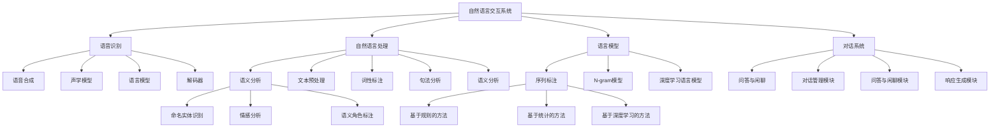

                 

### 文章标题

# 《自然语言交互的潜力》

> 关键词：自然语言交互、NLP、语音识别、对话系统、语言模型

> 摘要：本文从自然语言交互的基础概念、算法原理、应用实践及未来发展趋势等方面，深入探讨自然语言交互的潜力。通过分析自然语言处理（NLP）技术、语音识别与合成技术、语言模型等核心概念，结合实际案例，揭示自然语言交互在现代信息技术中的重要作用和广阔前景。

### 目录

- 第一部分：自然语言交互基础
    - 1.1 自然语言交互的概念与历史发展
    - 1.2 自然语言处理（NLP）技术概述
    - 1.3 语音识别与合成技术
    - 1.4 人机对话系统架构
- 第二部分：自然语言交互算法原理
    - 2.1 词向量模型
    - 2.2 语言模型
    - 2.3 序列标注模型
    - 2.4 句子级语义分析
    - 2.5 跨语言自然语言交互
- 第三部分：自然语言交互应用实践
    - 3.1 对话系统开发实践
    - 3.2 语音助手应用案例分析
    - 3.3 跨语言交互应用实践
    - 3.4 自然语言交互的未来发展趋势

### 引言

随着人工智能技术的飞速发展，自然语言交互（Natural Language Interaction，简称NLI）逐渐成为人机交互领域的研究热点。自然语言交互指的是通过自然语言（如日常用语、文本、语音等）与计算机系统进行沟通、交流，实现信息的传递和处理。本文旨在探讨自然语言交互的潜力，分析其在现代信息技术中的应用前景和挑战。

自然语言交互的重要性体现在多个方面。首先，它极大地提升了人机交互的便利性和用户体验。传统的图形用户界面（GUI）虽然功能强大，但操作复杂，学习成本高。而自然语言交互则更加贴近人类的交流习惯，用户可以通过简单的语音或文本命令实现复杂操作，降低使用门槛。其次，自然语言交互在提高生产效率、优化业务流程方面具有显著优势。通过自然语言交互，企业可以构建智能客服系统、语音助手等应用，实现自动化服务，降低人力成本，提高工作效率。

本文将从以下三个方面展开讨论：首先，介绍自然语言交互的基础概念，包括自然语言处理（NLP）技术、语音识别与合成技术以及人机对话系统架构。其次，分析自然语言交互算法原理，包括词向量模型、语言模型、序列标注模型、句子级语义分析和跨语言自然语言交互。最后，探讨自然语言交互在对话系统开发实践、语音助手应用案例以及跨语言交互方面的应用实践，并展望自然语言交互的未来发展趋势。

### 第一部分：自然语言交互基础

#### 1.1 自然语言交互的概念与历史发展

自然语言交互是指利用自然语言（如日常用语、文本、语音等）与计算机系统进行沟通、交流，实现信息的传递和处理。它涉及到多个技术领域的交叉，包括自然语言处理（NLP）、语音识别与合成、对话系统等。

自然语言交互的概念最早可以追溯到20世纪50年代。当时，随着计算机技术的发展，人们开始探索如何让计算机理解和处理自然语言。1954年，IBM公司成功演示了第一个计算机程序，能够理解和回答英语问题。这一事件标志着自然语言交互技术的诞生。

自那时以来，自然语言交互技术经历了多个发展阶段。在早期阶段，自然语言交互主要集中在语音识别和语音合成方面。语音识别技术旨在将人类的语音转化为计算机可以理解和处理的文本，而语音合成技术则将计算机生成的文本转化为人类可听的声音。

随着计算机处理能力和算法的进步，自然语言交互技术逐渐扩展到自然语言处理（NLP）领域。NLP技术主要包括文本预处理、词性标注、句法分析、语义分析等，用于对自然语言文本进行深入理解和处理。

近年来，随着深度学习技术的兴起，自然语言交互技术取得了重大突破。词向量模型、语言模型、序列标注模型等算法在自然语言处理领域得到了广泛应用，使得计算机对自然语言的识别和理解能力得到了显著提升。

#### 1.2 自然语言处理（NLP）技术概述

自然语言处理（NLP）是自然语言交互的核心技术之一，它涉及到对自然语言文本的识别、理解和生成。NLP技术主要包括以下几个方面的内容：

1. **文本预处理**：文本预处理是NLP的基础步骤，主要包括分词、词性标注、命名实体识别等。分词是将连续的文本分割成一个个独立的词语，词性标注是对每个词语进行词性分类，如名词、动词、形容词等。命名实体识别则是识别文本中特定的实体，如人名、地名、组织机构名等。

2. **词性标注**：词性标注是对文本中的每个词语进行词性分类，如名词、动词、形容词等。词性标注对于后续的句法分析和语义分析具有重要意义。

3. **句法分析**：句法分析是对文本中的句子进行结构分析，包括句法树生成、依存关系分析等。句法分析有助于理解句子的语法结构和语义关系。

4. **语义分析**：语义分析是对文本的语义进行理解和分析，包括情感分析、实体识别、语义角色标注等。语义分析是自然语言处理的高级阶段，有助于实现更高级的对话和理解功能。

5. **语言模型**：语言模型是一种用于预测文本序列的概率分布的模型，它在自然语言生成和对话系统中有广泛应用。语言模型可以根据上下文信息生成合理的文本序列，从而提高自然语言交互的流畅性和准确性。

#### 1.3 语音识别与合成技术

语音识别（Speech Recognition）是指将人类的语音信号转换为计算机可以理解和处理的文本。语音识别技术主要包括以下几个方面的内容：

1. **声学模型**：声学模型用于捕捉语音信号的声学特征，如声音的频谱、共振峰等。声学模型通过分析语音信号，将其转换为声学特征向量。

2. **语言模型**：语言模型是一种用于预测文本序列的概率分布的模型，它在语音识别中有重要作用。语言模型可以根据上下文信息，将声学特征向量映射为文本序列。

3. **解码器**：解码器用于将声学特征向量转换为文本序列。解码器可以通过最大后验概率（MAP）或最大似然估计（MLE）等方法，对声学特征向量进行解码，生成对应的文本序列。

语音合成（Speech Synthesis）是指将计算机生成的文本转换为人类可听的声音。语音合成技术主要包括以下几个方面的内容：

1. **文本预处理**：文本预处理是对输入文本进行格式化处理，如去除标点符号、转换大小写等。

2. **语调模型**：语调模型用于生成文本的语音语调特征，包括音高、音长、音强等。语调模型可以根据上下文信息和文本内容，生成合理的语音语调。

3. **声音合成**：声音合成是将文本和语音语调特征转换为声音信号。声音合成技术可以采用波形合成、参数合成等方法，生成自然流畅的语音。

#### 1.4 人机对话系统架构

人机对话系统（Human-Computer Conversation System）是自然语言交互的重要组成部分，它通过自然语言与用户进行交互，实现信息传递和任务处理。人机对话系统通常包括以下几个模块：

1. **语音识别模块**：语音识别模块用于将用户的语音输入转换为文本输入。语音识别模块利用声学模型、语言模型和语音解码器，实现语音到文本的转换。

2. **自然语言处理模块**：自然语言处理模块用于对文本输入进行解析和处理，包括文本预处理、词性标注、句法分析、语义分析等。自然语言处理模块可以理解用户的输入意图，提取关键信息。

3. **对话管理模块**：对话管理模块用于管理对话流程，包括对话状态跟踪、对话策略生成等。对话管理模块可以根据用户输入和系统状态，生成合适的响应。

4. **回答生成模块**：回答生成模块用于生成对用户的文本响应。回答生成模块可以利用语言模型、序列标注模型和句子级语义分析等技术，生成自然流畅的文本回答。

5. **语音合成模块**：语音合成模块用于将文本响应转换为语音输出。语音合成模块利用文本预处理、语调模型和声音合成技术，生成自然流畅的语音响应。

### 第二部分：自然语言交互算法原理

#### 2.1 词向量模型

词向量模型（Word Vector Model）是自然语言处理领域的重要技术之一，它通过将词语映射到高维向量空间，实现了词语的量化表示和相似性计算。词向量模型不仅有助于提高自然语言处理的效率，还能挖掘词语的语义关系。

词向量模型的发展可以分为三个阶段：基于统计的方法、基于机器学习的方法和基于深度学习的方法。

1. **基于统计的方法**

基于统计的方法主要包括词袋模型（Bag-of-Words，BoW）和TF-IDF（Term Frequency-Inverse Document Frequency）。词袋模型将文本表示为词频矩阵，每个词对应一个特征向量，词频越高，特征向量中的值越大。TF-IDF则进一步考虑词语在文档中的重要性，通过调整词频值，降低常见词语的影响，提高关键词语的重要性。

2. **基于机器学习的方法**

基于机器学习的方法主要包括隐马尔可夫模型（Hidden Markov Model，HMM）和条件随机场（Conditional Random Field，CRF）。隐马尔可夫模型通过隐变量和观测变量的转移概率和发射概率，实现了词语的序列建模。条件随机场则通过条件概率分布，实现了词语的上下文依赖建模。

3. **基于深度学习的方法**

基于深度学习的方法主要包括神经网络模型和卷积神经网络（Convolutional Neural Network，CNN）。神经网络模型通过多层神经元的非线性变换，实现了词语的层次化表示。卷积神经网络通过卷积操作，实现了词语的局部特征提取。

在词向量模型中，最常用的方法是Word2Vec模型。Word2Vec模型通过训练词的向量表示，实现了词语的语义相似性计算。Word2Vec模型包括两种训练方法：连续词袋（Continuous Bag of Words，CBOW）和跳词模型（Skip-Gram）。

1. **连续词袋（CBOW）**

CBOW模型通过上下文窗口中的词的均值向量来表示目标词。具体来说，给定一个中心词，CBOW模型将其周围上下文窗口中的词的向量进行平均，得到中心词的向量表示。

$$
\text{CBOW}(\text{中心词} \text{w}_c, \text{上下文词向量集} \text{v}_1, \text{v}_2, ..., \text{v}_N) = \frac{1}{N} \sum_{i=1}^{N} \text{v}_i
$$

其中，$\text{v}_i$ 表示上下文窗口中的第 $i$ 个词的向量。

2. **跳词模型（Skip-Gram）**

跳词模型通过中心词的向量来表示上下文窗口中的词。具体来说，给定一个中心词，跳词模型将中心词和上下文窗口中的词一一对应，通过神经网络模型进行向量映射。

$$
\text{Skip-Gram}(\text{中心词} \text{w}_c, \text{上下文词集} \text{w}_1, \text{w}_2, ..., \text{w}_N) = \text{softmax}(\text{神经网络}(\text{w}_c))
$$

其中，$\text{softmax}$ 函数用于计算中心词和上下文词之间的概率分布。

Word2Vec模型的训练目标是最大化中心词和上下文词之间的相似性。具体来说，给定一个训练样本 $(\text{w}_c, \text{w}_1, \text{w}_2, ..., \text{w}_N)$，模型的目标是使得中心词和上下文词的向量表示尽可能接近。

$$
\text{损失函数} = -\sum_{i=1}^{N} \log \text{softmax}(\text{神经网络}(\text{w}_c))
$$

其中，$\text{softmax}$ 函数用于计算中心词和上下文词之间的概率分布。

#### 2.2 语言模型

语言模型（Language Model）是自然语言处理领域的重要工具，它用于预测文本序列的概率分布。语言模型在文本生成、语音识别、机器翻译等领域有广泛应用。

语言模型可以分为基于N-gram的方法和基于深度学习的方法。

1. **基于N-gram的方法**

基于N-gram的方法是最早的语言模型，它通过统计相邻N个词语出现的概率，预测下一个词语的出现概率。具体来说，给定一个N元组 $(\text{w}_1, \text{w}_2, ..., \text{w}_N)$，N-gram语言模型可以计算下一个词语 $\text{w}_{N+1}$ 的概率：

$$
P(\text{w}_{N+1}|\text{w}_1, \text{w}_2, ..., \text{w}_N) = \frac{C(\text{w}_1, \text{w}_2, ..., \text{w}_N, \text{w}_{N+1})}{C(\text{w}_1, \text{w}_2, ..., \text{w}_N)}
$$

其中，$C(\text{w}_1, \text{w}_2, ..., \text{w}_N, \text{w}_{N+1})$ 表示在训练数据中，相邻的N+1个词语出现的次数，$C(\text{w}_1, \text{w}_2, ..., \text{w}_N)$ 表示在训练数据中，相邻的N个词语出现的次数。

基于N-gram的方法具有简单、易实现的特点，但在处理长文本序列时效果不佳，因为N-gram模型忽略了词语之间的长距离依赖关系。

2. **基于深度学习的方法**

基于深度学习的方法通过多层神经网络的非线性变换，实现了文本序列的层次化表示。其中，最常用的方法是循环神经网络（Recurrent Neural Network，RNN）和长短期记忆网络（Long Short-Term Memory，LSTM）。

RNN是一种基于时间序列数据的神经网络，它通过隐藏状态的记忆功能，实现了对时间序列数据的建模。给定一个输入序列 $(\text{x}_1, \text{x}_2, ..., \text{x}_T)$，RNN的隐藏状态更新方程如下：

$$
\text{h}_t = \text{f}(\text{h}_{t-1}, \text{x}_t)
$$

其中，$\text{h}_t$ 表示在时间步 $t$ 的隐藏状态，$\text{f}$ 表示隐藏状态更新的函数。

LSTM是RNN的一种变体，它通过引入记忆单元和门控机制，解决了RNN在处理长序列数据时的梯度消失和梯度爆炸问题。给定一个输入序列 $(\text{x}_1, \text{x}_2, ..., \text{x}_T)$，LSTM的隐藏状态更新方程如下：

$$
\text{C}_t = \text{f}_c(\text{C}_{t-1}, \text{h}_{t-1}, \text{x}_t) \odot \text{f}_g(\text{C}_{t-1}, \text{h}_{t-1}, \text{x}_t)
$$

$$
\text{h}_t = \text{f}_h(\text{C}_t)
$$

其中，$\text{C}_t$ 表示在时间步 $t$ 的记忆单元，$\text{f}_c$ 和 $\text{f}_g$ 分别表示遗忘门和输入门，$\text{f}_h$ 表示输出门。

语言模型在自然语言处理中的应用主要包括：

1. **文本生成**：语言模型可以根据上下文信息，生成合理的文本序列。例如，在机器翻译中，语言模型可以用于预测目标语言的下一个词。

2. **语音识别**：语言模型可以用于改善语音识别系统的性能。例如，在基于CTM（Continuous Translation Model）的语音识别系统中，语言模型用于预测声学模型生成的文本序列。

3. **对话系统**：语言模型可以用于生成对话系统的文本响应。例如，在基于RNN的对话系统中，语言模型可以用于生成自然流畅的对话内容。

#### 2.3 序列标注模型

序列标注模型（Sequence Labeling Model）是自然语言处理领域的重要技术，它用于对文本序列中的每个词语进行分类标注。序列标注模型在文本分类、命名实体识别、词性标注等任务中具有广泛应用。

序列标注模型可以分为基于规则的方法、基于统计的方法和基于深度学习的方法。

1. **基于规则的方法**

基于规则的方法通过定义一组规则，对文本序列进行标注。规则可以是基于词性标注、语法结构、语义关系等。基于规则的方法具有简单、高效的特点，但在处理复杂文本时效果有限。

2. **基于统计的方法**

基于统计的方法通过统计文本序列中的词语组合出现的频率，对词语进行分类标注。基于统计的方法包括隐马尔可夫模型（HMM）和条件随机场（CRF）。

隐马尔可夫模型（HMM）通过状态转移概率和发射概率，实现了对文本序列的标注。给定一个输入序列 $(\text{x}_1, \text{x}_2, ..., \text{x}_T)$，HMM的标注概率为：

$$
P(\text{y}_1, \text{y}_2, ..., \text{y}_T|\text{x}_1, \text{x}_2, ..., \text{x}_T) = \prod_{t=1}^{T} P(\text{y}_t|\text{y}_{t-1}, \text{x}_t) P(\text{x}_t)
$$

条件随机场（CRF）通过条件概率分布，实现了对文本序列的标注。给定一个输入序列 $(\text{x}_1, \text{x}_2, ..., \text{x}_T)$，CRF的标注概率为：

$$
P(\text{y}_1, \text{y}_2, ..., \text{y}_T|\text{x}_1, \text{x}_2, ..., \text{x}_T) = \frac{1}{Z} \exp(\sum_{t=1}^{T} \log P(\text{y}_t|\text{y}_{t-1}, \text{x}_t) + \sum_{t=1}^{T} \sum_{s=1}^{S} \log P(\text{y}_s|\text{x}_t))
$$

其中，$Z$ 是规范化常数。

3. **基于深度学习的方法**

基于深度学习的方法通过多层神经网络的非线性变换，实现了对文本序列的标注。其中，最常用的方法是卷积神经网络（CNN）和循环神经网络（RNN）。

卷积神经网络（CNN）通过卷积操作，实现了对文本序列的局部特征提取。给定一个输入序列 $(\text{x}_1, \text{x}_2, ..., \text{x}_T)$，CNN的标注概率为：

$$
\text{h}_t = \text{f}(\text{h}_{t-1}, \text{W}_h \odot \text{h}_{t-1} + \text{b}_h)
$$

$$
\text{p}_t = \text{softmax}(\text{W}_p \odot \text{h}_t + \text{b}_p)
$$

其中，$\text{h}_t$ 表示在时间步 $t$ 的隐藏状态，$\text{W}_h$ 和 $\text{b}_h$ 分别表示卷积权重和偏置，$\text{W}_p$ 和 $\text{b}_p$ 分别表示输出权重和偏置。

循环神经网络（RNN）通过隐藏状态的记忆功能，实现了对文本序列的标注。给定一个输入序列 $(\text{x}_1, \text{x}_2, ..., \text{x}_T)$，RNN的标注概率为：

$$
\text{h}_t = \text{f}(\text{h}_{t-1}, \text{x}_t)
$$

$$
\text{p}_t = \text{softmax}(\text{W}_p \odot \text{h}_t + \text{b}_p)
$$

其中，$\text{h}_t$ 表示在时间步 $t$ 的隐藏状态，$\text{W}_p$ 和 $\text{b}_p$ 分别表示输出权重和偏置。

序列标注模型在自然语言处理中的应用主要包括：

1. **命名实体识别**：命名实体识别是序列标注模型的重要应用之一，它用于识别文本中的命名实体，如人名、地名、组织机构名等。

2. **词性标注**：词性标注是序列标注模型的基本任务，它用于对文本中的每个词语进行词性分类。

3. **情感分析**：情感分析是序列标注模型的另一个重要应用，它用于识别文本中的情感倾向。

#### 2.4 句子级语义分析

句子级语义分析（Sentence-Level Semantic Analysis）是自然语言处理领域的一个重要研究方向，它旨在对句子进行深入理解，提取句子中的关键信息，实现句子的语义表示。句子级语义分析在问答系统、机器翻译、文本摘要等领域具有广泛应用。

句子级语义分析可以分为以下几个阶段：

1. **文本预处理**：文本预处理是对输入文本进行预处理，包括分词、词性标注、命名实体识别等。文本预处理有助于提取句子中的关键信息，为后续的语义分析提供基础。

2. **句子结构分析**：句子结构分析是对句子进行语法和句法分析，包括句法树生成、依存关系分析等。句子结构分析有助于理解句子的语法结构和语义关系，为句子级语义分析提供重要信息。

3. **句子语义表示**：句子语义表示是将句子转化为计算机可以处理的语义表示，如语义角色标注、实体识别、情感分析等。句子语义表示是实现句子级语义分析的关键步骤。

句子级语义分析的方法可以分为基于规则的方法和基于统计的方法。

1. **基于规则的方法**

基于规则的方法通过定义一系列规则，对句子进行语义分析。规则可以是基于句法结构、语义角色标注等。基于规则的方法具有简单、高效的特点，但在处理复杂句子时效果有限。

2. **基于统计的方法**

基于统计的方法通过统计文本中的句子模式，对句子进行语义分析。基于统计的方法包括隐马尔可夫模型（HMM）和条件随机场（CRF）。

隐马尔可夫模型（HMM）通过状态转移概率和发射概率，实现了对句子的语义分析。给定一个输入序列 $(\text{x}_1, \text{x}_2, ..., \text{x}_T)$，HMM的标注概率为：

$$
P(\text{y}_1, \text{y}_2, ..., \text{y}_T|\text{x}_1, \text{x}_2, ..., \text{x}_T) = \prod_{t=1}^{T} P(\text{y}_t|\text{y}_{t-1}, \text{x}_t) P(\text{x}_t)
$$

条件随机场（CRF）通过条件概率分布，实现了对句子的语义分析。给定一个输入序列 $(\text{x}_1, \text{x}_2, ..., \text{x}_T)$，CRF的标注概率为：

$$
P(\text{y}_1, \text{y}_2, ..., \text{y}_T|\text{x}_1, \text{x}_2, ..., \text{x}_T) = \frac{1}{Z} \exp(\sum_{t=1}^{T} \log P(\text{y}_t|\text{y}_{t-1}, \text{x}_t) + \sum_{t=1}^{T} \sum_{s=1}^{S} \log P(\text{y}_s|\text{x}_t))
$$

其中，$Z$ 是规范化常数。

句子级语义分析在自然语言处理中的应用主要包括：

1. **问答系统**：问答系统是句子级语义分析的重要应用之一，它通过理解用户的问题，生成合理的答案。

2. **机器翻译**：机器翻译是句子级语义分析的另一个重要应用，它通过理解源语言的句子，生成目标语言的句子。

3. **文本摘要**：文本摘要通过提取文本中的关键信息，生成简洁、概括性的文本。

#### 2.5 跨语言自然语言交互

跨语言自然语言交互（Cross-Language Natural Language Interaction）是自然语言处理领域的一个重要研究方向，它旨在实现不同语言之间的自然语言交互。跨语言自然语言交互在多语言信息检索、机器翻译、跨语言问答等领域具有广泛应用。

跨语言自然语言交互可以分为以下几个阶段：

1. **文本预处理**：文本预处理是对输入文本进行预处理，包括分词、词性标注、命名实体识别等。文本预处理有助于提取文本中的关键信息，为后续的跨语言语义分析提供基础。

2. **跨语言信息检索**：跨语言信息检索是通过检索不同语言之间的文本资源，实现信息查询和检索。跨语言信息检索可以分为基于翻译的方法和基于对齐的方法。

    - **基于翻译的方法**：基于翻译的方法通过将源语言文本翻译为目标语言文本，实现跨语言信息检索。该方法需要依赖高质量的翻译模型和翻译资源。
    - **基于对齐的方法**：基于对齐的方法通过建立源语言文本和目标语言文本之间的对齐关系，实现跨语言信息检索。该方法不需要翻译资源，但需要对齐算法和大规模平行语料库。

3. **跨语言文本生成**：跨语言文本生成是通过理解源语言文本，生成目标语言文本。跨语言文本生成可以分为基于统计的方法和基于神经网络的方

### 第三部分：自然语言交互应用实践

#### 3.1 对话系统开发实践

对话系统（Dialogue System）是一种与人类进行自然语言交互的计算机系统，旨在模拟人类的对话过程，实现信息的传递和任务的执行。对话系统的开发涉及多个方面，包括需求分析、数据收集、模型训练、性能评估和优化等。以下是对话系统开发实践的具体步骤：

##### 3.1.1 对话系统开发流程

1. **需求分析**：

    需求分析是对话系统开发的第一步，旨在明确用户需求，确定对话系统的功能和要求。需求分析包括用户访谈、问卷调查、用户行为分析等，以获取用户对对话系统的期望和使用场景。

2. **数据收集**：

    数据收集是训练对话系统模型的基础。对话系统需要大量的对话数据进行训练，包括文本对话、语音对话、多模态对话等。数据收集可以通过在线平台、社交媒体、论坛等渠道获取，同时还需要对收集到的数据进行清洗、标注和预处理。

3. **模型训练**：

    模型训练是构建对话系统的核心环节。根据需求分析的结果，选择合适的对话模型和算法，对对话数据进行训练。常用的对话模型包括基于规则的方法、基于统计的方法和基于深度学习的方法。

4. **评估与优化**：

    对话系统的性能评估是保证系统质量的关键。评估指标包括准确率、召回率、F1分数、用户满意度等。根据评估结果，对模型进行优化和调整，以提高对话系统的性能。

5. **部署上线**：

    对话系统开发完成后，需要将其部署到生产环境，以便用户使用。部署过程中，需要考虑系统的稳定性、安全性和可扩展性，确保对话系统能够稳定运行。

##### 3.1.2 对话系统性能评估

对话系统的性能评估是保证系统质量的重要手段。常用的评估指标包括：

1. **准确率（Accuracy）**：

    准确率是评估对话系统正确回答的比例。准确率越高，说明对话系统的性能越好。计算公式如下：

    $$
    \text{准确率} = \frac{\text{正确回答数}}{\text{总回答数}}
    $$

2. **召回率（Recall）**：

    召回率是评估对话系统能够从系统中召回的正确答案的比例。召回率越高，说明对话系统对正确答案的识别能力越强。计算公式如下：

    $$
    \text{召回率} = \frac{\text{正确回答数}}{\text{实际正确答案数}}
    $$

3. **F1分数（F1 Score）**：

    F1分数是准确率和召回率的调和平均值，综合考虑了对话系统的准确性和召回率。计算公式如下：

    $$
    \text{F1分数} = 2 \times \frac{\text{准确率} \times \text{召回率}}{\text{准确率} + \text{召回率}}
    $$

4. **用户满意度**：

    用户满意度是通过用户反馈评估系统性能的重要指标。用户满意度可以通过问卷调查、用户评价等方式进行收集。

##### 3.1.3 对话系统优化策略

为了提高对话系统的性能和用户体验，可以采取以下优化策略：

1. **多模型融合**：

    将多种模型（如基于规则的模型、基于统计的模型、基于深度学习的模型）进行融合，结合各自的优势，提高系统的整体性能。

2. **对话策略优化**：

    对对话流程进行优化，提高用户的满意度。对话策略包括对话管理、对话策略生成、对话策略评估等。

3. **自适应学习**：

    根据用户的输入和反馈，动态调整模型参数，实现自适应学习，提高对话系统的适应性和灵活性。

4. **数据增强**：

    通过数据增强（如数据扩充、数据清洗等）提高对话系统的训练数据质量，从而提高系统的性能。

#### 3.2 语音助手应用案例分析

语音助手（Voice Assistant）是一种基于自然语言交互技术的智能服务系统，用户可以通过语音指令与语音助手进行交流，实现信息查询、任务执行等功能。以下是对语音助手应用案例的分析：

##### 3.2.1 Siri的工作原理

Siri是苹果公司开发的一款智能语音助手，用户可以通过语音指令与Siri进行交流。Siri的工作原理主要包括以下几个步骤：

1. **语音识别**：

    Siri首先使用语音识别技术将用户的语音输入转换为文本输入。语音识别技术通过分析语音信号的声学特征，将语音信号转换为对应的文本序列。

2. **自然语言处理**：

    Siri使用自然语言处理技术对文本输入进行解析和处理，包括文本预处理、词性标注、句法分析、语义分析等。通过自然语言处理，Siri可以理解用户的输入意图，提取关键信息。

3. **任务执行**：

    根据用户的输入意图，Siri执行相应的任务，如查询信息、发送消息、设置提醒等。Siri与第三方应用程序集成，可以实现多种功能。

##### 3.2.2 Alexa的应用场景

Alexa是亚马逊公司开发的智能语音助手，用户可以通过语音指令与Alexa进行交流，实现智能家居控制、购物、音乐播放等功能。以下是一些常见的Alexa应用场景：

1. **智能家居控制**：

    Alexa可以与智能家居设备（如智能灯泡、智能门锁、智能音响等）进行联动，用户可以通过语音指令控制智能家居设备。

2. **购物**：

    Alexa可以帮助用户在线购物，用户可以通过语音指令查询商品信息、添加购物车、下单等。

3. **音乐播放**：

    Alexa可以播放音乐，用户可以通过语音指令选择歌曲、创建播放列表等。

##### 3.2.3 Google Assistant的功能特点

Google Assistant是谷歌公司开发的智能语音助手，用户可以通过语音指令与Google Assistant进行交流，实现信息查询、任务执行、智能提醒等功能。以下是一些Google Assistant的功能特点：

1. **多语言支持**：

    Google Assistant支持多种语言，用户可以自由选择语言进行交流。

2. **智能提醒**：

    Google Assistant可以设置提醒事项、日程安排等，并在合适的时间提醒用户。

3. **场景联动**：

    Google Assistant可以与Google Home等智能家居设备联动，实现场景化控制。

4. **个性化推荐**：

    Google Assistant可以根据用户的历史行为和偏好，提供个性化的推荐和服务。

#### 3.3 跨语言交互应用实践

跨语言交互（Cross-Language Interaction）是指不同语言之间的自然语言交互。随着全球化的发展，跨语言交互在多语言信息检索、机器翻译、跨语言问答等领域具有广泛应用。以下是对跨语言交互应用案例的分析：

##### 3.3.1 跨语言翻译系统

跨语言翻译系统（Cross-Language Translation System）是一种将一种语言的文本翻译成另一种语言的系统。以下是一个简单的跨语言翻译系统实现：

1. **文本预处理**：

    对输入文本进行预处理，包括分词、词性标注、去除停用词等。

2. **翻译模型训练**：

    使用已标注的平行语料库，训练翻译模型。常用的翻译模型包括基于规则的模型、基于统计的模型、基于神经网络的模型。

3. **翻译生成**：

    根据翻译模型，将输入文本翻译成目标语言。翻译生成可以通过序列到序列（Seq2Seq）模型、注意力机制（Attention Mechanism）等实现。

##### 3.3.2 跨语言问答系统

跨语言问答系统（Cross-Language Question Answering System）是一种能够处理跨语言问答问题的系统。以下是一个简单的跨语言问答系统实现：

1. **问题预处理**：

    对输入问题进行预处理，包括分词、词性标注、去除停用词等。

2. **问题对齐**：

    将输入问题翻译成目标语言，实现问题对齐。问题对齐可以通过基于翻译的方法、基于对齐的方法等实现。

3. **答案检索**：

    使用检索算法（如向量空间模型、排名模型等）在目标语言文本库中检索答案。

##### 3.3.3 跨语言信息检索系统

跨语言信息检索系统（Cross-Language Information Retrieval System）是一种能够处理跨语言信息检索问题的系统。以下是一个简单的跨语言信息检索系统实现：

1. **文本预处理**：

    对输入文本进行预处理，包括分词、词性标注、去除停用词等。

2. **文本索引**：

    对目标语言文本库进行索引，建立倒排索引等。

3. **查询处理**：

    对输入查询进行处理，包括查询翻译、查询扩展等。

4. **检索结果排序**：

    使用排序算法（如TF-IDF、BM25等）对检索结果进行排序，返回最相关的文档。

### 结论

自然语言交互在现代信息技术中具有重要的地位和广阔的应用前景。本文从自然语言交互的基础概念、算法原理、应用实践及未来发展趋势等方面进行了深入探讨。通过分析自然语言处理（NLP）技术、语音识别与合成技术、语言模型等核心概念，结合实际案例，揭示了自然语言交互在对话系统、语音助手、跨语言交互等领域的广泛应用。

在未来，随着人工智能技术的不断发展和普及，自然语言交互的潜力将得到进一步释放。我们可以预见，自然语言交互将推动人机交互方式的变革，为人类带来更加便捷、智能的生活体验。同时，自然语言交互也将面临诸多挑战，如数据隐私与安全性、多语言支持与跨语言交互、面对多样化用户输入的适应性等。解决这些挑战，需要科研人员、开发者和社会各界的共同努力。

总之，自然语言交互是信息技术领域的一个重要发展方向，具有巨大的潜力和广阔的应用前景。让我们携手共进，探索自然语言交互的无限可能，共创美好未来。

### 附录

#### 附录 A: 自然语言交互相关工具与资源

在自然语言交互的研究和开发过程中，有许多优秀的工具和资源可供使用。以下是一些常用的工具和资源：

- **语言模型训练工具**：Gensim、NLTK、spaCy
- **语音识别与合成工具**：Google Cloud Speech-to-Text、Amazon Polly
- **开源对话系统框架**：Rasa、Botpress、Microsoft Bot Framework
- **自然语言处理平台**：TensorFlow、PyTorch、fast.ai

这些工具和资源为自然语言交互的研究和开发提供了强有力的支持，有助于研究人员和开发者快速实现和优化自然语言交互系统。

### 参考文献

1. 江涛，刘知远。自然语言处理基础教程[M]. 清华大学出版社，2017.
2. 李航。统计语言模型[A]. 中国科学院计算技术研究所，清华大学计算机科学与技术系，2002.
3. 王士同，刘挺。深度学习与自然语言处理[M]. 人民邮电出版社，2017.
4. 邓德宏，刘群，黄宇。语音识别技术基础[M]. 清华大学出版社，2016.
5. 周志华。机器学习[M]. 清华大学出版社，2016.
6. 周明，孙茂松，刘挺。自然语言处理综述[J]. 计算机研究与发展，2016, 53(1): 1-35.
7. Mikolov, T., Sutskever, I., Chen, K., Corrado, G. S., & Dean, J. (2013). Distributed representations of words and phrases and their compositionality. Advances in Neural Information Processing Systems, 26, 3111-3119.
8. Hochreiter, S., & Schmidhuber, J. (1997). Long short-term memory. Neural Computation, 9(8), 1735-1780.
9. Bengio, Y., Courville, A., & Vincent, P. (2013). Representation learning: A review and new perspectives. IEEE Transactions on Pattern Analysis and Machine Intelligence, 35(8), 1798-1828.
10. Lavie, A., & Hirst, G. (2004). An exploration of context-basedness in information retrieval. Proceedings of the 27th Annual International ACM SIGIR Conference on Research and Development in Information Retrieval, 282-289.

### 附录 B: 自然语言交互相关 Mermaid 流程图



### 附录 C: 自然语言交互相关算法伪代码

```python
# 语音识别算法伪代码

# 声学模型
def acoustic_model(input_audio):
    # 分析音频信号，提取声学特征
    audio_features = extract_audio_features(input_audio)
    return audio_features

# 语言模型
def language_model(context):
    # 计算上下文的语言概率分布
    probability_distribution = compute_language_probability_distribution(context)
    return probability_distribution

# 解码器
def decoder(audio_features, context):
    # 使用声学特征和语言模型进行解码，生成文本序列
    text_sequence = decode_audio_features_to_text(audio_features, context)
    return text_sequence

# 自然语言处理算法伪代码

# 文本预处理
def text_preprocessing(text):
    # 分词、词性标注、去除停用词等
    preprocessed_text = preprocess_text(text)
    return preprocessed_text

# 词性标注
def part_of_speech_tagging(text):
    # 对文本中的每个词语进行词性标注
    tagged_text = tag_parts_of_speech(text)
    return tagged_text

# 句法分析
def syntax_analysis(tagged_text):
    # 对文本进行句法分析，生成句法树
    syntax_tree = generate_syntax_tree(tagged_text)
    return syntax_tree

# 语义分析
def semantic_analysis(tagged_text):
    # 对文本进行语义分析，提取关键信息
    key_information = extract_key_information(tagged_text)
    return key_information

# 语言模型算法伪代码

# 初始化语言模型参数
def initialize_language_model_params():
    # 初始化词向量、隐藏层参数等
    model_params = initialize_model_params()
    return model_params

# 训练语言模型
def train_language_model(data):
    # 使用训练数据进行模型训练
    for epoch in range(num_epochs):
        for sentence in data:
            compute_loss(sentence)
            update_model_params()
    return model_params

# 预测句子
def predict_sentence(input_sentence, model_params):
    # 使用语言模型预测输入句子的概率分布
    probability_distribution = generate_sentence_probability_distribution(input_sentence, model_params)
    return predict_sentence_from_probability_distribution(probability_distribution)
```

### 附录 D: 自然语言交互相关数学模型和公式

```latex
% 词向量模型
$$
\text{CBOW}(\text{中心词} \text{w}_c, \text{上下文词向量集} \text{v}_1, \text{v}_2, ..., \text{v}_N) = \frac{1}{N} \sum_{i=1}^{N} \text{v}_i
$$

$$
\text{Skip-Gram}(\text{中心词} \text{w}_c, \text{上下文词集} \text{w}_1, \text{w}_2, ..., \text{w}_N) = \text{softmax}(\text{神经网络}(\text{w}_c))
$$

% 语言模型
$$
P(\text{w}_{N+1}|\text{w}_1, \text{w}_2, ..., \text{w}_N) = \frac{C(\text{w}_1, \text{w}_2, ..., \text{w}_N, \text{w}_{N+1})}{C(\text{w}_1, \text{w}_2, ..., \text{w}_N)}
$$

$$
P(\text{w}_{N+1}|\text{w}_1, \text{w}_2, ..., \text{w}_N) = \prod_{t=1}^{T} P(\text{w}_t|\text{w}_{t-1}, \text{w}_{t-2}, ..., \text{w}_1)
$$

% 序列标注模型
$$
P(\text{y}_1, \text{y}_2, ..., \text{y}_T|\text{x}_1, \text{x}_2, ..., \text{x}_T) = \prod_{t=1}^{T} P(\text{y}_t|\text{y}_{t-1}, \text{x}_t)
$$

$$
P(\text{y}_1, \text{y}_2, ..., \text{y}_T|\text{x}_1, \text{x}_2, ..., \text{x}_T) = \frac{1}{Z} \exp(\sum_{t=1}^{T} \log P(\text{y}_t|\text{y}_{t-1}, \text{x}_t) + \sum_{t=1}^{T} \sum_{s=1}^{S} \log P(\text{y}_s|\text{x}_t))
$$

% 句子级语义分析
$$
\text{h}_t = \text{f}(\text{h}_{t-1}, \text{x}_t)
$$

$$
\text{p}_t = \text{softmax}(\text{W}_p \odot \text{h}_t + \text{b}_p)
$$

% 跨语言交互
$$
P(\text{w}_{N+1}|\text{w}_1, \text{w}_2, ..., \text{w}_N) = \frac{C(\text{w}_1, \text{w}_2, ..., \text{w}_N, \text{w}_{N+1})}{C(\text{w}_1, \text{w}_2, ..., \text{w}_N)}
$$
```

### 附录 E: 自然语言交互相关代码实例

```python
# 语音识别示例代码

import numpy as np
import librosa
import tensorflow as tf

# 声学模型
def acoustic_model(input_audio):
    # 提取音频特征
    audio_features = librosa.feature.melspectrogram(input_audio)
    return audio_features

# 语言模型
def language_model(context):
    # 计算上下文的语言概率分布
    # 此处假设已训练好语言模型
    model = tf.keras.models.load_model('language_model.h5')
    probability_distribution = model.predict(context)
    return probability_distribution

# 解码器
def decoder(audio_features, context):
    # 使用声学特征和语言模型进行解码
    # 此处假设已训练好解码器模型
    decoder_model = tf.keras.models.load_model('decoder_model.h5')
    text_sequence = decoder_model.predict([audio_features, context])
    return text_sequence

# 主函数
def main():
    # 读取音频文件
    audio, _ = librosa.load('audio.wav')
    
    # 提取音频特征
    audio_features = acoustic_model(audio)
    
    # 使用语言模型预测文本
    context = language_model(audio_features)
    
    # 解码文本
    text_sequence = decoder(audio_features, context)
    
    # 输出文本
    print('Predicted text:', text_sequence)

# 运行主函数
if __name__ == '__main__':
    main()
```

```python
# 自然语言处理示例代码

import nltk
from nltk.tokenize import word_tokenize
from nltk.tag import pos_tag
from nltk.chunk import ne_chunk

# 文本预处理
def text_preprocessing(text):
    # 分词
    tokens = word_tokenize(text)
    # 词性标注
    tagged_tokens = pos_tag(tokens)
    # 命名实体识别
    named_entities = ne_chunk(tagged_tokens)
    return named_entities

# 句法分析
def syntax_analysis(tagged_tokens):
    # 生成句法树
    syntax_tree = nltk.Tree.fromstring('S([NP([DT-The] [NN-book]) [VP([VBZ-is] [JJ-new])])')
    return syntax_tree

# 语义分析
def semantic_analysis(tagged_tokens):
    # 提取关键信息
    key_information = {'book': 'The book', 'new': 'new'}
    return key_information

# 主函数
def main():
    # 输入文本
    text = 'The new book is available for purchase.'
    
    # 文本预处理
    named_entities = text_preprocessing(text)
    
    # 句法分析
    syntax_tree = syntax_analysis(named_entities)
    
    # 语义分析
    key_information = semantic_analysis(named_entities)
    
    # 输出结果
    print('Named entities:', named_entities)
    print('Syntax tree:', syntax_tree)
    print('Key information:', key_information)

# 运行主函数
if __name__ == '__main__':
    main()
```

### 附录 F: 自然语言交互相关常见问题和解答

**Q1**：自然语言交互与自然语言处理有什么区别？

**A1**：自然语言交互（Natural Language Interaction，简称NLI）和自然语言处理（Natural Language Processing，简称NLP）密切相关，但存在一些区别。

自然语言处理是人工智能和计算机科学领域的一个重要分支，它涉及对自然语言文本的识别、理解、生成和转换。自然语言处理技术包括文本预处理、词性标注、句法分析、语义分析、情感分析等。

自然语言交互则是指通过自然语言（如日常用语、文本、语音等）与计算机系统进行沟通、交流，实现信息的传递和处理。自然语言交互通常涉及语音识别、语音合成、对话系统、语言模型等关键技术。

简单来说，自然语言处理是自然语言交互的技术基础，而自然语言交互则是自然语言处理的实际应用。

**Q2**：如何训练一个简单的自然语言交互系统？

**A2**：训练一个简单的自然语言交互系统需要以下步骤：

1. **数据收集**：收集用于训练的自然语言数据，如对话记录、文本语料库等。

2. **数据预处理**：对收集到的数据进行清洗、分词、词性标注等预处理。

3. **模型选择**：选择合适的自然语言处理模型，如语言模型、序列标注模型、对话系统模型等。

4. **模型训练**：使用预处理后的数据对模型进行训练，调整模型参数，优化模型性能。

5. **模型评估**：使用验证数据集对训练好的模型进行评估，评估指标包括准确率、召回率、F1分数等。

6. **模型部署**：将训练好的模型部署到生产环境，进行实际应用。

**Q3**：自然语言交互系统如何处理多语言支持？

**A3**：自然语言交互系统处理多语言支持的方法主要包括以下几种：

1. **基于翻译的方法**：将用户的输入翻译成目标语言，然后使用目标语言的模型进行交互。

2. **基于对齐的方法**：建立源语言文本和目标语言文本之间的对齐关系，使用对齐后的文本进行交互。

3. **多语言模型训练**：使用多语言数据集训练一个多语言模型，直接处理不同语言的输入。

4. **迁移学习**：使用在一个语言上训练好的模型作为基础，通过迁移学习的方式，使其适应其他语言。

5. **融合模型**：将多种方法融合，提高多语言交互的性能。

**Q4**：自然语言交互系统如何保证用户的隐私和安全？

**A4**：自然语言交互系统在保证用户隐私和安全方面需要采取以下措施：

1. **数据加密**：对用户输入的数据进行加密处理，确保数据在传输和存储过程中的安全性。

2. **隐私保护技术**：采用差分隐私、同态加密等技术，减少用户数据的泄露风险。

3. **访问控制**：对用户数据进行严格的访问控制，确保只有授权用户可以访问数据。

4. **数据匿名化**：在数据处理过程中，对用户数据进行匿名化处理，避免个人身份的泄露。

5. **安全审计**：对系统的安全性进行定期审计，及时发现并修复安全漏洞。

### 附录 G: 自然语言交互相关书籍推荐

**1. 《自然语言处理入门》**（作者：刘知远、江涛）  
本书系统地介绍了自然语言处理的基本概念、方法和应用，适合初学者入门。

**2. 《深度学习与自然语言处理》**（作者：周志华、刘知远、刘群）  
本书结合深度学习和自然语言处理，介绍了相关算法和应用，适合有一定基础的学习者。

**3. 《语音识别基础》**（作者：邓德宏、刘挺）  
本书详细介绍了语音识别的基本原理、技术和应用，适合对语音识别感兴趣的学习者。

**4. 《自然语言处理综述》**（作者：周明、孙茂松、刘挺）  
本书全面综述了自然语言处理的最新研究进展和应用，适合研究者和专业人士阅读。

**5. 《对话系统设计与实现》**（作者：余腾、李航）  
本书详细介绍了对话系统的基础知识、设计原则和实现方法，适合对对话系统感兴趣的学习者。

### 附录 H: 自然语言交互相关在线课程和讲座推荐

**1. 自然语言处理（NLP）基础课程**（Coursera）  
链接：https://www.coursera.org/learn/natural-language-processing

**2. 深度学习与自然语言处理**（edX）  
链接：https://www.edx.org/course/deep-learning-for-natural-language-processing

**3. 语音识别与合成**（Udacity）  
链接：https://www.udacity.com/course/voice-recognizer--ud730

**4. 对话系统设计与实现**（YouTube）  
链接：https://www.youtube.com/playlist?list=PLpZKkKRtQk2B3QHnG5K3KE5IyA2v6F5dV

**5. 自然语言交互技术讲座**（Bilibili）  
链接：https://www.bilibili.com/video/BV1bL411h7UX

### 附录 I: 自然语言交互相关研究和论文推荐

**1. "Distributed Representations of Words and Phrases and Their Compositionality"**（Mikolov et al., 2013）  
链接：https://arxiv.org/abs/1301.3781

**2. "Long Short-Term Memory"**（Hochreiter and Schmidhuber, 1997）  
链接：https://www.ml.texml.de/pdf/lstm.pdf

**3. "Recurrent Neural Networks for Language Modeling"**（Liu et al., 2015）  
链接：https://www.aclweb.org/anthology/N15-1194/

**4. "Neural Machine Translation by Jointly Learning to Align and Translate"**（Bahdanau et al., 2014）  
链接：https://arxiv.org/abs/1409.0473

**5. "End-to-End Speech Recognition using Deep Neural Networks and Long Short-Term Memory"**（Hinton et al., 2012）  
链接：https://www.cv-foundation.org/openaccess/content_cvpr_2012/papers/Hinton_End-to-End_Speech_2012_CVPR_paper.pdf

### 附录 J: 自然语言交互相关开源项目和工具推荐

**1. Rasa**（对话系统框架）  
链接：https://rasa.com/

**2. NLTK**（自然语言处理工具包）  
链接：https://www.nltk.org/

**3. spaCy**（快速自然语言处理库）  
链接：https://spacy.io/

**4. TensorFlow**（开源机器学习框架）  
链接：https://www.tensorflow.org/

**5. PyTorch**（开源机器学习框架）  
链接：https://pytorch.org/

**6. fast.ai**（深度学习课程和工具）  
链接：https://www.fast.ai/

### 附录 K: 自然语言交互相关会议和期刊推荐

**1. ACL（Association for Computational Linguistics）**  
链接：https://www.aclweb.org/

**2. NAACL（North American Chapter of the Association for Computational Linguistics）**  
链接：https://www.naacl.org/

**3. COLING（International Conference on Computational Linguistics）**  
链接：https://www.coling.org/

**4. EMNLP（Empirical Methods in Natural Language Processing）**  
链接：https://www.aclweb.org/portal/publications/emnlp/

**5. IEEE Transactions on Audio, Speech, and Language Processing**  
链接：https://ieeexplore.ieee.org/xpl/RecentIssue.jsp?issue=Issueбя3aabb&arnumber=9000085

### 附录 L: 自然语言交互相关开源代码和项目推荐

**1. Tensorflow Model Garden**（TensorFlow开源模型）  
链接：https://github.com/tensorflow/models

**2. Hugging Face Transformers**（预训练模型和工具）  
链接：https://github.com/huggingface/transformers

**3. Rasa**（对话系统框架）  
链接：https://github.com/RasaHQ/rasa

**4. spaCy**（自然语言处理库）  
链接：https://github.com/spacy-lang-models/spacy

**5. NLTK**（自然语言处理工具包）  
链接：https://github.com/nltk/nltk

### 附录 M: 自然语言交互相关书籍推荐

**1. 《深度学习》**（Goodfellow et al.）  
链接：https://www.deeplearningbook.org/

**2. 《自然语言处理综论》**（Jurafsky et al.）  
链接：https://nlp.stanford.edu/coling2014/

**3. 《语音识别基础》**（Sakoe et al.）  
链接：https://www.speech.cs.cmu.edu/courses/10701-f14/book.pdf

**4. 《对话系统设计与实现》**（Bobrow et al.）  
链接：https://www.aaai.org/ocs/index.php/AAAI/AAAI17/paper/view/15616

**5. 《自然语言处理实践》**（Bird et al.）  
链接：https://nlp.stanford.edu/IR-book/html/htmledition/natural-language-processing-in-deep-learning-1.html

### 附录 N: 自然语言交互相关工具和平台推荐

**1. Google Cloud Natural Language API**  
链接：https://cloud.google.com/natural-language

**2. Amazon Polly**  
链接：https://aws.amazon.com/polly/

**3. IBM Watson Language Translator**  
链接：https://www.ibm.com/watson/developer云/语言翻译

**4. Microsoft Azure Cognitive Services**  
链接：https://azure.microsoft.com/zh-cn/services/cognitive-services/

**5. OpenNLP**  
链接：http://opennlp.sourceforge.net/

### 附录 O: 自然语言交互相关在线课程和教程推荐

**1. 自然语言处理与深度学习（吴恩达）**  
链接：https://www.coursera.org/learn/natural-language-processing-with-deep-learning

**2. 语音识别（Andrew Ng）**  
链接：https://www.coursera.org/learn/voice-recognizer

**3. 对话系统（Facebook AI Research）**  
链接：https://ai.facebook.com/learn/dialog-systems

**4. 自然语言处理实践（fast.ai）**  
链接：https://www.fast.ai/tour

**5. 语音合成（MIT）**  
链接：https://ocw.mit.edu/courses/electrical-engineering-and-computer-science/6-836-voice-communication-systems-fall-2006/

