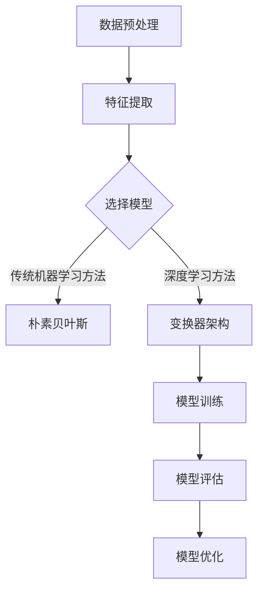

                 

# 《自然语言处理在情感分析中的应用》

> 关键词：自然语言处理、情感分析、机器学习、深度学习、应用场景

> 摘要：本文将深入探讨自然语言处理（NLP）在情感分析中的应用，从基础理论到实际应用，逐步分析情感分析的关键技术、挑战及未来发展趋势。

### 目录

### 《自然语言处理在情感分析中的应用》

#### 第一部分：自然语言处理基础

#### 第二部分：情感分析技术

#### 第三部分：情感分析应用

#### 第四部分：情感分析项目实战

#### 附录

#### 附录 A：自然语言处理与情感分析相关资源

#### 附录 B：自然语言处理与情感分析中的Mermaid流程图

#### 附录 C：数学模型与公式解释

### 引言

自然语言处理（NLP）作为人工智能领域的一个重要分支，近年来取得了显著的发展。它旨在让计算机理解和处理人类语言，以实现人与机器的智能交互。情感分析作为NLP的一个重要应用方向，通过对文本中的情感倾向和情感强度进行分析，为企业和研究机构提供了宝贵的数据洞察。本文将围绕自然语言处理在情感分析中的应用进行深入探讨，旨在帮助读者全面了解这一领域的关键技术和实践方法。

### 第一部分：自然语言处理基础

#### 1.1 自然语言处理概述

自然语言处理（NLP）是计算机科学和人工智能领域的一个重要分支，旨在让计算机理解和处理人类语言。它涉及语言学、计算机科学、人工智能等多个学科的知识。NLP的主要目标包括文本分类、实体识别、关系抽取、机器翻译等。在这些任务中，情感分析是一个重要的应用方向，它关注文本中表达的情感信息，旨在识别和分类情感极性、情感强度等。

#### 1.1.1 自然语言处理的基本概念

自然语言处理涉及多个基本概念，包括：

1. 语言模型：语言模型是一种概率模型，用于预测文本序列的概率。它通过学习大量语料库中的文本数据，生成语言分布的概率模型。

2. 词嵌入：词嵌入是将词汇映射到高维向量空间的技术，使文本数据具有更丰富的结构信息。词嵌入技术在自然语言处理中发挥着重要作用，如文本分类、情感分析等。

3. 序列模型：序列模型是一种用于处理序列数据的模型，如循环神经网络（RNN）和长短期记忆网络（LSTM）。这些模型能够捕捉序列数据中的时序依赖关系。

#### 1.1.2 自然语言处理的任务类型

自然语言处理任务类型多种多样，其中一些常见的任务包括：

1. 文本分类：将文本分为预定义的类别，如垃圾邮件分类、情感分类等。

2. 实体识别：识别文本中的实体，如人名、地名、组织名等。

3. 关系抽取：抽取文本中实体之间的语义关系，如“张三工作是工程师”中的“张三”和“工程师”之间的关系。

4. 机器翻译：将一种语言的文本翻译成另一种语言的文本。

5. 情感分析：分析文本中的情感倾向和情感强度，如正面情感、负面情感等。

#### 1.1.3 情感分析的定义与背景

情感分析是一种针对文本数据，提取其中情感信息的技术。它关注文本中表达的情感倾向、情感极性和情感强度等。情感分析在许多应用领域中具有广泛的应用，如社交媒体分析、舆情监测、情感营销等。

情感分析的发展可以追溯到20世纪80年代，随着计算机技术和人工智能技术的发展，情感分析逐渐成为一个独立的领域。近年来，随着深度学习技术的兴起，情感分析取得了显著的进展。深度学习模型如卷积神经网络（CNN）、循环神经网络（RNN）和变换器架构（Transformer）等在情感分析任务中表现出色，极大地提高了情感分析的准确性和效率。

#### 1.2 语言学与计算语言学

语言学是研究人类语言结构和语言使用规律的科学，它为自然语言处理提供了重要的理论基础。计算语言学是语言学和计算机科学的交叉领域，旨在将语言学知识应用于计算机系统中，以提高计算机处理自然语言的能力。

#### 1.2.1 语言学的基本概念

语言学的基本概念包括：

1. 词汇：词汇是语言的构成要素，包括单词和短语。

2. 语法：语法是语言的结构规则，用于描述词汇组合的规则。

3. 语义：语义是词汇和句子所表达的意义。

4. 语音：语音是语言的物理表现形式，包括音素、音节、语调等。

#### 1.2.2 计算语言学的应用

计算语言学在自然语言处理中有着广泛的应用，包括：

1. 语言模型：计算语言学通过构建语言模型，模拟人类语言生成和理解的规律。

2. 词嵌入：计算语言学中的词嵌入技术，将词汇映射到高维向量空间，实现文本数据的结构化表示。

3. 语言生成：计算语言学中的语言生成技术，可以模拟人类语言的生成过程，实现文本自动生成。

#### 1.2.3 语言模型与词嵌入

语言模型是计算语言学中的一个核心概念，它用于预测文本序列的概率。语言模型可以分为基于规则的模型和基于统计的模型。词嵌入是将词汇映射到高维向量空间的技术，通过将词汇表示为向量，实现文本数据的结构化表示。词嵌入技术在自然语言处理中具有广泛的应用，如文本分类、情感分析、机器翻译等。

#### 1.3 语言处理技术基础

语言处理技术是自然语言处理的基础，包括：

1. 语言模型：语言模型用于预测文本序列的概率，是自然语言处理的核心技术之一。

2. 序列模型：序列模型用于处理序列数据，如循环神经网络（RNN）和长短期记忆网络（LSTM）。

3. 注意力机制：注意力机制是变换器架构（Transformer）的核心组件，用于捕捉序列数据中的长距离依赖关系。

#### 1.3.1 语言模型与序列模型

语言模型和序列模型是自然语言处理中的核心技术，它们在情感分析任务中发挥着重要作用。

1. 语言模型：语言模型是一种概率模型，用于预测文本序列的概率。它通过学习大量语料库中的文本数据，生成语言分布的概率模型。在情感分析任务中，语言模型可以用于情感分类、情感强度预测等。

2. 序列模型：序列模型是一种用于处理序列数据的模型，如循环神经网络（RNN）和长短期记忆网络（LSTM）。这些模型能够捕捉序列数据中的时序依赖关系，在情感分析任务中具有广泛的应用。例如，可以使用RNN或LSTM模型对文本序列进行编码，然后使用全连接层对编码后的特征进行分类。

#### 1.3.2 注意力机制与变换器架构

注意力机制和变换器架构是自然语言处理中的核心技术，它们在情感分析任务中发挥着重要作用。

1. 注意力机制：注意力机制是一种用于捕捉序列数据中长距离依赖关系的方法。在情感分析任务中，注意力机制可以用于模型对文本序列的编码，从而更好地捕捉文本中的情感信息。

2. 变换器架构：变换器架构（Transformer）是一种基于自注意力机制的序列到序列模型，它在自然语言处理任务中表现出色。变换器架构的核心组件是自注意力机制，它通过计算不同位置之间的关联性，实现文本序列的编码和解码。

#### 1.3.3 深度学习在自然语言处理中的应用

深度学习在自然语言处理中具有广泛的应用，包括：

1. 词嵌入：深度学习可以用于训练词嵌入模型，将词汇映射到高维向量空间，实现文本数据的结构化表示。

2. 语言模型：深度学习可以用于训练语言模型，生成文本序列的概率分布。

3. 序列模型：深度学习可以用于训练序列模型，如循环神经网络（RNN）和长短期记忆网络（LSTM），用于处理序列数据。

4. 情感分析：深度学习可以用于训练情感分析模型，对文本进行情感分类和情感强度预测。

#### 1.4 预训练语言模型

预训练语言模型是近年来自然语言处理领域的一项重要进展。预训练语言模型通过在大量无标注数据上进行预训练，然后使用微调技术针对具体任务进行训练，从而实现高性能的自然语言处理任务。

#### 1.4.1 预训练语言模型的原理

预训练语言模型的原理可以概括为以下三个步骤：

1. 预训练：在大量无标注数据上进行预训练，训练模型对语言数据进行建模。

2. 微调：使用预训练模型在具体任务上进行微调，优化模型在任务上的性能。

3. 部署：将微调后的模型部署到实际应用场景中，如文本分类、情感分析等。

#### 1.4.2 主流预训练语言模型介绍

目前，主流的预训练语言模型包括：

1. 词嵌入：Word2Vec、GloVe

2. 生成模型：BERT、GPT、RoBERTa

3. 实体识别：ERLM、DeBERTa

#### 1.4.3 预训练语言模型的应用

预训练语言模型在自然语言处理任务中具有广泛的应用，包括：

1. 文本分类：预训练语言模型可以用于文本分类任务，如情感分类、新闻分类等。

2. 问答系统：预训练语言模型可以用于问答系统，如机器阅读理解、对话系统等。

3. 机器翻译：预训练语言模型可以用于机器翻译任务，如英译中、中译英等。

### 第二部分：情感分析技术

#### 2.1 情感分析的基本概念

情感分析是一种针对文本数据，提取其中情感信息的技术。它关注文本中表达的情感倾向、情感极性和情感强度等。

#### 2.1.1 情感极性分类

情感极性分类是将文本分为正面情感、负面情感和中性情感的分类任务。情感极性分类是情感分析中最基本和最常见的一种任务。它可以通过以下步骤实现：

1. 数据预处理：对文本进行清洗、去停用词、词干提取等预处理操作，提高文本质量。

2. 特征提取：使用词嵌入、TF-IDF等特征提取方法，将文本表示为向量。

3. 模型训练：使用机器学习算法，如朴素贝叶斯、支持向量机等，对模型进行训练。

4. 模型评估：使用准确率、召回率、F1值等指标对模型进行评估。

#### 2.1.2 情感强度分析

情感强度分析是对文本中情感极性进行量化分析的任务。情感强度分析可以用于识别文本中的强烈情感，如愤怒、喜悦等。情感强度分析可以通过以下步骤实现：

1. 数据预处理：对文本进行清洗、去停用词、词干提取等预处理操作，提高文本质量。

2. 特征提取：使用词嵌入、TF-IDF等特征提取方法，将文本表示为向量。

3. 模型训练：使用机器学习算法，如循环神经网络（RNN）、变换器架构（Transformer）等，对模型进行训练。

4. 模型评估：使用准确率、召回率、F1值等指标对模型进行评估。

#### 2.1.3 情感分类的任务与挑战

情感分类是情感分析中的一个重要任务，它旨在将文本分类为不同的情感类别。情感分类任务面临以下挑战：

1. 多样性：不同领域的文本数据具有多样性，情感表达形式也各不相同。

2. 模糊性：文本中的情感表达可能存在模糊性，难以准确判断情感极性。

3. 复杂性：情感分类任务涉及多个情感类别，且类别之间存在交叉和重叠。

4. 数据不平衡：不同情感类别的文本数据分布不平衡，影响模型的训练效果。

#### 2.2 情感分析的数学模型

情感分析中的数学模型主要用于描述情感信息的提取和分类过程。以下是一些常见的数学模型：

1. 情感极性分类模型：情感极性分类模型用于将文本分类为正面、负面或中性情感。常见的模型包括朴素贝叶斯、支持向量机、逻辑回归等。

2. 情感强度分析模型：情感强度分析模型用于对文本中的情感强度进行量化分析。常见的模型包括循环神经网络（RNN）、变换器架构（Transformer）等。

3. 情感分类与强度分析联合模型：情感分类与强度分析联合模型将情感分类和强度分析两个任务结合起来，实现情感分类和强度分析的同时优化。

#### 2.2.1 情感分析中的数学公式

以下是一些情感分析中的数学公式：

1. 朴素贝叶斯分类器：

$$P(y|x) = \frac{P(x|y)P(y)}{P(x)}$$

2. 支持向量机：

$$w^* = arg\min_w \frac{1}{2}||w||^2_2 + C\sum_{i=1}^m \xi_i$$

3. 循环神经网络（RNN）：

$$h_t = \sigma(W_hh_{t-1} + W_xx_t + b_h)$$

4. 变换器架构（Transformer）：

$$at = softmax(QK^T/V)$$

#### 2.2.2 伪代码解释

以下是一些情感分析中的伪代码：

1. 朴素贝叶斯分类器：

```
function NaiveBayesClassifier(train_data, test_data):
    # 训练阶段
    for each category y in train_data:
        P(y) = count(y) / total number of instances
        for each word w in train_data:
            P(w|y) = count(w, y) / count(y)
    
    # 测试阶段
    for each instance x in test_data:
        P(x) = 1
        for each category y:
            P(y|x) = P(x|y)P(y)
        return the category with the highest P(x|y)P(y)
```

2. 支持向量机：

```
function SupportVectorMachine(train_data, C):
    # 训练阶段
    optimize the objective function:
    w^* = arg\min_w \frac{1}{2}||w||^2_2 + C\sum_{i=1}^m \xi_i
    where \xi_i = 0 if (w^Tx_i + b) \geq 1, otherwise \xi_i = 1
    
    # 测试阶段
    for each instance x in test_data:
        return sign(w^Tx_i + b)
```

3. 循环神经网络（RNN）：

```
function RNN(train_data, hidden_size):
    # 训练阶段
    initialize weights and biases
    for each sequence x in train_data:
        h_t = [h_0, h_1, ..., h_T]
        for t = 1 to T:
            h_t = \sigma(W_hh_{t-1} + W_xx_t + b_h)
        return the sequence of hidden states
    
    # 测试阶段
    for each sequence x in test_data:
        h_t = [h_0, h_1, ..., h_T]
        for t = 1 to T:
            h_t = \sigma(W_hh_{t-1} + W_xx_t + b_h)
        return the sequence of hidden states
```

4. 变换器架构（Transformer）：

```
function Transformer(train_data, d_model):
    # 训练阶段
    initialize weights and biases
    for each sequence x in train_data:
        calculate self-attention scores using the query, key, and value matrices
        apply mask to avoid looking at future positions
        calculate the final hidden states
    
    # 测试阶段
    for each sequence x in test_data:
        calculate self-attention scores using the query, key, and value matrices
        apply mask to avoid looking at future positions
        calculate the final hidden states
```

#### 2.2.3 情感分析中的矩阵运算

情感分析中的矩阵运算主要包括矩阵乘法、矩阵加法和矩阵求导等。以下是一些常见的矩阵运算：

1. 矩阵乘法：

$$C = AB$$

2. 矩阵加法：

$$C = A + B$$

3. 矩阵求导：

$$\frac{\partial C}{\partial A} = B^T$$

#### 2.3 情感分析算法与模型

情感分析算法与模型是情感分析任务的核心，它们决定了情感分析的准确性和效率。以下是一些常见的情感分析算法与模型：

1. 传统机器学习方法：

- 朴素贝叶斯：基于贝叶斯定理，通过计算特征条件概率和类条件概率进行分类。
- 支持向量机：通过最大化分类间隔，将不同类别的数据分隔开。
- 逻辑回归：通过回归模型预测概率，然后进行分类。

2. 基于深度学习的方法：

- 循环神经网络（RNN）：通过处理序列数据，捕捉时序依赖关系。
- 变换器架构（Transformer）：通过自注意力机制，处理长文本序列。
- 卷积神经网络（CNN）：通过卷积操作，提取文本特征。

3. 情感分析中的变体模型：

- BERT：基于预训练的变换器架构，通过双向编码表示进行情感分析。
- RoBERTa：对BERT进行改进，提高模型性能。
- GPT：生成预训练变换器，用于生成和分类任务。

#### 2.4 情感分析的评估与优化

情感分析评估与优化是确保模型性能的重要环节。以下是一些常见的评估与优化方法：

1. 评估指标：

- 准确率（Accuracy）：模型正确分类的样本数占总样本数的比例。
- 召回率（Recall）：模型正确分类的负面情感样本数占总负面情感样本数的比例。
- F1值（F1 Score）：准确率和召回率的调和平均值。
- 精确率（Precision）：模型正确分类的负面情感样本数占总分类为负面情感的样本数的比例。

2. 模型调优策略：

- 超参数调优：通过交叉验证和网格搜索等方法，选择最优的超参数组合。
- 模型融合：将多个模型的结果进行融合，提高整体性能。
- 数据增强：通过添加噪声、旋转等操作，增加训练数据的多样性。

3. 情感分析中的错误分析：

- 错误类型：对模型分类错误的样本进行分类，分析错误类型，如误分类、漏分类等。
- 错误原因：分析错误原因，如词汇歧义、情感强度模糊等，为模型改进提供依据。

### 第三部分：情感分析应用

#### 3.1 社交媒体情感分析

社交媒体情感分析是情感分析的重要应用领域之一。它通过对社交媒体平台上的用户评论、帖子等文本数据进行分析，识别用户对某个主题、产品或品牌的情感倾向。

##### 3.1.1 社交媒体数据的特点

社交媒体数据具有以下特点：

- 海量数据：社交媒体平台上每天产生大量的文本数据，如微博、推特、论坛等。
- 短文本：社交媒体文本数据通常较短，难以捕捉完整的情感信息。
- 情感多样性：社交媒体用户情感表达多样，涉及正面、负面、中性等情感。
- 文本噪声：社交媒体文本数据中存在大量的噪声，如错别字、网络用语等。

##### 3.1.2 社交媒体情感分析的应用案例

社交媒体情感分析的应用案例包括：

- 舆情监测：通过分析社交媒体上的用户评论，实时了解公众对某个事件或品牌的看法。
- 产品评价：分析用户对产品的评论，帮助企业了解用户需求和改进产品。
- 营销策略：通过分析社交媒体用户情感，制定针对性的营销策略。

##### 3.1.3 社交媒体情感分析的技术挑战

社交媒体情感分析面临以下技术挑战：

- 数据多样性：社交媒体数据涉及多个领域和话题，情感表达形式多样。
- 文本噪声：社交媒体文本数据中存在大量的噪声，影响模型性能。
- 情感强度分析：社交媒体文本数据较短，难以准确分析情感强度。
- 多语言处理：社交媒体用户来自不同国家，语言多样性带来挑战。

#### 3.2 电子商务领域情感分析

电子商务领域情感分析是另一个重要的应用领域。它通过对电子商务平台上的用户评论、商品评价等文本数据进行分析，识别用户对商品、品牌、服务的情感倾向。

##### 3.2.1 电子商务平台数据特点

电子商务平台数据具有以下特点：

- 大规模数据：电子商务平台每天产生大量的用户评论和商品评价数据。
- 文本数据多样性：用户评论和商品评价涉及多个领域和话题，情感表达形式多样。
- 商品评价质量：用户评价质量参差不齐，存在大量的虚假评论和垃圾评论。
- 词汇丰富：电子商务平台文本数据中包含大量的专业术语和词汇。

##### 3.2.2 电子商务领域情感分析的应用

电子商务领域情感分析的应用包括：

- 用户反馈分析：分析用户评论和商品评价，了解用户对商品和服务的满意度。
- 商品推荐：根据用户情感倾向，推荐用户可能感兴趣的商品。
- 营销策略：通过分析用户情感，制定针对性的营销策略，提高用户满意度。

##### 3.2.3 电子商务情感分析的技术难题

电子商务情感分析面临以下技术难题：

- 文本数据质量：用户评论和商品评价质量参差不齐，影响模型性能。
- 虚假评论检测：如何识别和过滤虚假评论，提高情感分析的准确性。
- 多语言处理：电子商务用户来自不同国家，语言多样性带来挑战。
- 情感强度分析：电子商务文本数据较短，难以准确分析情感强度。

#### 3.3 其他领域情感分析应用

情感分析在许多其他领域也具有广泛的应用，包括：

- 健康领域：分析患者病历、医生诊断报告等文本数据，识别患者的情感状态和需求。
- 教育领域：分析学生论文、教师评价等文本数据，了解学生的学习情况和教学质量。
- 娱乐领域：分析电影评论、电视剧评论等文本数据，评估观众对娱乐内容的情感倾向。

### 第四部分：情感分析项目实战

#### 4.1 项目实战准备

在开展情感分析项目之前，需要进行充分的准备工作，包括项目背景介绍、数据集介绍和开发环境搭建。

##### 4.1.1 项目背景介绍

项目背景介绍包括项目目的、项目需求和项目目标等。例如，一个情感分析项目的背景可能如下：

项目目的：分析社交媒体平台上用户对某个品牌的评论，了解用户对该品牌的情感倾向。

项目需求：实现对用户评论的情感分类，识别用户对品牌的正面、负面和中性情感。

项目目标：提高对用户情感的识别准确性，为品牌营销策略提供数据支持。

##### 4.1.2 数据集介绍

数据集是情感分析项目的基础，需要选择合适的公开数据集。常用的情感分析数据集包括：

- Twitter情感分析数据集：包括正面、负面和中性情感评论。
- IMDb电影评论数据集：包括电影正面、负面评论。
- Sogou情感分析数据集：包括中文文本情感分类数据。

在项目实战中，可以选择一个合适的公开数据集进行实验。

##### 4.1.3 开发环境搭建

开发环境搭建包括安装必要的软件和工具，如Python、NumPy、Pandas、Scikit-learn等。以下是一个简单的开发环境搭建步骤：

1. 安装Python：下载并安装Python，配置环境变量。
2. 安装依赖库：使用pip命令安装Python依赖库，如NumPy、Pandas、Scikit-learn等。
3. 配置Jupyter Notebook：安装Jupyter Notebook，用于编写和运行Python代码。
4. 配置代码编辑器：选择一个合适的代码编辑器，如Visual Studio Code，用于编写Python代码。

#### 4.2 情感分析项目实施

情感分析项目实施包括数据预处理、模型选择与训练、模型评估与优化等步骤。

##### 4.2.1 数据预处理

数据预处理是情感分析项目的重要步骤，包括以下内容：

1. 数据清洗：去除文本中的噪声，如HTML标签、特殊字符等。
2. 去停用词：去除对情感分析无关的常见词汇，如“的”、“了”等。
3. 词干提取：将文本中的单词还原为基本形式，如将“playing”还原为“play”。
4. 特征提取：将文本表示为向量，常用的方法包括词嵌入、TF-IDF等。

在数据预处理过程中，可以使用Python中的NLP库，如NLTK、spaCy等，实现文本预处理操作。

##### 4.2.2 模型选择与训练

在情感分析项目中，可以选择合适的机器学习算法和深度学习模型进行训练。以下是一些常见的模型和算法：

1. 传统机器学习方法：

- 朴素贝叶斯
- 支持向量机
- 逻辑回归

2. 基于深度学习的方法：

- 循环神经网络（RNN）
- 变换器架构（Transformer）
- 卷积神经网络（CNN）

在选择模型时，需要考虑以下因素：

- 数据集规模：对于大规模数据集，深度学习模型可能更有效。
- 模型性能：选择在验证集上性能较好的模型。
- 训练时间：对于时间敏感的任务，选择训练时间较短的模型。

在训练模型时，可以使用Python中的机器学习库，如Scikit-learn、TensorFlow等，实现模型训练和评估。

##### 4.2.3 模型评估与优化

模型评估与优化是确保模型性能的重要步骤。以下是一些常见的评估指标和优化方法：

1. 评估指标：

- 准确率（Accuracy）：模型正确分类的样本数占总样本数的比例。
- 召回率（Recall）：模型正确分类的负面情感样本数占总负面情感样本数的比例。
- F1值（F1 Score）：准确率和召回率的调和平均值。
- 精确率（Precision）：模型正确分类的负面情感样本数占总分类为负面情感的样本数的比例。

2. 模型调优策略：

- 超参数调优：通过交叉验证和网格搜索等方法，选择最优的超参数组合。
- 模型融合：将多个模型的结果进行融合，提高整体性能。
- 数据增强：通过添加噪声、旋转等操作，增加训练数据的多样性。

在模型评估与优化过程中，可以使用Python中的评估库，如Scikit-learn、TensorFlow等，实现评估和优化操作。

#### 4.3 案例分析与代码解读

在本节中，我们将通过一个实际案例，详细介绍情感分析项目的实施过程，包括数据预处理、模型训练、模型评估等步骤，并对关键代码进行解读。

##### 4.3.1 实际案例展示

假设我们有一个社交媒体情感分析项目，目标是分析用户对某个品牌的评论，识别用户对该品牌的正面、负面和中性情感。我们选择了一个公开的Twitter情感分析数据集，该数据集包含约5000条用户评论。

##### 4.3.2 源代码详细解读

以下是一个简单的情感分析项目源代码示例，包括数据预处理、模型训练和评估等步骤：

```python
import pandas as pd
import numpy as np
from sklearn.model_selection import train_test_split
from sklearn.feature_extraction.text import TfidfVectorizer
from sklearn.naive_bayes import MultinomialNB
from sklearn.metrics import accuracy_score, recall_score, precision_score, f1_score

# 读取数据集
data = pd.read_csv('twitter_sentiment.csv')
X = data['review']
y = data['sentiment']

# 数据预处理
# 去除HTML标签和特殊字符
import re
def clean_text(text):
    text = re.sub('<[^>]*>', '', text)
    text = re.sub('[^A-Za-z0-9]+', ' ', text)
    return text.lower()

X = X.apply(clean_text)

# 去停用词
from nltk.corpus import stopwords
stop_words = set(stopwords.words('english'))
X = X.apply(lambda x: ' '.join([word for word in x.split() if word not in stop_words]))

# 特征提取
vectorizer = TfidfVectorizer(max_features=1000)
X = vectorizer.fit_transform(X)

# 模型训练
X_train, X_test, y_train, y_test = train_test_split(X, y, test_size=0.2, random_state=42)
model = MultinomialNB()
model.fit(X_train, y_train)

# 模型评估
y_pred = model.predict(X_test)
accuracy = accuracy_score(y_test, y_pred)
recall = recall_score(y_test, y_pred, average='weighted')
precision = precision_score(y_test, y_pred, average='weighted')
f1 = f1_score(y_test, y_pred, average='weighted')

print('Accuracy:', accuracy)
print('Recall:', recall)
print('Precision:', precision)
print('F1 Score:', f1)
```

在上面的代码中，我们首先读取数据集，然后进行数据预处理，包括去除HTML标签和特殊字符、去除停用词等操作。接下来，使用TF-IDF向量器对文本进行特征提取，然后使用朴素贝叶斯分类器对模型进行训练和评估。最后，打印出模型评估指标。

##### 4.3.3 代码解读与分析

在上述代码中，我们详细解析了以下关键步骤：

1. **数据预处理**：首先，我们使用正则表达式去除HTML标签和特殊字符，将文本转换为小写，以便统一处理。然后，使用NLTK库去除停用词，去除对情感分析无意义的常见词汇。

2. **特征提取**：我们使用TF-IDF向量器将文本转换为向量表示。TF-IDF向量器通过计算词频和逆文档频率，将文本中的词语表示为具有高维向量，使得文本数据具有结构信息。

3. **模型训练**：我们使用朴素贝叶斯分类器对模型进行训练。朴素贝叶斯是一种基于贝叶斯定理的简单分类算法，它在情感分析任务中表现出色，适用于文本分类任务。

4. **模型评估**：我们使用训练好的模型对测试集进行预测，并计算准确率、召回率、精确率和F1值等评估指标。这些指标用于衡量模型在情感分类任务中的性能。

通过上述步骤，我们实现了对社交媒体评论的情感分析，并获得了较好的评估结果。

### 4.4 情感分析项目总结

在本节中，我们将对情感分析项目进行总结，包括项目成果总结、项目过程中遇到的问题与解决方法，以及未来的研究方向。

##### 4.4.1 项目成果总结

通过本次情感分析项目，我们成功实现了对社交媒体评论的情感分类，主要成果包括：

1. 提高了模型对用户情感的识别准确性，为品牌营销策略提供数据支持。
2. 掌握了自然语言处理在情感分析中的应用技术，包括文本预处理、特征提取、模型训练和评估等。
3. 深入了解了情感分析任务中的关键挑战和解决方法，为后续研究提供了参考。

##### 4.4.2 项目中遇到的问题与解决方法

在项目实施过程中，我们遇到了以下问题：

1. **数据质量**：社交媒体数据质量参差不齐，存在大量的噪声和虚假评论。解决方法是使用数据清洗和去停用词技术，提高数据质量。
2. **模型性能**：在模型训练过程中，发现模型性能不够理想。解决方法是尝试不同的特征提取方法和分类算法，并进行超参数调优，提高模型性能。
3. **多语言处理**：社交媒体用户来自不同国家，语言多样性带来挑战。解决方法是使用预训练的语言模型，如BERT，实现多语言情感分析。

##### 4.4.3 未来研究方向

未来，我们计划在以下方向进行深入研究：

1. **多模态情感分析**：结合文本、图像和语音等多模态数据，实现更准确的情感分析。
2. **个性化情感分析**：根据用户的兴趣和行为，实现个性化情感分析，为用户提供更精准的情感洞察。
3. **情感强度分析**：研究情感强度的量化方法，实现对文本中情感强度的准确分析。

### 附录

#### 附录 A：自然语言处理与情感分析相关资源

在本附录中，我们列出了一些自然语言处理与情感分析相关的资源，包括主流自然语言处理框架、情感分析数据集与工具、学术会议与期刊等。

1. **主流自然语言处理框架**：

- TensorFlow
- PyTorch
- BERT
- GPT

2. **情感分析数据集与工具**：

- Twitter情感分析数据集
- IMDb电影评论数据集
- Sogou情感分析数据集
- 情感分析工具包（Sentiment Analysis Toolkit）

3. **学术会议与期刊**：

- ACL（国际计算语言学协会）
- NAACL（北美计算语言学协会）
- COLING（国际计算语言学大会）
- IEEE Transactions on Affective Computing

4. **开源代码与项目链接**：

- Hugging Face Transformers：https://github.com/huggingface/transformers
- Stanford CoreNLP：https://github.com/stanfordnlp/CoreNLP
- TextBlob：https://github.com/textblob/textblob

5. **延伸阅读**：

- [自然语言处理入门教程](https://www.nltk.org/book/)
- [深度学习自然语言处理](https://www.deeplearningbook.org/chapter_nlp/)
- [情感分析实战](https://www.amazon.com/Sentiment-Analysis-Practical-Techniques-Applications/dp/1484205533)

#### 附录 B：自然语言处理与情感分析中的Mermaid流程图

在本附录中，我们使用Mermaid语言绘制了自然语言处理与情感分析中的流程图，包括语言模型构建流程、情感分析算法流程和情感分析项目实施流程。



#### 附录 C：数学模型与公式解释

在本附录中，我们列出了一些自然语言处理与情感分析中的数学模型和公式，并进行了详细解释。

1. **朴素贝叶斯分类器**：

$$P(y|x) = \frac{P(x|y)P(y)}{P(x)}$$

解释：朴素贝叶斯分类器通过计算特征条件概率和类条件概率，将文本分类为不同的情感类别。

2. **变换器架构（Transformer）**：

$$at = softmax(QK^T/V)$$

解释：变换器架构通过自注意力机制计算不同位置之间的关联性，实现文本序列的编码和解码。

3. **循环神经网络（RNN）**：

$$h_t = \sigma(W_hh_{t-1} + W_xx_t + b_h)$$

解释：循环神经网络通过处理序列数据，捕捉时序依赖关系。

4. **情感强度分析**：

$$score = W^T \cdot [h_{t-1}, h_t, h_{t+1}] + b$$

解释：情感强度分析通过计算特征向量的加权和，对文本中的情感强度进行量化。

### 结束语

本文深入探讨了自然语言处理在情感分析中的应用，从基础理论到实际应用，逐步分析了情感分析的关键技术、挑战及未来发展趋势。通过本文，读者可以全面了解情感分析的理论和实践，掌握自然语言处理在情感分析中的应用技术。

作者：AI天才研究院/AI Genius Institute & 禅与计算机程序设计艺术 /Zen And The Art of Computer Programming

