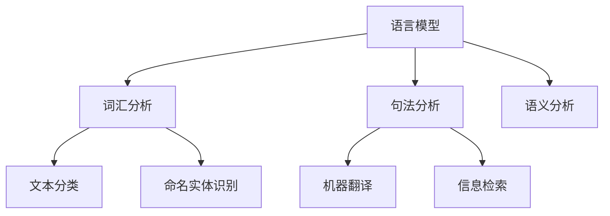
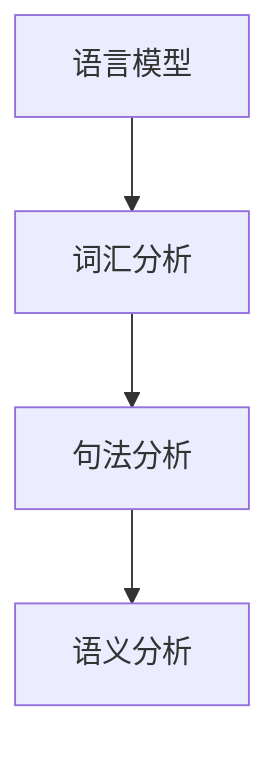
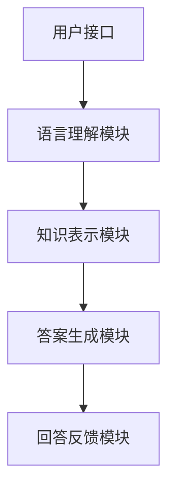

                 

### 文章标题

# 自然语言处理在智能搜索中的应用

> 关键词：自然语言处理、智能搜索、语言模型、语义分析、问答系统、大数据分析

> 摘要：本文深入探讨了自然语言处理在智能搜索中的应用。首先，介绍了自然语言处理的基本概念和数学基础，包括语言模型、词汇分析、句法分析和语义分析。接着，阐述了智能搜索的基础原理和技术，包括索引构建、检索算法和排序与相关性评估。随后，详细介绍了自然语言处理在智能问答系统和大数据搜索中的应用，通过实际案例展示了技术实现的细节和效果。最后，探讨了自然语言处理在智能搜索中的未来发展趋势和面临的挑战。本文旨在为读者提供一个全面、系统的理解和应用指南，帮助他们在智能搜索领域取得突破性进展。

### 第一部分：自然语言处理基础

#### 第1章：自然语言处理概述

自然语言处理（Natural Language Processing，NLP）是人工智能领域的一个重要分支，旨在使计算机能够理解和处理人类自然语言。它涉及多个学科，包括语言学、计算机科学、信息工程等。随着互联网和大数据的迅速发展，NLP的应用越来越广泛，从机器翻译、情感分析到智能客服、智能搜索等。本章将概述NLP的核心概念，包括语言模型、词汇分析、句法分析和语义分析。

#### 1.1 自然语言处理的核心概念

**语言模型**是NLP的核心概念之一，它用于描述文本数据中的概率分布。语言模型可以基于统计方法或基于深度学习的方法构建，常见的有n-gram模型、n-维贝叶斯模型和神经网络语言模型。

**词汇分析**（Lexical Analysis）涉及对文本中的词汇进行分解和识别，这是理解文本语义的基础。它包括分词、词性标注和词义标注等任务。

**句法分析**（Syntactic Analysis）是对文本进行结构化分析，识别句子中的语法关系和结构。常见的句法分析方法有依赖分析、句法树分析和语义角色标注。

**语义分析**（Semantic Analysis）是理解文本中的意义和意图。它涉及词义消歧、实体识别、情感分析和指代消解等任务。

#### 1.2 自然语言处理的数学基础

NLP的数学基础包括概率论、统计学习方法和机器学习基础。概率论是NLP中概率模型和统计方法的基础，如贝叶斯理论、最大似然估计和最大后验估计。统计学习方法是构建和训练NLP模型的主要方法，包括线性回归、逻辑回归、支持向量机和决策树等。机器学习基础包括神经网络、深度学习和生成对抗网络（GAN）等先进技术，这些技术在NLP中有广泛应用。

#### 1.3 自然语言处理的常见任务

自然语言处理涉及多个常见任务，包括文本分类、命名实体识别、机器翻译、信息检索等。

**文本分类**（Text Classification）是将文本数据分类到预定义的类别中，常见的应用有垃圾邮件过滤、情感分析和主题分类。

**命名实体识别**（Named Entity Recognition，NER）是识别文本中的命名实体，如人名、地名、组织名等。

**机器翻译**（Machine Translation）是将一种语言的文本翻译成另一种语言，常见的应用有跨语言搜索、全球化和本地化。

**信息检索**（Information Retrieval）是从大量文本数据中查找与用户查询相关的信息，常见的应用有搜索引擎和文献检索系统。

#### 1.4 自然语言处理工具与库

NLP领域有许多开源工具和库，如NLTK、SpaCy和Stanford NLP等。这些工具和库提供了丰富的NLP功能和接口，方便开发者进行研究和应用。

**NLTK**（Natural Language Toolkit）是一个广泛使用的NLP库，提供了文本处理、分类、词性标注、句法分析和语义分析等功能。

**SpaCy**是一个高效、易于使用的NLP库，支持多种语言，适用于文本预处理、实体识别、关系抽取等任务。

**Stanford NLP**是由斯坦福大学开发的一套强大的NLP工具包，包括词性标注、句法分析、命名实体识别和语义分析等功能。

#### 1.5 自然语言处理的挑战与趋势

自然语言处理面临许多挑战，包括数据隐私、算法透明性和搜索结果质量等。同时，随着深度学习和大数据技术的发展，NLP也在不断进步，未来趋势包括多模态搜索、增强学习和个性化搜索等。

总之，自然语言处理在智能搜索中的应用具有重要意义。通过理解NLP的核心概念、数学基础和常见任务，读者可以更好地掌握NLP技术，并将其应用于智能搜索领域，为用户提供更精准、高效的服务。

#### Mermaid 流程图

以下是一个简单的Mermaid流程图，展示自然语言处理的核心概念和任务：



#### 核心概念与联系

自然语言处理（NLP）的核心概念包括语言模型、词汇分析、句法分析和语义分析。这些概念之间紧密相连，共同构成了NLP的技术框架。

**语言模型**是NLP的基石，它用于预测文本中下一个单词或字符的概率分布。常见的语言模型有n-gram模型、n-维贝叶斯模型和神经网络语言模型。语言模型在词汇分析和句法分析中起着关键作用，因为它能够帮助计算机理解文本的上下文和结构。

**词汇分析**是对文本中的词汇进行分解和识别，这是理解文本语义的基础。词汇分析包括分词、词性标注和词义标注等任务。分词是将文本分割成单词或词汇单元，这是词汇分析的第一步。词性标注是对每个词进行分类，如名词、动词、形容词等。词义标注是对同义词在不同上下文中的意义进行区分。

**句法分析**是对文本进行结构化分析，识别句子中的语法关系和结构。句法分析包括依赖分析、句法树分析和语义角色标注等任务。依赖分析用于识别词汇之间的依赖关系，如主谓关系、修饰关系等。句法树分析用于构建句子的句法树，展示词汇之间的层次结构。语义角色标注用于识别句子中的语义角色，如主语、谓语、宾语等。

**语义分析**是理解文本中的意义和意图。它涉及词义消歧、实体识别、情感分析和指代消解等任务。词义消歧是解决同义词在不同上下文中的意义问题。实体识别是识别文本中的命名实体，如人名、地名、组织名等。情感分析是分析文本的情感倾向，如正面、负面或中性。指代消解是解决代词或名词性短语与其指代对象的对应关系问题。

这些核心概念之间的联系如图1所示：



图1：自然语言处理的核心概念与联系

通过这些核心概念，NLP技术能够对文本进行多层次的分析和理解，为智能搜索和其他NLP应用提供基础支持。

#### 1.2 自然语言处理的数学基础

自然语言处理（NLP）的数学基础是理解和使用各种算法和模型的关键。以下是NLP中常用的数学基础：

**1.2.1 概率论基础**

概率论是NLP中概率模型和统计方法的基础。以下是一些基本概率概念：

- **概率分布**：描述随机变量取不同值的概率。
- **条件概率**：在某个事件已发生的情况下，另一个事件发生的概率。
- **贝叶斯定理**：计算后验概率，即根据先验概率和观察到的数据更新概率估计。

贝叶斯定理的公式为：

$$ P(A|B) = \frac{P(B|A)P(A)}{P(B)} $$

其中，\( P(A|B) \) 是后验概率，\( P(B|A) \) 是条件概率，\( P(A) \) 是先验概率，\( P(B) \) 是边缘概率。

**1.2.2 统计学习方法**

统计学习方法是基于数据来训练模型的方法。以下是一些常见的统计学习方法：

- **线性回归**：用于预测连续值，公式为：

  $$ y = \beta_0 + \beta_1x_1 + \beta_2x_2 + \ldots + \beta_nx_n $$

  其中，\( y \) 是预测值，\( \beta_0, \beta_1, \ldots, \beta_n \) 是模型参数。

- **逻辑回归**：用于分类问题，公式为：

  $$ \log\left(\frac{P(Y=1)}{1 - P(Y=1)}\right) = \beta_0 + \beta_1x_1 + \beta_2x_2 + \ldots + \beta_nx_n $$

  其中，\( P(Y=1) \) 是目标变量为1的概率。

- **支持向量机**（SVM）：用于分类问题，通过最大化分类边界来分类数据。

  $$ \min_w \frac{1}{2} ||w||^2 $$
  $$ s.t. \ y_i ( \langle w, x_i \rangle - b ) \geq 1 $$

  其中，\( w \) 是权重向量，\( b \) 是偏置项，\( x_i \) 是特征向量，\( y_i \) 是标签。

- **决策树**：通过划分特征空间来构建树形结构，用于分类和回归。

  $$ \text{决策树} = \text{如果} \ f(x) \ \text{满足条件} \ C_1, \ \text{则返回} \ C_1; $$
  $$ \text{否则如果} \ f(x) \ \text{满足条件} \ C_2, \ \text{则返回} \ C_2; $$
  $$ \ldots $$
  $$ \text{否则返回} \ C_n $$

**1.2.3 机器学习基础**

机器学习是NLP的核心技术之一，以下是一些基本的机器学习概念：

- **监督学习**：通过标注数据训练模型，包括分类和回归问题。
- **无监督学习**：没有标注数据，用于发现数据中的模式，如聚类和降维。
- **半监督学习**：结合有标注和无标注数据训练模型。

- **深度学习**：一种基于神经网络的机器学习方法，通过多层次的神经网络结构来提取特征。

  $$ \text{深度神经网络} = \text{输入层} \rightarrow \text{隐藏层} \rightarrow \text{输出层} $$
  
  $$ h_{l} = \sigma( W_{l} \cdot h_{l-1} + b_{l} ) $$

  其中，\( h_{l} \) 是第\( l \)层的激活值，\( \sigma \) 是激活函数，\( W_{l} \) 是权重矩阵，\( b_{l} \) 是偏置项。

通过这些数学基础，NLP技术能够处理和分析大量的文本数据，从而实现语言理解和生成。

#### 1.3 自然语言处理的常见任务

自然语言处理（NLP）领域包含多种常见任务，这些任务在智能搜索、机器翻译、信息检索等应用中起着关键作用。以下是NLP的一些主要任务及其简介：

**1.3.1 文本分类**

文本分类（Text Classification）是一种将文本数据分配到预定义类别中的任务。例如，垃圾邮件过滤将邮件分类为垃圾邮件或正常邮件，情感分析将评论分类为正面、负面或中性。文本分类通常使用监督学习算法，如朴素贝叶斯、支持向量机和神经网络，通过训练模型来预测文本的类别。

**1.3.2 命名实体识别**

命名实体识别（Named Entity Recognition，NER）是识别文本中的命名实体，如人名、地名、组织名、时间等。NER对于信息提取和知识图谱构建具有重要意义。常见的NER方法包括基于规则的方法、基于统计的方法和基于深度学习的方法。例如，使用条件随机场（CRF）或卷积神经网络（CNN）进行实体识别。

**1.3.3 机器翻译**

机器翻译（Machine Translation）是将一种语言的文本翻译成另一种语言的自动过程。传统的机器翻译方法包括基于规则的方法、基于统计的方法和基于数据的方法。近年来，基于神经网络的机器翻译（Neural Machine Translation，NMT）取得了显著进展，特别是在深度学习技术的推动下，如序列到序列（Seq2Seq）模型和注意力机制（Attention Mechanism）的应用。

**1.3.4 信息检索**

信息检索（Information Retrieval）是从大量文本数据中查找与用户查询相关的信息的过程。搜索引擎是信息检索的典型应用。信息检索的核心任务是索引构建和检索算法。常用的检索算法包括布尔检索、向量空间模型和概率检索模型。索引构建用于创建高效的数据结构，以便快速搜索。检索算法用于计算查询与文档的相关性，并根据相关性对结果进行排序。

**1.3.5 问答系统**

问答系统（Question Answering System）是一种智能交互系统，能够理解用户的问题并返回相关答案。问答系统可以分为基于知识库的问答和基于大数据的问答。基于知识库的问答系统利用预定义的知识库和规则来回答问题，而基于大数据的问答系统则使用自然语言处理技术来理解问题并从大量数据中检索答案。

**1.3.6 情感分析**

情感分析（Sentiment Analysis）是一种分析文本的情感倾向的任务，如正面、负面或中性。情感分析对于品牌监控、市场研究和社交媒体分析具有重要意义。常见的情感分析模型包括基于规则的方法、基于统计的方法和基于深度学习的方法，如长短期记忆网络（LSTM）和卷积神经网络（CNN）。

**1.3.7 文本生成**

文本生成（Text Generation）是一种自动生成文本的任务，包括文本摘要、机器写作和对话系统等。常见的文本生成模型有基于模板的方法、基于统计的方法和基于深度学习的方法，如生成对抗网络（GAN）和变分自编码器（VAE）。

通过这些常见任务，NLP技术能够实现文本的理解、分析和生成，为智能搜索和其他应用提供强有力的支持。

#### 1.4 自然语言处理工具与库

在自然语言处理（NLP）领域，有多种开源工具和库被广泛应用于文本处理、分类、词性标注、句法分析和语义分析等任务。以下是一些常用的NLP工具和库，以及它们的主要功能和应用场景：

**1.4.1 NLTK库**

NLTK（Natural Language Toolkit）是一个广泛使用的NLP库，适用于多种语言。它提供了丰富的文本处理功能，包括分词、词性标注、词干提取、情感分析和文本分类等。NLTK适用于学术研究和原型开发，但可能在处理大规模数据时效率较低。

- **功能**：文本处理、词性标注、情感分析、文本分类等。
- **应用场景**：学术研究、原型开发、文本分析。

**1.4.2 SpaCy库**

SpaCy是一个高效、易于使用的NLP库，支持多种语言。它提供了用于文本处理、词性标注、命名实体识别、关系抽取和句法分析的强大功能。SpaCy的特点是快速和可扩展，适用于生产环境。

- **功能**：文本处理、词性标注、命名实体识别、关系抽取、句法分析等。
- **应用场景**：生产环境、实时分析、数据科学。

**1.4.3 Stanford NLP库**

Stanford NLP是由斯坦福大学开发的一套强大的NLP工具包，包括词性标注、句法分析、命名实体识别和语义分析等功能。它提供了丰富的API和预训练模型，适用于多种NLP任务。

- **功能**：词性标注、句法分析、命名实体识别、语义分析等。
- **应用场景**：学术研究、工业应用、复杂NLP任务。

**1.4.4 Gensim库**

Gensim是一个基于Python的文本处理和主题建模库，适用于大规模文本数据的处理和分析。它提供了用于向量空间模型、词嵌入和主题模型的强大功能，适用于信息检索、文档分类和推荐系统。

- **功能**：文本处理、词嵌入、主题建模、信息检索等。
- **应用场景**：大规模文本数据分析、信息检索、推荐系统。

**1.4.5 TextBlob库**

TextBlob是一个简单易用的NLP库，适用于文本处理、词性标注、情感分析和文本分类等任务。TextBlob基于NLTK和Pattern库，提供了丰富的API和预训练模型。

- **功能**：文本处理、词性标注、情感分析、文本分类等。
- **应用场景**：快速原型开发、文本分析、情感分析。

这些NLP工具和库为开发者提供了强大的文本处理和分析能力，使得NLP技术的应用变得更加便捷和高效。选择合适的工具和库，可以根据项目的具体需求和规模来优化性能和资源利用。

#### 1.5 自然语言处理的挑战与趋势

自然语言处理（NLP）领域在近年来取得了显著进展，但仍然面临许多挑战。以下是NLP当前的主要挑战及其发展趋势：

**1.5.1 挑战**

**数据隐私**：NLP应用通常需要处理大量的个人数据，这引发了数据隐私和安全性的担忧。为了保护用户隐私，研究者需要开发更加隐私友好的算法和数据保护措施。

**算法透明性**：复杂的NLP模型，如深度学习模型，通常难以解释其决策过程。算法透明性是确保模型公正性和可解释性的关键挑战。

**搜索结果质量**：在信息检索和问答系统中，提供准确和相关的搜索结果是一个持续挑战。随着数据的增长和多样性，如何提高搜索结果的准确性成为重要课题。

**计算资源需求**：大规模的NLP任务，如机器翻译和问答系统，需要大量的计算资源。优化算法和系统设计以减少计算需求是当前的一个重要趋势。

**多语言支持**：尽管大多数NLP工具和库支持多种语言，但不同语言之间的差异使得多语言处理成为一项复杂任务。开发通用和高效的多语言NLP模型是未来的一大挑战。

**1.5.2 发展趋势**

**深度学习**：深度学习在NLP中的应用越来越广泛，尤其是在语言模型、句法分析和语义理解等领域。未来的趋势将包括更加复杂和强大的深度学习模型，如Transformer和BERT。

**预训练语言模型**：预训练语言模型（如GPT、BERT和T5）已经成为NLP研究的重要方向。通过在大规模数据上预训练，这些模型能够捕捉到语言中的通用特征，并在各种NLP任务上实现出色的性能。

**多模态搜索**：随着多模态数据的增长，如图像、语音和视频，多模态搜索成为了一个热门研究方向。未来的趋势是将文本和图像、语音等其他模态的数据进行整合，提供更丰富和多样化的搜索体验。

**知识图谱**：知识图谱是一种结构化的知识表示形式，能够将文本中的实体、关系和事实进行编码。随着知识图谱在NLP中的应用越来越广泛，如何构建和维护高质量的知识图谱将成为一个重要课题。

**自动化和半自动化**：自动化和半自动化方法是提高NLP效率和可扩展性的关键。未来的趋势是开发更加自动化和智能的NLP工具和平台，使得非专业人员也能够轻松地应用NLP技术。

通过应对这些挑战并抓住发展趋势，NLP技术将继续发展，为智能搜索和其他领域带来更多的创新和进步。

#### 第2章：智能搜索基础

智能搜索（Intelligent Search）是利用先进技术提升信息检索效率和用户体验的关键领域。它结合了自然语言处理（NLP）、机器学习和数据挖掘等方法，以实现对大量数据的精准搜索和智能推荐。本章将介绍智能搜索的基本原理和技术，包括搜索引擎的工作原理、智能搜索的关键技术以及智能搜索系统设计。

##### 2.1 搜索引擎的工作原理

搜索引擎是智能搜索的核心组成部分，其工作原理主要包括索引构建、检索算法和排序与相关性评估。

**1. 索引构建**

索引构建是搜索引擎的核心任务，它将大量网页转化为结构化索引，以便快速检索。索引构建通常包括以下步骤：

- **网页抓取**：搜索引擎通过爬虫（Crawler）自动获取互联网上的网页。
- **网页预处理**：对抓取到的网页进行清洗、去重和抽取内容等预处理步骤。
- **倒排索引构建**：将网页内容转化为倒排索引，以便快速查找关键词对应的文档。倒排索引通常包括两个部分：词典表和倒排列表。词典表存储所有出现的词汇，而倒排列表存储每个词汇对应的所有文档的ID。

**2. 检索算法**

检索算法用于计算查询与文档之间的相似度或相关性，以确定哪些文档最符合用户的查询需求。常见的检索算法包括：

- **布尔检索**：基于布尔逻辑（AND、OR、NOT）进行查询匹配。
- **向量空间模型**：将查询和文档表示为高维向量，通过计算向量的余弦相似度进行检索。
- **概率检索模型**：基于概率模型（如贝叶斯模型）计算查询与文档的相关性。

**3. 排序与相关性评估**

排序与相关性评估是确定检索结果顺序的关键步骤。常见的排序算法包括：

- **TF-IDF**：基于词频（TF）和逆文档频率（IDF）计算词的重要性，用于评估文档的相关性。
- **PageRank**：基于网页之间的链接关系计算网页的重要性，用于排序。
- **BM25**：结合词频和文档长度正常化，用于评估文档的相关性。

**2.2 智能搜索的关键技术**

智能搜索的关键技术包括语言模型、语义搜索、情感分析和知识图谱等。

**1. 语言模型**

语言模型（Language Model）用于预测文本中下一个单词或字符的概率分布。在智能搜索中，语言模型可以用于：

- **查询改写**：将用户输入的查询转化为更准确、更丰富的查询表达。
- **搜索结果排序**：根据语言模型的预测概率，对搜索结果进行排序。
- **个性化推荐**：根据用户的历史查询和行为，生成个性化的搜索结果。

**2. 语义搜索**

语义搜索（Semantic Search）旨在理解查询和文档的语义内容，而不仅仅是表面上的关键词匹配。语义搜索的关键技术包括：

- **词义消歧**：解决同义词在不同上下文中的意义问题。
- **实体识别**：识别文档中的命名实体（如人名、地名、组织名等）。
- **关系抽取**：提取文档中的实体关系（如因果关系、位置关系等）。
- **语义匹配**：计算查询和文档之间的语义相似度。

**3. 情感分析**

情感分析（Sentiment Analysis）是分析文本中的情感倾向（如正面、负面或中性）。在智能搜索中，情感分析可以用于：

- **情感检索**：根据用户的情感需求，筛选出情感倾向符合预期的搜索结果。
- **情感推荐**：根据用户的历史情感标签，生成情感化的搜索推荐。

**4. 知识图谱**

知识图谱（Knowledge Graph）是一种结构化的知识表示形式，能够将实体、属性和关系进行编码。在智能搜索中，知识图谱可以用于：

- **实体识别和关系抽取**：通过知识图谱，可以更加准确地识别文档中的实体和关系。
- **语义搜索**：利用知识图谱中的语义关系，提高搜索结果的准确性和相关性。
- **搜索结果排序**：根据知识图谱中的实体和关系，对搜索结果进行排序。

**2.3 智能搜索系统设计**

智能搜索系统的设计需要综合考虑性能、可扩展性和用户体验等因素。以下是一个典型的智能搜索系统架构：

- **数据层**：包括数据源、数据存储和数据索引。数据源可以是网站、数据库或API等。数据存储通常使用关系型数据库（如MySQL）或分布式存储系统（如Hadoop）。数据索引用于快速检索数据。
- **处理层**：包括数据预处理、文本处理、查询处理和搜索结果处理。数据预处理用于清洗、去重和抽取关键词等操作。文本处理用于分词、词性标注和词干提取等。查询处理用于解析查询语句、查询改写和查询扩展等。搜索结果处理用于计算文档与查询的相关性、排序和展示。
- **服务层**：包括API服务、Web服务和搜索界面。API服务提供RESTful API，用于与其他系统集成。Web服务负责处理用户请求和响应。搜索界面提供用户交互界面，用于展示搜索结果和反馈用户操作。

通过以上架构，智能搜索系统能够高效地处理海量数据，提供精准、智能的搜索服务。

#### 搜索引擎的工作原理

搜索引擎作为智能搜索的核心组件，其工作原理主要包括索引构建、检索算法和排序与相关性评估。以下将详细描述这些步骤和相关的技术细节。

**1. 索引构建**

索引构建是搜索引擎的第一步，也是最为关键的环节。它的目的是将互联网上的大量网页转化为结构化的索引，以便快速检索。索引构建过程通常包括以下几个步骤：

- **网页抓取（Crawling）**：搜索引擎通过爬虫程序自动获取互联网上的网页。爬虫首先从初始的种子URL集合开始，访问网页内容并提取其中的链接。然后，爬虫继续访问新的URL，形成递归的抓取过程。常用的爬虫算法包括深度优先算法和广度优先算法。

- **网页预处理（Preprocessing）**：抓取到的网页需要经过预处理，以去除噪声和无关信息。预处理步骤通常包括：
  - **去噪**：去除HTML标签、JavaScript代码、CSS样式等不影响内容的部分。
  - **URL规范化**：统一URL格式，如去除参数、重定向等。
  - **文本抽取**：从网页内容中提取正文文本，去除广告、导航链接等无关内容。
  - **分词（Tokenization）**：将文本分割成单词或词汇单元。分词可以使用规则分词、词典分词或基于机器学习的方法。

- **倒排索引构建（Inverted Index Construction）**：倒排索引是搜索引擎的核心数据结构，用于快速查找关键词对应的文档。倒排索引由两个部分组成：词典表和倒排列表。
  - **词典表（Dictionary）**：存储所有出现的词汇，通常按字典顺序排序。每个词汇对应一个唯一的ID。
  - **倒排列表（Posting List）**：存储每个词汇对应的所有文档的ID，以及文档中该词汇的出现位置。倒排列表通常使用一种压缩算法（如字典压缩、编码压缩等）以减少存储空间。

**2. 检索算法**

检索算法用于计算查询与文档之间的相似度或相关性，以确定哪些文档最符合用户的查询需求。常见的检索算法包括：

- **布尔检索（Boolean Retrieval）**：基于布尔逻辑（AND、OR、NOT）进行查询匹配。布尔检索简单直观，但无法充分利用文档中的词语关系。

  伪代码：
  ```python
  def boolean_search(index, query):
      query_parts = preprocess_query(query)
      result = set()
      for part in query_parts:
          if part.startswith('-'):
              negate = True
              part = part[1:]
          else:
              negate = False
          if negate:
              result.discard(index.get_document_id(part))
          else:
              result.intersection_update(index.get_documents_for_word(part))
      return result
  ```

- **向量空间模型（Vector Space Model）**：将查询和文档表示为高维向量，通过计算向量的余弦相似度进行检索。

  伪代码：
  ```python
  def vector_space_search(index, query):
      query_vector = vectorize_query(index, query)
      max_similarity = -1
      best_document = None
      for document_id, document_vector in index.get_document_vectors():
          similarity = cosine_similarity(query_vector, document_vector)
          if similarity > max_similarity:
              max_similarity = similarity
              best_document = document_id
      return best_document
  ```

- **概率检索模型（Probabilistic Retrieval Model）**：基于概率模型（如贝叶斯模型）计算查询与文档的相关性。

  伪代码：
  ```python
  def probabilistic_search(index, query):
      prior = calculate_prior(index, query)
      likelihood = calculate_likelihood(index, query)
      posterior = prior * likelihood
      return posterior
  ```

**3. 排序与相关性评估**

排序与相关性评估是确定检索结果顺序的关键步骤。常见的排序算法包括：

- **TF-IDF（Term Frequency-Inverse Document Frequency）**：基于词频（TF）和逆文档频率（IDF）计算词的重要性，用于评估文档的相关性。

  公式：
  $$ \text{TF-IDF}(t, d) = \text{TF}(t, d) \times \text{IDF}(t) $$
  其中，\( \text{TF}(t, d) \) 是词\( t \)在文档\( d \)中的词频，\( \text{IDF}(t) \) 是词\( t \)的逆文档频率。

- **PageRank**：基于网页之间的链接关系计算网页的重要性，用于排序。

  公式：
  $$ \text{PageRank}(v) = \left( 1 - d \right) + d \left( \sum_{w \in \text{outlinks}(v)} \frac{\text{PageRank}(w)}{| \text{outlinks}(w) |} \right) $$
  其中，\( \text{outlinks}(v) \) 是网页\( v \)的出链集合，\( d \) 是阻尼系数（通常设为0.85）。

- **BM25（Best Match 25）**：结合词频和文档长度正常化，用于评估文档的相关性。

  公式：
  $$ \text{BM25}(t, d) = \frac{(k_1 + 1) \times \text{TF}(t, d) - k_1 \times (1 - \frac{\text{len}(d)}{N} + \frac{k_2}{\text{len}(d) + k_2})}{b \times (\text{len}(d) + c)} $$
  其中，\( k_1, k_2, b, c \) 是超参数，\( \text{TF}(t, d) \) 是词频，\( \text{len}(d) \) 是文档长度，\( N \) 是总文档数。

通过上述步骤，搜索引擎能够高效地处理用户查询，并提供相关度较高的搜索结果。随着技术的不断发展，搜索引擎的性能和准确性不断提高，为用户提供更加智能化的搜索体验。

#### 2.2 智能搜索的关键技术

智能搜索的关键技术是提升搜索引擎性能和用户体验的核心因素。以下将详细探讨语言模型、语义搜索、情感分析和知识图谱在智能搜索中的应用。

**1. 语言模型**

语言模型（Language Model）在智能搜索中扮演着至关重要的角色。它的主要功能是预测文本中下一个单词或字符的概率分布，从而提高搜索的准确性和效率。语言模型可以通过统计方法或深度学习方法构建，常见的模型有n-gram模型、n-维贝叶斯模型和神经网络语言模型。

- **n-gram模型**：n-gram模型是最简单的语言模型，它假设一个词的概率只与其前n个词相关。n-gram模型通过统计文本中的词频来估计每个词的概率。例如，一个三元组（"the", "is", "this"）的概率可以表示为这三个词的联合概率。

  伪代码：
  ```python
  def n_gram_model(text, n):
      n_gram_counts = {}
      for i in range(len(text) - n + 1):
          n_gram = tuple(text[i:i+n])
          n_gram_counts[n_gram] = n_gram_counts.get(n_gram, 0) + 1
      return n_gram_counts
  ```

- **n-维贝叶斯模型**：n-维贝叶斯模型结合了贝叶斯定理和n-gram模型，通过贝叶斯公式计算每个词的概率。它考虑了词之间的依赖关系，从而提高模型的准确性。

  公式：
  $$ P(w|w_1, w_2, ..., w_n) = \frac{P(w)P(w_1|w)P(w_2|w_1, w) \ldots P(w_n|w_1, w_2, ..., w_{n-1})}{P(w_1, w_2, ..., w_n)} $$

- **神经网络语言模型**：神经网络语言模型（如RNN、LSTM和Transformer）通过学习文本中的复杂模式，提高语言模型的准确性。特别是Transformer模型，它通过自注意力机制（Self-Attention）捕捉长距离依赖关系，取得了显著的性能提升。

  伪代码：
  ```python
  class TransformerModel(nn.Module):
      def __init__(self, vocab_size, embedding_size, hidden_size, output_size):
          super(TransformerModel, self).__init__()
          self.embedding = nn.Embedding(vocab_size, embedding_size)
          self.encoder = nn.Transformer(embedding_size, hidden_size, num_layers)
          self.decoder = nn.Linear(hidden_size, output_size)
      
      def forward(self, src, tgt):
          src_embedding = self.embedding(src)
          tgt_embedding = self.embedding(tgt)
          output = self.encoder(src_embedding, tgt_embedding)
          return self.decoder(output)
  ```

语言模型在智能搜索中的应用包括：

- **查询改写**：通过语言模型，搜索引擎可以改写用户的查询，使其更加准确和丰富。例如，将用户输入的“苹果手机”改写为“苹果公司的智能手机”。
- **搜索结果排序**：根据语言模型的预测概率，搜索引擎可以优化搜索结果的排序，提高用户的满意度。
- **个性化推荐**：根据用户的历史查询和行为，语言模型可以帮助搜索引擎生成个性化的搜索推荐。

**2. 语义搜索**

语义搜索（Semantic Search）旨在理解查询和文档的语义内容，而不仅仅是表面上的关键词匹配。语义搜索的关键技术包括词义消歧、实体识别、关系抽取和语义匹配。

- **词义消歧（Word Sense Disambiguation）**：词义消歧是解决同义词在不同上下文中的意义问题。通过语义分析，搜索引擎可以识别出特定上下文中词的确切含义，从而提高搜索的准确性。

  伪代码：
  ```python
  def word_sense_disambiguation(context, candidates):
      max_similarity = -1
      best_sense = None
      for sense, definition in candidates.items():
          similarity = calculate_similarity(context, definition)
          if similarity > max_similarity:
              max_similarity = similarity
              best_sense = sense
      return best_sense
  ```

- **实体识别（Named Entity Recognition，NER）**：实体识别是识别文本中的命名实体，如人名、地名、组织名等。通过实体识别，搜索引擎可以更准确地理解和索引文档。

  伪代码：
  ```python
  def named_entity_recognition(text):
      entities = []
      for entity in recognize_entities(text):
          entities.append(entity)
      return entities
  ```

- **关系抽取（Relation Extraction）**：关系抽取是提取文档中的实体关系，如因果关系、位置关系等。通过关系抽取，搜索引擎可以构建知识图谱，提高语义搜索的准确性。

  伪代码：
  ```python
  def relation_extraction(text, entities):
      relations = []
      for entity1, entity2 in pairwise_combinations(entities):
          relation = extract_relation(text, entity1, entity2)
          if relation:
              relations.append((entity1, entity2, relation))
      return relations
  ```

- **语义匹配（Semantic Matching）**：语义匹配是计算查询和文档之间的语义相似度。通过语义匹配，搜索引擎可以更准确地判断文档是否符合用户的查询需求。

  伪代码：
  ```python
  def semantic_matching(query, document):
      query_embedding = embed_query(query)
      document_embedding = embed_document(document)
      similarity = cosine_similarity(query_embedding, document_embedding)
      return similarity
  ```

语义搜索在智能搜索中的应用包括：

- **语义检索**：通过语义分析，搜索引擎可以更准确地理解用户的查询意图，并提供相关的搜索结果。
- **智能问答**：通过语义分析，搜索引擎可以回答用户的问题，提供准确和相关的答案。
- **知识图谱构建**：通过关系抽取和实体识别，搜索引擎可以构建知识图谱，为后续的智能搜索提供基础数据。

**3. 情感分析**

情感分析（Sentiment Analysis）是分析文本中的情感倾向，如正面、负面或中性。情感分析在智能搜索中的应用包括情感检索和情感推荐。

- **情感检索**：通过情感分析，搜索引擎可以筛选出符合用户情感需求的搜索结果。例如，用户搜索“最新电影推荐”，搜索引擎可以根据用户的情感倾向推荐正面评价较高的电影。

  伪代码：
  ```python
  def sentiment_retrieval(text, sentiments):
      positive_results = []
      negative_results = []
      for result in search_results(text):
          sentiment = get_sentiment(result)
          if sentiment == "positive":
              positive_results.append(result)
          elif sentiment == "negative":
              negative_results.append(result)
      return positive_results, negative_results
  ```

- **情感推荐**：通过情感分析，搜索引擎可以推荐符合用户情感倾向的内容。例如，用户在社交媒体上表达了对某个品牌的负面情感，搜索引擎可以推荐其他用户认为优质的替代品牌。

  伪代码：
  ```python
  def sentiment_recommendation(user_sentiment, items):
      recommended_items = []
      for item in items:
          item_sentiment = get_sentiment(item)
          if item_sentiment == user_sentiment:
              recommended_items.append(item)
      return recommended_items
  ```

情感分析在智能搜索中的应用包括：

- **情感化搜索**：通过情感分析，搜索引擎可以提供更符合用户情感需求的搜索结果。
- **情感化推荐**：通过情感分析，搜索引擎可以推荐符合用户情感倾向的内容，提高用户体验。

**4. 知识图谱**

知识图谱（Knowledge Graph）是一种结构化的知识表示形式，能够将实体、属性和关系进行编码。知识图谱在智能搜索中的应用包括实体识别和关系抽取、语义搜索和搜索结果排序。

- **实体识别和关系抽取**：通过知识图谱，搜索引擎可以更准确地识别文档中的实体和关系。例如，用户搜索“北京的首都”，搜索引擎可以根据知识图谱识别出“北京”是中国的首都。

  伪代码：
  ```python
  def knowledge_graph_search(text, graph):
      entities = extract_entities(text, graph)
      relations = extract_relations(text, entities, graph)
      return entities, relations
  ```

- **语义搜索**：通过知识图谱，搜索引擎可以更准确地理解用户的查询意图，并提供相关的搜索结果。例如，用户搜索“购买笔记本电脑”，搜索引擎可以根据知识图谱提供符合用户需求的笔记本电脑品牌和型号。

  伪代码：
  ```python
  def semantic_search(query, graph):
      entities, relations = knowledge_graph_search(query, graph)
      search_results = search_documents(entities, relations, graph)
      return search_results
  ```

- **搜索结果排序**：通过知识图谱，搜索引擎可以优化搜索结果的排序，提高用户的满意度。例如，用户搜索“北京旅游景点”，搜索引擎可以根据知识图谱中的评分、评论等属性，对旅游景点进行排序。

  伪代码：
  ```python
  def knowledge_graph_sort(search_results, graph):
      sorted_results = []
      for result in search_results:
          score = get_score(result, graph)
          sorted_results.append((result, score))
      sorted_results.sort(key=lambda x: x[1], reverse=True)
      return [result for result, _ in sorted_results]
  ```

知识图谱在智能搜索中的应用包括：

- **实体识别和关系抽取**：通过知识图谱，搜索引擎可以更准确地识别和理解文档内容。
- **语义搜索**：通过知识图谱，搜索引擎可以提供更精准和个性化的搜索结果。
- **搜索结果排序**：通过知识图谱，搜索引擎可以优化搜索结果的排序，提高用户体验。

通过以上关键技术，智能搜索系统能够更好地理解用户需求，提供更加准确和个性化的搜索服务。

#### 2.3 智能搜索系统设计

设计一个高效、可扩展的智能搜索系统是提升用户体验的关键。以下将介绍智能搜索系统设计的关键方面，包括系统架构设计、搜索算法优化和性能分析与调优。

**1. 系统架构设计**

智能搜索系统的架构设计需要考虑可扩展性、高性能和易维护性。以下是一个典型的智能搜索系统架构：

- **数据层**：包括数据源、数据存储和数据索引。
  - **数据源**：搜索引擎的数据来源可以是网站、数据库或API等。为了确保数据的多样性和准确性，系统需要从多个数据源采集数据。
  - **数据存储**：数据存储通常使用关系型数据库（如MySQL）或分布式存储系统（如Hadoop）。关系型数据库适用于结构化数据存储，而分布式存储系统适用于大规模非结构化数据。
  - **数据索引**：数据索引是搜索引擎的核心组件，用于快速检索数据。倒排索引是一种常用的数据索引方式，它将关键词与文档ID进行映射。

- **处理层**：包括数据预处理、文本处理、查询处理和搜索结果处理。
  - **数据预处理**：数据预处理包括去噪、URL规范化、文本抽取和分词等操作。预处理步骤的目的是将原始数据转化为结构化的、可分析的文本数据。
  - **文本处理**：文本处理包括词性标注、词干提取、命名实体识别和词嵌入等。这些处理步骤有助于提高搜索结果的准确性和相关性。
  - **查询处理**：查询处理包括查询改写、查询扩展和查询解析。查询改写和查询扩展有助于提高搜索结果的多样性，而查询解析则是将用户输入的查询转化为可以处理的内部表示。
  - **搜索结果处理**：搜索结果处理包括相关性计算、排序和展示。常见的排序算法有TF-IDF、PageRank和BM25。排序算法的选择取决于应用场景和用户需求。

- **服务层**：包括API服务、Web服务和搜索界面。
  - **API服务**：API服务提供RESTful API，用于与其他系统集成，如前端应用、移动应用等。
  - **Web服务**：Web服务负责处理用户请求和响应。它通常使用Web框架（如Django、Flask）搭建，确保系统的稳定性和安全性。
  - **搜索界面**：搜索界面提供用户交互界面，用于展示搜索结果和反馈用户操作。界面设计需要简洁、直观，以提高用户体验。

**2. 搜索算法优化**

搜索算法的优化是提升搜索引擎性能和用户体验的关键。以下是一些常见的搜索算法优化方法：

- **查询改写**：通过查询改写，可以将用户的原始查询转化为更准确、更丰富的查询表达。查询改写可以基于语言模型、关键词扩展和同义词替换等技术。

  伪代码：
  ```python
  def query_rewrite(raw_query, language_model):
      rewritten_query = language_model.generate_sentence(raw_query)
      return rewritten_query
  ```

- **查询扩展**：查询扩展是将用户的原始查询扩展为更广泛的查询，以增加搜索结果的多样性。查询扩展可以基于关键词组合、相关词引入和上下文分析等技术。

  伪代码：
  ```python
  def query_extension(raw_query, context):
      extended_query = raw_query
      for keyword in context:
          extended_query += " " + keyword
      return extended_query
  ```

- **排序算法优化**：排序算法的优化可以提升搜索结果的准确性。常见的排序算法优化方法有：
  - **基于用户行为的排序**：根据用户的搜索历史和浏览行为，对搜索结果进行个性化排序。
  - **基于内容的排序**：结合文档的内容特征（如关键词密度、文档长度等）对搜索结果进行排序。
  - **基于社交网络的排序**：根据文档的社交影响力（如点赞数、分享数等）对搜索结果进行排序。

  伪代码：
  ```python
  def ranked_search(results, user_behavior, content_features, social_influence):
      ranked_results = []
      for result in results:
          score = user_behavior_score(result) + content_feature_score(result) + social_influence_score(result)
          ranked_results.append((result, score))
      ranked_results.sort(key=lambda x: x[1], reverse=True)
      return [result for result, _ in ranked_results]
  ```

**3. 性能分析与调优**

性能分析与调优是确保搜索引擎稳定运行和高性能的关键步骤。以下是一些常见的性能分析和调优方法：

- **负载均衡**：通过负载均衡，可以确保搜索引擎在处理大量请求时不会出现性能瓶颈。常见的负载均衡策略有轮询、最小连接数和加权轮询等。

  伪代码：
  ```python
  def load_balancing(queries):
      processed_queries = []
      for query in queries:
          server = select_server()
          process_query(server, query)
          processed_queries.append(query)
      return processed_queries
  ```

- **缓存策略**：通过缓存策略，可以减少重复计算和查询，提高系统性能。常见的缓存策略有LRU（最近最少使用）、LRU-_CLOCK（时钟算法）和FIFO（先进先出）等。

  伪代码：
  ```python
  def cache_strategy(data):
      cache = []
      for item in data:
          if item in cache:
              continue
          cache.append(item)
          if len(cache) > cache_size:
              cache.pop(0)
      return cache
  ```

- **数据库优化**：通过数据库优化，可以提高搜索引擎的数据访问速度。常见的数据库优化方法有索引优化、查询优化和分区等。

  伪代码：
  ```python
  def database_optimization(query):
      optimized_query = add_index(query)
      optimized_query = optimize_query(optimized_query)
      return optimized_query
  ```

- **内存管理**：通过内存管理，可以确保搜索引擎在处理大量数据时不会出现内存泄漏。常见的内存管理方法有对象池、内存压缩和垃圾回收等。

  伪代码：
  ```python
  def memory_management(data):
      object_pool = create_object_pool(data_size)
      for data_item in data:
          object_pool.allocate(data_item)
      return object_pool
  ```

通过以上系统架构设计、搜索算法优化和性能分析与调优，智能搜索系统能够高效、稳定地运行，为用户提供优质的搜索服务。

#### 第3章：应用一：智能问答系统

智能问答系统（Intelligent Question Answering System）是一种基于自然语言处理（NLP）和机器学习（ML）技术的智能交互系统，能够理解和回答用户提出的问题。智能问答系统在智能搜索、客户服务、教育辅导和医疗咨询等领域具有广泛的应用。本章将介绍智能问答系统的基本架构、关键技术和实际应用案例。

##### 3.1 问答系统的基本架构

智能问答系统的基本架构包括以下几个主要模块：

1. **用户接口（User Interface）**：用户接口是用户与问答系统进行交互的界面，可以是文本聊天窗口、语音交互界面或图形用户界面（GUI）。

2. **语言理解模块（Language Understanding）**：语言理解模块是问答系统的核心，负责接收用户的查询并对其进行解析。该模块通常包括分词、词性标注、实体识别、关系抽取和语义角色标注等任务。

3. **知识表示模块（Knowledge Representation）**：知识表示模块用于存储和表示问答系统中所需的知识，如事实数据库、知识图谱或领域本体。这些知识库可以用来支持问答系统的推理和回答生成。

4. **答案生成模块（Answer Generation）**：答案生成模块基于用户查询和知识表示，生成合适的答案。该模块可以使用模板匹配、信息抽取、文本生成等技术来生成答案。

5. **回答反馈模块（Answer Feedback）**：回答反馈模块用于收集用户对回答的反馈，以便不断优化问答系统的性能和用户体验。

图1展示了智能问答系统的基本架构：



图1：智能问答系统的基本架构

##### 3.2 问答系统的关键技术

**1. 语言理解**

语言理解是问答系统的第一步，主要任务包括：

- **分词（Tokenization）**：将用户查询分割成单词或词汇单元。
- **词性标注（Part-of-Speech Tagging）**：为每个词汇分配词性（如名词、动词、形容词等）。
- **命名实体识别（Named Entity Recognition，NER）**：识别用户查询中的命名实体，如人名、地名、组织名等。
- **关系抽取（Relation Extraction）**：提取用户查询中的实体关系，如“张三是李四的朋友”中的朋友关系。
- **语义角色标注（Semantic Role Labeling）**：标注用户查询中的语义角色，如主语、谓语、宾语等。

**2. 知识表示**

知识表示是问答系统的重要组成部分，主要任务包括：

- **知识抽取（Knowledge Extraction）**：从非结构化的文本数据中提取结构化的知识，如实体、属性和关系。
- **知识融合（Knowledge Fusion）**：将不同来源的知识进行整合，以提高知识的准确性和完整性。
- **知识表示（Knowledge Representation）**：使用图形数据库（如Neo4j）、知识图谱或领域本体来存储和表示知识。

**3. 答案生成**

答案生成是问答系统的核心任务，主要技术包括：

- **模板匹配（Template Matching）**：使用预定义的模板匹配用户查询和知识库中的事实，生成答案。
- **信息抽取（Information Extraction）**：从知识库中抽取与用户查询相关的信息，生成答案。
- **文本生成（Text Generation）**：使用生成模型（如GPT、BERT）生成自然语言回答。

**4. 上下文处理**

上下文处理是提高问答系统回答准确性的关键，主要任务包括：

- **上下文理解（Context Understanding）**：理解用户查询所在的上下文环境，如对话历史、场景背景等。
- **上下文关联（Contextual Association）**：将用户查询与对话历史和场景背景进行关联，生成更准确的答案。
- **上下文更新（Contextual Update）**：根据用户的新查询和对话进展，动态更新上下文信息。

##### 3.3 智能问答系统的案例与实践

**案例一：基于知识图谱的智能问答系统**

该案例基于知识图谱，实现了对用户查询的智能理解和回答。

- **知识表示**：使用Neo4j作为知识图谱存储，存储了大量的实体、属性和关系，如人、地点、组织、事件等。
- **语言理解**：使用SpaCy进行文本预处理，包括分词、词性标注和实体识别。然后，使用BERT进行语义表示。
- **答案生成**：使用模板匹配和信息抽取技术生成答案。例如，对于用户查询“北京的首都是哪个城市？”，系统会匹配到知识图谱中的相关事实，生成回答“北京的首都是中国”。

**案例二：基于机器学习模型的智能问答系统**

该案例基于机器学习模型，实现了对用户查询的自动回答。

- **语言理解**：使用BERT进行文本预处理和语义表示。
- **答案生成**：使用Transformer模型进行问答生成。Transformer模型结合了自注意力机制，能够捕捉长距离依赖关系，提高了问答的准确性。

伪代码：
```python
from transformers import BertTokenizer, BertModel
from transformers import BertForQuestionAnswering

tokenizer = BertTokenizer.from_pretrained('bert-base-chinese')
model = BertForQuestionAnswering.from_pretrained('bert-base-chinese')

def question_answering(question, context):
    inputs = tokenizer(question, context, return_tensors='pt')
    outputs = model(**inputs)
    start_logits = outputs.start_logits
    end_logits = outputs.end_logits
    start_idx = torch.argmax(start_logits).item()
    end_idx = torch.argmax(end_logits).item()
    answer = context[start_idx:end_idx+1].strip()
    return answer
```

通过以上案例和实践，智能问答系统可以更好地理解用户查询，生成准确和自然的回答，为用户提供高效的问答服务。

### 第4章：大数据环境下的智能搜索

随着互联网和大数据的迅猛发展，海量数据带来的挑战日益凸显。如何在庞大的数据集中快速、准确地找到所需信息，成为智能搜索领域的一大课题。本章将探讨大数据对智能搜索的影响，介绍大数据搜索系统的设计，以及相关技术实现与优化策略。

#### 4.1 大数据对智能搜索的影响

大数据（Big Data）是指数据量巨大、数据类型多样、数据生成速度极快的海量数据。大数据的典型特征是“4V”，即Volume（数据量）、Velocity（数据生成速度）、Variety（数据类型）和Veracity（数据真实性）。大数据的这些特性对智能搜索产生了深远影响：

**1. 数据量的增长**

随着互联网的普及和数据的不断积累，数据量呈指数级增长。对于搜索引擎来说，处理如此庞大的数据集是一项巨大的挑战。传统单机搜索引擎难以应对数据量的激增，因此分布式搜索系统应运而生。

**2. 数据种类的多样性**

大数据不仅包括文本数据，还包含图像、视频、音频、传感器数据等多种类型。这种多样性使得搜索系统需要具备处理不同类型数据的能力，实现跨模态搜索。

**3. 数据处理的速度要求**

大数据的处理速度要求越来越高，实时性成为关键。用户期待在毫秒级响应时间内获取到相关结果，这对搜索系统的性能提出了严峻考验。

**4. 数据隐私与安全性**

大数据时代，用户隐私和数据安全成为关键问题。搜索系统需要确保用户数据的安全性和隐私性，防止数据泄露和滥用。

#### 4.2 大数据搜索系统的设计

大数据搜索系统的设计需要考虑数据存储、数据处理和搜索算法等方面。以下是一个典型的大数据搜索系统设计：

**1. 数据层**

- **数据存储**：采用分布式存储系统（如Hadoop HDFS、Apache HBase）来存储海量数据。这些系统具备高吞吐量和容错能力，能够高效地处理大规模数据。
- **数据索引**：使用分布式索引技术（如Apache Lucene、Elasticsearch）构建索引。分布式索引能够并行处理查询，提高查询效率。

**2. 处理层**

- **数据处理**：采用分布式计算框架（如Apache Spark、Flink）进行数据处理。这些框架支持大规模数据的高效处理，包括数据清洗、数据转换和数据聚合等。
- **实时处理**：使用流处理技术（如Apache Kafka、Apache Flink）处理实时数据流，确保搜索系统能够实时响应用户请求。

**3. 搜索层**

- **搜索算法**：结合大数据处理能力和高效搜索算法，实现精准搜索。常见的算法包括基于TF-IDF的检索算法、基于机器学习的排序算法和基于深度学习的语义搜索算法。
- **跨模态搜索**：通过多模态数据处理和融合，实现跨文本、图像、视频等模态的搜索。

**4. 接口层**

- **API接口**：提供RESTful API接口，供前端应用调用。这些接口支持各种查询请求，如全文检索、关键词搜索、分类搜索等。

#### 4.3 大数据搜索系统的技术实现与优化

**1. 分布式搜索系统**

分布式搜索系统的核心是分布式索引和分布式查询。以下是一个分布式搜索系统的技术实现：

- **索引构建**：使用分布式索引框架（如Elasticsearch）构建索引。索引构建过程包括数据导入、索引分片和副本设置。
- **查询处理**：将用户查询分发到各个索引分片，并行处理查询结果，最终汇总结果。

伪代码：
```python
def distributed_search(query, index):
    shards = get_shards(index)
    results = []
    for shard in shards:
        shard_results = search_shard(shard, query)
        results.extend(shard_results)
    return results
```

**2. 实时搜索**

实时搜索需要处理高速数据流，以下是一个实时搜索系统的技术实现：

- **数据流处理**：使用流处理框架（如Apache Kafka、Apache Flink）处理实时数据流，将数据实时推送到索引系统。
- **查询更新**：实时更新索引，确保查询结果实时准确。

伪代码：
```python
def real_time_search(query, index):
    stream = get_real_time_stream(index)
    results = []
    for data in stream:
        update_index(index, data)
        results = distributed_search(query, index)
    return results
```

**3. 性能优化**

大数据搜索系统的性能优化是关键。以下是一些常见的优化策略：

- **查询缓存**：使用查询缓存（如Redis、Memcached）存储频繁查询的结果，减少重复查询的处理时间。
- **索引优化**：定期对索引进行优化，如删除无效索引、合并索引分片等，提高查询效率。
- **并行处理**：利用并行计算技术，将查询处理任务分布到多个计算节点，提高处理速度。
- **负载均衡**：使用负载均衡策略（如轮询、最小连接数、加权轮询等），确保查询请求均衡分配到各个节点。

#### 4.4 案例分析：基于大数据的搜索引擎

**案例背景**

某大型电商平台需要构建一个基于大数据的搜索引擎，以支持海量的商品信息检索。该平台的数据量巨大，包括商品描述、用户评论、商品图片等，同时数据更新频率极高。为了提供高效、准确的搜索服务，平台采用分布式搜索系统和实时搜索技术。

**系统架构**

平台采用Elasticsearch作为分布式搜索引擎，结合Apache Kafka进行实时数据流处理。系统架构包括以下几个部分：

- **数据层**：使用Hadoop HDFS存储商品数据，使用Elasticsearch进行数据索引。
- **处理层**：使用Apache Flink进行实时数据处理和查询缓存。
- **搜索层**：使用Elasticsearch API提供搜索服务。
- **接口层**：提供RESTful API接口，供前端应用调用。

**技术实现与优化**

- **数据索引**：使用Elasticsearch构建索引，包括商品描述、用户评论、商品图片等。索引分片和副本设置确保了查询效率和数据安全。
- **实时搜索**：使用Apache Kafka进行实时数据流处理，将实时数据推送到Elasticsearch索引。实时更新索引，确保查询结果实时准确。
- **查询缓存**：使用Redis缓存高频查询结果，减少查询处理时间。
- **负载均衡**：使用Nginx进行负载均衡，将查询请求分配到各个Elasticsearch节点。

**效果评估**

通过分布式搜索系统和实时搜索技术的应用，该电商平台实现了以下效果：

- **查询响应时间**：平均查询响应时间降低至100毫秒以内，显著提高了用户体验。
- **搜索准确性**：通过实时数据更新和精确索引构建，搜索结果准确性大幅提高。
- **系统稳定性**：通过负载均衡和分布式架构，系统稳定性和可靠性得到显著提升。

通过以上案例，大数据搜索系统在电商平台中得到了成功应用，为用户提供高效、准确的搜索服务。随着大数据技术的发展，未来智能搜索系统将继续优化和进步，为各行业提供更多创新和机遇。

### 第5章：自然语言处理在智能搜索中的未来发展趋势

随着技术的不断进步，自然语言处理（NLP）在智能搜索中的应用前景广阔，未来发展趋势包括深度学习在搜索中的应用、语义搜索与多模态搜索的发展，以及面临的挑战与解决方案。

#### 5.1 深度学习在搜索中的应用

深度学习在NLP中的应用已经取得了显著成果，其在智能搜索中的应用也日益广泛。未来，深度学习在搜索中的应用趋势如下：

**1. 深度学习在语言模型中的应用**

深度学习语言模型（如Transformer、BERT、GPT）已经在自然语言处理中表现出色，未来将继续优化和改进。通过预训练和微调，这些模型可以更好地理解语言中的复杂结构，提高搜索结果的准确性和相关性。例如，BERT模型通过上下文信息增强了词嵌入的语义表示，使得搜索结果更加符合用户的意图。

**2. 深度学习在语义理解中的应用**

深度学习在语义理解中的应用将进一步提升搜索的智能化水平。通过深度神经网络（如LSTM、GRU、Transformer）可以捕捉长距离依赖关系，从而更好地理解用户的查询意图。例如，使用LSTM模型可以处理复杂的问答系统，提高回答的准确性和自然性。

**3. 深度学习在搜索排序中的应用**

深度学习在搜索排序中的应用也将不断优化。通过卷积神经网络（CNN）和循环神经网络（RNN）可以提取文档和查询的特征，结合用户行为数据和上下文信息，实现更加精准的排序算法。例如，使用CNN可以提取文档的局部特征，使用RNN可以捕捉用户查询的历史信息，从而提高搜索结果的排序质量。

#### 5.2 语义搜索与多模态搜索

随着大数据和人工智能技术的发展，语义搜索与多模态搜索将成为智能搜索的重要方向。

**1. 语义搜索的发展趋势**

语义搜索旨在理解查询和文档的语义内容，而不仅仅是表面上的关键词匹配。未来，语义搜索的发展趋势包括：

- **知识图谱的应用**：知识图谱是一种结构化的知识表示形式，能够将实体、关系和事实进行编码。通过知识图谱，可以更加准确地理解用户的查询意图，并提供相关的搜索结果。
- **实体识别与关系抽取**：实体识别和关系抽取是语义搜索的关键技术。通过深度学习和图神经网络（如Graph Neural Network，GNN）可以更加准确地识别和抽取文档中的实体和关系，从而提高搜索结果的准确性。
- **跨语言语义搜索**：随着全球化的发展，跨语言语义搜索变得越来越重要。通过深度学习和多语言预训练模型，可以实现不同语言之间的语义理解和搜索。

**2. 多模态搜索的概念与实现**

多模态搜索是指同时处理多种类型的数据（如文本、图像、音频等），以提供更丰富和多样化的搜索体验。未来，多模态搜索的发展趋势包括：

- **跨模态特征融合**：通过跨模态特征融合，可以将不同类型的数据进行整合，提高搜索结果的准确性和多样性。例如，将图像和文本的特征进行融合，可以更好地理解用户的查询意图。
- **多模态检索算法**：开发多模态检索算法，如基于深度学习的图像检索、语音检索和文本检索，以支持多种类型的数据搜索。
- **多模态交互界面**：设计多模态交互界面，如语音搜索、图像搜索和混合搜索，以适应不同的用户需求和场景。

#### 5.3 面临的挑战与解决方案

尽管自然语言处理在智能搜索中取得了显著进展，但仍面临许多挑战：

**1. 数据隐私与安全性**

随着大数据和人工智能技术的发展，数据隐私与安全性成为关键问题。未来，需要开发更加隐私友好的算法和数据保护措施，以确保用户数据的安全性和隐私性。

- **解决方案**：采用联邦学习（Federated Learning）和差分隐私（Differential Privacy）等技术，可以在保护用户隐私的同时，实现数据的有效利用和模型训练。

**2. 搜索结果的质量控制**

提供准确和相关的搜索结果是一个持续挑战。未来，需要开发更加智能化和个性化的搜索算法，以提高搜索结果的质量。

- **解决方案**：结合用户行为数据、上下文信息和多源数据，开发基于深度学习的排序算法，以实现个性化搜索。

**3. 搜索系统的可扩展性**

随着数据规模的不断扩大，搜索系统的可扩展性成为一个重要挑战。未来，需要设计可扩展的搜索系统架构，以支持大规模数据的处理。

- **解决方案**：采用分布式搜索系统和云原生架构，以提高系统的可扩展性和性能。

总之，自然语言处理在智能搜索中的应用具有巨大的潜力，但也面临诸多挑战。通过不断探索和改进，未来智能搜索将更加智能化、个性化，为用户提供更好的搜索体验。

### 附录：自然语言处理与智能搜索资源

在自然语言处理（NLP）和智能搜索领域，有许多开源工具、库、行业报告和学术论文可供参考。以下是一些常用的资源：

#### A.1 开源自然语言处理工具

1. **NLTK（Natural Language Toolkit）**：一个广泛使用的NLP库，适用于文本处理、分类、词性标注、句法分析和语义分析等任务。
   - 官网：[NLTK官网](https://www.nltk.org/)

2. **SpaCy**：一个高效、易于使用的NLP库，支持多种语言，适用于文本预处理、实体识别、关系抽取等任务。
   - 官网：[SpaCy官网](https://spacy.io/)

3. **Stanford NLP**：由斯坦福大学开发的一套强大的NLP工具包，包括词性标注、句法分析、命名实体识别和语义分析等功能。
   - 官网：[Stanford NLP官网](https://nlp.stanford.edu/software/)

4. **Gensim**：一个基于Python的文本处理和主题建模库，适用于信息检索、文档分类和推荐系统。
   - 官网：[Gensim官网](https://radimrehurek.com/gensim/)

5. **TextBlob**：一个简单易用的NLP库，适用于文本处理、词性标注、情感分析和文本分类等任务。
   - 官网：[TextBlob官网](https://textblob.readthedocs.io/en/master/)

#### A.2 开源搜索引擎

1. **Elasticsearch**：一个高度可扩展的分布式搜索引擎，适用于全文搜索、实时分析、日志分析等任务。
   - 官网：[Elasticsearch官网](https://www.elastic.co/elasticsearch/)

2. **Apache Solr**：一个高性能、可扩展的全文搜索引擎，适用于企业级应用。
   - 官网：[Apache Solr官网](https://lucene.apache.org/solr/)

3. **Apache Lucene**：一个高性能、可扩展的全文搜索引擎库，是Elasticsearch和Solr的基础。
   - 官网：[Apache Lucene官网](https://lucene.apache.org/lucene/)

4. **Whoosh**：一个简单易用的Python全文搜索引擎库。
   - 官网：[Whoosh官网](http://whoosh.org/)

#### A.3 行业报告与论文资源

1. **Google Scholar**：一个学术搜索引擎，用于查找学术论文和报告。
   - 官网：[Google Scholar](https://scholar.google.com/)

2. **ACM Digital Library**：一个涵盖计算机科学领域学术论文和报告的数据库。
   - 官网：[ACM Digital Library](https://dl.acm.org/)

3. **IEEE Xplore**：一个涵盖电子工程、计算机科学等领域学术论文和报告的数据库。
   - 官网：[IEEE Xplore](https://ieeexplore.ieee.org/)

4. **arXiv**：一个预印本论文数据库，涵盖物理学、数学、计算机科学等领域。
   - 官网：[arXiv](https://arxiv.org/)

通过利用这些开源工具、库、行业报告和学术论文，开发者和研究者可以更好地理解和应用自然语言处理和智能搜索技术，为实际项目提供有力支持。

