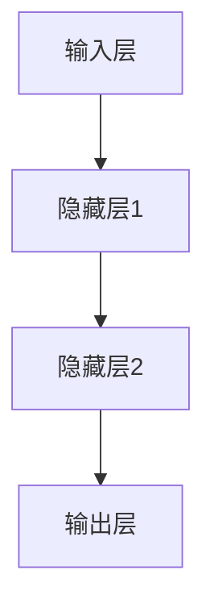
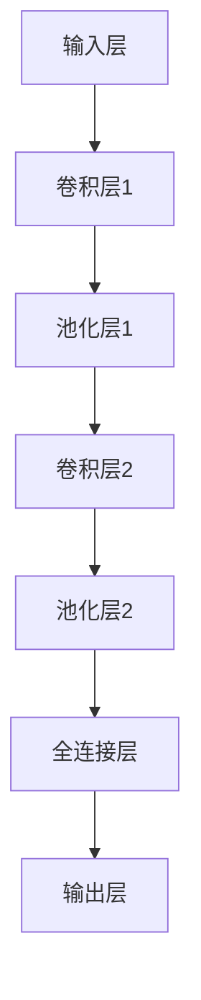
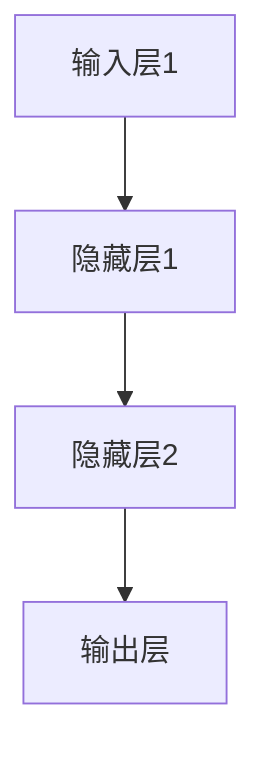
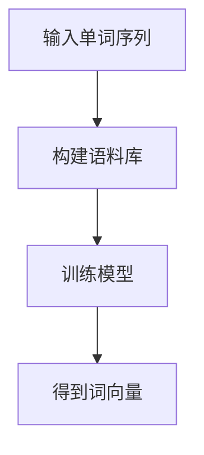
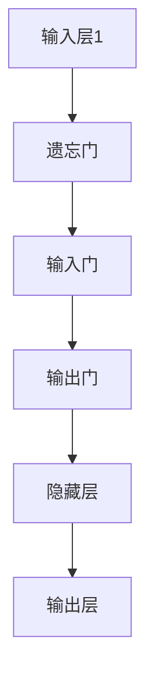
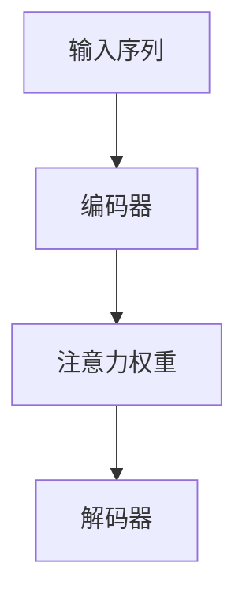

                 

## 文章标题：自然语言处理的未来：AI技术革新

### 关键词：
- 自然语言处理
- 人工智能
- 深度学习
- 大模型
- 自监督学习
- 生成对抗网络

> 摘要：随着人工智能技术的不断进步，自然语言处理（NLP）正迎来新的发展机遇。本文将深入探讨NLP的基础知识、AI技术在NLP中的应用、未来发展方向以及研究前沿，并通过对实际项目的分析，揭示NLP在各个领域中的广泛应用及其未来面临的挑战。

## 目录

### 《自然语言处理的未来：AI技术革新》

#### 第一部分：自然语言处理的基础知识

- **第1章：自然语言处理概述**
  - **1.1 自然语言处理的定义与历史**
  - **1.2 自然语言处理的组成**
  - **1.3 自然语言处理的应用场景

- **第2章：AI技术在自然语言处理中的应用**
  - **2.1 深度学习与自然语言处理**
  - **2.2 常见深度学习框架在自然语言处理中的应用**

- **第3章：自然语言处理的未来方向**
  - **3.1 大模型在自然语言处理中的应用**
  - **3.2 自然语言处理与人工智能的结合**

- **第4章：自然语言处理项目实战**
  - **4.1 项目准备**
  - **4.2 实战案例一：文本分类**
  - **4.3 实战案例二：机器翻译**

- **第5章：自然语言处理研究前沿**
  - **5.1 自监督学习在自然语言处理中的应用**
  - **5.2 生成对抗网络在自然语言处理中的应用**

- **第6章：自然语言处理的未来挑战**
  - **6.1 数据隐私保护**
  - **6.2 多语言处理**

- **第7章：自然语言处理的应用拓展**
  - **7.1 在医疗领域的应用**
  - **7.2 在教育领域的应用**

- **附录**
  - **附录 A：自然语言处理常用工具与资源**

### 引言

自然语言处理（NLP）作为人工智能（AI）的一个重要分支，旨在让计算机理解和处理人类语言。从最早的文本分析到如今的智能对话系统，NLP在各个领域都展现出了巨大的潜力。然而，随着数据的爆炸式增长和计算能力的提升，NLP正面临着新的挑战和机遇。本文旨在探讨NLP的未来发展方向，分析AI技术在这场革命中的革新作用，并通过实际项目和前沿研究，展示NLP在各个领域的广泛应用及其面临的挑战。

### 第一部分：自然语言处理的基础知识

#### 第1章：自然语言处理概述

自然语言处理（NLP）是一门涉及语言学、计算机科学、人工智能等多个领域的交叉学科。其核心目标是使计算机能够理解和处理人类语言，从而实现人机交互、信息检索、智能问答等多个应用场景。

### 1.1 自然语言处理的定义与历史

#### 1.1.1 自然语言处理的定义

自然语言处理（NLP）通常被定义为让计算机理解、解释和生成自然语言（如英语、汉语等）的过程。这个过程涉及多个子领域，包括语音识别、文本分析、语言生成等。

#### 1.1.2 自然语言处理的历史

自然语言处理的历史可以追溯到20世纪50年代。当时，研究者们开始尝试通过编程让计算机理解和翻译语言。早期的自然语言处理系统主要基于规则，即通过编写大量的规则来指导计算机如何处理语言。

然而，这种方法在面对复杂和灵活的自然语言时表现不佳。随着计算能力的提升和深度学习技术的出现，自然语言处理进入了一个新的阶段。现在，大多数NLP任务都是基于统计方法和深度学习模型，这些模型可以自动从大量数据中学习语言规律，从而实现高精度的语言理解。

### 1.2 自然语言处理的组成

自然语言处理主要包括以下几个子领域：

#### 1.2.1 语音识别

语音识别（Speech Recognition）是指将语音信号转换为文本的过程。这一过程通常包括以下几个步骤：

1. **语音信号预处理**：包括去除噪声、增加信号清晰度等。
2. **特征提取**：将预处理后的语音信号转换为特征向量。
3. **模式识别**：使用机器学习或深度学习模型对特征向量进行分类，生成文本。

语音识别在智能助手、语音搜索等领域有广泛应用。

#### 1.2.2 文本分析

文本分析（Text Analysis）是指对文本进行结构化处理，以提取有用的信息。文本分析包括以下任务：

- **词频统计**：统计文本中各个词出现的次数。
- **词性标注**：标注文本中每个词的词性（如名词、动词等）。
- **句法分析**：分析句子结构，确定词与词之间的关系。
- **情感分析**：判断文本表达的情感倾向。

文本分析在信息检索、舆情监控等领域有广泛应用。

#### 1.2.3 语言生成

语言生成（Language Generation）是指根据给定的输入，自动生成文本。语言生成包括以下任务：

- **机器翻译**：将一种语言的文本翻译成另一种语言的文本。
- **文本摘要**：从长文本中提取关键信息，生成简洁的摘要。
- **对话系统**：根据用户输入，生成合适的回复。

语言生成在聊天机器人、智能客服等领域有广泛应用。

### 1.3 自然语言处理的应用场景

自然语言处理在多个领域都有广泛应用，以下列举几个典型应用场景：

#### 1.3.1 人工智能助手

人工智能助手（如Siri、Alexa）通过自然语言处理技术，能够理解用户的语音输入，并给出相应的回复。这使得用户可以通过自然语言与计算机进行交互，大大提高了人机交互的便利性。

#### 1.3.2 搜索引擎

搜索引擎（如Google、Bing）利用自然语言处理技术，对用户输入的查询进行解析，并返回与查询最相关的网页。这一过程涉及文本分析、信息检索等多个NLP任务。

#### 1.3.3 内容审核

内容审核（如社交媒体平台的内容审核）利用自然语言处理技术，对用户发布的内容进行实时监控，识别并过滤违规内容。这一过程通常涉及情感分析、文本分类等多个NLP任务。

### 总结

自然语言处理作为人工智能的一个重要分支，正发挥着越来越重要的作用。通过深度学习和大规模数据处理技术，NLP在语音识别、文本分析、语言生成等多个领域取得了显著进展。随着技术的不断发展，NLP将在更多领域得到应用，为人类带来更加智能和便利的体验。

### 第2章：AI技术在自然语言处理中的应用

随着人工智能技术的迅猛发展，深度学习（Deep Learning）已经成为自然语言处理（NLP）领域的核心驱动力量。本章将介绍深度学习的基本概念，并在NLP中的应用，包括词向量表示、序列模型和注意力机制等关键技术和方法。

### 2.1 深度学习基础

#### 2.1.1 神经网络

神经网络（Neural Networks）是深度学习的基础。它们模拟人脑神经元的工作方式，通过多层节点（神经元）进行信号传递和处理。神经网络的核心组成部分包括：

1. **输入层**：接收外部输入信号。
2. **隐藏层**：对输入信号进行处理和变换。
3. **输出层**：输出最终结果。

神经网络通过学习大量数据，调整内部权重，从而能够对新的数据进行预测或分类。以下是一个简单的神经网络结构示意图：



#### 2.1.2 卷积神经网络

卷积神经网络（Convolutional Neural Networks，CNN）是一种专门用于处理图像数据的神经网络。它通过卷积操作提取图像的特征，具有局部感知和权值共享的特性。CNN在图像识别、图像分类等领域取得了巨大成功。

卷积神经网络的典型结构包括：

- **卷积层**：通过卷积操作提取图像特征。
- **池化层**：对特征进行下采样，减少模型参数。
- **全连接层**：将特征映射到分类结果。

以下是一个简单的CNN结构示意图：



#### 2.1.3 循环神经网络

循环神经网络（Recurrent Neural Networks，RNN）是一种能够处理序列数据的神经网络。它通过在时间维度上保持状态，能够捕捉序列中前后元素之间的关系。RNN在自然语言处理、语音识别等领域有广泛应用。

RNN的核心结构包括：

- **输入层**：接收序列中的每个元素。
- **隐藏层**：保持序列的状态。
- **输出层**：输出序列的结果。

以下是一个简单的RNN结构示意图：



### 2.2 自然语言处理中的深度学习应用

#### 2.2.1 词向量表示

词向量（Word Vectors）是一种将单词映射到高维向量空间的方法，从而能够利用向量空间中的相似性关系进行文本处理。Word2Vec、GloVe等是常见的词向量模型。

- **Word2Vec**：通过训练大规模语料，将单词映射到固定长度的向量。
- **GloVe**：基于全局词频统计，生成词向量。

以下是一个简单的Word2Vec算法流程：



#### 2.2.2 序列模型

序列模型（Sequence Models）是一类专门用于处理序列数据的深度学习模型，包括RNN、LSTM（Long Short-Term Memory）和GRU（Gated Recurrent Unit）等。

- **RNN**：通过在时间维度上保持状态，处理序列数据。
- **LSTM**：通过引入门控机制，解决RNN的长期依赖问题。
- **GRU**：简化LSTM的结构，提高计算效率。

以下是一个简单的LSTM结构示意图：



#### 2.2.3 注意力机制

注意力机制（Attention Mechanism）是一种用于提升序列模型性能的重要技术。它通过动态调整模型对序列中每个元素的关注程度，实现更精准的序列处理。

以下是一个简单的注意力机制示意图：



### 2.3 常见深度学习框架在自然语言处理中的应用

在自然语言处理领域，常见的深度学习框架包括TensorFlow、PyTorch和Keras等。这些框架提供了丰富的API和工具，方便开发者构建和训练深度学习模型。

#### 2.3.1 TensorFlow

TensorFlow是由Google开发的一个开源深度学习框架。它支持多种编程语言，包括Python、C++和Java。TensorFlow提供了丰富的API，包括低层次的Tensor API和高层面的Estimator API，适用于构建各种深度学习模型。

以下是一个简单的TensorFlow文本分类模型示例：

```python
import tensorflow as tf

# 定义模型结构
model = tf.keras.Sequential([
    tf.keras.layers.Embedding(vocabulary_size, embedding_dim),
    tf.keras.layers.Flatten(),
    tf.keras.layers.Dense(units=1, activation='sigmoid')
])

# 编译模型
model.compile(optimizer='adam', loss='binary_crossentropy', metrics=['accuracy'])

# 训练模型
model.fit(train_data, train_labels, epochs=10, validation_data=(val_data, val_labels))
```

#### 2.3.2 PyTorch

PyTorch是由Facebook开发的一个开源深度学习框架。它提供了动态计算图，使得模型构建和调试更加灵活。PyTorch广泛应用于自然语言处理、计算机视觉等领域。

以下是一个简单的PyTorch文本分类模型示例：

```python
import torch
import torch.nn as nn

# 定义模型结构
model = nn.Sequential(
    nn.Embedding(vocabulary_size, embedding_dim),
    nn.Linear(embedding_dim, units=1, activation='sigmoid')
)

# 编译模型
criterion = nn.BCELoss()
optimizer = torch.optim.Adam(model.parameters())

# 训练模型
for epoch in range(10):
    optimizer.zero_grad()
    outputs = model(train_data)
    loss = criterion(outputs, train_labels)
    loss.backward()
    optimizer.step()
```

#### 2.3.3 Keras

Keras是一个高级深度学习框架，广泛应用于自然语言处理领域。它提供了一个简单且直观的API，使得开发者可以轻松构建和训练深度学习模型。

以下是一个简单的Keras文本分类模型示例：

```python
from keras.models import Sequential
from keras.layers import Embedding, Dense

# 定义模型结构
model = Sequential()
model.add(Embedding(vocabulary_size, embedding_dim))
model.add(Dense(units=1, activation='sigmoid'))

# 编译模型
model.compile(optimizer='adam', loss='binary_crossentropy', metrics=['accuracy'])

# 训练模型
model.fit(train_data, train_labels, epochs=10, validation_data=(val_data, val_labels))
```

### 总结

深度学习在自然语言处理领域取得了显著的成果，推动了NLP技术的发展。通过词向量表示、序列模型和注意力机制等关键技术，深度学习模型能够更好地理解和处理自然语言。常见深度学习框架如TensorFlow、PyTorch和Keras提供了丰富的API和工具，使得开发者可以轻松构建和训练复杂的NLP模型。随着深度学习的不断发展，NLP将在更多领域发挥重要作用，为人类带来更加智能的体验。

### 第3章：自然语言处理的未来方向

随着人工智能技术的不断进步，自然语言处理（NLP）也在不断进化，未来将会有更多创新和突破。本章将探讨NLP未来的几个关键方向，包括大模型的应用、自然语言处理与人工智能的结合，以及相关的伦理和隐私问题。

#### 3.1 大模型在自然语言处理中的应用

近年来，大规模预训练模型（如GPT、BERT等）在自然语言处理领域取得了显著的突破。这些模型通过在大规模语料库上进行预训练，能够捕获丰富的语言知识，从而在多种NLP任务中表现出色。

##### 3.1.1 GPT系列模型

GPT（Generative Pre-trained Transformer）系列模型是OpenAI开发的一类基于Transformer架构的预训练模型。GPT-3是其中最著名的模型，具有1750亿个参数，是目前规模最大的语言模型之一。GPT系列模型通过生成文本的方式，能够生成连贯、自然的语言，广泛应用于文本生成、问答系统等领域。

以下是一个简单的GPT模型训练和生成的伪代码：

```python
# GPT模型训练伪代码
model = GPTModel(vocab_size, hidden_size, num_layers)
optimizer = optim.SGD(model.parameters(), lr=0.001)

for epoch in range(num_epochs):
    for batch in data_loader:
        optimizer.zero_grad()
        output = model(batch)
        loss = criterion(output, target)
        loss.backward()
        optimizer.step()

# GPT模型生成伪代码
def generate_text(model, prompt, max_length):
    output = model(prompt, max_length=max_length)
    return output
```

##### 3.1.2 BERT及其变体

BERT（Bidirectional Encoder Representations from Transformers）是由Google开发的预训练模型，它通过双向Transformer架构对文本进行编码，能够捕捉到文本的前后关系。BERT在多种NLP任务中取得了优异的成绩，如文本分类、命名实体识别等。BERT的变体模型，如RoBERTa、ALBERT等，进一步优化了模型结构，提高了模型性能。

以下是一个简单的BERT模型训练和预测的伪代码：

```python
# BERT模型训练伪代码
model = BERTModel(vocab_size, hidden_size, num_layers)
optimizer = optim.Adam(model.parameters(), lr=0.001)

for epoch in range(num_epochs):
    for batch in data_loader:
        optimizer.zero_grad()
        output = model(batch)
        loss = criterion(output, target)
        loss.backward()
        optimizer.step()

# BERT模型预测伪代码
def predict(model, input_text):
    input_ids = tokenizer.encode(input_text)
    output = model(input_ids)
    return output
```

##### 3.1.3 其他大模型

除了GPT和BERT，还有许多其他的大模型在NLP领域取得了显著的成果。如T5（Text-To-Text Transfer Transformer）、GPT-Neo、LLaMA等。这些模型通过不同的架构和预训练目标，进一步提升了NLP任务的性能。

#### 3.2 自然语言处理与人工智能的结合

自然语言处理与人工智能的结合是未来NLP发展的重要方向。通过将NLP技术与其他人工智能技术相结合，可以开发出更强大的智能系统。

##### 3.2.1 多模态处理

多模态处理（Multimodal Processing）是将文本、图像、音频等多种模态的信息融合到一起，从而提升模型的性能。例如，在问答系统中，可以结合文本问题和图像信息，提供更准确的回答。多模态处理的关键技术包括图像识别、语音识别、文本情感分析等。

以下是一个简单的多模态处理模型示例：

```python
# 多模态处理模型伪代码
class MultimodalModel(nn.Module):
    def __init__(self):
        super(MultimodalModel, self).__init__()
        self.text_encoder = BERTModel()
        self.image_encoder = CNNModel()
        self.combiner = nn.Linear(hidden_size + image_size, hidden_size)

    def forward(self, text, image):
        text_output = self.text_encoder(text)
        image_output = self.image_encoder(image)
        combined_output = self.combiner(torch.cat((text_output, image_output), dim=1))
        return combined_output
```

##### 3.2.2 强化学习在自然语言处理中的应用

强化学习（Reinforcement Learning，RL）是一种通过与环境交互来学习最优策略的机器学习方法。在自然语言处理领域，强化学习可以用于生成对话、智能客服等任务。例如，通过让对话系统在与用户互动的过程中不断学习和优化，可以提升其对话质量。

以下是一个简单的强化学习对话模型示例：

```python
# 强化学习对话模型伪代码
class DialogModel(nn.Module):
    def __init__(self):
        super(DialogModel, self).__init__()
        self.encoder = BERTModel()
        self.action_space = action_space

    def forward(self, state):
        state_output = self.encoder(state)
        action_probs = self.get_action_probs(state_output)
        return action_probs

    def get_action_probs(self, state_output):
        # 计算动作概率
        action_probs = F.softmax(state_output, dim=1)
        return action_probs
```

##### 3.2.3 伦理与隐私问题

随着自然语言处理技术的发展，伦理和隐私问题也日益凸显。例如，模型训练和使用过程中可能会涉及用户隐私数据，如何保护用户隐私成为一个重要问题。此外，模型生成的内容可能涉及歧视、仇恨言论等伦理问题，如何规范模型行为也是一个重要挑战。

为了解决这些问题，可以采取以下措施：

- **数据隐私保护**：使用匿名化、加密等技术保护用户隐私。
- **内容审核**：通过建立内容审核机制，过滤违规内容。
- **透明度和可解释性**：提高模型透明度，使用户能够理解模型的决策过程。
- **伦理准则**：制定伦理准则，规范模型开发和使用的道德边界。

#### 3.3 自然语言处理的未来展望

随着人工智能技术的不断发展，自然语言处理领域将会取得更多突破。未来，NLP将更加智能化、个性化，能够更好地理解人类语言，为人类社会带来更多便利。同时，NLP也将与其他人工智能技术深度融合，推动人工智能的发展。

然而，NLP的发展也面临一些挑战。例如，如何提升模型的鲁棒性和泛化能力，如何解决多语言处理问题，如何确保模型的公平性和可解释性等。这些问题需要学术界和工业界共同努力，通过技术创新和规范制定，推动NLP领域的可持续发展。

总之，自然语言处理作为人工智能的一个重要分支，具有广阔的发展前景。随着技术的不断进步，NLP将在更多领域发挥重要作用，为人类社会带来更加智能和便捷的体验。

### 第4章：自然语言处理项目实战

为了更深入地理解自然语言处理（NLP）的应用和实践，本章将通过两个实战案例来展示NLP项目的实际操作过程，包括项目准备、模型选择与训练，以及模型评估与优化。

#### 4.1 项目准备

在任何NLP项目中，准备工作都是至关重要的一步。以下是一些关键步骤：

##### 4.1.1 项目需求分析

在开始项目之前，首先要明确项目的目标和需求。例如，对于一个文本分类项目，需要确定分类的类别（如新闻类别、情感分类等）和输入文本的来源。

##### 4.1.2 环境搭建

搭建合适的项目开发环境是成功实施项目的基础。通常需要安装以下工具和库：

- **Python**：作为主要编程语言。
- **TensorFlow** 或 **PyTorch**：作为深度学习框架。
- **NLP库**：如**spaCy**、**NLTK**等，用于文本处理和分析。
- **数据预处理工具**：如**Pandas**、**NumPy**等，用于数据处理。

以下是一个简单的Python环境搭建示例：

```bash
# 安装Python
curl -O https://www.python.org/ftp/python/3.8.5/Python-3.8.5.tgz
tar xzf Python-3.8.5.tgz
cd Python-3.8.5
./configure
make
sudo make install

# 安装TensorFlow
pip install tensorflow

# 安装spaCy
python -m spacy download en_core_web_sm
```

##### 4.1.3 数据预处理

数据预处理是NLP项目的重要组成部分，通常包括以下步骤：

- **文本清洗**：去除HTML标签、特殊字符、停用词等。
- **分词**：将文本拆分为单词或词组。
- **词性标注**：为每个单词标注词性（如名词、动词等）。
- **向量化**：将文本转换为数值表示，如词向量。

以下是一个简单的文本预处理示例：

```python
import spacy

nlp = spacy.load("en_core_web_sm")

text = "This is an example sentence for NLP processing."
doc = nlp(text)

# 文本清洗
cleaned_text = " ".join([token.text for token in doc if not token.is_punct and not token.is_stop])

# 分词
tokens = [token.text for token in doc]

# 词性标注
pos_tags = [(token.text, token.pos_) for token in doc]

# 向量化
vectorizer = CountVectorizer()
X = vectorizer.fit_transform(cleaned_text.split())
```

#### 4.2 实战案例一：文本分类

文本分类（Text Classification）是一种常见的NLP任务，旨在将文本分配到预定义的类别中。以下是一个简单的文本分类项目实战案例。

##### 4.2.1 案例背景

假设我们有一个新闻数据集，包含不同的新闻类别（如体育、政治、娱乐等），我们的目标是训练一个模型，能够根据输入的新闻文本将其分类到相应的类别。

##### 4.2.2 模型选择与训练

为了实现文本分类，我们可以选择多种深度学习模型，如朴素贝叶斯、支持向量机（SVM）、卷积神经网络（CNN）等。以下使用卷积神经网络（CNN）进行训练的伪代码：

```python
from tensorflow.keras.models import Sequential
from tensorflow.keras.layers import Embedding, Conv1D, MaxPooling1D, Flatten, Dense

# 准备数据
X_train, y_train = prepare_data(train_data)
X_val, y_val = prepare_data(val_data)

# 构建模型
model = Sequential()
model.add(Embedding(vocab_size, embedding_dim))
model.add(Conv1D(filters, kernel_size, activation='relu'))
model.add(MaxPooling1D(pool_size))
model.add(Flatten())
model.add(Dense(num_classes, activation='softmax'))

# 编译模型
model.compile(optimizer='adam', loss='categorical_crossentropy', metrics=['accuracy'])

# 训练模型
model.fit(X_train, y_train, epochs=10, batch_size=32, validation_data=(X_val, y_val))
```

##### 4.2.3 模型评估与优化

在训练完成后，我们需要评估模型的性能，并通过调整超参数和结构来优化模型。

以下是一个简单的模型评估和优化示例：

```python
from sklearn.metrics import classification_report

# 评估模型
predictions = model.predict(X_val)
predicted_labels = np.argmax(predictions, axis=1)
true_labels = np.argmax(y_val, axis=1)

print(classification_report(true_labels, predicted_labels))

# 调整超参数和结构
model = Sequential()
model.add(Embedding(vocab_size, embedding_dim))
model.add(Conv1D(filters, kernel_size, activation='relu'))
model.add(MaxPooling1D(pool_size))
model.add(Flatten())
model.add(Dense(num_classes, activation='softmax'))

model.compile(optimizer='adam', loss='categorical_crossentropy', metrics=['accuracy'])
model.fit(X_train, y_train, epochs=10, batch_size=32, validation_data=(X_val, y_val))
```

#### 4.3 实战案例二：机器翻译

机器翻译（Machine Translation）是将一种语言的文本翻译成另一种语言的文本。以下是一个简单的机器翻译项目实战案例。

##### 4.3.1 案例背景

假设我们要将英文翻译成中文，我们的数据集包含英文句子和对应的中文翻译。

##### 4.3.2 模型选择与训练

对于机器翻译任务，通常使用序列到序列（Seq2Seq）模型，结合注意力机制来提高翻译质量。以下是一个简单的Seq2Seq模型训练的伪代码：

```python
from tensorflow.keras.models import Model
from tensorflow.keras.layers import Input, LSTM, Embedding, Dense, TimeDistributed

# 准备数据
X_train, y_train = prepare_translation_data(train_data)
X_val, y_val = prepare_translation_data(val_data)

# 构建编码器
encoder_inputs = Input(shape=(max_sequence_length,))
encoder_embedding = Embedding(vocab_size, embedding_dim)(encoder_inputs)
encoder_lstm = LSTM(hidden_size, return_state=True)
_, state_h, state_c = encoder_lstm(encoder_embedding)

# 构建解码器
decoder_inputs = Input(shape=(max_sequence_length,))
decoder_embedding = Embedding(vocab_size, embedding_dim)(decoder_inputs)
decoder_lstm = LSTM(hidden_size, return_sequences=True, return_state=True)
decoder_outputs = TimeDistributed(Dense(vocab_size, activation='softmax'))(decoder_embedding)

# 构建模型
model = Model([encoder_inputs, decoder_inputs], decoder_outputs)
model.compile(optimizer='adam', loss='categorical_crossentropy')

# 训练模型
model.fit([X_train, y_train], y_train, batch_size=64, epochs=100, validation_data=([X_val, y_val], y_val))
```

##### 4.3.3 模型评估与优化

在训练完成后，我们需要评估模型的翻译质量，并通过调整超参数和结构来优化模型。

以下是一个简单的模型评估和优化示例：

```python
from tensorflow.keras.preprocessing.sequence import pad_sequences

# 评估模型
translated_sentences = model.predict([X_val, y_val])
translated_sentences = decode_translation_sentences(translated_sentences)

# 评估翻译质量
print(eval_translation_quality(true_labels, translated_sentences))

# 调整超参数和结构
# （示例：增加隐藏层单元数、尝试不同的优化器和损失函数等）
```

### 总结

通过这两个实战案例，我们展示了自然语言处理项目的实际操作过程，包括项目准备、模型选择与训练，以及模型评估与优化。这些实战案例不仅帮助理解了NLP的基本原理，还展示了如何将理论应用到实际项目中。随着NLP技术的不断发展和完善，未来将有更多的应用场景和挑战等待我们去探索。

### 第5章：自然语言处理研究前沿

自然语言处理（NLP）领域近年来取得了飞速发展，研究前沿主要集中在自监督学习和生成对抗网络（GAN）等新技术上。本章将介绍这些前沿技术的基本概念、应用场景以及最新研究成果。

#### 5.1 自监督学习在自然语言处理中的应用

自监督学习（Self-supervised Learning）是一种无需人工标注数据即可训练模型的方法。通过从大量未标注的数据中提取有用信息，自监督学习能够有效地提高模型的性能。在NLP领域，自监督学习被广泛应用于词嵌入、文本分类、机器翻译等任务。

##### 5.1.1 自监督学习的概念

自监督学习的基本思想是利用数据中固有的信息来进行训练。例如，在一个语言模型中，输入和输出通常是相同的，因此可以从中学习语言的模式和结构。

以下是一个简单的自监督学习语言模型的伪代码：

```python
def self_supervised_learning(data):
    for sentence in data:
        # 生成标签（例如，将句子分成单词）
        labels = generate_labels(sentence)
        # 训练模型
        model.fit(sentence, labels)
    return model
```

##### 5.1.2 自监督学习的应用场景

自监督学习在NLP中有多种应用场景，以下列举几个典型例子：

- **词嵌入**：通过自监督学习，如Word2Vec和GloVe，将单词映射到低维向量空间，从而捕获词与词之间的关系。
- **文本分类**：自监督学习可以用于构建无监督文本分类器，通过对未标注的数据进行训练，实现文本的自动分类。
- **机器翻译**：通过自监督学习，如Seq2Seq模型，可以将源语言文本翻译成目标语言文本。

##### 5.1.3 最新研究成果

近年来，自监督学习在NLP领域取得了许多重要成果，以下列举几个具有代表性的研究：

- **UniVL**：一种基于自监督学习的跨语言词表示模型，能够在多语言环境中有效捕捉词与词之间的关系。
- **Mlm-LM**：将预训练的语言模型（如BERT）与自监督学习相结合，实现了在多种NLP任务中的高性能。
- **BigBird**：Google提出的一种自监督学习模型，通过在序列中引入全局上下文信息，显著提高了模型的性能。

#### 5.2 生成对抗网络在自然语言处理中的应用

生成对抗网络（GAN）是一种由生成器和判别器组成的框架，通过相互竞争来学习数据分布。在NLP领域，GAN被广泛应用于文本生成、图像生成等任务。

##### 5.2.1 生成对抗网络的基本概念

生成对抗网络由以下两部分组成：

- **生成器**：生成逼真的数据。
- **判别器**：判断生成数据是否真实。

以下是一个简单的GAN模型的伪代码：

```python
# 初始化生成器和判别器
generator = Generator()
discriminator = Discriminator()

# 训练模型
for epoch in range(num_epochs):
    for data in data_loader:
        # 生成假数据
        fake_data = generator.real_data()
        # 训练判别器
        discriminator.train(fake_data)
        # 训练生成器
        generator.train(discriminator)
```

##### 5.2.2 生成对抗网络在自然语言处理中的应用

生成对抗网络在NLP中有多种应用，以下列举几个典型例子：

- **文本生成**：GAN可以用于生成连贯、自然的文本，如故事、新闻报道等。
- **图像生成**：GAN可以将文本描述转换为图像，如文本到图像生成。
- **语音生成**：GAN可以用于生成逼真的语音，如语音转换和语音增强。

##### 5.2.3 最新研究成果

近年来，生成对抗网络在NLP领域取得了许多重要成果，以下列举几个具有代表性的研究：

- **TextGAN**：一种用于文本生成的GAN模型，通过引入对抗性训练，提高了文本生成质量。
- **SpeechGAN**：一种用于语音生成的GAN模型，通过在生成器和判别器中使用音频特征，实现了高质量的语音合成。
- **GAN in Text-to-Image Synthesis**：GAN在文本到图像生成中的应用，通过文本描述生成逼真的图像。

#### 5.3 其他前沿研究

除了自监督学习和生成对抗网络，NLP领域还有许多其他前沿研究，以下列举几个：

- **多模态NLP**：将文本、图像、语音等多种模态的信息融合到一起，实现更强大的语义理解。
- **解释性NLP**：研究如何让NLP模型的行为更加透明和可解释，提高模型的可信度和可接受度。
- **跨语言NLP**：研究如何在多语言环境中处理语言差异，实现有效的跨语言信息传递。

### 总结

自然语言处理研究前沿主要集中在自监督学习和生成对抗网络等新技术上。这些技术不仅推动了NLP领域的快速发展，也为未来的研究提供了新的方向。随着技术的不断进步，NLP将在更多领域发挥重要作用，为人类社会带来更多智能和便利的体验。

### 第6章：自然语言处理的未来挑战

随着自然语言处理（NLP）技术的迅猛发展，其在各个领域的应用也日益广泛。然而，这一领域仍面临着诸多挑战，特别是在数据隐私保护、多语言处理等方面。本章将深入探讨这些挑战及其解决方案。

#### 6.1 数据隐私保护

数据隐私保护是NLP领域面临的一个重要挑战。在训练和部署NLP模型时，通常会使用大量的个人数据，这些数据可能包含敏感信息，如个人身份、健康状况等。如果这些数据泄露，可能会导致严重的安全问题和隐私侵犯。

##### 6.1.1 数据隐私保护的重要性

数据隐私保护的重要性体现在以下几个方面：

- **法律法规要求**：许多国家和地区都有严格的数据保护法律，如欧盟的通用数据保护条例（GDPR）。
- **用户信任**：用户对NLP应用的信任取决于其对数据隐私的信心。
- **商业利益**：保护用户数据是企业维护声誉和竞争力的关键。

##### 6.1.2 数据隐私保护的挑战

数据隐私保护面临以下主要挑战：

- **数据量巨大**：NLP模型通常需要处理海量的数据，这使得隐私保护变得更加复杂。
- **数据多样性**：不同类型的数据有不同的隐私风险，如何统一保护各类数据是一个难题。
- **数据匿名化**：虽然数据匿名化是一种常见的保护措施，但完全匿名化可能会影响模型的性能。

##### 6.1.3 数据隐私保护的方法

为了应对数据隐私保护的挑战，可以采取以下几种方法：

- **数据加密**：使用加密技术保护数据，确保只有授权用户才能访问。
- **数据匿名化**：通过匿名化技术，如差分隐私、合成数据等，减少数据中的个人身份信息。
- **数据访问控制**：通过设置权限和访问控制策略，确保只有授权用户可以访问敏感数据。
- **隐私增强技术**：如同态加密、安全多方计算等，可以在不泄露数据隐私的情况下进行数据处理和分析。

#### 6.2 多语言处理

多语言处理（Multilingual Processing）是NLP领域的一个关键挑战。随着全球化的发展，多语言处理需求不断增加。然而，不同语言之间存在巨大的差异，这给NLP模型的训练和部署带来了困难。

##### 6.2.1 多语言处理的重要性

多语言处理的重要性体现在以下几个方面：

- **跨文化交流**：多语言处理可以促进不同语言之间的交流和理解。
- **全球化业务**：许多企业在全球范围内运营，多语言处理有助于提高业务的覆盖面和效率。
- **社会福祉**：多语言处理技术可以用于教育、医疗等公共服务领域，提高社会福祉。

##### 6.2.2 多语言处理的挑战

多语言处理面临以下主要挑战：

- **语言差异**：不同语言在语法、词汇、语调等方面存在显著差异，这给模型训练和语言理解带来了困难。
- **数据稀缺**：某些小语种的数据量非常有限，这使得训练高质量的多语言模型变得更加困难。
- **语言资源不平衡**：一些常用语言（如英语、汉语）的资源丰富，而其他语言（如小语种）的资源匮乏。

##### 6.2.3 多语言处理的解决方案

为了解决多语言处理面临的挑战，可以采取以下几种方法：

- **共享资源**：通过共享多语言数据集、模型和工具，可以提高多语言处理的研究和应用水平。
- **跨语言迁移学习**：利用一种语言的模型和资源，迁移到其他语言，从而提高模型的性能。
- **多语言预训练**：使用多语言数据集进行预训练，使模型能够更好地理解和处理多种语言。
- **语言模型融合**：将多种语言模型融合到一起，实现更好的多语言处理效果。

#### 6.3 未来展望

尽管NLP领域面临诸多挑战，但随着技术的不断进步，这些问题有望得到解决。未来的NLP研究将更加关注隐私保护、多语言处理、模型解释性等方面。通过跨学科合作和持续的技术创新，NLP将在更多领域发挥重要作用，为人类社会带来更加智能和便利的体验。

### 第7章：自然语言处理的应用拓展

自然语言处理（NLP）技术作为一种强大的工具，在各个领域展现出了巨大的应用潜力。本章将深入探讨NLP在医疗和教育两个领域的具体应用，包括医学文本分析、语音助手、教育内容生成等。

#### 7.1 在医疗领域的应用

NLP在医疗领域的应用正变得越来越重要，它能够帮助医生和研究人员从大量医疗数据中提取有价值的信息，从而提高诊断和治疗的效率。

##### 7.1.1 医学文本分析

医学文本分析是指利用NLP技术对医疗文本（如病历、医学论文、患者报告等）进行分析和理解。以下是一些具体的NLP应用案例：

- **电子病历（EHR）分析**：NLP可以用于分析电子病历，提取患者的基本信息、诊断结果、治疗方案等。这有助于医生快速获取关键信息，提高诊断的准确性。
- **医学论文挖掘**：通过文本分类、实体识别等技术，NLP可以帮助研究人员快速找到相关研究论文，从而加速医学研究的进展。
- **患者反馈分析**：分析患者对医疗服务的反馈，可以帮助医疗机构改进服务质量，提高患者满意度。

以下是一个简单的医学文本分析的伪代码示例：

```python
import spacy

nlp = spacy.load("en_core_smi")

def analyze_medical_text(text):
    doc = nlp(text)
    entities = [ent.text for ent in doc.ents]
    return entities

text = "The patient was diagnosed with diabetes and received insulin treatment."
entities = analyze_medical_text(text)
print(entities)
```

##### 7.1.2 语音助手在医疗领域的应用

语音助手已经成为医疗领域的一个重要工具，它能够帮助患者和医生更便捷地获取医疗信息，提高医疗服务质量。以下是一些具体应用：

- **患者自助服务**：语音助手可以回答患者常见的问题，如预约挂号、医疗费用查询等，减轻了医院客服的工作量。
- **医生辅助诊疗**：语音助手可以帮助医生快速查找医学知识、查阅病历，从而提高诊疗效率。
- **语音记录和转录**：医生可以使用语音助手记录患者病史和检查结果，系统自动将语音转换为文本，便于后续分析和记录。

以下是一个简单的语音助手应用的伪代码示例：

```python
import speech_recognition as sr

recognizer = sr.Recognizer()

def recognize_speech(file_path):
    with sr.AudioFile(file_path) as source:
        audio = recognizer.record(source)
    text = recognizer.recognize_google(audio)
    return text

file_path = "doctor_notes.wav"
spoken_text = recognize_speech(file_path)
print(spoken_text)
```

##### 7.1.3 医学图像分析

NLP与计算机视觉技术的结合在医学图像分析中也展现出巨大潜力。以下是一些具体应用：

- **病变检测**：利用NLP技术对医学图像中的文字信息进行分析，可以帮助医生识别病变区域。
- **辅助诊断**：通过分析医学图像中的文字信息和图像特征，NLP可以帮助医生进行辅助诊断。
- **医学图像标注**：语音助手可以记录医生对医学图像的描述，NLP技术将这些描述转换为标注信息，便于后续分析和研究。

#### 7.2 在教育领域的应用

NLP在教育领域的应用也在不断扩展，它能够帮助学生更好地学习，帮助教师提高教学质量，以及优化教育资源的分配。

##### 7.2.1 教育内容生成

教育内容生成是指利用NLP技术自动生成教育材料，如课程大纲、练习题、教学视频等。以下是一些具体应用：

- **个性化学习内容**：根据学生的学习兴趣和进度，NLP可以自动生成个性化的学习内容，帮助学生更好地掌握知识。
- **自动批改作业**：NLP技术可以分析学生的作业答案，自动评估答案的正确性，并提供即时反馈。
- **教育视频生成**：利用NLP技术，可以将文字教材转换为视频教学内容，提高学生的学习效果。

以下是一个简单的教育内容生成伪代码示例：

```python
import spacy

nlp = spacy.load("en_core_web_sm")

def generate_educational_content(question):
    doc = nlp(question)
    answers = []
    for sent in doc.sents:
        if "答案：" in sent.text:
            answers.append(sent.text.split("答案：")[1].strip())
    return answers

question = "什么是自然语言处理？"
answers = generate_educational_content(question)
print(answers)
```

##### 7.2.2 个性化学习推荐

个性化学习推荐是指根据学生的学习行为和兴趣，推荐合适的学习资源。以下是一些具体应用：

- **课程推荐**：根据学生的学习进度和兴趣，推荐合适的课程和教材。
- **学习路径规划**：根据学生的需求和进度，规划个性化的学习路径。
- **学习反馈**：根据学生的学习反馈，调整推荐策略，提高推荐质量。

以下是一个简单的个性化学习推荐伪代码示例：

```python
def recommend_courses(student_profile, course_library):
    recommended_courses = []
    for course in course_library:
        if is_relevant(course, student_profile):
            recommended_courses.append(course)
    return recommended_courses

student_profile = {"interests": ["机器学习", "自然语言处理"], "progress": ["课程A", "课程B"]}
course_library = [{"name": "机器学习课程", "tags": ["机器学习"]}, {"name": "自然语言处理课程", "tags": ["自然语言处理"]}, {"name": "计算机基础", "tags": ["计算机基础"]}]
recommended_courses = recommend_courses(student_profile, course_library)
print(recommended_courses)
```

##### 7.2.3 语音识别在教育中的应用

语音识别技术在教育领域也有广泛的应用，以下是一些具体应用：

- **口语测评**：通过语音识别技术，可以自动评估学生的口语表达能力，提供即时反馈。
- **语音搜索**：学生可以通过语音输入进行教材和资料搜索，提高学习效率。
- **语音辅助教学**：教师可以使用语音助手辅助教学，如语音讲解、演示等，丰富教学方式。

以下是一个简单的语音识别应用伪代码示例：

```python
import speech_recognition as sr

recognizer = sr.Recognizer()

def recognize_speech(file_path):
    with sr.AudioFile(file_path) as source:
        audio = recognizer.record(source)
    text = recognizer.recognize_google(audio)
    return text

file_path = "student_oral_exam.wav"
spoken_text = recognize_speech(file_path)
print(spoken_text)
```

### 总结

自然语言处理技术在医疗和教育领域展现了广泛的应用前景。通过医学文本分析、语音助手、教育内容生成等技术，NLP不仅提高了医疗和教育的效率和质量，也为人类带来了更加智能和便捷的体验。随着NLP技术的不断发展和完善，其在更多领域的应用潜力将不断被挖掘。

### 附录 A：自然语言处理常用工具与资源

自然语言处理（NLP）领域的快速进展离不开各种工具和资源的支持。以下介绍几种常用的NLP工具和资源，包括框架、数据集和论文推荐。

#### A.1 自然语言处理框架介绍

1. **TensorFlow**
   - [官方网站](https://www.tensorflow.org/)
   - TensorFlow是一个由Google开发的开源深度学习框架，支持多种编程语言，广泛应用于NLP任务。

2. **PyTorch**
   - [官方网站](https://pytorch.org/)
   - PyTorch是一个由Facebook开发的开源深度学习框架，提供了动态计算图，易于调试和实验。

3. **Keras**
   - [官方网站](https://keras.io/)
   - Keras是一个高级深度学习API，构建在TensorFlow和Theano之上，简化了深度学习模型的搭建过程。

4. **SpaCy**
   - [官方网站](https://spacy.io/)
   - SpaCy是一个强大的NLP库，支持快速文本处理和先进的语言模型。

5. **NLTK**
   - [官方网站](https://www.nltk.org/)
   - NLTK是一个广泛使用的Python自然语言处理库，提供了多种文本处理工具和资源。

#### A.2 自然语言处理数据集介绍

1. **COCO**
   - [官方网站](http://cocodataset.org/)
   - COCO（Common Objects in Context）是一个大规模的语义理解数据集，包含大量图像和文本描述。

2. **GLUE**
   - [官方网站](https://gluebenchmark.com/)
   - GLUE（General Language Understanding Evaluation）是一个大型基准数据集，用于评估多种NLP任务。

3. **SQuAD**
   - [官方网站](https://rajpurkar.github.io/SQuAD-explorer/)
   - SQuAD（Stanford Question Answering Dataset）是一个问答数据集，用于评估机器阅读理解和问答能力。

#### A.3 自然语言处理相关论文推荐

1. **《Attention is All You Need》**
   - [论文链接](https://arxiv.org/abs/1506.04450)
   - 这篇论文提出了Transformer模型，是NLP领域的重要里程碑。

2. **《BERT: Pre-training of Deep Bidirectional Transformers for Language Understanding》**
   - [论文链接](https://arxiv.org/abs/1810.04805)
   - BERT模型通过预训练语言模型，在多种NLP任务中取得了优异的性能。

3. **《Generative Adversarial Nets》**
   - [论文链接](https://arxiv.org/abs/1406.2661)
   - 这篇论文提出了生成对抗网络（GAN），为图像生成和NLP领域带来了新方法。

通过这些工具和资源，研究者可以更好地开展自然语言处理的研究和项目开发。随着技术的不断进步，这些工具和资源也将持续更新和优化，为NLP领域的发展提供坚实支持。

