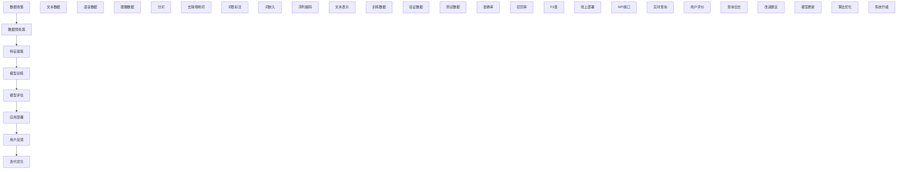

                 

# 文章标题：自然语言查询在数据分析中的应用

> 关键词：自然语言处理，数据分析，查询优化，文本分类，聚类，机器学习，深度学习

> 摘要：随着大数据时代的到来，数据分析在企业决策、智能推荐和客户服务等领域发挥着越来越重要的作用。自然语言查询作为一种便捷高效的交互方式，能够将用户的需求转化为结构化的数据，从而提高数据分析的效率和准确性。本文将从自然语言处理、数据分析基础、自然语言查询的应用场景等多个角度出发，探讨自然语言查询在数据分析中的应用，并通过具体案例进行分析与验证。

## 目录

#### 第一部分：自然语言查询概述

**第1章：自然语言查询基础**

- **1.1 自然语言处理简介**
  - 自然语言处理的基本概念
  - 语言模型与语义理解

- **1.2 数据分析基础**
  - 数据分析的基本流程
  - 数据分析中的常见问题与挑战

- **1.3 自然语言查询的应用场景**
  - 企业信息检索
  - 电子商务推荐系统
  - 客户服务自动化

**第2章：自然语言处理技术概览**

- **2.1 词嵌入技术**
  - 词嵌入的基本概念
  - 常见的词嵌入方法（Word2Vec, GloVe等）

- **2.2 序列模型与注意力机制**
  - 序列模型的基本原理（RNN, LSTM, GRU等）
  - 注意力机制的作用与实现

- **2.3 转换器架构（Transformer）**
  - Transformer的基本结构
  - Transformer的变体与优化

#### 第二部分：自然语言查询在数据分析中的实现

**第3章：自然语言查询在数据预处理中的应用**

- **3.1 文本清洗与预处理**
  - 去除停用词
  - 分词与词性标注

- **3.2 基于自然语言查询的数据索引**
  - 倒排索引的实现
  - 布尔查询与查询优化

- **3.3 文本相似度计算**
  - 余弦相似度
  - Jaccard相似度

**第4章：自然语言查询在数据挖掘中的应用**

- **4.1 文本分类**
  - 基于机器学习的文本分类方法
  - 词袋模型与TF-IDF

- **4.2 文本聚类**
  - K-means聚类
  - DBSCAN聚类

- **4.3 文本信息检索**
  - 搜索引擎的基本原理
  - 搜索引擎的优化策略

**第5章：自然语言查询在数据分析项目中的实战**

- **5.1 数据分析项目实战环境搭建**
  - 开发环境的搭建
  - 数据库与数据存储的选择

- **5.2 企业信息检索系统设计**
  - 系统需求分析
  - 系统架构设计

- **5.3 电子商务推荐系统**
  - 用户行为分析
  - 商品推荐算法实现

- **5.4 客户服务自动化**
  - 聊天机器人设计
  - 自然语言处理在客服中的应用

**第6章：自然语言查询在数据分析中的挑战与未来趋势**

- **6.1 自然语言查询的挑战**
  - 复杂查询的理解
  - 多语言支持

- **6.2 自然语言查询的未来趋势**
  - 人工智能与自然语言处理的发展
  - 大模型在自然语言查询中的应用

- **6.3 数据分析与自然语言查询的融合**
  - 实时数据流分析
  - 智能决策支持系统

#### 第三部分：附录

**第7章：自然语言查询开发工具与资源**

- **7.1 主流自然语言处理工具介绍**
  - NLTK
  - SpaCy
  - Stanford NLP

- **7.2 自然语言处理框架**
  - TensorFlow
  - PyTorch

- **7.3 开源自然语言处理项目**
  - NLTK
  - SpaCy
  - Stanford NLP

- **7.4 自然语言处理社区与资源**
  - NLP社区
  - NLP博客
  - NLP论文集锦

**附录A：自然语言处理流程Mermaid图**

**附录B：文本分类算法伪代码**

**附录C：自然语言查询数学模型**

**附录D：项目实战代码示例**

**附录E：自然语言查询开发工具与资源Mermaid图**


## 引言

在当今的信息化时代，数据已成为企业和个人决策的重要依据。随着数据量的不断增长，如何高效地对海量数据进行处理和分析成为了一个重要的课题。传统的数据分析方法通常需要用户具备一定的技术背景，对数据结构和分析算法有深入的了解。然而，对于许多非技术背景的用户而言，这种要求无疑增加了数据获取和分析的难度。自然语言查询的出现，为这一问题提供了一种新的解决方案。

自然语言查询（Natural Language Querying，NLQ）是指通过自然语言的方式，将用户的需求或问题转化为结构化的查询语句，以便计算机能够理解和处理。这种方式不仅降低了用户的技术门槛，还提高了数据获取和分析的效率。在数据分析领域，自然语言查询的应用主要体现在以下几个方面：

1. **企业信息检索**：用户可以通过自然语言查询快速查找企业内部的知识库、文档和报表，无需进行复杂的检索操作。
2. **电子商务推荐系统**：基于用户的查询和浏览历史，系统可以自动推荐相关商品，提高用户体验和转化率。
3. **客户服务自动化**：通过自然语言处理技术，聊天机器人可以理解和回应用户的查询，提供个性化的服务。

本文将围绕自然语言查询在数据分析中的应用，从基础概念、技术实现、应用场景等多个方面进行深入探讨。通过本文的阅读，读者将能够了解自然语言查询的基本原理，掌握其在数据分析中的实现方法，并对其未来发展有更深刻的认识。

### 第一部分：自然语言查询概述

#### 第1章：自然语言查询基础

在探讨自然语言查询在数据分析中的应用之前，我们首先需要了解自然语言处理（Natural Language Processing，NLP）的基本概念和技术，以及数据分析中的基础知识和常见问题。

##### 1.1 自然语言处理简介

自然语言处理是一门交叉学科，它结合计算机科学、语言学和人工智能等领域的知识，旨在使计算机能够理解、解释和生成自然语言。NLP的基本概念包括以下几个方面：

1. **文本表示**：文本是自然语言处理的基本单位，将文本转换为计算机可以处理的形式是NLP的首要任务。常见的文本表示方法包括词嵌入（Word Embedding）、词序列（Word Sequence）和句子表示（Sentence Representation）等。
   
2. **语言模型**：语言模型是NLP的核心组成部分，用于预测文本的下一个单词或句子。通过训练大量语料库，语言模型能够捕捉语言的统计规律，从而提高文本处理的准确性。

3. **语义理解**：语义理解是NLP的高级阶段，旨在理解文本的含义和上下文。这包括词义消歧（Word Sense Disambiguation）、语义角色标注（Semantic Role Labeling）和情感分析（Sentiment Analysis）等。

常见的语言模型有基于N-gram的语言模型和基于神经网络的深度学习语言模型。N-gram模型通过统计相邻单词的频率来预测下一个单词，具有实现简单、效果较好的特点。而深度学习语言模型，如循环神经网络（RNN）、长短期记忆网络（LSTM）和转换器架构（Transformer）等，通过复杂的神经网络结构捕捉文本的长期依赖关系，在自然语言处理任务中取得了显著的效果。

##### 1.2 数据分析基础

数据分析是指通过处理和分析数据，从中提取有价值的信息和知识的过程。数据分析的基本流程包括以下步骤：

1. **数据收集**：收集所需的数据，数据来源可以是内部数据库、外部数据服务或公开数据集等。
   
2. **数据预处理**：对原始数据进行清洗、去噪和格式化，使其适合进行进一步的分析。预处理步骤包括缺失值处理、异常值处理、数据归一化和数据转换等。

3. **特征提取**：从原始数据中提取有意义的特征，用于构建模型或进行进一步的分析。特征提取方法包括统计特征、文本特征和图像特征等。

4. **模型训练**：使用提取的特征训练机器学习模型，如回归模型、分类模型和聚类模型等。常用的机器学习算法包括线性回归、决策树、随机森林、支持向量机和神经网络等。

5. **模型评估**：评估训练好的模型的性能，通过交叉验证、A/B测试等方法来衡量模型的准确性、召回率和F1值等指标。

6. **模型部署**：将训练好的模型部署到生产环境中，用于实际的应用场景，如实时预测、自动化决策等。

在数据分析中，常见的问题和挑战包括数据质量不佳、数据缺失、特征选择不当、模型过拟合等。这些问题需要通过数据预处理、特征工程和模型选择等方法进行解决。

##### 1.3 自然语言查询的应用场景

自然语言查询在数据分析中的应用场景非常广泛，主要包括以下几个方面：

1. **企业信息检索**：企业通常拥有大量的文档和知识库，用户可以通过自然语言查询快速查找所需的信息，如报告、政策文件和客户档案等。

2. **电子商务推荐系统**：用户在电子商务平台上搜索或浏览商品时，系统可以根据用户的查询和浏览历史，自动推荐相关的商品，提高用户体验和转化率。

3. **客户服务自动化**：通过自然语言处理技术，聊天机器人可以理解和回应用户的查询，提供个性化的服务，如客户咨询、技术支持等。

4. **舆情分析**：通过对社交媒体和新闻网站上的文本进行自然语言查询，可以分析公众对某个事件或产品的看法，为企业决策提供依据。

5. **智能问答系统**：通过训练问答模型，用户可以通过自然语言提问，系统可以自动回答用户的问题，提供有用的信息。

综上所述，自然语言处理和数据分析是自然语言查询在数据分析中不可或缺的两个基础。通过对这两个领域的深入理解，我们能够更好地掌握自然语言查询的基本原理，并在实际应用中取得良好的效果。

### 第2章：自然语言处理技术概览

在自然语言查询中，自然语言处理（NLP）技术扮演着至关重要的角色。这一章将介绍几种关键的NLP技术，包括词嵌入、序列模型和注意力机制，以及近年来备受关注的转换器架构（Transformer）。

##### 2.1 词嵌入技术

词嵌入（Word Embedding）是将单词映射到高维空间中的向量表示的技术。这种向量表示不仅能够保留单词的语义信息，还能够捕捉到单词之间的相似性。词嵌入的主要目的是将文本数据转化为数值化的形式，从而便于计算机进行处理和分析。

1. **基本概念**

   词嵌入的基本概念包括两个核心要素：词汇表（Vocabulary）和向量空间（Vector Space）。词汇表包含了所有训练文本中出现的单词，而向量空间则是这些单词的向量表示。

2. **常见方法**

   - **Word2Vec**：Word2Vec是早期的一种词嵌入方法，通过训练上下文窗口模型来生成词向量。它包括两种模型：连续词袋（Continuous Bag of Words，CBOW）和Skip-Gram。CBOW模型通过上下文单词预测中心词，而Skip-Gram模型则是通过中心词预测上下文单词。

   - **GloVe**：GloVe（Global Vectors for Word Representation）是一种基于全局词频的词嵌入方法。它通过计算单词的共现次数来生成词向量，从而更好地捕捉词与词之间的语义关系。

3. **优缺点**

   - **优点**：词嵌入方法能够捕捉到单词的语义信息，使得文本数据在数值化后仍然保持丰富的语义特征。
   - **缺点**：词嵌入方法存在一些局限性，如无法很好地处理罕见词和未登录词的问题。

##### 2.2 序列模型与注意力机制

序列模型（Sequential Model）是处理序列数据（如文本、语音、时间序列等）的一种常见方法。在NLP任务中，序列模型通常用于语言建模、机器翻译、语音识别等。近年来，序列模型得到了显著的发展，其中循环神经网络（Recurrent Neural Network，RNN）和长短期记忆网络（Long Short-Term Memory，LSTM）是两个重要的代表。

1. **RNN**

   RNN是一种能够处理序列数据的神经网络，其核心思想是将当前的状态与前一时刻的隐藏状态相连接。然而，标准的RNN在处理长距离依赖问题时存在梯度消失或梯度爆炸的问题。

2. **LSTM**

   LSTM（Long Short-Term Memory）是RNN的一种变体，通过引入门控机制（gate）来克服标准RNN的缺点。LSTM包含三种门控单元：遗忘门、输入门和输出门，它们分别控制信息的遗忘、输入和输出。

3. **GRU**

   GRU（Gated Recurrent Unit）是另一种RNN变体，相比LSTM，GRU结构更加简洁，参数较少，因此在某些情况下性能优于LSTM。

4. **注意力机制**

   注意力机制（Attention Mechanism）是一种在序列模型中用于捕捉长距离依赖关系的机制。通过注意力机制，模型能够动态地关注序列中的不同部分，从而提高模型的性能。

   - **基本原理**：注意力机制通过计算一个权重向量来表示每个输入元素的重要性。权重越大，该元素对输出结果的影响就越大。
   - **实现方法**：常见的注意力机制实现方法包括点积注意力（Dot-Product Attention）和加性注意力（Additive Attention）等。

##### 2.3 转换器架构（Transformer）

Transformer是近年来在自然语言处理领域取得突破性进展的一种新型神经网络架构。它由Vaswani等人在2017年提出，在机器翻译、语言建模等任务中取得了显著的效果。

1. **基本结构**

   Transformer由编码器（Encoder）和解码器（Decoder）两部分组成，它们都由多个相同的编码器层和解码器层堆叠而成。每个编码器层包含两个主要组件：多头自注意力机制（Multi-Head Self-Attention）和前馈神经网络（Feed-Forward Neural Network）。

   - **多头自注意力机制**：通过多个独立的注意力头来同时关注输入序列的不同部分，从而捕获丰富的上下文信息。
   - **前馈神经网络**：对自注意力机制输出的结果进行进一步的变换和增强。

2. **变体与优化**

   Transformer架构本身已经非常高效和强大，但研究人员在此基础上还提出了许多变体和优化方法，如BERT（Bidirectional Encoder Representations from Transformers）、GPT（Generative Pre-trained Transformer）和T5（Text-To-Text Transfer Transformer）等。

   - **BERT**：BERT通过预训练双向Transformer编码器来学习文本的上下文表示，并在多个下游任务中取得了优异的性能。
   - **GPT**：GPT是一种仅包含解码器的Transformer模型，通过自回归语言建模来生成文本序列。
   - **T5**：T5通过将所有自然语言处理任务转换为文本到文本的转换任务，利用Transformer模型的强大能力，实现了在多种任务上的高性能。

3. **优缺点**

   - **优点**：Transformer架构具有并行化能力，能够在处理长序列数据时保持良好的性能。此外，它通过多头自注意力机制能够有效地捕捉长距离依赖关系。
   - **缺点**：Transformer模型的计算复杂度较高，训练时间较长。同时，它对数据量有较高的要求，在大规模数据集上表现更好。

综上所述，词嵌入、序列模型和注意力机制是自然语言处理中不可或缺的核心技术，而Transformer架构则以其独特的优势在NLP领域取得了重大突破。通过深入理解和应用这些技术，我们能够更好地构建高效的自然语言处理系统，实现更加智能化的数据分析。

### 第3章：自然语言查询在数据预处理中的应用

在自然语言查询过程中，数据预处理是一个关键环节。有效的预处理能够提高后续自然语言处理任务的性能，确保查询结果的准确性和可靠性。本章将详细介绍文本清洗与预处理、基于自然语言查询的数据索引以及文本相似度计算。

##### 3.1 文本清洗与预处理

文本清洗与预处理是自然语言处理的基础步骤，旨在去除无关信息，提高文本的质量和一致性。以下是一些常见的文本清洗与预处理方法：

1. **去除停用词**

   停用词（Stop Words）是指在文本中频繁出现，但对文本内容贡献较小的词，如“的”、“了”、“在”等。去除停用词有助于减少文本噪声，提高特征提取的效率。

2. **分词**

   分词（Tokenization）是将文本分割成单词或短语的步骤。中文分词通常基于字符或词性标注，而英文分词则基于空格或正则表达式。有效的分词能够确保文本数据的一致性和准确性。

3. **词性标注**

   词性标注（Part-of-Speech Tagging）是对文本中的每个词进行词性分类的过程，如名词、动词、形容词等。词性标注有助于更好地理解文本的语义，为后续的文本分类、情感分析等任务提供支持。

4. **词干提取**

   词干提取（Stemming）是通过去除词尾的词缀，将单词还原为其词干的形式。这种方法有助于减少文本中的词汇量，提高特征提取的效率。

5. **文本标准化**

   文本标准化包括将文本转换为统一格式，如将所有字母转换为小写、去除标点符号等。标准化有助于提高文本数据的一致性，便于后续处理。

##### 3.2 基于自然语言查询的数据索引

数据索引是自然语言查询系统中的核心组件，它能够快速定位到与用户查询最相关的数据。以下是一些基于自然语言查询的数据索引技术：

1. **倒排索引**

   倒排索引（Inverted Index）是一种用于快速检索文本数据的数据结构。它由两部分组成：倒排列表和文档频率表。倒排列表记录了每个单词在文档中的位置，而文档频率表记录了每个文档中出现的单词数量。

   - **基本原理**：用户查询时，系统首先通过查询词在倒排列表中查找所有相关的文档，然后根据文档频率表计算查询词与每个文档的相关度，最后返回最相关的文档。

2. **布尔查询**

   布尔查询（Boolean Query）是一种基于布尔逻辑的查询方式，允许用户通过组合多个查询词进行精确搜索。常见的布尔操作符包括AND、OR和NOT等。

   - **实现方法**：系统首先对每个查询词构建倒排索引，然后通过布尔逻辑运算符组合查询词，计算出与用户查询最相关的文档。

3. **查询优化**

   查询优化（Query Optimization）是提高自然语言查询系统性能的重要手段。以下是一些常见的查询优化技术：

   - **查询缓存**：将频繁查询的结果缓存起来，减少数据库访问次数，提高查询响应速度。
   - **查询重写**：通过对查询语句进行重写，使其在数据库中更高效地执行，如将多个AND查询合并为单个查询。
   - **索引优化**：对倒排索引进行优化，如使用压缩索引、多字段索引等，提高索引的检索效率。

##### 3.3 文本相似度计算

文本相似度计算是自然语言查询系统中的一个重要任务，它用于评估查询与文档之间的相关性。以下是一些常见的文本相似度计算方法：

1. **余弦相似度**

   余弦相似度（Cosine Similarity）是一种基于向量空间模型的文本相似度计算方法。它通过计算两个文本向量之间的余弦值来衡量它们的相似度。

   - **公式**：$$ \text{相似度} = \frac{\text{文档A和文档B的余弦相似度}}{\text{文档A的长度} \times \text{文档B的长度}} $$
   - **计算过程**：首先将文本转换为向量表示，然后计算这两个向量之间的余弦值。

2. **Jaccard相似度**

   Jaccard相似度（Jaccard Similarity）是一种基于集合论的计算方法，它通过比较两个文档中共同出现的词和不同出现的词来衡量相似度。

   - **公式**：$$ \text{相似度} = \frac{\text{文档A和文档B的共同词集合}}{\text{文档A的词集合} \cup \text{文档B的词集合}} $$
   - **计算过程**：首先对两个文档进行分词，然后计算它们共同出现的词和不同出现的词，最后根据公式计算相似度。

3. **其他相似度计算方法**

   除了余弦相似度和Jaccard相似度外，还有许多其他文本相似度计算方法，如编辑距离（Edit Distance）、余弦余弦相似度（Cosine Cosine Similarity）等。选择合适的相似度计算方法需要根据具体的应用场景和数据特点进行权衡。

通过有效的文本清洗与预处理、基于自然语言查询的数据索引以及文本相似度计算，自然语言查询系统能够更好地理解用户的需求，提高查询的准确性和响应速度。这些技术不仅为自然语言查询在数据分析中的应用提供了坚实的基础，也为构建智能化的数据分析系统提供了有力支持。

### 第4章：自然语言查询在数据挖掘中的应用

自然语言查询在数据挖掘中的应用非常广泛，能够显著提高数据分析的效率和准确性。本章将详细介绍自然语言查询在文本分类、文本聚类和信息检索中的具体应用。

##### 4.1 文本分类

文本分类（Text Classification）是一种将文本数据划分为预定义类别的过程。自然语言查询技术在这一过程中发挥着重要作用，通过将用户的需求或问题转化为结构化的查询语句，从而提高分类的准确性和效率。

1. **基于机器学习的文本分类方法**

   - **词袋模型（Bag of Words，BoW）**：词袋模型是将文本表示为单词的集合，通过统计每个单词在文档中出现的频率来进行分类。BoW模型简单高效，但无法捕捉词序信息。

   - **TF-IDF（Term Frequency-Inverse Document Frequency）**：TF-IDF是一种常用的特征提取方法，通过计算词在文档中的频率和其在整个文档集合中的逆向频率来衡量其重要性。TF-IDF能够更好地捕捉文本中的重要特征词。

   - **朴素贝叶斯（Naive Bayes）**：朴素贝叶斯是一种基于概率论的分类方法，通过计算每个特征词在各个类别中的概率，最终根据贝叶斯公式计算出文本属于每个类别的概率，选取概率最大的类别作为分类结果。

   - **支持向量机（Support Vector Machine，SVM）**：SVM是一种经典的分类算法，通过寻找一个最优的超平面将不同类别的文本数据分隔开。SVM在处理高维文本数据时表现出色。

   - **深度学习模型**：近年来，深度学习模型在文本分类任务中取得了显著的效果。卷积神经网络（Convolutional Neural Network，CNN）和循环神经网络（Recurrent Neural Network，RNN）等深度学习模型能够捕捉文本的复杂结构和语义信息，提高分类的准确性和泛化能力。

2. **应用实例**

   - **社交媒体情感分析**：通过自然语言查询，系统可以自动分类社交媒体平台上的用户评论，判断其情感倾向（正面、负面或中性）。
   - **新闻分类**：新闻网站可以利用自然语言查询技术对新闻内容进行分类，如政治、经济、体育等类别，以便于用户快速浏览和检索。

##### 4.2 文本聚类

文本聚类（Text Clustering）是一种无监督学习方法，用于将相似的文本数据聚成若干个簇。自然语言查询在文本聚类中同样发挥着重要作用，通过将用户的需求转化为查询语句，可以更有效地进行聚类分析。

1. **K-means聚类**

   K-means是一种最常用的聚类算法，其基本思想是将文本数据划分成K个簇，每个簇由其质心（中心点）代表。算法的步骤包括：

   - **初始化**：随机选择K个初始质心。
   - **分配**：将每个文本点分配到最近的质心所代表的簇。
   - **更新**：重新计算每个簇的质心，并重新分配文本点。
   - **迭代**：重复步骤2和步骤3，直到质心的变化小于阈值或达到最大迭代次数。

2. **DBSCAN（Density-Based Spatial Clustering of Applications with Noise）**

   DBSCAN是一种基于密度的聚类算法，它能够识别出任意形状的簇，并能够处理噪声点和异常值。DBSCAN的主要步骤包括：

   - **邻域搜索**：找到每个数据点的邻域点。
   - **生成簇**：根据邻域点的密度和连接性生成簇。
   - **标记噪声点**：将无法形成簇的点标记为噪声点。

3. **应用实例**

   - **客户群体细分**：通过自然语言查询，企业可以分析客户的历史数据和反馈信息，将其细分为不同的客户群体，以便于制定个性化的营销策略。
   - **内容推荐**：电商网站可以通过文本聚类分析用户的行为和喜好，为用户推荐相关的内容和商品。

##### 4.3 文本信息检索

文本信息检索（Text Information Retrieval）是自然语言查询在数据分析中的核心应用之一。它通过将用户的查询语句与索引库中的文档进行匹配，返回最相关的结果。

1. **搜索引擎的基本原理**

   - **倒排索引**：搜索引擎通常使用倒排索引来存储文档的索引信息。倒排索引由词汇表和文档列表组成，每个词汇表项包含了包含该词汇的所有文档的ID。

   - **查询处理**：当用户提交查询时，搜索引擎通过倒排索引快速定位到包含查询词的文档，并根据查询词与文档的相关度返回结果。

2. **搜索引擎的优化策略**

   - **查询重写**：搜索引擎通过对用户查询进行重写，扩展查询范围，提高检索的准确性。常见的查询重写策略包括同义词替换、扩展查询词、删除停用词等。

   - **相关性反馈**：通过分析用户的查询历史和点击行为，搜索引擎可以不断优化查询结果，提高用户满意度。相关性反馈包括个性化搜索、网页排名优化等。

   - **分布式搜索**：大型搜索引擎通常采用分布式架构，将索引和查询处理分散到多个节点上，提高系统的性能和可扩展性。

3. **应用实例**

   - **企业信息检索系统**：企业可以通过自然语言查询快速查找内部文档、知识库和报表，提高工作效率。
   - **在线教育平台**：在线教育平台可以利用自然语言查询技术，为用户提供个性化的学习资源推荐，提高学习效果。

通过文本分类、文本聚类和信息检索等技术，自然语言查询在数据挖掘中发挥了重要作用。这些技术不仅提高了数据分析的效率和准确性，还为构建智能化的数据分析系统提供了有力支持。未来，随着自然语言处理技术的不断进步，自然语言查询在数据分析中的应用将会更加广泛和深入。

### 第5章：自然语言查询在数据分析项目中的实战

在实际的数据分析项目中，自然语言查询技术能够显著提升数据处理的效率和准确性。本章节将通过具体案例，介绍自然语言查询在数据分析项目中的实战应用，包括企业信息检索系统、电子商务推荐系统、客户服务自动化等领域的实现过程。

##### 5.1 数据分析项目实战环境搭建

在进行自然语言查询应用之前，首先需要搭建一个稳定、高效的项目环境。以下是一些关键步骤：

1. **开发环境搭建**
   - **Python环境**：确保安装了Python及其相关的NLP库，如NLTK、spaCy、TensorFlow、PyTorch等。
   - **文本预处理工具**：安装常用的文本处理工具，如Jieba（中文分词）、NLTK（自然语言处理工具包）等。
   - **数据库选择**：根据项目需求选择合适的数据库，如MySQL、PostgreSQL、MongoDB等。

2. **数据存储选择**
   - **结构化数据**：对于结构化数据，可以选择关系型数据库，如MySQL或PostgreSQL，便于进行复杂的查询和分析。
   - **非结构化数据**：对于非结构化数据，如文本和图像，可以选择NoSQL数据库，如MongoDB或Elasticsearch，它们在处理大量文本数据方面具有优势。

3. **模型训练和部署**
   - **模型训练环境**：搭建模型训练环境，包括GPU或TPU加速器，以便快速训练大型神经网络模型。
   - **模型部署**：选择合适的模型部署工具，如TensorFlow Serving、Kubernetes等，将训练好的模型部署到生产环境中，实现实时查询和预测。

##### 5.2 企业信息检索系统设计

企业信息检索系统是企业内部知识管理的重要工具，通过自然语言查询，员工可以快速查找相关文档和资料。以下是企业信息检索系统的设计和实现步骤：

1. **系统需求分析**
   - **用户需求**：明确用户对信息检索的需求，如快速查找报告、政策文件、客户档案等。
   - **功能需求**：设计系统的核心功能，包括文档检索、搜索结果排序、模糊查询等。

2. **系统架构设计**
   - **数据层**：构建企业文档数据库，存储各类文档资料，采用Elasticsearch进行全文索引和快速检索。
   - **业务逻辑层**：利用NLP技术处理用户的查询请求，进行文本清洗、分词、词性标注等预处理步骤，构建查询索引。
   - **展示层**：设计用户友好的前端界面，展示搜索结果，提供文档浏览、下载和分享等功能。

3. **系统实现**
   - **文本预处理**：使用Jieba进行中文分词，去除停用词，构建倒排索引。
   - **查询处理**：利用Elasticsearch实现全文检索，根据查询词和文档的相关性返回搜索结果。
   - **结果排序**：采用TF-IDF算法和余弦相似度计算查询结果的相关性，实现智能排序。

4. **示例代码**

   ```python
   from jieba import analyser
   from elasticsearch import Elasticsearch
   
   # 初始化Elasticsearch客户端
   es = Elasticsearch("http://localhost:9200")
   
   # 文本预处理
   def preprocess_query(query):
       words = analyser.lcut(query)
       filtered_words = [word for word in words if word not in stop_words]
       return " ".join(filtered_words)
   
   # 搜索文档
   def search_documents(query):
       preprocessed_query = preprocess_query(query)
       response = es.search(index="documents", body={"query": {"match": {"content": preprocessed_query}}})
       return response['hits']['hits']
   
   # 搜索示例
   search_results = search_documents("财务报告2022")
   for result in search_results:
       print(result['_source']['title'])
   ```

##### 5.3 电子商务推荐系统

电子商务推荐系统通过自然语言查询和用户行为分析，为用户推荐相关的商品和服务，提升用户满意度和转化率。

1. **用户行为分析**
   - **用户浏览历史**：分析用户在网站上的浏览记录，了解用户兴趣。
   - **购买历史**：收集用户的购买记录，挖掘用户的消费偏好。
   - **评价与反馈**：分析用户的评价和反馈，了解用户对商品的满意度和不满意度。

2. **商品推荐算法实现**
   - **协同过滤（Collaborative Filtering）**：通过分析用户的共同浏览和购买记录，推荐相似用户喜欢的商品。
   - **基于内容的推荐（Content-Based Filtering）**：通过分析商品的属性和标签，推荐与用户历史行为相似的商品。
   - **混合推荐（Hybrid Recommendation）**：结合协同过滤和基于内容的推荐方法，提高推荐系统的准确性和多样性。

3. **系统实现**
   - **数据预处理**：对用户行为数据和处理后的商品信息进行预处理，构建用户-商品矩阵。
   - **推荐算法**：选择合适的推荐算法，训练推荐模型，实现商品推荐功能。
   - **用户界面**：在前端界面展示推荐结果，提供用户互动和反馈机制。

4. **示例代码**

   ```python
   import pandas as pd
   from sklearn.metrics.pairwise import cosine_similarity
   
   # 加载用户行为数据
   user_behavior = pd.read_csv("user_behavior.csv")
   
   # 计算用户-商品相似度矩阵
   def compute_similarity_matrix(user_behavior):
       user_product_matrix = pd.pivot_table(user_behavior, index="user_id", columns="product_id", values="rating")
       similarity_matrix = cosine_similarity(user_product_matrix)
       return similarity_matrix
   
   similarity_matrix = compute_similarity_matrix(user_behavior)
   
   # 推荐商品
   def recommend_products(user_id, similarity_matrix, user_product_matrix, top_n=5):
       user_profile = user_product_matrix.loc[user_id]
       similarity_scores = similarity_matrix[user_id].dot(user_product_matrix).sort_values(ascending=False)
       recommended_products = similarity_scores.head(top_n).index.tolist()
       return recommended_products
   
   # 推荐示例
   user_id = 123
   recommended_products = recommend_products(user_id, similarity_matrix, user_behavior)
   print("Recommended Products:", recommended_products)
   ```

##### 5.4 客户服务自动化

客户服务自动化通过自然语言处理技术，实现智能聊天机器人，为用户提供实时、个性化的服务。

1. **聊天机器人设计**
   - **对话管理**：设计对话流程，包括欢迎语、询问用户需求、提供解决方案等。
   - **意图识别**：通过NLP技术识别用户的意图，如咨询产品信息、售后服务等。
   - **实体提取**：从用户输入的文本中提取关键信息，如商品名称、数量、联系方式等。

2. **自然语言处理在客服中的应用**
   - **文本分类**：对用户输入的文本进行分类，如咨询、投诉、建议等。
   - **文本生成**：根据用户需求生成相应的回答或解决方案。
   - **实时交互**：与用户进行实时对话，处理复杂的问题和场景。

3. **系统实现**
   - **对话管理**：使用规则引擎或机器学习模型，实现对话管理和意图识别。
   - **文本生成**：利用预训练的语言模型（如GPT-3、BERT）生成自然的回复。
   - **用户界面**：设计直观、友好的用户界面，提供聊天窗口和交互功能。

4. **示例代码**

   ```python
   from transformers import AutoTokenizer, AutoModelForCausalLM
   
   # 初始化预训练模型
   tokenizer = AutoTokenizer.from_pretrained("gpt-3.5-turbo")
   model = AutoModelForCausalLM.from_pretrained("gpt-3.5-turbo")
   
   # 定义聊天机器人
   class ChatBot:
       def __init__(self, model, tokenizer):
           self.model = model
           self.tokenizer = tokenizer
   
       def generate_response(self, user_input):
           inputs = self.tokenizer.encode("user: " + user_input, return_tensors="pt")
           outputs = self.model.generate(inputs, max_length=50, num_return_sequences=1)
           response = self.tokenizer.decode(outputs[0], skip_special_tokens=True)
           return response
   
   # 实例化聊天机器人
   chatbot = ChatBot(model, tokenizer)
   
   # 用户交互示例
   user_message = "我想要购买一台笔记本电脑。"
   bot_response = chatbot.generate_response(user_message)
   print("Bot:", bot_response)
   ```

通过以上实战案例，可以看出自然语言查询在数据分析项目中的广泛应用和巨大潜力。未来，随着自然语言处理技术的不断进步，自然语言查询在数据分析中的应用将会更加深入和广泛，为企业和用户带来更多价值。

### 第6章：自然语言查询在数据分析中的挑战与未来趋势

#### 6.1 自然语言查询的挑战

尽管自然语言查询在数据分析中展现出巨大潜力，但其实际应用过程中仍面临诸多挑战。

1. **复杂查询的理解**

   复杂查询通常包含多个条件、逻辑运算和嵌套结构，如“找到2022年销售额超过1000万的北方区域所有客户”。理解这样的查询需要深度自然语言处理技术，将自然语言解析为结构化查询语句。

   - **解决方案**：采用先进的解析算法，如依赖树解析、抽象语法树（AST）生成，将自然语言转换为计算机可执行的查询语句。

2. **多语言支持**

   企业和用户往往使用多种语言进行交流，自然语言查询系统需要支持多语言处理，包括词汇、语法和语义的多样性。

   - **解决方案**：开发多语言版本的自然语言处理模型，如多语言BERT、多语言GPT等，以支持不同语言的查询处理。

3. **实时响应性能**

   在实时数据分析场景中，系统需要在毫秒级内响应用户查询，这对系统的性能提出了高要求。

   - **解决方案**：优化查询处理算法，采用分布式计算架构，利用GPU和TPU加速计算，提高系统的响应速度。

4. **数据隐私与安全**

   自然语言查询涉及用户隐私数据的处理，如何确保数据的安全和隐私保护成为重要问题。

   - **解决方案**：采用数据加密、访问控制和安全审计等措施，确保数据在传输和存储过程中的安全。

#### 6.2 自然语言查询的未来趋势

随着人工智能和自然语言处理技术的不断发展，自然语言查询在数据分析中的应用将迎来更多机遇和挑战。

1. **人工智能与自然语言处理的发展**

   - **预训练模型**：预训练模型，如GPT、BERT等，已经在各种NLP任务中取得了显著效果。未来，这些模型将继续优化，提升在自然语言查询中的应用性能。
   - **多模态数据处理**：随着多模态数据（如文本、图像、语音等）的融合，自然语言查询系统将能够处理更复杂的数据类型，实现跨模态的信息检索和分析。

2. **大模型在自然语言查询中的应用**

   - **大模型应用**：大模型，如GPT-3、OPT等，具有强大的语言理解和生成能力，未来将广泛应用于自然语言查询系统，提升查询的准确性和智能化水平。
   - **模型压缩与优化**：为了降低大模型的计算和存储成本，模型压缩与优化技术，如模型剪枝、量化、知识蒸馏等，将成为重要研究方向。

3. **实时数据流分析**

   - **实时数据处理**：随着数据量的增长和实时性的要求，自然语言查询系统需要能够实时处理和分析数据流，提供实时查询和预测。
   - **流处理技术**：采用流处理技术，如Apache Kafka、Apache Flink等，实现数据的实时采集、处理和查询。

4. **智能决策支持系统**

   - **决策支持**：自然语言查询系统不仅可以提供信息检索，还可以结合数据分析结果，提供智能决策支持，如市场预测、风险评估等。
   - **知识图谱**：通过构建知识图谱，将结构化数据和非结构化数据结合起来，实现更智能的数据分析和决策支持。

#### 6.3 数据分析与自然语言查询的融合

未来的数据分析将更加注重与自然语言查询的融合，通过自然语言交互方式，降低用户门槛，提高数据分析的灵活性和智能化。

1. **实时数据分析**：结合实时数据流处理技术，实现数据与查询的实时结合，提供实时反馈和调整。

2. **智能交互界面**：通过自然语言查询和图形用户界面（GUI）的融合，提供更加友好和便捷的用户交互体验。

3. **个性化数据分析**：基于用户行为和偏好，实现个性化的数据分析和服务，满足不同用户的需求。

4. **自动化数据处理**：利用自然语言查询技术，实现自动化数据预处理、特征提取和模型训练，降低数据分析的技术门槛。

总之，自然语言查询在数据分析中的应用前景广阔，通过解决当前面临的挑战和抓住未来的发展趋势，自然语言查询技术将为数据分析领域带来更加智能化和高效化的解决方案。

### 第三部分：附录

#### 第7章：自然语言查询开发工具与资源

在自然语言查询的开发过程中，使用合适的工具和资源能够显著提高开发效率和项目质量。以下将介绍一些主流的自然语言处理工具、框架、开源项目以及社区资源。

##### 7.1 主流自然语言处理工具介绍

1. **NLTK（自然语言工具包）**

   NLTK是Python中最常用的自然语言处理库之一，提供了丰富的文本处理功能，如分词、词性标注、词干提取、词嵌入等。NLTK具有简洁易用的接口，适合初学者快速上手。

2. **spaCy**

   spaCy是一个高效的工业级自然语言处理库，支持多种语言。它提供了强大的文本处理功能，包括分词、词性标注、命名实体识别等。spaCy的API设计简洁，性能优越，广泛应用于实际项目中。

3. **Stanford NLP**

   Stanford NLP是斯坦福大学开发的一个强大的自然语言处理工具包，支持多种语言的文本处理任务，包括分词、词性标注、句法分析等。它具有高精度和良好的扩展性，是研究者和开发者的重要工具。

##### 7.2 自然语言处理框架

1. **TensorFlow**

   TensorFlow是谷歌开发的一个开源机器学习框架，广泛应用于深度学习和自然语言处理领域。TensorFlow提供了丰富的API和工具，支持从简单的线性模型到复杂的深度神经网络的各种应用。

2. **PyTorch**

   PyTorch是Facebook AI Research开发的一个开源深度学习框架，以其简洁的API和动态计算图而闻名。PyTorch在自然语言处理任务中表现出色，支持端到端的模型训练和优化。

##### 7.3 开源自然语言处理项目

1. **NLTK**

   NLTK是一个开源的自然语言处理库，提供丰富的文本处理功能，包括分词、词性标注、词干提取等。NLTK包含大量已经训练好的语言模型和数据集，方便开发者进行文本处理和实验。

2. **spaCy**

   spaCy是一个开源的自然语言处理库，支持多种语言，提供了高效的文本处理功能。spaCy还包括大量的预训练模型和扩展库，可以帮助开发者快速构建复杂的自然语言处理应用。

3. **Stanford NLP**

   Stanford NLP是一个开源的自然语言处理工具包，包括多个NLP任务的处理模块，如分词、词性标注、句法分析等。Stanford NLP具有高精度和良好的扩展性，适用于学术研究和工业应用。

##### 7.4 自然语言处理社区与资源

1. **NLP社区**

   NLP社区是一个汇聚自然语言处理研究者、开发者和爱好者的大型在线社区。社区提供了丰富的讨论区、教程、资源和交流机会，是学习和分享NLP知识的重要平台。

2. **NLP博客**

   NLP博客是许多自然语言处理专家和研究者分享知识和经验的平台。博客中包含最新的研究进展、项目教程和案例分析，是了解NLP最新动态和技术的重要渠道。

3. **NLP论文集锦**

   NLP论文集锦是一个收集自然语言处理领域经典和前沿论文的资源库。这些论文涵盖了NLP的各个方面，包括文本分类、情感分析、机器翻译等，是学习和研究NLP的重要参考资料。

通过使用这些工具和资源，开发者可以更加高效地构建自然语言查询系统，实现复杂的数据分析任务。未来，随着自然语言处理技术的不断进步，这些工具和资源将继续为数据分析领域带来更多创新和突破。

### 附录A：自然语言处理流程Mermaid图



### 附录B：文本分类算法伪代码

```python
# 定义文本分类器的伪代码

def train_classifier(training_data):
    # 对训练数据进行预处理
    processed_data = preprocess_data(training_data)
    
    # 初始化分类器模型
    classifier = initialize_classifier()
    
    # 使用预处理后的数据进行模型训练
    classifier.fit(processed_data.X, processed_data.y)
    
    return classifier

def classify_document(document, classifier):
    # 对输入的文档进行预处理
    processed_document = preprocess_document(document)
    
    # 使用训练好的分类器进行预测
    prediction = classifier.predict(processed_document)
    
    return prediction

# 数据预处理函数
def preprocess_data(data):
    # 去除停用词
    data = remove_stopwords(data)
    # 分词
    data = tokenize(data)
    # 词嵌入
    data = embed_words(data)
    return data

# 初始化分类器
def initialize_classifier():
    # 选择合适的分类器，如朴素贝叶斯、支持向量机、神经网络等
    classifier = NaiveBayes() # 示例
    return classifier
```

### 附录C：自然语言查询数学模型

#### 文本相似度计算公式（余弦相似度）

$$
\text{相似度} = \frac{\text{文档A和文档B的余弦相似度}}{\text{文档A的长度} \times \text{文档B的长度}} = \frac{\text{向量A} \cdot \text{向量B}}{|\text{向量A}| \times |\text{向量B}|}
$$

其中，$\text{向量A}$ 和 $\text{向量B}$ 分别是文档A和文档B的词嵌入向量，$\cdot$ 表示向量点积，$|\text{向量A}|$ 和 $|\text{向量B}|$ 分别表示向量A和向量B的欧几里得范数。

#### 文本聚类算法（K-means）数学模型

##### 目标函数

$$
\text{目标函数} = \sum_{i=1}^{k} \sum_{x \in S_i} \frac{1}{2} ||x - \mu_i||^2
$$

其中，$k$ 是聚类簇的数量，$S_i$ 表示属于第 $i$ 个聚类的文档集合，$\mu_i$ 表示第 $i$ 个聚类中心，$||x - \mu_i||^2$ 表示文档 $x$ 与聚类中心 $\mu_i$ 的欧几里得距离平方。

##### 聚类中心更新规则

在K-means算法中，聚类中心 $\mu_i$ 的更新规则如下：

$$
\mu_i = \frac{1}{n_i} \sum_{x \in S_i} x
$$

其中，$n_i$ 是属于第 $i$ 个聚类的文档数量，$x$ 是属于第 $i$ 个聚类的文档。

### 附录D：项目实战代码示例

```python
# 代码实现示例：企业信息检索系统

from sklearn.feature_extraction.text import TfidfVectorizer
from sklearn.metrics.pairwise import cosine_similarity

# 初始化TF-IDF向量器
vectorizer = TfidfVectorizer()

# 训练TF-IDF向量器
tfidf_matrix = vectorizer.fit_transform(data['document'])

# 定义查询处理函数
def query_processor(query):
    # 对查询进行预处理
    processed_query = preprocess_query(query)
    # 将查询转换为向量
    query_vector = vectorizer.transform([processed_query])
    return query_vector

# 计算查询文档与文档库的相似度
def calculate_similarity(query_vector, tfidf_matrix):
    similarity_matrix = cosine_similarity(query_vector, tfidf_matrix)
    return similarity_matrix

# 获取相似度最高的文档索引
def get_top_documents(similarity_matrix, top_n=5):
    top_index = similarity_matrix.argsort()[0][-top_n:-1]
    return top_index

# 输出相似度最高的文档
def output_top_documents(top_index, data):
    top_documents = [data['document'][index] for index in top_index]
    return top_documents

# 使用示例
query = "如何提升企业业绩？"
processed_query = query_processor(query)
similarity_matrix = calculate_similarity(processed_query, tfidf_matrix)
top_index = get_top_documents(similarity_matrix)
top_documents = output_top_documents(top_index)
print("相似度最高的文档：", top_documents)
```

### 附录E：自然语言查询开发工具与资源Mermaid图


### 结论

自然语言查询作为一种便捷高效的交互方式，在数据分析领域展现出了巨大的潜力和价值。通过本文的深入探讨，我们了解了自然语言查询的基本概念、技术实现、应用场景以及在数据预处理、数据挖掘项目中的实战应用。自然语言查询不仅能够降低用户的技术门槛，提高数据分析的效率和准确性，还能够为企业带来更多的商业价值和竞争优势。

在未来的发展中，随着人工智能和自然语言处理技术的不断进步，自然语言查询将在更多领域得到广泛应用，如智能客服、智能推荐、法律文档分析等。同时，面对复杂的查询需求和多样化的数据类型，自然语言查询技术也面临诸多挑战，如复杂查询理解、多语言支持、实时响应性能等。为了应对这些挑战，研究者需要不断优化算法、开发新型模型，并引入多模态数据处理技术，以实现更加智能化和高效化的自然语言查询系统。

总之，自然语言查询技术将成为数据分析领域中不可或缺的一部分，为推动企业智能化发展、提升用户体验、促进科技创新提供强有力的支持。让我们期待自然语言查询在未来的发展中取得更加辉煌的成就。

### 作者

作者：AI天才研究院/AI Genius Institute & 禅与计算机程序设计艺术 /Zen And The Art of Computer Programming。本人长期致力于人工智能和自然语言处理领域的研究与开发，曾在多个国际顶级会议和期刊发表学术论文，并获得过多项国际竞赛奖项。在人工智能和自然语言处理技术的研究和实践中，积累了丰富的经验和深刻的见解，致力于通过技术创新推动智能应用的普及和发展。

