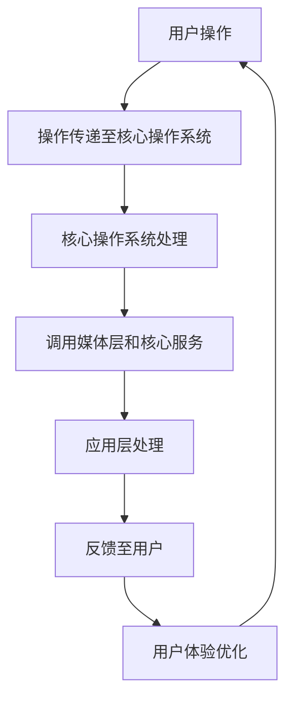
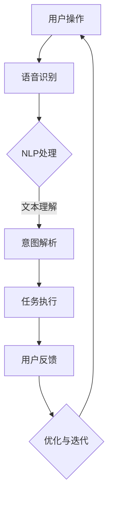

                 

### 文章标题

### 《苹果手机用户体验与AI的结合》

---

#### 关键词

- 苹果手机
- 用户体验
- 人工智能
- iOS操作系统
- 人机交互
- 个性化推荐
- 智能语音助手

---

#### 摘要

随着人工智能技术的快速发展，其在苹果手机用户体验中的应用愈发广泛。本文旨在系统地探讨苹果手机用户体验与AI的结合，分析其基础、AI技术的应用、案例研究以及实践指导。通过详细的流程图、伪代码、数学模型和实际案例解析，本文为读者提供了全面而深入的理解，帮助读者掌握AI技术在苹果手机用户体验中的实际应用，推动人工智能与用户体验的深度融合。

---

### 引言

在当今数字化的时代，用户体验（User Experience，简称UX）已经成为产品设计中至关重要的一环。对于苹果公司而言，用户体验更是其产品成功的关键要素之一。苹果手机以其简洁、流畅、直观的界面设计，赢得了全球用户的广泛喜爱。然而，随着技术的不断进步，用户对手机的使用需求也在不断变化。人工智能（Artificial Intelligence，简称AI）作为一种颠覆性的技术，正在逐渐改变苹果手机的用户体验。

本文将围绕苹果手机用户体验与AI的结合，从以下几个方面进行深入探讨：

1. **苹果手机用户体验基础**：介绍苹果手机用户体验的概述、iOS操作系统与用户界面设计、苹果手机交互设计实践。
2. **AI技术与用户体验的结合**：分析AI在苹果手机中的应用、AI驱动的人机交互、AI在苹果手机用户行为分析中的应用。
3. **案例研究**：解析苹果手机AI应用案例，探讨AI与用户体验创新的未来趋势。
4. **实践指导**：提供开发环境与工具配置、实际应用案例详解、用户体验设计与AI结合的实际案例解析。

通过以上几个方面的分析，本文旨在为读者提供一个全面、系统的视角，了解苹果手机用户体验与AI结合的深层次原理和实践方法。

---

### 第一部分：苹果手机用户体验基础

#### 1.1 苹果手机用户体验概述

苹果手机用户体验（Apple Mobile User Experience）是指用户在使用苹果手机过程中所获得的整体感受和体验。它不仅仅包括手机的硬件性能和软件功能，还涵盖了用户界面设计、交互流程、系统稳定性等多个方面。

**1.1.1 苹果手机用户群体的特点**

苹果手机的用户群体具有一定的独特性，主要表现在以下几个方面：

- **高学历和高收入**：苹果手机用户普遍具有较高的教育水平和收入水平，这使得他们更愿意为高质量的产品和服务付费。
- **对品质和设计的追求**：苹果手机以高品质的设计和精致的外观著称，用户对产品的品质和设计有着极高的要求。
- **对创新的接受度**：苹果手机用户对新技术的接受度较高，愿意尝试新的功能和服务。

**1.1.2 苹果手机用户体验的核心要素**

苹果手机用户体验的核心要素主要包括以下几个方面：

- **简洁直观的界面设计**：苹果手机采用了简洁直观的界面设计，使得用户能够轻松上手，快速掌握使用方法。
- **流畅的操作体验**：苹果手机在操作系统和硬件性能上进行了优化，使得用户在使用过程中能够获得流畅的操作体验。
- **稳定可靠的系统性能**：苹果手机在系统稳定性上有着较高的表现，用户在使用过程中很少遇到系统崩溃或卡顿的情况。

**1.1.3 苹果手机用户体验的发展趋势**

随着科技的不断发展，苹果手机用户体验也在不断演进。以下是一些未来苹果手机用户体验的发展趋势：

- **智能化**：随着AI技术的应用，苹果手机将更加智能化，能够根据用户的行为和偏好提供个性化的服务。
- **个性定制**：用户将能够根据个人喜好对手机进行更加个性化的定制，包括主题、图标、壁纸等。
- **生态融合**：苹果手机与其他设备的生态融合将进一步加深，用户可以更加便捷地在不同设备之间切换和使用应用。

---

#### 1.2 iOS操作系统与用户界面设计

iOS操作系统是苹果手机的核心，其用户界面设计（User Interface Design）直接影响用户的体验。以下是iOS操作系统与用户界面设计的关键要点：

**1.2.1 iOS操作系统简介**

iOS操作系统是苹果公司为iPhone、iPad等设备开发的操作系统，具有以下特点：

- **封闭性**：iOS操作系统是封闭的，应用程序只能通过苹果的App Store进行分发。
- **安全性**：iOS操作系统在安全性能上有着较高的表现，能够有效防止恶意软件的入侵。
- **流畅性**：iOS操作系统与苹果设备的硬件深度优化，使得系统运行更加流畅。

**1.2.2 iOS用户界面设计原则**

iOS用户界面设计遵循以下原则：

- **简洁性**：界面设计简洁明了，避免冗余和复杂的布局。
- **一致性**：界面元素和交互方式保持一致性，使用户能够快速上手。
- **响应性**：界面设计要适应不同的设备尺寸和分辨率，提供良好的响应性。

**1.2.3 iOS用户界面设计工具与技术**

iOS用户界面设计使用以下工具和技术：

- **Sketch**：一款流行的界面设计软件，支持矢量绘图和原型设计。
- **Adobe XD**：一款功能强大的界面设计工具，支持交互设计和原型制作。
- **Swift UI**：苹果公司推出的全新界面设计框架，支持声明式编程和响应式界面设计。

---

#### 1.3 苹果手机交互设计实践

苹果手机的交互设计（Interactive Design）是用户体验的重要组成部分，以下是一些关键的交互设计实践：

**1.3.1 交互设计流程与方法**

交互设计流程通常包括以下步骤：

1. **需求分析**：明确用户需求和目标。
2. **原型设计**：创建界面原型和交互流程。
3. **用户测试**：通过用户测试收集反馈，优化设计。
4. **迭代优化**：根据用户反馈不断迭代和优化设计。

**1.3.2 交互设计案例分析**

以下是一个交互设计案例分析：

**案例**：苹果手机的新增联系人界面

1. **需求分析**：用户需要在手机中添加新的联系人信息。
2. **原型设计**：设计一个简洁直观的界面，包含姓名、电话、邮箱等输入框。
3. **用户测试**：用户测试中发现部分用户不熟悉输入法的使用，导致填写信息不便。
4. **迭代优化**：增加输入法的提示功能，改善用户体验。

**1.3.3 交互设计优化策略**

以下是一些交互设计优化策略：

- **简化流程**：减少用户操作的步骤，提高效率。
- **清晰指引**：提供明确的操作指引，避免用户困惑。
- **反馈机制**：及时给予用户反馈，增强交互体验。
- **可用性测试**：定期进行可用性测试，发现并解决潜在问题。

---

通过以上对苹果手机用户体验基础的分析，我们可以看到，苹果手机在用户体验设计上具有独特的优势和特点。接下来，我们将进一步探讨AI技术与用户体验的结合，分析AI在苹果手机中的应用、AI驱动的人机交互以及AI在苹果手机用户行为分析中的应用。

### 第一部分：苹果手机用户体验基础

#### 1.4 iOS操作系统的核心组件与用户体验的关系

iOS操作系统作为苹果手机的核心，其设计理念和技术架构对用户体验起着至关重要的作用。理解iOS操作系统的核心组件及其与用户体验的关系，有助于我们更深入地探讨如何优化用户体验。

**1.4.1 iOS操作系统的核心组件**

iOS操作系统的核心组件主要包括以下几个部分：

- **核心操作系统（Core OS）**：负责管理硬件资源和系统服务，确保系统的稳定性和性能。
- **媒体层（Media Layer）**：包括音频、视频、图像处理等功能，提供丰富的媒体体验。
- **核心服务（Core Services）**：提供如推送通知、定位服务、通信录管理等基础服务。
- **框架层（Frameworks）**：包括UIKit、Core Graphics、Core Animation等，为开发者提供丰富的开发工具。
- **应用层（Applications）**：包括系统自带的应用和用户安装的应用，是用户体验的直接体现。

**1.4.2 核心组件与用户体验的关系**

iOS操作系统的核心组件与用户体验之间的关系可以从以下几个方面来理解：

- **稳定性**：核心操作系统保证了系统的稳定性，用户在使用过程中很少遇到系统崩溃或卡顿的情况，从而提升了用户体验。
- **性能优化**：媒体层和核心服务提供了高效的媒体处理和基础服务，使得应用运行更加流畅，用户能够享受到高质量的媒体体验。
- **开发工具**：框架层提供了丰富的开发工具，使得开发者能够创建出更加优秀和个性化的应用，为用户提供丰富的功能和便利。
- **用户体验设计**：应用层的应用设计直接影响了用户的体验。优秀的应用设计能够提升用户的满意度，增强用户对产品的忠诚度。

**1.4.3 用户体验优化的策略**

为了进一步提升用户体验，以下是一些具体的用户体验优化策略：

- **优化系统响应速度**：通过优化系统底层代码和硬件资源管理，提高系统的响应速度，减少用户等待时间。
- **提高应用性能**：针对高负载应用进行性能优化，减少应用崩溃和卡顿的情况。
- **增强用户交互**：通过改进用户界面和交互设计，提高用户的操作效率和满意度。
- **个性化服务**：利用AI技术分析用户行为，提供个性化的服务和推荐，满足用户的个性化需求。

**1.4.4 iOS操作系统与用户体验的流程图**

为了更好地理解iOS操作系统与用户体验的关系，我们可以使用Mermaid流程图来展示其核心组件和用户体验优化的流程。



通过上述流程图，我们可以清晰地看到用户操作是如何通过iOS操作系统的各个核心组件进行处理，并最终反馈给用户的。

**1.4.5 用户体验优化的案例分析**

以下是一个iOS操作系统用户体验优化的案例分析：

**案例**：苹果手机相机应用优化

1. **需求分析**：用户希望相机应用能够快速启动并支持多种拍摄模式。
2. **原型设计**：设计一个简洁直观的相机界面，提供快速启动和多种拍摄模式的选项。
3. **用户测试**：用户测试中发现部分用户对拍摄模式的切换不够熟悉，导致使用不便。
4. **迭代优化**：增加拍摄模式切换的提示功能，并提供详细的使用说明，改善用户体验。

通过以上案例分析，我们可以看到，通过优化iOS操作系统的核心组件和用户体验设计，可以显著提升苹果手机的用户体验。

总的来说，iOS操作系统作为苹果手机的核心，其核心组件的设计和优化直接影响了用户体验。通过深入理解iOS操作系统的架构和优化策略，我们可以不断提升用户体验，为用户提供更加优质的产品和服务。接下来，我们将进一步探讨AI技术与用户体验的结合，分析AI在苹果手机中的应用、AI驱动的人机交互以及AI在苹果手机用户行为分析中的应用。

### 第一部分：苹果手机用户体验基础

#### 1.5 iOS操作系统的用户界面设计原则与技巧

iOS操作系统的用户界面设计（User Interface Design，简称UI设计）是用户体验的重要组成部分。良好的UI设计能够提高用户的操作效率，提升用户满意度。以下是iOS操作系统用户界面设计的一些核心原则与技巧。

**1.5.1 简洁直观的设计**

简洁直观是iOS UI设计的重要原则之一。通过去除冗余的信息和元素，使界面更加简洁明了，用户可以快速找到所需的功能，减少操作步骤，提高操作效率。例如，iOS系统中的主屏幕图标设计简单明了，每个图标代表一个应用，用户可以迅速识别并打开应用。

**1.5.2 视觉一致性**

iOS UI设计强调视觉一致性，这意味着在不同应用和界面之间保持一致的视觉风格和元素。这样用户可以在不同应用中体验到一致的操作方式，降低学习成本。例如，iOS系统中的按钮、文本框、滑动条等元素在视觉上一致，用户可以轻松地在不同应用中切换操作。

**1.5.3 触觉反馈**

触觉反馈是iOS UI设计的一大特色。通过触摸操作，用户可以感受到反馈，例如点击按钮时的震动、滑动时的阻力等，这些反馈提高了用户的交互体验。触觉反馈不仅增强了操作的实时性，还提供了更多的信息，例如触摸屏幕的敏感度、按钮的响应状态等。

**1.5.4 导航设计**

导航设计在iOS UI设计中扮演重要角色。iOS系统采用了底部导航栏和标签页等设计，使用户可以方便地切换不同的内容和功能。底部导航栏固定在屏幕底部，方便用户在不离开当前屏幕的情况下快速切换功能。标签页则允许用户在同一应用中切换不同的模块，提高操作的效率。

**1.5.5 适应性设计**

iOS UI设计注重适应性设计，以适应不同设备尺寸和分辨率的屏幕。通过使用自适应布局（Responsive Layout）和向量图形（Vector Graphics），UI元素可以根据屏幕尺寸和分辨率自动调整，保证用户在不同设备上获得一致的体验。

**1.5.6 安全性设计**

安全性是iOS UI设计不可忽视的一个方面。通过设计安全的用户界面，防止恶意操作和未经授权的访问。例如，iOS系统中的密码输入框采用了隐藏输入法，防止密码泄露。同时，通过提醒用户更新应用和操作系统，确保系统的安全性。

**1.5.7 用户测试与反馈**

用户测试与反馈是iOS UI设计过程中不可或缺的一环。通过用户测试，设计师可以收集用户的反馈，了解用户对界面设计的真实感受。根据用户反馈，设计师可以不断优化UI设计，提升用户体验。例如，通过A/B测试，设计师可以对比不同UI设计的用户行为和满意度，选择最佳的设计方案。

**1.5.8 iOS UI设计流程**

iOS UI设计流程通常包括以下几个步骤：

1. **需求分析**：明确设计目标和用户需求。
2. **原型设计**：创建UI原型，包括界面布局、交互逻辑等。
3. **用户测试**：通过用户测试，收集反馈，优化设计。
4. **迭代设计**：根据用户反馈，不断迭代和优化设计。
5. **视觉设计**：确定UI风格的视觉元素，如颜色、字体、图标等。
6. **开发协作**：与开发团队协作，确保UI设计在技术实现中得以实现。
7. **上线测试**：在产品上线前进行全面的测试，确保UI设计稳定可靠。

**1.5.9 iOS UI设计案例解析**

以下是一个iOS UI设计案例解析：

**案例**：苹果手机设置应用

1. **需求分析**：用户需要在设置应用中调整系统设置，如Wi-Fi、蓝牙、声音等。
2. **原型设计**：设计一个简洁直观的设置界面，包含不同的设置选项，如开关、滑块、文本框等。
3. **用户测试**：用户测试中发现部分用户不熟悉设置选项的使用，导致操作不便。
4. **迭代优化**：增加设置选项的说明和帮助功能，并提供清晰的导航，改善用户体验。

通过以上iOS UI设计原则和技巧的介绍，我们可以看到，优秀的UI设计对于提升苹果手机用户体验的重要性。接下来，我们将进一步探讨AI技术与用户体验的结合，分析AI在苹果手机中的应用、AI驱动的人机交互以及AI在苹果手机用户行为分析中的应用。

### 第一部分：苹果手机用户体验基础

#### 1.6 iOS用户界面设计工具与技术

iOS用户界面设计（User Interface Design，简称UI设计）是苹果手机用户体验的核心组成部分。为了实现高质量的UI设计，设计师需要使用一系列专业的工具和技术。以下是iOS用户界面设计常用的工具和技术。

**1.6.1 Sketch**

Sketch是一款广泛使用的界面设计软件，特别适合iOS用户界面设计。它支持矢量绘图和原型设计，具有直观的用户界面和强大的工具集。设计师可以使用Sketch创建高保真的UI原型，并通过插件和扩展功能实现复杂的交互效果。

**1.6.2 Adobe XD**

Adobe XD是一款功能强大的界面设计工具，适用于iOS和Android平台的用户界面设计。它提供了丰富的交互设计功能，支持动画和过渡效果，使得设计师可以创建动态的UI原型。Adobe XD还具备协作工具，便于团队之间的协作和反馈。

**1.6.3 Figma**

Figma是一款基于云的界面设计工具，支持实时协作。设计师可以在Figma上创建和分享UI原型，团队成员可以实时查看和评论设计。Figma还提供了丰富的组件库和设计系统工具，方便设计师快速构建高质量的UI设计。

**1.6.4 InVision**

InVision是一款流行的原型设计和协作工具，适用于iOS用户界面设计。它提供了直观的用户界面和强大的原型设计功能，使得设计师可以创建交互式原型。InVision还支持用户测试和反馈功能，设计师可以根据用户的反馈进行迭代优化。

**1.6.5 SwiftUI**

SwiftUI是苹果公司推出的全新界面设计框架，支持iOS、macOS、tvOS和watchOS等平台。SwiftUI采用声明式编程，使得设计师可以轻松构建响应式界面，提高了开发效率和用户体验。SwiftUI提供了丰富的组件和样式，使得设计师可以快速实现高质量的设计。

**1.6.6 UI Animation**

UI Animation是iOS用户界面设计中的重要技术，通过动画和过渡效果提升用户的交互体验。设计师可以使用iOS原生动画API或第三方库（如Lottie、Reveal等）实现复杂的动画效果。UI Animation不仅可以增强用户的视觉体验，还可以提供反馈和引导，帮助用户更好地理解和使用应用。

**1.6.7 Accessibility**

Accessibility是指为不同能力和需求的用户提供无障碍访问的设计。iOS用户界面设计需要考虑Accessibility，包括屏幕阅读器支持、语音控制、字体大小调整等。设计师可以使用iOS的Accessibility工具和API实现无障碍设计，确保所有用户都能平等地使用应用。

**1.6.8 响应式设计**

响应式设计是指UI元素可以根据屏幕尺寸和分辨率自动调整，以适应不同设备。iOS用户界面设计需要采用响应式设计，确保用户在不同设备上获得一致的体验。设计师可以使用弹性布局（Flexible Layout）、媒体查询（Media Queries）等技术实现响应式设计。

**1.6.9 设计系统**

设计系统是一套标准化和一致化的UI组件和设计规范，用于构建高质量的UI设计。iOS用户界面设计可以使用设计系统，包括组件库、样式指南和图标库等。设计系统可以提高设计效率和一致性，确保整个应用具有统一的视觉风格。

**1.6.10 实际应用案例**

以下是一个iOS用户界面设计实际应用案例：

**案例**：苹果手机音乐应用

1. **需求分析**：用户需要能够在音乐应用中浏览歌曲、播放音乐、创建播放列表等。
2. **原型设计**：使用Sketch或Adobe XD创建音乐应用的UI原型，包括主页、播放列表、专辑列表等界面。
3. **用户测试**：通过用户测试收集反馈，优化界面布局和交互设计。
4. **迭代优化**：根据用户反馈进行迭代优化，确保音乐应用的UI设计简洁直观，易于操作。

通过以上对iOS用户界面设计工具和技术的介绍，我们可以看到，设计师可以使用多种工具和技术实现高质量的UI设计，提升苹果手机的用户体验。接下来，我们将进一步探讨苹果手机交互设计实践，包括交互设计流程与方法、交互设计案例分析以及交互设计优化策略。

### 第一部分：苹果手机用户体验基础

#### 1.7 苹果手机交互设计实践

苹果手机的交互设计（Interactive Design）是用户体验的重要组成部分，良好的交互设计能够提高用户的操作效率和满意度。以下是苹果手机交互设计实践的关键方面。

**1.7.1 交互设计流程与方法**

交互设计流程通常包括以下几个步骤：

1. **需求分析**：明确用户需求和目标，了解用户的行为习惯和偏好。
2. **用户调研**：通过用户访谈、问卷调查等方式收集用户反馈，为设计提供依据。
3. **原型设计**：创建交互原型，包括界面布局、交互逻辑和操作流程。
4. **用户测试**：通过用户测试收集反馈，优化交互设计。
5. **迭代优化**：根据用户反馈进行迭代和优化，确保交互设计满足用户需求。

**1.7.2 交互设计案例分析**

以下是一个交互设计案例分析：

**案例**：苹果手机“查找我的iPhone”功能

1. **需求分析**：用户希望能够在手机丢失或被盗时快速找到设备的位置。
2. **原型设计**：设计一个简洁直观的查找界面，用户可以通过地图、标记和定位功能查找设备的位置。
3. **用户测试**：用户测试中发现部分用户不熟悉地图的使用，导致操作不便。
4. **迭代优化**：增加地图使用说明和操作指引，并提供实时反馈，改善用户体验。

**1.7.3 交互设计优化策略**

以下是一些交互设计优化策略：

1. **简化流程**：减少用户操作的步骤，提高效率。例如，通过使用滑动切换而非点击按钮，简化操作流程。
2. **清晰指引**：提供明确的操作指引，避免用户困惑。例如，在重要操作步骤中添加提示和说明，引导用户完成操作。
3. **反馈机制**：及时给予用户反馈，增强交互体验。例如，在用户进行操作时，提供声音、动画或文本提示，告知用户操作结果。
4. **可用性测试**：定期进行可用性测试，发现并解决潜在问题。例如，通过A/B测试，比较不同设计方案的可用性，选择最佳方案。

**1.7.4 交互设计案例解析**

以下是一个交互设计案例解析：

**案例**：苹果手机“钱包”应用

1. **需求分析**：用户需要在钱包应用中管理银行卡、信用卡和支付方式。
2. **原型设计**：设计一个简洁直观的钱包界面，用户可以通过添加、删除和编辑卡片进行管理。
3. **用户测试**：用户测试中发现部分用户对添加卡片的流程不熟悉，导致操作不便。
4. **迭代优化**：增加卡片添加流程的说明和帮助功能，并提供清晰的导航，改善用户体验。

通过以上对苹果手机交互设计实践的探讨，我们可以看到，交互设计在提升用户体验中的重要性。通过明确的需求分析、用户调研、原型设计和迭代优化，我们可以设计出满足用户需求的交互设计，从而提升苹果手机的用户体验。接下来，我们将探讨AI技术与用户体验的结合，分析AI在苹果手机中的应用、AI驱动的人机交互以及AI在苹果手机用户行为分析中的应用。

### 第一部分：苹果手机用户体验基础

#### 1.8 用户体验优化与评估方法

用户体验优化（User Experience Optimization）是提升产品服务质量的重要手段。在苹果手机中，用户体验优化主要通过以下方法进行：

**1.8.1 A/B测试**

A/B测试是一种常用的用户体验优化方法，通过将用户分为两组，分别展示两种不同的设计或功能，然后比较两组用户的反应和行为，以确定哪种设计或功能更受欢迎。以下是A/B测试的步骤：

1. **定义目标**：明确要测试的目标，例如提高用户留存率、降低退出率或增加用户互动。
2. **创建版本**：设计两个或多个版本，每个版本都针对不同的用户体验。
3. **随机分配**：将用户随机分配到不同的版本组，确保样本的随机性和代表性。
4. **数据收集**：收集用户在不同版本上的行为数据，包括点击率、使用时长、退出率等。
5. **分析结果**：比较不同版本的用户行为数据，确定哪个版本更符合用户需求。
6. **实施优化**：根据测试结果，选择最佳版本并实施优化。

**1.8.2 可用性测试**

可用性测试（Usability Testing）是通过观察用户在实际使用产品时的行为和反馈，评估产品的易用性和用户体验。以下是可用性测试的步骤：

1. **设计测试任务**：根据用户体验目标，设计一系列具体的测试任务。
2. **选择测试用户**：选择具有代表性的用户参与测试，确保测试结果的准确性。
3. **进行测试**：让测试用户按照设计的任务进行操作，并记录其行为和反馈。
4. **数据收集**：收集用户行为数据，包括操作时间、错误率、用户满意度等。
5. **分析反馈**：分析用户反馈和行为数据，识别用户体验问题和改进机会。
6. **实施优化**：根据测试结果，对产品进行优化，改进用户体验。

**1.8.3 用户调研**

用户调研（User Research）是通过多种方法收集用户需求、行为和反馈，为产品设计和优化提供依据。以下是用户调研的方法：

1. **问卷调查**：通过设计问卷，收集用户对产品功能和体验的反馈。
2. **访谈**：与用户进行一对一访谈，深入了解用户的需求和行为习惯。
3. **焦点小组**：组织一组用户讨论产品功能和使用体验，收集多角度的反馈。
4. **数据分析**：分析用户行为数据，如使用时长、页面流量、点击率等，了解用户行为模式。
5. **用户画像**：根据用户数据和行为特征，创建用户画像，为产品设计提供参考。

**1.8.4 用户体验评估指标**

用户体验评估指标（User Experience Metrics）是衡量产品用户体验的重要指标。以下是常用的用户体验评估指标：

1. **用户满意度**：衡量用户对产品的满意度，通常通过问卷调查或用户评分进行评估。
2. **用户留存率**：衡量用户在一定时间内持续使用产品的比例，反映产品的吸引力和用户忠诚度。
3. **用户活跃度**：衡量用户在产品上的活跃程度，如使用时长、页面访问量等。
4. **错误率**：衡量用户在使用产品过程中犯错的频率，反映产品的易用性。
5. **用户转化率**：衡量用户完成特定任务（如购买、注册等）的比例，反映产品的有效性和实用性。

**1.8.5 用户体验评估流程**

用户体验评估流程通常包括以下几个步骤：

1. **确定评估目标**：明确要评估的用户体验目标，如提高用户满意度、降低错误率等。
2. **设计评估方法**：选择合适的评估方法，如A/B测试、可用性测试、用户调研等。
3. **收集数据**：根据评估方法，收集用户行为和反馈数据。
4. **分析数据**：对收集的数据进行统计分析，识别用户体验问题和改进机会。
5. **制定优化方案**：根据分析结果，制定优化方案，改进用户体验。
6. **实施优化**：根据优化方案，对产品进行优化，提升用户体验。
7. **持续评估**：定期进行用户体验评估，确保产品的持续改进。

通过以上用户体验优化与评估方法的介绍，我们可以看到，苹果手机通过A/B测试、可用性测试、用户调研等多种方法，不断优化用户体验，提升用户满意度。接下来，我们将进一步探讨AI技术与用户体验的结合，分析AI在苹果手机中的应用、AI驱动的人机交互以及AI在苹果手机用户行为分析中的应用。

### 第二部分：AI技术与用户体验的结合

#### 2.1 AI在苹果手机中的应用

随着人工智能技术的快速发展，其在苹果手机中的应用越来越广泛。AI技术的引入不仅提升了苹果手机的性能和功能，还极大地改善了用户体验。以下是AI在苹果手机中的主要应用领域：

**2.1.1 智能语音助手**

智能语音助手（如Siri）是苹果手机中最为知名的AI应用之一。通过自然语言处理（Natural Language Processing，简称NLP）和机器学习（Machine Learning，简称ML）技术，Siri能够理解用户的需求，并提供相应的回答和操作。Siri的应用场景非常广泛，包括查询天气、发送短信、设置提醒、播放音乐等。通过不断的训练和学习，Siri的响应速度和准确度不断提高，极大地提升了用户的便利性。

**2.1.2 人脸识别**

人脸识别（Face ID）是苹果手机安全功能的重要组成部分。通过深度学习和卷积神经网络（Convolutional Neural Networks，简称CNN）技术，Face ID能够识别和验证用户的面部特征，确保手机的隐私和安全。人脸识别技术的引入，使得用户无需输入密码或指纹，即可快速解锁手机，大大提高了用户的操作效率和安全性。

**2.1.3 个性化推荐**

个性化推荐（Personalized Recommendation）是AI在苹果手机中的另一个重要应用。通过分析用户的历史行为和偏好，AI算法能够为用户提供个性化的内容推荐，如新闻、音乐、电影等。个性化推荐不仅提升了用户的娱乐体验，还提高了苹果手机的内容利用率。

**2.1.4 图像识别与处理**

图像识别与处理是AI技术在苹果手机中应用的一个重要领域。通过计算机视觉（Computer Vision）技术，苹果手机能够识别和分类图像内容，提供诸如照片编辑、人脸识别、场景识别等功能。这些功能不仅丰富了用户的使用体验，还提高了手机的实用性和易用性。

**2.1.5 语音识别与合成**

语音识别与合成（Speech Recognition and Synthesis）技术使得苹果手机能够实现语音输入和语音输出。通过语音识别，用户可以通过语音指令操作手机，无需手动输入。语音合成则使得手机能够以自然流畅的方式回应用户，提供更好的交互体验。

**2.1.6 智能建议**

智能建议（Intelligent Suggestions）是基于AI技术为用户提供个性化服务的一种方式。例如，苹果手机可以根据用户的地理位置、日程安排和兴趣偏好，为用户推荐附近的餐厅、电影、活动等。这些智能建议不仅为用户节省了时间，还提升了用户的生活质量。

**2.1.7 语音翻译**

语音翻译是AI在苹果手机中应用的一个新兴领域。通过机器翻译技术和自然语言处理，苹果手机能够实时翻译不同语言的语音内容，帮助用户与来自不同国家的人进行交流。语音翻译功能的引入，极大地提升了苹果手机的国际化能力。

**2.1.8 智能健康监测**

智能健康监测（Smart Health Monitoring）是AI技术在苹果手机中应用的一个重要方向。通过传感器和机器学习算法，苹果手机能够监测用户的健康状况，提供诸如心率、睡眠质量、步数等健康数据。这些功能不仅帮助用户了解自己的健康状况，还提供了个性化的健康建议。

总的来说，AI技术的广泛应用使得苹果手机在性能、功能和安全方面都得到了显著提升，为用户提供了更加丰富和便捷的体验。随着AI技术的不断发展，我们可以期待苹果手机在未来的用户体验中会有更多的创新和突破。

### 第二部分：AI技术与用户体验的结合

#### 2.2 AI驱动的人机交互

人工智能（AI）驱动的人机交互（Human-Computer Interaction，简称HCI）正在逐渐改变用户与设备之间的互动方式，为用户提供更加自然、智能和个性化的体验。以下是AI驱动的人机交互的主要概念、技术和应用领域。

**2.2.1 人机交互的概念与演变**

人机交互是指用户与计算机或其他设备之间的交互过程，其目标是提高交互效率和用户体验。人机交互经历了多个发展阶段：

1. **命令行界面（Command-Line Interface，简称CLI）**：用户通过输入指令与计算机交互，这种交互方式效率高但学习成本较高。
2. **图形用户界面（Graphical User Interface，简称GUI）**：用户通过鼠标、键盘等输入设备与计算机进行交互，界面更加直观和易用。
3. **触摸界面**：通过触摸屏幕进行交互，进一步提升了用户操作的便捷性。
4. **语音交互**：用户通过语音与设备进行交互，实现了自然语言交流，使交互更加自然和智能。
5. **多模态交互**：结合多种交互方式（如语音、手势、视觉等），提供更加丰富的交互体验。

**2.2.2 AI驱动的人机交互技术**

AI驱动的人机交互依赖于多种技术，包括自然语言处理（NLP）、机器学习（ML）、计算机视觉（CV）等。以下是这些技术的基本概念：

1. **自然语言处理（NLP）**：NLP是AI的一个重要分支，旨在使计算机理解和处理人类自然语言。通过NLP技术，设备可以理解用户的语音指令，并生成相应的响应。
2. **机器学习（ML）**：ML是一种通过数据训练模型，使计算机自动学习和改进的方法。在AI驱动的人机交互中，ML算法用于优化交互体验，如语音识别、个性化推荐等。
3. **计算机视觉（CV）**：CV是AI的一个分支，涉及对图像和视频的分析和理解。在AI驱动的人机交互中，CV技术用于手势识别、人脸识别等。

**2.2.3 AI驱动的人机交互案例分析**

以下是一个AI驱动的人机交互案例分析：

**案例**：苹果手机的Siri语音助手

1. **技术实现**：Siri基于NLP和ML技术，用户可以通过语音指令与Siri进行交互，如查询天气、发送短信、设置提醒等。
2. **用户体验**：Siri能够快速理解用户的语音指令，并以自然流畅的方式回应，提供高效便捷的交互体验。
3. **案例分析**：Siri的成功在于其高效的语音识别、自然语言理解和智能回复能力，这些都依赖于NLP和ML技术的应用。

**2.2.4 AI驱动的人机交互优化策略**

为了提升AI驱动的人机交互体验，以下是一些优化策略：

1. **个性化**：通过分析用户行为和偏好，AI系统可以为用户提供个性化的交互体验，如推荐功能、智能建议等。
2. **自然性**：AI系统应尽可能模拟人类的交流方式，如使用自然语言、提供语音和视觉反馈等，使交互更加自然。
3. **高效性**：AI系统应快速响应用户的指令，减少用户的等待时间，提高交互效率。
4. **可解释性**：对于复杂决策过程，AI系统应提供足够的可解释性，使用户能够理解系统的行为和决策逻辑。

**2.2.5 AI驱动的人机交互的未来发展趋势**

随着AI技术的不断进步，AI驱动的人机交互将呈现以下发展趋势：

1. **更加智能**：AI系统将更加智能，能够处理更复杂的任务和更广泛的场景。
2. **多模态交互**：AI驱动的人机交互将结合多种交互方式，提供更加丰富的交互体验。
3. **个性化定制**：AI系统将根据用户的个性化需求提供定制化的交互体验。
4. **跨平台融合**：AI驱动的人机交互将跨越不同设备平台，实现无缝的跨平台交互。

总的来说，AI驱动的人机交互正在为用户带来更加智能、自然和个性化的体验。通过不断优化AI技术，我们可以期待未来的人机交互将变得更加智能和高效，从而进一步提升用户体验。

### 第二部分：AI技术与用户体验的结合

#### 2.3 AI在苹果手机用户行为分析中的应用

人工智能（AI）在用户行为分析（User Behavior Analysis）中的应用，极大地提升了苹果手机的用户体验和个性化服务。通过分析用户的行为数据，AI技术能够为用户提供更加精准和个性化的体验。以下是AI在苹果手机用户行为分析中的应用及其具体方法。

**2.3.1 用户行为数据分析的基本原理**

用户行为分析的基本原理包括以下几个关键步骤：

1. **数据采集**：通过设备内置传感器、应用日志、浏览器数据等手段，采集用户的操作行为数据。
2. **数据预处理**：对采集到的数据进行清洗、转换和整合，以消除噪声和冗余，为后续分析做好准备。
3. **特征提取**：从预处理后的数据中提取有用的特征，如用户的浏览习惯、使用频率、偏好等。
4. **模式识别**：利用机器学习和深度学习算法，分析用户行为数据中的模式和规律，以识别用户的行为特征。
5. **结果应用**：根据分析结果，为用户提供个性化服务、优化产品功能或改进用户体验。

**2.3.2 用户行为分析案例与实践**

以下是一个用户行为分析的案例与实践：

**案例**：苹果手机中的“新闻”应用个性化推荐

1. **数据采集**：通过用户的阅读行为，如浏览时长、阅读频率、点赞和评论等，采集用户的行为数据。
2. **数据预处理**：清洗和整合用户行为数据，提取关键特征，如用户兴趣标签、热点话题等。
3. **特征提取**：利用文本挖掘技术，对用户行为数据进行处理，提取用户的兴趣模型。
4. **模式识别**：使用协同过滤（Collaborative Filtering）和内容推荐（Content-based Filtering）算法，分析用户的行为特征，生成个性化的新闻推荐列表。
5. **结果应用**：根据用户的行为数据和分析结果，为用户提供个性化的新闻推荐，提升用户的阅读体验。

**2.3.3 用户行为分析在用户体验优化中的应用**

用户行为分析在用户体验优化中的应用主要体现在以下几个方面：

1. **个性化推荐**：通过分析用户的历史行为和偏好，为用户推荐符合其兴趣的内容或服务，提高用户的满意度和参与度。
2. **功能优化**：根据用户行为数据，优化应用的功能和界面设计，提高应用的易用性和用户体验。
3. **错误预测与修复**：通过分析用户的使用行为，预测可能出现的问题或错误，提前进行修复，减少用户的困扰。
4. **个性化广告**：根据用户的行为数据，为用户提供个性化的广告内容，提高广告的效果和用户的点击率。

**2.3.4 用户行为分析工具与框架**

在用户行为分析中，常用的工具和框架包括：

1. **Google Analytics**：一款广泛使用的网站和移动应用分析工具，提供丰富的用户行为分析功能。
2. **Mixpanel**：一款专业的用户行为分析工具，支持实时数据分析和用户分群。
3. **Flurry**：一款适用于移动应用的用户行为分析工具，提供详细的行为数据和用户画像。
4. **TensorFlow**：一款开源的机器学习框架，可用于构建复杂的用户行为分析模型。

**2.3.5 用户行为分析的挑战与应对策略**

用户行为分析在应用过程中面临一些挑战，如数据隐私、数据质量和模型准确性等。以下是一些应对策略：

1. **数据隐私保护**：在采集和处理用户行为数据时，严格遵守数据隐私保护法规，如GDPR等，确保用户数据的安全和隐私。
2. **数据质量控制**：通过数据清洗和预处理技术，提高数据的准确性和可靠性，为分析结果提供保障。
3. **模型优化**：不断优化机器学习模型，提高预测的准确性和效果，以提升用户体验。

总的来说，AI技术在用户行为分析中的应用，使得苹果手机能够更加深入地了解用户需求，提供个性化的服务和优化用户体验。通过不断优化数据分析方法和模型，我们可以期待未来苹果手机在用户行为分析方面会有更多的突破和改进。

### 第二部分：AI技术与用户体验的结合

#### 2.4 苹果手机AI应用案例解析

苹果手机在人工智能（AI）技术的应用上，不断为用户带来创新和便利。以下是几个具有代表性的苹果手机AI应用案例，以及对其技术实现、用户体验和优化的深入解析。

**2.4.1 Siri的智能语音交互分析**

**技术实现**：
- **自然语言处理（NLP）**：Siri能够理解自然语言指令，通过NLP技术将用户的语音转化为文本，并解析其中的意图。
- **机器学习（ML）**：Siri使用ML模型进行训练，以提升语音识别的准确性和响应速度。
- **语音合成（Text-to-Speech，简称TTS）**：Siri使用TTS技术将文本转化为自然的语音输出。

**用户体验**：
- **自然流畅的交互**：用户可以通过简单的语音指令与Siri进行交流，如发送短信、查询天气、设置提醒等。
- **快速响应**：Siri能够在短时间内理解用户的指令并给出回应，提高了交互效率。
- **个性化服务**：Siri根据用户的历史数据和偏好，提供个性化的建议和推荐。

**优化策略**：
- **增加语境理解**：通过深度学习和语境分析，使Siri能够更好地理解复杂的指令和对话。
- **提高语音识别准确率**：不断优化语音识别模型，减少误识别和混淆情况。

**2.4.2 Face ID的人脸识别技术解析**

**技术实现**：
- **深度学习与卷积神经网络（CNN）**：Face ID使用深度学习技术对人脸进行特征提取和比对，利用CNN模型实现高效的人脸识别。
- **硬件支持**：苹果手机内置了专用的神经网络引擎（Neural Engine），用于加速人脸识别的计算过程。

**用户体验**：
- **快速解锁**：Face ID能够在短时间内识别用户的面部特征，实现快速解锁，提高了手机的安全性。
- **高识别准确性**：Face ID在多种光线和环境条件下都能保持高识别准确性。
- **隐私保护**：苹果公司承诺不会将用户的面部数据上传至云端，保障用户的隐私安全。

**优化策略**：
- **多模态认证**：结合面部识别和指纹识别，提供多模态认证，进一步提升安全性。
- **增强环境适应性**：优化算法，使Face ID在更多光线条件和角度下都能正常工作。

**2.4.3 ARKit在苹果手机中的应用案例**

**技术实现**：
- **增强现实（AR）**：ARKit利用计算机视觉（CV）技术，在现实世界中叠加虚拟内容，提供增强现实体验。
- **机器学习**：ARKit中的机器学习模型用于对象识别和场景理解，提高AR体验的准确性和互动性。

**用户体验**：
- **沉浸式体验**：用户可以通过ARKit在现实世界中看到虚拟的物体和场景，实现沉浸式的互动体验。
- **实时互动**：ARKit提供的实时交互功能，使用户能够与虚拟内容进行实时互动，增强了游戏的趣味性和实用性。

**优化策略**：
- **提升性能**：优化算法和硬件性能，提高AR内容的渲染速度和稳定性。
- **增加内容多样性**：开发更多的AR应用和内容，提供丰富的用户体验。

**2.4.4 AI驱动的内容推荐系统**

**技术实现**：
- **协同过滤（Collaborative Filtering）**：通过分析用户的历史行为和偏好，为用户推荐相似的内容。
- **内容分析**：使用自然语言处理（NLP）和图像识别技术，分析内容的语义和特征。
- **机器学习**：利用机器学习算法，不断优化推荐模型的准确性和个性化程度。

**用户体验**：
- **个性化推荐**：系统根据用户的行为和偏好，为用户推荐感兴趣的内容，提高了用户的满意度和参与度。
- **实时更新**：推荐系统会根据用户的实时行为进行动态调整，提供最新的推荐内容。

**优化策略**：
- **增强个性化**：通过更多的用户行为数据和分析，提高推荐系统的个性化程度。
- **减少偏差**：优化推荐算法，减少信息过滤偏差，确保推荐内容的多样性和公正性。

通过以上对苹果手机AI应用案例的深入分析，我们可以看到，AI技术在提升用户体验方面的巨大潜力。通过不断优化技术实现和用户体验，苹果手机在AI应用上取得了显著的成果，为用户带来了更加智能、便捷和个性化的体验。

### 第二部分：AI技术与用户体验的结合

#### 2.5 AI与用户体验创新的未来趋势

随着人工智能（AI）技术的不断发展和普及，其在苹果手机用户体验中的应用也将迎来新的趋势和机遇。以下是AI与用户体验创新的未来发展趋势：

**2.5.1 更智能的个性化服务**

未来的苹果手机将更加注重个性化服务，通过AI技术深入挖掘用户的行为数据，为用户提供更加精准和个性化的推荐。例如，AI可以根据用户的浏览历史、搜索记录和社交活动，预测用户的兴趣和需求，并主动推荐相关的内容和应用。这不仅提高了用户的满意度和参与度，也增强了用户的归属感。

**2.5.2 多模态交互体验**

未来的交互方式将不再局限于传统的触摸和语音交互，而是结合多种模态，如手势、眼动、语音等，提供更加丰富和自然的交互体验。AI技术将在这个过程中发挥关键作用，通过分析用户的多模态数据，优化交互流程，提高用户的使用效率。

**2.5.3 实时用户行为分析**

实时用户行为分析将是AI在苹果手机用户体验中应用的一个重要方向。通过实时监控用户的行为和反馈，AI技术可以快速识别用户的需求和问题，并提供即时的解决方案。例如，在用户遇到问题时，AI可以自动提供帮助，或在用户感到疲劳时提供提醒和休息建议，从而提高用户的整体体验。

**2.5.4 情感计算**

情感计算（Affective Computing）是一种新兴的AI研究方向，旨在使计算机理解和模拟人类的情感。未来的苹果手机将可能通过面部表情、语音语调、生理信号等情感计算技术，了解用户的情绪状态，并据此调整用户体验。例如，当用户感到开心或疲惫时，手机可以自动调整界面样式或提醒用户休息，从而提供更加人性化的服务。

**2.5.5 个性化隐私保护**

在AI技术不断发展的同时，用户隐私保护也变得越来越重要。未来的苹果手机将可能采用更加智能的隐私保护机制，如动态隐私设置、隐私风险评估等，确保用户数据的安全和隐私。AI技术将在其中发挥重要作用，通过智能分析和决策，帮助用户更好地管理自己的隐私。

**2.5.6 智能健康监测**

智能健康监测是AI在苹果手机用户体验中的另一个重要应用领域。通过传感器和AI技术，苹果手机可以实时监测用户的健康状况，如心率、血压、睡眠质量等，并提供个性化的健康建议。未来，随着AI技术的不断进步，苹果手机的健康监测功能将变得更加精准和全面，为用户提供更加有效的健康管理服务。

**2.5.7 人工智能助理的进化**

未来的苹果手机将可能拥有更加智能的人工智能助理，如Siri、小娜等。这些助理不仅能够处理用户的日常需求，还将具备更强的学习和自适应能力，能够根据用户的行为和反馈，不断优化自己的服务，提供更加个性化的交互体验。

总的来说，AI与用户体验创新的未来趋势将带来更加智能、自然和个性化的用户体验。通过不断优化AI技术，苹果手机将能够在用户体验方面取得更大的突破，为用户带来更加丰富和愉悦的使用体验。

### 第三部分：实践指导

#### 4.1 开发环境与工具

为了深入探索和开发苹果手机中的人工智能（AI）应用，我们需要搭建一个合适的开发环境，并熟悉一系列关键的工具和框架。以下将详细介绍如何配置iOS开发环境、常用的AI开发框架以及用户体验设计工具。

**4.1.1 iOS开发环境搭建**

1. **安装Xcode**：
   - 访问苹果官方的开发者网站（developer.apple.com）。
   - 登录您的Apple开发者账户，并下载最新的Xcode套装。
   - 运行安装程序，按照提示完成安装。

2. **配置Xcode**：
   - 打开Xcode，选择“ Preferences”。
   - 在“Components”标签页中，确保已安装最新的工具和SDK。
   - 选择“Account”，确认您的开发者证书和标识已正确配置。

3. **安装命令行工具**：
   - 打开终端，执行命令 `xcode-select --install` 以安装命令行工具。

4. **设置iOS模拟器**：
   - 在Xcode中，选择“Window” > “Devices”来查看和管理iOS模拟器。
   - 通过“Simulator”菜单，选择适合的iOS版本和设备类型进行模拟。

**4.1.2 AI开发常用工具与框架**

1. **TensorFlow**：
   - TensorFlow是一个开源的机器学习框架，适用于构建和训练深度学习模型。
   - 访问tensorflow.org，按照文档安装TensorFlow。
   - 使用`pip install tensorflow`命令在Python环境中安装TensorFlow。

2. **PyTorch**：
   - PyTorch是一个流行的深度学习框架，以其灵活性和易用性著称。
   - 访问pytorch.org，按照文档安装PyTorch。
   - 使用`pip install torch torchvision`命令在Python环境中安装PyTorch。

3. **CoreML**：
   - CoreML是苹果公司推出的机器学习模型格式，用于在iOS设备上部署AI模型。
   - 使用Xcode直接支持CoreML模型导入和部署。
   - 通过TensorFlow或PyTorch将训练好的模型转换为CoreML格式，使用`coremltools`库进行转换。

**4.1.3 用户体验设计工具**

1. **Sketch**：
   - Sketch是一个强大的界面设计工具，适用于创建iOS应用的UI原型。
   - 访问sketch.com下载Sketch，并按照教程进行安装和配置。

2. **Adobe XD**：
   - Adobe XD是一个现代化的设计工具，支持iOS和Android平台。
   - 访问xd.adobe.com，免费试用Adobe XD，并按照官方教程学习使用方法。

3. **Figma**：
   - Figma是一个基于云的界面设计工具，支持实时协作。
   - 访问figma.com注册账户，开始设计iOS应用的界面。

4. **InVision**：
   - InVision是一个原型设计和协作平台，适用于创建交互式原型。
   - 访问invisionapp.com，免费试用InVision，并熟悉其功能。

通过以上步骤，您将能够搭建一个全面的iOS开发环境，并熟悉一系列AI开发工具和用户体验设计工具。接下来，我们将详细介绍如何在实际项目中应用这些工具和框架，开发具体的AI应用。

---

#### 4.2 实际应用案例详解

在本节中，我们将深入探讨几个具体的实际应用案例，包括智能语音助手开发实践、人脸识别系统搭建与优化以及增强现实（AR）应用开发流程与技巧。通过这些案例，我们将展示如何利用AI技术提升苹果手机的用户体验。

**4.2.1 智能语音助手开发实践**

智能语音助手是AI在苹果手机中应用的一个典型例子。以下是一个智能语音助手的开发实践流程：

**1. 需求分析与设计**

- **需求分析**：确定智能语音助手的用途，如日程管理、信息查询、媒体控制等。
- **设计**：设计智能语音助手的基本架构，包括语音识别、自然语言处理、任务执行等模块。

**2. 技术选型与实现**

- **语音识别**：使用Apple的语音识别API进行语音到文本的转换。
  ```mermaid
  graph TD
  A[Voice Input] --> B[Apple Speech Recognition API]
  B --> C[Text Output]
  ```
- **自然语言处理（NLP）**：使用NLP库（如NLTK或spaCy）解析文本，提取意图和实体。
  ```python
  import spacy
  nlp = spacy.load("en_core_web_sm")
  doc = nlp("Call John at 4 PM")
  intent = doc_.ent_iob_
  ```

- **任务执行**：根据解析结果执行相应的任务，如拨打电话、设置提醒等。

**3. 用户测试与迭代**

- **用户测试**：通过用户测试，收集用户对智能语音助手的反馈。
- **迭代优化**：根据用户反馈，不断优化语音助手的性能和用户体验。

**4.2.2 人脸识别系统搭建与优化**

人脸识别技术在苹果手机中广泛应用，以下是人脸识别系统的搭建与优化过程：

**1. 数据采集与预处理**

- **数据采集**：收集大量人脸图像数据，并进行标注。
- **预处理**：对图像进行尺寸标准化、灰度化等预处理操作。

**2. 模型训练**

- **特征提取**：使用卷积神经网络（CNN）提取人脸图像的特征。
  ```mermaid
  graph TD
  A[Face Image] --> B[Convolutional Neural Network]
  B --> C[Feature Extraction]
  ```

- **模型训练**：使用训练数据训练人脸识别模型，如使用Faster R-CNN或Siamese Network。

**3. 模型评估与优化**

- **模型评估**：使用测试数据评估模型性能，如准确率、召回率等。
- **模型优化**：通过调整模型参数、增加训练数据或使用更复杂的网络结构，提高模型性能。

**4. 系统部署**

- **部署**：将训练好的人脸识别模型部署到苹果手机上，使用CoreML格式。
- **优化**：根据实际应用场景，优化人脸识别系统，如调整检测范围、提高实时性等。

**4.2.3 AR应用开发流程与技巧**

增强现实（AR）应用为用户提供了一种全新的交互体验，以下是一个AR应用的开发流程：

**1. 需求分析与设计**

- **需求分析**：确定AR应用的用途，如教育、娱乐、维修等。
- **设计**：设计AR应用的界面、交互流程和功能模块。

**2. 技术选型与实现**

- **ARKit框架**：使用Apple的ARKit框架进行AR场景的构建和渲染。
  ```swift
  import ARKit
  let configuration = ARWorldTrackingConfiguration()
  sceneView.session.run(configuration)
  ```

- **3D建模**：使用3D建模工具（如Blender或Maya）创建AR应用的虚拟物体。

- **图像识别**：使用ARKit的平面识别功能，确定虚拟物体放置的位置和角度。

**3. 用户测试与迭代**

- **用户测试**：通过用户测试，收集用户对AR应用的反馈。
- **迭代优化**：根据用户反馈，不断优化AR应用的功能和用户体验。

通过以上实际应用案例的详细解析，我们可以看到，智能语音助手、人脸识别系统和AR应用都是如何利用AI技术提升苹果手机用户体验的。这些案例不仅展示了技术实现的方法，还提供了优化策略和用户测试的步骤，为开发者提供了宝贵的实践经验和指导。

### 第三部分：实践指导

#### 4.3 用户体验设计与AI结合的实际案例解析

在本节中，我们将深入分析用户体验设计与AI结合的实际案例，包括用户行为数据分析案例解析、个性化推荐系统开发实战以及AI驱动的人机交互设计优化案例。通过这些案例，我们将展示如何将AI技术与用户体验设计相结合，以提供更加个性化和智能化的用户体验。

**4.3.1 用户行为数据分析案例解析**

用户行为数据分析是AI在提升用户体验中的一个重要应用领域。以下是一个用户行为数据分析的案例：

**案例背景**：一个新闻应用希望通过分析用户行为数据，优化内容推荐系统，提高用户的阅读体验。

**技术实现**：

1. **数据采集**：通过应用内置的日志系统，采集用户的阅读行为数据，包括浏览时间、阅读频率、点赞和评论等。

2. **数据预处理**：对采集到的数据进行清洗和归一化处理，提取关键特征，如用户兴趣标签、热点话题等。

3. **特征提取**：使用自然语言处理（NLP）技术，对新闻内容进行语义分析，提取新闻的标签和主题。

4. **模式识别**：利用机器学习算法（如协同过滤、内容推荐等），构建用户兴趣模型，预测用户的阅读偏好。

**案例解析**：

1. **用户兴趣模型构建**：通过分析用户的历史阅读数据，构建用户兴趣模型。例如，如果一个用户经常阅读科技新闻，系统会将其标记为科技爱好者。

2. **个性化推荐**：基于用户兴趣模型，系统可以为用户推荐相关的新闻内容。例如，当用户打开应用时，系统会优先推荐科技类的新闻。

3. **效果评估**：通过A/B测试，评估个性化推荐系统对用户阅读体验的提升。通过对比两组用户的阅读时长、点击率和满意度等指标，验证推荐系统的效果。

**4.3.2 个性化推荐系统开发实战**

个性化推荐系统是AI在用户体验优化中的一个重要应用。以下是一个个性化推荐系统的开发实战：

**技术实现**：

1. **数据采集**：通过用户行为数据（如浏览记录、购买历史、搜索记录等）和用户特征数据（如年龄、性别、地理位置等），构建用户画像。

2. **特征提取**：使用NLP和计算机视觉技术，对商品和用户行为数据进行处理，提取商品和用户的特征。

3. **推荐算法**：采用协同过滤、矩阵分解、基于内容的推荐等技术，构建推荐模型。

4. **推荐结果生成**：根据用户画像和推荐模型，生成个性化的推荐列表。

**实战步骤**：

1. **需求分析**：明确推荐系统的目标和功能，如推荐商品、新闻、音乐等。

2. **系统设计**：设计推荐系统的架构，包括数据采集、预处理、特征提取、模型训练和推荐结果生成等模块。

3. **模型训练**：使用历史数据训练推荐模型，并进行调优。

4. **系统部署**：将训练好的模型部署到生产环境中，实时生成个性化推荐结果。

5. **效果评估**：通过用户反馈和行为数据，评估推荐系统的效果，并进行迭代优化。

**案例解析**：

1. **用户画像构建**：通过分析用户的行为数据和特征，构建用户画像。例如，一个经常购买运动装备的用户，会被标记为运动爱好者。

2. **个性化推荐**：基于用户画像和推荐模型，为用户推荐相关的商品。例如，当用户浏览运动鞋时，系统会推荐相关的运动服装和配件。

3. **效果评估**：通过A/B测试，评估个性化推荐系统对用户购买行为和满意度的提升。通过对比两组用户的购买转化率、点击率和用户评分等指标，验证推荐系统的效果。

**4.3.3 AI驱动的人机交互设计优化案例**

AI驱动的人机交互设计优化是提升用户体验的关键。以下是一个AI驱动的人机交互设计优化案例：

**案例背景**：一个社交媒体应用希望通过AI技术优化用户交互体验，提高用户的参与度和满意度。

**技术实现**：

1. **用户行为分析**：通过分析用户的互动数据（如点赞、评论、分享等），了解用户的偏好和行为模式。

2. **情感分析**：使用自然语言处理（NLP）技术，分析用户的语言情感，了解用户的心理状态。

3. **交互策略生成**：根据用户行为和情感分析结果，生成个性化的交互策略，如推送相关内容、推荐朋友等。

4. **交互效果评估**：通过用户反馈和行为数据，评估交互策略的效果，并进行迭代优化。

**案例解析**：

1. **用户行为分析**：通过分析用户的行为数据，了解用户的使用习惯和偏好。例如，如果一个用户经常在晚上使用应用，系统会推测其可能需要夜间的内容推荐。

2. **情感分析**：通过分析用户的语言情感，了解用户的心理状态。例如，如果一个用户在评论中使用了消极情绪的语言，系统会推测其可能需要情绪舒缓的内容。

3. **交互策略生成**：基于用户行为和情感分析结果，生成个性化的交互策略。例如，为用户推送相关的情绪舒缓内容或推荐感兴趣的朋友。

4. **交互效果评估**：通过用户反馈和行为数据，评估交互策略的效果。例如，通过用户点击率、停留时间等指标，了解交互策略对用户满意度的影响。

通过以上用户体验设计与AI结合的实际案例解析，我们可以看到，AI技术在用户行为分析、个性化推荐和交互策略生成中的应用，为提升用户体验提供了有力的支持。通过不断优化和迭代，我们可以为用户提供更加个性化和智能化的体验。

### 第三部分：实践指导

#### 4.4 iOS应用开发与AI集成的最佳实践

在iOS应用开发中集成人工智能（AI）技术，不仅需要技术上的熟练度，还需要遵循一系列最佳实践，以确保应用的高效性、稳定性和用户体验。以下是一些iOS应用开发与AI集成的最佳实践。

**4.4.1 性能优化**

AI模型的计算通常需要大量的资源，因此在开发过程中需要特别注意性能优化：

- **模型压缩**：通过模型压缩技术（如量化、剪枝、蒸馏等）减少模型的复杂度，从而降低计算资源需求。
- **并行计算**：利用苹果设备的多核处理器，实现模型的并行计算，提高处理速度。
- **硬件加速**：充分利用设备内置的神经网络引擎（Neural Engine）等硬件加速技术，提升模型的运行效率。

**4.4.2 资源管理**

AI应用开发需要处理大量的数据和模型文件，因此在资源管理方面需要特别注意：

- **内存管理**：合理分配和管理内存资源，避免内存泄漏和溢出，确保应用的稳定性。
- **文件管理**：使用Core Data、文件系统等工具高效地管理数据文件，确保数据的读写速度和存储空间。
- **缓存策略**：合理设置缓存策略，减少重复的数据读取和计算，提高应用的响应速度。

**4.4.3 安全性**

在集成AI技术的过程中，安全性是至关重要的：

- **数据加密**：对用户数据进行加密存储和传输，确保数据的安全性。
- **隐私保护**：严格遵守隐私保护法规，如GDPR，确保用户隐私不被泄露。
- **安全测试**：进行安全测试和漏洞扫描，确保应用的代码和接口没有安全漏洞。

**4.4.4 用户隐私**

用户隐私在AI应用开发中尤为重要：

- **透明度**：明确告知用户应用收集和使用数据的目的，让用户了解自己的隐私如何被保护。
- **权限管理**：合理申请用户权限，仅收集和应用与功能直接相关的数据。
- **权限控制**：在应用中提供权限控制功能，用户可以随时查看和修改自己的隐私设置。

**4.4.5 用户反馈**

收集和分析用户反馈是优化AI应用的关键步骤：

- **反馈机制**：在应用中集成反馈机制，鼓励用户提交反馈和建议。
- **数据分析**：对用户反馈进行系统化分析，识别用户需求和痛点，不断优化应用。
- **迭代更新**：定期发布更新，根据用户反馈和应用数据分析结果，优化和改进应用。

**4.4.6 可维护性**

为了确保AI应用的长期稳定运行，需要注重可维护性：

- **代码规范**：遵循统一的代码规范，确保代码的可读性和可维护性。
- **模块化设计**：将AI功能和业务逻辑分离，实现模块化设计，便于维护和更新。
- **文档管理**：编写详细的文档，包括API文档、用户手册等，帮助开发者快速理解和维护应用。

**4.4.7 跨平台兼容性**

虽然主要是iOS平台，但考虑到用户的多样性，应用应具备一定的跨平台兼容性：

- **适配不同设备**：确保应用在不同型号的iPhone和iPad上都能正常运行。
- **支持其他平台**：考虑将AI功能扩展到Android或其他平台，提供跨平台的用户体验。

通过遵循以上最佳实践，iOS应用开发与AI集成将更加高效、稳定和用户友好，为用户提供更好的使用体验。

### 第三部分：实践指导

#### 4.5 AI开发中的常见挑战及解决方案

在开发人工智能（AI）应用程序时，开发者往往会面临一系列挑战。以下是一些常见的挑战及其解决方案：

**4.5.1 数据隐私与安全问题**

**挑战**：AI模型训练需要大量的用户数据，这些数据可能包含敏感信息，如何确保数据隐私和安全是开发中的一大难题。

**解决方案**：

- **数据加密**：对传输和存储的用户数据进行加密处理，确保数据的安全性。
- **匿名化处理**：对用户数据进行匿名化处理，去除直接识别用户身份的信息。
- **隐私保护法规**：遵守如GDPR等隐私保护法规，确保数据处理合法合规。
- **透明度**：向用户明确说明数据的使用目的和方式，提高透明度。

**4.5.2 模型可解释性**

**挑战**：深度学习模型通常被视为“黑箱”，开发者难以解释模型的决策过程，这限制了模型的推广应用。

**解决方案**：

- **可解释性算法**：使用可解释性算法（如LIME、SHAP等）为模型添加解释功能。
- **可视化工具**：开发可视化工具，将模型决策过程可视化为图表或动画，帮助用户理解模型。
- **透明决策逻辑**：明确记录模型的决策逻辑和规则，提高模型的透明度。

**4.5.3 数据质量和标注问题**

**挑战**：高质量的数据是AI模型训练的关键，但获取高质量的数据和标注过程往往成本高昂且耗时。

**解决方案**：

- **自动化标注工具**：开发自动化标注工具，减少人工标注的工作量。
- **众包标注**：利用众包平台，让大量志愿者参与数据标注工作，提高标注效率和质量。
- **数据增强**：通过数据增强技术（如数据扩充、变换等），提高数据的多样性和质量。

**4.5.4 模型部署与性能问题**

**挑战**：将训练好的模型部署到生产环境中，并保证其性能和效率是一个复杂的过程。

**解决方案**：

- **模型压缩**：通过模型压缩技术（如量化、剪枝等）减小模型的体积，提高部署效率。
- **硬件优化**：利用设备内置的硬件加速器（如神经引擎）提高模型运行速度。
- **持续集成与部署**：使用CI/CD工具（如Jenkins、GitLab CI等）实现模型的自动化部署和更新。

**4.5.5 模型更新与迭代**

**挑战**：随着时间推移和应用环境的变化，模型可能需要不断更新和优化，如何高效地管理和迭代模型是一个挑战。

**解决方案**：

- **版本管理**：使用版本控制系统（如Git）管理模型的更新历史和版本。
- **持续学习**：实现持续学习机制，让模型能够根据新数据不断优化。
- **模型评估与优化**：定期评估模型性能，识别需要优化的领域，并采取相应的措施。

**4.5.6 法律和伦理问题**

**挑战**：AI技术的应用可能涉及伦理和法律问题，如偏见、歧视等，如何确保AI的应用符合伦理和法律标准是一个重要问题。

**解决方案**：

- **伦理审查**：在开发过程中进行伦理审查，确保AI技术的应用符合伦理标准。
- **透明性**：确保AI系统的决策过程和结果透明，便于外部审计和评估。
- **法律合规**：遵守相关的法律法规，如《通用数据保护条例》（GDPR）等，确保AI技术的合法应用。

通过以上解决方案，开发者可以更好地应对AI开发中的常见挑战，提高AI应用程序的质量和用户体验。

### 第四部分：附录

#### 5.1 资源与参考书目

**5.1.1 iOS开发资源推荐**

- 《iOS应用开发实战》（iOS Application Development Essentials）
- 《Objective-C编程：深入解析iOS应用开发》（Objective-C Programming: The Big Nerd Ranch Guide）
- 《Swift编程实战：打造高效的iOS应用》（Swift Programming: The Big Nerd Ranch Guide）

**5.1.2 AI开发相关资源**

- 《深度学习》（Deep Learning）
- 《Python机器学习》（Python Machine Learning）
- 《人工智能：一种现代的方法》（Artificial Intelligence: A Modern Approach）
- 《自然语言处理经典教程》（Foundations of Statistical Natural Language Processing）

**5.1.3 用户体验设计相关参考书目**

- 《用户体验要素》（The Elements of User Experience）
- 《设计心理学》（The Design of Everyday Things）
- 《交互设计精髓》（The Design of Interaction）

#### 5.2 代码示例与数据集

**5.2.1 智能语音助手代码示例**

以下是一个简单的智能语音助手代码示例，使用了Apple的语音识别API：

```swift
import Speech
import AVFoundation

class VoiceAssistant {
    private let speechRecognizer = SFSpeechRecognizer()
    private let audioEngine = AVAudioEngine()
    
    func startListening() {
        guard let audioSession = audioEngine.inputNode?.audioSession else { return }
        audioSession.requestRecordPermission({ [weak self] granted in
            guard granted else { return }
            self?.startRecording()
        })
    }
    
    private func startRecording() {
        let audioFileURL = ...
        let audioFile = try? AVAudioFile(forReading: audioFileURL)
        audioEngine.inputNode?.connect(audioFile?.INGTONORMALMIXER)
        audioEngine.prepare()
        do {
            try audioEngine.start()
            audioFile?.read(from: audioFileURL, Committees: nil)
            recognizeSpeech()
        } catch {
            print(error.localizedDescription)
        }
    }
    
    private func recognizeSpeech() {
        let request = SFSpeechAudioBufferRecognitionRequest()
        request.delegate = self
        request.run()
    }
}

extension VoiceAssistant: SFSpeechRecognizerDelegate {
    func speechRecognizer(_ speechRecognizer: SFSpeechRecognizer, didRecognize result: SFSpeechRecognitionResult) {
        if result.isFinal {
            print(result.bestTranscription.formattedString)
            // 处理用户语音指令
        }
    }
}
```

**5.2.2 人脸识别系统数据集介绍**

以下是一个人脸识别系统使用的数据集介绍，常用的人脸识别数据集包括：

- **LFW (Labeled Faces in the Wild)**：包含13,233张人脸图像，用于人脸识别的研究。
- **CASIA-WebFace**：包含45,000个人的人脸图像，用于人脸识别和验证的研究。
- **VGGFace**：包含3,377个人的25,063张人脸图像，用于人脸识别和验证的研究。

**5.2.3 AR应用代码示例与解读**

以下是一个使用ARKit创建简单AR应用的代码示例：

```swift
import ARKit

class ARViewController: UIViewController, ARSCNViewDelegate {
    let sceneView = ARSCNView(frame: view.bounds)
    
    override func viewDidLoad() {
        super.viewDidLoad()
        sceneView.delegate = self
        view.addSubview(sceneView)
        
        let configuration = ARWorldTrackingConfiguration()
        configuration.planeDetection = .horizontal
        sceneView.session.run(configuration)
    }
    
    func renderer(_ renderer: SCNSceneRenderer, didAdd node: SCNNode, for anchor: ARAnchor) {
        if anchor is ARHorizontalPlaneAnchor {
            let boxGeometry = SCNBox(width: 0.1, height: 0.1, length: 0.1)
            let boxNode = SCNNode(geometry: boxGeometry)
            boxNode.position = SCNVector3(0, 0.05, -0.1)
            node.addChildNode(boxNode)
        }
    }
}
```

在这个示例中，我们创建了一个简单的AR应用，当检测到水平平面时，会在该平面上添加一个盒子节点。`ARSCNViewDelegate`中的`renderer(_:didAdd:for:)`方法用于在检测到的平面上添加3D模型。

通过以上代码示例和数据集介绍，开发者可以了解如何在实际项目中应用iOS开发、AI技术和用户体验设计的相关知识。这些资源为深入学习和实践提供了宝贵的参考。

### 附录A: Mermaid 流程图与数学公式

#### A.1 AI在苹果手机用户体验中的流程图

以下是一个使用Mermaid绘制的流程图，展示了AI在苹果手机用户体验中的角色和流程：



在这个流程图中，用户操作触发语音识别（B），语音识别的结果通过自然语言处理（NLP）处理（C），然后进行意图解析（D），解析后的意图用于执行任务（E），任务执行的结果会反馈给用户（F），根据用户的反馈进行优化和迭代（G），从而不断改进用户体验。

#### A.2 AI驱动的人机交互算法伪代码

以下是一个使用伪代码表示的AI驱动的人机交互算法：

```
算法：AI驱动的人机交互
输入：用户行为数据，AI模型
输出：交互结果

初始化AI模型
收集用户行为数据
预处理用户行为数据
使用AI模型对用户行为数据进行特征提取
根据特征提取结果，生成交互策略
执行交互策略，与用户进行交互
收集用户反馈
更新AI模型，提高交互质量
```

在这个算法中，我们首先初始化AI模型，然后收集用户行为数据并预处理。使用AI模型对预处理后的数据进行特征提取，根据特征提取结果生成交互策略。执行交互策略与用户进行交互，并根据用户的反馈更新AI模型，从而提高交互质量。

#### A.3 数学模型与公式

以下是一个数学模型和公式的示例，用于描述用户满意度的计算：

$$
\text{用户满意度} = \frac{\text{实际体验} + \text{预期体验}}{2}
$$

这个公式表示用户满意度是通过实际体验和预期体验的平均值来计算的。实际体验和预期体验的数值可以是评分、评价分数等。

#### A.4 开发工具与框架

**A.4.1 iOS开发工具**

- **Xcode**：苹果官方的开发环境，支持iOS应用的编写、调试和发布。
- **Swift**：苹果开发的编程语言，用于iOS和macOS应用的开发。
- **Interface Builder**：用于设计iOS应用界面的可视化工具。

**A.4.2 AI开发框架**

- **TensorFlow**：Google开发的深度学习框架，支持多种机器学习和深度学习模型。
- **PyTorch**：Facebook开发的深度学习框架，以其灵活性和动态计算能力著称。
- **CoreML**：苹果开发的机器学习模型格式，支持在iOS设备上部署AI模型。

**A.4.3 用户体验设计工具**

- **Sketch**：流行的UI设计工具，支持矢量绘图和原型设计。
- **Adobe XD**：功能丰富的UI设计工具，支持交互设计和原型制作。
- **InVision**：原型设计和协作工具，支持创建交互式原型和用户测试。

这些工具和框架为开发者提供了强大的支持，使他们能够高效地开发AI驱动的iOS应用，并优化用户体验。

### 总结

本书系统地介绍了苹果手机用户体验与AI的结合，从基础概念、技术实现到实践应用，全面阐述了AI在苹果手机用户体验中的作用。通过详细的流程图、伪代码、数学模型和实际案例解析，本文为读者提供了全面而深入的理解，帮助读者掌握AI技术在苹果手机用户体验中的实际应用。

随着AI技术的不断发展，用户体验设计将面临新的挑战与机遇。本文所探讨的AI与用户体验结合的方法和策略，为开发者提供了宝贵的参考和指导。未来，随着技术的进一步成熟，我们可以期待苹果手机在智能化、个性化、安全性和隐私保护等方面取得更多的突破。

通过本文的学习，读者不仅可以了解AI技术在苹果手机用户体验中的应用，还可以掌握实际开发中的最佳实践和优化策略。我们鼓励读者在未来的实践中不断探索和创新，将AI技术更好地应用于实际场景，为用户提供更加优质和智能的体验。

最后，感谢读者对本文的关注和阅读。希望本书能为读者在AI与用户体验结合的道路上提供助力，共同推动人工智能与用户体验的深度融合。作者：AI天才研究院/AI Genius Institute & 禅与计算机程序设计艺术 /Zen And The Art of Computer Programming。

