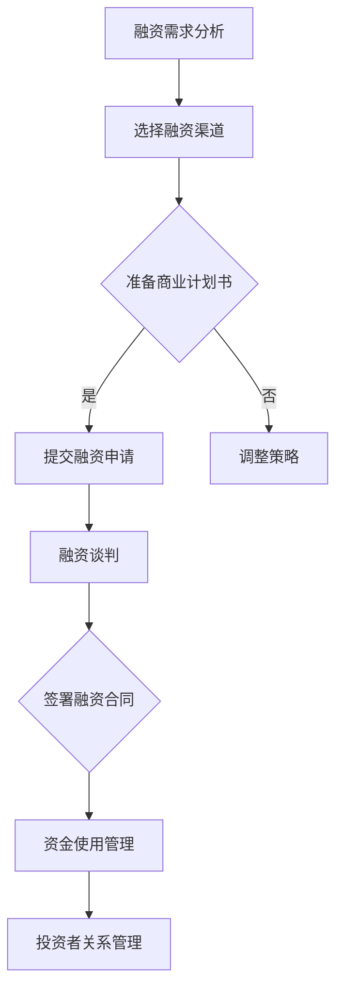

                 

### 文章标题

# 《草根创业团队的融资挑战》

> 关键词：草根创业、融资、渠道、策略、准备、谈判、管理、案例分析

> 摘要：本文旨在为草根创业团队提供一份全面而详尽的融资指南。通过分析融资的基本概念、渠道、流程，以及融资策略、准备工作、谈判技巧、资金管理等多个方面，本文将帮助创业者更好地理解融资过程，并为其提供实用的策略和技巧。此外，通过实际案例的分析，本文将展示成功融资的路径，并为读者提供有价值的参考。最终，本文旨在帮助草根创业团队克服融资挑战，实现企业发展的目标。

### 第一部分：融资基础

#### 第1章：草根创业团队融资概述

草根创业团队在创业初期面临着资金短缺的普遍问题，而成功融资则成为他们实现梦想的重要途径。本章将首先介绍融资的基本概念与意义，然后探讨多种融资渠道，并详细解析融资流程。

## 1.1 融资的定义与意义

### 1.1.1 融资的基本概念

融资，即企业或个人为筹集资金而进行的一系列金融交易活动。在草根创业团队的背景下，融资通常指的是为满足初创企业资金需求而进行的股权融资或债务融资。

### 1.1.2 融资对于创业团队的重要性

对于草根创业团队来说，融资不仅意味着资金的注入，更是资源、人脉、指导等多方面支持的重要来源。融资的成功将有助于以下几方面：

1. **启动资金：** 解决创业初期的资金困境，支持产品研发和市场开拓。
2. **扩大生产规模：** 提升产能，满足市场需求，增加市场份额。
3. **技术创新：** 引入先进技术，提升产品竞争力。
4. **市场扩张：** 通过资本的力量，快速进入新的市场领域。
5. **品牌塑造：** 提升品牌知名度，增强品牌影响力。

## 1.2 融资渠道介绍

### 1.2.1 天使投资

天使投资是指由个人投资者对初创企业进行的早期投资。天使投资者通常拥有丰富的行业经验和资源，能够提供资金、指导和支持。

### 1.2.2 风险投资

风险投资是指专业投资机构对具有高增长潜力的初创企业进行的投资。风险投资通常涉及高额资金，并期望通过企业的成功退出获得高额回报。

### 1.2.3 银行贷款

银行贷款是创业团队从银行获取资金的一种方式。这种方式通常具有较高的信用要求，并需要提供抵押物或担保。

### 1.2.4 众筹

众筹是指通过互联网平台向广大投资者筹集资金的一种方式。众筹不仅能够快速筹集资金，还能帮助企业建立用户基础和品牌知名度。

## 1.3 融资流程详解

### 1.3.1 融资准备

在正式启动融资前，创业团队需要进行充分的准备，包括市场调研、商业计划书撰写、财务报表准备等。

### 1.3.2 融资申请

融资申请阶段，创业团队需要向投资者提交详细的商业计划书、财务报表等相关文件，并准备面对投资者的提问和审核。

### 1.3.3 融资谈判

融资谈判是双方就投资条款、股权分配等进行协商的过程。谈判的成功与否直接影响融资的顺利进行。

### 1.3.4 融资签约

融资签约阶段，双方将正式签署投资协议，明确各方的权利和义务。签约后，投资者将按约定注入资金。

通过以上内容，草根创业团队可以初步了解融资的基础知识和重要性，为后续的融资策略和准备工作打下基础。

#### 第2章：制定有效的融资策略

在了解了融资的基本概念和渠道后，草根创业团队需要制定一套切实可行的融资策略。本章将深入探讨如何了解自身的融资需求、选择合适的融资渠道以及制定融资策略。

## 2.1 了解自身的融资需求

### 2.1.1 创业团队的融资需求分析

了解自身的融资需求是制定有效融资策略的第一步。创业团队需要从以下几个方面进行分析：

1. **资金用途：** 分析创业项目所需的资金具体用于哪些方面，如研发、生产、市场推广、团队扩充等。
2. **融资额度：** 根据资金用途，确定需要融资的总额度。这有助于选择适合的融资渠道和投资者。
3. **融资期限：** 考虑融资资金的用途时间，确定融资的期限。短期融资适合短期资金需求，长期融资则适合长期资金规划。
4. **回报预期：** 根据企业的盈利能力和市场前景，设定合理的回报预期，这将影响投资者的兴趣。

### 2.1.2 资金用途的规划

明确资金用途是确保融资有效性的关键。创业团队应详细规划每笔资金的用途，包括以下几个方面：

1. **研发投入：** 为产品或服务的研发提供足够的资金，确保技术领先性和市场竞争力。
2. **市场推广：** 适当的资金投入市场推广，提高品牌知名度和市场份额。
3. **团队扩充：** 吸引优秀人才，提升团队实力。
4. **生产扩建：** 提升生产能力和效率，满足市场需求。

## 2.2 选择合适的融资渠道

### 2.2.1 不同融资渠道的比较

不同的融资渠道适用于不同的融资需求，创业团队需要根据自身情况选择合适的渠道：

1. **天使投资：** 适合初创企业，能提供资金、指导和资源。但通常投资额度有限。
2. **风险投资：** 适合具有高增长潜力的企业，投资额度大，但风险也高。
3. **银行贷款：** 适合有稳定现金流和资产的企业，但审批周期较长，对信用要求高。
4. **众筹：** 适合希望快速筹集资金的企业，能提高品牌知名度，但回报较低。

### 2.2.2 创业团队如何选择融资渠道

创业团队在选择融资渠道时，需要综合考虑以下因素：

1. **资金需求：** 根据融资额度选择适合的渠道。
2. **市场状况：** 了解市场环境，选择适应当前市场状况的融资渠道。
3. **风险承受能力：** 根据自身风险承受能力选择合适的融资方式。
4. **资金用途：** 结合资金用途选择最合适的融资渠道。

## 2.3 融资策略的制定

### 2.3.1 制定融资目标的策略

制定明确的融资目标是成功融资的关键。创业团队应设定以下目标：

1. **融资总额：** 根据资金用途和市场需求设定合理的融资总额。
2. **融资时间：** 根据企业发展的时间节点设定融资时间。
3. **投资者类型：** 根据市场需求和投资者偏好选择合适的投资者类型。

### 2.3.2 融资计划的时间表

制定详细的时间表有助于确保融资过程的顺利进行。创业团队应制定以下时间表：

1. **市场调研和需求分析：** 1-2个月
2. **商业计划书撰写：** 2-3个月
3. **融资渠道选择和准备：** 1-2个月
4. **融资申请和谈判：** 1-2个月
5. **融资签约和资金到位：** 1-2个月

### 2.3.3 融资方案的设计

设计一套完整的融资方案是确保融资成功的关键。创业团队应考虑以下方面：

1. **资金用途和分配：** 明确每笔资金的具体用途和分配比例。
2. **投资者权益保护：** 设计合理的股权分配和权益保护机制，确保投资者利益。
3. **风险控制措施：** 制定风险控制措施，降低融资风险。

通过以上策略的制定，草根创业团队可以更加系统地准备融资，提高融资成功的可能性。

#### 第3章：融资前的准备工作

在制定好融资策略后，草根创业团队需要进行充分的准备工作，以确保融资过程的顺利进行。本章将详细探讨财务报表准备、商业计划书撰写和融资演讲准备等内容。

## 3.1 财务报表准备

财务报表是投资者评估企业财务状况的重要依据，因此，准确的财务报表对于融资的成功至关重要。

### 3.1.1 财务报表的基本知识

财务报表主要包括资产负债表、利润表和现金流量表等。其中：

- **资产负债表：** 反映企业在某一特定时点的财务状况，包括资产、负债和所有者权益。
- **利润表：** 反映企业在一定时期内的经营成果，包括收入、成本、费用和利润。
- **现金流量表：** 反映企业在一定时期内的现金流入和流出情况，分为经营活动、投资活动和筹资活动三部分。

### 3.1.2 如何制作财务报表

制作财务报表需要遵循以下步骤：

1. **数据收集：** 收集相关财务数据，如销售收入、成本、费用、资产、负债等。
2. **编制报表：** 根据收集的数据编制资产负债表、利润表和现金流量表。
3. **审核和修正：** 审核报表，确保数据准确无误，并进行必要的修正。

### 3.1.3 如何分析财务报表

分析财务报表可以帮助企业了解自身的财务状况，为融资决策提供依据。主要分析方法包括：

1. **比较分析：** 将本企业的财务数据与同行业平均水平或竞争对手进行比较，了解自身的优劣势。
2. **趋势分析：** 分析财务数据的变化趋势，如收入增长、成本控制等，评估企业的经营状况。
3. **比率分析：** 计算各种财务比率，如流动比率、速动比率、利润率等，评估企业的财务状况和盈利能力。

## 3.2 商业计划书撰写

商业计划书是创业团队向投资者展示项目可行性、盈利能力和发展前景的重要文档。

### 3.2.1 商业计划书的基本框架

商业计划书通常包括以下内容：

1. **封面和目录：** 封面应包括企业名称、联系方式、商业计划书名称和日期等。目录列出各章节和页码。
2. **公司概述：** 介绍企业的基本情况，如企业名称、注册地、成立时间、企业使命等。
3. **市场分析：** 分析目标市场、市场规模、市场竞争状况、市场趋势等。
4. **产品与服务：** 介绍企业的产品或服务，包括产品特点、技术优势、市场定位等。
5. **营销策略：** 阐述企业的营销策略，如市场推广、销售渠道、客户关系管理等。
6. **运营计划：** 描述企业的运营模式、组织架构、人力资源规划、生产流程等。
7. **财务计划：** 预测企业的收入、成本、利润、现金流等，并提供详细的财务报表。
8. **风险评估与应对策略：** 分析可能面临的风险，并提出相应的应对措施。
9. **结论与融资需求：** 总结商业计划书的主要内容，明确融资目标和需求。

### 3.2.2 如何撰写商业计划书

撰写商业计划书需要注意以下几点：

1. **内容要全面：** 覆盖商业计划书的各个方面，确保信息的完整性和准确性。
2. **逻辑要清晰：** 确保各个部分之间的逻辑关系清晰，便于投资者阅读和理解。
3. **数据要真实：** 提供真实可靠的数据，确保商业计划书的可信度。
4. **语言要简洁：** 使用简洁明了的语言，避免使用过于专业或复杂的术语。

### 3.2.3 商业计划书的注意事项

在撰写商业计划书时，还需注意以下几点：

1. **避免过多技术性描述：** 投资者可能对技术细节不感兴趣，应着重展示项目的商业价值和市场前景。
2. **突出竞争优势：** 强调企业的独特优势，如技术创新、市场占有率、客户资源等。
3. **重视财务预测：** 提供详细的财务预测数据，让投资者看到企业的盈利潜力。
4. **准备修改稿：** 在提交商业计划书前，多次修改和完善，确保最佳效果。

## 3.3 融资演讲准备

融资演讲是创业团队向投资者展示项目的重要环节，因此，充分的准备至关重要。

### 3.3.1 融资演讲的目的与结构

融资演讲的主要目的是：

1. **吸引投资者：** 通过展示项目的潜力，吸引投资者的关注和兴趣。
2. **建立信任：** 通过展示企业的实力和团队的专业性，建立投资者对企业的信任。
3. **明确融资需求：** 清晰地传达企业的融资需求和计划。

融资演讲的结构通常包括以下几个部分：

1. **开场白：** 简要介绍企业、项目背景和融资目的。
2. **项目介绍：** 详细介绍产品、技术、市场、竞争优势等。
3. **融资计划：** 阐述融资额度、用途、回报预期等。
4. **团队介绍：** 展示核心团队成员的背景和经验。
5. **问答环节：** 回答投资者的问题，展示团队的应变能力和专业性。

### 3.3.2 如何准备融资演讲

准备融资演讲需要注意以下几点：

1. **熟悉内容：** 熟悉商业计划书和融资方案，确保演讲内容准确无误。
2. **练习演讲：** 多次练习演讲，提高演讲的流畅性和表达能力。
3. **准备PPT：** 制作简洁、清晰的PPT，配合演讲内容，增强说服力。
4. **控制时间：** 确保演讲在规定时间内完成，避免拖沓。
5. **注意形象：** 穿着得体，保持良好的姿态和表情，展现专业形象。

### 3.3.3 融资演讲的注意事项

在融资演讲过程中，还需注意以下几点：

1. **避免过于专业：** 避免使用过于专业的术语，确保投资者能够理解。
2. **注重互动：** 与投资者保持互动，回答问题时要真诚、专业。
3. **展示信心：** 展示企业的信心和对项目的热情，增强投资者的信心。
4. **关注反馈：** 认真听取投资者的意见和反馈，及时调整演讲内容。

通过以上准备工作，草根创业团队可以更好地应对融资挑战，提高融资成功的可能性。

#### 第4章：融资谈判技巧

融资谈判是创业团队与投资者之间就投资条款、股权分配等问题进行协商的过程。成功的融资谈判不仅能够确保融资的顺利进行，还能为创业团队带来更多的资源和支持。本章将深入探讨融资谈判的原理、谈判中应注意的问题以及融资合同签订的注意事项。

## 4.1 融资谈判的原理

### 4.1.1 融资谈判的基本流程

融资谈判通常包括以下几个步骤：

1. **初始接触：** 双方进行初步交流，了解彼此的意图和需求。
2. **初步谈判：** 双方就投资金额、投资条款等进行初步讨论，达成初步共识。
3. **详细谈判：** 对具体条款进行深入讨论，如股权分配、投票权、董事会席位等。
4. **合同起草：** 根据谈判结果，起草融资合同，双方进行最终确认。
5. **合同签订：** 双方正式签署融资合同，资金到位。

### 4.1.2 融资谈判的策略

融资谈判的策略取决于双方的需求和目标。以下是一些常见的融资谈判策略：

1. **强势谈判：** 在谈判中占据主导地位，通过强硬态度争取最大利益。
2. **柔性谈判：** 通过妥协和合作，寻求双方都能接受的解决方案。
3. **双赢策略：** 寻求在谈判中实现双方的利益最大化，通过合作和共享实现共赢。
4. **适时调整：** 根据谈判进程和对方反应，灵活调整谈判策略。

## 4.2 谈判中应注意的问题

### 4.2.1 谈判中的沟通技巧

有效的沟通是谈判成功的关键。以下是一些谈判中的沟通技巧：

1. **倾听：** 仔细倾听对方的意见和需求，理解对方的立场和意图。
2. **表达清晰：** 使用简洁明了的语言表达自己的观点，避免使用过于专业或复杂的术语。
3. **掌握节奏：** 控制谈判的节奏，确保双方都有足够的时间思考和回应。
4. **积极反馈：** 及时给予对方积极的反馈，表达对对方观点的认同和尊重。

### 4.2.2 谈判中的心理战术

谈判中，心理战术同样重要。以下是一些常见的心理战术：

1. **制造紧迫感：** 通过设置时间限制，促使对方尽快做出决策。
2. **展示信心：** 展现出对项目的信心和对谈判的掌控力，增加自己的谈判优势。
3. **利用同理心：** 理解对方的需求和担忧，通过同理心建立信任和合作关系。
4. **利用矛盾：** 通过揭示双方利益之间的矛盾，推动对方做出让步。

### 4.2.3 如何处理谈判中的分歧

在谈判过程中，分歧是不可避免的。以下是一些处理谈判中分歧的方法：

1. **冷静处理：** 保持冷静，避免情绪化，理性分析分歧的原因和解决方案。
2. **寻求妥协：** 通过双方妥协和让步，找到双方都能接受的解决方案。
3. **转换话题：** 在分歧较大时，可以转换话题，暂时避开争议，避免谈判陷入僵局。
4. **寻求第三方帮助：** 当双方无法达成一致时，可以寻求第三方机构的帮助，如法律顾问、财务顾问等。

## 4.3 融资合同签订

### 4.3.1 融资合同的类型与内容

融资合同分为股权融资合同和债务融资合同两大类。以下分别介绍：

1. **股权融资合同：** 
   - **类型：** 股权融资合同可分为普通股权融资合同、优先股权融资合同等。
   - **内容：** 主要包括投资金额、投资比例、股权分配、董事会席位、优先权条款等。

2. **债务融资合同：** 
   - **类型：** 债务融资合同可分为贷款合同、债券合同等。
   - **内容：** 主要包括借款金额、借款期限、利率、还款方式、担保条款等。

### 4.3.2 如何签订融资合同

签订融资合同需要注意以下几点：

1. **审查合同条款：** 仔细审查合同条款，确保合同内容符合双方意愿，没有遗漏或歧义。
2. **聘请专业律师：** 聘请专业律师参与谈判和合同审查，确保合同的合法性和有效性。
3. **明确双方权利义务：** 在合同中明确双方的权利和义务，避免未来可能产生的纠纷。
4. **签署合同：** 双方在合同上签字并盖章，完成合同签订。

### 4.3.3 融资合同签订的注意事项

在签订融资合同时，还需注意以下几点：

1. **合同备案：** 合同签订后，及时到相关机构进行备案，确保合同的正式生效。
2. **遵守合同约定：** 双方在签订合同后，应严格遵守合同约定，履行各自的义务。
3. **风险提示：** 在合同中明确提示可能存在的风险，降低双方的风险暴露。
4. **持续沟通：** 签订合同后，保持与投资者的持续沟通，确保合同的顺利履行。

通过以上谈判技巧和注意事项，草根创业团队可以更加从容地应对融资谈判，提高融资成功率，为企业的长远发展奠定坚实基础。

#### 第5章：融资后的管理

在成功完成融资后，草根创业团队需要专注于融资后的管理，确保资金的有效使用和投资者的权益。本章将详细探讨资金使用与管理、投资者关系管理以及融资后的企业发展。

## 5.1 资金的使用与管理

### 5.1.1 资金使用的规划

成功融资后，创业团队需要立即进行资金使用的规划，确保每笔资金都得到有效利用。以下是一些资金使用规划的关键步骤：

1. **制定详细的资金使用计划：** 根据商业计划书和融资方案，明确每笔资金的用途，如研发投入、市场推广、团队扩充等。
2. **设立资金使用的监控机制：** 制定资金使用的审批流程和监控机制，确保每笔资金都按照计划使用。
3. **定期评估资金使用效果：** 定期对资金使用效果进行评估，分析资金使用的合理性和效率，根据实际情况进行调整。

### 5.1.2 资金使用的监控

有效的资金监控是确保资金安全和使用效率的重要手段。以下是一些监控措施：

1. **定期审计：** 定期进行财务审计，确保财务报表的真实性和准确性。
2. **财务报告：** 定期向投资者和董事会提交财务报告，让投资者了解企业的财务状况。
3. **预算控制：** 实施严格的预算控制，确保资金使用的合规性和效率。
4. **内部审计：** 设立内部审计部门或聘请外部审计机构，对资金使用进行定期审查。

### 5.1.3 资金使用的风险控制

在资金使用过程中，风险控制至关重要。以下是一些风险控制措施：

1. **多元化投资：** 避免将所有资金集中在单一项目或领域，分散投资风险。
2. **风险评估：** 在资金使用前进行风险评估，制定相应的风险控制策略。
3. **法律合规：** 确保资金使用的合法合规，遵守相关法律法规和合同条款。
4. **应急计划：** 制定应急计划，应对可能出现的财务危机和风险事件。

## 5.2 投资者的关系管理

### 5.2.1 投资者关系的维护

投资者关系的维护是融资后的重要任务，以下是一些维护措施：

1. **定期沟通：** 定期与投资者进行沟通，了解他们的需求和关注点，及时回应他们的疑问。
2. **透明管理：** 保持企业的管理透明，向投资者提供及时、准确的财务和业务信息。
3. **积极参与：** 鼓励投资者参与企业的重大决策，增强他们的参与感和归属感。
4. **感恩回馈：** 通过感恩回馈活动，如发送节日贺卡、举办投资者交流会等，表达对投资者的感激之情。

### 5.2.2 投资者沟通的技巧

有效的沟通是维护投资者关系的关键，以下是一些沟通技巧：

1. **倾听：** 仔细倾听投资者的意见和需求，理解他们的立场和意图。
2. **清晰表达：** 使用简洁明了的语言表达自己的观点，避免使用过于专业或复杂的术语。
3. **及时反馈：** 及时给予投资者反馈，确保他们的疑问得到及时解答。
4. **展示诚信：** 展现企业的诚信和透明度，建立投资者对企业的信任。

### 5.2.3 投资者关系的危机处理

在投资者关系管理中，危机处理同样重要。以下是一些危机处理措施：

1. **冷静应对：** 保持冷静，避免情绪化，理性分析危机的原因和解决方案。
2. **及时沟通：** 及时与投资者沟通，告知他们危机的情况和企业的应对措施。
3. **真诚道歉：** 如有失误或错误，应真诚道歉，并采取措施纠正。
4. **积极解决：** 通过积极解决问题，恢复投资者对企业的信心。

## 5.3 融资后的企业发展

### 5.3.1 融资对企业发展的影响

融资对企业发展具有深远的影响，以下是一些影响：

1. **资金支持：** 融资为企业提供了必要的资金支持，有助于企业扩大生产规模、提升研发能力和市场竞争力。
2. **资源整合：** 融资引入了投资者的资源，如人脉、技术和管理经验，有助于企业实现资源的整合和优化。
3. **品牌提升：** 成功融资有助于提升企业的品牌形象和市场地位，增强企业的知名度和影响力。
4. **战略调整：** 融资后，企业可以根据市场需求和投资策略进行调整，优化业务模式，提高竞争力。

### 5.3.2 如何利用融资推动企业发展

成功融资后，企业需要充分利用融资资金，推动企业的发展。以下是一些建议：

1. **加强研发投入：** 加大研发投入，提升技术创新能力，确保企业的核心竞争力。
2. **拓展市场：** 通过融资资金拓展市场，提高市场份额，实现规模化发展。
3. **优化团队结构：** 引进优秀人才，优化团队结构，提升企业整体竞争力。
4. **提升管理水平：** 通过引入先进的管理理念和方法，提升企业管理水平，确保企业高效运营。
5. **风险控制：** 加强风险控制，确保企业稳健发展，降低融资风险。

### 5.3.3 融资后的企业风险管理

融资后的企业风险管理至关重要，以下是一些风险管理措施：

1. **制定风险管理策略：** 根据企业的实际情况，制定全面的风险管理策略，明确风险识别、评估、控制和应对措施。
2. **建立风险预警系统：** 建立风险预警系统，实时监控企业风险状况，及时采取措施应对潜在风险。
3. **加强内部审计：** 加强内部审计，确保企业财务和业务活动的合规性和透明度。
4. **制定应急预案：** 针对可能出现的风险事件，制定应急预案，确保企业能够迅速应对和恢复。
5. **持续培训和改进：** 定期对企业员工进行风险管理培训，提高风险意识和应对能力，持续改进风险管理措施。

通过以上管理措施，草根创业团队可以更好地管理融资后的企业，确保企业稳健发展，实现长期目标。

#### 第6章：草根创业团队融资案例分析

成功融资是草根创业团队实现企业发展的重要里程碑，但融资过程并非一帆风顺。本章将通过两个实际案例，分析草根创业团队在融资过程中的经历、挑战和机遇，帮助读者更好地理解融资的实践操作。

## 6.1 案例一：某互联网创业团队融资经历

### 6.1.1 创业团队的背景介绍

某互联网创业团队成立于2018年，专注于移动互联网社交应用的开发。团队成员大多来自知名互联网企业，拥有丰富的技术和管理经验。创业团队在成立初期，凭借一款创新性的社交应用迅速获得了用户的青睐，但随之而来的资金需求也日益增加。

### 6.1.2 融资准备与申请

在认识到融资需求后，创业团队开始准备融资申请。首先，他们进行了详细的市场调研，分析了行业趋势和竞争状况。接着，团队撰写了详细的商业计划书，包括产品介绍、市场前景、运营策略和财务预测等内容。商业计划书完成后，团队选择了天使投资和风险投资两种渠道进行融资申请。

### 6.1.3 融资谈判与签约

在初步接触到投资者后，创业团队与投资者进行了多轮谈判。谈判过程中，团队展示了产品的独特性和市场潜力，同时解释了融资用途和回报预期。双方在投资金额、股权分配、董事会席位等方面达成了共识，最终签署了融资协议。

### 6.1.4 融资后的管理与企业发展

融资完成后，创业团队按照计划使用了资金，加大了研发投入，优化了产品功能，并在市场推广上投入了更多资源。此外，团队还利用投资者的资源，拓展了业务领域，扩大了市场份额。经过几年的发展，创业团队成功将公司上市，实现了企业的快速增长。

## 6.2 案例二：某AI创业团队融资挑战与机遇

### 6.2.1 创业团队的背景介绍

某AI创业团队成立于2019年，专注于人工智能技术的研究和应用。团队在人工智能领域拥有多项核心技术和专利，但在创业初期面临着资金短缺的挑战。

### 6.2.2 融资策略的制定

为了成功融资，AI创业团队制定了详细的融资策略。首先，团队分析了市场需求和投资趋势，确定了AI技术领域的投资热点。接着，团队选择了风险投资和众筹两种融资渠道，并准备了详尽的商业计划书和产品演示。

### 6.2.3 融资过程中的困难与应对

在融资过程中，AI创业团队遇到了多个挑战。首先，团队在融资初期遭遇了投资者对AI技术的疑虑和担忧。为了应对这一问题，团队通过多次演示和技术讲解，向投资者展示了AI技术的实际应用和价值。其次，团队在融资谈判中面临了投资条款的博弈。团队通过灵活的谈判策略，争取到了更合理的投资条款。

### 6.2.4 融资后的管理与企业发展

融资完成后，AI创业团队按照计划使用了资金，加大了研发投入，推出了多款创新性的AI产品。团队还利用投资者的资源，拓展了市场渠道，提高了品牌知名度。经过几年的发展，AI创业团队成功获得了多家大企业的合作，市场地位逐渐提升。

通过以上两个案例，我们可以看到，草根创业团队在融资过程中既面临挑战，也充满机遇。成功融资不仅需要扎实的准备工作，还需要灵活应对各种困难和变化。对于其他草根创业团队来说，这些案例提供了宝贵的经验和借鉴。

#### 第7章：草根创业团队融资的未来趋势

随着科技的进步和市场环境的变化，草根创业团队的融资也将迎来新的趋势。本章将探讨融资环境的变革、新趋势以及未来融资的挑战与机遇。

## 7.1 融资环境的变革

### 7.1.1 政策环境的变化

政策环境对创业融资有着重要影响。近年来，各国政府纷纷出台了一系列支持创业和中小企业发展的政策，如税收优惠、融资补贴、创业孵化器等。这些政策为草根创业团队提供了更多融资机会和支持。

### 7.1.2 市场环境的变化

市场环境的变化对融资需求产生了深远影响。随着互联网、人工智能、区块链等新兴技术的快速发展，市场对创新技术和创新企业需求旺盛，为草根创业团队提供了广阔的市场空间。同时，资本市场的发展和投资机构的增多，也为草根创业团队提供了更多的融资渠道和机会。

### 7.1.3 投资者结构的变化

投资者结构的变化对融资过程和结果产生了重要影响。传统风险投资机构以外，越来越多的个人投资者、天使投资者和众筹平台进入市场，为草根创业团队提供了多元化的融资选择。此外，随着投资者对新兴技术和创新企业的认可度提高，草根创业团队获得融资的成功率也在提升。

## 7.2 融资新趋势

### 7.2.1 众筹融资的兴起

众筹融资作为一种新兴的融资方式，越来越受到草根创业团队的青睐。众筹不仅能够快速筹集资金，还能帮助企业建立用户基础和品牌知名度。未来，众筹融资将在更多领域得到应用，成为草根创业团队的重要融资手段。

### 7.2.2 风险投资市场的演变

风险投资市场正在不断演变，投资策略和投资领域也在不断扩展。传统风险投资机构逐渐向早期投资、成长期投资和并购投资等领域拓展，为草根创业团队提供更多融资选择。同时，越来越多的专业投资机构和投资平台涌现，为草根创业团队提供更加专业和高效的融资服务。

### 7.2.3 数字化融资工具的应用

数字化融资工具的应用正在改变融资过程。在线贷款平台、区块链融资、智能投顾等新兴融资工具，为草根创业团队提供了更加便捷、高效和低成本的融资选择。未来，数字化融资工具将在融资过程中发挥越来越重要的作用。

## 7.3 融资未来的挑战与机遇

### 7.3.1 创业团队如何应对融资挑战

尽管未来融资环境将更加友好，但草根创业团队仍将面临一系列挑战。如何应对这些挑战是创业团队成功融资的关键。以下是一些建议：

1. **加强创新能力：** 不断提升产品和技术的创新能力，保持竞争优势。
2. **完善商业计划：** 制定详细、可行的商业计划，明确融资用途和回报预期。
3. **提升团队实力：** 建立高效、专业的团队，提升企业整体竞争力。
4. **拓展市场渠道：** 拓展市场渠道，提高品牌知名度和市场份额。

### 7.3.2 投资者如何把握融资机遇

对于投资者来说，把握融资机遇同样重要。以下是一些建议：

1. **关注新兴领域：** 关注新兴技术和新兴市场，寻找具有高增长潜力的创业团队。
2. **优化投资策略：** 根据市场需求和投资偏好，调整投资策略，提高投资回报率。
3. **加强风险管理：** 完善风险管理机制，降低投资风险。
4. **积极参与创业孵化：** 通过参与创业孵化项目，为创业团队提供更多的支持和资源。

### 7.3.3 未来融资的发展方向

未来融资的发展方向将呈现以下几个趋势：

1. **多元化融资渠道：** 融资渠道将更加多元化，包括风险投资、天使投资、众筹、银行贷款等。
2. **数字化融资工具普及：** 数字化融资工具将得到广泛应用，提高融资效率和透明度。
3. **投资者专业化：** 投资者将更加专业化，提供更加全面和专业的融资服务。
4. **市场国际化：** 融资市场将逐渐国际化，为创业团队提供更多国际化的融资机会。

通过以上分析，我们可以看到，未来草根创业团队的融资环境将更加友好，但也面临诸多挑战。成功融资不仅需要创业团队的不断创新和努力，还需要投资者的专业支持和参与。只有双方共同努力，才能实现共赢，推动创业事业的发展。

### 附录A：融资相关资源与工具

为了帮助草根创业团队更好地理解和应对融资挑战，本节将介绍一些常用的融资相关资源与工具，包括融资相关网站与平台、融资工具与软件以及融资相关书籍与资料。

#### A.1 融资相关网站与平台

1. **天使投资网**：提供天使投资信息，包括投资者介绍、项目发布和融资对接服务。
   - 网址：[天使投资网](http://angel investing.com)

2. **风险投资网**：专注于风险投资领域，提供投资机构介绍、项目发布和行业资讯。
   - 网址：[风险投资网](http://venturecapital.net)

3. **众筹平台**：如Kickstarter、Indiegogo等，提供众筹服务，帮助创业团队筹集资金。
   - 网址：[Kickstarter](https://www.kickstarter.com)、[Indiegogo](https://www.indiegogo.com)

4. **创业孵化器**：提供创业空间、培训和资金支持，助力创业团队成长。
   - 网址：[创业孵化器](http://startup incubators.com)

5. **银行贷款平台**：提供各种贷款产品和服务，帮助创业团队获得资金。
   - 网址：[银行贷款平台](http://bankloans.com)

#### A.2 融资工具与软件

1. **融资计算器**：用于计算融资额度和还款计划。
   - 软件名称：FinCal
   - 下载地址：[FinCal](http://www.fincalculator.com)

2. **商业计划书模板**：提供各种商业计划书模板，帮助创业团队快速撰写商业计划书。
   - 软件名称：BP Creator
   - 下载地址：[BP Creator](http://www.bpdevtools.com)

3. **财务报表工具**：用于制作和编辑财务报表。
   - 软件名称：QuickBooks
   - 下载地址：[QuickBooks](https://www.intuit.com/quickbooks)

4. **投资者关系管理工具**：用于管理投资者关系和沟通。
   - 软件名称：Investor Relations Pro
   - 下载地址：[Investor Relations Pro](http://investorrelationspro.com)

#### A.3 融资相关书籍与资料

1. **《融资策略与技巧》**：详细介绍了融资的基本概念、策略和技巧。
   - 作者：John G. Talley
   - 出版社：机械工业出版社

2. **《创业融资实战》**：通过案例分析，讲述了创业团队融资的全过程。
   - 作者：刘克崴
   - 出版社：电子工业出版社

3. **《天使投资与创业》**：探讨了天使投资在创业过程中的作用和影响。
   - 作者：郑瑞
   - 出版社：中国经济出版社

4. **《众筹：创业融资新趋势》**：介绍了众筹融资的原理、方法和案例。
   - 作者：宋浩
   - 出版社：人民邮电出版社

通过以上资源与工具，草根创业团队可以更好地了解融资相关知识和技巧，提高融资成功率，推动企业的发展。

### 核心概念与联系

#### Mermaid流程图

为了更好地展示融资流程中的各个关键环节，我们可以使用Mermaid语言绘制一个流程图。以下是一个简化的融资流程图：



这个流程图清晰地展示了从融资需求分析到资金使用管理和投资者关系管理的全过程，每个环节都紧密相连，共同构成了一个完整的融资管理体系。

#### 融资需求评估算法

在融资过程中，准确评估企业的融资需求至关重要。以下是一个简化的融资需求评估算法的伪代码：

```python
def assess_funding_needs(current_revenue, projected_revenue, operational_expenses):
    """
    评估企业的融资需求。
    
    :param current_revenue: 当前收入
    :param projected_revenue: 预计收入
    :param operational_expenses: 运营成本
    :return: 融资需求
    """
    if projected_revenue > current_revenue:
        funding_needed = projected_revenue - current_revenue - operational_expenses
        return funding_needed
    else:
        return 0
```

这个算法通过计算预计收入与当前收入及运营成本的差额，得出企业的融资需求。如果预计收入高于当前收入，则需要额外融资以支持业务增长；否则，无需额外融资。

#### 数学模型和公式

在融资决策中，投资回报率（ROI）是一个关键指标。其计算公式如下：

$$
ROI = \frac{净利润}{投入成本}
$$

举例说明，如果一个创业团队的投入成本为100万元，净利润为50万元，则其ROI为：

$$
ROI = \frac{50}{100} = 0.5
$$

这个ROI指标反映了企业利用资金获取利润的能力，是投资者评估投资回报的重要依据。

### 项目实战

#### 开发环境搭建

为了实现上述算法和流程，我们可以选择Python作为开发语言，并安装必要的库。以下是搭建开发环境的步骤：

1. **安装Python**：在官方网站[Python官网](https://www.python.org/)下载并安装Python。
2. **安装库**：使用pip命令安装必要的库，如Pandas、NumPy。例如：

   ```bash
   pip install pandas
   pip install numpy
   ```

#### 源代码详细实现和代码解读

以下是一个使用Python实现融资需求评估算法的完整代码示例：

```python
import pandas as pd

def assess_funding_needs(financial_data):
    """
    评估企业的融资需求。
    
    :param financial_data: 财务数据DataFrame
    :return: 融资需求
    """
    current_revenue = financial_data['current_revenue'].sum()
    projected_revenue = financial_data['projected_revenue'].sum()
    operational_expenses = financial_data['operational_expenses'].sum()
    
    funding_needed = financial_data.apply(
        lambda row: assess_funding_needs(row['current_revenue'], row['projected_revenue'], row['operational_expenses']),
        axis=1
    )
    
    return funding_needed.sum()

# 读取财务数据
financial_data = pd.DataFrame([
    {'current_revenue': 2000000, 'projected_revenue': 2500000, 'operational_expenses': 1500000},
    {'current_revenue': 3000000, 'projected_revenue': 3500000, 'operational_expenses': 2000000}
])

# 计算融资需求
funding_needed = assess_funding_needs(financial_data)
print(f"总融资需求为：{funding_needed}万元")
```

**代码解读与分析**：

- **数据读取**：使用Pandas库读取财务数据，假设财务数据存储在一个CSV文件中。
- **函数定义**：`assess_funding_needs` 函数接收一个包含财务数据的DataFrame，计算每笔业务的融资需求，并返回总融资需求。
- **数据处理**：使用`apply`方法对DataFrame的每行数据进行处理，调用`assess_funding_needs` 函数计算单笔业务的融资需求。
- **结果输出**：计算并输出总融资需求。

这个代码示例实现了对多笔财务数据的融资需求评估，有助于企业制定更科学的融资计划。

### 附加内容

**核心概念与联系**：

- **Mermaid流程图**：用于直观展示融资流程的关键环节。
- **伪代码**：用于描述融资需求评估算法的逻辑。
- **数学模型和公式**：用于计算投资回报率，帮助投资者评估投资回报。
- **项目实战**：通过Python代码实现融资需求评估，提供实际操作示例。

这些核心概念和联系共同构成了对草根创业团队融资过程的全景解析，为创业团队提供了实用的工具和策略。

### 作者信息

作者：AI天才研究院/AI Genius Institute & 禅与计算机程序设计艺术 /Zen And The Art of Computer Programming

本文旨在为草根创业团队提供全面的融资指南，通过深入剖析融资的基础知识、策略、准备工作和实际案例，帮助创业团队更好地应对融资挑战，实现企业发展的目标。作者以其丰富的经验和深厚的知识体系，确保文章内容的实用性和专业性，期望为广大创业者带来有价值的启示和指导。

