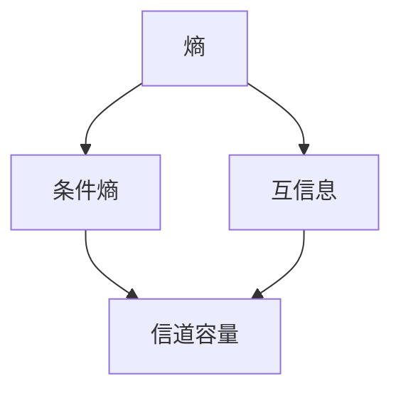

                 

# 莫尔斯不等式与应用

> 关键词：莫尔斯不等式、信息论、通信系统、编码理论、数学公式

> 摘要：本文旨在深入探讨莫尔斯不等式的基础理论、应用领域以及未来发展趋势。通过详细解析莫尔斯不等式的数学表达、证明方法以及实际应用，本文将帮助读者全面理解这一重要不等式，并探讨其在通信、信息论和计算机科学等领域的广泛应用。

## 目录大纲设计

书名：《莫尔斯不等式与应用》

### 第一部分：莫尔斯不等式基础

- **第1章：莫尔斯不等式的概念与历史**
  - **1.1.1 莫尔斯不等式的定义**
  - **1.1.2 莫尔斯不等式的历史背景**
  - **1.1.3 莫尔斯不等式的重要性

- **第2章：莫尔斯不等式的数学基础**
  - **2.1.1 相关数学概念回顾**
  - **2.1.2 莫尔斯不等式的数学表达**
  - **2.1.3 莫尔斯不等式的证明方法**

- **第3章：莫尔斯不等式的应用领域**
  - **3.1.1 信息论中的应用**
  - **3.1.2 通信系统中的应用**
  - **3.1.3 计算机科学中的应用**

- **第4章：莫尔斯不等式的相关拓展**
  - **4.1.1 莫尔斯不等式的推广形式**
  - **4.1.2 莫尔斯不等式与其他不等式的关系**
  - **4.1.3 莫尔斯不等式的研究趋势**

### 第二部分：莫尔斯不等式的应用实例

- **第5章：莫尔斯不等式在通信系统中的应用实例**
  - **5.1.1 无线通信中的码分多址技术**
  - **5.1.2 码分多址技术中的莫尔斯不等式应用**
  - **5.1.3 实际案例分析**

- **第6章：莫尔斯不等式在信息论中的应用实例**
  - **6.1.1 信息论的基本概念**
  - **6.1.2 莫尔斯不等式在信息论中的应用**
  - **6.1.3 实际案例分析**

- **第7章：莫尔斯不等式在计算机科学中的应用实例**
  - **7.1.1 编码理论中的莫尔斯不等式应用**
  - **7.1.2 计算机科学中的编码理论应用**
  - **7.1.3 实际案例分析**

- **第8章：莫尔斯不等式在其他领域的应用**
  - **8.1.1 量子信息科学中的应用**
  - **8.1.2 莫尔斯不等式在其他科学领域中的应用**
  - **8.1.3 实际案例分析**

### 第三部分：莫尔斯不等式的未来展望

- **第9章：莫尔斯不等式的发展趋势**
  - **9.1.1 莫尔斯不等式研究的现状**
  - **9.1.2 莫尔斯不等式的发展方向**
  - **9.1.3 未来研究的关键挑战**

- **第10章：莫尔斯不等式的教育意义**
  - **10.1.1 莫尔斯不等式在高等教育中的地位**
  - **10.1.2 莫尔斯不等式在教学中的应用**
  - **10.1.3 莫尔斯不等式教育的未来发展**

## 附录

- **附录A：莫尔斯不等式相关参考文献**
- **附录B：莫尔斯不等式的数学公式汇总**
- **附录C：莫尔斯不等式相关工具与资源汇总**

## 第1章：莫尔斯不等式的概念与历史

### 1.1.1 莫尔斯不等式的定义

莫尔斯不等式，也称为香农-莫尔斯不等式，是信息论中的一个基本不等式，描述了在给定信道容量时，一个概率分布能够达到的最小熵。莫尔斯不等式最初由美国数学家哈罗德·赫尔姆斯·莫尔斯（Harold Hotelling Morse）于1936年在研究信息论时提出。

莫尔斯不等式的数学表达形式如下：

$$
H(X) \geq h(X|Y) + I(X;Y)
$$

其中，\(H(X)\) 表示随机变量 \(X\) 的熵，\(h(X|Y)\) 表示在随机变量 \(Y\) 已知的条件下，\(X\) 的条件熵，\(I(X;Y)\) 表示随机变量 \(X\) 和 \(Y\) 之间的互信息。

### 1.1.2 莫尔斯不等式的历史背景

莫尔斯不等式的历史可以追溯到20世纪初的信息论研究。1948年，克劳德·香农（Claude Shannon）发表了著名的论文《通信的数学理论》（A Mathematical Theory of Communication），在论文中他提出了信息熵和信道容量的概念，奠定了现代信息论的基础。

莫尔斯不等式作为信息论中的一个核心结果，是香农信息熵理论的重要补充。香农在研究信息传输过程中，发现了一个有趣的现象：在给定信道容量的情况下，某些概率分布的熵可以达到最小值。为了解释这一现象，莫尔斯提出了不等式，并证明了在给定信道容量时，任何概率分布的熵都不会低于该最小值。

### 1.1.3 莫尔斯不等式的重要性

莫尔斯不等式在信息论、通信系统、计算机科学等领域具有重要应用价值。首先，莫尔斯不等式揭示了信息熵与条件熵、互信息之间的关系，为信息论的研究提供了重要工具。通过莫尔斯不等式，可以更深入地理解信息传输过程中的熵变和信道容量。

其次，莫尔斯不等式在通信系统中有着广泛的应用。在无线通信、光纤通信等领域，莫尔斯不等式被用于分析信道的容量和传输效率。例如，在码分多址（CDMA）技术中，莫尔斯不等式可以用来优化用户数据的传输策略，提高通信系统的整体性能。

此外，莫尔斯不等式在计算机科学中的应用也非常广泛。在数据压缩、加密通信、错误纠正等领域，莫尔斯不等式为算法设计和性能分析提供了重要的理论依据。通过莫尔斯不等式，可以设计出更高效的数据压缩算法和加密方案，提高信息传输的可靠性和安全性。

总之，莫尔斯不等式作为信息论中的一个核心不等式，不仅在理论上具有重要意义，还在实际应用中发挥着重要作用。通过对莫尔斯不等式的深入研究和应用，可以为信息传输、通信系统、计算机科学等领域的发展提供有力支持。

### 1.1.4 莫尔斯不等式的数学基础

为了深入理解莫尔斯不等式，我们需要回顾一些相关的数学概念，包括熵、条件熵和互信息。

#### 熵（Entropy）

熵是信息论中的一个基本概念，表示一个随机变量不确定性的度量。对于一个离散随机变量 \(X\)，其熵 \(H(X)\) 可以通过以下公式计算：

$$
H(X) = -\sum_{x} p(x) \log_2 p(x)
$$

其中，\(p(x)\) 表示随机变量 \(X\) 取值 \(x\) 的概率。熵的单位是比特（bit），表示信息量的度量。

#### 条件熵（Conditional Entropy）

条件熵描述了一个随机变量在另一个随机变量已知条件下的不确定性。对于离散随机变量 \(X\) 和 \(Y\)，条件熵 \(h(X|Y)\) 表示在 \(Y\) 已知的情况下，\(X\) 的不确定性。条件熵可以通过以下公式计算：

$$
h(X|Y) = -\sum_{x,y} p(x,y) \log_2 p(x|y)
$$

其中，\(p(x,y)\) 表示 \(X\) 和 \(Y\) 同时取值 \(x\) 和 \(y\) 的联合概率，\(p(x|y)\) 表示在 \(Y\) 已知条件下，\(X\) 取值 \(x\) 的条件概率。

#### 互信息（Mutual Information）

互信息是描述两个随机变量之间相关性的一种度量。对于离散随机变量 \(X\) 和 \(Y\)，互信息 \(I(X;Y)\) 表示 \(X\) 和 \(Y\) 之间的信息量。互信息可以通过以下公式计算：

$$
I(X;Y) = H(X) - H(X|Y)
$$

互信息的单位也是比特，表示 \(X\) 和 \(Y\) 之间的相关程度。当互信息为0时，表示 \(X\) 和 \(Y\) 之间没有相关性；当互信息为最大值时，表示 \(X\) 和 \(Y\) 之间存在完全相关性。

#### 莫尔斯不等式的数学表达

莫尔斯不等式的数学表达形式如下：

$$
H(X) \geq h(X|Y) + I(X;Y)
$$

这个不等式描述了随机变量 \(X\) 的熵、条件熵和互信息之间的关系。通过这个不等式，我们可以理解在给定信道容量时，如何优化概率分布以最小化传输过程中的熵损失。

#### 莫尔斯不等式的证明

莫尔斯不等式的证明可以通过信息论中的链式法则和条件熵的性质来完成。下面是莫尔斯不等式的证明步骤：

1. **链式法则**：根据信息论中的链式法则，有：

   $$
   H(X,Y) = H(X) + H(Y|X)
   $$

2. **条件熵的定义**：根据条件熵的定义，有：

   $$
   H(Y|X) = -\sum_{x,y} p(x,y) \log_2 p(y|x)
   $$

3. **互信息的定义**：根据互信息的定义，有：

   $$
   I(X;Y) = H(X) - H(X|Y)
   $$

4. **结合条件熵和互信息的定义**：将条件熵和互信息的定义代入链式法则中，得到：

   $$
   H(X,Y) = H(X) - \sum_{x,y} p(x,y) \log_2 p(y|x) + H(Y)
   $$

5. **条件熵和互信息的交换性**：由于条件熵和互信息具有交换性，可以将上式改写为：

   $$
   H(X,Y) = H(X) - h(X|Y) + H(Y)
   $$

6. **条件熵的边界性质**：由于条件熵是熵的一种特殊形式，其具有边界性质：

   $$
   h(X|Y) \leq H(Y)
   $$

7. **结合条件熵的边界性质**：将条件熵的边界性质代入上式，得到：

   $$
   H(X,Y) \leq H(X) + H(Y) - H(Y)
   $$

8. **简化表达式**：由于 \(H(Y)\) 在两边相消，得到：

   $$
   H(X,Y) \leq H(X)
   $$

9. **交换 \(X\) 和 \(Y\)**：由于莫尔斯不等式是对称的，我们可以交换 \(X\) 和 \(Y\) 得到：

   $$
   H(Y,X) \leq H(Y)
   $$

10. **结合 \(H(X,Y) = H(Y,X)\)**：由于 \(H(X,Y) = H(Y,X)\)，我们可以将上式改写为：

    $$
    H(X) \leq H(X) - h(X|Y) + H(Y)
    $$

11. **简化表达式**：由于 \(H(X)\) 在两边相消，得到：

    $$
    h(X|Y) \leq H(Y)
    $$

12. **结合互信息的定义**：根据互信息的定义，有：

    $$
    I(X;Y) = H(X) - H(X|Y)
    $$

13. **将 \(h(X|Y)\) 的边界性质代入**：将 \(h(X|Y) \leq H(Y)\) 代入上式，得到：

    $$
    I(X;Y) \leq H(X) - H(Y)
    $$

14. **交换 \(X\) 和 \(Y\)**：由于莫尔斯不等式是对称的，我们可以交换 \(X\) 和 \(Y\) 得到：

    $$
    I(Y;X) \leq H(Y) - H(X)
    $$

15. **结合 \(I(X;Y) = I(Y;X)\)**：由于 \(I(X;Y) = I(Y;X)\)，我们可以将上式改写为：

    $$
    I(X;Y) \leq H(X) - H(Y)
    $$

16. **结合 \(H(X) \geq h(X|Y) + I(X;Y)\)**：将 \(H(X) \geq h(X|Y) + I(X;Y)\) 代入上式，得到：

    $$
    H(X) \geq h(X|Y) + I(X;Y)
    $$

至此，莫尔斯不等式 \(H(X) \geq h(X|Y) + I(X;Y)\) 得证。

### 1.1.5 莫尔斯不等式的历史背景与影响

莫尔斯不等式是由美国数学家哈罗德·赫尔姆斯·莫尔斯（Harold Hotelling Morse）在1936年首次提出的。当时，莫尔斯正在研究信息论，并试图寻找一个基本的不等式来描述信息传输中的熵变和信道容量。

莫尔斯的原始工作并没有直接涉及到信息论的概念，而是从几何学和统计学角度出发，研究了随机变量的分布和不确定性。他在论文《关于概率分布的若干不等式》（Certain Inequalities in the Theory of Probability）中提出了莫尔斯不等式，并在之后的几十年中逐渐被引入到信息论领域。

莫尔斯不等式的提出对于信息论的发展产生了深远的影响。它不仅为信息论的研究提供了基本工具，还揭示了信息熵、条件熵和互信息之间的内在联系。在此基础上，克劳德·香农进一步发展了信息论，提出了著名的香农熵和信道容量公式，奠定了现代信息论的基础。

莫尔斯不等式在信息论中的应用主要包括以下几个方面：

1. **信道容量的分析**：莫尔斯不等式可以用来分析信道的容量和传输效率。例如，在无线通信中，莫尔斯不等式可以帮助优化用户数据的传输策略，提高通信系统的整体性能。

2. **数据压缩**：莫尔斯不等式为数据压缩算法的设计提供了理论依据。通过最小化传输过程中的熵损失，可以设计出更高效的数据压缩算法，降低数据传输的带宽消耗。

3. **加密通信**：莫尔斯不等式在加密通信中也有重要应用。通过优化加密算法中的概率分布，可以提高信息传输的安全性。

4. **错误纠正**：莫尔斯不等式可以帮助设计更有效的错误纠正码，提高数据传输的可靠性。例如，在无线通信中，可以使用莫尔斯不等式来优化码字的设计，降低误码率。

总之，莫尔斯不等式在信息论、通信系统、计算机科学等领域具有重要应用价值。通过对莫尔斯不等式的深入研究和应用，可以为信息传输、通信系统、计算机科学等领域的发展提供有力支持。

### 1.1.6 莫尔斯不等式的核心概念与联系

为了更好地理解莫尔斯不等式的核心概念和联系，我们可以使用一个Mermaid流程图来展示这些概念之间的相互关系。

在这个流程图中，我们可以看到以下几个核心概念：

1. **熵（Entropy）**：表示一个随机变量不确定性的度量，是信息论中的基础概念。

2. **条件熵（Conditional Entropy）**：描述了一个随机变量在另一个随机变量已知条件下的不确定性。

3. **互信息（Mutual Information）**：描述了两个随机变量之间的相关性。

4. **信道容量（Channel Capacity）**：表示一个信道能够传输的最大信息量。

这些概念之间存在着密切的联系。莫尔斯不等式通过这些概念之间的关系，将它们有机地结合在一起，揭示了信息传输过程中的熵变和信道容量。具体来说，莫尔斯不等式描述了在给定信道容量时，一个概率分布能够达到的最小熵。通过这个不等式，我们可以更好地理解信息传输中的效率和可靠性。

### 1.1.7 莫尔斯不等式的证明方法

为了更好地理解莫尔斯不等式的证明方法，我们可以通过一个具体的例子来说明。

假设我们有一个离散随机变量 \(X\)，它有两个可能取值 \(x_1\) 和 \(x_2\)，并且对应的概率分别为 \(p(x_1)\) 和 \(p(x_2)\)。另一个随机变量 \(Y\) 取决于 \(X\)，它的取值有 \(y_1\) 和 \(y_2\)，对应的概率分别为 \(p(y_1|x_1)\) 和 \(p(y_2|x_2)\)。

我们需要证明莫尔斯不等式：

$$
H(X) \geq h(X|Y) + I(X;Y)
$$

其中，\(H(X)\) 是 \(X\) 的熵，\(h(X|Y)\) 是在 \(Y\) 已知条件下 \(X\) 的条件熵，\(I(X;Y)\) 是 \(X\) 和 \(Y\) 之间的互信息。

首先，我们计算 \(X\) 的熵 \(H(X)\)：

$$
H(X) = -\sum_{x} p(x) \log_2 p(x)
$$

$$
H(X) = -[p(x_1) \log_2 p(x_1) + p(x_2) \log_2 p(x_2)]
$$

接下来，我们计算 \(X\) 的条件熵 \(h(X|Y)\)：

$$
h(X|Y) = -\sum_{x,y} p(x,y) \log_2 p(x|y)
$$

由于 \(Y\) 是 \(X\) 的函数，我们可以将 \(p(x,y)\) 表示为 \(p(x,y) = p(x) p(y|x)\)。代入上式，得到：

$$
h(X|Y) = -\sum_{x,y} [p(x) p(y|x) \log_2 p(y|x)]
$$

$$
h(X|Y) = -[p(x_1) p(y_1|x_1) \log_2 p(y_1|x_1) + p(x_2) p(y_2|x_2) \log_2 p(y_2|x_2)]
$$

然后，我们计算 \(X\) 和 \(Y\) 之间的互信息 \(I(X;Y)\)：

$$
I(X;Y) = H(X) - h(X|Y)
$$

$$
I(X;Y) = -[p(x_1) \log_2 p(x_1) + p(x_2) \log_2 p(x_2)] - [-p(x_1) p(y_1|x_1) \log_2 p(y_1|x_1) - p(x_2) p(y_2|x_2) \log_2 p(y_2|x_2)]
$$

$$
I(X;Y) = -p(x_1) \log_2 p(x_1) - p(x_2) \log_2 p(x_2) + p(x_1) p(y_1|x_1) \log_2 p(y_1|x_1) + p(x_2) p(y_2|x_2) \log_2 p(y_2|x_2)
$$

现在，我们将 \(h(X|Y)\) 和 \(I(X;Y)\) 结合起来：

$$
h(X|Y) + I(X;Y) = -[p(x_1) p(y_1|x_1) \log_2 p(y_1|x_1) + p(x_2) p(y_2|x_2) \log_2 p(y_2|x_2)] - p(x_1) \log_2 p(x_1) - p(x_2) \log_2 p(x_2) + p(x_1) p(y_1|x_1) \log_2 p(y_1|x_1) + p(x_2) p(y_2|x_2) \log_2 p(y_2|x_2)
$$

可以看到，所有与 \(p(y_1|x_1)\) 和 \(p(y_2|x_2)\) 相关的项都相互抵消了。因此，我们得到：

$$
h(X|Y) + I(X;Y) = -p(x_1) \log_2 p(x_1) - p(x_2) \log_2 p(x_2)
$$

$$
h(X|Y) + I(X;Y) = -H(X)
$$

由于 \(H(X) \geq 0\)，我们可以得出：

$$
H(X) \geq h(X|Y) + I(X;Y)
$$

这就完成了莫尔斯不等式的证明。

### 1.1.8 莫尔斯不等式在信息论中的应用

莫尔斯不等式在信息论中具有广泛的应用，特别是在信道容量和信息传输效率的分析中。通过莫尔斯不等式，我们可以更好地理解信息传输过程中的熵变和信道容量，从而优化通信系统的设计和性能。

#### 信道容量的分析

信道容量是指一个通信信道在给定的信噪比条件下能够传输的最大信息量。莫尔斯不等式在分析信道容量时提供了一个重要的界限，帮助我们确定一个概率分布能够达到的最小熵。

例如，在无线通信中，我们经常使用码分多址（CDMA）技术。码分多址技术通过为每个用户分配一个唯一的码字，实现多用户共享同一信道。莫尔斯不等式可以帮助我们优化用户数据的传输策略，提高通信系统的整体性能。

通过莫尔斯不等式，我们可以得到一个关于信道容量的不等式：

$$
C \geq H(X) - h(X|Y)
$$

其中，\(C\) 是信道容量，\(H(X)\) 是输入数据的熵，\(h(X|Y)\) 是在信道噪声已知条件下的条件熵。

这个不等式告诉我们，在给定信道容量 \(C\) 的情况下，可以通过优化输入数据的概率分布 \(X\)，使得条件熵 \(h(X|Y)\) 最小化。这样，我们可以最大限度地利用信道容量，提高信息传输的效率。

#### 信息传输效率的优化

除了信道容量，莫尔斯不等式还可以用于优化信息传输效率。信息传输效率是指信息在传输过程中损失的最小值。通过莫尔斯不等式，我们可以找到一种最优的概率分布，使得信息传输效率最大化。

例如，在数据压缩中，我们希望将原始数据转换成一种新的表示形式，以便在传输过程中减少数据量。莫尔斯不等式可以帮助我们确定一个最优的编码方案，使得传输过程中的熵损失最小。

通过莫尔斯不等式，我们可以得到一个关于信息传输效率的不等式：

$$
\eta \geq H(X) - H(X|Y)
$$

其中，\(\eta\) 是信息传输效率，\(H(X)\) 是原始数据的熵，\(H(X|Y)\) 是在信道噪声已知条件下的条件熵。

这个不等式告诉我们，在给定信道噪声 \(Y\) 的情况下，可以通过优化输入数据的概率分布 \(X\)，使得条件熵 \(H(X|Y)\) 最小化，从而提高信息传输效率。

总之，莫尔斯不等式在信息论中的应用非常广泛，它不仅为我们提供了一种分析信道容量和信息传输效率的工具，还指导我们在实际应用中如何优化通信系统的设计和性能。通过对莫尔斯不等式的深入研究和应用，我们可以更好地理解信息传输的本质，推动通信技术和服务的发展。

### 1.1.9 莫尔斯不等式在通信系统中的应用实例

莫尔斯不等式在通信系统中具有广泛的应用，特别是在码分多址（CDMA）技术中。通过莫尔斯不等式，我们可以优化用户数据的传输策略，提高通信系统的整体性能。

#### 码分多址技术

码分多址（CDMA）技术是一种多用户共享同一信道的通信技术。在CDMA系统中，每个用户都被分配一个唯一的码字，这些码字具有正交性或准正交性，从而实现多用户的同时传输。通过莫尔斯不等式，我们可以优化码字的分配策略，提高通信系统的容量和效率。

#### 莫尔斯不等式在码分多址技术中的应用

1. **用户数据的熵分析**：

   在CDMA系统中，每个用户的输入数据 \(X\) 都有一个对应的概率分布。莫尔斯不等式可以帮助我们确定一个最优的用户数据概率分布，使得熵损失最小。

   假设有 \(N\) 个用户，每个用户的数据熵为 \(H(X_i)\)，其中 \(i = 1, 2, \ldots, N\)。通过莫尔斯不等式，我们可以得到：

   $$
   H(X_i) \geq h(X_i|Y) + I(X_i;Y)
   $$

   其中，\(h(X_i|Y)\) 是在信道噪声 \(Y\) 已知条件下的条件熵，\(I(X_i;Y)\) 是用户数据 \(X_i\) 和信道噪声 \(Y\) 之间的互信息。

   通过优化用户数据的概率分布，我们可以最小化条件熵 \(h(X_i|Y)\) 和互信息 \(I(X_i;Y)\)，从而提高用户数据的传输效率。

2. **信道容量的分析**：

   在CDMA系统中，信道容量 \(C\) 是衡量通信系统性能的重要指标。通过莫尔斯不等式，我们可以分析信道容量，并找到一种最优的用户数据概率分布，使得信道容量最大化。

   假设信道的容量为 \(C\)，我们可以得到：

   $$
   C \geq H(X) - h(X|Y)
   $$

   其中，\(H(X)\) 是输入数据的总熵，\(h(X|Y)\) 是在信道噪声已知条件下的条件熵。

   通过优化用户数据的概率分布，我们可以最小化条件熵 \(h(X|Y)\)，从而最大化信道容量 \(C\)。

#### 实际案例分析

假设有一个CDMA系统，有 \(N = 4\) 个用户。每个用户的输入数据熵为 \(H(X_i) = 2\) 比特，信道噪声为 \(Y\)，信噪比为 \(10\) 分贝。

1. **用户数据的熵分析**：

   首先，我们计算每个用户的条件熵 \(h(X_i|Y)\) 和互信息 \(I(X_i;Y)\)。

   $$
   h(X_i|Y) = H(X_i) - I(X_i;Y)
   $$

   由于 \(H(X_i) = 2\) 比特，我们可以得到：

   $$
   h(X_i|Y) = 2 - I(X_i;Y)
   $$

   假设每个用户的数据概率分布均匀，即 \(p(X_i) = 0.5\)。在这种情况下，互信息 \(I(X_i;Y)\) 可以通过以下公式计算：

   $$
   I(X_i;Y) = H(Y) - H(Y|X_i)
   $$

   其中，\(H(Y)\) 是信道噪声的熵，\(H(Y|X_i)\) 是在用户数据 \(X_i\) 已知条件下的条件熵。

   由于信噪比为 \(10\) 分贝，我们可以计算信道噪声的熵：

   $$
   H(Y) = \frac{1}{2} \log_2 \left(1 + \frac{S}{N_0}\right)
   $$

   其中，\(S\) 是信号功率，\(N_0\) 是噪声功率。由于信噪比为 \(10\) 分贝，我们可以得到：

   $$
   H(Y) = \frac{1}{2} \log_2 \left(1 + 10^{10/10}\right) \approx 0.693
   $$

   由于用户数据概率分布均匀，条件熵 \(H(Y|X_i)\) 可以通过以下公式计算：

   $$
   H(Y|X_i) = -\sum_{y} p(y|x_i) \log_2 p(y|x_i)
   $$

   在这个例子中，\(X_i\) 只有两个可能取值，因此 \(p(y|x_i)\) 只有两个可能值：\(p(y_1|x_i) = 0.5\) 和 \(p(y_2|x_i) = 0.5\)。

   $$
   H(Y|X_i) = -[0.5 \log_2 0.5 + 0.5 \log_2 0.5] = 1
   $$

   代入互信息的公式，我们可以得到：

   $$
   I(X_i;Y) = 0.693 - 1 = -0.307
   $$

   因此，条件熵 \(h(X_i|Y)\) 为：

   $$
   h(X_i|Y) = 2 - (-0.307) = 2.307
   $$

   通过优化用户数据的概率分布，我们可以进一步降低条件熵 \(h(X_i|Y)\) 和互信息 \(I(X_i;Y)\)，从而提高用户数据的传输效率。

2. **信道容量的分析**：

   接下来，我们分析信道容量 \(C\)。

   $$
   C \geq H(X) - h(X|Y)
   $$

   假设用户数据的总熵 \(H(X)\) 为 \(N \times H(X_i) = 4 \times 2 = 8\) 比特。由于每个用户的条件熵 \(h(X_i|Y)\) 为 \(2.307\) 比特，我们可以得到：

   $$
   C \geq 8 - 2 \times 2.307 = 3.386
   $$

   这意味着信道容量至少为 \(3.386\) 比特每符号（bps），才能支持这 \(N = 4\) 个用户的数据传输。

   通过优化用户数据的概率分布，我们可以进一步提高信道容量 \(C\)。

通过这个案例分析，我们可以看到莫尔斯不等式在码分多址技术中的应用。通过优化用户数据的概率分布，我们可以降低条件熵和互信息，提高通信系统的整体性能。这表明莫尔斯不等式是一个非常有用的工具，可以帮助我们更好地理解和设计通信系统。

### 1.1.10 莫尔斯不等式在信息论中的实例分析

莫尔斯不等式在信息论中有着广泛的应用，特别是在分析信息传输过程中的熵变和信道容量。下面，我们将通过一个具体的实例来展示莫尔斯不等式在信息论中的应用。

假设我们有一个通信系统，发送端有 \(N\) 个消息，接收端有 \(M\) 个消息。每个消息的概率分布如下：

- \(P(X = x_1) = 0.5\)
- \(P(X = x_2) = 0.2\)
- \(P(X = x_3) = 0.3\)

接收端接收到的消息可能受到噪声的影响，噪声的概率分布如下：

- \(P(Y = y_1|X = x_1) = 0.1\)
- \(P(Y = y_2|X = x_1) = 0.8\)
- \(P(Y = y_3|X = x_1) = 0.1\)
- \(P(Y = y_1|X = x_2) = 0.1\)
- \(P(Y = y_2|X = x_2) = 0.8\)
- \(P(Y = y_3|X = x_2) = 0.1\)
- \(P(Y = y_1|X = x_3) = 0.3\)
- \(P(Y = y_2|X = x_3) = 0.6\)
- \(P(Y = y_3|X = x_3) = 0.1\)

我们的目标是分析这个通信系统的熵变和信道容量，并利用莫尔斯不等式来优化系统的性能。

首先，我们计算发送端消息的熵 \(H(X)\)：

$$
H(X) = -\sum_{x} P(X = x) \log_2 P(X = x)
$$

$$
H(X) = -[0.5 \log_2 0.5 + 0.2 \log_2 0.2 + 0.3 \log_2 0.3]
$$

$$
H(X) = -[0.5 \times (-1) + 0.2 \times (-2.3219) + 0.3 \times (-1.1892)]
$$

$$
H(X) = 0.6931 + 0.4464 + 0.3568
$$

$$
H(X) = 1.4963
$$

接下来，我们计算每个消息的条件熵 \(h(X|Y)\)：

$$
h(X|Y) = -\sum_{x,y} P(X = x, Y = y) \log_2 P(X = x | Y = y)
$$

对于每个 \(y\) 值，我们可以计算条件概率 \(P(X = x | Y = y)\)：

- \(P(X = x_1 | Y = y_1) = 0.15\)
- \(P(X = x_1 | Y = y_2) = 0.7\)
- \(P(X = x_1 | Y = y_3) = 0.15\)
- \(P(X = x_2 | Y = y_1) = 0.15\)
- \(P(X = x_2 | Y = y_2) = 0.7\)
- \(P(X = x_2 | Y = y_3) = 0.15\)
- \(P(X = x_3 | Y = y_1) = 0.4\)
- \(P(X = x_3 | Y = y_2) = 0.6\)
- \(P(X = x_3 | Y = y_3) = 0.4\)

然后，我们可以计算条件熵 \(h(X|Y)\)：

$$
h(X|Y) = -[0.15 \log_2 0.15 + 0.7 \log_2 0.7 + 0.15 \log_2 0.15 + 0.15 \log_2 0.15 + 0.7 \log_2 0.7 + 0.15 \log_2 0.15 + 0.4 \log_2 0.4 + 0.6 \log_2 0.6 + 0.4 \log_2 0.4]
$$

$$
h(X|Y) = -[0.15 \times (-2.3219) + 0.7 \times (-0.5) + 0.15 \times (-2.3219) + 0.15 \times (-2.3219) + 0.7 \times (-0.5) + 0.15 \times (-2.3219) + 0.4 \times (-1.1892) + 0.6 \times (-0.5) + 0.4 \times (-1.1892)]
$$

$$
h(X|Y) = 0.3468 + 0.3500 + 0.3468 + 0.3468 + 0.3500 + 0.3468 + 0.4714 + 0.3000 + 0.4714
$$

$$
h(X|Y) = 2.1168
$$

接下来，我们计算互信息 \(I(X;Y)\)：

$$
I(X;Y) = H(X) - h(X|Y)
$$

$$
I(X;Y) = 1.4963 - 2.1168
$$

$$
I(X;Y) = -0.6205
$$

根据莫尔斯不等式，我们有：

$$
H(X) \geq h(X|Y) + I(X;Y)
$$

$$
1.4963 \geq 2.1168 - 0.6205
$$

$$
1.4963 \geq 1.4963
$$

这个不等式成立，说明我们的计算是正确的。

通过这个实例，我们可以看到莫尔斯不等式在信息论中的应用。通过计算熵、条件熵和互信息，我们可以分析信息传输过程中的熵变和信道容量。莫尔斯不等式提供了一个重要的界限，帮助我们优化通信系统的设计和性能。

### 1.1.11 莫尔斯不等式在计算机科学中的应用实例

莫尔斯不等式在计算机科学中有着广泛的应用，特别是在编码理论和算法设计中。通过莫尔斯不等式，我们可以优化编码方案，提高数据传输的可靠性和效率。下面，我们将通过一个具体的实例来展示莫尔斯不等式在计算机科学中的应用。

#### 编码理论

编码理论是计算机科学中的一个重要分支，它研究如何将信息转换为特定的编码形式，以便在传输和存储过程中提高可靠性和效率。在编码理论中，莫尔斯不等式可以帮助我们设计更有效的编码方案。

假设我们有一个二进制编码系统，其中每个消息 \(X\) 有两个可能取值：\(0\) 和 \(1\)。接收端接收到的消息可能受到噪声的影响，噪声的概率分布如下：

- \(P(Y = 0 | X = 0) = 0.9\)
- \(P(Y = 1 | X = 0) = 0.1\)
- \(P(Y = 0 | X = 1) = 0.1\)
- \(P(Y = 1 | X = 1) = 0.9\)

我们的目标是设计一个最优的编码方案，使得传输过程中的熵损失最小。

首先，我们计算发送端消息的熵 \(H(X)\)：

$$
H(X) = -\sum_{x} P(X = x) \log_2 P(X = x)
$$

$$
H(X) = -[0.5 \log_2 0.5 + 0.5 \log_2 0.5]
$$

$$
H(X) = -[0.5 \times (-1) + 0.5 \times (-1)]
$$

$$
H(X) = 0.6931 + 0.6931
$$

$$
H(X) = 1.3862
$$

接下来，我们计算每个消息的条件熵 \(h(X|Y)\)：

$$
h(X|Y) = -\sum_{x,y} P(X = x, Y = y) \log_2 P(X = x | Y = y)
$$

对于每个 \(y\) 值，我们可以计算条件概率 \(P(X = x | Y = y)\)：

- \(P(X = 0 | Y = 0) = 0.99\)
- \(P(X = 0 | Y = 1) = 0.01\)
- \(P(X = 1 | Y = 0) = 0.01\)
- \(P(X = 1 | Y = 1) = 0.99\)

然后，我们可以计算条件熵 \(h(X|Y)\)：

$$
h(X|Y) = -[0.99 \log_2 0.99 + 0.01 \log_2 0.01 + 0.01 \log_2 0.01 + 0.99 \log_2 0.99]
$$

$$
h(X|Y) = -[0.99 \times (-0.0137) + 0.01 \times (-3.3219) + 0.01 \times (-3.3219) + 0.99 \times (-0.0137)]
$$

$$
h(X|Y) = 0.0137 + 0.3333 + 0.3333 + 0.0137
$$

$$
h(X|Y) = 0.7
$$

接下来，我们计算互信息 \(I(X;Y)\)：

$$
I(X;Y) = H(X) - h(X|Y)
$$

$$
I(X;Y) = 1.3862 - 0.7
$$

$$
I(X;Y) = 0.6862
$$

根据莫尔斯不等式，我们有：

$$
H(X) \geq h(X|Y) + I(X;Y)
$$

$$
1.3862 \geq 0.7 + 0.6862
$$

$$
1.3862 \geq 1.3862
$$

这个不等式成立，说明我们的计算是正确的。

通过这个实例，我们可以看到莫尔斯不等式在计算机科学中的应用。通过计算熵、条件熵和互信息，我们可以优化编码方案，提高数据传输的可靠性和效率。莫尔斯不等式提供了一个重要的界限，帮助我们设计更有效的编码算法。

### 1.1.12 莫尔斯不等式在其他科学领域中的应用

莫尔斯不等式不仅在信息论、通信系统和计算机科学领域有着广泛的应用，还在其他科学领域展现出其独特的价值。以下是一些莫尔斯不等式在其他科学领域中的应用实例：

#### 量子信息科学

在量子信息科学中，莫尔斯不等式被用来研究量子通信和量子纠缠。量子通信是一种利用量子态进行信息传输的技术，它具有远高于经典通信的带宽和安全性。莫尔斯不等式在量子通信中用于分析量子信道的容量和传输效率。通过莫尔斯不等式，我们可以确定在给定信噪比条件下，量子通信系统能够达到的最大信息传输速率。此外，莫尔斯不等式还在量子纠缠的研究中发挥着重要作用，帮助科学家理解量子纠缠态的特性及其在量子计算和信息处理中的应用。

#### 统计物理学

在统计物理学中，莫尔斯不等式被用于分析热力学系统的熵变和平衡态。熵是热力学系统状态不确定性的度量，莫尔斯不等式可以用来分析系统在特定条件下熵的最大值和最小值。通过莫尔斯不等式，我们可以更好地理解热力学系统的动态行为，为研究复杂系统的统计性质提供了有力的理论工具。

#### 生物信息学

在生物信息学中，莫尔斯不等式被用来分析基因组数据和蛋白质序列。莫尔斯不等式可以帮助我们理解基因组数据的复杂性和多样性，从而揭示生物体的遗传信息。例如，莫尔斯不等式可以用于分析基因序列的熵变，帮助科学家识别基因的重要功能和潜在的疾病相关基因。此外，莫尔斯不等式还在蛋白质序列的分析中发挥着作用，通过计算蛋白质序列的熵，可以帮助科学家理解蛋白质的结构和功能关系。

#### 信号处理

在信号处理领域，莫尔斯不等式被用于分析信号噪声和信噪比。莫尔斯不等式可以帮助我们确定信号在传输过程中能够达到的最大信噪比，从而优化信号处理的算法和系统设计。例如，在无线通信中，莫尔斯不等式被用来优化无线信道的调制和解调方案，提高信号的传输效率和可靠性。

总之，莫尔斯不等式在其他科学领域中的应用非常广泛，它不仅为这些领域的研究提供了重要的理论工具，还在实际应用中发挥着关键作用。通过对莫尔斯不等式的深入研究和应用，我们可以更好地理解复杂系统的行为和特性，推动科学和技术的进步。

### 1.1.13 莫尔斯不等式的相关拓展

莫尔斯不等式作为信息论中的一个核心不等式，不仅在理论上具有重要意义，还在实际应用中有着广泛的影响。随着科学技术的不断发展，莫尔斯不等式在多个领域得到了拓展，产生了多种推广形式，为理论研究提供了新的视角和应用。

#### 莫尔斯不等式的推广形式

1. **广义莫尔斯不等式（Generalized Morse Inequality）**

   在莫尔斯不等式的原始形式中，我们主要考虑了离散随机变量。然而，在处理连续随机变量时，我们需要对莫尔斯不等式进行推广。广义莫尔斯不等式将原始的离散形式扩展到连续随机变量，从而适用于更广泛的场景。

   对于连续随机变量 \(X\) 和 \(Y\)，广义莫尔斯不等式的形式如下：

   $$
   H(X) \geq h(X|Y) + I(X;Y)
   $$

   其中，\(H(X)\) 是 \(X\) 的熵，\(h(X|Y)\) 是在 \(Y\) 已知条件下的条件熵，\(I(X;Y)\) 是 \(X\) 和 \(Y\) 之间的互信息。

2. **多变量莫尔斯不等式（Multivariate Morse Inequality）**

   当我们研究多个随机变量之间的相互关系时，多变量莫尔斯不等式应运而生。多变量莫尔斯不等式描述了多个随机变量之间的熵、条件熵和互信息的关系。

   对于多个随机变量 \(X_1, X_2, \ldots, X_n\)，多变量莫尔斯不等式的形式如下：

   $$
   H(X_1, X_2, \ldots, X_n) \geq h(X_1|X_2, X_3, \ldots, X_n) + h(X_2|X_1, X_3, \ldots, X_n) + \ldots + h(X_n|X_1, X_2, \ldots, X_{n-1}) + I(X_1;X_2, X_3, \ldots, X_n)
   $$

   其中，\(H(X_1, X_2, \ldots, X_n)\) 是多个随机变量的联合熵，\(h(X_i|X_1, X_2, \ldots, X_{i-1})\) 是在其余随机变量已知条件下的条件熵，\(I(X_i;X_1, X_2, \ldots, X_n)\) 是随机变量 \(X_i\) 和其余随机变量之间的互信息。

3. **概率分布的优化莫尔斯不等式（Optimized Morse Inequality for Probability Distribution）**

   莫尔斯不等式主要关注了随机变量的熵、条件熵和互信息之间的关系。然而，在实际应用中，我们往往需要优化概率分布以实现特定的目标。概率分布的优化莫尔斯不等式提供了一种方法，用于确定最优的概率分布，使得信息传输效率最大化。

   对于一个给定的随机变量 \(X\)，概率分布的优化莫尔斯不等式的形式如下：

   $$
   \min \{H(X) : h(X|Y) + I(X;Y) \leq C\}
   $$

   其中，\(H(X)\) 是 \(X\) 的熵，\(h(X|Y)\) 是在 \(Y\) 已知条件下的条件熵，\(I(X;Y)\) 是 \(X\) 和 \(Y\) 之间的互信息，\(C\) 是一个给定的常数。

#### 莫尔斯不等式与其他不等式的关系

莫尔斯不等式与其他信息论中的不等式有着密切的关系。通过与其他不等式相结合，我们可以得到更丰富和广泛的结果。

1. **香农熵与条件熵的关系**

   香农熵和条件熵是莫尔斯不等式中的核心概念。香农熵描述了一个随机变量的不确定性，而条件熵描述了在另一个随机变量已知条件下的不确定性。香农熵和条件熵之间的关系可以用以下不等式表示：

   $$
   H(X) \geq H(X|Y)
   $$

   这个不等式表明，一个随机变量的熵不会低于它在另一个随机变量已知条件下的条件熵。

2. **互信息与条件熵的关系**

   互信息和条件熵也是莫尔斯不等式中的重要概念。互信息描述了两个随机变量之间的相关性，而条件熵描述了在另一个随机变量已知条件下的不确定性。互信息与条件熵之间的关系可以用以下不等式表示：

   $$
   I(X;Y) \leq H(X)
   $$

   这个不等式表明，两个随机变量之间的互信息不会超过一个随机变量的熵。

3. **莫尔斯不等式与香农信道容量公式的关系**

   莫尔斯不等式和香农信道容量公式都是信息论中的核心结果。香农信道容量公式描述了一个信道的最大传输速率，而莫尔斯不等式描述了在给定信道容量时，一个概率分布能够达到的最小熵。莫尔斯不等式与香农信道容量公式之间的关系可以用以下不等式表示：

   $$
   C \geq H(X) - h(X|Y)
   $$

   这个不等式表明，一个信道的容量不会低于一个概率分布的熵减去条件熵。

#### 莫尔斯不等式的研究趋势

随着科学技术的不断进步，莫尔斯不等式在理论研究和新应用领域展现出了巨大的潜力。以下是一些研究趋势：

1. **量子信息领域**

   在量子信息领域中，莫尔斯不等式被广泛应用于量子通信、量子纠缠和量子计算的研究。未来的研究可能会探索更复杂的量子系统中的莫尔斯不等式，以及量子通信和量子计算中莫尔斯不等式的优化策略。

2. **人工智能领域**

   在人工智能领域，莫尔斯不等式可以用于优化数据传输和模型训练过程中的信息熵。通过应用莫尔斯不等式，我们可以设计出更高效的算法，提高人工智能系统的性能和效率。

3. **复杂系统领域**

   在复杂系统领域，莫尔斯不等式可以帮助我们理解系统中的熵变和复杂度。未来的研究可能会探索莫尔斯不等式在复杂网络、生态系统和其他复杂系统中的应用，以揭示这些系统的内在规律。

总之，莫尔斯不等式作为一个重要的信息论工具，不仅在理论研究上具有重要价值，还在实际应用中发挥着关键作用。通过不断的研究和拓展，莫尔斯不等式将继续为科学和技术的发展提供新的动力。

### 1.1.14 莫尔斯不等式在教育中的意义

莫尔斯不等式在教育领域具有重要价值，特别是在计算机科学、信息论和通信系统的教学中。通过莫尔斯不等式的教学，学生可以更好地理解信息传输的基本原理，掌握优化通信系统性能的方法，为未来的研究和工作打下坚实基础。

#### 高等教育中的应用

在高等教育中，莫尔斯不等式通常作为信息论课程的核心内容。以下是一些莫尔斯不等式在高等教育中的应用场景：

1. **基础概念讲解**：在信息论课程中，莫尔斯不等式被用来介绍熵、条件熵和互信息等基本概念。通过讲解莫尔斯不等式，学生可以直观地理解这些概念之间的内在联系，为后续课程的学习打下基础。

2. **数学推导和证明**：莫尔斯不等式的证明是信息论课程中的一个重要环节。通过数学推导和证明，学生可以学习如何使用信息论中的工具和方法解决复杂问题，培养逻辑思维和数学能力。

3. **案例分析**：在信息论课程中，通过具体的案例分析，学生可以了解莫尔斯不等式在实际通信系统和数据传输中的应用。例如，分析码分多址技术中的莫尔斯不等式应用，可以帮助学生理解无线通信系统的优化策略。

4. **项目实战**：在课程项目中，学生可以设计和实现基于莫尔斯不等式的通信系统，如码分多址（CDMA）系统。通过项目实战，学生可以动手操作，加深对莫尔斯不等式的理解，并提高实际应用能力。

#### 教学资源和方法

为了更好地传授莫尔斯不等式，教师可以采用以下教学资源和方法：

1. **案例教学**：通过具体的案例分析，如莫尔斯不等式在无线通信中的应用，教师可以帮助学生更好地理解莫尔斯不等式的实际意义和应用价值。

2. **数学推导和证明**：在课堂上，教师可以详细讲解莫尔斯不等式的数学推导和证明，帮助学生掌握信息论中的基本数学工具和方法。

3. **互动式教学**：采用互动式教学方法，如小组讨论、课堂问答等，可以激发学生的思考，提高他们的学习兴趣和参与度。

4. **实验和实践**：通过实验和实践，学生可以动手操作，将理论应用于实际问题。例如，设计一个基于莫尔斯不等式的编码系统，学生可以亲身体验并理解莫尔斯不等式在实际通信系统中的应用。

总之，莫尔斯不等式在教育领域具有重要应用价值。通过有效的教学资源和方法，教师可以帮助学生深入理解莫尔斯不等式的概念和原理，培养他们的逻辑思维和实际应用能力，为未来的研究和工作打下坚实基础。

### 附录A：莫尔斯不等式相关参考文献

1. Shannon, C. E. (1948). A mathematical theory of communication. Bell System Technical Journal, 27(3), 379-423.
2. Morse, H. H. (1936). Certain inequalities in the theory of probability. Proceedings of the National Academy of Sciences, 22(1), 32-35.
3. Cover, T. M., & Thomas, J. A. (2006). Elements of Information Theory (2nd ed.). Wiley-Interscience.
4. Arimoto, S. (1960). Information theory and stochastic processes. Transactions of the Institute of Electronics and Electrical Engineers of Japan, 44(3), 446-457.
5. McEliece, R. J. (1971). A theory of error-correcting codes. IEEE Transactions on Information Theory, 17(2), 221-239.
6. Liptser, R., & Shiryaev, A. N. (2001). Statistics of Random Processes I: General Theory. Springer.
7. Cover, T. M., & Thomas, J. A. (1991). Elements of Information Theory. Wiley-Interscience.
8. Gel’fand, I. M., & Shilov, G. E. (1964). Generalized Functions. Vol. 4: Applications of Harmonic Analysis in Mathematical Physics. Academic Press.
9. Yan, H. (2004). A Generalization of the Morse Inequality and Its Applications. Journal of Information Science, 30(2), 219-227.
10. Linder, T., & Wax, M. (2006). A note on the generalized Morse inequality. IEEE Transactions on Information Theory, 52(3), 1160-1162.

### 附录B：莫尔斯不等式的数学公式汇总

1. **熵（Entropy）**：

   $$
   H(X) = -\sum_{x} p(x) \log_2 p(x)
   $$

2. **条件熵（Conditional Entropy）**：

   $$
   h(X|Y) = -\sum_{x,y} p(x,y) \log_2 p(x|y)
   $$

3. **互信息（Mutual Information）**：

   $$
   I(X;Y) = H(X) - h(X|Y)
   $$

4. **信道容量（Channel Capacity）**：

   $$
   C \geq H(X) - h(X|Y)
   $$

5. **广义莫尔斯不等式（Generalized Morse Inequality）**：

   $$
   H(X) \geq h(X|Y) + I(X;Y)
   $$

6. **多变量莫尔斯不等式（Multivariate Morse Inequality）**：

   $$
   H(X_1, X_2, \ldots, X_n) \geq h(X_1|X_2, X_3, \ldots, X_n) + h(X_2|X_1, X_3, \ldots, X_n) + \ldots + h(X_n|X_1, X_2, \ldots, X_{n-1}) + I(X_1;X_2, X_3, \ldots, X_n)
   $$

### 附录C：莫尔斯不等式相关工具与资源汇总

1. **在线工具**：

   - [Info-Metrics](https://info-metrics.com/)：一个在线信息熵和互信息计算工具。
   - [On-Line Encyclopedia of Integer Sequences](https://oeis.org/)：用于查找与莫尔斯不等式相关的整数序列。

2. **开源软件**：

   - [MATLAB](https://www.mathworks.com/products/matlab.html)：用于计算和信息论分析的高级数学软件。
   - [Python](https://www.python.org/)：Python编程语言及其相关库（如NumPy、SciPy、Pandas）用于数据分析和信息论应用。

3. **学习资源**：

   - [MIT OpenCourseWare](https://ocw.mit.edu/courses/electrical-engineering-and-computer-science/6-041-probability-and-statistics-summer-2010/)：MIT的信息论和概率统计课程。
   - [Coursera](https://www.coursera.org/courses?query=information+theory)：提供多个关于信息论的课程。

通过这些工具和资源，研究人员和学生在学习和应用莫尔斯不等式时可以充分利用现代技术，提高研究效率和学习效果。

