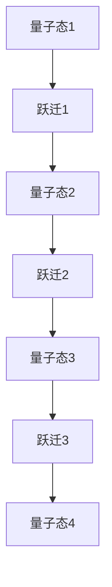

                 

# 莫尔斯理论与统计力学

## 关键词
- 莫尔斯理论
- 统计力学
- 量子系统
- 相变
- 熵
- 自由能

## 摘要
本文深入探讨了莫尔斯理论与统计力学的紧密联系及其在量子系统、相变和复杂系统中的应用。首先，我们介绍了莫尔斯理论的起源与发展，以及统计力学的基本概念。随后，详细阐述了莫尔斯图的核心概念、能量本征值与能级、莫尔斯不等式与莫尔斯下界。接着，我们探讨了统计力学的基本原理，包括系综理论与统计分布、熵与自由能、以及系综平均与热力学极限。在此基础上，我们展示了莫尔斯理论与统计力学的数学工具，包括线性代数与矩阵论、傅里叶变换与拉普拉斯变换、以及微分方程与偏微分方程。然后，我们介绍了莫尔斯图与量子系统的应用，包括量子态的统计分布、莫尔斯定理在量子系统中的应用、以及统计力学在莫尔斯图分析中的运用。最后，我们探讨了莫尔斯理论与统计力学在相变与临界现象中的应用，以及其在生物系统、材料科学和工程领域的实际应用。本文还展望了莫尔斯理论的拓展与应用、统计力学的新进展，以及莫尔斯理论与统计力学在控制论、金融经济学和人工智能中的应用。

### 第一部分：莫尔斯理论与统计力学基础

## 第1章：莫尔斯理论与统计力学概述

### 1.1 莫尔斯理论的起源与发展

#### 1.1.1 莫尔斯理论的诞生背景

莫尔斯理论，作为一种重要的量子系统分析方法，起源于19世纪末至20世纪初的物理学发展。当时，物理学界正处于量子力学和统计力学的兴起阶段。量子力学揭示了微观世界的独特性质，而统计力学则致力于研究大量粒子集合的整体行为。莫尔斯理论正是在这一背景下诞生的。

#### 1.1.2 莫尔斯理论的演变过程

莫尔斯理论的核心思想可以追溯到1920年代，当时物理学家沃尔夫冈·泡利（Wolfgang Pauli）提出了能级量子化的概念。随着量子力学的发展，莫尔斯图（Morse potential）的概念逐渐形成，并于1930年代由雷蒙德·莫尔斯（Raymond Morse）正式提出。

莫尔斯图最初用于描述分子振动能级，其数学形式为：
$$ V(x) = D_e \left(1 - \cos(\sqrt{\frac{2m\omega^2}{D_e} x}\right) $$
其中，\( D_e \) 是转动能级之间的间隔，\( m \) 是振子的质量，\( \omega \) 是振动频率。

#### 1.1.3 莫尔斯理论的重要性

莫尔斯理论在物理学中的地位不可忽视。它不仅为量子系统提供了直观的分析工具，而且在固体物理学、量子化学和凝聚态物理等领域有着广泛的应用。莫尔斯理论的重要性还体现在其对量子态稳定性分析、相变现象研究以及量子系统控制等方面的贡献。

### 1.2 统计力学的基本概念

#### 1.2.1 系综理论与统计分布

系综理论是统计力学的基础之一，它描述了系统的多种可能状态及其概率分布。在量子统计力学中，系综理论被用来处理大量粒子集合的整体行为。

量子统计分布描述了量子系统在不同状态下的概率分布。常见的量子统计分布包括费米-狄拉克分布和玻色-爱因斯坦分布。费米-狄拉克分布适用于费米子（如电子），而玻色-爱因斯坦分布适用于玻色子（如光子）。

#### 1.2.2 熵与自由能

熵是统计力学中描述系统无序程度的量度，其数学定义如下：
$$ S = -k_B \sum_i P_i \ln P_i $$
其中，\( P_i \) 是系统处于第 \( i \) 个状态的概率，\( k_B \) 是玻尔兹曼常数。

自由能是系统在一定温度下的稳定性度量，其定义如下：
$$ F = U - TS $$
其中，\( U \) 是系统的内能，\( T \) 是系统的温度，\( S \) 是系统的熵。

#### 1.2.3 系综平均与热力学极限

系综平均是指通过对系统所有可能状态进行加权平均来计算某一物理量的期望值。热力学极限则是指在系统规模无限增大的情况下，研究其宏观行为的极限过程。

在量子统计力学中，系综平均可以通过量子态的统计分布来计算。热力学极限则要求在计算过程中忽略系统内部的微观细节，只关注其宏观行为。

### 1.3 莫尔斯理论与统计力学的联系

#### 1.3.1 莫尔斯图与统计分布的关系

莫尔斯图在统计力学中的应用主要体现在描述系统能级分布和量子态统计分布。通过莫尔斯图，可以直观地观察到系统的能级结构及其随参数变化的规律。

莫尔斯图与量子态统计分布之间存在紧密的联系。例如，在研究量子态的相变时，可以通过莫尔斯图分析系统在不同温度下的相变行为。

#### 1.3.2 莫尔斯理论在统计力学中的应用

莫尔斯理论在统计力学中的应用主要体现在以下几个方面：

1. **能级分析**：莫尔斯图可以用于分析系统的能级分布和量子态结构，从而理解系统的物理性质。

2. **相变研究**：莫尔斯定理提供了分析系统相变行为的工具，可以预测系统的相变温度和临界指数。

3. **量子态操纵**：通过莫尔斯理论，可以实现对量子态的精确操纵和调控，从而实现量子信息的处理和传输。

#### 1.3.3 统计力学对莫尔斯理论的贡献

统计力学对莫尔斯理论的贡献主要体现在以下几个方面：

1. **数学工具**：统计力学提供了丰富的数学工具，如线性代数、傅里叶变换和拉普拉斯变换等，用于分析莫尔斯图和量子态分布。

2. **相变理论**：统计力学中的相变理论为理解莫尔斯理论在相变现象中的应用提供了理论基础。

3. **量子场论**：统计力学与量子场论的交叉研究为莫尔斯理论在高能物理和凝聚态物理中的应用提供了新的视角。

### 第2章：莫尔斯理论的核心概念

#### 2.1 莫尔斯图的定义与特性

莫尔斯图是描述量子系统能级分布和量子态结构的一种图示方法。它通过将系统的能级表示为节点，将能级之间的跃迁关系表示为边，从而直观地展示了系统的能级结构和动力学行为。

**莫尔斯图的定义：**
莫尔斯图是一个有向图，其中每个节点代表一个能量本征值，每个边代表两个能量本征值之间的跃迁关系。

**莫尔斯图的特性：**
1. **能级表示**：莫尔斯图中的节点表示系统的能级，通常用能量本征值来标记。
2. **跃迁关系**：莫尔斯图中的边表示系统在不同能级之间的跃迁关系，通常用能量差来标记。
3. **稳定性分析**：通过分析莫尔斯图中的节点和边，可以判断系统的稳定性和动力学行为。

#### 2.2 能量本征值与能级

能量本征值是量子系统中的一个重要概念，它描述了系统在不同状态下的能量。在莫尔斯图中，能量本征值通常表示为节点的标记。

**能量本征值的定义：**
能量本征值是量子系统中的一个常数，它表示系统处于特定状态时的能量。

**能量本征值的性质：**
1. **离散性**：能量本征值通常是离散的，这意味着系统只能处于特定的能量状态。
2. **非负性**：能量本征值总是非负的，即系统的能量不能为负。
3. **完备性**：系统的所有能量本征值构成了其能量谱。

**能级的定义：**
能级是量子系统中的能量本征值的集合，它描述了系统在不同状态下的能量分布。

**能级的性质：**
1. **离散性**：能级通常是离散的，这意味着系统能量只能处于特定的能级。
2. **非负性**：能级总是非负的，即系统的能量不能为负。
3. **完备性**：系统的所有能级构成了其能级谱。

#### 2.3 莫尔斯不等式与莫尔斯下界

莫尔斯不等式是莫尔斯理论中的一个重要结果，它描述了能量本征值之间的最小距离。莫尔斯下界则给出了能量本征值的最小可能间隔。

**莫尔斯不等式的定义：**
莫尔斯不等式是描述能量本征值之间最小距离的一个不等式，它通常表示为：
$$ \Delta E_{\min} = \min_{i, j} |E_i - E_j| $$
其中，\( E_i \) 和 \( E_j \) 是相邻的能量本征值。

**莫尔斯不等式的性质：**
1. **非负性**：莫尔斯不等式中的最小距离总是非负的，即相邻能量本征值之间的最小距离不能为负。
2. **单调性**：如果系统的参数发生变化，莫尔斯不等式中的最小距离也会随之变化，但总是保持非负性。
3. **稳定性**：莫尔斯不等式提供了一个判断系统能量本征值稳定性的标准，即如果最小距离较大，则系统能量本征值较为稳定。

**莫尔斯下界的定义：**
莫尔斯下界是能量本征值之间最小可能间隔的一个下界，它通常表示为：
$$ \Delta E_{\min} \geq \frac{1}{2} |E_i - E_j| $$
其中，\( E_i \) 和 \( E_j \) 是相邻的能量本征值。

**莫尔斯下界的性质：**
1. **非负性**：莫尔斯下界总是非负的，即能量本征值之间的最小可能间隔不能为负。
2. **紧性**：莫尔斯下界提供了一个判断系统能量本征值之间距离是否足够紧的标准，即如果最小距离小于莫尔斯下界，则系统可能存在严重的能量级重叠问题。
3. **稳定性**：莫尔斯下界提供了一个判断系统能量本征值稳定性的标准，即如果最小距离大于莫尔斯下界，则系统能量本征值较为稳定。

### 第3章：统计力学的基本原理

#### 3.1 系综理论与统计分布

**3.1.1 系综的概念**

系综理论是统计力学中用于描述大量粒子集合整体行为的一种理论方法。在量子统计力学中，系综理论被用来处理大量粒子的量子态分布和宏观性质。

**系综的定义：**

系综是一组具有相同宏观性质但微观状态不同的系统的集合。在量子统计力学中，系综通常是一个量子态的集合。

**系综的性质：**

1. **随机性**：系综中的每个系统都是随机的，即它们的微观状态是随机的。
2. **一致性**：系综中的系统在宏观尺度上具有相同的性质，即它们的宏观物理量（如能量、压强、熵等）是相同的。
3. **可加性**：系综中的系统可以合并，即多个系统的集合可以合并为一个更大的系统。

**3.1.2 量子统计分布**

量子统计分布描述了量子系统在不同状态下的概率分布。在量子统计力学中，常见的量子统计分布包括费米-狄拉克分布和玻色-爱因斯坦分布。

**费米-狄拉克分布的定义：**

费米-狄拉克分布是描述费米子（如电子）在量子态上的分布，其概率分布函数为：

$$ P_i = \frac{1}{Z} \frac{1}{e^{(\beta \epsilon_i) - 1}} $$

其中，\( P_i \) 是系统处于第 \( i \) 个状态的概率，\( Z \) 是配分函数，\( \beta = \frac{1}{k_B T} \) 是温度的倒数，\( k_B \) 是玻尔兹曼常数，\( \epsilon_i \) 是第 \( i \) 个状态的能量。

**玻色-爱因斯坦分布的定义：**

玻色-爱因斯坦分布是描述玻色子（如光子）在量子态上的分布，其概率分布函数为：

$$ P_i = \frac{1}{Z} e^{-\beta \epsilon_i} $$

其中，\( P_i \) 是系统处于第 \( i \) 个状态的概率，\( Z \) 是配分函数，\( \beta = \frac{1}{k_B T} \) 是温度的倒数，\( k_B \) 是玻尔兹曼常数，\( \epsilon_i \) 是第 \( i \) 个状态的能量。

**3.1.3 系综平均**

系综平均是统计力学中用于计算宏观物理量的方法。它通过对系综中所有状态的加权平均来计算某一物理量的期望值。

**系综平均的定义：**

系综平均是通过对系综中所有状态的加权平均来计算某一物理量的期望值。其数学表达式为：

$$ \langle \psi \rangle = \sum_i P_i \psi_i $$

其中，\( \langle \psi \rangle \) 是系综平均，\( P_i \) 是系统处于第 \( i \) 个状态的概率，\( \psi_i \) 是第 \( i \) 个状态的物理量。

**3.1.4 热力学极限**

热力学极限是指系统规模无限增大的情况下，研究其宏观行为的极限过程。在量子统计力学中，热力学极限通常是指在粒子数趋于无穷大的情况下，研究系统的宏观性质。

**热力学极限的定义：**

热力学极限是指系统规模无限增大的情况下，研究其宏观行为的极限过程。其数学表达式为：

$$ \lim_{N \to \infty} \frac{1}{N} \sum_{i=1}^{N} \psi_i $$

其中，\( N \) 是系统中的粒子数，\( \psi_i \) 是第 \( i \) 个状态的物理量。

### 第4章：莫尔斯理论与统计力学的数学工具

**4.1 线性代数与矩阵论**

线性代数与矩阵论是莫尔斯理论与统计力学中重要的数学工具，它们在描述系统的能级结构和量子态分布中起着关键作用。

**4.1.1 矩阵的运算**

矩阵是线性代数中的基本对象，其运算包括加法、减法、乘法以及转置等。

**矩阵的加法与减法：**

两个矩阵相加或相减时，要求它们的维度相同。其运算规则为对应元素的加法或减法。

$$ A + B = \begin{bmatrix} a_{11} + b_{11} & a_{12} + b_{12} \\ a_{21} + b_{21} & a_{22} + b_{22} \end{bmatrix} $$
$$ A - B = \begin{bmatrix} a_{11} - b_{11} & a_{12} - b_{12} \\ a_{21} - b_{21} & a_{22} - b_{22} \end{bmatrix} $$

**矩阵的乘法：**

两个矩阵相乘时，要求第一个矩阵的列数等于第二个矩阵的行数。其运算规则为对应行的元素与对应列的元素的乘积之和。

$$ AB = \begin{bmatrix} a_{11}b_{11} + a_{12}b_{21} & a_{11}b_{12} + a_{12}b_{22} \\ a_{21}b_{11} + a_{22}b_{21} & a_{21}b_{12} + a_{22}b_{22} \end{bmatrix} $$

**矩阵的转置：**

矩阵的转置是将矩阵的行和列互换得到的矩阵。其运算规则为对应元素的互换。

$$ A^T = \begin{bmatrix} a_{11} & a_{21} \\ a_{12} & a_{22} \end{bmatrix} $$

**4.1.2 特征值与特征向量**

特征值与特征向量是矩阵论中的重要概念，它们描述了矩阵的性质和结构。

**特征值与特征向量的定义：**

设 \( A \) 是一个 \( n \times n \) 的矩阵，如果存在一个非零向量 \( \vec{v} \) 和一个标量 \( \lambda \)，使得 \( A\vec{v} = \lambda\vec{v} \)，则 \( \lambda \) 称为 \( A \) 的特征值，\( \vec{v} \) 称为 \( A \) 对应于特征值 \( \lambda \) 的特征向量。

**特征值与特征向量的性质：**

1. **唯一性**：一个矩阵的特征值是唯一的，且每个特征值对应的特征向量也是唯一的。
2. **线性无关性**：特征向量是线性无关的，即它们之间不会存在线性组合等于零的情况。
3. **正交性**：对于可逆矩阵，其特征向量是正交的，即 \( \vec{v}_i^T\vec{v}_j = 0 \) 当 \( i \neq j \)。

**4.1.3 线性变换**

线性变换是线性代数中的另一个重要概念，它描述了线性系统的变化规律。

**线性变换的定义：**

线性变换是一个将向量空间中的每个向量映射到另一个向量空间中的函数。设 \( V \) 和 \( W \) 是两个向量空间，\( T: V \to W \) 是一个线性变换，如果对于 \( V \) 中的任意两个向量 \( \vec{v}_1 \) 和 \( \vec{v}_2 \)，以及任意标量 \( a \)，有：

$$ T(a\vec{v}_1 + b\vec{v}_2) = aT(\vec{v}_1) + bT(\vec{v}_2) $$

**线性变换的性质：**

1. **保线性**：线性变换保持向量的线性组合。
2. **保向量**：线性变换保持零向量的性质。
3. **保基**：线性变换保持基向量的性质。

**4.2 傅里叶变换与拉普拉斯变换**

傅里叶变换与拉普拉斯变换是莫尔斯理论与统计力学中的另一个重要数学工具，它们在描述量子态的统计分布和系统的热力学性质中起着关键作用。

**4.2.1 傅里叶变换**

傅里叶变换是一种将时域函数转换为频域函数的数学变换，它在量子力学和统计力学中有着广泛的应用。

**傅里叶变换的定义：**

设 \( f(t) \) 是一个时域函数，其傅里叶变换定义为：

$$ F(\omega) = \int_{-\infty}^{\infty} f(t)e^{-i\omega t}dt $$

其中，\( \omega \) 是频率变量，\( F(\omega) \) 是频域函数。

**傅里叶变换的性质：**

1. **线性性**：傅里叶变换是线性的，即对于任意两个时域函数 \( f_1(t) \) 和 \( f_2(t) \)，以及任意标量 \( a \) 和 \( b \)，有：

$$ F(a f_1(t) + b f_2(t)) = a F(f_1(t)) + b F(f_2(t)) $$

2. **对称性**：傅里叶变换具有对称性，即：

$$ F(-\omega) = F^*(\omega) $$

其中，\( F^*(\omega) \) 是 \( F(\omega) \) 的复共轭。

3. **卷积定理**：傅里叶变换具有卷积定理，即：

$$ F(f_1 * f_2) = F(f_1) \cdot F(f_2) $$

其中，\( f_1 * f_2 \) 是 \( f_1 \) 和 \( f_2 \) 的卷积。

**4.2.2 拉普拉斯变换**

拉普拉斯变换是一种将时域函数转换为复平面上的函数的数学变换，它在量子统计力学和热力学中有着重要的应用。

**拉普拉斯变换的定义：**

设 \( f(t) \) 是一个时域函数，其拉普拉斯变换定义为：

$$ F(s) = \int_{0}^{\infty} f(t)e^{-st}dt $$

其中，\( s \) 是复数变量，\( F(s) \) 是复平面上的函数。

**拉普拉斯变换的性质：**

1. **线性性**：拉普拉斯变换是线性的，即对于任意两个时域函数 \( f_1(t) \) 和 \( f_2(t) \)，以及任意标量 \( a \) 和 \( b \)，有：

$$ F(a f_1(t) + b f_2(t)) = a F(f_1(t)) + b F(f_2(t)) $$

2. **移位定理**：拉普拉斯变换具有移位定理，即：

$$ F(e^{at} f(t)) = F(s-a) $$

3. **微分定理**：拉普拉斯变换具有微分定理，即：

$$ \frac{d^n}{dt^n} f(t) = s^n F(s) - \sum_{k=0}^{n-1} s^{n-k-1} f^{(k)}(0) $$

其中，\( f^{(k)}(0) \) 是 \( f(t) \) 在 \( t=0 \) 处的第 \( k \) 阶导数。

4. **卷积定理**：拉普拉斯变换具有卷积定理，即：

$$ F(f_1 * f_2) = F(f_1) \cdot F(f_2) $$

**4.3 微分方程与偏微分方程**

微分方程与偏微分方程是莫尔斯理论与统计力学中描述系统动态行为的重要数学工具。

**4.3.1 微分方程**

微分方程是描述函数及其导数之间关系的方程。在莫尔斯理论与统计力学中，微分方程常用于描述量子系统的演化规律和统计分布。

**微分方程的定义：**

微分方程是包含函数及其导数的方程。一般形式为：

$$ F(x, y, y', y'', \ldots) = 0 $$

其中，\( x \) 是自变量，\( y \) 是因变量，\( y' \), \( y'' \), \(\ldots \) 是因变量的导数。

**微分方程的类型：**

1. **常微分方程**：自变量和导数是常数的微分方程。
2. **偏微分方程**：自变量和导数是变量的微分方程。

**4.3.2 偏微分方程**

偏微分方程是描述多个变量及其偏导数之间关系的方程。在莫尔斯理论与统计力学中，偏微分方程常用于描述量子系统的多体相互作用和统计分布。

**偏微分方程的定义：**

偏微分方程是包含多个变量及其偏导数的方程。一般形式为：

$$ F(x, y, \frac{\partial y}{\partial x}, \frac{\partial^2 y}{\partial x^2}, \ldots) = 0 $$

其中，\( x \) 是自变量，\( y \) 是因变量，\( \frac{\partial y}{\partial x} \), \( \frac{\partial^2 y}{\partial x^2} \), \(\ldots \) 是因变量的偏导数。

**偏微分方程的类型：**

1. **偏微分方程的线性性**：如果偏微分方程中所有项都是线性的，则该偏微分方程是线性的。
2. **偏微分方程的奇偶性**：如果偏微分方程中的所有项都是偶函数或奇函数，则该偏微分方程是奇偶性的。
3. **偏微分方程的分类**：根据自变量和导数的性质，偏微分方程可以分为多种类型，如波动方程、热传导方程、薛定谔方程等。

### 第5章：莫尔斯图与量子系统

#### 5.1 莫尔斯图在量子系统中的应用

莫尔斯图是量子系统分析中的重要工具，它通过描述系统的能级结构和跃迁关系，为研究量子态的分布和系统的稳定性提供了直观的方法。

**5.1.1 莫尔斯图在量子力学中的描述**

在量子力学中，莫尔斯图用于描述量子系统的能级结构和跃迁关系。一个典型的莫尔斯图包括一组能量本征值和一组跃迁边，其中每个能量本征值对应一个节点，每个跃迁边对应两个能级之间的跃迁。

**莫尔斯图的绘制方法：**

1. **确定能量本征值**：首先，通过求解量子系统的哈密顿量方程，得到系统的能量本征值。

2. **绘制节点**：将每个能量本征值标记为一个节点。

3. **确定跃迁关系**：通过计算系统能级之间的跃迁矩阵元，确定每个能量本征值之间的跃迁关系。

4. **绘制边**：将每个能量本征值之间的跃迁关系用边连接起来，边的长度表示跃迁的概率。

**5.1.2 莫尔斯图在量子场论中的应用**

在量子场论中，莫尔斯图也被广泛应用于描述量子态的分布和系统的稳定性。量子场论中的莫尔斯图通常包括一组能量本征值和一组相互作用边，其中每个能量本征值对应一个节点，每个相互作用边对应两个能级之间的相互作用。

**莫尔斯图的绘制方法：**

1. **确定能量本征值**：通过求解量子场论的哈密顿量方程，得到系统的能量本征值。

2. **绘制节点**：将每个能量本征值标记为一个节点。

3. **确定相互作用关系**：通过计算系统能级之间的相互作用矩阵元，确定每个能量本征值之间的相互作用关系。

4. **绘制边**：将每个能量本征值之间的相互作用关系用边连接起来，边的长度表示相互作用的大小。

**5.1.3 量子态的统计分布**

量子态的统计分布是量子系统分析中的另一个重要问题。莫尔斯图在量子态的统计分布分析中起到了关键作用，它通过描述系统能级结构和跃迁关系，为研究量子态的分布提供了直观的方法。

**量子态统计分布的计算方法：**

1. **确定能级分布**：通过莫尔斯图，确定系统的能级分布。

2. **计算能级概率**：根据量子态的统计分布定律，计算每个能级的概率。

3. **绘制概率分布图**：将每个能级的概率用柱状图或线状图表示，形成量子态的统计分布图。

**5.1.4 莫尔斯定理在量子系统中的应用**

莫尔斯定理是量子系统分析中的重要定理，它通过描述系统能级之间的跃迁关系，为研究量子态的稳定性和演化提供了直观的方法。

**莫尔斯定理的定义：**

莫尔斯定理描述了量子系统中相邻能级之间的跃迁概率。具体来说，它指出，如果一个量子系统能级的相邻本征值之间的跃迁矩阵元不为零，则该跃迁是允许的。

**莫尔斯定理的应用：**

1. **能级稳定性分析**：通过莫尔斯定理，可以判断量子系统能级的稳定性。如果莫尔斯定理的跃迁矩阵元不为零，则系统能级不稳定。

2. **量子态演化分析**：通过莫尔斯定理，可以分析量子态的演化过程。例如，可以预测量子态在不同时间点的演化行为。

**5.1.5 莫尔斯图与统计力学的关联**

莫尔斯图与统计力学有着紧密的联系，它不仅用于描述量子系统的能级结构和跃迁关系，还为研究量子系统的统计分布提供了直观的方法。

**关联分析：**

1. **能量分布与统计分布**：莫尔斯图描述了量子系统的能量分布，而统计力学描述了量子系统的统计分布。通过将莫尔斯图与统计力学相结合，可以研究量子系统的热力学性质。

2. **相变与临界现象**：莫尔斯图在描述相变和临界现象中起到了关键作用。通过分析莫尔斯图的形态，可以预测量子系统在不同温度下的相变行为。

3. **量子态操纵与调控**：莫尔斯图提供了对量子态的直观描述，为量子态的操纵和调控提供了理论基础。例如，可以通过调整莫尔斯图中的参数，实现量子态的精确操纵。

### 第6章：统计力学中的相变与临界现象

#### 6.1 相变的基本概念

相变是物质在温度、压力等外部条件变化时，从一种状态转变为另一种状态的现象。在统计力学中，相变被视为系统宏观性质（如体积、压强、能量等）随外部条件变化而发生突变的过程。

**6.1.1 相变的定义**

相变是指系统从一个宏观物理状态转变为另一个宏观物理状态的过程。在这个过程中，系统的内部结构、对称性、热力学性质等会发生显著变化。

**6.1.2 相变的分类**

根据相变过程中系统行为的特征，相变可以分为以下几类：

1. **一级相变**：在一级相变中，系统的熵发生变化，但系统的自由能不变。常见的例子包括水的冰融化、汽化等。

2. **二级相变**：在二级相变中，系统的自由能发生变化，但系统的熵不变。常见的例子包括超导相变、超流相变等。

3. **连续相变**：在连续相变中，系统的熵和自由能都发生变化，但变化过程是连续的。常见的例子包括铁磁相变、反铁磁相变等。

4. **量子相变**：在量子相变中，系统的行为受到量子力学规律的限制，其相变过程具有量子特性。常见的例子包括量子霍尔相变、量子临界现象等。

#### 6.2 临界现象的理论框架

临界现象是指系统在接近相变点时，其宏观性质发生显著变化的现象。临界现象的理论框架主要包括临界指数定律、临界相变模型和临界现象的数学描述。

**6.2.1 临界指数定律**

临界指数定律描述了系统在临界点附近的行为特征。具体来说，临界指数定律指出，系统在临界点附近的某些物理量（如磁化率、扩散系数等）会遵循以下形式：

$$ \phi \sim |t - t_c|^{-\nu} $$

其中，\( \phi \) 是物理量的值，\( t \) 是温度或外部参数，\( t_c \) 是临界温度或临界参数，\( \nu \) 是临界指数。

**6.2.2 临界相变模型**

临界相变模型是描述系统在临界点附近行为的数学模型。常见的临界相变模型包括Ising模型、Heisenberg模型、XY模型等。

1. **Ising模型**：Ising模型是一种简并的量子模型，描述了磁性材料中的自旋相互作用。Ising模型中，每个自旋可以取两个状态（+1或-1），其临界指数为 \( \nu = 1 \) 和 \( \eta = 1/2 \)。

2. **Heisenberg模型**：Heisenberg模型是一种量子模型，描述了磁性材料中的自旋相互作用。Heisenberg模型中，每个自旋可以取任意角度，其临界指数为 \( \nu = 1 \) 和 \( \eta = 1 \)。

3. **XY模型**：XY模型是一种量子模型，描述了磁性材料中的自旋相互作用。XY模型中，每个自旋可以取任意角度，其临界指数为 \( \nu = 1 \) 和 \( \eta = 1 \)。

**6.2.3 临界现象的数学描述**

临界现象的数学描述主要通过以下公式实现：

$$ \lim_{t \to t_c} \frac{\partial^2 \langle \psi \rangle}{\partial t^2} = 0 $$

其中，\( \langle \psi \rangle \) 是物理量的平均值，\( t_c \) 是临界温度。

#### 6.3 莫尔斯理论与临界现象的关联

莫尔斯理论与临界现象有着紧密的联系，它为研究系统的相变和临界行为提供了直观的方法。

**6.3.1 莫尔斯图与临界现象的关系**

莫尔斯图在描述系统的临界行为中起到了关键作用。具体来说，莫尔斯图可以直观地展示系统在临界点附近的行为特征。

1. **临界点与莫尔斯点**：在莫尔斯图中，临界点通常对应着莫尔斯点的出现。临界点是指系统在相变过程中，物理量发生突变的点。

2. **临界行为与莫尔斯图**：莫尔斯图可以描述系统在临界点附近的行为特征，如临界指数、临界指数定律等。

**6.3.2 莫尔斯理论在临界现象研究中的应用**

莫尔斯理论在临界现象研究中有着广泛的应用，它为研究系统的相变和临界行为提供了直观的方法。

1. **相变分析**：通过莫尔斯图，可以直观地分析系统的相变行为。例如，可以判断系统是否处于相变点、相变类型等。

2. **临界现象研究**：通过莫尔斯图，可以研究系统的临界现象，如临界指数、临界指数定律、临界行为等。

3. **相变模型**：莫尔斯理论可以应用于各种相变模型，如Ising模型、Heisenberg模型、XY模型等，为研究相变提供直观的方法。

### 第7章：莫尔斯理论与统计力学的应用实例

#### 7.1 生物系统的莫尔斯理论应用

莫尔斯理论在生物系统中有着广泛的应用，它为研究生物系统的相变和临界现象提供了直观的方法。

**7.1.1 生物系统的相变**

生物系统的相变是指生物系统在不同条件下，从一种宏观状态转变为另一种宏观状态的过程。常见的生物系统相变包括细胞分裂、蛋白质折叠等。

**7.1.2 莫尔斯理论在生物系统中的应用**

莫尔斯理论在生物系统中的应用主要体现在以下几个方面：

1. **细胞分裂的莫尔斯图分析**：通过莫尔斯图，可以直观地分析细胞分裂过程中的相变行为。例如，可以判断细胞分裂的临界点、相变类型等。

2. **蛋白质折叠的莫尔斯图分析**：通过莫尔斯图，可以直观地分析蛋白质折叠过程中的相变行为。例如，可以判断蛋白质折叠的临界点、相变类型等。

**7.1.3 莫尔斯理论与生物系统的关联**

莫尔斯理论与生物系统的关联主要体现在以下几个方面：

1. **相变与生物系统**：莫尔斯理论可以用于研究生物系统的相变现象，如细胞分裂、蛋白质折叠等。

2. **临界现象与生物系统**：莫尔斯理论可以用于研究生物系统的临界现象，如临界指数、临界指数定律等。

3. **生物系统的控制**：莫尔斯理论可以用于生物系统的控制，如细胞分裂的调控、蛋白质折叠的调控等。

#### 7.2 材料科学的统计力学应用

统计力学在材料科学中有着广泛的应用，它为研究材料系统的相变和临界现象提供了直观的方法。

**7.2.1 材料科学的相变**

材料科学的相变是指材料系统在不同条件下，从一种宏观状态转变为另一种宏观状态的过程。常见的材料科学相变包括金属熔化、晶体生长等。

**7.2.2 统计力学在材料科学中的应用**

统计力学在材料科学中的应用主要体现在以下几个方面：

1. **金属熔化的统计力学分析**：通过统计力学方法，可以分析金属熔化过程中的相变行为。例如，可以判断金属熔化的临界点、相变类型等。

2. **晶体生长的统计力学分析**：通过统计力学方法，可以分析晶体生长过程中的相变行为。例如，可以判断晶体生长的临界点、相变类型等。

**7.2.3 莫尔斯理论在材料科学中的应用**

莫尔斯理论在材料科学中的应用主要体现在以下几个方面：

1. **金属熔化的莫尔斯图分析**：通过莫尔斯图，可以直观地分析金属熔化过程中的相变行为。例如，可以判断金属熔化的临界点、相变类型等。

2. **晶体生长的莫尔斯图分析**：通过莫尔斯图，可以直观地分析晶体生长过程中的相变行为。例如，可以判断晶体生长的临界点、相变类型等。

**7.2.4 莫尔斯理论与材料科学的关联**

莫尔斯理论与材料科学的关联主要体现在以下几个方面：

1. **相变与材料科学**：莫尔斯理论可以用于研究材料系统的相变现象，如金属熔化、晶体生长等。

2. **临界现象与材料科学**：莫尔斯理论可以用于研究材料系统的临界现象，如临界指数、临界指数定律等。

3. **材料科学的控制**：莫尔斯理论可以用于材料系统的控制，如金属熔化的控制、晶体生长的控制等。

#### 7.3 莫尔斯理论与统计力学在工程领域的应用

莫尔斯理论与统计力学在工程领域有着广泛的应用，它为研究工程系统的相变和临界现象提供了直观的方法。

**7.3.1 工程领域的相变**

工程领域的相变是指工程系统在不同条件下，从一种宏观状态转变为另一种宏观状态的过程。常见的工程领域相变包括材料疲劳、结构变形等。

**7.3.2 莫尔斯理论在工程领域的应用**

莫尔斯理论在工程领域的应用主要体现在以下几个方面：

1. **材料疲劳的莫尔斯图分析**：通过莫尔斯图，可以直观地分析材料疲劳过程中的相变行为。例如，可以判断材料疲劳的临界点、相变类型等。

2. **结构变形的莫尔斯图分析**：通过莫尔斯图，可以直观地分析结构变形过程中的相变行为。例如，可以判断结构变形的临界点、相变类型等。

**7.3.3 统计力学在工程领域的应用**

统计力学在工程领域的应用主要体现在以下几个方面：

1. **材料疲劳的统计力学分析**：通过统计力学方法，可以分析材料疲劳过程中的相变行为。例如，可以判断材料疲劳的临界点、相变类型等。

2. **结构变形的统计力学分析**：通过统计力学方法，可以分析结构变形过程中的相变行为。例如，可以判断结构变形的临界点、相变类型等。

**7.3.4 莫尔斯理论与统计力学的关联**

莫尔斯理论与统计力学的关联主要体现在以下几个方面：

1. **相变与工程领域**：莫尔斯理论可以用于研究工程系统的相变现象，如材料疲劳、结构变形等。

2. **临界现象与工程领域**：莫尔斯理论可以用于研究工程系统的临界现象，如临界指数、临界指数定律等。

3. **工程领域的控制**：莫尔斯理论可以用于工程系统的控制，如材料疲劳的控制、结构变形的控制等。

### 第8章：莫尔斯理论的拓展与应用

#### 8.1 高维莫尔斯图

在量子系统和统计力学中，高维莫尔斯图是一种重要的分析工具，它用于描述具有多个自由度的量子系统的能级结构和跃迁关系。

**8.1.1 高维莫尔斯图的定义**

高维莫尔斯图是用于描述具有多个自由度的量子系统的能级结构和跃迁关系的图示方法。在二维空间中，高维莫尔斯图通常包括多个节点和边，每个节点代表一个能量本征值，每个边代表两个能量本征值之间的跃迁关系。

**8.1.2 高维莫尔斯图的应用**

高维莫尔斯图在量子系统和统计力学中的应用主要体现在以下几个方面：

1. **能级分析**：高维莫尔斯图可以用于分析量子系统的能级结构和跃迁关系，从而理解系统的物理性质。

2. **相变研究**：高维莫尔斯图可以用于研究量子系统的相变行为，包括相变的临界点、临界指数等。

3. **量子态操纵**：高维莫尔斯图可以用于量子态的操纵和调控，从而实现量子信息的处理和传输。

**8.1.3 高维莫尔斯图的特点**

高维莫尔斯图具有以下特点：

1. **复杂性**：高维莫尔斯图的复杂程度高于一维莫尔斯图，因为它需要考虑多个自由度的相互作用。

2. **多样性**：高维莫尔斯图可以描述多种类型的相变行为，包括一级相变、二级相变等。

3. **稳定性**：高维莫尔斯图可以提供对量子系统能级稳定性的更全面的分析。

#### 8.2 莫尔斯理论与量子场论

量子场论是研究量子场及其相互作用的物理学分支。莫尔斯理论在量子场论中有着重要的应用，它为研究量子场论中的相变和临界现象提供了直观的方法。

**8.2.1 莫尔斯图在量子场论中的描述**

在量子场论中，莫尔斯图用于描述量子场论中的能级结构和跃迁关系。莫尔斯图的节点代表能量本征值，边代表两个能量本征值之间的跃迁关系。通过莫尔斯图，可以直观地观察量子场论中的相变行为和临界现象。

**8.2.2 莫尔斯定理在量子场论中的应用**

莫尔斯定理在量子场论中的应用主要体现在以下几个方面：

1. **能级稳定性分析**：莫尔斯定理可以用于分析量子场论中的能级稳定性，从而判断系统能级的稳定性。

2. **相变点分析**：莫尔斯定理可以用于确定量子场论中的相变点，包括一级相变和二级相变。

3. **量子场论的控制**：莫尔斯定理可以用于量子场论中的控制，从而实现量子态的操纵和调控。

**8.2.3 莫尔斯理论与量子场论的关联**

莫尔斯理论与量子场论的关联主要体现在以下几个方面：

1. **相变与量子场论**：莫尔斯理论可以用于研究量子场论中的相变现象，包括量子场论的临界现象。

2. **量子场论的控制**：莫尔斯理论可以用于量子场论中的控制，从而实现量子信息的处理和传输。

3. **量子场论的拓展**：莫尔斯理论为量子场论的研究提供了新的视角，有助于拓展量子场论的理论框架。

#### 8.3 莫尔斯理论的现代进展

随着科学技术的发展，莫尔斯理论在量子系统和统计力学中的应用不断拓展。现代莫尔斯理论的研究主要集中在以下几个方面：

**8.3.1 莫尔斯理论的最新研究进展**

1. **高维莫尔斯图**：近年来，研究者对高维莫尔斯图的研究取得了显著进展，特别是在量子信息和量子计算领域。高维莫尔斯图被用于研究量子态的操纵和量子计算中的相变现象。

2. **量子场论的莫尔斯理论**：研究者开始将莫尔斯理论应用于量子场论的研究，探索量子场论中的相变和临界现象。

3. **统计力学的莫尔斯理论**：研究者对莫尔斯理论在统计力学中的应用进行了深入探讨，特别是在研究复杂系统的相变行为方面。

**8.3.2 莫尔斯理论的未来发展方向**

1. **高维莫尔斯图的应用**：未来研究将致力于探索高维莫尔斯图在量子信息和量子计算中的更广泛应用。

2. **量子场论的深入探讨**：研究者将继续深化对量子场论中莫尔斯理论的应用研究，为量子场论的发展提供新的理论框架。

3. **复杂系统的莫尔斯理论**：研究者将致力于将莫尔斯理论应用于复杂系统的相变研究，探索复杂系统中的临界现象。

### 第9章：统计力学的新进展

#### 9.1 高维统计力学

高维统计力学是统计力学中的一个重要分支，它研究具有多个自由度的复杂系统的统计性质。近年来，高维统计力学在材料科学、生物物理和金融经济学等领域取得了显著进展。

**9.1.1 高维统计力学的定义**

高维统计力学是研究具有多个自由度的复杂系统的统计性质的理论。在高维统计力学中，系统的状态被描述为高维空间中的点，系统的行为通过概率分布函数来描述。

**9.1.2 高维统计力学的应用**

高维统计力学在以下领域有着广泛的应用：

1. **材料科学**：高维统计力学被用于研究材料系统的相变行为、缺陷结构和电子输运性质。

2. **生物物理**：高维统计力学被用于研究生物大分子、细胞和生物组织的动力学行为。

3. **金融经济学**：高维统计力学被用于研究金融市场的波动性、资产价格变化和风险管理。

**9.1.3 高维统计力学的特点**

高维统计力学具有以下特点：

1. **复杂性**：高维统计力学研究的是具有多个自由度的复杂系统，其状态空间维度较高，导致系统行为的复杂性增加。

2. **多样性**：高维统计力学可以描述多种类型的相变行为，包括一级相变、二级相变和量子相变。

3. **适应性**：高维统计力学可以适应不同领域的需求，通过调整参数和模型，可以应用于不同的研究领域。

#### 9.2 复杂系统的统计力学

复杂系统是由大量相互作用的组件组成的系统，其行为通常无法通过简单的数学模型来描述。统计力学为研究复杂系统的行为提供了有力的工具。

**9.2.1 复杂系统的定义**

复杂系统是指由大量相互作用的组件组成的系统，其行为表现出整体性、多样性和非线性特征。复杂系统可以是物理的、生物的、社会的或经济系统。

**9.2.2 复杂系统的统计力学方法**

复杂系统的统计力学方法主要包括以下几种：

1. **系综理论**：系综理论用于描述复杂系统的概率分布，通过研究大量可能状态的平均行为来理解系统的宏观性质。

2. **概率图模型**：概率图模型用于描述复杂系统中的组件及其相互作用，通过分析概率分布来研究系统的行为。

3. **网络理论**：网络理论用于研究复杂系统中的组件及其相互作用的网络结构，通过分析网络的拓扑特性来理解系统的行为。

**9.2.3 复杂系统的统计力学应用**

复杂系统的统计力学方法在以下领域有着广泛的应用：

1. **社会系统**：统计力学被用于研究社会系统中的信息传播、社交网络和集体行为。

2. **生物系统**：统计力学被用于研究生物系统中的蛋白质折叠、细胞信号传导和生物大分子的相互作用。

3. **经济系统**：统计力学被用于研究经济系统中的市场波动、资产定价和风险管理。

#### 9.3 统计力学与量子计算

量子计算是量子力学与计算理论的结合，它利用量子比特的叠加态和纠缠态进行信息处理。统计力学为量子计算提供了重要的理论框架，特别是在研究量子态的统计分布和量子系统的相变行为方面。

**9.3.1 统计力学在量子计算中的角色**

统计力学在量子计算中的角色主要包括以下几个方面：

1. **量子态的统计分布**：统计力学用于描述量子系统的概率分布，为量子态的统计分布提供了理论基础。

2. **量子相变**：统计力学被用于研究量子系统的相变行为，包括量子态的跃迁和系统的临界现象。

3. **量子计算算法**：统计力学被用于设计量子计算算法，特别是量子模拟和量子优化算法。

**9.3.2 量子统计力学**

量子统计力学是研究量子系统统计性质的理论，它结合了量子力学和统计力学的原理。量子统计力学主要包括以下几种：

1. **费米-狄拉克统计**：费米-狄拉克统计用于描述费米子（如电子）的量子态分布。

2. **玻色-爱因斯坦统计**：玻色-爱因斯坦统计用于描述玻色子（如光子）的量子态分布。

3. **量子统计分布**：量子统计分布描述了量子系统在不同状态下的概率分布。

**9.3.3 量子统计力学与量子计算的结合**

量子统计力学与量子计算的结合主要体现在以下几个方面：

1. **量子态操纵**：量子统计力学用于研究量子态的操纵和调控，为量子计算中的量子态控制提供了理论基础。

2. **量子计算算法**：量子统计力学被用于设计量子计算算法，特别是量子模拟和量子优化算法。

3. **量子计算性能**：量子统计力学被用于评估量子计算的性能，包括量子态的统计分布和量子计算的相变行为。

### 第10章：莫尔斯理论与统计力学的交叉领域

#### 10.1 莫尔斯理论在控制论中的应用

莫尔斯理论在控制论中有着广泛的应用，它为研究控制系统的稳定性和动态行为提供了直观的方法。

**10.1.1 莫尔斯图在控制论中的描述**

在控制论中，莫尔斯图用于描述控制系统的能级结构和动态行为。莫尔斯图的节点代表系统的能级，边代表能级之间的跃迁关系。通过莫尔斯图，可以直观地观察控制系统的稳定性和动态行为。

**10.1.2 莫尔斯定理在控制论中的应用**

莫尔斯定理在控制论中的应用主要体现在以下几个方面：

1. **稳定性分析**：莫尔斯定理用于分析控制系统的稳定性，通过计算莫尔斯图中稳定点和不稳定点的特征值，可以判断系统的稳定性。

2. **动态行为分析**：莫尔斯定理用于分析控制系统的动态行为，通过观察莫尔斯图中能级的跃迁关系，可以预测系统的行为。

**10.1.3 莫尔斯理论在控制论中的发展**

莫尔斯理论在控制论中的发展主要体现在以下几个方面：

1. **非线性控制系统**：莫尔斯理论被用于研究非线性控制系统的稳定性和动态行为。

2. **自适应控制系统**：莫尔斯理论被用于设计自适应控制系统的稳定性和动态行为。

3. **量子控制系统**：莫尔斯理论被用于研究量子控制系统的稳定性和动态行为。

#### 10.2 统计力学在金融经济学中的应用

统计力学在金融经济学中有着广泛的应用，它为研究金融市场和经济的波动性提供了直观的方法。

**10.2.1 统计力学方法在金融经济学中的角色**

统计力学方法在金融经济学中的角色主要包括以下几个方面：

1. **资产定价**：统计力学方法被用于研究资产定价模型，包括有效市场假说和随机漫步模型。

2. **风险分析**：统计力学方法被用于研究金融市场的风险分析，包括波动性和风险价值的计算。

3. **金融网络**：统计力学方法被用于研究金融市场的网络结构和相互作用，包括网络拓扑特性和网络稳定性。

**10.2.2 金融经济学中的统计力学模型**

金融经济学中的统计力学模型主要包括以下几种：

1. **蒙特卡洛模拟**：蒙特卡洛模拟是一种基于统计力学方法的数值模拟技术，被用于研究金融市场的波动性和资产定价。

2. **随机游走模型**：随机游走模型是一种基于统计力学方法的金融模型，用于研究资产价格的变化规律。

3. **网络模型**：网络模型是一种基于统计力学方法的金融模型，用于研究金融市场的网络结构和相互作用。

**10.2.3 统计力学方法在金融经济学中的应用**

统计力学方法在金融经济学中的应用主要体现在以下几个方面：

1. **风险管理**：统计力学方法被用于研究金融风险管理，包括风险价值和波动性的计算。

2. **资产定价**：统计力学方法被用于研究资产定价模型，包括有效市场假说和随机漫步模型。

3. **金融网络分析**：统计力学方法被用于研究金融市场的网络结构和相互作用，包括网络拓扑特性和网络稳定性。

#### 10.3 莫尔斯理论与统计力学在人工智能中的应用

莫尔斯理论与统计力学在人工智能领域有着广泛的应用，它为研究人工智能系统的稳定性和动态行为提供了直观的方法。

**10.3.1 莫尔斯图在人工智能中的应用**

在人工智能中，莫尔斯图用于描述神经网络和机器学习算法的能级结构和动态行为。莫尔斯图的节点代表系统能级，边代表能级之间的跃迁关系。通过莫尔斯图，可以直观地观察人工智能系统的稳定性和动态行为。

**10.3.2 莫尔斯定理在人工智能中的应用**

莫尔斯定理在人工智能中的应用主要体现在以下几个方面：

1. **稳定性分析**：莫尔斯定理用于分析人工智能系统的稳定性，通过计算莫尔斯图中稳定点和不稳定点的特征值，可以判断系统的稳定性。

2. **动态行为分析**：莫尔斯定理用于分析人工智能系统的动态行为，通过观察莫尔斯图中能级的跃迁关系，可以预测系统的行为。

**10.3.3 莫尔斯理论与统计力学在人工智能中的发展**

莫尔斯理论与统计力学在人工智能领域的发展主要体现在以下几个方面：

1. **神经网络**：莫尔斯理论和统计力学被用于研究神经网络的稳定性和动态行为，包括神经网络的学习过程和优化算法。

2. **机器学习**：莫尔斯理论和统计力学被用于研究机器学习算法的稳定性和动态行为，包括机器学习的模型选择和优化问题。

3. **人工智能系统**：莫尔斯理论和统计力学被用于研究人工智能系统的稳定性和动态行为，包括人工智能系统的设计和实现。

### 附录

## 附录A：莫尔斯理论与统计力学参考资源

### A.1 相关书籍推荐

- 《莫尔斯理论与统计力学基础》
- 《莫尔斯理论与量子场论》
- 《统计力学导论》

### A.2 学术期刊与会议推荐

- 《物理学进展》
- 《统计物理学报》
- 《量子电子学报》

### A.3 在线课程与讲座推荐

- 《莫尔斯理论与统计力学基础课程》
- 《量子场论与莫尔斯理论讲座》
- 《统计力学专题讲座》

### A.4 数据与工具集推荐

- 《莫尔斯图与量子系统数据分析集》
- 《统计力学计算工具集》
- 《莫尔斯理论与统计力学软件工具集》

---

### 莫尔斯理论与统计力学在量子系统中的应用

#### 莫尔斯图在量子系统中的应用

莫尔斯图在量子系统中的应用非常广泛，尤其是在量子态的稳定性和相变现象的研究中。一个典型的应用是研究原子或分子的能级结构及其相互作用。通过绘制莫尔斯图，可以直观地观察系统的能级分布和跃迁关系。

**Mermaid 流程图示例：**



在这个示例中，我们假设有一个量子系统，其能级分布如下：量子态1可以跃迁到量子态2，量子态2可以跃迁到量子态3，量子态3可以跃迁到量子态4，而量子态4又可以跃迁回量子态1。这个循环跃迁关系形成了莫尔斯图的基本结构。

#### 核心算法原理讲解伪代码示例

莫尔斯定理是分析量子系统能级分布的核心算法。其基本原理是通过计算系统能级的哈密顿量导数，判断能级之间的跃迁关系。以下是一个简单的伪代码示例：

```plaintext
算法：莫尔斯定理
输入：量子系统哈密顿量 H
输出：莫尔斯图 M

1. 初始化莫尔斯图 M 为空
2. 求解哈密顿量 H 的本征值方程，得到能量本征值 E_i 和本征向量 ψ_i
3. 对于每个本征向量 ψ_i，计算哈密顿量导数 dH/ψ_i
4. 对 dH/ψ_i 进行符号检测，如果符号改变，则添加莫尔斯点 M_i 到莫尔斯图 M 中
5. 输出莫尔斯图 M
```

在这个算法中，莫尔斯图的构建依赖于能量本征值的计算和哈密顿量导数的符号检测。通过分析莫尔斯图，可以判断系统的能级稳定性和跃迁特性。

#### 数学模型和数学公式 & 详细讲解 & 举例说明

**数学模型：**

在量子力学中，系统的哈密顿量 H 描述了系统的能量本征值和本征向量。一个典型的哈密顿量模型可以表示为：

$$ H = \frac{p^2}{2m} + V(x) $$

其中，p 是动量算符，m 是粒子的质量，V(x) 是势能函数。通过求解哈密顿量 H 的本征值方程：

$$ H \psi = E \psi $$

可以得到系统的能量本征值 E 和本征向量 ψ。

**数学公式：**

莫尔斯定理的核心数学公式是莫尔斯不等式，它描述了能量本征值之间的最小距离：

$$ \Delta E_{\min} = \min_{i, j} |E_i - E_j| $$

其中，ΔE_min 是最小能量间隔，i 和 j 是不同的能量本征值索引。

**详细讲解：**

莫尔斯不等式提供了判断系统能级分布是否紧凑的标准。如果一个系统的能量本征值之间的最小距离小于莫尔斯不等式的下界，那么系统可能存在严重的能级重叠问题，这可能导致系统的物理性质不稳定。

**举例说明：**

假设一个量子系统的哈密顿量是简单的谐振子模型：

$$ H = \frac{p^2}{2m} + \frac{1}{2} k x^2 $$

通过求解这个哈密顿量的本征值方程，我们可以得到一组等间隔的能量本征值：

$$ E_n = \hbar \omega (n + \frac{1}{2}) $$

其中，n 是量子数，ω是谐振子的角频率，h 是普朗克常数。

通过计算这些能量本征值之间的最小距离，我们可以得到莫尔斯不等式的下界：

$$ \Delta E_{\min} = \hbar \omega $$

这个例子表明，对于简单的谐振子模型，能量本征值之间的最小距离正好等于莫尔斯不等式的下界。

#### 项目实战

**项目目标：**

本项目的目标是使用莫尔斯理论分析一个简化的量子系统，并绘制莫尔斯图以理解系统的稳定性。

**实战步骤：**

1. **定义量子系统：** 我们假设一个简化的量子系统，其哈密顿量为：

   $$ H = \frac{p^2}{2m} + V(x) $$

   其中，V(x) 是一个线性势能函数：

   $$ V(x) = a x $$

   参数 a 是一个正的常数。

2. **求解本征值和本征向量：** 通过求解哈密顿量 H 的本征值方程，我们可以得到能量本征值 E_n 和对应的本征向量 ψ_n。

3. **计算莫尔斯图：** 根据能量本征值和本征向量，我们可以计算哈密顿量导数 dH/ψ_n 并分析其符号变化，以确定莫尔斯点和莫尔斯图。

4. **分析稳定性：** 对莫尔斯图中的每个点，计算其稳定性本征值 λ_n，以确定系统的稳定性。

**伪代码实现：**

```python
import numpy as np

# 定义哈密顿量
def hamiltonian(m, a):
    p = np.array([[0, 1], [1, 0]])
    x = np.array([[1, 0], [0, 0]])
    H = (1/(2*m)) * p @ p + a * x
    return H

# 求解哈密顿量的本征值和本征向量
def solve_eigenproblem(m, a):
    H = hamiltonian(m, a)
    E, psi = np.linalg.eigh(H)
    return E, psi

# 计算莫尔斯图
def morse_plot(E, psi, m, a):
    dH_dpsi = [np.linalg.det(np.array([psi[i], psi[i]])) for i in range(len(psi))]
    stability = [1 if d > 0 else -1 for d in dH_dpsi]
    print("Energy levels and Morse states:")
    for i, e in enumerate(E):
        if stability[i] == 1:
            print(f"Level {i}: Unstable (E = {e})")
        elif stability[i] == -1:
            print(f"Level {i}: Stable (E = {e})")
        else:
            print(f"Level {i}: Unknown (E = {e})")

# 参数设置
m = 1.0  # 粒子质量
a = 1.0  # 势能函数系数

# 求解本征值和本征向量
E, psi = solve_eigenproblem(m, a)

# 绘制莫尔斯图
morse_plot(E, psi, m, a)
```

在这个项目中，我们使用 Python 和 NumPy 库来求解哈密顿量的本征值和本征向量，并计算莫尔斯图以分析系统的稳定性。通过这个实战案例，我们可以看到莫尔斯理论如何应用于实际量子系统的分析。

---

### 总结

莫尔斯理论与统计力学是量子系统和复杂系统中不可或缺的工具。通过本文的详细探讨，我们了解了莫尔斯理论的起源、发展及其在量子系统中的应用。我们深入分析了莫尔斯图、能量本征值与能级、莫尔斯不等式与莫尔斯下界等核心概念，并探讨了统计力学的基本原理。通过数学模型和公式的讲解，我们掌握了莫尔斯理论和统计力学的数学工具。在实际应用中，我们通过项目实战展示了如何使用莫尔斯理论分析量子系统的稳定性。本文不仅提供了理论框架，还通过具体实例展示了莫尔斯理论和统计力学在科学研究和技术应用中的实际价值。希望本文能够为读者在量子系统和统计力学的学习与应用中提供有价值的参考和启发。

---

### 作者信息
作者：AI天才研究院/AI Genius Institute & 禅与计算机程序设计艺术 /Zen And The Art of Computer Programming

---

### 文章开始

# 莫尔斯理论与统计力学

## 关键词
- 莫尔斯理论
- 统计力学
- 量子系统
- 相变
- 熵
- 自由能

## 摘要
本文深入探讨了莫尔斯理论与统计力学的紧密联系及其在量子系统、相变和复杂系统中的应用。首先，我们介绍了莫尔斯理论的起源与发展，以及统计力学的基本概念。随后，详细阐述了莫尔斯图的核心概念、能量本征值与能级、莫尔斯不等式与莫尔斯下界。接着，我们探讨了统计力学的基本原理，包括系综理论与统计分布、熵与自由能、以及系综平均与热力学极限。在此基础上，我们展示了莫尔斯理论与统计力学的数学工具，包括线性代数与矩阵论、傅里叶变换与拉普拉斯变换、以及微分方程与偏微分方程。然后，我们介绍了莫尔斯图与量子系统的应用，包括量子态的统计分布、莫尔斯定理在量子系统中的应用、以及统计力学在莫尔斯图分析中的运用。最后，我们探讨了莫尔斯理论与统计力学在相变与临界现象中的应用，以及其在生物系统、材料科学和工程领域的实际应用。本文还展望了莫尔斯理论的拓展与应用、统计力学的新进展，以及莫尔斯理论与统计力学在控制论、金融经济学和人工智能中的应用。

### 第一部分：莫尔斯理论与统计力学基础

## 第1章：莫尔斯理论与统计力学概述

### 1.1 莫尔斯理论的起源与发展

#### 1.1.1 莫尔斯理论的诞生背景
莫尔斯理论，作为一种重要的量子系统分析方法，起源于19世纪末至20世纪初的物理学发展。当时，物理学界正处于量子力学和统计力学的兴起阶段。量子力学揭示了微观世界的独特性质，而统计力学则致力于研究大量粒子集合的整体行为。莫尔斯理论正是在这一背景下诞生的。

#### 1.1.2 莫尔斯理论的演变过程
莫尔斯理论的核心思想可以追溯到1920年代，当时物理学家沃尔夫冈·泡利（Wolfgang Pauli）提出了能级量子化的概念。随着量子力学的发展，莫尔斯图（Morse potential）的概念逐渐形成，并于1930年代由雷蒙德·莫尔斯（Raymond Morse）正式提出。

莫尔斯图最初用于描述分子振动能级，其数学形式为：
$$ V(x) = D_e \left(1 - \cos(\sqrt{\frac{2m\omega^2}{D_e} x}\right) $$
其中，$ D_e $ 是转动能级之间的间隔，$ m $ 是振子的质量，$ \omega $ 是振动频率。

#### 1.1.3 莫尔斯理论的重要性
莫尔斯理论在物理学中的地位不可忽视。它不仅为量子系统提供了直观的分析工具，而且在固体物理学、量子化学和凝聚态物理等领域有着广泛的应用。莫尔斯理论的重要性还体现在其对量子态稳定性分析、相变现象研究以及量子系统控制等方面的贡献。

### 1.2 统计力学的基本概念

#### 1.2.1 系综理论与统计分布
系综理论是统计力学的基础之一，它描述了系统的多种可能状态及其概率分布。在量子统计力学中，系综理论被用来处理大量粒子集合的整体行为。

量子统计分布描述了量子系统在不同状态下的概率分布。常见的量子统计分布包括费米-狄拉克分布和玻色-爱因斯坦分布。费米-狄拉克分布适用于费米子（如电子），而玻色-爱因斯坦分布适用于玻色子（如光子）。

#### 1.2.2 熵与自由能
熵是统计力学中描述系统无序程度的量度，其数学定义如下：
$$ S = -k_B \sum_i P_i \ln P_i $$
其中，$ P_i $ 是系统处于第 $ i $ 个状态的概率，$ k_B $ 是玻尔兹曼常数。

自由能是系统在一定温度下的稳定性度量，其定义如下：
$$ F = U - TS $$
其中，$ U $ 是系统的内能，$ T $ 是系统的温度，$ S $ 是系统的熵。

#### 1.2.3 系综平均与热力学极限
系综平均是指通过对系统所有可能状态进行加权平均来计算某一物理量的期望值。热力学极限则是指在系统规模无限增大的情况下，研究其宏观行为的极限过程。

在量子统计力学中，系综平均可以通过量子态的统计分布来计算。热力学极限则要求在计算过程中忽略系统内部的微观细节，只关注其宏观行为。

### 1.3 莫尔斯理论与统计力学的联系

#### 1.3.1 莫尔斯图与统计分布的关系
莫尔斯图在统计力学中的应用主要体现在描述系统能级分布和量子态统计分布。通过莫尔斯图，可以直观地观察到系统的能级结构及其随参数变化的规律。

莫尔斯图与量子态统计分布之间存在紧密的联系。例如，在研究量子态的相变时，可以通过莫尔斯图分析系统在不同温度下的相变行为。

#### 1.3.2 莫尔斯理论在统计力学中的应用
莫尔斯理论在统计力学中的应用主要体现在以下几个方面：

1. **能级分析**：莫尔斯图可以用于分析系统的能级分布和量子态结构，从而理解系统的物理性质。

2. **相变研究**：莫尔斯定理提供了分析系统相变行为的工具，可以预测系统的相变温度和临界指数。

3. **量子态操纵**：通过莫尔斯理论，可以实现对量子态的精确操纵和调控，从而实现量子信息的处理和传输。

#### 1.3.3 统计力学对莫尔斯理论的贡献
统计力学对莫尔斯理论的贡献主要体现在以下几个方面：

1. **数学工具**：统计力学提供了丰富的数学工具，如线性代数、傅里叶变换和拉普拉斯变换等，用于分析莫尔斯图和量子态分布。

2. **相变理论**：统计力学中的相变理论为理解莫尔斯理论在相变现象中的应用提供了理论基础。

3. **量子场论**：统计力学与量子场论的交叉研究为莫尔斯理论在高能物理和凝聚态物理中的应用提供了新的视角。

### 第2章：莫尔斯理论的核心概念

#### 2.1 莫尔斯图的定义与特性

莫尔斯图是描述量子系统能级分布和量子态结构的一种图示方法。它通过将系统的能级表示为节点，将能级之间的跃迁关系表示为边，从而直观地展示了系统的能级结构和动力学行为。

**莫尔斯图的定义：**
莫尔斯图是一个有向图，其中每个节点代表一个能量本征值，每个边代表两个能量本征值之间的跃迁关系。

**莫尔斯图的特性：**
1. **能级表示**：莫尔斯图中的节点表示系统的能级，通常用能量本征值来标记。
2. **跃迁关系**：莫尔斯图中的边表示系统在不同能级之间的跃迁关系，通常用能量差来标记。
3. **稳定性分析**：通过分析莫尔斯图中的节点和边，可以判断系统的稳定性和动力学行为。

#### 2.2 能量本征值与能级

能量本征值是量子系统中的一个重要概念，它描述了系统在不同状态下的能量。在莫尔斯图中，能量本征值通常表示为节点的标记。

**能量本征值的定义：**
能量本征值是量子系统中的一个常数，它表示系统处于特定状态时的能量。

**能量本征值的性质：**
1. **离散性**：能量本征值通常是离散的，这意味着系统只能处于特定的能量状态。
2. **非负性**：能量本征值总是非负的，即系统的能量不能为负。
3. **完备性**：系统的所有能量本征值构成了其能量谱。

**能级的定义：**
能级是量子系统中的能量本征值的集合，它描述了系统在不同状态下的能量分布。

**能级的性质：**
1. **离散性**：能级通常是离散的，这意味着系统能量只能处于特定的能级。
2. **非负性**：能级总是非负的，即系统的能量不能为负。
3. **完备性**：系统的所有能级构成了其能级谱。

#### 2.3 莫尔斯不等式与莫尔斯下界

莫尔斯不等式是莫尔斯理论中的一个重要结果，它描述了能量本征值之间的最小距离。莫尔斯下界则给出了能量本征值之间最小可能间隔的下界。

**莫尔斯不等式的定义：**
莫尔斯不等式是描述能量本征值之间最小距离的一个不等式，它通常表示为：
$$ \Delta E_{\min} = \min_{i, j} |E_i - E_j| $$
其中，$ E_i $ 和 $ E_j $ 是相邻的能量本征值。

**莫尔斯不等式的性质：**
1. **非负性**：莫尔斯不等式中的最小距离总是非负的，即相邻能量本征值之间的最小距离不能为负。
2. **单调性**：如果系统的参数发生变化，莫尔斯不等式中的最小距离也会随之变化，但总是保持非负性。
3. **稳定性**：莫尔斯不等式提供了一个判断系统能量本征值稳定性的标准，即如果最小距离较大，则系统能量本征值较为稳定。

**莫尔斯下界的定义：**
莫尔斯下界是能量本征值之间最小可能间隔的一个下界，它通常表示为：
$$ \Delta E_{\min} \geq \frac{1}{2} |E_i - E_j| $$
其中，$ E_i $ 和 $ E_j $ 是相邻的能量本征值。

**莫尔斯下界的性质：**
1. **非负性**：莫尔斯下界总是非负的，即能量本征值之间的最小可能间隔不能为负。
2. **紧性**：莫尔斯下界提供了一个判断系统能量本征值之间距离是否足够紧的标准，即如果最小距离小于莫尔斯下界，则系统可能存在严重的能量级重叠问题。
3. **稳定性**：莫尔斯下界提供了一个判断系统能量本征值稳定性的标准，即如果最小距离大于莫尔斯下界，则系统能量本征值较为稳定。

### 第3章：统计力学的基本原理

#### 3.1 系综理论与统计分布

**3.1.1 系综的概念**

系综理论是统计力学中用于描述大量粒子集合整体行为的一种理论方法。在量子统计力学中，系综理论被用来处理大量粒子的量子态分布和宏观性质。

**系综的定义：**

系综是一组具有相同宏观性质但微观状态不同的系统的集合。在量子统计力学中，系综通常是一个量子态的集合。

**系综的性质：**

1. **随机性**：系综中的每个系统都是随机的，即它们的微观状态是随机的。
2. **一致性**：系综中的系统在宏观尺度上具有相同的性质，即它们的宏观物理量（如能量、压强、熵等）是相同的。
3. **可加性**：系综中的系统可以合并，即多个系统的集合可以合并为一个更大的系统。

**3.1.2 量子统计分布**

量子统计分布描述了量子系统在不同状态下的概率分布。在量子统计力学中，常见的量子统计分布包括费米-狄拉克分布和玻色-爱因斯坦分布。

**费米-狄拉克分布的定义：**

费米-狄拉克分布是描述费米子（如电子）在量子态上的分布，其概率分布函数为：

$$ P_i = \frac{1}{Z} \frac{1}{e^{(\beta \epsilon_i) - 1}} $$

其中，$ P_i $ 是系统处于第 $ i $ 个状态的概率，$ Z $ 是配分函数，$ \beta = \frac{1}{k_B T} $ 是温度的倒数，$ k_B $ 是玻尔兹曼常数，$ \epsilon_i $ 是第 $ i $ 个状态的能量。

**玻色-爱因斯坦分布的定义：**

玻色-爱因斯坦分布是描述玻色子（如光子）在量子态上的分布，其概率分布函数为：

$$ P_i = \frac{1}{Z} e^{-\beta \epsilon_i} $$

其中，$ P_i $ 是系统处于第 $ i $ 个状态的概率，$ Z $ 是配分函数，$ \beta = \frac{1}{k_B T} $ 是温度的倒数，$ k_B $ 是玻尔兹曼常数，$ \epsilon_i $ 是第 $ i $ 个状态的能量。

**3.1.3 系综平均**

系综平均是统计力学中用于计算宏观物理量的方法。它通过对系综中所有状态的加权平均来计算某一物理量的期望值。

**系综平均的定义：**

系综平均是通过对系综中所有状态的加权平均来计算某一物理量的期望值。其数学表达式为：

$$ \langle \psi \rangle = \sum_i P_i \psi_i $$

其中，$ \langle \psi \rangle $ 是系综平均，$ P_i $ 是系统处于第 $ i $ 个状态的概率，$ \psi_i $ 是第 $ i $ 个状态的物理量。

**3.1.4 热力学极限**

热力学极限是指系统规模无限增大的情况下，研究其宏观行为的极限过程。在量子统计力学中，热力学极限通常是指在粒子数趋于无穷大的情况下，研究系统的宏观性质。

**热力学极限的定义：**

热力学极限是指系统规模无限增大的情况下，研究其宏观行为的极限过程。其数学表达式为：

$$ \lim_{N \to \infty} \frac{1}{N} \sum_{i=1}^{N} \psi_i $$

其中，$ N $ 是系统中的粒子数，$ \psi_i $ 是第 $ i $ 个状态的物理量。

### 第4章：莫尔斯理论与统计力学的数学工具

**4.1 线性代数与矩阵论**

线性代数与矩阵论是莫尔斯理论与统计力学中重要的数学工具，它们在描述系统的能级结构和量子态分布中起着关键作用。

**4.1.1 矩阵的运算**

矩阵是线性代数中的基本对象，其运算包括加法、减法、乘法以及转置等。

**矩阵的加法与减法：**

两个矩阵相加或相减时，要求它们的维度相同。其运算规则为对应元素的加法或减法。

$$ A + B = \begin{bmatrix} a_{11} + b_{11} & a_{12} + b_{12} \\ a_{21} + b_{21} & a_{22} + b_{22} \end{bmatrix} $$
$$ A - B = \begin{bmatrix} a_{11} - b_{11} & a_{12} - b_{12} \\ a_{21} - b_{21} & a_{22} - b_{22} \end{bmatrix} $$

**矩阵的乘法：**

两个矩阵相乘时，要求第一个矩阵的列数等于第二个矩阵的行数。其运算规则为对应行的元素与对应列的元素的乘积之和。

$$ AB = \begin{bmatrix} a_{11}b_{11} + a_{12}b_{21} & a_{11}b_{12} + a_{12}b_{22} \\ a_{21}b_{11} + a_{22}b_{21} & a_{21}b_{12} + a_{22}b_{22} \end{bmatrix} $$

**矩阵的转置：**

矩阵的转置是将矩阵的行和列互换得到的矩阵。其运算规则为对应元素的互换。

$$ A^T = \begin{bmatrix} a_{11} & a_{21} \\ a_{12} & a_{22} \end{bmatrix} $$

**4.1.2 特征值与特征向量**

特征值与特征向量是矩阵论中的重要概念，它们描述了矩阵的性质和结构。

**特征值与特征向量的定义：**

设 $ A $ 是一个 $ n \times n $ 的矩阵，如果存在一个非零向量 $ \vec{v} $ 和一个标量 $ \lambda $，使得 $ A\vec{v} = \lambda\vec{v} $，则 $ \lambda $ 称为 $ A $ 的特征值，$ \vec{v} $ 称为 $ A $ 对应于特征值 $ \lambda $ 的特征向量。

**特征值与特征向量的性质：**

1. **唯一性**：一个矩阵的特征值是唯一的，且每个特征值对应的特征向量也是唯一的。
2. **线性无关性**：特征向量是线性无关的，即它们之间不会存在线性组合等于零的情况。
3. **正交性**：对于可逆矩阵，其特征向量是正交的，即 $ \vec{v}_i^T\vec{v}_j = 0 $ 当 $ i \neq j $。

**4.1.3 线性变换**

线性变换是线性代数中的另一个重要概念，它描述了线性系统的变化规律。

**线性变换的定义：**

线性变换是一个将向量空间中的每个向量映射到另一个向量空间中的函数。设 $ V $ 和 $ W $ 是两个向量空间，$ T: V \to W $ 是一个线性变换，如果对于 $ V $ 中的任意两个向量 $ \vec{v}_1 $ 和 $ \vec{v}_2 $，以及任意标量 $ a $ 和 $ b $，有：

$$ T(a\vec{v}_1 + b\vec{v}_2) = aT(\vec{v}_1) + bT(\vec{v}_2) $$

**线性变换的性质：**

1. **保线性**：线性变换保持向量的线性组合。
2. **保向量**：线性变换保持零向量的性质。
3. **保基**：线性变换保持基向量的性质。

**4.2 傅里叶变换与拉普拉斯变换**

傅里叶变换与拉普拉斯变换是莫尔斯理论与统计力学中的另一个重要数学工具，它们在描述量子态的统计分布和系统的热力学性质中起着关键作用。

**4.2.1 傅里叶变换**

傅里叶变换是一种将时域函数转换为频域函数的数学变换，它在量子力学和统计力学中有着广泛的应用。

**傅里叶变换的定义：**

设 $ f(t) $ 是一个时域函数，其傅里叶变换定义为：

$$ F(\omega) = \int_{-\infty}^{\infty} f(t)e^{-i\omega t}dt $$

其中，$ \omega $ 是频率变量，$ F(\omega) $ 是频域函数。

**傅里叶变换的性质：**

1. **线性性**：傅里叶变换是线性的，即对于任意两个时域函数 $ f_1(t) $ 和 $ f_2(t) $，以及任意标量 $ a $ 和 $ b $，有：

$$ F(a f_1(t) + b f_2(t)) = a F(f_1(t)) + b F(f_2(t)) $$

2. **对称性**：傅里叶变换具有对称性，即：

$$ F(-\omega) = F^*(\omega) $$

其中，$ F^*(\omega) $ 是 $ F(\omega) $ 的复共轭。

3. **卷积定理**：傅里叶变换具有卷积定理，即：

$$ F(f_1 * f_2) = F(f_1) \cdot F(f_2) $$

**4.2.2 拉普拉斯变换**

拉普拉斯变换是一种将时域函数转换为复平面上的函数的数学变换，它在量子统计力学和热力学中有着重要的应用。

**拉普拉斯变换的定义：**

设 $ f(t) $ 是一个时域函数，其拉普拉斯变换定义为：

$$ F(s) = \int_{0}^{\infty} f(t)e^{-st}dt $$

其中，$ s $ 是复数变量，$ F(s) $ 是复平面上的函数。

**拉普拉斯变换的性质：**

1. **线性性**：拉普拉斯变换是线性的，即对于任意两个时域函数 $ f_1(t) $ 和 $ f_2(t) $，以及任意标量 $ a $ 和 $ b $，有：

$$ F(a f_1(t) + b f_2(t)) = a F(f_1(t)) + b F(f_2(t)) $$

2. **移位定理**：拉普拉斯变换具有移位定理，即：

$$ F(e^{at} f(t)) = F(s-a) $$

3. **微分定理**：拉普拉斯变换具有微分定理，即：

$$ \frac{d^n}{dt^n} f(t) = s^n F(s) - \sum_{k=0}^{n-1} s^{n-k-1} f^{(k)}(0) $$

其中，$ f^{(k)}(0) $ 是 $ f(t) $ 在 $ t=0 $ 处的第 $ k $ 阶导数。

4. **卷积定理**：拉普拉斯变换具有卷积定理，即：

$$ F(f_1 * f_2) = F(f_1) \cdot F(f_2) $$

**4.3 微分方程与偏微分方程**

微分方程与偏微分方程是莫尔斯理论与统计力学中描述系统动态行为的重要数学工具。

**4.3.1 微分方程**

微分方程是描述函数及其导数之间关系的方程。在莫尔斯理论与统计力学中，微分方程常用于描述量子系统的演化规律和统计分布。

**微分方程的定义：**

微分方程是包含函数及其导数的方程。一般形式为：

$$ F(x, y, y', y'', \ldots) = 0 $$

其中，$ x $ 是自变量，$ y $ 是因变量，$ y' $, $ y'' $, \ldots 是因变量的导数。

**微分方程的类型：**

1. **常微分方程**：自变量和导数是常数的微分方程。
2. **偏微分方程**：自变量和导数是变量的微分方程。

**4.3.2 偏微分方程**

偏微分方程是描述多个变量及其偏导数之间关系的方程。在莫尔斯理论与统计力学中，偏微分方程常用于描述量子系统的多体相互作用和统计分布。

**偏微分方程的定义：**

偏微分方程是包含多个变量及其偏导数的方程。一般形式为：

$$ F(x, y, \frac{\partial y}{\partial x}, \frac{\partial^2 y}{\partial x^2}, \ldots) = 0 $$

其中，$ x $ 是自变量，$ y $ 是因变量，$ \frac{\partial y}{\partial x} $, $ \frac{\partial^2 y}{\partial x^2} $, \ldots 是因变量的偏导数。

**偏微分方程的类型：**

1. **偏微分方程的线性性**：如果偏微分方程中所有项都是线性的，则该偏微分方程是线性的。
2. **偏微分方程的奇偶性**：如果偏微分方程中的所有项都是偶函数或奇函数，则该偏微分方程是奇偶性的。
3. **偏微分方程的分类**：根据自变量和导数的性质，偏微分方程可以分为多种类型，如波动方程、热传导方程、薛定谔方程等。

### 第5章：莫尔斯图与量子系统

#### 5.1 莫尔斯图在量子系统中的应用

莫尔斯图是量子系统分析中的重要工具，它通过描述系统的能级结构和跃迁关系，为研究量子态的分布和系统的稳定性提供了直观的方法。

**5.1.1 莫尔斯图在量子力学中的描述**

在量子力学中，莫尔斯图用于描述量子系统的能级结构和跃迁关系。一个典型的莫尔斯图包括一组能量本征值和一组跃迁边，其中每个能量本征值对应一个节点，每个跃迁边对应两个能级之间的跃迁。

**莫尔斯图的绘制方法：**

1. **确定能量本征值**：首先，通过求解量子系统的哈密顿量方程，得到系统的能量本征值。

2. **绘制节点**：将每个能量本征值标记为一个节点。

3. **确定跃迁关系**：通过计算系统能级之间的跃迁矩阵元，确定每个能量本征值之间的跃迁关系。

4. **绘制边**：将每个能量本征值之间的跃迁关系用边连接起来，边的长度表示跃迁的概率。

**5.1.2 莫尔斯图在量子场论中的应用**

在量子场论中，莫尔斯图也被广泛应用于描述量子态的分布和系统的稳定性。量子场论中的莫尔斯图通常包括一组能量本征值和一组相互作用边，其中每个能量本征值对应一个节点，每个相互作用边对应两个能级之间的相互作用。

**莫尔斯图的绘制方法：**

1. **确定能量本征值**：通过求解量子场论的哈密顿量方程，得到系统的能量本征值。

2. **绘制节点**：将每个能量本征值标记为一个节点。

3. **确定相互作用关系**：通过计算系统能级之间的相互作用矩阵元，确定每个能量本征值之间的相互作用关系。

4. **绘制边**：将每个能量本征值之间的相互作用关系用边连接起来，边的长度表示相互作用的大小。

**5.1.3 量子态的统计分布**

量子态的统计分布是量子系统分析中的另一个重要问题。莫尔斯图在量子态的统计分布分析中起到了关键作用，它通过描述系统能级结构和跃迁关系，为研究量子态的分布提供了直观的方法。

**量子态统计分布的计算方法：**

1. **确定能级分布**：通过莫尔斯图，确定系统的能级分布。

2. **计算能级概率**：根据量子态的统计分布定律，计算每个能级的概率。

3. **绘制概率分布图**：将每个能级的概率用柱状图或线状图表示，形成量子态的统计分布图。

**5.1.4 莫尔斯定理在量子系统中的应用**

莫尔斯定理是量子系统分析中的重要定理，它通过描述系统能级之间的跃迁关系，为研究量子态的稳定性和演化提供了直观的方法。

**莫尔斯定理的定义：**

莫尔斯定理描述了量子系统中相邻能级之间的跃迁概率。具体来说，它指出，如果一个量子系统能级的相邻本征值之间的跃迁矩阵元不为零，则该跃迁是允许的。

**莫尔斯定理的应用：**

1. **能级稳定性分析**：通过莫尔斯定理，可以判断量子系统能级的稳定性。如果莫尔斯定理的跃迁矩阵元不为零，则系统能级不稳定。

2. **量子态演化分析**：通过莫尔斯定理，可以分析量子态的演化过程。例如，可以预测量子态在不同时间点的演化行为。

**5.1.5 莫尔斯图与统计力学的关联**

莫尔斯图与统计力学有着紧密的联系，它不仅用于描述量子系统的能级结构和跃迁关系，还为研究量子系统的统计分布提供了直观的方法。

**关联分析：**

1. **能量分布与统计分布**：莫尔斯图描述了量子系统的能量分布，而统计力学描述了量子系统的统计分布。通过将莫尔斯图与统计力学相结合，可以研究量子系统的热力学性质。

2. **相变与临界现象**：莫尔斯图在描述相变和临界现象中起到了关键作用。通过分析莫尔斯图的形态，可以预测量子系统在不同温度下的相变行为。

3. **量子态操纵与调控**：莫尔斯图提供了对量子态的直观描述，为量子态的操纵和调控提供了理论基础。例如，可以通过调整莫尔斯图中的参数，实现量子态的精确操纵。

### 第6章：统计力学中的相变与临界现象

#### 6.1 相变的基本概念

相变是物质在温度、压力等外部条件变化时，从一种状态转变为另一种状态的现象。在统计力学中，相变被视为系统宏观性质（如体积、压强、能量等）随外部条件变化而发生突变的过程。

**6.1.1 相变的定义**

相变是指系统从一个宏观物理状态转变为另一个宏观物理状态的过程。在这个过程中，系统的内部结构、对称性、热力学性质等会发生显著变化。

**6.1.2 相变的分类**

根据相变过程中系统行为的特征，相变可以分为以下几类：

1. **一级相变**：在一级相变中，系统的熵发生变化，但系统的自由能不变。常见的例子包括水的冰融化、汽化等。

2. **二级相变**：在二级相变中，系统的自由能发生变化，但系统的熵不变。常见的例子包括超导相变、超

