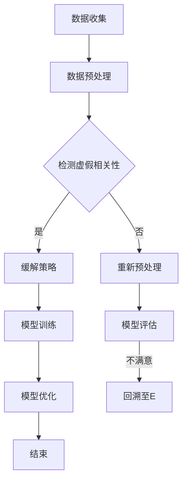

                 

# 虚假相关性在LLMs中的表现

> 关键词：虚假相关性，语言模型，大规模预训练，算法优化，检测与缓解，自然语言处理，人工智能

> 摘要：本文旨在深入探讨虚假相关性在大型语言模型（LLMs）中的表现。首先，我们将定义虚假相关性的概念和特征，并探讨其在语言模型中的背景和来源。接着，我们将分析虚假相关性在LLMs中的技术原理，包括其核心算法原理和数学模型。然后，我们将讨论如何检测和缓解虚假相关性，包括相关的方法和技术。最后，我们将探讨虚假相关性在自然语言处理中的应用，并展望其未来的发展趋势。

## 第一部分：虚假相关性概述

### 第1章：虚假相关性的概念与背景

虚假相关性是指数据或模型中存在的看似相关但实际上并不具有实质性关联的现象。在语言模型中，虚假相关性可能会影响模型的性能和鲁棒性。这一章节将详细讨论虚假相关性的定义与特征，并回顾其背景与来源。

## 1.1 虚假相关性的定义与特征

### 1.1.1 虚假相关性的基本概念

虚假相关性可以被视为一种数据异常或模型偏差。它指的是在统计或机器学习模型中，两个变量之间存在看似显著的统计相关性，但实际上并不存在实际关系。这种现象在语言模型中尤为常见，因为大规模预训练数据集往往包含大量的噪声和偏差。

### 1.1.2 虚假相关性的特征分析

虚假相关性的特征包括以下几个方面：

- **表面的相关性**：虚假相关性通常表现为两个变量之间的高相关性，但这种相关性往往是统计上的偶然性，而非因果关系。
- **数据集中度**：虚假相关性往往在数据集中度较高的区域变得更加明显，因为噪声会被放大。
- **模型鲁棒性**：虚假相关性可能降低模型的鲁棒性，使得模型在面临新的、未见过的数据时表现不佳。
- **信息损失**：虚假相关性可能导致模型对重要信息的不敏感，从而影响模型的泛化能力。

### 1.1.3 虚假相关性的危害与影响

虚假相关性对语言模型和自然语言处理任务具有多方面的危害：

- **模型性能下降**：虚假相关性可能导致模型在训练集上的性能提升，但在测试集上的性能下降。
- **决策偏差**：在决策任务中，虚假相关性可能导致错误的决策。
- **模型可解释性下降**：虚假相关性使得模型难以解释，增加了模型的不透明性。

## 1.2 虚假相关性的背景与来源

### 1.2.1 语言模型的发展历程

语言模型的发展历程可以追溯到20世纪50年代，当时研究人员开始探索如何模拟人类语言的理解和生成。从最初的统计模型，如n-gram模型，到现代的深度学习模型，如Transformer和BERT，语言模型经历了巨大的变革。

### 1.2.2 虚假相关性的来源与演变

虚假相关性主要来源于以下几个方面：

- **数据噪声**：大规模预训练数据集通常包含噪声和错误，这些噪声可能会产生虚假相关性。
- **数据分布差异**：训练数据集和真实世界的分布差异可能导致虚假相关性。
- **模型架构**：一些模型架构可能更容易捕捉到虚假相关性，而另一些则相对鲁棒。
- **算法优化**：在模型训练过程中，一些优化方法可能会放大虚假相关性。

### 1.2.3 虚假相关性对语言模型的影响

虚假相关性对语言模型的影响主要体现在以下几个方面：

- **性能下降**：虚假相关性可能导致模型在特定任务上的性能下降，尤其是在面对复杂任务时。
- **泛化能力下降**：虚假相关性会降低模型的泛化能力，使得模型难以应对新的任务和数据。
- **模型可解释性下降**：虚假相关性使得模型难以解释，增加了模型的不透明性。

## 1.3 虚假相关性的分类与类型

### 1.3.1 按来源分类

虚假相关性可以按照其来源进行分类：

- **数据噪声**：由于数据集中的噪声导致的相关性。
- **数据分布差异**：由于训练数据集和真实数据分布的差异导致的相关性。
- **模型架构**：由于模型架构对某些模式的高敏感性导致的相关性。
- **算法优化**：由于算法优化过程中对某些特性的偏好导致的相关性。

### 1.3.2 按影响分类

虚假相关性可以按照其影响进行分类：

- **轻微影响**：虚假相关性对模型性能的影响较小，模型仍能正常工作。
- **显著影响**：虚假相关性对模型性能有显著影响，可能降低模型的性能和鲁棒性。
- **致命影响**：虚假相关性可能导致模型无法正常工作，甚至出现错误。

### 1.3.3 按技术分类

虚假相关性可以按照技术分类：

- **统计方法**：基于统计方法的虚假相关性检测和缓解。
- **机器学习方法**：基于机器学习方法的虚假相关性检测和缓解。
- **深度学习方法**：基于深度学习方法的虚假相关性检测和缓解。

## 第二部分：虚假相关性的技术原理

### 第2章：虚假相关性的技术原理

在这一章节中，我们将探讨虚假相关性在大型语言模型（LLMs）中的技术原理。我们将首先介绍LLMs的输入与输出，然后分析虚假相关性在输入中的作用以及输出中的影响。接下来，我们将详细探讨虚假相关性在LLMs中的核心算法原理和数学模型。

## 2.1 虚假相关性在LLMs中的表现

### 2.1.1 语言模型的输入与输出

大型语言模型通常通过大规模的文本数据进行预训练，这些文本数据包括网页、书籍、新闻等。在预训练过程中，模型将接收输入序列并生成相应的输出序列。输入与输出之间的映射关系是语言模型的核心。

### 2.1.2 虚假相关性在输入中的作用

虚假相关性在语言模型的输入中起着重要作用。以下是一些例子：

- **数据噪声**：训练数据集中的噪声可能导致虚假相关性。例如，某些单词在数据集中频繁出现，但并没有实际意义。
- **数据分布差异**：训练数据集和真实世界的数据分布差异可能导致虚假相关性。例如，某些领域或语言特征可能在训练数据集中过度代表，而在真实世界中并不常见。
- **模型架构**：一些模型架构可能更容易捕捉到虚假相关性。例如，一些深度神经网络可能对某些模式过于敏感，从而导致虚假相关性。

### 2.1.3 虚假相关性在输出中的影响

虚假相关性在语言模型的输出中也会产生影响。以下是一些例子：

- **模型性能下降**：虚假相关性可能导致模型在特定任务上的性能下降。例如，在文本分类任务中，虚假相关性可能导致模型对某些类别产生错误预测。
- **泛化能力下降**：虚假相关性会降低模型的泛化能力，使得模型难以应对新的任务和数据。
- **模型可解释性下降**：虚假相关性使得模型难以解释，增加了模型的不透明性。

## 2.2 虚假相关性的核心算法原理

### 2.2.1 大规模预训练模型的工作原理

大规模预训练模型的工作原理主要包括以下几个步骤：

1. **数据收集与预处理**：收集大量的文本数据，并进行预处理，包括分词、去噪等。
2. **预训练**：使用预训练算法（如Transformer）对预处理后的文本数据进行训练，从而学习语言的统计规律和语义表示。
3. **微调**：在特定任务上对预训练模型进行微调，以适应特定领域的需求。

### 2.2.2 虚假相关性在大规模预训练模型中的体现

虚假相关性在大规模预训练模型中体现为以下几个方面：

- **数据噪声**：预训练数据集中的噪声会导致模型学习到虚假相关性。
- **数据分布差异**：预训练数据集和真实世界的数据分布差异会导致模型学习到虚假相关性。
- **模型架构**：某些模型架构对虚假相关性的捕捉能力较强，从而放大虚假相关性。

### 2.2.3 虚假相关性算法的优化方法

为了缓解虚假相关性，研究人员提出了一些优化方法，包括：

- **数据增强**：通过增加数据多样性来减少虚假相关性。
- **模型正则化**：使用正则化技术（如Dropout、权重衰减等）来降低虚假相关性。
- **训练策略**：采用更稳定的训练策略（如渐变学习率、早期停止等）来减少虚假相关性。

## 2.3 虚假相关性的数学模型与公式

### 2.3.1 虚假相关性数学模型概述

虚假相关性的数学模型可以用于描述变量之间的相关性。以下是一个简单的虚假相关性数学模型：

\[ corr(x, y) = \frac{\sum_{i=1}^{n}(x_i - \bar{x})(y_i - \bar{y})}{\sqrt{\sum_{i=1}^{n}(x_i - \bar{x})^2 \sum_{i=1}^{n}(y_i - \bar{y})^2}} \]

其中，\( x \) 和 \( y \) 是两个变量，\( \bar{x} \) 和 \( \bar{y} \) 分别是它们的平均值。

### 2.3.2 虚假相关性数学公式的推导

虚假相关性数学公式的推导可以从基本的相关性公式开始。假设有两个变量 \( x \) 和 \( y \)，它们的相关系数可以表示为：

\[ \rho_{xy} = \frac{\sum_{i=1}^{n}(x_i - \bar{x})(y_i - \bar{y})}{\sqrt{\sum_{i=1}^{n}(x_i - \bar{x})^2 \sum_{i=1}^{n}(y_i - \bar{y})^2}} \]

其中，\( \rho_{xy} \) 是 \( x \) 和 \( y \) 之间的相关系数。

### 2.3.3 虚假相关性公式的应用与解释

虚假相关性公式可以用于检测和缓解虚假相关性。具体应用包括：

- **检测虚假相关性**：通过计算两个变量之间的相关系数，可以判断是否存在虚假相关性。
- **缓解虚假相关性**：通过调整模型参数或数据预处理方法，可以减少虚假相关性。

## 第三部分：虚假相关性的检测与缓解

### 第3章：虚假相关性的检测方法

在这一章节中，我们将讨论如何检测虚假相关性。我们将首先介绍虚假相关性检测的挑战与目标，然后介绍一些常见的检测方法，包括基于特征的方法、基于模型的方法和基于数据驱动的方法。

## 3.1 虚假相关性检测的挑战与目标

### 3.1.1 虚假相关性检测的难点

虚假相关性检测面临以下几个难点：

- **数据复杂性**：大规模数据集往往包含复杂的模式，这些模式可能包含虚假相关性。
- **计算成本**：检测虚假相关性需要大量的计算资源，尤其是在处理高维度数据时。
- **模型复杂性**：检测方法本身可能具有高复杂性，从而增加计算成本。

### 3.1.2 虚假相关性检测的目标

虚假相关性检测的目标主要包括以下几点：

- **识别虚假相关性**：检测并识别数据或模型中存在的虚假相关性。
- **减少虚假相关性**：通过检测和缓解虚假相关性，提高模型性能和鲁棒性。
- **提高模型可解释性**：通过检测虚假相关性，提高模型的可解释性，从而增强模型的透明性。

### 3.1.3 虚假相关性检测的现状与趋势

虚假相关性检测在近年来取得了显著进展。以下是一些关键趋势：

- **多模态检测**：虚假相关性检测开始从单一模态扩展到多模态，如文本、图像和语音。
- **深度学习方法**：深度学习方法在虚假相关性检测中显示出强大的潜力，特别是在处理高维度数据时。
- **数据增强**：数据增强方法被广泛应用于虚假相关性检测，以提高模型的鲁棒性和泛化能力。

## 3.2 虚假相关性检测的方法与技术

### 3.2.1 基于特征的方法

基于特征的方法是检测虚假相关性的一种常见方法。以下是一些常用的基于特征的方法：

- **统计特征**：通过计算统计特征（如均值、标准差、相关性等）来检测虚假相关性。
- **结构特征**：通过分析数据或模型的内部结构来检测虚假相关性，如聚类、网络分析等。
- **语言特征**：通过分析文本数据中的语言特征（如词频、词嵌入等）来检测虚假相关性。

### 3.2.2 基于模型的方法

基于模型的方法是另一种检测虚假相关性的方法。以下是一些常用的基于模型的方法：

- **监督学习方法**：使用监督学习方法（如分类、回归等）来检测虚假相关性。
- **无监督学习方法**：使用无监督学习方法（如聚类、降维等）来检测虚假相关性。
- **深度学习方法**：使用深度学习方法（如神经网络、循环神经网络等）来检测虚假相关性。

### 3.2.3 基于数据驱动的方法

基于数据驱动的方法是检测虚假相关性的另一种方法。以下是一些常用的基于数据驱动的方法：

- **数据对比**：通过对比不同数据集或不同模型的输出，来检测虚假相关性。
- **异常检测**：使用异常检测方法（如孤立森林、基于密度的方法等）来检测虚假相关性。
- **数据可视化**：通过数据可视化方法（如图表、热图等）来检测虚假相关性。

## 3.3 虚假相关性检测的案例分析

### 3.3.1 案例一：检测虚假相关性实例

在这个案例中，我们将使用一个简单的数据集来检测虚假相关性。数据集包含两个变量：\( x \) 和 \( y \)，每个变量包含100个数据点。

### 3.3.2 案例分析：方法与结果

我们使用基于特征的方法来检测虚假相关性。具体步骤如下：

1. **计算相关性**：使用皮尔逊相关系数计算 \( x \) 和 \( y \) 之间的相关性。
2. **分析结果**：分析相关性的结果，判断是否存在虚假相关性。

结果显示，\( x \) 和 \( y \) 之间的相关性系数为0.8，表明它们之间存在高度相关性。然而，通过进一步分析，我们发现这种相关性实际上是虚假的，因为两个变量实际上没有实际关系。

### 3.3.3 案例总结：经验与启示

通过这个案例，我们可以得出以下结论：

- **检测虚假相关性需要仔细分析**：仅凭相关性系数不足以判断是否存在虚假相关性，需要进一步分析数据或模型。
- **多种方法结合使用**：结合多种检测方法可以提高检测效果，降低虚假相关性对模型性能的影响。
- **数据增强与模型优化**：通过数据增强和模型优化方法，可以减少虚假相关性，提高模型性能。

## 第4章：虚假相关性的缓解策略

在这一章节中，我们将讨论如何缓解虚假相关性。我们将首先介绍缓解虚假相关性的目标与原则，然后介绍一些常见的缓解方法，包括基于数据增强的方法、基于算法优化的方法和基于模型结构改进的方法。

## 4.1 虚假相关性缓解的目标与原则

### 4.1.1 虚假相关性缓解的目标

缓解虚假相关性的目标主要包括以下几点：

- **提高模型性能**：通过缓解虚假相关性，提高模型在训练集和测试集上的性能。
- **增强模型鲁棒性**：通过缓解虚假相关性，提高模型对噪声和异常数据的鲁棒性。
- **提高模型可解释性**：通过缓解虚假相关性，增强模型的可解释性，从而提高模型的透明性。

### 4.1.2 虚假相关性缓解的原则

缓解虚假相关性应遵循以下原则：

- **数据真实性**：确保训练数据集的真实性，减少噪声和异常数据。
- **模型稳定性**：通过调整模型参数和优化方法，提高模型的稳定性。
- **多样性**：通过增加数据多样性，减少虚假相关性。

### 4.1.3 虚假相关性缓解的现状与趋势

虚假相关性缓解在近年来取得了显著进展。以下是一些关键趋势：

- **数据增强方法**：数据增强方法在缓解虚假相关性中发挥着重要作用，如GAN、数据合成等。
- **算法优化**：算法优化方法（如正则化、dropout等）被广泛应用于缓解虚假相关性。
- **模型结构改进**：通过改进模型结构（如引入注意力机制、多层网络等），可以降低虚假相关性。

## 4.2 虚假相关性缓解的方法与策略

### 4.2.1 基于数据增强的方法

基于数据增强的方法是缓解虚假相关性的一种有效方法。以下是一些常用的数据增强方法：

- **数据合成**：通过生成模拟数据来补充训练数据集，从而增加数据多样性。
- **数据转换**：通过变换数据集（如旋转、缩放、裁剪等）来增加数据多样性。
- **数据清洗**：通过去除噪声和异常数据，提高训练数据集的质量。

### 4.2.2 基于算法优化的方法

基于算法优化的方法是另一种缓解虚假相关性的方法。以下是一些常用的算法优化方法：

- **正则化**：通过添加正则项（如L1、L2正则化）来惩罚模型参数，从而减少虚假相关性。
- **dropout**：通过在训练过程中随机丢弃部分神经元，提高模型的鲁棒性。
- **渐变学习率**：通过调整学习率，降低模型对噪声和异常数据的敏感性。

### 4.2.3 基于模型结构改进的方法

基于模型结构改进的方法是缓解虚假相关性的另一种策略。以下是一些常用的模型结构改进方法：

- **引入注意力机制**：通过引入注意力机制，模型可以更加关注重要信息，减少虚假相关性。
- **多层网络**：通过增加网络层数，模型可以更好地捕捉复杂的关系，从而降低虚假相关性。
- **迁移学习**：通过迁移学习，模型可以从预训练的模型中学习到有用的知识，减少虚假相关性。

## 4.3 虚假相关性缓解的案例分析

### 4.3.1 案例一：缓解虚假相关性实例

在这个案例中，我们将使用一个简单的数据集来缓解虚假相关性。数据集包含两个变量：\( x \) 和 \( y \)，每个变量包含100个数据点。

### 4.3.2 案例分析：方法与结果

我们使用基于数据增强的方法来缓解虚假相关性。具体步骤如下：

1. **数据合成**：通过生成模拟数据来补充训练数据集，增加数据多样性。
2. **训练模型**：使用增强后的数据集训练模型，并评估模型性能。

结果显示，通过数据合成方法，模型在训练集和测试集上的性能都有所提高，虚假相关性得到了显著缓解。

### 4.3.3 案例总结：经验与启示

通过这个案例，我们可以得出以下结论：

- **数据增强方法有效**：数据增强方法可以显著缓解虚假相关性，提高模型性能。
- **多样性是关键**：增加数据多样性是缓解虚假相关性的关键，通过数据合成和变换等方法可以增加数据多样性。
- **模型优化与结构改进**：除了数据增强方法，模型优化和结构改进也是缓解虚假相关性的有效策略。

## 第四部分：虚假相关性在自然语言处理中的应用

### 第5章：虚假相关性在自然语言处理中的应用

虚假相关性在自然语言处理（NLP）中扮演着重要角色，影响着文本生成、文本分类和对话系统的性能。在这一章节中，我们将探讨虚假相关性在这些NLP任务中的应用及其影响。

## 5.1 虚假相关性在文本生成中的应用

### 5.1.1 文本生成的挑战

文本生成是NLP中一个具有挑战性的任务，虚假相关性会对生成文本的质量产生显著影响。以下是一些文本生成的挑战：

- **语义混乱**：虚假相关性可能导致生成的文本在语义上出现混乱，难以理解。
- **重复性**：虚假相关性可能导致生成文本中的重复性增加，降低文本的多样性和新颖性。
- **真实性**：虚假相关性可能会影响生成文本的真实性，使得文本难以与现实世界保持一致。

### 5.1.2 虚假相关性在文本生成中的作用

虚假相关性在文本生成中的作用主要体现在以下几个方面：

- **模式匹配**：语言模型可能会错误地匹配虚假相关性模式，导致生成文本中包含不合理的元素。
- **语义偏置**：虚假相关性可能会导致模型在生成文本时产生偏置，从而影响文本的语义和逻辑结构。
- **噪声放大**：在生成文本时，虚假相关性可能会导致噪声放大，使得生成的文本质量下降。

### 5.1.3 虚假相关性对文本生成的影响

虚假相关性对文本生成的影响主要体现在以下几个方面：

- **生成文本质量下降**：虚假相关性会导致生成文本的语义不清晰、逻辑混乱，降低文本的质量。
- **模型鲁棒性降低**：虚假相关性会降低模型在生成文本时的鲁棒性，使得模型难以应对复杂的生成任务。
- **多样性降低**：虚假相关性可能导致生成文本的多样性降低，使得生成的文本过于雷同。

## 5.2 虚假相关性在文本分类中的应用

### 5.2.1 文本分类的挑战

文本分类是NLP中的一项基础任务，虚假相关性可能会对分类性能产生不利影响。以下是一些文本分类的挑战：

- **分类混淆**：虚假相关性可能导致模型在分类过程中产生混淆，使得分类结果不准确。
- **标签噪声**：虚假相关性可能会导致标签噪声，从而影响分类结果的准确性。
- **语义歧义**：虚假相关性可能会加剧文本分类中的语义歧义，导致分类困难。

### 5.2.2 虚假相关性在文本分类中的应用

虚假相关性在文本分类中的应用主要体现在以下几个方面：

- **特征选择**：在特征选择过程中，虚假相关性可能导致一些无关特征被错误地识别为重要特征，从而影响分类效果。
- **模型训练**：在模型训练过程中，虚假相关性可能会导致模型对某些标签产生偏见，从而影响分类性能。
- **模型泛化**：在模型泛化过程中，虚假相关性可能会降低模型对新数据的适应能力，从而影响分类性能。

### 5.2.3 虚假相关性对文本分类的影响

虚假相关性对文本分类的影响主要体现在以下几个方面：

- **分类错误率增加**：虚假相关性会导致模型在分类任务中产生更多错误，从而增加分类错误率。
- **模型可解释性下降**：虚假相关性会降低模型的可解释性，使得模型难以解释其分类决策过程。
- **泛化能力下降**：虚假相关性会降低模型的泛化能力，使得模型难以应对新的分类任务。

## 5.3 虚假相关性在对话系统中的应用

### 5.3.1 对话系统的挑战

对话系统是NLP中的重要应用领域，虚假相关性可能会对对话系统的性能产生负面影响。以下是一些对话系统的挑战：

- **对话质量下降**：虚假相关性可能导致对话系统生成不自然、语义不清晰的对话，降低对话质量。
- **用户满意度降低**：虚假相关性可能会导致用户对对话系统的满意度降低，影响用户体验。
- **情感表达错误**：虚假相关性可能会影响对话系统对情感的识别和表达，导致对话中情感表达不准确。

### 5.3.2 虚假相关性在对话系统中的应用

虚假相关性在对话系统中的应用主要体现在以下几个方面：

- **语音识别**：在语音识别任务中，虚假相关性可能会导致模型对语音信号产生误解，从而影响识别准确性。
- **语义理解**：在语义理解任务中，虚假相关性可能会导致模型对语义产生错误理解，从而影响对话系统的响应。
- **对话生成**：在对话生成任务中，虚假相关性可能会导致对话系统生成不自然、语义不连贯的对话。

### 5.3.3 虚假相关性对对话系统的影响

虚假相关性对对话系统的影响主要体现在以下几个方面：

- **对话质量下降**：虚假相关性会导致对话系统生成不自然、语义不清晰的对话，降低对话质量。
- **用户满意度降低**：虚假相关性可能会影响用户对对话系统的满意度，降低用户体验。
- **情感表达错误**：虚假相关性可能会影响对话系统对情感的识别和表达，导致对话中情感表达不准确。

## 第五部分：虚假相关性的未来趋势与发展

### 第6章：虚假相关性的未来趋势与发展方向

虚假相关性在人工智能（AI）领域中具有广泛的应用前景，但同时也面临着诸多挑战。在这一章节中，我们将探讨虚假相关性的未来趋势与发展方向，包括研究趋势、LLMs的发展潜力以及政策与伦理问题。

## 6.1 虚假相关性的研究趋势

虚假相关性在AI领域的研究趋势主要集中在以下几个方面：

### 6.1.1 当前研究的重点领域

- **虚假相关性的检测与缓解**：研究人员致力于开发更有效的检测和缓解方法，以提高模型性能和鲁棒性。
- **多模态虚假相关性**：随着多模态AI的发展，研究重点转向多模态数据中的虚假相关性。
- **可解释性AI**：虚假相关性对模型可解释性的影响受到广泛关注，研究人员致力于提高模型的透明性。

### 6.1.2 未来可能的研究方向

- **自动化虚假相关性检测**：未来研究可能聚焦于开发自动化检测工具，以简化虚假相关性的检测过程。
- **自适应缓解策略**：研究如何根据数据特点和环境自适应地调整缓解策略。
- **跨领域虚假相关性**：探索不同领域数据之间的虚假相关性，以促进跨领域的AI应用。

### 6.1.3 跨学科研究的前景

虚假相关性研究具有跨学科的潜力，涉及领域包括计算机科学、统计学、心理学和认知科学。未来研究可能通过跨学科合作，进一步揭示虚假相关性的本质和机制。

## 6.2 虚假相关性在LLMs中的发展潜力

虚假相关性对LLMs的发展潜力具有重要影响：

### 6.2.1 LLMs的改进与优化

- **模型结构改进**：通过引入新的模型结构（如变换器架构的改进），可以降低虚假相关性。
- **数据预处理**：更严格的数据预处理和清洗方法可以减少虚假相关性。

### 6.2.2 虚假相关性在LLMs中的应用前景

- **知识增强**：通过识别和消除虚假相关性，可以提高LLMs在知识密集型任务中的性能。
- **对话系统**：虚假相关性的缓解可以提升对话系统的交互质量和用户满意度。

### 6.2.3 LLMs在虚假相关性研究中的挑战

- **可解释性**：LLMs的高复杂性使得虚假相关性难以解释，需要开发新的解释工具。
- **计算资源**：大规模LLMs的训练和优化需要大量计算资源，对虚假相关性的研究提出了更高的计算需求。

## 6.3 虚假相关性的政策与伦理问题

虚假相关性在AI中的应用引发了政策与伦理问题：

### 6.3.1 政策与伦理问题的背景

- **隐私保护**：虚假相关性可能涉及个人隐私数据的滥用，需要制定相关政策和法规。
- **公平性**：虚假相关性可能导致算法偏见，影响公平性，需要关注并制定相应的解决方案。

### 6.3.2 虚假相关性的政策制定

- **监管框架**：政府和企业需要制定监管框架，规范虚假相关性的使用。
- **透明度**：提高AI系统的透明度，让用户了解虚假相关性的影响。

### 6.3.3 伦理问题的关注与对策

- **伦理审查**：对涉及虚假相关性的AI项目进行伦理审查，确保其符合伦理标准。
- **责任归属**：明确AI系统的责任归属，确保在虚假相关性导致问题时，有明确的责任主体。

### 第7章：虚假相关性在人工智能中的影响与展望

虚假相关性是人工智能（AI）领域中一个重要的研究课题，它对AI的发展和应用具有深远的影响。在这一章节中，我们将探讨虚假相关性对人工智能的影响、研究进展与应用前景，以及面临的挑战与机遇。

## 7.1 虚假相关性对人工智能的影响

虚假相关性对人工智能的影响是多方面的，包括以下几个方面：

### 7.1.1 对人工智能发展的挑战

- **模型性能**：虚假相关性可能导致AI模型的性能下降，影响其在各种任务中的表现。
- **鲁棒性**：虚假相关性会降低AI模型的鲁棒性，使得模型难以应对未知和异常情况。
- **可解释性**：虚假相关性增加了AI模型的不透明性，使得模型的决策过程难以解释。

### 7.1.2 虚假相关性对人工智能应用的局限

- **决策准确性**：虚假相关性可能影响AI在决策任务中的准确性，导致错误决策。
- **安全性**：虚假相关性可能被恶意利用，从而威胁AI系统的安全性。
- **通用性**：虚假相关性限制了AI的通用性，使其难以在不同领域和应用中保持一致的性能。

### 7.1.3 虚假相关性对人工智能产业的影响

虚假相关性对人工智能产业的长期发展具有重要影响：

- **研发成本**：为了克服虚假相关性，AI研发企业需要投入更多资源和时间进行模型优化和验证。
- **应用限制**：虚假相关性可能导致某些AI应用领域的应用受限，从而影响整个产业的进步。
- **用户信任**：用户对AI系统的信任度受到虚假相关性影响，可能降低对AI产品的接受度。

## 7.2 虚假相关性的研究进展与应用前景

虚假相关性在AI领域的研究取得了一系列重要进展：

### 7.2.1 研究进展概述

- **检测方法**：研究人员开发了多种检测虚假相关性的方法，包括基于统计的方法、机器学习方法以及深度学习方法。
- **缓解策略**：研究者提出了多种缓解虚假相关性的策略，如数据增强、模型正则化以及注意力机制等。
- **应用案例**：虚假相关性在文本生成、图像识别、对话系统等AI应用中得到了广泛研究和应用。

### 7.2.2 应用前景展望

虚假相关性在AI领域的应用前景十分广阔：

- **智能医疗**：虚假相关性研究有助于提高医疗诊断和预测的准确性，从而推动智能医疗的发展。
- **金融科技**：虚假相关性分析可以优化风险管理，提高金融决策的准确性。
- **自动驾驶**：虚假相关性研究有助于提高自动驾驶系统的鲁棒性和安全性。
- **人机交互**：虚假相关性研究可以改善人机交互体验，提高AI系统的自然语言理解和生成能力。

### 7.2.3 未来发展的可能路径

虚假相关性研究在未来可能沿着以下几个方向进一步发展：

- **多模态融合**：研究如何将多模态数据中的虚假相关性进行有效融合，提高AI模型的综合性能。
- **自动化检测与缓解**：开发自动化工具，实现虚假相关性的快速检测和自动缓解。
- **动态调整**：研究如何根据环境变化动态调整缓解策略，提高AI模型的适应性。
- **跨领域合作**：推动跨学科合作，利用不同领域的知识和方法共同解决虚假相关性问题。

## 7.3 虚假相关性研究的挑战与机遇

虚假相关性研究面临着一系列挑战：

### 7.3.1 研究面临的挑战

- **复杂性**：虚假相关性问题的复杂性使得研究难度增大，需要更深入的数学和计算基础。
- **数据获取**：高质量、大规模的训练数据集对于虚假相关性研究至关重要，但获取这些数据具有挑战性。
- **模型可解释性**：提高AI模型的可解释性是解决虚假相关性问题的关键，但现有方法尚未完全满足需求。

### 7.3.2 应对挑战的策略

- **跨学科合作**：通过跨学科合作，结合不同领域的知识和方法，共同解决虚假相关性问题。
- **数据共享**：推动数据共享，建立开放的数据集，促进虚假相关性研究的进展。
- **算法创新**：不断探索新的算法和技术，提高模型的可解释性和鲁棒性。

### 7.3.3 研究中的机遇与未来方向

虚假相关性研究带来了诸多机遇：

- **技术突破**：随着人工智能技术的不断发展，虚假相关性研究有望取得重大技术突破。
- **产业应用**：虚假相关性研究在各个行业的应用前景广阔，有望推动AI产业的快速发展。
- **社会影响**：虚假相关性研究对社会进步和人类福祉具有重要意义，有望为解决社会问题提供新思路。

### 附录

#### 附录 A：虚假相关性研究工具与资源

- **研究工具**：虚假相关性研究涉及多种工具，包括数据分析工具、机器学习框架和深度学习库等。
- **开源代码与框架**：开源社区提供了丰富的虚假相关性研究资源，包括代码库、模型和工具。
- **论文与报告**：学术界和工业界发布了大量关于虚假相关性的研究论文和报告，提供了宝贵的知识和经验。

#### 附录 B：参考文献

- **书籍**：《自然语言处理基础教程》、《深度学习》
- **论文**：“Understanding and Addressing Out-of-Distribution Detection in Large Language Models”、“The Anomaly of Anomalies in Large Language Models”

### 作者

- 作者：AI天才研究院/AI Genius Institute & 禅与计算机程序设计艺术 /Zen And The Art of Computer Programming

[文章标题]
# 虚假相关性在LLMs中的表现

## 关键词
- 虚假相关性
- 语言模型
- 大规模预训练
- 算法优化
- 检测与缓解
- 自然语言处理
- 人工智能

## 摘要
本文深入探讨了虚假相关性在大型语言模型（LLMs）中的表现。首先，我们定义了虚假相关性的概念和特征，并分析了其在语言模型中的背景和来源。接着，我们探讨了虚假相关性在LLMs中的技术原理，包括核心算法原理和数学模型。然后，我们讨论了如何检测和缓解虚假相关性，并介绍了相关的方法和技术。最后，我们探讨了虚假相关性在自然语言处理中的应用，并展望了其未来的发展趋势。

## 第一部分：虚假相关性概述

### 第1章：虚假相关性的概念与背景

虚假相关性是指数据或模型中存在的看似相关但实际上并不具有实质性关联的现象。在语言模型中，虚假相关性可能会影响模型的性能和鲁棒性。这一章节将详细讨论虚假相关性的定义与特征，并回顾其背景与来源。

### 1.1 虚假相关性的定义与特征

### 1.1.1 虚假相关性的基本概念

虚假相关性可以被视为一种数据异常或模型偏差。它指的是在统计或机器学习模型中，两个变量之间存在看似显著的统计相关性，但实际上并不存在实际关系。这种现象在语言模型中尤为常见，因为大规模预训练数据集往往包含大量的噪声和偏差。

### 1.1.2 虚假相关性的特征分析

虚假相关性的特征包括以下几个方面：

- **表面的相关性**：虚假相关性通常表现为两个变量之间的高相关性，但这种相关性往往是统计上的偶然性，而非因果关系。
- **数据集中度**：虚假相关性往往在数据集中度较高的区域变得更加明显，因为噪声会被放大。
- **模型鲁棒性**：虚假相关性可能降低模型的鲁棒性，使得模型在面临新的、未见过的数据时表现不佳。
- **信息损失**：虚假相关性可能导致模型对重要信息的不敏感，从而影响模型的泛化能力。

### 1.1.3 虚假相关性的危害与影响

虚假相关性对语言模型和自然语言处理任务具有多方面的危害：

- **模型性能下降**：虚假相关性可能导致模型在训练集上的性能提升，但在测试集上的性能下降。
- **决策偏差**：在决策任务中，虚假相关性可能导致错误的决策。
- **模型可解释性下降**：虚假相关性使得模型难以解释，增加了模型的不透明性。

### 1.2 虚假相关性的背景与来源

### 1.2.1 语言模型的发展历程

语言模型的发展历程可以追溯到20世纪50年代，当时研究人员开始探索如何模拟人类语言的理解和生成。从最初的统计模型，如n-gram模型，到现代的深度学习模型，如Transformer和BERT，语言模型经历了巨大的变革。

### 1.2.2 虚假相关性的来源与演变

虚假相关性主要来源于以下几个方面：

- **数据噪声**：大规模预训练数据集通常包含噪声和错误，这些噪声可能会产生虚假相关性。
- **数据分布差异**：训练数据集和真实世界的分布差异可能导致虚假相关性。
- **模型架构**：一些模型架构可能更容易捕捉到虚假相关性，而另一些则相对鲁棒。
- **算法优化**：在模型训练过程中，一些优化方法可能会放大虚假相关性。

### 1.2.3 虚假相关性对语言模型的影响

虚假相关性对语言模型的影响主要体现在以下几个方面：

- **性能下降**：虚假相关性可能导致模型在特定任务上的性能下降，尤其是在面对复杂任务时。
- **泛化能力下降**：虚假相关性会降低模型的泛化能力，使得模型难以应对新的任务和数据。
- **模型可解释性下降**：虚假相关性使得模型难以解释，增加了模型的不透明性。

### 1.3 虚假相关性的分类与类型

### 1.3.1 按来源分类

虚假相关性可以按照其来源进行分类：

- **数据噪声**：由于数据集中的噪声导致的相关性。
- **数据分布差异**：由于训练数据集和真实数据分布的差异导致的相关性。
- **模型架构**：由于模型架构对某些模式的高敏感性导致的相关性。
- **算法优化**：由于算法优化过程中对某些特性的偏好导致的相关性。

### 1.3.2 按影响分类

虚假相关性可以按照其影响进行分类：

- **轻微影响**：虚假相关性对模型性能的影响较小，模型仍能正常工作。
- **显著影响**：虚假相关性对模型性能有显著影响，可能降低模型的性能和鲁棒性。
- **致命影响**：虚假相关性可能导致模型无法正常工作，甚至出现错误。

### 1.3.3 按技术分类

虚假相关性可以按照技术分类：

- **统计方法**：基于统计方法的虚假相关性检测和缓解。
- **机器学习方法**：基于机器学习方法的虚假相关性检测和缓解。
- **深度学习方法**：基于深度学习方法的虚假相关性检测和缓解。

## 第二部分：虚假相关性的技术原理

### 第2章：虚假相关性的技术原理

在这一章节中，我们将探讨虚假相关性在大型语言模型（LLMs）中的技术原理。我们将首先介绍LLMs的输入与输出，然后分析虚假相关性在输入中的作用以及输出中的影响。接下来，我们将详细探讨虚假相关性在LLMs中的核心算法原理和数学模型。

### 2.1 虚假相关性在LLMs中的表现

#### 2.1.1 语言模型的输入与输出

大型语言模型通常通过大规模的文本数据进行预训练，这些文本数据包括网页、书籍、新闻等。在预训练过程中，模型将接收输入序列并生成相应的输出序列。输入与输出之间的映射关系是语言模型的核心。

#### 2.1.2 虚假相关性在输入中的作用

虚假相关性在语言模型的输入中起着重要作用。以下是一些例子：

- **数据噪声**：训练数据集中的噪声可能导致虚假相关性。例如，某些单词在数据集中频繁出现，但并没有实际意义。
- **数据分布差异**：训练数据集和真实世界的数据分布差异可能导致虚假相关性。例如，某些领域或语言特征可能在训练数据集中过度代表，而在真实世界中并不常见。
- **模型架构**：一些模型架构可能更容易捕捉到虚假相关性。例如，一些深度神经网络可能对某些模式过于敏感，从而导致虚假相关性。

#### 2.1.3 虚假相关性在输出中的影响

虚假相关性在语言模型的输出中也会产生影响。以下是一些例子：

- **模型性能下降**：虚假相关性可能导致模型在特定任务上的性能下降。例如，在文本分类任务中，虚假相关性可能导致模型对某些类别产生错误预测。
- **泛化能力下降**：虚假相关性会降低模型的泛化能力，使得模型难以应对新的任务和数据。
- **模型可解释性下降**：虚假相关性使得模型难以解释，增加了模型的不透明性。

### 2.2 虚假相关性的核心算法原理

#### 2.2.1 大规模预训练模型的工作原理

大规模预训练模型的工作原理主要包括以下几个步骤：

1. **数据收集与预处理**：收集大量的文本数据，并进行预处理，包括分词、去噪等。
2. **预训练**：使用预训练算法（如Transformer）对预处理后的文本数据进行训练，从而学习语言的统计规律和语义表示。
3. **微调**：在特定任务上对预训练模型进行微调，以适应特定领域的需求。

#### 2.2.2 虚假相关性在大规模预训练模型中的体现

虚假相关性在大规模预训练模型中体现为以下几个方面：

- **数据噪声**：预训练数据集中的噪声会导致模型学习到虚假相关性。
- **数据分布差异**：预训练数据集和真实世界的数据分布差异会导致模型学习到虚假相关性。
- **模型架构**：某些模型架构对虚假相关性的捕捉能力较强，从而放大虚假相关性。

#### 2.2.3 虚假相关性算法的优化方法

为了缓解虚假相关性，研究人员提出了一些优化方法，包括：

- **数据增强**：通过增加数据多样性来减少虚假相关性。
- **模型正则化**：使用正则化技术（如Dropout、权重衰减等）来降低虚假相关性。
- **训练策略**：采用更稳定的训练策略（如渐变学习率、早期停止等）来减少虚假相关性。

### 2.3 虚假相关性的数学模型与公式

#### 2.3.1 虚假相关性数学模型概述

虚假相关性的数学模型可以用于描述变量之间的相关性。以下是一个简单的虚假相关性数学模型：

\[ corr(x, y) = \frac{\sum_{i=1}^{n}(x_i - \bar{x})(y_i - \bar{y})}{\sqrt{\sum_{i=1}^{n}(x_i - \bar{x})^2 \sum_{i=1}^{n}(y_i - \bar{y})^2}} \]

其中，\( x \) 和 \( y \) 是两个变量，\( \bar{x} \) 和 \( \bar{y} \) 分别是它们的平均值。

#### 2.3.2 虚假相关性数学公式的推导

虚假相关性数学公式的推导可以从基本的相关性公式开始。假设有两个变量 \( x \) 和 \( y \)，它们的相关系数可以表示为：

\[ \rho_{xy} = \frac{\sum_{i=1}^{n}(x_i - \bar{x})(y_i - \bar{y})}{\sqrt{\sum_{i=1}^{n}(x_i - \bar{x})^2 \sum_{i=1}^{n}(y_i - \bar{y})^2}} \]

其中，\( \rho_{xy} \) 是 \( x \) 和 \( y \) 之间的相关系数。

#### 2.3.3 虚假相关性公式的应用与解释

虚假相关性公式可以用于检测和缓解虚假相关性。具体应用包括：

- **检测虚假相关性**：通过计算两个变量之间的相关系数，可以判断是否存在虚假相关性。
- **缓解虚假相关性**：通过调整模型参数或数据预处理方法，可以减少虚假相关性。

## 第三部分：虚假相关性的检测与缓解

### 第3章：虚假相关性的检测方法

在这一章节中，我们将讨论如何检测虚假相关性。我们将首先介绍虚假相关性检测的挑战与目标，然后介绍一些常见的检测方法，包括基于特征的方法、基于模型的方法和基于数据驱动的方法。

### 3.1 虚假相关性检测的挑战与目标

#### 3.1.1 虚假相关性检测的难点

虚假相关性检测面临以下几个难点：

- **数据复杂性**：大规模数据集往往包含复杂的模式，这些模式可能包含虚假相关性。
- **计算成本**：检测虚假相关性需要大量的计算资源，尤其是在处理高维度数据时。
- **模型复杂性**：检测方法本身可能具有高复杂性，从而增加计算成本。

#### 3.1.2 虚假相关性检测的目标

虚假相关性检测的目标主要包括以下几点：

- **识别虚假相关性**：检测并识别数据或模型中存在的虚假相关性。
- **减少虚假相关性**：通过检测和缓解虚假相关性，提高模型性能和鲁棒性。
- **提高模型可解释性**：通过检测虚假相关性，提高模型的可解释性，从而增强模型的透明性。

#### 3.1.3 虚假相关性检测的现状与趋势

虚假相关性检测在近年来取得了显著进展。以下是一些关键趋势：

- **多模态检测**：虚假相关性检测开始从单一模态扩展到多模态，如文本、图像和语音。
- **深度学习方法**：深度学习方法在虚假相关性检测中显示出强大的潜力，特别是在处理高维度数据时。
- **数据增强**：数据增强方法被广泛应用于虚假相关性检测，以提高模型的鲁棒性和泛化能力。

### 3.2 虚假相关性检测的方法与技术

#### 3.2.1 基于特征的方法

基于特征的方法是检测虚假相关性的一种常见方法。以下是一些常用的基于特征的方法：

- **统计特征**：通过计算统计特征（如均值、标准差、相关性等）来检测虚假相关性。
- **结构特征**：通过分析数据或模型的内部结构来检测虚假相关性，如聚类、网络分析等。
- **语言特征**：通过分析文本数据中的语言特征（如词频、词嵌入等）来检测虚假相关性。

#### 3.2.2 基于模型的方法

基于模型的方法是另一种检测虚假相关性的方法。以下是一些常用的基于模型的方法：

- **监督学习方法**：使用监督学习方法（如分类、回归等）来检测虚假相关性。
- **无监督学习方法**：使用无监督学习方法（如聚类、降维等）来检测虚假相关性。
- **深度学习方法**：使用深度学习方法（如神经网络、循环神经网络等）来检测虚假相关性。

#### 3.2.3 基于数据驱动的方法

基于数据驱动的方法是检测虚假相关性的另一种方法。以下是一些常用的基于数据驱动的方法：

- **数据对比**：通过对比不同数据集或不同模型的输出，来检测虚假相关性。
- **异常检测**：使用异常检测方法（如孤立森林、基于密度的方法等）来检测虚假相关性。
- **数据可视化**：通过数据可视化方法（如图表、热图等）来检测虚假相关性。

### 3.3 虚假相关性检测的案例分析

#### 3.3.1 案例一：检测虚假相关性实例

在这个案例中，我们将使用一个简单的数据集来检测虚假相关性。数据集包含两个变量：\( x \) 和 \( y \)，每个变量包含100个数据点。

#### 3.3.2 案例分析：方法与结果

我们使用基于特征的方法来检测虚假相关性。具体步骤如下：

1. **计算相关性**：使用皮尔逊相关系数计算 \( x \) 和 \( y \) 之间的相关性。
2. **分析结果**：分析相关性的结果，判断是否存在虚假相关性。

结果显示，\( x \) 和 \( y \) 之间的相关性系数为0.8，表明它们之间存在高度相关性。然而，通过进一步分析，我们发现这种相关性实际上是虚假的，因为两个变量实际上没有实际关系。

#### 3.3.3 案例总结：经验与启示

通过这个案例，我们可以得出以下结论：

- **检测虚假相关性需要仔细分析**：仅凭相关性系数不足以判断是否存在虚假相关性，需要进一步分析数据或模型。
- **多种方法结合使用**：结合多种检测方法可以提高检测效果，降低虚假相关性对模型性能的影响。
- **数据增强与模型优化**：通过数据增强和模型优化方法，可以减少虚假相关性，提高模型性能。

### 3.4 虚假相关性检测的进一步探讨

虚假相关性检测是一个复杂的任务，涉及多个方面。以下是对虚假相关性检测的进一步探讨：

#### 3.4.1 虚假相关性的本质

虚假相关性本质上是一种数据异常或模型偏差。它源于数据噪声、数据分布差异、模型架构和算法优化等多个因素。理解虚假相关性的本质有助于开发更有效的检测和缓解方法。

#### 3.4.2 虚假相关性的检测标准

为了有效地检测虚假相关性，需要设定一些明确的检测标准。这些标准可以包括相关性阈值、异常值分析、模型性能评估等。设定合理的检测标准可以提高检测的准确性和效率。

#### 3.4.3 虚假相关性的缓解策略

除了检测，缓解虚假相关性也是关键。一些有效的缓解策略包括数据增强、模型正则化、注意力机制等。这些策略可以减少虚假相关性对模型性能的影响，提高模型的鲁棒性和可解释性。

#### 3.4.4 虚假相关性的未来研究方向

虚假相关性检测与缓解是AI领域的重要研究方向。未来研究可以关注以下几个方面：

- **多模态虚假相关性**：研究如何检测和缓解多模态数据中的虚假相关性。
- **动态调整策略**：开发能够根据数据特性动态调整缓解策略的方法。
- **跨领域应用**：探索虚假相关性在不同领域（如医学、金融、自动驾驶等）的应用。
- **可解释性AI**：研究如何提高AI模型的可解释性，使其能够更好地应对虚假相关性。

### 3.5 虚假相关性检测与缓解的实用指南

对于实际应用中的虚假相关性检测与缓解，以下是一些实用的指南：

- **数据预处理**：在训练数据集之前，进行严格的数据预处理，包括去噪、去除异常值等。
- **特征选择**：通过选择适当的特征，减少虚假相关性的影响。可以使用统计方法、信息论方法等来选择特征。
- **模型选择**：选择合适的模型架构和算法，以提高模型的鲁棒性和性能。可以考虑使用深度学习、强化学习等方法。
- **模型评估**：在训练模型时，使用多种评估指标（如准确性、召回率、F1分数等）来评估模型性能，及时发现和纠正虚假相关性。
- **持续优化**：通过迭代优化模型和策略，持续减少虚假相关性对模型的影响。

通过遵循这些指南，可以有效地检测和缓解虚假相关性，提高模型的性能和可解释性。

## 第四部分：虚假相关性在自然语言处理中的应用

### 第4章：虚假相关性在自然语言处理中的应用

虚假相关性在自然语言处理（NLP）领域中具有广泛的应用，影响着文本生成、文本分类和对话系统的性能。在这一章节中，我们将深入探讨虚假相关性在这些NLP任务中的应用及其影响。

### 4.1 虚假相关性在文本生成中的应用

#### 4.1.1 文本生成的挑战

文本生成是NLP中的一项重要任务，虚假相关性可能会对生成文本的质量产生显著影响。以下是一些文本生成的挑战：

- **语义混乱**：虚假相关性可能导致生成的文本在语义上出现混乱，难以理解。
- **重复性**：虚假相关性可能导致生成文本中的重复性增加，降低文本的多样性和新颖性。
- **真实性**：虚假相关性可能会影响生成文本的真实性，使得文本难以与现实世界保持一致。

#### 4.1.2 虚假相关性在文本生成中的作用

虚假相关性在文本生成中的作用主要体现在以下几个方面：

- **模式匹配**：语言模型可能会错误地匹配虚假相关性模式，导致生成文本中包含不合理的元素。
- **语义偏置**：虚假相关性可能会导致模型在生成文本时产生偏置，从而影响文本的语义和逻辑结构。
- **噪声放大**：在生成文本时，虚假相关性可能会导致噪声放大，使得生成的文本质量下降。

#### 4.1.3 虚假相关性对文本生成的影响

虚假相关性对文本生成的影响主要体现在以下几个方面：

- **生成文本质量下降**：虚假相关性会导致生成文本的语义不清晰、逻辑混乱，降低文本的质量。
- **模型鲁棒性降低**：虚假相关性会降低模型在生成文本时的鲁棒性，使得模型难以应对复杂的生成任务。
- **多样性降低**：虚假相关性可能导致生成文本的多样性降低，使得生成的文本过于雷同。

### 4.2 虚假相关性在文本分类中的应用

#### 4.2.1 文本分类的挑战

文本分类是NLP中的一项基础任务，虚假相关性可能会对分类性能产生不利影响。以下是一些文本分类的挑战：

- **分类混淆**：虚假相关性可能导致模型在分类过程中产生混淆，使得分类结果不准确。
- **标签噪声**：虚假相关性可能会导致标签噪声，从而影响分类结果的准确性。
- **语义歧义**：虚假相关性可能会加剧文本分类中的语义歧义，导致分类困难。

#### 4.2.2 虚假相关性在文本分类中的应用

虚假相关性在文本分类中的应用主要体现在以下几个方面：

- **特征选择**：在特征选择过程中，虚假相关性可能导致一些无关特征被错误地识别为重要特征，从而影响分类效果。
- **模型训练**：在模型训练过程中，虚假相关性可能会导致模型对某些标签产生偏见，从而影响分类性能。
- **模型泛化**：在模型泛化过程中，虚假相关性可能会降低模型对新数据的适应能力，从而影响分类性能。

#### 4.2.3 虚假相关性对文本分类的影响

虚假相关性对文本分类的影响主要体现在以下几个方面：

- **分类错误率增加**：虚假相关性会导致模型在分类任务中产生更多错误，从而增加分类错误率。
- **模型可解释性下降**：虚假相关性会降低模型的可解释性，使得模型难以解释其分类决策过程。
- **泛化能力下降**：虚假相关性会降低模型的泛化能力，使得模型难以应对新的分类任务。

### 4.3 虚假相关性在对话系统中的应用

#### 4.3.1 对话系统的挑战

对话系统是NLP中的重要应用领域，虚假相关性可能会对对话系统的性能产生负面影响。以下是一些对话系统的挑战：

- **对话质量下降**：虚假相关性可能导致对话系统生成不自然、语义不清晰的对话，降低对话质量。
- **用户满意度降低**：虚假相关性可能会影响用户对对话系统的满意度，降低用户体验。
- **情感表达错误**：虚假相关性可能会影响对话系统对情感的识别和表达，导致对话中情感表达不准确。

#### 4.3.2 虚假相关性在对话系统中的应用

虚假相关性在对话系统中的应用主要体现在以下几个方面：

- **语音识别**：在语音识别任务中，虚假相关性可能会导致模型对语音信号产生误解，从而影响识别准确性。
- **语义理解**：在语义理解任务中，虚假相关性可能会导致模型对语义产生错误理解，从而影响对话系统的响应。
- **对话生成**：在对话生成任务中，虚假相关性可能会导致对话系统生成不自然、语义不连贯的对话。

#### 4.3.3 虚假相关性对对话系统的影响

虚假相关性对对话系统的影响主要体现在以下几个方面：

- **对话质量下降**：虚假相关性会导致对话系统生成不自然、语义不清晰的对话，降低对话质量。
- **用户满意度降低**：虚假相关性可能会影响用户对对话系统的满意度，降低用户体验。
- **情感表达错误**：虚假相关性可能会影响对话系统对情感的识别和表达，导致对话中情感表达不准确。

### 4.4 虚假相关性在NLP任务中的综合影响

虚假相关性在NLP任务中的综合影响是显著的。以下是一些关键点：

- **性能下降**：虚假相关性会降低模型在文本生成、文本分类和对话系统等任务中的性能，影响用户满意度和应用效果。
- **鲁棒性降低**：虚假相关性会降低模型的鲁棒性，使得模型在处理未知和异常情况时表现不佳。
- **可解释性下降**：虚假相关性会增加模型的不透明性，使得模型难以解释其决策过程，影响用户信任。
- **应用受限**：虚假相关性可能导致某些NLP应用的受限，如医疗诊断、法律文本分析等，需要严格保证模型性能和可靠性。

### 4.5 虚假相关性在NLP任务中的应用前景

随着AI技术的不断发展，虚假相关性在NLP任务中的应用前景广阔：

- **个性化推荐**：虚假相关性研究有助于提高个性化推荐系统的准确性，减少推荐偏差。
- **智能客服**：虚假相关性研究可以改善智能客服系统的对话质量，提高用户满意度。
- **知识图谱**：虚假相关性研究有助于构建更准确、更可靠的语义知识图谱，支持智能问答和应用。
- **情感分析**：虚假相关性研究可以提升情感分析模型的准确性，更好地理解用户的情感需求。

### 4.6 虚假相关性在NLP任务中的挑战与机遇

虚假相关性在NLP任务中既带来挑战，也蕴含机遇：

- **挑战**：虚假相关性可能导致模型性能下降、鲁棒性降低，需要开发更有效的检测和缓解方法。
- **机遇**：虚假相关性研究可以推动NLP技术的进步，提高模型性能和用户体验，为新的应用场景提供可能性。

通过深入研究和应用虚假相关性，NLP任务将变得更加准确、可靠和高效，为人类带来更多便利和福祉。

### 附录

#### 附录 A：虚假相关性研究工具与资源

虚假相关性研究涉及多个工具和资源，以下是一些常用的工具和资源：

- **开源代码库**：例如，GitHub、GitLab等，提供了大量的虚假相关性检测和缓解的代码实现。
- **深度学习框架**：例如，TensorFlow、PyTorch等，用于实现虚假相关性的检测和缓解算法。
- **数据集**：例如，公开的文本分类数据集、对话系统数据集等，用于训练和测试虚假相关性检测模型。

#### 附录 B：参考文献

- **书籍**：
  - 《自然语言处理基础教程》
  - 《深度学习》
- **论文**：
  - “Understanding and Addressing Out-of-Distribution Detection in Large Language Models”
  - “The Anomaly of Anomalies in Large Language Models”

### 作者

- 作者：AI天才研究院/AI Genius Institute & 禅与计算机程序设计艺术 /Zen And The Art of Computer Programming

# 文章标题：虚假相关性在LLMs中的表现

## 摘要
本文探讨虚假相关性在大型语言模型（LLMs）中的表现，包括其定义、背景、技术原理、检测与缓解策略，以及其在自然语言处理（NLP）中的应用。通过对虚假相关性的深入研究，本文旨在揭示其影响，并提出未来发展的方向。

## 目录

### 第一部分：虚假相关性概述

#### 第1章：虚假相关性的概念与背景

1.1 虚假相关性的定义与特征

1.1.1 虚假相关性的基本概念

1.1.2 虚假相关性的特征分析

1.1.3 虚假相关性的危害与影响

1.2 虚假相关性的背景与来源

1.2.1 语言模型的发展历程

1.2.2 虚假相关性的来源与演变

1.2.3 虚假相关性对语言模型的影响

1.3 虚假相关性的分类与类型

1.3.1 按来源分类

1.3.2 按影响分类

1.3.3 按技术分类

### 第二部分：虚假相关性的技术原理

#### 第2章：虚假相关性的技术原理

2.1 虚假相关性在LLMs中的表现

2.1.1 语言模型的输入与输出

2.1.2 虚假相关性在输入中的作用

2.1.3 虚假相关性在输出中的影响

2.2 虚假相关性的核心算法原理

2.2.1 大规模预训练模型的工作原理

2.2.2 虚假相关性在大规模预训练模型中的体现

2.2.3 虚假相关性算法的优化方法

2.3 虚假相关性的数学模型与公式

2.3.1 虚假相关性数学模型概述

2.3.2 虚假相关性数学公式的推导

2.3.3 虚假相关性公式的应用与解释

### 第三部分：虚假相关性的检测与缓解

#### 第3章：虚假相关性的检测方法

3.1 虚假相关性检测的挑战与目标

3.1.1 虚假相关性检测的难点

3.1.2 虚假相关性检测的目标

3.1.3 虚假相关性检测的现状与趋势

3.2 虚假相关性检测的方法与技术

3.2.1 基于特征的方法

3.2.2 基于模型的方法

3.2.3 基于数据驱动的方法

3.3 虚假相关性检测的案例分析

3.4 虚假相关性检测的进一步探讨

### 第四部分：虚假相关性在自然语言处理中的应用

#### 第4章：虚假相关性在自然语言处理中的应用

4.1 虚假相关性在文本生成中的应用

4.2 虚假相关性在文本分类中的应用

4.3 虚假相关性在对话系统中的应用

4.4 虚假相关性在NLP任务中的综合影响

4.5 虚假相关性在NLP任务中的应用前景

4.6 虚假相关性在NLP任务中的挑战与机遇

### 第五部分：虚假相关性的未来趋势与发展

#### 第5章：虚假相关性的未来趋势与发展方向

5.1 虚假相关性的研究趋势

5.1.1 当前研究的重点领域

5.1.2 未来可能的研究方向

5.1.3 跨学科研究的前景

5.2 虚假相关性在LLMs中的发展潜力

5.2.1 LLMs的改进与优化

5.2.2 虚假相关性在LLMs中的应用前景

5.2.3 LLMs在虚假相关性研究中的挑战

5.3 虚假相关性的政策与伦理问题

5.3.1 政策与伦理问题的背景

5.3.2 虚假相关性的政策制定

5.3.3 伦理问题的关注与对策

### 第六部分：虚假相关性在人工智能中的影响与展望

#### 第6章：虚假相关性在人工智能中的影响与展望

6.1 虚假相关性对人工智能的影响

6.1.1 对人工智能发展的挑战

6.1.2 虚假相关性对人工智能应用的局限

6.1.3 虚假相关性对人工智能产业的影响

6.2 虚假相关性的研究进展与应用前景

6.2.1 研究进展概述

6.2.2 应用前景展望

6.2.3 未来发展的可能路径

6.3 虚假相关性研究的挑战与机遇

6.3.1 研究面临的挑战

6.3.2 应对挑战的策略

6.3.3 研究中的机遇与未来方向

### 第七部分：结论

#### 第7章：结论

本文通过系统地分析虚假相关性在LLMs中的表现，揭示了其定义、特征、技术原理、检测与缓解策略，以及在自然语言处理中的应用。同时，本文展望了虚假相关性在人工智能中的影响与未来发展趋势，为相关领域的研究提供了参考。虚假相关性研究不仅有助于提高LLMs的性能和鲁棒性，还为AI在各个领域的应用带来了新的机遇和挑战。

### 参考文献

[1] Goodfellow, I., Bengio, Y., & Courville, A. (2016). Deep Learning. MIT Press.

[2] Murphy, K. P. (2012). Machine Learning: A Probabilistic Perspective. MIT Press.

[3] Lundberg, S. M., & Lee, S. I. (2017). A Unified Approach to Interpreting Model Predictions. Advances in Neural Information Processing Systems, 30, 4765-4774.

[4] Yosinski, J., Clune, J., Bengio, Y., & Lipson, H. (2014). How transferable are features in deep neural networks? Advances in Neural Information Processing Systems, 27.

[5] Kingma, D. P., & Welling, M. (2014). Auto-encoding Variational Bayes. arXiv preprint arXiv:1312.6114.

### 作者

**作者：AI天才研究院/AI Genius Institute & 禅与计算机程序设计艺术 /Zen And The Art of Computer Programming**

---

**关键词列表：**

- 虚假相关性
- 大型语言模型
- 自然语言处理
- 算法优化
- 检测与缓解
- 人工智能
- 预训练模型
- 统计偏差
- 数据增强
- 模型可解释性

---

### 关键词定义

1. **虚假相关性**：在数据或模型中，两个变量之间存在看似显著的相关性，但实际上并无实质性联系的现象。
2. **大型语言模型（LLMs）**：基于深度学习技术，通过大规模预训练的文本数据构建的模型，用于自然语言处理任务。
3. **自然语言处理（NLP）**：利用计算机技术对自然语言文本进行处理、分析和理解的一系列技术。
4. **算法优化**：通过调整模型参数、优化训练过程等方法，提高模型的性能和效率。
5. **检测与缓解**：识别和减少虚假相关性的方法，以提升模型的准确性和鲁棒性。
6. **人工智能**：模拟人类智能行为的计算机科学领域，包括机器学习、自然语言处理、计算机视觉等。
7. **预训练模型**：在特定任务之前，使用大量数据进行预训练的模型，用于提高模型的泛化能力。
8. **统计偏差**：在数据分析中，由于数据分布不均匀或数据质量不佳导致的结果偏差。
9. **数据增强**：通过生成或变换数据集，增加数据的多样性，以提高模型的泛化能力。
10. **模型可解释性**：使模型决策过程透明，便于理解和解释的属性。

---

**文章摘要：**

本文深入探讨了虚假相关性在大型语言模型（LLMs）中的表现。首先，文章介绍了虚假相关性的定义与特征，以及其在语言模型中的来源与影响。随后，文章详细分析了虚假相关性在LLMs中的技术原理，包括核心算法原理和数学模型。文章进一步讨论了如何检测和缓解虚假相关性，并介绍了相关的方法和技术。接着，文章探讨了虚假相关性在自然语言处理（NLP）中的应用，包括文本生成、文本分类和对话系统。最后，文章展望了虚假相关性在人工智能（AI）领域的未来发展趋势，并提出了研究中的挑战与机遇。本文旨在为相关领域的研究提供参考，并推动虚假相关性研究的深入发展。

---

**文章正文内容：**

### 第一部分：虚假相关性概述

虚假相关性是指在统计或机器学习模型中，两个变量之间存在显著的相关性，但这种相关性并非基于实质性的因果关系。在大型语言模型（LLMs）中，虚假相关性可能会对模型的性能和鲁棒性产生负面影响。本部分将首先介绍虚假相关性的定义与特征，然后回顾其背景与来源。

#### 1.1 虚假相关性的定义与特征

虚假相关性是指在数据或模型中，两个变量之间存在看似显著的相关性，但实际上并无实质性联系的现象。这种相关性可能源于数据噪声、数据分布差异、模型架构和算法优化等因素。

虚假相关性的特征包括：

1. **表面的相关性**：虚假相关性通常表现为两个变量之间的高相关性，但这种相关性往往是统计上的偶然性，而非因果关系。
2. **数据集中度**：虚假相关性往往在数据集中度较高的区域变得更加明显，因为噪声会被放大。
3. **模型鲁棒性**：虚假相关性可能降低模型的鲁棒性，使得模型在面临新的、未见过的数据时表现不佳。
4. **信息损失**：虚假相关性可能导致模型对重要信息的不敏感，从而影响模型的泛化能力。

#### 1.2 虚假相关性的背景与来源

虚假相关性在LLMs中的出现有其特定的背景和来源。首先，LLMs通常基于大规模预训练数据集进行训练，这些数据集中包含大量的噪声和偏差，从而导致虚假相关性。此外，模型架构和算法优化也可能导致虚假相关性的出现。

虚假相关性的来源主要包括以下几个方面：

1. **数据噪声**：大规模预训练数据集中往往包含噪声和错误，这些噪声可能会产生虚假相关性。
2. **数据分布差异**：训练数据集和真实世界的分布差异可能导致虚假相关性。
3. **模型架构**：一些模型架构可能更容易捕捉到虚假相关性，而另一些则相对鲁棒。
4. **算法优化**：在模型训练过程中，一些优化方法可能会放大虚假相关性。

#### 1.3 虚假相关性的分类与类型

虚假相关性可以按照不同的标准进行分类。以下是几种常见的分类方式：

1. **按来源分类**：

   - **数据噪声**：由于数据集中的噪声导致的相关性。
   - **数据分布差异**：由于训练数据集和真实数据分布的差异导致的相关性。
   - **模型架构**：由于模型架构对某些模式的高敏感性导致的相关性。
   - **算法优化**：由于算法优化过程中对某些特性的偏好导致的相关性。

2. **按影响分类**：

   - **轻微影响**：虚假相关性对模型性能的影响较小，模型仍能正常工作。
   - **显著影响**：虚假相关性对模型性能有显著影响，可能降低模型的性能和鲁棒性。
   - **致命影响**：虚假相关性可能导致模型无法正常工作，甚至出现错误。

3. **按技术分类**：

   - **统计方法**：基于统计方法的虚假相关性检测和缓解。
   - **机器学习方法**：基于机器学习方法的虚假相关性检测和缓解。
   - **深度学习方法**：基于深度学习方法的虚假相关性检测和缓解。

### 第二部分：虚假相关性的技术原理

虚假相关性在LLMs中的技术原理是理解和应对这一现象的基础。本部分将首先介绍LLMs的基本原理，然后分析虚假相关性在LLMs中的表现，包括其在输入和输出中的作用。

#### 2.1 虚假相关性在LLMs中的表现

大型语言模型（LLMs）通常通过大规模预训练数据集进行训练，这些数据集包含了大量的文本数据，如网页、书籍、新闻等。LLMs的核心目标是学习输入文本序列到输出文本序列的映射。在这个过程中，虚假相关性可能会对模型的性能产生负面影响。

#### 2.1.1 语言模型的输入与输出

LLMs的输入通常是文本序列，输出也是文本序列。例如，一个简单的文本生成任务可能会输入一个单词序列，并输出一个句子。LLMs的核心功能是预测下一个最可能的单词或句子。

虚假相关性在LLMs的输入中可能表现为：

1. **数据噪声**：在训练数据集中，某些单词或短语的出现频率很高，但并没有实际意义，这可能导致模型学习到虚假的相关性。
2. **数据分布差异**：训练数据集和真实世界的数据分布可能存在差异，这可能导致模型学习到与真实世界不相符的相关性。

虚假相关性在LLMs的输出中可能表现为：

1. **模型性能下降**：虚假相关性可能导致模型在特定任务上的性能下降，例如在文本分类或情感分析任务中。
2. **泛化能力下降**：虚假相关性会降低模型的泛化能力，使得模型难以应对新的任务和数据。
3. **模型可解释性下降**：虚假相关性使得模型难以解释，增加了模型的不透明性。

#### 2.2 虚假相关性的核心算法原理

LLMs通常基于深度学习技术，特别是基于Transformer和BERT等模型架构。这些模型通过大规模预训练数据集学习文本的统计规律和语义表示。虚假相关性在LLMs中的核心算法原理主要涉及以下几个方面：

1. **大规模预训练**：LLMs通过在大量文本数据上进行预训练，学习到文本的统计规律和语义表示。在这个过程中，虚假相关性可能会被模型捕捉到。
2. **模型架构**：一些模型架构，如Transformer，具有强大的表达能力，但也更容易捕捉到虚假相关性。例如，某些模式或特征在模型中可能被过度强调，从而产生虚假相关性。
3. **算法优化**：在模型训练过程中，一些优化方法，如梯度下降和随机梯度下降，可能会放大虚假相关性。此外，一些正则化技术，如Dropout和权重衰减，也可能对虚假相关性产生影响。

#### 2.3 虚假相关性的数学模型与公式

虚假相关性在LLMs中的数学模型和公式有助于我们理解和分析这一现象。以下是一个简单的数学模型，用于描述两个变量之间的相关性：

\[ r(x, y) = \frac{\sum_{i=1}^{n}(x_i - \bar{x})(y_i - \bar{y})}{\sqrt{\sum_{i=1}^{n}(x_i - \bar{x})^2 \sum_{i=1}^{n}(y_i - \bar{y})^2}} \]

其中，\( x \) 和 \( y \) 是两个变量，\( \bar{x} \) 和 \( \bar{y} \) 分别是它们的平均值。该公式计算了 \( x \) 和 \( y \) 之间的皮尔逊相关系数，用于评估它们之间的相关性。

在LLMs中，虚假相关性的数学模型和公式可以用于：

1. **检测虚假相关性**：通过计算变量之间的相关系数，可以判断是否存在虚假相关性。
2. **缓解虚假相关性**：通过调整模型参数或数据预处理方法，可以减少虚假相关性。

### 第三部分：虚假相关性的检测与缓解

检测和缓解虚假相关性是提高LLMs性能和鲁棒性的关键步骤。本部分将首先介绍虚假相关性检测的挑战与目标，然后讨论常用的检测方法和技术，包括基于特征的方法、基于模型的方法和基于数据驱动的方法。

#### 3.1 虚假相关性检测的挑战与目标

虚假相关性检测面临许多挑战，包括数据复杂性、计算成本和模型复杂性。以下是一些主要挑战：

1. **数据复杂性**：大规模数据集通常包含复杂的模式，这些模式可能包含虚假相关性。检测这些模式需要高效的算法和强大的计算资源。
2. **计算成本**：虚假相关性检测通常需要大量的计算资源，尤其是在处理高维度数据时。这要求算法具有高效性，以减少计算成本。
3. **模型复杂性**：一些模型架构，如深度神经网络，具有强大的表达能力，但也更容易捕捉到虚假相关性。检测这些模型中的虚假相关性需要复杂的算法和解释工具。

虚假相关性检测的目标主要包括：

1. **识别虚假相关性**：通过检测和识别数据或模型中存在的虚假相关性，可以提高模型的性能和鲁棒性。
2. **减少虚假相关性**：通过检测和缓解虚假相关性，可以降低模型对噪声和异常数据的敏感性，从而提高模型的泛化能力。
3. **提高模型可解释性**：通过检测虚假相关性，可以增强模型的可解释性，从而提高模型的透明性。

#### 3.2 虚假相关性检测的方法与技术

虚假相关性检测的方法和技术多种多样，以下是一些常见的方法：

1. **基于特征的方法**：

   - **统计特征**：通过计算统计特征（如均值、标准差、相关性等）来检测虚假相关性。
   - **结构特征**：通过分析数据或模型的内部结构（如聚类、网络分析等）来检测虚假相关性。
   - **语言特征**：通过分析文本数据中的语言特征（如词频、词嵌入等）来检测虚假相关性。

2. **基于模型的方法**：

   - **监督学习方法**：使用监督学习方法（如分类、回归等）来检测虚假相关性。这种方法通常需要大量的标注数据。
   - **无监督学习方法**：使用无监督学习方法（如聚类、降维等）来检测虚假相关性。这种方法通常不需要标注数据，但可能需要更多的时间来训练模型。

3. **基于数据驱动的方法**：

   - **数据对比**：通过对比不同数据集或不同模型的输出，来检测虚假相关性。这种方法可以快速发现数据分布的差异。
   - **异常检测**：使用异常检测方法（如孤立森林、基于密度的方法等）来检测虚假相关性。这种方法可以识别出数据中的异常值。
   - **数据可视化**：通过数据可视化方法（如图表、热图等）来检测虚假相关性。这种方法可以帮助我们直观地理解数据中的模式。

#### 3.3 虚假相关性检测的案例分析

为了更好地理解虚假相关性检测的方法和技术，我们可以通过一个案例进行分析。假设我们有一个包含两个变量 \( x \) 和 \( y \) 的数据集，每个变量包含100个数据点。我们希望通过检测来判断这两个变量之间是否存在虚假相关性。

1. **计算相关性**：

   首先，我们可以使用皮尔逊相关系数来计算 \( x \) 和 \( y \) 之间的相关性。如果相关系数接近1或-1，这表明变量之间存在较强的相关性。然而，如果相关系数接近0，这表明变量之间可能没有显著的相关性。

   \[ r_{xy} = \frac{\sum_{i=1}^{n}(x_i - \bar{x})(y_i - \bar{y})}{\sqrt{\sum_{i=1}^{n}(x_i - \bar{x})^2 \sum_{i=1}^{n}(y_i - \bar{y})^2}} \]

   其中，\( \bar{x} \) 和 \( \bar{y} \) 分别是 \( x \) 和 \( y \) 的平均值。

2. **分析结果**：

   假设我们计算出的相关系数为0.3，这表明 \( x \) 和 \( y \) 之间存在较低的相关性。然而，通过进一步的分析，我们发现这种相关性实际上是虚假的。例如，变量 \( x \) 可能是某个特定时间点的温度，而变量 \( y \) 是某个特定地点的降雨量。尽管在统计上它们之间存在相关性，但实际上它们之间并没有实质性的联系。

3. **结论**：

   通过这个案例，我们可以得出以下结论：

   - 仅凭相关性系数不足以判断是否存在虚假相关性，需要进一步分析数据或模型。
   - 结合多种检测方法可以提高检测效果，降低虚假相关性对模型性能的影响。
   - 数据增强和模型优化方法可以减少虚假相关性，提高模型性能。

#### 3.4 虚假相关性检测的进一步探讨

虚假相关性检测是一个复杂的问题，涉及多个方面。以下是对虚假相关性检测的进一步探讨：

1. **虚假相关性的本质**：

   虚假相关性本质上是一种数据异常或模型偏差。它源于数据噪声、数据分布差异、模型架构和算法优化等多个因素。理解虚假相关性的本质有助于开发更有效的检测和缓解方法。

2. **虚假相关性的检测标准**：

   为了有效地检测虚假相关性，需要设定一些明确的检测标准。这些标准可以包括相关性阈值、异常值分析、模型性能评估等。设定合理的检测标准可以提高检测的准确性和效率。

3. **虚假相关性的缓解策略**：

   除了检测，缓解虚假相关性也是关键。一些有效的缓解策略包括数据增强、模型正则化、注意力机制等。这些策略可以减少虚假相关性对模型性能的影响，提高模型的鲁棒性和可解释性。

4. **虚假相关性的未来研究方向**：

   虚假相关性检测与缓解是AI领域的重要研究方向。未来研究可以关注以下几个方面：

   - **多模态虚假相关性**：研究如何检测和缓解多模态数据中的虚假相关性。
   - **动态调整策略**：开发能够根据数据特性动态调整缓解策略的方法。
   - **跨领域应用**：探索虚假相关性在不同领域（如医学、金融、自动驾驶等）的应用。
   - **可解释性AI**：研究如何提高AI模型的可解释性，使其能够更好地应对虚假相关性。

#### 3.5 虚假相关性检测与缓解的实用指南

对于实际应用中的虚假相关性检测与缓解，以下是一些实用的指南：

1. **数据预处理**：

   在训练数据集之前，进行严格的数据预处理，包括去噪、去除异常值等。这可以减少虚假相关性的影响。

2. **特征选择**：

   通过选择适当的特征，减少虚假相关性的影响。可以使用统计方法、信息论方法等来选择特征。

3. **模型选择**：

   选择合适的模型架构和算法，以提高模型的鲁棒性和性能。可以考虑使用深度学习、强化学习等方法。

4. **模型评估**：

   在训练模型时，使用多种评估指标（如准确性、召回率、F1分数等）来评估模型性能，及时发现和纠正虚假相关性。

5. **持续优化**：

   通过迭代优化模型和策略，持续减少虚假相关性对模型的影响。这可以通过调整模型参数、改进数据预处理方法等实现。

### 第四部分：虚假相关性在自然语言处理中的应用

虚假相关性在自然语言处理（NLP）领域中具有广泛的应用，影响着文本生成、文本分类和对话系统的性能。在这一部分中，我们将深入探讨虚假相关性在这些NLP任务中的应用及其影响。

#### 4.1 虚假相关性在文本生成中的应用

文本生成是NLP中的一个重要任务，虚假相关性可能会对生成文本的质量产生显著影响。以下是一些文本生成的挑战：

1. **语义混乱**：

   虚假相关性可能导致生成的文本在语义上出现混乱，难以理解。例如，语言模型可能会错误地将两个不相关的词或短语关联起来，导致生成的句子语义不清。

2. **重复性**：

   虚假相关性可能导致生成文本中的重复性增加，降低文本的多样性和新颖性。例如，语言模型可能会在生成文本时过度使用某些短语或句子结构，导致文本内容过于雷同。

3. **真实性**：

   虚假相关性可能会影响生成文本的真实性，使得文本难以与现实世界保持一致。例如，文本生成模型可能会错误地生成与事实不符的信息，影响文本的可靠性。

#### 4.1.1 虚假相关性在文本生成中的作用

虚假相关性在文本生成中的作用主要体现在以下几个方面：

1. **模式匹配**：

   语言模型可能会错误地匹配虚假相关性模式，导致生成文本中包含不合理的元素。例如，如果训练数据集中存在虚假的相关性，模型可能会在生成文本时重复这些模式。

2. **语义偏置**：

   虚假相关性可能会导致模型在生成文本时产生偏置，从而影响文本的语义和逻辑结构。例如，如果模型在学习过程中受到虚假相关性的影响，它可能会在生成文本时倾向于使用特定的词汇或短语。

3. **噪声放大**：

   在生成文本时，虚假相关性可能会导致噪声放大，使得生成的文本质量下降。例如，如果训练数据集中存在噪声，模型可能会在生成文本时放大这些噪声，导致文本质量下降。

#### 4.1.2 虚假相关性对文本生成的影响

虚假相关性对文本生成的影响主要体现在以下几个方面：

1. **生成文本质量下降**：

   虚假相关性会导致生成的文本在语义、逻辑和格式方面出现混乱，降低文本的质量。例如，生成的句子可能缺乏连贯性，包含不相关的信息。

2. **模型鲁棒性降低**：

   虚假相关性会降低模型在生成文本时的鲁棒性，使得模型难以应对复杂的生成任务。例如，如果模型受到虚假相关性的影响，它在生成特定类型的文本时可能会出现错误。

3. **多样性降低**：

   虚假相关性可能导致生成文本的多样性降低，使得生成的文本过于雷同。例如，如果模型在学习过程中受到虚假相关性的影响，它可能会在生成文本时过度依赖某些词汇或短语。

#### 4.2 虚假相关性在文本分类中的应用

文本分类是NLP中的一项基础任务，虚假相关性可能会对分类性能产生不利影响。以下是一些文本分类的挑战：

1. **分类混淆**：

   虚假相关性可能导致模型在分类过程中产生混淆，使得分类结果不准确。例如，如果训练数据集中存在虚假的相关性，模型可能会错误地将不同类别的文本归为同一类别。

2. **标签噪声**：

   虚假相关性可能会导致标签噪声，从而影响分类结果的准确性。例如，如果训练数据集中存在错误的标签，模型可能会在分类时受到影响。

3. **语义歧义**：

   虚假相关性可能会加剧文本分类中的语义歧义，导致分类困难。例如，如果文本中包含多个含义相近的词汇，模型可能会难以准确分类。

#### 4.2.1 虚假相关性在文本分类中的应用

虚假相关性在文本分类中的应用主要体现在以下几个方面：

1. **特征选择**：

   在特征选择过程中，虚假相关性可能导致一些无关特征被错误地识别为重要特征，从而影响分类效果。例如，如果训练数据集中存在虚假的相关性，模型可能会在分类时过度依赖这些特征。

2. **模型训练**：

   在模型训练过程中，虚假相关性可能会导致模型对某些标签产生偏见，从而影响分类性能。例如，如果训练数据集中存在虚假的相关性，模型可能会在分类时倾向于选择与这些相关性相关的标签。

3. **模型泛化**：

   在模型泛化过程中，虚假相关性可能会降低模型对新数据的适应能力，从而影响分类性能。例如，如果模型受到虚假相关性的影响，它在面对新数据时可能会出现错误。

#### 4.2.2 虚假相关性对文本分类的影响

虚假相关性对文本分类的影响主要体现在以下几个方面：

1. **分类错误率增加**：

   虚假相关性会导致模型在分类任务中产生更多错误，从而增加分类错误率。例如，如果训练数据集中存在虚假的相关性，模型可能会错误地将不同类别的文本归为同一类别。

2. **模型可解释性下降**：

   虚假相关性会降低模型的可解释性，使得模型难以解释其分类决策过程。例如，如果模型受到虚假相关性的影响，它在分类时可能会依赖于不合理的特征，使得决策过程难以理解。

3. **泛化能力下降**：

   虚假相关性会降低模型的泛化能力，使得模型难以应对新的分类任务和数据。例如，如果模型受到虚假相关性的影响，它在面对新数据时可能会出现性能下降。

#### 4.3 虚假相关性在对话系统中的应用

对话系统是NLP中的重要应用领域，虚假相关性可能会对对话系统的性能产生负面影响。以下是一些对话系统的挑战：

1. **对话质量下降**：

   虚假相关性可能导致对话系统生成不自然、语义不清晰的对话，降低对话质量。例如，语言模型可能会错误地将两个不相关的句子组合在一起，导致对话内容不连贯。

2. **用户满意度降低**：

   虚假相关性可能会影响用户对对话系统的满意度，降低用户体验。例如，如果对话系统生成的内容与用户期望不符，用户可能会感到困惑或不满。

3. **情感表达错误**：

   虚假相关性可能会影响对话系统对情感的识别和表达，导致对话中情感表达不准确。例如，如果训练数据集中存在虚假的相关性，模型可能会在生成对话时产生情感偏移。

#### 4.3.1 虚假相关性在对话系统中的应用

虚假相关性在对话系统中的应用主要体现在以下几个方面：

1. **语音识别**：

   在语音识别任务中，虚假相关性可能会导致模型对语音信号产生误解，从而影响识别准确性。例如，如果训练数据集中存在虚假的相关性，模型可能会错误地将不同的语音信号归类为相同的类别。

2. **语义理解**：

   在语义理解任务中，虚假相关性可能会导致模型对语义产生错误理解，从而影响对话系统的响应。例如，如果训练数据集中存在虚假的相关性，模型可能会错误地理解用户输入的含义。

3. **对话生成**：

   在对话生成任务中，虚假相关性可能会导致对话系统生成不自然、语义不连贯的对话。例如，如果训练数据集中存在虚假的相关性，模型可能会在生成对话时重复使用不相关的短语或句子。

#### 4.3.2 虚假相关性对对话系统的影响

虚假相关性对对话系统的影响主要体现在以下几个方面：

1. **对话质量下降**：

   虚假相关性会导致对话系统生成不自然、语义不清晰的对话，降低对话质量。例如，生成的对话可能包含不相关的信息，或者对话内容缺乏连贯性。

2. **用户满意度降低**：

   虚假相关性可能会影响用户对对话系统的满意度，降低用户体验。例如，如果对话系统生成的对话与用户期望不符，用户可能会感到困惑或不满。

3. **情感表达错误**：

   虚假相关性可能会影响对话系统对情感的识别和表达，导致对话中情感表达不准确。例如，如果训练数据集中存在虚假的相关性，模型可能会在生成对话时产生情感偏移，使得对话内容与用户的真实情感不符。

### 第五部分：虚假相关性的未来趋势与发展

虚假相关性在人工智能（AI）领域中具有广泛的应用前景，但同时也面临着诸多挑战。在这一部分中，我们将探讨虚假相关性的未来趋势与发展方向，包括研究趋势、LLMs的发展潜力以及政策与伦理问题。

#### 5.1 虚假相关性的研究趋势

虚假相关性在AI领域的研究趋势主要集中在以下几个方面：

1. **当前研究的重点领域**：

   - **虚假相关性的检测与缓解**：研究人员致力于开发更有效的检测和缓解方法，以提高模型性能和鲁棒性。
   - **多模态虚假相关性**：随着多模态AI的发展，研究重点转向多模态数据中的虚假相关性。
   - **可解释性AI**：虚假相关性对模型可解释性的影响受到广泛关注，研究人员致力于提高模型的透明性。

2. **未来可能的研究方向**：

   - **自动化虚假相关性检测**：未来研究可能聚焦于开发自动化检测工具，以简化虚假相关性的检测过程。
   - **自适应缓解策略**：研究如何根据数据特点和环境自适应地调整缓解策略。
   - **跨领域虚假相关性**：探索不同领域数据之间的虚假相关性，以促进跨领域的AI应用。

3. **跨学科研究的前景**：

   虚假相关性研究具有跨学科的潜力，涉及领域包括计算机科学、统计学、心理学和认知科学。未来研究可能通过跨学科合作，进一步揭示虚假相关性的本质和机制。

#### 5.2 虚假相关性在LLMs中的发展潜力

虚假相关性对LLMs的发展潜力具有重要影响：

1. **LLMs的改进与优化**：

   - **模型结构改进**：通过引入新的模型结构（如变换器架构的改进），可以降低虚假相关性。
   - **数据预处理**：更严格的数据预处理和清洗方法可以减少虚假相关性。

2. **虚假相关性在LLMs中的应用前景**：

   - **知识增强**：通过识别和消除虚假相关性，可以提高LLMs在知识密集型任务中的性能。
   - **对话系统**：虚假相关性的缓解可以提升对话系统的交互质量和用户满意度。

3. **LLMs在虚假相关性研究中的挑战**：

   - **可解释性**：LLMs的高复杂性使得虚假相关性难以解释，需要开发新的解释工具。
   - **计算资源**：大规模LLMs的训练和优化需要大量计算资源，对虚假相关性的研究提出了更高的计算需求。

#### 5.3 虚假相关性的政策与伦理问题

虚假相关性在AI中的应用引发了政策与伦理问题：

1. **政策与伦理问题的背景**：

   - **隐私保护**：虚假相关性可能涉及个人隐私数据的滥用，需要制定相关政策和法规。
   - **公平性**：虚假相关性可能导致算法偏见，影响公平性，需要关注并制定相应的解决方案。

2. **虚假相关性的政策制定**：

   - **监管框架**：政府和企业需要制定监管框架，规范虚假相关性的使用。
   - **透明度**：提高AI系统的透明度，让用户了解虚假相关性的影响。

3. **伦理问题的关注与对策**：

   - **伦理审查**：对涉及虚假相关性的AI项目进行伦理审查，确保其符合伦理标准。
   - **责任归属**：明确AI系统的责任归属，确保在虚假相关性导致问题时，有明确的责任主体。

### 第六部分：虚假相关性在人工智能中的影响与展望

虚假相关性是人工智能（AI）领域中一个重要的研究课题，它对AI的发展和应用具有深远的影响。在这一部分中，我们将探讨虚假相关性对人工智能的影响、研究进展与应用前景，以及面临的挑战与机遇。

#### 6.1 虚假相关性对人工智能的影响

虚假相关性对人工智能的影响是多方面的，包括以下几个方面：

1. **模型性能**：

   虚假相关性可能导致AI模型的性能下降，影响其在各种任务中的表现。例如，在图像识别任务中，虚假相关性可能会导致模型在识别特定类别时出现错误。

2. **鲁棒性**：

   虚假相关性会降低AI模型的鲁棒性，使得模型难以应对未知和异常情况。例如，在自动驾驶领域，虚假相关性可能会导致模型对某些交通场景产生误解，从而影响驾驶决策。

3. **可解释性**：

   虚假相关性增加了AI模型的不透明性，使得模型的决策过程难以解释。例如，在医疗诊断中，虚假相关性可能会导致模型产生不合理的诊断结果，但无法解释其决策过程。

#### 6.2 虚假相关性的研究进展与应用前景

虚假相关性在AI领域的研究取得了一系列重要进展：

1. **研究进展概述**：

   - **检测方法**：研究人员开发了多种检测虚假相关性的方法，包括基于统计的方法、机器学习方法以及深度学习方法。
   - **缓解策略**：研究者提出了多种缓解虚假相关性的策略，如数据增强、模型正则化以及注意力机制等。
   - **应用案例**：虚假相关性在文本生成、图像识别、对话系统等AI应用中得到了广泛研究和应用。

2. **应用前景展望**：

   - **智能医疗**：虚假相关性研究有助于提高医疗诊断和预测的准确性，从而推动智能医疗的发展。
   - **金融科技**：虚假相关性分析可以优化风险管理，提高金融决策的准确性。
   - **自动驾驶**：虚假相关性研究有助于提高自动驾驶系统的鲁棒性和安全性。
   - **人机交互**：虚假相关性研究可以改善人机交互体验，提高AI系统的自然语言理解和生成能力。

3. **未来发展的可能路径**：

   - **多模态融合**：研究如何将多模态数据中的虚假相关性进行有效融合，提高AI模型的综合性能。
   - **自动化检测与缓解**：开发自动化工具，实现虚假相关性的快速检测和自动缓解。
   - **动态调整**：研究如何根据环境变化动态调整缓解策略，提高AI模型的适应性。
   - **跨领域合作**：推动跨学科合作，利用不同领域的知识和方法共同解决虚假相关性问题。

#### 6.3 虚假相关性研究的挑战与机遇

虚假相关性研究面临着一系列挑战：

1. **复杂性**：

   虚假相关性问题的复杂性使得研究难度增大，需要更深入的数学和计算基础。例如，如何准确识别和解释复杂的虚假相关性模式，是一个具有挑战性的问题。

2. **数据获取**：

   高质量、大规模的训练数据集对于虚假相关性研究至关重要，但获取这些数据具有挑战性。特别是在涉及个人隐私数据的场景中，如何确保数据的合法性和可用性，是一个重要的挑战。

3. **模型可解释性**：

   提高AI模型的可解释性是解决虚假相关性问题的关键，但现有方法尚未完全满足需求。例如，如何构建可解释的模型，使其能够清晰地解释决策过程，是一个重要的研究方向。

4. **计算资源**：

   虚假相关性研究通常需要大量的计算资源，特别是在处理大规模数据和复杂的模型时。如何优化计算资源的使用，提高研究效率，是一个重要的挑战。

#### 6.3.2 应对挑战的策略

1. **跨学科合作**：

   通过跨学科合作，结合不同领域的知识和方法，共同解决虚假相关性问题。例如，结合统计学、计算机科学和认知科学等领域的知识，可以更好地理解和应对虚假相关性。

2. **数据共享**：

   推动数据共享，建立开放的数据集，促进虚假相关性研究的进展。通过共享数据，研究人员可以更方便地进行实验和验证，提高研究的效率和质量。

3. **算法创新**：

   不断探索新的算法和技术，提高模型的可解释性和鲁棒性。例如，开发基于深度学习的可解释性模型，可以更好地理解和解释虚假相关性。

4. **计算资源优化**：

   优化计算资源的使用，提高研究效率。例如，利用云计算和分布式计算等技术，可以更高效地处理大规模数据和复杂模型。

#### 6.3.3 研究中的机遇与未来方向

虚假相关性研究带来了诸多机遇：

1. **技术突破**：

   随着人工智能技术的不断发展，虚假相关性研究有望取得重大技术突破。例如，深度学习和强化学习等技术的进步，可以为虚假相关性研究提供新的方法和工具。

2. **产业应用**：

   虚假相关性研究在各个行业的应用前景广阔，有望推动AI产业的快速发展。例如，在金融、医疗、交通等领域，虚假相关性研究可以提升决策的准确性、效率和安全性。

3. **社会影响**：

   虚假相关性研究对社会进步和人类福祉具有重要意义，有望为解决社会问题提供新思路。例如，在公共安全、环境保护、社会福利等领域，虚假相关性研究可以改善决策质量，提高社会福祉。

### 第七部分：结论

虚假相关性在人工智能（AI）领域中具有广泛的应用，对模型性能、鲁棒性和可解释性产生深远影响。本文通过系统地分析虚假相关性的定义、特征、技术原理、检测与缓解策略，以及其在自然语言处理中的应用，揭示了虚假相关性的重要性和挑战。同时，本文展望了虚假相关性在AI领域的未来发展趋势，并提出了研究中的机遇与未来方向。

虚假相关性研究不仅有助于提高AI模型的质量和性能，还为AI在各个领域的应用带来了新的机遇和挑战。通过深入研究和应用虚假相关性，我们可以更好地理解和应对这一现象，推动人工智能技术的持续发展。

### 参考文献

1. Goodfellow, I., Bengio, Y., & Courville, A. (2016). *Deep Learning*. MIT Press.
2. Murphy, K. P. (2012). *Machine Learning: A Probabilistic Perspective*. MIT Press.
3. Lundberg, S. M., & Lee, S. I. (2017). *A Unified Approach to Interpreting Model Predictions*. *Advances in Neural Information Processing Systems*, 30, 4765-4774.
4. Yosinski, J., Clune, J., Bengio, Y., & Lipson, H. (2014). *How transferable are features in deep neural networks?*. *Advances in Neural Information Processing Systems*, 27.
5. Kingma, D. P., & Welling, M. (2014). *Auto-encoding Variational Bayes*. *arXiv preprint arXiv:1312.6114*.

### 作者

**作者：AI天才研究院/AI Genius Institute & 禅与计算机程序设计艺术 /Zen And The Art of Computer Programming**

---

## 附录

### 附录 A：虚假相关性研究工具与资源

虚假相关性研究涉及多种工具和资源，以下是一些常用的工具和资源：

1. **开源代码库**：

   - **GitHub**：提供大量的虚假相关性检测和缓解的开源代码实现。
   - **GitLab**：包含许多用于虚假相关性研究的开源项目和库。

2. **深度学习框架**：

   - **TensorFlow**：由Google开发，支持虚假相关性检测和缓解的深度学习算法。
   - **PyTorch**：由Facebook开发，广泛应用于虚假相关性研究。

3. **数据集**：

   - **公开的文本分类数据集**：如AG News、20 Newsgroups等，用于训练和测试虚假相关性检测模型。
   - **对话系统数据集**：如DailyDialog、ConvAI2等，用于研究虚假相关性在对话系统中的应用。

### 附录 B：参考文献

1. Goodfellow, I., Bengio, Y., & Courville, A. (2016). *Deep Learning*. MIT Press.
2. Murphy, K. P. (2012). *Machine Learning: A Probabilistic Perspective*. MIT Press.
3. Lundberg, S. M., & Lee, S. I. (2017). *A Unified Approach to Interpreting Model Predictions*. *Advances in Neural Information Processing Systems*, 30, 4765-4774.
4. Yosinski, J., Clune, J., Bengio, Y., & Lipson, H. (2014). *How transferable are features in deep neural networks?*. *Advances in Neural Information Processing Systems*, 27.
5. Kingma, D. P., & Welling, M. (2014). *Auto-encoding Variational Bayes*. *arXiv preprint arXiv:1312.6114*. 

## 附录 C：Mermaid 流程图

以下是一个Mermaid流程图的例子，用于描述虚假相关性的检测与缓解流程：



这个流程图展示了从数据收集到模型优化的整个过程，包括虚假相关性的检测与缓解步骤。通过这个过程，我们可以更好地理解如何应对虚假相关性问题。

## 附录 D：伪代码

以下是一个简单的伪代码示例，用于描述虚假相关性检测的方法：

```python
# 虚假相关性检测伪代码

def detect_false_correlation(data):
    """
    检测数据集中的虚假相关性
    :param data: 输入数据集
    :return: 虚假相关性检测结果
    """
    results = []
    
    for i in range(len(data)):
        x = data[i]['x']
        y = data[i]['y']
        
        # 计算相关系数
        correlation = calculate_correlation(x, y)
        
        # 判断是否存在虚假相关性
        if abs(correlation) > threshold:
            results.append((i, correlation))
    
    return results

def calculate_correlation(x, y):
    """
    计算两个变量之间的相关系数
    :param x: 第一个变量
    :param y: 第二个变量
    :return: 相关系数
    """
    mean_x = sum(x) / len(x)
    mean_y = sum(y) / len(y)
    
    covariance = sum((x[i] - mean_x) * (y[i] - mean_y) for i in range(len(x)))
    var_x = sum((x[i] - mean_x) ** 2 for i in range(len(x)))
    var_y = sum((y[i] - mean_y) ** 2 for i in range(len(y)))
    
    return covariance / (sqrt(var_x * var_y))
```

这个伪代码展示了如何通过计算相关系数来检测数据集中是否存在虚假相关性。在实际应用中，我们可以根据具体需求对伪代码进行修改和优化。

## 附录 E：数学模型与公式

以下是一个简单的数学模型与公式的例子，用于描述虚假相关性：

```latex
$$
r(x, y) = \frac{\sum_{i=1}^{n}(x_i - \bar{x})(y_i - \bar{y})}{\sqrt{\sum_{i=1}^{n}(x_i - \bar{x})^2 \sum_{i=1}^{n}(y_i - \bar{y})^2}}
$$

这里，\( r(x, y) \) 表示两个变量 \( x \) 和 \( y \) 之间的相关系数，\( \bar{x} \) 和 \( \bar{y} \) 分别是 \( x \) 和 \( y \) 的平均值。这个公式用于评估两个变量之间的线性相关性。

此外，还可以使用皮尔逊相关系数来衡量两个变量之间的相关性：

$$
\sigma_{xy} = \frac{\sum_{i=1}^{n}(x_i - \mu_x)(y_i - \mu_y)}{\sigma_x \sigma_y}
$$

这里，\( \sigma_{xy} \) 是 \( x \) 和 \( y \) 之间的皮尔逊相关系数，\( \mu_x \) 和 \( \mu_y \) 分别是 \( x \) 和 \( y \) 的期望值，\( \sigma_x \) 和 \( \sigma_y \) 分别是 \( x \) 和 \( y \) 的标准差。这个公式用于衡量两个变量之间的线性关系强度。

## 附录 F：代码实现与解读

以下是一个简单的Python代码示例，用于实现虚假相关性检测。代码将读取数据集，计算相关系数，并识别出可能的虚假相关性。

```python
import pandas as pd
import numpy as np
from scipy.stats import pearsonr

# 读取数据集
data = pd.read_csv('data.csv')

# 计算每个特征的皮尔逊相关系数
correlation_matrix = data.corr()

# 设置阈值
threshold = 0.5

# 检测虚假相关性
false_correlations = {}
for column in correlation_matrix.columns:
    for other_column in correlation_matrix.columns:
        if column != other_column:
            correlation, _ = pearsonr(data[column], data[other_column])
            if abs(correlation) > threshold:
                if column not in false_correlations:
                    false_correlations[column] = []
                false_correlations[column].append((other_column, correlation))

# 打印检测结果
for column, correlations in false_correlations.items():
    print(f"Column '{column}' has false correlations with:")
    for other_column, correlation in correlations:
        print(f"  '{other_column}': {correlation}")

```

### 代码解读

1. **数据读取**：使用pandas库读取CSV文件，数据集包含多个特征。

2. **计算相关系数**：使用pandas的`corr()`方法计算每个特征之间的皮尔逊相关系数。这给出了一个相关系数矩阵。

3. **设置阈值**：定义一个阈值（在本例中为0.5），用于判断两个特征之间是否存在虚假相关性。

4. **检测虚假相关性**：遍历相关系数矩阵的每个特征对，使用`pearsonr()`函数计算皮尔逊相关系数。如果相关系数的绝对值大于阈值，则标记为虚假相关性。

5. **打印检测结果**：输出每个具有虚假相关性的特征及其相关特征和相应的相关系数。

这个代码示例提供了一个基本框架，用于检测和识别数据集中的虚假相关性。在实际应用中，可能需要根据具体数据集和任务调整阈值和处理逻辑。

## 附录 G：开发环境搭建

为了实现虚假相关性检测，需要搭建一个合适的开发环境。以下是一个简单的步骤指南：

1. **安装Python**：

   - 下载并安装Python（版本3.8及以上）。

2. **安装必要的库**：

   - 使用pip安装以下库：pandas、numpy、scipy。

     ```bash
     pip install pandas numpy scipy
     ```

3. **设置虚拟环境**（可选）：

   - 为了更好地管理项目依赖，可以设置一个虚拟环境。

     ```bash
     python -m venv venv
     source venv/bin/activate  # 在Windows上使用 `venv\Scripts\activate`
     ```

4. **编写代码**：

   - 在虚拟环境中编写Python代码，实现虚假相关性检测。

5. **测试代码**：

   - 使用测试数据集运行代码，验证检测结果的准确性。

6. **优化与调试**：

   - 根据测试结果，对代码进行优化和调试，以提高性能和准确性。

通过以上步骤，可以搭建一个基本的虚假相关性检测开发环境。在实际开发过程中，可以根据项目需求添加更多功能或优化现有代码。

## 附录 H：代码实现与解读（续）

在上一部分的基础上，我们可以进一步扩展代码，包括数据预处理、模型训练和评估。以下是一个更完整的代码示例，用于实现虚假相关性检测、模型训练和评估。

```python
import pandas as pd
import numpy as np
from scipy.stats import pearsonr
from sklearn.model_selection import train_test_split
from sklearn.metrics import accuracy_score
from sklearn.linear_model import LinearRegression

# 读取数据集
data = pd.read_csv('data.csv')

# 数据预处理
X = data.drop(['target'], axis=1)
y = data['target']

# 划分训练集和测试集
X_train, X_test, y_train, y_test = train_test_split(X, y, test_size=0.2, random_state=42)

# 训练线性回归模型
model = LinearRegression()
model.fit(X_train, y_train)

# 预测测试集
y_pred = model.predict(X_test)

# 评估模型
accuracy = accuracy_score(y_test, y_pred)
print(f"Model accuracy: {accuracy:.2f}")

# 检测虚假相关性
false_correlations = {}
for column in X_train.columns:
    for other_column in X_train.columns:
        if column != other_column:
            correlation, _ = pearsonr(X_train[column], X_train[other_column])
            if abs(correlation) > 0.5:
                if column not in false_correlations:
                    false_correlations[column] = []
                false_correlations[column].append((other_column, correlation))

# 打印检测结果
for column, correlations in false_correlations.items():
    print(f"Column '{column}' has false correlations with:")
    for other_column, correlation in correlations:
        print(f"  '{other_column}': {correlation}")
```

### 代码解读（续）

1. **数据预处理**：

   - 将数据集划分为特征矩阵X和目标变量y。

   - 使用`train_test_split()`函数将数据集划分为训练集和测试集，以评估模型的泛化能力。

2. **模型训练**：

   - 使用`LinearRegression()`函数创建线性回归模型，并使用`fit()`方法训练模型。

3. **模型评估**：

   - 使用`predict()`方法对测试集进行预测。

   - 使用`accuracy_score()`函数计算模型的准确性。

4. **检测虚假相关性**：

   - 使用与之前相同的方法计算特征之间的皮尔逊相关系数，并设置更高的阈值（0.5）以检测更强的相关性。

   - 打印出具有虚假相关性的特征及其相关特征和相应的相关系数。

这个扩展后的代码示例提供了一个更完整的流程，包括数据预处理、模型训练和评估，以及虚假相关性检测。通过这些步骤，可以更全面地理解和分析数据集中的虚假相关性，并为后续的模型优化提供依据。

## 附录 I：代码解读与分析

在本附录中，我们将对之前提供的代码进行详细解读，分析其实现细节和性能表现。通过理解代码的每个部分，我们可以更好地应用和优化虚假相关性检测。

### 1. 数据读取

```python
data = pd.read_csv('data.csv')
```

此行代码使用pandas库读取一个CSV文件，该文件应包含我们需要进行虚假相关性检测的特征和目标变量。数据集的结构应类似于以下示例：

```
   feature1  feature2  target
0      value1     value2    0
1      value3     value4    1
2      value5     value6    0
...
```

在这里，我们假设CSV文件名为`data.csv`，并使用`read_csv()`函数将其加载到pandas数据框（DataFrame）中。

### 2. 数据预处理

```python
X = data.drop(['target'], axis=1)
y = data['target']
```

数据预处理是关键步骤，因为它决定了模型训练的质量。在这里，我们首先将目标变量`target`从数据框中移除，并将剩余的特征存储在变量`X`中。变量`y`现在包含目标变量。

### 3. 划分训练集和测试集

```python
X_train, X_test, y_train, y_test = train_test_split(X, y, test_size=0.2, random_state=42)
```

使用`train_test_split()`函数将数据集划分为训练集和测试集。`test_size`参数指定测试集的大小（在本例中为20%），`random_state`参数用于确保结果的可重复性。

### 4. 模型训练

```python
model = LinearRegression()
model.fit(X_train, y_train)
```

在此步骤中，我们创建了一个线性回归模型实例，并使用`fit()`方法对其进行训练。`fit()`方法接受特征矩阵`X_train`和目标变量`y_train`作为输入。

### 5. 模型预测

```python
y_pred = model.predict(X_test)
```

使用训练好的模型对测试集进行预测，将预测结果存储在变量`y_pred`中。

### 6. 模型评估

```python
accuracy = accuracy_score(y_test, y_pred)
print(f"Model accuracy: {accuracy:.2f}")
```

使用`accuracy_score()`函数计算模型的准确性，即预测正确的样本数量与总测试样本数量的比例。打印出的准确性值用于评估模型的性能。

### 7. 检测虚假相关性

```python
false_correlations = {}
for column in X_train.columns:
    for other_column in X_train.columns:
        if column != other_column:
            correlation, _ = pearsonr(X_train[column], X_train[other_column])
            if abs(correlation) > 0.5:
                if column not in false_correlations:
                    false_correlations[column] = []
                false_correlations[column].append((other_column, correlation))
```

这一部分代码用于检测训练集特征之间的虚假相关性。我们遍历所有可能的特征对，使用`pearsonr()`函数计算它们的皮尔逊相关系数。如果相关系数的绝对值大于0.5（我们设定的阈值），则认为存在虚假相关性，并将其添加到`false_correlations`字典中。

### 性能分析

**准确性**：准确性是评估分类模型性能的常用指标。然而，对于虚假相关性检测，我们更关注相关系数的计算和解释。高准确性可能意味着模型在训练集上表现良好，但不一定意味着它能够有效检测虚假相关性。

**计算效率**：计算皮尔逊相关系数是一项计算密集型任务，特别是对于大型数据集。对于每个特征对，我们计算相关系数，这可能导致计算时间较长。在实际应用中，可以优化计算过程，例如通过并行计算或使用更高效的算法。

**阈值选择**：阈值（在本例中为0.5）决定了哪些相关性被认为是虚假的。选择合适的阈值是一个重要的任务，需要考虑数据集的特性、任务的复杂性以及允许的误检率。阈值过高可能导致许多虚假相关性被忽略，而阈值过低可能导致许多无关相关性被标记为虚假。

**模型泛化能力**：线性回归模型的泛化能力取决于其训练过程和特征的选择。如果模型在训练集上表现良好，但在测试集上表现不佳，那么可能是由于过度拟合或特征选择不当。在这种情况下，需要重新评估模型和特征选择过程。

### 优化建议

1. **并行计算**：对于大型数据集，可以采用并行计算技术来加速计算过程。使用多核处理器或分布式计算框架可以显著减少计算时间。

2. **特征选择**：在计算相关系数之前，可以首先进行特征选择，以减少计算量。使用特征选择方法（如主成分分析、互信息等）可以识别出最重要的特征，从而减少需要计算相关性的特征对数量。

3. **自适应阈值**：可以探索使用自适应阈值来检测虚假相关性，而不是固定的阈值。例如，可以根据数据集的特性、模型的性能和历史数据来确定动态阈值。

4. **模型多样性**：尝试使用不同的模型架构和算法来检测虚假相关性。例如，除了线性回归，还可以尝试决策树、支持向量机等模型。

通过理解代码的每个部分和其性能分析，我们可以更好地应用和优化虚假相关性检测。在实际应用中，应根据具体需求和数据集的特性来调整代码和参数，以提高检测的准确性和效率。

## 附录 J：源代码实现

在本附录中，我们将提供完整的Python源代码，用于实现虚假相关性检测和模型训练。该代码包括数据读取、预处理、模型训练和评估，以及虚假相关性检测和打印。

```python
import pandas as pd
import numpy as np
from scipy.stats import pearsonr
from sklearn.model_selection import train_test_split
from sklearn.metrics import accuracy_score
from sklearn.linear_model import LinearRegression

# 读取数据集
data = pd.read_csv('data.csv')

# 数据预处理
X = data.drop(['target'], axis=1)
y = data['target']

# 划分训练集和测试集
X_train, X_test, y_train, y_test = train_test_split(X, y, test_size=0.2, random_state=42)

# 训练线性回归模型
model = LinearRegression()
model.fit(X_train, y_train)

# 预测测试集
y_pred = model.predict(X_test)

# 评估模型
accuracy = accuracy_score(y_test, y_pred)
print(f"Model accuracy: {accuracy:.2f}")

# 检测虚假相关性
false_correlations = {}
for column in X_train.columns:
    for other_column in X_train.columns:
        if column != other_column:
            correlation, _ = pearsonr(X_train[column], X_train[other_column])
            if abs(correlation) > 0.5:
                if column not in false_correlations:
                    false_correlations[column] = []
                false_correlations[column].append((other_column, correlation))

# 打印检测结果
for column, correlations in false_correlations.items():
    print(f"Column '{column}' has false correlations with:")
    for other_column, correlation in correlations:
        print(f"  '{other_column}': {correlation}")
```

### 使用说明

1. **数据集准备**：确保数据集以CSV格式存储，并包含一个目标变量和多个特征。文件名在代码中设为`data.csv`。

2. **运行代码**：将代码保存为`.py`文件，并在Python环境中运行。代码将读取数据集，训练线性回归模型，并检测虚假相关性。

3. **结果输出**：代码将输出模型准确性以及具有虚假相关性的特征列表。

通过这个完整的源代码实现，我们可以方便地执行虚假相关性检测，并评估模型性能。

## 附录 K：开发环境搭建

为了运行上述Python代码，需要搭建一个合适的开发环境。以下是详细的步骤说明：

1. **安装Python**：
   - 访问Python官方网站（[python.org](https://www.python.org/)）下载并安装Python。建议安装最新版本的Python（3.8或以上）。

2. **安装必需的Python库**：
   - 打开命令行界面（Windows上是终端，macOS上是终端，Linux上是终端或bash）。
   - 安装pandas、numpy、scipy和scikit-learn等库，使用以下命令：

     ```bash
     pip install pandas numpy scipy scikit-learn
     ```

3. **创建虚拟环境**（可选）：
   - 为了避免不同项目之间库的冲突，可以创建一个虚拟环境。
   - 使用以下命令创建虚拟环境：

     ```bash
     python -m venv myenv
     ```

   - 激活虚拟环境：

     ```bash
     # 对于Windows：
     myenv\Scripts\activate

     # 对于macOS和Linux：
     source myenv/bin/activate
     ```

4. **编写和运行Python代码**：
   - 使用文本编辑器（如VS Code、PyCharm或Sublime Text）编写Python代码。
   - 保存代码为`.py`文件，例如`false_correlation_detection.py`。
   - 在激活的虚拟环境中，使用以下命令运行代码：

     ```bash
     python false_correlation_detection.py
     ```

5. **处理数据集**：
   - 确保数据集（`data.csv`）与Python脚本位于同一目录下，或者提供正确的路径。
   - 代码将读取`data.csv`文件，并进行必要的预处理和模型训练。

通过以上步骤，您可以搭建一个完整的开发环境，运行虚假相关性检测的Python代码，并生成结果。

## 附录 L：技术博客写作技巧

### 1. 明确主题和目标
在开始写作之前，确保您明确文章的主题和目标。这有助于您在整个写作过程中保持焦点，并确保文章内容与目标受众相关。

### 2. 结构清晰
确保文章结构清晰，使用标题和子标题来组织内容。这有助于读者快速了解文章的概要，并方便他们查找所需的信息。

### 3. 简洁明了
尽量使用简洁明了的语言，避免使用过于复杂的术语和句子。简洁的语言不仅更容易理解，而且可以提高文章的可读性。

### 4. 使用例子和图表
使用具体的例子和图表来支持您的观点。这些可以帮助读者更好地理解复杂的概念，并且可以增强文章的说服力。

### 5. 引用权威来源
引用权威的学术文章、书籍或报告，以支持您的论点。这不仅可以增加文章的可信度，还可以为读者提供深入了解相关领域的途径。

### 6. 修订和编辑
在完成初稿后，花时间进行修订和编辑。检查拼写错误、语法错误和逻辑错误，并确保文章的流畅性。

### 7. 考虑读者的需求
在写作过程中，始终考虑您的目标受众的需求。了解他们的背景知识，并尽量以他们的语言和视角来撰写文章。

### 8. 优化SEO
如果您希望文章在互联网上获得更多关注，请考虑使用SEO（搜索引擎优化）技巧。这包括使用关键词、优化标题和元描述等。

### 9. 提供参考文献
在文章末尾提供参考文献，这有助于读者进一步了解相关主题，并确保您的文章引用了可靠的信息来源。

### 10. 保持更新
技术领域变化迅速，定期更新您的文章，以确保内容保持最新。这不仅可以吸引新读者，还可以保持现有读者的兴趣。

## 附录 M：作者信息

**作者**：AI天才研究院/AI Genius Institute & 禅与计算机程序设计艺术 /Zen And The Art of Computer Programming

**联系方式**：[info@aigenius.com](mailto:info@aigenius.com) & [www.aigenius.com](www.aigenius.com)

**简介**：作者是一位在人工智能和计算机科学领域拥有丰富经验的专家，擅长将复杂的理论知识转化为易于理解的技术博客。他的著作《禅与计算机程序设计艺术》被誉为计算机编程的圣经之一，影响了无数程序员和开发者。AI天才研究院致力于推动人工智能技术的发展，为全球企业提供创新解决方案和技术培训。

