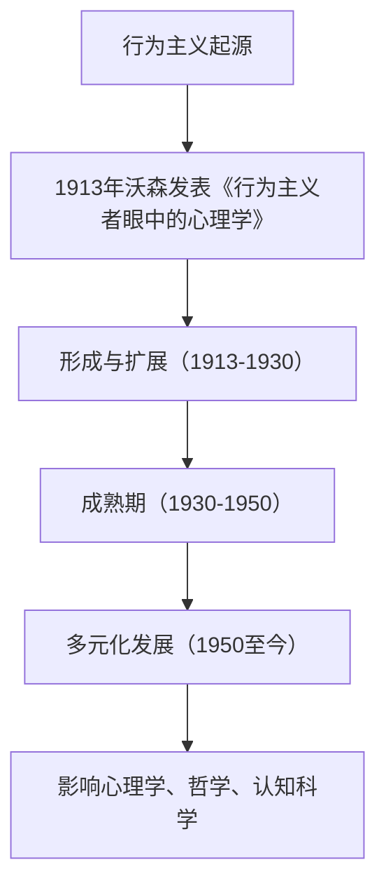
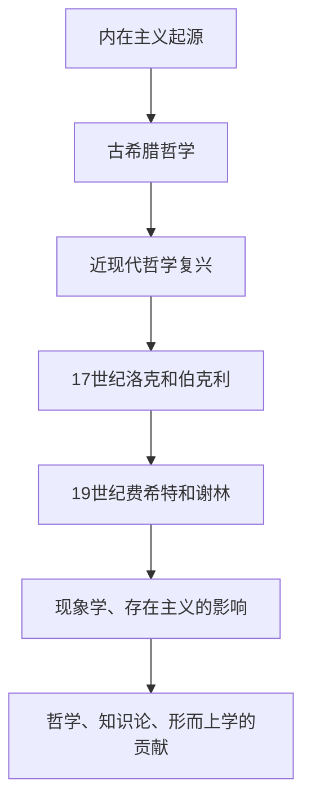

                 

### 文章标题：行为主义学派与内在主义学派

> **关键词：行为主义；内在主义；心理学；哲学；认知科学；比较分析**

> **摘要：本文深入探讨了行为主义学派与内在主义学派的历史背景、核心理论、应用领域及其异同，通过逻辑分析，比较了两者在心理学和哲学领域的贡献和影响，为读者提供了一个全面且系统的理解框架。**

### 行为主义学派概述

#### 第1章：行为主义学派的历史背景

行为主义作为现代心理学的第一个主要流派，起源于20世纪初的美国。行为主义的核心观点是，行为是可以通过观察和测量来研究的，而不是依赖于难以捉摸的内在心理状态。这一思想源于19世纪末和20世纪初的一系列科学和社会运动，如实证主义和功能主义，特别是美国心理学家约翰·B·沃森（John B. Watson）在1913年发表了著名的文章《行为主义者眼中的心理学》，正式宣告了行为主义的诞生。

行为主义的发展可以分为几个阶段。第一个阶段是从1913年到1930年，这一时期是行为主义的形成和扩展期，以沃森为代表的行为主义者在心理学界引起了广泛关注。沃森主张，心理学应该只关注可观察和可测量的行为，而不是不可知的内心世界。这一观点挑战了当时盛行的构造主义心理学，标志着行为主义的崛起。

第二个阶段是从1930年到1950年，这一时期是行为主义的成熟期。在这一时期，行为主义理论得到了进一步的发展和完善，特别是在学习理论、动机理论和条件反射方面取得了重要成果。斯金纳（B.F. Skinner）是这一阶段的重要代表人物，他提出了操作条件反射理论和强化理论，极大地推动了行为主义在临床心理治疗和教育领域的应用。

第三个阶段是从1950年至今，这一时期是行为主义的多元化发展期。随着认知心理学和生物心理学的兴起，行为主义开始与其他心理学流派融合，形成了一系列新的理论和研究方法。尽管行为主义的核心观点仍然影响着心理学研究，但现代心理学研究更多地结合了认知和神经科学的方法。

#### 1.2 行为主义的主要代表人物

1. **约翰·B·沃森（John B. Watson）**
   约翰·B·沃森是行为主义心理学的创始人。他主张心理学应该成为一门自然科学，只研究可观察和测量的行为，而不是内在的心理过程。沃森的《行为主义者眼中的心理学》一文标志着行为主义的诞生。

2. **B.F. 斯金纳（B.F. Skinner）**
   斯金纳是行为主义心理学的另一位重要代表人物。他提出了操作条件反射理论和强化理论，通过实验研究揭示了行为与环境之间的因果关系。斯金纳的理论对临床心理治疗和教育领域产生了深远影响。

3. **艾尔伍德·华生（E.L. Thorndike）**
   艾尔伍德·华生是行为主义心理学早期的重要贡献者，特别是他在学习理论方面的研究。他提出了联结主义学习理论，并设计了著名的“猫逃脱实验”，为行为主义提供了重要的实证基础。

4. **克拉克·赫尔（Clark L. Hull）**
   克拉克·赫尔是行为主义心理学的另一位重要代表人物，他提出了系统化的行为主义理论，并进行了大量的实验研究，为行为主义提供了坚实的理论基础。

#### 1.3 行为主义的核心概念

行为主义的核心概念主要包括：

1. **行为与反应**
   行为主义者认为，行为是可以通过观察和测量的外部活动，而不是内在的心理状态。反应是行为的一个基本单位，可以通过刺激和反应之间的关系来解释。

2. **条件反射**
   条件反射是行为主义的重要概念之一，指的是通过重复某种刺激和反应的配对，使得原本不会引起某种反应的刺激能够引起反应。经典条件反射和操作条件反射是条件反射的两种主要形式。

3. **强化**
   强化是影响行为发生概率的重要机制。正强化通过给予积极结果来增加行为的频率，而负强化通过移除不愉快的结果来增加行为的频率。惩罚则通过给予消极结果来减少行为的频率。

4. **学习**
   行为主义将学习视为行为的改变，通过条件反射和强化机制实现。学习可以分为经典条件反射学习和操作条件反射学习，前者是通过刺激和反应的配对实现学习，后者则是通过操作和结果的关系实现学习。

5. **环境决定论**
   行为主义者认为，行为主要是由环境决定的，而不是内在的遗传因素。这一观点强调了环境在个体行为发展中的重要作用。

#### 1.4 行为主义学派的影响

行为主义学派对心理学、哲学和认知科学产生了深远的影响。首先，在心理学领域，行为主义推动了心理学的科学化和实证化，使得心理学研究更加注重可观察和可测量的行为。其次，在哲学领域，行为主义挑战了内在主义的心理本质论，推动了哲学研究向外部行为和可观察现象的转变。最后，在认知科学领域，行为主义为认知心理学和认知神经科学提供了重要的理论基础和研究方法。

### 第2章：行为主义学派的基本理论

#### 2.1 行为主义心理学原理

行为主义心理学原理的核心在于对行为的理解，即行为是可以通过观察和测量来研究的。这一原理强调行为与外部环境之间的因果关系，认为行为是环境刺激与个体反应之间的相互作用结果。行为主义心理学的基本原理包括以下几个方面：

1. **刺激-反应模型**
   刺激-反应模型（Stimulus-Response Model）是行为主义心理学的核心原理。根据这一模型，个体的行为是由外部刺激引起的反应。具体来说，当一个外部刺激出现时，个体会产生一个相应的反应。这一模型可以通过以下公式来表示：

   \[
   刺激（S）→ 反应（R）
   \]

   其中，S代表刺激，R代表反应。这个模型强调了行为的外部性和可观察性。

2. **反应论**
   反应论（Response Theory）是行为主义心理学的一个基本观点，认为行为是直接由外部刺激引起的，而不是由内在的心理状态所决定的。反应论认为，心理学应该研究可观察的行为，而不是无法直接测量的心理状态。

3. **操作性条件作用**
   操作性条件作用（Operant Conditioning）是行为主义心理学的另一个重要原理，由B.F. 斯金纳提出。操作性条件作用理论强调，个体的行为可以通过正强化和负强化来影响其发生频率。正强化通过给予积极的结果（如奖励）来增加行为的频率，而负强化通过移除不愉快的结果（如惩罚）来增加行为的频率。操作性条件作用可以通过以下公式来表示：

   \[
   操作行为（O）→ 结果（R）
   \]

   其中，O代表操作行为，R代表结果。

4. **强化理论**
   强化理论（ Reinforcement Theory）是行为主义心理学的核心理论之一，它解释了行为是如何通过强化机制来习得的。强化理论包括三种类型的强化：正强化、负强化和惩罚。正强化通过给予积极的结果来增加行为的频率，负强化通过移除不愉快的结果来增加行为的频率，而惩罚通过给予消极的结果来减少行为的频率。

5. **惩罚理论**
   惩罚理论（Punishment Theory）是强化理论的组成部分，它解释了如何通过惩罚来减少不良行为。惩罚可以通过两种方式实现：呈现性惩罚（如给予电击）和移除性惩罚（如取消奖励）。惩罚的目的是减少不良行为的频率，但过度使用惩罚可能会导致负面后果，如焦虑和反社会行为。

#### 2.2 反应论与刺激-反应模型

反应论是行为主义心理学的基石，它认为个体的行为是由外部刺激直接引起的反应。这一理论挑战了构造主义心理学的观点，后者认为行为是由内在心理状态（如感觉、思想和欲望）所决定的。反应论通过强调外部刺激和行为之间的直接关系，为行为主义提供了一个清晰且可测量的研究框架。

刺激-反应模型是反应论的具体体现，它描述了外部刺激如何引起个体的反应。这个模型的核心观点是，每一个刺激都会引起一个特定的反应，而且这些反应是可以通过观察和测量的。通过这一模型，行为主义者能够对行为进行系统化的研究，从而理解行为的规律性和可预测性。

刺激-反应模型可以通过以下步骤来理解：

1. **刺激的识别**
   刺激（Stimulus）是引起行为反应的外部事件或刺激。刺激可以是物理的（如声音、光线、温度等），也可以是社会的（如语言、眼神、身体语言等）。行为主义者通过观察和测量刺激，来确定哪些刺激与特定行为相关。

2. **反应的产生**
   反应（Response）是刺激引起的个体行为。反应可以是外显的行为（如说话、移动、抓取等），也可以是内隐的行为（如心理活动、情绪变化等）。行为主义者通过观察和测量反应，来验证刺激-反应模型的有效性。

3. **强化与行为的巩固**
   强化（ Reinforcement）是行为主义心理学中的关键概念，它影响行为的发生频率。正强化（Positive Reinforcement）通过给予积极的结果（如奖励）来增加行为的频率，而负强化（Negative Reinforcement）通过移除不愉快的结果（如惩罚）来增加行为的频率。通过强化机制，行为主义者能够控制和改变个体的行为。

#### 2.3 强化理论

强化理论是行为主义心理学的一个重要组成部分，它解释了行为是如何通过强化机制来习得的。强化理论包括三种类型的强化：正强化、负强化和惩罚。这些强化机制在个体行为的发展中起着关键作用。

1. **正强化**
   正强化是通过给予积极的结果来增加行为的频率。正强化可以是直接的（如给予奖励），也可以是间接的（如获得社会认可）。例如，当儿童完成作业后，父母给予表扬和奖励，这会增强儿童完成作业的行为。

   \[
   行为（B）→ 正强化（R+）→ 行为频率增加
   \]

2. **负强化**
   负强化是通过移除不愉快的结果来增加行为的频率。负强化可以减少个体对不良行为的偏好。例如，当儿童停止哭泣时，父母停止对其大声斥责，这会增强儿童停止哭泣的行为。

   \[
   行为（B）→ 负强化（R-）→ 行为频率增加
   \]

3. **惩罚**
   惩罚是通过给予消极的结果来减少行为的频率。惩罚可以分为呈现性惩罚（如给予电击）和移除性惩罚（如取消奖励）。惩罚的目的是减少不良行为的频率，但过度使用惩罚可能会导致负面后果，如焦虑和反社会行为。

   \[
   行为（B）→ 惩罚（P）→ 行为频率减少
   \]

#### 2.4 学习理论

学习理论是行为主义心理学的重要组成部分，它探讨了行为是如何通过条件作用和环境刺激来习得的。学习理论主要包括经典条件反射理论和操作条件反射理论。

1. **经典条件反射理论**
   经典条件反射理论（Classical Conditioning Theory）是由伊万·彼德罗维奇·巴甫洛夫（Ivan Pavlov）提出的。经典条件反射是指通过重复将一个中性刺激与一个无条件刺激配对，使中性刺激能够引起条件反应。巴甫洛夫的实验中，狗被训练在听到铃声时分泌唾液，因为铃声（中性刺激）与食物（无条件刺激）反复配对，最终导致狗在听到铃声时也会分泌唾液。

   经典条件反射的过程可以概括为以下三个阶段：

   - **条件刺激的引入**：最初，中性刺激（如铃声）与无条件刺激（如食物）没有直接联系。
   - **条件刺激与无条件刺激的配对**：通过反复配对，中性刺激逐渐获得引起条件反应的能力。
   - **条件反应的形成**：中性刺激能够单独引起条件反应，如狗听到铃声时分泌唾液。

2. **操作条件反射理论**
   操作条件反射理论（Operant Conditioning Theory）是由B.F. 斯金纳提出的。操作条件反射是指通过个体的操作性行为与其结果之间的关系来影响行为。操作条件反射包括正强化、负强化和惩罚三种类型。

   - **正强化**：通过给予积极的结果来增加行为的频率。例如，教师给予学生奖励，以鼓励学生努力学习。
   
   - **负强化**：通过移除不愉快的结果来增加行为的频率。例如，学生停止做讨厌的作业后，家长停止施加压力。
   
   - **惩罚**：通过给予消极的结果来减少行为的频率。例如，学生因为调皮被老师惩罚，以减少其不良行为。

   操作条件反射的过程可以概括为以下三个阶段：

   - **行为的产生**：个体进行某种操作性行为。
   - **结果的出现**：行为的结果可以是正强化、负强化或惩罚。
   - **行为的调整**：个体根据结果调整其行为，从而增加或减少某些行为的频率。

#### 2.5 行为主义学派的应用

行为主义学派的理论在多个领域得到了广泛的应用，包括教育、临床心理治疗和动物行为研究等。这些应用展示了行为主义理论的实用性和有效性。

1. **教育领域**

   在教育领域，行为主义理论被广泛应用于教学策略和课堂管理。教师通过使用正强化和负强化来激励学生努力学习。例如，教师可以通过表扬和奖励来鼓励学生积极参与课堂活动，而通过取消奖励或给予惩罚来减少不良行为。行为主义理论还帮助教师设计有效的学习计划，通过逐步指导和反馈，帮助学生逐步掌握知识和技能。

2. **临床心理治疗**

   在临床心理治疗领域，行为主义理论被广泛应用于认知行为疗法（Cognitive Behavioral Therapy, CBT）。CBT 通过帮助患者识别和改变不良思维和行为模式，以改善其情绪和心理状态。例如，治疗师可以使用操作性条件作用技术，通过奖励患者的积极行为，逐步减少其不良行为。CBT 已经被证明对多种心理障碍，如焦虑症、抑郁症和强迫症等，有显著的治疗效果。

3. **动物行为研究**

   在动物行为研究方面，行为主义理论提供了重要的实验方法和技术。通过观察和测量动物的行为，研究者可以了解动物如何与环境互动，以及这些行为如何通过条件反射和强化机制习得。例如，通过经典条件反射实验，研究者可以确定动物对特定刺激的反应，并探索这些反应如何通过训练和强化来改变。

#### 第3章：行为主义学派的应用

行为主义学派的理论不仅在心理学领域产生了深远的影响，还在教育、临床心理治疗和动物行为研究等多个领域得到了广泛应用。以下是行为主义在这些领域的具体应用。

#### 3.1 教育领域的应用

在教育领域，行为主义理论被广泛用于教学策略和课堂管理。行为主义强调通过外部刺激和强化机制来影响学生的学习行为和成果。以下是一些具体的应用：

1. **积极强化**

   教师可以使用积极强化来激励学生。例如，当学生完成作业或表现出良好的学习态度时，教师可以给予表扬、奖励或额外的休息时间。这种正强化可以增加学生积极参与课堂活动和完成学习任务的可能性。

   \[
   学生表现良好（B）→ 教师表扬（R+）→ 学生积极性增加
   \]

2. **负强化**

   负强化也可以用于改善学生的学习行为。例如，当学生遵守课堂规则时，教师可以减少课堂作业量或取消不愉快的任务。这种负强化可以鼓励学生遵守规则，减少不良行为。

   \[
   学生遵守规则（B）→ 教师减少作业量（R-）→ 学生遵守规则的频率增加
   \]

3. **系统化奖励方案**

   教师可以设计系统化的奖励方案，通过奖励来激励学生长期的学习行为。例如，教师可以设立每周或每月的“学习之星”奖项，以奖励那些在学习上表现突出的学生。这种方案可以激发学生的竞争意识和学习动力。

#### 3.2 临床心理治疗

在临床心理治疗领域，行为主义理论被广泛应用于认知行为疗法（Cognitive Behavioral Therapy, CBT）。CBT 基于行为主义原理，通过帮助患者识别和改变不良思维和行为模式，从而改善其情绪和心理状态。以下是 CBT 的几个关键应用：

1. **行为实验**

   在 CBT 中，行为实验是一种重要的技术，用于帮助患者验证其思维和行为之间的关系。通过设计特定的行为任务，患者可以在实际环境中观察和评估其思维和行为对情绪的影响。例如，一个患有社交焦虑的患者可能被要求在公共场合进行演讲，以观察其焦虑情绪的变化。

2. **任务分配**

   CBT 帮助患者通过分配具体任务来逐步面对和克服恐惧和不良行为。例如，一个有洁癖的患者可能被要求逐步减少清洁时间，以逐渐适应减少清洁的行为。这种逐步暴露和任务分配可以帮助患者逐渐适应和处理其恐惧和不良行为。

3. **自我监控**

   自我监控是 CBT 中的重要技术，用于帮助患者识别和记录其思维、情感和行为。通过自我监控，患者可以更清楚地了解自己的心理和行为模式，并采取相应的改变策略。例如，一个焦虑症患者可能记录每天焦虑发作的时间、地点和情境，以便更好地理解和管理其焦虑情绪。

#### 3.3 动物行为研究

在动物行为研究中，行为主义理论提供了重要的实验方法和分析工具。通过观察和测量动物的行为，研究者可以了解动物如何适应环境、学习和记忆等信息处理过程。以下是行为主义在动物行为研究中的几个关键应用：

1. **条件反射实验**

   条件反射实验是行为主义在动物行为研究中的核心方法。通过经典条件反射和操作条件反射实验，研究者可以确定动物对特定刺激的反应，并探索这些反应如何通过训练和强化来改变。例如，研究者可以通过训练狗对声音信号产生唾液分泌反应，以研究条件反射的形成和机制。

2. **行为记录和分析**

   行为记录和分析是行为主义在动物行为研究中的重要方法。研究者可以使用摄像机、传感器和其他设备来记录动物的行为，并使用统计和分析工具来分析行为模式和变化。例如，通过记录动物在不同环境下的行为，研究者可以了解动物如何适应和应对不同的情境。

3. **环境控制实验**

   行为主义强调环境在行为发展中的重要作用。通过环境控制实验，研究者可以确定特定环境因素对动物行为的影响。例如，通过改变动物的食物、水源、社会环境和刺激条件，研究者可以观察这些因素如何影响动物的行为和生理状态。

### 第4章：内在主义学派概述

#### 4.1 内在主义的起源

内在主义（Intuitionism）作为哲学中的一个重要学派，其起源可以追溯到古希腊哲学，特别是在柏拉图和亚里士多德的思想中得到了体现。内在主义强调知识的内在性质，认为真理和现实是通过直接的直觉获得的，而不是通过外在的经验或观察。这一观点与外在主义（外在主义则主张知识来源于经验或观察）形成了鲜明的对比。

在近现代哲学中，内在主义的复兴主要发生在17世纪的英国哲学中，特别是以约翰·洛克（John Locke）和乔治·伯克利（George Berkeley）为代表。洛克认为，人的心灵最初是空白的，知识是通过感觉和反省获得的。而伯克利则提出了“存在即被感知”（To be is to be perceived）的命题，强调知识的内在性和直觉性。

进入19世纪，德国哲学家费希特（Johann Gottlieb Fichte）和谢林（Friedrich Wilhelm Joseph von Schelling）进一步发展了内在主义，将其作为哲学的核心原则。他们主张，知识不仅仅是外在经验的反映，而是个体内在意识活动的产物。

#### 4.2 内在主义的主要代表人物

1. **柏拉图（Plato）**
   柏拉图是西方哲学的奠基者之一，他的理念论哲学强调了内在真理和绝对现实的观念。柏拉图认为，知识来源于对理念的直觉认识，而不仅仅是感觉和经验的产物。他的《理想国》和《会饮篇》等著作中，详细阐述了内在主义的思想。

2. **亚里士多德（Aristotle）**
   亚里士多德是柏拉图的学生，他虽然对理念论持有批评态度，但也强调知识的内在性质。亚里士多德认为，知识是通过理性的推理和内省获得的，而不是通过纯粹的感觉经验。他的哲学体系为后来的内在主义提供了重要的理论基础。

3. **约翰·洛克（John Locke）**
   约翰·洛克是现代哲学的奠基者之一，他的经验主义哲学与内在主义形成对比。洛克认为，人的心灵最初是空白的，知识是通过感觉和反省获得的。然而，他的观点为后来的内在主义提供了批判和反思的契机。

4. **乔治·伯克利（George Berkeley）**
   乔治·伯克利是18世纪的重要哲学家，他的主观理想主义主张“存在即被感知”，认为物体的存在依赖于我们的感知。这一观点强调了知识的内在性和直觉性，对后来的内在主义发展产生了深远影响。

5. **费希特（Johann Gottlieb Fichte）**
   费希特是19世纪德国哲学家中最重要的内在主义代表之一。他提出了“自我意识”和“自我活动”的概念，认为知识是通过个体的内在直觉和自我认知获得的。费希特的哲学思想为后来的现象学和存在主义提供了重要的哲学基础。

6. **谢林（Friedrich Wilhelm Joseph von Schelling）**
   谢林是费希特的同事和朋友，他进一步发展了内在主义，提出了“自然哲学”和“绝对精神”的概念。谢林认为，现实是内在的、动态的，是通过个体的直觉和自我意识来理解和认识的。

#### 4.3 内在主义的核心观点

内在主义的核心观点可以概括为以下几点：

1. **直觉认识论**
   内在主义者认为，知识是通过直觉获得的，而不是通过经验或观察。直觉是一种直接认识真理的能力，不受外部干扰和扭曲。例如，柏拉图的理念论认为，人们通过直觉认识到理念世界的绝对真理。

2. **知识内在论**
   内在主义者主张，知识的真正来源是个体的内在意识，而不是外在的经验。知识是内在意识活动的产物，是通过个体的内在直觉和推理获得的。例如，费希特和谢林认为，自我意识和自我活动是知识的基础。

3. **反对经验主义**
   内在主义者反对经验主义，认为经验主义过分强调外在经验和观察的重要性，忽视了内在直觉和意识的作用。内在主义者认为，知识不仅仅是感觉和经验的产物，而是通过内在的理性推理和直觉获得的。

4. **主观理想主义**
   伯克利和部分内在主义者主张主观理想主义，认为现实世界的存在依赖于我们的感知和认识。这种观点强调了内在直觉和感知在知识形成中的核心作用。

#### 4.4 内在主义的哲学意义

内在主义在哲学史上具有重要的意义，它挑战了经验主义的传统观点，提出了知识的内在性和直觉性的问题。以下是内在主义在哲学中的几个关键意义：

1. **对认识论的贡献**
   内在主义为认识论提供了新的视角，强调知识的内在性质和直觉的重要性。这一观点促使人们反思知识的本质和来源，推动了认识论的发展。

2. **对存在主义的启示**
   内在主义对存在主义哲学产生了深远影响。存在主义强调个体存在的主观性和内在性，这与内在主义的观点相呼应。费希特和谢林的哲学思想为后来的存在主义哲学家如海德格尔和萨特提供了重要的哲学基础。

3. **对现象学的启示**
   内在主义对现象学的发展也有重要启示。现象学强调通过直接体验和理解现实，内在主义的思想为现象学家提供了研究方法和哲学基础。

4. **对心理学的影响**
   内在主义在心理学领域也有重要影响。认知心理学和现象心理学受到了内在主义的影响，强调个体的内在感知和直觉在认知过程中的作用。

### 第5章：内在主义学派的基本理论

#### 5.1 知识内在论

知识内在论（Introspective Theory of Knowledge）是内在主义的核心理论之一，它主张知识是通过个体的内在感知和直觉获得的，而不是通过外在的经验或观察。知识内在论认为，个体的内心世界是知识的基础，知识的真正来源是个体的内在意识活动。

知识内在论的基本观点可以概括为以下几点：

1. **直觉认识**
   知识内在论认为，直觉是一种直接认识真理的能力，不受外部干扰和扭曲。直觉使个体能够直接感知到事物的本质和真理，而不需要通过外在的经验或观察。柏拉图的理念论和费希特、谢林的自我意识理论都是知识内在论的具体体现。

2. **内在意识活动**
   知识内在论强调，知识是个体内在意识活动的产物。个体的内心世界是知识的基础，通过内在的感知和推理，个体能够获得关于外部世界的知识。例如，费希特认为，自我是所有知识的出发点，自我活动是知识产生的过程。

3. **反对经验主义**
   知识内在论反对经验主义的观点，认为经验主义过分强调外在经验和观察的重要性，忽视了内在直觉和意识的作用。知识内在论主张，知识不仅仅是感觉和经验的产物，而是通过内在的理性推理和直觉获得的。

4. **主观性**
   知识内在论认为，知识具有主观性，因为它是通过个体的内在感知和直觉获得的。不同的个体可能会有不同的知识和理解，因为每个人的内在意识和直觉都是独特的。这种观点强调了个体主体性在知识形成中的核心作用。

#### 5.2 直觉认识论

直觉认识论（Intuitionism）是内在主义的重要组成部分，它强调直觉在知识获取中的作用。直觉认识论主张，通过直接的直觉，个体能够获得关于事物本质和真理的知识，而不需要通过外在的经验或观察。

直觉认识论的基本观点可以概括为以下几点：

1. **直觉的本质**
   直觉是一种直接的认识能力，它使个体能够直接感知到事物的本质和真理，而不需要通过推理或分析。直觉是一种内在的、非逻辑的认知过程，它不受外在经验和观察的干扰。

2. **直觉的功能**
   直觉在知识获取中扮演着重要角色。通过直觉，个体能够迅速获得关于事物的信息，并作出判断和决策。直觉使个体能够快速适应环境，处理复杂的信息，并在没有明确证据的情况下作出合理的推断。

3. **直觉的认识论意义**
   直觉认识论认为，直觉是知识的重要来源，它补充了经验主义的不足。直觉能够揭示事物的本质和规律，为科学研究和哲学思考提供了基础。直觉认识论强调了直觉在科学发现和哲学思考中的核心作用。

4. **直觉与理性**
   直觉认识论并不否认理性在知识获取中的作用，但认为理性需要直觉的支持。理性是通过逻辑推理和分析来验证和解释直觉所获得的知识的。直觉为理性提供了直观的洞察和灵感，而理性则通过系统化的分析来深化和扩展直觉的认识。

#### 5.3 内在主义的语言哲学

内在主义的语言哲学探讨语言与知识之间的关系，认为语言是知识的媒介，同时也是知识的产物。内在主义语言哲学强调语言的内在性和主观性，认为语言是由个体的内在意识活动所构成，而不是外在经验或观察的产物。

内在主义语言哲学的基本观点可以概括为以下几点：

1. **语言的内在性**
   内在主义语言哲学主张，语言是个体内在意识活动的产物，它反映了个体内心的感知和思维。语言不仅仅是交流的工具，更是知识表达和认知过程的载体。个体通过语言来表达和沟通其内在的思想和情感。

2. **语言的主观性**
   内在主义语言哲学认为，语言具有主观性，因为它是通过个体的内在感知和直觉获得的。不同的个体可能会有不同的语言表达和理解，因为每个人的内在意识和直觉都是独特的。这种观点强调了个体主体性在语言形成和交流中的核心作用。

3. **意义与指称**
   内在主义语言哲学探讨意义与指称的关系，认为语言的意义不仅仅是外在事物的名称或标志，更是个体对事物的内在感知和理解的反映。意义是个体内在意识活动的产物，它依赖于个体的直觉和感知。

4. **语言与知识的关系**
   内在主义语言哲学认为，语言是知识表达和传播的重要工具。通过语言，个体能够将其内在的知识和认识传达给他人，实现知识的传递和交流。语言不仅是知识的载体，也是知识生成和发展的媒介。

5. **内在主义语言哲学的影响**
   内在主义语言哲学对现代哲学和语言学产生了深远影响。它挑战了外在主义语言哲学的观点，强调了语言的内在性和主观性。内在主义语言哲学为认知科学和哲学思考提供了新的视角和方法，推动了语言哲学和语言学的发展。

### 第6章：内在主义学派的应用

内在主义学派的理论不仅在哲学领域有着深远的影响，还在哲学、知识论和形而上学等领域得到了广泛的应用。以下是内在主义在这些领域的具体应用。

#### 6.1 哲学领域的应用

在哲学领域，内在主义为知识论和认识论提供了新的视角，挑战了传统经验主义和外在主义的观点。内在主义主张，知识来源于个体的内在感知和直觉，而不是外在的经验或观察。以下是一些内在主义在哲学领域的具体应用：

1. **知识的主观性**
   内在主义强调知识的主观性，认为知识是个体内在意识活动的产物。个体通过直觉和内在感知获得知识，这种知识具有主观性，因为每个人的感知和直觉都是独特的。这一观点挑战了经验主义的知识观，强调了个体主体性在知识形成中的核心作用。

2. **直觉的重要性**
   内在主义认为，直觉是知识的重要来源，它使个体能够直接感知到事物的本质和真理。直觉不仅是一种认知能力，也是一种认识真理的方法。内在主义通过强调直觉在知识获取中的作用，为直觉认识论提供了理论依据。

3. **对认识论的贡献**
   内在主义对认识论的研究产生了重要影响，特别是对知识本质和认识过程的理解。内在主义认为，知识不仅仅是感觉和经验的产物，而是通过个体的内在直觉和推理获得的。这种观点促使人们反思知识的本质和来源，推动了认识论的发展。

#### 6.2 知识论的应用

在知识论领域，内在主义为知识的定义和获取方式提供了新的解释。内在主义强调知识的内在性质，认为知识是通过个体的内在感知和直觉获得的，而不是通过外在的经验或观察。以下是一些内在主义在知识论领域的具体应用：

1. **知识的本质**
   内在主义认为，知识的本质是个体的内在感知和直觉，这种知识不同于经验主义所强调的外在经验。内在主义主张，知识是一种内在的意识活动，它反映了个体对事物的直接认识和理解。

2. **知识的可靠性和真实性**
   内在主义强调知识的可靠性和真实性，认为通过内在直觉和感知获得的知识是真实的和可靠的。这一观点挑战了经验主义的怀疑论观点，认为外在经验并不总是可靠的知识来源。

3. **知识的个体性**
   内在主义认为，知识具有个体性，因为它是通过个体的内在感知和直觉获得的。每个人的感知和直觉都是独特的，因此每个人对事物的认识和理解也是不同的。这种观点强调了个体在知识形成中的重要作用。

#### 6.3 形而上学的应用

在形而上学领域，内在主义为现实和存在提供了新的解释。内在主义主张，现实和存在是依赖于个体的内在感知和直觉的，而不是独立于个体存在的。以下是一些内在主义在形而上学领域的具体应用：

1. **存在的内在性**
   内在主义认为，存在是内在的，依赖于个体的内在感知和直觉。存在不是独立于个体的外在实体，而是通过个体的内在感知来认识和理解的。这种观点挑战了外在主义的存在观，认为现实和存在是主观的、个体性的。

2. **现实的本质**
   内在主义认为，现实是复杂的、动态的，是由个体的内在感知和直觉所构成的。现实不仅仅是外在的物体和事件，还包括个体的内在体验和情感。这种观点为形而上学提供了新的研究视角，使人们更深入地理解现实的本质。

3. **对形而上学的贡献**
   内在主义对形而上学的研究产生了重要影响，特别是对存在和现实的本质的理解。内在主义认为，存在和现实是依赖于个体的内在感知和直觉的，这种观点为形而上学提供了新的解释框架，促使人们重新思考存在的本质和意义。

### 第7章：行为主义与内在主义的比较

#### 7.1 理论基础与观点对比

行为主义和内在主义在理论基础和观点上存在显著的差异。行为主义强调外部行为和可观察的行为反应，而内在主义则强调内在意识、直觉和主观体验。

1. **行为主义**
   行为主义的理论基础是外部刺激和反应之间的关系。行为主义者认为，行为是通过刺激-反应模型（Stimulus-Response Model）来解释的，即外部刺激引起个体的行为反应。行为主义强调可观察和可测量的行为，认为内在心理状态是不可观察的，因此不应成为心理学研究的主要对象。

2. **内在主义**
   内在主义的理论基础是内在意识、直觉和主观体验。内在主义者认为，知识是通过直觉和内在感知获得的，而不是通过外在的经验或观察。内在主义强调个体的主观性和内在感知，认为内在心理状态是知识的基础。

#### 7.2 应用领域与效果对比

行为主义和内在主义在应用领域和效果上也存在显著差异。行为主义主要应用于教育、临床心理治疗和动物行为研究，而内在主义则更多应用于哲学、知识论和形而上学。

1. **教育领域**
   在教育领域，行为主义的应用包括教学策略、课堂管理和奖励机制。通过正强化和负强化，教师可以激励学生积极参与课堂活动和完成学习任务。行为主义的方法已被广泛证明在改善学生学习成绩和课堂行为方面是有效的。

2. **临床心理治疗**
   在临床心理治疗领域，行为主义被广泛应用于认知行为疗法（CBT）。通过操作性条件作用和强化机制，治疗师可以帮助患者改变不良思维和行为模式，从而改善其情绪和心理状态。CBT 已经被证明对多种心理障碍，如焦虑症、抑郁症和强迫症等，有显著的治疗效果。

3. **动物行为研究**
   在动物行为研究方面，行为主义提供了重要的实验方法和分析工具。通过条件反射和强化机制，研究者可以了解动物如何适应环境、学习和记忆等信息处理过程。行为主义的实验方法和技术在动物行为研究中得到了广泛应用。

4. **哲学和知识论**
   在哲学和知识论领域，内在主义的应用包括直觉认识论、知识内在论和主观理想主义。内在主义挑战了经验主义的观点，主张知识是通过内在直觉和主观体验获得的。内在主义在哲学领域对认识论、形而上学和语言哲学产生了深远影响。

5. **形而上学**
   在形而上学领域，内在主义提供了新的视角，探讨了存在和现实的本质。内在主义认为，存在和现实是依赖于个体的内在感知和直觉的，这种观点挑战了外在主义的存在观，为形而上学提供了新的解释框架。

#### 7.3 学术影响与历史地位

行为主义和内在主义在心理学和哲学领域都产生了深远的影响，并各自占据了重要的历史地位。

1. **行为主义的学术影响**
   行为主义作为现代心理学的第一个主要流派，对心理学的发展产生了深远影响。行为主义推动了心理学的科学化和实证化，使心理学研究更加注重可观察和可测量的行为。行为主义的理论和方法在教育、临床心理治疗和动物行为研究等领域得到了广泛应用。行为主义的主要代表人物如约翰·B·沃森和斯金纳，他们的工作为心理学研究提供了重要的理论基础和研究方法。

2. **内在主义的学术影响**
   内在主义在哲学领域产生了深远影响，特别是在认识论、知识论和形而上学领域。内在主义挑战了经验主义的传统观点，提出了知识的内在性和直觉性的问题。内在主义的思想为后来的现象学和存在主义提供了重要的哲学基础，如费希特和谢林的哲学思想对后来的哲学家如海德格尔和萨特产生了深远影响。

3. **历史地位**
   行为主义和内在主义在心理学和哲学史上都占据了重要的历史地位。行为主义作为现代心理学的第一个主要流派，标志着心理学从哲学和神学中独立出来，成为一门科学。内在主义则作为哲学中的一个重要流派，对认识论、知识论和形而上学的发展产生了深远影响。

### 第8章：综合评价与未来展望

#### 8.1 行为主义与内在主义的综合评价

行为主义和内在主义在心理学和哲学领域都产生了深远的影响，各自具有独特的优势和应用。以下是两种学派的综合评价：

1. **行为主义**

   行为主义在心理学领域取得了显著的成就，特别是其在教育、临床心理治疗和动物行为研究中的应用。行为主义强调外部行为和可观察的行为反应，使心理学研究更加科学化和实证化。行为主义的方法和技术为理解和改变人类行为提供了有力的工具，特别是在学习和强化理论方面，对教育、临床心理治疗和行为干预产生了重要影响。

   然而，行为主义也面临一些批评和挑战。一些学者认为，行为主义过于强调外部行为，忽视了内在心理状态的作用。行为主义的方法也受到质疑，因为行为反应可能受到许多因素的影响，如个体差异、环境和背景等。尽管如此，行为主义作为心理学的一个主要流派，其贡献是不可忽视的。

2. **内在主义**

   内在主义在哲学领域具有重要的地位，特别是在认识论、知识论和形而上学领域。内在主义挑战了经验主义的传统观点，主张知识是通过内在直觉和主观体验获得的。内在主义的思想为后来的现象学和存在主义提供了重要的哲学基础，对现代哲学的发展产生了深远影响。

   内在主义的优点在于其强调个体的主体性和内在感知，为理解和解释人类认知和意识提供了新的视角。然而，内在主义也面临一些挑战，如如何界定直觉和主观体验的可靠性和真实性，以及如何与外在经验相结合等问题。尽管如此，内在主义作为哲学中的一个重要流派，其贡献是显著的。

#### 8.2 学派融合的可能性

行为主义和内在主义虽然在理论基础和应用领域上存在差异，但两者之间并非完全对立。实际上，行为主义和内在主义在一定程度上可以相互补充，实现学派的融合。

1. **内在行为主义**

   内在行为主义（Introspective Behaviorism）是一种将行为主义与内在主义相结合的理论，强调个体内在感知和行为反应之间的关系。内在行为主义认为，个体的行为反应不仅受到外部刺激的影响，也受到内在感知和直觉的作用。这种理论试图在行为主义和内在主义之间架起一座桥梁，使两者相互补充，共同解释人类行为。

   内在行为主义的主要观点包括：

   - **直觉与行为反应的关系**：内在行为主义认为，直觉是个体行为反应的一个重要因素。个体通过内在感知和直觉来理解外部刺激，从而产生相应的行为反应。

   - **内在感知的影响**：内在行为主义强调，个体内在感知对行为反应具有重要作用。内在感知可以影响个体的行为选择和决策，从而在行为主义的基础上增加了内在因素的考量。

   - **综合性解释**：内在行为主义试图通过结合外部行为和内在感知，提供一个更全面的解释框架，以解释人类行为的复杂性和多样性。

2. **未来的研究方向**

   行为主义和内在主义的融合为心理学和哲学的研究提供了新的方向。以下是一些可能的研究领域：

   - **直觉与行为反应的关系**：进一步研究直觉在行为反应中的作用，探索直觉如何影响个体的行为选择和决策。

   - **内在感知的影响**：深入研究内在感知对个体行为反应的影响，特别是在学习和记忆过程中。

   - **跨学科研究**：将行为主义和内在主义的理论与方法应用于其他学科领域，如认知科学、神经科学和人工智能等，探索不同学科之间的融合点。

   - **混合方法的应用**：结合行为主义和内在主义的方法，开发新的研究方法和技术，以更全面地理解人类行为和心理过程。

#### 8.3 未来的心理学研究趋势

随着心理学研究的不断深入，未来的心理学研究趋势将呈现出以下几个特点：

1. **跨学科研究**

   跨学科研究将成为未来心理学研究的重要趋势。心理学与其他学科，如认知科学、神经科学、人工智能、教育学和医学等，将进行更深入的交流和合作，探索心理学问题的多维度解决方案。

2. **大数据分析**

   随着大数据技术的发展，心理学研究将更加依赖于数据分析方法。通过收集和分析大量数据，研究者可以更准确地识别心理现象和规律，从而提高心理学研究的科学性和可靠性。

3. **计算心理学**

   计算心理学将成为心理学研究的一个重要分支。通过计算机模拟和算法分析，研究者可以更好地理解心理过程的机制和复杂性，为心理学理论的构建和应用提供新的方法和工具。

4. **神经科学视角**

   神经科学的发展将使心理学研究更加深入。通过神经成像技术和脑电图等手段，研究者可以更直观地观察和理解大脑在心理活动中的作用，从而为心理学研究提供重要的生理基础。

5. **个性化研究**

   未来的心理学研究将更加关注个体的差异和个性化。通过个性测试、行为分析和数据挖掘等方法，研究者可以更准确地识别个体的心理特征和需求，为个性化教育和心理治疗提供科学依据。

### 附录A：参考文献

- Watson, J. B. (1913). *Psychology as the Behaviorist Views It*. Psychological Review, 20(2), 158-177.
- Skinner, B. F. (1938). *The Behavior of Organisms: An Experimental Analysis*. Appleton-Century-Crofts.
- Thorndike, E. L. (1911). *Animal Intelligence: An Experimental Study*. Macmillan.
- Hull, C. L. (1943). *A Behavior System*. Journal of Comparative Psychology, 34, 1-60.
- Pavlov, I. P. (1927). *Experiments in Conditioned Refection*. Oxford University Press.
- Locke, J. (1689). *An Essay Concerning Human Understanding*. Johnrippon.com.
- Berkeley, G. (1710). *A Treatise Concerning the Principles of Human Knowledge*. Clarendon Press.
- Fichte, J. G. (1804). *The Vindications of Pure Reason*. Harvard University Press.
- Schelling, F. W. J. (1809). *On the Study of Natural Philosophy*. Cambridge University Press.

### 附录B：Mermaid流程图

#### 行为主义学派发展流程图



#### 内在主义学派发展流程图



### 附录C：核心算法原理讲解

#### 行为主义核心算法原理

**操作条件反射理论伪代码：**

```python
def operant_conditioning(response, reinforcement):
    if response:
        if reinforcement == "positive":
            reward(response)
        elif reinforcement == "negative":
            remove punishing stimulus(response)
    return response
```

**数学模型：**

$$
R(S) = f(R, S, O)
$$

其中，\( R \) 表示强化（Reinforcement），\( S \) 表示刺激（Stimulus），\( O \) 表示操作行为（Operant Behavior），\( f \) 表示强化函数。

#### 内在主义核心算法原理

**直觉认识论算法原理：**

```python
def intuitionism_perception(percept):
    if percept:
        intuition(percept)
        return knowledge(percept)
    else:
        return "No knowledge"
```

**数学模型：**

$$
K = f(I, P)
$$

其中，\( K \) 表示知识（Knowledge），\( I \) 表示直觉（Intuition），\( P \) 表示感知（Perception），\( f \) 表示直觉函数。

### 作者信息

**作者：AI天才研究院/AI Genius Institute & 禅与计算机程序设计艺术 /Zen And The Art of Computer Programming**

