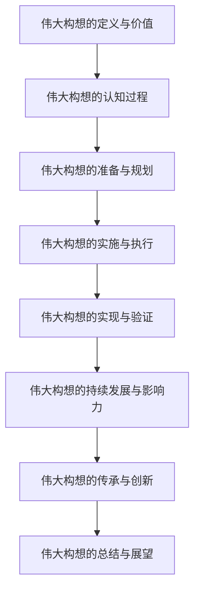

                 

# 文章标题：行动力：将伟大构想化为现实

> 关键词：伟大构想，行动力，创新，前瞻性，现实性，商业价值，个人意义，认知过程，准备与规划，实施与执行，持续发展，影响力，传承与创新

> 摘要：本文深入探讨了伟大构想的认知与准备、实施与执行以及持续发展与影响力等关键环节，通过逻辑清晰、结构紧凑的分析和推理，旨在帮助读者理解如何将伟大的构想化为现实。文章分为三大部分，分别从不同角度阐述伟大构想的内涵、价值、认知过程、准备与规划、实施与执行、持续发展与影响力，以及传承与创新。通过这些步骤，读者将学会如何识别、评估、发展并实施伟大构想，从而实现个人梦想，提升企业竞争力，为社会创造价值。

---

### 引言

在当前这个信息爆炸、技术飞速发展的时代，创新成为推动社会进步的重要动力。然而，创新不仅仅是一个口号，它需要实际行动和坚定的执行力去实现。伟大构想，作为创新的源头，是每个人都应该去追求的目标。但是，如何将一个伟大的构想转化为现实，是许多人面临的一大挑战。

本文旨在通过系统地分析伟大构想的认知与准备、实施与执行以及持续发展与影响力等关键环节，为读者提供一套清晰、实用、高效的行动指南。通过这篇文章，读者将学会如何从生活中寻找灵感，评估构想的可行性，制定详细的行动计划，实施和调整策略，实现伟大构想，并持续创新和发展。

本文将分为三个部分：第一部分将探讨伟大构想的认知与准备，包括伟大构想的定义、价值、认知过程、准备与规划；第二部分将讨论伟大构想的实施与执行，包括实施策略、监控与反馈、调整与优化、持续改进；第三部分将阐述伟大构想的持续发展与影响力，以及传承与创新。希望通过本文的阐述，读者能够理解并掌握将伟大构想化为现实的方法和技巧。

### 《行动力：将伟大构想化为现实》目录大纲

#### 第一部分：伟大构想的认知与准备

- 第1章：伟大构想的定义与价值
  - 1.1 伟大构想的内涵
  - 1.2 伟大构想的商业价值
  - 1.3 伟大构想的个人意义
- 第2章：伟大构想的认知过程
  - 2.1 灵感来源
  - 2.2 构想筛选与评估
  - 2.3 构想发展与完善
- 第3章：伟大构想的准备与规划
  - 3.1 市场调研
  - 3.2 资源配置
  - 3.3 时间管理

#### 第二部分：伟大构想的实施与执行

- 第4章：伟大构想的实施策略
  - 4.1 制定详细的行动计划
  - 4.2 团队协作
  - 4.3 风险管理
- 第5章：伟大构想的执行与调整
  - 5.1 监控与反馈
  - 5.2 调整与优化
  - 5.3 持续改进
- 第6章：伟大构想的实现与验证
  - 6.1 成果评估
  - 6.2 验证与推广
  - 6.3 成功案例分析

#### 第三部分：伟大构想的持续发展与影响力

- 第7章：伟大构想的后续发展
  - 7.1 延伸与拓展
  - 7.2 影响力扩大
- 第8章：伟大构想的传承与创新
  - 8.1 传承与培养
  - 8.2 创新与升级
- 第9章：伟大构想的总结与展望
  - 9.1 经验总结
  - 9.2 展望未来
  - 9.3 结论

### 第一部分：伟大构想的认知与准备

#### 第1章：伟大构想的定义与价值

在探讨伟大构想的行动力之前，我们需要先明确伟大构想的定义和其价值所在。伟大构想，顾名思义，是一种卓越、创新、具有前瞻性的想法或计划。它不仅仅是一个简单的点子，而是一个能够引领行业、改变世界的重大突破。

### 1.1 伟大构想的内涵

伟大构想的内涵可以分解为三个核心要素：创新性、前瞻性和现实性。

- **创新性**：伟大构想必须具备创新性，即要有独特的思考方式和创新的解决方案。这种创新可以是技术上的突破，也可以是商业模式上的创新。
- **前瞻性**：伟大构想需要具有前瞻性，能够预见未来的发展趋势，从而引领时代潮流。这意味着构想需要站在行业发展的前沿，而不是仅仅跟随。
- **现实性**：伟大构想虽然具有创新性和前瞻性，但同时也必须是现实的。这意味着构想必须具备可操作性，能够被实现和执行。

我们可以用以下公式来定义伟大构想：

$$
\text{伟大构想} = \left(\text{创新性} + \text{前瞻性} + \text{现实性}\right)
$$

### 1.2 伟大构想的商业价值

伟大构想对商业世界的影响是深远且广泛的。首先，它能够显著提升企业的竞争力。在竞争激烈的市场环境中，拥有独特、创新的解决方案能够帮助企业脱颖而出，赢得更多的市场份额。

其次，伟大构想能够带来巨大的经济效益。一个成功的伟大构想不仅能够为企业带来直接的利润，还能够推动整个产业链的发展，从而创造更多的商业机会。

最后，伟大构想还能够提升企业的品牌形象。当一个企业能够不断地推出创新的解决方案，它将在客户和市场中树立起权威和信任，从而提升企业的品牌价值和市场地位。

### 1.3 伟大构想的个人意义

伟大构想不仅仅对商业世界有重要意义，对个人也有着深远的影响。首先，伟大构想能够帮助个人实现梦想。每个人都有自己的梦想和目标，而伟大构想是实现这些目标的重要途径。通过伟大的构想，个人能够为自己设定更高的目标，并为之努力奋斗。

其次，伟大构想能够提升个人的价值。在现代社会，个人的价值往往与其成就和贡献成正比。一个伟大的构想不仅能够带来实际的收益，还能够提升个人的社会地位和认可度。

最后，伟大构想能够激发个人的创造力和创新精神。在实现伟大构想的过程中，个人需要不断地思考和尝试，这无疑能够激发个人的创造力和创新精神，从而提升个人综合素质。

### 1.4 伟大构想的定义与价值总结

通过本章的讨论，我们可以得出以下结论：

- 伟大构想是一种卓越、创新、具有前瞻性的想法或计划，其内涵包括创新性、前瞻性和现实性。
- 伟大构想对商业世界和个人都有重要的价值，能够提升企业的竞争力、带来经济效益、提升品牌形象，同时也能够帮助个人实现梦想、提升个人价值和激发创造力。

在接下来的章节中，我们将进一步探讨伟大构想的认知过程、准备与规划，帮助读者更深入地理解如何将伟大构想转化为现实。

---

### 第1章：伟大构想的定义与价值

#### 1.1 伟大构想的内涵

伟大构想的内涵可以从三个核心要素来理解：创新性、前瞻性和现实性。

首先，创新性是伟大构想的核心。一个构想是否伟大，首先取决于它的创新程度。创新性不仅仅是技术上的突破，它还可以体现在商业模式的创新、服务模式的创新等多个方面。例如，阿里巴巴的电子商务模式就是一种前所未有的创新，它改变了人们的购物方式，颠覆了传统的商业模式。

其次，前瞻性是伟大构想的另一重要要素。前瞻性意味着构想能够预见未来的趋势和变化，从而引领时代的发展。比如，特斯拉的电动汽车构想，不仅预见到了环保能源的发展趋势，还引领了全球汽车行业的转型。

最后，现实性是伟大构想的必要条件。即使一个构想再创新、再前瞻，如果无法被实现，那么它也只能停留在纸上谈兵。现实性要求构想必须具有可行性，能够被实际操作和执行。

我们可以用以下公式来定义伟大构想：

$$
\text{伟大构想} = \left(\text{创新性} + \text{前瞻性} + \text{现实性}\right)
$$

#### 1.2 伟大构想的商业价值

伟大构想对商业世界的影响是深远且广泛的。以下是一些具体的例子和解释：

1. **提升企业竞争力**：

在一个竞争激烈的市场环境中，拥有独特、创新的解决方案能够帮助企业脱颖而出，赢得更多的市场份额。例如，苹果公司的iPhone不仅是一款创新的智能手机，它还重新定义了整个手机行业，使得苹果在智能手机市场中占据了领先地位。

2. **带来经济效益**：

一个成功的伟大构想不仅能够为企业带来直接的利润，还能够推动整个产业链的发展，从而创造更多的商业机会。比如，亚马逊的云计算服务不仅为亚马逊自身带来了巨大的经济效益，还推动了整个云计算产业的快速发展。

3. **提升品牌形象**：

当一个企业能够不断地推出创新的解决方案，它将在客户和市场中树立起权威和信任，从而提升企业的品牌价值和市场地位。例如，谷歌的搜索引擎和广告业务不仅带来了巨大的经济效益，还使得谷歌成为全球最具影响力的科技公司之一。

#### 1.3 伟大构想的个人意义

伟大构想不仅仅对商业世界有重要意义，对个人也有着深远的影响。

1. **实现个人梦想**：

每个人都有自己的梦想和目标，而伟大构想是实现这些目标的重要途径。通过伟大的构想，个人能够为自己设定更高的目标，并为之努力奋斗。例如，乔布斯的伟大构想——苹果公司，不仅让他实现了自己的梦想，还改变了整个世界。

2. **提升个人价值**：

在现代社会，个人的价值往往与其成就和贡献成正比。一个伟大的构想不仅能够带来实际的收益，还能够提升个人的社会地位和认可度。例如，比尔·盖茨通过微软的伟大构想，不仅成为世界首富，还被誉为计算机产业的奠基人。

3. **激发创造力和创新精神**：

在实现伟大构想的过程中，个人需要不断地思考和尝试，这无疑能够激发个人的创造力和创新精神，从而提升个人综合素质。例如，爱因斯坦的相对论构想，不仅极大地推动了物理学的发展，也激发了他自己在科学领域的创新思维。

### 1.4 伟大构想的定义与价值总结

通过本章的讨论，我们可以得出以下结论：

- 伟大构想是一种卓越、创新、具有前瞻性的想法或计划，其内涵包括创新性、前瞻性和现实性。
- 伟大构想对商业世界和个人都有重要的价值，能够提升企业的竞争力、带来经济效益、提升品牌形象，同时也能够帮助个人实现梦想、提升个人价值和激发创造力。

在接下来的章节中，我们将进一步探讨伟大构想的认知过程、准备与规划，帮助读者更深入地理解如何将伟大构想转化为现实。

---

### 第2章：伟大构想的认知过程

伟大构想的诞生并非偶然，而是源于一个系统的认知过程。这一过程包括灵感的来源、构想的筛选与评估以及构想的初步发展与完善。在这一章中，我们将详细探讨这些环节，帮助读者理解如何有效地捕捉和孵化伟大构想。

#### 2.1 灵感来源

灵感是伟大构想的源头，它可以是生活中的点滴、工作中的发现，甚至是梦境中的奇思妙想。以下是一些常见的灵感来源：

1. **生活中的点滴**：日常生活中的小事件、观察和体验往往能够激发灵感。例如，发明家詹姆斯·戴森（James Dyson）的吸尘器灵感来源于他对现有吸尘器清洁效果的不满。

2. **工作中的发现**：在工作中遇到的问题和挑战也可以成为灵感的来源。例如，谷歌的自动驾驶汽车构想源自于解决交通拥堵和安全性问题。

3. **阅读与学习**：阅读相关的书籍、论文和行业报告，学习新的知识和技能，可以拓宽视野，激发灵感。例如，苹果公司创始人史蒂夫·乔布斯（Steve Jobs）的许多伟大构想都来源于他对科技和艺术的深入理解。

4. **梦境与直觉**：有时候，灵感会在梦境中以直觉的形式出现。虽然这听起来有些神秘，但许多伟大的发明和创作都起源于梦境。例如，俄国作曲家穆索尔斯基（Modest Mussorgsky）的歌剧《荒山之夜》就是他在梦中构想出来的。

#### 2.2 构想筛选与评估

捕捉到灵感后，下一步是对构想进行筛选和评估。这一过程需要我们运用批判性思维和系统分析方法，确保每一个构想都具备实现的可能性。

1. **创新性评估**：首先，我们需要评估构想的创新程度。创新性评估可以通过以下问题进行：

   - 这个构想是否解决了现有的痛点？
   - 这个构想是否具有独特性，无法被现有的解决方案所替代？
   - 这个构想是否具有潜在的市场需求？

2. **前瞻性评估**：其次，我们需要评估构想的未来发展趋势。前瞻性评估可以通过以下问题进行：

   - 这个构想是否符合未来的技术发展趋势？
   - 这个构想是否能够引领行业变革？
   - 这个构想是否能够持续发展，具备长期价值？

3. **现实性评估**：最后，我们需要评估构想的现实性。现实性评估可以通过以下问题进行：

   - 这个构想是否具有可操作性，能够被实际执行？
   - 这个构想是否具备所需的资源和支持？
   - 这个构想是否能够解决实施过程中可能遇到的挑战？

#### 2.3 构想发展与完善

经过筛选和评估后，我们选择出最有潜力的构想进行进一步的发展和优化。这一过程包括以下几个方面：

1. **构建构想的蓝图**：将构想转化为具体的计划，包括目标、策略、步骤和预期成果。构建构想的蓝图可以通过以下步骤进行：

   - 确定构想的总体目标。
   - 制定实现目标的详细步骤。
   - 设计实现目标的策略和资源分配。
   - 设定明确的里程碑和评估标准。

2. **迭代与优化**：在构建构想的蓝图中，我们需要不断地迭代和优化，确保构想的可行性和有效性。迭代与优化可以通过以下方式进行：

   - 收集反馈并进行修正。
   - 调整策略和资源分配。
   - 重新评估构想的创新性、前瞻性和现实性。
   - 不断更新构想的蓝图，以适应新的市场和技术变化。

3. **建立团队协作**：实现伟大构想通常需要团队的协作。在构想的发展和完善过程中，我们需要建立一个高效的团队，确保每个人都清楚自己的职责和目标。团队协作可以通过以下方式实现：

   - 明确团队成员的角色和职责。
   - 定期召开会议，分享进展和问题。
   - 建立有效的沟通渠道，确保信息的及时传递。
   - 鼓励团队成员提出创新和改进的建议。

#### 2.4 灵感来源、构想筛选与评估、构想发展与完善总结

通过本章的讨论，我们可以得出以下结论：

- 灵感来源是伟大构想的基础，生活中的点滴、工作中的发现、阅读与学习以及梦境与直觉都是常见的灵感来源。
- 构想筛选与评估是确保构想具备实现可能性的关键环节，创新性、前瞻性和现实性是评估的重要标准。
- 构想发展与完善是将伟大构想转化为现实的必要步骤，包括构建构想的蓝图、迭代与优化、建立团队协作等。

在下一章中，我们将探讨伟大构想的准备与规划，帮助读者理解如何为伟大构想的实施做好充分准备。

---

### 第2章：伟大构想的认知过程

#### 2.1 灵感来源

灵感是伟大构想的萌芽，它是创新的起点。以下是几种常见的灵感来源：

1. **生活中观察与体验**：

   生活中的点滴和体验往往能激发灵感。例如，著名的3M公司的透明胶带便是由一个简单的错误引发的。一位工程师在实验室里弄丢了沾有粘合剂的棉签，他尝试用这种粘合剂制作透明胶带，结果大获成功。

2. **工作中发现问题**：

   工作中的问题和挑战可以成为灵感的源泉。例如，谷歌的创始人拉里·佩奇和谢尔盖·布林便是在解决学术搜索引擎的问题时，发现了搜索引擎市场的巨大潜力，从而创立了谷歌。

3. **跨学科交流**：

   跨学科的交流能够带来新的视角和灵感。例如，IBM的托马斯·沃森三世在一次与艺术家和作家的交流中，受到了创意思维的启发，从而提出了“思考者的世界”（Think）的广告口号。

4. **梦境与直觉**：

   梦境和直觉也是灵感的重要来源。例如，俄国作曲家穆索尔斯基（Modest Mussorgsky）的歌剧《荒山之夜》便是在梦中构想的。

#### 2.2 构想筛选与评估

捕捉到灵感后，我们需要对构想进行筛选和评估。以下是一些关键步骤和方法：

1. **创新性评估**：

   - **新颖性**：构想是否解决了现有问题，提供了全新的解决方案？
   - **独特性**：构想是否具有独特性，无法被现有解决方案所替代？

2. **前瞻性评估**：

   - **趋势预测**：构想是否预见到了未来的发展趋势？
   - **行业变革**：构想是否能够引领行业变革，推动技术进步？

3. **现实性评估**：

   - **可行性**：构想是否具备实际操作和执行的可能性？
   - **资源需求**：构想是否具备所需的资源和支持？

评估方法可以包括：

- **SWOT分析**：分析构想的优点（Strengths）、劣势（Weaknesses）、机会（Opportunities）和威胁（Threats）。
- **成本效益分析**：评估构想的成本和潜在收益，确保其具有经济效益。

#### 2.3 构想发展与完善

经过筛选和评估后，我们需要对构想进行发展和完善。以下是几个关键步骤：

1. **构建构想的蓝图**：

   - **确定目标**：明确构想的总体目标和具体实现步骤。
   - **制定策略**：设计实现目标的策略和方法，包括技术路线、市场策略等。
   - **资源规划**：确保所需的资源得到合理分配和利用。

2. **迭代与优化**：

   - **收集反馈**：通过实际操作和测试，收集用户和市场的反馈。
   - **调整策略**：根据反馈结果，调整构想的实现策略，优化解决方案。

3. **团队协作**：

   - **明确分工**：确保每个团队成员都清楚自己的职责和目标。
   - **定期沟通**：通过定期会议和沟通，确保信息的传递和任务的协调。

通过本章的讨论，我们可以得出以下结论：

- 灵感来源是伟大构想的起点，生活中的点滴、工作中的问题、跨学科交流和梦境直觉都是常见的灵感来源。
- 构想筛选与评估是确保构想具备实现可能性的关键环节，创新性、前瞻性和现实性是评估的重要标准。
- 构想发展与完善是将伟大构想转化为现实的必要步骤，包括构建构想的蓝图、迭代与优化、团队协作等。

在下一章中，我们将探讨伟大构想的准备与规划，帮助读者理解如何为伟大构想的实施做好充分准备。

---

### 第3章：伟大构想的准备与规划

在将伟大构想转化为现实的过程中，准备与规划是至关重要的一步。只有充分准备和合理规划，才能确保构想的顺利实施和成功落地。本章将详细探讨市场调研、资源配置以及时间管理的策略和方法，帮助读者为伟大构想的实现奠定坚实的基础。

#### 3.1 市场调研

市场调研是伟大构想准备过程中不可或缺的一环。通过市场调研，我们可以了解市场需求、竞争环境以及潜在的市场机会，从而为构想的实施提供有力的依据。以下是市场调研的几个关键步骤：

1. **确定调研目标**：

   - 明确调研的目的和需要解决的问题，例如市场需求分析、竞争对手分析等。
   - 确定调研的范围和受众群体，例如目标市场、潜在客户等。

2. **收集信息**：

   - 利用公开信息来源，如市场报告、行业分析等。
   - 进行实地调研，如访问潜在客户、竞争对手等。
   - 利用社交媒体和在线调查工具，收集用户反馈和意见。

3. **分析信息**：

   - 通过数据分析，识别市场趋势和机会。
   - 比较竞争对手的优劣势，找出自身的竞争优势。
   - 评估潜在的市场风险和挑战。

4. **制定市场调研报告**：

   - 汇总调研结果，形成详细的市场调研报告。
   - 报告中应包括市场概况、竞争分析、用户需求分析等内容。

#### 3.2 资源配置

资源配置是伟大构想实施的基础。合理的资源配置可以确保项目在人力、财力和物力等方面得到充分的保障，从而提高实施的成功率。以下是资源配置的几个关键步骤：

1. **识别资源需求**：

   - 根据构想的实施计划，确定所需的人力、财力和物力资源。
   - 分析资源的可用性和限制，如预算、技术团队的能力等。

2. **资源分配**：

   - 根据资源需求，合理分配人力资源，确保每个团队成员都有明确的职责和任务。
   - 分配财力资源，确保项目有足够的资金支持。
   - 分配物力资源，确保项目所需的设备、工具等物资得到及时供应。

3. **资源管理**：

   - 建立资源管理制度，确保资源的合理利用和高效运作。
   - 监控资源使用情况，及时调整资源分配，避免资源浪费。
   - 建立应急预案，应对突发资源需求。

4. **资源评估与优化**：

   - 定期评估资源的使用效果，识别资源利用的瓶颈和问题。
   - 根据评估结果，优化资源分配和管理策略，提高资源利用效率。

#### 3.3 时间管理

时间管理是伟大构想实施的重要保障。合理的安排时间可以提高项目的效率，确保项目按计划进行。以下是时间管理的几个关键步骤：

1. **制定时间计划**：

   - 根据构想的实施计划，制定详细的时间计划。
   - 明确每个阶段的任务和时间节点，确保任务的有序推进。
   - 分配时间预算，确保关键任务得到充分的时间保障。

2. **优先级管理**：

   - 根据任务的重要性和紧急程度，制定优先级。
   - 将时间优先分配给关键任务，确保关键任务的顺利完成。

3. **时间跟踪与监控**：

   - 建立时间跟踪机制，记录每个任务的实际耗时。
   - 定期监控时间进度，及时发现和解决问题。
   - 根据时间进度，调整时间计划，确保项目的按计划进行。

4. **应急处理**：

   - 建立应急处理机制，应对突发情况。
   - 设定应急时间储备，确保在紧急情况下仍有足够的时间完成关键任务。

#### 3.4 准备与规划总结

通过本章的讨论，我们可以得出以下结论：

- 市场调研是了解市场需求和竞争环境的重要步骤，通过市场调研可以为伟大构想的实施提供有力依据。
- 资源配置是伟大构想实施的基础，合理的资源配置可以确保项目在人力、财力和物力等方面得到充分的保障。
- 时间管理是伟大构想实施的重要保障，通过合理的安排时间可以提高项目的效率，确保项目按计划进行。

在下一章中，我们将探讨伟大构想的实施策略，帮助读者理解如何制定和执行有效的实施计划。

---

### 第3章：伟大构想的准备与规划

#### 3.1 市场调研

市场调研是伟大构想准备过程中至关重要的一环。通过市场调研，我们可以全面了解市场需求、竞争环境以及潜在的市场机会，为伟大构想的实施提供有力依据。

1. **调研目标确定**：

   首先，明确调研的目标和需要解决的问题。例如，了解目标市场的需求、分析竞争对手的优势和劣势、评估潜在的市场机会等。明确调研目标有助于集中资源和精力，提高调研的针对性和有效性。

2. **信息收集**：

   信息收集是市场调研的核心。可以通过以下几种方式收集信息：

   - **公开信息**：利用市场报告、行业分析、学术论文等公开信息来源。
   - **实地调研**：通过访问潜在客户、竞争对手、行业专家等，获取第一手信息。
   - **在线调查**：利用社交媒体、在线调查工具等，收集用户反馈和意见。

3. **数据分析**：

   收集到的信息需要进行系统化的分析，识别市场趋势和机会。可以通过以下几种方法进行数据分析：

   - **定量分析**：使用统计方法，分析市场数据，识别市场趋势。
   - **定性分析**：通过访谈、观察等方法，了解用户需求和行为，挖掘潜在的机会。
   - **对比分析**：对比竞争对手的产品和服务，识别自身的优势和劣势。

4. **调研报告编写**：

   将调研结果汇总，形成详细的市场调研报告。报告应包括以下内容：

   - **市场概况**：概述目标市场的规模、增长趋势、主要竞争者等。
   - **竞争分析**：分析竞争对手的产品、服务、市场策略、市场份额等。
   - **用户需求分析**：了解目标用户的需求、痛点、购买行为等。
   - **市场机会评估**：评估潜在的市场机会，提出建议和策略。

#### 3.2 资源配置

资源配置是伟大构想实施的基础。合理的资源配置可以确保项目在人力、财力和物力等方面得到充分的保障，从而提高实施的成功率。

1. **资源需求识别**：

   根据构想的实施计划，识别所需的人力、财力和物力资源。例如，项目开发需要技术团队、资金支持、开发工具和设备等。分析资源的可用性和限制，如预算、技术团队的能力等。

2. **资源分配**：

   根据资源需求，合理分配人力资源、财力和物力资源。例如：

   - **人力资源**：确保每个团队成员都有明确的职责和任务，合理分配工作量。
   - **财力资源**：制定详细的预算计划，确保项目有足够的资金支持。
   - **物力资源**：确保项目所需的设备、工具和物资得到及时供应。

3. **资源管理**：

   建立资源管理制度，确保资源的合理利用和高效运作。例如：

   - **资源监控**：实时监控资源的使用情况，及时发现和解决问题。
   - **资源优化**：根据资源使用情况，调整资源分配和管理策略，提高资源利用效率。
   - **应急预案**：建立应急预案，应对突发资源需求，确保项目的顺利推进。

4. **资源评估与优化**：

   定期评估资源的使用效果，识别资源利用的瓶颈和问题。根据评估结果，优化资源分配和管理策略，提高资源利用效率。例如：

   - **资源评估**：定期对人力资源、财力资源、物力资源的使用效果进行评估。
   - **问题识别**：识别资源利用中的问题和瓶颈，如人员过剩、预算超支、物资短缺等。
   - **策略调整**：根据评估结果，调整资源分配和管理策略，优化资源配置。

#### 3.3 时间管理

时间管理是伟大构想实施的重要保障。通过合理的安排时间，可以提高项目的效率，确保项目按计划进行。

1. **制定时间计划**：

   根据构想的实施计划，制定详细的时间计划。明确每个阶段的任务和时间节点，确保任务的有序推进。例如：

   - **项目启动阶段**：制定项目启动计划，包括团队成员培训、项目计划制定等。
   - **项目实施阶段**：制定项目实施计划，包括技术开发、测试、上线等。
   - **项目验收阶段**：制定项目验收计划，包括项目评估、用户反馈、优化等。

2. **优先级管理**：

   根据任务的重要性和紧急程度，制定优先级。将时间优先分配给关键任务，确保关键任务的顺利完成。例如：

   - **关键任务**：将项目核心功能开发和测试作为关键任务，优先安排时间和资源。
   - **次要任务**：将辅助功能开发和测试作为次要任务，根据项目进度安排时间和资源。

3. **时间跟踪与监控**：

   建立时间跟踪机制，记录每个任务的实际耗时。定期监控时间进度，及时发现和解决问题。例如：

   - **任务计时**：使用任务计时工具，记录每个任务的实际耗时。
   - **进度报告**：定期向项目团队和相关负责人汇报时间进度，确保项目按计划进行。
   - **问题反馈**：及时发现和解决问题，调整时间计划，确保项目顺利推进。

4. **应急处理**：

   建立应急处理机制，应对突发情况。例如：

   - **时间储备**：设定应急时间储备，确保在紧急情况下仍有足够的时间完成关键任务。
   - **风险预防**：识别项目风险，提前制定应对策略，降低风险对项目进度的影响。
   - **决策机制**：建立快速决策机制，确保在紧急情况下能够迅速作出决策，保障项目进度。

#### 3.4 准备与规划总结

通过本章的讨论，我们可以得出以下结论：

- 市场调研是了解市场需求和竞争环境的重要步骤，通过市场调研可以为伟大构想的实施提供有力依据。
- 资源配置是伟大构想实施的基础，合理的资源配置可以确保项目在人力、财力和物力等方面得到充分的保障。
- 时间管理是伟大构想实施的重要保障，通过合理的安排时间可以提高项目的效率，确保项目按计划进行。

在下一章中，我们将探讨伟大构想的实施策略，帮助读者理解如何制定和执行有效的实施计划。

---

### 第4章：伟大构想的实施策略

将伟大构想转化为现实是一个复杂的过程，需要科学的实施策略和细致的计划。本章将探讨如何制定详细的行动计划、如何进行团队协作以及如何进行风险管理，确保伟大构想能够顺利实施并达到预期目标。

#### 4.1 制定详细的行动计划

一个详细的行动计划是伟大构想成功实施的基础。以下是制定详细行动计划的步骤和方法：

1. **目标明确**：

   首先，明确构想的总体目标，并将其细化为具体的可执行任务。例如，如果构想的总体目标是开发一款新型智能手机，那么具体任务可以包括设计手机外观、开发操作系统、采购零部件等。

2. **任务分解**：

   将总体目标分解为一系列具体的任务和里程碑。每个任务都应具有明确的交付物和时间节点。例如，设计手机外观的任务可以分为调研市场趋势、设计原型、用户反馈和最终确定外观等。

3. **资源分配**：

   根据任务需求，合理分配所需的人力、财力和物力资源。确保每个任务都有足够的资源支持，避免资源浪费和瓶颈。

4. **时间规划**：

   为每个任务设定具体的时间节点，确保任务能够在规定时间内完成。可以采用甘特图或任务列表等方式进行时间规划，以便实时监控任务进度。

5. **风险评估**：

   对每个任务进行风险评估，识别可能的风险和挑战。为每个风险制定相应的应对策略，确保在风险发生时能够迅速应对。

6. **任务分配**：

   根据团队成员的特长和能力，合理分配任务。确保每个成员都清楚自己的职责和任务，避免任务重复和资源浪费。

7. **监控与反馈**：

   建立监控机制，定期检查任务进度和资源使用情况。及时收集反馈，调整行动计划，确保任务能够按计划进行。

#### 4.2 团队协作

团队协作是实现伟大构想的关键。以下是团队协作的几个关键要素：

1. **明确分工**：

   为每个团队成员明确分工，确保每个人都清楚自己的职责和任务。避免工作重叠和责任不清，提高工作效率。

2. **沟通机制**：

   建立有效的沟通机制，确保团队成员之间的信息传递畅通。可以通过定期的会议、电子邮件、即时通讯工具等方式进行沟通。

3. **协同工作**：

   鼓励团队成员协同工作，共同解决问题。通过共享资源和信息，提高团队的协作效率。

4. **培训与成长**：

   提供必要的培训和成长机会，帮助团队成员提升技能和知识，提高团队的整体素质。

5. **激励与奖励**：

   设立合理的激励与奖励机制，激发团队成员的工作热情和创造力。可以通过奖金、晋升、表彰等方式激励团队成员。

#### 4.3 风险管理

风险管理是伟大构想实施过程中不可或缺的一环。以下是风险管理的关键步骤：

1. **风险识别**：

   对可能影响构想实施的风险进行识别。可以通过头脑风暴、历史数据分析和专家访谈等方式进行风险识别。

2. **风险评估**：

   对识别出的风险进行评估，分析其可能的影响和发生的概率。可以采用定量和定性分析方法，如蒙特卡罗模拟和风险矩阵等。

3. **风险应对策略**：

   根据风险评估结果，制定相应的风险应对策略。可以采用风险规避、风险转移、风险减轻和风险接受等方法。

4. **风险监控**：

   建立风险监控机制，实时监控风险的变化和影响。定期评估风险应对策略的有效性，及时调整和优化。

5. **应急计划**：

   制定应急计划，以应对可能发生的紧急情况。应急计划应包括应急响应流程、应急资源分配和应急恢复策略等。

#### 4.4 实施策略总结

通过本章的讨论，我们可以得出以下结论：

- 制定详细的行动计划是伟大构想成功实施的基础，包括目标明确、任务分解、资源分配、时间规划、风险评估和任务分配等。
- 团队协作是实现伟大构想的关键，包括明确分工、沟通机制、协同工作、培训与成长和激励与奖励等。
- 风险管理是伟大构想实施过程中不可或缺的一环，包括风险识别、风险评估、风险应对策略、风险监控和应急计划等。

在下一章中，我们将探讨伟大构想的执行与调整，帮助读者理解如何在实际操作中应对各种挑战和变化。

---

### 第4章：伟大构想的实施策略

#### 4.1 制定详细的行动计划

一个成功的伟大构想要转化为现实，首先需要一个详细的行动计划。以下是制定详细行动计划的具体步骤：

1. **目标明确**：

   在制定行动计划之前，首先要明确构想的总体目标。这个目标应该具体、明确，并且具有可实现性。例如，如果构想的目的是开发一款新的智能医疗设备，那么总体目标可以是“在2025年之前开发出一款能够实时监测患者健康状况的智能医疗设备”。

2. **任务分解**：

   将总体目标分解为一系列具体的任务和里程碑。每个任务都应具有明确的交付物和时间节点。例如，任务可以分为以下几个部分：

   - **市场调研**：在项目启动的前三个月内完成市场调研，了解目标用户的需求和市场趋势。
   - **产品设计**：在市场调研结束后，用两个月的时间完成产品的初步设计，包括外观、功能和技术方案。
   - **技术开发**：在产品设计完成后，用十个月的时间完成技术开发，包括硬件开发、软件开发和系统测试。
   - **市场推广**：在技术开发完成后，用三个月的时间进行市场推广，包括广告宣传、渠道建设和用户反馈收集。

3. **资源分配**：

   根据任务需求，合理分配所需的人力、财力和物力资源。例如：

   - **人力资源**：组建一个由工程师、设计师和市场专家组成的技术团队，并确保每个成员都有明确的职责和任务。
   - **财力资源**：根据项目进度和任务需求，制定详细的预算计划，确保项目有足够的资金支持。
   - **物力资源**：确保项目所需的设备和材料得到及时采购和供应。

4. **时间规划**：

   为每个任务设定具体的时间节点，确保任务能够在规定时间内完成。可以采用甘特图或任务列表等方式进行时间规划。例如：

   - **市场调研**：项目启动后前三个月完成。
   - **产品设计**：市场调研结束后两个月内完成。
   - **技术开发**：产品设计完成后十个月内完成。
   - **市场推广**：技术开发完成后三个月内完成。

5. **风险评估**：

   对每个任务进行风险评估，识别可能的风险和挑战。例如，市场调研可能面临的数据不准确问题，产品设计可能遇到的技术难题，技术开发可能出现的资金短缺等。为每个风险制定相应的应对策略，确保在风险发生时能够迅速应对。

6. **任务分配**：

   根据团队成员的特长和能力，合理分配任务。确保每个成员都清楚自己的职责和任务，避免工作重叠和责任不清。例如：

   - **项目经理**：负责整体项目的管理和协调。
   - **工程师**：负责技术开发和系统测试。
   - **设计师**：负责产品的外观设计和用户体验。
   - **市场专家**：负责市场调研和市场推广。

7. **监控与反馈**：

   建立监控机制，定期检查任务进度和资源使用情况。及时收集反馈，调整行动计划，确保任务能够按计划进行。例如：

   - **定期会议**：每周或每月召开一次项目进度会议，检查任务完成情况和资源使用情况。
   - **反馈机制**：建立反馈渠道，让团队成员能够及时报告问题和建议，确保问题能够得到及时解决。

#### 4.2 团队协作

团队协作是实现伟大构想的关键。以下是团队协作的几个关键要素：

1. **明确分工**：

   为每个团队成员明确分工，确保每个人都清楚自己的职责和任务。避免工作重叠和责任不清，提高工作效率。例如：

   - **项目经理**：负责项目整体管理和协调。
   - **工程师**：负责技术开发和系统测试。
   - **设计师**：负责产品的外观设计和用户体验。
   - **市场专家**：负责市场调研和市场推广。

2. **沟通机制**：

   建立有效的沟通机制，确保团队成员之间的信息传递畅通。可以通过定期的会议、电子邮件、即时通讯工具等方式进行沟通。例如：

   - **定期会议**：每周或每月召开一次项目进度会议，分享任务进展、问题和建议。
   - **即时通讯**：使用即时通讯工具，如Slack、Telegram等，进行实时沟通和协作。

3. **协同工作**：

   鼓励团队成员协同工作，共同解决问题。通过共享资源和信息，提高团队的协作效率。例如：

   - **共享文档**：使用共享文档工具，如Google Docs、Microsoft Teams等，确保团队成员能够实时查看和编辑文档。
   - **协作平台**：使用协作平台，如JIRA、Trello等，管理任务、跟踪进度和共享资源。

4. **培训与成长**：

   提供必要的培训和成长机会，帮助团队成员提升技能和知识，提高团队的整体素质。例如：

   - **内部培训**：组织内部培训课程，分享经验和知识。
   - **外部培训**：为团队成员提供外部培训机会，如参加行业会议、研讨会等。

5. **激励与奖励**：

   设立合理的激励与奖励机制，激发团队成员的工作热情和创造力。可以通过奖金、晋升、表彰等方式激励团队成员。例如：

   - **绩效奖金**：根据团队成员的工作表现和贡献，发放绩效奖金。
   - **晋升机会**：为表现优秀的团队成员提供晋升机会。
   - **表彰活动**：定期举办表彰活动，对优秀团队成员进行表彰和奖励。

#### 4.3 风险管理

风险管理是伟大构想实施过程中不可或缺的一环。以下是风险管理的几个关键步骤：

1. **风险识别**：

   对可能影响构想实施的风险进行识别。可以通过头脑风暴、历史数据分析和专家访谈等方式进行风险识别。例如：

   - **市场风险**：市场需求变化、竞争加剧等。
   - **技术风险**：技术难题、研发进度延误等。
   - **资金风险**：预算超支、资金短缺等。

2. **风险评估**：

   对识别出的风险进行评估，分析其可能的影响和发生的概率。可以采用定量和定性分析方法，如蒙特卡罗模拟和风险矩阵等。例如：

   - **影响分析**：评估风险发生对项目的影响程度。
   - **概率分析**：评估风险发生的可能性。

3. **风险应对策略**：

   根据风险评估结果，制定相应的风险应对策略。可以采用风险规避、风险转移、风险减轻和风险接受等方法。例如：

   - **风险规避**：避免高风险任务的执行，选择低风险方案。
   - **风险转移**：通过保险、外包等方式将风险转移给第三方。
   - **风险减轻**：采取措施降低风险发生的影响和概率。
   - **风险接受**：对低风险的潜在损失，采取接受和容忍的态度。

4. **风险监控**：

   建立风险监控机制，实时监控风险的变化和影响。定期评估风险应对策略的有效性，及时调整和优化。例如：

   - **定期评估**：每月或每季度对风险进行评估，识别新的风险和变化。
   - **实时监控**：使用风险监控工具，如Risk Register、Risk Matrix等，实时监控风险的变化。

5. **应急计划**：

   制定应急计划，以应对可能发生的紧急情况。应急计划应包括应急响应流程、应急资源分配和应急恢复策略等。例如：

   - **应急响应流程**：在风险发生时，明确应急响应流程，确保问题能够得到及时解决。
   - **应急资源分配**：确保有足够的应急资源，如备用设备、备用资金等。
   - **应急恢复策略**：在风险发生后，制定恢复策略，确保项目能够尽快恢复正常运行。

#### 4.4 实施策略总结

通过本章的讨论，我们可以得出以下结论：

- 制定详细的行动计划是伟大构想成功实施的基础，包括目标明确、任务分解、资源分配、时间规划、风险评估和任务分配等。
- 团队协作是实现伟大构想的关键，包括明确分工、沟通机制、协同工作、培训与成长和激励与奖励等。
- 风险管理是伟大构想实施过程中不可或缺的一环，包括风险识别、风险评估、风险应对策略、风险监控和应急计划等。

在下一章中，我们将探讨伟大构想的执行与调整，帮助读者理解如何在实际操作中应对各种挑战和变化。

---

### 第5章：伟大构想的执行与调整

将伟大构想转化为现实不仅仅是制定详细的计划和策略，更重要的是将这些计划付诸行动，并在实施过程中不断进行调整和优化。本章将探讨如何进行有效的监控与反馈、如何调整与优化执行策略，以及如何持续改进伟大构想。

#### 5.1 监控与反馈

监控与反馈是确保伟大构想按计划推进的重要手段。以下是如何进行监控与反馈的几个关键步骤：

1. **设定监控指标**：

   在执行过程中，设定一系列可量化的监控指标，以评估项目进度和效果。这些指标应涵盖项目的各个方面，如进度、成本、质量、用户满意度等。例如，可以设定以下指标：

   - **进度指标**：完成任务的百分比、关键任务的完成时间等。
   - **成本指标**：实际花费与预算的比较、资源使用效率等。
   - **质量指标**：产品的功能完整性、稳定性、用户满意度等。

2. **实时监控**：

   采用实时监控工具和系统，如项目管理软件、自动化监控系统等，及时跟踪各项指标的变化。这样可以及时发现潜在的问题和风险，并迅速采取措施。

3. **定期反馈**：

   定期召开项目进度会议，向团队成员和项目负责人汇报监控结果。通过定期的反馈，可以识别问题、总结经验，并为下一步的调整提供依据。

4. **收集用户反馈**：

   在项目的各个阶段，收集用户的反馈和意见。用户反馈是优化产品和服务的重要参考，可以帮助我们更好地满足用户需求，提高项目的成功率。

#### 5.2 调整与优化

在实施过程中，由于各种不可预见的原因，可能会出现计划与实际不符的情况。这时，调整与优化执行策略就变得至关重要。以下是调整与优化执行策略的几个关键步骤：

1. **问题识别**：

   通过监控和反馈，识别项目中出现的问题。这些问题可能包括进度延误、成本超支、质量不达标等。

2. **原因分析**：

   对识别出的问题进行原因分析，找出问题的根本原因。可以通过因果图、鱼骨图等工具进行原因分析。

3. **制定改进措施**：

   根据原因分析的结果，制定具体的改进措施。这些措施应包括技术改进、流程优化、资源调配等。

4. **实施改进措施**：

   将制定的改进措施付诸行动，并在实施过程中进行监控和反馈，确保改进措施的有效性。

5. **优化流程**：

   在执行过程中，不断优化项目管理和执行流程。通过流程优化，可以提高工作效率，减少资源浪费，确保项目按计划推进。

#### 5.3 持续改进

持续改进是伟大构想成功实施的关键。以下是如何持续改进伟大构想的几个关键步骤：

1. **建立改进机制**：

   建立持续改进的机制，确保项目团队在不断反思和总结经验的基础上，持续改进项目。

2. **定期评估**：

   定期对项目的执行效果进行评估，识别成功和失败的经验，为下一步的改进提供依据。

3. **鼓励创新**：

   鼓励团队成员提出创新和改进的建议，并通过合理的激励机制，激发团队的创新动力。

4. **借鉴经验**：

   从其他成功项目中学习和借鉴经验，结合自身项目实际情况，进行适应性改进。

5. **反馈与改进**：

   通过反馈和改进，不断优化项目，确保项目能够持续改进和优化，提高项目的成功率和执行力。

#### 5.4 执行与调整总结

通过本章的讨论，我们可以得出以下结论：

- 监控与反馈是确保伟大构想按计划推进的重要手段，包括设定监控指标、实时监控、定期反馈和收集用户反馈等。
- 调整与优化执行策略是应对计划与实际不符的关键，包括问题识别、原因分析、制定改进措施、实施改进措施和优化流程等。
- 持续改进是伟大构想成功实施的关键，包括建立改进机制、定期评估、鼓励创新、借鉴经验和反馈与改进等。

在下一章中，我们将探讨伟大构想的实现与验证，帮助读者理解如何确保伟大构想的有效实现和成功验证。

---

### 第5章：伟大构想的执行与调整

#### 5.1 监控与反馈

在伟大构想的实施过程中，有效的监控与反馈机制是确保项目按计划推进、及时发现问题并快速响应的关键。以下是监控与反馈的几个关键步骤：

1. **设定监控指标**：

   首先，根据项目的目标和任务，设定一系列可量化的监控指标。这些指标应涵盖项目的各个方面，包括但不限于进度、成本、质量和用户满意度等。例如，可以设定以下指标：

   - **进度指标**：任务完成进度、里程碑完成时间等。
   - **成本指标**：实际花费与预算的比较、资源使用效率等。
   - **质量指标**：代码质量、测试覆盖率、缺陷率等。
   - **用户满意度**：用户反馈、用户满意度调查等。

2. **实时监控**：

   使用实时监控工具和系统，如项目管理软件、自动化监控系统等，对关键指标进行实时跟踪。这样可以及时发现异常情况，如进度延误、成本超支或质量下降等，并迅速采取行动。

3. **定期反馈**：

   定期召开项目进度会议，向项目团队和相关负责人汇报监控结果。通过定期的反馈，可以识别问题、总结经验，并为下一步的调整提供依据。例如，每周或每月召开一次进度会议，讨论当前进度、存在的问题和解决方案。

4. **收集用户反馈**：

   在项目的各个阶段，积极收集用户的反馈和意见。用户反馈是优化产品和服务的重要参考，可以帮助我们更好地满足用户需求，提高项目的成功率。可以通过用户调查、用户访谈等方式收集用户反馈。

#### 5.2 调整与优化

在伟大构想的实施过程中，由于各种外部和内部因素的影响，可能会出现计划与实际不符的情况。这时，调整与优化执行策略就变得至关重要。以下是调整与优化执行策略的几个关键步骤：

1. **问题识别**：

   通过监控和反馈机制，识别项目中出现的问题。这些问题可能包括进度延误、成本超支、质量不达标等。例如，如果发现项目进度延误，需要进一步分析导致延误的原因。

2. **原因分析**：

   对识别出的问题进行原因分析，找出问题的根本原因。可以通过因果图、鱼骨图等工具进行原因分析。例如，如果项目进度延误，可能的原因包括资源不足、任务分解不清晰、依赖关系管理不当等。

3. **制定改进措施**：

   根据原因分析的结果，制定具体的改进措施。这些措施应包括技术改进、流程优化、资源调配等。例如，如果原因分析发现资源不足是导致进度延误的主要原因，可以考虑增加人力资源或优化资源分配。

4. **实施改进措施**：

   将制定的改进措施付诸行动，并在实施过程中进行监控和反馈，确保改进措施的有效性。例如，如果决定增加人力资源，需要制定招聘计划、培训计划和任务分配计划，并在实施过程中监控这些计划的执行情况。

5. **优化流程**：

   在执行过程中，不断优化项目管理和执行流程。通过流程优化，可以提高工作效率，减少资源浪费，确保项目按计划推进。例如，可以通过流程再造、自动化工具等方式优化项目流程。

#### 5.3 持续改进

持续改进是伟大构想成功实施的关键。以下是如何持续改进伟大构想的几个关键步骤：

1. **建立改进机制**：

   建立持续改进的机制，确保项目团队在不断反思和总结经验的基础上，持续改进项目。例如，可以建立定期的项目回顾会议，讨论项目的成功经验和失败教训，并提出改进建议。

2. **定期评估**：

   定期对项目的执行效果进行评估，识别成功和失败的经验，为下一步的改进提供依据。例如，可以每季度或每年进行一次项目评估，总结项目执行中的优点和不足，并提出改进措施。

3. **鼓励创新**：

   鼓励团队成员提出创新和改进的建议，并通过合理的激励机制，激发团队的创新动力。例如，可以设立创新奖项，奖励提出有效改进建议的团队成员。

4. **借鉴经验**：

   从其他成功项目中学习和借鉴经验，结合自身项目实际情况，进行适应性改进。例如，可以参加行业会议、研讨会等，了解其他项目的成功经验和最佳实践。

5. **反馈与改进**：

   通过反馈和改进，不断优化项目，确保项目能够持续改进和优化，提高项目的成功率和执行力。例如，可以建立反馈机制，及时收集用户的反馈和意见，并根据反馈调整项目执行策略。

#### 5.4 执行与调整总结

通过本章的讨论，我们可以得出以下结论：

- 监控与反馈是确保伟大构想按计划推进的重要手段，包括设定监控指标、实时监控、定期反馈和收集用户反馈等。
- 调整与优化执行策略是应对计划与实际不符的关键，包括问题识别、原因分析、制定改进措施、实施改进措施和优化流程等。
- 持续改进是伟大构想成功实施的关键，包括建立改进机制、定期评估、鼓励创新、借鉴经验和反馈与改进等。

在下一章中，我们将探讨伟大构想的实现与验证，帮助读者理解如何确保伟大构想的有效实现和成功验证。

---

### 第6章：伟大构想的实现与验证

伟大构想的实现与验证是确保其成功转化为现实的关键环节。在这一章中，我们将详细探讨如何对伟大构想的成果进行评估，如何进行验证与推广，并通过成功案例分析，深入解析伟大构想的实现路径。

#### 6.1 成果评估

成果评估是对伟大构想实施效果进行全面检查和评价的重要步骤。通过成果评估，可以明确构想的实际成效，发现潜在的问题和不足，为后续的优化提供依据。以下是成果评估的几个关键步骤：

1. **确定评估指标**：

   首先，需要根据构想的性质和目标，确定一套科学的评估指标。这些指标应涵盖项目的各个方面，如技术性能、市场表现、用户满意度、经济效益等。例如：

   - **技术性能**：包括系统的稳定性、响应速度、安全性等。
   - **市场表现**：包括市场份额、用户增长率、销售额等。
   - **用户满意度**：包括用户反馈、用户忠诚度等。
   - **经济效益**：包括投资回报率、成本效益分析等。

2. **数据收集**：

   收集与评估指标相关的数据，可以通过问卷调查、用户访谈、市场调研等方式进行。例如，可以通过用户满意度调查了解用户的真实反馈，通过市场数据了解产品的市场表现。

3. **数据分析**：

   对收集到的数据进行分析，识别构想的实际成效。可以使用统计方法、数据分析工具等，对数据进行处理和分析，得出客观、准确的结论。

4. **成果报告**：

   根据数据分析结果，撰写成果报告。报告应详细阐述构想的实施效果，包括成功的地方和存在的问题，并提出改进建议。

#### 6.2 验证与推广

验证与推广是确保伟大构想成功实施和持续发展的重要环节。以下是如何进行验证与推广的几个关键步骤：

1. **内部验证**：

   在项目内部进行验证，确保构想的技术方案和实施策略符合预期。可以通过内部测试、用户测试、系统评估等方式进行。例如，可以邀请内部用户参与测试，收集测试反馈，识别系统中的潜在问题。

2. **市场验证**：

   将构想推向市场，进行实际应用和测试。通过市场验证，可以评估构想在真实环境中的表现，识别市场接受度和用户满意度。例如，可以通过试点项目、小范围推广等方式进行市场验证。

3. **用户反馈**：

   收集用户反馈，了解用户对构想的实际使用体验和意见。用户反馈是优化产品和服务的重要参考，可以帮助我们更好地满足用户需求，提高产品的市场竞争力。

4. **推广策略**：

   制定有效的推广策略，扩大构想的受众范围。可以通过广告宣传、市场推广、合作伙伴等方式进行。例如，可以通过线上广告、社交媒体推广等方式，提高产品的知名度和用户覆盖率。

#### 6.3 成功案例分析

成功案例分析是理解伟大构想的实现路径和策略的重要方式。以下是一个成功案例的分析：

**案例：特斯拉电动汽车**

特斯拉（Tesla）是一家全球领先的电动汽车制造商，其成功得益于一系列伟大构想的实现。以下是特斯拉成功案例的分析：

1. **创新性**：

   特斯拉通过技术创新，推出了一系列革命性的电动汽车产品。例如，特斯拉的Model S、Model X和Model 3等车型，在电池技术、自动驾驶、充电基础设施等方面都取得了重大突破。

2. **前瞻性**：

   特斯拉的构想具有前瞻性，它预见了未来汽车产业的发展趋势，如电动化、智能化和共享化。特斯拉的电动汽车不仅符合环保要求，还提供了卓越的驾驶体验和智能功能。

3. **现实性**：

   特斯拉通过大规模生产、优化供应链和降低成本，使电动汽车成为现实。特斯拉的超级工厂和全球充电网络，为电动汽车的普及提供了坚实的基础。

4. **成果评估**：

   特斯拉的电动汽车在市场上取得了巨大的成功。根据市场数据，特斯拉在全球范围内的市场份额和品牌影响力不断提升，用户满意度也非常高。

5. **验证与推广**：

   特斯拉通过内部测试、市场验证和用户反馈，不断优化其产品和服务。同时，特斯拉还通过全球推广策略，如在线销售、直销模式和合作伙伴关系，迅速扩大了市场占有率。

**案例分析总结**：

特斯拉的成功案例展示了如何通过创新、前瞻性和现实性，实现伟大构想。特斯拉通过技术创新，前瞻性地预见了市场趋势，并通过大规模生产和全球推广，将伟大构想转化为现实。特斯拉的经验表明，一个成功的伟大构想不仅需要创新的思维，还需要前瞻性的视野和现实性的实施策略。

通过本章的讨论，我们可以得出以下结论：

- 成果评估是确保伟大构想成功实施的重要步骤，包括确定评估指标、数据收集、数据分析和成果报告等。
- 验证与推广是确保伟大构想成功实施和持续发展的重要环节，包括内部验证、市场验证、用户反馈和推广策略等。
- 成功案例分析是理解伟大构想实现路径和策略的重要方式，通过分析成功案例，可以更好地理解如何将伟大构想转化为现实。

在下一章中，我们将探讨伟大构想的后续发展，包括延伸与拓展、影响力的扩大以及传承与创新。

---

### 第6章：伟大构想的实现与验证

#### 6.1 成果评估

伟大构想的实现需要经过详细的成果评估，以确保其达到预期目标，并为未来的发展提供参考。以下是成果评估的几个关键步骤：

1. **确定评估标准**：

   根据伟大构想的性质和目标，制定一套科学、全面的评估标准。这些标准应涵盖技术性能、市场表现、用户体验、经济效益等多个维度。例如，可以设定以下评估标准：

   - **技术性能**：系统的稳定性、响应速度、安全性等。
   - **市场表现**：市场份额、用户增长率、销售额等。
   - **用户体验**：用户满意度、用户反馈等。
   - **经济效益**：投资回报率、成本效益分析等。

2. **数据收集**：

   收集与评估标准相关的数据，可以通过问卷调查、用户访谈、市场调研、财务报表等方式进行。例如，可以通过用户满意度调查了解用户对产品的满意度，通过市场调研了解产品的市场份额。

3. **数据分析**：

   对收集到的数据进行系统化、分析，以评估伟大构想的实际成效。可以使用数据分析工具和统计方法，对数据进行处理和分析，得出客观、准确的结论。

4. **成果报告**：

   撰写详细的成果报告，总结伟大构想的实施效果。报告应包括评估指标的数据分析结果、存在的问题、改进建议等。例如，可以列出各个评估指标的具体得分和排名，分析得分较高的指标和得分较低的指标的原因。

#### 6.2 验证与推广

验证与推广是确保伟大构想成功实施和市场接受的重要环节。以下是验证与推广的几个关键步骤：

1. **内部验证**：

   在项目内部进行验证，以确保构想的方案和实施策略符合预期。可以通过内部测试、用户测试、系统评估等方式进行。例如，可以邀请内部用户参与测试，收集测试反馈，识别系统中的潜在问题。

2. **市场验证**：

   将构想推向市场，进行实际应用和测试。通过市场验证，可以评估构想在真实环境中的表现，识别市场接受度和用户满意度。例如，可以通过试点项目、小范围推广等方式进行市场验证。

3. **用户反馈**：

   收集用户的真实反馈和意见，了解他们对构想的实际使用体验。用户反馈是优化产品和服务的重要参考，可以帮助我们更好地满足用户需求，提高产品的市场竞争力。

4. **推广策略**：

   制定有效的推广策略，扩大构想的受众范围。可以通过广告宣传、市场推广、合作伙伴关系等方式进行。例如，可以通过线上广告、社交媒体推广、与行业领导者合作等方式，提高产品的知名度和用户覆盖率。

#### 6.3 成功案例分析

成功案例分析是理解伟大构想的实现路径和策略的重要方式。以下是一个成功案例的分析：

**案例：腾讯微信**

腾讯微信是当今全球最受欢迎的即时通讯应用之一，它的成功得益于一系列伟大构想的实现。以下是微信成功案例的分析：

1. **创新性**：

   微信通过创新，提供了一系列独特且实用的功能，如即时通讯、朋友圈、支付功能等，这些功能改变了人们的沟通和支付方式。

2. **前瞻性**：

   微信的构想具有前瞻性，它预见到了移动互联网的发展趋势，并迅速抓住机会，推出了一系列与移动互联网紧密相关的产品。

3. **现实性**：

   微信通过大规模生产和优化供应链，实现了其构想的现实性。微信不仅在技术方面取得了突破，还在商业模式上取得了成功，通过广告、游戏、支付等多种方式实现了盈利。

4. **成果评估**：

   微信在全球范围内取得了巨大的成功。根据市场数据，微信的用户数已经超过10亿，用户满意度也非常高，成为了全球最有影响力的社交平台之一。

5. **验证与推广**：

   微信通过内部测试、市场验证和用户反馈，不断优化其产品和服务。同时，微信还通过全球推广策略，如在线广告、合作伙伴关系等，迅速扩大了市场占有率。

**案例分析总结**：

微信的成功案例展示了如何通过创新、前瞻性和现实性，实现伟大构想。微信通过技术创新，前瞻性地预见了市场趋势，并通过大规模生产和全球推广，将伟大构想转化为现实。微信的经验表明，一个成功的伟大构想不仅需要创新的思维，还需要前瞻性的视野和现实性的实施策略。

通过本章的讨论，我们可以得出以下结论：

- 成果评估是确保伟大构想成功实施的重要步骤，包括确定评估标准、数据收集、数据分析和成果报告等。
- 验证与推广是确保伟大构想成功实施和持续发展的重要环节，包括内部验证、市场验证、用户反馈和推广策略等。
- 成功案例分析是理解伟大构想实现路径和策略的重要方式，通过分析成功案例，可以更好地理解如何将伟大构想转化为现实。

在下一章中，我们将探讨伟大构想的后续发展，包括延伸与拓展、影响力的扩大以及传承与创新。

---

### 第7章：伟大构想的后续发展

伟大构想一旦成功实现，便开启了后续发展的新篇章。这一章节将探讨伟大构想的延伸与拓展、影响力的扩大，以及如何通过传承与创新，使伟大构想持续发展并产生更深远的影响。

#### 7.1 延伸与拓展

伟大构想的延伸与拓展是将其成功经验应用到新的领域或市场，以实现更广泛的商业和社会价值。以下是延伸与拓展的几个关键步骤：

1. **市场调研**：

   在进行延伸与拓展之前，首先需要进行深入的市场调研，了解目标市场的需求和趋势。这包括分析目标市场的规模、增长潜力、竞争对手情况等。

2. **战略规划**：

   根据市场调研的结果，制定详细的战略规划。规划应包括目标市场的选择、产品或服务的调整、市场营销策略等。

3. **产品调整**：

   根据目标市场的需求，对现有产品或服务进行适当调整，确保其符合新市场的需求。这可能涉及产品的功能升级、外观设计改变或价格策略调整等。

4. **市场推广**：

   制定并实施有效的市场推广策略，通过广告、促销活动、社交媒体等手段，提高产品的知名度和市场占有率。

5. **合作伙伴关系**：

   建立与行业内外的合作伙伴关系，共同开发和推广新产品或服务。合作伙伴可以提供资源、渠道和市场经验，帮助拓展市场。

#### 7.2 影响力扩大

伟大构想的影响力扩大是指通过多种方式，使其在更广泛的范围内产生积极影响。以下是扩大影响力的几个关键步骤：

1. **品牌建设**：

   通过持续的品牌建设，提升伟大构想的品牌知名度和美誉度。这包括塑造独特的品牌形象、提供优质的产品和服务、积极处理用户反馈等。

2. **公众传播**：

   利用各种媒体和渠道，如电视、报纸、社交媒体、行业会议等，进行广泛的公众传播。通过讲述伟大构想背后的故事、展示其成功案例，提高公众对构想的认知和认可。

3. **社会影响力**：

   通过承担社会责任、参与公益事业，提升伟大构想的社会影响力。例如，捐赠资金或资源支持教育、医疗等社会事业，或参与环境保护、扶贫等公益活动。

4. **用户互动**：

   与用户建立积极的互动关系，通过用户调研、用户反馈等方式，了解用户的需求和意见，不断优化产品和服务，提升用户体验。

5. **合作伙伴关系**：

   与其他企业、机构建立合作伙伴关系，共同开展项目或活动，扩大伟大构想的影响力。合作伙伴可以提供资源、渠道和市场经验，帮助实现更大的社会影响力。

#### 7.3 传承与创新

伟大构想的传承与创新是确保其持续发展的关键。以下是传承与创新的几个关键步骤：

1. **知识传承**：

   将伟大构想背后的知识、经验和技术进行系统化的整理和传承。通过培训、教材、内部研讨会等方式，确保团队成员能够全面掌握构想的精髓。

2. **技术创新**：

   鼓励技术创新，不断改进现有产品或服务。通过研发新技术、引入新理念，保持伟大构想的领先地位。

3. **管理创新**：

   推进管理创新，优化组织结构和管理流程，提高团队协作效率和项目管理能力。

4. **文化传承**：

   建立和传承企业文化，弘扬伟大构想的价值观和精神，确保团队在传承与创新过程中保持一致的目标和信念。

5. **持续改进**：

   建立持续改进机制，通过定期评估、反馈和优化，不断改进产品和服务的质量，提升用户体验。

#### 7.4 后续发展总结

通过本章的讨论，我们可以得出以下结论：

- 伟大构想的延伸与拓展是通过将成功经验应用到新的领域或市场，实现更广泛的商业和社会价值。
- 影响力扩大是通过品牌建设、公众传播、社会影响力、用户互动和合作伙伴关系等多种方式，在更广泛的范围内产生积极影响。
- 传承与创新是通过知识传承、技术创新、管理创新、文化传承和持续改进，确保伟大构想的持续发展。

在下一章中，我们将探讨伟大构想的总结与展望，包括成功经验的总结、未来发展的展望，以及伟大构想的现实意义与价值。

---

### 第7章：伟大构想的后续发展

#### 7.1 延伸与拓展

伟大构想的延伸与拓展是将其成功经验应用到新的领域或市场，以实现更广泛的商业和社会价值。以下是延伸与拓展的几个关键步骤：

1. **市场调研**：

   在进行延伸与拓展之前，首先需要进行深入的市场调研，了解目标市场的需求和趋势。这包括分析目标市场的规模、增长潜力、竞争对手情况等。市场调研可以通过问卷调查、在线调查、用户访谈、行业报告等方式进行。通过市场调研，可以确定哪些领域或市场对伟大构想具有潜在的需求，以及如何适应这些市场的特点。

2. **战略规划**：

   根据市场调研的结果，制定详细的战略规划。战略规划应包括目标市场的选择、产品或服务的调整、市场营销策略等。战略规划需要明确伟大构想延伸与拓展的具体方向和目标，以及为实现这些目标所需的资源和行动步骤。战略规划可以通过头脑风暴、专家咨询、SWOT分析等方式制定。

3. **产品调整**：

   根据目标市场的需求，对现有产品或服务进行适当调整，确保其符合新市场的需求。这可能涉及产品的功能升级、外观设计改变或价格策略调整等。例如，如果伟大构想是一款智能医疗设备，针对海外市场，可能需要增加多语言支持、适应不同医疗标准等。

4. **市场推广**：

   制定并实施有效的市场推广策略，通过广告、促销活动、社交媒体等手段，提高产品的知名度和市场占有率。市场推广策略可以包括线上广告投放、社交媒体营销、线下活动推广等。例如，通过社交媒体平台发布有吸引力的内容，吸引潜在用户关注；通过线下活动，如行业展会、研讨会等，与潜在客户建立联系。

5. **合作伙伴关系**：

   建立与行业内外的合作伙伴关系，共同开发和推广新产品或服务。合作伙伴可以提供资源、渠道和市场经验，帮助拓展市场。例如，可以与当地代理商、分销商或合作伙伴建立合作关系，通过他们的渠道和网络，将产品推广到更广泛的市场。

#### 7.2 影响力扩大

伟大构想的影响力扩大是通过多种方式，使其在更广泛的范围内产生积极影响。以下是扩大影响力的几个关键步骤：

1. **品牌建设**：

   通过持续的品牌建设，提升伟大构想的品牌知名度和美誉度。这包括塑造独特的品牌形象、提供优质的产品和服务、积极处理用户反馈等。品牌建设可以通过以下方式实现：

   - **品牌定位**：明确品牌的核心价值和定位，使其在用户心中形成独特的印象。
   - **品牌传播**：利用各种媒体和渠道，如电视、报纸、社交媒体等，传播品牌信息，提高品牌知名度。
   - **品牌体验**：通过优质的产品和服务，提供卓越的用户体验，建立品牌忠诚度。

2. **公众传播**：

   利用各种媒体和渠道，如电视、报纸、社交媒体、行业会议等，进行广泛的公众传播。通过讲述伟大构想背后的故事、展示其成功案例，提高公众对构想的认知和认可。例如，可以通过新闻发布、媒体报道、社交媒体宣传等方式，让更多人了解和关注伟大构想。

3. **社会影响力**：

   通过承担社会责任、参与公益事业，提升伟大构想的社会影响力。例如，捐赠资金或资源支持教育、医疗等社会事业，或参与环境保护、扶贫等公益活动。这不仅可以提升品牌形象，还可以增加公众对伟大构想的认同感。

4. **用户互动**：

   与用户建立积极的互动关系，通过用户调研、用户反馈等方式，了解用户的需求和意见，不断优化产品和服务，提升用户体验。用户互动可以通过在线论坛、社交媒体、用户反馈平台等方式进行。

5. **合作伙伴关系**：

   与其他企业、机构建立合作伙伴关系，共同开展项目或活动，扩大伟大构想的影响力。合作伙伴可以提供资源、渠道和市场经验，帮助实现更大的社会影响力。例如，可以与高校、研究机构、非营利组织等建立合作关系，共同推动伟大构想的应用和发展。

#### 7.3 传承与创新

伟大构想的传承与创新是确保其持续发展的关键。以下是传承与创新的几个关键步骤：

1. **知识传承**：

   将伟大构想背后的知识、经验和技术进行系统化的整理和传承。通过培训、教材、内部研讨会等方式，确保团队成员能够全面掌握构想的精髓。知识传承可以通过以下方式实现：

   - **内部培训**：定期组织内部培训课程，分享经验和知识。
   - **知识库建设**：建立知识库，收集和整理相关资料，便于团队成员查阅和学习。
   - **导师制度**：通过导师制度，让有经验的团队成员指导新成员，传承经验和知识。

2. **技术创新**：

   鼓励技术创新，不断改进现有产品或服务。通过研发新技术、引入新理念，保持伟大构想的领先地位。技术创新可以通过以下方式实现：

   - **研发投入**：增加研发投入，支持技术创新。
   - **技术合作**：与高校、研究机构、技术公司等建立合作关系，共同开展技术研发。
   - **内部创新机制**：建立内部创新机制，鼓励员工提出创新想法，并提供资源和支持。

3. **管理创新**：

   推进管理创新，优化组织结构和管理流程，提高团队协作效率和项目管理能力。管理创新可以通过以下方式实现：

   - **流程优化**：对现有管理流程进行优化，提高工作效率。
   - **管理模式创新**：引入新的管理模式，如敏捷管理、精益管理等，提高团队协作效率。
   - **组织结构创新**：调整组织结构，使团队更加扁平化，提高决策效率。

4. **文化传承**：

   建立和传承企业文化，弘扬伟大构想的价值观和精神，确保团队在传承与创新过程中保持一致的目标和信念。文化传承可以通过以下方式实现：

   - **企业文化活动**：定期组织企业文化活动，如团队建设、企业文化培训等。
   - **价值观传播**：通过内部沟通渠道，如邮件、内部网站等，传播企业文化价值观。
   - **企业文化建设**：建立企业标志、企业精神等，塑造独特的企业文化。

5. **持续改进**：

   建立持续改进机制，通过定期评估、反馈和优化，不断改进产品和服务的质量，提升用户体验。持续改进可以通过以下方式实现：

   - **用户反馈机制**：建立用户反馈机制，及时收集用户意见和建议。
   - **质量管理体系**：建立质量管理体系，确保产品和服务的质量。
   - **持续改进流程**：制定持续改进流程，定期评估和优化产品和服务。

#### 7.4 后续发展总结

通过本章的讨论，我们可以得出以下结论：

- 伟大构想的延伸与拓展是通过将成功经验应用到新的领域或市场，实现更广泛的商业和社会价值。
- 影响力扩大是通过品牌建设、公众传播、社会影响力、用户互动和合作伙伴关系等多种方式，在更广泛的范围内产生积极影响。
- 传承与创新是通过知识传承、技术创新、管理创新、文化传承和持续改进，确保伟大构想的持续发展。

在下一章中，我们将探讨伟大构想的总结与展望，包括成功经验的总结、未来发展的展望，以及伟大构想的现实意义与价值。

---

### 第7章：伟大构想的后续发展

#### 7.1 延伸与拓展

伟大构想的延伸与拓展是将成功的创新理念应用到新的领域或市场，以实现更广泛的影响和商业价值。以下是延伸与拓展的几个关键步骤：

1. **市场调研**：

   在考虑延伸与拓展之前，首先需要对目标市场进行深入调研。这包括了解市场的需求、竞争态势、潜在客户群体以及市场容量等。市场调研可以通过问卷调查、访谈、在线调查、行业报告等方式进行。

2. **战略规划**：

   基于市场调研结果，制定详细的战略规划。战略规划应明确目标市场的定位、产品或服务的调整、市场进入策略以及营销推广计划等。战略规划需要确保延伸与拓展的路径与公司的长期目标相一致。

3. **产品调整**：

   根据目标市场的需求，对现有产品或服务进行适应性的调整。这可能涉及功能增加、性能优化、价格调整或市场定位的改变等。例如，如果伟大构想是一款智能家居产品，针对海外市场可能需要考虑不同电力系统和通信标准。

4. **市场推广**：

   制定并执行有效的市场推广策略，通过广告、促销活动、公关、社交媒体等手段提高产品或服务的知名度。市场推广策略应根据目标市场的特点和文化背景进行定制。

5. **合作伙伴关系**：

   建立与行业内外的合作伙伴关系，共同推进延伸与拓展计划。合作伙伴可以提供市场资源、技术支持、分销渠道等，有助于快速进入并站稳市场。

#### 7.2 影响力扩大

伟大构想的影响力扩大是指通过多种途径，使其在社会、经济和技术领域产生更深远的影响。以下是扩大影响力的几个关键步骤：

1. **品牌建设**：

   建立和维护强大的品牌形象，提升伟大构想的知名度和美誉度。品牌建设包括品牌定位、品牌传播、品牌体验等。通过一致的视觉形象、品牌故事和用户服务，建立品牌忠诚度。

2. **公共传播**：

   利用媒体、公关活动和社交媒体等渠道，广泛传播伟大构想的价值和成功案例。公共传播策略应注重故事性、情感性和互动性，以吸引公众的关注和认同。

3. **社会影响力**：

   通过参与社会公益活动和环保项目，提升伟大构想的社会价值和社会影响力。例如，捐赠资金、资源或技术支持教育、医疗、环保等领域，树立企业的社会责任形象。

4. **用户互动**：

   与用户建立紧密的互动关系，通过用户调研、用户社区、用户反馈等途径，了解用户需求，优化产品和服务。用户互动还可以增强用户的参与感和忠诚度。

5. **合作伙伴关系**：

   与行业内的领先企业、学术机构和政府组织建立合作关系，共同推动伟大构想的应用和发展。合作伙伴关系有助于资源的共享、技术的创新和市场的拓展。

#### 7.3 传承与创新

伟大构想的传承与创新是确保其长期发展和持续竞争力的关键。以下是传承与创新的几个关键步骤：

1. **知识传承**：

   将伟大构想的理念、技术和实践经验进行系统化的整理和传承。知识传承可以通过编写技术手册、培训课程、内部研讨会等方式实现。确保团队成员能够全面了解并掌握构想的精髓。

2. **技术创新**：

   鼓励持续的技术创新，不断引入新的技术理念和方法，提升产品和服务的竞争力。技术创新可以通过内部研发、外部合作、技术投资等方式实现。

3. **管理创新**：

   推进管理模式的创新，优化组织结构和管理流程，提高团队协作效率和项目管理能力。管理创新可以通过引入敏捷管理、精益管理、数字化管理等方式实现。

4. **文化传承**：

   建立和传承企业文化，弘扬伟大构想的价值观和精神。文化传承可以通过企业文化活动、企业精神塑造、企业文化建设等方式实现。

5. **持续改进**：

   建立持续改进机制，通过定期评估、反馈和优化，不断改进产品和服务的质量，提升用户体验。持续改进可以通过用户反馈机制、质量管理体系、持续改进流程等方式实现。

#### 7.4 后续发展总结

通过本章的讨论，我们可以得出以下结论：

- 伟大构想的延伸与拓展是通过将成功的创新理念应用到新的领域或市场，实现更广泛的影响和商业价值。
- 影响力扩大是通过品牌建设、公共传播、社会影响力、用户互动和合作伙伴关系等多种途径，在更广泛的范围内产生积极影响。
- 传承与创新是通过知识传承、技术创新、管理创新、文化传承和持续改进，确保伟大构想的长期发展和持续竞争力。

在下一章中，我们将对伟大构想的总体内容进行总结，并对未来的发展进行展望。

---

### 第8章：伟大构想的传承与创新

伟大构想一旦成功实现，其传承与创新便成为确保其持续发展和影响力的关键。本章将探讨如何通过有效的传承与创新机制，使伟大构想得以长期发展并保持其竞争力。

#### 8.1 传承与培养

伟大构想的传承与培养是确保其理念和技术得以延续的重要环节。以下是如何实现传承与培养的几个关键步骤：

1. **内部培训**：

   定期组织内部培训课程，将伟大构想的理念、技术知识和实践经验传递给新成员。培训内容应包括技术课程、案例分析、实战演练等，确保团队成员能够全面掌握构想的精髓。

2. **知识库建设**：

   建立和完善知识库，收集和整理与伟大构想相关的技术文档、研发报告、用户案例等。知识库应具备良好的搜索功能和权限管理，便于团队成员查阅和学习。

3. **导师制度**：

   实施导师制度，让有经验的团队成员（即导师）指导新成员（即徒弟），帮助新成员快速成长。导师应负责传授技术、经验和方法，同时指导徒弟解决实际问题。

4. **跨部门合作**：

   促进跨部门合作，通过项目合作、技术交流等形式，将伟大构想的理念和技术推广到不同部门和团队。跨部门合作可以激发创新思维，促进技术融合。

#### 8.2 创新与升级

伟大构想的创新与升级是保持其市场竞争力的重要手段。以下是如何实现创新与升级的几个关键步骤：

1. **持续研发**：

   保持持续的研发投入，鼓励技术创新。研发应聚焦于解决当前市场需求和未来趋势，推动产品和技术的不断迭代和升级。

2. **开放合作**：

   与外部合作伙伴（如高校、科研机构、同行企业等）建立合作关系，共同进行技术研发和创新。开放合作可以引入新的技术理念和思维方式，促进技术融合和创新。

3. **用户反馈**：

   倾听用户反馈，了解用户需求和市场变化。用户反馈是创新的重要驱动力，可以帮助企业及时调整产品方向，满足市场需求。

4. **技术投资**：

   进行技术投资，探索和引入新兴技术。技术投资可以帮助企业抢占技术高地，保持市场竞争优势。

5. **创新文化**：

   培养创新文化，鼓励员工敢于尝试、勇于创新。创新文化可以通过激励政策、创新研讨会、创新竞赛等方式培养和强化。

#### 8.3 传承与创新总结

通过本章的讨论，我们可以得出以下结论：

- 传承与培养是通过内部培训、知识库建设、导师制度和跨部门合作等方式，确保伟大构想的理念和技术得以延续。
- 创新与升级是通过持续研发、开放合作、用户反馈、技术投资和创新文化等方式，保持伟大构想的竞争力和市场地位。

在下一章中，我们将对整个文章进行总结，并展望伟大构想的未来发展趋势。

---

### 第8章：伟大构想的传承与创新

#### 8.1 传承与培养

伟大构想的传承与培养是确保其持续发展和影响力的关键。以下是实现传承与培养的几个关键步骤：

1. **内部培训**：

   定期组织内部培训课程，将伟大构想的理念、技术知识和实践经验传递给新成员。培训内容应包括技术课程、案例分析、实战演练等，确保团队成员能够全面掌握构想的精髓。

2. **知识库建设**：

   建立和完善知识库，收集和整理与伟大构想相关的技术文档、研发报告、用户案例等。知识库应具备良好的搜索功能和权限管理，便于团队成员查阅和学习。

3. **导师制度**：

   实施导师制度，让有经验的团队成员（即导师）指导新成员（即徒弟），帮助新成员快速成长。导师应负责传授技术、经验和方法，同时指导徒弟解决实际问题。

4. **跨部门合作**：

   促进跨部门合作，通过项目合作、技术交流等形式，将伟大构想的理念和技术推广到不同部门和团队。跨部门合作可以激发创新思维，促进技术融合。

#### 8.2 创新与升级

伟大构想的创新与升级是保持其市场竞争力和持续发展的关键。以下是实现创新与升级的几个关键步骤：

1. **持续研发**：

   保持持续的研发投入，鼓励技术创新。研发应聚焦于解决当前市场需求和未来趋势，推动产品和技术的不断迭代和升级。

2. **开放合作**：

   与外部合作伙伴（如高校、科研机构、同行企业等）建立合作关系，共同进行技术研发和创新。开放合作可以引入新的技术理念和思维方式，促进技术融合和创新。

3. **用户反馈**：

   倾听用户反馈，了解用户需求和市场变化。用户反馈是创新的重要驱动力，可以帮助企业及时调整产品方向，满足市场需求。

4. **技术投资**：

   进行技术投资，探索和引入新兴技术。技术投资可以帮助企业抢占技术高地，保持市场竞争优势。

5. **创新文化**：

   培养创新文化，鼓励员工敢于尝试、勇于创新。创新文化可以通过激励政策、创新研讨会、创新竞赛等方式培养和强化。

#### 8.3 传承与创新总结

通过本章的讨论，我们可以得出以下结论：

- 传承与培养是通过内部培训、知识库建设、导师制度和跨部门合作等方式，确保伟大构想的理念和技术得以延续。
- 创新与升级是通过持续研发、开放合作、用户反馈、技术投资和创新文化等方式，保持伟大构想的竞争力和市场地位。

在下一章中，我们将对整个文章进行总结，并展望伟大构想的未来发展趋势。

---

### 第9章：伟大构想的总结与展望

在探讨了伟大构想的认知与准备、实施与执行以及后续发展后，本章将对全文进行总结，并展望伟大构想的未来发展趋势。通过这些讨论，我们可以清晰地看到伟大构想在现实世界中的重要性和潜力。

#### 9.1 经验总结

通过对伟大构想的深入分析，我们可以总结出以下几条重要经验：

1. **系统性思维**：

   伟大构想的实现需要系统性思维，从概念到实践，需要经历多个环节，包括认知、准备、实施和后续发展。

2. **创新与前瞻性**：

   伟大构想必须具备创新性和前瞻性，能够预见未来趋势，提供独特且有效的解决方案。

3. **现实性与可行性**：

   虽然创新和前瞻性至关重要，但伟大构想也必须具备现实性和可行性，确保能够被实际操作和执行。

4. **团队协作**：

   实现伟大构想离不开团队协作，需要建立高效、协同的团队，共同应对挑战，实现目标。

5. **持续改进**：

   伟大构想的实现是一个持续改进的过程，需要不断地评估、反馈和优化，以适应不断变化的市场和技术环境。

6. **传承与创新**：

   伟大构想的传承与创新是确保其长期发展的关键，通过培养人才、技术创新和文化传承，可以保持伟大构想的活力和竞争力。

#### 9.2 展望未来

在未来，伟大构想将继续发挥重要作用，并呈现出以下发展趋势：

1. **技术创新**：

   随着科技的不断进步，伟大构想将受益于更多的技术创新，如人工智能、大数据、区块链等，将推动各行各业的变革和升级。

2. **全球化**：

   伟大构想的实现将更加全球化，跨国界、跨文化的合作将更加紧密，全球市场的一体化将提供更广阔的发展空间。

3. **可持续发展**：

   随着社会对可持续发展的重视，伟大构想将更多地关注环境保护、资源利用和能源效率等方面，为全球可持续发展作出贡献。

4. **数字化转型**：

   数字化转型将加速伟大构想的实现，通过云计算、物联网、5G等技术的应用，可以大大提高效率和创新能力。

5. **社会化创新**：

   社会化创新将成为伟大构想的重要组成部分，通过公众参与、社会力量和跨界合作，实现更加广泛的社会影响。

#### 9.3 结论

伟大构想不仅具有深远的商业价值，也对个人和社会有着重要的影响。通过系统性地认知、准备、实施和后续发展，伟大构想可以转化为现实，为社会创造价值。未来，伟大构想将继续引领创新，推动技术和社会的发展，成为实现人类梦想和目标的重要力量。

---

### 附录

#### 附录A：伟大构想的实践工具与资源

为了更好地支持和推动伟大构想的实现，以下是一些主流的实践工具和资源推荐：

1. **项目管理工具**：

   - **JIRA**：用于任务管理、敏捷开发和团队协作。
   - **Trello**：简单易用的任务管理工具，适合小型团队。
   - **Asana**：功能强大的项目管理工具，支持多项目管理和协作。

2. **数据分析工具**：

   - **Tableau**：用于数据可视化，帮助团队理解和展示数据分析结果。
   - **Power BI**：微软推出的商业智能工具，支持多种数据源和数据连接。
   - **Google Analytics**：用于网站和移动应用的性能分析。

3. **团队协作工具**：

   - **Slack**：即时通讯工具，支持团队交流和文件共享。
   - **Microsoft Teams**：集语音、视频通话、会议和文档共享于一体的团队协作工具。
   - **Zoom**：视频会议和在线协作工具，适合远程团队。

4. **编程和学习资源**：

   - **GitHub**：代码托管和协作平台，支持版本控制和代码分享。
   - **Stack Overflow**：编程问答社区，解决编程问题和技术难题。
   - **Coursera、edX**：在线学习平台，提供各种编程和技术课程。

#### 附录B：伟大构想的流程图

为了帮助读者更好地理解伟大构想的整个流程，以下是使用Mermaid绘制的伟大构想流程图：

通过这个流程图，我们可以清晰地看到伟大构想的各个环节，以及它们之间的逻辑关系。从构想的定义与价值，到认知过程、准备与规划、实施与执行，再到实现与验证、持续发展与影响力，最后到传承与创新和总结与展望，每个环节都是实现伟大构想的关键步骤。希望这个流程图能够为读者提供直观的指导，帮助他们在实践中更好地理解和应用这些概念。

---

Mermaid 流程图示例

通过本文的详细探讨，我们可以看到，将伟大构想转化为现实需要系统性的认知与准备、科学的实施与执行，以及后续的持续发展与传承与创新。每个环节都是不可或缺的，需要我们深入思考、精心策划和有效执行。希望本文能为读者提供有价值的参考和指导，帮助你们在实现伟大构想的道路上取得成功。祝愿每一位读者都能激发出心中的创新火花，将伟大的构想变为现实，为世界带来更多的美好变革。作者：AI天才研究院/AI Genius Institute & 禅与计算机程序设计艺术 /Zen And The Art of Computer Programming。

