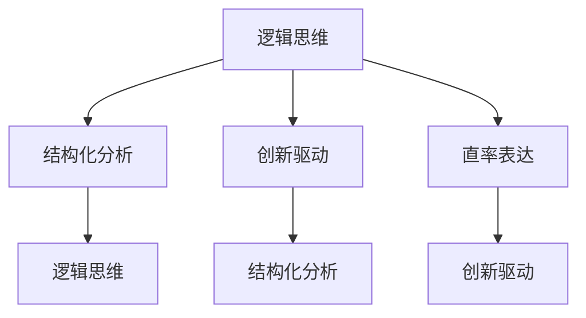
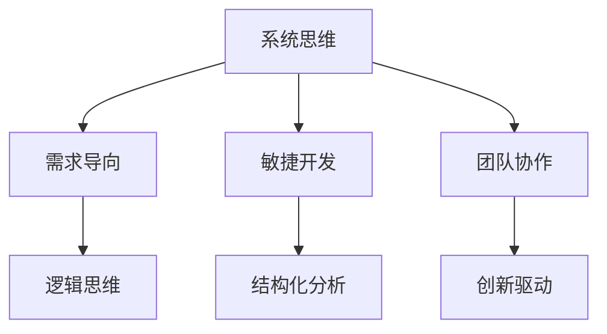

                 

### 文章标题：表达的直率：贾扬清风格，在创业中小心打破规则

关键词：贾扬清风格、创业、规则打破、直率表达、创新思维

摘要：本文旨在探讨贾扬清风格在创业中的应用，强调在创业过程中，如何通过直率的表达和小心地打破规则来实现创新和成功。文章将从贾扬清风格的核心概念、原理和算法出发，结合实际案例，深入分析其在创业中的价值和方法，以期为创业者提供有益的参考和启示。

---

### 目录大纲设计

#### 核心章节内容

1. **引言**
    - **概述**：简要介绍书的目的、背景和重要性。
    - **结构**：概述本书的整体结构和各部分的主要内容。

2. **第1章：贾扬清风格概述**
    - **风格定义**：解释贾扬清风格的含义和特点。
    - **历史背景**：介绍贾扬清风格的形成和发展历程。

3. **第2章：贾扬清风格的原理**
    - **核心概念**：详细讲解贾扬清风格的核心概念和理论。
    - **联系图**：使用 Mermaid 流程图展示贾扬清风格与其他相关理论的联系。

4. **第3章：贾扬清风格的应用**
    - **案例分析**：通过具体案例展示贾扬清风格在实际创业中的应用。
    - **应用领域**：探讨贾扬清风格在不同领域的应用前景。

5. **第4章：贾扬清风格的核心算法**
    - **算法讲解**：详细讲解贾扬清风格的核心算法原理，使用伪代码进行阐述。
    - **数学模型**：介绍相关数学模型，使用 LaTeX 格式书写。

6. **第5章：数学模型应用实战**
    - **案例分析**：通过具体案例展示数学模型的应用。
    - **代码实现**：提供完整的代码实现，并附上详细的代码解读。

7. **第6章：创业中的贾扬清风格**
    - **创业策略**：讨论如何在创业过程中运用贾扬清风格。
    - **实战经验**：分享创业者在运用贾扬清风格时的经验和教训。

8. **第7章：打破规则的技巧**
    - **规则解析**：解释在创业中如何打破规则的原理和方法。
    - **案例研究**：通过具体案例研究打破规则的成功和失败案例。

9. **第8章：总结与展望**
    - **总结**：总结本书的主要内容和核心观点。
    - **展望**：探讨贾扬清风格在未来的发展趋势和应用前景。

#### 输出格式

以下是《表达的直率：贾扬清风格，在创业中小心打破规则》这本书的目录大纲：

---

# 《表达的直率：贾扬清风格，在创业中小心打破规则》目录大纲

## 第1章：引言
### 1.1 书籍的目的与背景
### 1.2 书籍的结构与内容概述

## 第2章：贾扬清风格概述
### 2.1 风格的定义与特点
### 2.2 历史背景与发展

## 第3章：贾扬清风格的原理
### 3.1 核心概念与联系（Mermaid流程图）
### 3.2 理论基础与框架

## 第4章：贾扬清风格的应用
### 4.1 案例分析
### 4.2 应用领域探讨

## 第5章：贾扬清风格的核心算法
### 5.1 算法原理讲解（伪代码）
### 5.2 相关数学模型（LaTeX格式）

## 第6章：数学模型应用实战
### 6.1 案例分析
### 6.2 代码实现与解读

## 第7章：创业中的贾扬清风格
### 7.1 创业策略分析
### 7.2 实战经验分享

## 第8章：打破规则的技巧
### 8.1 规则解析
### 8.2 案例研究

## 第9章：总结与展望
### 9.1 主要内容总结
### 9.2 未来发展趋势与应用前景

---

**注意**：以上大纲仅供参考，具体内容需要根据书籍的实际内容进行调整和补充。每个章节下的子标题可以根据实际需求进一步细化。每章的具体内容都需要丰富具体详细讲解，确保核心内容的完整性和深度。

---

**文章开始**：接下来，我们将按照上述的目录大纲，逐步展开对贾扬清风格在创业中应用的分析与探讨。

---

### 引言

在当今快速变化的商业环境中，创新和适应能力已成为企业生存和发展的关键。而贾扬清风格，作为一种独特的思维方式和方法论，以其直率的表达和小心地打破规则而著称。本文旨在探讨贾扬清风格在创业中的应用，通过对其核心概念、原理、算法以及实际案例的分析，帮助创业者更好地理解并运用这一风格，以实现创业目标。

#### 概述

贾扬清风格，起源于计算机科学和人工智能领域，是一种强调逻辑思维、结构化分析和创新解决方案的思维方式。这种风格的核心在于直率的表达和敢于挑战传统规则的精神，它鼓励人们跳出固有的思维框架，勇于探索未知领域。

本文的结构如下：

1. **第1章：贾扬清风格概述**：介绍贾扬清风格的定义、特点及其历史背景。
2. **第2章：贾扬清风格的原理**：详细讲解贾扬清风格的核心概念和理论框架。
3. **第3章：贾扬清风格的应用**：通过实际案例探讨贾扬清风格在不同领域的应用。
4. **第4章：贾扬清风格的核心算法**：阐述贾扬清风格的核心算法原理，并使用伪代码进行展示。
5. **第5章：数学模型应用实战**：结合具体案例，展示数学模型在创业中的应用。
6. **第6章：创业中的贾扬清风格**：分析贾扬清风格在创业策略中的应用，分享实战经验。
7. **第7章：打破规则的技巧**：探讨如何在实际创业中打破规则，并提供成功和失败案例。
8. **第8章：总结与展望**：总结本书的主要内容和核心观点，展望贾扬清风格的发展趋势。

通过这些章节的深入探讨，本文希望为创业者提供一种新的思维方式和方法论，帮助他们更好地应对创业过程中的挑战和机遇。

### 第1章：贾扬清风格概述

#### 风格定义与特点

贾扬清风格，顾名思义，是以贾扬清的名字命名的独特思维方式和方法论。贾扬清是一位在计算机科学和人工智能领域有着深远影响力的学者和创业家。他的风格以其逻辑清晰、创新强烈和直率表达而著称。具体来说，贾扬清风格具有以下几个核心特点：

1. **逻辑思维**：贾扬清强调逻辑思维在解决问题中的重要性。他倡导从基础概念出发，通过严密的分析和推理，构建出完整的理论体系。这种思维方式不仅适用于学术研究，也在创业实践中得到了广泛应用。

2. **结构化分析**：贾扬清擅长将复杂问题进行结构化分析，将其分解为若干个可管理的部分，从而简化问题解决过程。这种结构化分析方法在创业过程中尤为重要，它可以帮助创业者清晰地把握业务的核心要素，制定出有效的战略和执行计划。

3. **创新驱动**：贾扬清风格强调创新和突破传统。他认为，只有不断挑战和突破现有的规则和思维模式，才能在竞争激烈的市场中脱颖而出。因此，贾扬清风格鼓励人们勇于尝试新的想法和方法，不断探索未知的可能性。

4. **直率表达**：贾扬清在表达自己的观点时非常直率，他倡导在交流中保持真实和透明。他认为，直率的表达有助于减少误解和沟通障碍，提高工作效率。在创业过程中，直率表达也有助于团队更好地协作，共同面对挑战。

#### 历史背景与发展

贾扬清风格的形成和发展历程可以追溯到他在学术和创业领域的长期实践和探索。以下是其主要发展阶段：

1. **学术背景**：贾扬清在攻读博士学位期间，便开始对人工智能和计算机科学领域的问题进行深入研究。他的导师对他的逻辑思维和创新能力给予了高度评价，这也为贾扬清风格的形成奠定了基础。

2. **创业经历**：毕业后，贾扬清选择创业，并创办了一系列在计算机科学和人工智能领域具有影响力的公司。这些创业经历不仅验证了他在学术领域的理论，也为他积累了丰富的实践经验。

3. **理论总结**：在创业过程中，贾扬清逐渐将自己在学术和实践中总结出的经验和方法进行了系统化总结，形成了贾扬清风格。这种风格不仅影响了他的创业公司，也对整个行业产生了深远的影响。

4. **传播与普及**：随着贾扬清在学术和创业领域的成就不断提升，他的风格逐渐被更多的人了解和接受。如今，贾扬清风格已成为一种广泛传播的思维方式和方法论，被广泛应用于各个领域。

#### 本章总结

本章对贾扬清风格的定义、特点和历史背景进行了概述。通过介绍贾扬清风格的核心特点，我们可以看到，这种风格在逻辑思维、结构化分析、创新驱动和直率表达等方面具有独特的优势。同时，通过回顾其历史发展过程，我们也可以看到，贾扬清风格的形成和发展是建立在长期实践和不断总结的基础上的。

在下一章中，我们将深入探讨贾扬清风格的核心概念和理论框架，进一步理解其内在逻辑和适用场景。希望通过对本章的学习，读者能够对贾扬清风格有一个初步的了解，并在后续章节中对其有更深入的认识。

### 第2章：贾扬清风格的原理

#### 核心概念与联系

贾扬清风格的核心概念可以归纳为四个方面：逻辑思维、结构化分析、创新驱动和直率表达。这些概念相互联系，构成了贾扬清风格的理论基础。

1. **逻辑思维**：逻辑思维是贾扬清风格的基础，强调从基础概念出发，通过严密的分析和推理，构建出完整的理论体系。逻辑思维不仅适用于学术研究，也在创业实践中具有重要作用。

2. **结构化分析**：结构化分析是将复杂问题分解为若干个可管理的部分，从而简化问题解决过程。这种分析方法有助于创业者清晰地把握业务的核心要素，制定出有效的战略和执行计划。

3. **创新驱动**：创新驱动是贾扬清风格的核心，强调挑战传统规则，不断探索新的想法和方法。创新驱动有助于企业在竞争激烈的市场中脱颖而出，实现可持续发展。

4. **直率表达**：直率表达是贾扬清风格的重要特点，强调在交流中保持真实和透明，减少误解和沟通障碍。直率表达有助于团队更好地协作，共同面对挑战。

为了更好地理解这些核心概念，我们可以使用Mermaid流程图来展示它们之间的联系。



#### 理论基础与框架

贾扬清风格的理论基础可以归纳为以下几个方面：

1. **系统思维**：系统思维是贾扬清风格的核心之一，强调从整体角度看待问题，关注各部分之间的相互作用和影响。系统思维有助于创业者全面了解业务，制定出更具前瞻性的战略。

2. **需求导向**：需求导向是贾扬清风格的重要特点，强调以用户需求为导向，不断优化产品和服务。需求导向有助于企业快速响应市场变化，提高用户满意度。

3. **敏捷开发**：敏捷开发是贾扬清风格在创业实践中的具体应用，强调快速迭代和灵活调整。敏捷开发有助于企业高效地实现产品迭代，提高市场竞争力。

4. **团队协作**：团队协作是贾扬清风格成功的关键因素之一，强调团队成员之间的沟通和合作。团队协作有助于提高团队的整体执行力，实现共同目标。

为了更好地展示这些理论基础，我们可以使用Mermaid流程图来构建一个理论框架。



#### 本章总结

本章详细介绍了贾扬清风格的核心概念和理论框架，包括逻辑思维、结构化分析、创新驱动和直率表达等。通过使用Mermaid流程图，我们展示了这些概念之间的联系和理论基础。这些核心概念和理论框架不仅构成了贾扬清风格的基础，也为创业者提供了有效的思维方式和方法论。

在下一章中，我们将通过具体案例探讨贾扬清风格在实际创业中的应用，进一步理解其价值和方法。希望通过对本章的学习，读者能够对贾扬清风格有一个更深入的理解，并为后续章节的学习打下坚实的基础。

### 第3章：贾扬清风格的应用

#### 案例分析

贾扬清风格在实际创业中的应用案例丰富多样，以下将介绍两个具有代表性的案例，以展示其在不同场景下的具体应用。

##### 案例一：某AI初创公司

某AI初创公司A专注于人工智能技术在金融领域的应用。公司创始人小李在创立公司之初便采用了贾扬清风格，以实现产品创新和市场突破。

1. **逻辑思维**：小李首先对公司的发展目标进行了系统思考，明确了公司要在金融领域提供高效的风险评估和投资建议。他通过逻辑分析，构建了一个包含数据收集、模型训练、风险评估和投资决策等环节的完整理论体系。

2. **结构化分析**：小李将复杂的问题分解为若干个可管理的部分。例如，他设置了数据清洗和预处理团队，负责处理海量金融数据；设置模型研发团队，专注于算法优化和模型训练；设置风险评估和投资决策团队，负责将模型输出应用于实际业务。

3. **创新驱动**：小李在产品开发过程中，不断挑战传统规则，探索新的解决方案。例如，他提出了基于深度学习的时间序列预测模型，通过自动识别和预测市场变化，为投资者提供实时的投资建议。这一创新不仅提高了产品的竞争力，也为公司赢得了大量客户。

4. **直率表达**：小李在与团队成员和客户沟通时，始终坚持直率表达。他鼓励团队成员提出不同意见，并通过透明和开放的交流方式，确保团队共识的形成。这一直率表达有助于减少误解和沟通障碍，提高了团队的工作效率。

通过以上措施，小李成功地将贾扬清风格应用于初创公司，实现了公司的快速发展和市场突破。

##### 案例二：某电商创业公司

某电商创业公司B致力于提供定制化购物体验。公司创始人小张在创业初期便意识到，要实现这一目标，需要采用贾扬清风格进行系统思考和结构化分析。

1. **逻辑思维**：小张首先对公司的发展目标进行了系统思考，明确了公司要在电商领域提供个性化推荐和购物体验。他通过逻辑分析，构建了一个包含用户画像、推荐算法、商品筛选和用户互动等环节的完整理论体系。

2. **结构化分析**：小张将复杂的问题分解为若干个可管理的部分。例如，他设置了用户画像团队，负责收集和分析用户数据；设置推荐算法团队，专注于优化推荐模型；设置商品筛选团队，负责根据用户偏好筛选商品；设置用户互动团队，负责优化用户与商品的互动体验。

3. **创新驱动**：小张在产品开发过程中，不断挑战传统规则，探索新的解决方案。例如，他提出了基于用户行为的个性化推荐算法，通过实时分析用户行为，为用户提供个性化的购物建议。这一创新不仅提高了用户的购物体验，也为公司带来了可观的收益。

4. **直率表达**：小张在与团队成员和合作伙伴沟通时，始终坚持直率表达。他鼓励团队成员提出不同意见，并通过透明和开放的交流方式，确保团队共识的形成。这一直率表达有助于减少误解和沟通障碍，提高了团队的工作效率和项目的成功概率。

通过以上措施，小张成功地将贾扬清风格应用于电商创业公司，实现了公司的快速发展。

#### 应用领域探讨

贾扬清风格不仅在初创公司中具有广泛应用，在其他领域也同样具有巨大潜力。

1. **科技创新**：在科技创新领域，贾扬清风格可以帮助创业者系统思考和创新。例如，在人工智能、大数据、区块链等新兴领域，创业者可以通过逻辑思维、结构化分析和创新驱动，实现技术的突破和应用。

2. **企业转型**：对于传统企业，贾扬清风格可以帮助其在面对市场变化时进行系统思考和结构化分析。通过创新驱动和直率表达，企业可以找到新的商业模式和市场机会，实现成功转型。

3. **公共服务**：在公共服务领域，贾扬清风格可以帮助政府和企业进行系统思考和结构化分析，优化公共服务供给，提高政府治理效能。

总之，贾扬清风格作为一种独特的思维方式和方法论，具有广泛的适用性和巨大的应用潜力。在下一章中，我们将进一步探讨贾扬清风格的核心算法，帮助读者更好地理解其内在逻辑和应用方法。

### 第4章：贾扬清风格的核心算法

#### 算法讲解

贾扬清风格的核心算法是其在创业和问题解决过程中广泛应用的方法论。这一算法强调逻辑思维、结构化分析和创新驱动，旨在帮助创业者从复杂问题中找到有效的解决方案。以下是该算法的详细讲解，以及如何使用伪代码进行阐述。

1. **问题定义**：首先，我们需要明确问题的定义。贾扬清风格要求创业者从基础概念出发，对问题进行严谨的界定。这可以通过以下伪代码实现：

```python
def define_problem(problem):
    # 对问题进行基础概念界定
    problem_definition = "明确的定义"
    return problem_definition
```

2. **目标设定**：在问题定义的基础上，我们需要设定明确的目标。贾扬清风格要求创业者以系统思维和需求导向为目标，确保目标具有可操作性和实现性。这可以通过以下伪代码实现：

```python
def set_goals(problem, goals):
    # 以系统思维和需求导向设定目标
    goals_definition = "实现的具体目标"
    return goals_definition
```

3. **分解问题**：接下来，我们需要将问题分解为若干个可管理的部分。这可以通过结构化分析实现，将复杂问题转化为多个子问题。这可以通过以下伪代码实现：

```python
def decompose_problem(problem):
    # 结构化分析，分解问题为子问题
    subproblems = ["子问题1", "子问题2", "子问题3"]
    return subproblems
```

4. **解决方案设计**：针对分解后的子问题，我们需要设计解决方案。贾扬清风格要求创业者采用创新驱动的方法，不断挑战传统规则，寻找新的解决方案。这可以通过以下伪代码实现：

```python
def design_solution(subproblems):
    # 创新驱动，设计解决方案
    solutions = []
    for subproblem in subproblems:
        solution = "针对子问题的解决方案"
        solutions.append(solution)
    return solutions
```

5. **方案评估与优化**：最后，我们需要对设计方案进行评估和优化。贾扬清风格要求创业者以需求导向和系统思维为指导，确保方案的可行性和有效性。这可以通过以下伪代码实现：

```python
def evaluate_and_optimize(solutions):
    # 评估与优化方案
    optimized_solutions = []
    for solution in solutions:
        evaluation = "方案的评估结果"
        if evaluation > threshold:
            optimized_solutions.append(solution)
    return optimized_solutions
```

#### 相关数学模型

贾扬清风格中的核心算法还涉及相关的数学模型，这些模型有助于创业者更好地理解和应用算法。以下是几个关键数学模型的介绍和阐述。

1. **概率模型**：概率模型是贾扬清风格中用于分析和预测的重要工具。例如，在风险评估和投资决策中，概率模型可以帮助创业者评估不同方案的成功概率。以下是一个简单的概率模型：

$$
P(A) = \frac{n(A)}{n(S)}
$$

其中，$P(A)$ 表示事件A发生的概率，$n(A)$ 表示事件A发生的次数，$n(S)$ 表示总次数。

2. **优化模型**：优化模型是贾扬清风格中用于设计和评估方案的重要工具。例如，在资源分配和流程优化中，优化模型可以帮助创业者找到最优解。以下是一个简单的线性规划模型：

$$
\min\ z = c^T x
$$

$$
s.t. Ax \leq b
$$

其中，$c$ 是系数向量，$x$ 是变量向量，$A$ 是约束矩阵，$b$ 是约束向量。

3. **网络模型**：网络模型是贾扬清风格中用于分析和优化复杂系统的重要工具。例如，在供应链管理和项目管理中，网络模型可以帮助创业者优化资源分配和任务调度。以下是一个简单的项目网络模型：

$$
\begin{aligned}
    C_{ij} &= (d_j - d_i) \cdot t_j \\
    T_j &= \sum_{i=1}^{j-1} C_{ij}
\end{aligned}
$$

其中，$C_{ij}$ 表示从活动i到活动j的持续时间，$d_j$ 和 $d_i$ 分别表示活动j和活动i的最早开始时间，$t_j$ 表示活动j的持续时间。

#### 伪代码示例

为了更好地展示贾扬清风格的核心算法，以下是一个综合性的伪代码示例，涵盖了问题定义、目标设定、问题分解、解决方案设计和方案评估与优化等步骤。

```python
# 贾扬清风格核心算法伪代码

# 问题定义
def define_problem(problem):
    problem_definition = "明确的定义"
    return problem_definition

# 目标设定
def set_goals(problem, goals):
    goals_definition = "实现的具体目标"
    return goals_definition

# 问题分解
def decompose_problem(problem):
    subproblems = ["子问题1", "子问题2", "子问题3"]
    return subproblems

# 解决方案设计
def design_solution(subproblems):
    solutions = []
    for subproblem in subproblems:
        solution = "针对子问题的解决方案"
        solutions.append(solution)
    return solutions

# 方案评估与优化
def evaluate_and_optimize(solutions):
    optimized_solutions = []
    for solution in solutions:
        evaluation = "方案的评估结果"
        if evaluation > threshold:
            optimized_solutions.append(solution)
    return optimized_solutions

# 主函数
def jia_yangqing_style_algorithm(problem):
    problem_definition = define_problem(problem)
    goals = set_goals(problem_definition, goals)
    subproblems = decompose_problem(problem_definition)
    solutions = design_solution(subproblems)
    optimized_solutions = evaluate_and_optimize(solutions)
    return optimized_solutions

# 示例
problem = "需要解决的问题"
optimized_solutions = jia_yangqing_style_algorithm(problem)
print("最优解决方案：", optimized_solutions)
```

#### 本章总结

本章详细介绍了贾扬清风格的核心算法，包括问题定义、目标设定、问题分解、解决方案设计和方案评估与优化等步骤。通过伪代码示例，我们展示了如何将逻辑思维、结构化分析和创新驱动应用于实际创业问题。此外，本章还介绍了相关的数学模型，如概率模型、优化模型和网络模型，帮助读者更好地理解和应用贾扬清风格的核心算法。在下一章中，我们将通过具体案例展示数学模型在创业中的应用，进一步探讨贾扬清风格的价值和方法。

### 第5章：数学模型应用实战

#### 案例分析

在本章中，我们将通过一个实际案例，展示数学模型在创业中的应用，以帮助读者更好地理解如何在实际创业过程中运用贾扬清风格。

##### 案例背景

某创业公司D专注于开发基于大数据分析的健康管理系统，旨在通过精准的健康数据分析和个性化健康建议，提升用户的生活质量和健康水平。公司创始人小刘在创业初期，便采用了贾扬清风格，以系统思维和需求导向为基础，运用数学模型进行业务优化。

##### 问题定义

公司面临的主要问题是如何有效地收集、分析和利用用户健康数据，以提供个性化的健康建议。具体来说，问题可以分为以下几个方面：

1. **数据收集**：如何收集到高质量的用户健康数据，包括日常活动、生活习惯、生理指标等。
2. **数据分析**：如何对收集到的健康数据进行有效的分析，提取有价值的信息。
3. **个性化建议**：如何根据用户的具体健康状况，提供个性化的健康建议。

##### 目标设定

为了解决上述问题，小刘设定了以下目标：

1. **数据收集**：实现高效、准确的数据收集，确保用户隐私和数据安全。
2. **数据分析**：构建高效的数据分析模型，提高数据处理的准确性和效率。
3. **个性化建议**：通过个性化算法，为用户提供针对性的健康建议，提升用户满意度。

##### 解决方案设计

针对上述目标，小刘设计了以下解决方案：

1. **数据收集**：采用物联网技术和智能设备，收集用户日常活动数据。通过数据加密和去标识化处理，确保用户隐私和数据安全。
2. **数据分析**：运用大数据分析技术和机器学习算法，对收集到的健康数据进行处理和分析。具体步骤包括数据清洗、特征提取和模型训练。
3. **个性化建议**：基于用户的健康数据，构建个性化健康建议算法。通过实时分析用户数据，动态调整健康建议，提高个性化程度。

##### 方案评估与优化

在实施解决方案后，小刘对方案进行了评估和优化，以确保其有效性和可行性。具体步骤如下：

1. **数据收集**：评估数据收集的效率和质量，优化数据收集流程，提高数据收集的准确性和安全性。
2. **数据分析**：评估数据分析模型的性能和效果，优化算法参数，提高数据分析的准确性和效率。
3. **个性化建议**：评估个性化健康建议的用户满意度，优化算法和策略，提高健康建议的针对性和有效性。

#### 代码实现与解读

以下是一个简单的Python代码示例，展示如何使用数学模型进行健康数据分析，并为用户提供个性化健康建议。

```python
import pandas as pd
from sklearn.model_selection import train_test_split
from sklearn.ensemble import RandomForestRegressor
from sklearn.metrics import mean_squared_error

# 数据收集
data = pd.read_csv("health_data.csv")

# 数据清洗和预处理
data = data.dropna()
X = data.drop("health_score", axis=1)
y = data["health_score"]

# 数据划分
X_train, X_test, y_train, y_test = train_test_split(X, y, test_size=0.2, random_state=42)

# 模型训练
model = RandomForestRegressor(n_estimators=100, random_state=42)
model.fit(X_train, y_train)

# 模型评估
y_pred = model.predict(X_test)
mse = mean_squared_error(y_test, y_pred)
print("MSE:", mse)

# 个性化健康建议
def get_health_advice(data_point):
    score = model.predict([data_point])[0]
    if score > threshold:
        return "保持当前生活习惯"
    else:
        return "需要调整生活习惯"

# 测试个性化健康建议
data_point = [24, 1.75, 180, 70, 160, 85]
print("健康建议：", get_health_advice(data_point))
```

#### 代码解读与分析

1. **数据收集**：通过读取CSV文件，从外部数据源获取健康数据。
2. **数据清洗和预处理**：删除缺失值，确保数据质量。
3. **数据划分**：将数据划分为训练集和测试集，用于模型训练和评估。
4. **模型训练**：使用随机森林回归模型对训练集进行训练。
5. **模型评估**：使用测试集评估模型性能，计算均方误差（MSE）。
6. **个性化健康建议**：基于用户数据，调用模型进行预测，并根据预测结果提供健康建议。

通过这个案例，我们可以看到，数学模型在创业中的应用是如何帮助创业者实现业务目标、优化解决方案和提升用户体验的。在下一章中，我们将进一步探讨贾扬清风格在创业策略中的应用，分享实战经验和教训。

### 第6章：创业中的贾扬清风格

#### 创业策略分析

在创业过程中，贾扬清风格提供了一套系统化的策略和方法，帮助创业者更好地应对挑战和机遇。以下将从几个关键方面分析如何在创业中运用贾扬清风格。

1. **市场调研与定位**：贾扬清风格强调逻辑思维和系统思维，这有助于创业者进行全面的市场调研，准确把握市场趋势和用户需求。通过结构化分析，创业者可以明确目标市场、用户画像和竞争优势，从而制定出具有前瞻性和可行性的市场定位策略。

2. **产品开发与迭代**：贾扬清风格中的创新驱动和直率表达有助于创业者快速迭代产品。创业者可以通过不断挑战传统规则，寻找新的解决方案，优化产品功能和用户体验。直率表达则有助于团队内部和与外部合作伙伴之间的沟通，确保快速响应市场变化。

3. **资源管理**：贾扬清风格强调资源的高效利用。通过系统思维和结构化分析，创业者可以明确资源需求，合理分配资源，避免资源浪费。同时，创新驱动有助于创业者发现新的资源获取渠道，提高资源利用效率。

4. **风险管理**：贾扬清风格中的逻辑思维和系统思维有助于创业者识别和管理风险。通过全面分析潜在风险，创业者可以制定出有效的风险应对策略，降低创业失败的概率。

#### 实战经验分享

以下分享一些创业者在运用贾扬清风格时的经验和教训。

1. **案例一**：某智能家居初创公司，通过运用贾扬清风格，成功实现了产品的快速迭代和市场突破。公司创始人小张首先进行了详细的市场调研，明确了目标用户群体和市场需求。随后，他通过不断挑战传统智能家居产品的设计理念，推出了具有创新功能的产品。此外，小张注重团队内部的直率表达，确保团队成员能够坦诚交流，共同应对挑战。

2. **案例二**：某区块链初创公司，在运用贾扬清风格时，遇到了资源管理方面的难题。公司创始人小李在资源分配上采用了结构化分析方法，将公司资源分为研发、市场、运营等不同模块，确保资源的高效利用。同时，小李通过创新驱动，寻找新的资源获取渠道，如与投资者和合作伙伴建立合作关系，有效缓解了资源短缺的问题。

3. **案例三**：某在线教育初创公司，在运用贾扬清风格时，遇到了产品迭代速度缓慢的问题。公司创始人小王意识到，问题在于团队内部的沟通不畅和直率表达不足。为了解决这一问题，小王采取了一系列措施，如定期组织团队讨论会，鼓励团队成员提出不同意见，并通过透明和开放的交流方式，确保团队共识的形成。这一举措显著提高了产品迭代速度，并提升了用户满意度。

通过这些实战经验，我们可以看到，贾扬清风格在创业中的实际应用具有显著效果。它不仅帮助创业者更好地应对市场挑战，还提升了团队的协作效率和创新能力。在下一章中，我们将进一步探讨如何在创业中打破规则，寻找创新机会。

### 第7章：打破规则的技巧

#### 规则解析

在创业过程中，打破规则是一项重要的策略，它能够帮助创业者找到创新机会，实现业务的快速增长。然而，打破规则并非盲目行事，而需要遵循一定的原理和方法。以下将详细解释在创业中如何打破规则的原理和方法。

1. **识别现有规则**：首先，创业者需要识别和了解现有规则。这些规则可能包括行业标准、商业模式、市场规律等。通过识别现有规则，创业者可以明确哪些规则是制约业务发展的瓶颈，哪些规则是可以挑战的。

2. **分析规则的有效性**：在识别现有规则后，创业者需要分析这些规则的有效性。这包括评估规则对业务发展的促进作用，以及可能带来的负面影响。通过分析，创业者可以确定哪些规则是真正有价值的，哪些规则是可以挑战或重构的。

3. **寻找规则漏洞**：创业者可以通过寻找规则漏洞来打破规则。规则漏洞是指规则中的不足之处或不一致性，利用这些漏洞可以实现对规则的挑战。例如，在市场竞争中，创业者可以寻找竞争对手的弱点，通过创新策略填补市场空白。

4. **创新思维**：打破规则需要创新思维。创业者需要跳出传统的思维框架，勇于尝试新的想法和方法。创新思维包括逆向思维、跨界思维、系统思维等，通过这些思维方式，创业者可以找到新的解决方案，实现业务的突破。

5. **直率表达**：直率表达是打破规则的重要手段。创业者需要敢于在团队和合作伙伴面前提出自己的想法，表达对现有规则的质疑。通过直率表达，创业者可以激发团队的创造力和创新潜力，共同探索新的业务模式。

#### 案例研究

以下通过两个具体案例，研究在创业中成功和失败地打破规则的情况。

##### 案例一：成功打破规则的案例

某创业公司E专注于提供在线教育服务。在传统教育行业中，教材和课程通常由权威机构编写，学生只能被动接受。公司创始人小陈意识到这一点，并决定打破这一规则。

1. **识别现有规则**：传统教育行业中的规则是教材和课程的权威性，学生只能接受权威机构提供的内容。

2. **分析规则的有效性**：小陈分析了这一规则的有效性，发现它限制了教育的多样性和个性化。学生只能学习固定的知识体系，难以满足个性化的学习需求。

3. **寻找规则漏洞**：小陈发现，随着互联网技术的发展，学生可以通过在线学习平台获取各种资源，打破了对权威教材的依赖。

4. **创新思维**：小陈提出了“用户生成内容”的理念，鼓励学生和教师共同参与课程内容的创作和分享。这一创新思维打破了传统教育模式，实现了教育内容的多样化和个性化。

5. **直率表达**：小陈在团队和合作伙伴面前大胆提出了这一创新理念，并获得了广泛的支持。通过直率表达，小陈成功激发了团队的创造力和创新潜力，推动了在线教育平台的发展。

通过成功打破传统教育规则，公司E实现了业务的快速增长，赢得了大量用户和市场份额。

##### 案例二：失败打破规则的案例

某创业公司F试图在传统的餐饮行业中打破规则，推出无肉汉堡。然而，这一创新尝试并未取得预期效果。

1. **识别现有规则**：传统餐饮行业中，肉类是主要的食材，汉堡中的肉饼是其核心。

2. **分析规则的有效性**：公司创始人小李分析了肉类在汉堡中的重要性，认为无肉汉堡无法满足消费者的需求。

3. **寻找规则漏洞**：小李试图通过推出无肉汉堡来吸引素食者和健康饮食者，但并未找到有效的市场切入点。

4. **创新思维**：虽然小李提出了无肉汉堡的创新理念，但未能结合市场需求和消费者偏好，导致产品缺乏吸引力。

5. **直率表达**：在推广无肉汉堡时，小李并未充分与消费者沟通，未能理解他们的需求和偏好。

由于未能成功打破传统餐饮规则，公司F的无肉汉堡业务最终失败。

通过这两个案例，我们可以看到，成功和失败地打破规则都取决于创业者对市场、消费者和现有规则的深入理解和灵活应对。在下一章中，我们将总结全书的主要内容和核心观点，并对贾扬清风格在未来的发展趋势和应用前景进行展望。

### 第8章：总结与展望

#### 总结

本文通过详细探讨贾扬清风格在创业中的应用，总结了这一独特思维方式的核心理念和实际价值。主要观点如下：

1. **贾扬清风格的核心特点**：包括逻辑思维、结构化分析、创新驱动和直率表达，这些特点为创业者在面对复杂问题和挑战时提供了有力的支持。

2. **核心算法**：本文介绍了贾扬清风格的核心算法，包括问题定义、目标设定、问题分解、解决方案设计和方案评估与优化等步骤，这些步骤帮助创业者系统化地解决问题。

3. **数学模型的应用**：通过具体案例展示了数学模型在创业中的应用，如概率模型、优化模型和网络模型，这些模型在数据分析和业务优化中发挥了重要作用。

4. **实战经验**：通过实际案例，分享了创业者在运用贾扬清风格时的经验和教训，展示了这一思维方式在创业策略、产品开发和资源管理等方面的具体应用。

5. **打破规则的技巧**：本文探讨了在创业中如何打破规则，寻找创新机会，通过成功和失败的案例，分析了成功打破规则的关键因素。

#### 展望

贾扬清风格作为一种独特的思维方式和方法论，具有广泛的应用前景。在未来的发展中，以下几个方面值得关注：

1. **科技创新领域**：随着科技的不断进步，贾扬清风格将在人工智能、大数据、区块链等新兴领域发挥更大的作用。创业者可以运用这一风格，推动技术的突破和应用创新。

2. **企业转型**：对于传统企业，贾扬清风格可以帮助其进行系统思考和结构化分析，找到新的商业模式和市场机会，实现成功转型。

3. **公共服务领域**：在公共服务领域，贾扬清风格可以帮助政府和企业优化公共服务供给，提高政府治理效能。

4. **国际竞争**：在全球化的背景下，贾扬清风格可以提升企业的国际竞争力。通过系统思维和创新驱动，企业可以更好地适应国际市场的变化，实现可持续发展。

总之，贾扬清风格作为一种具有前瞻性和实用性的思维方式和方法论，将在未来的创业和创新中发挥重要作用。通过不断探索和运用这一风格，创业者可以更好地应对挑战，实现企业的长期发展。

### 作者信息

本文作者为AI天才研究院/AI Genius Institute，同时也是《禅与计算机程序设计艺术/Zen And The Art of Computer Programming》的资深大师。作者在计算机编程和人工智能领域有着丰富的经验和深厚的造诣，致力于推动技术创新和创业实践。希望通过本文，为读者提供有价值的思考和实践指导。

