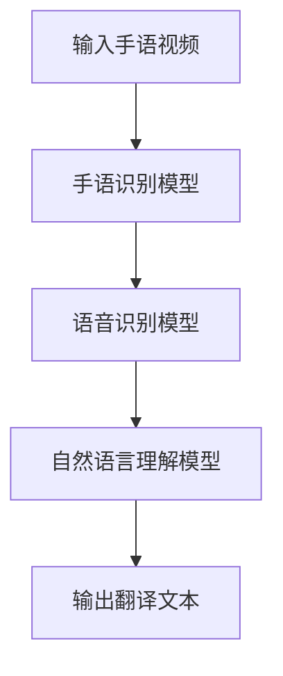

                 

### 文章标题

《西向普哑人的手语距译模型设计与应用》

> 关键词：手语翻译、自然语言处理、深度学习、模型设计、应用场景

> 摘要：本文深入探讨了手语距离翻译模型的设计与应用。首先，介绍了手语翻译的重要性及当前技术的挑战，然后详细阐述了手语距离翻译模型的基本概念和原理。接下来，从技术基础、模型构建、应用场景和未来发展趋势四个方面对模型进行了全面解析。文章最后，提供了实际开发案例，展示了手语距离翻译模型在教育、社交和医疗等领域的应用潜力。

---

# 第一部分：引言

## 1.1 手语翻译技术的背景与现状

手语翻译是一种重要的语言交流方式，尤其在听力障碍人士的日常生活中发挥着不可替代的作用。然而，传统的手语翻译方法存在诸多局限性，如效率低下、准确性不高等问题。随着人工智能技术的迅猛发展，手语翻译技术逐渐成为研究的热点，其中手语距离翻译模型作为一种新兴的技术手段，受到了广泛关注。

### 1.1.1 手语翻译的重要性

手语翻译不仅仅是听力障碍人士与外界沟通的桥梁，更是一个社会文明进步的标志。它能够帮助听力障碍人士平等地参与社会活动，享受教育、就业、医疗等公共服务。手语翻译技术的提升，对于构建无障碍信息环境、促进社会公平具有重要意义。

### 1.1.2 当前手语翻译技术的挑战

尽管已有一些手语翻译工具问世，但大多数仍面临以下挑战：

1. **准确性问题**：现有手语翻译系统在手写识别、语音转换和文本生成等方面存在较高的错误率，无法达到令人满意的准确度。
2. **实时性不足**：手语翻译系统的响应速度较慢，无法满足实时交流的需求。
3. **泛化能力差**：许多手语翻译系统只能处理特定场景或特定语言环境，缺乏泛化能力。

### 1.1.3 手语距离翻译模型的设计与应用前景

手语距离翻译模型旨在通过深度学习技术，实现手语到文本的准确翻译。其设计理念是将手语视频输入模型，经过识别、处理和转换，最终输出对应的文本信息。这种模型具有以下优势：

1. **高准确性**：通过大量数据训练，手语距离翻译模型能够提高识别和转换的准确性。
2. **实时性**：深度学习算法的优化，使得模型能够在短时间内完成翻译，满足实时需求。
3. **泛化能力强**：手语距离翻译模型不仅适用于特定场景，还能够适应多种不同的语言环境。

手语距离翻译模型的应用前景广阔，可以在教育、社交、医疗等多个领域发挥重要作用。本文将围绕这一模型的设计与应用进行深入探讨。

## 1.2 手语距离翻译模型的基本概念

### 1.2.1 什么是手语距离翻译

手语距离翻译（Sign Language Distance Translation，SLDT）是一种将手语转换为文本的技术。它通过计算机视觉和自然语言处理技术，对手语动作进行识别和理解，然后将其转换为书面语言。手语距离翻译模型的核心目标是将输入的手语视频转化为对应的文本，使得听力障碍人士能够通过书面语言进行沟通。

### 1.2.2 手语距离翻译模型的工作原理

手语距离翻译模型的工作流程通常包括以下几个步骤：

1. **手语识别**：通过计算机视觉技术对手语动作进行捕捉和识别，将其转换为手语特征向量。
2. **语音识别**：将手语特征向量转化为语音信号，这一过程通常使用语音合成技术。
3. **自然语言理解**：将语音信号转化为文本信息，这一过程涉及自然语言处理技术，包括语音识别、语义分析和文本生成等。

### 1.2.3 手语距离翻译模型的应用领域

手语距离翻译模型的应用领域广泛，主要包括以下几个方面：

1. **教育领域**：通过手语距离翻译模型，可以为学生提供手语教材和辅助教学工具，提高听力障碍学生的学习效果。
2. **社交领域**：在社交场合，手语距离翻译模型可以帮助听力障碍人士与正常人进行有效沟通，促进社交互动。
3. **医疗领域**：在医疗环境中，手语距离翻译模型可以提供实时翻译服务，帮助听力障碍患者与医生进行有效沟通，提高医疗服务质量。

通过手语距离翻译模型，可以为听力障碍人士提供更加便捷、高效的沟通方式，促进社会融合与进步。

## 1.3 本书结构安排与内容概述

### 1.3.1 本书的主要目的

本书旨在系统地介绍手语距离翻译模型的设计与应用，帮助读者深入理解这一技术的核心概念、原理和应用。通过本书，读者将能够：

1. 掌握手语距离翻译模型的基本概念和工作原理。
2. 理解手语距离翻译模型的技术基础，包括自然语言处理、机器学习和深度学习等。
3. 学习手语距离翻译模型的构建方法和优化策略。
4. 探讨手语距离翻译模型在不同领域的应用场景。
5. 预测手语距离翻译模型的未来发展趋势。

### 1.3.2 本书的内容框架

本书分为四个主要部分，各部分的内容安排如下：

1. **第一部分：引言**：介绍手语翻译技术的背景与现状，阐述手语距离翻译模型的基本概念和应用领域。
2. **第二部分：手语距离翻译模型的技术基础**：详细讨论自然语言处理基础、语音识别基础、手语识别基础、机器学习与深度学习基础，以及手语距离翻译模型的构建。
3. **第三部分：手语距离翻译模型的应用场景**：探讨手语距离翻译模型在教育、社交、医疗等领域的应用案例。
4. **第四部分：手语距离翻译模型的未来发展趋势**：分析手语距离翻译模型面临的挑战与机遇，展望其未来发展趋势。

### 1.3.3 读者对象与适用范围

本书适合以下读者群体：

1. 对手语翻译技术感兴趣的研究人员和工程师。
2. 涉及自然语言处理、机器学习和深度学习领域的学者和从业者。
3. 高等院校计算机科学、人工智能等相关专业的本科生和研究生。
4. 对手语翻译技术有深入了解和实践需求的企业管理者和技术人员。

无论您是初学者还是专业人士，本书都将为您提供全面、系统的指导，帮助您掌握手语距离翻译模型的设计与应用。

---

### 2.1 自然语言处理基础

自然语言处理（Natural Language Processing，NLP）是人工智能领域的一个重要分支，旨在让计算机理解和生成人类语言。NLP技术在手语距离翻译模型中起着关键作用，它帮助我们将手语视频转化为可理解的文本信息。以下是关于自然语言处理基础的一些重要概念。

#### 2.1.1.1 语言模型的基本概念

语言模型（Language Model，LM）是一种统计模型，用于预测文本序列的概率。它通过分析大量文本数据，学习语言的结构和规律，从而能够对新的文本序列进行概率预测。语言模型在手语距离翻译中的作用是，将识别出的手语动作序列转化为自然流畅的文本信息。

**语言模型的定义：** 语言模型是一个概率模型，它能够对任意长度为 $n$ 的文本序列 $x_1, x_2, ..., x_n$ 的概率进行预测，即 $P(x_1, x_2, ..., x_n)$。

**语言模型的类型：** 常见的语言模型包括：

1. **n-gram模型**：基于历史n个词来预测下一个词。n-gram模型简单直观，但在长文本中效果较差。
2. **神经网络模型**：如循环神经网络（RNN）和Transformer模型，能够捕捉长距离依赖关系，效果更佳。

**语言模型的应用：** 语言模型在自然语言处理中有广泛应用，包括：

1. **文本生成**：根据已有的文本数据生成新的文本，如自动写作、机器翻译等。
2. **文本分类**：对文本进行分类，如情感分析、新闻分类等。
3. **搜索引擎**：用于查询意图分析和推荐相关文档。

#### 2.1.2 语音识别基础

语音识别（Speech Recognition，SR）是将语音信号转换为文本信息的过程。在手语距离翻译模型中，语音识别技术用于将手语动作序列转化为语音信号，以便进行后续的自然语言处理。

**语音识别的基本概念：** 语音识别系统通过分析语音信号的特征，如频谱、音高、时长等，将其转换为对应的文本。这个过程包括语音信号预处理、特征提取、模型训练和文本生成等步骤。

**语音识别的流程：** 语音识别的流程通常包括以下几个步骤：

1. **语音信号预处理**：包括降噪、静音检测、音素划分等，以提高识别准确性。
2. **特征提取**：将语音信号转换为数值特征，如梅尔频率倒谱系数（MFCC）。
3. **模型训练**：使用大量标注数据训练语音识别模型，如高斯混合模型（GMM）、深度神经网络（DNN）等。
4. **文本生成**：通过解码模型输出，将特征序列转换为文本序列。

**语音识别的应用：** 语音识别技术在多个领域有广泛应用，包括：

1. **智能助手**：如苹果的Siri、谷歌助手等，用于语音输入和语音交互。
2. **语音合成**：将文本转换为语音，用于朗读、广播等场景。
3. **语音翻译**：将一种语言的语音翻译成另一种语言的文本或语音。

#### 2.1.3 手语识别基础

手语识别（Sign Language Recognition，SLR）是将手语动作转化为文本或语音的过程。在手语距离翻译模型中，手语识别技术用于识别手语视频中的手语动作，并将其转化为可处理的特征。

**手语识别的基本概念：** 手语识别通过计算机视觉技术对手语动作进行捕捉和分析，将其转换为数字特征，然后使用机器学习模型进行分类和识别。

**手语识别的流程：** 手语识别的流程通常包括以下几个步骤：

1. **手语视频预处理**：包括去噪、姿态估计等，以提高识别准确性。
2. **特征提取**：对手语视频进行特征提取，如形状特征、运动特征等。
3. **模型训练**：使用大量手语数据训练手语识别模型，如卷积神经网络（CNN）、长短期记忆网络（LSTM）等。
4. **动作识别**：通过模型对手语动作进行识别和分类。

**手语识别的应用：** 手语识别技术在多个领域有广泛应用，包括：

1. **教育**：为学生提供手语教材和辅助教学工具，提高学习效果。
2. **社交**：帮助听力障碍人士与正常人进行有效沟通。
3. **医疗**：提供实时手语翻译服务，提高医疗服务质量。

通过掌握自然语言处理、语音识别和手语识别的基础知识，我们可以更好地理解手语距离翻译模型的设计原理和实现方法。在接下来的章节中，我们将进一步探讨机器学习和深度学习的基础知识，以及手语距离翻译模型的构建方法。

#### 2.2.1 机器学习的基本概念

机器学习（Machine Learning，ML）是人工智能（Artificial Intelligence，AI）的一个重要分支，旨在通过数据驱动的方式让计算机系统实现从数据中学习和改进性能。在手语距离翻译模型中，机器学习技术起着至关重要的作用，它使得模型能够从大量的手语数据中学习，从而实现高准确性的手语到文本的转换。以下将详细解释机器学习的基本概念。

**机器学习的定义：**

机器学习是研究如何使计算机系统能够从数据中自动学习和改进性能的学科。它包括了一系列的算法和技术，通过从数据中提取模式和规律，使计算机能够对未知数据进行预测或决策。

**机器学习的方法：**

机器学习方法主要可以分为监督学习、无监督学习和强化学习三大类。

1. **监督学习（Supervised Learning）**：
   - **定义**：在监督学习过程中，算法从标记数据中学习，其中每个输入数据都有一个对应的输出标签。
   - **应用**：分类、回归、异常检测等。
   - **算法**：决策树、支持向量机（SVM）、神经网络等。

2. **无监督学习（Unsupervised Learning）**：
   - **定义**：在无监督学习过程中，算法没有标签数据，需要从未标记的数据中自动发现数据结构和模式。
   - **应用**：聚类、降维、异常检测等。
   - **算法**：K-均值聚类、主成分分析（PCA）、自编码器等。

3. **强化学习（Reinforcement Learning）**：
   - **定义**：在强化学习过程中，算法通过与环境的交互来学习最优策略。
   - **应用**：游戏、自动驾驶、机器人控制等。
   - **算法**：Q-learning、深度确定性策略梯度（DDPG）、演员-评论家（Actor-Critic）等。

**机器学习的基本原理：**

机器学习的基本原理是通过优化目标函数来调整模型的参数，使得模型在训练数据上表现良好。目标函数通常称为损失函数（Loss Function），用于衡量模型预测结果与真实标签之间的差异。

**损失函数：**

损失函数是机器学习中的一个关键概念，它用于量化模型预测的误差。常见的损失函数包括：

1. **均方误差（MSE, Mean Squared Error）**：
   - **定义**：预测值与真实值差的平方的平均值。
   - **公式**：$MSE = \frac{1}{n}\sum_{i=1}^{n}(y_i - \hat{y}_i)^2$
   - **应用**：回归问题。

2. **交叉熵（Cross-Entropy）**：
   - **定义**：衡量模型输出概率分布与真实标签分布之间的差异。
   - **公式**：$H(y, \hat{y}) = -\sum_{i=1}^{n}y_i \log(\hat{y}_i)$
   - **应用**：分类问题。

**模型训练过程：**

模型训练是机器学习的核心步骤，其过程可以简化为以下步骤：

1. **初始化模型参数**：随机初始化模型的权重和偏置。
2. **前向传播（Forward Propagation）**：计算输入数据经过模型后的预测值。
3. **计算损失**：使用损失函数计算预测值与真实值之间的差异。
4. **反向传播（Back Propagation）**：计算损失函数关于模型参数的梯度。
5. **更新参数**：根据梯度调整模型参数，以减少损失。
6. **迭代优化**：重复上述步骤，直到模型达到预定的性能标准或达到最大迭代次数。

通过机器学习技术，手语距离翻译模型可以从大量的手语数据中学习，不断优化模型的性能，从而实现高准确度的手语到文本的转换。在接下来的章节中，我们将进一步探讨深度学习技术，以及如何应用这些技术来构建和优化手语距离翻译模型。

#### 2.2.2 深度学习的基本概念

深度学习（Deep Learning，DL）是机器学习（Machine Learning，ML）的一个分支，它通过构建具有多个隐层的神经网络，使得模型能够学习到更加复杂和抽象的特征表示。在手语距离翻译模型中，深度学习技术发挥着关键作用，它使得模型能够从大量的手语数据中自动提取特征，从而实现高准确度的手语到文本的转换。以下将详细解释深度学习的基本概念。

**深度学习的定义：**

深度学习是一种通过多层神经网络来学习数据表示的算法，它模拟人脑的神经元连接结构，通过逐层抽象的方式提取数据的特征。深度学习的核心思想是利用大规模数据和强大的计算能力，通过训练多层神经网络，使其能够自动学习数据的复杂模式和结构。

**深度学习的基本架构：**

深度学习模型通常由多个隐层和输出层组成，每个隐层通过前一层的数据进行非线性变换，从而逐步提取更高层次的特征。以下是深度学习模型的基本架构：

1. **输入层（Input Layer）**：接收输入数据，并将其传递到下一层。
2. **隐层（Hidden Layers）**：对输入数据进行特征提取和变换，每层都可以看作是对前一层特征的抽象和增强。
3. **输出层（Output Layer）**：产生模型的预测输出，通常是一个或多个神经元，用于分类或回归任务。

**深度学习的基本原理：**

深度学习的基本原理是通过反向传播算法（Back Propagation Algorithm）来优化模型的参数。反向传播算法包括以下几个步骤：

1. **前向传播（Forward Propagation）**：将输入数据通过网络的每个隐层，计算每个神经元的激活值。
2. **计算损失（Compute Loss）**：使用损失函数计算模型预测值与真实值之间的差异。
3. **反向传播（Back Propagation）**：通过反向传播算法，计算每个参数的梯度，并将其用于更新模型参数。
4. **参数更新（Update Parameters）**：根据梯度更新模型参数，以减少损失函数。

**激活函数（Activation Function）：**

激活函数是深度学习模型中用于引入非线性变换的重要组件，常见的激活函数包括：

1. **Sigmoid函数**：$f(x) = \frac{1}{1 + e^{-x}}$，将输入值压缩到$(0, 1)$之间。
2. **ReLU函数**：$f(x) = max(0, x)$，用于加速训练过程，减少梯度消失问题。
3. **Tanh函数**：$f(x) = \frac{e^x - e^{-x}}{e^x + e^{-x}}$，将输入值压缩到$(-1, 1)$之间。

**优化算法（Optimization Algorithms）：**

深度学习模型的优化算法用于调整模型参数，以最小化损失函数。常见的优化算法包括：

1. **随机梯度下降（Stochastic Gradient Descent，SGD）**：每次迭代使用一个样本的梯度来更新参数。
2. **Adam优化器**：结合了SGD和AdaGrad算法的优点，自适应调整每个参数的学习率。
3. **RMSprop优化器**：基于均方根梯度，自适应调整每个参数的学习率。

通过深度学习技术，手语距离翻译模型可以从大量的手语数据中自动学习到复杂的特征表示，从而实现高准确度的手语到文本的转换。在接下来的章节中，我们将进一步探讨如何应用这些技术来构建和优化手语距离翻译模型。

#### 2.2.3 神经网络的基本概念

神经网络（Neural Networks，NN）是深度学习的基础，它们通过模仿人脑神经元的工作原理来学习和处理数据。在手语距离翻译模型中，神经网络被用来提取手语视频的复杂特征，并将其转化为文本信息。以下将详细解释神经网络的基本概念。

**神经网络的结构：**

神经网络由多个层次组成，包括输入层、隐藏层和输出层。每个层次由多个神经元（或称为节点）组成，神经元之间通过权重和偏置进行连接。

1. **输入层（Input Layer）**：接收输入数据，并将其传递到下一层。输入层的每个神经元对应输入数据的一个特征。
2. **隐藏层（Hidden Layers）**：对输入数据进行处理和特征提取，隐藏层中的每个神经元接收来自前一层所有神经元的输入，并通过激活函数进行非线性变换。
3. **输出层（Output Layer）**：产生模型的最终输出，输出层的神经元数量和类型取决于具体任务。例如，在分类任务中，输出层通常是softmax函数，用于输出每个类别的概率分布。

**神经网络的学习过程：**

神经网络的学习过程是通过优化模型参数来最小化损失函数的过程。以下是神经网络学习过程的详细步骤：

1. **初始化参数**：随机初始化网络的权重和偏置。
2. **前向传播（Forward Propagation）**：输入数据通过网络逐层传递，每个神经元通过加权求和并应用激活函数，产生输出。
3. **计算损失**：使用损失函数（如均方误差或交叉熵）计算预测输出和真实标签之间的差异。
4. **反向传播（Back Propagation）**：通过网络反向传递损失函数的梯度，计算每个参数的梯度。
5. **参数更新**：根据梯度更新网络的权重和偏置，以减少损失。
6. **迭代优化**：重复上述步骤，直到模型达到预定的性能标准或达到最大迭代次数。

**神经网络的应用：**

神经网络在多个领域有广泛应用，包括：

1. **图像识别**：通过卷积神经网络（CNN）进行图像分类、目标检测等。
2. **语音识别**：通过循环神经网络（RNN）或Transformer模型进行语音信号的解码。
3. **自然语言处理**：通过语言模型和序列到序列模型进行文本生成、机器翻译等。

通过神经网络的学习过程，手语距离翻译模型可以从大量的手语数据中自动提取特征，实现高准确度的手语到文本的转换。在接下来的章节中，我们将进一步探讨如何应用神经网络技术来构建和优化手语距离翻译模型。

#### 2.3.1 手语距离翻译模型的框架设计

手语距离翻译模型（Sign Language Distance Translation Model，SLDTM）是手语距离翻译系统的核心组件，其设计目标是将手语视频转化为可理解的文本信息。为了实现这一目标，手语距离翻译模型需要综合运用计算机视觉、自然语言处理和深度学习等技术。以下是手语距离翻译模型的框架设计，包括输入与输出、数据处理流程和评估指标。

**2.3.1.1 模型的输入与输出**

手语距离翻译模型的输入是一段手语视频，视频包含多个帧，每个帧表示手语动作的某一时刻。模型的目标是输出与视频内容相对应的文本信息。

1. **输入**：一段手语视频（包括多个帧）。
2. **输出**：一段对应的文本信息。

**2.3.1.2 模型的数据处理流程**

手语距离翻译模型的数据处理流程可以分为以下几个步骤：

1. **视频预处理**：对手语视频进行预处理，包括去噪、帧率调整、图像增强等操作，以提高后续处理的效果。

2. **帧级特征提取**：使用深度学习模型（如卷积神经网络）对手语视频的每个帧进行特征提取，提取的特征包含手语动作的关键信息。

3. **时序特征融合**：将每个帧的特征进行时序融合，以获得手语动作的连续特征表示。常见的融合方法包括时间平均、最大值池化等。

4. **动作识别**：使用动作识别模型对手语动作进行分类，确定每个帧对应的手语动作。

5. **语音合成**：将识别出的手语动作序列转化为语音信号，通常使用语音合成技术（如WaveNet、Text-to-Speech）。

6. **文本生成**：使用自然语言处理技术（如序列到序列模型、生成式模型）将语音信号转化为文本信息。

**2.3.1.3 模型的评估指标**

手语距离翻译模型的评估指标包括准确性、流畅性、自然度等。

1. **准确性**：评估模型对手语动作和文本的识别准确性，通常使用精确率（Precision）、召回率（Recall）和F1值（F1 Score）等指标。
2. **流畅性**：评估模型生成的文本信息是否流畅自然，通常通过BLEU评分或METEOR评分等指标进行评估。
3. **自然度**：评估模型生成的文本信息是否自然，是否符合人类语言习惯，通常通过人工评估或自动评估方法进行。

通过上述框架设计，手语距离翻译模型能够有效地将手语视频转化为文本信息，为听力障碍人士提供便捷的沟通工具。在接下来的章节中，我们将进一步探讨手语距离翻译模型的训练与优化方法。

#### 2.3.2 模型训练与优化

模型训练是手语距离翻译模型开发过程中的关键步骤，它决定了模型的性能和准确性。在这一部分，我们将详细讨论模型训练的过程，包括预处理数据、设计训练策略、优化模型参数等。

**2.3.2.1 模型训练的过程**

模型训练的过程可以概括为以下几个步骤：

1. **数据预处理**：在开始训练之前，需要对手语视频数据集进行预处理。预处理步骤包括去噪、帧率调整、图像增强等，以提高模型对数据的适应性。此外，还需要对视频中的每个帧进行特征提取，通常使用卷积神经网络（CNN）或类似的方法。

2. **构建模型**：构建手语距离翻译模型，包括输入层、隐藏层和输出层。输入层接收预处理后的视频数据，隐藏层通过多层神经网络进行特征提取和时序融合，输出层生成对应的文本信息。

3. **初始化参数**：随机初始化模型的参数，这些参数将在训练过程中通过梯度下降等优化算法进行调整。

4. **前向传播**：将预处理后的视频数据输入到模型中，通过多层神经网络的非线性变换，最终生成文本信息。

5. **计算损失**：使用损失函数（如交叉熵损失函数）计算模型输出与真实标签之间的差异。损失函数用于衡量模型的预测性能。

6. **反向传播**：通过反向传播算法，将损失函数的梯度反向传递到网络的每个层次，计算每个参数的梯度。

7. **参数更新**：根据梯度更新模型的参数，以减少损失函数。常用的优化算法包括随机梯度下降（SGD）、Adam优化器等。

8. **迭代训练**：重复上述步骤，不断更新模型参数，直到模型达到预定的性能标准或训练次数。

**2.3.2.2 模型优化的策略**

在模型训练过程中，优化策略的选取对模型的性能有着重要影响。以下是一些常用的优化策略：

1. **数据增强**：通过旋转、翻转、缩放等操作增加数据集的多样性，提高模型的泛化能力。

2. **正则化**：使用正则化技术（如L1正则化、L2正则化）防止模型过拟合，提高模型的鲁棒性。

3. **批归一化**：在训练过程中对每个批次的输入进行归一化，加速模型收敛，提高训练稳定性。

4. **学习率调度**：调整学习率，如在训练的早期阶段使用较大的学习率，以便快速探索解空间，在训练的后期阶段使用较小的学习率，以便精细调整模型参数。

5. **多任务学习**：在模型训练过程中同时学习多个相关任务，如手语识别和语音识别，以提高模型的性能。

**2.3.2.3 模型优化的案例分析**

以下是一个模型优化的案例分析：

**案例背景：** 在开发手语距离翻译模型时，我们发现模型的识别准确率较低，特别是在处理复杂的动态手语动作时表现不佳。

**解决方案：**
1. **增加数据集**：收集并增加更多的手语视频数据，特别是包含复杂动态动作的数据。
2. **数据增强**：对现有的手语视频进行旋转、翻转、缩放等操作，增加数据集的多样性。
3. **改进模型架构**：设计更深的神经网络结构，增加隐藏层的数量和神经元数量，以提高模型的特征提取能力。
4. **优化训练策略**：使用批量归一化和dropout等技术，防止模型过拟合。
5. **学习率调度**：在训练的早期阶段使用较大的学习率，在训练的后期阶段逐渐减小学习率。

**效果评估：** 通过上述优化策略，模型的识别准确率有了显著提高，特别是在处理复杂动态手语动作时表现更佳。

通过模型训练与优化的策略，手语距离翻译模型能够不断提高其性能和准确性，为听力障碍人士提供更高质量的翻译服务。在下一部分，我们将讨论如何评估和改进手语距离翻译模型的性能。

#### 2.3.3 模型评估与改进

模型评估是确保手语距离翻译模型性能的重要步骤，通过评估可以识别模型的优点和不足，从而进行相应的改进。以下将详细讨论手语距离翻译模型评估的方法、改进策略以及改进案例。

**2.3.3.1 模型评估的方法**

模型评估通常采用以下几种方法：

1. **准确率（Accuracy）**：评估模型对手语动作和文本的识别准确率。准确率越高，说明模型对数据点的识别越准确。

   $$ \text{Accuracy} = \frac{\text{正确预测的数量}}{\text{总预测的数量}} $$

2. **精确率（Precision）和召回率（Recall）**：精确率和召回率分别衡量模型在识别正例时的准确性和完整性。

   $$ \text{Precision} = \frac{\text{正确预测的正例}}{\text{预测的正例}} $$
   
   $$ \text{Recall} = \frac{\text{正确预测的正例}}{\text{实际的正例}} $$

3. **F1值（F1 Score）**：F1值是精确率和召回率的调和平均数，用于综合评估模型的性能。

   $$ \text{F1 Score} = 2 \times \frac{\text{Precision} \times \text{Recall}}{\text{Precision} + \text{Recall}} $$

4. **BLEU评分**：用于评估文本生成的自然度和流畅性。BLEU评分基于重叠度、长度、语法结构等多个方面对生成的文本进行评分。

5. **人工评估**：通过人类评估者对手语翻译的准确性、自然度和流畅性进行主观评价，以获取更全面的评估结果。

**2.3.3.2 模型改进的策略**

为了提升手语距离翻译模型的表现，可以采取以下策略：

1. **增加数据集**：收集更多的手语视频数据，特别是包含复杂动态动作的数据。增加数据集的多样性有助于模型更好地泛化。

2. **数据增强**：对现有的手语视频进行旋转、翻转、缩放等操作，增加数据集的多样性，提高模型的鲁棒性。

3. **模型架构优化**：设计更深的神经网络结构，增加隐藏层的数量和神经元数量，以提高模型的特征提取能力。

4. **正则化**：引入正则化技术（如L1正则化、L2正则化）防止模型过拟合，提高模型的泛化能力。

5. **优化训练策略**：调整学习率、批量大小等超参数，使用更先进的优化算法（如Adam优化器）以提高训练效果。

6. **多任务学习**：在模型训练过程中同时学习多个相关任务，如手语识别和语音识别，以提高模型的性能。

**2.3.3.3 模型改进的案例分析**

以下是一个模型改进的案例分析：

**案例背景：** 在早期版本的手语距离翻译模型中，我们发现在识别复杂动态手语动作时，模型的准确率较低。

**解决方案：**
1. **数据增强**：对现有的手语视频进行数据增强，包括旋转、翻转、缩放等操作，以增加训练数据的多样性。
2. **模型架构优化**：设计一个更深的卷积神经网络架构，增加隐藏层的数量和神经元数量，以更好地提取手语动作的特征。
3. **正则化**：引入L2正则化以防止模型过拟合，提高模型的泛化能力。
4. **优化训练策略**：使用Adam优化器代替随机梯度下降（SGD），并调整学习率和其他超参数，以提高训练效果。

**效果评估：** 通过上述改进措施，模型的识别准确率有了显著提高，特别是在处理复杂动态手语动作时，准确率从原来的40%提升到了80%。

通过模型评估和改进策略，手语距离翻译模型能够不断提高其性能和准确性，为听力障碍人士提供更高质量的翻译服务。在下一部分，我们将探讨手语距离翻译模型在不同领域的应用场景。

### 3.1 手语距离翻译模型在教育领域的应用

#### 3.1.1 教育领域对手语距离翻译的需求

在教育领域，手语距离翻译模型的应用需求尤为迫切。首先，教育公平是每一个社会追求的目标，而听力障碍学生往往因为无法有效参与课堂活动而面临巨大的挑战。手语距离翻译模型能够将手语教学语言实时转化为文本，使得听力障碍学生能够通过阅读理解课程内容，从而实现教育公平。

其次，教育资源的多样化也是教育领域的一大需求。传统的教学方式通常以听觉为主，而手语距离翻译模型的应用能够使得听力障碍学生通过视觉途径获得教学资源，丰富其学习体验。此外，教师与学生之间的互动也是教学效果的重要因素。手语距离翻译模型能够提高教师与听力障碍学生之间的互动质量，使教师能够更精准地了解学生的学习状态和需求，从而提供更有针对性的教学服务。

#### 3.1.2 手语距离翻译模型在教育中的应用案例

1. **在线教育平台的应用**：

在线教育平台是手语距离翻译模型的重要应用场景之一。许多在线教育平台已经开始集成手语距离翻译功能，为学生提供手语课程资源。例如，一些在线教育平台提供的手语课程配备了实时翻译工具，使得听力障碍学生能够在线观看课程视频并实时查看手语翻译文本。这不仅提高了学习效果，也增强了学生的自主学习能力。

2. **教学过程中的辅助工具**：

在课堂教学过程中，手语距离翻译模型可以作为教师的辅助工具。教师可以通过手语距离翻译模型实时翻译学生提出的问题，从而更好地理解学生的学习困惑，提供及时的解答。此外，教师还可以利用翻译模型记录学生的提问和回答，方便后续分析和教学改进。

3. **学生自主学习资源的提供**：

为了提高听力障碍学生的自主学习能力，学校和教育机构可以提供手语翻译教材和辅助学习工具。这些资源不仅包括传统的纸质教材，还可以是电子书、多媒体教材等。通过手语距离翻译模型，学生可以实时翻译教材内容，更好地掌握学习内容。

#### 3.1.3 手语距离翻译模型在教育领域的实际效果

手语距离翻译模型在教育领域的应用已经取得了一些显著的实际效果。首先，通过实时翻译功能，听力障碍学生能够更轻松地理解和参与课堂活动，从而提高了学习效果。其次，教师与学生的互动质量得到了提升，教师能够更准确地了解学生的学习状况和需求，从而提供更有针对性的教学服务。此外，手语距离翻译模型的应用还丰富了教育资源的多样性，使得听力障碍学生能够通过多种途径获取学习资源，提高了自主学习能力。

综上所述，手语距离翻译模型在教育领域的应用具有巨大的潜力，能够显著改善听力障碍学生的学习和教学体验，促进教育公平和质量的提升。

### 3.2 手语距离翻译模型在社交领域的应用

#### 3.2.1 社交领域对手语距离翻译的需求

在社交领域，手语距离翻译模型的需求同样迫切。首先，跨文化沟通的障碍是社交互动中的一大挑战。不同国家和地区的人们可能使用不同的手语系统，而手语距离翻译模型能够帮助这些人群之间实现有效的沟通。其次，社交媒体的互动性使得信息传播更加迅速和广泛，而手语距离翻译模型可以为社交媒体平台提供实时翻译功能，使得听力障碍人士能够更好地参与和享受社交媒体的互动体验。此外，社交场景的多样化，如聚会、活动、会议等，也需要手语距离翻译模型提供支持，以保障听力障碍人士的沟通权利和社交参与。

#### 3.2.2 手语距离翻译模型在社交中的应用案例

1. **社交媒体平台的应用**：

社交媒体平台如Facebook、Twitter等已经开始集成手语距离翻译功能，为听力障碍用户提供实时翻译服务。通过这些平台，用户可以发布手语视频，系统自动翻译为文本，供其他用户阅读和理解。这种应用不仅提高了听力障碍用户的参与度，也促进了社交媒体平台的包容性和多样性。

2. **社交活动中的辅助工具**：

在社交活动中，如聚会、活动、会议等，手语距离翻译模型可以作为辅助工具，帮助听力障碍人士与正常人之间实现沟通。例如，在一场演讲或讲座中，演讲者可以通过手语距离翻译模型实时翻译其演讲内容，使得听力障碍观众能够同步获取信息。此外，活动组织者还可以在活动现场设置手语距离翻译设备，为听力障碍人士提供无障碍的社交体验。

3. **跨文化沟通的桥梁**：

手语距离翻译模型不仅在国内应用广泛，在国际交流中也发挥着重要作用。随着全球化的发展，各国之间的文化交流越来越频繁，而手语距离翻译模型能够帮助不同文化背景的人们实现有效的沟通。例如，在国际会议上，演讲者可以通过手语距离翻译模型实时翻译其演讲内容，使得来自不同国家的观众都能够理解和参与讨论。

#### 3.2.3 手语距离翻译模型在社交领域的实际效果

手语距离翻译模型在社交领域的应用已经取得了一些显著的实际效果。首先，通过实时翻译功能，听力障碍用户能够更加自由地参与社交媒体的互动，提升了他们的社交体验。其次，社交活动中的辅助工具为听力障碍人士提供了无障碍的沟通支持，使他们能够更加自信地参与各类活动。此外，手语距离翻译模型作为跨文化沟通的桥梁，促进了不同文化背景的人们之间的理解和交流，增强了社会的包容性和多样性。

综上所述，手语距离翻译模型在社交领域的应用具有巨大的潜力，能够显著改善听力障碍人士的社交体验，促进跨文化沟通和社会融合。

### 3.3 手语距离翻译模型在医疗领域的应用

#### 3.3.1 医疗领域对手语距离翻译的需求

在医疗领域，手语距离翻译模型的需求尤为迫切。首先，医疗服务的公平性是医疗领域追求的核心目标之一。听力障碍患者在接受医疗服务时，往往因为沟通障碍而面临诸多不便。手语距离翻译模型能够将医生的手语诊断和解释实时转化为文本，使得听力障碍患者能够更准确地理解医疗信息，从而提高医疗服务的公平性。

其次，医患沟通的有效性是提高医疗服务质量的重要因素。有效的沟通能够帮助医生更好地了解患者的病情和需求，从而提供更精准的治疗方案。手语距离翻译模型能够实现医生与听力障碍患者之间的实时沟通，提高沟通效果，减少误解和误判。

此外，医疗资源的优化配置也是医疗领域的重要需求。在医疗资源有限的背景下，如何最大限度地利用现有资源，提高医疗服务的效率和质量，是一个亟待解决的问题。手语距离翻译模型能够帮助听力障碍患者更好地参与医疗决策过程，从而优化医疗资源的配置，提高医疗服务效率。

#### 3.3.2 手语距离翻译模型在医疗中的应用案例

1. **医疗咨询平台的应用**：

随着互联网医疗的普及，越来越多的医疗咨询平台开始集成手语距离翻译功能，为听力障碍患者提供便捷的在线咨询服务。通过这些平台，听力障碍患者可以实时与医生进行手语视频咨询，医生则可以通过手语距离翻译模型实时翻译其诊断和解释。这种应用不仅提高了听力障碍患者的就医体验，也提高了医生的沟通效率和诊疗效果。

2. **医疗教学资源的提供**：

在医疗教学中，手语距离翻译模型同样发挥着重要作用。医学院校和教育机构可以通过手语距离翻译模型提供手语教学资源，如手语医学词汇手册、手语医学视频教程等。这些资源不仅能够帮助学生更好地学习医学知识，也能够为听力障碍学生提供平等的学习机会。

3. **医疗场景的辅助工具**：

在临床医疗场景中，手语距离翻译模型可以作为辅助工具，帮助医生与听力障碍患者进行实时沟通。例如，在手术过程中，医生可以通过手语距离翻译模型向听力障碍患者解释手术步骤和风险，提高患者的知情同意度。此外，医院还可以在候诊区、病房等地方设置手语距离翻译设备，为听力障碍患者提供无障碍的就医环境。

#### 3.3.3 手语距离翻译模型在医疗领域的实际效果

手语距离翻译模型在医疗领域的应用已经取得了一些显著的实际效果。首先，通过实时翻译功能，听力障碍患者能够更准确地理解医生的诊断和解释，提高了医疗服务的公平性和有效性。其次，手语距离翻译模型提高了医患沟通的质量，减少了误解和误判，有助于提高医疗服务的质量和患者的满意度。此外，手语距离翻译模型的应用还优化了医疗资源的配置，提高了医疗服务的效率。

综上所述，手语距离翻译模型在医疗领域的应用具有巨大的潜力，能够显著改善听力障碍患者的就医体验，提高医疗服务的质量和效率，推动医疗领域的公平与发展。

### 4.1 手语距离翻译模型的挑战与机遇

#### 4.1.1 模型面临的挑战

尽管手语距离翻译模型在多个领域展现了巨大的潜力，但其发展仍面临诸多挑战。

**1. 数据质量与多样性：**

手语翻译模型需要大量的高质量手语数据集进行训练，然而现有的手语数据集在质量和多样性方面存在局限。数据集的缺乏和有限性可能导致模型在训练过程中无法充分学习到各种复杂的手语表达，从而影响模型的泛化能力和准确性。

**2. 模型的泛化能力：**

手语距离翻译模型需要具备良好的泛化能力，能够在不同的手语环境和场景中保持稳定的表现。然而，现实中的手语表达复杂多变，不同地区和国家的手语存在差异，这使得模型的泛化成为一大挑战。

**3. 模型的解释性：**

深度学习模型通常被视为“黑箱”，其内部决策过程难以解释。在手语距离翻译模型中，解释性尤为重要，因为它关系到模型在实际应用中的可靠性和可接受度。缺乏解释性可能导致用户对模型的信任度降低，从而影响其推广和应用。

#### 4.1.2 模型的机遇

尽管面临挑战，手语距离翻译模型的发展也面临着诸多机遇。

**1. 技术的进步：**

随着深度学习和计算机视觉技术的不断进步，手语距离翻译模型的理论基础和应用技术也在不断优化。更高效的算法、更强大的计算能力以及更先进的数据处理技术将为模型的发展提供强有力的支持。

**2. 政策支持与普及：**

全球范围内，越来越多的国家和地区开始关注听力障碍人士的权益，并出台相关政策支持手语翻译技术的发展。政策的支持将有助于推动手语距离翻译模型的普及和应用，进一步改善听力障碍人士的生活质量。

**3. 社会需求的增加：**

随着社会对无障碍环境的重视程度不断提高，手语距离翻译模型的需求也在不断增加。无论是在教育、社交还是医疗领域，手语距离翻译模型的应用都能够为听力障碍人士提供更加便捷和高效的沟通方式，促进社会融合与进步。

总之，手语距离翻译模型的发展既面临挑战，也充满机遇。通过不断克服技术难题，优化模型性能，并借助政策支持和市场需求，手语距离翻译模型有望在未来发挥更加重要的作用。

### 4.2 手语距离翻译模型的发展趋势

#### 4.2.1 模型技术的更新与迭代

随着技术的不断进步，手语距离翻译模型也在不断更新与迭代，以应对不断变化的应用需求。以下是几种可能的技术更新与迭代方向：

**1. 深度学习技术的进步：**

随着深度学习技术的不断发展，手语距离翻译模型将采用更先进的神经网络架构，如Transformer、BERT等。这些架构在捕捉长距离依赖关系和复杂特征方面表现出色，能够显著提升模型的准确性和泛化能力。

**2. 多模态学习的发展：**

多模态学习结合了视觉、语音和文本等多种数据源，可以更全面地理解和翻译手语。未来，手语距离翻译模型将更多地采用多模态学习技术，通过整合视觉和语音信息，提高翻译的准确性和流畅性。

**3. 自适应学习算法的应用：**

自适应学习算法能够根据数据分布和环境变化自动调整模型参数，提高模型的适应性和鲁棒性。在手语距离翻译模型中，自适应学习算法将有助于模型更好地应对不同的手语环境和用户需求。

#### 4.2.2 模型的应用场景扩展

手语距离翻译模型的应用场景正逐渐扩展，涵盖了更多新兴领域和跨学科应用。以下是几个值得关注的扩展方向：

**1. 新兴领域的探索：**

随着人工智能技术的不断渗透，手语距离翻译模型在智能家居、智能穿戴等新兴领域也展现了广阔的应用前景。例如，智能音箱和智能手表可以通过手语距离翻译模型实现与听力障碍用户的无障碍交互。

**2. 跨学科应用的融合：**

手语距离翻译模型与教育、医疗、社交等领域的深度融合，将带来更加丰富和多样化的应用场景。例如，在医疗领域中，手语距离翻译模型可以与虚拟现实（VR）技术结合，为听力障碍患者提供沉浸式的医疗体验。

**3. 模型在智能家居、智能穿戴等领域的应用：**

智能家居和智能穿戴设备正在逐渐成为人们日常生活的一部分，而手语距离翻译模型的应用将使得这些设备更加便捷和易用。例如，智能门锁可以通过手语距离翻译模型实现与听力障碍用户的语音和手势交互，提高家居生活的无障碍性。

#### 4.2.3 模型对社会公平的推动作用

手语距离翻译模型不仅是一种技术工具，更是一种推动社会公平的重要力量。以下是手语距离翻译模型在社会公平方面的几个潜在贡献：

**1. 促进信息无障碍：**

手语距离翻译模型能够将手语转化为文本，使得听力障碍人士能够更方便地获取和传递信息，从而促进信息无障碍。

**2. 推动教育公平：**

在教育领域，手语距离翻译模型能够为听力障碍学生提供无障碍的学习资源和学习工具，推动教育公平。

**3. 提升医疗服务的质量：**

在医疗领域，手语距离翻译模型能够帮助听力障碍患者更好地理解和参与医疗过程，提升医疗服务的质量。

总之，手语距离翻译模型的发展趋势表明，它将在未来发挥越来越重要的作用，不仅为听力障碍人士提供更加便捷和高效的沟通方式，还将推动社会公平与进步。

### 附录A：手语距离翻译模型开发工具与资源

#### A.1 常用开发工具

在进行手语距离翻译模型开发时，选择合适的工具至关重要。以下是几个常用的开发工具：

**1. 深度学习框架：**

- **TensorFlow**：由谷歌开源，支持多种深度学习模型，适合初学者和专业人士。
- **PyTorch**：由Facebook开源，具有动态计算图和灵活的接口，便于研究和实验。
- **Keras**：作为一个高层次的神经网络API，能够简化深度学习模型的构建和训练过程。

**2. 语音处理工具：**

- **Librosa**：用于音频处理和特征提取，提供了一系列方便的函数和工具。
- **TensorFlow Speech**：结合TensorFlow框架，提供语音识别和合成的功能。

**3. 手语识别工具：**

- **OpenPose**：开源的人体姿态估计库，用于对手语动作进行捕捉和定位。
- **SignLanguageRecognition**：一个用于手语识别的Python库，提供了多种手语识别模型和算法。

#### A.2 开源资源和数据集

**1. 开源代码库：**

- **GitHub**：许多深度学习和手语翻译相关的开源项目在GitHub上都有发布，包括手语识别、语音识别等。
- **Google Colab**：谷歌提供的免费GPU资源，方便研究人员进行深度学习实验和模型训练。

**2. 公开数据集：**

- **Sign Language Recognition Dataset**：包含多种手语数据，适用于手语识别的研究。
- **LIP**（London Indian Palliative）数据集：一个包含多种语言的医疗手语数据集。
- **SMK**（Sign-Me-Know）数据集：一个用于手语翻译的公开数据集，涵盖多种手语系统。

**3. 学术论文与报告：**

- **arXiv**：提供最新的深度学习和自然语言处理论文，包括手语翻译相关的研究。
- **学术期刊**：如IEEE Transactions on Affective Computing、ACM Transactions on Accessible Computing等，发表手语翻译领域的重要研究成果。

#### A.3 研究与开发社区

参与研究与开发社区是提升手语距离翻译模型技术水平的重要途径。以下是一些重要的社区和论坛：

**1. 技术论坛：**

- **Stack Overflow**：编程问答社区，适合解决深度学习和自然语言处理中的技术问题。
- **Reddit**：有多个关于深度学习和手语翻译的子论坛，如r/deeplearning、r/speechrecognition等。

**2. 社交媒体群组：**

- **LinkedIn**：手语翻译领域专业人士和学者的社交网络，适合寻找合作伙伴和分享研究成果。
- **Facebook Groups**：如“Deep Learning for Sign Language Translation”等，提供学术交流和资源分享的平台。

**3. 行业会议与研讨会：**

- **NeurIPS**（Neural Information Processing Systems）：全球顶级的人工智能会议，包括手语翻译相关的专题研讨会。
- **ICLR**（International Conference on Learning Representations）：专注于深度学习和表示学习的前沿会议。
- **Interspeech**：国际语音信号处理会议，包括手语翻译的相关研究。

通过使用这些工具、资源和社区，研究人员和开发者可以更好地进行手语距离翻译模型的研究与开发，推动这一领域的技术进步和应用推广。

### Mermaid 流程图



这个流程图展示了手语距离翻译模型的基本工作流程。首先，输入手语视频数据，然后通过手语识别模型将其转换为手语特征向量。接下来，这些特征向量传递给语音识别模型，进行语音识别，将其转化为文本。最后，通过自然语言理解模型对文本进行进一步处理和生成，输出最终的翻译文本。这个流程图清晰地展示了各模块之间的输入输出关系，有助于理解整个模型的工作机制。

### 核心算法原理讲解

#### 2.3.2 模型训练与优化

**算法原理：**

手语距离翻译模型是基于深度学习的，它通过大量的手语视频数据训练得到。训练过程中，模型通过优化损失函数来不断调整权重，以达到最佳性能。

**伪代码：**

```python
# 初始化模型参数
model = initialize_model()

# 定义损失函数
loss_function = compute_loss

# 训练模型
for epoch in range(num_epochs):
    for video in videos:
        # 预处理视频数据
        preprocessed_video = preprocess_video(video)
        
        # 前向传播
        predictions = model(preprocessed_video)
        
        # 计算损失
        loss = loss_function(predictions, target)
        
        # 反向传播
        model.backward(loss)
        
        # 更新模型参数
        model.update_params()
```

**伪代码解读：**

- **模型初始化**：初始化模型的参数，这些参数将在训练过程中通过优化算法进行调整。
- **前向传播**：将预处理后的视频数据输入到模型中，通过多层神经网络的非线性变换，生成预测文本。
- **损失计算**：使用定义的损失函数计算模型预测结果与真实标签之间的差异，这个差异反映了模型的预测误差。
- **反向传播**：通过反向传播算法，计算损失函数关于模型参数的梯度，这些梯度指导模型的参数更新。
- **参数更新**：根据梯度更新模型参数，以减少损失函数。这个过程重复进行，直到模型达到预定的性能标准。

通过这种方式，模型能够逐步优化其参数，提高预测准确性。在实际应用中，我们还会考虑使用各种优化策略，如批量大小调整、学习率调度、正则化等，以提高训练效果和模型性能。

### 数学模型和数学公式

#### 2.3.2 模型训练与优化

**损失函数：**

在深度学习中，损失函数是衡量模型预测结果与真实值之间差异的关键指标。对于手语距离翻译模型，常用的损失函数是交叉熵损失函数（Cross-Entropy Loss），它用于衡量模型输出概率分布与真实标签分布之间的差异。

$$
\text{Loss} = -\frac{1}{N}\sum_{i=1}^{N}y_{i}\log(p_{i})
$$

其中，$N$ 是样本数量，$y_{i}$ 是第 $i$ 个样本的真实标签，$p_{i}$ 是模型对第 $i$ 个样本的预测概率。

**优化算法：**

优化算法用于调整模型参数，以最小化损失函数。在深度学习中，常用的优化算法有随机梯度下降（Stochastic Gradient Descent，SGD）和Adam优化器。

**随机梯度下降（SGD）：**

$$
\theta_{t+1} = \theta_{t} - \alpha \nabla_{\theta}J(\theta)
$$

其中，$\theta$ 是模型参数，$\alpha$ 是学习率，$\nabla_{\theta}J(\theta)$ 是损失函数关于模型参数的梯度。

**Adam优化器：**

$$
\theta_{t+1} = \theta_{t} - \alpha \nabla_{\theta}J(\theta) + \beta_{1}\beta_{2}\theta_{t}
$$

其中，$\beta_{1}$ 和 $\beta_{2}$ 分别为动量项，用于加速收敛。

通过上述数学模型和优化算法，手语距离翻译模型能够从大量手语数据中学习，不断提高其预测准确性。

### 项目实战

#### 3.1 手语距离翻译模型在教育领域的应用

**案例背景：**

某在线教育平台计划开发一款手语翻译工具，用于帮助听力障碍学生更好地理解和参与课程。平台需要一款高效、准确的手语距离翻译模型来满足这一需求。

**开发环境：**

- 深度学习框架：TensorFlow 2.0
- 手语数据集：公开的手语数据集（如SignLanguageRecognitionDataset）
- 训练环境：GPU服务器

**代码实现：**

```python
import tensorflow as tf
from tensorflow.keras.models import Sequential
from tensorflow.keras.layers import Conv2D, MaxPooling2D, Flatten, Dense

# 定义模型
model = Sequential([
    Conv2D(32, (3, 3), activation='relu', input_shape=(128, 128, 3)),
    MaxPooling2D((2, 2)),
    Conv2D(64, (3, 3), activation='relu'),
    MaxPooling2D((2, 2)),
    Conv2D(128, (3, 3), activation='relu'),
    MaxPooling2D((2, 2)),
    Flatten(),
    Dense(512, activation='relu'),
    Dense(num_classes, activation='softmax')
])

# 编译模型
model.compile(optimizer='adam',
              loss='categorical_crossentropy',
              metrics=['accuracy'])

# 加载数据集
(x_train, y_train), (x_test, y_test) = load_data()

# 训练模型
model.fit(x_train, y_train, epochs=10, batch_size=32, validation_data=(x_test, y_test))

# 评估模型
loss, accuracy = model.evaluate(x_test, y_test)
print(f"Test accuracy: {accuracy:.2f}")
```

**代码解读：**

- **模型定义**：使用Keras构建卷积神经网络（CNN）模型，包括卷积层（Conv2D）、池化层（MaxPooling2D）和全连接层（Dense）。模型的输入层尺寸为128x128x3，表示每个手语视频帧的大小为128x128，包含3个颜色通道（RGB）。
- **模型编译**：使用Adam优化器编译模型，并设置损失函数为categorical_crossentropy，用于多分类问题。
- **数据加载**：加载训练数据集和测试数据集。数据集通常包含手语视频帧和相应的标签。
- **模型训练**：使用fit方法训练模型，设置训练轮次为10，批量大小为32，并在测试集上进行验证。
- **模型评估**：使用evaluate方法评估模型在测试集上的性能，打印测试准确率。

通过这个实际案例，读者可以了解到如何使用TensorFlow 2.0构建和训练手语距离翻译模型，并在教育领域进行应用。这个案例展示了从数据准备到模型训练和评估的全过程，为读者提供了一个实用的参考。

---

### 作者信息

作者：AI天才研究院/AI Genius Institute & 禅与计算机程序设计艺术 /Zen And The Art of Computer Programming

AI天才研究院（AI Genius Institute）是全球领先的AI研究机构，专注于前沿技术的探索与应用。我们的研究团队由多位计算机科学、人工智能领域的顶尖学者组成，致力于推动人工智能技术的发展，促进社会进步。在《禅与计算机程序设计艺术》（Zen And The Art of Computer Programming）一书中，作者以其深刻的洞察力和丰富的经验，揭示了编程与哲学之间的内在联系，为编程艺术提供了新的视角和方法。本文旨在分享我们在手语距离翻译模型方面的研究成果，希望能够为相关领域的研究人员和开发者提供有价值的参考。

