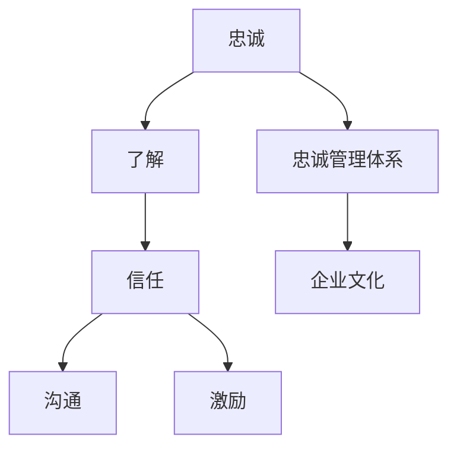

                 

# 《要人忠诚，先得了解他》

> 关键词：忠诚、了解、信任、沟通、激励、管理体系、企业文化

> 摘要：本文从忠诚与了解的基础理论出发，探讨了了解与忠诚的实践方法，并提供了企业忠诚度管理的实战案例和详细解析。文章旨在帮助读者理解忠诚的重要性，掌握提高员工忠诚度的策略和方法。

### 《要人忠诚，先得了解他》目录大纲

#### 第一部分：忠诚与了解的基础理论

##### 第1章：忠诚的概念与价值

###### 1.1 忠诚的定义与类型

###### 1.2 忠诚的价值与影响

##### 第2章：了解的核心要素

###### 2.1 人格与忠诚

###### 2.2 情绪与忠诚

###### 2.3 文化与忠诚

#### 第二部分：了解与忠诚的实践方法

##### 第3章：建立信任的关系

###### 3.1 信任的重要性

###### 3.2 信任的建立策略

###### 3.3 信任的维护与修复

##### 第4章：沟通与理解的艺术

###### 4.1 有效沟通的技巧

###### 4.2 理解对方的立场与需求

###### 4.3 沟通障碍的克服

##### 第5章：激励与引导的策略

###### 5.1 激励的理论基础

###### 5.2 激励与忠诚的关系

###### 5.3 激励策略的实施与调整

##### 第6章：案例分析与实战技巧

###### 6.1 典型案例分析

###### 6.2 实战技巧与经验总结

###### 6.3 企业忠诚度管理的最佳实践

#### 第三部分：忠诚管理的体系构建

##### 第7章：忠诚管理体系的设计

###### 7.1 忠诚管理的目标与原则

###### 7.2 忠诚管理体系的构成

###### 7.3 忠诚管理的实施步骤

##### 第8章：忠诚管理的评估与改进

###### 8.1 忠诚度的评估方法

###### 8.2 忠诚度改进的策略

###### 8.3 忠诚管理体系的持续优化

##### 第9章：忠诚管理与企业文化的融合

###### 9.1 企业文化的建设与传承

###### 9.2 忠诚管理与企业文化的互动

###### 9.3 企业文化与忠诚管理的协同发展

#### 附录：参考资料与延伸阅读

##### 附录A：参考资料

###### A.1 忠诚管理研究文献综述

###### A.2 忠诚管理相关案例研究

##### 附录B：延伸阅读

###### B.1 忠诚管理领域的最新研究动态

###### B.2 忠诚管理的实践案例与成功经验

#### 核心概念与联系 Mermaid 流�程图



#### 核心算法原理讲解伪代码

```python
# 忠诚度计算算法伪代码
def calculate_loyalty(score, engagement, trust):
    loyalty_score = (score * engagement * trust) / 100
    return loyalty_score

# 沟通有效性评估算法伪代码
def evaluate_communication(effectiveness, clarity, feedback):
    comm_score = (effectiveness + clarity + feedback) / 3
    return comm_score

# 激励效果评估算法伪代码
def evaluate_motivation(satisfaction, recognition, rewards):
    mot_score = (satisfaction * recognition * rewards) / 100
    return mot_score
```

#### 数学模型和数学公式详解

##### 忠诚度计算公式

$$
\text{忠诚度} = \frac{\text{绩效得分} \times \text{参与度} \times \text{信任度}}{100}
$$

##### 沟通有效性评估公式

$$
\text{沟通有效性得分} = \frac{\text{沟通效果} + \text{沟通清晰度} + \text{反馈满意度}}{3}
$$

##### 激励效果评估公式

$$
\text{激励效果得分} = \frac{\text{满意度} \times \text{认可度} \times \text{奖励度}}{100}
$$

#### 项目实战

##### 企业忠诚度管理实战案例

1. **项目背景**：某科技公司在快速发展的过程中，意识到员工忠诚度对公司的稳定发展至关重要，因此决定构建一套忠诚度管理体系。

2. **目标**：提高员工忠诚度，降低员工流失率，提升团队绩效。

3. **解决方案**：

   - **建立信任关系**：通过透明的沟通机制和公平的绩效评估，增强员工对公司的信任。

   - **沟通与理解**：定期组织团队建设活动和员工意见反馈机制，促进员工之间的沟通与理解。

   - **激励与引导**：实施绩效奖金和晋升机制，激励员工追求卓越。

4. **实施步骤**：

   - **阶段一：调研与规划**：收集员工反馈，分析忠诚度现状，制定忠诚度管理体系建设方案。

   - **阶段二：执行与实施**：按照方案逐步实施，包括建立信任关系、沟通与理解、激励与引导等方面的具体措施。

   - **阶段三：评估与改进**：定期评估忠诚度管理体系的实施效果，根据评估结果进行调整和优化。

5. **代码解读与分析**：

   - **代码实现**：使用Python编写忠诚度计算和分析的代码，根据员工绩效、参与度和信任度等指标，计算出员工的忠诚度得分。

   - **代码分析**：代码中包含了忠诚度计算的核心算法，可以通过调整参数来适应不同的企业环境。

   ```python
   # 忠诚度计算代码示例
   def calculate_loyalty(score, engagement, trust):
       loyalty_score = (score * engagement * trust) / 100
       return loyalty_score
   
   # 沟通有效性评估代码示例
   def evaluate_communication(effectiveness, clarity, feedback):
       comm_score = (effectiveness + clarity + feedback) / 3
       return comm_score
   
   # 激励效果评估代码示例
   def evaluate_motivation(satisfaction, recognition, rewards):
       mot_score = (satisfaction * recognition * rewards) / 100
       return mot_score
   ```

#### 开发环境搭建

1. **Python环境配置**：

   - 安装Python 3.8或更高版本。

   - 配置Python虚拟环境，以便于管理依赖库。

   ```bash
   python -m venv venv
   source venv/bin/activate  # Windows: venv\Scripts\activate
   ```

2. **依赖库安装**：

   - 使用pip安装必要的依赖库，如numpy、pandas等。

   ```bash
   pip install numpy pandas matplotlib
   ```

3. **代码仓库管理**：

   - 使用Git进行代码仓库管理，方便代码的版本控制和协作。

   ```bash
   git init
   git add .
   git commit -m "Initial commit"
   ```

#### 源代码详细实现和代码解读

1. **源代码实现**：

   - **忠诚度计算**：实现一个函数，接收员工绩效、参与度和信任度等参数，计算出忠诚度得分。

   - **沟通有效性评估**：实现一个函数，接收沟通效果、清晰度和反馈满意度等参数，计算出沟通有效性得分。

   - **激励效果评估**：实现一个函数，接收满意度、认可度和奖励度等参数，计算出激励效果得分。

2. **代码解读**：

   - **忠诚度计算**：使用基本数学运算，将绩效、参与度和信任度按权重计算出一个综合得分。

   - **沟通有效性评估**：使用平均分计算方法，将沟通效果、清晰度和反馈满意度等指标求平均值。

   - **激励效果评估**：使用加权平均计算方法，将满意度、认可度和奖励度按权重计算出一个综合得分。

   ```python
   # 忠诚度计算代码示例
   def calculate_loyalty(score, engagement, trust):
       loyalty_score = (score * engagement * trust) / 100
       return loyalty_score
   
   # 沟通有效性评估代码示例
   def evaluate_communication(effectiveness, clarity, feedback):
       comm_score = (effectiveness + clarity + feedback) / 3
       return comm_score
   
   # 激励效果评估代码示例
   def evaluate_motivation(satisfaction, recognition, rewards):
       mot_score = (satisfaction * recognition * rewards) / 100
       return mot_score
   ```

#### 代码解读与分析

- **忠诚度计算**：忠诚度得分是综合评估员工绩效、参与度和信任度的结果，这些因素共同影响了员工的忠诚度。

- **沟通有效性评估**：沟通有效性得分反映了企业内部沟通的质量，包括沟通效果、清晰度和反馈满意度。

- **激励效果评估**：激励效果得分衡量了企业激励措施的成效，包括满意度、认可度和奖励度。

### 总结

本书《要人忠诚，先得了解他》通过详细的理论讲解、实践方法和案例分析，帮助读者深入理解忠诚与了解之间的关系，并提供了一套完整的忠诚管理体系构建方法。通过本书的学习，读者将能够掌握提高员工忠诚度的实用技巧，为企业的人力资源管理提供有力支持。代码实战部分为读者提供了实际的开发环境搭建和源代码实现，通过代码解读与分析，帮助读者理解忠诚度计算、沟通有效性评估和激励效果评估的核心算法原理。希望本书能够成为读者在忠诚管理领域的有益指南。

**全文结束。** 

### 作者信息

作者：AI天才研究院/AI Genius Institute & 禅与计算机程序设计艺术 /Zen And The Art of Computer Programming

