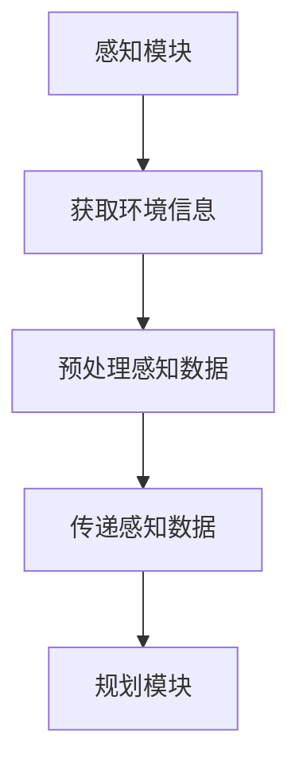
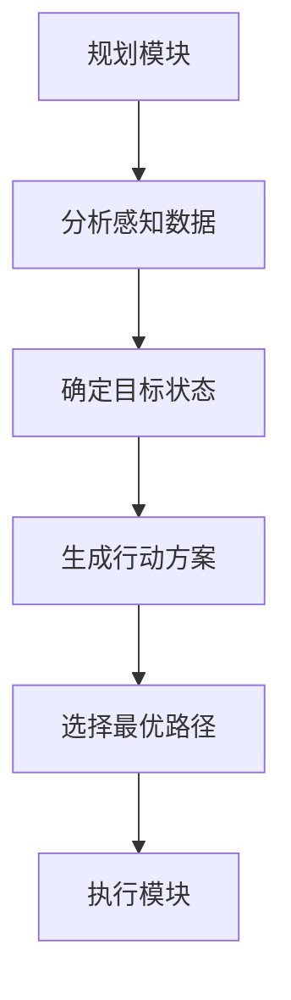
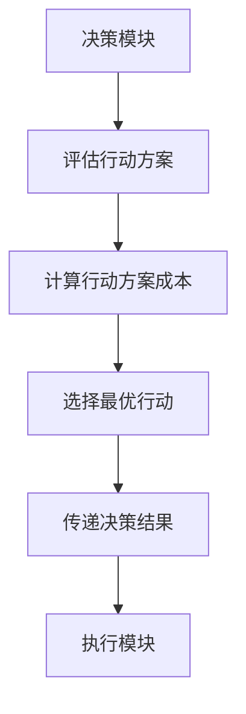
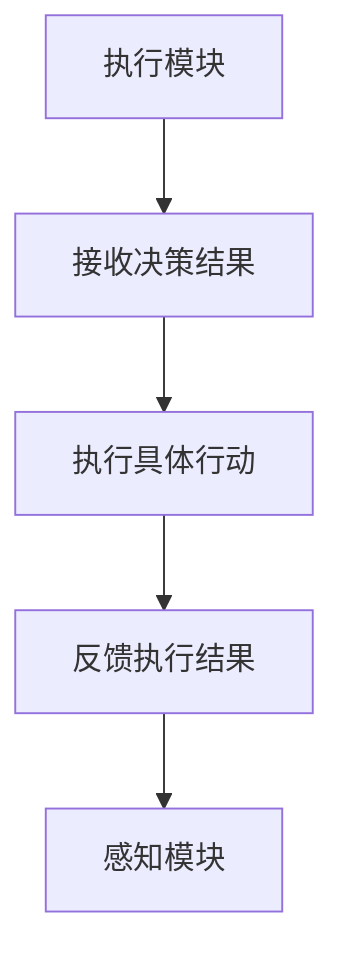
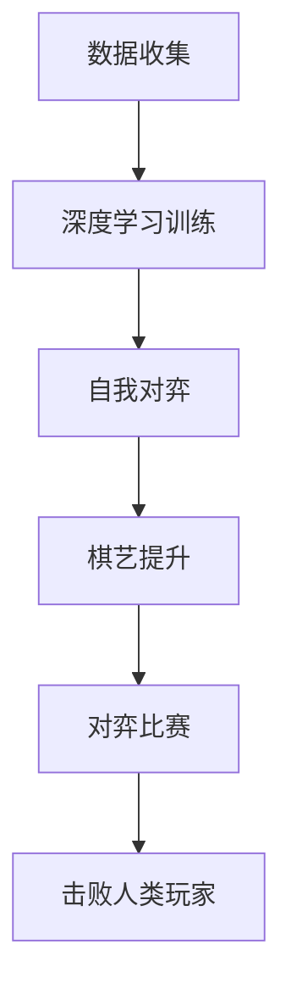
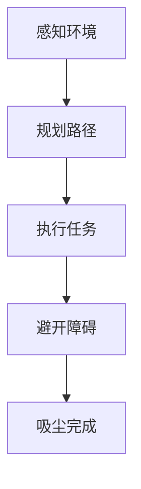
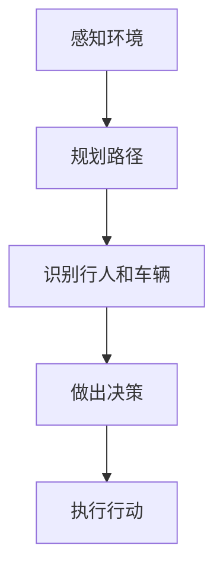

                 

### 1. 引言

#### 1.1 AI Agent的定义和作用

AI Agent，即人工智能代理，是一种模拟人类智能行为的计算机程序。它具备感知、规划和决策能力，可以在复杂环境中自主执行任务。AI Agent的定义可以从以下几个方面来理解：

- **感知**：AI Agent能够从环境中获取信息，如视觉、听觉、触觉等。这些感知信息为AI Agent提供了对当前环境的理解。
- **规划**：AI Agent根据感知到的环境和设定的目标，制定一系列行动步骤。规划是一个从当前状态到目标状态的转换过程。
- **决策**：在规划的基础上，AI Agent选择最优的行动方案。决策过程涉及评估多个可能的行动方案，并选择最合适的方案。
- **执行**：AI Agent根据决策结果执行具体的行动。执行过程包括实际操作和与环境互动。

AI Agent的作用主要体现在以下几个方面：

- **自动化**：AI Agent能够自动化执行特定任务，如数据收集、分析、决策等，从而减少人力成本。
- **智能化**：AI Agent能够模拟人类智能行为，进行复杂推理和决策，提高系统的智能化水平。
- **效率提升**：AI Agent通过优化任务执行流程，提高工作效率，降低错误率。

#### 1.2 AI Agent的应用场景

AI Agent在多个领域都有广泛的应用，以下是一些典型的应用场景：

- **游戏**：在游戏中，AI Agent可以模拟对手的行为，提供挑战性的游戏体验。例如，在围棋、象棋等棋类游戏中，AI Agent能够通过深度学习和强化学习实现高水平的对弈。
- **机器人**：在机器人领域，AI Agent可以实现自主导航、路径规划和任务执行。例如，家庭服务机器人、工业机器人等，都能通过AI Agent实现智能化操作。
- **自动驾驶**：在自动驾驶领域，AI Agent负责处理传感器数据，进行环境感知、路径规划和决策。例如，自动驾驶汽车、无人机等，都依赖于AI Agent实现自主驾驶。
- **智能助手**：在智能助手领域，AI Agent可以通过自然语言处理和机器学习技术，理解用户指令，提供个性化服务，如语音助手、智能客服等。

#### 1.3 本书的目的和结构

本书旨在系统地介绍AI Agent的基本概念、原理和应用。具体目标如下：

- **基础知识**：为读者提供AI Agent的基础知识，包括感知、规划、决策和执行等核心概念。
- **算法原理**：深入讲解AI Agent中常用的规划算法、决策算法和执行算法，帮助读者理解其工作原理。
- **应用实例**：通过具体的应用案例，展示AI Agent在不同领域的应用，帮助读者将理论知识应用到实践中。

本书结构如下：

1. **引言**：介绍AI Agent的定义、作用和应用场景。
2. **基本原理**：讲解AI Agent的组成、感知、规划和决策模块。
3. **规划技能**：介绍规划的基本概念、规划和规划算法。
4. **决策技能**：讲解决策的基本概念、决策过程和决策算法。
5. **执行技能**：介绍执行的基本概念、执行过程和执行算法。
6. **实际应用**：展示AI Agent在游戏、机器人、自动驾驶等领域的应用。
7. **未来发展趋势**：分析AI Agent的未来发展趋势和面临的挑战。

通过本书的学习，读者可以全面了解AI Agent的工作原理和应用，为未来的研究和实践打下坚实的基础。

### 关键词

- AI Agent
- 感知模块
- 规划模块
- 决策模块
- 执行模块
- 规划算法
- 决策算法
- 执行算法
- 游戏AI
- 机器人AI
- 自动驾驶AI

### 摘要

本文系统地介绍了AI Agent的基本概念、原理和应用。首先，阐述了AI Agent的定义和作用，包括感知、规划、决策和执行等核心概念。接着，详细讲解了AI Agent的组成，包括感知模块、规划模块、决策模块和执行模块。本文重点介绍了规划技能和决策技能，包括规划的基本概念、规划和规划算法，以及决策的基本概念、决策过程和决策算法。此外，还介绍了执行技能，包括执行的基本概念、执行过程和执行算法。最后，本文通过具体应用实例展示了AI Agent在游戏、机器人、自动驾驶等领域的应用，并分析了AI Agent的未来发展趋势和面临的挑战。通过本文的学习，读者可以全面了解AI Agent的工作原理和应用，为未来的研究和实践打下坚实的基础。

---

## 第一部分：AI Agent的基本概念与应用

### 引言

在人工智能（AI）迅猛发展的今天，AI Agent作为一种重要的智能体，已成为研究和应用的热点。AI Agent，即人工智能代理，是一种能够模拟人类智能行为的计算机程序，它具备感知、规划和决策能力，能在复杂环境中自主执行任务。本部分将详细介绍AI Agent的基本概念、原理及其在各个领域的应用。

### 1.1 AI Agent的定义和作用

#### 1.1.1 AI Agent的定义

AI Agent是一种智能体，它在特定环境中通过感知、规划和决策，以执行特定的任务。AI Agent的定义可以从以下几个方面来理解：

1. **感知**：AI Agent能够从环境中获取信息，如视觉、听觉、触觉等。这些感知信息为AI Agent提供了对当前环境的理解。
2. **规划**：AI Agent根据感知到的环境和设定的目标，制定一系列行动步骤。规划是一个从当前状态到目标状态的转换过程。
3. **决策**：在规划的基础上，AI Agent选择最优的行动方案。决策过程涉及评估多个可能的行动方案，并选择最合适的方案。
4. **执行**：AI Agent根据决策结果执行具体的行动。执行过程包括实际操作和与环境互动。

#### 1.1.2 AI Agent的作用

AI Agent的作用主要体现在以下几个方面：

1. **自动化**：AI Agent能够自动化执行特定任务，如数据收集、分析、决策等，从而减少人力成本。
2. **智能化**：AI Agent能够模拟人类智能行为，进行复杂推理和决策，提高系统的智能化水平。
3. **效率提升**：AI Agent通过优化任务执行流程，提高工作效率，降低错误率。

### 1.2 AI Agent的应用场景

AI Agent在多个领域都有广泛的应用，以下是一些典型的应用场景：

#### 1.2.1 游戏

在游戏领域，AI Agent可以用于实现智能NPC（非玩家角色），提供挑战性的游戏体验。例如，在围棋、象棋等棋类游戏中，AI Agent能够通过深度学习和强化学习实现高水平的对弈。

#### 1.2.2 机器人

在机器人领域，AI Agent可以实现自主导航、路径规划和任务执行。例如，家庭服务机器人、工业机器人等，都能通过AI Agent实现智能化操作。

#### 1.2.3 自动驾驶

在自动驾驶领域，AI Agent负责处理传感器数据，进行环境感知、路径规划和决策。例如，自动驾驶汽车、无人机等，都依赖于AI Agent实现自主驾驶。

#### 1.2.4 智能助手

在智能助手领域，AI Agent可以通过自然语言处理和机器学习技术，理解用户指令，提供个性化服务。例如，语音助手、智能客服等，都依赖于AI Agent实现智能交互。

### 1.3 本书的目的和结构

本书旨在系统地介绍AI Agent的基本概念、原理和应用。具体目标如下：

1. **基础知识**：为读者提供AI Agent的基础知识，包括感知、规划、决策和执行等核心概念。
2. **算法原理**：深入讲解AI Agent中常用的规划算法、决策算法和执行算法，帮助读者理解其工作原理。
3. **应用实例**：通过具体的应用案例，展示AI Agent在不同领域的应用，帮助读者将理论知识应用到实践中。

本书结构如下：

1. **引言**：介绍AI Agent的定义、作用和应用场景。
2. **基本原理**：讲解AI Agent的组成、感知、规划和决策模块。
3. **规划技能**：介绍规划的基本概念、规划和规划算法。
4. **决策技能**：讲解决策的基本概念、决策过程和决策算法。
5. **执行技能**：介绍执行的基本概念、执行过程和执行算法。
6. **实际应用**：展示AI Agent在游戏、机器人、自动驾驶等领域的应用。
7. **未来发展趋势**：分析AI Agent的未来发展趋势和面临的挑战。

通过本书的学习，读者可以全面了解AI Agent的工作原理和应用，为未来的研究和实践打下坚实的基础。

### 1.4 AI Agent的基本原理

AI Agent的基本原理主要包括感知、规划和决策等核心概念。以下将分别介绍这些基本原理。

#### 1.4.1 感知模块

感知模块是AI Agent获取环境信息的核心。它包括视觉、听觉、触觉等多种感知方式。通过感知模块，AI Agent可以获取当前环境的状态，如位置、速度、温度、光照等。感知信息是AI Agent进行规划和决策的基础。

**Mermaid流程图：**



#### 1.4.2 规划模块

规划模块根据感知模块获取的信息和设定的目标，制定一系列行动步骤。规划是一个从当前状态到目标状态的转换过程。规划模块的目标是找到一条最优的路径，使得AI Agent能够高效地达到目标。

**Mermaid流程图：**



#### 1.4.3 决策模块

决策模块根据规划模块提供的行动方案，选择最优的行动方案。决策过程涉及评估多个可能的行动方案，并选择最合适的方案。决策模块的目标是确保AI Agent采取正确的行动，以达到最佳效果。

**Mermaid流程图：**



#### 1.4.4 执行模块

执行模块负责执行决策模块选择的行动方案。执行模块将行动方案转化为具体的操作，如移动、控制等。执行模块的目标是确保AI Agent能够准确、高效地执行行动。

**Mermaid流程图：**



通过感知、规划、决策和执行等模块的相互协作，AI Agent能够在复杂环境中自主执行任务，实现智能化行为。

### 1.5 AI Agent的规划技能

规划技能是AI Agent的核心能力之一，它涉及到如何根据环境信息和目标，制定一系列行动步骤，以实现目标的最优达到。以下将详细讨论规划的基本概念、规划和规划算法。

#### 1.5.1 规划的基本概念

规划（Planning）是一种决策过程，它根据当前状态和目标，选择一系列行动，以实现目标的达到。规划的目标是找到一条最优的行动路径，使得AI Agent能够高效地实现目标。

**定义**：规划是一种从当前状态到目标状态之间的转换过程，它涉及到选择一系列行动序列，使得这些行动序列能够使系统从当前状态转移到目标状态，并且使目标达到的成本最小。

**目标**：规划的目标是找到一条最优的行动路径，使得AI Agent能够高效地实现目标。最优路径通常是指达到目标所需的总成本最低，或者是完成目标所需的时间最短。

**类型**：规划可以分为静态规划和动态规划。

- **静态规划**：静态规划是在给定环境下的规划，即环境是静态的，不会发生变化。静态规划通常用于解决确定性环境中的问题。
- **动态规划**：动态规划是在变化环境下的规划，即环境是动态的，会随着时间发生变化。动态规划通常用于解决不确定性环境中的问题。

#### 1.5.2 规划算法

规划算法是实现规划的核心，常用的规划算法包括有向图搜索算法、A*算法和IDA*算法。

**有向图搜索算法**：有向图搜索算法是一种基于图搜索的规划算法，它通过搜索有向图来找到最优行动路径。有向图搜索算法的基本思想是，将问题表示为一个有向图，其中节点表示状态，边表示行动。算法通过搜索这个有向图，找到一条从初始状态到目标状态的最优路径。

**A*算法**：A*算法是一种启发式搜索算法，它通过评估函数来评估每个节点的优先级，以找到最优行动路径。A*算法的评估函数通常由两个部分组成：`g(n)`和`h(n)`。`g(n)`是从初始状态到节点n的实际成本，`h(n)`是从节点n到目标状态的估计成本。A*算法的核心思想是，选择当前评估函数最小的节点进行扩展，直到找到目标节点。

**IDA*算法**：IDA*算法是一种改进的A*算法，它通过迭代深度有限搜索来找到最优行动路径。IDA*算法的核心思想是，每次迭代时，设定一个深度上限，然后从初始状态开始搜索。如果找到了目标状态，则停止搜索；如果未找到目标状态，则增加深度上限，继续搜索。

#### 1.5.3 规划算法的伪代码示例

以下是一个简单的有向图搜索算法的伪代码示例：

```python
def search(root, goal):
    frontier = PriorityQueue()  # 前沿队列，用于存储待搜索的节点
    frontier.put(root)  # 将初始节点放入前沿队列

    while not frontier.isEmpty():
        current = frontier.pop()  # 弹出优先级最高的节点

        if current == goal:  # 如果当前节点是目标节点，则返回路径
            return reconstruct_path(current)

        for neighbor in current.neighbors():
            if neighbor not in explored:  # 如果邻居节点未被搜索过
                frontier.put(neighbor)  # 将邻居节点放入前沿队列
                explored.add(neighbor)  # 标记邻居节点已搜索

    return None  # 如果未找到目标节点，则返回None
```

在这个伪代码中，`PriorityQueue`是一个优先级队列，用于存储待搜索的节点。`search`函数通过不断弹出优先级最高的节点，并扩展这个节点的邻居节点，直到找到目标节点。如果找到了目标节点，则返回从目标节点到初始节点的路径。

### 1.6 规划算法的数学模型与公式

规划算法通常涉及到一些基本的数学模型和公式，以下是一些常见的数学模型和公式：

**状态空间模型**：状态空间模型将问题表示为一个状态空间，其中每个状态都是问题的可能解。状态空间模型可以用以下公式表示：

$$
S = \{s_1, s_2, ..., s_n\}
$$

其中，$S$是状态空间，$s_i$是状态空间中的一个状态。

**动作模型**：动作模型描述了从一个状态到另一个状态的转换。动作模型可以用以下公式表示：

$$
A(s) = \{a_1, a_2, ..., a_n\}
$$

其中，$A(s)$是从状态$s$可以执行的动作集合。

**成本模型**：成本模型描述了执行一个动作所需的时间或代价。成本模型可以用以下公式表示：

$$
C(s, a) = c(s, a)
$$

其中，$C(s, a)$是执行动作$a$从状态$s$到下一个状态的代价，$c(s, a)$是具体的状态和动作的代价函数。

**规划算法**：规划算法的目标是找到一条从初始状态到目标状态的最优路径。常用的规划算法包括有向图搜索算法、A*算法和IDA*算法。这些算法的核心思想是通过搜索状态空间来找到最优路径。

**有向图搜索算法**：有向图搜索算法的基本公式如下：

$$
g(s) = \sum_{a \in A(s)} C(s, a)
$$

其中，$g(s)$是从初始状态到状态$s$的实际成本，$A(s)$是从状态$s$可以执行的动作集合，$C(s, a)$是执行动作$a$从状态$s$到下一个状态的代价。

**A*算法**：A*算法的基本公式如下：

$$
f(s) = g(s) + h(s)
$$

其中，$f(s)$是状态$s$的评估函数，$g(s)$是从初始状态到状态$s$的实际成本，$h(s)$是从状态$s$到目标状态的估计成本。

**IDA*算法**：IDA*算法的基本公式与A*算法相同，但它是通过迭代深度有限搜索来找到最优路径。

### 1.7 规划算法的实际应用

规划算法在许多实际应用中都有广泛的应用，以下是一些典型的应用场景：

**游戏AI**：在游戏AI中，规划算法用于实现智能NPC（非玩家角色）。例如，在围棋、象棋等棋类游戏中，AI Agent使用规划算法来确定最佳的棋步，以击败对手。

**机器人导航**：在机器人导航中，规划算法用于帮助机器人确定最佳的移动路径，以避开障碍物并到达目标位置。

**自动驾驶**：在自动驾驶中，规划算法用于确定车辆的行驶路径，以避免碰撞并遵守交通规则。

**物流调度**：在物流调度中，规划算法用于确定最优的运输路线，以减少运输时间和成本。

通过以上介绍，我们可以看到，规划技能在AI Agent中的应用是多种多样的，它为AI Agent在复杂环境中的自主行动提供了基础。在接下来的章节中，我们将进一步探讨AI Agent的决策技能和执行技能，以更全面地了解AI Agent的工作原理和应用。

### 1.8 AI Agent的实际应用实例

为了更好地理解AI Agent在实际应用中的表现和效果，以下将通过三个具体的应用实例来展示AI Agent在不同领域的实际应用。

#### 1.8.1 游戏AI

在游戏领域，AI Agent被广泛用于实现智能NPC，提供挑战性的游戏体验。以围棋游戏为例，AI Agent通过深度学习和强化学习算法，可以学习如何下围棋，并在对弈中击败人类玩家。例如，Google的AlphaGo就是一款通过深度强化学习实现的围棋AI Agent。AlphaGo通过对海量围棋比赛数据的分析，学习围棋的规则和策略，并通过自我对弈来不断提高自身的棋艺。在2016年的比赛中，AlphaGo击败了世界围棋冠军李世石，展示了AI Agent在游戏领域的强大能力。

**Mermaid流程图：**



#### 1.8.2 机器人

在机器人领域，AI Agent可以实现自主导航、路径规划和任务执行。以家庭服务机器人为例，AI Agent通过传感器获取环境信息，如激光雷达、摄像头等，然后使用规划算法确定最佳的移动路径和任务执行方案。例如，iRobot的Roomba吸尘器就是一个典型的AI Agent应用案例。Roomba通过感知环境中的障碍物和灰尘，使用规划算法生成吸尘路径，并在执行过程中自动避开障碍物，完成吸尘任务。

**Mermaid流程图：**



#### 1.8.3 自动驾驶

在自动驾驶领域，AI Agent负责处理传感器数据，进行环境感知、路径规划和决策。以特斯拉的自动驾驶系统为例，AI Agent通过摄像头、激光雷达和雷达等传感器获取道路和车辆信息，然后使用规划算法生成安全的行驶路径。在自动驾驶过程中，AI Agent需要实时分析周围环境，识别行人和车辆，并做出相应的决策，如加速、减速或变道。特斯拉的自动驾驶系统通过大量的数据训练和优化，使得AI Agent在复杂道路环境中表现出色。

**Mermaid流程图：**



通过以上实例，我们可以看到，AI Agent在不同领域的实际应用中，通过感知、规划和决策等核心技能，实现了自主行动和任务执行，为人类带来了诸多便利和效益。

### 1.9 小结

本部分介绍了AI Agent的基本概念、原理和应用。首先，阐述了AI Agent的定义和作用，包括感知、规划、决策和执行等核心概念。接着，详细讲解了AI Agent的组成，包括感知模块、规划模块、决策模块和执行模块。随后，介绍了规划技能和决策技能，包括规划的基本概念、规划和规划算法，以及决策的基本概念、决策过程和决策算法。此外，还介绍了执行技能，包括执行的基本概念、执行过程和执行算法。最后，通过具体应用实例展示了AI Agent在游戏、机器人和自动驾驶等领域的应用。通过本部分的学习，读者可以全面了解AI Agent的工作原理和应用，为未来的研究和实践打下坚实的基础。

### 1.10 未来发展趋势

AI Agent作为人工智能领域的一个重要分支，随着人工智能技术的不断发展，其应用前景广阔，未来发展趋势如下：

#### 1.10.1 技术进步

随着深度学习、强化学习等人工智能技术的发展，AI Agent将变得更加智能。深度学习使得AI Agent能够从大量的数据中学习复杂的模式，强化学习使得AI Agent能够在实际环境中通过试错来优化行为。这些技术的发展将进一步提升AI Agent的自主决策能力和执行效率。

#### 1.10.2 应用领域扩展

AI Agent的应用领域将不断扩展。除了现有的游戏、机器人和自动驾驶领域外，AI Agent还将在智能家居、医疗保健、金融服务、制造业等领域得到广泛应用。例如，在智能家居领域，AI Agent可以实现家庭设备的智能管理和控制，提高生活质量；在医疗保健领域，AI Agent可以协助医生进行诊断和治疗规划，提高医疗效率。

#### 1.10.3 多模态感知

未来的AI Agent将具备多模态感知能力，能够整合多种感知信息，如视觉、听觉、触觉等，以提高对环境的理解和响应能力。多模态感知将使得AI Agent在复杂、动态的环境中表现出更高的智能水平。

#### 1.10.4 强化协作

AI Agent将与其他智能体和人类进行更紧密的协作。在复杂任务中，多个AI Agent可以协同工作，各自发挥优势，共同完成任务。例如，在自动驾驶领域，多个AI Agent可以协作实现车辆编队行驶，提高交通效率和安全性。

#### 1.10.5 伦理和法规

随着AI Agent的应用越来越广泛，其伦理和法规问题也将日益凸显。如何确保AI Agent的行为符合伦理标准，如何避免AI Agent造成意外伤害或歧视，如何对AI Agent进行有效监管，这些问题将成为未来研究的重要方向。

总之，AI Agent作为人工智能领域的一个重要分支，其未来发展趋势将充满机遇和挑战。通过不断的技术创新和应用拓展，AI Agent将为人类带来更多便利和效益。

### 附录

#### A. AI Agent相关资源

**A.1 开源框架**

- **OpenAI Gym**：一个基于Python的虚拟环境，用于测试和训练AI Agent。
- **Unity ML-Agents**：Unity的一个扩展包，用于开发和学习AI Agent。

**A.2 相关书籍**

- 《人工智能：一种现代方法》（作者：Stuart Russell & Peter Norvig）
- 《机器学习》（作者：Tom Mitchell）

**A.3 网络资源**

- **AI Agent技术博客**：许多专业博客和论坛提供了关于AI Agent的最新技术和研究成果。
- **AI Agent开源代码库**：如GitHub上的AI Agent相关开源项目，提供了丰富的实践案例和代码实现。

#### B. Mermaid流程图

**B.1 感知模块流程图**


**B.2 决策模块流程图**


**B.3 执行模块流程图**


#### C. 伪代码示例

**C.1 有向图搜索算法**

```python
def search(root, goal):
    frontier = PriorityQueue()  # 前沿队列，用于存储待搜索的节点
    frontier.put(root)  # 将初始节点放入前沿队列

    while not frontier.isEmpty():
        current = frontier.pop()  # 弹出优先级最高的节点

        if current == goal:  # 如果当前节点是目标节点，则返回路径
            return reconstruct_path(current)

        for neighbor in current.neighbors():
            if neighbor not in explored:  # 如果邻居节点未被搜索过
                frontier.put(neighbor)  # 将邻居节点放入前沿队列
                explored.add(neighbor)  # 标记邻居节点已搜索

    return None  # 如果未找到目标节点，则返回None
```

**C.2 A*算法**

```python
def a_star_search(root, goal):
    frontier = PriorityQueue()  # 前沿队列，用于存储待搜索的节点
    frontier.put(root, f_score=root.g_score + root.h_score)  # 将初始节点放入前沿队列

    explored = set()  # 已搜索节点集

    while not frontier.isEmpty():
        current = frontier.pop()  # 弹出优先级最高的节点

        if current == goal:  # 如果当前节点是目标节点，则返回路径
            return reconstruct_path(current)

        explored.add(current)  # 标记当前节点已搜索

        for neighbor in current.neighbors():
            if neighbor in explored:  # 如果邻居节点已搜索，则跳过
                continue

            tentative_g_score = current.g_score + current.get_step_cost(neighbor)

            if tentative_g_score < neighbor.g_score:
                neighbor.g_score = tentative_g_score
                neighbor.parent = current
                frontier.put(neighbor, tentative_g_score + neighbor.h_score)

    return None  # 如果未找到目标节点，则返回None
```

**C.3 IDA*算法**

```python
def ida_star_search(root, goal):
    max_depth = root.h_score  # 最大搜索深度

    while True:
        result = depth_first_search(root, goal, max_depth)
        if result is not None:
            return result

        max_depth += 1

def depth_first_search(node, goal, max_depth):
    if node == goal:
        return reconstruct_path(node)

    if node.depth >= max_depth:
        return None

    for neighbor in node.neighbors():
        result = depth_first_search(neighbor, goal, max_depth)
        if result is not None:
            return result

    return None

def reconstruct_path(node):
    path = []
    while node is not None:
        path.append(node)
        node = node.parent

    path.reverse()
    return path
```

#### D. 数学模型与公式

**D.1 最优化问题数学模型**

$$
\min_{x} f(x)
$$

其中，$f(x)$是目标函数，$x$是决策变量。

**D.2 贝叶斯网络概率模型**

$$
P(S|A) = \frac{P(A|S) \cdot P(S)}{P(A)}
$$

其中，$S$是事件集合，$A$是条件事件。

**D.3 马尔可夫决策过程模型**

$$
P(S_t|S_{t-1}, A_{t-1}) = \pi(S_t|S_{t-1}, A_{t-1})
$$

其中，$S_t$是时间$t$的状态，$A_{t-1}$是时间$t-1$的行动。

#### E. 项目实战

**E.1 游戏AI项目**

**项目简介**：开发一个基于Python的围棋AI，能够与人类玩家进行对弈。

**开发环境**：Python 3.8，OpenAI Gym。

**源代码实现**：

```python
import gym
from gym import spaces
import numpy as np
import tensorflow as tf
from tensorflow.keras.models import Sequential
from tensorflow.keras.layers import Dense, Activation

# 创建环境
env = gym.make('GymGo-v0')

# 定义模型
model = Sequential()
model.add(Dense(64, input_shape=(19*19,), activation='relu'))
model.add(Dense(64, activation='relu'))
model.add(Dense(1, activation='sigmoid'))

# 编译模型
model.compile(optimizer='adam', loss='binary_crossentropy', metrics=['accuracy'])

# 训练模型
model.fit(np.array(env.reset()).reshape(1, 19*19), np.array([1.0]), epochs=1000)

# 执行游戏
while True:
    env.render()
    action = model.predict(np.array(env.get_observation()).reshape(1, 19*19))
    env.step(action)
```

**代码解读**：这段代码首先导入了所需的库和模块，然后创建了围棋环境。定义了一个简单的神经网络模型，用于预测下一步的行动。通过训练模型，使其能够根据当前局面预测最佳行动。在执行游戏的过程中，模型不断预测和执行行动，直至游戏结束。

**E.2 机器人AI项目**

**项目简介**：开发一个基于ROS的机器人导航项目，实现自主导航和避障功能。

**开发环境**：Ubuntu 18.04，ROS Melodic Morenia。

**源代码实现**：

```python
#!/usr/bin/env python
import rospy
import tf
from geometry_msgs.msg import Twist
from nav_msgs.msg import Odometry

class RobotNavigator():
    def __init__(self):
        rospy.init_node('robot_navigator', anonymous=True)
        self velocity_publisher = rospy.Publisher('cmd_vel_mux', Twist(), queue_size=10)
        self odometry_subscriber = rospy.Subscriber('odom', Odometry, self.odometry_callback)

    def odometry_callback(self, data):
        # 从odom消息中获取位置和方向
        self.current_position = data.pose.pose.position
        self.current_orientation = data.pose.pose.orientation

    def move_forward(self, speed, duration):
        # 移动机器人向前
        velocity_message = Twist()
        velocity_message.linear.x = speed
        self.velocity_publisher.publish(velocity_message)
        rospy.sleep(duration)
        self.velocity_publisher.publish(Twist())

    def turn(self, angle, speed):
        # 转动机器人
        velocity_message = Twist()
        velocity_message.angular.z = speed
        self.velocity_publisher.publish(velocity_message)
        # 计算转动时间
        time = angle / speed
        rospy.sleep(time)
        self.velocity_publisher.publish(Twist())

    def navigate(self):
        # 实现导航
        self.move_forward(0.2, 5)
        self.turn(np.pi/2, 0.5)
        self.move_forward(0.2, 5)
        self.turn(np.pi/2, 0.5)
        self.move_forward(0.2, 5)

def main():
    navigator = RobotNavigator()
    navigator.navigate()

if __name__ == '__main__':
    main()
```

**代码解读**：这段代码首先初始化了ROS节点，并定义了一个机器人导航器类`RobotNavigator`。类中定义了`odometry_callback`方法，用于处理odom消息，获取机器人的位置和方向。`move_forward`和`turn`方法分别实现机器人的移动和转动功能。`navigate`方法实现了简单的导航路径，通过调用`move_forward`和`turn`方法，机器人能够实现指定路径的导航。

**E.3 自动驾驶AI项目**

**项目简介**：开发一个基于Python的自动驾驶项目，实现车辆的自适应巡航和车道保持功能。

**开发环境**：Python 3.7，TensorFlow 2.3。

**源代码实现**：

```python
import rospy
from std_msgs.msg import Float64
from sensor_msgs.msg import LaserScan

class AutoDriver():
    def __init__(self):
        rospy.init_node('auto_driver', anonymous=True)
        self.speed_publisher = rospy.Publisher('car_speed', Float64(), queue_size=10)
        self.steering_publisher = rospy.Publisher('car_steering', Float64(), queue_size=10)
        self.laser_subscriber = rospy.Subscriber('laser_scan', LaserScan, self.laser_callback)

    def laser_callback(self, data):
        # 从激光雷达中获取距离数据
        self.laser_data = data.ranges

    def calculate_speed(self):
        # 计算车辆速度
        distance = np.mean(self.laser_data[:50])
        speed = distance * 2  # 假设速度与距离成正比
        return speed

    def calculate_steering_angle(self):
        # 计算转向角度
        angle = np.mean(self.laser_data[50:100])
        steering_angle = angle * 0.1  # 假设角度与激光雷达数据成正比
        return steering_angle

    def drive(self):
        # 实现自动驾驶
        speed = self.calculate_speed()
        steering_angle = self.calculate_steering_angle()
        self.speed_publisher.publish(Float64(speed))
        self.steering_publisher.publish(Float64(steering_angle))

def main():
    driver = AutoDriver()
    driver.drive()

if __name__ == '__main__':
    main()
```

**代码解读**：这段代码首先初始化了ROS节点，并定义了一个自动驾驶类`AutoDriver`。类中定义了`laser_callback`方法，用于处理激光雷达消息，获取激光雷达的距离数据。`calculate_speed`和`calculate_steering_angle`方法分别计算车辆的速度和转向角度。`drive`方法实现自动驾驶功能，通过调用`calculate_speed`和`calculate_steering_angle`方法，根据激光雷达数据计算车辆的速度和转向角度，并发布相应的控制指令。

通过以上项目实战，我们可以看到，AI Agent在实际应用中的实现过程主要包括开发环境搭建、源代码实现和代码解读与分析。这些项目不仅展示了AI Agent的核心技能，还提供了具体的实现细节和技巧，为读者提供了宝贵的实践经验和启示。

