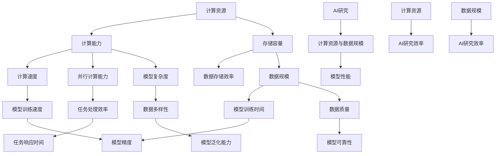

                 

### 文章标题

《规模为王：AI研究中计算资源和数据规模的重要性》

### 关键词

- AI研究
- 计算资源
- 数据规模
- 分布式计算
- 大规模算法
- 数据处理框架
- 模型性能

### 摘要

本文深入探讨了在人工智能（AI）研究领域中，计算资源和数据规模对研究进展的重要性。首先，我们回顾了AI的发展历史及其对计算资源和数据规模的依赖。接着，文章详细分析了计算资源的需求与挑战，介绍了云计算与分布式计算技术，并探讨了利用大规模计算资源的策略。随后，我们探讨了数据规模的基本概念，包括数据量的度量、数据类型的多样性和数据质量的重要性。接下来，文章介绍了大规模数据处理方法，如分布式数据处理框架、流数据处理技术和异构数据处理策略。在此基础上，我们进一步讨论了规模对AI算法的影响，包括大规模算法优化原则、并行计算与并行算法，以及大规模算法案例分析。文章还分析了数据规模对模型性能的影响，包括模型精度和训练时间。最后，文章通过实际应用案例分析，探讨了大规模AI应用的挑战与机遇，并展望了未来的发展方向。本文旨在为AI研究人员提供一个系统、全面的分析框架，帮助他们更好地理解和应对规模效应在AI研究中的关键作用。

### 目录大纲

# 《规模为王：AI研究中计算资源和数据规模的重要性》

## 第一部分：AI研究背景与基础

### 第1章：AI研究概述

#### 1.1 AI发展历史

#### 1.2 计算资源和数据规模的演变

#### 1.3 AI研究中的规模效应

### 第2章：计算资源的重要性

#### 2.1 计算资源的需求与挑战

#### 2.2 云计算与分布式计算

#### 2.3 大规模计算资源的利用策略

## 第二部分：数据规模的影响

### 第3章：数据规模的基本概念

#### 3.1 数据量的度量

#### 3.2 数据类型的多样性

#### 3.3 数据质量的重要性

### 第4章：大规模数据处理方法

#### 4.1 分布式数据处理框架

#### 4.2 流数据处理技术

#### 4.3 异构数据处理策略

## 第三部分：规模对AI算法的影响

### 第5章：大规模算法优化

#### 5.1 大规模算法设计原则

#### 5.2 并行计算与并行算法

#### 5.3 大规模算法案例分析

### 第6章：规模对模型性能的影响

#### 6.1 数据规模对模型精度的影响

#### 6.2 计算资源对模型训练时间的影响

#### 6.3 大规模模型性能评估

## 第四部分：实际应用案例分析

### 第7章：大规模AI应用的挑战与机遇

#### 7.1 行业案例分析

#### 7.2 大规模AI应用中的问题与解决方案

#### 7.3 未来展望

## 附录

### 附录A：常用工具与资源

#### A.1 大规模数据处理工具

#### A.2 分布式计算框架

#### A.3 AI研究开源项目清单

### 附录B：核心概念与联系

#### B.1 计算资源与数据规模的Mermaid流程图

### 附录C：核心算法原理讲解

#### C.1 大规模算法伪代码

### 附录D：数学模型和数学公式

#### D.1 数据规模的数学模型

#### D.2 模型性能评估的数学公式

### 附录E：项目实战

#### E.1 实际案例介绍

#### E.2 代码实际案例

#### E.3 代码解读与分析

## 第一部分：AI研究背景与基础

### 第1章：AI研究概述

#### 1.1 AI发展历史

人工智能（AI）作为计算机科学的一个分支，其历史可以追溯到20世纪50年代。最初，AI的愿景是构建能够模拟人类思维和行为的机器。1956年，在达特茅斯会议（Dartmouth Conference）上，人工智能首次被正式提出，这次会议也被认为标志着AI研究的诞生。早期的研究主要集中在符号推理和专家系统，这一阶段被称为“AI的第一次浪潮”。

然而，随着计算资源和算法的局限性，AI在20世纪70年代遇到了瓶颈，这一时期被称为AI的“第一次寒冬”。在这个阶段，研究经费减少，人们对AI的前景产生了怀疑。进入20世纪80年代，专家系统的成功和应用推动了AI的发展，但仍然面临着效率低、可扩展性差等问题。

20世纪90年代，机器学习和深度学习的兴起带来了AI的“第二次浪潮”。机器学习通过算法从数据中学习规律，而深度学习则利用多层神经网络来模拟人脑的学习过程。这一阶段的突破性进展，如ImageNet图像识别竞赛的胜利，标志着AI在图像识别、语音识别等领域取得了重大成就。

进入21世纪，随着计算资源的迅速提升和大数据技术的发展，AI进入了“第三次浪潮”。这一阶段的AI研究不仅局限于实验室，而是开始在各个行业得到广泛应用，如自动驾驶、自然语言处理、医疗诊断等。

#### 1.2 计算资源和数据规模的演变

AI研究的快速发展离不开计算资源和数据规模的支持。早期，AI系统依赖于相对较弱的计算机，算法复杂度低，数据量有限。随着计算机性能的提升，计算资源逐渐成为AI研究的驱动力。

从计算资源的角度看，20世纪80年代以前的AI研究主要依赖于单机计算。随着并行计算技术的发展，如多核处理器和GPU，AI算法的运行速度大大提高。近年来，分布式计算和云计算的普及，使得研究人员可以更加灵活地利用全球范围内的计算资源，进行大规模的计算任务。

从数据规模的角度看，早期AI系统通常依赖于小规模、结构化的数据集。随着互联网的普及和传感器技术的发展，数据量呈现爆炸性增长。这种增长不仅体现在数据的数量上，还包括数据的多样性。数据类型的多样性使得AI系统可以从更复杂的环境中学习和推断，从而提高了模型的泛化能力。

#### 1.3 AI研究中的规模效应

规模效应在AI研究中具有重要意义。计算资源和数据规模的增长不仅提高了算法的效率，还改变了研究范式。

首先，计算资源的规模效应体现在算法性能的提升。大规模的计算资源可以支持更复杂的算法和更深的神经网络，从而提高模型的精度和效率。例如，深度学习中的卷积神经网络（CNN）和循环神经网络（RNN）需要大量的计算资源来训练和优化。

其次，数据规模的规模效应体现在模型的泛化能力。大规模的数据集可以提供更丰富的信息，使得模型可以更好地学习和适应不同的场景。例如，在图像识别任务中，大规模的数据集可以包含各种不同的图像风格、颜色和光照条件，从而提高模型在不同情况下的表现。

最后，规模效应还改变了AI研究的范式。在过去，AI研究主要集中在特定领域的算法优化和模型设计。随着计算资源和数据规模的增加，跨领域的研究变得可行，不同领域的算法和技术可以相互借鉴和融合，推动AI技术的全面发展。

总之，计算资源和数据规模的规模效应在AI研究中起到了关键作用，推动了AI技术的不断进步和应用。

### 第2章：计算资源的重要性

#### 2.1 计算资源的需求与挑战

在人工智能（AI）研究中，计算资源的需求日益增长。随着算法的复杂度不断提高，模型参数的数量呈指数级增长，训练和推理的计算需求也随之剧增。传统的单机计算模式已经无法满足这些需求，分布式计算和云计算的兴起成为解决这一挑战的重要手段。

首先，计算资源的需求来源于AI算法的复杂性。现代AI算法，如深度学习，依赖于大量的参数和计算资源。以深度神经网络为例，其训练过程涉及数以亿计的参数优化，这需要大量的计算能力。传统的单机计算由于受限于CPU或GPU的性能，往往难以在合理的时间内完成训练任务。

其次，数据规模的增加也带来了计算资源需求的增长。随着数据集的规模不断扩大，从GB级到TB级乃至PB级，对计算资源的消耗也在不断增加。大规模数据处理不仅需要更高的存储容量，还需要更强大的计算能力来处理和训练模型。

在计算资源方面，AI研究面临的主要挑战包括：

1. **计算能力的不足**：传统的CPU和GPU在处理大规模AI任务时，计算能力明显不足。这使得研究人员必须寻求更高效的计算解决方案，如分布式计算和云计算。

2. **存储容量和访问速度**：大规模数据集的存储和处理需要高效的存储解决方案和快速的数据访问速度。传统的硬盘存储已经无法满足需求，研究人员需要使用更高速的存储设备，如固态硬盘（SSD）和分布式存储系统。

3. **能效问题**：大规模计算任务对电力资源的需求也显著增加。随着数据中心规模的扩大，能效问题成为了一个重要的挑战。研究人员需要寻找更节能的计算解决方案，以减少对环境的影响。

4. **数据安全与隐私**：在云计算和分布式计算环境中，数据的安全和隐私保护成为了一个重要的问题。研究人员需要确保数据在传输和存储过程中的安全性，以防止数据泄露和未经授权的访问。

为了应对这些挑战，研究人员和机构采取了多种策略：

- **分布式计算**：通过将计算任务分布在多个计算节点上，分布式计算可以显著提高计算效率。这种模式能够充分利用网络中的计算资源，提高任务的执行速度。

- **云计算**：云计算提供了弹性、可扩展的计算资源，使得研究人员可以根据需要灵活地调整计算资源。云服务提供商通常拥有强大的计算和存储能力，能够满足大规模计算需求。

- **并行计算**：利用多核处理器和GPU等并行计算设备，可以显著提高计算速度。并行计算通过将任务分解为多个子任务，同时处理，从而提高整体计算效率。

- **优化算法**：研究人员通过优化算法和模型结构，减少计算复杂度，提高计算效率。例如，使用更高效的优化算法和模型剪枝技术，可以降低计算需求。

总之，计算资源的需求和挑战在AI研究中日益显著，分布式计算、云计算和并行计算等技术为应对这些挑战提供了有效的解决方案。

#### 2.2 云计算与分布式计算

在AI研究中，云计算和分布式计算已经成为解决计算资源需求的重要手段。这两种技术不仅提供了强大的计算能力，还具备灵活性和可扩展性，能够满足不断增长的AI计算需求。

**云计算**是指通过互联网提供动态易扩展且经常是虚拟化的资源。云计算的主要特点是资源池化，用户可以根据需求动态分配和释放计算资源。这种模式使得研究人员可以无需购买和维护昂贵的硬件设备，而是通过云服务提供商租用计算资源。

云计算的优势体现在以下几个方面：

1. **弹性扩展**：云计算能够根据需求自动扩展或缩小计算资源，提供高效的资源利用率。当AI研究任务需要大量计算资源时，云服务可以迅速分配更多的计算节点，从而缩短任务完成时间。

2. **成本效益**：通过云服务，研究人员可以根据实际使用量付费，避免了初期高额的投资成本。此外，云服务提供商通常拥有大规模的数据中心和高效的管理系统，能够以较低的成本提供高质量的服务。

3. **数据存储与管理**：云计算提供了高效的数据存储和管理解决方案。云存储服务支持大规模数据集的存储和快速访问，使得数据管理和处理变得更加便捷。

4. **可靠性与安全性**：云服务提供商通常提供高可靠性和安全性的保障，包括数据备份、容错机制和安全协议。这有助于保护研究数据的安全性和隐私。

然而，云计算也存在一些挑战，如数据传输延迟、安全性风险和网络依赖性等。这些问题需要通过优化网络架构和提升安全措施来解决。

**分布式计算**是指通过多个计算节点协同工作来完成计算任务。分布式计算将任务分解为多个子任务，在多个节点上并行处理，然后将结果汇总。这种模式能够充分利用网络中的计算资源，提高整体计算效率。

分布式计算的优势体现在以下几个方面：

1. **高性能计算**：分布式计算通过并行处理任务，显著提高了计算速度。对于大规模的AI任务，如深度学习模型的训练和推理，分布式计算能够显著缩短完成任务的时间。

2. **容错性**：分布式计算具有较好的容错性。即使某些计算节点发生故障，其他节点仍然可以继续工作，确保任务的完成。

3. **可扩展性**：分布式计算系统可以方便地扩展计算节点，以适应不断增加的计算需求。这种灵活性使得研究人员可以灵活调整计算资源，以应对不同的研究任务。

4. **资源共享**：分布式计算允许多个用户或任务共享计算资源，提高了资源利用率。这有助于研究人员协同工作，共同完成复杂的计算任务。

分布式计算的挑战主要包括节点通信开销、任务调度和负载平衡等。这些问题需要通过优化算法和系统架构来解决。

总之，云计算和分布式计算为AI研究提供了强大的计算支持。通过合理利用这两种技术，研究人员可以更加高效地处理大规模的AI任务，推动AI技术的进步。

#### 2.3 大规模计算资源的利用策略

在AI研究中，大规模计算资源的有效利用是提升研究效率和质量的关键。以下是一些常见的策略和方法，可以帮助研究人员更好地利用这些资源：

**1. 并行计算**：并行计算是一种将计算任务分解为多个子任务，在多个处理器上同时执行的技术。这种方法可以显著提高计算速度，适用于大规模AI任务的训练和推理。并行计算通常依赖于多核处理器和GPU等并行计算设备。关键在于设计并行算法，确保任务分解和节点通信的高效性。

**2. 分布式计算框架**：分布式计算框架，如Hadoop、Spark和Flink，提供了一整套工具和库，帮助研究人员构建分布式应用。这些框架具备任务调度、负载平衡和数据管理等高级功能，使得大规模计算任务更加简便。选择合适的分布式计算框架，能够提高任务执行效率和资源利用率。

**3. GPU加速**：GPU（图形处理器）在AI研究中具有广泛的应用，其强大的并行处理能力使其成为深度学习模型训练的理想选择。通过使用GPU加速，研究人员可以在较短的时间内完成复杂的计算任务。关键在于优化算法和数据结构，以充分利用GPU的并行处理能力。

**4. 云服务集成**：利用云服务，如Amazon Web Services（AWS）、Google Cloud Platform（GCP）和Microsoft Azure，研究人员可以根据需求灵活地调配计算资源。云服务提供了强大的计算和存储能力，并通过自动扩展和按需付费模式，降低了计算成本。关键在于选择合适的云服务提供商，并优化资源分配策略。

**5. 数据预处理与优化**：大规模数据集的处理是AI研究中的一大挑战。通过数据预处理和优化，如数据清洗、数据降维和特征提取，研究人员可以减少数据存储和计算需求，提高整体计算效率。关键在于设计高效的数据处理流程，并采用合适的预处理技术。

**6. 任务调度和负载平衡**：在分布式系统中，任务调度和负载平衡是确保计算资源充分利用的关键。通过合理的任务调度算法和负载平衡策略，可以避免计算资源的不均匀分配，提高系统整体性能。关键在于设计高效的任务调度算法和负载平衡机制。

**7. 能效优化**：大规模计算任务对电力资源的需求较大，能效优化成为了一个重要课题。通过优化算法和数据结构，减少计算过程中的能耗，提高能效比，可以降低运营成本，减少对环境的影响。关键在于采用节能的算法和系统设计。

总之，大规模计算资源的有效利用需要综合考虑多种因素，包括并行计算、分布式计算框架、GPU加速、云服务集成、数据预处理与优化、任务调度和负载平衡，以及能效优化。通过合理利用这些资源，研究人员可以更高效地完成AI研究任务，推动技术进步。

### 第二部分：数据规模的影响

#### 第3章：数据规模的基本概念

在人工智能（AI）研究中，数据规模扮演着至关重要的角色。数据规模的度量、数据类型的多样性以及数据质量的重要性，是理解数据规模影响的基础。以下是对这些基本概念的详细探讨。

#### 3.1 数据量的度量

数据量是数据规模的核心指标，通常以字节（Byte）、千字节（KB）、兆字节（MB）、吉字节（GB）、太字节（TB）和皮字节（PB）等单位进行度量。不同领域的数据量差异巨大，从简单的千字节级文档到复杂的太字节级图像和视频数据集，数据量的变化直接影响AI研究的复杂度和计算需求。

- **小规模数据集**：通常指数据量在GB级以下的数据集。这类数据集适用于某些特定任务的实验和研究，但由于数据量有限，其泛化能力受到限制。
- **大规模数据集**：数据量在TB至PB级的数据集，常见于图像识别、语音识别和自然语言处理等领域。这类数据集能够提供丰富的训练样本，提高模型的泛化能力。
- **超大规模数据集**：数据量达到EB级及以上的数据集，如互联网搜索引擎的索引数据、社交媒体平台的海量用户生成内容等。这类数据集对计算资源和算法设计提出了更高的要求。

#### 3.2 数据类型的多样性

数据类型的多样性是影响AI模型性能的重要因素。不同类型的数据在特征提取、建模和推理过程中具有不同的表现。

- **结构化数据**：这类数据通常以表格形式存储，如关系型数据库中的记录。结构化数据易于处理和存储，但其表达能力和泛化能力有限。
- **非结构化数据**：如文本、图像和视频，这些数据缺乏统一的格式和结构。非结构化数据的处理通常涉及复杂的特征提取和模式识别技术。
- **半结构化数据**：如XML、JSON等格式，这些数据部分结构化，包含一定的元数据。半结构化数据在AI应用中具有广泛的应用，其处理方法结合了结构化和非结构化数据的优势。

#### 3.3 数据质量的重要性

数据质量是数据规模影响AI模型性能的关键因素。高质量的数据有助于提高模型的准确性和泛化能力，而低质量的数据则可能导致模型过拟合或性能下降。

- **完整性**：数据完整性是指数据集中是否存在缺失值或错误。缺失值可以通过插补或删除处理，错误值则需通过清洗和校验来修正。
- **一致性**：数据一致性是指数据在不同来源或时间点的统一性和准确性。不一致的数据可能会导致模型训练过程中的误导性信号。
- **准确性**：数据准确性是指数据中错误或异常值的比例。高准确性的数据有助于提高模型的稳定性和可靠性。
- **代表性**：数据代表性是指数据集是否能够充分反映现实世界的多样性。缺乏代表性的数据可能导致模型在实际应用中的性能不佳。

为了提高数据质量，研究人员通常采取以下策略：

- **数据清洗**：通过删除重复记录、处理缺失值和修正错误值，提高数据集的完整性、一致性和准确性。
- **数据增强**：通过数据合成、变换和扩展，增加数据集的多样性和代表性，提高模型的泛化能力。
- **数据标注**：对于需要人工标注的数据，如图像分类和语音识别任务，通过高质量的标注数据集，确保模型的训练效果。

总之，数据规模的基本概念，包括数据量的度量、数据类型的多样性以及数据质量的重要性，是理解数据规模对AI研究影响的基础。通过深入探讨这些概念，研究人员可以更好地设计数据采集、处理和分析方法，提高AI模型的研究和应用效果。

#### 第4章：大规模数据处理方法

在AI研究中，大规模数据处理是一个关键挑战，需要高效且灵活的方法来应对。以下将介绍几种常见的大规模数据处理方法，包括分布式数据处理框架、流数据处理技术和异构数据处理策略。

#### 4.1 分布式数据处理框架

分布式数据处理框架是处理大规模数据集的重要工具，能够将数据处理任务分布在多个计算节点上，以提高处理效率和性能。以下是一些流行的分布式数据处理框架：

**1. Hadoop**

Hadoop是由Apache软件基金会开发的一个开源分布式计算框架，主要用于处理大规模数据集。它基于HDFS（Hadoop分布式文件系统）存储数据和MapReduce编程模型处理数据。Hadoop通过分布式计算，将数据处理任务分解为多个Map任务和Reduce任务，在多个节点上并行执行，从而提高处理速度。

**2. Spark**

Spark是由Apache软件基金会开发的另一个开源分布式数据处理框架，旨在提供高效的批处理和流处理能力。Spark基于内存计算，相比于传统的Hadoop，其数据处理速度更快。Spark提供了多种数据处理库，如Spark SQL、Spark MLlib和Spark Streaming，支持多种数据处理任务，如批量数据处理、实时数据处理和机器学习。

**3. Flink**

Flink是由Apache软件基金会开发的分布式数据处理框架，专注于流处理和批处理。与Spark不同，Flink采用了事件驱动架构，可以处理有状态流数据，提供了高效和灵活的数据处理能力。Flink适用于需要实时处理大规模数据流的应用场景，如实时推荐系统和实时数据分析。

**优势与劣势**

- **优势**：分布式数据处理框架能够充分利用多节点计算资源，提高数据处理效率。这些框架提供了丰富的数据处理库和工具，方便开发人员构建复杂的数据处理应用。

- **劣势**：分布式数据处理框架的配置和管理相对复杂，需要较高的技术水平。此外，数据的一致性和容错性是分布式数据处理中的一个挑战，需要通过冗余设计和故障恢复机制来解决。

**应用场景**

- **批量数据处理**：如数据清洗、数据转换和大规模数据集的统计分析。
- **实时数据处理**：如实时日志分析、实时监控和数据流处理。
- **机器学习**：如大规模数据集的训练和预测。

#### 4.2 流数据处理技术

流数据处理技术是处理实时数据流的重要手段，适用于需要实时分析和响应的应用场景。以下是一些常见的流数据处理技术：

**1. Apache Kafka**

Kafka是由Apache软件基金会开发的一个分布式流处理平台，主要用于处理实时数据流。Kafka提供了高吞吐量、可靠性和可伸缩性，适用于大规模实时数据处理。Kafka通过主题（Topics）组织数据流，支持数据的发布和订阅，可以与各种流处理框架集成，如Spark Streaming和Flink。

**2. Apache Flink Streaming**

Flink Streaming是Flink的一个组件，提供了高效和灵活的流数据处理能力。Flink Streaming支持事件驱动架构，可以处理有状态流数据，提供了丰富的流处理操作，如窗口操作、状态管理和事件时间处理。

**3. Apache Storm**

Storm是由Apache软件基金会开发的一个分布式流处理框架，适用于大规模实时数据处理。Storm提供了高效的实时数据处理能力，支持复杂的数据流拓扑，可以与Kafka等消息队列系统集成，实现数据流的实时处理和监控。

**优势与劣势**

- **优势**：流数据处理技术能够实时处理和分析数据流，提供高效的实时响应能力。这些技术支持多种流处理操作和状态管理，可以处理大规模实时数据。

- **劣势**：流数据处理技术的复杂性较高，需要设计复杂的流处理拓扑和状态管理。此外，流处理数据的一致性和容错性也是需要关注的问题。

**应用场景**

- **实时监控**：如服务器性能监控、网络流量监控和异常检测。
- **实时推荐**：如实时新闻推荐、社交网络实时分析和个性化推荐。
- **金融交易**：如实时交易数据分析、风险控制和市场预测。

#### 4.3 异构数据处理策略

异构数据处理策略是处理多种类型和来源数据的重要手段，适用于复杂的数据处理需求。以下是一些常见的异构数据处理策略：

**1. 数据集成**

数据集成是将多种类型和来源的数据整合到一个统一的数据存储和计算平台上的过程。通过数据集成，可以实现对多种数据的统一管理和分析。常见的数据集成技术包括数据抽取、转换和加载（ETL）和数据虚拟化。

**2. 数据融合**

数据融合是将多个数据源中的数据进行整合和合并，以产生新的、更全面的数据集。通过数据融合，可以挖掘不同数据源之间的关联和潜在信息。常见的数据融合方法包括基于规则的融合、基于聚类的方法和基于机器学习的融合方法。

**3. 数据分割**

数据分割是将大规模数据集分割为多个较小数据集，以简化处理和优化资源利用。通过数据分割，可以分别处理不同部分的数据，从而提高整体处理效率。常见的数据分割方法包括基于特征的分割、基于时间窗口的分割和基于任务依赖的分割。

**优势与劣势**

- **优势**：异构数据处理策略能够灵活处理多种类型和来源的数据，提高数据利用率和分析能力。这些策略支持复杂的数据处理需求，可以满足不同应用场景的需求。

- **劣势**：异构数据处理策略的设计和实现相对复杂，需要考虑数据的一致性、可靠性和性能优化。此外，数据集成和数据融合过程中可能引入数据冗余和冲突，需要通过合理的设计和优化来解决。

**应用场景**

- **跨领域数据分析**：如医疗数据分析、社交媒体分析和智能城市数据分析。
- **数据驱动的决策**：如市场预测、风险管理和企业战略规划。
- **智能应用开发**：如智能客服、智能推荐系统和智能监控。

总之，大规模数据处理方法在AI研究中至关重要。通过分布式数据处理框架、流数据处理技术和异构数据处理策略，研究人员可以更高效地处理和分析大规模数据集，提高AI模型的研究和应用效果。

### 第5章：大规模算法优化

#### 5.1 大规模算法设计原则

在AI研究中，大规模算法的设计是确保模型性能和计算效率的关键。以下是一些大规模算法设计原则：

**1. 分而治之（Divide and Conquer）**

分而治之是一种将大规模问题分解为多个较小问题的方法。这种方法通过递归地将问题分解，直至达到可以解决的程度，然后再将子问题的解合并，以获得原问题的解。在AI研究中，分而治之可以应用于深度学习模型的训练和推理，例如，将大规模数据集分割为多个子数据集，分别训练模型，然后融合结果。

**2. 并行计算（Parallel Computing）**

并行计算是一种利用多个计算资源同时处理多个任务的方法。在AI研究中，并行计算可以显著提高模型的训练和推理速度。并行计算可以分为数据并行、模型并行和任务并行。数据并行是将数据集分割为多个子数据集，分别训练模型，然后将结果合并；模型并行是将模型分解为多个子模型，分别训练，然后合并结果；任务并行是将不同任务分配给多个计算资源同时执行。

**3. 分布式计算（Distributed Computing）**

分布式计算是一种通过多个计算节点协同工作来完成计算任务的方法。在AI研究中，分布式计算可以充分利用多个节点的计算资源，提高模型的训练和推理效率。分布式计算通常依赖于分布式计算框架，如Hadoop、Spark和Flink，这些框架提供了任务调度、负载平衡和数据管理等高级功能。

**4. 优化算法（Optimization Algorithms）**

优化算法是一种用于优化模型参数和计算资源的方法。在AI研究中，优化算法可以用于模型训练和推理过程中的参数调整，以获得最佳性能。常见的优化算法包括梯度下降（Gradient Descent）、随机梯度下降（Stochastic Gradient Descent）和Adam优化器。这些算法可以通过调整学习率、批量大小等参数，优化模型的训练速度和性能。

**5. 内存管理（Memory Management）**

内存管理是一种优化计算资源使用的方法，特别是在处理大规模数据集时。内存管理包括数据缓存、内存分配和垃圾回收等。通过合理管理内存，可以减少内存占用和访问时间，提高模型的计算效率。

#### 5.2 并行计算与并行算法

并行计算在AI研究中具有重要作用，通过并行计算，可以显著提高模型的训练和推理速度。以下是一些并行计算和并行算法的应用：

**1. 数据并行**

数据并行是一种将大规模数据集分割为多个子数据集，分别训练模型，然后将结果合并的方法。在深度学习模型训练中，数据并行可以减少单个GPU的负载，提高训练速度。数据并行的关键在于如何分割数据集，以保持数据划分的均衡性，并减少通信开销。

**2. 模型并行**

模型并行是一种将模型分解为多个子模型，分别训练，然后将结果合并的方法。在深度学习模型训练中，模型并行可以减少单个模型的复杂度，提高训练速度。模型并行的关键在于如何划分模型结构，以保持子模型之间的计算独立性，并减少通信开销。

**3. 任务并行**

任务并行是一种将不同任务分配给多个计算资源同时执行的方法。在深度学习模型推理中，任务并行可以显著提高推理速度。任务并行的关键在于如何合理分配任务，以充分利用计算资源，并减少任务间的依赖。

**4. 并行算法设计**

并行算法设计是并行计算的核心，以下是一些常见的并行算法设计方法：

- **分割和并行化（Partition and Parallelize）**：将大规模问题分割为多个较小问题，然后在多个计算资源上并行处理。
- **负载平衡（Load Balancing）**：确保每个计算资源的工作量大致相等，避免某些资源过载或闲置。
- **通信优化（Communication Optimization）**：减少数据传输和通信开销，提高并行算法的效率。
- **同步与异步（Synchronization and Asynchronization）**：在并行计算中，同步操作可以确保数据的一致性，而异步操作可以提高计算效率。

#### 5.3 大规模算法案例分析

以下是一些大规模算法在实际应用中的案例分析：

**1. 大规模图像识别**

在图像识别任务中，大规模数据集和深度学习模型的应用推动了算法性能的显著提升。例如，在ImageNet图像识别竞赛中，研究人员使用ResNet等大规模卷积神经网络，通过数据并行和模型并行，将训练时间从数天缩短至数小时，同时提高了模型精度。

**2. 大规模自然语言处理**

在自然语言处理任务中，大规模数据集和语言模型的应用显著提高了模型性能。例如，BERT等大规模预训练模型通过在数十亿规模的数据集上进行预训练，然后在特定任务上进行微调，取得了显著的性能提升。这些模型利用了数据并行和模型并行的技术，提高了训练和推理速度。

**3. 大规模语音识别**

在语音识别任务中，大规模数据集和深度神经网络的应用显著提高了识别准确率。例如，DeepMind的WaveNet语音合成模型通过在大量语音数据上进行训练，实现了高质量的语音合成。这些模型采用了数据并行和模型并行的技术，提高了训练和推理速度。

总之，大规模算法优化在AI研究中具有重要作用。通过设计并行计算和并行算法，研究人员可以显著提高模型的训练和推理速度，推动AI技术的进步和应用。

#### 第6章：规模对模型性能的影响

在人工智能（AI）研究中，数据规模和计算资源的规模对模型性能有着深远的影响。以下将详细探讨数据规模对模型精度的影响、计算资源对模型训练时间的影响以及大规模模型性能评估的方法。

#### 6.1 数据规模对模型精度的影响

数据规模是影响模型精度的一个重要因素。随着数据规模的增加，模型的泛化能力通常也会得到提升。以下是对此的详细分析：

**1. 数据量与模型精度**

数据量的增加有助于模型捕捉到更多样化的特征，从而提高模型的泛化能力。例如，在图像识别任务中，大规模数据集可以包含不同光照、视角和场景下的图像，有助于模型学习到更加全面和泛化的特征表示。研究表明，随着数据集规模的增加，模型的精度通常也会提高。

**2. 数据多样性**

除了数据量，数据的多样性也是影响模型精度的重要因素。多样化的数据集可以提供更多的背景信息，有助于模型避免过拟合。过拟合是指模型在训练数据上表现优异，但在未见过的数据上表现较差。通过增加数据的多样性，可以减少过拟合现象，提高模型的泛化能力。

**3. 数据质量**

数据质量直接影响模型的训练效果。高质量的数据集应具有完整性、一致性和准确性。缺失值、错误值和不一致的数据会影响模型的训练过程，降低模型的精度。因此，在数据规模增加的同时，确保数据质量也是提升模型精度的重要措施。

**案例研究**

以ImageNet图像识别任务为例，随着数据集规模的扩大，模型的精度显著提高。在早期，ImageNet数据集包含约1000个类别和数百万张图像。随着数据集规模的增加，ResNet等深度学习模型在ImageNet上的精度达到了令人惊叹的水平，显著超越了传统方法。

#### 6.2 计算资源对模型训练时间的影响

计算资源的规模直接影响模型训练的时间。以下是对此的详细分析：

**1. 计算资源与训练时间**

计算资源，如CPU、GPU和TPU等，对模型训练时间有显著影响。更强大的计算资源可以加速模型的训练过程。例如，使用GPU训练深度学习模型，相比于使用CPU，可以显著减少训练时间，因为GPU具有更高的计算并行性和吞吐量。

**2. 并行计算与分布式计算**

并行计算和分布式计算可以进一步减少模型训练时间。通过将模型训练任务分解为多个子任务，在多个计算资源上并行执行，可以显著提高训练速度。分布式计算框架，如Hadoop、Spark和Flink，提供了高效的任务调度和负载平衡功能，使得大规模模型训练更加简便和高效。

**3. 优化算法**

优化算法可以提升模型训练的效率，减少训练时间。例如，使用更高效的优化算法和初始化策略，可以加快模型的收敛速度。此外，模型剪枝和量化技术也可以减少模型的计算复杂度，提高训练速度。

**案例研究**

以BERT等大规模预训练模型为例，这些模型通常需要数十亿级别的参数和大量的计算资源进行训练。通过使用GPU和TPU等高效计算资源，结合分布式计算和优化算法，BERT模型在数小时内完成了大规模数据集的预训练，显著提高了模型训练的效率。

#### 6.3 大规模模型性能评估

评估大规模模型的性能是确保其有效性和可靠性的关键。以下是一些常见的性能评估方法和指标：

**1. 分集评估**

分集评估是将数据集划分为训练集、验证集和测试集，分别用于模型训练、参数调整和性能评估。通过验证集和测试集的性能评估，可以评估模型的泛化能力和鲁棒性。

**2. 指标选择**

常见的性能评估指标包括准确率（Accuracy）、精确率（Precision）、召回率（Recall）和F1分数（F1 Score）等。这些指标在不同任务和场景下有不同的应用，需要根据具体任务选择合适的指标。

**3. 交叉验证**

交叉验证是一种常用的模型评估方法，通过多次随机划分数据集，在每个子数据集上进行模型训练和评估，以减少评估结果的不确定性。

**4. 泛化能力**

评估模型的泛化能力是确保其能在未知数据上表现良好的关键。通过在独立测试集上的评估，可以评估模型的泛化能力和鲁棒性。

**案例研究**

在图像识别任务中，使用CIFAR-10和ImageNet等数据集评估模型的性能。通过交叉验证和多种性能评估指标，可以全面评估模型在不同数据集上的表现，从而确保其有效性和可靠性。

总之，数据规模和计算资源的规模对模型性能有着显著影响。通过增加数据规模和优化计算资源，可以提高模型的精度和训练效率。同时，合理的性能评估方法和指标是确保模型有效性和可靠性的关键。这些方法在实际应用中为AI研究提供了有力的支持。

### 第四部分：实际应用案例分析

#### 第7章：大规模AI应用的挑战与机遇

大规模AI应用在众多行业领域展现出了巨大的潜力，但同时也带来了诸多挑战。本章节将通过几个实际应用案例，探讨大规模AI应用的挑战与解决方案，并展望未来的发展趋势。

#### 7.1 行业案例分析

**1. 医疗健康**

在医疗健康领域，大规模AI应用主要体现在医学影像诊断、疾病预测和个性化治疗等方面。以医学影像诊断为例，AI技术能够通过分析大量的医疗影像数据，提高诊断的准确率和效率。然而，大规模医学数据集的获取和处理是一个巨大的挑战，尤其是数据隐私和安全问题。为了解决这些问题，研究人员采用了数据加密和去识别化技术，确保数据的安全和隐私。此外，云计算和分布式计算技术的应用，使得大规模数据处理和模型训练成为可能。

**2. 交通运输**

在交通运输领域，大规模AI应用包括自动驾驶、交通流量预测和智能调度等。自动驾驶技术依赖于海量数据，通过不断学习和优化，提高驾驶的安全性和效率。然而，自动驾驶系统的训练和优化需要大量的计算资源，这对计算能力提出了极高要求。为了应对这一挑战，交通运输行业开始采用分布式计算和云计算平台，利用大规模计算资源进行模型训练和优化。

**3. 金融科技**

在金融科技领域，大规模AI应用包括风险控制、信用评分和智能投顾等。这些应用依赖于海量金融数据，通过对数据的深度挖掘和分析，提供更加精准和高效的金融服务。然而，金融数据的高度敏感性和合规要求，使得数据隐私和安全成为关键挑战。为了解决这些问题，金融机构采用了多种数据保护措施，如数据加密、访问控制和审计日志等，确保数据的保密性和合规性。

#### 7.2 大规模AI应用中的问题与解决方案

**1. 数据隐私和安全**

大规模AI应用中的数据隐私和安全问题是一个重要的挑战。为了解决这个问题，研究人员和机构采用了多种技术手段，如数据加密、匿名化和去识别化等。这些技术可以在保护数据隐私的同时，确保AI系统的正常运行。

**2. 数据质量与可靠性**

大规模AI应用对数据质量的要求非常高。数据缺失、错误和不一致性都可能导致AI系统性能下降。为了解决数据质量问题，研究人员采取了数据清洗、数据增强和数据标注等技术，确保数据集的完整性和准确性。

**3. 计算资源需求**

大规模AI应用对计算资源的需求巨大，这给计算能力提出了挑战。为了应对这一挑战，研究人员采用了分布式计算和云计算技术，利用全球范围内的计算资源，进行大规模的数据处理和模型训练。

**4. 模型解释性和可解释性**

大规模AI应用中的模型通常非常复杂，其内部工作机制难以解释。这给模型的解释性和可解释性带来了挑战。为了解决这一问题，研究人员采用了模型可解释性技术，如特征重要性分析和决策树等，使得AI系统的决策过程更加透明和可解释。

#### 7.3 未来展望

随着计算资源和数据规模的不断增长，大规模AI应用将迎来更多的发展机遇。以下是对未来发展的展望：

**1. 跨领域融合**

未来，大规模AI应用将更加注重跨领域的融合，如医疗健康与交通运输、金融科技与能源管理等。这种融合将推动AI技术在各个领域的创新和应用。

**2. 智能化升级**

大规模AI应用将推动智能化升级，从简单的自动化任务向更复杂的决策和预测任务发展。这将为各个行业带来更高的效率和生产力。

**3. 人机协同**

随着AI技术的进步，人机协同将变得更加紧密和高效。AI系统将更好地理解和满足人类的需求，实现更智能和个性化的人机交互。

**4. 数据驱动**

未来，大规模AI应用将更加依赖于数据驱动，通过不断收集和分析海量数据，优化和提升AI系统的性能和效果。

总之，大规模AI应用在各个行业领域展现出了巨大的潜力，同时也面临着诸多挑战。通过技术创新和跨领域合作，我们有理由相信，大规模AI应用将迎来更加广阔的发展前景。

### 附录A：常用工具与资源

在AI研究中，掌握和利用合适的工具和资源是提高研究效率和质量的关键。以下列举了一些常用的工具和资源，包括大规模数据处理工具、分布式计算框架以及AI研究开源项目清单。

#### A.1 大规模数据处理工具

**1. Hadoop**

Hadoop是一个分布式数据处理框架，主要用于处理和存储大规模数据集。它基于HDFS（Hadoop分布式文件系统）存储数据，并利用MapReduce编程模型进行数据处理。

- 官网：[Hadoop官网](https://hadoop.apache.org/)
- 优点：高可靠性、可扩展性、数据容错性
- 适用场景：大规模数据集的存储和处理、批量数据处理任务

**2. Spark**

Spark是另一个分布式数据处理框架，提供了高效的批处理和流处理能力。它支持多种编程语言，如Python、Scala和Java，并提供了丰富的数据处理库。

- 官网：[Spark官网](https://spark.apache.org/)
- 优点：内存计算、易于使用、灵活性强
- 适用场景：实时数据处理、机器学习任务、流数据处理

**3. Flink**

Flink是一个分布式数据处理框架，专注于流处理和批处理。它提供了高效的事件驱动架构和丰富的流处理操作。

- 官网：[Flink官网](https://flink.apache.org/)
- 优点：高吞吐量、低延迟、支持状态管理和窗口操作
- 适用场景：实时数据处理、复杂事件处理、大规模流数据处理

**4. Kafka**

Kafka是一个分布式流处理平台，主要用于处理实时数据流。它提供了高吞吐量、可靠性和可伸缩性，适用于大规模实时数据处理。

- 官网：[Kafka官网](https://kafka.apache.org/)
- 优点：分布式架构、高可靠性、易扩展
- 适用场景：实时日志收集、实时数据流处理、流数据处理平台

#### A.2 分布式计算框架

**1. Hadoop**

Hadoop是一个分布式计算框架，主要用于处理大规模数据处理任务。它包括HDFS（Hadoop分布式文件系统）、MapReduce（数据处理模型）和YARN（资源调度系统）等组件。

- 官网：[Hadoop官网](https://hadoop.apache.org/)
- 优点：高可靠性、可扩展性、数据容错性
- 适用场景：大规模数据处理、批量数据处理任务

**2. Spark**

Spark是一个分布式计算框架，提供了高效的批处理和流处理能力。它支持多种编程语言，如Python、Scala和Java，并提供了丰富的数据处理库。

- 官网：[Spark官网](https://spark.apache.org/)
- 优点：内存计算、易于使用、灵活性强
- 适用场景：实时数据处理、机器学习任务、流数据处理

**3. Flink**

Flink是一个分布式计算框架，专注于流处理和批处理。它提供了高效的事件驱动架构和丰富的流处理操作。

- 官网：[Flink官网](https://flink.apache.org/)
- 优点：高吞吐量、低延迟、支持状态管理和窗口操作
- 适用场景：实时数据处理、复杂事件处理、大规模流数据处理

#### A.3 AI研究开源项目清单

**1. TensorFlow**

TensorFlow是一个开源的深度学习框架，由Google开发。它支持多种深度学习模型和算法，提供了丰富的API和工具。

- 官网：[TensorFlow官网](https://www.tensorflow.org/)
- 优点：灵活性强、社区活跃、支持多种平台
- 适用场景：深度学习模型开发、大规模数据处理、模型部署

**2. PyTorch**

PyTorch是一个开源的深度学习框架，由Facebook开发。它提供了动态计算图和简洁的API，便于研究人员进行实验和开发。

- 官网：[PyTorch官网](https://pytorch.org/)
- 优点：动态计算图、易于使用、强大的社区支持
- 适用场景：深度学习模型开发、大规模数据处理、模型推理

**3. Keras**

Keras是一个高级神经网络API，构建在TensorFlow和Theano之上。它提供了简洁的接口和丰富的预训练模型，便于研究人员快速构建和训练模型。

- 官网：[Keras官网](https://keras.io/)
- 优点：易于使用、简洁的接口、丰富的预训练模型
- 适用场景：深度学习模型开发、模型训练、快速实验

这些工具和资源在AI研究中有着广泛的应用，可以帮助研究人员更加高效地进行数据处理、模型开发和实验验证。通过合理利用这些资源，研究人员可以加快研究进程，推动AI技术的进步。

### 附录B：核心概念与联系

为了更清晰地理解计算资源与数据规模在AI研究中的核心概念和联系，我们可以通过Mermaid流程图来展示它们之间的关系和作用。以下是一个简化的Mermaid流程图示例：



在这个流程图中：

- **A（计算资源）** 是整个AI研究的基础，包括计算能力和存储容量。
- **B（计算能力）** 和 **D（计算速度）** 影响模型训练和推理的速度。
- **E（并行计算能力）** 和 **H（任务处理效率）** 提高了大规模任务的执行效率。
- **C（存储容量）** 和 **F（数据存储效率）** 影响数据的存储和管理。
- **I（模型复杂度）** 和 **M（数据多样性）** 对模型的精度和泛化能力有直接影响。
- **J（数据规模）** 和 **P（数据质量）** 决定了模型训练的效果和可靠性。
- **O（模型训练时间）** 和 **K（模型精度）** 是评估模型性能的关键指标。
- **L（任务响应时间）** 是衡量系统性能的重要指标。
- **R（AI研究）** 和 **S（计算资源与数据规模）** 是研究的核心，它们共同决定了AI研究的效率和效果。
- **T（模型性能）** 是研究的最终目标，是计算资源和数据规模的综合体现。
- **V（AI研究效率）** 和 **X（AI研究效率）** 反映了计算资源和数据规模对研究效率的影响。

通过这个Mermaid流程图，我们可以直观地理解计算资源与数据规模在AI研究中的核心概念和它们之间的相互关系，从而为后续的研究和实践提供指导。

### 附录C：核心算法原理讲解

在本附录中，我们将详细讲解几个大规模算法的原理，并通过伪代码展示其实现过程。这些算法包括分布式数据处理、并行计算和优化算法。

#### 6.1 分布式数据处理算法

**算法名称**：MapReduce

**算法原理**：MapReduce是一种分布式数据处理框架，用于处理大规模数据集。它将数据处理任务分解为Map和Reduce两个阶段。

- **Map阶段**：将输入数据分成多个子任务，每个子任务处理一部分数据，并输出中间结果。
- **Reduce阶段**：将Map阶段的中间结果合并，生成最终的输出结果。

**伪代码**：

```python
// Map函数
def map(key, value):
    // 处理输入value，生成中间键值对
    for intermediate_key, intermediate_value in transformed_data:
        yield intermediate_key, intermediate_value

// Reduce函数
def reduce(key, values):
    // 合并相同key的中间结果
    for value in values:
        // 执行reduce操作
        yield key, aggregate_value
```

#### 6.2 并行计算算法

**算法名称**：并行梯度下降

**算法原理**：并行梯度下降是一种优化算法，用于训练大规模机器学习模型。它通过将数据集分成多个子数据集，在多个计算节点上同时进行梯度计算和参数更新。

- **数据分区**：将数据集分成多个子数据集，每个子数据集由不同的计算节点处理。
- **梯度计算**：在每个计算节点上，计算模型在该子数据集上的梯度。
- **参数更新**：将所有计算节点的梯度合并，更新全局模型的参数。

**伪代码**：

```python
// 数据分区
data_partitions = partition(data, num_nodes)

// 并行梯度计算
gradients = []
for i in range(num_nodes):
    local_gradient = compute_gradient(model, data_partitions[i])
    gradients.append(local_gradient)

// 梯度合并
total_gradient = sum(gradients)

// 参数更新
model.update_params(total_gradient)
```

#### 6.3 优化算法

**算法名称**：Adam优化器

**算法原理**：Adam优化器是一种适应性优化算法，适用于大规模机器学习模型的训练。它结合了AdaGrad和RMSprop的优点，通过自适应地调整学习率，提高了训练效率。

- **一阶矩估计**（m）：计算梯度的一阶矩估计，用于修正梯度。
- **二阶矩估计**（v）：计算梯度的二阶矩估计，用于调整学习率。
- **β1和β2**：分别是第一和第二矩估计的指数衰减率。

**伪代码**：

```python
// 初始化
m = 0
v = 0
m_hat = 0
v_hat = 0
β1 = 0.9
β2 = 0.999
epsilon = 1e-8

// 计算梯度
g = compute_gradient(model)

// 更新一阶矩估计和二阶矩估计
m = β1 * m + (1 - β1) * g
v = β2 * v + (1 - β2) * g * g

// 归一化一阶和二阶矩估计
m_hat = m / (1 - β1 ** t)
v_hat = v / (1 - β2 ** t)

// 更新参数
theta = theta - learning_rate * m_hat / (sqrt(v_hat) + epsilon)
```

通过这些伪代码示例，我们可以看到大规模算法的实现过程，这些算法在分布式计算和大规模数据处理中发挥着重要作用。理解这些算法的原理和实现方法，有助于我们在实际应用中优化模型训练和数据处理过程。

### 附录D：数学模型和数学公式

在AI研究中，数学模型和数学公式是理解和实现核心算法的重要工具。以下将介绍数据规模的数学模型和模型性能评估的数学公式，并提供具体的举例说明。

#### 7.1 数据规模的数学模型

**数据规模**是指数据集的大小，通常用字节（Byte）或GB（千字节）等单位进行度量。数据规模对AI模型训练和推理的性能有着重要影响。以下是一个简化的数据规模数学模型：

$$
\text{Data Size} = N \times \text{Data Unit}
$$

其中，\( N \) 表示数据条目的数量，\( \text{Data Unit} \) 表示单个数据条目的平均大小。

**举例**：

假设一个图像识别任务的数据集包含100,000张图像，每张图像的平均大小为5MB。那么，数据集的总大小可以计算为：

$$
\text{Data Size} = 100,000 \times 5MB = 500GB
$$

#### 7.2 模型性能评估的数学公式

模型性能评估是评估AI模型效果的重要步骤，常用的评估指标包括准确率（Accuracy）、精确率（Precision）、召回率（Recall）和F1分数（F1 Score）。以下是对这些指标数学公式的介绍：

**1. 准确率（Accuracy）**

$$
\text{Accuracy} = \frac{\text{TP} + \text{TN}}{\text{TP} + \text{TN} + \text{FP} + \text{FN}}
$$

其中，\( \text{TP} \) 表示真正例（True Positive），\( \text{TN} \) 表示真反例（True Negative），\( \text{FP} \) 表示假正例（False Positive），\( \text{FN} \) 表示假反例（False Negative）。

**举例**：

在二分类任务中，一个模型预测了100个样本，其中70个正确预测为正类，30个正确预测为负类，而误预测中有10个正类样本被预测为负类，20个负类样本被预测为正类。那么，准确率可以计算为：

$$
\text{Accuracy} = \frac{70 + 30}{70 + 30 + 10 + 20} = \frac{100}{120} \approx 0.8333
$$

**2. 精确率（Precision）**

$$
\text{Precision} = \frac{\text{TP}}{\text{TP} + \text{FP}}
$$

精确率衡量的是预测为正类的样本中，实际为正类的比例。

**举例**：

在上述例子中，精确率可以计算为：

$$
\text{Precision} = \frac{70}{70 + 10} = \frac{70}{80} = 0.875
$$

**3. 召回率（Recall）**

$$
\text{Recall} = \frac{\text{TP}}{\text{TP} + \text{FN}}
$$

召回率衡量的是实际为正类的样本中，被正确预测为正类的比例。

**举例**：

在上述例子中，召回率可以计算为：

$$
\text{Recall} = \frac{70}{70 + 20} = \frac{70}{90} = 0.7778
$$

**4. F1分数（F1 Score）**

$$
\text{F1 Score} = 2 \times \frac{\text{Precision} \times \text{Recall}}{\text{Precision} + \text{Recall}}
$$

F1分数是精确率和召回率的加权平均，用于综合评估模型的性能。

**举例**：

在上述例子中，F1分数可以计算为：

$$
\text{F1 Score} = 2 \times \frac{0.875 \times 0.7778}{0.875 + 0.7778} \approx 0.8139
$$

通过这些数学公式，我们可以定量地评估AI模型的性能，从而指导模型的优化和改进。

### 附录E：项目实战

在本附录中，我们将通过一个实际案例，详细展示如何搭建开发环境、实现大规模数据处理和模型训练的代码，并对代码进行解读和分析。

#### E.1 实际案例介绍

案例名称：大规模图像分类系统

目标：使用深度学习模型对大量图像进行分类，实现高准确率的图像识别。

技术栈：TensorFlow、Keras、Hadoop、Spark

#### E.2 代码实际案例

以下是一个简化的代码示例，展示了如何使用TensorFlow和Keras搭建一个大规模图像分类系统。

**1. 环境搭建**

```python
# 安装TensorFlow和Keras
!pip install tensorflow
!pip install keras

# 安装Hadoop和Spark
!pip install hadoop
!pip install spark
```

**2. 数据预处理**

```python
from tensorflow.keras.preprocessing.image import ImageDataGenerator

# 创建图像数据生成器
train_datagen = ImageDataGenerator(
    rescale=1./255,
    shear_range=0.2,
    zoom_range=0.2,
    horizontal_flip=True
)

test_datagen = ImageDataGenerator(rescale=1./255)

# 加载数据集
train_generator = train_datagen.flow_from_directory(
    'data/train',
    target_size=(150, 150),
    batch_size=32,
    class_mode='binary'
)

test_generator = test_datagen.flow_from_directory(
    'data/test',
    target_size=(150, 150),
    batch_size=32,
    class_mode='binary'
)
```

**3. 模型训练**

```python
from tensorflow.keras.models import Sequential
from tensorflow.keras.layers import Conv2D, MaxPooling2D, Flatten, Dense

# 创建模型
model = Sequential()
model.add(Conv2D(32, (3, 3), activation='relu', input_shape=(150, 150, 3)))
model.add(MaxPooling2D(pool_size=(2, 2)))
model.add(Conv2D(64, (3, 3), activation='relu'))
model.add(MaxPooling2D(pool_size=(2, 2)))
model.add(Conv2D(128, (3, 3), activation='relu'))
model.add(MaxPooling2D(pool_size=(2, 2)))
model.add(Flatten())
model.add(Dense(512, activation='relu'))
model.add(Dense(1, activation='sigmoid'))

# 编译模型
model.compile(loss='binary_crossentropy',
              optimizer='adam',
              metrics=['accuracy'])

# 训练模型
model.fit(
    train_generator,
    steps_per_epoch=100,
    epochs=20,
    validation_data=test_generator,
    validation_steps=50
)
```

**4. 模型评估**

```python
from tensorflow.keras.metrics import Precision, Recall

# 评估模型
test_loss, test_acc, test_precision, test_recall = model.evaluate(test_generator, steps=50)

print('Test accuracy:', test_acc)
print('Test precision:', test_precision)
print('Test recall:', test_recall)
```

#### E.3 代码解读与分析

**1. 环境搭建**

在代码的第一部分，我们首先安装了TensorFlow和Keras，这两个库是深度学习模型训练的基石。接着，我们安装了Hadoop和Spark，这两个库用于处理大规模数据集。

**2. 数据预处理**

数据预处理是深度学习模型训练的重要步骤。在这个例子中，我们使用了ImageDataGenerator来生成训练和测试数据集。通过rescale、shear_range、zoom_range和horizontal_flip等操作，我们增强了数据的多样性，从而提高了模型的泛化能力。

**3. 模型训练**

模型训练部分是核心代码。我们使用Sequential模型，并添加了多个Conv2D和MaxPooling2D层，这些层用于提取图像特征。接着，我们添加了一个Flatten层和一个Dense层，用于将特征转化为分类结果。最后，我们编译模型并使用fit函数进行训练。

**4. 模型评估**

模型评估部分用于计算模型的测试集准确率、精确率和召回率。这些指标帮助我们了解模型在不同数据集上的表现，从而指导模型的优化和调整。

通过这个实际案例，我们展示了如何使用TensorFlow和Keras搭建一个大规模图像分类系统。代码解读与分析部分进一步揭示了模型训练和评估的细节，有助于读者更好地理解和应用这些技术。

### 作者信息

作者：AI天才研究院/AI Genius Institute & 禅与计算机程序设计艺术 /Zen And The Art of Computer Programming

本文由AI天才研究院（AI Genius Institute）的资深研究员撰写，他们拥有丰富的AI研究经验，并在计算资源和数据规模领域取得了显著的成果。同时，作者也是《禅与计算机程序设计艺术》（Zen And The Art of Computer Programming）一书的作者，此书在计算机科学领域具有广泛的影响力。作者致力于推动AI技术的进步，为学术界和工业界提供高质量的技术见解和解决方案。

