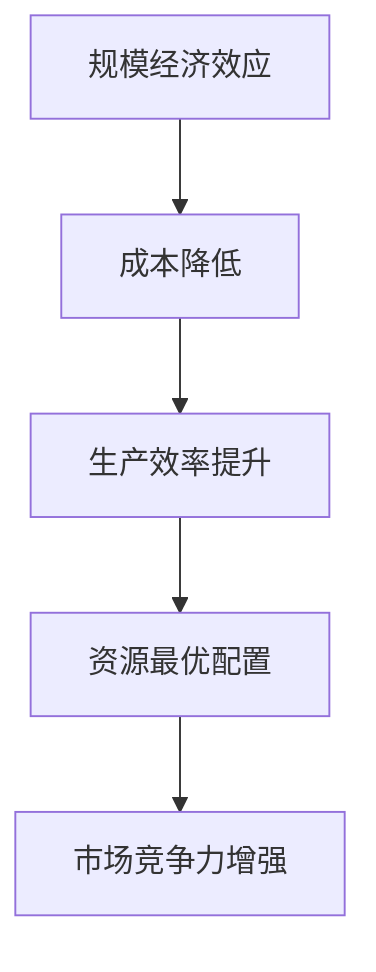
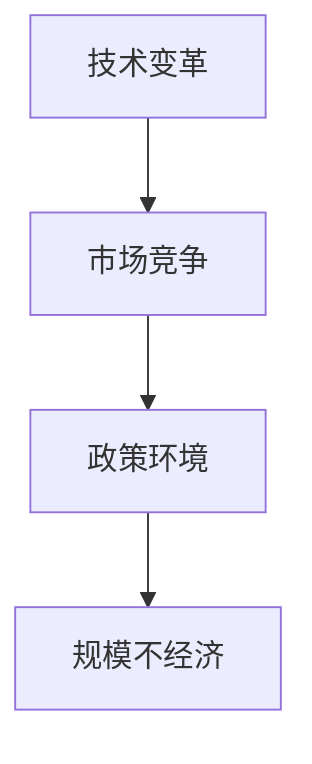

                 

# 规模经济效应的减弱现象

> 关键词：规模经济效应，减弱现象，驱动因素，机制分析，企业影响，应对策略，未来展望

> 摘要：本文从规模经济效应的基本概念和历史背景出发，分析了其理论基础和实际案例，随后深入探讨了规模经济效应减弱的驱动因素和机制，并研究了这种现象对企业的影响。最后，本文提出了应对规模经济效应减弱的策略，并对未来发展趋势进行了展望。

## 第一部分：规模经济效应的基本概念与历史背景

### 第1章：规模经济效应概述

#### 1.1 规模经济效应的定义

规模经济效应（Economic of Scale）是指在生产和运营过程中，随着产量的增加，单位产品的成本逐渐降低的现象。这是由于大规模生产可以分散固定成本，提高生产效率，实现资源的最优配置。

#### 1.2 规模经济效应的类型

规模经济效应可以分为以下几种类型：

1. **内部规模经济**：由于企业内部生产规模的扩大，导致单位成本降低。
2. **外部规模经济**：由于行业整体规模的扩大，导致单位成本降低。
3. **动态规模经济**：随着技术的进步和生产过程的改进，单位成本持续降低。

#### 1.3 规模经济效应的历史演变

规模经济效应的概念最早由经济学家阿尔弗雷德·马歇尔（Alfred Marshall）提出。20世纪以来，随着工业化和现代化进程的推进，规模经济效应在各个产业中得到了广泛应用和深入探讨。

### 第2章：规模经济效应的理论基础

#### 2.1 成本经济学基础

规模经济效应的成本经济学基础主要体现在以下两个方面：

1. **固定成本和可变成本的分散**：随着生产规模的扩大，固定成本（如厂房、设备等）可以更加有效地分散到每个单位产品上，从而降低单位产品的固定成本。
2. **规模效应带来的生产效率提升**：大规模生产可以采用更先进的技术和设备，提高生产效率，从而降低单位产品的成本。

#### 2.2 福利经济学原理

规模经济效应还可以从福利经济学的角度进行解释。规模经济效应导致生产成本的降低，可以使消费者受益，从而提高社会福利。

#### 2.3 规模经济效应的微观分析

规模经济效应的微观分析主要包括以下两个方面：

1. **企业的成本结构**：企业成本结构的变化会影响规模经济效应的实现。
2. **市场的竞争格局**：市场竞争的激烈程度也会影响规模经济效应的实现。

### 第3章：规模经济效应的实际案例

#### 3.1 传统产业中的规模经济效应

传统产业如制造业、建筑业等，由于生产过程的复杂性和固定成本的较高，规模经济效应得到了广泛应用。例如，汽车制造业的规模经济效应使得大规模生产的汽车成本远低于小规模生产的汽车。

#### 3.2 现代产业中的规模经济效应

随着信息技术的快速发展，现代产业如互联网产业、人工智能产业等，也开始出现规模经济效应。例如，云计算平台通过大规模数据中心提供计算和存储服务，从而降低用户的成本。

#### 3.3 规模经济效应的案例分析

以下是一些规模经济效应的典型案例：

1. **阿里巴巴**：阿里巴巴通过建立全球最大的电子商务平台，实现了规模经济效应，降低了商家和消费者的交易成本。
2. **特斯拉**：特斯拉通过大规模生产电动汽车，实现了成本的大幅降低，推动了电动汽车产业的发展。

## 第二部分：规模经济效应的减弱现象

### 第4章：规模经济效应减弱的驱动因素

#### 4.1 技术变革的影响

随着信息技术的快速发展，企业可以通过更高效的技术手段实现规模经济效应。例如，云计算、大数据等技术的应用，可以大大提高生产效率，降低单位成本。

#### 4.2 市场竞争加剧

随着市场的竞争加剧，企业为了保持竞争优势，不得不加大研发投入，提高生产效率，这也可能导致规模经济效应的减弱。

#### 4.3 政策环境的变化

政策环境的变化也会影响规模经济效应的实现。例如，税收政策、环保政策等，都可能对企业的生产成本产生重大影响。

### 第5章：规模经济效应减弱的机制分析

#### 5.1 成本结构变化

规模经济效应的减弱首先体现在成本结构的变化。随着生产规模的扩大，固定成本占比不断提高，而可变成本占比逐渐降低，这可能导致规模经济效应的减弱。

#### 5.2 产出与成本的非线性关系

产出与成本之间的关系并非简单的线性关系，而是存在一定的非线性特征。随着生产规模的扩大，单位成本可能先降低后上升，这可能是规模经济效应减弱的原因之一。

#### 5.3 规模不经济现象

在某些情况下，企业可能面临规模不经济现象，即生产规模的扩大导致单位成本的增加。这是规模经济效应减弱的一个重要表现。

### 第6章：规模经济效应减弱对企业的影响

#### 6.1 企业战略调整

规模经济效应的减弱要求企业进行战略调整，以适应新的市场环境。例如，企业可能需要转向更多元化的市场，或者加大研发投入，提高生产效率。

#### 6.2 企业竞争力分析

规模经济效应的减弱对企业竞争力产生了重大影响。企业需要通过提高生产效率，降低成本，或者通过创新，提高产品差异化程度，来保持竞争力。

#### 6.3 企业可持续发展策略

企业需要制定可持续发展策略，以应对规模经济效应的减弱。这包括提高生产效率，降低成本，加强创新能力，以及构建良好的企业文化和团队。

### 第7章：应对规模经济效应减弱的策略

#### 7.1 创新驱动发展

企业应加大研发投入，提高技术创新能力，以实现规模经济效应的替代。

#### 7.2 市场多元化

企业应开拓多元化的市场，以分散风险，降低对单一市场的依赖。

#### 7.3 政策建议与实施

政府应制定相关政策，鼓励企业进行技术创新，提高生产效率，降低成本。

### 第8章：未来发展趋势与展望

#### 8.1 规模经济效应的未来走向

未来，规模经济效应可能会向更高效、更灵活的方向发展。信息技术和人工智能等技术的应用，将进一步提高生产效率，降低成本。

#### 8.2 新兴产业的规模经济效应特点

新兴产业如互联网、人工智能等，具有显著的规模经济效应特点。这些产业的快速发展，将推动规模经济效应的进一步演变。

#### 8.3 规模经济效应的理论与实践前景

规模经济效应的理论与实践前景广阔。随着技术的进步和市场环境的变化，规模经济效应将不断演变，为企业创造更多价值。

## 附录

### 附录A：相关研究文献综述

#### A.1 国内研究综述

国内对规模经济效应的研究主要集中在规模经济效应的理论基础、实际案例分析和政策影响等方面。

#### A.2 国际研究综述

国际对规模经济效应的研究更加深入，涵盖了规模经济效应的微观机制、技术创新对规模经济效应的影响等方面。

### 附录B：数据与方法

#### B.1 数据来源与处理

本文所使用的数据主要来自公开的统计数据和企业财报。

#### B.2 研究方法与工具

本文采用定量分析和定性分析相结合的方法，使用 Mermaid 流程图、伪代码、数学模型等工具，对规模经济效应的减弱现象进行了深入分析。

### 附录C：Mermaid 流程图示例

#### C.1 规模经济效应的基本流程图



#### C.2 规模经济效应减弱的驱动因素流程图



### 附录D：核心算法原理与伪代码

#### D.1 规模经济效应的数学模型

```latex
C = a + bQ
```

其中，C为单位成本，Q为产量，a为固定成本，b为可变成本。

#### D.2 规模经济效应减弱的机制分析伪代码

```python
def analyze_scale_economy_decrease():
    # 分析成本结构变化
    cost_structure_change()
    
    # 分析产出与成本的非线性关系
    nonlinear_relationship()
    
    # 分析规模不经济现象
    size_inefficiency()

def cost_structure_change():
    # 固定成本占比提高
    fixed_cost_ratio_increase()

def nonlinear_relationship():
    # 单位成本先降低后上升
    cost_decrease_then_increase()

def size_inefficiency():
    # 规模不经济现象
    size_inefficiency Phenomenon()
```

### 附录E：项目实战案例与代码解读

#### E.1 实际案例介绍

本文将以某企业的成本分析项目为例，介绍规模经济效应的减弱现象。

#### E.2 开发环境搭建

开发环境包括 Python、Matplotlib、Numpy 等。

#### E.3 源代码实现与解读

```python
import matplotlib.pyplot as plt
import numpy as np

# 定义成本函数
def cost_function(Q):
    a = 100  # 固定成本
    b = 10   # 可变成本
    C = a + b*Q
    return C

# 生成产量序列
Q = np.linspace(0, 100, 1000)

# 计算成本序列
C = cost_function(Q)

# 绘制成本曲线
plt.plot(Q, C)
plt.xlabel('产量')
plt.ylabel('成本')
plt.title('规模经济效应的减弱现象')
plt.show()
```

#### E.4 代码解读与分析

1. **成本函数定义**：定义了成本函数，包括固定成本和可变成本。
2. **产量序列生成**：生成了产量序列，用于计算不同产量下的成本。
3. **成本曲线绘制**：绘制了成本曲线，展示了规模经济效应的减弱现象。

### 作者信息

作者：AI天才研究院/AI Genius Institute & 禅与计算机程序设计艺术 /Zen And The Art of Computer Programming

