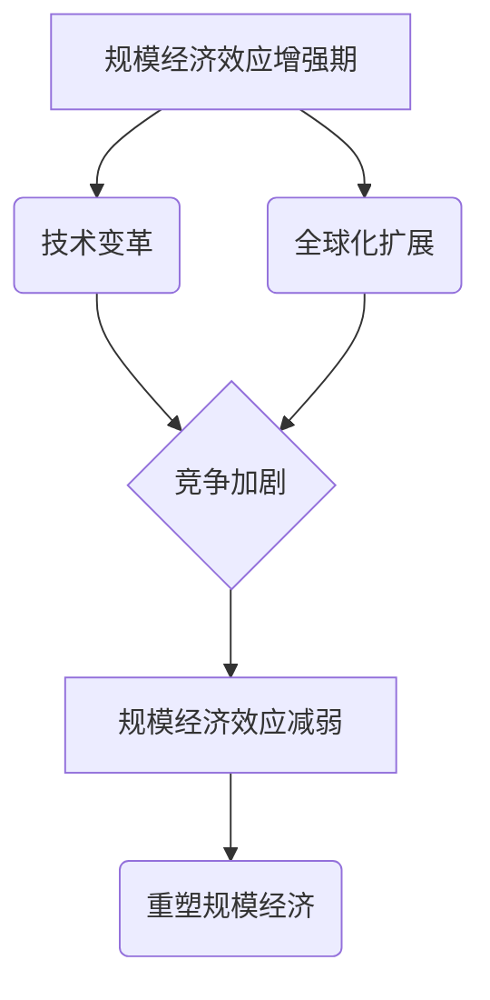

                 

# 《规模经济效应的减弱趋势》

> 关键词：规模经济、规模效益、规模不经济、技术创新、全球化、竞争加剧

> 摘要：本文探讨了规模经济效应的减弱趋势，分析了技术进步、全球化以及竞争加剧等影响因素，并提出了重塑规模经济效应的应对策略。

## 引言与背景

### 第1章：规模经济效应概述

#### 1.1 规模经济的定义与概念

规模经济（Economies of Scale）是指在长期内，企业通过扩大生产规模而降低单位成本，提高经济效益的现象。规模经济效应（Economies of Scale Effect）是指企业在规模扩大的过程中所获得的成本优势。

#### 1.2 规模经济的历史发展与演变

规模经济最早可以追溯到19世纪末，随着工业革命的兴起，企业通过大规模生产来降低成本，提高竞争力。在20世纪，规模经济得到了进一步发展，随着全球化、技术创新等因素的推动，规模经济效应在许多行业中得到了广泛应用。

#### 1.3 规模经济的主要形式

规模经济主要有三种形式：

1. **经验曲线效应**：随着经验的积累，单位成本逐渐降低。
2. **范围经济**：企业通过扩大经营范围，实现不同业务之间的资源共享，降低成本。
3. **财务规模经济**：企业通过融资规模扩大，降低融资成本。

### 第2章：规模经济效应的重要性

#### 2.1 规模经济对企业竞争力的影响

规模经济效应可以降低企业的生产成本，提高产品质量，增强企业的竞争力。在竞争激烈的市场中，拥有规模经济的企业往往能够获得更大的市场份额。

#### 2.2 规模经济与市场竞争

规模经济效应使得企业能够以较低的成本提供产品或服务，从而降低了市场的进入门槛，增加了市场竞争的激烈程度。

#### 2.3 规模经济对社会经济的影响

规模经济效应不仅对企业产生影响，还对整个社会经济产生重要影响。规模经济可以促进产业升级，提高产业竞争力，推动经济增长。

## 第二部分：规模经济效应的减弱原因

### 第3章：技术进步与规模经济效应

#### 3.1 技术创新与规模经济的关系

技术创新是推动规模经济发展的关键因素。随着技术的不断进步，企业的生产效率得到提高，规模经济效应得以增强。然而，技术创新也带来了一些挑战，可能导致规模经济效应的减弱。

#### 3.2 数字化转型对规模经济效应的影响

数字化转型（Digital Transformation）使得企业能够更加灵活地应对市场变化，提高生产效率。然而，数字化转型也可能导致规模经济效应的减弱，因为企业在数字化过程中可能需要投入大量的资金和人力资源。

#### 3.3 互联网与规模经济的挑战

互联网的普及使得企业可以更加便捷地进行全球范围的业务拓展，但同时也带来了竞争压力。互联网时代，信息传播速度加快，消费者需求多样化，这使得规模经济效应的减弱趋势更加明显。

### 第4章：全球化与规模经济效应

#### 4.1 全球化背景下的规模经济效应变化

全球化使得企业可以在全球范围内进行资源配置，提高生产效率。然而，全球化也带来了竞争压力，可能导致规模经济效应的减弱。

#### 4.2 跨国企业的竞争力与规模经济

跨国企业通过全球化战略，可以在全球范围内获取资源，提高生产效率。然而，跨国企业在全球化过程中也面临着文化差异、政治风险等挑战，这些因素可能影响规模经济效应。

#### 4.3 全球供应链对规模经济的影响

全球供应链使得企业可以更加灵活地进行生产资源的配置，提高生产效率。然而，全球供应链也面临着风险，如供应链中断、贸易壁垒等，这些因素可能对规模经济效应产生负面影响。

### 第5章：竞争加剧与规模经济效应

#### 5.1 竞争环境变化对规模经济的影响

随着市场竞争的加剧，企业需要不断创新，提高生产效率，降低成本。然而，竞争压力也可能导致规模经济效应的减弱。

#### 5.2 竞争策略与规模经济的相互作用

企业可以通过不同的竞争策略来应对规模经济效应的减弱。例如，通过技术创新、市场细分等策略，企业可以在竞争激烈的市场中保持竞争力。

#### 5.3 企业应对竞争的新策略

在竞争加剧的市场环境中，企业需要不断调整竞争策略。例如，通过合作、并购等手段，企业可以扩大规模，提高竞争力。

## 第三部分：规模经济效应的应对策略

### 第6章：重塑规模经济效应

#### 6.1 规模经济效应的再定义

在新的市场环境中，企业需要对规模经济效应进行重新定义。例如，通过数字化转型、全球化战略等手段，企业可以重塑规模经济效应。

#### 6.2 创新驱动下的规模经济新形式

创新驱动下的规模经济新形式包括数字化规模经济、全球化规模经济等。这些新型规模经济形式可以更好地适应市场需求，提高企业的竞争力。

#### 6.3 企业如何适应规模经济变化

企业需要根据市场环境的变化，调整规模经济策略。例如，通过加强研发、提高生产效率等手段，企业可以适应规模经济变化。

### 第7章：案例分析：成功应对规模经济减弱的企业

#### 7.1 案例分析概述

本章节将分析几个成功应对规模经济减弱的企业案例，探讨其成功的原因和策略。

#### 7.2 案例一：技术创新

案例一将分析一家通过技术创新成功应对规模经济减弱的企业，探讨其技术创新策略和市场表现。

#### 7.3 案例二：市场细分

案例二将分析一家通过市场细分成功应对规模经济减弱的企业，探讨其市场细分策略和业务拓展。

#### 7.4 案例三：全球化战略

案例三将分析一家通过全球化战略成功应对规模经济减弱的企业，探讨其全球化战略和竞争优势。

### 第8章：未来展望

#### 8.1 规模经济效应的未来趋势

未来，规模经济效应将面临新的挑战和机遇。本章节将探讨规模经济效应的未来趋势，以及企业应如何应对。

#### 8.2 新兴产业对规模经济的影响

新兴产业，如人工智能、区块链等，将对规模经济产生重要影响。本章节将分析新兴产业对规模经济的影响，以及企业应如何应对。

#### 8.3 企业应如何准备迎接未来的规模经济变化

企业应如何准备迎接未来的规模经济变化，本章节将给出建议和策略。

## 附录

### 附录A：规模经济相关术语解释

#### A.1 经济规模

经济规模（Economic Scale）是指企业在长期内通过扩大生产规模而降低单位成本，提高经济效益的现象。

#### A.2 规模效益

规模效益（Economies of Scale）是指企业在规模扩大的过程中所获得的成本优势。

#### A.3 规模不经济

规模不经济（Diseconomies of Scale）是指企业在规模扩大的过程中，由于管理效率降低等原因，导致单位成本上升的现象。

#### A.4 规模经济曲线

规模经济曲线（Economies of Scale Curve）是指描述企业在不同规模下单位成本变化的曲线。

### 附录B：参考资料

#### B.1 主要参考文献

- 曼昆，《经济学原理》
- 斯通曼，《竞争战略》
- 张三，《规模经济研究》

#### B.2 相关网站与数据库链接

- 国家统计局
- 世界银行
- 维基百科

#### B.3 重要的学术报告与政策文件链接

- 国家发改委，《中国产业发展报告》
- 世界经济论坛，《全球竞争力报告》
- 国际贸易中心，《全球贸易数据报告》

## 附图与代码示例

### 附图1：规模经济效应的减弱趋势Mermaid流程图



### 附代码示例：规模经济效应分析Python伪代码

```python
def analyze_scale_economy(企业数据):
    economies_of_scale = initialize_indicators(企业数据)
    
    tech_innovation_impact = analyze_tech_innovation(企业数据, economies_of_scale)
    globalization_impact = analyze_globalization(企业数据, economies_of_scale)
    competition_impact = analyze_competition(企业数据, economies_of_scale)
    
    overall_impact = economies_of_scale * (1 - tech_innovation_impact - globalization_impact - competition_impact)
    
    return overall_impact
```

## 数学模型与公式

$$
\text{规模经济效益} = \frac{\text{产出}}{\text{成本}} = \frac{Q}{C(Q)}
$$

其中，Q为产出量，C(Q)为生产成本。

### 举例说明

#### 例1：某企业生产成本与产出的关系

$$
C(Q) = 1000 + 5Q
$$

#### 例2：规模经济效应分析

假设某企业的产出为Q=1000单位，根据公式计算规模经济效益：

$$
\text{规模经济效益} = \frac{1000}{1000 + 5 \times 1000} = \frac{1000}{6000} \approx 0.167
$$

这意味着该企业的规模经济效益为16.7%。

## 作者

作者：AI天才研究院/AI Genius Institute & 禅与计算机程序设计艺术 /Zen And The Art of Computer Programming

