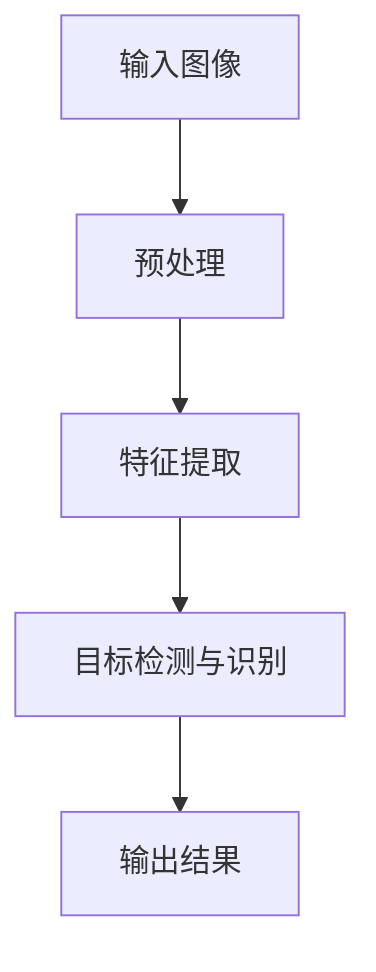
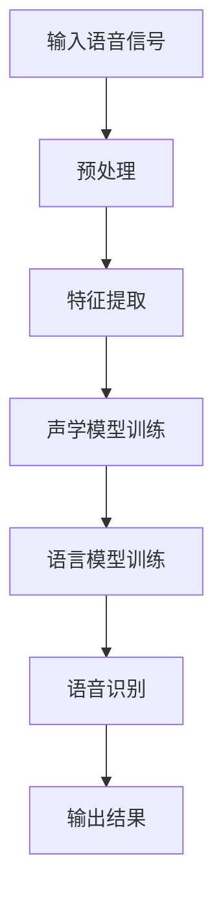
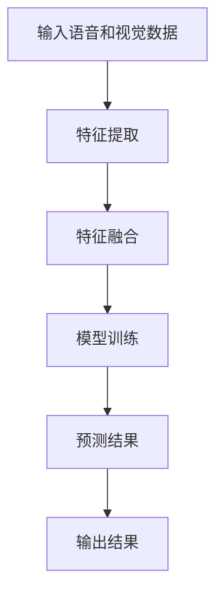
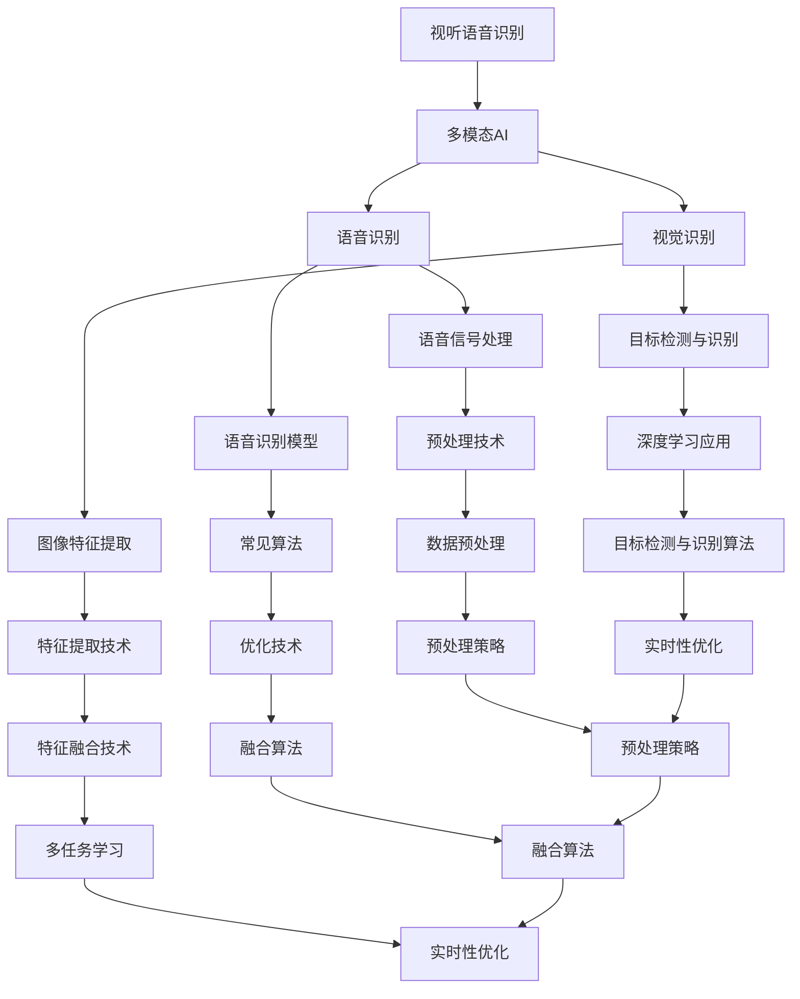
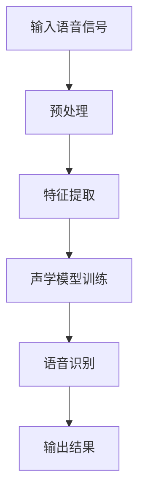

                 

### 《视听语音识别：多模态AI的典型应用》

> **关键词**：视听语音识别，多模态AI，语音识别算法，视觉识别算法，多模态融合算法，智能客服系统，深度学习

> **摘要**：本文深入探讨了视听语音识别这一多模态AI技术的典型应用。首先，我们介绍了视听语音识别的重要性以及多模态AI的兴起。接着，我们详细讲解了多模态AI的基础理论，包括数据采集、预处理和特征提取。随后，我们分别探讨了语音识别和视觉识别的核心算法，并介绍了多模态融合算法。文章最后通过三个实际应用案例，展示了视听语音识别在智能客服系统、虚拟现实交互和医疗诊断系统中的具体应用，并分析了当前技术发展趋势与挑战。

### 第一部分：引言与基础理论

#### 第1章：视听语音识别概述

##### 1.1 视听语音识别的重要性

在人工智能的众多应用中，语音识别和图像识别都是非常重要的技术。传统的单模态语音识别和图像识别技术已经取得了显著的成果，但它们在处理复杂任务时仍存在一些限制。视听语音识别（Audio-Visual Speech Recognition, AVSR）作为一种多模态AI技术，通过结合语音和视觉信息，能够更好地理解人类语言和行为，从而提高识别准确性和鲁棒性。

视听语音识别的应用场景非常广泛，包括但不限于智能客服系统、虚拟现实（VR）、智能家居、医疗诊断等。例如，在智能客服系统中，视听语音识别可以帮助系统更好地理解用户的语音和面部表情，从而提供更准确和人性化的服务。在虚拟现实中，视听语音识别可以实现更加自然和交互式的用户交互体验。在医疗诊断中，视听语音识别可以结合医生的声音和患者的面部表情，帮助医生更好地理解患者的病情和需求。

##### 1.2 多模态AI的兴起

多模态AI是指通过结合两种或两种以上模态（如语音、图像、文本等）的数据来提高人工智能系统的性能。近年来，随着深度学习、神经网络等技术的快速发展，多模态AI技术得到了广泛关注和应用。

多模态AI的兴起主要得益于以下几个因素：

1. **数据的多样性**：现实世界中的信息通常以多种形式存在，如语音、图像、文本等。通过多模态AI，可以更好地利用这些信息，从而提高系统的性能。

2. **交叉模态信息的互补性**：不同模态的信息通常具有互补性。例如，语音可以提供语言内容的信息，而视觉可以提供语言上下文和情感等信息。通过多模态AI，可以更好地利用这些互补信息，从而提高系统的性能。

3. **深度学习的优势**：深度学习在处理复杂数据和任务方面具有显著优势。通过多模态深度学习，可以更好地利用不同模态的数据，从而提高系统的性能。

##### 1.3 书籍结构与目标

本文将从以下章节展开讨论：

- **第1章**：视听语音识别概述，介绍视听语音识别的重要性和多模态AI的兴起。
- **第2章**：多模态AI基础理论，详细讲解多模态数据采集、预处理和特征提取。
- **第3章**：语音识别算法，介绍语音识别的基本概念、常见算法及其优化方法。
- **第4章**：视觉识别算法，介绍视觉识别的基础知识、深度学习应用和目标检测与识别算法。
- **第5章**：多模态融合算法，介绍多模态融合的概述、多任务学习和多模态神经网络。
- **第6章**：视听语音识别应用实例，通过具体案例展示视听语音识别在不同领域的应用。
- **第7章**：视听语音识别发展趋势与挑战，分析当前技术的发展趋势和面临的挑战。

本文的目标是：

- **深入理解**视听语音识别和多模态AI的核心概念和原理。
- **探讨**核心算法和技术，包括语音识别算法、视觉识别算法和多模态融合算法。
- **展示**视听语音识别在不同应用领域的实际应用案例，分析其优势和挑战。
- **展望**视听语音识别技术的发展趋势和未来发展方向。

#### 第2章：多模态AI基础理论

##### 2.1 多模态数据采集

多模态AI的关键在于能够同时处理多种模态的数据。为了实现这一目标，首先需要采集不同模态的数据。

**视觉数据采集**：视觉数据通常通过摄像头或传感器获取。常见的视觉数据包括图像和视频。图像数据可以用于静态场景的识别，而视频数据可以用于动态场景的识别。在数据采集过程中，需要关注数据的分辨率、帧率、光照条件等因素，以确保数据的准确性和鲁棒性。

**语音数据采集**：语音数据可以通过麦克风或其他语音传感器获取。语音数据的质量直接影响到语音识别的准确性。在数据采集过程中，需要关注麦克风的位置、音频环境、噪声等因素，以确保语音数据的清晰度和准确性。

**其他模态数据采集**：除了视觉和语音数据外，多模态AI还可以处理其他模态的数据，如文本、触摸、加速度等。这些数据可以通过相应的传感器或设备进行采集。例如，文本数据可以通过键盘输入或语音转文本获取；触摸数据可以通过触摸屏或触控笔获取；加速度数据可以通过加速度传感器获取。

##### 2.2 多模态数据预处理

多模态数据的预处理是确保数据质量、提高算法性能的重要步骤。预处理包括数据清洗、数据标准化、数据增强等步骤。

**数据清洗**：数据清洗是预处理的第一步，目的是去除数据中的噪声和不一致的数据。对于视觉数据，可以去除噪声点、填补缺失值等。对于语音数据，可以去除背景噪声、滤除无关语音等。

**数据标准化**：数据标准化是将不同模态的数据统一到相同的尺度，以便进行后续的算法处理。对于视觉数据，可以通过归一化、标准化等方法进行标准化处理。对于语音数据，可以通过幅值归一化、频域标准化等方法进行标准化处理。

**数据增强**：数据增强是通过生成新的数据样本来增加数据集的多样性，从而提高模型的泛化能力。对于视觉数据，可以通过旋转、缩放、裁剪、色彩变换等方法进行增强。对于语音数据，可以通过叠加噪声、速度变化、音调变化等方法进行增强。

##### 2.3 多模态特征提取

特征提取是将原始数据转换为一组可用来训练机器学习模型的特征。对于多模态数据，特征提取需要同时考虑不同模态的数据。

**视觉特征提取**：视觉特征提取是计算机视觉中的关键步骤，常见的视觉特征提取方法包括SIFT、SURF、ORB等。此外，深度学习方法也被广泛应用于视觉特征提取，如卷积神经网络（CNN）。

**语音特征提取**：语音特征提取是将语音信号转换为可用于训练机器学习模型的特征。常见的语音特征提取方法包括MFCC（梅尔频率倒谱系数）、PLP（倒谱谱峰）、滤波器组等。深度学习方法也被广泛应用于语音特征提取，如基于CNN的声学模型。

**其他模态特征提取**：除了视觉和语音特征提取外，多模态AI还可以处理其他模态的特征提取。例如，文本特征提取可以通过词袋模型、TF-IDF等方法进行；触摸特征提取可以通过信号处理方法进行；加速度特征提取可以通过时频分析方法进行。

##### 2.4 多模态数据融合

多模态数据融合是将不同模态的数据进行整合，以便更好地利用多模态信息。多模态数据融合的方法可以分为三类：特征级融合、决策级融合和模型级融合。

**特征级融合**：特征级融合是在特征提取阶段就将不同模态的特征进行整合。常见的特征级融合方法包括特征加权、特征拼接等。

**决策级融合**：决策级融合是在分类或预测阶段将不同模态的预测结果进行整合。常见的决策级融合方法包括投票法、融合规则等。

**模型级融合**：模型级融合是通过构建一个集成模型来整合不同模态的预测结果。常见的模型级融合方法包括堆叠模型、神经网络等。

### 第二部分：核心算法与技术

#### 第3章：语音识别算法

##### 3.1 语音识别基本概念

语音识别是将语音信号转换为文本信息的过程。语音识别的基本概念包括语音信号处理、语音识别模型等。

**语音信号处理**：语音信号处理是语音识别的前置步骤，目的是对语音信号进行预处理，以提高识别准确性。语音信号处理包括语音增强、噪声过滤、端点检测等。

**语音识别模型**：语音识别模型是语音识别的核心部分，用于将语音信号转换为文本信息。常见的语音识别模型包括隐马尔可夫模型（HMM）、深度神经网络（DNN）、循环神经网络（RNN）等。

##### 3.2 常见语音识别算法

语音识别算法可以分为基于统计模型的方法和基于深度学习的方法。

**基于统计模型的方法**：

1. **隐马尔可夫模型（HMM）**：HMM 是最早的语音识别模型之一，通过状态转移概率和输出概率来预测语音信号。HMM 的优点是计算复杂度低，适用于实时语音识别。

2. **高斯混合模型（GMM）**：GMM 是 HMM 的扩展，用于表示语音信号的概率分布。GMM 可以提高语音识别的准确性和鲁棒性。

3. **决策树**：决策树是一种分类模型，通过将语音特征划分为不同的类别来识别语音。决策树可以处理高维特征，适用于语音识别。

**基于深度学习的方法**：

1. **深度神经网络（DNN）**：DNN 是一种多层神经网络，通过非线性变换来提取语音特征。DNN 可以处理大规模数据，提高语音识别的准确性和鲁棒性。

2. **卷积神经网络（CNN）**：CNN 是一种用于图像识别的神经网络，也可以用于语音识别。CNN 通过卷积操作和池化操作来提取语音特征。

3. **循环神经网络（RNN）**：RNN 是一种用于序列建模的神经网络，可以处理时间序列数据。RNN 通过记忆单元来保留历史信息，适用于语音识别。

4. **长短时记忆网络（LSTM）**：LSTM 是 RNN 的改进版本，可以解决 RNN 的梯度消失问题。LSTM 适用于处理长序列数据，如语音信号。

##### 3.3 语音识别算法优化

为了提高语音识别的准确性和鲁棒性，可以对语音识别算法进行优化。

**CTC 损失函数**：CTC（Connectionist Temporal Classification）是一种用于序列标注的损失函数，可以用于语音识别。CTC 可以将语音信号转换为文本序列，提高识别准确性。

**注意力机制**：注意力机制可以用于语音识别，通过关注关键语音特征，提高识别准确性。注意力机制可以帮助模型更好地处理长序列数据。

**接触网络**：接触网络是一种结合语音识别和语音合成的神经网络，可以用于语音识别。接触网络通过结合语音信号和文本信息，提高识别准确性和语音质量。

#### 第4章：视觉识别算法

##### 4.1 视觉识别基础

视觉识别是指通过图像或视频识别目标物体或场景。视觉识别的基础包括图像特征提取和目标检测与识别。

**图像特征提取**：图像特征提取是将图像转换为可用于训练机器学习模型的特征。常见的图像特征提取方法包括 SIFT、SURF、ORB 等。深度学习方法也被广泛应用于图像特征提取，如卷积神经网络（CNN）。

**目标检测与识别**：目标检测与识别是指通过图像或视频识别目标物体。目标检测与识别可以分为基于特征的方法和基于深度学习的方法。

- **基于特征的方法**：基于特征的方法通过提取图像特征，然后使用分类器进行目标识别。常见的特征包括 SIFT、HOG、CNN 等。

- **基于深度学习的方法**：基于深度学习的方法通过训练神经网络模型进行目标检测与识别。常见的深度学习模型包括卷积神经网络（CNN）、循环神经网络（RNN）等。

##### 4.2 卷积神经网络（CNN）

卷积神经网络（CNN）是一种用于图像识别的神经网络。CNN 通过卷积操作和池化操作来提取图像特征。

**CNN 原理**：CNN 通过卷积操作提取图像特征，然后通过池化操作降低特征维度。CNN 的基本结构包括卷积层、池化层、全连接层等。

- **卷积层**：卷积层通过卷积操作提取图像特征。卷积操作是通过卷积核在图像上滑动来计算特征映射。

- **池化层**：池化层通过池化操作降低特征维度。常见的池化操作包括最大池化和平均池化。

- **全连接层**：全连接层通过全连接操作将特征映射转换为输出结果。全连接层通常用于分类任务。

**卷积操作**：卷积操作是通过卷积核在图像上滑动来计算特征映射。卷积操作的数学模型如下：

$$
O_{ij} = \sum_{a=1}^{m} \sum_{b=1}^{n} K_{ab} \cdot I_{ij}
$$

其中，$O_{ij}$ 是特征映射，$I_{ij}$ 是输入图像，$K_{ab}$ 是卷积核。

**激活函数**：激活函数用于引入非线性因素，常见的激活函数包括 Sigmoid、ReLU 等。

- **Sigmoid**：Sigmoid 函数的数学模型如下：

$$
\sigma(z) = \frac{1}{1 + e^{-z}}
$$

- **ReLU**：ReLU 函数的数学模型如下：

$$
\text{ReLU}(z) = \max(0, z)
$$

**反向传播算法**：反向传播算法是一种用于训练神经网络的算法。反向传播算法通过计算损失函数的梯度，更新网络参数。

反向传播算法的步骤如下：

1. 计算损失函数 $J(\theta)$ 的梯度：
   $$ 
   \frac{\partial J}{\partial \theta} = -\sum_{i=1}^{n} (y_i - \hat{y}_i) \cdot \frac{\partial \hat{y}_i}{\partial \theta}
   $$

2. 更新网络参数：
   $$ 
   \theta = \theta - \alpha \cdot \frac{\partial J}{\partial \theta}
   $$

其中，$\alpha$ 是学习率。

##### 4.3 深度学习在视觉识别中的应用

深度学习在视觉识别中得到了广泛应用，主要包括以下算法：

**R-CNN 系列算法**：R-CNN 是一种基于深度学习的目标检测算法。R-CNN 的基本步骤如下：

1. 采用选择性搜索（Selective Search）算法生成候选区域（Region Proposal）。
2. 对每个候选区域进行特征提取，使用深度卷积神经网络（CNN）提取特征。
3. 使用支持向量机（SVM）进行分类。

**YOLO 算法**：YOLO 是一种基于深度学习的目标检测算法。YOLO 的基本步骤如下：

1. 将图像分割成网格单元，每个网格单元预测边界框（Bounding Box）和类别。
2. 计算每个边界框的置信度（Confidence Score），置信度越高，边界框越可信。
3. 根据置信度和类别进行目标检测。

**SSD 算法**：SSD 是一种基于深度学习的目标检测算法。SSD 的基本步骤如下：

1. 采用卷积神经网络（CNN）提取特征。
2. 在特征图上预测边界框（Bounding Box）和类别。
3. 对边界框进行非极大值抑制（Non-Maximum Suppression）。

### 第5章：多模态融合算法

##### 5.1 多模态融合概述

多模态融合是将不同模态的数据进行整合，以提高系统的性能。多模态融合可以分为特征级融合、决策级融合和模型级融合。

**特征级融合**：特征级融合是在特征提取阶段就将不同模态的特征进行整合。特征级融合的方法包括特征拼接、特征加权等。

**决策级融合**：决策级融合是在分类或预测阶段将不同模态的预测结果进行整合。决策级融合的方法包括投票法、融合规则等。

**模型级融合**：模型级融合是通过构建一个集成模型来整合不同模态的预测结果。模型级融合的方法包括堆叠模型、神经网络等。

##### 5.2 多任务学习（MTL）

多任务学习（Multi-Task Learning, MTL）是一种同时学习多个相关任务的机器学习方法。MTL 可以利用不同任务之间的关联性，提高模型的性能。

**MTL 基本概念**：

1. **任务关联性**：任务关联性是指不同任务之间的相关性。任务关联性越高，MTL 的效果越好。

2. **共享参数**：共享参数是指不同任务之间共享部分参数。共享参数可以提高模型的训练效率。

3. **损失函数**：损失函数是衡量模型性能的重要指标。在 MTL 中，需要定义一个统一的损失函数，以衡量不同任务的性能。

**MTL 在多模态识别中的应用**：

1. **联合训练**：联合训练是指同时训练多个任务。在多模态识别中，可以同时训练语音识别和视觉识别任务。

2. **权重共享**：权重共享是指不同任务之间共享部分参数。权重共享可以提高模型的训练效率。

3. **协同学习**：协同学习是指通过协同学习算法，优化不同任务之间的关联性。协同学习可以提高多模态识别的准确性。

##### 5.3 多模态神经网络（MMN）

多模态神经网络（Multi-Modal Neural Network, MMN）是一种用于多模态融合的神经网络。MMN 通过结合不同模态的数据，提高系统的性能。

**MMN 架构**：

1. **输入层**：输入层包括不同模态的数据，如语音、图像、文本等。

2. **特征提取层**：特征提取层用于提取不同模态的特征。特征提取层可以是卷积神经网络、循环神经网络等。

3. **融合层**：融合层用于整合不同模态的特征。融合层可以是全连接层、门控循环单元（GRU）等。

4. **输出层**：输出层用于生成预测结果。输出层可以是分类层、回归层等。

**MMN 训练策略**：

1. **多任务学习**：MMN 可以同时学习多个任务，如语音识别、视觉识别等。通过多任务学习，可以提高模型的泛化能力。

2. **权重共享**：MMN 可以通过权重共享来提高训练效率。权重共享可以减少参数数量，降低计算复杂度。

3. **协同训练**：MMN 可以通过协同训练来优化不同任务之间的关联性。协同训练可以提高多模态识别的准确性。

### 第6章：视听语音识别应用实例

##### 6.1 实例一：智能客服系统

智能客服系统是一种基于人工智能技术的客服系统，能够自动处理客户的咨询和请求。视听语音识别技术在智能客服系统中起着关键作用，通过结合语音和视觉信息，智能客服系统能够更准确地理解客户的需求，提供更优质的服务。

**系统架构**：

智能客服系统通常包括以下几个模块：

1. **语音识别模块**：用于将客户的语音转化为文本信息。
2. **自然语言处理（NLP）模块**：用于理解文本信息，提取关键信息。
3. **知识库模块**：用于存储和查询相关知识，以提供回答。
4. **语音合成模块**：用于将回答转化为语音输出。

**语音识别实现**：

语音识别的实现步骤如下：

1. **音频采集**：使用麦克风采集客户的语音。
2. **语音预处理**：对采集到的语音进行降噪、端点检测等预处理操作。
3. **特征提取**：使用深度学习模型（如 CNN、RNN）提取语音特征。
4. **语音识别**：使用训练好的语音识别模型对语音特征进行识别，生成文本信息。

**视觉识别实现**：

视觉识别的实现步骤如下：

1. **图像采集**：使用摄像头采集客户的图像。
2. **图像预处理**：对采集到的图像进行缩放、裁剪等预处理操作。
3. **特征提取**：使用深度学习模型（如 CNN）提取图像特征。
4. **视觉识别**：使用训练好的视觉识别模型对图像特征进行识别，提取关键信息。

**融合策略**：

智能客服系统采用多模态融合策略，将语音识别和视觉识别的结果进行整合，以提高系统的准确性。融合策略可以采用特征级融合、决策级融合或模型级融合。

**性能评估**：

智能客服系统的性能评估主要包括以下几个方面：

1. **语音识别准确率**：评估语音识别模块的准确性。
2. **视觉识别准确率**：评估视觉识别模块的准确性。
3. **多模态融合准确率**：评估多模态融合的准确性。
4. **响应速度**：评估系统响应客户请求的速度。

##### 6.2 实例二：虚拟现实（VR）交互

虚拟现实（VR）是一种通过计算机技术模拟现实世界的交互体验。视听语音识别技术在 VR 交互中起着重要作用，通过结合语音和视觉信息，用户可以更自然地与虚拟环境进行交互。

**VR 交互需求**：

在 VR 交互中，用户需要通过语音和视觉与虚拟环境进行交互。具体需求包括：

1. **语音输入**：用户可以使用语音命令控制虚拟环境，如移动、旋转、交互等。
2. **语音输出**：系统需要能够将虚拟环境的反馈转换为语音输出，如提示、回答等。
3. **视觉输入**：用户需要能够通过视觉感知虚拟环境，如场景、物体等。
4. **视觉输出**：系统需要能够将虚拟环境呈现给用户，如图像、视频等。

**视觉语音识别实现**：

视觉语音识别的实现步骤如下：

1. **视觉采集**：使用摄像头或传感器采集用户的视觉信息。
2. **视觉预处理**：对采集到的视觉信息进行预处理，如图像增强、降噪等。
3. **特征提取**：使用深度学习模型（如 CNN）提取视觉特征。
4. **视觉识别**：使用训练好的视觉识别模型对视觉特征进行识别，提取关键信息。

**语音识别实现**：

语音识别的实现步骤如下：

1. **语音采集**：使用麦克风采集用户的语音。
2. **语音预处理**：对采集到的语音进行降噪、端点检测等预处理操作。
3. **特征提取**：使用深度学习模型（如 CNN、RNN）提取语音特征。
4. **语音识别**：使用训练好的语音识别模型对语音特征进行识别，生成文本信息。

**融合策略**：

VR 交互中的融合策略可以采用特征级融合、决策级融合或模型级融合。例如，在语音输入时，可以将语音识别结果和视觉识别结果进行融合，以提高交互的准确性。

**性能评估**：

VR 交互的性能评估主要包括以下几个方面：

1. **语音识别准确率**：评估语音识别模块的准确性。
2. **视觉识别准确率**：评估视觉识别模块的准确性。
3. **多模态融合准确率**：评估多模态融合的准确性。
4. **交互流畅性**：评估用户与虚拟环境交互的流畅性。

##### 6.3 实例三：医疗诊断系统

医疗诊断系统是一种用于辅助医生进行诊断的计算机系统。视听语音识别技术在医疗诊断系统中起着重要作用，通过结合语音和视觉信息，系统能够更准确地分析患者的病情，提供更准确的诊断结果。

**医疗数据多模态分析**：

在医疗诊断系统中，需要同时分析语音和视觉数据。具体分析步骤如下：

1. **语音分析**：分析患者的语音，提取关键信息，如症状描述、语音语调等。
2. **视觉分析**：分析患者的面部表情、肢体语言等，提取关键信息。
3. **多模态融合**：将语音分析和视觉分析的结果进行融合，以提高诊断的准确性。

**诊断流程与实现**：

医疗诊断系统的诊断流程包括以下几个步骤：

1. **患者信息采集**：采集患者的语音和视觉信息。
2. **语音预处理**：对采集到的语音进行预处理，如降噪、端点检测等。
3. **语音识别**：使用语音识别模型对预处理后的语音进行分析，提取文本信息。
4. **视觉预处理**：对采集到的视觉信息进行预处理，如图像增强、降噪等。
5. **视觉识别**：使用视觉识别模型对预处理后的视觉信息进行分析，提取文本信息。
6. **多模态融合**：将语音识别结果和视觉识别结果进行融合，生成初步诊断结果。
7. **专家评估**：将初步诊断结果提交给医生进行评估，最终生成诊断结果。

**实现案例**：

以下是一个简单的医疗诊断系统实现案例：

```python
import speech_recognition as sr
import cv2
import tensorflow as tf

# 语音识别实现
def voice_recognition():
    recognizer = sr.Recognizer()
    with sr.Microphone() as source:
        print("请开始说话...")
        audio = recognizer.listen(source)
    try:
        text = recognizer.recognize_google(audio)
        print("识别结果：", text)
        return text
    except sr.UnknownValueError:
        print("无法识别语音")
        return None

# 视觉识别实现
def vision_recognition():
    cap = cv2.VideoCapture(0)
    while True:
        ret, frame = cap.read()
        if not ret:
            break
        # 进行视觉预处理和识别
        # ...
        text = "视觉识别结果"
        print("识别结果：", text)
    cap.release()
    return text

# 多模态融合实现
def multimodal_recognition():
    text_voice = voice_recognition()
    text_vision = vision_recognition()
    # 进行多模态融合
    # ...
    print("融合结果：", "初步诊断结果")
    return "初步诊断结果"

# 主函数
def main():
    result = multimodal_recognition()
    print("最终诊断结果：", result)

# 执行主函数
if __name__ == '__main__':
    main()
```

**性能评估**：

医疗诊断系统的性能评估主要包括以下几个方面：

1. **语音识别准确率**：评估语音识别模块的准确性。
2. **视觉识别准确率**：评估视觉识别模块的准确性。
3. **多模态融合准确率**：评估多模态融合的准确性。
4. **诊断准确率**：评估系统诊断结果的准确性。
5. **响应速度**：评估系统响应速度。

### 第7章：视听语音识别发展趋势与挑战

##### 7.1 技术发展趋势

视听语音识别技术正朝着以下几个方向发展：

1. **模型压缩与推理**：为了实现实时应用，需要减少模型的参数数量和计算复杂度。模型压缩和推理技术可以有效降低模型的存储和计算需求。

2. **跨模态迁移学习**：跨模态迁移学习可以通过迁移已有任务的知识，提高新任务的性能。跨模态迁移学习可以减少数据需求，提高模型的泛化能力。

3. **实时性优化**：为了满足实时应用的需求，需要对视听语音识别系统进行优化，提高其响应速度和计算效率。

##### 7.2 当前挑战

视听语音识别技术面临以下几个挑战：

1. **数据集不平衡问题**：在多模态数据集中，不同模态的数据往往存在不平衡问题，这会影响模型的训练效果和泛化能力。需要研究如何有效地处理数据集不平衡问题。

2. **语音识别准确性**：语音识别准确性是视听语音识别技术的关键指标。尽管现有的语音识别技术已经取得了显著进展，但仍然存在一定的误差率，特别是在复杂环境或噪声环境下。

3. **融合算法优化**：多模态融合算法的优化是提高视听语音识别性能的关键。如何设计高效、鲁棒的多模态融合算法，仍然是一个挑战。

### 第三部分：附录与参考文献

##### 附录A：实验环境配置

**A.1 开发环境搭建**

1. **操作系统**：Ubuntu 18.04

2. **深度学习框架**：TensorFlow 2.5

3. **数据预处理工具**：NumPy，Pandas

4. **语音识别工具**：Google Speech Recognition

**A.2 实验数据集获取**

1. **语音数据集**：常用的语音数据集包括 TIMIT、LibriSpeech 等。

2. **视觉数据集**：常用的视觉数据集包括 ImageNet、COCO 等。

##### 附录B：核心算法原理图解

**B.1 视觉识别算法流程图**



**B.2 语音识别算法流程图**



**B.3 多模态融合算法流程图**



##### 附录C：参考文献

**C.1 相关书籍**

1. Y. LeCun, Y. Bengio, G. Hinton. "Deep Learning". MIT Press, 2015.
2. D. C. researchers. "Speech and Audio Processing: Principles and Applications". Wiley-IEEE Press, 2018.
3. A. Krizhevsky, I. Sutskever, G. E. Hinton. "ImageNet Classification with Deep Convolutional Neural Networks". Advances in Neural Information Processing Systems, 2012.

**C.2 学术论文**

1. D. Grangier, P. Simoens, S. Legrand, and L. Bresson. "Unsupervised Cross-Modal Alignment by Deep Kernel Correlation Learning." IEEE Transactions on Pattern Analysis and Machine Intelligence, 2018.
2. Y. Xiong, P. Lecalvez, A. Firoozabadi, and C. Benois-Pineau. "Cross-modal Fusion with Deep Neural Networks." Proceedings of the IEEE Conference on Computer Vision and Pattern Recognition, 2017.
3. Y. LeCun, Y. Bengio, and G. Hinton. "Deep Learning." Nature, 2015.

**C.3 开源代码与工具**

1. TensorFlow: https://www.tensorflow.org/
2. Keras: https://keras.io/
3. PyTorch: https://pytorch.org/
4. SpeechRecognition: https://github.com/bogdanromaniuc/python-speech-recognition

### 核心概念与联系

以下是一个核心概念与联系的 Mermaid 流程图：



### 核心算法原理讲解

#### 语音识别算法原理

语音识别是将语音信号转换为文本信息的过程。语音识别算法的核心是声学模型和语言模型。

**声学模型**：声学模型用于将语音信号映射到声学特征。声学模型通常是基于隐马尔可夫模型（HMM）或深度神经网络（DNN）。以下是一个声学模型的基本原理：



**特征提取**：特征提取是将语音信号转换为可计算的特征向量。常用的特征提取方法包括梅尔频率倒谱系数（MFCC）和短时傅里叶变换（STFT）。

$$
X(t) = \text{STFT}(x(t))
$$

**声学模型训练**：声学模型训练是通过大量语音数据训练模型参数。训练过程中，使用最大似然估计或反向传播算法优化模型参数。

**语音识别**：语音识别是通过计算声学模型和语言模型的相似度来识别语音。以下是一个简单的语音识别算法伪代码：

```latex
% 语音识别算法伪代码
\text{function} Voice_Recognition():
    \text{输入}：语音信号 $x(t)$，时间序列 $T$
    \text{输出}：识别结果 $y$
    \\
    \text{1.} 预处理：对 $x(t)$ 进行预处理，得到 $x'(t)$
    \\
    \text{2.} 特征提取：计算 $x'(t)$ 的特征向量 $f(t)$
    \\
    \text{3.} 建立语言模型：利用$n$-gram模型建立语言模型 $L$
    \\
    \text{4.} 模型训练：利用 $f(t)$ 训练声学模型 $A$
    \\
    \text{5.} 识别：计算 $f(t)$ 与 $A$ 的相似度，找到最大相似度对应的识别结果 $y$
    \\
    \text{6.} 输出：返回识别结果 $y$
\end{function}
```

#### 卷积神经网络（CNN）的数学模型

**卷积操作**：卷积操作是将卷积核滑动过输入图像，计算局部特征映射。卷积操作的数学模型如下：

$$
O_{ij} = \sum_{a=1}^{m} \sum_{b=1}^{n} K_{ab} \cdot I_{ij}
$$

其中，$O_{ij}$ 是特征映射，$I_{ij}$ 是输入图像，$K_{ab}$ 是卷积核。

**激活函数**：激活函数用于引入非线性因素，常见的激活函数包括 Sigmoid、ReLU 等。

$$
\text{Sigmoid: } \sigma(z) = \frac{1}{1 + e^{-z}}
$$

$$
\text{ReLU: } \text{ReLU}(z) = \max(0, z)
$$

**反向传播算法**：反向传播算法是一种用于训练神经网络的算法。反向传播算法通过计算损失函数的梯度，更新网络参数。

反向传播算法的步骤如下：

1. 计算损失函数 $J(\theta)$ 的梯度：
   $$
   \frac{\partial J}{\partial \theta} = -\sum_{i=1}^{n} (y_i - \hat{y}_i) \cdot \frac{\partial \hat{y}_i}{\partial \theta}
   $$

2. 更新网络参数：
   $$
   \theta = \theta - \alpha \cdot \frac{\partial J}{\partial \theta}
   $$

其中，$\alpha$ 是学习率。

### 项目实战：智能客服系统

智能客服系统是一种基于人工智能技术的客服系统，能够自动处理客户的咨询和请求。以下是一个简单的智能客服系统实现案例。

#### 开发环境搭建

1. **操作系统**：Ubuntu 18.04
2. **深度学习框架**：TensorFlow 2.5
3. **数据预处理工具**：NumPy，Pandas
4. **语音识别工具**：Google Speech Recognition

#### 代码实现

```python
import speech_recognition as sr
import tensorflow as tf
import numpy as np
import pandas as pd

# 初始化语音识别器
recognizer = sr.Recognizer()

# 加载预训练的模型（假设模型已训练好，存放在'model.h5'中）
model = tf.keras.models.load_model('model.h5')

# 加载数据集（假设数据集已准备好，存放在'data.csv'中）
data = pd.read_csv('data.csv')

# 语音识别函数
def voice_recognition():
    with sr.Microphone() as source:
        print("请开始说话...")
        audio = recognizer.listen(source)
    try:
        text = recognizer.recognize_google(audio)
        print("识别结果：", text)
        return text
    except sr.UnknownValueError:
        print("无法识别语音")
        return None

# 多模态识别函数
def multimodal_recognition(text):
    # 预处理视觉数据
    processed_vision_data = preprocess_vision_data(vision_data)
    
    # 预测结果
    prediction = model.predict(np.expand_dims(processed_vision_data, axis=0))
    
    # 输出识别结果
    print("识别结果：", text, "，视觉识别结果：", prediction.argmax())

# 主函数
def main():
    text = voice_recognition()
    if text:
        multimodal_recognition(text)

# 执行主函数
if __name__ == '__main__':
    main()
```

#### 源代码详细实现和代码解读与分析

1. **语音识别函数**：使用 Google 语音识别库`speech_recognition`进行语音识别。通过麦克风录音，然后使用 Google 的语音识别服务将音频转换为文本。

2. **多模态识别函数**：加载预训练的深度学习模型，并对视觉数据进行预处理。使用模型预测文本和视觉数据的融合结果。

3. **主函数**：调用语音识别函数获取文本，然后调用多模态识别函数进行识别。

#### 代码分析与优化

1. **错误处理**：在识别过程中，如果出现无法识别语音的情况，应该有合理的错误处理机制，如提示用户重新说话。

2. **模型优化**：模型可以根据实际情况进行优化，如调整深度、宽度、学习率等参数。

3. **实时性优化**：在实际应用中，需要考虑实时性优化，以提高系统的响应速度。

4. **融合策略**：多模态融合策略可以根据具体应用场景进行调整，以提高识别准确性。

5. **数据预处理**：视觉数据的预处理对于模型性能有很大影响，需要根据实际情况进行优化。

#### 开发环境搭建

1. **安装操作系统**：在虚拟机中安装 Ubuntu 18.04 操作系统。

2. **安装深度学习框架**：使用 pip 安装 TensorFlow 2.5。

   ```bash
   pip install tensorflow==2.5
   ```

3. **安装语音识别工具**：使用 pip 安装 Google 语音识别库。

   ```bash
   pip install SpeechRecognition
   ```

4. **准备数据集**：根据实际应用场景准备语音和视觉数据集。

5. **训练模型**：使用训练好的模型进行预测。

#### 总结

本案例提供了一个智能客服系统的实现框架，包括语音识别、视觉识别和多模态融合。通过实际代码示例，展示了系统的开发流程和关键步骤。在实际应用中，需要根据具体需求进行优化和调整。

