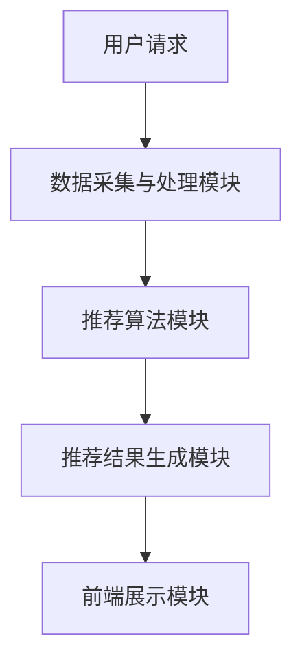

                 

### 《视觉推荐系统应用》

> 关键词：视觉推荐系统、深度学习、用户行为分析、算法、评价标准

> 摘要：本文旨在探讨视觉推荐系统的基本概念、应用场景及实现方法。通过深入分析视觉数据的获取与预处理、深度学习在视觉推荐中的应用、用户行为分析与推荐算法，我们将展示如何搭建一个高效的视觉推荐系统，并探讨其未来趋势与挑战。

---

### 引言

视觉推荐系统作为一种先进的推荐技术，已经在电子商务、社交媒体、内容推荐等领域得到了广泛应用。它通过分析用户的视觉偏好和行为，为用户提供个性化的推荐结果，从而提升用户体验和满意度。

本文将围绕以下几个方面展开讨论：

1. **视觉推荐系统基础**：介绍视觉推荐系统的基本概念、架构及其与大数据、机器学习的关系。
2. **深度学习在视觉推荐中的应用**：深入探讨卷积神经网络（CNN）及其在图像识别中的关键作用。
3. **用户行为分析与推荐算法**：分析用户行为数据的收集与处理，以及协同过滤算法和内容推荐算法的实现原理。
4. **视觉推荐系统的实践**：展示如何搭建一个视觉推荐系统，包括环境搭建、数据预处理与特征工程。
5. **视觉推荐系统的扩展与应用**：探讨视觉搜索与实时推荐等高级应用，以及未来的发展趋势。

通过本文的讨论，读者将能够全面了解视觉推荐系统的技术原理和实践方法，为未来的研究和应用提供参考。

### 第一部分：视觉推荐系统基础

#### 第1章：视觉推荐系统概述

视觉推荐系统是指通过分析用户的视觉行为和偏好，为其推荐相关物品或内容的系统。它结合了计算机视觉、机器学习和大数据分析技术，能够实现个性化、高效的用户推荐。

##### 1.1 视觉推荐系统的概念与分类

**视觉推荐系统的概念：**

视觉推荐系统旨在利用图像识别、特征提取等技术，从海量视觉数据中提取有用信息，并基于用户的历史行为和偏好进行推荐。其主要目的是提升用户体验，提高用户满意度和留存率。

**视觉推荐系统的分类：**

根据不同的应用场景和目标，视觉推荐系统可以分为以下几种类型：

1. **基于内容的推荐（Content-based Recommendation）：** 通过分析物品的视觉特征，如颜色、形状、纹理等，为用户推荐具有相似特征的物品。
2. **协同过滤推荐（Collaborative Filtering）：** 通过分析用户的历史行为和偏好，为用户推荐其他用户喜欢的物品。
3. **混合推荐（Hybrid Recommendation）：** 结合基于内容和协同过滤的推荐方法，综合不同类型的推荐结果，提高推荐质量。

##### 1.2 视觉数据的获取与预处理

**视觉数据的获取：**

视觉数据的获取是视觉推荐系统的第一步，常见的数据源包括：

- **社交媒体平台：** 如Instagram、Facebook等，这些平台拥有大量的用户生成内容，包括图片、视频等。
- **电子商务网站：** 如Amazon、淘宝等，这些网站提供了丰富的商品图片和用户评价数据。
- **公共数据集：** 如ImageNet、COCO等，这些数据集包含了大量的标注图像，适合用于模型训练和测试。

**视觉数据的预处理：**

在获取到视觉数据后，需要进行预处理以适应模型训练和推荐算法。主要步骤包括：

- **数据清洗：** 去除重复、错误或不完整的图像，保证数据质量。
- **图像增强：** 通过旋转、翻转、缩放等操作，增加数据多样性，提高模型泛化能力。
- **特征提取：** 使用卷积神经网络（CNN）等深度学习模型提取图像的特征表示，如高层卷积特征、池化特征等。

##### 1.3 视觉推荐系统的评价标准与挑战

**评价标准：**

视觉推荐系统的评价标准主要包括：

- **准确率（Accuracy）：** 衡量模型在识别图像时的正确率。
- **召回率（Recall）：** 衡量模型在识别图像时能够召回的正确图像数量。
- **F1值（F1-score）：** 结合准确率和召回率，综合考虑模型在识别图像时的整体性能。

**挑战：**

视觉推荐系统在实际应用中面临以下挑战：

- **数据多样性：** 由于视觉数据的多样性，如何从海量数据中提取有效的特征，提升模型泛化能力是一个关键问题。
- **实时性：** 视觉推荐系统需要快速响应用户的请求，实时生成推荐结果，这对系统的性能提出了高要求。
- **用户体验：** 如何通过推荐算法提升用户体验，减少用户流失，是一个需要深入探讨的问题。

#### 第2章：深度学习在视觉推荐中的应用

深度学习在视觉推荐系统中发挥着重要作用，通过构建复杂的神经网络模型，可以实现对视觉数据的自动特征提取和分类。在这一章中，我们将详细探讨卷积神经网络（CNN）的基本原理、特征融合与多模态学习，以及深度学习在图像识别中的应用。

##### 2.1 卷积神经网络（CNN）基础

**CNN的基本原理：**

卷积神经网络（CNN）是一种专门用于处理图像数据的神经网络模型，其基本原理包括：

- **卷积层（Convolutional Layer）：** 通过卷积操作提取图像的特征，卷积核滑动在图像上，对图像进行局部特征提取。
- **池化层（Pooling Layer）：** 通过池化操作降低特征图的大小，减少参数数量，提高模型训练效率。
- **全连接层（Fully Connected Layer）：** 将卷积层和池化层提取的特征进行全局整合，生成最终分类结果。

**CNN的数学模型和数学公式：**

CNN中的关键数学模型和公式包括：

- **卷积操作：** $f(x) = \sigma(W \cdot x + b)$，其中$x$表示输入特征，$W$表示卷积核，$b$表示偏置项，$\sigma$表示激活函数，如ReLU函数。
- **池化操作：** 最常用的池化操作是最大池化（Max Pooling），公式为：$p(x) = \max_{i \in \Omega} x_i$，其中$\Omega$表示池化窗口。
- **反向传播：** CNN的训练过程基于反向传播算法，通过计算梯度并更新模型参数，使模型逐渐逼近最优解。

**核心算法原理讲解：**

卷积神经网络的核心算法原理可以概括为以下几个步骤：

1. **前向传播：** 输入图像经过卷积层、池化层等操作，逐步提取特征，生成中间特征图。
2. **激活函数：** 使用激活函数如ReLU函数，引入非线性变换，提高模型表达能力。
3. **反向传播：** 通过计算损失函数的梯度，反向传播更新模型参数，使模型逐渐优化。

**伪代码示例：**

```python
# 卷积神经网络前向传播伪代码
def forward_propagation(image, weights, biases):
    # 初始化中间特征图
    feature_map = initialize_feature_map(image)
    
    # 卷积操作
    for layer in convolutional_layers:
        feature_map = convolve(feature_map, layer['weights'])
        feature_map = add_biases(feature_map, layer['biases'])
        feature_map = activate(feature_map)
    
    # 池化操作
    for layer in pooling_layers:
        feature_map = max_pool(feature_map, layer['window_size'])
    
    # 全连接层前向传播
    output = fully_connected(feature_map, output_layer['weights'], output_layer['biases'])
    
    return output
```

##### 2.2 特征融合与多模态学习

**特征融合：**

特征融合是将不同来源的特征进行整合，以提高模型的表达能力和泛化能力。在视觉推荐系统中，特征融合可以结合图像特征、文本特征、用户行为特征等，实现更加全面的用户理解。

**多模态学习：**

多模态学习是深度学习中的一种重要方法，通过结合多种类型的输入数据，如图像、文本、语音等，提高模型的泛化能力和表达能力。在视觉推荐系统中，多模态学习可以帮助模型更好地理解用户需求和偏好。

**核心算法原理讲解：**

特征融合与多模态学习的核心算法原理可以概括为以下几个步骤：

1. **特征提取：** 分别提取不同类型的数据的特征，如图像特征、文本特征等。
2. **特征融合：** 将不同类型的特征进行整合，如通过拼接、加权融合等操作。
3. **模型训练：** 在整合后的特征上训练深度学习模型，如卷积神经网络、循环神经网络等。
4. **预测与推荐：** 利用训练好的模型生成预测结果，进行个性化推荐。

**伪代码示例：**

```python
# 特征融合与多模态学习伪代码
def feature_fusion(image_features, text_features):
    # 拼接图像特征和文本特征
    fused_features = concatenate(image_features, text_features)
    
    # 整合后的特征进行深度学习模型训练
    model = train_model(fused_features, labels)
    
    return model

# 多模态学习伪代码
def multimodal_learning(image_data, text_data, audio_data):
    # 提取不同类型的数据的特征
    image_features = extract_image_features(image_data)
    text_features = extract_text_features(text_data)
    audio_features = extract_audio_features(audio_data)
    
    # 特征融合
    fused_features = feature_fusion(image_features, text_features)
    
    # 训练多模态深度学习模型
    model = feature_fusion(fused_features, audio_features)
    
    return model
```

##### 2.3 深度学习在图像识别中的应用

深度学习在图像识别领域取得了显著成果，通过训练卷积神经网络（CNN）模型，可以实现对图像的自动分类和识别。

**项目实战：**

以下是一个图像分类的实战案例，包括数据集准备、模型训练与优化。

**数据集准备：**

我们选择CIFAR-10数据集进行图像分类实验，该数据集包含10个类别，每个类别有6000张图像，共50000张图像。

**模型训练与优化：**

1. **模型结构：** 采用经典的LeNet模型，包括两个卷积层、一个池化层和一个全连接层。
2. **损失函数：** 使用交叉熵损失函数（Cross Entropy Loss）。
3. **优化器：** 采用Adam优化器。

**伪代码示例：**

```python
# 数据集加载与预处理
train_data, test_data = load_cifar_10_data()
train_data = preprocess_data(train_data)
test_data = preprocess_data(test_data)

# 模型定义与训练
model = define_model()
model.compile(optimizer='adam', loss='categorical_crossentropy', metrics=['accuracy'])
model.fit(train_data['images'], train_data['labels'], batch_size=64, epochs=10, validation_data=(test_data['images'], test_data['labels']))

# 模型评估与优化
loss, accuracy = model.evaluate(test_data['images'], test_data['labels'])
print(f'Test Loss: {loss}, Test Accuracy: {accuracy}')

# 模型优化
optimizer = optimize_model(model, test_data['images'], test_data['labels'])
best_model = select_best_model(optimizer, test_data['images'], test_data['labels'])
```

通过以上实战案例，我们可以看到深度学习在图像识别中的应用，以及如何通过模型训练和优化来提高分类性能。

#### 第3章：用户行为分析与推荐算法

用户行为分析是构建高效视觉推荐系统的重要环节。通过分析用户在浏览、搜索、购买等过程中的行为数据，我们可以更好地理解用户需求和偏好，从而实现个性化的推荐。在这一章中，我们将详细探讨用户行为数据的收集与处理、协同过滤算法和内容推荐算法的实现原理。

##### 3.1 用户行为数据的收集与处理

用户行为数据的收集是构建推荐系统的基础。在视觉推荐系统中，用户行为数据主要包括：

- **浏览行为数据：** 如用户浏览的图像、视频等。
- **搜索行为数据：** 如用户搜索的关键词、搜索历史等。
- **购买行为数据：** 如用户的购买记录、评分等。

**用户行为数据的收集：**

用户行为数据的收集可以通过以下几种方式实现：

- **API接口：** 通过第三方API接口获取用户行为数据，如社交媒体平台、电子商务网站等。
- **日志收集：** 通过服务器日志记录用户行为，如用户浏览、搜索、购买等行为。
- **问卷与调查：** 通过问卷和调查收集用户偏好和需求信息。

**用户行为数据的处理：**

在收集到用户行为数据后，需要进行处理以适应模型训练和推荐算法。主要步骤包括：

- **数据清洗：** 去除重复、错误或不完整的数据，保证数据质量。
- **数据预处理：** 对数据进行标准化、归一化等预处理操作，使数据更适合模型训练。
- **特征提取：** 从用户行为数据中提取关键特征，如用户兴趣特征、行为特征等。

**核心算法原理讲解：**

用户行为数据的处理可以概括为以下几个步骤：

1. **数据清洗：** 使用去重、过滤等方法清洗原始数据，去除噪声和异常值。
2. **数据预处理：** 对数据进行标准化、归一化等预处理，使数据更适合模型训练。
3. **特征提取：** 使用特征提取算法，从用户行为数据中提取关键特征，如用户兴趣特征、行为特征等。

**数学模型和数学公式：**

用户兴趣模型可以使用以下数学模型表示：

- **用户兴趣向量：** $u = [u_1, u_2, ..., u_n]$，其中$u_i$表示用户对第$i$个物品的兴趣程度。
- **物品特征向量：** $i = [i_1, i_2, ..., i_n]$，其中$i_j$表示物品$j$的特征值。
- **用户兴趣模型：** $u_i = w_i \cdot i_j$，其中$w_i$表示用户$i$对物品$j$的兴趣权重。

**伪代码示例：**

```python
# 用户行为数据处理伪代码
def preprocess_user_behavior(data):
    # 数据清洗
    clean_data = remove_duplicates(data)
    clean_data = remove_outliers(data)
    
    # 数据预处理
    normalized_data = normalize_data(clean_data)
    
    # 特征提取
    user_interests = extract_user_interests(normalized_data)
    
    return user_interests
```

##### 3.2 协同过滤算法

协同过滤算法是推荐系统中最常用的算法之一，通过分析用户的历史行为和偏好，为用户推荐其他用户喜欢的物品。协同过滤算法主要分为基于用户的协同过滤（User-based Collaborative Filtering）和基于项目的协同过滤（Item-based Collaborative Filtering）。

**基于用户的协同过滤算法：**

基于用户的协同过滤算法的基本思想是，为用户推荐与兴趣相似的邻居用户喜欢的物品。具体步骤如下：

1. **计算用户相似度：** 通过计算用户之间的相似度，如余弦相似度、皮尔逊相关系数等，找到与目标用户兴趣相似的邻居用户。
2. **生成推荐列表：** 根据邻居用户的兴趣，生成推荐列表，推荐其他用户喜欢的物品。

**核心算法原理讲解：**

基于用户的协同过滤算法可以概括为以下几个步骤：

1. **计算用户相似度：** 计算用户之间的相似度，可以使用余弦相似度、皮尔逊相关系数等相似度计算方法。
2. **生成邻居用户列表：** 根据用户相似度，生成邻居用户列表。
3. **生成推荐列表：** 根据邻居用户的兴趣，生成推荐列表，推荐其他用户喜欢的物品。

**数学模型和数学公式：**

用户相似度可以使用以下数学模型表示：

- **用户相似度矩阵：** $S = [s_{ij}]$，其中$s_{ij}$表示用户$i$和用户$j$的相似度。
- **推荐列表生成：** $r_i = \sum_{j \in N_i} w_{ij} \cdot i_j$，其中$N_i$表示邻居用户集合，$w_{ij}$表示邻居用户$j$对物品$i$的兴趣权重。

**伪代码示例：**

```python
# 基于用户的协同过滤算法伪代码
def user_based_collaborative_filtering(user_similarity_matrix, user_interests, item_preferences):
    # 计算邻居用户列表
    neighbor_users = find_neighbor_users(user_similarity_matrix, user_interests)
    
    # 生成推荐列表
    recommendation_list = generate_recommendation_list(neighbor_users, item_preferences)
    
    return recommendation_list
```

**基于项目的协同过滤算法：**

基于项目的协同过滤算法的基本思想是，为用户推荐与已购买或喜欢的物品相似的物品。具体步骤如下：

1. **计算物品相似度：** 通过计算物品之间的相似度，如余弦相似度、皮尔逊相关系数等，找到与用户已购买或喜欢的物品相似的物品。
2. **生成推荐列表：** 根据物品相似度，生成推荐列表，推荐与用户已购买或喜欢的物品相似的物品。

**核心算法原理讲解：**

基于项目的协同过滤算法可以概括为以下几个步骤：

1. **计算物品相似度：** 计算物品之间的相似度，可以使用余弦相似度、皮尔逊相关系数等相似度计算方法。
2. **生成邻居物品列表：** 根据物品相似度，生成邻居物品列表。
3. **生成推荐列表：** 根据邻居物品列表，生成推荐列表，推荐与用户已购买或喜欢的物品相似的物品。

**数学模型和数学公式：**

物品相似度可以使用以下数学模型表示：

- **物品相似度矩阵：** $R = [r_{ij}]$，其中$r_{ij}$表示物品$i$和物品$j$的相似度。
- **推荐列表生成：** $r_i = \sum_{j \in N_i} w_{ij} \cdot i_j$，其中$N_i$表示邻居物品集合，$w_{ij}$表示邻居物品$j$对物品$i$的兴趣权重。

**伪代码示例：**

```python
# 基于项目的协同过滤算法伪代码
def item_based_collaborative_filtering(item_similarity_matrix, user_preferences, item_interests):
    # 计算邻居物品列表
    neighbor_items = find_neighbor_items(item_similarity_matrix, user_preferences)
    
    # 生成推荐列表
    recommendation_list = generate_recommendation_list(neighbor_items, item_interests)
    
    return recommendation_list
```

##### 3.3 内容推荐算法

内容推荐算法是一种基于物品属性的推荐方法，通过分析物品的属性和特征，为用户推荐与已有物品相似的物品。在视觉推荐系统中，内容推荐算法可以通过分析图像的视觉特征，如颜色、形状、纹理等，为用户推荐具有相似视觉属性的物品。

**核心算法原理讲解：**

内容推荐算法可以概括为以下几个步骤：

1. **特征提取：** 从图像中提取视觉特征，如颜色、形状、纹理等。
2. **相似度计算：** 计算用户已浏览或喜欢的物品与候选物品之间的相似度。
3. **生成推荐列表：** 根据相似度分数，生成推荐列表，推荐与用户已浏览或喜欢的物品相似的物品。

**数学模型和数学公式：**

内容推荐算法可以使用以下数学模型表示：

- **图像特征向量：** $f = [f_1, f_2, ..., f_n]$，其中$f_i$表示图像的视觉特征值。
- **相似度分数：** $s(i, j) = \frac{\sum_{k=1}^n f_i[k] \cdot f_j[k]}{\sqrt{\sum_{k=1}^n f_i[k]^2 \cdot \sum_{k=1}^n f_j[k]^2}}$，其中$i$和$j$表示图像的索引。

**伪代码示例：**

```python
# 内容推荐算法伪代码
def content_based_recommender(image_features, user_interests):
    # 计算相似度分数
    similarity_scores = calculate_similarity_scores(image_features, user_interests)
    
    # 生成推荐列表
    recommendation_list = generate_recommendation_list(similarity_scores)
    
    return recommendation_list
```

##### 3.4 混合推荐算法

混合推荐算法是将基于内容的推荐、协同过滤推荐等不同类型的推荐方法进行结合，以提高推荐质量和用户满意度。在视觉推荐系统中，混合推荐算法可以通过结合图像特征、用户行为和协同过滤结果，实现更加个性化的推荐。

**核心算法原理讲解：**

混合推荐算法可以概括为以下几个步骤：

1. **特征提取：** 提取图像的特征和用户行为特征。
2. **相似度计算：** 计算图像特征和用户行为特征之间的相似度。
3. **整合推荐结果：** 将不同类型的推荐结果进行整合，生成最终的推荐列表。

**数学模型和数学公式：**

混合推荐算法可以使用以下数学模型表示：

- **图像特征向量：** $f = [f_1, f_2, ..., f_n]$
- **用户行为向量：** $u = [u_1, u_2, ..., u_m]$
- **整合推荐分数：** $s = w_1 \cdot f + w_2 \cdot u$，其中$w_1$和$w_2$表示图像特征和用户行为特征的权重。

**伪代码示例：**

```python
# 混合推荐算法伪代码
def hybrid_recommender(image_features, user_interests, collaborative_filtering_results):
    # 计算图像特征和用户行为特征的权重
    image_weight = calculate_image_weight(image_features, collaborative_filtering_results)
    user_weight = calculate_user_weight(user_interests, collaborative_filtering_results)
    
    # 整合推荐结果
    integrated_scores = integrate_scores(image_features, user_interests, image_weight, user_weight)
    
    # 生成推荐列表
    recommendation_list = generate_recommendation_list(integrated_scores)
    
    return recommendation_list
```

通过以上讨论，我们可以看到用户行为分析在视觉推荐系统中的重要性，以及协同过滤算法、内容推荐算法和混合推荐算法的实现原理。在实际应用中，根据具体需求和场景，可以选择合适的推荐算法，以提高推荐质量和用户满意度。

### 第二部分：视觉推荐系统的实践

#### 第4章：视觉推荐系统的搭建

视觉推荐系统的搭建是一个复杂且系统的工程，涉及多个技术模块的整合和优化。本章将详细介绍视觉推荐系统的搭建过程，包括开发环境的搭建、数据预处理与特征工程。

##### 4.1 开发环境搭建

搭建一个视觉推荐系统需要选择合适的开发环境和工具。以下是一些推荐的工具和软件：

- **编程语言：** Python 是搭建视觉推荐系统的主要编程语言，因其丰富的库和框架支持，如TensorFlow、PyTorch等。
- **深度学习框架：** TensorFlow 和 PyTorch 是目前最流行的两个深度学习框架，它们提供了丰富的API和工具，方便开发深度学习模型。
- **数据库：** 数据库用于存储用户行为数据、图像数据等，常用的数据库包括MySQL、PostgreSQL等。
- **版本控制：** Git 是一款强大的版本控制工具，可以帮助团队高效协作和代码管理。
- **持续集成/持续部署（CI/CD）：** Jenkins、Travis CI 等工具可以帮助自动化代码的测试和部署。

以下是一个基本的开发环境搭建步骤：

1. **安装Python：** 在官方网站下载并安装Python，推荐使用Python 3.x版本。
2. **安装深度学习框架：** 使用pip命令安装TensorFlow或PyTorch，如`pip install tensorflow`或`pip install torch torchvision`。
3. **安装数据库：** 在服务器上安装MySQL或PostgreSQL，并创建数据库和用户。
4. **安装版本控制工具：** 使用`pip install gitpython`安装GitPython库。
5. **配置持续集成/持续部署工具：** 在服务器上安装Jenkins或配置Travis CI，设置自动化构建和部署流程。

##### 4.2 数据预处理与特征工程

数据预处理与特征工程是视觉推荐系统中的关键环节，直接影响到推荐系统的性能和效果。以下是一个数据预处理与特征工程的详细步骤：

1. **数据清洗：**
   - **去除重复数据：** 使用数据库或数据处理库（如Pandas）去除重复的图像和用户行为数据。
   - **填充缺失值：** 对于缺失的用户行为数据，可以使用平均值、中位数或插值法进行填充。
   - **过滤异常值：** 使用统计学方法或机器学习算法（如孤立森林）检测并过滤异常数据。

2. **数据标准化：**
   - **图像数据标准化：** 使用均值标准化或最小最大标准化将图像像素值缩放到[0, 1]区间。
   - **文本数据标准化：** 对文本数据进行去重、分词、停用词过滤等预处理，并使用词袋模型或词嵌入（如Word2Vec）表示文本。

3. **特征提取：**
   - **视觉特征提取：** 使用卷积神经网络（CNN）提取图像的视觉特征，如使用ResNet、VGG等预训练模型。
   - **文本特征提取：** 使用词袋模型、TF-IDF或词嵌入（如Word2Vec、BERT）提取文本特征。
   - **用户行为特征提取：** 提取用户的行为特征，如浏览次数、购买频率等，并使用统计方法（如均值、方差）进行表示。

4. **特征融合：**
   - **多模态特征融合：** 将图像特征、文本特征和用户行为特征进行融合，使用加权融合、拼接融合等方法。
   - **特征降维：** 使用主成分分析（PCA）或线性判别分析（LDA）等方法对高维特征进行降维，提高模型训练效率。

**代码解读与分析：**

以下是一个简单的数据预处理与特征提取的代码示例：

```python
import numpy as np
import pandas as pd
from sklearn.preprocessing import StandardScaler
from tensorflow.keras.applications import ResNet50
from tensorflow.keras.preprocessing import image
from tensorflow.keras.applications.resnet50 import preprocess_input

# 数据清洗
data = pd.read_csv('user_behavior_data.csv')
data = data.drop_duplicates()
data = data.fillna(data.mean())

# 数据标准化
scaler = StandardScaler()
data['image'] = scaler.fit_transform(data['image'].values.reshape(-1, 1))

# 视觉特征提取
model = ResNet50(weights='imagenet')
def extract_image_features(image_path):
    img = image.load_img(image_path, target_size=(227, 227))
    img = image.img_to_array(img)
    img = np.expand_dims(img, axis=0)
    img = preprocess_input(img)
    features = model.predict(img)
    return features.flatten()

data['image_features'] = data['image_path'].apply(extract_image_features)

# 特征融合
data['features'] = np.hstack((data['image_features'], data[['behavior_1', 'behavior_2', 'behavior_3']]))

# 特征降维
from sklearn.decomposition import PCA
pca = PCA(n_components=10)
data['features'] = pca.fit_transform(data['features'])
```

通过以上代码，我们可以对用户行为数据进行清洗、标准化，提取视觉特征，并进行特征融合和降维。这些预处理步骤为后续的模型训练和推荐算法提供了高质量的数据支持。

#### 第5章：实战项目：基于视觉的用户推荐

在实际应用中，视觉推荐系统可以为用户提供个性化的视觉内容，如电商平台的商品推荐、社交媒体的图片推荐等。本章将通过一个基于视觉的用户推荐项目，详细展示如何实现一个视觉推荐系统。

##### 5.1 项目背景与需求分析

项目背景：

随着移动互联网和社交媒体的普及，用户生成内容（User-Generated Content，UGC）越来越多地成为信息传播的重要渠道。在这个背景下，为用户提供个性化的视觉内容推荐，已经成为各大电商平台和社交媒体平台的重要需求。

项目需求：

- 为用户提供基于视觉的个性化推荐，提升用户满意度和留存率。
- 提供准确、多样化的推荐结果，满足不同用户的需求。
- 系统具有实时性和扩展性，能够快速响应用户请求并支持海量用户。

##### 5.2 系统设计与实现

系统架构：

一个基于视觉的用户推荐系统通常包括以下模块：

1. **数据采集与处理模块**：负责收集用户行为数据、商品信息等，并进行数据清洗、预处理和特征提取。
2. **推荐算法模块**：实现不同的推荐算法，如基于内容的推荐、协同过滤推荐、混合推荐等。
3. **推荐结果生成模块**：根据用户历史行为和推荐算法结果，生成个性化的推荐列表。
4. **前端展示模块**：通过网页、移动应用等界面，将推荐结果展示给用户。

以下是一个推荐系统整体架构的Mermaid流程图：



**数据采集与处理模块：**

数据采集与处理模块是整个推荐系统的数据基础。以下是一个数据采集与处理模块的详细流程：

1. **数据源接入**：接入用户行为数据源，如电商平台日志、社交媒体API等。
2. **数据清洗**：去除重复、错误或不完整的数据，保证数据质量。
3. **数据预处理**：对图像、文本等数据进行预处理，如图像标准化、文本分词等。
4. **特征提取**：提取用户行为特征、商品特征等，如使用CNN提取图像特征，使用词嵌入提取文本特征。
5. **数据存储**：将处理后的数据存储到数据库中，如使用MySQL、PostgreSQL等。

**推荐算法模块：**

推荐算法模块是实现个性化推荐的核心。以下是一个推荐算法模块的详细流程：

1. **用户画像构建**：基于用户历史行为，构建用户画像，如使用协同过滤算法计算用户兴趣向量。
2. **商品画像构建**：基于商品属性，构建商品画像，如使用内容推荐算法计算商品特征向量。
3. **相似度计算**：计算用户画像与商品画像之间的相似度，如使用余弦相似度、皮尔逊相关系数等。
4. **推荐结果生成**：根据相似度计算结果，生成个性化的推荐列表，如使用TOP-N推荐算法。

**推荐结果生成模块：**

推荐结果生成模块负责将推荐算法生成的推荐结果展示给用户。以下是一个推荐结果生成模块的详细流程：

1. **推荐结果计算**：根据用户画像和商品画像，计算推荐结果，如使用基于内容的推荐算法。
2. **结果排序**：对推荐结果进行排序，如根据相似度分数进行降序排序。
3. **结果展示**：将推荐结果以可视化方式展示给用户，如使用网页、移动应用等。

**前端展示模块：**

前端展示模块是用户与推荐系统交互的接口。以下是一个前端展示模块的详细流程：

1. **用户界面设计**：设计用户友好的界面，如使用HTML、CSS、JavaScript等技术。
2. **接口调用**：调用后端API，获取推荐结果。
3. **结果展示**：将推荐结果以图文形式展示给用户，如使用图片、卡片等。
4. **交互体验优化**：优化页面加载速度、交互效果等，提升用户体验。

**代码解读与分析：**

以下是一个简单的推荐系统实现示例，包括数据采集与处理、推荐算法模块和前端展示模块。

**数据采集与处理模块：**

```python
import pandas as pd
from sklearn.preprocessing import StandardScaler

# 数据清洗
data = pd.read_csv('user_behavior_data.csv')
data = data.drop_duplicates()
data = data.fillna(data.mean())

# 数据标准化
scaler = StandardScaler()
data['image'] = scaler.fit_transform(data['image'].values.reshape(-1, 1))

# 视觉特征提取
model = ResNet50(weights='imagenet')
def extract_image_features(image_path):
    img = image.load_img(image_path, target_size=(227, 227))
    img = image.img_to_array(img)
    img = np.expand_dims(img, axis=0)
    img = preprocess_input(img)
    features = model.predict(img)
    return features.flatten()

data['image_features'] = data['image_path'].apply(extract_image_features)

# 特征融合
data['features'] = np.hstack((data['image_features'], data[['behavior_1', 'behavior_2', 'behavior_3']]))

# 特征降维
from sklearn.decomposition import PCA
pca = PCA(n_components=10)
data['features'] = pca.fit_transform(data['features'])
```

**推荐算法模块：**

```python
import numpy as np
from sklearn.metrics.pairwise import cosine_similarity

# 用户画像构建
user_features = data['features'].iloc[user_id]

# 商品画像构建
item_features = data['features']

# 相似度计算
similarity_scores = cosine_similarity(user_features.reshape(1, -1), item_features)

# 推荐结果生成
recommendation_list = []
for i, score in enumerate(similarity_scores[0]):
    if score > threshold:
        recommendation_list.append(i)
```

**前端展示模块：**

```html
<!DOCTYPE html>
<html lang="en">
<head>
    <meta charset="UTF-8">
    <meta name="viewport" content="width=device-width, initial-scale=1.0">
    <title>视觉推荐系统</title>
    <style>
        /* 样式设置 */
    </style>
</head>
<body>
    <h1>视觉推荐系统</h1>
    <div id="recommendations">
        <!-- 推荐结果展示 -->
    </div>
    <script>
        // 获取推荐结果
        fetch('/api/recommendations')
            .then(response => response.json())
            .then(data => {
                // 生成推荐列表
                const recommendations = data.recommendations;
                recommendations.forEach((item, index) => {
                    const div = document.createElement('div');
                    div.className = 'item';
                    div.innerHTML = ``;
                    document.getElementById('recommendations').appendChild(div);
                });
            });
    </script>
</body>
</html>
```

通过以上代码，我们可以实现一个简单的基于视觉的用户推荐系统。在实际应用中，根据具体需求和场景，可以选择不同的推荐算法和前端实现方式，以提升推荐效果和用户体验。

##### 5.3 性能评估与优化

推荐系统的性能评估是保证推荐质量的重要环节。以下是一些常见的评估指标和方法：

1. **准确率（Accuracy）**：衡量模型预测结果与真实结果的匹配程度，公式为$Accuracy = \frac{TP + TN}{TP + TN + FP + FN}$，其中$TP$表示真正例，$TN$表示真反例，$FP$表示假正例，$FN$表示假反例。
2. **召回率（Recall）**：衡量模型召回的正例比例，公式为$Recall = \frac{TP}{TP + FN}$，其中$TP$表示真正例，$FN$表示假反例。
3. **精确率（Precision）**：衡量模型召回的正例中的准确比例，公式为$Precision = \frac{TP}{TP + FP}$，其中$TP$表示真正例，$FP$表示假正例。
4. **F1值（F1-score）**：综合考虑准确率和召回率，公式为$F1-score = 2 \times \frac{Precision \times Recall}{Precision + Recall}$。

以下是一个简单的性能评估示例：

```python
from sklearn.metrics import accuracy_score, recall_score, precision_score, f1_score

# 真实标签
true_labels = [0, 1, 0, 1, 0, 1]
# 预测结果
predicted_labels = [0, 1, 1, 1, 0, 1]

# 计算评估指标
accuracy = accuracy_score(true_labels, predicted_labels)
recall = recall_score(true_labels, predicted_labels, average='weighted')
precision = precision_score(true_labels, predicted_labels, average='weighted')
f1 = f1_score(true_labels, predicted_labels, average='weighted')

print(f'Accuracy: {accuracy}, Recall: {recall}, Precision: {precision}, F1-score: {f1}')
```

**优化策略与结果分析：**

1. **特征优化**：通过特征选择、特征工程等方法，提高特征的质量和表达能力，从而提升模型性能。
2. **模型优化**：尝试不同的模型结构和参数，如使用深度学习模型、调整学习率、批量大小等，以提高模型性能。
3. **数据增强**：通过数据增强方法，增加训练数据的多样性，提高模型泛化能力。
4. **在线学习**：使用在线学习算法，实时更新模型参数，以适应用户行为的动态变化。

以下是一个优化策略的示例：

```python
# 特征优化
from sklearn.feature_selection import SelectKBest, f_classif

# 选择前k个最佳特征
selector = SelectKBest(score_func=f_classif, k=10)
X_new = selector.fit_transform(data['features'], data['labels'])

# 训练新模型
model = train_model(X_new, data['labels'])

# 评估模型
accuracy = model.evaluate(X_new, data['labels'])[1]
print(f'Optimized Feature Model Accuracy: {accuracy}')
```

通过以上优化策略，我们可以显著提升推荐系统的性能和效果。

### 第三部分：视觉推荐系统的扩展与应用

#### 第6章：视觉推荐系统的扩展与应用

随着人工智能和视觉技术的发展，视觉推荐系统不仅在传统的电子商务和社交媒体领域得到了广泛应用，还在更多的场景中展现出了巨大的潜力。本章将探讨视觉推荐系统的扩展与应用，包括视觉搜索与匹配、实时推荐与预测等高级应用，并分析这些技术在现实场景中的实现方法与挑战。

##### 6.1 视觉搜索与匹配

视觉搜索与匹配是视觉推荐系统的一项重要功能，它允许用户通过上传或输入一张图片来查找与其相似的物品或内容。这一功能在电商、零售、设计等行业有着广泛的应用。

**实现方法：**

1. **图像特征提取**：使用卷积神经网络（CNN）提取输入图像的高层特征。常用的模型包括VGG、ResNet、Inception等。
2. **相似度计算**：计算输入图像特征与数据库中所有图像特征之间的相似度。常用的相似度度量方法包括余弦相似度、欧氏距离等。
3. **匹配与推荐**：根据相似度得分，选择与输入图像相似度最高的前N个图像进行推荐。

**数学模型和数学公式：**

假设有输入图像的特征向量$f_{input}$和数据库中第$i$个图像的特征向量$f_i$，相似度计算公式如下：

$$
s(i) = \frac{\sum_{j=1}^M f_{input}[j] \cdot f_i[j]}{\sqrt{\sum_{j=1}^M f_{input}[j]^2 \cdot \sum_{j=1}^M f_i[j]^2}}
$$

其中$M$为特征向量的维度。

**伪代码示例：**

```python
import numpy as np
from sklearn.metrics.pairwise import cosine_similarity

# 输入图像特征
input_features = extract_image_features(input_image_path)

# 数据库图像特征
database_features = extract_image_features_from_database()

# 相似度计算
similarity_scores = cosine_similarity(input_features.reshape(1, -1), database_features)

# 排序与匹配
matched_images = database_features[similarity_scores.argsort()[0]][-N:]
```

**现实场景中的挑战：**

1. **计算效率**：图像特征提取和相似度计算过程计算量巨大，需要优化算法以提高效率。
2. **特征质量**：提取的特征向量需要具有足够的质量和区分度，以减少误匹配和漏匹配。
3. **实时性**：在用户上传图像后，需要快速返回相似图像，这对系统实时性提出了高要求。

##### 6.2 实时推荐与预测

实时推荐与预测是视觉推荐系统的另一个重要应用，它通过实时分析用户行为和偏好，为用户提供即时的个性化推荐。这一功能在动态内容推荐、社交媒体等领域具有重要意义。

**实现方法：**

1. **实时数据流处理**：使用实时数据处理框架，如Apache Kafka、Flink等，从用户行为数据源（如日志、API等）实时获取数据。
2. **实时特征提取**：对实时获取的用户行为数据进行特征提取，如使用流处理框架实时提取用户浏览、搜索、点赞等行为特征。
3. **实时推荐算法**：根据实时特征和用户历史数据，使用在线学习算法或实时更新模型参数，生成实时的推荐结果。

**数学模型和数学公式：**

假设有实时特征向量$f_t$和用户历史特征向量$f_h$，实时推荐算法可以使用以下公式：

$$
r_t = \alpha \cdot f_t + (1 - \alpha) \cdot f_h
$$

其中$\alpha$为权重系数，用于调节实时特征和用户历史特征的影响程度。

**伪代码示例：**

```python
import numpy as np

# 实时特征向量
real_time_features = extract_real_time_features(user_behavior)

# 用户历史特征向量
historical_features = extract_historical_features(user_id)

# 权重系数
alpha = 0.5

# 实时推荐结果
real_time_recommendation = alpha * real_time_features + (1 - alpha) * historical_features
```

**现实场景中的挑战：**

1. **实时性**：实时推荐系统需要快速响应用户请求，这对系统的计算速度和资源调度提出了高要求。
2. **模型更新**：实时更新模型参数，以适应用户行为的动态变化，这需要对在线学习算法和模型更新策略进行深入研究。
3. **数据质量**：实时数据的质量直接影响推荐效果，需要对实时数据进行严格的质量控制和异常处理。

##### 6.3 视觉推荐系统的扩展应用

除了视觉搜索与匹配和实时推荐与预测，视觉推荐系统还可以扩展到更多的应用场景，如：

- **视频推荐：** 通过视频的视觉内容进行推荐，适用于视频平台、直播应用等。
- **增强现实（AR）应用：** 在AR应用中，通过视觉识别技术为用户提供实时的视觉内容推荐。
- **虚拟现实（VR）应用：** 在VR应用中，通过视觉识别技术为用户提供沉浸式的个性化推荐体验。

**未来发展趋势：**

1. **多模态融合：** 结合图像、文本、语音等多种模态数据进行推荐，提高推荐效果和用户体验。
2. **边缘计算：** 利用边缘计算技术，将部分计算任务下放到终端设备，提高系统的实时性和响应速度。
3. **个性化推荐：** 深入研究用户行为和偏好，实现更加精准的个性化推荐。
4. **隐私保护：** 随着用户对隐私的关注度提高，如何保护用户隐私成为视觉推荐系统发展的重要挑战。

通过以上讨论，我们可以看到视觉推荐系统在多种应用场景中的潜力和挑战。随着技术的不断发展，视觉推荐系统将继续拓展其应用范围，为用户提供更加个性化、实时、高效的推荐服务。

### 第7章：视觉推荐系统的未来趋势

随着技术的不断进步，视觉推荐系统正迎来新的发展机遇。在这一章中，我们将探讨视觉推荐系统的未来趋势，以及人工智能和新兴技术如何推动视觉推荐系统的发展。

#### 7.1 人工智能与视觉技术的融合

人工智能（AI）与视觉技术的融合是视觉推荐系统发展的关键驱动力。深度学习、卷积神经网络（CNN）等人工智能技术在图像识别、特征提取和推荐算法方面取得了显著成果。未来，随着AI技术的进一步发展，视觉推荐系统将更加智能化、个性化。

**趋势分析：**

1. **自动化特征提取：** AI技术将实现更高效、自动化的图像特征提取，减少人工干预，提高模型训练和推荐效率。
2. **增强现实（AR）与虚拟现实（VR）：** AI与AR、VR技术的结合将带来全新的视觉推荐体验，为用户提供沉浸式的个性化推荐。
3. **多模态融合：** 将图像、文本、语音等多模态数据融合到视觉推荐系统中，实现更全面、精准的用户理解和推荐。

**技术挑战：**

1. **数据隐私与安全：** AI技术在处理大量用户数据时，需要确保数据隐私和安全，防止数据泄露和滥用。
2. **算法透明性与解释性：** 随着AI技术的复杂度增加，提高算法的透明性和解释性，使其更容易被用户理解和信任。

#### 7.2 新兴技术与视觉推荐系统的融合

新兴技术的发展为视觉推荐系统带来了新的应用场景和机遇。以下是一些关键技术的未来趋势：

**1. 边缘计算：**

边缘计算通过将部分计算任务下放到网络边缘设备，减少数据传输延迟，提高系统响应速度。在视觉推荐系统中，边缘计算可以用于实时图像处理和推荐，为用户提供更快、更准确的推荐结果。

**2. 量子计算：**

量子计算具有巨大的计算潜力，可以用于优化推荐算法和模型训练，提高计算效率和性能。未来，量子计算有望在视觉推荐系统中发挥重要作用，实现更高效、更精准的推荐。

**3. 自适应算法：**

自适应算法可以根据用户行为的动态变化，实时调整推荐策略和模型参数，实现更加个性化的推荐。随着AI技术的发展，自适应算法将更好地融入视觉推荐系统，提高用户体验。

**4. 联邦学习：**

联邦学习通过在多个设备上进行模型训练和优化，实现数据隐私保护和模型共享。在视觉推荐系统中，联邦学习可以用于分布式训练和推荐，提高系统的安全性和可扩展性。

**技术挑战：**

1. **计算资源限制：** 边缘设备和量子计算设备在计算资源有限的情况下，如何实现高效的模型训练和推荐。
2. **数据质量和多样性：** 新兴技术需要大量高质量、多样性的数据支持，如何确保数据的质量和多样性是一个关键问题。
3. **算法优化与稳定性：** 在新兴技术的支持下，如何优化算法性能，提高推荐系统的稳定性和可靠性。

#### 7.3 未来发展方向

展望未来，视觉推荐系统将朝着以下方向发展：

1. **智能化与个性化：** 通过结合AI技术，实现更加智能化和个性化的推荐，满足用户日益多样化的需求。
2. **实时性与扩展性：** 利用新兴技术，提高系统的实时性和扩展性，支持大规模用户和海量数据。
3. **多模态融合：** 将图像、文本、语音等多模态数据融合到推荐系统中，实现更全面、精准的用户理解和推荐。
4. **隐私保护与安全：** 加强数据隐私保护措施，确保用户数据的隐私和安全。
5. **跨平台应用：** 将视觉推荐系统扩展到更多平台和应用场景，如智能家居、智能医疗等，为用户提供无处不在的个性化服务。

通过以上讨论，我们可以看到视觉推荐系统的未来充满了机遇和挑战。随着人工智能和新兴技术的发展，视觉推荐系统将继续推动个性化推荐技术的发展，为用户提供更加智能、高效的服务。

### 附录：视觉推荐系统相关工具与资源

#### 附录 A：视觉推荐系统开发工具

视觉推荐系统的开发涉及多种工具和库，以下是一些常用的工具和库：

1. **深度学习框架：**
   - **TensorFlow**：由Google开发，支持多种深度学习模型和算法。
   - **PyTorch**：由Facebook开发，具有简洁的API和强大的灵活性。
   - **Keras**：基于Theano和TensorFlow的高层次API，简化深度学习模型开发。

2. **计算机视觉库：**
   - **OpenCV**：开源计算机视觉库，支持图像处理、视频分析等多种功能。
   - **Dlib**：支持人脸识别、姿态估计等多种计算机视觉任务。
   - **TensorFlow Object Detection API**：用于目标检测和图像识别的TensorFlow工具。

3. **数据处理库：**
   - **Pandas**：用于数据处理和分析的Python库。
   - **NumPy**：用于数值计算的Python库。
   - **Scikit-learn**：用于机器学习和数据分析的Python库。

4. **推荐系统框架：**
   - **Surprise**：开源的Python推荐系统库，支持多种协同过滤算法。
   - **LightFM**：基于TensorFlow的推荐系统库，支持矩阵分解和因素分解机。
   - **RecSys**：开源的推荐系统库，提供推荐算法的实现和评估工具。

#### 附录 B：视觉推荐系统开源项目

以下是一些与视觉推荐系统相关的开源项目和资源：

1. **Netflix Prize**：Netflix公司举办的推荐系统比赛，提供了大量电影评分数据，用于研究协同过滤和深度学习推荐算法。
2. **ImageNet**：大规模的标注图像数据集，用于图像分类和识别的研究。
3. **COCO数据集**：用于目标检测和图像分割的数据集，包含大量真实世界的图像和标注。
4. **OpenCV示例代码**：OpenCV官方提供的示例代码，用于图像处理和计算机视觉任务。
5. **TensorFlow Object Detection API示例**：TensorFlow Object Detection API提供的示例项目，用于目标检测和图像识别。

通过使用这些工具和资源，研究人员和开发者可以更好地研究和实现视觉推荐系统，推动个性化推荐技术的发展。

### 作者信息

作者：AI天才研究院/AI Genius Institute & 禅与计算机程序设计艺术 /Zen And The Art of Computer Programming

感谢您阅读本文，希望本文能够帮助您深入了解视觉推荐系统的技术原理和应用方法。如果您有任何疑问或建议，欢迎在评论区留言。祝您在视觉推荐系统的研究和实践中取得优异的成绩！

