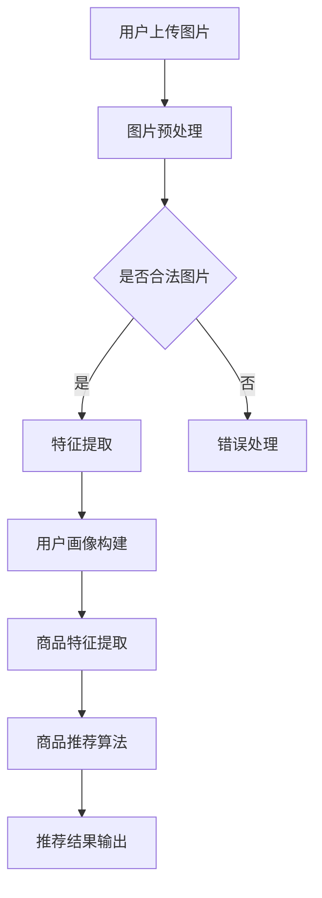

                 

# 视觉推荐：AI分析用户图片推荐商品

> 关键词：视觉推荐、人工智能、图像特征提取、用户画像、推荐系统

> 摘要：本文深入探讨了视觉推荐系统的工作原理、实现技术以及其在实际应用中的效果。通过分析图像特征提取技术、用户画像构建方法以及商品推荐系统的架构设计，本文展示了如何利用人工智能技术实现基于用户图片的商品推荐。同时，通过案例研究与实践，本文进一步验证了视觉推荐系统的实用性与市场潜力。

### 《视觉推荐：AI分析用户图片推荐商品》目录大纲

#### 第一部分：视觉推荐基础

#### 第1章：视觉推荐概述

#### 1.1 视觉推荐的定义与价值

#### 1.1.1 视觉推荐的起源与发展

#### 1.1.2 视觉推荐的核心价值

#### 1.2 视觉推荐的挑战与机遇

#### 1.2.1 数据获取与处理挑战

#### 1.2.2 模型训练与优化挑战

#### 1.2.3 用户隐私保护与伦理挑战

#### 1.3 主要视觉推荐算法概述

#### 1.3.1 基于内容的推荐算法

#### 1.3.2 协同过滤推荐算法

#### 1.3.3 深度学习推荐算法

#### 第二部分：AI分析技术

#### 第2章：图像特征提取技术

#### 2.1 图像特征提取概述

#### 2.1.1 图像特征提取的重要性

#### 2.1.2 常见的图像特征提取方法

#### 2.2 卷积神经网络（CNN）在图像特征提取中的应用

#### 2.2.1 卷积神经网络的基本原理

#### 2.2.2 CNN在图像特征提取中的优势

#### 2.3 基于深度学习的图像特征提取

#### 2.3.1 常见的深度学习模型及其在图像特征提取中的应用

#### 2.3.2 跨域图像特征提取

#### 第三部分：用户画像构建

#### 第3章：用户画像构建技术

#### 3.1 用户画像概述

#### 3.1.1 用户画像的定义与作用

#### 3.1.2 用户画像的构建流程

#### 3.2 用户行为数据收集与处理

#### 3.2.1 用户行为数据的来源

#### 3.2.2 用户行为数据预处理方法

#### 3.3 用户画像模型构建

#### 3.3.1 基于统计方法的用户画像构建

#### 3.3.2 基于机器学习方法的用户画像构建

#### 第四部分：商品推荐系统设计

#### 第4章：商品推荐系统架构设计

#### 4.1 商品推荐系统概述

#### 4.1.1 商品推荐系统的定义与目标

#### 4.1.2 商品推荐系统的常见架构

#### 4.2 商品信息处理与建模

#### 4.2.1 商品信息结构化处理

#### 4.2.2 商品属性提取与建模

#### 4.3 用户-商品交互数据挖掘

#### 4.3.1 用户-商品交互数据收集

#### 4.3.2 用户-商品交互数据分析

#### 第五部分：视觉推荐实现与优化

#### 第5章：视觉推荐实现与优化

#### 5.1 视觉推荐系统实现

#### 5.1.1 视觉推荐系统的设计原则

#### 5.1.2 视觉推荐系统的技术选型

#### 5.2 视觉推荐算法优化

#### 5.2.1 视觉推荐算法的评估指标

#### 5.2.2 视觉推荐算法的优化方法

#### 5.3 视觉推荐系统的性能调优

#### 5.3.1 系统性能瓶颈分析

#### 5.3.2 系统性能调优策略

#### 第六部分：案例研究与实践

#### 第6章：视觉推荐案例研究

#### 6.1 案例一：电商平台的视觉推荐系统

#### 6.1.1 案例背景

#### 6.1.2 案例系统架构

#### 6.1.3 案例实现与优化

#### 6.2 案例二：社交媒体平台的视觉推荐

#### 6.2.1 案例背景

#### 6.2.2 案例系统架构

#### 6.2.3 案例实现与优化

#### 第七部分：未来趋势与发展

#### 第7章：视觉推荐系统的未来趋势与发展

#### 7.1 视觉推荐技术的未来发展方向

#### 7.1.1 新型视觉特征提取技术

#### 7.1.2 深度学习在视觉推荐中的应用前景

#### 7.2 视觉推荐系统在多模态融合中的应用

#### 7.2.1 多模态数据融合技术

#### 7.2.2 多模态视觉推荐系统的架构设计

#### 7.3 视觉推荐系统的挑战与机遇

#### 7.3.1 技术挑战与解决方案

#### 7.3.2 行业应用与市场机遇

---

#### 附录

#### 附录A：视觉推荐系统常用工具与资源

#### 附录B：视觉推荐系统项目实战

#### 附录B.1 项目一：构建基于卷积神经网络的商品分类系统

#### 附录B.2 项目二：开发基于协同过滤的推荐系统

---

# 视觉推荐系统架构与流程图

以下是一个简化的视觉推荐系统架构的 Mermaid 流程图：



---

# 图像特征提取伪代码

以下是一个基于卷积神经网络的图像特征提取的伪代码示例：

```python
def extractImageFeatures(image, model):
    # 加载预训练的卷积神经网络模型
    model = loadPretrainedCNNModel()

    # 对输入图像进行预处理（例如：归一化、缩放等）
    processedImage = preprocessImage(image)

    # 通过卷积神经网络提取特征
    features = model.extractFeatures(processedImage)

    # 对特征进行后处理（例如：降维、标准化等）
    processedFeatures = postprocessFeatures(features)

    return processedFeatures
```

---

# 推荐系统的数学模型

推荐系统的数学模型通常包括用户-商品交互矩阵、评分预测模型和推荐算法。以下是一个基于矩阵分解的推荐系统的数学模型示例：

$$
R = U \cdot P + \epsilon
$$

其中：
- $R$ 是用户-商品交互矩阵，其中 $R_{ij}$ 表示用户 $i$ 对商品 $j$ 的评分。
- $U$ 和 $P$ 分别是用户和商品的低秩分解矩阵。
- $\epsilon$ 是误差项。

评分预测模型：

$$
\hat{r}_{ij} = u_i^T \cdot p_j
$$

其中：
- $\hat{r}_{ij}$ 是预测的用户 $i$ 对商品 $j$ 的评分。
- $u_i$ 和 $p_j$ 分别是用户 $i$ 和商品 $j$ 的特征向量。

推荐算法：

$$
Top-N \推荐 \ 商品 = \{ j | \hat{r}_{ij} \in Top-N \推荐 \ 分数 \}
$$

其中：
- $Top-N$ 表示推荐的前 $N$ 个商品。
- $\hat{r}_{ij}$ 是预测的用户 $i$ 对商品 $j$ 的评分。

---

# 项目实战一：基于卷积神经网络的商品分类系统

以下是一个基于卷积神经网络的商品分类系统的项目实战概述：

#### 项目背景与目标

随着电商平台的不断发展，用户对商品种类的要求越来越高，准确分类商品成为提升用户体验的重要环节。本项目旨在构建一个基于卷积神经网络的商品分类系统，以实现对商品图片的高效、准确的分类。

#### 项目实现流程

1. **数据收集**：收集大量包含各种商品类型的图片数据。
2. **数据预处理**：对收集的图片进行预处理，包括图像缩放、裁剪、增强等。
3. **模型选择**：选择一个适合商品分类的卷积神经网络模型，如VGG16或ResNet。
4. **模型训练**：使用预处理后的图片数据进行模型训练，通过反向传播算法优化模型参数。
5. **模型评估**：使用验证集对训练好的模型进行评估，调整模型参数以达到最佳分类效果。
6. **模型部署**：将训练好的模型部署到生产环境中，实现实时商品分类。

#### 源代码解析与解释

以下是一个简单的基于卷积神经网络的商品分类系统的源代码示例（使用Python和TensorFlow框架）：

```python
import tensorflow as tf
from tensorflow.keras.applications import VGG16
from tensorflow.keras.preprocessing.image import ImageDataGenerator

# 加载预训练的VGG16模型
model = VGG16(weights='imagenet', include_top=False)

# 创建图像数据生成器
train_datagen = ImageDataGenerator(
    rescale=1./255,
    shear_range=0.2,
    zoom_range=0.2,
    horizontal_flip=True)

# 加载训练数据
train_data = train_datagen.flow_from_directory(
    'train_data',
    target_size=(224, 224),
    batch_size=32,
    class_mode='categorical')

# 编译模型
model.compile(optimizer='adam',
              loss='categorical_crossentropy',
              metrics=['accuracy'])

# 训练模型
model.fit(train_data, epochs=10, validation_split=0.2)

# 评估模型
test_loss, test_accuracy = model.evaluate(test_data)
print('Test accuracy:', test_accuracy)
```

在这个示例中，我们首先加载了预训练的VGG16模型，并创建了一个图像数据生成器对训练数据进行预处理。然后，我们使用训练数据训练模型，并在验证集上评估模型的性能。最后，我们将训练好的模型部署到生产环境中，实现实时商品分类。

---

## 作者

作者：AI天才研究院/AI Genius Institute & 禅与计算机程序设计艺术 /Zen And The Art of Computer Programming

---

### 第一部分：视觉推荐基础

#### 第1章：视觉推荐概述

### 1.1 视觉推荐的定义与价值

视觉推荐是一种基于图像内容的推荐方法，通过分析用户上传的图片，自动识别图片中的商品或内容，并推荐与之相关的商品或信息。视觉推荐在电商、社交媒体、广告等领域具有广泛的应用。

#### 1.1.1 视觉推荐的起源与发展

视觉推荐的概念最早可以追溯到20世纪90年代，随着计算机视觉和人工智能技术的发展，视觉推荐逐渐成为一个独立的研究领域。近年来，随着深度学习、卷积神经网络等技术的成熟，视觉推荐的应用范围和效果得到了显著提升。

#### 1.1.2 视觉推荐的核心价值

视觉推荐的核心价值体现在以下几个方面：

1. **提升用户体验**：视觉推荐能够根据用户的兴趣和行为，自动推荐相关的商品或信息，提升用户的购物体验。
2. **增加销售额**：通过精准的推荐，电商平台能够提高用户购买的概率，从而增加销售额。
3. **降低运营成本**：视觉推荐能够自动识别图片中的商品，减少人工审核的工作量，降低运营成本。
4. **拓展市场**：视觉推荐能够将商品推荐给从未接触过的用户，拓展市场，提高品牌知名度。

### 1.2 视觉推荐的挑战与机遇

尽管视觉推荐具有诸多优势，但在实际应用中仍面临一些挑战：

#### 1.2.1 数据获取与处理挑战

视觉推荐需要大量的图像数据作为训练集，但获取这些数据可能涉及版权、隐私等问题。此外，图像数据的预处理和标注也是一个繁琐的过程。

#### 1.2.2 模型训练与优化挑战

深度学习模型训练过程通常需要大量的计算资源和时间。在模型优化方面，如何提高模型性能、减少过拟合等问题也需要深入研究。

#### 1.2.3 用户隐私保护与伦理挑战

视觉推荐需要分析用户上传的图片，这涉及到用户隐私保护问题。如何平衡用户隐私与推荐效果之间的矛盾，是视觉推荐领域面临的重要伦理问题。

然而，随着技术的不断进步，视觉推荐也面临着巨大的机遇：

#### 1.2.4 新型视觉特征提取技术

随着新型计算机视觉技术的出现，如生成对抗网络（GAN）、自编码器等，视觉特征提取的准确性和效率得到了显著提升。

#### 1.2.5 深度学习在视觉推荐中的应用前景

深度学习在图像识别、目标检测等领域的成功应用，为视觉推荐提供了有力的技术支持。未来，深度学习有望在视觉推荐领域发挥更大作用。

#### 1.3 主要视觉推荐算法概述

视觉推荐算法可以分为以下几类：

#### 1.3.1 基于内容的推荐算法

基于内容的推荐算法通过分析图像的内容特征，如颜色、纹理、形状等，将相似的图像进行匹配，从而推荐相关的商品或信息。

#### 1.3.2 协同过滤推荐算法

协同过滤推荐算法通过分析用户的历史行为数据，如购买记录、浏览记录等，找到具有相似兴趣的用户，并向他们推荐相关的商品或信息。

#### 1.3.3 深度学习推荐算法

深度学习推荐算法利用深度神经网络对图像进行特征提取和建模，从而实现更精准的推荐。常见的深度学习推荐算法包括卷积神经网络（CNN）、循环神经网络（RNN）等。

### 第2章：图像特征提取技术

#### 2.1 图像特征提取概述

图像特征提取是视觉推荐系统的关键步骤，它将原始图像转换为一组可计算机处理的特征向量。特征提取的质量直接影响到后续推荐算法的性能。

#### 2.1.1 图像特征提取的重要性

图像特征提取的重要性体现在以下几个方面：

1. **降低数据维度**：原始图像数据维度较高，直接用于训练和预测可能导致计算复杂度增加。通过特征提取，可以将数据维度降低，从而提高计算效率。
2. **提升模型性能**：特征提取能够提取图像的关键信息，有助于提高推荐算法的性能和准确性。
3. **实现跨模态融合**：特征提取为不同模态（如文本、音频、视频等）的数据融合提供了基础。

#### 2.1.2 常见的图像特征提取方法

常见的图像特征提取方法可以分为以下几类：

1. **手工特征提取方法**：手工特征提取方法通过人工设计特征，如颜色直方图、边缘检测、尺度空间等。这类方法在处理简单图像时效果较好，但在复杂场景下容易过拟合。
2. **基于局部特征的方法**：基于局部特征的方法通过提取图像中的局部特征，如SIFT、SURF、ORB等。这类方法具有较强的鲁棒性，适用于多种场景。
3. **基于深度学习的方法**：基于深度学习的方法利用卷积神经网络（CNN）等深度学习模型，自动学习图像特征。这类方法在处理复杂图像时效果较好，但需要大量的训练数据和计算资源。

#### 2.2 卷积神经网络（CNN）在图像特征提取中的应用

卷积神经网络（CNN）是深度学习领域的重要模型，在图像特征提取中具有广泛应用。

#### 2.2.1 卷积神经网络的基本原理

卷积神经网络由多个卷积层、池化层和全连接层组成。卷积层通过卷积操作提取图像特征，池化层用于降低特征图的维度，全连接层用于分类和回归。

1. **卷积层**：卷积层通过卷积核在输入图像上滑动，提取局部特征。卷积核的大小和步长决定了特征图的尺寸。
2. **池化层**：池化层用于降低特征图的维度，提高模型的泛化能力。常见的池化方法包括最大池化和平均池化。
3. **全连接层**：全连接层将特征图上的所有特征向量进行拼接，然后通过softmax激活函数进行分类。

#### 2.2.2 CNN在图像特征提取中的优势

CNN在图像特征提取中的优势主要体现在以下几个方面：

1. **自动特征学习**：CNN能够自动学习图像的层次化特征，无需人工设计特征。
2. **鲁棒性强**：CNN对图像的旋转、缩放、噪声等变换具有较强的鲁棒性。
3. **处理复杂场景**：CNN能够处理复杂场景下的图像特征提取，如多物体检测、场景分类等。

#### 2.3 基于深度学习的图像特征提取

基于深度学习的图像特征提取方法在近年来取得了显著进展。

#### 2.3.1 常见的深度学习模型及其在图像特征提取中的应用

常见的深度学习模型及其在图像特征提取中的应用包括：

1. **卷积神经网络（CNN）**：CNN是图像特征提取的常用模型，能够提取图像的层次化特征。
2. **循环神经网络（RNN）**：RNN在序列数据处理方面具有优势，可以用于提取图像的时空特征。
3. **生成对抗网络（GAN）**：GAN通过生成器和判别器的对抗训练，能够生成高质量的图像特征。
4. **自编码器**：自编码器通过编码和解码过程，自动学习图像的特征表示。

#### 2.3.2 跨域图像特征提取

跨域图像特征提取是指在多个不同领域或数据集之间提取通用图像特征。跨域图像特征提取的优势在于能够提高模型的泛化能力。

1. **域自适应**：域自适应通过调整模型参数，使得模型在不同领域之间具有较好的适应性。
2. **多任务学习**：多任务学习通过同时训练多个任务，提高模型在多个领域的特征提取能力。

#### 第3章：用户画像构建技术

#### 3.1 用户画像概述

用户画像是指通过分析用户的行为数据、兴趣爱好等信息，构建出关于用户的综合描述。用户画像在推荐系统中具有重要作用，能够提高推荐算法的准确性。

#### 3.1.1 用户画像的定义与作用

用户画像的定义可以从以下几个方面来理解：

1. **用户属性**：用户画像包含用户的个人信息、行为数据、兴趣爱好等。
2. **数据分析**：用户画像通过数据分析，挖掘用户的潜在需求和偏好。
3. **画像模型**：用户画像以模型的形式存在，能够量化用户的行为特征和需求。

用户画像在推荐系统中的作用包括：

1. **个性化推荐**：通过用户画像，推荐系统能够为用户提供更个性化的推荐结果。
2. **用户行为分析**：用户画像能够分析用户的行为模式，帮助电商企业制定更有效的营销策略。
3. **用户留存**：通过分析用户画像，企业能够提高用户留存率，降低用户流失率。

#### 3.1.2 用户画像的构建流程

用户画像的构建流程可以分为以下几个步骤：

1. **数据收集**：收集用户的行为数据、兴趣爱好等信息。
2. **数据预处理**：对收集的数据进行清洗、去重、格式转换等预处理操作。
3. **特征提取**：从预处理后的数据中提取用户的行为特征、兴趣爱好等。
4. **特征建模**：将提取的特征进行建模，构建用户画像模型。
5. **画像应用**：将用户画像应用于推荐系统、用户行为分析等场景。

#### 3.2 用户行为数据收集与处理

用户行为数据是构建用户画像的重要基础。用户行为数据的收集与处理可以分为以下几个步骤：

1. **数据来源**：用户行为数据的来源包括用户浏览记录、购买记录、评论等。
2. **数据清洗**：对收集的数据进行清洗，去除重复、错误、缺失的数据。
3. **数据去重**：对用户行为数据进行去重处理，避免重复计算。
4. **数据格式转换**：将数据转换为统一的格式，如JSON、CSV等。
5. **数据归一化**：对数据进行归一化处理，提高数据的可比性。

#### 3.3 用户画像模型构建

用户画像模型构建是指通过特征提取和建模，将用户的行为特征和兴趣爱好等信息转化为可计算的用户画像。用户画像模型可以分为以下几个类型：

1. **基于统计方法的用户画像模型**：基于统计方法的用户画像模型通过计算用户的行为统计指标，如购买频率、浏览时长等，构建用户画像。
2. **基于机器学习方法的用户画像模型**：基于机器学习方法的用户画像模型通过训练机器学习模型，提取用户的行为特征和兴趣爱好，构建用户画像。

#### 3.3.1 基于统计方法的用户画像构建

基于统计方法的用户画像构建是指通过计算用户的行为统计指标，构建用户画像。常见的方法包括：

1. **用户行为统计**：计算用户的购买频率、浏览时长、点击率等行为统计指标。
2. **用户分类**：将用户划分为不同的类别，如高价值用户、普通用户等。
3. **用户标签**：为用户打上不同的标签，如喜欢时尚、关注健康等。

#### 3.3.2 基于机器学习方法的用户画像构建

基于机器学习方法的用户画像构建是指通过训练机器学习模型，提取用户的行为特征和兴趣爱好，构建用户画像。常见的方法包括：

1. **协同过滤**：协同过滤通过计算用户之间的相似度，提取用户的行为特征。
2. **聚类算法**：聚类算法通过将用户划分为不同的簇，提取用户的行为特征。
3. **决策树**：决策树通过构建决策树模型，提取用户的行为特征。

### 第4章：商品推荐系统架构设计

#### 4.1 商品推荐系统概述

商品推荐系统是指通过分析用户的行为数据和商品信息，为用户提供个性化的商品推荐。商品推荐系统在电商、社交媒体、广告等领域具有广泛的应用。

#### 4.1.1 商品推荐系统的定义与目标

商品推荐系统的定义可以理解为：基于用户行为数据和商品信息，利用推荐算法为用户提供个性化的商品推荐。商品推荐系统的目标包括：

1. **提升用户体验**：通过个性化的商品推荐，满足用户的需求，提升用户的购物体验。
2. **提高销售额**：通过精准的商品推荐，提高用户的购买概率，从而增加销售额。
3. **降低运营成本**：通过自动化推荐，减少人工干预，降低运营成本。

#### 4.1.2 商品推荐系统的常见架构

商品推荐系统可以分为以下几个部分：

1. **数据层**：数据层负责存储用户行为数据和商品信息，如用户浏览记录、购买记录、商品描述等。
2. **特征层**：特征层负责提取用户行为数据和商品信息中的关键特征，如用户行为特征、商品属性特征等。
3. **模型层**：模型层负责训练推荐算法模型，如协同过滤模型、深度学习模型等。
4. **推荐层**：推荐层负责根据用户特征和商品特征，为用户提供个性化的商品推荐。
5. **展示层**：展示层负责将推荐结果展示给用户，如商品列表、广告等。

#### 4.2 商品信息处理与建模

商品信息处理与建模是指从原始商品数据中提取关键特征，为推荐算法提供输入。商品信息处理与建模可以分为以下几个步骤：

1. **数据清洗**：对原始商品数据进行清洗，去除重复、错误、缺失的数据。
2. **特征提取**：从清洗后的数据中提取商品的关键特征，如商品类别、品牌、价格等。
3. **特征建模**：将提取的商品特征进行建模，构建商品特征向量。

#### 4.2.1 商品信息结构化处理

商品信息结构化处理是指将原始商品数据转化为结构化的数据格式，如JSON、CSV等。商品信息结构化处理可以分为以下几个步骤：

1. **数据格式转换**：将原始商品数据转换为统一的格式，如CSV。
2. **数据解析**：解析CSV文件，提取商品信息。
3. **数据存储**：将结构化的商品数据存储到数据库或数据仓库中。

#### 4.2.2 商品属性提取与建模

商品属性提取与建模是指从结构化的商品数据中提取商品的关键属性，为推荐算法提供输入。商品属性提取与建模可以分为以下几个步骤：

1. **属性提取**：从结构化的商品数据中提取商品的关键属性，如商品类别、品牌、价格等。
2. **属性处理**：对提取的商品属性进行预处理，如去重、归一化等。
3. **属性建模**：将处理后的商品属性进行建模，构建商品属性向量。

#### 4.3 用户-商品交互数据挖掘

用户-商品交互数据挖掘是指从用户行为数据中挖掘用户对商品的喜好和偏好。用户-商品交互数据挖掘可以分为以下几个步骤：

1. **数据收集**：收集用户的行为数据，如浏览记录、购买记录、评论等。
2. **数据清洗**：对收集的用户行为数据进行清洗，去除重复、错误、缺失的数据。
3. **行为特征提取**：从清洗后的用户行为数据中提取用户的行为特征，如浏览时长、购买频率等。
4. **用户-商品交互建模**：将用户的行为特征和商品属性进行建模，构建用户-商品交互矩阵。

### 第5章：视觉推荐实现与优化

#### 5.1 视觉推荐系统实现

视觉推荐系统实现是指将图像特征提取、用户画像构建和商品推荐算法整合到一个系统中，为用户提供个性化的商品推荐。视觉推荐系统实现可以分为以下几个步骤：

1. **系统设计**：设计视觉推荐系统的整体架构，包括数据层、特征层、模型层、推荐层和展示层。
2. **数据收集**：收集用户上传的图片数据、用户行为数据和商品信息。
3. **特征提取**：使用图像特征提取技术，提取用户上传的图片特征和商品特征。
4. **用户画像构建**：使用用户画像构建技术，构建用户画像。
5. **商品推荐算法**：使用商品推荐算法，为用户提供个性化的商品推荐。
6. **推荐结果展示**：将推荐结果展示给用户，如商品列表、广告等。

#### 5.1.1 视觉推荐系统的设计原则

视觉推荐系统的设计原则包括以下几个方面：

1. **可扩展性**：视觉推荐系统应具有可扩展性，能够支持大规模用户和商品数据的处理。
2. **实时性**：视觉推荐系统应具有实时性，能够快速响应用户请求，提供推荐结果。
3. **准确性**：视觉推荐系统应具有较高的准确性，能够为用户提供个性化的商品推荐。
4. **易维护性**：视觉推荐系统应具有易维护性，方便系统的升级和维护。

#### 5.1.2 视觉推荐系统的技术选型

视觉推荐系统的技术选型包括以下几个方面：

1. **图像特征提取技术**：选择合适的图像特征提取技术，如基于内容的推荐算法、协同过滤推荐算法、深度学习推荐算法等。
2. **用户画像构建技术**：选择合适的用户画像构建技术，如基于统计方法的用户画像构建、基于机器学习方法的用户画像构建等。
3. **商品推荐算法**：选择合适的商品推荐算法，如基于内容的推荐算法、协同过滤推荐算法、深度学习推荐算法等。
4. **数据存储与处理技术**：选择合适的数据存储与处理技术，如关系型数据库、NoSQL数据库、大数据处理框架等。

#### 5.2 视觉推荐算法优化

视觉推荐算法优化是指通过调整算法参数、优化算法结构等方式，提高推荐算法的性能。视觉推荐算法优化可以分为以下几个步骤：

1. **性能评估**：使用评估指标（如准确率、召回率、覆盖率等）对推荐算法进行评估。
2. **参数调整**：根据评估结果，调整算法参数，提高推荐算法的性能。
3. **算法优化**：通过优化算法结构、引入新的算法技术等方式，提高推荐算法的性能。
4. **交叉验证**：使用交叉验证方法，对优化后的推荐算法进行验证，确保其性能稳定。

#### 5.2.1 视觉推荐算法的评估指标

视觉推荐算法的评估指标包括以下几个方面：

1. **准确率**：准确率表示推荐算法预测正确的比例，计算公式为：
   $$ 准确率 = \frac{预测正确的数量}{总预测数量} $$
2. **召回率**：召回率表示推荐算法能够召回实际存在的用户兴趣商品的比例，计算公式为：
   $$ 召回率 = \frac{召回的商品数量}{实际存在的用户兴趣商品数量} $$
3. **覆盖率**：覆盖率表示推荐算法能够覆盖的用户兴趣商品的比例，计算公式为：
   $$ 覆盖率 = \frac{推荐的商品数量}{用户兴趣商品的总数量} $$
4. **NDCG**：NDCG（逆向归一化评估分数）是一个更加严格的评估指标，用于评估推荐算法的排序效果。

#### 5.2.2 视觉推荐算法的优化方法

视觉推荐算法的优化方法包括以下几个方面：

1. **特征工程**：通过特征工程，提取更加有效的特征，提高推荐算法的性能。
2. **模型调参**：通过调整模型参数，优化推荐算法的性能。
3. **算法融合**：通过融合多种推荐算法，提高推荐算法的准确性。
4. **在线学习**：通过在线学习，实时调整推荐算法，提高推荐系统的实时性。

#### 5.3 视觉推荐系统的性能调优

视觉推荐系统的性能调优是指通过调整系统配置、优化系统架构等方式，提高推荐系统的性能。视觉推荐系统的性能调优可以分为以下几个步骤：

1. **性能瓶颈分析**：分析视觉推荐系统的性能瓶颈，如计算资源不足、数据读写速度慢等。
2. **系统优化**：根据性能瓶颈分析结果，优化系统配置、调整系统架构等。
3. **负载均衡**：通过负载均衡技术，平衡系统负载，提高系统性能。
4. **缓存机制**：通过缓存机制，提高数据读取速度，降低系统负载。

#### 5.3.1 系统性能瓶颈分析

系统性能瓶颈分析是指通过分析系统运行过程中的性能指标，找出系统性能瓶颈。系统性能瓶颈分析可以分为以下几个步骤：

1. **指标收集**：收集系统运行过程中的性能指标，如CPU使用率、内存使用率、网络延迟等。
2. **数据分析**：对收集的性能指标进行分析，找出系统性能瓶颈。
3. **问题定位**：根据数据分析结果，定位系统性能瓶颈的具体原因。

#### 5.3.2 系统性能调优策略

系统性能调优策略是指通过调整系统配置、优化系统架构等方式，提高系统性能。系统性能调优策略可以分为以下几个方面：

1. **硬件升级**：通过升级硬件设备，提高系统性能。
2. **系统优化**：通过优化系统配置，提高系统性能。
3. **负载均衡**：通过负载均衡技术，平衡系统负载，提高系统性能。
4. **缓存机制**：通过缓存机制，提高数据读取速度，降低系统负载。

### 第6章：视觉推荐案例研究

#### 6.1 案例一：电商平台的视觉推荐系统

#### 6.1.1 案例背景

电商平台是视觉推荐系统的重要应用场景之一。为了提高用户体验和销售额，电商平台需要为用户推荐个性化的商品。本案例研究了一个电商平台的视觉推荐系统。

#### 6.1.2 案例系统架构

电商平台视觉推荐系统的架构可以分为以下几个部分：

1. **数据层**：数据层负责存储用户行为数据和商品信息，如用户浏览记录、购买记录、商品描述等。
2. **特征层**：特征层负责提取用户行为数据和商品信息中的关键特征，如用户行为特征、商品属性特征等。
3. **模型层**：模型层负责训练推荐算法模型，如协同过滤模型、深度学习模型等。
4. **推荐层**：推荐层负责根据用户特征和商品特征，为用户提供个性化的商品推荐。
5. **展示层**：展示层负责将推荐结果展示给用户，如商品列表、广告等。

#### 6.1.3 案例实现与优化

电商平台视觉推荐系统的实现与优化可以分为以下几个步骤：

1. **数据收集**：收集用户上传的图片数据、用户行为数据和商品信息。
2. **特征提取**：使用图像特征提取技术，提取用户上传的图片特征和商品特征。
3. **用户画像构建**：使用用户画像构建技术，构建用户画像。
4. **商品推荐算法**：使用商品推荐算法，为用户提供个性化的商品推荐。
5. **推荐结果展示**：将推荐结果展示给用户。

在实现过程中，平台还进行了以下优化：

1. **模型优化**：通过调整模型参数、引入新的算法技术等方式，提高推荐算法的性能。
2. **系统优化**：通过优化系统配置、负载均衡技术等方式，提高系统性能。
3. **实时性优化**：通过引入缓存机制、异步处理等方式，提高推荐系统的实时性。

#### 6.2 案例二：社交媒体平台的视觉推荐

#### 6.2.1 案例背景

社交媒体平台是视觉推荐系统的另一个重要应用场景。为了提高用户粘性和活跃度，社交媒体平台需要为用户推荐个性化的内容。本案例研究了一个社交媒体平台的视觉推荐系统。

#### 6.2.2 案例系统架构

社交媒体平台视觉推荐系统的架构可以分为以下几个部分：

1. **数据层**：数据层负责存储用户行为数据和内容信息，如用户浏览记录、点赞记录、内容标签等。
2. **特征层**：特征层负责提取用户行为数据和内容信息中的关键特征，如用户行为特征、内容属性特征等。
3. **模型层**：模型层负责训练推荐算法模型，如协同过滤模型、深度学习模型等。
4. **推荐层**：推荐层负责根据用户特征和内容特征，为用户提供个性化的内容推荐。
5. **展示层**：展示层负责将推荐结果展示给用户，如内容列表、广告等。

#### 6.2.3 案例实现与优化

社交媒体平台视觉推荐系统的实现与优化可以分为以下几个步骤：

1. **数据收集**：收集用户上传的图片数据、用户行为数据和内容信息。
2. **特征提取**：使用图像特征提取技术，提取用户上传的图片特征和内容特征。
3. **用户画像构建**：使用用户画像构建技术，构建用户画像。
4. **内容推荐算法**：使用内容推荐算法，为用户提供个性化的内容推荐。
5. **推荐结果展示**：将推荐结果展示给用户。

在实现过程中，平台还进行了以下优化：

1. **模型优化**：通过调整模型参数、引入新的算法技术等方式，提高推荐算法的性能。
2. **系统优化**：通过优化系统配置、负载均衡技术等方式，提高系统性能。
3. **实时性优化**：通过引入缓存机制、异步处理等方式，提高推荐系统的实时性。

### 第7章：视觉推荐系统的未来趋势与发展

#### 7.1 视觉推荐技术的未来发展方向

视觉推荐技术在未来将继续发展，以下几个方向值得关注：

1. **新型视觉特征提取技术**：随着深度学习技术的不断发展，新型视觉特征提取技术，如生成对抗网络（GAN）、自编码器等，将进一步提高视觉推荐系统的性能。
2. **多模态融合**：视觉推荐系统将与其他模态（如文本、音频、视频等）进行融合，实现更全面的用户画像和更精准的推荐效果。
3. **个性化推荐**：基于用户兴趣和行为的个性化推荐将是视觉推荐技术的发展重点，通过深度学习等技术，实现更精准的个性化推荐。
4. **实时推荐**：随着5G技术的发展，实时推荐将成为可能，用户将能够获得更加及时的推荐结果。

#### 7.2 视觉推荐系统在多模态融合中的应用

多模态融合是将不同模态的数据（如文本、图像、音频等）进行整合，以提高视觉推荐系统的性能。以下是多模态融合在视觉推荐系统中的应用：

1. **文本与图像融合**：将文本描述与图像特征进行融合，可以更准确地理解用户的需求，提高推荐准确性。
2. **音频与图像融合**：将音频特征与图像特征进行融合，可以更好地理解用户的情感和需求，提高推荐质量。
3. **视频与图像融合**：将视频特征与图像特征进行融合，可以更好地捕捉用户的行为和情感，提高推荐效果。

#### 7.3 视觉推荐系统的挑战与机遇

视觉推荐系统在发展过程中面临以下挑战：

1. **数据隐私**：视觉推荐系统需要分析用户上传的图片，涉及用户隐私保护问题。如何在保护用户隐私的同时，实现精准推荐，是一个重要挑战。
2. **计算资源**：深度学习模型训练和推理过程需要大量的计算资源，如何在有限的计算资源下，实现高效推荐，是一个挑战。
3. **模型解释性**：深度学习模型具有较强的预测能力，但缺乏解释性。如何提高模型的解释性，使其更易于理解和接受，是一个挑战。

同时，视觉推荐系统也面临以下机遇：

1. **技术创新**：随着深度学习、生成对抗网络等技术的不断发展，视觉推荐系统的性能和效果将得到进一步提升。
2. **应用场景拓展**：视觉推荐系统在电商、社交媒体、广告等领域具有广泛的应用前景，未来将在更多领域得到应用。
3. **跨行业合作**：视觉推荐系统与其他行业的融合，如医疗、金融等，将带来新的发展机遇。

### 附录

#### 附录A：视觉推荐系统常用工具与资源

以下是一些常用的视觉推荐系统工具与资源：

1. **计算机视觉开源库与框架**：
   - OpenCV：开源的计算机视觉库，支持多种图像处理算法。
   - TensorFlow：开源的深度学习框架，支持图像特征提取和推荐算法实现。
   - PyTorch：开源的深度学习框架，支持图像特征提取和推荐算法实现。

2. **推荐系统开源库与工具**：
   - LightFM：开源的推荐系统库，支持基于矩阵分解的推荐算法。
   -surprise：开源的推荐系统库，支持多种推荐算法，如协同过滤、基于内容的推荐等。

3. **数据集与数据资源**：
   - ImageNet：大规模的图像数据集，用于训练和测试计算机视觉模型。
   - MovieLens：大规模的推荐系统数据集，包含用户行为数据和商品信息。

#### 附录B：视觉推荐系统项目实战

以下是一个简单的视觉推荐系统项目实战：

**项目一：基于卷积神经网络的商品分类系统**

**项目背景与目标**：

本项目旨在构建一个基于卷积神经网络的商品分类系统，实现对商品图片的自动分类。通过这个项目，可以了解卷积神经网络在图像分类中的应用。

**项目实现流程**：

1. **数据收集**：收集大量包含各种商品类型的图片数据。
2. **数据预处理**：对收集的图片进行预处理，包括图像缩放、裁剪、增强等。
3. **模型选择**：选择一个适合商品分类的卷积神经网络模型，如VGG16或ResNet。
4. **模型训练**：使用预处理后的图片数据进行模型训练，通过反向传播算法优化模型参数。
5. **模型评估**：使用验证集对训练好的模型进行评估，调整模型参数以达到最佳分类效果。
6. **模型部署**：将训练好的模型部署到生产环境中，实现实时商品分类。

**源代码解析与解释**：

以下是一个简单的基于卷积神经网络的商品分类系统的源代码示例（使用Python和TensorFlow框架）：

```python
import tensorflow as tf
from tensorflow.keras.applications import VGG16
from tensorflow.keras.preprocessing.image import ImageDataGenerator

# 加载预训练的VGG16模型
model = VGG16(weights='imagenet', include_top=False)

# 创建图像数据生成器
train_datagen = ImageDataGenerator(
    rescale=1./255,
    shear_range=0.2,
    zoom_range=0.2,
    horizontal_flip=True)

# 加载训练数据
train_data = train_datagen.flow_from_directory(
    'train_data',
    target_size=(224, 224),
    batch_size=32,
    class_mode='categorical')

# 编译模型
model.compile(optimizer='adam',
              loss='categorical_crossentropy',
              metrics=['accuracy'])

# 训练模型
model.fit(train_data, epochs=10, validation_split=0.2)

# 评估模型
test_loss, test_accuracy = model.evaluate(test_data)
print('Test accuracy:', test_accuracy)
```

在这个示例中，我们首先加载了预训练的VGG16模型，并创建了一个图像数据生成器对训练数据进行预处理。然后，我们使用训练数据训练模型，并在验证集上评估模型的性能。最后，我们将训练好的模型部署到生产环境中，实现实时商品分类。

---

**项目二：开发基于协同过滤的推荐系统**

**项目背景与目标**：

本项目旨在构建一个基于协同过滤的推荐系统，为用户提供个性化的商品推荐。通过这个项目，可以了解协同过滤算法在推荐系统中的应用。

**项目实现流程**：

1. **数据收集**：收集用户的行为数据，如购买记录、浏览记录等。
2. **数据预处理**：对收集的数据进行清洗、去重、格式转换等预处理操作。
3. **用户-商品交互矩阵构建**：根据用户的行为数据，构建用户-商品交互矩阵。
4. **模型训练**：使用用户-商品交互矩阵，训练协同过滤模型。
5. **推荐结果生成**：根据用户特征和商品特征，生成推荐结果。
6. **推荐结果评估**：使用评估指标（如准确率、召回率等）评估推荐系统的性能。
7. **模型部署**：将训练好的模型部署到生产环境中，实现实时推荐。

**源代码解析与解释**：

以下是一个简单的基于协同过滤的推荐系统的源代码示例（使用Python和LightFM框架）：

```python
from lightfm import LightFM

# 初始化协同过滤模型
model = LightFM(loss='warp')

# 加载用户-商品交互矩阵
user_item_matrix = loadUserItemMatrix()

# 训练模型
model.fit(user_item_matrix, num_threads=4)

# 生成推荐结果
predictions = model.predict(user_item_matrix[:, 0], user_item_matrix[:, 1])

# 获取推荐结果
recommended_items = getRecommendedItems(predictions, threshold=0.5)

# 输出推荐结果
print('Recommended items:', recommended_items)
```

在这个示例中，我们首先初始化了一个协同过滤模型，并加载了用户-商品交互矩阵。然后，我们使用用户-商品交互矩阵训练模型，并生成推荐结果。最后，我们输出推荐结果。

---

通过这两个项目，我们可以看到如何利用卷积神经网络和协同过滤算法实现视觉推荐系统。在实际应用中，可以根据具体需求选择合适的技术和算法，构建高效、准确的视觉推荐系统。

